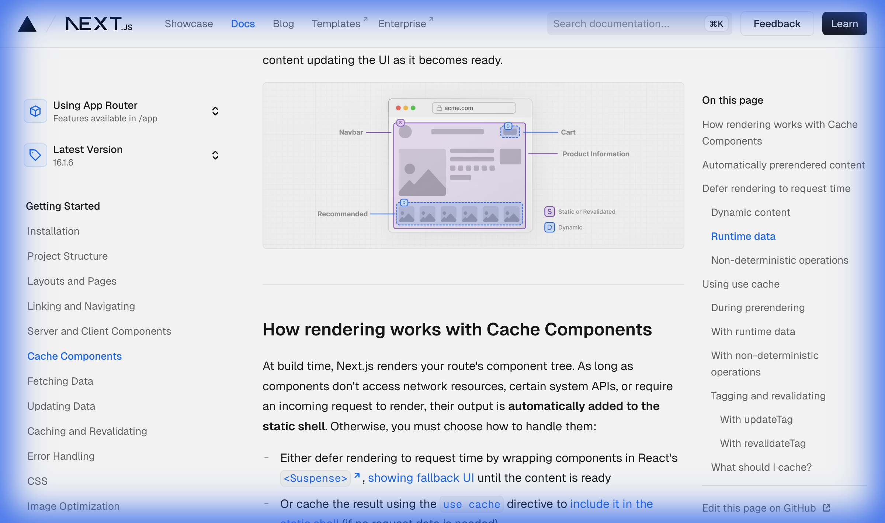
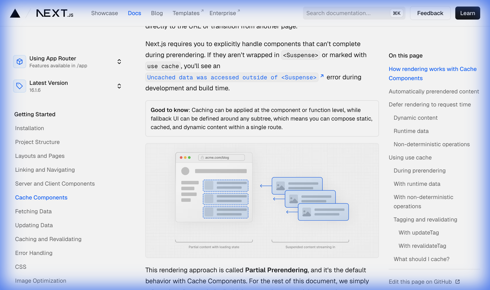

# Next.js Cache Components — Deep Dive!

> **Chủ đề**: Cache Components trong Next.js App Router — Partial Prerendering!
> **Ngôn ngữ**: Tiếng Việt — giải thích cực kỳ chi tiết!
> **Phương châm**: Tự viết lại bằng tay — KHÔNG dùng thư viện!
> **Nguồn**: https://nextjs.org/docs/app/getting-started/cache-components

---

## Mục Lục

1. [§1. Tổng Quan — Cache Components là gì?](#1)
2. [§2. Cách Rendering Hoạt Động](#2)
3. [§3. Automatically Prerendered Content](#3)
4. [§4. Defer Rendering — Suspense & Dynamic Content](#4)
5. [§5. Runtime Data — cookies, headers, searchParams](#5)
6. [§6. Non-deterministic Operations](#6)
7. [§7. "use cache" Directive](#7)
8. [§8. cacheLife — Thời Gian Cache](#8)
9. [§9. cacheTag & Revalidation](#9)
10. [§10. Putting It All Together](#10)
11. [§11. Enabling & Migration](#11)
12. [§12. Tự Viết — Cache Components Engine](#12)
13. [§13. Tổng Kết & Câu Hỏi Luyện Tập](#13)

---

## §1. Tổng Quan — Cache Components là gì?

```
  CACHE COMPONENTS — TỔNG QUAN:
  ┌────────────────────────────────────────────────────────┐
  │                                                        │
  │  VẤN ĐỀ TRUYỀN THỐNG:                                │
  │  ┌──────────────────────────────────────────────────┐  │
  │  │  Static pages: NHANH nhưng data cũ (stale)      │  │
  │  │  Dynamic pages: DATA MỚI nhưng CHẬM             │  │
  │  │  Client-side: Bundle lớn, render chậm           │  │
  │  │                                                  │  │
  │  │  → Phải CHỌN 1 trong 3! Không thể có cả!      │  │
  │  └──────────────────────────────────────────────────┘  │
  │                                                        │
  │  CACHE COMPONENTS GIẢI QUYẾT:                          │
  │  ┌──────────────────────────────────────────────────┐  │
  │  │  MIX static + cached + dynamic TRONG 1 ROUTE!   │  │
  │  │                                                  │  │
  │  │  ┌── Static Shell (prerendered) ──────────┐      │  │
  │  │  │  <header>Our Blog</header>     ← STATIC │      │  │
  │  │  │  <BlogPosts />            ← CACHED      │      │  │
  │  │  │  <Suspense>                              │      │  │
  │  │  │    <UserPrefs /> ← DYNAMIC (stream)     │      │  │
  │  │  │  </Suspense>                             │      │  │
  │  │  └──────────────────────────────────────────┘      │  │
  │  │                                                  │  │
  │  │  → Prerender static shell tại BUILD TIME        │  │
  │  │  → Dynamic parts STREAM khi request             │  │
  │  │  → = Partial Prerendering (PPR)!               │  │
  │  └──────────────────────────────────────────────────┘  │
  │                                                        │
  │  ⚠️ OPT-IN FEATURE! Cần enable trong next.config:    │
  │  cacheComponents: true                                │
  │                                                        │
  └────────────────────────────────────────────────────────┘
```

### 📸 Phân Tích Hình 1 — Static Shell với Dynamic Content



```
  PHÂN TÍCH HÌNH 1 — PRODUCT PAGE:
  ┌────────────────────────────────────────────────────────┐
  │                                                        │
  │  Hình minh họa 1 trang product page trên acme.com     │
  │  với 2 loại nhãn màu:                                 │
  │                                                        │
  │  🟣 S = Static or Revalidated (màu tím)               │
  │  ├── Navbar              → static, render build time  │
  │  ├── Product Information → static hoặc cached         │
  │  └── Background shell    → HTML tĩnh, gửi ngay       │
  │                                                        │
  │  🔵 D = Dynamic (màu xanh dương)                      │
  │  ├── Cart icon           → số lượng items, cần fresh  │
  │  └── Recommended section → personalized, khác mỗi user│
  │                                                        │
  │  Ý NGHĨA:                                             │
  │  ┌──────────────────────────────────────────────────┐  │
  │  │  CÙNG 1 PAGE có thể mix:                        │  │
  │  │  → Static parts (S): prerender → shell → NGAY!  │  │
  │  │  → Dynamic parts (D): stream khi request        │  │
  │  │  → User thấy shell NGAY, dynamic fill vào sau   │  │
  │  │                                                  │  │
  │  │  Phần lớn page = STATIC → load cực nhanh!       │  │
  │  │  Chỉ Cart + Recommended = DYNAMIC               │  │
  │  └──────────────────────────────────────────────────┘  │
  │                                                        │
  │  ĐÂY CHÍNH LÀ PARTIAL PRERENDERING (PPR)!            │
  │  → Navbar, Product Info: có sẵn trong HTML           │
  │  → Cart, Recommended: placeholder → stream in        │
  │                                                        │
  └────────────────────────────────────────────────────────┘
```

---

## §2. Cách Rendering Hoạt Động!

```
  RENDERING FLOW — BUILD TIME:
  ┌────────────────────────────────────────────────────────┐
  │                                                        │
  │  Build time → Next.js render component tree:          │
  │                                                        │
  │  Component CÓ THỂ hoàn thành?                        │
  │  ├── ✅ YES (sync IO, imports, pure compute)          │
  │  │   → TỰ ĐỘNG thêm vào static shell!               │
  │  │                                                    │
  │  ├── ❌ NO (network, DB, request data)                │
  │  │   → BẠN PHẢI chọn 1 trong 2:                     │
  │  │   ├── ① <Suspense> → defer tới request time      │
  │  │   │   → Fallback UI vào static shell              │
  │  │   │   → Content stream khi ready                  │
  │  │   │                                                │
  │  │   └── ② 'use cache' → cache kết quả              │
  │  │       → Cached content VÀO static shell!          │
  │  │       → Revalidate theo cacheLife                 │
  │  │                                                    │
  │  └── ⚠️ KHÔNG handle?                                │
  │      → ERROR: "Uncached data outside <Suspense>"     │
  │                                                        │
  │  DECISION TREE:                                        │
  │  ┌──────────────────────────────────────────────────┐  │
  │  │  Component cần network/DB/request?               │  │
  │  │  ├── NO → Auto prerender (static shell)          │  │
  │  │  └── YES:                                         │  │
  │  │      ├── Data HIẾM thay đổi? → 'use cache'      │  │
  │  │      ├── Data CẦN mới mỗi request? → <Suspense> │  │
  │  │      └── KHÔNG handle? → BUILD ERROR!            │  │
  │  └──────────────────────────────────────────────────┘  │
  │                                                        │
  └────────────────────────────────────────────────────────┘
```

### 📸 Phân Tích Hình 2 — Partial Prerendering & Streaming



```
  PHÂN TÍCH HÌNH 2 — PPR STREAMING FLOW:
  ┌────────────────────────────────────────────────────────┐
  │                                                        │
  │  Hình 2 chia làm 2 phần:                               │
  │                                                        │
  │  ┌── BÊN TRÁI ─────────────────────────────────────┐   │
  │  │  "Partial content with loading state"             │   │
  │  │                                                   │   │
  │  │  Browser hiện trang acme.com/blog:                │   │
  │  │  ┌─────────────────────────────┐                  │   │
  │  │  │  [Avatar] ████████████████  │ ← loaded         │   │
  │  │  │  ┌───────┐ ┌────────────┐  │                  │   │
  │  │  │  │░░░░░░░│ │░░░░░░░░░░░░│  │ ← skeleton!     │   │
  │  │  │  │░░░░░░░│ │░░░░░░░░░░░░│  │                  │   │
  │  │  │  └───────┘ └────────────┘  │                  │   │
  │  │  │  ┌──────────────────────┐  │                  │   │
  │  │  │  │░░░░░ loading ░░░░░░░│  │ ← skeleton!     │   │
  │  │  │  └──────────────────────┘  │                  │   │
  │  │  └─────────────────────────────┘                  │   │
  │  │                                                   │   │
  │  │  → Static shell + fallback UI (skeletons)        │   │
  │  │  → User NGAY LẬP TỨC thấy layout!              │   │
  │  └───────────────────────────────────────────────────┘   │
  │                                                        │
  │  ┌── BÊN PHẢI ─────────────────────────────────────┐   │
  │  │  "Suspended content streaming in"                 │   │
  │  │                                                   │   │
  │  │  Các block content (RSC Payload / HTML)           │   │
  │  │  đang STREAM từ server → browser:                │   │
  │  │                                                   │   │
  │  │  ┌────────────┐                                   │   │
  │  │  │ ████████ ──┼──→ thay thế skeleton 1           │   │
  │  │  └────────────┘                                   │   │
  │  │  ┌────────────┐                                   │   │
  │  │  │ █ ████████ ┼──→ thay thế skeleton 2           │   │
  │  │  └────────────┘                                   │   │
  │  │                                                   │   │
  │  │  → Mỗi <Suspense> boundary resolve ĐỘC LẬP     │   │
  │  │  → Content stream SONG SONG, không block nhau   │   │
  │  └───────────────────────────────────────────────────┘   │
  │                                                        │
  │  FLOW TỔNG THỂ:                                        │
  │  ┌──────────────────────────────────────────────────┐  │
  │  │  BUILD TIME:                                     │  │
  │  │  ① Prerender static shell (HTML + skeletons)    │  │
  │  │                                                  │  │
  │  │  REQUEST TIME:                                   │  │
  │  │  ② Gửi static shell NGAY → user thấy layout    │  │
  │  │  ③ Server resolve dynamic components            │  │
  │  │  ④ Stream RSC Payload → replace skeletons       │  │
  │  │  ⑤ UI hoàn chỉnh!                              │  │
  │  │                                                  │  │
  │  │  Kết quả: FCP CỰC NHANH + dynamic content fresh │  │
  │  └──────────────────────────────────────────────────┘  │
  │                                                        │
  └────────────────────────────────────────────────────────┘
```

---

## §3. Automatically Prerendered Content!

```
  TỰ ĐỘNG PRERENDER — KHI NÀO?
  ┌──────────────────────────────────────────────────┐
  │                                                  │
  │  ✅ Sync file system read (fs.readFileSync)     │
  │  ✅ Module imports (await import())             │
  │  ✅ Pure computations (JSON.parse, .map)        │
  │  ✅ Constants, static data                      │
  │                                                  │
  │  ❌ Network requests (fetch)                    │
  │  ❌ Database queries                            │
  │  ❌ Async file reads (fs.readFile)              │
  │  ❌ Runtime APIs (cookies, headers)             │
  │  ❌ setTimeout, Promise delays                  │
  │  ❌ Non-deterministic (Math.random, Date.now)   │
  └──────────────────────────────────────────────────┘
```

```typescript
// TỰ ĐỘNG prerender — tất cả operations hoàn thành tại build time!
import fs from 'node:fs'

export default async function Page() {
  const content = fs.readFileSync('./config.json', 'utf-8')   // ✅ Sync
  const constants = await import('./constants.json')           // ✅ Import
  const processed = JSON.parse(content).items.map(i => i.value * 2)  // ✅ Pure

  return (
    <div>
      <h1>{constants.appName}</h1>
      <ul>{processed.map((v, i) => <li key={i}>{v}</li>)}</ul>
    </div>
  )
}
// → Toàn bộ page = static shell!
```

---

## §4. Defer Rendering — Suspense & Dynamic Content!

```
  DEFER TO REQUEST TIME — <Suspense>:
  ┌────────────────────────────────────────────────────────┐
  │                                                        │
  │  KHI COMPONENT KHÔNG THỂ PRERENDER:                   │
  │  → Wrap trong <Suspense> với fallback UI              │
  │  → Fallback VÀO static shell                          │
  │  → Content STREAM tại request time                    │
  │                                                        │
  │  SƠ ĐỒ:                                               │
  │  ┌──────────────── Static Shell ──────────────────┐    │
  │  │  <h1>Part of static shell</h1>  ← PRERENDERED  │    │
  │  │                                                 │    │
  │  │  ┌── <Suspense> ────────────────────────────┐  │    │
  │  │  │  <p>Loading..</p>          ← IN SHELL!   │  │    │
  │  │  │  ─── boundary ──────────────────────────  │  │    │
  │  │  │  <DynamicContent />     ← STREAMS LATER  │  │    │
  │  │  │  <div>Sibling</div>     ← ALSO LATER!   │  │    │
  │  │  └──────────────────────────────────────────┘  │    │
  │  └─────────────────────────────────────────────────┘    │
  │                                                        │
  │  💡 TIP: Đặt Suspense CÀ SÁT component càng tốt!    │
  │  → Maximize static shell content                      │
  │  → Multiple Suspense = render SONG SONG!             │
  │                                                        │
  │  ⚠️ Prerendering DỪNG tại fetch!                     │
  │  → Request KHÔNG bắt đầu khi prerender               │
  │  → Code sau fetch KHÔNG thực thi                     │
  └────────────────────────────────────────────────────────┘
```

```typescript
import { Suspense } from 'react'

async function DynamicContent() {
  const data = await fetch('https://api.example.com/data')  // ← STOPS prerender!
  const users = await db.query('SELECT * FROM users')
  return <div>Not in the static shell</div>
}

export default async function Page() {
  return (
    <>
      <h1>Part of the static shell</h1>
      <Suspense fallback={<p>Loading..</p>}>  {/* fallback = IN shell */}
        <DynamicContent />
        <div>Sibling excluded from static shell</div>
      </Suspense>
    </>
  )
}
```

---

## §5. Runtime Data — cookies, headers, searchParams!

```
  RUNTIME DATA — CHỈ CÓ KHI USER REQUEST:
  ┌──────────────────────────────────────────────────┐
  │                                                  │
  │  4 LOẠI RUNTIME DATA:                           │
  │  ① cookies()     → cookie của user              │
  │  ② headers()     → request headers              │
  │  ③ searchParams  → URL query parameters         │
  │  ④ params        → dynamic route params          │
  │     (trừ khi có generateStaticParams)           │
  │                                                  │
  │  ⚠️ Runtime data KHÔNG THỂ cache!              │
  │  → KHÔNG dùng 'use cache' cùng scope           │
  │  → PHẢI wrap trong <Suspense>                   │
  │                                                  │
  │  TRICK: Trích giá trị → truyền vào cached fn   │
  │  ┌──────────────────────────────────────────┐    │
  │  │  <Suspense>                              │    │
  │  │    <ProfileContent />  ← đọc cookies()  │    │
  │  │      └── <CachedContent sessionId={..}>  │    │
  │  │           'use cache'  ← sessionId = key │    │
  │  └──────────────────────────────────────────┘    │
  │                                                  │
  │  connection() — defer KHÔNG cần runtime API     │
  └──────────────────────────────────────────────────┘
```

```typescript
import { cookies } from 'next/headers'
import { Suspense } from 'react'

// ❌ KHÔNG cached — đọc runtime data
async function ProfileContent() {
  const session = (await cookies()).get('session')?.value
  return <CachedContent sessionId={session} />
}

// ✅ CACHED — nhận data qua props (= cache key!)
async function CachedContent({ sessionId }: { sessionId: string }) {
  'use cache'
  const data = await fetchUserData(sessionId)  // sessionId = cache key!
  return <div>{data}</div>
}

export default function Page() {
  return (
    <Suspense fallback={<div>Loading...</div>}>
      <ProfileContent />
    </Suspense>
  )
}
```

---

## §6. Non-deterministic Operations!

```
  NON-DETERMINISTIC — KHÁC MỖI LẦN CHẠY:
  ┌──────────────────────────────────────────────────┐
  │                                                  │
  │  Math.random()         → số ngẫu nhiên          │
  │  Date.now()            → timestamp               │
  │  crypto.randomUUID()   → UUID khác nhau          │
  │  new Date()            → thời gian hiện tại      │
  │                                                  │
  │  2 CÁCH XỬ LÝ:                                  │
  │  ┌─────────────────────────────────────────┐     │
  │  │                                         │     │
  │  │  ① MUỐN KHÁC mỗi request:              │     │
  │  │     await connection()  // defer!       │     │
  │  │     const r = Math.random()             │     │
  │  │     → Wrap trong <Suspense>            │     │
  │  │                                         │     │
  │  │  ② MUỐN GIỐNG cho mọi request:         │     │
  │  │     'use cache'                         │     │
  │  │     const r = Math.random()             │     │
  │  │     → Execute 1 lần, cache kết quả    │     │
  │  └─────────────────────────────────────────┘     │
  └──────────────────────────────────────────────────┘
```

---

## §7. "use cache" Directive!

```
  "use cache" — CACHE KẾT QUẢ:
  ┌────────────────────────────────────────────────────────┐
  │                                                        │
  │  CÁCH DÙNG:                                            │
  │  → Đặt 'use cache' ở đầu function/component/file     │
  │  → Cache return value của async functions              │
  │  → Arguments = tự động thành CACHE KEY!               │
  │                                                        │
  │  3 CẤP ĐỘ:                                            │
  │  ┌──────────────────────────────────────────────────┐  │
  │  │                                                  │  │
  │  │  ① FUNCTION level:                               │  │
  │  │  async function getData(id) {                    │  │
  │  │    'use cache'                                   │  │
  │  │    return await fetch(...)  // id = cache key!  │  │
  │  │  }                                               │  │
  │  │                                                  │  │
  │  │  ② COMPONENT level:                              │  │
  │  │  async function BlogPosts() {                    │  │
  │  │    'use cache'                                   │  │
  │  │    cacheLife('hours')                            │  │
  │  │    return <div>...</div>                         │  │
  │  │  }                                               │  │
  │  │                                                  │  │
  │  │  ③ FILE level (đầu file):                        │  │
  │  │  'use cache'                                     │  │
  │  │  // Toàn bộ exports = cached!                   │  │
  │  └──────────────────────────────────────────────────┘  │
  │                                                        │
  │  REVALIDATION — 2 CÁCH:                                │
  │  ① cacheLife  → tự động hết hạn theo thời gian       │
  │  ② cacheTag + revalidateTag/updateTag → on-demand     │
  │                                                        │
  └────────────────────────────────────────────────────────┘
```

---

## §8. cacheLife — Thời Gian Cache!

```
  cacheLife — KIỂM SOÁT THỜI GIAN CACHE:
  ┌──────────────────────────────────────────────────┐
  │                                                  │
  │  PRESET PROFILES:                                │
  │  ┌──────────┬──────────────────────────────┐     │
  │  │ Profile  │ Ý nghĩa                     │     │
  │  ├──────────┼──────────────────────────────┤     │
  │  │ 'hours'  │ Cache trong vài giờ         │     │
  │  │ 'days'   │ Cache trong vài ngày        │     │
  │  │ 'weeks'  │ Cache trong vài tuần        │     │
  │  │ 'max'    │ Cache lâu nhất có thể      │     │
  │  └──────────┴──────────────────────────────┘     │
  │                                                  │
  │  CUSTOM CONFIG:                                  │
  │  cacheLife({                                     │
  │    stale: 3600,      // 1h → considered stale   │
  │    revalidate: 7200, // 2h → revalidated        │
  │    expire: 86400,    // 1d → expired hoàn toàn  │
  │  })                                              │
  │                                                  │
  │  TIMELINE:                                       │
  │  ──┬─────────┬───────────────┬───────────┬──     │
  │    0      3600s            7200s       86400s     │
  │    │ FRESH   │ STALE        │ REVALIDATE│ EXPIRE │
  │    │ serve   │ serve stale  │ refetch   │ delete │
  │    │ ngay    │ while reval  │ background│ cache  │
  └──────────────────────────────────────────────────┘
```

```typescript
import { cacheLife } from 'next/cache'

export default async function Page() {
  'use cache'
  cacheLife('hours')  // Hoặc custom object

  const users = await db.query('SELECT * FROM users')
  return <ul>{users.map(u => <li key={u.id}>{u.name}</li>)}</ul>
}
```

---

## §9. cacheTag & Revalidation!

```
  TAGGING & REVALIDATION:
  ┌────────────────────────────────────────────────────────┐
  │                                                        │
  │  CÁCH HOẠT ĐỘNG:                                       │
  │  ① cacheTag('cart')  → gán TAG cho cached data        │
  │  ② Khi data thay đổi → invalidate bằng tag           │
  │                                                        │
  │  2 CÁCH INVALIDATE:                                    │
  │  ┌──────────────────┬──────────────────────────────┐   │
  │  │ updateTag        │ revalidateTag                │   │
  │  ├──────────────────┼──────────────────────────────┤   │
  │  │ Expire + refresh │ Stale-while-revalidate       │   │
  │  │ NGAY trong cùng  │ Serve cũ, refresh background │   │
  │  │ request          │                              │   │
  │  │ Real-time data   │ Eventually consistent        │   │
  │  │ VD: Cart update  │ VD: Blog posts               │   │
  │  └──────────────────┴──────────────────────────────┘   │
  │                                                        │
  └────────────────────────────────────────────────────────┘
```

```typescript
import { cacheTag, updateTag } from "next/cache";

// CACHED function với tag
export async function getCart() {
  "use cache";
  cacheTag("cart"); // Gán tag 'cart'
  // fetch data...
}

// Server Action: update + invalidate NGAY
export async function updateCart(itemId: string) {
  "use server";
  // write data...
  updateTag("cart"); // Expire + refresh ngay!
}
```

---

## §10. Putting It All Together!

```
  COMPLETE EXAMPLE — 3 LOẠI CONTENT TRONG 1 PAGE:
  ┌────────────────────────────────────────────────────────┐
  │                                                        │
  │  ┌── Static Shell (prerendered tại build) ──────────┐  │
  │  │                                                  │  │
  │  │  ┌── STATIC ─────────────────────────────────┐   │  │
  │  │  │  <header>Our Blog</header>                │   │  │
  │  │  │  <nav>Home | About</nav>                  │   │  │
  │  │  │  → Pure HTML, auto prerender             │   │  │
  │  │  └──────────────────────────────────────────┘   │  │
  │  │                                                  │  │
  │  │  ┌── CACHED ('use cache') ───────────────────┐   │  │
  │  │  │  <BlogPosts />                            │   │  │
  │  │  │  'use cache' + cacheLife('hours')         │   │  │
  │  │  │  → Fetch API → cache 1h → static shell  │   │  │
  │  │  │  → SAME cho tất cả users!               │   │  │
  │  │  └──────────────────────────────────────────┘   │  │
  │  │                                                  │  │
  │  │  ┌── DYNAMIC (<Suspense>) ────────────────────┐  │  │
  │  │  │  fallback: <p>Loading prefs...</p>  ← SHELL │  │  │
  │  │  │  ──── boundary ─────────────────────────── │  │  │
  │  │  │  <UserPreferences />                      │  │  │
  │  │  │  → cookies()  → KHÁC mỗi user           │  │  │
  │  │  │  → Stream at request time                │  │  │
  │  │  └──────────────────────────────────────────┘  │  │
  │  │                                                  │  │
  │  └──────────────────────────────────────────────────┘  │
  │                                                        │
  │  User visit → NGAY thấy header + blog posts!         │
  │  → Chỉ UserPreferences chờ stream (nhỏ, nhanh!)    │
  │                                                        │
  └────────────────────────────────────────────────────────┘
```

---

## §11. Enabling & Migration!

```
  ENABLING — next.config.ts:
  ┌──────────────────────────────────────────────────┐
  │  const nextConfig = {                            │
  │    cacheComponents: true,  // ← Bật PPR!       │
  │  }                                               │
  └──────────────────────────────────────────────────┘

  ACTIVITY NAVIGATION:
  ┌──────────────────────────────────────────────────┐
  │  Khi bật, Next.js dùng React <Activity>:        │
  │  → Navigate away: mode = "hidden"               │
  │  → State PRESERVED (form inputs, expanded)      │
  │  → Navigate back: state INTACT!                 │
  │  → Effects cleanup khi hidden, recreate khi     │
  │    visible lại                                  │
  │  → Heuristic: giữ vài route gần nhất          │
  └──────────────────────────────────────────────────┘

  MIGRATION — ROUTE SEGMENT CONFIGS:
  ┌──────────────────────┬──────────────────────────┐
  │ CŨ                   │ MỚI                      │
  ├──────────────────────┼──────────────────────────┤
  │ dynamic='force-      │ Xoá! Pages dynamic      │
  │ dynamic'             │ by default               │
  ├──────────────────────┼──────────────────────────┤
  │ dynamic='force-      │ 'use cache' +            │
  │ static'              │ cacheLife('max')          │
  ├──────────────────────┼──────────────────────────┤
  │ revalidate=3600      │ 'use cache' +            │
  │                      │ cacheLife('hours')        │
  ├──────────────────────┼──────────────────────────┤
  │ fetchCache=          │ Xoá! 'use cache' tự     │
  │ 'force-cache'        │ cache mọi fetch          │
  ├──────────────────────┼──────────────────────────┤
  │ runtime='edge'       │ ❌ KHÔNG hỗ trợ!        │
  │                      │ Phải dùng Node.js        │
  └──────────────────────┴──────────────────────────┘
```

---

## §12. Tự Viết — Cache Components Engine!

> **Mục tiêu**: Mô phỏng prerendering, caching, streaming — KHÔNG dùng thư viện!

```javascript
var CacheComponentsEngine = (function () {
  // 1. CACHE STORE
  var cache = {};
  var tags = {}; // tag → [cacheKeys]

  // 2. COMPONENT REGISTRY
  var components = {
    Header: {
      ops: ["pure"],
      render: function () {
        return "<header>Our Blog</header>";
      },
    },
    BlogPosts: {
      ops: ["fetch"],
      directive: "use cache",
      cacheLife: { stale: 3600, revalidate: 7200, expire: 86400 },
      cacheTag: "posts",
      render: function () {
        return "<section><h2>Latest Posts</h2><li>Post 1</li><li>Post 2</li></section>";
      },
    },
    UserPrefs: {
      ops: ["cookies"],
      runtime: true,
      render: function (ctx) {
        return "<aside>Theme: " + (ctx.cookies.theme || "light") + "</aside>";
      },
    },
    DynamicContent: {
      ops: ["fetch", "db", "timeout"],
      render: function () {
        return "<div>Dynamic data loaded!</div>";
      },
    },
    RandomStuff: {
      ops: ["Math.random", "Date.now"],
      render: function () {
        return "<p>" + Math.random().toFixed(4) + " at " + Date.now() + "</p>";
      },
    },
  };

  // 3. PRERENDER ENGINE
  function canPrerender(comp) {
    var safeOps = ["pure", "sync-fs", "import", "compute"];
    for (var i = 0; i < comp.ops.length; i++) {
      var found = false;
      for (var j = 0; j < safeOps.length; j++) {
        if (comp.ops[i] === safeOps[j]) {
          found = true;
          break;
        }
      }
      if (!found) return false;
    }
    return true;
  }

  function prerender(name) {
    var comp = components[name];
    if (!comp) return { error: "404" };

    console.log("\n📦 Prerendering <" + name + ">...");
    console.log("   Operations: " + comp.ops.join(", "));

    // Auto prerender?
    if (canPrerender(comp)) {
      var html = comp.render({});
      console.log("   ✅ AUTO PRERENDER → static shell!");
      return { type: "static", html: html };
    }

    // Has 'use cache'?
    if (comp.directive === "use cache") {
      var key = name + ":default";
      if (cache[key]) {
        console.log("   ⚡ FROM CACHE!");
        return { type: "cached", html: cache[key].html };
      }
      var rendered = comp.render({});
      cache[key] = {
        html: rendered,
        createdAt: Date.now(),
        life: comp.cacheLife,
      };
      if (comp.cacheTag) {
        if (!tags[comp.cacheTag]) tags[comp.cacheTag] = [];
        tags[comp.cacheTag].push(key);
      }
      console.log("   📦 CACHED (use cache) → static shell!");
      console.log("   Tag: " + (comp.cacheTag || "none"));
      console.log("   Life: stale=" + comp.cacheLife.stale + "s");
      return { type: "cached", html: rendered };
    }

    // Runtime data?
    if (comp.runtime) {
      console.log("   ⏳ RUNTIME DATA → <Suspense> required!");
      return { type: "dynamic", fallback: "<p>Loading...</p>" };
    }

    // Async/dynamic without handling
    console.log("   ⚠️ CANNOT prerender! Options:");
    console.log("     → Wrap in <Suspense> for streaming");
    console.log('     → Add "use cache" to cache result');
    return { type: "error", message: "Uncached data outside <Suspense>!" };
  }

  // 4. REVALIDATION
  function updateTagFn(tag) {
    console.log('\n🔄 updateTag("' + tag + '") — expire + refresh NOW');
    var keys = tags[tag] || [];
    for (var i = 0; i < keys.length; i++) {
      delete cache[keys[i]];
      console.log("   Expired: " + keys[i]);
    }
  }

  function revalidateTagFn(tag) {
    console.log('\n🔄 revalidateTag("' + tag + '") — stale-while-revalidate');
    var keys = tags[tag] || [];
    for (var i = 0; i < keys.length; i++) {
      console.log("   Marked stale: " + keys[i] + " (serve old, refresh bg)");
    }
  }

  // 5. DEMO
  function demo() {
    console.log("╔══════════════════════════════════════════╗");
    console.log("║  CACHE COMPONENTS ENGINE — DEMO          ║");
    console.log("╚══════════════════════════════════════════╝");

    console.log("\n━━━ BUILD TIME: PRERENDERING ━━━");
    var shell = [];
    var names = [
      "Header",
      "BlogPosts",
      "UserPrefs",
      "DynamicContent",
      "RandomStuff",
    ];
    for (var i = 0; i < names.length; i++) {
      var result = prerender(names[i]);
      shell.push({ name: names[i], result: result });
    }

    console.log("\n━━━ STATIC SHELL ━━━");
    for (var j = 0; j < shell.length; j++) {
      var s = shell[j];
      if (s.result.type === "static" || s.result.type === "cached") {
        console.log("  ✅ " + s.name + ": " + s.result.html.substring(0, 50));
      } else if (s.result.type === "dynamic") {
        console.log(
          "  ⏳ " + s.name + ": " + s.result.fallback + " (stream later)",
        );
      } else {
        console.log("  ❌ " + s.name + ": " + s.result.message);
      }
    }

    console.log("\n━━━ REVALIDATION ━━━");
    updateTagFn("posts");
    prerender("BlogPosts"); // Re-cache

    console.log("\n━━━ CACHE STATE ━━━");
    console.log(JSON.stringify(Object.keys(cache)));
  }

  return {
    prerender: prerender,
    updateTag: updateTagFn,
    revalidateTag: revalidateTagFn,
    demo: demo,
  };
})();
// Chạy thử: CacheComponentsEngine.demo();
```

---

## §13. Tổng Kết & Câu Hỏi Luyện Tập!

```
  TỔNG KẾT:
  ┌────────────────────────────────────────────────────────┐
  │  ① Cache Components = mix static + cached + dynamic   │
  │  ② Opt-in: cacheComponents: true trong next.config    │
  │  ③ Auto prerender: sync IO, imports, pure compute    │
  │  ④ <Suspense> = defer tới request time + fallback    │
  │  ⑤ 'use cache' = cache result, args = cache key      │
  │  ⑥ cacheLife = stale / revalidate / expire           │
  │  ⑦ cacheTag + updateTag (instant) / revalidateTag    │
  │  ⑧ Runtime data KHÔNG THỂ cache, PHẢI <Suspense>    │
  │  ⑨ Activity: preserve state khi navigate             │
  │  ⑩ Edge runtime KHÔNG hỗ trợ!                       │
  └────────────────────────────────────────────────────────┘
```

### Câu Hỏi Luyện Tập

**Câu 1**: Cache Components giải quyết vấn đề gì? So sánh với cách truyền thống.

<details><summary>Đáp án</summary>

Truyền thống phải CHỌN: static (nhanh, cũ) vs dynamic (chậm, mới). Cache Components cho phép **MIX cả 3** trong 1 route: static content (auto prerender) + cached dynamic ('use cache') + streaming dynamic (`<Suspense>`). Kết quả: **Partial Prerendering** — static shell instant, dynamic parts stream.

</details>

---

**Câu 2**: Component nào tự động prerender? Nêu 3 ví dụ safe và 3 unsafe operations.

<details><summary>Đáp án</summary>

**Safe (auto prerender)**: ① `fs.readFileSync` (sync IO) ② `await import()` (module) ③ `JSON.parse().map()` (pure compute)

**Unsafe (cần handle)**: ① `fetch()` (network) ② `cookies()` (runtime) ③ `Math.random()` (non-deterministic)

</details>

---

**Câu 3**: `<Suspense>` vs `'use cache'` — khi nào dùng cái nào?

<details><summary>Đáp án</summary>

|              | `<Suspense>`                             | `'use cache'`                |
| ------------ | ---------------------------------------- | ---------------------------- |
| Khi nào      | Data CẦN MỚI mỗi request                 | Data HIẾM thay đổi           |
| Output       | Fallback → static shell, content streams | Cached result → static shell |
| VD           | User preferences, personalized           | Blog posts, product catalog  |
| Runtime data | ✅ Hỗ trợ                                | ❌ KHÔNG cùng scope          |

</details>

---

**Câu 4**: `cacheLife` hoạt động thế nào? Giải thích stale/revalidate/expire.

<details><summary>Đáp án</summary>

- **stale** (3600s): Sau thời gian này, data = stale. Vẫn serve nhưng đánh dấu cần refresh
- **revalidate** (7200s): Bắt đầu revalidate background — fetch mới trong khi serve cũ
- **expire** (86400s): Xoá cache hoàn toàn — request tiếp theo phải re-fetch

Timeline: `[FRESH → serve ngay] → [STALE → serve + mark] → [REVALIDATE → bg refresh] → [EXPIRE → delete]`

</details>

---

**Câu 5**: `updateTag` khác `revalidateTag` thế nào?

<details><summary>Đáp án</summary>

|             | `updateTag`                                  | `revalidateTag`                               |
| ----------- | -------------------------------------------- | --------------------------------------------- |
| Hành vi     | Expire + refresh **NGAY** trong cùng request | Stale-while-revalidate (serve cũ, refresh bg) |
| Use case    | Cart update (real-time!)                     | Blog posts (eventual consistency OK)          |
| Consistency | **Immediate**                                | **Eventual**                                  |

</details>

---

**Câu 6**: Runtime data + cache — cách kết hợp?

<details><summary>Đáp án</summary>

KHÔNG dùng cùng scope! Trick: **tách ra 2 components**:

1. Component A (KHÔNG cache): đọc `cookies()` → extract giá trị
2. Component B (`'use cache'`): nhận giá trị qua **props** → props = cache key!

```
<Suspense>
  <A> → cookies() → sessionId
    <B sessionId={sessionId}> → 'use cache' → fetch(sessionId)
</Suspense>
```

</details>

---

**Câu 7**: Nêu 5 route segment configs cũ và cách migrate sang Cache Components.

<details><summary>Đáp án</summary>

| Cũ                         | Mới                                  |
| -------------------------- | ------------------------------------ |
| `dynamic='force-dynamic'`  | Xoá! Default = dynamic               |
| `dynamic='force-static'`   | `'use cache'` + `cacheLife('max')`   |
| `revalidate=3600`          | `'use cache'` + `cacheLife('hours')` |
| `fetchCache='force-cache'` | `'use cache'` (auto cache fetches)   |
| `runtime='edge'`           | ❌ KHÔNG hỗ trợ — phải Node.js!      |

</details>
