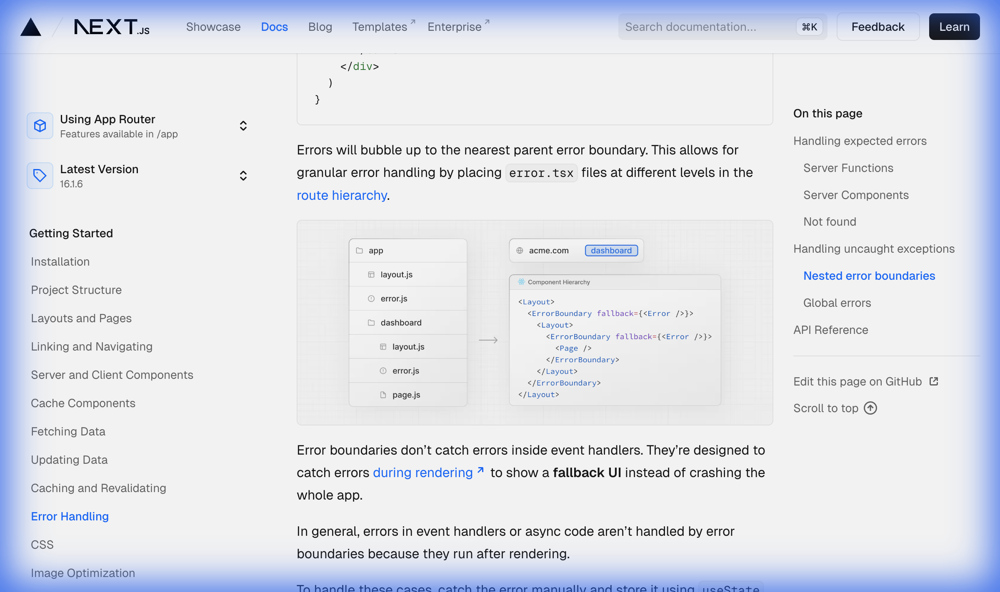

# Next.js Error Handling — Deep Dive!

> **Chủ đề**: Error Handling trong Next.js App Router!
> **Ngôn ngữ**: Tiếng Việt — giải thích cực kỳ chi tiết!
> **Phương châm**: Tự viết lại bằng tay — KHÔNG dùng thư viện!
> **Nguồn**: https://nextjs.org/docs/app/getting-started/error-handling

---

## Mục Lục

1. [§1. Tổng Quan — 2 Loại Errors](#1)
2. [§2. Expected Errors — Server Functions (useActionState)](#2)
3. [§3. Expected Errors — Server Components](#3)
4. [§4. Expected Errors — Not Found (404)](#4)
5. [§5. Uncaught Exceptions — error.js Boundary](#5)
6. [§6. Nested Error Boundaries — Phân Tích Sơ Đồ](#6)
7. [§7. Event Handler Errors — useState/useReducer](#7)
8. [§8. startTransition — Errors Bubble Up](#8)
9. [§9. Global Errors — global-error.js](#9)
10. [§10. Sơ Đồ Tổng Hợp — Error Handling Architecture](#10)
11. [§11. Tự Viết — Error Handling Engine](#11)
12. [§12. Tổng Kết & Câu Hỏi Luyện Tập](#12)

---

## §1. Tổng Quan — 2 Loại Errors!

```
  ERROR HANDLING — PHÂN LOẠI:
  ┌────────────────────────────────────────────────────────┐
  │                                                        │
  │  Next.js chia errors thành 2 LOẠI:                    │
  │                                                        │
  │  ① EXPECTED ERRORS (Lỗi dự kiến):                     │
  │  ┌──────────────────────────────────────────────────┐  │
  │  │  → Xảy ra trong HOẠT ĐỘNG BÌNH THƯỜNG           │  │
  │  │  → Form validation thất bại                     │  │
  │  │  → API request failed                           │  │
  │  │  → Resource not found (404)                     │  │
  │  │                                                  │  │
  │  │  CÁCH XỬ LÝ:                                    │  │
  │  │  ✅ Return value (KHÔNG throw!)                  │  │
  │  │  ✅ Conditional rendering                        │  │
  │  │  ✅ notFound() function                          │  │
  │  └──────────────────────────────────────────────────┘  │
  │                                                        │
  │  ② UNCAUGHT EXCEPTIONS (Lỗi bất ngờ):                 │
  │  ┌──────────────────────────────────────────────────┐  │
  │  │  → BUGS — không nên xảy ra!                     │  │
  │  │  → Null reference errors                        │  │
  │  │  → Network failures                             │  │
  │  │  → Component crash                              │  │
  │  │                                                  │  │
  │  │  CÁCH XỬ LÝ:                                    │  │
  │  │  ✅ throw Error → Error Boundary bắt!           │  │
  │  │  ✅ error.js file                                │  │
  │  │  ✅ global-error.js (root level)                 │  │
  │  └──────────────────────────────────────────────────┘  │
  │                                                        │
  │  QUY TẮC VÀNG:                                         │
  │  ┌──────────────────────────────────────────────────┐  │
  │  │  Expected → return { message: '...' }           │  │
  │  │  Unexpected → throw new Error('...')             │  │
  │  │  KHÔNG dùng try/catch cho expected errors!      │  │
  │  └──────────────────────────────────────────────────┘  │
  │                                                        │
  └────────────────────────────────────────────────────────┘
```

---

## §2. Expected Errors — Server Functions!

```
  SERVER FUNCTIONS + useActionState:
  ┌────────────────────────────────────────────────────────┐
  │                                                        │
  │  NGUYÊN TẮC: Model errors AS RETURN VALUES!            │
  │  → KHÔNG throw! KHÔNG try/catch!                      │
  │  → Return object { message: 'error message' }        │
  │                                                        │
  │  FLOW:                                                 │
  │  ┌──────────────────────────────────────────────────┐  │
  │  │  Client        Server Function        Client     │  │
  │  │  (Form)  ──→   createPost()     ──→   (State)   │  │
  │  │                                                  │  │
  │  │  ① Submit form                                   │  │
  │  │  ② Server xử lý                                 │  │
  │  │  ③ Nếu lỗi → return { message: '...' }         │  │
  │  │  ④ useActionState nhận state mới                │  │
  │  │  ⑤ Hiển thị error message trên UI              │  │
  │  └──────────────────────────────────────────────────┘  │
  │                                                        │
  └────────────────────────────────────────────────────────┘
```

```typescript
// actions.ts — Server Function
"use server";

export async function createPost(prevState: any, formData: FormData) {
  const title = formData.get("title");
  const content = formData.get("content");

  const res = await fetch("https://api.vercel.app/posts", {
    method: "POST",
    body: { title, content },
  });
  const json = await res.json();

  if (!res.ok) {
    return { message: "Failed to create post" }; // ← RETURN, không THROW!
  }
}
```

```tsx
// Form.tsx — Client Component
"use client";
import { useActionState } from "react";
import { createPost } from "@/app/actions";

const initialState = { message: "" };

export function Form() {
  const [state, formAction, pending] = useActionState(createPost, initialState);

  return (
    <form action={formAction}>
      <label htmlFor="title">Title</label>
      <input type="text" id="title" name="title" required />

      <label htmlFor="content">Content</label>
      <textarea id="content" name="content" required />

      {/* Hiển thị error message */}
      {state?.message && <p aria-live="polite">{state.message}</p>}

      <button disabled={pending}>Create Post</button>
    </form>
  );
}
```

```
  useActionState — CHI TIẾT:
  ┌────────────────────────────────────────────────────────┐
  │                                                        │
  │  const [state, formAction, pending] = useActionState(  │
  │    createPost,     ← Server Function                  │
  │    initialState    ← { message: '' }                  │
  │  )                                                     │
  │                                                        │
  │  state      → chứa return value từ Server Function    │
  │  formAction → wrapped action cho <form>               │
  │  pending    → boolean, đang xử lý?                    │
  │                                                        │
  │  ✅ aria-live="polite" → screen reader đọc lỗi!      │
  │  ✅ pending → disable button khi đang submit          │
  │                                                        │
  └────────────────────────────────────────────────────────┘
```

---

## §3. Expected Errors — Server Components!

```
  SERVER COMPONENTS — CONDITIONAL RENDERING:
  ┌────────────────────────────────────────────────────────┐
  │                                                        │
  │  Fetch data → check response → render error HOẶC UI  │
  │                                                        │
  │  export default async function Page() {                │
  │    const res = await fetch('https://...')               │
  │    const data = await res.json()                       │
  │                                                        │
  │    if (!res.ok) {                                       │
  │      return 'There was an error.'  ← trả về string!  │
  │    }                                                   │
  │                                                        │
  │    return '...'  ← render bình thường                 │
  │  }                                                     │
  │                                                        │
  │  ✅ Đơn giản, trực tiếp                               │
  │  ✅ Có thể redirect() thay vì return string           │
  │  ✅ Không cần Error Boundary                           │
  │                                                        │
  └────────────────────────────────────────────────────────┘
```

---

## §4. Expected Errors — Not Found (404)!

```
  notFound() + not-found.js:
  ┌────────────────────────────────────────────────────────┐
  │                                                        │
  │  ① Gọi notFound() trong route segment:                │
  │  ┌──────────────────────────────────────────────────┐  │
  │  │  import { getPostBySlug } from '@/lib/posts'     │  │
  │  │                                                  │  │
  │  │  export default async function Page({ params }) { │  │
  │  │    const { slug } = await params                  │  │
  │  │    const post = getPostBySlug(slug)               │  │
  │  │                                                  │  │
  │  │    if (!post) {                                   │  │
  │  │      notFound()  ← THROW 404!                    │  │
  │  │    }                                              │  │
  │  │                                                  │  │
  │  │    return <div>{post.title}</div>                  │  │
  │  │  }                                                │  │
  │  └──────────────────────────────────────────────────┘  │
  │                                                        │
  │  ② Tạo not-found.js để customize 404 UI:              │
  │  ┌──────────────────────────────────────────────────┐  │
  │  │  // app/not-found.tsx                             │  │
  │  │  export default function NotFound() {             │  │
  │  │    return <div>404 - Page Not Found</div>         │  │
  │  │  }                                                │  │
  │  └──────────────────────────────────────────────────┘  │
  │                                                        │
  └────────────────────────────────────────────────────────┘
```

---

## §5. Uncaught Exceptions — error.js Boundary!

```
  error.js — ERROR BOUNDARY:
  ┌────────────────────────────────────────────────────────┐
  │                                                        │
  │  ⚠️ error.js PHẢI là Client Component!                 │
  │  → Error boundaries = React feature                   │
  │  → Chỉ chạy ở client side                            │
  │                                                        │
  │  NHẬN 2 PROPS:                                         │
  │  ┌──────────────────────────────────────────────────┐  │
  │  │  error: Error & { digest?: string }              │  │
  │  │  → Error object + digest (server error ID)       │  │
  │  │                                                  │  │
  │  │  reset: () => void                                │  │
  │  │  → Gọi để thử re-render segment!               │  │
  │  │  → Recovery mechanism!                           │  │
  │  └──────────────────────────────────────────────────┘  │
  │                                                        │
  │  CÁCH TẠO:                                             │
  │  → Thêm error.js vào route segment                   │
  │  → Export React component                             │
  │  → Next.js tự wrap trong ErrorBoundary!               │
  │                                                        │
  └────────────────────────────────────────────────────────┘
```

```tsx
// app/dashboard/error.tsx
"use client"; // ⚠️ BẮT BUỘC — Error boundaries must be Client Components

import { useEffect } from "react";

export default function ErrorPage({
  error,
  reset,
}: {
  error: Error & { digest?: string };
  reset: () => void;
}) {
  useEffect(() => {
    // Log error to reporting service (Sentry, etc.)
    console.error(error);
  }, [error]);

  return (
    <div>
      <h2>Something went wrong!</h2>
      <button
        onClick={
          // Attempt recovery — re-render the segment
          () => reset()
        }
      >
        Try again
      </button>
    </div>
  );
}
```

---

## §6. Nested Error Boundaries — Phân Tích Sơ Đồ!

### Hình 1: Nested Error Component Hierarchy

> **Nguồn**: Trang docs Next.js — phần "Nested error boundaries"
> **File ảnh**: `images/nextjs-error-nested-boundaries.png`



```
  PHÂN TÍCH SƠ ĐỒ — NESTED ERROR BOUNDARIES:
  ┌────────────────────────────────────────────────────────┐
  │                                                        │
  │  Sơ đồ gồm 2 PHẦN chính:                             │
  │                                                        │
  │  ① BÊN TRÁI — File Structure:                         │
  │  ┌──────────────────────────────────────────────────┐  │
  │  │  📁 app/                                          │  │
  │  │  ├── 📄 layout.js                                │  │
  │  │  ├── ⚠️ error.js        ← Error Boundary #1    │  │
  │  │  ├── 📁 dashboard/                               │  │
  │  │  │   ├── 📄 layout.js                            │  │
  │  │  │   ├── ⚠️ error.js    ← Error Boundary #2    │  │
  │  │  │   └── 📄 page.js     ← Có thể throw error   │  │
  │  └──────────────────────────────────────────────────┘  │
  │                                                        │
  │  ② BÊN PHẢI — Component Hierarchy:                    │
  │  ┌──────────────────────────────────────────────────┐  │
  │  │  <Layout>                    ← app/layout.js     │  │
  │  │    <ErrorBoundary             ← app/error.js     │  │
  │  │      fallback={<Error />}>                       │  │
  │  │      <Layout>                 ← dashboard/layout │  │
  │  │        <ErrorBoundary         ← dashboard/error  │  │
  │  │          fallback={<Error />}>                    │  │
  │  │          <Page />             ← dashboard/page   │  │
  │  │        </ErrorBoundary>                           │  │
  │  │      </Layout>                                    │  │
  │  │    </ErrorBoundary>                               │  │
  │  │  </Layout>                                        │  │
  │  └──────────────────────────────────────────────────┘  │
  │                                                        │
  │  NGUYÊN TẮC HOẠT ĐỘNG:                                │
  │  ┌──────────────────────────────────────────────────┐  │
  │  │                                                  │  │
  │  │  Error trong Page ──→ bubble UP!                 │  │
  │  │       │                                          │  │
  │  │       ▼                                          │  │
  │  │  dashboard/error.js BẮT? ──→ YES → Hiển thị!   │  │
  │  │       │                                          │  │
  │  │       ▼ NO (không có hoặc re-throw)              │  │
  │  │  app/error.js BẮT? ──→ YES → Hiển thị!         │  │
  │  │       │                                          │  │
  │  │       ▼ NO                                       │  │
  │  │  global-error.js BẮT!                            │  │
  │  │                                                  │  │
  │  │  → Errors BUBBLE UP to nearest parent boundary! │  │
  │  │  → GRANULAR error handling!                     │  │
  │  │  → Chỉ phần bị lỗi hiện fallback UI            │  │
  │  │  → Phần còn lại VẪN HOẠT ĐỘNG!                 │  │
  │  └──────────────────────────────────────────────────┘  │
  │                                                        │
  │  ⚠️ LƯU Ý QUAN TRỌNG:                                │
  │  → error.js KHÔNG bắt lỗi của layout.js CÙNG cấp!   │
  │  → Vì ErrorBoundary wrap BÊN TRONG Layout             │
  │  → Muốn bắt lỗi layout → error.js ở CẤP CHA!       │
  │                                                        │
  └────────────────────────────────────────────────────────┘
```

---

## §7. Event Handler Errors — useState!

```
  EVENT HANDLER ERRORS — KHÔNG BỊ BOUNDARY BẮT:
  ┌────────────────────────────────────────────────────────┐
  │                                                        │
  │  ⚠️ Error Boundaries KHÔNG bắt:                        │
  │  → Event handler errors (onClick, onChange)            │
  │  → Async code errors                                  │
  │  → Vì chúng chạy SAU rendering!                      │
  │                                                        │
  │  GIẢI PHÁP: try/catch + useState!                      │
  │                                                        │
  └────────────────────────────────────────────────────────┘
```

```tsx
"use client";
import { useState } from "react";

export function Button() {
  const [error, setError] = useState(null);

  const handleClick = () => {
    try {
      // work that might fail
      throw new Error("Exception");
    } catch (reason) {
      setError(reason); // ← Lưu error vào state
    }
  };

  if (error) {
    /* render fallback UI */
  }

  return (
    <button type="button" onClick={handleClick}>
      Click me
    </button>
  );
}
```

---

## §8. startTransition — Errors Bubble Up!

```
  startTransition — NGOẠI LỆ ĐẶC BIỆT:
  ┌────────────────────────────────────────────────────────┐
  │                                                        │
  │  Unhandled errors trong startTransition                │
  │  → SẼ bubble up tới Error Boundary!                   │
  │  → Khác với event handlers thông thường!              │
  │                                                        │
  │  Đây là NGOẠI LỆ duy nhất cho event errors!           │
  │                                                        │
  └────────────────────────────────────────────────────────┘
```

```tsx
"use client";
import { useTransition } from "react";

export function Button() {
  const [pending, startTransition] = useTransition();

  const handleClick = () =>
    startTransition(() => {
      throw new Error("Exception");
      // → Error NÀY sẽ bubble up tới Error Boundary!
      // → Khác với throw bình thường trong onClick!
    });

  return (
    <button type="button" onClick={handleClick}>
      Click me
    </button>
  );
}
```

---

## §9. Global Errors — global-error.js!

```
  global-error.js — ROOT LEVEL ERROR BOUNDARY:
  ┌────────────────────────────────────────────────────────┐
  │                                                        │
  │  Bắt lỗi ở ROOT LAYOUT — cấp cao nhất!               │
  │                                                        │
  │  ĐẶC BIỆT:                                            │
  │  ┌──────────────────────────────────────────────────┐  │
  │  │  ⚠️ PHẢI define <html> và <body> tags!           │  │
  │  │  → Vì nó THAY THẾ root layout khi active!       │  │
  │  │  → Root layout KHÔNG render khi có global error! │  │
  │  │                                                  │  │
  │  │  ⚠️ PHẢI là 'use client'!                        │  │
  │  │  ⚠️ Ít khi cần dùng (less common)               │  │
  │  └──────────────────────────────────────────────────┘  │
  │                                                        │
  └────────────────────────────────────────────────────────┘
```

```tsx
// app/global-error.tsx
"use client";

export default function GlobalError({
  error,
  reset,
}: {
  error: Error & { digest?: string };
  reset: () => void;
}) {
  return (
    // ⚠️ PHẢI có html + body vì thay thế root layout!
    <html>
      <body>
        <h2>Something went wrong!</h2>
        <button onClick={() => reset()}>Try again</button>
      </body>
    </html>
  );
}
```

---

## §10. Sơ Đồ Tổng Hợp — Error Handling Architecture!

```
  COMPLETE ERROR HANDLING FLOW:
  ┌────────────────────────────────────────────────────────┐
  │                                                        │
  │  Error xảy ra → Loại GÌ?                              │
  │  │                                                     │
  │  ├── EXPECTED (dự kiến)?                               │
  │  │   ├── Server Function?                              │
  │  │   │   └── return { message } → useActionState      │
  │  │   ├── Server Component?                             │
  │  │   │   └── if (!res.ok) return 'Error'              │
  │  │   └── Not Found?                                    │
  │  │       └── notFound() → not-found.js                │
  │  │                                                     │
  │  └── UNCAUGHT (bất ngờ)?                               │
  │      ├── Rendering error?                              │
  │      │   └── error.js → ErrorBoundary bắt!            │
  │      │       └── bubble up → parent error.js          │
  │      │           └── global-error.js (last resort)    │
  │      ├── Event handler error?                          │
  │      │   └── try/catch + useState                     │
  │      └── startTransition error?                        │
  │          └── Bubble up → ErrorBoundary bắt!           │
  │                                                        │
  └────────────────────────────────────────────────────────┘
```

```
  ERROR BOUNDARY HIERARCHY — BUBBLING:
  ┌────────────────────────────────────────────────────────┐
  │                                                        │
  │  Level 3: app/blog/[slug]/error.js                     │
  │           ↑ bắt errors từ blog/[slug]/page.js         │
  │                                                        │
  │  Level 2: app/blog/error.js                            │
  │           ↑ bắt errors từ blog/layout.js              │
  │           ↑ + errors bubble từ Level 3                 │
  │                                                        │
  │  Level 1: app/error.js                                 │
  │           ↑ bắt errors bubble từ Level 2              │
  │                                                        │
  │  Level 0: app/global-error.js                          │
  │           ↑ bắt errors từ app/layout.js               │
  │           ↑ THAY THẾ root layout! (cần <html><body>)  │
  │                                                        │
  └────────────────────────────────────────────────────────┘
```

---

## §11. Tự Viết — Error Handling Engine!

```javascript
var ErrorHandlingEngine = (function () {
  // ═══════════════════════════════════
  // 1. ERROR BOUNDARY SIMULATION
  // ═══════════════════════════════════
  function ErrorBoundary(name, children, fallbackFn) {
    console.log("  🛡️  [" + name + "] ErrorBoundary mounted");
    try {
      return children();
    } catch (err) {
      console.log("  ❌ [" + name + "] CAUGHT: " + err.message);
      return fallbackFn(err);
    }
  }

  // ═══════════════════════════════════
  // 2. EXPECTED ERROR — return value
  // ═══════════════════════════════════
  function serverFunction(formData) {
    console.log("  📡 Server Function executing...");
    if (!formData.title) {
      console.log("  ⚠️  Expected error → return { message }");
      return { message: "Title is required" };
    }
    return { message: "", data: { id: 1, title: formData.title } };
  }

  function useActionStateSim(action, initialState) {
    var state = initialState;
    return {
      submit: function (formData) {
        state = action(state, formData);
        console.log("  📋 State updated: " + JSON.stringify(state));
        return state;
      },
      getState: function () {
        return state;
      },
    };
  }

  // ═══════════════════════════════════
  // 3. NOT FOUND SIMULATION
  // ═══════════════════════════════════
  function notFound() {
    console.log("  🔍 notFound() called → 404 UI");
    throw { type: "NOT_FOUND", status: 404 };
  }

  // ═══════════════════════════════════
  // 4. NESTED BOUNDARIES DEMO
  // ═══════════════════════════════════
  function nestedBoundariesDemo(shouldError, errorLevel) {
    console.log("\n━━━ Nested Error Boundaries Demo ━━━");
    console.log("  Error at level: " + errorLevel);

    // Level 0: Global
    ErrorBoundary(
      "global-error",
      function () {
        // Level 1: app/error.js
        return ErrorBoundary(
          "app/error",
          function () {
            console.log("  📄 app/layout.js rendering...");
            // Level 2: dashboard/error.js
            return ErrorBoundary(
              "dashboard/error",
              function () {
                console.log("  📄 dashboard/layout.js rendering...");
                if (shouldError && errorLevel === "page") {
                  throw new Error("Page crashed!");
                }
                console.log("  📄 dashboard/page.js rendering ✅");
                return "Page content";
              },
              function (err) {
                return "⚠️ Dashboard Error UI: " + err.message;
              },
            );
          },
          function (err) {
            return "⚠️ App Error UI: " + err.message;
          },
        );
      },
      function (err) {
        return "⚠️ Global Error UI: " + err.message;
      },
    );
  }

  // ═══════════════════════════════════
  // 5. EVENT HANDLER ERROR DEMO
  // ═══════════════════════════════════
  function eventHandlerDemo() {
    console.log("\n━━━ Event Handler Error Demo ━━━");
    var error = null;
    console.log("  🖱️  Button clicked...");
    try {
      throw new Error("Click handler exception");
    } catch (reason) {
      error = reason;
      console.log("  ⚠️  Caught manually: " + reason.message);
      console.log("  📋 useState → setError(reason)");
      console.log("  🔄 Re-render → show fallback UI");
    }
  }

  // ═══════════════════════════════════
  // 6. MAIN DEMO
  // ═══════════════════════════════════
  function demo() {
    console.log("╔══════════════════════════════════════╗");
    console.log("║ ERROR HANDLING ENGINE — DEMO          ║");
    console.log("╚══════════════════════════════════════╝");

    // 1. Expected error
    console.log("\n━━━ ① Expected Error (Server Function) ━━━");
    var form = useActionStateSim(serverFunction, { message: "" });
    form.submit({ title: "" }); // Error!
    form.submit({ title: "Hi" }); // Success!

    // 2. Nested boundaries — no error
    nestedBoundariesDemo(false, "none");

    // 3. Nested boundaries — page error
    nestedBoundariesDemo(true, "page");

    // 4. Event handler
    eventHandlerDemo();
  }

  return { demo: demo };
})();
// Chạy: ErrorHandlingEngine.demo();
```

---

## §12. Tổng Kết & Câu Hỏi Luyện Tập!

```
  TỔNG KẾT:
  ┌────────────────────────────────────────────────────────┐
  │  ① Expected errors → return value (KHÔNG throw!)      │
  │  ② Server Functions → useActionState + return { msg } │
  │  ③ Server Components → conditional rendering          │
  │  ④ 404 → notFound() + not-found.js                    │
  │  ⑤ Uncaught → error.js (PHẢI 'use client')           │
  │  ⑥ error.js nhận { error, reset } props               │
  │  ⑦ Errors bubble up → nearest parent error.js        │
  │  ⑧ Event handlers → try/catch + useState              │
  │  ⑨ startTransition errors → BUBBLE to boundary!      │
  │  ⑩ global-error.js → root level (cần <html><body>)   │
  └────────────────────────────────────────────────────────┘
```

### Câu Hỏi Luyện Tập

**Câu 1**: Tại sao KHÔNG nên dùng try/catch cho expected errors trong Server Functions?

<details><summary>Đáp án</summary>

Vì expected errors **không phải bugs** — chúng là kết quả hợp lệ. Cách đúng:

```typescript
// ❌ SAI — try/catch cho expected
try {
  await createPost(data);
} catch (e) {
  // Treating expected as unexpected!
}

// ✅ ĐÚNG — return as value
if (!res.ok) {
  return { message: "Failed" }; // Model as return value
}
```

Return value cho phép `useActionState` nhận state mới và hiển thị lỗi trên UI một cách controlled, không crash component tree.

</details>

---

**Câu 2**: Error boundary (`error.js`) có bắt lỗi từ `layout.js` cùng cấp không? Tại sao?

<details><summary>Đáp án</summary>

**KHÔNG!** Vì trong Component Hierarchy, `ErrorBoundary` được wrap **BÊN TRONG** `Layout`:

```
<Layout>              ← layout.js (BÊN NGOÀI!)
  <ErrorBoundary>     ← error.js
    <Page />          ← page.js
  </ErrorBoundary>
</Layout>
```

ErrorBoundary chỉ bắt errors từ **children** (Page). Muốn bắt lỗi Layout → dùng `error.js` ở **CẤP CHA**, hoặc `global-error.js` cho root layout.

</details>

---

**Câu 3**: Tại sao `global-error.js` phải có `<html>` và `<body>` tags?

<details><summary>Đáp án</summary>

Vì `global-error.js` bắt lỗi từ **root layout** (`app/layout.js`). Khi root layout crash → nó bị **THAY THẾ** hoàn toàn bởi global-error. Do đó global-error phải tự define `<html>` và `<body>` vì không còn layout nào cung cấp chúng.

</details>

---

**Câu 4**: Errors trong event handlers và errors trong `startTransition` khác nhau thế nào?

<details><summary>Đáp án</summary>

|                     | Event Handler        | startTransition  |
| ------------------- | -------------------- | ---------------- |
| Error Boundary bắt? | ❌ KHÔNG!            | ✅ CÓ!           |
| Lý do               | Chạy SAU rendering   | Được React track |
| Cách xử lý          | try/catch + useState | Tự bubble up     |

`startTransition` là **ngoại lệ đặc biệt** — unhandled errors bên trong sẽ tự động bubble up tới ErrorBoundary gần nhất, khác hoàn toàn với event handlers thông thường.

</details>

---

**Câu 5**: Mô tả luồng xử lý khi `dashboard/page.js` throw error trong cây route sau:

```
app/
├── layout.js
├── error.js
├── dashboard/
│   ├── layout.js
│   ├── error.js
│   └── page.js
```

<details><summary>Đáp án</summary>

1. `dashboard/page.js` throw error
2. Error **bubble up** tới `dashboard/error.js` (nearest parent boundary)
3. `dashboard/error.js` BẮT error → hiển thị fallback UI
4. `dashboard/layout.js` VẪN render bình thường
5. `app/layout.js` VẪN render bình thường
6. `app/error.js` KHÔNG cần can thiệp

**Chỉ phần page bị thay bằng fallback UI, layout xung quanh vẫn hoạt động!** Đây là lợi thế của granular error boundaries.

</details>
