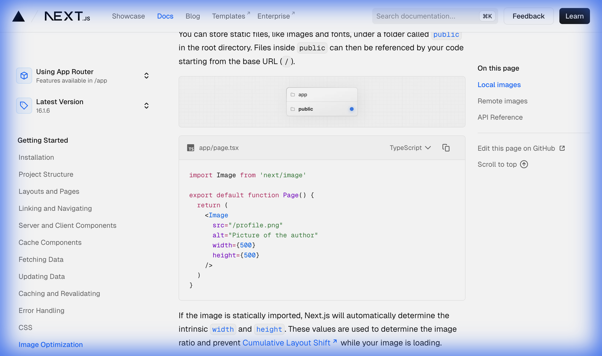

# Next.js Image Optimization — Deep Dive!

> **Chủ đề**: Image Optimization trong Next.js App Router
> **Ngôn ngữ**: Tiếng Việt — giải thích cực kỳ chi tiết!
> **Phương châm**: Tự viết lại bằng tay — KHÔNG dùng thư viện!
> **Nguồn**: https://nextjs.org/docs/app/getting-started/images

---

## Mục Lục

1. [§1. Tổng Quan — `<Image>` Component](#1)
2. [§2. Phân Tích Sơ Đồ — Local Image File Structure](#2)
3. [§3. Local Images — Static Files](#3)
4. [§4. Static Import — Tự Động width/height](#4)
5. [§5. Remote Images — URL Từ Server Ngoài](#5)
6. [§6. remotePatterns — Bảo Mật](#6)
7. [§7. Sơ Đồ Tổng Hợp — Image Pipeline](#7)
8. [§8. Tự Viết — ImageOptimizationEngine](#8)
9. [§9. Câu Hỏi Luyện Tập](#9)

---

## §1. Tổng Quan — `<Image>` Component!

```
  NEXT.JS <IMAGE> — 4 TÍNH NĂNG CHÍNH:
  ┌────────────────────────────────────────────────────────┐
  │                                                        │
  │  <Image> = PHIÊN BẢN NÂNG CẤP của  HTML!        │
  │  import Image from 'next/image'                        │
  │                                                        │
  │  ┌──────────────────────────────────────────────────┐  │
  │  │                                                  │  │
  │  │  ① SIZE OPTIMIZATION (Tối ưu kích thước)        │  │
  │  │  ┌────────────────────────────────────────────┐  │  │
  │  │  │  → Tự động serve ảnh ĐÚNG SIZE cho device │  │  │
  │  │  │  → Desktop: 1200px, Tablet: 768px,        │  │  │
  │  │  │    Mobile: 375px                           │  │  │
  │  │  │  → Dùng format HIỆN ĐẠI: WebP             │  │  │
  │  │  │  → WebP nhỏ hơn JPEG/PNG 25-35%!          │  │  │
  │  │  └────────────────────────────────────────────┘  │  │
  │  │                                                  │  │
  │  │  ② VISUAL STABILITY (Ổn định thị giác)          │  │
  │  │  ┌────────────────────────────────────────────┐  │  │
  │  │  │  → Tự động NGĂN Layout Shift (CLS)!       │  │  │
  │  │  │  → CLS = nội dung nhảy/dịch chuyển vị trí │  │  │
  │  │  │    khi ảnh load xong                        │  │  │
  │  │  │  → <Image> RESERVE không gian trước!       │  │  │
  │  │  └────────────────────────────────────────────┘  │  │
  │  │                                                  │  │
  │  │  ③ FASTER PAGE LOADS (Tải trang nhanh hơn)      │  │
  │  │  ┌────────────────────────────────────────────┐  │  │
  │  │  │  → LAZY LOADING mặc định (native browser) │  │  │
  │  │  │  → Chỉ load ảnh khi CUỘN đến viewport!    │  │  │
  │  │  │  → Tuỳ chọn: blur-up placeholder         │  │  │
  │  │  │    (ảnh mờ → ảnh rõ khi load xong)        │  │  │
  │  │  └────────────────────────────────────────────┘  │  │
  │  │                                                  │  │
  │  │  ④ ASSET FLEXIBILITY (Linh hoạt tài nguyên)     │  │
  │  │  ┌────────────────────────────────────────────┐  │  │
  │  │  │  → Resize ảnh ON-DEMAND (theo yêu cầu)    │  │  │
  │  │  │  → Kể cả ảnh từ REMOTE SERVER!            │  │  │
  │  │  │  → Không cần xử lý ảnh trước!             │  │  │
  │  │  └────────────────────────────────────────────┘  │  │
  │  │                                                  │  │
  │  └──────────────────────────────────────────────────┘  │
  │                                                        │
  │  SO SÁNH  vs <Image>:                             │
  │  ┌───────────────────┬──────────┬────────────────────┐ │
  │  │                   │     │ <Image>            │ │
  │  ├───────────────────┼──────────┼────────────────────┤ │
  │  │ Auto resize       │ ❌       │ ✅ Per device      │ │
  │  │ WebP format       │ ❌       │ ✅ Tự động         │ │
  │  │ Lazy loading      │ Manual   │ ✅ Mặc định        │ │
  │  │ CLS prevention    │ ❌       │ ✅ Tự động         │ │
  │  │ Blur placeholder  │ ❌       │ ✅ Tuỳ chọn        │ │
  │  │ Remote resize     │ ❌       │ ✅ On-demand       │ │
  │  │ Size output       │ Nguyên   │ ✅ Tối ưu          │ │
  │  └───────────────────┴──────────┴────────────────────┘ │
  │                                                        │
  │  SỬ DỤNG CƠ BẢN:                                      │
  │  ┌──────────────────────────────────────────────────┐  │
  │  │  import Image from 'next/image'                  │  │
  │  │                                                  │  │
  │  │  export default function Page() {                │  │
  │  │    return <Image src="" alt="" />                 │  │
  │  │  }                                               │  │
  │  │                                                  │  │
  │  │  → src có thể là LOCAL hoặc REMOTE!             │  │
  │  └──────────────────────────────────────────────────┘  │
  │                                                        │
  └────────────────────────────────────────────────────────┘
```

**CLS (Cumulative Layout Shift) là gì?**

```
  CLS — HIỆN TƯỢNG LAYOUT SHIFT:
  ┌────────────────────────────────────────────────────────┐
  │                                                        │
  │  TRƯỚC khi ảnh load:       SAU khi ảnh load:           │
  │  ┌─────────────────┐       ┌─────────────────┐        │
  │  │ Title            │       │ Title            │        │
  │  │ Text paragraph   │       │ ┌─────────────┐ │        │
  │  │ More text...     │       │ │   IMAGE!!!   │ │ ← Ảnh │
  │  │ Footer           │       │ └─────────────┘ │   xuất │
  │  └─────────────────┘       │ Text paragraph   │   hiện │
  │                             │ More text... ↓↓↓ │ ← Nhảy!│
  │                             │ Footer      ↓↓↓ │ ← Nhảy!│
  │                             └─────────────────┘        │
  │                                                        │
  │  → Nội dung BỊ NHẢY xuống khi ảnh load!              │
  │  → Trải nghiệm người dùng RẤT TỆ!                   │
  │  → Google Core Web Vitals TRỪNG PHẠT CLS cao!        │
  │                                                        │
  │  <Image> GIẢI QUYẾT bằng cách:                        │
  │  → width + height được set TRƯỚC                      │
  │  → Browser RESERVE không gian đúng kích thước!        │
  │  → Content KHÔNG BAO GIỜ bị nhảy!                    │
  │                                                        │
  └────────────────────────────────────────────────────────┘
```

---

## §2. Phân Tích Sơ Đồ — Local Image File Structure!

**Sơ đồ gốc trên trang:**



```
  PHÂN TÍCH SƠ ĐỒ — FILE STRUCTURE:
  ┌────────────────────────────────────────────────────────┐
  │                                                        │
  │  Sơ đồ hiển thị CẤU TRÚC THƯ MỤC GỐC:               │
  │                                                        │
  │  project-root/                                         │
  │  ├── 📁 app          ← Thư mục App Router             │
  │  │   ├── page.tsx    ← Trang chính                    │
  │  │   ├── layout.tsx  ← Root layout                    │
  │  │   └── ...                                           │
  │  │                                                     │
  │  └── 📁 public  🔵   ← CHỮ CÓ DẤU CHẤM XANH!       │
  │      ├── profile.png ← Ảnh static                    │
  │      ├── logo.svg    ← Logo                           │
  │      └── fonts/      ← Font files                     │
  │                                                        │
  │  ═══════════════════════════════════════════════════   │
  │                                                        │
  │  DẤU CHẤM XANH 🔵 = ĐIỂM QUAN TRỌNG:                │
  │  → public/ là thư mục ĐẶC BIỆT trong Next.js!       │
  │  → Files trong public/ được serve STATIC!             │
  │  → Truy cập từ base URL: /                            │
  │                                                        │
  │  MAPPING:                                              │
  │  ┌──────────────────────────────────────────────────┐  │
  │  │  public/profile.png  →  src="/profile.png"       │  │
  │  │  public/logo.svg     →  src="/logo.svg"          │  │
  │  │  public/imgs/a.jpg   →  src="/imgs/a.jpg"        │  │
  │  │         ↑                      ↑                  │  │
  │  │    Đường dẫn file          URL trên browser       │  │
  │  │    (filesystem)            (base URL = /)         │  │
  │  └──────────────────────────────────────────────────┘  │
  │                                                        │
  │  CODE TƯƠNG ỨNG (ngay dưới sơ đồ trên trang):        │
  │  ┌──────────────────────────────────────────────────┐  │
  │  │  // app/page.tsx                                 │  │
  │  │  import Image from 'next/image'                  │  │
  │  │                                                  │  │
  │  │  export default function Page() {                │  │
  │  │    return (                                       │  │
  │  │      <Image                                       │  │
  │  │        src="/profile.png"   ← từ public/!       │  │
  │  │        alt="Picture of the author"                │  │
  │  │        width={500}          ← PHẢI cung cấp     │  │
  │  │        height={500}         ← PHẢI cung cấp     │  │
  │  │      />                                           │  │
  │  │    )                                              │  │
  │  │  }                                               │  │
  │  └──────────────────────────────────────────────────┘  │
  │                                                        │
  │  ⚠️ LƯU Ý:                                            │
  │  → Dùng string path: PHẢI cung cấp width + height!   │
  │  → Dùng static import: width/height TỰ ĐỘNG!         │
  │  → Xem §4 để hiểu sự khác biệt!                     │
  │                                                        │
  └────────────────────────────────────────────────────────┘
```

---

## §3. Local Images — Static Files!

```
  LOCAL IMAGES — 2 CÁCH SỬ DỤNG:
  ┌────────────────────────────────────────────────────────┐
  │                                                        │
  │  ┌──────────────────────────────────────────────────┐  │
  │  │                                                  │  │
  │  │  CÁCH 1: String Path (từ public/)                │  │
  │  │  ┌────────────────────────────────────────────┐  │  │
  │  │  │  <Image                                    │  │  │
  │  │  │    src="/profile.png"  ← path từ public/  │  │  │
  │  │  │    alt="Author"                            │  │  │
  │  │  │    width={500}   ← BẮT BUỘC!             │  │  │
  │  │  │    height={500}  ← BẮT BUỘC!             │  │  │
  │  │  │  />                                        │  │  │
  │  │  └────────────────────────────────────────────┘  │  │
  │  │  → PHẢI specify width + height thủ công!        │  │
  │  │  → Vì Next.js không biết kích thước ảnh!        │  │
  │  │                                                  │  │
  │  │  CÁCH 2: Static Import                           │  │
  │  │  ┌────────────────────────────────────────────┐  │  │
  │  │  │  import ProfileImage from './profile.png'  │  │  │
  │  │  │  <Image                                    │  │  │
  │  │  │    src={ProfileImage}  ← import trực tiếp │  │  │
  │  │  │    alt="Author"                            │  │  │
  │  │  │    // width, height TỰ ĐỘNG!              │  │  │
  │  │  │    // blurDataURL TỰ ĐỘNG!                │  │  │
  │  │  │    placeholder="blur"  ← tuỳ chọn        │  │  │
  │  │  │  />                                        │  │  │
  │  │  └────────────────────────────────────────────┘  │  │
  │  │  → KHÔNG CẦN width + height!                    │  │
  │  │  → Next.js TỰ ĐỌC kích thước từ file!          │  │
  │  │                                                  │  │
  │  └──────────────────────────────────────────────────┘  │
  │                                                        │
  │  SO SÁNH 2 CÁCH:                                       │
  │  ┌──────────────────────┬──────────┬─────────────────┐ │
  │  │                      │ String   │ Static Import   │ │
  │  ├──────────────────────┼──────────┼─────────────────┤ │
  │  │ Nguồn ảnh            │ public/  │ Anywhere (src/) │ │
  │  │ width/height         │ BẮT BUỘC │ TỰ ĐỘNG ✅     │ │
  │  │ blurDataURL          │ Manual   │ TỰ ĐỘNG ✅     │ │
  │  │ placeholder="blur"   │ Cần BDURL│ Sẵn sàng ✅    │ │
  │  │ Build-time optimized │ Có       │ Có              │ │
  │  │ Tree-shakeable       │ Không    │ Có ✅           │ │
  │  └──────────────────────┴──────────┴─────────────────┘ │
  │                                                        │
  └────────────────────────────────────────────────────────┘
```

---

## §4. Static Import — Tự Động width/height!

```
  STATIC IMPORT — BEHIND THE SCENES:
  ┌────────────────────────────────────────────────────────┐
  │                                                        │
  │  KHI BẠN VIẾT:                                        │
  │  import ProfileImage from './profile.png'              │
  │                                                        │
  │  NEXT.JS WEBPACK LOADER TỰ ĐỘNG:                      │
  │  ┌──────────────────────────────────────────────────┐  │
  │  │                                                  │  │
  │  │  1. ĐỌC file ảnh profile.png                     │  │
  │  │  2. PHÂN TÍCH metadata (width, height, format)   │  │
  │  │  3. GENERATE blurDataURL (base64 thumbnail)      │  │
  │  │  4. TRẢ VỀ object:                               │  │
  │  │                                                  │  │
  │  │  ProfileImage = {                                 │  │
  │  │    src: '/_next/static/media/profile.abc123.png', │  │
  │  │    width: 1200,         ← TỰ ĐỘNG!              │  │
  │  │    height: 800,         ← TỰ ĐỘNG!              │  │
  │  │    blurDataURL: 'data:image/jpeg;base64,...',     │  │
  │  │    blurWidth: 8,                                  │  │
  │  │    blurHeight: 6,                                 │  │
  │  │  }                                                │  │
  │  │                                                  │  │
  │  └──────────────────────────────────────────────────┘  │
  │                                                        │
  │  BLUR-UP PLACEHOLDER FLOW:                             │
  │  ┌──────────────────────────────────────────────────┐  │
  │  │                                                  │  │
  │  │  ① Trang load → hiển thị ảnh MỜ (8x6px blur)   │  │
  │  │  ┌─────────────────┐                             │  │
  │  │  │  ░░░░░░░░░░░░░  │  ← blurDataURL (tiny!)    │  │
  │  │  │  ░░░░░░░░░░░░░  │                             │  │
  │  │  └─────────────────┘                             │  │
  │  │           │                                       │  │
  │  │           ▼ Ảnh gốc load xong                    │  │
  │  │                                                  │  │
  │  │  ② Transition SMOOTH sang ảnh rõ!               │  │
  │  │  ┌─────────────────┐                             │  │
  │  │  │  📷 CLEAR IMAGE │  ← Ảnh gốc (optimized)    │  │
  │  │  │  📷 CLEAR IMAGE │                             │  │
  │  │  └─────────────────┘                             │  │
  │  │                                                  │  │
  │  │  → Trải nghiệm MƯỢT MÀ, không bị trống!        │  │
  │  │                                                  │  │
  │  └──────────────────────────────────────────────────┘  │
  │                                                        │
  └────────────────────────────────────────────────────────┘
```

```typescript
// STATIC IMPORT — VÍ DỤ ĐẦY ĐỦ:
import Image from 'next/image'
import ProfileImage from './profile.png'

export default function Page() {
  return (
    <Image
      src={ProfileImage}
      alt="Picture of the author"
      // width={500}   ← TỰ ĐỘNG cung cấp bởi static import!
      // height={500}  ← TỰ ĐỘNG cung cấp!
      // blurDataURL="data:..."  ← TỰ ĐỘNG generate!
      placeholder="blur"  // ← Bật blur-up effect!
    />
  )
}
```

---

## §5. Remote Images — URL Từ Server Ngoài!

```
  REMOTE IMAGES — SỰ KHÁC BIỆT:
  ┌────────────────────────────────────────────────────────┐
  │                                                        │
  │  Remote = ảnh từ SERVER KHÁC (S3, CDN, etc.)          │
  │  → Next.js KHÔNG CÓ quyền truy cập file khi build!  │
  │  → PHẢI cung cấp thủ công: width, height             │
  │                                                        │
  │  VÍ DỤ:                                               │
  │  ┌──────────────────────────────────────────────────┐  │
  │  │  import Image from 'next/image'                  │  │
  │  │                                                  │  │
  │  │  export default function Page() {                │  │
  │  │    return (                                       │  │
  │  │      <Image                                       │  │
  │  │        src="https://s3.amazonaws.com/             │  │
  │  │             my-bucket/profile.png"                │  │
  │  │        alt="Picture of the author"                │  │
  │  │        width={500}   ← BẮT BUỘC!                │  │
  │  │        height={500}  ← BẮT BUỘC!                │  │
  │  │      />                                           │  │
  │  │    )                                              │  │
  │  │  }                                               │  │
  │  └──────────────────────────────────────────────────┘  │
  │                                                        │
  │  TẠI SAO PHẢI CÓ width/height?                        │
  │  ┌──────────────────────────────────────────────────┐  │
  │  │                                                  │  │
  │  │  width + height → tính ASPECT RATIO!             │  │
  │  │  → Browser RESERVE đúng không gian!              │  │
  │  │  → NGĂN CLS (layout shift)!                      │  │
  │  │                                                  │  │
  │  │  VÍ DỤ: width=500, height=300                    │  │
  │  │  → ratio = 500/300 = 5:3                         │  │
  │  │  → Dù ảnh chưa load, browser giữ tỷ lệ 5:3!   │  │
  │  │                                                  │  │
  │  └──────────────────────────────────────────────────┘  │
  │                                                        │
  │  THAY THẾ: DÙNG fill PROPERTY!                        │
  │  ┌──────────────────────────────────────────────────┐  │
  │  │  <Image                                           │  │
  │  │    src="https://..."                              │  │
  │  │    alt="..."                                      │  │
  │  │    fill    ← KHÔNG cần width/height!             │  │
  │  │  />                                               │  │
  │  │                                                  │  │
  │  │  → fill = ảnh lấp đầy PARENT element!            │  │
  │  │  → Parent phải có position: relative!            │  │
  │  │  → Ảnh sẽ có object-fit để kiểm soát!           │  │
  │  └──────────────────────────────────────────────────┘  │
  │                                                        │
  │  LOCAL vs REMOTE:                                      │
  │  ┌──────────────────────┬──────────┬─────────────────┐ │
  │  │                      │ Local    │ Remote          │ │
  │  ├──────────────────────┼──────────┼─────────────────┤ │
  │  │ src                  │ String / │ URL string      │ │
  │  │                      │ Import   │ (https://...)   │ │
  │  │ width/height         │ Tuỳ     │ BẮT BUỘC       │ │
  │  │ blurDataURL          │ Tự động  │ Manual          │ │
  │  │ Build-time optimize  │ Có       │ On-demand       │ │
  │  │ Cần remotePatterns?  │ Không    │ CÓ! (bảo mật) │ │
  │  │ Cần fill thay thế?   │ Có thể   │ Có thể          │ │
  │  └──────────────────────┴──────────┴─────────────────┘ │
  │                                                        │
  └────────────────────────────────────────────────────────┘
```

---

## §6. remotePatterns — Bảo Mật!

```
  REMOTE PATTERNS — TẠI SAO CẦN?
  ┌────────────────────────────────────────────────────────┐
  │                                                        │
  │  ⚠️ BẢO MẬT: Nếu cho phép BẤT KỲ URL nào...        │
  │  → Hacker có thể inject ảnh ĐỘC HẠI!                │
  │  → Hoặc lợi dụng Image Optimization API!             │
  │  → DDoS qua việc load ảnh liên tục từ URL lạ!       │
  │                                                        │
  │  → PHẢI define WHITELIST trong next.config.js!        │
  │                                                        │
  │  CẤU HÌNH:                                            │
  │  ┌──────────────────────────────────────────────────┐  │
  │  │  // next.config.js                               │  │
  │  │  import type { NextConfig } from 'next'          │  │
  │  │                                                  │  │
  │  │  const config: NextConfig = {                    │  │
  │  │    images: {                                     │  │
  │  │      remotePatterns: [                           │  │
  │  │        {                                         │  │
  │  │          protocol: 'https',      ← chỉ HTTPS!  │  │
  │  │          hostname: 's3.amazonaws.com',           │  │
  │  │          port: '',               ← default port │  │
  │  │          pathname: '/my-bucket/**',              │  │
  │  │          search: '',             ← no query     │  │
  │  │        },                                        │  │
  │  │      ],                                          │  │
  │  │    },                                             │  │
  │  │  }                                               │  │
  │  │  export default config                           │  │
  │  └──────────────────────────────────────────────────┘  │
  │                                                        │
  │  PHÂN TÍCH TỪNG FIELD:                                 │
  │  ┌──────────────────────────────────────────────────┐  │
  │  │                                                  │  │
  │  │  protocol: 'https'                               │  │
  │  │  → Chỉ cho phép HTTPS (bảo mật!)               │  │
  │  │  → HTTP sẽ BỊ CHẶN!                             │  │
  │  │                                                  │  │
  │  │  hostname: 's3.amazonaws.com'                    │  │
  │  │  → Chỉ cho phép domain NÀY!                    │  │
  │  │  → Wildcard: '*.example.com' cho subdomain      │  │
  │  │                                                  │  │
  │  │  port: ''                                        │  │
  │  │  → Default port (443 cho HTTPS)                 │  │
  │  │  → Có thể specify: '8080'                       │  │
  │  │                                                  │  │
  │  │  pathname: '/my-bucket/**'                       │  │
  │  │  → Chỉ cho phép path BẮT ĐẦU bằng /my-bucket/ │  │
  │  │  → ** = wildcard (bất kỳ sub-path nào)          │  │
  │  │                                                  │  │
  │  │  search: ''                                      │  │
  │  │  → Không cho phép query string!                 │  │
  │  │                                                  │  │
  │  └──────────────────────────────────────────────────┘  │
  │                                                        │
  │  URL MATCHING:                                         │
  │  ┌──────────────────────────────────────────────────┐  │
  │  │  ✅ https://s3.amazonaws.com/my-bucket/img.png  │  │
  │  │  ✅ https://s3.amazonaws.com/my-bucket/a/b.jpg  │  │
  │  │  ❌ http://s3.amazonaws.com/my-bucket/img.png   │  │
  │  │     (HTTP, không phải HTTPS!)                    │  │
  │  │  ❌ https://evil.com/my-bucket/img.png          │  │
  │  │     (hostname khác!)                             │  │
  │  │  ❌ https://s3.amazonaws.com/other/img.png      │  │
  │  │     (pathname không match /my-bucket/**)         │  │
  │  └──────────────────────────────────────────────────┘  │
  │                                                        │
  └────────────────────────────────────────────────────────┘
```

---

## §7. Sơ Đồ Tổng Hợp — Image Pipeline!

```
  NEXT.JS IMAGE PIPELINE — TOÀN BỘ FLOW:
  ┌────────────────────────────────────────────────────────┐
  │                                                        │
  │  ┌─────────────────────────────────────────────────┐   │
  │  │                SOURCE                            │   │
  │  │  ┌───────────────────┬───────────────────────┐  │   │
  │  │  │ LOCAL              │ REMOTE                │  │   │
  │  │  │ /public/img.png   │ https://cdn.com/img   │  │   │
  │  │  │ import from ./img │                        │  │   │
  │  │  └───────────────────┴───────────────────────┘  │   │
  │  └─────────────┬───────────────────┬───────────────┘   │
  │                │                   │                    │
  │                ▼                   ▼                    │
  │  ┌─────────────────────────────────────────────────┐   │
  │  │            <Image> COMPONENT                     │   │
  │  │  ┌──────────────────────────────────────────┐   │   │
  │  │  │  Props:                                   │   │   │
  │  │  │  ├── src (string | StaticImport)         │   │   │
  │  │  │  ├── alt (required!)                     │   │   │
  │  │  │  ├── width / height (or fill)            │   │   │
  │  │  │  ├── placeholder ("blur" | "empty")      │   │   │
  │  │  │  ├── priority (disable lazy loading)     │   │   │
  │  │  │  ├── quality (1-100, default 75)         │   │   │
  │  │  │  └── sizes (responsive hints)            │   │   │
  │  │  └──────────────────────────────────────────┘   │   │
  │  └─────────────────────┬───────────────────────────┘   │
  │                        │                                │
  │                        ▼                                │
  │  ┌─────────────────────────────────────────────────┐   │
  │  │         IMAGE OPTIMIZATION API                   │   │
  │  │  ┌──────────────────────────────────────────┐   │   │
  │  │  │  ① Detect device (viewport width)        │   │   │
  │  │  │  ② Choose optimal size (deviceSizes)     │   │   │
  │  │  │  ③ Convert format (→ WebP if supported)  │   │   │
  │  │  │  ④ Compress (quality setting)            │   │   │
  │  │  │  ⑤ Cache result (CDN / local)            │   │   │
  │  │  └──────────────────────────────────────────┘   │   │
  │  └─────────────────────┬───────────────────────────┘   │
  │                        │                                │
  │                        ▼                                │
  │  ┌─────────────────────────────────────────────────┐   │
  │  │              OUTPUT TO BROWSER                   │   │
  │  │  ┌──────────────────────────────────────────┐   │   │
  │  │  │                                         │   │   │
  │  │  └──────────────────────────────────────────┘   │   │
  │  └─────────────────────────────────────────────────┘   │
  │                                                        │
  └────────────────────────────────────────────────────────┘
```

```
  DECISION TREE — CHỌN CÁCH NÀO?
  ┌────────────────────────────────────────────────────────┐
  │                                                        │
  │  Ảnh ở đâu?                                           │
  │  │                                                     │
  │  ├── Local (trong project)?                            │
  │  │   │                                                 │
  │  │   ├── Cần auto width/height + blur?                │
  │  │   │   └── ✅ Static Import (import from './...')   │
  │  │   │                                                 │
  │  │   └── Ảnh trong public/ (shared/favicon)?          │
  │  │       └── ✅ String Path (src="/...")               │
  │  │           → PHẢI set width + height!               │
  │  │                                                     │
  │  └── Remote (CDN / S3 / external)?                     │
  │      │                                                 │
  │      ├── Biết kích thước ảnh?                          │
  │      │   └── ✅ width + height props                  │
  │      │                                                 │
  │      ├── Không biết kích thước?                        │
  │      │   └── ✅ fill prop (parent = relative)         │
  │      │                                                 │
  │      └── Config next.config.js!                        │
  │          └── ✅ remotePatterns (WHITELIST!)            │
  │                                                        │
  └────────────────────────────────────────────────────────┘
```

---

## §8. Tự Viết — ImageOptimizationEngine!

```javascript
var ImageOptimizationEngine = (function () {
  // ═══════════════════════════════════
  // 1. IMAGE REGISTRY
  // ═══════════════════════════════════
  var images = [];
  var remotePatterns = [];
  var deviceSizes = [640, 750, 828, 1080, 1200, 1920, 2048, 3840];

  function addRemotePattern(pattern) {
    remotePatterns.push(pattern);
    console.log(
      "  [Config] Added remote pattern:",
      pattern.hostname + pattern.pathname,
    );
  }

  // ═══════════════════════════════════
  // 2. REGISTER IMAGE
  // ═══════════════════════════════════
  function registerImage(src, options) {
    var img = {
      src: src,
      alt: options.alt || "",
      width: options.width || null,
      height: options.height || null,
      fill: options.fill || false,
      placeholder: options.placeholder || "empty",
      isRemote: src.startsWith("http"),
      isStaticImport: typeof src === "object",
    };

    // Static import simulation
    if (img.isStaticImport) {
      img.width = src.width;
      img.height = src.height;
      img.blurDataURL = src.blurDataURL;
      img.resolvedSrc = src.src;
      console.log(
        "  [Static Import] Auto width=" + img.width + ", height=" + img.height,
      );
    } else {
      img.resolvedSrc = src;
    }

    images.push(img);
    return img;
  }

  // ═══════════════════════════════════
  // 3. VALIDATE
  // ═══════════════════════════════════
  function validate(img) {
    var errors = [];
    if (!img.alt) errors.push("Missing alt text (accessibility!)");
    if (!img.fill && !img.width) errors.push("Missing width (CLS risk!)");
    if (!img.fill && !img.height) errors.push("Missing height (CLS risk!)");

    if (img.isRemote) {
      var allowed = remotePatterns.some(function (pattern) {
        try {
          var url = new URL(img.resolvedSrc);
          var protoMatch =
            !pattern.protocol || url.protocol === pattern.protocol + ":";
          var hostMatch =
            url.hostname === pattern.hostname ||
            (pattern.hostname.startsWith("*") &&
              url.hostname.endsWith(pattern.hostname.slice(1)));
          var pathMatch =
            !pattern.pathname ||
            url.pathname.startsWith(pattern.pathname.replace("/**", ""));
          return protoMatch && hostMatch && pathMatch;
        } catch (e) {
          return false;
        }
      });
      if (!allowed) errors.push("Remote URL not in remotePatterns!");
    }
    return errors;
  }

  // ═══════════════════════════════════
  // 4. OPTIMIZE (simulate)
  // ═══════════════════════════════════
  function optimize(img, viewportWidth) {
    var targetWidth = deviceSizes.reduce(function (prev, curr) {
      return curr >= viewportWidth && (!prev || curr < prev) ? curr : prev;
    }, null);

    var ratio = img.width && img.height ? img.width / img.height : 1;
    var optimizedHeight = Math.round(targetWidth / ratio);
    var originalSize = img.width * img.height * 3; // approx bytes (RGB)
    var webpSize = Math.round(originalSize * 0.3); // WebP ~30% of original

    return {
      originalFormat: "PNG/JPEG",
      outputFormat: "WebP",
      originalWidth: img.width,
      outputWidth: targetWidth,
      outputHeight: optimizedHeight,
      originalSize: (originalSize / 1024).toFixed(0) + "KB",
      optimizedSize: (webpSize / 1024).toFixed(0) + "KB",
      savings: "~70%",
      url:
        "/_next/image?url=" +
        encodeURIComponent(img.resolvedSrc) +
        "&w=" +
        targetWidth,
      lazyLoading: true,
      decodingAsync: true,
    };
  }

  // ═══════════════════════════════════
  // 5. GENERATE HTML OUTPUT
  // ═══════════════════════════════════
  function generateOutput(img) {
    var errors = validate(img);
    if (errors.length > 0) {
      console.log("  ❌ Validation FAILED:");
      errors.forEach(function (e) {
        console.log("    → " + e);
      });
      return null;
    }

    var srcset = deviceSizes
      .slice(0, 4)
      .map(function (w) {
        return (
          "/_next/image?url=" +
          encodeURIComponent(img.resolvedSrc) +
          "&w=" +
          w +
          " " +
          w +
          "w"
        );
      })
      .join(", ");

    var html = "";

    return html;
  }

  // ═══════════════════════════════════
  // 6. DEMO
  // ═══════════════════════════════════
  function demo() {
    console.log("╔══════════════════════════════════════╗");
    console.log("║ IMAGE OPTIMIZATION ENGINE             ║");
    console.log("╚══════════════════════════════════════╝");

    // Config
    addRemotePattern({
      protocol: "https",
      hostname: "s3.amazonaws.com",
      pathname: "/my-bucket/**",
    });

    // Local image (string path)
    console.log("\n━━━ 1. Local Image (String Path) ━━━");
    var local = registerImage("/profile.png", {
      alt: "Author",
      width: 500,
      height: 500,
    });
    var localErrors = validate(local);
    console.log(
      "  Validation:",
      localErrors.length === 0 ? "✅ PASS" : "❌ FAIL",
    );
    var opt1 = optimize(local, 768);
    console.log(
      "  Optimized for 768px viewport:",
      opt1.outputWidth + "x" + opt1.outputHeight,
    );
    console.log("  Format: " + opt1.originalFormat + " → " + opt1.outputFormat);
    console.log(
      "  Size: " +
        opt1.originalSize +
        " → " +
        opt1.optimizedSize +
        " (savings: " +
        opt1.savings +
        ")",
    );

    // Static import
    console.log("\n━━━ 2. Static Import ━━━");
    var staticImg = registerImage(
      {
        src: "/_next/static/media/profile.abc.png",
        width: 1200,
        height: 800,
        blurDataURL: "data:image/jpeg;base64,...",
      },
      { alt: "Author", placeholder: "blur" },
    );
    var staticErrors = validate(staticImg);
    console.log(
      "  Validation:",
      staticErrors.length === 0 ? "✅ PASS" : "❌ FAIL",
    );
    console.log("  Placeholder:", staticImg.placeholder, "→ blur-up enabled!");

    // Remote image (OK)
    console.log("\n━━━ 3. Remote Image (Allowed) ━━━");
    var remote = registerImage("https://s3.amazonaws.com/my-bucket/photo.png", {
      alt: "Photo",
      width: 800,
      height: 600,
    });
    var remoteErrors = validate(remote);
    console.log(
      "  Validation:",
      remoteErrors.length === 0 ? "✅ PASS" : "❌ FAIL",
    );

    // Remote image (BLOCKED)
    console.log("\n━━━ 4. Remote Image (BLOCKED!) ━━━");
    var blocked = registerImage("https://evil.com/malware.png", {
      alt: "Bad",
      width: 100,
      height: 100,
    });
    validate(blocked); // Will show error

    // Generate HTML
    console.log("\n━━━ 5. Generated HTML ━━━");
    var html = generateOutput(local);
    console.log("  " + (html ? html.substring(0, 80) + "..." : "N/A"));
  }

  return { demo: demo };
})();
// Chạy: ImageOptimizationEngine.demo();
```

---

## §9. Câu Hỏi Luyện Tập!

**Câu 1**: `<Image>` component giải quyết vấn đề gì mà `` HTML không làm được?

<details><summary>Đáp án</summary>

`<Image>` giải quyết **4 vấn đề lớn**:

1. **Size optimization**: Tự động serve ảnh đúng kích thước cho mỗi device (mobile nhận ảnh nhỏ hơn desktop) + convert sang **WebP** (nhỏ hơn 25-35%)
2. **Visual stability (CLS)**: Tự động reserve không gian bằng width/height → nội dung **không bị nhảy** khi ảnh load
3. **Lazy loading**: Mặc định chỉ load ảnh khi **cuộn đến viewport** + có blur-up placeholder
4. **Asset flexibility**: Resize ảnh **on-demand** ngay cả từ remote server → không cần chuẩn bị nhiều size trước

</details>

---

**Câu 2**: Sự khác biệt giữa string path và static import cho local images?

<details><summary>Đáp án</summary>

|                        | String Path            | Static Import                 |
| ---------------------- | ---------------------- | ----------------------------- |
| **Cú pháp**            | `src="/img.png"`       | `import img from './img.png'` |
| **Nguồn**              | `public/` folder       | Bất kỳ đâu trong `src/`       |
| **width/height**       | **BẮT BUỘC** thủ công  | **TỰ ĐỘNG** từ file metadata  |
| **blurDataURL**        | Phải cung cấp thủ công | **TỰ ĐỘNG** generate base64   |
| **placeholder="blur"** | Cần blurDataURL        | Sẵn sàng, chỉ cần enable      |

→ **Static import ưu việt hơn** cho ảnh trong project vì tự động xử lý mọi thứ!

</details>

---

**Câu 3**: Tại sao cần `remotePatterns` trong `next.config.js`?

<details><summary>Đáp án</summary>

Vì **bảo mật**:

1. Nếu cho phép **bất kỳ URL** nào → hacker có thể inject ảnh độc hại
2. Attacker có thể **lợi dụng** Image Optimization API (DDoS)
3. `remotePatterns` tạo **whitelist** chỉ cho phép domain/path cụ thể
4. Config gồm: `protocol`, `hostname`, `port`, `pathname`, `search`
5. Phải **càng specific càng tốt** — ví dụ chỉ cho phép `https://s3.amazonaws.com/my-bucket/**`

</details>

---

**Câu 4**: Remote image khác local image ở điểm nào quan trọng nhất?

<details><summary>Đáp án</summary>

Điểm khác biệt **quan trọng nhất**: Next.js **KHÔNG CÓ quyền truy cập** remote file khi build!

Hệ quả:

- **PHẢI** cung cấp `width` + `height` thủ công (hoặc dùng `fill`)
- **PHẢI** config `remotePatterns` (whitelist domain)
- **KHÔNG** tự động generate `blurDataURL` (phải cung cấp thủ công nếu muốn blur)
- Optimize **on-demand** tại runtime (không phải build-time)

Thay thế `width/height`: dùng `fill` prop → ảnh lấp đầy parent element (parent cần `position: relative`)

</details>

---

**Câu 5**: Giải thích flow khi browser request một `<Image>` component với src="/photo.png", width=1200.

<details><summary>Đáp án</summary>

```
1. React render → 

2. Browser detect viewport width (e.g. 768px)

3. Browser chọn ảnh phù hợp từ srcset → request /_next/image?url=/photo.png&w=828

4. Next.js Image Optimization API:
   ① Đọc ảnh gốc /public/photo.png
   ② Resize về width=828
   ③ Convert format → WebP (nếu browser support)
   ④ Compress theo quality (default 75)
   ⑤ Cache kết quả

5. Trả ảnh WebP tối ưu → browser hiển thị!
   → loading="lazy" → chỉ load khi scroll đến!
   → width/height → browser reserve space → NO CLS!
```

</details>
