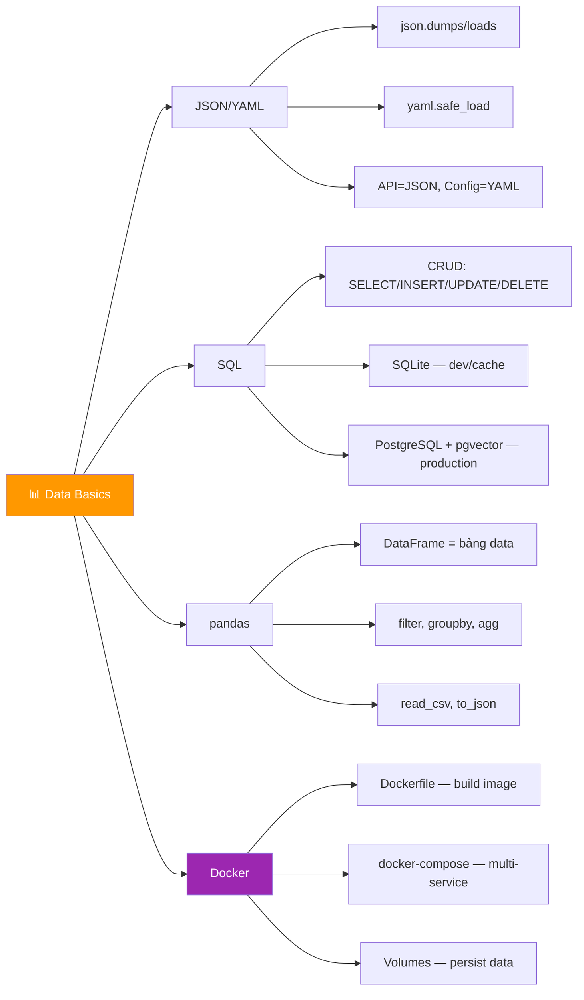

# 📊 Data Basics — Tuần 7-8: JSON/YAML, SQL, pandas, Docker

> 📅 Thuộc Phase 1 của [AI Solution Engineer Roadmap](./AI%20Solution%20Engineer%20Roadmap.md)
> 📖 Tiếp nối [Thư Viện Quan Trọng — Tuần 5-6](./Thư%20Viện%20Quan%20Trọng%20-%20Tuần%205-6.md)
> 🎯 Mục tiêu: Xử lý data thành thạo, lưu trữ data vào database, đóng gói ứng dụng bằng Docker

---

## 🗺️ Mental Map — Data trong AI Pipeline


```
  AI Engineer xử lý data HÀNG NGÀY:

  1. NHẬN data    → JSON từ API, YAML từ config, CSV từ dataset
  2. XỬ LÝ data   → pandas: filter, transform, aggregate
  3. LƯU data     → SQLite (dev), PostgreSQL (production)
  4. ĐÓNG GÓI     → Docker: "chạy trên máy tôi → chạy MỌI NƠI"

  ┌────────────┬──────────────────────────────────────────┐
  │ Công cụ    │ Dùng khi nào trong AI?                   │
  ├────────────┼──────────────────────────────────────────┤
  │ JSON       │ API request/response, LLM output          │
  │ YAML       │ Config files, Docker Compose, CI/CD       │
  │ pandas     │ Xử lý dataset, phân tích results          │
  │ SQLite     │ Local dev, prototype, embeddings cache     │
  │ PostgreSQL │ Production database, pgvector              │
  │ Docker     │ Deploy AI services, reproducible envs     │
  └────────────┴──────────────────────────────────────────┘
```

---

## 📖 Mục lục

1. [JSON — Ngôn ngữ chung của API](#1-json--ngôn-ngữ-chung-của-api)
2. [YAML — Config cho con người](#2-yaml--config-cho-con-người)
3. [SQL & Database Fundamentals](#3-sql--database-fundamentals)
4. [SQLite — Database trong 1 file](#4-sqlite--database-trong-1-file)
5. [PostgreSQL — Production database](#5-postgresql--production-database)
6. [pandas — Xử lý data như PRO](#6-pandas--xử-lý-data-như-pro)
7. [Docker — Đóng gói ứng dụng](#7-docker--đóng-gói-ứng-dụng)

---

# 1. JSON — Ngôn ngữ chung của API

> 🔄 **Pattern: Contextual History — JSON sinh ra vì XML quá rắc rối!**

### Lịch sử: Từ XML đến JSON

```
  2000s: XML thống trị — MỌI THỨ đều XML!

  XML ví dụ:
    <person>
      <name>An</name>
      <age>25</age>
      <skills>
        <skill>Python</skill>
        <skill>React</skill>
      </skills>
    </person>
  → DÀI! Tags lặp lại! Khó đọc! Khó parse!

  2001: Douglas Crockford tạo JSON — "data format cho con người"

  JSON ví dụ:
    {
      "name": "An",
      "age": 25,
      "skills": ["Python", "React"]
    }
  → NGẮN HƠN 50%! Dễ đọc! Dễ parse!

  → 2024: 99% API dùng JSON. XML chỉ còn trong legacy systems.
```

### JSON Data Types — Chỉ có 6!

```
  ┌──────────┬───────────────────┬──────────────────┐
  │ JSON     │ Python            │ Ví dụ            │
  ├──────────┼───────────────────┼──────────────────┤
  │ string   │ str               │ "hello"          │
  │ number   │ int / float       │ 42, 3.14         │
  │ boolean  │ bool              │ true / false     │
  │ null     │ None              │ null             │
  │ array    │ list              │ [1, 2, 3]        │
  │ object   │ dict              │ {"key": "value"} │
  └──────────┴───────────────────┴──────────────────┘

  ⚠️ Khác biệt nhỏ nhưng QUAN TRỌNG:
    JSON: true/false/null    (lowercase!)
    Python: True/False/None  (Capitalize!)
    → json.dumps() tự chuyển đổi!
```

### Python xử lý JSON

```python
import json

# ═══ Dict → JSON string (serialize) ═══
data = {
    "model": "gpt-4",
    "messages": [
        {"role": "user", "content": "Xin chào!"}
    ],
    "temperature": 0.7,
    "stream": False,          # Python False
    "metadata": None,         # Python None
}

json_str = json.dumps(data, indent=2, ensure_ascii=False)
print(json_str)
# {
#   "model": "gpt-4",
#   "messages": [
#     {"role": "user", "content": "Xin chào!"}
#   ],
#   "temperature": 0.7,
#   "stream": false,          ← tự đổi thành JSON false!
#   "metadata": null           ← tự đổi thành JSON null!
# }

# ═══ JSON string → Dict (deserialize) ═══
parsed = json.loads(json_str)
print(parsed["model"])            # "gpt-4"
print(parsed["messages"][0])      # {'role': 'user', 'content': 'Xin chào!'}
print(type(parsed["stream"]))     # <class 'bool'> → tự đổi lại Python!

# ═══ Đọc/Ghi file JSON ═══
# Ghi
with open("config.json", "w", encoding="utf-8") as f:
    json.dump(data, f, indent=2, ensure_ascii=False)

# Đọc
with open("config.json", "r", encoding="utf-8") as f:
    config = json.load(f)
```

### 🔧 Reverse Engineering: Tự xây mini JSON parser

```python
def mini_json_parse(text: str):
    """Parser JSON đơn giản — hiểu cách JSON hoạt động!"""
    text = text.strip()

    # String
    if text.startswith('"'):
        return text[1:-1]  # Bỏ dấu "

    # Number
    if text[0].isdigit() or text[0] == '-':
        return float(text) if '.' in text else int(text)

    # Boolean & Null
    if text == "true": return True
    if text == "false": return False
    if text == "null": return None

    # Array/Object → phức tạp hơn nhiều!
    # → Đây là lý do ta dùng json.loads()!
    raise ValueError(f"Cannot parse: {text}")

# Test:
print(mini_json_parse('"hello"'))   # "hello"
print(mini_json_parse("42"))        # 42
print(mini_json_parse("true"))      # True
print(mini_json_parse("null"))      # None

# → JSON parser thật phải xử lý nested objects, escape characters,
#   Unicode... → PHỨC TẠP! Dùng json module là đúng!
```

---

# 2. YAML — Config cho con người

> 📐 **Pattern: Trade-off Analysis — JSON vs YAML**

### YAML = "YAML Ain't Markup Language"

```
  🔍 5 Whys: Tại sao cần YAML khi đã có JSON?

  Q1: JSON đã phổ biến rồi, sao cần YAML?
  A1: JSON khó viết THỦ CÔNG — phải nhớ dấu {}, "", phẩy!

  Q2: Ai cần viết thủ công?
  A2: DevOps! Config files, Docker Compose, CI/CD, K8s manifests!

  Q3: YAML giải quyết thế nào?
  A3: KHÔNG CÓ dấu {}, dùng INDENTATION — giống Python!

  Q4: YAML có nhược điểm gì?
  A4: Indentation PHẢI CHÍNH XÁC! 1 space sai = file hỏng!
      Và: YAML phức tạp hơn JSON (multi-doc, anchors, tags...)

  Q5: Khi nào dùng JSON, khi nào YAML?
  A5: API data → JSON (machines đọc)
      Config files → YAML (humans viết)
```

```yaml
# ═══ YAML ví dụ — Docker Compose config ═══

version: "3.8"
services:
  api:
    build: .
    ports:
      - "8000:8000"
    environment:
      - OPENAI_API_KEY=${OPENAI_API_KEY}
      - DEBUG=false
    volumes:
      - ./data:/app/data
    depends_on:
      - db
      - redis

  db:
    image: postgres:15
    environment:
      POSTGRES_DB: ai_app
      POSTGRES_USER: admin
      POSTGRES_PASSWORD: secret

  redis:
    image: redis:7-alpine
    ports:
      - "6379:6379"
```

### Python đọc/ghi YAML

```python
import yaml   # pip install pyyaml

# ═══ Đọc YAML ═══
with open("docker-compose.yml") as f:
    config = yaml.safe_load(f)    # safe_load = AN TOÀN!

print(config["services"]["api"]["ports"])  # ['8000:8000']

# ═══ Ghi YAML ═══
data = {
    "model": "gpt-4",
    "parameters": {
        "temperature": 0.7,
        "max_tokens": 1000,
    },
    "prompts": ["Hello", "How are you?"],
}

with open("config.yaml", "w") as f:
    yaml.dump(data, f, default_flow_style=False, allow_unicode=True)

# ⚠️ LUÔN dùng safe_load()! KHÔNG dùng yaml.load()!
# yaml.load() có thể THỰC THI code trong YAML → bảo mật nguy hiểm!
```

```
  📐 Trade-off: JSON vs YAML vs TOML

  ┌──────────┬───────────────┬───────────────┬───────────────┐
  │          │ JSON          │ YAML          │ TOML          │
  ├──────────┼───────────────┼───────────────┼───────────────┤
  │ Đọc bởi  │ Machines ✅   │ Humans ✅     │ Humans ✅     │
  │ Comments │ ❌ Không      │ ✅ # comment  │ ✅ # comment  │
  │ Dùng cho │ API data      │ DevOps config │ App config    │
  │ Phức tạp │ Đơn giản      │ Rất phức tạp  │ Trung bình    │
  │ Ví dụ    │ API response  │ docker-compose│ pyproject.toml│
  │ Pain     │ Không comment │ Indent bugs!  │ Ít phổ biến   │
  └──────────┴───────────────┴───────────────┴───────────────┘
```

---

# 3. SQL & Database Fundamentals

> 🧱 **Pattern: First Principles — Database = tổ chức data trên DISK**

### Tại sao cần Database?

```
  🔍 5 Whys: Tại sao không lưu vào file JSON?

  Q1: JSON file lưu data được mà, sao cần database?
  A1: Vì file JSON đọc TOÀN BỘ vào RAM → 1GB data = 1GB RAM!

  Q2: Tại sao database không cần đọc toàn bộ?
  A2: Database dùng INDEX (B-Tree) → tìm 1 dòng trong 1 TRIỆU = <1ms!
      File JSON: đọc từ đầu → tìm thấy → O(n) = CHẬM!

  Q3: Index hoạt động thế nào?
  A3: B-Tree = cây cân bằng, lookup O(log n)
      1 triệu rows: log₂(1M) ≈ 20 bước → tìm trong 20 disk reads!

  Q4: Ngoài tốc độ, còn gì?
  A4: ACID transactions — đảm bảo data KHÔNG BỊ HỎNG khi crash!
      Concurrent access — nhiều người đọc/ghi cùng lúc!

  Q5: File cũng lock được mà?
  A5: File lock = CẢ FILE bị lock! Database lock = CHỈ 1 ROW!
      → Database cho phép NHIỀU NGƯỜI dùng đồng thời!
```

```
  First Principles — Database bên dưới:

  ┌─────────────────────────────────────────────┐
  │  SQL Query                                  │  ← Bạn viết
  │  SELECT * FROM users WHERE age > 25         │
  │                    │                        │
  │  Query Optimizer   ↓                        │  ← DB engine
  │  "Dùng index hay scan toàn bộ?"             │
  │                    │                        │
  │  B-Tree Index      ↓                        │  ← Data structure
  │  Tìm range age>25 trong tree                │
  │                    │                        │
  │  Disk I/O          ↓                        │  ← Hardware
  │  Đọc data pages từ SSD/HDD                  │
  └─────────────────────────────────────────────┘
```

### SQL cơ bản — 4 lệnh là ĐỦ!

```sql
-- ═══ CREATE — Tạo bảng ═══
CREATE TABLE users (
    id INTEGER PRIMARY KEY AUTOINCREMENT,
    name TEXT NOT NULL,
    email TEXT UNIQUE NOT NULL,
    age INTEGER DEFAULT 0,
    created_at TIMESTAMP DEFAULT CURRENT_TIMESTAMP
);

-- ═══ INSERT — Thêm data ═══
INSERT INTO users (name, email, age) VALUES ('An', 'an@mail.com', 25);
INSERT INTO users (name, email, age) VALUES ('Bình', 'binh@mail.com', 30);
INSERT INTO users (name, email, age) VALUES ('Chi', 'chi@mail.com', 22);

-- ═══ SELECT — Đọc data ═══
SELECT * FROM users;                         -- Tất cả
SELECT name, age FROM users WHERE age > 25;  -- Filter
SELECT * FROM users ORDER BY age DESC;       -- Sắp xếp
SELECT COUNT(*) FROM users;                  -- Đếm
SELECT AVG(age) FROM users;                  -- Trung bình

-- ═══ UPDATE — Sửa data ═══
UPDATE users SET age = 26 WHERE name = 'An';

-- ═══ DELETE — Xóa data ═══
DELETE FROM users WHERE name = 'Chi';
```

```
  CRUD — 4 thao tác CƠ BẢN:

  ┌──────────┬──────────┬───────────────────┐
  │ CRUD     │ SQL      │ HTTP Method       │
  ├──────────┼──────────┼───────────────────┤
  │ Create   │ INSERT   │ POST              │
  │ Read     │ SELECT   │ GET               │
  │ Update   │ UPDATE   │ PUT / PATCH       │
  │ Delete   │ DELETE   │ DELETE            │
  └──────────┴──────────┴───────────────────┘
  → CRUD = khung tư duy cho MỌI data operation!
```

---

# 4. SQLite — Database trong 1 file

> 📐 **Pattern: Trade-off — SQLite vs PostgreSQL**

### SQLite = Database KHÔNG CẦN server!

```
  ⚠️ SQLite khác mọi database khác:
    PostgreSQL, MySQL: cần CÀI SERVER, cấu hình, port...
    SQLite: chỉ là 1 FILE! Không cần cài gì!

  File: mydb.sqlite3 ← TOÀN BỘ database nằm trong file này!
  → Copy file = copy database!
  → Python có sqlite3 module BUILT-IN!
```

```python
import sqlite3

# ═══ Kết nối (tạo file nếu chưa có) ═══
conn = sqlite3.connect("ai_cache.db")
cursor = conn.cursor()

# ═══ Tạo bảng ═══
cursor.execute("""
    CREATE TABLE IF NOT EXISTS embeddings (
        id INTEGER PRIMARY KEY AUTOINCREMENT,
        text TEXT NOT NULL,
        vector TEXT NOT NULL,
        model TEXT DEFAULT 'text-embedding-3-small',
        created_at TIMESTAMP DEFAULT CURRENT_TIMESTAMP
    )
""")
conn.commit()

# ═══ Insert data ═══
import json

text = "Python là ngôn ngữ lập trình"
vector = [0.1, 0.2, 0.3, 0.4]   # Giả lập embedding vector

cursor.execute(
    "INSERT INTO embeddings (text, vector) VALUES (?, ?)",
    (text, json.dumps(vector))    # ? = placeholder chống SQL injection!
)
conn.commit()

# ⚠️ LUÔN dùng ? placeholder!
# ❌ NGUY HIỂM:
#    cursor.execute(f"SELECT * FROM users WHERE name = '{user_input}'")
#    → SQL Injection! user_input = "'; DROP TABLE users; --" → XÓA BẢNG!
# ✅ AN TOÀN:
#    cursor.execute("SELECT * FROM users WHERE name = ?", (user_input,))

# ═══ Query data ═══
cursor.execute("SELECT * FROM embeddings WHERE model = ?", ("text-embedding-3-small",))
rows = cursor.fetchall()
for row in rows:
    print(f"ID: {row[0]}, Text: {row[1][:30]}...")

# ═══ Dùng Row factory — trả về dict thay tuple ═══
conn.row_factory = sqlite3.Row
cursor = conn.cursor()
cursor.execute("SELECT * FROM embeddings")
for row in cursor.fetchall():
    print(dict(row))  # {'id': 1, 'text': '...', 'vector': '...'}

# ═══ ĐÓNG kết nối ═══
conn.close()
```

### Context Manager — An toàn hơn

```python
import sqlite3

# ✅ Dùng with — tự commit/rollback + đóng!
def save_embedding(text: str, vector: list[float]):
    with sqlite3.connect("ai_cache.db") as conn:
        conn.execute(
            "INSERT INTO embeddings (text, vector) VALUES (?, ?)",
            (text, json.dumps(vector))
        )
        # Tự commit khi thoát with block!
        # Nếu có exception → tự rollback!
```

### Ứng dụng AI: Cache embeddings

```python
import sqlite3
import json
import hashlib

class EmbeddingCache:
    """Cache embeddings để KHÔNG phải gọi API lặp lại!"""

    def __init__(self, db_path="embedding_cache.db"):
        self.conn = sqlite3.connect(db_path)
        self.conn.execute("""
            CREATE TABLE IF NOT EXISTS cache (
                text_hash TEXT PRIMARY KEY,
                text TEXT NOT NULL,
                vector TEXT NOT NULL
            )
        """)

    def _hash(self, text: str) -> str:
        return hashlib.md5(text.encode()).hexdigest()

    def get(self, text: str) -> list[float] | None:
        """Tìm trong cache, trả None nếu chưa có"""
        row = self.conn.execute(
            "SELECT vector FROM cache WHERE text_hash = ?",
            (self._hash(text),)
        ).fetchone()
        if row:
            return json.loads(row[0])
        return None

    def set(self, text: str, vector: list[float]):
        """Lưu vào cache"""
        self.conn.execute(
            "INSERT OR REPLACE INTO cache (text_hash, text, vector) VALUES (?, ?, ?)",
            (self._hash(text), text, json.dumps(vector))
        )
        self.conn.commit()

# Dùng:
cache = EmbeddingCache()

text = "Hello world"
vector = cache.get(text)
if vector is None:
    vector = call_openai_embedding_api(text)  # Gọi API (tốn tiền!)
    cache.set(text, vector)                    # Cache lại!
else:
    print("Cache hit! Không cần gọi API!")     # FREE! 🎉
```

---

# 5. PostgreSQL — Production Database

```
  📐 Trade-off: SQLite vs PostgreSQL

  ┌──────────────┬──────────────────┬──────────────────┐
  │              │ SQLite           │ PostgreSQL       │
  ├──────────────┼──────────────────┼──────────────────┤
  │ Setup        │ Không cần        │ Cần cài server   │
  │ Concurrency  │ 1 writer         │ Nhiều writer ✅  │
  │ Network      │ Local only       │ Remote access ✅ │
  │ Scale        │ < 1GB data       │ Terabytes ✅     │
  │ pgvector     │ ❌               │ ✅ Vector search!│
  │ Dùng cho     │ Dev/prototype    │ Production ✅    │
  │ AI rec       │ Local cache      │ Vector DB ✅     │
  └──────────────┴──────────────────┴──────────────────┘

  🔍 Tại sao PostgreSQL cho AI?
  → pgvector extension = tìm kiếm VECTOR (embeddings)!
  → LƯU embeddings + similarity search = RAG pipeline!
```

```python
# ═══ PostgreSQL với Python ═══
# pip install psycopg2-binary

import psycopg2

conn = psycopg2.connect(
    host="localhost",
    database="ai_app",
    user="admin",
    password="secret",
    port=5432,
)

cursor = conn.cursor()

# Tạo bảng với pgvector
cursor.execute("""
    CREATE EXTENSION IF NOT EXISTS vector;

    CREATE TABLE IF NOT EXISTS documents (
        id SERIAL PRIMARY KEY,
        content TEXT NOT NULL,
        embedding vector(1536),
        metadata JSONB DEFAULT '{}'
    );
""")
conn.commit()

# Similarity search — TÌM tài liệu GIỐNG với query!
query_embedding = [0.1, 0.2, ...]  # 1536 dimensions

cursor.execute("""
    SELECT content, 1 - (embedding <=> %s::vector) AS similarity
    FROM documents
    ORDER BY embedding <=> %s::vector
    LIMIT 5
""", (str(query_embedding), str(query_embedding)))

for row in cursor.fetchall():
    print(f"Similarity: {row[1]:.4f} | Content: {row[0][:50]}...")

conn.close()
```

---

# 6. pandas — Xử lý data như PRO

> 🔄 **Pattern: Contextual History — pandas = Excel trong Python!**

### Tại sao pandas?

```
  Trước pandas (2008):
    → Đọc CSV bằng csv module → manual parsing → DÀI, KHÓ!
    → Tính thống kê → viết loop tự tính mean, sum → BỰA!
    → Filter data → nested if/else → PHỨC TẠP!

  pandas ra đời (Wes McKinney, 2008):
    → Đọc CSV = 1 dòng!
    → Tính thống kê = 1 method!
    → Filter = 1 biểu thức!
    → Table = DataFrame object!

  AI Engineer dùng pandas cho:
    → Phân tích evaluation results
    → Xử lý training data
    → Export/import datasets
    → So sánh model performance
```

### DataFrame — Bảng data MẠNH MẼ!

```python
import pandas as pd

# ═══ Tạo DataFrame ═══

# Từ dict
data = {
    "model": ["gpt-4", "gpt-3.5", "claude-3", "gpt-4", "claude-3"],
    "prompt": ["Q1", "Q1", "Q1", "Q2", "Q2"],
    "score": [95, 78, 92, 88, 91],
    "latency_ms": [2100, 450, 1800, 1950, 1700],
    "cost_usd": [0.03, 0.002, 0.015, 0.03, 0.015],
}
df = pd.DataFrame(data)
print(df)
#     model prompt  score  latency_ms  cost_usd
# 0   gpt-4     Q1     95        2100     0.030
# 1 gpt-3.5     Q1     78         450     0.002
# 2 claude-3     Q1     92        1800     0.015
# 3   gpt-4     Q2     88        1950     0.030
# 4 claude-3     Q2     91        1700     0.015

# Từ CSV file
df = pd.read_csv("results.csv")

# Từ JSON
df = pd.read_json("data.json")

# Từ Excel
df = pd.read_excel("data.xlsx")
```

### Thao tác cơ bản

```python
# ═══ Xem data ═══
df.head(3)          # 3 dòng đầu
df.tail(2)          # 2 dòng cuối
df.shape            # (5, 5) = 5 rows, 5 columns
df.dtypes           # Kiểu dữ liệu mỗi cột
df.describe()       # Thống kê: mean, std, min, max...
df.info()           # Tổng quan: types, null counts, memory

# ═══ Truy cập cột ═══
df["score"]                 # Cột score (Series)
df[["model", "score"]]      # Nhiều cột (DataFrame)

# ═══ Filter — Lọc data ═══
# Model GPT-4 chỉ
gpt4 = df[df["model"] == "gpt-4"]

# Score > 90
high_score = df[df["score"] > 90]

# Kết hợp điều kiện
fast_and_good = df[(df["score"] > 85) & (df["latency_ms"] < 2000)]
print(fast_and_good)
#     model prompt  score  latency_ms  cost_usd
# 2 claude-3     Q1     92        1800     0.015
# 3   gpt-4     Q2     88        1950     0.030
# 4 claude-3     Q2     91        1700     0.015

# ═══ Sắp xếp ═══
df.sort_values("score", ascending=False)   # Score cao → thấp
df.sort_values(["model", "score"])          # Sort theo nhiều cột

# ═══ Thống kê ═══
df["score"].mean()          # 88.8
df["score"].median()        # 91
df["cost_usd"].sum()        # 0.092

# ═══ Group By — Tổng hợp theo nhóm ═══
model_stats = df.groupby("model").agg({
    "score": "mean",
    "latency_ms": "mean",
    "cost_usd": "sum",
})
print(model_stats)
#           score  latency_ms  cost_usd
# model
# claude-3   91.5      1750.0     0.030
# gpt-3.5    78.0       450.0     0.002
# gpt-4      91.5      2025.0     0.060

# → GPT-4 và Claude-3 cùng score, nhưng Claude RẺ HƠN + NHANH HƠN!
```

### Ứng dụng AI: Phân tích model evaluation

```python
import pandas as pd

# Giả lập kết quả eval
results = pd.DataFrame({
    "model": ["gpt-4"] * 100 + ["claude-3"] * 100 + ["gpt-3.5"] * 100,
    "correct": [True] * 85 + [False] * 15 +
               [True] * 82 + [False] * 18 +
               [True] * 65 + [False] * 35,
    "latency": [2.1] * 100 + [1.8] * 100 + [0.5] * 100,
    "cost": [0.03] * 100 + [0.015] * 100 + [0.002] * 100,
})

# Tính accuracy, avg latency, total cost theo model
summary = results.groupby("model").agg(
    accuracy=("correct", "mean"),
    avg_latency=("latency", "mean"),
    total_cost=("cost", "sum"),
).round(3)

print(summary)
#          accuracy  avg_latency  total_cost
# model
# claude-3     0.82          1.8        1.50
# gpt-3.5      0.65          0.5        0.20
# gpt-4        0.85          2.1        3.00

# → Trade-off rõ ràng:
#   GPT-4: chính xác NHẤT nhưng ĐẮT NHẤT + CHẬM NHẤT
#   GPT-3.5: rẻ nhất + nhanh nhất nhưng KÉM NHẤT
#   Claude-3: CÂN BẰNG tốt (82% accuracy, giá hợp lý)

# Export
summary.to_csv("eval_summary.csv")
summary.to_json("eval_summary.json", orient="records", indent=2)
```

---

# 7. Docker — Đóng gói ứng dụng

> 🔄 **Pattern: Contextual History — "Works on my machine!" → Docker**

### Vấn đề trước Docker

```
  Developer: "Code chạy ngon trên máy tôi!"
  DevOps:    "Nhưng không chạy trên server!"
  Developer: "Python version khác? Missing library? OS khác?"
  DevOps:    "..." 💀

  VẤN ĐỀ: Mỗi máy có môi trường KHÁC NHAU!
    → Python 3.9 vs 3.12
    → Ubuntu vs macOS
    → Thiếu library system (libpq, openssl...)

  GIẢI PHÁP: Docker = "đóng gói MỌI THỨ" vào 1 container
    → App + Python + Libraries + OS config = 1 image
    → Chạy GIỐNG NHAU trên mọi máy! ✅
```

### 🔍 5 Whys: Docker hoạt động thế nào?

```
  Q1: Docker khác Virtual Machine (VM) thế nào?
  A1: VM = cài NGUYÊN 1 OS (nặng, chậm khởi động)
      Docker = chia sẻ kernel host OS (nhẹ, khởi động < 1 giây!)

  Q2: Tại sao Docker nhẹ hơn VM?
  A2: Docker dùng Linux namespaces + cgroups (cách ly process, KHÔNG cách ly OS)
      VM dùng hypervisor (cách ly cả OS)

  Q3: Container là gì chính xác?
  A3: Container = process bị CÔ LẬP — nghĩ nó đang ở OS riêng!
      Nhưng thực tế chạy TRÊN host OS, chia sẻ kernel!

  Q4: Image vs Container?
  A4: Image = bản THIẾT KẾ (giống class trong OOP)
      Container = bản CHẠY (giống object — instance của image)
      1 Image → nhiều Containers!

  Q5: AI Engineer cần Docker cho gì?
  A5: → Deploy API server (FastAPI + dependencies)
      → Chạy Vector DB (Chroma, Weaviate)
      → Reproducible environments cho team!
```

```
  Kiến trúc Docker:

  ┌──────────────────────────────────────────┐
  │  Container A    Container B    Container C│
  │  ┌──────────┐  ┌──────────┐  ┌──────────┐│
  │  │ FastAPI   │  │ Postgres │  │ Redis    ││
  │  │ Python3.12│  │ pgvector │  │          ││
  │  │ langchain │  │          │  │          ││
  │  └──────────┘  └──────────┘  └──────────┘│
  │                                          │
  │           Docker Engine                   │
  │                                          │
  │           Host OS (macOS/Linux)           │
  │           Hardware (CPU/RAM/Disk)          │
  └──────────────────────────────────────────┘

  So sánh VM:
  ┌──────────────────────────────────────────┐
  │  VM A           VM B           VM C      │
  │  ┌──────────┐  ┌──────────┐  ┌──────────┐│
  │  │ FastAPI   │  │ Postgres │  │ Redis    ││
  │  │ Ubuntu 22 │  │ Ubuntu 22│  │ Alpine   ││ ← MỖI VM CÓ OS RIÊNG!
  │  │ 2GB RAM   │  │ 2GB RAM  │  │ 512MB   ││ ← NẶNG!
  │  └──────────┘  └──────────┘  └──────────┘│
  │                                          │
  │           Hypervisor (VMware/KVM)         │
  │           Host OS                         │
  └──────────────────────────────────────────┘
```

### Dockerfile — Bản thiết kế image

```dockerfile
# Dockerfile cho AI API service

# 1. Base image — bắt đầu từ Python chính thức
FROM python:3.12-slim

# 2. Đặt working directory
WORKDIR /app

# 3. Copy requirements TRƯỚC (tận dụng Docker cache!)
COPY requirements.txt .
RUN pip install --no-cache-dir -r requirements.txt

# 4. Copy source code
COPY . .

# 5. Expose port
EXPOSE 8000

# 6. Command chạy app
CMD ["uvicorn", "main:app", "--host", "0.0.0.0", "--port", "8000"]
```

```
  Giải thích từng dòng:

  FROM python:3.12-slim
    → Base image: Python 3.12, slim = ít extras, nhẹ (~150MB)
    → Nếu dùng python:3.12 (full) = ~900MB!

  WORKDIR /app
    → Tạo thư mục /app trong container, cd vào đó

  COPY requirements.txt .
    → Copy file từ máy host → container
    → ⚠️ Copy riêng TRƯỚC source code = Docker CACHE!
       Nếu requirements.txt KHÔNG đổi → không cần pip install lại!

  RUN pip install ...
    → Chạy lệnh TRONG container khi BUILD

  COPY . .
    → Copy TOÀN BỘ source code vào container

  EXPOSE 8000
    → Khai báo port (documentation, không tự mở)

  CMD [...]
    → Lệnh chạy khi START container
```

### Docker commands cơ bản

```bash
# ═══ Build image ═══
docker build -t my-ai-api .
# -t = tag (tên image)
# . = build context (thư mục hiện tại)

# ═══ Chạy container ═══
docker run -d -p 8000:8000 --env-file .env my-ai-api
# -d = detached (chạy background)
# -p 8000:8000 = map port host:container
# --env-file = truyền biến môi trường từ .env

# ═══ Xem containers đang chạy ═══
docker ps

# ═══ Xem logs ═══
docker logs <container_id>

# ═══ Dừng container ═══
docker stop <container_id>

# ═══ Xóa container ═══
docker rm <container_id>
```

### Docker Compose — Chạy NHIỀU services

```yaml
# docker-compose.yml
version: "3.8"

services:
  api:
    build: .
    ports:
      - "8000:8000"
    env_file:
      - .env
    depends_on:
      - db
    volumes:
      - ./data:/app/data     # Mount thư mục local vào container

  db:
    image: postgres:15
    environment:
      POSTGRES_DB: ai_app
      POSTGRES_USER: admin
      POSTGRES_PASSWORD: secret
    volumes:
      - postgres_data:/var/lib/postgresql/data  # Persist data!
    ports:
      - "5432:5432"

volumes:
  postgres_data:   # Named volume — data KHÔNG MẤT khi restart!
```

```bash
# Chạy tất cả services
docker-compose up -d

# Xem logs
docker-compose logs -f api

# Dừng tất cả
docker-compose down

# Dừng + XÓA data
docker-compose down -v
```

---

## 📐 Tổng kết Mental Map



```
  ┌────────────────────────────────────────────────────────┐
  │  Tuần 7-8 Checklist:                                   │
  │                                                        │
  │  JSON/YAML:                                            │
  │  □ json.dumps/loads — serialize/deserialize            │
  │  □ json.dump/load — file I/O                          │
  │  □ yaml.safe_load — đọc config                        │
  │  □ Biết khi nào dùng JSON vs YAML                     │
  │                                                        │
  │  SQL:                                                  │
  │  □ CRUD: SELECT, INSERT, UPDATE, DELETE                │
  │  □ WHERE, ORDER BY, GROUP BY                           │
  │  □ Parameterized queries (chống SQL injection!)        │
  │  □ SQLite: sqlite3 module, context manager             │
  │  □ PostgreSQL: psycopg2, pgvector cho AI              │
  │                                                        │
  │  pandas:                                               │
  │  □ DataFrame: tạo, đọc từ CSV/JSON                    │
  │  □ Filter: df[df["col"] > value]                      │
  │  □ GroupBy + Agg: tổng hợp data                       │
  │  □ describe(), info() — khám phá data                 │
  │                                                        │
  │  Docker:                                               │
  │  □ Dockerfile: FROM, COPY, RUN, CMD                   │
  │  □ docker build/run/ps/logs                           │
  │  □ docker-compose: multi-service setup                │
  │  □ Volumes: persist data qua restart                  │
  │  □ .dockerignore: exclude .env, __pycache__           │
  └────────────────────────────────────────────────────────┘
```

---

## 📚 Tài liệu đọc thêm

```
  📖 Docs:
    pandas.pydata.org — pandas official docs
    docs.docker.com — Docker docs
    hub.docker.com — Docker Hub (find images)
    sqlitebrowser.org — GUI cho SQLite

  🎥 Video:
    "Docker in 100 Seconds" — Fireship (YouTube)
    "Docker Full Course for Beginners" — TechWorld with Nana
    "pandas for Data Science" — freeCodeCamp

  🏋️ Luyện tập:
    Xây embedding cache bằng SQLite (project ở trên!)
    Phân tích dataset CSV bằng pandas
    Docker-ize FastAPI app từ Tuần 5-6
    Docker Compose: API + PostgreSQL + pgvector
```
