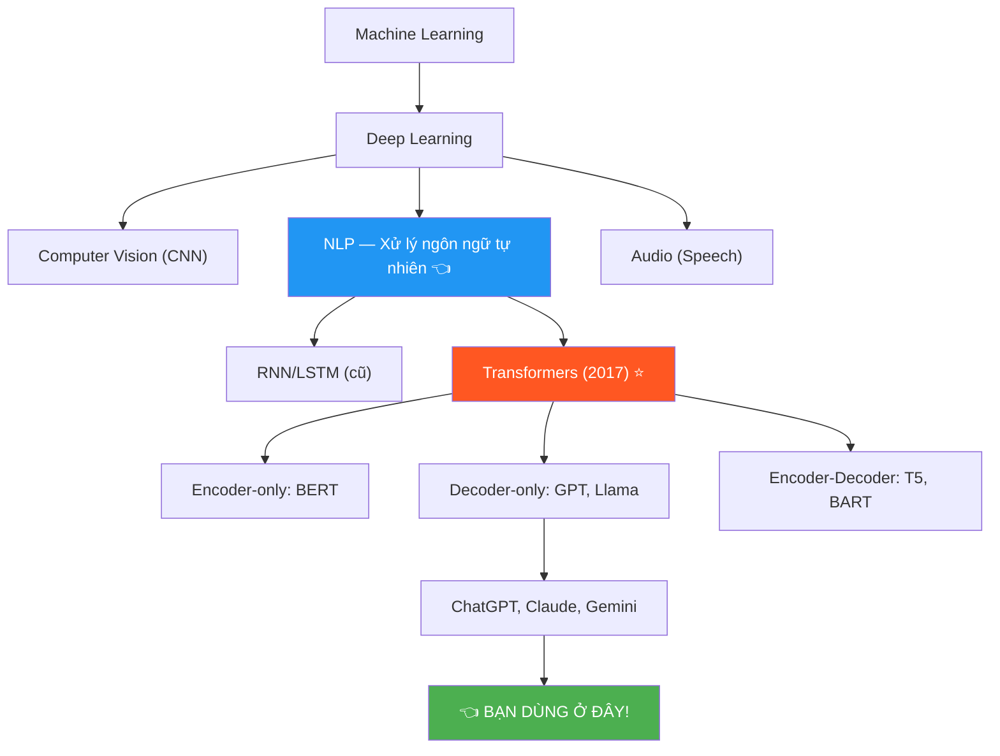
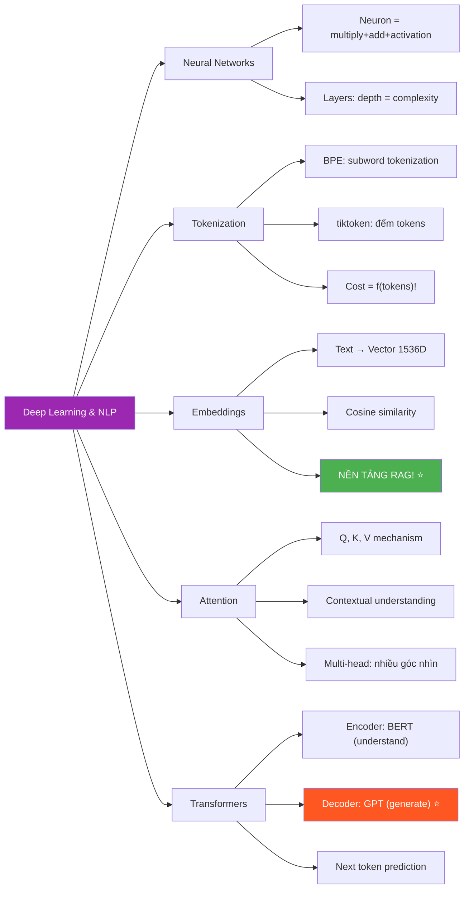

# 🧠 Deep Learning & NLP Overview — Phase 2, Tuần 2

> 📅 Thuộc Phase 2 của [AI Solution Engineer Roadmap](./AI%20Solution%20Engineer%20Roadmap.md)
> 📖 Tiếp nối [ML Overview — Phase 2, Tuần 1](./ML%20Overview%20-%20Phase%202%20Tuần%201.md)
> 🎯 Mục tiêu: Hiểu Transformers, Attention, Tokenization, Embeddings — nền tảng của MỌI LLM!

---

## 🗺️ Mental Map — Deep Learning & NLP trong AI Stack



```
  Tuần này bạn sẽ hiểu:

  1. Neural Networks hoạt động thế nào? (cốt lõi Deep Learning)
  2. Tại sao Transformers thay đổi MỌI THỨ?
  3. Attention — cơ chế "chú ý" THIÊN TÀI!
  4. Tokenization — máy đọc text THẾ NÀO?
  5. Embeddings — biến text thành VECTOR (nền tảng RAG!)

  → 5 khái niệm này = NỀN TẢNG cho mọi thứ bạn làm với LLM!
```

---

## 📖 Mục lục

1. [Neural Networks — Bộ não nhân tạo](#1-neural-networks--bộ-não-nhân-tạo)
2. [NLP là gì? — Máy hiểu ngôn ngữ](#2-nlp-là-gì--máy-hiểu-ngôn-ngữ)
3. [Tokenization — Cách máy "đọc" text](#3-tokenization--cách-máy-đọc-text)
4. [Embeddings — Biến text thành số](#4-embeddings--biến-text-thành-số)
5. [Attention Mechanism — "Chú ý" vào thứ quan trọng](#5-attention-mechanism--chú-ý-vào-thứ-quan-trọng)
6. [Transformers — Kiến trúc thay đổi thế giới](#6-transformers--kiến-trúc-thay-đổi-thế-giới)
7. [LLMs — Từ Transformer đến ChatGPT](#7-llms--từ-transformer-đến-chatgpt)

---

# 1. Neural Networks — Bộ não nhân tạo

> 🧱 **Pattern: First Principles — Neural Network = hàm toán học KHỔNG LỒ**

### Neuron nhân tạo = 1 phép tính

```
  Neuron sinh học:
    Tín hiệu điện vào → Xử lý → Tín hiệu ra (hoặc không)

  Neuron nhân tạo:
    Số vào → Nhân trọng số → Cộng → Activation → Số ra

       x₁ ──×w₁──┐
                  │
       x₂ ──×w₂──┼──→ Σ + b ──→ f(z) ──→ output
                  │
       x₃ ──×w₃──┘

    z = x₁×w₁ + x₂×w₂ + x₃×w₃ + b
    output = f(z)   ← activation function
```

```python
import math

# ═══ 1 Neuron = 1 function đơn giản! ═══

def neuron(inputs, weights, bias):
    """
    inputs:  [x₁, x₂, x₃] — data đầu vào
    weights: [w₁, w₂, w₃] — trọng số (model TỰ HỌC!)
    bias:    b — độ lệch (model TỰ HỌC!)
    """
    # Bước 1: Tính tổng có trọng số
    z = sum(x * w for x, w in zip(inputs, weights)) + bias
    
    # Bước 2: Activation function (ReLU)
    output = max(0, z)  # ReLU: nếu z < 0 → 0, nếu z >= 0 → z
    
    return output

# Ví dụ:
inputs = [1.0, 2.0, 3.0]     # Dữ liệu
weights = [0.5, -0.3, 0.8]   # Trọng số (model đã học)
bias = 0.1

result = neuron(inputs, weights, bias)
# z = 1.0×0.5 + 2.0×(-0.3) + 3.0×0.8 + 0.1
# z = 0.5 - 0.6 + 2.4 + 0.1 = 2.4
# output = max(0, 2.4) = 2.4
```

### Activation Functions — Tại sao cần?

```
  🔍 5 Whys: Tại sao cần activation function?

  Q1: Tại sao không dùng z trực tiếp (linear)?
  A1: Vì nhiều layers LINEAR = chỉ 1 layer LINEAR! Vô nghĩa!
      (a×(b×x + c) + d = A×x + B → vẫn là linear!)

  Q2: Non-linear giải quyết gì?
  A2: Cho phép model học ĐƯỜNG CONG! Không chỉ đường thẳng!

  Q3: ReLU là gì?
  A3: f(z) = max(0, z) → âm thành 0, dương giữ nguyên
      → Đơn giản, tính NHANH, hiệu quả!

  Q4: Sigmoid là gì? Khi nào dùng?
  A4: f(z) = 1/(1+e⁻ᶻ) → output từ 0 đến 1
      → Dùng cho XÁC SUẤT (classification cuối cùng)!

  Q5: Softmax?
  A5: Biến vector → xác suất (tổng = 1)
      → [2.0, 1.0, 0.1] → [0.73, 0.24, 0.03]
      → Token nào xác suất CAO NHẤT? → chọn!
      → GPT dùng Softmax ở OUTPUT LAYER!
```

```
  Activation Functions:

  ReLU:         ╱           Sigmoid:        ___───
               ╱                          ╱
  ─────0──────╱            ────────────╱───────
              (z=0)                   (z=0)
  
  f(z) = max(0, z)        f(z) = 1 / (1 + e⁻ᶻ)
  Range: [0, ∞)            Range: (0, 1)
  Dùng: hidden layers      Dùng: binary output
```

### 🔧 Reverse Engineering: Tự xây Neural Network mini!

```python
import random
import math

class MiniNeuralNetwork:
    """Neural Network 2 layers — phân loại AND gate!"""

    def __init__(self):
        # Random weights
        self.w1 = [random.uniform(-1, 1) for _ in range(2)]
        self.b1 = random.uniform(-1, 1)
        self.w2 = random.uniform(-1, 1)
        self.b2 = random.uniform(-1, 1)

    def sigmoid(self, z):
        return 1 / (1 + math.exp(-z))

    def forward(self, x):
        """Forward pass: input → output"""
        # Hidden neuron
        z1 = x[0] * self.w1[0] + x[1] * self.w1[1] + self.b1
        h1 = self.sigmoid(z1)

        # Output neuron
        z2 = h1 * self.w2 + self.b2
        output = self.sigmoid(z2)
        return output, h1

    def train(self, data, labels, epochs=5000, lr=1.0):
        """Train bằng gradient descent THỦ CÔNG!"""
        for epoch in range(epochs):
            total_loss = 0
            for x, y in zip(data, labels):
                # Forward
                pred, h1 = self.forward(x)
                loss = (y - pred) ** 2
                total_loss += loss

                # Backward (gradient descent thủ công)
                d_output = 2 * (pred - y) * pred * (1 - pred)
                d_w2 = d_output * h1
                d_b2 = d_output
                d_h1 = d_output * self.w2 * h1 * (1 - h1)

                # Update weights
                self.w2 -= lr * d_w2
                self.b2 -= lr * d_b2
                self.w1[0] -= lr * d_h1 * x[0]
                self.w1[1] -= lr * d_h1 * x[1]
                self.b1 -= lr * d_h1

            if epoch % 1000 == 0:
                print(f"Epoch {epoch}: loss = {total_loss:.4f}")

# AND gate: (0,0)→0, (0,1)→0, (1,0)→0, (1,1)→1
data = [[0,0], [0,1], [1,0], [1,1]]
labels = [0, 0, 0, 1]

nn = MiniNeuralNetwork()
nn.train(data, labels)

# Test:
for x in data:
    pred, _ = nn.forward(x)
    print(f"{x} → {pred:.4f} (expected: {1 if x==[1,1] else 0})")
# [0, 0] → 0.02  ✅
# [0, 1] → 0.04  ✅
# [1, 0] → 0.04  ✅
# [1, 1] → 0.96  ✅ — Nó HỌC ĐƯỢC!
```

```
  Tóm tắt Neural Network:

  ┌─────────────────────────────────────────────────┐
  │  1. MỖI neuron = phép nhân + cộng + activation  │
  │  2. NHIỀU neurons = 1 layer                     │
  │  3. NHIỀU layers = "deep" neural network        │
  │  4. Forward: data → qua layers → prediction     │
  │  5. Loss: đo sai số prediction vs ground truth   │
  │  6. Backward: tính gradient → sửa weights       │
  │  7. Lặp lại 4-6 hàng TRIỆU lần = TRAINING!     │
  └─────────────────────────────────────────────────┘
```

---

# 2. NLP là gì? — Máy hiểu ngôn ngữ

> 🔄 **Pattern: Contextual History — NLP từ rules đến Deep Learning**

### Lịch sử NLP

```
  1950s-1990s: RULE-BASED NLP
    → Con người viết QUY TẮC ngữ pháp
    → "Nếu chủ ngữ + động từ + tân ngữ → câu đúng"
    → ❌ THẤT BẠI! Ngôn ngữ quá phức tạp cho rules!
    
    Ví dụ: "Time flies like an arrow"
    → "Thời gian bay như mũi tên" ✅
    NHƯNG: "Fruit flies like a banana"
    → "Ruồi trái cây thích chuối" 🤔 (flies = ruồi, không phải bay!)
    → Rules KHÔNG xử lý được ambiguity (nhập nhằng)!

  2000s: STATISTICAL NLP
    → Dùng xác suất thay vì rules
    → "Từ nào hay xuất hiện CẠNH từ nào?"
    → Tốt hơn rules, nhưng CẦN feature engineering thủ công!

  2013: Word2Vec (Google) — ĐIỂM NGOẶT ĐẦU TIÊN!
    → Biến từ → vector! "king" - "man" + "woman" = "queen"!
    → Máy BẮT ĐẦU "hiểu" nghĩa từ!

  2017: Transformer — ĐIỂM NGOẶT THỨ HAI!
    → "Attention Is All You Need"
    → Tốt hơn MỌI THỨ trước đó!
    → Dẫn đến GPT, BERT, và mọi LLM hiện tại!
```

### Các bài toán NLP phổ biến

```
  ┌───────────────────┬──────────────────────────────────┐
  │ Bài toán          │ Ví dụ                            │
  ├───────────────────┼──────────────────────────────────┤
  │ Text Classificat. │ Spam detection, sentiment        │
  │ Named Entity Rec. │ "Hà Nội" = Location              │
  │ Machine Translat. │ English → Vietnamese             │
  │ Summarization     │ Tóm tắt bài báo                  │
  │ Question Answering│ Hỏi đáp trên tài liệu (RAG!)    │
  │ Text Generation   │ Viết thơ, code, email            │
  │ Chatbot           │ ChatGPT, Claude                  │
  └───────────────────┴──────────────────────────────────┘

  AI Solution Engineer chủ yếu làm:
    → Question Answering (RAG!)
    → Text Generation (prompt engineering!)
    → Chatbot (agent!)
```

---

# 3. Tokenization — Cách máy "đọc" text

> 🧱 **Pattern: First Principles — Máy KHÔNG hiểu chữ! Chỉ hiểu SỐ!**

### Vấn đề cốt lõi

```
  Máy tính CHỈ HIỂU SỐ:
    Neural Network nhận INPUT là NUMBERS
    "Hello world" → ???? → Numbers

  TOKENIZATION = quá trình biến TEXT → NUMBERS!

  "Hello world" → tokenize → [15339, 1917] → Neural Network
```

### 3 cấp độ Tokenization

```
  ┌───────────────────────────────────────────────────────┐
  │  LEVEL 1: Character-level (ký tự)                    │
  │                                                       │
  │  "Hello" → ['H', 'e', 'l', 'l', 'o'] → [72, 101, ...]│
  │                                                       │
  │  ✅ Vocab size nhỏ (~256 ký tự)                       │
  │  ❌ Chuỗi token DÀI → chậm! ("Hello" = 5 tokens!)    │
  │  ❌ Mất ngữ nghĩa (từng ký tự không có nghĩa!)       │
  └───────────────────────────────────────────────────────┘

  ┌───────────────────────────────────────────────────────┐
  │  LEVEL 2: Word-level (từ)                             │
  │                                                       │
  │  "Hello world" → ['Hello', 'world'] → [4521, 8293]   │
  │                                                       │
  │  ✅ Mỗi token có NGHĨA                               │
  │  ❌ Vocab size KHỔNG LỒ (>1 triệu từ tiếng Anh!)    │
  │  ❌ Từ mới (typo, slang) → UNKNOWN token! 😱          │
  │     "ChatGPT" → [UNKNOWN] (không có trong vocab!)     │
  └───────────────────────────────────────────────────────┘

  ┌───────────────────────────────────────────────────────┐
  │  LEVEL 3: Subword-level (phần từ) ⭐ DÙNG THỰC TẾ!   │
  │                                                       │
  │  "unhappiness" → ["un", "happi", "ness"]              │
  │  "ChatGPT"    → ["Chat", "G", "PT"]                  │
  │                                                       │
  │  ✅ Vocab vừa phải (~50,000 subwords)                 │
  │  ✅ Xử lý được từ MỚI (chia nhỏ thành subwords!)     │
  │  ✅ Cân bằng giữa character và word level             │
  │                                                       │
  │  Algorithms: BPE, WordPiece, SentencePiece            │
  │  GPT dùng: BPE (Byte Pair Encoding)                   │
  └───────────────────────────────────────────────────────┘
```

### BPE — Byte Pair Encoding (GPT dùng!)

```
  🔍 5 Whys: Tại sao GPT dùng BPE?

  Q1: BPE hoạt động thế nào?
  A1: Bắt đầu từ CHARACTERS → GHÉP cặp xuất hiện NHIỀU NHẤT → lặp lại!

  Q2: Ví dụ?
  A2: Corpus: "low lower lowest"
      Bước 1: [l,o,w] [l,o,w,e,r] [l,o,w,e,s,t]
      Cặp "l,o" nhiều nhất → ghép: "lo"
      Bước 2: [lo,w] [lo,w,e,r] [lo,w,e,s,t]
      Cặp "lo,w" nhiều nhất → ghép: "low"
      Bước 3: [low] [low,e,r] [low,e,s,t]
      → "low" = 1 token! "lower" = ["low","er"]!

  Q3: Tại sao tốt?
  A3: Từ PHỔ BIẾN = 1 token (nhanh!)
      Từ HIẾM = nhiều subword tokens (vẫn encode được!)

  Q4: Tiếng Việt thì sao?
  A4: "xin chào" → ["x", "in", " ch", "ào"] (phụ thuộc tokenizer!)
      → Tiếng Việt thường NHIỀU tokens hơn tiếng Anh!
      → QUAN TRỌNG: ảnh hưởng tới CHI PHÍ và CONTEXT WINDOW!

  Q5: AI Engineer cần biết gì?
  A5: → Đếm tokens (biết chi phí!) tiktoken library
      → Biết context window limit (4K, 8K, 128K tokens)
      → Ước lượng: 1 token ≈ 0.75 từ tiếng Anh
```

```python
# ═══ Thực hành: đếm tokens với tiktoken ═══

import tiktoken

# GPT-4 dùng encoding "cl100k_base"
enc = tiktoken.encoding_for_model("gpt-4")

text = "Hello, how are you today?"
tokens = enc.encode(text)
print(f"Text: {text}")
print(f"Tokens: {tokens}")
print(f"Số tokens: {len(tokens)}")
# Text: Hello, how are you today?
# Tokens: [9906, 11, 1268, 527, 499, 3432, 30]
# Số tokens: 7

# Decode ngược lại
for token_id in tokens:
    print(f"  {token_id} → '{enc.decode([token_id])}'")
# 9906  → 'Hello'
# 11    → ','
# 1268  → ' how'
# 527   → ' are'
# 499   → ' you'
# 3432  → ' today'
# 30    → '?'

# Tiếng Việt — NHIỀU tokens hơn!
text_vi = "Xin chào, bạn khỏe không?"
tokens_vi = enc.encode(text_vi)
print(f"Tiếng Việt: {len(tokens_vi)} tokens")  # ~15 tokens!
# → Tiếng Việt tốn NHIỀU tokens hơn tiếng Anh ~2x!

# ⚠️ AI Engineer phải biết:
# Giá GPT-4: $0.03/1000 input tokens
# 1000 từ tiếng Anh ≈ 1300 tokens ≈ $0.039
# 1000 từ tiếng Việt ≈ 2500 tokens ≈ $0.075 → GẤP ĐÔI!
```

---

# 4. Embeddings — Biến text thành số

> 🧱 **Pattern: First Principles — Embedding = TỌA ĐỘ trong không gian ý nghĩa**

### Vấn đề: Máy cần hiểu "NGHĨA" của từ

```
  Token ID chỉ là SỐ THỨ TỰ — KHÔNG CÓ NGHĨA!
    "king" = 5765
    "queen" = 9047
    → 5765 và 9047 = 2 số BẤT KỲ! Máy KHÔNG biết chúng liên quan!

  EMBEDDING giải quyết:
    "king"  → [0.8, 0.2, -0.5, 0.9, ...]    (1536 chiều!)
    "queen" → [0.75, 0.25, -0.4, 0.85, ...]  (1536 chiều!)
    → HAI VECTOR GẦN NHAU! → Máy biết chúng LIÊN QUAN!
```

### Analogy: Tọa độ trên bản đồ

```
  Mỗi từ = 1 ĐIỂM trên bản đồ ý nghĩa!

  Giả sử chỉ có 2 chiều (thực tế: 1536 chiều!):
    Chiều X = Giới tính (←Nam ─── Nữ→)
    Chiều Y = Quyền lực (↓ Thấp ─── Cao ↑)

         Cao ↑
              │  ★ king      ★ queen
              │
              │  ★ man       ★ woman
              │
              │  ★ boy       ★ girl
         Thấp ┼────────────────────→
             Nam               Nữ

  Phép toán VECTOR:
    king - man + woman = ?
    (0.8, 0.9) - (0.8, 0.3) + (0.2, 0.3)
    = (0.2, 0.9) ≈ queen!

  → "KING - MAN + WOMAN = QUEEN" ← vector arithmetic!
  → Embeddings ENCODE ý nghĩa thành TỌA ĐỘ!
```

### Embedding = NỀN TẢNG của RAG!

```
  🔍 5 Whys: Tại sao Embeddings quan trọng cho AI Engineer?

  Q1: RAG cần embeddings ở đâu?
  A1: Biến documents → vectors → lưu vào Vector DB!

  Q2: Vector DB dùng embeddings thế nào?
  A2: Tìm documents "GẦN NHẤT" với câu hỏi!
      query = "Python là gì?"  → vector Q
      doc1 = "Python programming" → vector D1 (GẦN Q!)
      doc2 = "Con trăn Python"   → vector D2 (GẦN Q!)
      doc3 = "Công thức nấu phở" → vector D3 (XA Q!)
      → Trả về D1, D2!

  Q3: "Gần" nghĩa là gì?
  A3: Cosine Similarity! Đo GÓC giữa 2 vectors:
      cos(Q, D1) = 0.95 → RẤT GIỐNG! ✅
      cos(Q, D3) = 0.12 → KHÔNG LIÊN QUAN! ❌

  Q4: Ai tạo embeddings?
  A4: Embedding models! OpenAI, Cohere, HuggingFace...
      Bạn GỌI API → nhận vector!

  Q5: Tại sao 1536 chiều?
  A5: Nhiều chiều = encode NHIỀU ngắc nghĩa hơn!
      3 chiều: chỉ biết "vua/nữ hoàng/quyền lực"
      1536 chiều: biết ý nghĩa, ngữ cảnh, cảm xúc, thể loại,...!
```

```python
# ═══ Tạo Embeddings với OpenAI ═══

from openai import OpenAI
import numpy as np

client = OpenAI()

def get_embedding(text: str) -> list[float]:
    """Biến text → vector 1536 chiều"""
    response = client.embeddings.create(
        model="text-embedding-3-small",
        input=text,
    )
    return response.data[0].embedding

# Tạo embeddings
vec_python = get_embedding("Python programming language")
vec_java = get_embedding("Java programming language")
vec_cooking = get_embedding("How to cook pasta")

print(f"Dimensions: {len(vec_python)}")  # 1536

# ═══ Cosine Similarity — Đo độ GIỐNG ═══

def cosine_similarity(a, b):
    """Cosine similarity: 1 = giống hệt, 0 = không liên quan, -1 = ngược"""
    a, b = np.array(a), np.array(b)
    return np.dot(a, b) / (np.linalg.norm(a) * np.linalg.norm(b))

print(f"Python vs Java:    {cosine_similarity(vec_python, vec_java):.4f}")
# → 0.89 — RẤT GIỐNG! (cùng programming!)

print(f"Python vs Cooking:  {cosine_similarity(vec_python, vec_cooking):.4f}")
# → 0.21 — KHÔNG LIÊN QUAN!
```

### 🔧 Reverse Engineering: Tự xây Embedding đơn giản

```python
# ═══ Mini Embedding: hiểu NGUYÊN LÝ! ═══

# Sự thật: Embedding = LOOKUP TABLE + Training!

class MiniEmbedding:
    """Embedding đơn giản — mỗi từ = 1 vector ngẫu nhiên"""
    
    def __init__(self, vocab_size=100, embed_dim=8):
        import random
        # Bảng lookup: mỗi ID → 1 vector
        self.table = {
            i: [random.gauss(0, 1) for _ in range(embed_dim)]
            for i in range(vocab_size)
        }
    
    def embed(self, token_id: int) -> list[float]:
        """Tra bảng: ID → vector"""
        return self.table[token_id]

# Trong thực tế:
# 1. Khởi tạo bảng NGẪU NHIÊN
# 2. TRAINING: vectors tự DỊCH CHUYỂN
#    → Từ liên quan → vectors GẦN nhau
#    → Từ không liên quan → vectors XA nhau
# 3. Kết quả: bảng lookup đã được "train"!
#    "king" → [0.8, 0.2, ...]  (gần "queen"!)

# GPT-4 embedding table:
#   ~100,000 tokens × 1536 dimensions
#   = 153,600,000 parameters CHỈ CHO BẢNG EMBEDDING!
```

---

# 5. Attention Mechanism — "Chú ý" vào thứ quan trọng

> 🧱 **Pattern: First Principles — Attention giải quyết vấn đề "NGỮ CẢNH"**

### Vấn đề: Từ có NHIỀU NGHĨA!

```
  "Bank" = ?
    "I went to the BANK to deposit money"  → NGÂN HÀNG
    "I sat on the river BANK"               → BỜ SÔNG

  → CÙNG 1 TỪ nhưng KHÁC NGHĨA tùy ngữ cảnh!
  → Embedding CỐ ĐỊNH (Word2Vec) không giải quyết được!
  → Cần embedding THAY ĐỔI theo ngữ cảnh = CONTEXTUAL embedding!
  → ATTENTION giải quyết vấn đề này! ✅
```

### Attention = "Nhìn vào TẤT CẢ từ để hiểu MỖI từ"

```
  Analogy: Đọc hiểu tiếng Anh

  Bạn đọc: "The cat sat on the mat because it was tired"
  "it" trỏ đến gì?

  Não bạn LÀM:
    "it" CHĂM CHÚ nhìn → "cat" (0.8 attention! Rất liên quan!)
    "it" liếc nhìn → "mat" (0.1 attention, ít liên quan)
    "it" liếc nhìn → "sat" (0.05 attention)
    "it" liếc nhìn → "the" (0.02 attention)

  → "it" = "the cat"! Vì attention score với "cat" CAO NHẤT!

  ATTENTION = mỗi từ "nhìn" TẤT CẢ từ khác
              → xác định từ nào QUAN TRỌNG nhất
              → dùng thông tin đó để hiểu NGHĨA hiện tại!
```

### Self-Attention — Cơ chế kỹ thuật

```
  Mỗi từ tạo 3 vectors:
    Q (Query):  "Tôi ĐANG TÌM thông tin gì?"
    K (Key):    "Tôi CUNG CẤP thông tin gì?"
    V (Value):  "Thông tin CỤ THỂ tôi có?"

  Quy trình:
  ┌─────────────────────────────────────────────────┐
  │  1. Mỗi từ tạo Q, K, V (qua learned matrices)  │
  │                                                  │
  │  2. Tính attention score:                        │
  │     score(i,j) = Q_i · K_j / √d                 │
  │     (dot product giữa Query_i và Key_j)          │
  │     (chia √d để ổn định)                         │
  │                                                  │
  │  3. Softmax → xác suất                          │
  │     weights = softmax(scores)                    │
  │     [0.7, 0.15, 0.1, 0.05] → tổng = 1.0!       │
  │                                                  │
  │  4. Tính output = Σ(weight_j × V_j)             │
  │     → Output = HỖN HỢP có trọng số của Values!  │
  └─────────────────────────────────────────────────┘
```

```
  Ví dụ cụ thể:

  Câu: "The cat sat"

  Từ "sat" tính attention:
    Q_sat · K_The = 0.1     (mạo từ, ít liên quan)
    Q_sat · K_cat = 0.8     (AI ĐANG ngồi? → con mèo! Rất liên quan!)
    Q_sat · K_sat = 0.3     (chính nó, tham khảo)

    Softmax([0.1, 0.8, 0.3]) = [0.08, 0.62, 0.30]

    Output_sat = 0.08 × V_The + 0.62 × V_cat + 0.30 × V_sat
    → Output chứa NHIỀU thông tin từ "cat" nhất!
    → "sat" HIỂU nó liên quan đến "cat"!
```

### Multi-Head Attention — Nhìn từ NHIỀU GÓC

```
  1 attention head:  Nhìn 1 kiểu (ai ngồi?)
  8 attention heads: Nhìn 8 kiểu KHÁC NHAU cùng lúc!

  Head 1: "Ai thực hiện hành động?" (cat → sat)
  Head 2: "Hành động ở đâu?" (sat → on the mat)
  Head 3: "Tại sao?" (sat → because tired)
  Head 4: "Thì gì?" (sat → past tense)
  ...

  → Multi-head = GIÀU thông tin hơn!
  → GPT-4 dùng ~100+ heads!
```

---

# 6. Transformers — Kiến trúc thay đổi thế giới

> 🔄 **Pattern: Contextual History — Trước Transformer, NLP dùng gì?**

### Trước Transformers: RNN & LSTM

```
  RNN (Recurrent Neural Network, 1986):
    → Đọc text TUẦN TỰ: word₁ → word₂ → word₃ → ...
    → Giống bạn đọc sách: từ trái → phải, 1 từ 1 thời điểm

    ❌ Vấn đề 1: CHẬM! Token sau phải CHỜ token trước!
       → Không parallelize được → training CỰC CHẬM!

    ❌ Vấn đề 2: QUÊN! Câu dài → quên từ đầu!
       "Tôi sinh ra ở Việt Nam, lớn lên ở ... quốc tịch ___"
       → Đến "quốc tịch", đã QUÊN "Việt Nam"! (vanishing gradient)

  LSTM (1997): Cải tiến RNN — nhớ TỐT HƠN nhưng vẫn CHẬM!

  Transformer (2017): GIẢI QUYẾT CẢ 2!
    ✅ Nhanh: xử lý MỌI từ CÙNG LÚC (parallel!)
    ✅ Nhớ: Attention nhìn MỌI từ trực tiếp (không quên!)
```

```
  📐 Trade-off: RNN vs Transformer

  ┌──────────────┬──────────────────┬──────────────────┐
  │              │ RNN/LSTM         │ Transformer      │
  ├──────────────┼──────────────────┼──────────────────┤
  │ Xử lý       │ Tuần tự (→)      │ Song song (⇉) ✅ │
  │ Tốc độ train│ Chậm             │ Nhanh ✅          │
  │ Long-range  │ Quên xa ❌        │ Nhớ hết ✅        │
  │ Memory      │ O(1) state       │ O(n²) attention ❌│
  │ Scaling     │ Khó              │ Tốt (GPUs!) ✅    │
  └──────────────┴──────────────────┴──────────────────┘

  Transformer đánh đổi: O(n²) memory cho attention!
    n=1000 tokens: 1M attention pairs → OK!
    n=100,000 tokens: 10 BILLION pairs → NHIỀU RAM! 💀
    → Đây là lý do context window BỊ GIỚI HẠN!
```

### Kiến trúc Transformer

```
  Paper gốc: "Attention Is All You Need" (2017)
  → Hai phần: ENCODER + DECODER

  ┌───────────────────────────────────────────────────┐
  │                  TRANSFORMER                      │
  │                                                   │
  │  ┌─────────────┐           ┌─────────────┐       │
  │  │   ENCODER    │           │   DECODER    │       │
  │  │              │           │              │       │
  │  │  Input       │           │  Output      │       │
  │  │  Embedding   │           │  Embedding   │       │
  │  │      ↓       │           │      ↓       │       │
  │  │  Positional  │           │  Positional  │       │
  │  │  Encoding    │           │  Encoding    │       │
  │  │      ↓       │           │      ↓       │       │
  │  │  Self-       │    ──→    │  Masked      │       │
  │  │  Attention   │   cross   │  Self-Attn   │       │
  │  │      ↓       │   attn    │      ↓       │       │
  │  │  Feed        │           │  Cross-Attn  │       │
  │  │  Forward     │           │      ↓       │       │
  │  │              │           │  Feed Fwd    │       │
  │  │   ×N layers  │           │   ×N layers  │       │
  │  └─────────────┘           └─────────────┘       │
  │                                   ↓               │
  │                              Output Probs         │
  └───────────────────────────────────────────────────┘
```

### 3 variants — AI Engineer phải biết!

```
  ┌───────────────────────────────────────────────────────┐
  │  ENCODER-ONLY (BERT, 2018)                           │
  │  → "Đọc hiểu" — hiểu ngữ cảnh TOÀN BỘ câu         │
  │  → Nhìn CẢ TRÁI VÀ PHẢI (bidirectional)             │
  │  → Dùng cho: classification, NER, similarity         │
  │  → Embedding models thường ENCODER-ONLY!             │
  └───────────────────────────────────────────────────────┘

  ┌───────────────────────────────────────────────────────┐
  │  DECODER-ONLY (GPT, 2018) ⭐ QUAN TRỌNG NHẤT!       │
  │  → "Sinh text" — dự đoán token TIẾP THEO            │
  │  → Chỉ nhìn được bên TRÁI (causal/autoregressive)   │
  │  → Dùng cho: ChatGPT, Claude, Llama, Gemini         │
  │  → ĐÂY LÀ THỨ BẠN DÙNG HÀNG NGÀY!                 │
  └───────────────────────────────────────────────────────┘

  ┌───────────────────────────────────────────────────────┐
  │  ENCODER-DECODER (T5, BART)                          │
  │  → "Đọc rồi viết" — input → biến đổi → output      │
  │  → Dùng cho: translation, summarization              │
  └───────────────────────────────────────────────────────┘
```

### Positional Encoding — Tại sao cần?

```
  ⚠️ Attention xử lý SONG SONG → KHÔNG biết THỨ TỰ từ!

  "Con mèo ĂN con cá" ≠ "Con cá ĂN con mèo"!
  → Nhưng attention chỉ thấy TẬP HỢP từ, không biết thứ tự!

  GIẢI PHÁP: Thêm "vị trí" vào embedding!

  Embedding("mèo") = [0.5, 0.3, 0.8, ...]
  Position(0)       = [0.0, 1.0, 0.0, ...]  ← mã vị trí từ đầu tiên
  Final             = [0.5, 1.3, 0.8, ...]  ← cộng lại!

  → Cùng từ "mèo" ở VỊ TRÍ KHÁC → vector KHÁC!
  → Model biết THỨTỰ!
```

---

# 7. LLMs — Từ Transformer đến ChatGPT

> 🔄 **Pattern: Contextual History — Con đường đến GPT-4**

### Timeline LLMs

```
  2017: Transformer (Google) — kiến trúc nền tảng
  2018: GPT-1 (OpenAI) — 117M params — chứng minh pre-training hoạt động
  2018: BERT (Google) — 340M params — bidirectional, tốt cho NLU
  2019: GPT-2 (OpenAI) — 1.5B params — "quá nguy hiểm để release"
  2020: GPT-3 (OpenAI) — 175B params — few-shot learning, API ra đời!
  2022: ChatGPT (GPT-3.5 + RLHF) — AI đi vào đời thường!
  2023: GPT-4 — multimodal (text + image), 1.8T params (ước tính)
  2023: Llama 2 (Meta) — open source, cộng đồng bùng nổ!
  2024: Claude 3 (Anthropic), Gemini (Google), Llama 3 (Meta)
  2025: GPT-5(?), Claude 4(?), Gemini 2.0(?)

  ┌─────────────────────────────────────────────────────┐
  │  Model size explosion:                              │
  │                                                     │
  │  GPT-1:    117,000,000         (117 triệu)         │
  │  GPT-2:  1,500,000,000         (1.5 tỷ) = 13x      │
  │  GPT-3: 175,000,000,000       (175 tỷ) = 117x      │
  │  GPT-4: ~1,800,000,000,000    (1.8 nghìn tỷ!) 10x  │
  │                                                     │
  │  → Scaling Law: model LỚN HƠN + data NHIỀU HƠN     │
  │    = model THÔNG MINH HƠN (đến một giới hạn nào đó) │
  └─────────────────────────────────────────────────────┘
```

### LLM hoạt động thế nào? (Really!)

```
  GPT = NEXT TOKEN PREDICTOR!

  Input: "Thủ đô của Việt Nam là"
  
  GPT tính xác suất cho MỌI token trong vocab:
    "Hà"    → 72%  ← cao nhất!
    "Sài"   → 8%
    "Đà"    → 3%
    "thành" → 2%
    ...
  
  → Chọn "Hà" (xác suất cao nhất nếu temperature=0)

  Tiếp: "Thủ đô của Việt Nam là Hà"
    "Nội"  → 95%
    "Giang"→ 2%
    "Tĩnh" → 1%
    ...
  
  → Chọn "Nội"

  Tiếp: "Thủ đô của Việt Nam là Hà Nội"
    "."    → 60%
    ","    → 20%
    [EOS]  → 15%
    ...
  
  → Chọn "." → DỪNG!

  → GPT = GỌI function predict_next_token() LẶP ĐI LẶP LẠI!
  → KHÔNG có "suy nghĩ" hay "hiểu biết"!
  → CHỈ là xác suất thống kê cực kỳ mạnh!
```

### Các mốc quan trọng AI Engineer cần biết

```
  ┌──────────────┬──────────────┬──────────────┬──────────────┐
  │ Model        │ Provider     │ Params       │ Đặc điểm     │
  ├──────────────┼──────────────┼──────────────┼──────────────┤
  │ GPT-4o       │ OpenAI       │ ~1.8T (?)    │ Nhanh, rẻ    │
  │ GPT-4        │ OpenAI       │ ~1.8T (?)    │ Mạnh nhất (?)|
  │ Claude 3.5   │ Anthropic    │ ? (bí mật)   │ An toàn, dài │
  │ Gemini Pro   │ Google       │ ? (bí mật)   │ Multimodal   │
  │ Llama 3 70B  │ Meta (open!) │ 70B          │ Tự host được │
  │ Mistral 8x7B │ Mistral (FR) │ 47B (MoE)    │ Nhanh, tốt   │
  │ Phi-3        │ Microsoft    │ 3.8B         │ Nhỏ, edge    │
  └──────────────┴──────────────┴──────────────┴──────────────┘

  📐 Trade-off: Model size
    LỚN (GPT-4):   Thông minh ✅ | Chậm ❌ | Đắt ❌
    NHỎ (Phi-3):   Nhanh ✅ | Rẻ ✅ | Kém hơn ❌
    OPEN (Llama):   Tự host ✅ | Privacy ✅ | Cần GPU ❌

  AI Engineer phải biết chọn MODEL PHÙ HỢP cho use case!
```

---

## 📐 Tổng kết Mental Map



```
  ┌────────────────────────────────────────────────────────┐
  │  Phase 2 Tuần 2 Checklist:                             │
  │                                                        │
  │  Neural Networks:                                      │
  │  □ Neuron = weights × inputs + bias → activation       │
  │  □ ReLU, Sigmoid, Softmax — khi nào dùng gì           │
  │  □ Forward pass → Loss → Backward pass → Update        │
  │                                                        │
  │  Tokenization:                                         │
  │  □ BPE: subword tokenization (GPT dùng!)              │
  │  □ tiktoken: đếm tokens → tính chi phí!               │
  │  □ Tiếng Việt ≈ 2x tokens so với tiếng Anh           │
  │                                                        │
  │  Embeddings:                                           │
  │  □ Text → Vector (1536 chiều)                         │
  │  □ Cosine similarity: đo độ giống nhau                │
  │  □ "king - man + woman = queen" — vector arithmetic    │
  │  □ NỀN TẢNG cho RAG! (Phase 3)                        │
  │                                                        │
  │  Attention:                                            │
  │  □ Q, K, V — Query tìm Key liên quan, lấy Value       │
  │  □ Self-attention: mỗi từ nhìn MỌI từ khác           │
  │  □ Multi-head: nhìn từ NHIỀU GÓC                      │
  │                                                        │
  │  Transformers & LLMs:                                  │
  │  □ Encoder (BERT) vs Decoder (GPT) vs Both (T5)       │
  │  □ GPT = next token predictor — lặp đi lặp lại       │
  │  □ Positional Encoding — encode thứ tự từ             │
  │  □ Biết chọn model phù hợp (size vs cost vs quality)  │
  └────────────────────────────────────────────────────────┘
```

---

## 📚 Tài liệu đọc thêm

```
  🎥 Video (PHẢI XEM):
    3Blue1Brown — "Visualizing Attention" (YouTube, 2024)
    3Blue1Brown — "How LLMs work" (YouTube, 2024)
    Andrej Karpathy — "Let's build GPT from scratch" (YouTube, 2 giờ)
    Andrej Karpathy — "Intro to Large Language Models" (1 giờ)

  📖 Đọc (CỰC HAY):
    "The Illustrated Transformer" — Jay Alammar (blog)
    "The Illustrated GPT-2" — Jay Alammar (blog)
    "Attention Is All You Need" — paper gốc (Google, 2017)
    "What is ChatGPT doing?" — Stephen Wolfram (blog)

  🛠️ Thực hành:
    tiktoken — thử đếm tokens cho tiếng Việt
    OpenAI Embeddings API — tạo thử embeddings
    Hugging Face — chạy model nhỏ trên máy!
    nanogpt (Karpathy) — GPT mini tự code!
```
