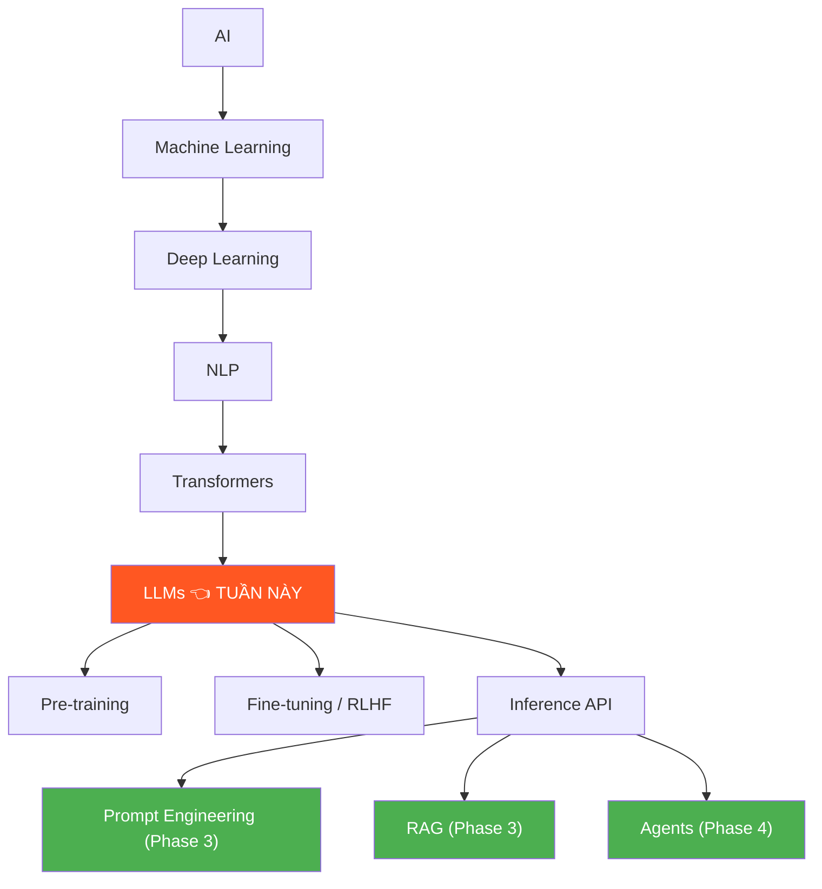
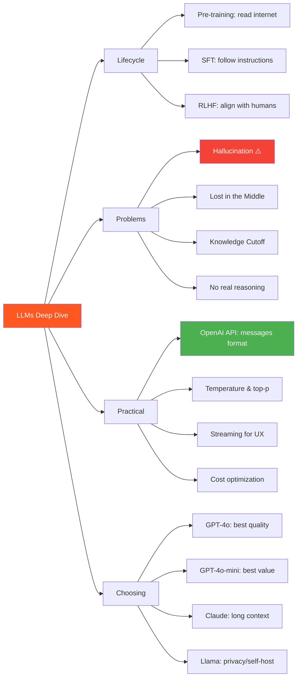

# 🗣️ LLM là gì? — Phase 2, Tuần 3: Hiểu sâu Large Language Models

> 📅 Thuộc Phase 2 của [AI Solution Engineer Roadmap](./AI%20Solution%20Engineer%20Roadmap.md)
> 📖 Tiếp nối [Deep Learning & NLP — Phase 2, Tuần 2](./Deep%20Learning%20NLP%20-%20Phase%202%20Tuần%202.md)
> 🎯 Mục tiêu: Hiểu LLM đủ sâu để GIẢI THÍCH, DEBUG, và ĐÁNH GIÁ — thứ khiến bạn khác biệt với "dùng ChatGPT bình thường"

---

## 🗺️ Mental Map — LLM trong bức tranh AI



```
  Tuần này = từ BIẾT "GPT dự đoán token tiếp theo"
            → HIỂU SÂU toàn bộ lifecycle của LLM!

  ┌────────────────────────────────────────────────────┐
  │  Bạn sẽ trả lời được:                             │
  │                                                    │
  │  ✅ LLM "học" từ đâu? Bao lâu? Tốn bao nhiêu?     │
  │  ✅ Pre-training vs Fine-tuning vs RLHF khác gì?   │
  │  ✅ Tại sao LLM "bịa" (hallucinate)?               │
  │  ✅ Context window 128K = thật sự đọc hết 128K?     │
  │  ✅ Temperature, top-p ảnh hưởng output thế nào?    │
  │  ✅ Khi nào GPT-4 vs GPT-3.5 vs Llama vs Claude?   │
  │  ✅ OpenAI API dùng thế nào?                        │
  └────────────────────────────────────────────────────┘
```

---

## 📖 Mục lục

1. [3 giai đoạn tạo ra ChatGPT](#1-3-giai-đoạn-tạo-ra-chatgpt)
2. [Pre-training — Đọc toàn bộ Internet](#2-pre-training--đọc-toàn-bộ-internet)
3. [Fine-tuning & RLHF — Dạy "lễ phép"](#3-fine-tuning--rlhf--dạy-lễ-phép)
4. [Hallucination — Tại sao LLM "bịa"?](#4-hallucination--tại-sao-llm-bịa)
5. [Context Window — Bộ nhớ ngắn hạn](#5-context-window--bộ-nhớ-ngắn-hạn)
6. [Decoding Strategies — Temperature & top-p](#6-decoding-strategies--temperature--top-p)
7. [OpenAI API — Thực hành gọi LLM](#7-openai-api--thực-hành-gọi-llm)
8. [So sánh & Chọn LLM phù hợp](#8-so-sánh--chọn-llm-phù-hợp)
9. [Open-source vs Closed-source LLMs](#9-open-source-vs-closed-source-llms)
10. [LLM Limitations — Giới hạn cần biết](#10-llm-limitations--giới-hạn-cần-biết)

---

# 1. 3 giai đoạn tạo ra ChatGPT

> 🔄 **Pattern: Contextual History — Từ text thô đến chatbot thông minh**

### Analogy: Đào tạo 1 bác sĩ

```
  GIAI ĐOẠN 1: ĐẠI HỌC Y KHOA (Pre-training)
    → Đọc TOÀN BỘ sách y khoa, giải phẫu, dược lý...
    → Mất 6 NĂM, tốn NHIỀU tiền
    → Kết quả: biết RẤT NHIỀU, nhưng chưa biết CÁCH NÓI CHUYỆN với bệnh nhân
    → Có thể nói lung tung, không đúng chủ đề

  GIAI ĐOẠN 2: THỰC TẬP (Supervised Fine-tuning — SFT)
    → Bác sĩ giỏi DẠY cách nói chuyện + khám bệnh
    → "Khi bệnh nhân hỏi X, trả lời Y"
    → Học từ VÍ DỤ MẪU (instruction-response pairs)
    → Kết quả: biết CÁCH trả lời theo format

  GIAI ĐOẠN 3: ĐÁNH GIÁ BỞI BỆNH NHÂN (RLHF)
    → Bệnh nhân đánh giá: "Câu trả lời A tốt hơn B"
    → Bác sĩ ĐIỀU CHỈNH cách nói để bệnh nhân HÀI LÒNG hơn
    → Kết quả: trả lời HỮU ÍCH + AN TOÀN + TRUNG THỰC

  ChatGPT = Bác sĩ đã qua CẢ 3 giai đoạn!
```

```
  ┌─────────────────────────────────────────────────────┐
  │  3 Stages of ChatGPT                               │
  │                                                     │
  │  Stage 1: PRE-TRAINING                              │
  │  Data: Internet text (~13 TRILLION tokens!)         │
  │  Cost: ~$100M USD                                   │
  │  Time: Months on thousands of GPUs                  │
  │  Goal: Predict next token                           │
  │  Result: "Base model" — biết nhiều, nói bừa         │
  │           ↓                                         │
  │  Stage 2: SUPERVISED FINE-TUNING (SFT)              │
  │  Data: ~100K instruction-response pairs              │
  │  Cost: ~$100K USD                                   │
  │  Time: Days                                          │
  │  Goal: Follow instructions                           │
  │  Result: "Instruct model" — biết trả lời đúng format│
  │           ↓                                         │
  │  Stage 3: RLHF                                      │
  │  Data: Human preference rankings                     │
  │  Cost: ~$100K USD (labelers)                         │
  │  Time: Days                                          │
  │  Goal: Align with human values                       │
  │  Result: "Chat model" — hữu ích + an toàn! ✅       │
  └─────────────────────────────────────────────────────┘
```

---

# 2. Pre-training — Đọc toàn bộ Internet

> 🧱 **Pattern: First Principles — Pre-training = học XÁC SUẤT từ text**

### Quá trình Pre-training

```
  🔍 5 Whys: Pre-training hoạt động thế nào?

  Q1: GPT "đọc" Internet thế nào?
  A1: Thu thập text → chia thành tokens → cho model dự đoán!

  Q2: "Dự đoán" cụ thể là gì?
  A2: Causal Language Modeling:
      Input:  "Thủ đô của Việt Nam"
      Target: "là"
      → Model đoán token tiếp theo, so với đáp án, sửa weights!

  Q3: Data từ đâu?
  A3: Common Crawl (web), Wikipedia, Books, Code (GitHub)...
      GPT-4 ước tính: ~13 TRILLION tokens (13 nghìn tỷ!)

  Q4: Tại sao tốn $100M?
  A4: Cần hàng NGHÌN GPU A100 chạy LIÊN TỤC vài tháng!
      1 GPU A100 = $15,000 + điện + cooling + infrastructure

  Q5: Base model (chưa fine-tune) hoạt động thế nào?
  A5: Chỉ biết "HOÀN THÀNH VĂN BẢN" — không phải chatbot!
      Input: "Đà Lạt là"
      Base model: "thành phố thuộc tỉnh Lâm Đồng, nằm trên..."
      → Hoàn thành text, KHÔNG trả lời câu hỏi!
```

### Pre-training Data

```
  GPT-3/4 training data (ước tính):

  ┌─────────────────┬────────────┬─────────────────────┐
  │ Nguồn           │ Tỷ lệ (%) │ Ghi chú             │
  ├─────────────────┼────────────┼─────────────────────┤
  │ Common Crawl    │ ~60%       │ Web scraping         │
  │ WebText2        │ ~15%       │ Reddit links (chọn lọc)│
  │ Books           │ ~8%        │ Sách kỹ thuật + fiction│
  │ Wikipedia       │ ~3%        │ Chất lượng cao       │
  │ Code (GitHub)   │ ~10%       │ Học viết code!       │
  │ Khác            │ ~4%        │ Academic papers, etc │
  └─────────────────┴────────────┴─────────────────────┘

  ⚠️ TRAINING DATA ≠ KNOWLEDGE!
     → GPT "biết" những gì có trong training data
     → Không biết gì SAU ngày cutoff! (training data cũ)
     → GPT-4 cutoff: ~April 2024
     → Hỏi tin tức MỚI NHẤT → có thể BỊA! 💀
```

### Scaling Laws — Tại sao model CỨ TO HƠN?

```
  Chinchilla Scaling Law (DeepMind, 2022):

  "Model performance ≈ f(model_size, data_size, compute)"

  → Model LỚN HƠN + Data NHIỀU HƠN = model TỐT HƠN!
  → Nhưng: quy luật log! Tăng 10x model → chỉ tốt hơn ~2x!

  ┌──────────┬──────────┬──────────┬──────────┐
  │ Model    │ Params   │ Data     │ Chi phí   │
  ├──────────┼──────────┼──────────┼──────────┤
  │ GPT-3    │ 175B     │ 300B tok │ ~$5M     │
  │ Chinchilla│ 70B     │ 1.4T tok │ ~$5M     │
  │ LLama 2  │ 70B      │ 2T tok   │ ~$25M    │
  │ GPT-4    │ ~1.8T    │ ~13T tok │ ~$100M   │
  └──────────┴──────────┴──────────┴──────────┘

  📐 Trade-off: Model size
     Lớn hơn = đắt hơn exponentially!
     Nhưng tốt hơn chỉ logarithmically!
     → Có GIỚI HẠN! Không thể tăng size mãi!
```

---

# 3. Fine-tuning & RLHF — Dạy "lễ phép"

> 🔄 **Pattern: Contextual History — Từ "hoàn thành văn bản" đến "trả lời câu hỏi"**

### Supervised Fine-tuning (SFT)

```
  Base model CHỈ biết hoàn thành text:
    Input:  "What is Python?"
    Output: "What is Python used for? What is Python 3? What..."
    → Nó cứ VIẾT TIẾP chứ KHÔNG TRẢ LỜI!

  SFT dạy model THEO FORMAT:
    Input:  "USER: What is Python?\nASSISTANT:"
    Output: "Python is a programming language created by..."
    → Học từ ~100K VÍ DỤ MẪU tay người viết!

  Sau SFT:
    Input:  "USER: What is Python?\nASSISTANT:"
    Output: "Python is a high-level programming language..."
    → Trả lời ĐÚNG FORMAT! ✅
```

### RLHF — Reinforcement Learning from Human Feedback

```
  SFT model trả lời đúng format nhưng chất lượng CHƯA TỐT!

  RLHF thêm bước:
  ┌──────────────────────────────────────────────────┐
  │  1. Model tạo 2+ câu trả lời cho cùng 1 prompt  │
  │                                                  │
  │  2. NGƯỜI xếp hạng: A > B                        │
  │     A: "Python is a versatile, interpreted..."  │  ← TỐT HƠN
  │     B: "Python is a snake... also a language"  │  ← KÉM HƠN
  │                                                  │
  │  3. Train Reward Model (RM):                     │
  │     RM(A) = 0.9  (high reward)                   │
  │     RM(B) = 0.3  (low reward)                    │
  │                                                  │
  │  4. PPO optimization:                            │
  │     Update LLM để tạo output giống A hơn B!     │
  │                                                  │
  │  → Model học: "Người thích câu trả lời CỤ THỂ,  │
  │     TRUNG THỰC, HỮU ÍCH hơn câu trả lời mơ hồ" │
  └──────────────────────────────────────────────────┘
```

### Fine-tuning cho AI Engineer

```
  🔍 5 Whys: AI Engineer có cần fine-tune không?

  Q1: Khi nào cần fine-tune?
  A1: Khi prompt engineering KHÔNG ĐỦ TỐT cho use case cụ thể!

  Q2: Ví dụ use case cần fine-tune?
  A2: → Chatbot nội bộ công ty (dùng thuật ngữ riêng)
      → Phân loại email theo danh mục riêng  
      → Sinh code theo coding style riêng

  Q3: Fine-tune tốn gì?
  A3: Data: ~1,000-100,000 ví dụ chất lượng!
      Cost: $100-$10,000 (OpenAI fine-tuning API)
      Time: vài giờ

  Q4: Có cách nào rẻ hơn fine-tune?
  A4: CÓ! RAG (Phase 3)! RAG thêm knowledge MÀ KHÔNG cần train!
      → 80% trường hợp RAG đủ tốt, không cần fine-tune!

  Q5: Khi nào chọn gì?
  A5: ┌─────────────────────────────────────────────────┐
      │ Prompt engineering → thử TRƯỚC (free!)          │
      │ RAG → cần knowledge cụ thể/mới                 │
      │ Fine-tuning → cần thay đổi BEHAVIOR/STYLE      │
      │ Pre-training → cần model hoàn toàn mới (HIẾM!) │
      └─────────────────────────────────────────────────┘
```

---

# 4. Hallucination — Tại sao LLM "bịa"?

> 🧱 **Pattern: First Principles — Hallucination là HỆ QUẢ TẤT YẾU của cách LLM hoạt động**

### LLM "bịa" vì nó KHÔNG BIẾT sai!

```
  🔍 5 Whys: Tại sao LLM hallucinate?

  Q1: Tại sao GPT nói sai sự thật?
  A1: Vì GPT KHÔNG CÓ database sự thật! Chỉ có XÁC SUẤT THỐNG KÊ!

  Q2: Tại sao xác suất cho ra kết quả sai?
  A2: Vì "nghe đúng" ≠ "thực sự đúng"!
      "Thủ đô của Australia là Sydney" — NGHE đúng (Sydney nổi tiếng)
      → Nhưng SAI! (Thủ đô = Canberra!)
      GPT chọn token xác suất CAO NHẤT, không check SỰ THẬT!

  Q3: GPT có thể tự kiểm tra sai không?
  A3: KHÔNG! Nó KHÔNG CÓ khái niệm "đúng" hay "sai"!
      Nó chỉ biết: token nào "tự nhiên" nhất sau tokens trước đó!

  Q4: Hallucination nghiêm trọng thế nào?
  A4: CỰC KỲ! Luật sư Mỹ dùng ChatGPT → trích dẫn VỤKIỆN KHÔNG TỒN TẠI
      → Bị phạt $5,000! (2023, thật sự xảy ra!)

  Q5: Làm sao giảm hallucination?
  A5: → RAG: cung cấp CONTEXT thật → model trả lời DỰA TRÊN context!
      → Grounding: yêu cầu trích dẫn nguồn
      → Temperature = 0: giảm randomness
      → Prompt: "Nếu không biết, hãy nói 'Tôi không biết'"
```

### Các loại Hallucination

```
  ┌────────────────────┬──────────────────────────────────┐
  │ Loại               │ Ví dụ                            │
  ├────────────────────┼──────────────────────────────────┤
  │ Factual error      │ "Einstein sinh năm 1980"         │
  │ (sai sự thật)      │ (thật: 1879!)                    │
  ├────────────────────┼──────────────────────────────────┤
  │ Fabrication        │ "Theo paper Smith et al. 2023..." │
  │ (bịa nguồn)       │ (paper KHÔNG TỒN TẠI!)           │
  ├────────────────────┼──────────────────────────────────┤
  │ Inconsistency      │ "A > B" trong đoạn 1              │
  │ (mâu thuẫn)       │ "B > A" trong đoạn 2!             │
  ├────────────────────┼──────────────────────────────────┤
  │ Outdated info      │ "Biden là tổng thống Mỹ đương nhiệm"│
  │ (thông tin cũ)     │ (đúng vào 2024, không đúng mãi)  │
  └────────────────────┴──────────────────────────────────┘

  AI Engineer phải:
    → BIẾT hallucination XẢY RA
    → CÓ CHIẾN LƯỢC giảm thiểu (RAG, grounding)
    → KHÔNG TIN MÙ output của LLM!
    → GIẢI THÍCH cho stakeholders: "AI có thể sai!"
```

---

# 5. Context Window — Bộ nhớ ngắn hạn

> 🧱 **Pattern: First Principles — Context window = RAM của LLM**

### Context window là gì?

```
  Context window = số tokens TỐI ĐA LLM có thể "nhìn" 1 lúc!

  ┌─────────────────────────────────────────────────────┐
  │  Context Window = Input + Output                    │
  │                                                     │
  │  ┌──────────────────┬──────────────────────┐        │
  │  │  System Prompt    │  "You are a helpful  │        │
  │  │  (~200 tokens)    │   assistant..."      │        │
  │  ├──────────────────┤                      │        │
  │  │  User Message     │  "What is Python?"   │        │
  │  │  (~50 tokens)     │                      │        │
  │  ├──────────────────┤                      │        │
  │  │  Context (RAG)    │  Documents...        │        │
  │  │  (~3000 tokens)   │                      │        │
  │  ├──────────────────┤                      │        │
  │  │  Chat History     │  Previous messages   │        │
  │  │  (~2000 tokens)   │                      │        │
  │  ├──────────────────┤                      │        │
  │  │  Output           │  Model response      │        │
  │  │  (~500 tokens)    │                      │        │
  │  └──────────────────┴──────────────────────┘        │
  │  Total: ~5,750 tokens (out of 128K available)       │
  └─────────────────────────────────────────────────────┘
```

### Context window sizes

```
  ┌──────────────────┬────────────┬────────────────────┐
  │ Model            │ Context    │ ≈ Bao nhiêu text?  │
  ├──────────────────┼────────────┼────────────────────┤
  │ GPT-3.5          │ 16K tokens │ ~24 trang A4       │
  │ GPT-4            │ 128K tokens│ ~200 trang A4      │
  │ Claude 3.5       │ 200K tokens│ ~300 trang A4      │
  │ Gemini 1.5 Pro   │ 2M tokens! │ ~3,000 trang A4!   │
  │ Llama 3 8B       │ 8K tokens  │ ~12 trang A4       │
  └──────────────────┴────────────┴────────────────────┘
  
  1 token ≈ 0.75 từ tiếng Anh ≈ 0.5 từ tiếng Việt
  1 trang A4 ≈ 500 từ ≈ 650 tokens
```

### ⚠️ "Lost in the Middle" Problem

```
  🔍 5 Whys: 128K context = đọc HẾT 128K tokens?

  Q1: GPT-4 có context 128K, nó đọc hết không?
  A1: CÓ nhận hết, nhưng KHÔNG chú ý đều!

  Q2: Chú ý thế nào?
  A2: Nghiên cứu "Lost in the Middle" (2023):
      → LLM chú ý ĐẦU và CUỐI context nhiều nhất!
      → Thông tin ở GIỮA bị BỎ QUA hoặc nhớ kém!

  Q3: Tại sao vậy?
  A3: Attention = O(n²). Context dài → attention diluted!
      128K tokens = 16 BILLION attention pairs!
      → Attention bị "loãng" ở giữa!

  Q4: Ảnh hưởng thế nào đến RAG?
  A4: Nếu nhét 50 documents vào context:
      Doc 1-5:   LLM nhớ TỐT ✅
      Doc 6-45:  LLM nhớ KÉM ❌ (lost in the middle!)
      Doc 46-50: LLM nhớ TỐT ✅

  Q5: Giải pháp?
  A5: → Chỉ đưa TOP relevant docs (5-10, không quá nhiều!)
      → Đặt thông tin QUAN TRỌNG ở ĐẦU hoặc CUỐI
      → Dùng summarization giảm context length
      → ĐÂY LÀ KỸ NĂNG QUAN TRỌNG CỦA AI ENGINEER!
```

---

# 6. Decoding Strategies — Temperature & top-p

> 📐 **Pattern: Trade-off Analysis — Chính xác vs Sáng tạo**

### LLM chọn token tiếp theo THẾ NÀO?

```
  Model output = PHÂN PHỐI XÁC SUẤT trên ~100K tokens vocab
  
  Input: "Thủ đô của Việt Nam là"
  
  Token probabilities (ví dụ):
    "Hà"     → 72%
    "thành"  → 8%
    "Sài"    → 5%
    "Đà"     → 3%
    "một"    → 2%
    ... 99,995 tokens khác → 10%

  Câu hỏi: CHỌN token nào? → DECODING STRATEGY!
```

### Temperature

```
  temperature = KIỂM SOÁT ĐỘ "NGẪU NHIÊN"

  ┌─────────────────────────────────────────────────────┐
  │  temperature = 0 (Greedy / Deterministic)           │
  │  → LUÔN chọn token xác suất CAO NHẤT!              │
  │                                                     │
  │  "Hà" (72%) ← LUÔN chọn này!                       │
  │                                                     │
  │  ✅ Nhất quán: cùng input → cùng output             │
  │  ✅ Chính xác cho factual questions                 │
  │  ❌ BÍ! Luôn cùng câu trả lời, không sáng tạo     │
  │                                                     │
  │  Dùng cho: Code generation, QA, RAG, data extract   │
  └─────────────────────────────────────────────────────┘

  ┌─────────────────────────────────────────────────────┐
  │  temperature = 0.7 (Balanced) ← MẶC ĐỊNH phổ biến  │
  │  → Phân phối "mềm hơn": tokens khác có CƠ HỘI!    │
  │                                                     │
  │  "Hà"    (55%) ← vẫn cao nhất                      │
  │  "thành" (15%) ← có cơ hội!                        │
  │  "Sài"   (12%) ← có cơ hội!                        │
  │                                                     │
  │  ✅ Đa dạng nhưng vẫn hợp lý                       │
  │  Dùng cho: Chat, email, giải thích, tóm tắt        │
  └─────────────────────────────────────────────────────┘

  ┌─────────────────────────────────────────────────────┐
  │  temperature = 1.5+ (Very creative / Chaotic)       │
  │  → Phân phối "phẳng": tokens hiếm cũng có cơ hội!  │
  │                                                     │
  │  "Hà"    (25%)                                      │
  │  "thành" (18%)                                      │
  │  "Sài"   (15%)                                      │
  │  "một"   (12%)                                      │
  │  "xyz"   (8%) ← từ NGẪU NHIÊN!                     │
  │                                                     │
  │  ❌ Có thể nói BỪA!                                │
  │  Dùng cho: Brainstorming, creative writing          │
  └─────────────────────────────────────────────────────┘
```

### Top-p (Nucleus Sampling)

```
  top_p = chỉ XÉT tokens trong TOP p% xác suất!

  Ví dụ top_p = 0.9:
    Sắp xếp: "Hà"(72%) + "thành"(8%) + "Sài"(5%) + "Đà"(3%) + "một"(2%)
    Tổng:     72% + 8% + 5% + 3% + 2% = 90% ← DỪNG!
    → Chỉ sample trong 5 tokens này!
    → 99,995 tokens còn lại bị LOẠI!

  top_p = 0.1:
    "Hà"(72%) → đủ rồi, dừng!
    → Chỉ chọn "Hà" (giống temperature = 0!)

  📐 Trade-off: Temperature vs top_p

  ┌──────────────┬──────────────────┬──────────────────┐
  │              │ Temperature      │ Top-p            │
  ├──────────────┼──────────────────┼──────────────────┤
  │ Cách hoạt động│ Scale XÁC SUẤT  │ Giới hạn SỐ token│
  │ Control      │ "Nóng/lạnh"     │ "Rộng/hẹp"       │
  │ Best practice│ Dùng 1 cái      │ Giữ cái kia = 1  │
  └──────────────┴──────────────────┴──────────────────┘

  ⚠️ Best Practice: Chỉ điều chỉnh 1 trong 2!
    → temperature=0.7, top_p=1.0  ← OK
    → temperature=1.0, top_p=0.9  ← OK  
    → temperature=0.7, top_p=0.9  ← ❌ Konfusing!
```

### 🔧 Reverse Engineering: Tự xây Sampler

```python
import random
import math

def sample_next_token(logits: dict, temperature=1.0, top_p=1.0):
    """
    Simulate LLM token selection!
    logits: {"token": raw_score, ...}
    """
    # 1. Apply temperature
    if temperature == 0:
        # Greedy: chọn token score cao nhất
        return max(logits, key=logits.get)

    scaled = {t: s / temperature for t, s in logits.items()}

    # 2. Softmax → xác suất
    max_s = max(scaled.values())
    exp_scores = {t: math.exp(s - max_s) for t, s in scaled.items()}
    total = sum(exp_scores.values())
    probs = {t: s / total for t, s in exp_scores.items()}

    # 3. Top-p filtering
    sorted_tokens = sorted(probs.items(), key=lambda x: -x[1])
    cumsum = 0
    filtered = {}
    for token, p in sorted_tokens:
        cumsum += p
        filtered[token] = p
        if cumsum >= top_p:
            break

    # Renormalize
    total_f = sum(filtered.values())
    filtered = {t: p / total_f for t, p in filtered.items()}

    # 4. Sample
    r = random.random()
    cumsum = 0
    for token, p in filtered.items():
        cumsum += p
        if r <= cumsum:
            return token

# Test:
logits = {"Hà": 5.0, "thành": 2.0, "Sài": 1.5, "Đà": 1.0, "một": 0.5}

# Temperature = 0: luôn chọn "Hà"
print("temp=0:", sample_next_token(logits, temperature=0))

# Temperature = 1: sampling theo xác suất gốc
results = [sample_next_token(logits, temperature=1.0) for _ in range(100)]
for token in set(results):
    print(f"  temp=1: {token} = {results.count(token)}%")

# Temperature = 2: tokens hiếm xuất hiện nhiều hơn
results2 = [sample_next_token(logits, temperature=2.0) for _ in range(100)]
for token in set(results2):
    print(f"  temp=2: {token} = {results2.count(token)}%")
```

---

# 7. OpenAI API — Thực hành gọi LLM

> 🔧 **Pattern: Reverse Engineering — Hiểu API qua code thực!**

### Chat Completions API

```python
from openai import OpenAI

client = OpenAI()  # Tự đọc OPENAI_API_KEY từ env

# ═══ Gọi đơn giản ═══
response = client.chat.completions.create(
    model="gpt-4",
    messages=[
        {"role": "system", "content": "Bạn là trợ lý AI hữu ích, trả lời bằng tiếng Việt."},
        {"role": "user", "content": "Python dùng để làm gì?"}
    ],
    temperature=0.7,
    max_tokens=500,
)

answer = response.choices[0].message.content
tokens = response.usage
print(f"Answer: {answer}")
print(f"Input tokens: {tokens.prompt_tokens}")
print(f"Output tokens: {tokens.completion_tokens}")
print(f"Total tokens: {tokens.total_tokens}")
```

### Messages format — 3 roles

```python
messages = [
    # SYSTEM — quy tắc cho AI (luôn ở đầu!)
    {
        "role": "system",
        "content": """Bạn là chuyên gia Python. 
Quy tắc:
- Trả lời ngắn gọn, có code examples
- Dùng tiếng Việt
- Nếu không biết, nói "Tôi không chắc" """
    },

    # USER — câu hỏi của người dùng
    {"role": "user", "content": "List comprehension là gì?"},

    # ASSISTANT — response trước đó (chat history)
    {"role": "assistant", "content": "List comprehension là cú pháp..."},

    # USER — câu hỏi tiếp
    {"role": "user", "content": "Cho ví dụ phức tạp hơn?"},
]

# Cấu trúc:
# [system, user, assistant, user, assistant, user, ...]
# → Cứ xen kẽ user/assistant = LỊCH SỬ HỘI THOẠI!
# → Mỗi API call GỬI TOÀN BỘ history! (stateless!)
```

### Streaming — Nhận response TỪNG PHẦN

```python
# ═══ Streaming — cho UX tốt hơn (text hiện từ từ) ═══

stream = client.chat.completions.create(
    model="gpt-4",
    messages=[{"role": "user", "content": "Kể 1 câu chuyện ngắn"}],
    stream=True,  # ← BẬT streaming!
)

for chunk in stream:
    content = chunk.choices[0].delta.content
    if content:
        print(content, end="", flush=True)
# → Text hiện TỪNG TỪ như ChatGPT! Không chờ hết mới hiển thị!

# ⚠️ Streaming quan trọng cho UX:
#   Không streaming: chờ 5s → TOÀN BỘ text xuất hiện
#   Streaming: text xuất hiện NGAY(~200ms), tiếp tục stream 5s
#   → User cảm thấy NHANH hơn nhiều!
```

### Chi phí API

```
  ┌──────────────────┬────────────┬────────────┬──────────────┐
  │ Model            │ Input $/1M │ Output $/1M│ Ước tính/chat│
  ├──────────────────┼────────────┼────────────┼──────────────┤
  │ GPT-4o           │ $2.50      │ $10.00     │ ~$0.01       │
  │ GPT-4o-mini      │ $0.15      │ $0.60      │ ~$0.001      │
  │ GPT-4 Turbo      │ $10.00     │ $30.00     │ ~$0.05       │
  │ Claude 3.5 Sonnet│ $3.00      │ $15.00     │ ~$0.02       │
  │ Claude 3 Haiku   │ $0.25      │ $1.25      │ ~$0.001      │
  └──────────────────┴────────────┴────────────┴──────────────┘

  💡 Tip: 80% use cases dùng GPT-4o-mini hoặc Claude Haiku!
     → $0.001/chat vs $0.05/chat = TỐI ƯU 50x chi phí!
```

---

# 8. So sánh & Chọn LLM phù hợp

> 📐 **Pattern: Trade-off Analysis — Không có model "tốt nhất", chỉ có "phù hợp nhất"**

### Decision Matrix

```
  ┌──────────────┬──────────┬────────┬──────────┬───────────┐
  │ Yếu tố      │ GPT-4o   │ Claude │ Llama 3  │ GPT-4o-mini│
  │              │          │ 3.5    │ 70B      │           │
  ├──────────────┼──────────┼────────┼──────────┼───────────┤
  │ Chất lượng   │ ⭐⭐⭐⭐⭐│ ⭐⭐⭐⭐⭐│ ⭐⭐⭐⭐  │ ⭐⭐⭐⭐    │
  │ Tốc độ      │ ⭐⭐⭐⭐  │ ⭐⭐⭐⭐│ ⭐⭐⭐    │ ⭐⭐⭐⭐⭐  │
  │ Chi phí      │ ⭐⭐⭐   │ ⭐⭐⭐  │ ⭐⭐⭐⭐⭐│ ⭐⭐⭐⭐⭐  │
  │ Privacy      │ ⭐⭐     │ ⭐⭐   │ ⭐⭐⭐⭐⭐│ ⭐⭐       │
  │ Context      │ 128K     │ 200K   │ 8K       │ 128K      │
  │ Coding       │ ⭐⭐⭐⭐⭐│ ⭐⭐⭐⭐⭐│ ⭐⭐⭐⭐  │ ⭐⭐⭐⭐    │
  │ Vietnamese   │ ⭐⭐⭐⭐  │ ⭐⭐⭐⭐│ ⭐⭐⭐    │ ⭐⭐⭐     │
  └──────────────┴──────────┴────────┴──────────┴───────────┘

  📐 Chọn theo USE CASE:
    Chatbot đơn giản          → GPT-4o-mini (rẻ, nhanh!)
    RAG chất lượng cao        → GPT-4o hoặc Claude 3.5
    Xử lý dữ liệu tài liệu  → Claude 3.5 (context 200K!)
    Private/on-premise        → Llama 3 70B (self-host)
    Prototype nhanh           → GPT-4o-mini (rẻ, thử nghiệm)
    Cần code generation       → GPT-4o hoặc Claude 3.5
```

---

# 9. Open-source vs Closed-source LLMs

> 🔄 **Pattern: Contextual History — Cuộc chiến Open vs Closed**

```
  2020-2022: OpenAI THỐNG TRỊ — GPT-3/4, không ai theo kịp
  2023: Llama 2 (Meta) → OPEN SOURCE! Mọi thứ thay đổi!
  2024: Llama 3, Mistral, Phi-3... → Open source BÙNG NỔ!

  ┌──────────────────┬──────────────────┬──────────────────┐
  │                  │ CLOSED-SOURCE    │ OPEN-SOURCE      │
  │                  │ (GPT-4, Claude)  │ (Llama, Mistral) │
  ├──────────────────┼──────────────────┼──────────────────┤
  │ Truy cập         │ API only         │ Download weights │
  │ Privacy          │ Data gửi lên cloud│ Chạy local ✅    │
  │ Customization    │ Fine-tune API     │ Full control ✅   │
  │ Cost (high vol.) │ Per-token (đắt!)  │ GPU cost (rẻ hơn)│
  │ Deploy           │ Cloud (dễ)        │ Self-host (khó)  │
  │ Quality          │ Tốt nhất ✅       │ Gần bằng (2024)  │
  │ Support          │ Official ✅       │ Community         │
  └──────────────────┴──────────────────┴──────────────────┘

  AI Engineer chọn:
    Startup, prototype → CLOSED (API, nhanh, dễ!)
    Enterprise, privacy → OPEN (self-host, control!)
    High volume (1M+ req/day) → OPEN (rẻ hơn lâu dài!)
```

---

# 10. LLM Limitations — Giới hạn cần biết

### Limitations mà AI Engineer PHẢI giải thích cho stakeholders!

```
  ┌──────────────────────────────────────────────────────────┐
  │  1. HALLUCINATION                                       │
  │  → LLM CÓ THỂ BỊA thông tin!                           │
  │  → Giải pháp: RAG, grounding, human review              │
  │                                                         │
  │  2. KNOWLEDGE CUTOFF                                    │
  │  → LLM KHÔNG biết thông tin sau ngày train!             │
  │  → Giải pháp: RAG (cung cấp data mới!)                 │
  │                                                         │
  │  3. NO REAL REASONING                                   │
  │  → LLM KHÔNG thật sự "suy luận"!                       │
  │  → "9.11 vs 9.9, số nào lớn hơn?" → GPT: "9.11" ❌     │
  │  → Giải pháp: Chain-of-thought, tool use (calculator)   │
  │                                                         │
  │  4. CONTEXT WINDOW LIMIT                                │
  │  → Không thể xử lý TÀI LIỆU QUÁ DÀI!                 │
  │  → Giải pháp: chunking, summarization                   │
  │                                                         │
  │  5. COST AT SCALE                                       │
  │  → 1M users × $0.01/chat = $10,000/ngày!               │
  │  → Giải pháp: caching, smaller models, routing          │
  │                                                         │
  │  6. LATENCY                                             │
  │  → GPT-4: 2-5s per response (chậm!)                    │
  │  → Giải pháp: streaming, smaller model, caching         │
  │                                                         │
  │  7. BIAS & SAFETY                                       │
  │  → Training data có bias → output có bias!              │
  │  → Giải pháp: guardrails, content filtering             │
  │                                                         │
  │  8. NON-DETERMINISTIC                                   │
  │  → Cùng input, output có thể KHÁC NHAU! (temp > 0)     │
  │  → Giải pháp: temperature=0, seed parameter              │
  └──────────────────────────────────────────────────────────┘
```

---

## 📐 Tổng kết Mental Map



```
  ┌────────────────────────────────────────────────────────┐
  │  Phase 2 Tuần 3 Checklist:                             │
  │                                                        │
  │  Lifecycle:                                            │
  │  □ Pre-training → SFT → RLHF — 3 giai đoạn           │
  │  □ Base model vs Instruct model vs Chat model          │
  │  □ Scaling Laws: bigger = better (logarithmic!)       │
  │                                                        │
  │  Hallucination:                                        │
  │  □ Tại sao: xác suất ≠ sự thật!                      │
  │  □ Các loại: factual, fabrication, inconsistency       │
  │  □ Giảm thiểu: RAG, temp=0, "nói không biết"         │
  │                                                        │
  │  Context Window:                                       │
  │  □ = Input + Output tokens                            │
  │  □ "Lost in the Middle" — đầu/cuối tốt, giữa kém    │
  │  □ Chỉ đưa TOP relevant docs vào context!             │
  │                                                        │
  │  Temperature & Top-p:                                  │
  │  □ temp=0: deterministic, cho factual                 │
  │  □ temp=0.7: balanced, cho chat                       │
  │  □ top_p: giới hạn token pool                        │
  │  □ Chỉ tune 1 trong 2!                               │
  │                                                        │
  │  API:                                                  │
  │  □ messages: system/user/assistant roles              │
  │  □ Streaming cho UX tốt hơn                           │
  │  □ Cost optimization: model routing!                   │
  │                                                        │
  │  Choosing:                                             │
  │  □ Biết chọn model PHÙ HỢP cho use case              │
  │  □ Open vs Closed: tradeoffs rõ ràng                  │
  │  □ 8 limitations — PHẢI giải thích cho stakeholders!  │
  └────────────────────────────────────────────────────────┘
```

---

## 📚 Tài liệu đọc thêm

```
  🎥 Video:
    Andrej Karpathy — "State of GPT" (Microsoft Build 2023, 40 min)
    → ĐÂY LÀ VIDEO QUAN TRỌNG NHẤT! Karpathy giải thích lifecycle!
    Andrej Karpathy — "Intro to LLMs" (1 hour, 2023)
    3Blue1Brown — "How LLMs might store facts" (2024)

  📖 Đọc:
    "What is ChatGPT Doing... and Why Does It Work?" — S. Wolfram
    "Scaling Laws for Neural LMs" — Kaplan et al. (2020)
    "Lost in the Middle" — Liu et al. (2023)
    "Training language models to follow instructions" (InstructGPT paper)
    platform.openai.com/docs — OpenAI API docs (PHẢI ĐỌC!)

  🛠️ Thực hành:
    Gọi OpenAI API với temperature 0, 0.7, 1.5 → so sánh!
    Thử streaming API → xây chat UI đơn giản
    Tính chi phí: 1000 users × 10 chats/ngày = bao nhiêu $?
    So sánh GPT-4o vs GPT-4o-mini trên 50 câu hỏi → đánh giá!
```
