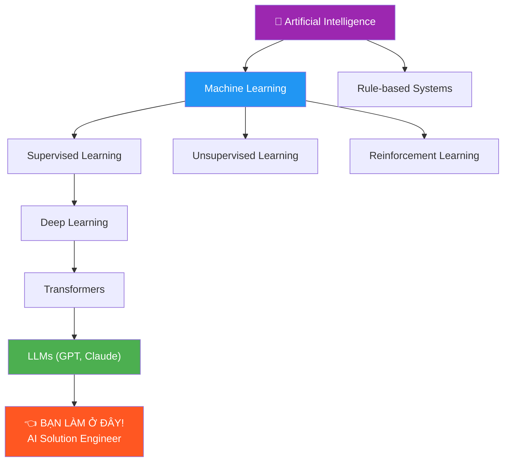
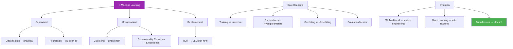

# 🤖 Machine Learning Overview — Phase 2, Tuần 1

> 📅 Thuộc Phase 2 của [AI Solution Engineer Roadmap](./AI%20Solution%20Engineer%20Roadmap.md)
> 📖 Tiếp nối Phase 1 (Python Foundations)
> 🎯 Mục tiêu: Hiểu AI/ML đủ sâu để DÙNG — không cần toán heavy, nhưng PHẢI hiểu bản chất

---

## 🗺️ Mental Map — ML trong bức tranh AI tổng thể



```
  AI Solution Engineer KHÔNG cần:
    ❌ Tự train model từ 0 (ML Engineer/Researcher làm)
    ❌ Viết thuật toán backpropagation
    ❌ Tối ưu training pipeline

  AI Solution Engineer CẦN:
    ✅ Hiểu ML hoạt động THẾ NÀO (để debug, giải thích)
    ✅ Biết chọn MODEL PHÙ HỢP cho use case
    ✅ Biết ĐÁNH GIÁ model tốt hay dở
    ✅ Biết TÍCH HỢP model vào production
    ✅ Biết GIẢI THÍCH cho non-tech stakeholders

  → Bạn là "KIẾN TRÚC SƯ dùng gạch AI" — không cần tự ĐÚC GẠCH!
```

---

## 📖 Mục lục

1. [AI là gì? — Từ phim viễn tưởng đến thực tế](#1-ai-là-gì--từ-phim-viễn-tưởng-đến-thực-tế)
2. [Machine Learning là gì? — Máy TỰ HỌC](#2-machine-learning-là-gì--máy-tự-học)
3. [Supervised Learning — Học có thầy](#3-supervised-learning--học-có-thầy)
4. [Unsupervised Learning — Học không thầy](#4-unsupervised-learning--học-không-thầy)
5. [Reinforcement Learning — Học từ thử-sai](#5-reinforcement-learning--học-từ-thử-sai)
6. [Training vs Inference — 2 pha của ML](#6-training-vs-inference--2-pha-của-ml)
7. [Model, Parameters, Hyperparameters](#7-model-parameters-hyperparameters)
8. [Overfitting & Underfitting — Bẫy kinh điển](#8-overfitting--underfitting--bẫy-kinh-điển)
9. [Evaluation Metrics — Đo lường hiệu quả](#9-evaluation-metrics--đo-lường-hiệu-quả)
10. [Từ ML truyền thống đến Deep Learning](#10-từ-ml-truyền-thống-đến-deep-learning)

---

# 1. AI là gì? — Từ phim viễn tưởng đến thực tế

> 🔄 **Pattern: Contextual History — 70 năm AI trên 1 trang**

### Timeline AI

```
  1950: Alan Turing — "Máy có thể suy nghĩ không?" (Turing Test)
  1956: Dartmouth Conference — thuật ngữ "Artificial Intelligence" ra đời
  1960s: AI mùa xuân — expert systems, lạc quan quá mức
         → "AI sẽ giải quyết MỌI THỨ trong 20 năm!"

  1970-80s: AI MÙA ĐÔNG ❄️
         → Hứa hẹn quá nhiều, không deliver
         → Funding bị cắt, nghiên cứu ngừng

  1997: Deep Blue thắng Kasparov (cờ vua)
         → Nhưng chỉ là brute force, KHÔNG phải "thông minh"

  2012: ĐIỂM NGOẶT! AlexNet thắng ImageNet
         → Deep Learning + GPU = đột phá!
         → Data lớn + Computing mạnh + Thuật toán tốt = AI works!

  2017: "Attention Is All You Need" — Transformer architecture ra đời
         → Nền tảng cho GPT, BERT, mọi LLM hiện đại!

  2022: ChatGPT — AI đi vào ĐỜI THƯỜNG
         → Mọi người đều biết đến AI
         → Nhu cầu AI Engineer BÙNG NỔ!
```

### AI ≠ Máy có ý thức!

```
  🔍 5 Whys: AI "thông minh" thực sự không?

  Q1: ChatGPT CÓ hiểu ngôn ngữ không?
  A1: KHÔNG! Nó dự đoán "token tiếp theo có xác suất cao nhất"!

  Q2: Vậy tại sao nó trả lời đúng?
  A2: Vì nó học từ HÀNG TỶ trang web → thống kê xác suất cực tốt!

  Q3: Nó có "suy nghĩ" không?
  A3: KHÔNG! Không có ý thức, không biết mình tồn tại.
      Nó là FUNCTION: input text → output text. Thế thôi!

  Q4: Vậy tại sao đôi khi sai (hallucination)?
  A4: Vì nó KHÔNG BIẾT sai! Nó chọn token xác suất CAO NHẤT,
      kể cả khi token đó tạo ra câu SAI!

  Q5: Vậy "AI" trong tên nó nghĩa là gì?
  A5: AI hiện tại = "Narrow AI" — giỏi 1 nhiệm vụ CỤ THỂ
      "General AI" (AGI) — thông minh như người = CHƯA CÓ!

  ┌──────────────┬────────────────────────────┐
  │ Narrow AI    │ Giỏi 1 thứ                 │
  │ (hiện tại)   │ GPT: text, DALL-E: ảnh     │
  ├──────────────┼────────────────────────────┤
  │ General AI   │ Giỏi MỌI THỨ              │
  │ (chưa có)    │ Như con người               │
  ├──────────────┼────────────────────────────┤
  │ Super AI     │ GIỎI HƠN con người        │
  │ (viễn tưởng) │ Ultron, Skynet, HAL 9000   │
  └──────────────┴────────────────────────────┘
```

---

# 2. Machine Learning là gì? — Máy TỰ HỌC

> 🧱 **Pattern: First Principles — ML = tìm PATTERNS trong DATA**

### Lập trình truyền thống vs Machine Learning

```
  LẬP TRÌNH TRUYỀN THỐNG:
    Con người VIẾT QUY TẮC → Máy áp dụng

    Input: ảnh mèo
    Quy tắc (do NGƯỜI viết):
      if có_tai_nhọn AND có_ria_mép AND kích_thước_nhỏ:
        return "mèo"
    → ❌ KHÔNG HOẠT ĐỘNG! không thể viết đủ quy tắc cho mọi con mèo!

  MACHINE LEARNING:
    Con người cho DATA + ĐÁP ÁN → Máy TỰ TÌM quy tắc!

    Data: 10,000 ảnh mèo (label: "mèo")
          10,000 ảnh chó (label: "chó")
    ML: máy TỰ TÌM patterns phân biệt mèo vs chó
    → ✅ HOẠT ĐỘNG! Máy tìm ra những đặc điểm NGƯỜI KHÔNG NGHĨ RA!
```

```
  Công thức ML (First Principles):

  ┌─────────────────────────────────────────────────┐
  │                                                 │
  │  TRADITIONAL:  Rules + Data = Output             │
  │                 ↑                               │
  │            NGƯỜI viết!                           │
  │                                                 │
  │  ML:           Data + Output = Rules (Model)     │
  │                                  ↑               │
  │                            MÁY TỰ TÌM!          │
  │                                                 │
  └─────────────────────────────────────────────────┘

  ML = ĐẢO NGƯỢC quá trình lập trình!
  Thay vì viết rules → cho data + đáp án → máy tìm rules!
```

### Analogy: Trẻ em học phân biệt mèo-chó

```
  Bạn DẠY trẻ em phân biệt mèo và chó:

  CÁCH 1 (Traditional): Nói quy tắc
    "Mèo có tai nhọn, mắt tròn, ria mép..."
    → Trẻ gặp mèo tai cụp = BỐI RỐI!

  CÁCH 2 (ML): Cho xem nhiều ảnh
    "Đây là mèo" (100 ảnh mèo khác nhau)
    "Đây là chó" (100 ảnh chó khác nhau)
    → Trẻ TỰ HÌNH THÀNH khái niệm mèo vs chó!
    → Gặp ảnh mới → phân biệt được!

  → ML hoạt động GIỐNG CÁCH CON NGƯỜI HỌC!
    Kinh nghiệm (data) → Nhận diện patterns → Dự đoán!
```

---

# 3. Supervised Learning — Học có thầy

> 📐 **Pattern: Trade-off Analysis — Classification vs Regression**

### Supervised = Có NHÃN (label) cho mỗi ví dụ

```
  "Supervised" = CÓ THẦY = có đáp án mẫu!

  Data có nhãn:
    Ảnh mèo → nhãn "mèo"
    Ảnh chó → nhãn "chó"
    Email spam → nhãn "spam"
    Email thường → nhãn "not spam"

  → Máy học từ CÁC VÍ DỤ CÓ ĐÁP ÁN
  → Mục tiêu: dự đoán đáp án cho ví dụ MỚI!
```

### 2 loại bài toán Supervised

```
  ┌────────────────────────────────────────────────────┐
  │               SUPERVISED LEARNING                  │
  │                                                    │
  │  ┌─────────────────┐  ┌─────────────────────────┐ │
  │  │ CLASSIFICATION   │  │ REGRESSION              │ │
  │  │                  │  │                         │ │
  │  │ Output: NHÃN     │  │ Output: SỐ              │ │
  │  │ (rời rạc)        │  │ (liên tục)              │ │
  │  │                  │  │                         │ │
  │  │ Mèo hay Chó?     │  │ Giá nhà = bao nhiêu $? │ │
  │  │ Spam hay không?   │  │ Nhiệt độ ngày mai = ?  │ │
  │  │ Bệnh gì?         │  │ Lương sẽ là bao nhiêu? │ │
  │  └─────────────────┘  └─────────────────────────┘ │
  └────────────────────────────────────────────────────┘
```

### Classification — Phân loại

```python
# Ví dụ: Phân loại email spam/not spam

# Data training (có nhãn!)
training_data = [
    # (features,                           label)
    ({"has_link": True,  "caps_ratio": 0.8, "word_free": True},  "spam"),
    ({"has_link": False, "caps_ratio": 0.1, "word_free": False}, "not_spam"),
    ({"has_link": True,  "caps_ratio": 0.5, "word_free": True},  "spam"),
    ({"has_link": False, "caps_ratio": 0.2, "word_free": False}, "not_spam"),
    # ... hàng nghìn ví dụ nữa
]

# Model HỌC patterns: link + caps + "free" → spam!

# Inference (dự đoán):
new_email = {"has_link": True, "caps_ratio": 0.9, "word_free": True}
prediction = model.predict(new_email)  # → "spam" (dự đoán!)
```

```
  Classification phổ biến:

  ┌───────────────────┬──────────────┬──────────────────┐
  │ Bài toán          │ Loại         │ Output           │
  ├───────────────────┼──────────────┼──────────────────┤
  │ Mèo vs Chó        │ Binary (2)   │ mèo / chó       │
  │ Spam detection     │ Binary (2)   │ spam / not_spam  │
  │ Nhận diện chữ số   │ Multi (10)   │ 0, 1, 2, ..., 9 │
  │ Phân loại tin tức  │ Multi (n)    │ thể thao / kinh tế / ...│
  │ Sentiment analysis │ Multi (3)    │ positive / neutral / negative│
  └───────────────────┴──────────────┴──────────────────┘
```

### Regression — Dự đoán số

```python
# Ví dụ: Dự đoán giá nhà

# Data training
training_data = [
    # (diện_tích, số_phòng, khoảng_cách_trung_tâm) → giá
    (50,  2, 5.0,  3_000_000_000),   # 50m², 2 phòng, 5km → 3 tỷ
    (80,  3, 3.0,  5_500_000_000),   # 80m², 3 phòng, 3km → 5.5 tỷ
    (120, 4, 1.0,  12_000_000_000),  # 120m², 4 phòng, 1km → 12 tỷ
    # ...
]

# Model TÌM CÔNG THỨC:
# giá ≈ a × diện_tích + b × số_phòng + c × khoảng_cách + d
# (Linear Regression — tìm a, b, c, d tối ưu!)

# Predict:
new_house = (70, 3, 4.0)
predicted_price = model.predict(new_house)  # → ~4.2 tỷ (con số liên tục!)
```

### 🔧 Reverse Engineering: Tự xây Linear Regression!

```python
import random

# ═══ XÂY Linear Regression từ 0 — HIỂU bản chất! ═══

def simple_linear_regression(X, y, learning_rate=0.01, epochs=1000):
    """
    Bài toán: tìm w, b sao cho y ≈ w*x + b

    X: list[float] — input
    y: list[float] — output (đáp án)
    """
    # Khởi tạo w, b NGẪU NHIÊN
    w = random.random()  # weight (trọng số)
    b = random.random()  # bias (độ lệch)

    n = len(X)

    for epoch in range(epochs):
        # 1. PREDICT: tính ŷ (y dự đoán)
        y_pred = [w * x + b for x in X]

        # 2. LOSS: đo SAI SỐ bằng Mean Squared Error
        #    MSE = (1/n) × Σ(y_true - y_pred)²
        loss = sum((yt - yp) ** 2 for yt, yp in zip(y, y_pred)) / n

        # 3. GRADIENT: tìm HƯỚNG cần sửa
        #    Đạo hàm MSE theo w và b
        dw = (-2 / n) * sum((yt - yp) * x for yt, yp, x in zip(y, y_pred, X))
        db = (-2 / n) * sum(yt - yp for yt, yp in zip(y, y_pred))

        # 4. UPDATE: sửa w, b theo hướng ngược gradient
        w -= learning_rate * dw
        b -= learning_rate * db

        if epoch % 200 == 0:
            print(f"Epoch {epoch}: loss={loss:.4f}, w={w:.4f}, b={b:.4f}")

    return w, b

# Data: y = 3x + 5 (+ noise)
X = [1, 2, 3, 4, 5, 6, 7, 8, 9, 10]
y = [8.1, 10.9, 14.2, 17.0, 19.8, 23.1, 25.9, 29.0, 31.8, 35.2]

w, b = simple_linear_regression(X, y)
print(f"\nKết quả: y ≈ {w:.2f}x + {b:.2f}")
# → y ≈ 3.01x + 4.98  (gần đúng y = 3x + 5!)

# Predict:
x_new = 15
y_pred = w * x_new + b
print(f"Dự đoán x={x_new}: y={y_pred:.2f}")
```

```
  CỐT LÕI của toàn bộ ML (First Principles):

  ┌─────────────────────────────────────────────────┐
  │  1. PREDICT — Dự đoán bằng model hiện tại      │
  │     ŷ = f(x, parameters)                       │
  │                                                 │
  │  2. MEASURE — Đo sai số (loss/error)            │
  │     loss = |y_true - y_pred|²                    │
  │                                                 │
  │  3. UPDATE — Sửa parameters để giảm sai số     │
  │     parameters -= learning_rate × gradient       │
  │                                                 │
  │  → LẶP ĐI LẶP LẠI cho đến khi loss ĐỦ NHỎ!   │
  └─────────────────────────────────────────────────┘

  Đây là cốt lõi CỦA MỌI ML algorithm!
  Từ Linear Regression đến GPT-4 = cùng 3 bước này!
  Chỉ KHÁC: model phức tạp hơn + data nhiều hơn!
```

---

# 4. Unsupervised Learning — Học không thầy

> 🧱 **Pattern: First Principles — KHÔNG CÓ đáp án, tự tìm cấu trúc**

### Khi nào KHÔNG CÓ nhãn?

```
  Supervised:   "Đây là ảnh MÈO" ← nhãn do NGƯỜI gán → TỐN TIỀN!
  Unsupervised: "Đây là ảnh... gì đó" ← không ai gán nhãn!

  Thực tế: PHẦN LỚN data KHÔNG CÓ nhãn!
    → Gán nhãn 1 triệu ảnh = cần hàng trăm người = TỐN!
    → Unsupervised = tận dụng data CHƯA GÁN NHÃN!
```

### Clustering — Phân nhóm tự động

```
  Tưởng tượng: Lần đầu đến siêu thị NƯỚC NGOÀI (không biết ngôn ngữ)

  Bạn KHÔNG biết tên loại hàng (không có nhãn!)
  → Nhưng bạn TỰ PHÂN NHÓM:
     "Mấy thứ tròn tròn, màu sắc tươi → chắc là trái cây!"
     "Mấy chai lọ, chất lỏng → chắc là đồ uống!"
     "Mấy hộp vuông, có hình con gà → chắc là thịt đông lạnh!"

  → Bạn TỰ TÌM PATTERNS mà không ai dạy!
  → ĐÂY LÀ CLUSTERING!

  Ứng dụng AI:
    → Phân nhóm khách hàng (VIP / thường / mới)
    → Phân nhóm tài liệu theo chủ đề
    → Phát hiện anomaly (giao dịch bất thường)
```

```
  Clustering Algorithms phổ biến:

  ┌──────────────────┬──────────────────────────────┐
  │ Algorithm        │ Ý tưởng                      │
  ├──────────────────┼──────────────────────────────┤
  │ K-Means          │ Chia thành K nhóm, mỗi nhóm │
  │                  │ có 1 "trung tâm" (centroid)  │
  │ DBSCAN           │ Nhóm theo MẬT ĐỘ điểm      │
  │                  │ Tự phát hiện số nhóm + noise │
  │ Hierarchical     │ Xây CÂY phân cấp nhóm       │
  └──────────────────┴──────────────────────────────┘
```

### Dimensionality Reduction — Nén data

```
  Vấn đề: Data có 1000 features (dimensions) → xử lý CHẬM!

  Giải pháp: Giảm chiều — giữ THÔNG TIN QUAN TRỌNG, bỏ noise!

  Ví dụ đời thực: Bóng 3D chiếu lên tường → hình 2D
    → Mất 1 chiều (depth), nhưng vẫn nhận ra HÌNH DÁNG!

  Ứng dụng AI QUAN TRỌNG:
    → Embeddings! text 10,000 tokens → vector 1536 chiều
    → NÉN thông tin ngữ nghĩa vào vector!
    → ĐÂY LÀ NỀN TẢNG CỦA RAG!
```

---

# 5. Reinforcement Learning — Học từ thử-sai

> 🔄 **Pattern: Contextual History — RL đưa AI đánh thắng con người!**

### Analogy: Dạy chó bằng phần thưởng

```
  SUPERVISED:  Cho chó xem ảnh "ngồi" → dạy ngồi (có ĐÁP ÁN!)
  RL:          Chó thử →  ngồi → cho bánh 🍪 (reward!)
               Chó thử →  chạy → không cho gì 😐 (no reward)
               Chó thử →  cắn → phạt! 😠 (penalty)
               → Chó TỰ HỌC: ngồi = tốt, cắn = xấu!

  RL = KHÔNG CÓ đáp án, chỉ có PHẢN HỒI (reward/penalty)!
```

```
  RL Components:

  ┌────────────┐  action   ┌─────────────┐
  │   AGENT    │ ────────→ │ ENVIRONMENT │
  │ (AI player)│           │ (game/world)│
  │            │ ←──────── │             │
  └────────────┘  reward   └─────────────┘
                 + state

  Agent:       AI (học cách hành động)
  Environment: Thế giới (game, robot, thị trường)
  Action:      Hành động agent chọn
  State:       Trạng thái hiện tại
  Reward:      Phần thưởng/phạt (+/-)

  Mục tiêu: TỐI ĐA HÓA tổng reward lâu dài!
```

### RL thành tựu lịch sử

```
  2013: DeepMind → AI chơi Atari games (Breakout, Pong)
  2016: AlphaGo → ĐÁNH BẠI Lee Sedol (cờ vây!)
  2019: AlphaStar → đánh bại pro gamers StarCraft II
  2023: ChatGPT dùng RLHF → LLM "thông minh" hơn!

  🔍 5 Whys: RL liên quan gì đến LLM?

  Q1: ChatGPT dùng RL ở đâu?
  A1: RLHF = Reinforcement Learning from Human Feedback!

  Q2: RLHF là gì?
  A2: Người đánh giá 2 câu trả lời → chọn cái TỐT HƠN → reward!
      GPT học: câu trả lời kiểu A = tốt (reward), kiểu B = xấu (penalty)

  Q3: Tại sao cần RLHF? GPT đã học từ text rồi mà?
  A3: GPT gốc (pre-trained) chỉ biết DỰ ĐOÁN token tiếp theo.
      RLHF dạy nó: HỮU ÍCH, AN TOÀN, TRUNG THỰC!

  Q4: Không có RLHF thì sao?
  A4: GPT sẽ trả lời bừa, có thể toxic, không theo hướng dẫn!

  Q5: AI Solution Engineer cần biết RLHF?
  A5: Biết KHÁI NIỆM (để giải thích cho team). Không cần code!
```

### So sánh 3 loại ML

```
  ┌──────────────────┬──────────────┬──────────────┬──────────────┐
  │                  │ Supervised   │ Unsupervised │ RL           │
  ├──────────────────┼──────────────┼──────────────┼──────────────┤
  │ Có nhãn?         │ ✅ Có        │ ❌ Không     │ ⚡ Có reward │
  │ Mục tiêu         │ Dự đoán nhãn│ Tìm patterns │ Tối đa reward│
  │ Data             │ (x, y) pairs│ x only       │ states+actions│
  │ Ví dụ            │ Spam detect │ Clustering   │ Game AI      │
  │ AI Engineer?     │ ⭐⭐⭐      │ ⭐⭐         │ ⭐           │
  │                  │ Dùng nhiều! │ Embeddings!  │ Biết KN      │
  └──────────────────┴──────────────┴──────────────┴──────────────┘
```

---

# 6. Training vs Inference — 2 pha của ML

> 🧱 **Pattern: First Principles — TRAIN 1 lần, DÙNG triệu lần!**

### Analogy: Đầu bếp

```
  TRAINING = ĐI HỌC nấu ăn
    → Mất NHIỀU thời gian (tháng, năm)
    → Tốn NHIỀU tài nguyên (học phí, nguyên liệu)
    → THỬ SAI nhiều lần → LÀM LẠI → cải thiện
    → Kết quả: KIẾN THỨC (model)

  INFERENCE = NẤU cho khách
    → Nhanh (phút)
    → Dùng kiến thức ĐÃ HỌC
    → KHÔNG CẦN học lại!
    → Kết quả: MÓN ĂN (prediction)
```

```
  ┌────────────────────────────────────────────┐
  │            TRAINING (Huấn luyện)           │
  │                                            │
  │  Input:  Data + Labels (hàng GB/TB data)   │
  │  Process: Tìm parameters tối ưu            │
  │  Time:   Giờ → Ngày → Tuần!               │
  │  Hardware: GPU clusters ($$$)               │
  │  Output:  TRAINED MODEL (file .pt, .h5)    │
  │  Who:    ML Engineers / Researchers         │
  │                                            │
  │  GPT-4 training: ~$100 TRIỆU USD!         │
  │  Hàng nghìn GPUs, hàng tháng training!     │
  └─────────────────────┬──────────────────────┘
                        │
                        ↓ (model file)
  ┌─────────────────────┴──────────────────────┐
  │            INFERENCE (Suy luận)            │
  │                                            │
  │  Input:  1 prompt / 1 ảnh / 1 request      │
  │  Process: Chạy DATA qua model đã train     │
  │  Time:   Milliseconds → Seconds            │
  │  Hardware: 1 GPU hoặc CPU đủ               │
  │  Output:  PREDICTION (text, class, number) │
  │  Who:    AI Solution Engineers ← 👈 BẠN!   │
  │                                            │
  │  GPT-4 API call: ~$0.03 / request          │
  │  1-5 giây mỗi response!                    │
  └────────────────────────────────────────────┘

  → AI Solution Engineer CHÍNH LÀ INFERENCE ENGINEER!
  → Bạn DÙNG model có sẵn, KHÔNG cần tự train!
```

### Trong thực tế

```python
# ═══ TRAINING (ML Engineer làm — BẠN KHÔNG CẦN!) ═══
# model = train(data, labels, epochs=100, batch_size=32, lr=0.001)
# model.save("gpt-4.pt")  # Lưu model

# ═══ INFERENCE (AI Solution Engineer — BẠN LÀM!) ═══
# Gọi model qua API:
import openai

response = openai.chat.completions.create(
    model="gpt-4",          # Model ĐÃ ĐƯỢC TRAIN!
    messages=[{"role": "user", "content": "Hello!"}],
    temperature=0.7,         # Hyperparameter cho INFERENCE
)
# → Bạn gọi API = inference! Model đã train sẵn!
```

---

# 7. Model, Parameters, Hyperparameters

### Phân biệt 3 khái niệm

```
  🔍 5 Whys: Parameters vs Hyperparameters?

  Q1: "Parameter" là gì?
  A1: Số mà MODEL TỰ HỌC từ data (weights, biases)

  Q2: "Hyperparameter" là gì?
  A2: Số mà NGƯỜI ĐẶT trước khi training (learning rate, epochs...)

  Q3: Tại sao phân biệt?
  A3: Parameters = model tự tìm (tỷ lệ, trọng số...)
      Hyperparameters = người configure (bao nhiêu lần lặp, tốc độ...)

  Q4: GPT-4 có bao nhiêu parameters?
  A4: ~1.8 NGHÌN TỶ (1.8 trillion)! 
      Nó TỰ HỌC 1.8 nghìn tỷ con số từ data!

  Q5: "7B", "13B", "70B" nghĩa là gì?
  A5: 7 Billion, 13 Billion, 70 Billion PARAMETERS!
      Nhiều hơn = model "thông minh" hơn (thường!) nhưng CHẬM hơn!
```

```
  ┌─────────────────────────────────────────────────────────┐
  │  MODEL = KIẾN TRÚC + PARAMETERS                        │
  │                                                        │
  │  Ví dụ: y = wx + b                                    │
  │                                                        │
  │  ┌─────────────────────┐  ┌───────────────────────────┐│
  │  │ PARAMETERS          │  │ HYPERPARAMETERS            ││
  │  │ (máy TỰ HỌC)       │  │ (người ĐẶT TRƯỚC)         ││
  │  │                     │  │                            ││
  │  │ w = 3.01            │  │ learning_rate = 0.01       ││
  │  │ b = 4.98            │  │ epochs = 1000              ││
  │  │                     │  │ batch_size = 32            ││
  │  │ → Model tự tìm!    │  │ temperature = 0.7          ││
  │  │   Bạn KHÔNG đặt!   │  │ → Bạn PHẢI chọn!          ││
  │  └─────────────────────┘  └───────────────────────────┘│
  └─────────────────────────────────────────────────────────┘
```

### Hyperparameters AI Engineer CẦN BIẾT

```
  ┌────────────────────┬──────────────────────────────────┐
  │ Hyperparameter     │ Ý nghĩa                         │
  ├────────────────────┼──────────────────────────────────┤
  │ temperature        │ Độ "sáng tạo" (0=chính xác,     │
  │                    │ 1=sáng tạo, 2=bừa bãi)          │
  │ top_p              │ Nucleus sampling — chọn từ top   │
  │                    │ p% xác suất (0.1 = chỉ top 10%) │
  │ max_tokens         │ Số token tối đa trong response   │
  │ frequency_penalty  │ Phạt khi lặp từ (0-2)            │
  │ presence_penalty   │ Khuyến khích nói chủ đề mới (0-2)│
  │ stop_sequences     │ Dừng khi gặp chuỗi cụ thể       │
  └────────────────────┴──────────────────────────────────┘

  📐 Trade-off: temperature

  temperature = 0:
    → Luôn chọn token xác suất CAO NHẤT
    → Deterministic (cùng input = cùng output)
    → Dùng cho: code generation, factual QA

  temperature = 1:
    → Sampling theo phân phối xác suất
    → Đa dạng hơn, sáng tạo hơn
    → Dùng cho: creative writing, brainstorming

  temperature = 2:
    → Gần như RANDOM — output bừa bãi
    → KHÔNG BAO GIỜ dùng trong production!
```

---

# 8. Overfitting & Underfitting — Bẫy kinh điển

> 📐 **Pattern: Trade-off — Quá đơn giản vs Quá phức tạp**

### Analogy: Học bài thi

```
  UNDERFITTING = Học quá ÍT
    → Không thuộc công thức nào
    → Vào phòng thi = KHÔNG LÀM ĐƯỢC gì
    → "Model quá ĐƠN GIẢN để nắm bắt patterns"

  JUST RIGHT = Học đúng mức ✅
    → Hiểu NGUYÊN LÝ, giải được bài MỚI
    → Vào thi = làm được cả bài quen và bài lạ!

  OVERFITTING = HỌC TỦ
    → Thuộc LÒNG 50 bài mẫu
    → Bài mẫu = 100 điểm!
    → Bài MỚI (lạ) = 0 điểm! 💀
    → "Model nhớ DATA, không học PATTERNS"
```

```
  Visualize:

  Training accuracy vs Test accuracy

              Training acc.     Test acc.
  Underfit:   60%               55%         (cả 2 thấp)
  Just right: 92%               89%         (cả 2 cao, gần nhau)
  Overfit:    99%               65%         (train cao, test THẤP!)

  ⚠️ Dấu hiệu OVERFITTING:
     Training performance TUYỆT VỜI
     Test/Real-world performance TỆ
     → Khoảng cách TRAIN vs TEST quá lớn!
```

### Giải pháp

```
  ┌──────────────┬──────────────────────────────────┐
  │ Vấn đề       │ Giải pháp                        │
  ├──────────────┼──────────────────────────────────┤
  │ Underfitting  │ Model phức tạp hơn               │
  │              │ Train lâu hơn                     │
  │              │ Thêm features                     │
  ├──────────────┼──────────────────────────────────┤
  │ Overfitting   │ Thêm DATA (quan trọng nhất!)     │
  │              │ Regularization (phạt model phức tạp)│
  │              │ Dropout (random tắt neurons)      │
  │              │ Early stopping (dừng sớm)         │
  │              │ Cross-validation (chia data test)  │
  └──────────────┴──────────────────────────────────┘

  → AI Solution Engineer: Khi nào model TRẢ LỜI TỐT ở test
    nhưng TỆ ở production → có thể OVERFITTING trên test data!
```

---

# 9. Evaluation Metrics — Đo lường hiệu quả

### Classification Metrics

```
  Confusion Matrix — MA TRẬN NHẦM LẪN:

                        Predicted
                    Spam      Not Spam
  Actual  Spam    │  TP=90  │  FN=10  │
          Not Spam│  FP=5   │  TN=895 │

  TP = True Positive:  Đoán spam, ĐÚNG là spam ✅
  TN = True Negative:  Đoán not spam, ĐÚNG là not spam ✅
  FP = False Positive: Đoán spam, nhưng THẬT RA not spam ❌ (false alarm!)
  FN = False Negative: Đoán not spam, nhưng THẬT RA là spam ❌ (missed!)
```

```python
# ═══ Metrics phổ biến ═══

# Accuracy = (TP + TN) / total
# 985 / 1000 = 98.5%   ← "Tổng thể đoán đúng bao nhiêu %?"

# Precision = TP / (TP + FP)
# 90 / 95 = 94.7%      ← "Trong những cái đoán SPAM, bao nhiêu % ĐÚNG?"
# → Quan trọng khi: false positive TỐN KÉM (xóa nhầm email quan trọng!)

# Recall = TP / (TP + FN)
# 90 / 100 = 90%       ← "Trong tất cả SPAM thật, tìm được bao nhiêu %?"
# → Quan trọng khi: false negative NGUY HIỂM (bỏ sót bệnh ung thư!)

# F1 Score = 2 × (Precision × Recall) / (Precision + Recall)
# = 2 × (0.947 × 0.90) / (0.947 + 0.90) = 92.3%
# → Cân bằng giữa Precision và Recall
```

```
  📐 Trade-off: Precision vs Recall

  ┌─────────────────┬──────────────────────────────────┐
  │ Ưu tiên         │ Ví dụ                            │
  ├─────────────────┼──────────────────────────────────┤
  │ PRECISION cao   │ Spam filter (đừng xóa nhầm email │
  │ (ít FP)         │ quan trọng!)                     │
  ├─────────────────┼──────────────────────────────────┤
  │ RECALL cao      │ Phát hiện ung thư (đừng BỎ SÓT  │
  │ (ít FN)         │ bệnh nhân!)                      │
  └─────────────────┴──────────────────────────────────┘

  → KHÔNG THỂ có cả 2 cao cùng lúc!
  → Tăng Precision → Recall giảm (và ngược lại)
  → Phải chọn ĐÚNG theo use case!
```

### LLM Evaluation — Đánh giá AI mà bạn DÙNG!

```
  AI Solution Engineer cần đánh giá:

  ┌────────────────┬──────────────────────────────────┐
  │ Metric         │ Đo gì?                           │
  ├────────────────┼──────────────────────────────────┤
  │ Accuracy       │ Trả lời ĐÚNG bao nhiêu %?       │
  │ Faithfulness   │ Trả lời có ĐÚNG với context?     │
  │ Relevance      │ Câu trả lời CÓ LIÊN QUAN?       │
  │ Toxicity       │ Có nội dung TOXIC không?          │
  │ Latency        │ Trả lời NHANH bao nhiêu?         │
  │ Cost           │ TỐN bao nhiêu tiền?              │
  └────────────────┴──────────────────────────────────┘

  → RAG evaluation: Faithfulness + Relevance là QUAN TRỌNG NHẤT!
```

---

# 10. Từ ML truyền thống đến Deep Learning

> 🔄 **Pattern: Contextual History — Tại sao Deep Learning chiến thắng?**

### ML truyền thống vs Deep Learning

```
  ML TRUYỀN THỐNG (trước 2012):
    → NGƯỜI phải chọn features thủ công!
    → "Feature engineering" = MẤT 80% thời gian!
    
    Ví dụ phân loại ảnh mèo:
    NGƯỜI nghĩ: "Ảnh mèo có đặc điểm gì?"
    → Đếm pixel sáng? Tính gradient? Phát hiện cạnh?
    → TỰ VIẾT code trích xuất features → feedings vào model
    → KHÓ, CHẬM, không scalable!

  DEEP LEARNING (sau 2012):
    → MÁY tự tìm features!
    → Neural network TỰ HỌC features từ raw data!
    
    Ví dụ phân loại ảnh mèo:
    Chỉ cần: throw ảnh vào neural network
    → Layer 1: tự học edges (cạnh)
    → Layer 2: tự học textures (kết cấu lông)
    → Layer 3: tự học parts (tai, mắt, mũi)
    → Layer 4: tự học objects (mèo!)
    → KHÔNG CẦN feature engineering! ✅
```

### Neural Network — Bắt chước não người

```
  Neuron sinh học:
    Dendrites (input) → Cell body (xử lý) → Axon (output)

  Neuron nhân tạo:
    Inputs × Weights → Sum + Bias → Activation → Output

    x₁ × w₁ ──┐
    x₂ × w₂ ──┼──→ Σ + b ──→ f(x) ──→ output
    x₃ × w₃ ──┘

    f(x) = activation function (ReLU, Sigmoid...)
    = Quyết định neuron có "BẬT" hay không!
```

```
  Deep = NHIỀU layers:

  Input     Hidden Layer 1   Hidden Layer 2    Output
  Layer     (32 neurons)     (16 neurons)      Layer

  [x₁] ──→  [n₁] ──→  [n₁] ──→  [ŷ]
  [x₂] ──→  [n₂] ──→  [n₂]
  [x₃] ──→  [n₃] ──→  ...
  ...        ...

  → "Deep" = nhiều hidden layers (sâu!)
  → Nhiều layers = học features PHỨC TẠP hơn!
  → GPT-4 có ~120 layers với hàng tỷ neurons!

  📐 Trade-off: Depth vs Efficiency

    Nhiều layers = thông minh hơn, NHƯNG:
    → Tốn GPU nhiều hơn → chi phí ↑
    → Training lâu hơn → thời gian ↑
    → Inference chậm hơn → latency ↑
    → Cần data nhiều hơn → data collection ↑
```

### Transformer — Kiến trúc đằng sau ChatGPT

```
  2017: Google ra paper "Attention Is All You Need"
  → Transformer architecture = CÁCH MẠNG!

  Ý tưởng cốt lõi: ATTENTION MECHANISM
    "Khi đọc câu, từ nào QUAN TRỌNG nhất với từ hiện tại?"

  Ví dụ: "Con mèo ngồi trên thảm vì nó MỆT"
    "nó" refers to gì? → "con mèo" (attention!)
    → Transformer biết "nó" = "con mèo" vì ATTENTION!

  → MỌI LLM hiện đại đều dùng Transformer:
     GPT (Generative Pre-trained Transformer)
     BERT (Bidirectional Encoder Representations from Transformers)
     Claude, Gemini, Llama... TẤT CẢ = Transformers!
```

---

## 📐 Tổng kết Mental Map



```
  ┌────────────────────────────────────────────────────────┐
  │  Phase 2 Tuần 1 Checklist:                             │
  │                                                        │
  │  Khái niệm:                                           │
  │  □ AI vs ML vs Deep Learning — phân biệt              │
  │  □ Supervised (Classification + Regression)            │
  │  □ Unsupervised (Clustering, Dim. Reduction)           │
  │  □ Reinforcement Learning (RLHF cho LLMs!)            │
  │                                                        │
  │  Core:                                                 │
  │  □ Training vs Inference — AI Engineer = Inference!    │
  │  □ Parameters (model tự học) vs Hyperparameters (bạn set)│
  │  □ Overfitting: train tốt + test tệ = HỌC TỦ!       │
  │  □ Metrics: Accuracy, Precision, Recall, F1            │
  │                                                        │
  │  Evolution:                                            │
  │  □ ML → DL → Transformers → LLMs                     │
  │  □ Attention mechanism = cốt lõi Transformer          │
  │  □ GPT = Generative Pre-trained TRANSFORMER           │
  │                                                        │
  │  Thực hành:                                            │
  │  □ Code Linear Regression từ 0 (đã làm ở trên!)      │
  │  □ Gọi OpenAI API = INFERENCE!                        │
  │  □ Thử thay đổi temperature → quan sát kết quả       │
  └────────────────────────────────────────────────────────┘
```

---

## 📚 Tài liệu đọc thêm

```
  🎥 Video (KHUYÊN XEM):
    3Blue1Brown — "Neural Networks" (YouTube, 4 videos, TUYỆT VỜI!)
    StatQuest — "Machine Learning" playlist (giải thích DỄ HIỂU nhất!)
    Andrew Ng — "AI For Everyone" (Coursera, free, 4 tuần)
    Andrej Karpathy — "Intro to Large Language Models" (1 video, 1 giờ)

  📖 Đọc:
    "The Illustrated Transformer" — Jay Alammar (blog, CỰC HAY!)
    "ML Glossary" — ml-cheatsheet.readthedocs.io
    "Visual Intro to ML" — r2d3.us (interactive!)

  🏋️ Thực hành:
    Google "Teachable Machine" — train model TRÊN BROWSER!
    Kaggle Learn — free micro-courses ML
    fast.ai — "Practical Deep Learning" (free, top-down approach)
```
