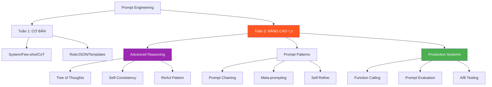
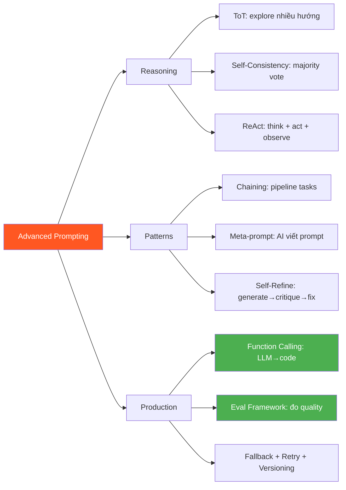

# 🧪 Prompt Engineering Nâng Cao — Phase 3, Tuần 2

> 📅 Thuộc Phase 3: Core Skills
> 📖 Tiếp nối [Prompt Engineering Cơ Bản — Phase 3, Tuần 1](./Prompt%20Engineering%20-%20Phase%203%20Tuần%201.md)
> 🎯 Mục tiêu: Nắm kỹ thuật NÂNG CAO — từ "viết prompt tốt" lên "xây HỆTHỐNG prompt cho production"

---

## 🗺️ Mental Map — Từ cơ bản đến nâng cao



```
  Tuần 1: BẠN biết viết prompt TỐT
  Tuần 2: BẠN biết xây SYSTEM prompt cho PRODUCTION!

  Sự khác biệt:
    Junior:  1 prompt → 1 answer → done
    Senior:  Pipeline prompts → evaluate → iterate → deploy → monitor
```

---

## 📖 Mục lục

1. [Tree of Thoughts — AI suy luận như đánh cờ](#1-tree-of-thoughts--ai-suy-luận-như-đánh-cờ)
2. [Self-Consistency — Hỏi nhiều lần, chọn đáp án phổ biến](#2-self-consistency--hỏi-nhiều-lần-chọn-đáp-án-phổ-biến)
3. [ReAct Pattern — Reasoning + Acting](#3-react-pattern--reasoning--acting)
4. [Prompt Chaining — Pipeline nhiều bước](#4-prompt-chaining--pipeline-nhiều-bước)
5. [Meta-prompting — AI viết prompt cho AI](#5-meta-prompting--ai-viết-prompt-cho-ai)
6. [Self-Refine — AI tự sửa output](#6-self-refine--ai-tự-sửa-output)
7. [Function Calling — LLM gọi code](#7-function-calling--llm-gọi-code)
8. [Prompt Evaluation — Đo lường chất lượng](#8-prompt-evaluation--đo-lường-chất-lượng)
9. [Production Patterns — Hệ thống thực tế](#9-production-patterns--hệ-thống-thực-tế)
10. [Tổng hợp: Khi nào dùng kỹ thuật nào?](#10-tổng-hợp-khi-nào-dùng-kỹ-thuật-nào)

---

# 1. Tree of Thoughts — AI suy luận như đánh cờ

> 🧱 **Pattern: First Principles — CoT = 1 đường đi. ToT = NHIỀU đường, chọn tốt nhất!**

### CoT vs Tree of Thoughts

```
  Chain-of-Thought (CoT):
    A → B → C → D → Answer
    → 1 CON ĐƯỜNG duy nhất! Nếu B sai → D sai!

  Tree of Thoughts (ToT):
    A → B₁ → C₁ → ❌ (dead end, quay lại!)
    A → B₂ → C₂ → D₂ → ✅ Answer!
    A → B₃ → C₃ → ❌ (kém hơn B₂)
    → NHIỀU con đường! Khám phá → đánh giá → chọn tốt nhất!

  Analogy: Đánh cờ vua
    CoT = đi 1 nước → đi tiếp → đi tiếp (không nhìn lại!)
    ToT = xem xét 3 nước → đánh giá MỖI nước → chọn nước TỐT NHẤT
         = TƯ DUY CỦA KỲ THỦ CHUYÊN NGHIỆP!
```

```python
# ═══ Tree of Thoughts implementation ═══

async def tree_of_thoughts(problem: str, num_branches: int = 3) -> str:
    """
    ToT: Tạo nhiều hướng giải → đánh giá → chọn tốt nhất
    """
    
    # Bước 1: GENERATE — Tạo nhiều hướng tiếp cận
    branches_prompt = f"""Cho bài toán sau:
{problem}

Hãy đề xuất {num_branches} CÁCH TIẾP CẬN KHÁC NHAU để giải quyết.
Mỗi cách bắt đầu bằng suy nghĩ khác nhau.

Format:
CÁCH 1: [mô tả approach]
Bước đầu tiên: [bước 1]

CÁCH 2: [mô tả approach]  
Bước đầu tiên: [bước 1]

CÁCH 3: [mô tả approach]
Bước đầu tiên: [bước 1]"""

    branches = await call_llm(branches_prompt)
    
    # Bước 2: EVALUATE — Đánh giá mỗi hướng
    eval_prompt = f"""Bài toán: {problem}

Các hướng tiếp cận:
{branches}

Đánh giá MỖI hướng theo tiêu chí:
- Tính khả thi (1-10)
- Độ chính xác dự kiến (1-10)  
- Độ phức tạp (1-10, thấp = tốt)

Chọn hướng TỐT NHẤT và giải thích TẠI SAO."""

    evaluation = await call_llm(eval_prompt)
    
    # Bước 3: SOLVE — Giải theo hướng tốt nhất
    solve_prompt = f"""Bài toán: {problem}

Phân tích: {evaluation}

Bây giờ hãy GIẢI CHI TIẾT theo hướng tốt nhất đã chọn.
Trình bày từng bước rõ ràng."""

    solution = await call_llm(solve_prompt)
    return solution

# Dùng cho:
# → Bài toán có NHIỀU cách giải (coding, math, strategy)
# → Khi CoT đơn giản cho kết quả KHÔNG ổn ĐỊNH
# → Creative writing (thử nhiều hướng → chọn hay nhất)
```

```
  📐 Trade-off: CoT vs ToT

  ┌──────────────┬──────────────┬──────────────────┐
  │              │ CoT          │ Tree of Thoughts  │
  ├──────────────┼──────────────┼──────────────────┤
  │ API calls    │ 1            │ 3-5 ❌            │
  │ Tokens       │ Thấp         │ Cao (3-5x) ❌     │
  │ Latency      │ 2-5s         │ 10-20s ❌         │
  │ Quality      │ Tốt          │ Rất tốt ✅        │
  │ Reliability  │ Trung bình   │ Cao ✅            │
  │ Use case     │ Simple reason│ Complex problems ✅│
  └──────────────┴──────────────┴──────────────────┘

  → Chỉ dùng ToT khi bài toán ĐỦ KHÓ để justify chi phí!
```

---

# 2. Self-Consistency — Hỏi nhiều lần, chọn đáp án phổ biến

> 🧱 **Pattern: First Principles — "Wisdom of crowds" cho AI**

### Ý tưởng: Đa số thắng!

```
  Analogy: Hỏi 5 BÁC SĨ

  1 bác sĩ nói "Cảm thường", tin được chứ? → có thể sai!
  5 bác sĩ:
    BS1: "Cảm thường"
    BS2: "Cảm thường"  
    BS3: "Viêm phổi"
    BS4: "Cảm thường"
    BS5: "Cảm thường"
  → 4/5 nói "Cảm thường" → TIN TƯỞNG hơn nhiều!

  Self-Consistency = HỎI LLM n lần → chọn câu trả lời PHỔ BIẾN NHẤT!
```

```python
import asyncio
from collections import Counter

async def self_consistency(
    prompt: str,
    n: int = 5,
    temperature: float = 0.7
) -> dict:
    """
    Hỏi LLM n lần → majority vote → confidence score
    """
    
    # 1. Gọi LLM n lần SONG SONG (nhanh hơn tuần tự!)
    tasks = [
        call_llm(prompt, temperature=temperature)
        for _ in range(n)
    ]
    responses = await asyncio.gather(*tasks)
    
    # 2. Majority vote
    # (Với câu trả lời ngắn: exact match)
    # (Với câu trả lời dài: cần semantic comparison)
    counter = Counter(responses)
    best_answer, count = counter.most_common(1)[0]
    
    # 3. Confidence = tỷ lệ đồng thuận
    confidence = count / n
    
    return {
        "answer": best_answer,
        "confidence": confidence,
        "votes": dict(counter),
        "total_responses": n
    }

# Dùng:
result = await self_consistency(
    prompt="374 × 829 = ? Tính từng bước.",
    n=5,
    temperature=0.7
)
# {"answer": "310,046", "confidence": 0.8, "votes": {"310,046": 4, "310,146": 1}}
# → 4/5 lần nói 310,046 → confidence 80% → ĐỦ TIN!

# ⚠️ Nếu confidence < 50% → bài toán CÓ VẤN ĐỀ!
# → Cần CoT + few-shot, hoặc ToT
```

```
  🔍 5 Whys: Tại sao Self-Consistency hoạt động?

  Q1: Hỏi cùng 1 câu sao ra câu trả lời KHÁC?
  A1: Vì temperature > 0 → sampling RANDOM → output khác nhau!

  Q2: Tại sao đa số đúng?
  A2: Đáp án ĐÚNG có xác suất CAO hơn → xuất hiện NHIỀU lần hơn!
      Đáp án SAI là "random mistake" → ít lặp lại!

  Q3: Cost gấp n lần?
  A3: ĐÚNG! n=5 → chi phí ×5! Chỉ dùng khi ACCURACY quan trọng hơn COST!

  Q4: Dùng cho classification được không?
  A4: RẤT TỐT! Mỗi lần hỏi → 1 label → majority vote!

  Q5: Production dùng self-consistency không?
  A5: CÓ! Nhưng thường n=3 (không cần 5) và CHỈ cho high-stakes tasks!
```

---

# 3. ReAct Pattern — Reasoning + Acting

> 🔄 **Pattern: Contextual History — ReAct = tiền thân của AI Agents!**

### ReAct = Think + Act + Observe

```
  Paper gốc: "ReAct: Synergizing Reasoning and Acting" (Yao et al., 2022)

  Trước ReAct:
    CoT: Think → Think → Think → Answer (chỉ suy luận, KHÔNG hành động!)
    Act-only: Act → Act → Act (chỉ hành động, KHÔNG suy luận!)

  ReAct KẾT HỢP cả hai:
    Think → Act → Observe → Think → Act → Observe → Answer

  ┌─────────────────────────────────────────────────┐
  │  Thought 1: "User hỏi thời tiết Hà Nội.        │
  │              Tôi cần gọi weather API."           │
  │                                                 │
  │  Action 1:  search_weather("Hanoi")               │
  │                                                 │
  │  Observation 1: {"temp": 28, "humidity": 75}      │
  │                                                 │
  │  Thought 2: "Có data rồi. Trả lời user."        │
  │                                                 │
  │  Action 2:  respond("Hà Nội 28°C, độ ẩm 75%")    │
  └─────────────────────────────────────────────────┘
```

```python
# ═══ ReAct pattern implementation ═══

REACT_SYSTEM = """Bạn có thể dùng các TOOLS sau:
- search(query): Tìm kiếm thông tin
- calculator(expression): Tính toán
- lookup_db(table, condition): Tra cơ sở dữ liệu

Khi trả lời, hãy dùng format:

Thought: [suy nghĩ về các bước cần làm]
Action: [tool_name(arguments)]
Observation: [kết quả tool trả về — DO HỆ THỐNG ĐIỀN]
... (lặp lại Thought/Action/Observation nếu cần)
Thought: [kết luận cuối cùng]
Answer: [câu trả lời cho user]"""

async def react_agent(question: str, max_steps: int = 5):
    """ReAct agent loop"""
    messages = [
        {"role": "system", "content": REACT_SYSTEM},
        {"role": "user", "content": question}
    ]
    
    for step in range(max_steps):
        response = await call_llm(messages)
        
        # Parse response tìm Action
        if "Action:" in response:
            action = parse_action(response)
            result = await execute_tool(action)
            
            # Thêm observation vào context
            messages.append({"role": "assistant", "content": response})
            messages.append({"role": "user", "content": f"Observation: {result}"})
        
        elif "Answer:" in response:
            return parse_answer(response)
    
    return "Không tìm được câu trả lời sau {max_steps} bước"
```

---

# 4. Prompt Chaining — Pipeline nhiều bước

> 🧱 **Pattern: First Principles — 1 big prompt << nhiều small prompts NỐI TIẾP!**

### Tại sao chia nhỏ?

```
  🔍 5 Whys: Tại sao prompt chaining tốt hơn 1 prompt dài?

  Q1: Tại sao 1 prompt làm nhiều việc thường SAI?
  A1: LLM phải track NHIỀU instruction cùng lúc → bỏ sót!
      Giống bạn nghe 10 yêu cầu 1 lúc → quên vài cái!

  Q2: Chia nhỏ giúp gì?
  A2: Mỗi bước CHỈ 1 nhiệm vụ → output CHẤT LƯỢNG hơn!
      Giống dây chuyền sản xuất: mỗi người 1 việc → sản phẩm tốt!

  Q3: Nhưng nhiều API calls hơn = chậm + đắt hơn?
  A3: ĐÚNG! Nhưng accuracy tăng ĐÁNG KỂ!
      1 prompt complex: accuracy 70%
      3 prompts chained: accuracy 90%+
      → 📐 Trade-off: latency ↑ nhưng quality ↑↑↑

  Q4: Khi nào nên chain?
  A4: Khi task có NHIỀU bước logic KHÁC NHAU!
      Extract → Transform → Validate → Format

  Q5: Nối output thế nào?
  A5: Output bước 1 = INPUT bước 2!
      Dùng JSON để transfer data giữa các bước!
```

```python
# ═══ Prompt Chaining: Phân tích & Tóm tắt tài liệu ═══

async def analyze_document_pipeline(document: str) -> dict:
    """Pipeline 4 bước để phân tích tài liệu phức tạp"""
    
    # ═══ Bước 1: EXTRACT — Trích xuất thông tin ═══
    step1 = await call_llm(f"""Trích xuất thông tin chính từ tài liệu sau.
Trả về JSON:
{{"key_points": ["..."], "entities": ["..."], "dates": ["..."], "numbers": ["..."]}}

TÀI LIỆU:
{document}""")
    extracted = json.loads(step1)

    # ═══ Bước 2: ANALYZE — Phân tích ═══
    step2 = await call_llm(f"""Dựa trên thông tin đã trích xuất, phân tích:
1. Chủ đề chính là gì?
2. Các insight quan trọng?
3. Có mâu thuẫn nào không?

THÔNG TIN:
{json.dumps(extracted, ensure_ascii=False)}

Trả về JSON: {{"theme": "...", "insights": ["..."], "contradictions": ["..."]}}""")
    analysis = json.loads(step2)

    # ═══ Bước 3: SUMMARIZE — Tóm tắt ═══
    step3 = await call_llm(f"""Dựa trên phân tích sau, viết TÓM TẮT 3 đoạn:
- Đoạn 1: Overview
- Đoạn 2: Key insights
- Đoạn 3: Recommendations

PHÂN TÍCH: {json.dumps(analysis, ensure_ascii=False)}""")

    # ═══ Bước 4: VALIDATE — Kiểm tra ═══
    step4 = await call_llm(f"""Review tóm tắt sau và kiểm tra:
1. Có chính xác so với nội dung gốc không?
2. Có bỏ sót thông tin quan trọng?
3. Có hallucination (thông tin không có trong document)?

DOCUMENT GỐC (100 từ đầu): {document[:500]}

TÓM TẮT: {step3}

Trả về JSON: {{"is_accurate": true/false, "missing": ["..."], "hallucinations": ["..."]}}""")

    return {
        "extracted": extracted,
        "analysis": analysis,
        "summary": step3,
        "validation": json.loads(step4)
    }
```

### Chaining Patterns phổ biến

```
  ┌──────────────────────────────────────────────────────┐
  │  Pattern 1: SEQUENTIAL (nối tiếp)                   │
  │  A → B → C → D                                     │
  │  "Extract → Analyze → Summarize → Format"           │
  │  Dùng khi: các bước PHỤ THUỘC nhau tuần tự          │
  ├──────────────────────────────────────────────────────┤
  │  Pattern 2: PARALLEL (song song → merge)            │
  │  A → [B₁, B₂, B₃] → C (merge)                      │
  │  "1 doc → translate EN + tóm tắt VI + extract →     │
  │   merge tất cả vào 1 report"                        │
  │  Dùng khi: các bước ĐỘC LẬP, merge cuối cùng       │
  ├──────────────────────────────────────────────────────┤
  │  Pattern 3: CONDITIONAL (rẽ nhánh)                   │
  │  A → if condition → B else → C → D                  │
  │  "Classify → if technical→ expert prompt              │
  │              if simple → basic prompt"               │
  │  Dùng khi: cần XỬ LÝ KHÁC NHAU theo loại input     │
  ├──────────────────────────────────────────────────────┤
  │  Pattern 4: LOOP (lặp lại)                          │
  │  A → B → evaluate → if not good → B → evaluate →... │
  │  "Generate → Review → if not_good → Regenerate →..." │
  │  Dùng khi: cần CHẤT LƯỢNG cao, lặp cho đến khi đạt │
  └──────────────────────────────────────────────────────┘
```

---

# 5. Meta-prompting — AI viết prompt cho AI

> 🔧 **Pattern: Reverse Engineering — Dùng AI để OPTIMIZE prompts!**

### AI viết prompt TỐT HƠN người!

```
  🔍 5 Whys: Tại sao meta-prompting?

  Q1: Con người viết prompt có giới hạn gì?
  A1: Người hay viết từ GÓC NHÌN CỦA MÌNH!
      Nhưng AI "hiểu" prompts TỪ GÓC NHÌN CỦA AI!

  Q2: AI biết prompt nào TỐT cho chính nó?
  A2: Phần nào! AI biết structure nào nó "xử lý" tốt!
      Giống hỏi đầu bếp: "Bạn thích recipe viết thế nào?"

  Q3: Khi nào dùng meta-prompting?
  A3: → Khi bạn STUCK, không biết viết prompt thế nào
      → Khi cần optimize prompt đã có
      → Khi cần prompt cho DOMAIN bạn không rành

  Q4: Hiệu quả thế nào?
  A4: Papers cho thấy meta-prompts THƯỜNG (không phải luôn) 
      tốt hơn human-written prompts 10-20%!

  Q5: Nhược điểm?
  A5: Tốn thêm 1 API call! Nhưng chỉ chạy 1 lần → amortized!
```

```python
# ═══ Meta-prompting: AI viết prompt ═══

async def generate_optimal_prompt(task_description: str, examples: list = []) -> str:
    """Dùng AI để tạo prompt TỐI ƯU cho task cụ thể"""
    
    examples_text = ""
    if examples:
        examples_text = "\n\nVÍ DỤ INPUT/OUTPUT MẪU:\n"
        for i, ex in enumerate(examples):
            examples_text += f"Input {i+1}: {ex['input']}\nOutput {i+1}: {ex['output']}\n\n"
    
    meta_prompt = f"""Bạn là chuyên gia Prompt Engineering.

NHIỆM VỤ: Viết prompt TỐI ƯU cho task sau.

TASK DESCRIPTION:
{task_description}
{examples_text}
PROMPT CẦN:
1. System prompt rõ ràng (vai trò, phong cách, quy tắc)
2. Instructions cụ thể, không ambiguous
3. Output format (JSON/Markdown)
4. 2-3 ví dụ few-shot nếu cần
5. Edge case handling
6. Negative prompting (nói KHÔNG được gì)

Viết TOÀN BỘ prompt (copy-paste dùng ngay), KHÔNG giải thích."""

    optimal_prompt = await call_llm(
        meta_prompt,
        model="gpt-4o",       # Dùng model TỐT NHẤT để viết prompt!
        temperature=0.3        # Ít random cho prompt quality
    )
    return optimal_prompt

# Dùng:
prompt = await generate_optimal_prompt(
    task_description="Phân loại email khách hàng thành: Khiếu nại, Hỏi sản phẩm, Yêu cầu hoàn trả, Khen ngợi, Khác",
    examples=[
        {"input": "Sản phẩm bị hỏng sau 2 ngày!", "output": "Khiếu nại"},
        {"input": "Giá của iPhone 15 bao nhiêu?", "output": "Hỏi sản phẩm"},
    ]
)
# → AI viết prompt CỰC KỲ chi tiết, tốt hơn bạn tự viết!
```

---

# 6. Self-Refine — AI tự sửa output

> 🔧 **Pattern: Reverse Engineering — AI = tác giả + editor + reviewer!**

### Generate → Critique → Refine

```
  Quy trình:
  ┌────────────┐    ┌────────────┐    ┌────────────┐
  │  GENERATE  │ →  │  CRITIQUE  │ →  │   REFINE   │
  │  (viết)    │    │  (phê bình)│    │ (sửa lại)  │
  └────────────┘    └────────────┘    └────────────┘
        ↑                                    │
        └────────────── loop ────────────────┘
                (cho đến khi ĐẠT CHUẨN)

  Giống viết văn:
    Draft 1 → đọc lại, thấy lỗi → sửa → Draft 2 
    → đọc lại → tốt rồi! → Final!
```

```python
# ═══ Self-Refine implementation ═══

async def self_refine(
    task: str,
    max_iterations: int = 3,
    quality_threshold: float = 8.0
) -> dict:
    """AI tự viết → tự phê bình → tự sửa → cho đến khi tốt!"""
    
    # 1. GENERATE — Viết draft đầu tiên
    draft = await call_llm(f"""Hãy thực hiện task sau:
{task}

Viết kết quả tốt nhất có thể.""")
    
    for i in range(max_iterations):
        # 2. CRITIQUE — Tự phê bình
        critique = await call_llm(f"""Đánh giá output sau cho task: {task}

OUTPUT:
{draft}

Chấm điểm (1-10) theo các tiêu chí:
- Accuracy: thông tin đúng?
- Completeness: đầy đủ?
- Clarity: rõ ràng?
- Format: đúng format?

Trả về JSON:
{{
  "scores": {{"accuracy": 0, "completeness": 0, "clarity": 0, "format": 0}},
  "average": 0,
  "issues": ["vấn đề 1", "vấn đề 2"],
  "suggestions": ["gợi ý sửa 1", "gợi ý sửa 2"]
}}""")
        
        critique_data = json.loads(critique)
        
        # Check quality threshold
        if critique_data["average"] >= quality_threshold:
            return {"output": draft, "iterations": i + 1, "final_score": critique_data}
        
        # 3. REFINE — Sửa dựa trên critique
        draft = await call_llm(f"""Sửa output sau dựa trên feedback:

TASK GỐC: {task}

OUTPUT HIỆN TẠI:
{draft}

FEEDBACK:
Issues: {critique_data['issues']}
Suggestions: {critique_data['suggestions']}

Viết lại output đã SỬA, giữ phần TỐT, fix phần KÉM.""")
        
        print(f"Iteration {i+1}: score = {critique_data['average']}")
    
    return {"output": draft, "iterations": max_iterations, "final_score": critique_data}

# Dùng:
result = await self_refine(
    task="Viết email chuyên nghiệp xin nghỉ phép 3 ngày vì lý do gia đình",
    quality_threshold=8.5
)
# Iteration 1: score = 6.5 → sửa
# Iteration 2: score = 8.0 → sửa
# Iteration 3: score = 8.8 → PASS! ✅
```

---

# 7. Function Calling — LLM gọi code

> 🧱 **Pattern: First Principles — LLM quyết định HÀNH ĐỘNG, code THỰC THI hành động!**

### Từ "nói" sang "LÀM"

```
  🔍 5 Whys: Function Calling quan trọng thế nào?

  Q1: Function calling là gì?
  A1: LLM nhận question → quyết định GỌI function nào → trả kết quả!

  Q2: Khác gì prompt thông thường?
  A2: Prompt: LLM trả TEXT
      Function call: LLM trả STRUCTURED ACTION → code chạy!

  Q3: Ví dụ thực tế?
  A3: User: "Thời tiết Hà Nội hôm nay?"
      LLM: -> gọi get_weather("Hanoi") thay vì đoán nhiệt độ!
      Code: chạy API → {"temp": 28, "rain": false}
      LLM: "Hà Nội hôm nay 28°C, trời nắng!"

  Q4: Tại sao quan trọng cho AI Engineer?
  A4: Function Calling = NỀN TẢNG CỦA AGENTS!
      Agent = LLM + Functions + Loop
      → Phase 4 sẽ xây Agents dựa trên function calling!

  Q5: OpenAI hỗ trợ thế nào?
  A5: "Tools" parameter → describe functions → LLM tự chọn!
```

```python
# ═══ Function Calling FULL example ═══

from openai import OpenAI
import json

client = OpenAI()

# 1. DEFINE tools (functions mà LLM có thể gọi)
tools = [
    {
        "type": "function",
        "function": {
            "name": "get_weather",
            "description": "Lấy thông tin thời tiết của một thành phố",
            "parameters": {
                "type": "object",
                "properties": {
                    "city": {
                        "type": "string",
                        "description": "Tên thành phố, ví dụ: Hanoi, Ho Chi Minh"
                    },
                    "unit": {
                        "type": "string",
                        "enum": ["celsius", "fahrenheit"],
                        "description": "Đơn vị nhiệt độ"
                    }
                },
                "required": ["city"]
            }
        }
    },
    {
        "type": "function",
        "function": {
            "name": "search_products",
            "description": "Tìm sản phẩm trên hệ thống",
            "parameters": {
                "type": "object",
                "properties": {
                    "query": {"type": "string", "description": "Từ khóa tìm kiếm"},
                    "max_price": {"type": "number", "description": "Giá tối đa (VND)"},
                    "category": {"type": "string", "description": "Danh mục"}
                },
                "required": ["query"]
            }
        }
    }
]

# 2. GỌI LLM với tools
response = client.chat.completions.create(
    model="gpt-4o",
    messages=[
        {"role": "system", "content": "Bạn là trợ lý shopping và thời tiết."},
        {"role": "user", "content": "Thời tiết Đà Nẵng thế nào? Gợi ý đồ bơi dưới 500k"}
    ],
    tools=tools,
    tool_choice="auto",  # LLM TỰ QUYẾT ĐỊNH gọi tool nào!
)

# 3. LLM có thể gọi NHIỀU tools cùng lúc! (parallel function calling)
message = response.choices[0].message
if message.tool_calls:
    for tool_call in message.tool_calls:
        func_name = tool_call.function.name
        args = json.loads(tool_call.function.arguments)
        print(f"LLM muốn gọi: {func_name}({args})")
        
        # 4. CHẠY function thực tế
        if func_name == "get_weather":
            result = get_weather_api(args["city"])  # gọi API thật!
        elif func_name == "search_products":
            result = search_db(args["query"], args.get("max_price"))
        
        # 5. GỬI kết quả về LLM
        messages.append({
            "role": "tool",
            "tool_call_id": tool_call.id,
            "content": json.dumps(result)
        })

# 6. LLM TRẢ LỜI dựa trên kết quả tool
final = client.chat.completions.create(model="gpt-4o", messages=messages)
# "Đà Nẵng 30°C, nắng đẹp! Đây là 3 bộ đồ bơi dưới 500k: ..."
```

---

# 8. Prompt Evaluation — Đo lường chất lượng

> 📐 **Pattern: Trade-off — Không đo được = không cải thiện được!**

### Tại sao cần Eval?

```
  "Vibe coding" = "Hình như prompt này tốt..."  → ❌ KHÔNG CHUYÊN NGHIỆP!
  "Eval-driven" = "Prompt A: 87%, Prompt B: 92% → chọn B" → ✅ DATA-DRIVEN!

  Prompt engineering KHÔNG CÓ eval = bạn đang ĐOÁN!
```

### 🔧 Reverse Engineering: Tự xây Eval System

```python
# ═══ Simple Prompt Evaluation Framework ═══

import json
from dataclasses import dataclass

@dataclass
class TestCase:
    input: str
    expected_output: str
    category: str = "general"

@dataclass
class EvalResult:
    test_case: TestCase
    actual_output: str
    score: float
    passed: bool

class PromptEvaluator:
    """Đánh giá prompt bằng test cases!"""
    
    def __init__(self):
        self.test_cases: list[TestCase] = []
        self.results: list[EvalResult] = []
    
    def add_test(self, input_text: str, expected: str, category: str = "general"):
        self.test_cases.append(TestCase(input_text, expected, category))
    
    async def evaluate_prompt(self, prompt_template: str) -> dict:
        """Chạy TẤT CẢ test cases, trả về metrics"""
        self.results = []
        
        for tc in self.test_cases:
            # Render prompt với input
            prompt = prompt_template.format(input=tc.input)
            
            # Gọi LLM
            actual = await call_llm(prompt, temperature=0)
            
            # So sánh (exact match hoặc semantic)
            score = self._score(actual, tc.expected_output)
            passed = score >= 0.8
            
            self.results.append(EvalResult(tc, actual, score, passed))
        
        return self._compute_metrics()
    
    def _score(self, actual: str, expected: str) -> float:
        """Scoring đơn giản — production dùng semantic similarity"""
        actual_clean = actual.strip().lower()
        expected_clean = expected.strip().lower()
        
        if actual_clean == expected_clean:
            return 1.0
        elif expected_clean in actual_clean:
            return 0.8
        else:
            return 0.0
    
    def _compute_metrics(self) -> dict:
        total = len(self.results)
        passed = sum(1 for r in self.results if r.passed)
        
        return {
            "total_tests": total,
            "passed": passed,
            "failed": total - passed,
            "accuracy": passed / total if total > 0 else 0,
            "failed_cases": [
                {"input": r.test_case.input, "expected": r.test_case.expected_output, 
                 "actual": r.actual_output}
                for r in self.results if not r.passed
            ]
        }

# ═══ Dùng ═══
evaluator = PromptEvaluator()

# Data test
evaluator.add_test("Tôi rất hài lòng!", "Positive", "sentiment")
evaluator.add_test("Sản phẩm tệ quá!", "Negative", "sentiment")
evaluator.add_test("Ship hơi chậm nhưng ok", "Neutral", "sentiment")
evaluator.add_test("Uy tín, giao đúng hẹn", "Positive", "sentiment")
evaluator.add_test("Mua 3, nhận 2, thiếu 1", "Negative", "sentiment")

# Test Prompt A
prompt_a = "Phân loại sentiment: {input}\nTrả lời 1 từ: Positive/Negative/Neutral"
result_a = await evaluator.evaluate_prompt(prompt_a)
print(f"Prompt A: {result_a['accuracy']:.0%}")  # 60%

# Test Prompt B (few-shot)
prompt_b = """Phân loại sentiment review.

Ví dụ:
"Tuyệt vời!" → Positive
"Tệ lắm" → Negative
"Bình thường" → Neutral

Review: {input}
Sentiment:"""
result_b = await evaluator.evaluate_prompt(prompt_b)
print(f"Prompt B: {result_b['accuracy']:.0%}")  # 100%

# → Prompt B TỐT HƠN! Data-driven decision! ✅
```

### LLM-as-Judge — Dùng AI đánh giá AI

```python
# Khi output phức tạp (text dài, creative) → KHÔNG exact match được!
# → Dùng LLM KHÁC để đánh giá!

async def llm_judge(question: str, answer: str, criteria: list[str]) -> dict:
    """Dùng GPT-4 đánh giá câu trả lời"""
    
    criteria_text = "\n".join(f"- {c}" for c in criteria)
    
    judge_prompt = f"""Đánh giá câu trả lời sau.

CÂU HỎI: {question}
CÂU TRẢ LỜI: {answer}

TIÊU CHÍ ĐÁNH GIÁ:
{criteria_text}

Chấm điểm MỖI tiêu chí (1-10) và giải thích.
Trả về JSON:
{{
  "scores": {{"criteria_1": score, ...}},
  "average": 0.0,
  "overall_feedback": "...",
  "pass": true/false (true nếu average >= 7)
}}"""
    
    result = await call_llm(judge_prompt, model="gpt-4o", temperature=0)
    return json.loads(result)

# Dùng:
verdict = await llm_judge(
    question="Giải thích Docker cho người mới",
    answer="Docker là tool cho container...",
    criteria=[
        "Chính xác kỹ thuật",
        "Dễ hiểu cho người mới", 
        "Có ví dụ minh họa",
        "Không quá dài"
    ]
)
```

---

# 9. Production Patterns — Hệ thống thực tế

### Pattern: Fallback Chain

```python
# ═══ Khi 1 model fail → chuyển sang model khác ═══

async def robust_llm_call(prompt: str) -> str:
    """Fallback: GPT-4o → GPT-4o-mini → Claude → Error"""
    
    models = [
        ("gpt-4o", "openai"),
        ("gpt-4o-mini", "openai"),
        ("claude-3-5-sonnet", "anthropic"),
    ]
    
    for model, provider in models:
        try:
            response = await call_llm(prompt, model=model, timeout=30)
            return response
        except RateLimitError:
            print(f"{model}: rate limited, trying next...")
            continue
        except TimeoutError:
            print(f"{model}: timeout, trying next...")
            continue
    
    raise Exception("All models failed!")
```

### Pattern: Retry with Validation

```python
# ═══ Gọi LLM → validate output → retry nếu sai format ═══

from pydantic import BaseModel, ValidationError

class ProductInfo(BaseModel):
    name: str
    price: float
    category: str

async def extract_with_retry(text: str, max_retries: int = 3) -> ProductInfo:
    """Extract → Validate → Retry nếu format sai"""
    
    prompt = f"""Extract product info từ text sau.
Trả về JSON: {{"name": "...", "price": 0.0, "category": "..."}}

Text: {text}"""
    
    for attempt in range(max_retries):
        response = await call_llm(prompt, temperature=0)
        
        try:
            data = json.loads(response)
            product = ProductInfo(**data)  # Pydantic validate!
            return product
        except (json.JSONDecodeError, ValidationError) as e:
            # Thêm error vào prompt để LLM sửa!
            prompt += f"\n\n⚠️ Lần trước bạn trả lỗi: {e}\nHãy sửa lại đúng format."
    
    raise ValueError(f"Failed after {max_retries} retries")
```

### Pattern: Prompt Versioning

```python
# ═══ Quản lý prompt như quản lý CODE ═══

import hashlib
from datetime import datetime

class PromptRegistry:
    """Production prompt management — version + A/B test"""
    
    def __init__(self):
        self.prompts = {}  # name → {versions}
        self.active = {}   # name → active_version
    
    def register(self, name: str, prompt: str, metadata: dict = {}):
        version = hashlib.md5(prompt.encode()).hexdigest()[:8]
        
        if name not in self.prompts:
            self.prompts[name] = {}
        
        self.prompts[name][version] = {
            "prompt": prompt,
            "created_at": datetime.now().isoformat(),
            "metadata": metadata,
            "metrics": {"calls": 0, "avg_score": 0.0}
        }
        
        # Auto-activate nếu chưa có active version
        if name not in self.active:
            self.active[name] = version
        
        return version
    
    def get(self, name: str) -> str:
        version = self.active[name]
        self.prompts[name][version]["metrics"]["calls"] += 1
        return self.prompts[name][version]["prompt"]
    
    def promote(self, name: str, version: str):
        """Chuyển version mới thành active (sau A/B test!)"""
        self.active[name] = version

# Dùng:
registry = PromptRegistry()

v1 = registry.register("sentiment", "Phân loại: {text}\nSentiment:", {"author": "An"})
v2 = registry.register("sentiment", "Bạn là expert NLP...\n{text}\nJSON:", {"author": "An"})

# A/B test → v2 accuracy 92% vs v1 80% → promote v2!
registry.promote("sentiment", v2)
```

---

# 10. Tổng hợp: Khi nào dùng kỹ thuật nào?

```
  ┌──────────────────┬────────────────────┬──────────┬───────────┐
  │ Kỹ thuật         │ Dùng khi           │ Cost     │ Impact    │
  ├──────────────────┼────────────────────┼──────────┼───────────┤
  │ Zero-shot        │ Task đơn giản      │ ⭐       │ ⭐⭐      │
  │ Few-shot         │ Cần format cụ thể  │ ⭐⭐     │ ⭐⭐⭐⭐  │
  │ CoT              │ Reasoning tasks    │ ⭐⭐     │ ⭐⭐⭐    │
  │ Tree of Thoughts │ Bài toán RẤT KHÓ  │ ⭐⭐⭐⭐ │ ⭐⭐⭐⭐⭐│
  │ Self-Consistency  │ High-stakes QA     │ ⭐⭐⭐   │ ⭐⭐⭐⭐  │
  │ ReAct            │ Cần actions/tools  │ ⭐⭐⭐   │ ⭐⭐⭐⭐⭐│
  │ Prompt Chaining  │ Multi-step tasks   │ ⭐⭐⭐   │ ⭐⭐⭐⭐⭐│
  │ Meta-prompting   │ Optimize prompts   │ ⭐⭐     │ ⭐⭐⭐    │
  │ Self-Refine      │ Cần chất lượng cao │ ⭐⭐⭐   │ ⭐⭐⭐⭐  │
  │ Function Calling │ Cần real data/actions│⭐⭐     │ ⭐⭐⭐⭐⭐│
  └──────────────────┴────────────────────┴──────────┴───────────┘

  DECISION FLOWCHART:
    Task đơn giản? 
      → YES: Zero-shot (+ few-shot nếu cần format)
      → NO: Cần reasoning? 
        → YES: CoT (rẻ) hoặc ToT (đắt nhưng tốt hơn)
        → NO: Cần real-world data/actions?
          → YES: Function Calling → ReAct
          → NO: Multi-step?
            → YES: Prompt Chaining
            → NO: Cần chất lượng MAX?
              → YES: Self-Refine + Self-Consistency
              → NO: Basic prompt + iteration
```

---

## 📐 Tổng kết Mental Map



```
  ┌────────────────────────────────────────────────────────┐
  │  Phase 3 Tuần 2 Checklist:                             │
  │                                                        │
  │  Advanced Reasoning:                                   │
  │  □ Tree of Thoughts: generate → evaluate → solve       │
  │  □ Self-Consistency: n responses → majority vote       │
  │  □ ReAct: Thought → Action → Observation loop          │
  │                                                        │
  │  Prompt Patterns:                                      │
  │  □ Chaining: Sequential, Parallel, Conditional, Loop   │
  │  □ Meta-prompting: AI viết prompt cho AI               │
  │  □ Self-Refine: Generate → Critique → Refine loop      │
  │                                                        │
  │  Production:                                           │
  │  □ Function Calling: tools + parallel calls            │
  │  □ Eval Framework: test cases + LLM-as-judge           │
  │  □ Fallback chain + Retry with validation              │
  │  □ Prompt Registry: version control cho prompts        │
  │  □ Decision matrix: khi nào dùng kỹ thuật nào         │
  └────────────────────────────────────────────────────────┘
```

---

## 📚 Tài liệu đọc thêm

```
  📖 Papers (PHẢI ĐỌC):
    "Tree of Thoughts" — Yao et al. (2023)
    "Self-Consistency improves CoT" — Wang et al. (2022, Google)
    "ReAct: Synergizing Reasoning and Acting" — Yao et al. (2022)
    "Self-Refine" — Madaan et al. (2023)
    "Toolformer" — Schick et al. (2023, Meta)

  📖 Guides:
    cookbook.openai.com — OpenAI Cookbook (function calling examples!)
    docs.anthropic.com/en/docs/build-with-claude/tool-use
    promptingguide.ai — comprehensive prompting techniques

  🎥 Video:
    "Advanced Prompt Engineering" — DeepLearning.AI
    "OpenAI Function Calling Tutorial" — nhiều channels

  🏋️ Thực hành:
    Xây Self-Refine cho email writer → đạt score 8+
    Implement function calling: weather + calculator
    Xây eval framework: 20 test cases cho classifier
    Thử meta-prompting: AI viết prompt tốt hơn bạn!
    A/B test 2 prompts: đo accuracy trên 50 samples
```
