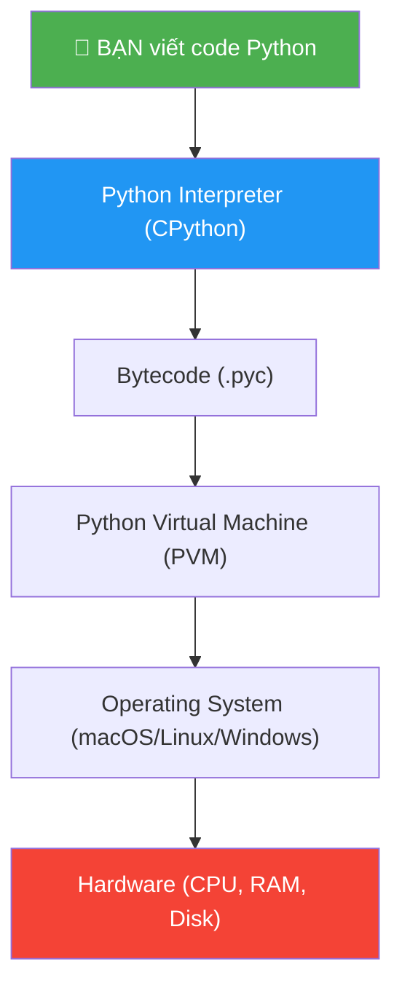
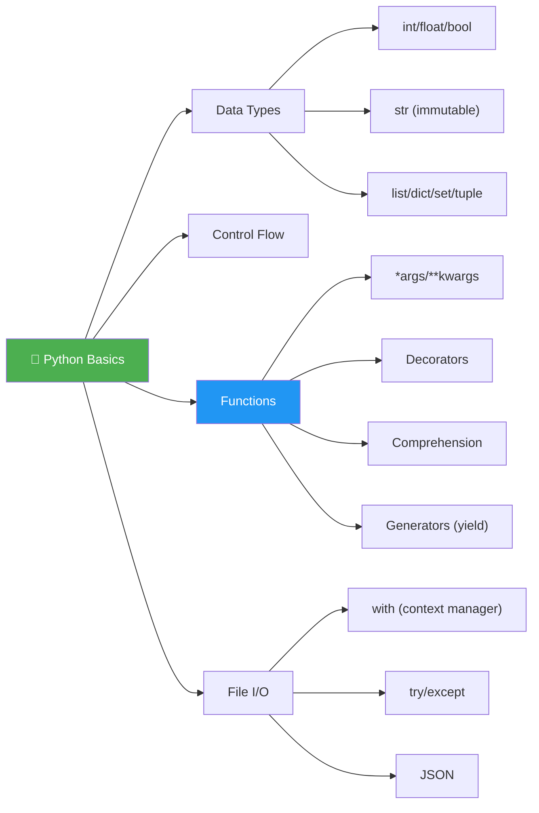

# 🐍 Python Cơ Bản — Tuần 1-2: Hiểu Sâu Từ Gốc Rễ

> 📅 Thuộc Phase 1 của [AI Solution Engineer Roadmap](./AI%20Solution%20Engineer%20Roadmap.md)
> 🎯 Mục tiêu: Nắm vững Python từ syntax đến tư duy, KHÔNG chỉ "biết code"

---

## 🗺️ Mental Map — Vị trí Python trong bức tranh tổng thể



```
  Khi bạn chạy: python hello.py

  Tầng 1: Source Code     → hello.py (text bạn viết)
  Tầng 2: Compiler        → Python biên dịch thành bytecode (.pyc)
  Tầng 3: Virtual Machine → PVM thực thi bytecode từng dòng
  Tầng 4: OS              → Gọi system calls (in ra màn hình, đọc file...)
  Tầng 5: Hardware         → CPU xử lý, RAM lưu trữ

  💡 Python là INTERPRETED language?
     KHÔNG HOÀN TOÀN! Python có BƯỚC COMPILE:
     .py → .pyc (bytecode) → PVM chạy bytecode
     → Gọi chính xác: Python là "bytecode-compiled, VM-interpreted"
```

---

## 📖 Mục lục

1. [Lịch sử Python — Tại sao nó tồn tại?](#1-lịch-sử-python--tại-sao-nó-tồn-tại)
2. [Kiểu dữ liệu — First Principles](#2-kiểu-dữ-liệu--first-principles)
3. [Biến & Bộ nhớ — Cái tên và cái thùng](#3-biến--bộ-nhớ--cái-tên-và-cái-thùng)
4. [Control Flow — Điều khiển dòng chảy](#4-control-flow--điều-khiển-dòng-chảy)
5. [Functions — Từ "lặp code" đến "tái sử dụng"](#5-functions--từ-lặp-code-đến-tái-sử-dụng)
6. [*args, **kwargs — Tại sao cần linh hoạt?](#6-args-kwargs--tại-sao-cần-linh-hoạt)
7. [Decorators — Siêu năng lực của Functions](#7-decorators--siêu-năng-lực-của-functions)
8. [List Comprehension — Viết gọn, nghĩ gọn](#8-list-comprehension--viết-gọn-nghĩ-gọn)
9. [Generators — Lười biếng một cách THÔNG MINH](#9-generators--lười-biếng-một-cách-thông-minh)
10. [File I/O & Exception Handling](#10-file-io--exception-handling)

---

# 1. Lịch sử Python — Tại sao nó tồn tại?

> 🔄 **Pattern: Contextual History — Hiểu QUÁ KHỨ để hiểu HIỆN TẠI**

### Trước Python, lập trình thế nào?

```
  Thập niên 1980s — Thế giới lập trình:

  C (1972):      Nhanh, gần hardware, NHƯNG phức tạp!
                 → Phải quản lý bộ nhớ thủ công (malloc/free)
                 → 1 lỗi pointer = toàn bộ chương trình crash!

  Perl (1987):   Xử lý text mạnh, NHƯNG code "write-only"!
                 → Đọc lại code Perl sau 6 tháng = KHÔNG HIỂU NỔI!

  Shell Script:  Tự động hóa, NHƯNG yếu về logic phức tạp
                 → Chỉ phù hợp cho task đơn giản

  VẤN ĐỀ: Chúng ta muốn code ĐƠN GIẢN như Shell, MẠNH như C,
           DỄ ĐỌC hơn Perl. Có được không?
```

### Guido van Rossum và sự ra đời của Python (1991)

```
  Guido van Rossum (Hà Lan) muốn:
    ✅ Code DỄ ĐỌC như tiếng Anh
    ✅ KHÔNG phải quản lý bộ nhớ
    ✅ Batteries included (thư viện sẵn có)
    ✅ Dùng cho MỌI THỨ (scripting, web, data, AI...)

  Triết lý: "There should be one — and preferably only one — obvious way to do it"
  → Khác JavaScript: 10 cách làm 1 việc!
  → Python: 1 cách "đúng" nhất!

  Tên "Python" = từ Monty Python (comedy show), KHÔNG PHẢI con rắn! 🐍😄
```

### 🔍 5 Whys: Tại sao Python thống trị AI?

```
  Q1: Tại sao AI/ML dùng Python?
  A1: Vì có NumPy, TensorFlow, PyTorch — thư viện mạnh nhất!

  Q2: Tại sao thư viện AI chọn Python?
  A2: Vì Python syntax ĐƠN GIẢN → researcher (không phải dev) cũng code được!

  Q3: Tại sao researcher cần code?
  A3: Vì AI = thử nghiệm liên tục → cần ngôn ngữ NHANH ĐỂ VIẾT!

  Q4: Nhưng Python CHẬM hơn C/C++ rất nhiều, tại sao vẫn dùng?
  A4: Vì phần "nặng" (matrix operations) chạy bằng C/Fortran bên dưới!
      NumPy = Python wrapper cho C code → Python gọi, C chạy!

  Q5: Vậy Python chỉ là "keo dán" (glue language)?
  A5: ĐÚNG! Python = "ông chủ" ra lệnh, C/CUDA = "nhân viên" thực thi!
      → Viết DỄ bằng Python, chạy NHANH bằng C = cả 2 thế giới! ✅
```

```
  📐 Trade-off của Python:

  ┌─────────────┬──────────────────────────────┐
  │ Ưu điểm     │ Đánh đổi (Trade-off)         │
  ├─────────────┼──────────────────────────────┤
  │ Dễ đọc      │ Chậm hơn C/Go 10-100x       │
  │ Dễ viết     │ GIL = chỉ 1 thread chạy Python│
  │ Batteries   │ Package quản lý phức tạp     │
  │ Dynamic type│ Bug phát hiện lúc runtime    │
  └─────────────┴──────────────────────────────┘

  Kịch bản Python THẤT BẠI:
    → Real-time systems (game engine, trading ns-level)
    → Mobile apps (dùng Swift/Kotlin thay)
    → CPU-bound tasks (dùng C/Rust thay)
```

---

# 2. Kiểu dữ liệu — First Principles

> 🧱 **Pattern: First Principles — Mọi thứ quy về BIT**

### Máy tính CHỈ hiểu 0 và 1

```
  Sự thật cơ bản nhất (KHÔNG THỂ CHỐI CÃI):
    Máy tính chỉ biết 2 trạng thái: BẬT (1) và TẮT (0)

  Mọi thứ bạn thấy trên màn hình đều là 0 và 1:
    Số 42      = 00101010 (binary)
    Chữ 'A'    = 01000001 (ASCII 65)
    Màu đỏ     = 11111111 00000000 00000000 (RGB)
    Ảnh selfie  = hàng triệu bytes (0 và 1)

  → Kiểu dữ liệu = cách Python DIỄN GIẢI các bits này!
    Cùng 8 bits "01000001":
      Đọc như số → 65
      Đọc như ký tự → 'A'
```

### Kiểu dữ liệu cơ bản trong Python

```python
# ═══════════════════════════════════════════════════
# 1. NUMBERS — Số
# ═══════════════════════════════════════════════════

# int — số nguyên (KHÔNG giới hạn kích thước!)
age = 25
big_number = 10 ** 100    # 10 mũ 100 = Googol number!
# ⚠️ Khác C/Java: int trong Python KHÔNG GIỚI HẠN!
#    C: int = 32 bits = max 2,147,483,647
#    Python: int = bao nhiêu chữ số cũng được! (arbitrary precision)

# float — số thực (64-bit, IEEE 754)
price = 19.99
pi = 3.14159265358979

# ⚠️ CẢNH BÁO: Float KHÔNG chính xác!
print(0.1 + 0.2)         # 0.30000000000000004 ← KHÔNG PHẢI 0.3!
print(0.1 + 0.2 == 0.3)  # False! 😱

# Tại sao? (First Principles)
# 0.1 trong binary = 0.0001100110011... (vô hạn!)
# Computer cắt bớt → mất chính xác!
# → Khi cần chính xác (tiền bạc!): dùng Decimal module
from decimal import Decimal
print(Decimal('0.1') + Decimal('0.2') == Decimal('0.3'))  # True ✅

# bool — True/False (kế thừa từ int!)
is_active = True
is_deleted = False
print(True + True)   # 2! Vì True = 1, False = 0
print(True * 10)     # 10
# → bool THỰC CHẤT là int có 2 giá trị: 0 và 1!
```

```python
# ═══════════════════════════════════════════════════
# 2. STRING — Chuỗi ký tự
# ═══════════════════════════════════════════════════

name = "Python"          # Dùng " hoặc ' đều được
multiline = """
Đây là chuỗi
nhiều dòng
"""

# f-string (Python 3.6+) — CÁCH TỐT NHẤT để format!
age = 25
greeting = f"Tôi {age} tuổi, năm sinh {2025 - age}"
# ← f"..." cho phép nhúng BIỂU THỨC Python vào string!

# String là IMMUTABLE (không thể thay đổi)!
s = "hello"
# s[0] = 'H'  ← LỖI! TypeError!
s = "H" + s[1:]  # Phải tạo string MỚI → "Hello"

# 🔍 5 Whys: Tại sao string immutable?
# Q1: Tại sao không cho sửa string?
# A1: Vì string dùng làm dict key → phải hashable → phải immutable!
# Q2: Tại sao dict key phải hashable?
# A2: Vì dict dùng Hash Table → cần hash ổn định → nếu key thay đổi → hash sai!
# Q3: Tại sao hash phải ổn định?
# A3: Vì data KHÔNG tìm được nếu hash thay đổi sau khi lưu!
# → IMMUTABILITY đảm bảo DATA INTEGRITY!
```

```python
# ═══════════════════════════════════════════════════
# 3. COLLECTIONS — Bộ sưu tập
# ═══════════════════════════════════════════════════

# ── list: mảng thay đổi được ──
fruits = ["táo", "cam", "xoài"]
fruits.append("dưa")          # Thêm cuối
fruits[0] = "bưởi"             # Sửa phần tử → OK vì MUTABLE!
print(fruits)                  # ['bưởi', 'cam', 'xoài', 'dưa']

# ── tuple: mảng KHÔNG thay đổi được ──
point = (10, 20)
# point[0] = 30  ← LỖI! tuple immutable!

# ── dict: từ điển (key-value) ──
person = {
    "tên": "Quân",
    "tuổi": 25,
    "kỹ năng": ["Python", "React"]
}
print(person["tên"])           # "Quân"
person["email"] = "q@mail.com" # Thêm key mới

# ── set: tập hợp (không trùng, không thứ tự) ──
unique_nums = {1, 2, 3, 2, 1}
print(unique_nums)             # {1, 2, 3} — tự loại trùng!
```

### 📐 First Principles: Bên dưới chúng lưu thế nào?

```
  ┌────────────┬──────────────┬─────────────┬──────────────┐
  │ Collection │ Data Struct  │ Lookup Time │ Mutable?     │
  ├────────────┼──────────────┼─────────────┼──────────────┤
  │ list       │ Dynamic Array│ O(1) index  │ ✅ Mutable   │
  │ tuple      │ Fixed Array  │ O(1) index  │ ❌ Immutable │
  │ dict       │ Hash Table   │ O(1) key    │ ✅ Mutable   │
  │ set        │ Hash Table   │ O(1) member │ ✅ Mutable   │
  └────────────┴──────────────┴─────────────┴──────────────┘

  Trade-off:
    list vs tuple:
      list = LINH HOẠT (thay đổi được) nhưng CHẬM hơn một chút
      tuple = NHANH hơn, TIẾT KIỆM ram, dùng làm dict key ✅

    dict vs list:
      dict = tìm theo KEY cực nhanh O(1)  → TỐN ram nhiều hơn
      list = tìm theo INDEX O(1)           → TỐN ram ít hơn

    set vs list khi check "có tồn tại?":
      "x" in my_list → O(n) — duyệt TỪNG phần tử 😰
      "x" in my_set  → O(1) — hash lookup! 🚀
```

### 🔧 Reverse Engineering: Tự xây dict đơn giản

```python
# Hiểu Hash Table bằng cách TỰ XÂY 1 cái mini!

class MiniDict:
    def __init__(self, size=10):
        # "Thùng" chứa — mỗi thùng là 1 list (chaining)
        self.buckets = [[] for _ in range(size)]
        self.size = size

    def _hash(self, key):
        """Biến key thành số (index của thùng)"""
        # Dùng built-in hash() rồi chia dư cho size
        return hash(key) % self.size

    def set(self, key, value):
        """Thêm hoặc cập nhật key-value"""
        idx = self._hash(key)
        # Tìm trong thùng, nếu key đã có → cập nhật
        for i, (k, v) in enumerate(self.buckets[idx]):
            if k == key:
                self.buckets[idx][i] = (key, value)
                return
        # Chưa có → thêm mới
        self.buckets[idx].append((key, value))

    def get(self, key):
        """Lấy value theo key"""
        idx = self._hash(key)
        for k, v in self.buckets[idx]:
            if k == key:
                return v
        raise KeyError(key)

# Dùng thử:
d = MiniDict()
d.set("tên", "Quân")
d.set("tuổi", 25)
print(d.get("tên"))     # "Quân"
print(d.get("tuổi"))    # 25

# Bên trong: hash("tên") % 10 = 7 → bucket[7] = [("tên", "Quân")]
#            hash("tuổi") % 10 = 3 → bucket[3] = [("tuổi", 25)]
# → Truy vấn O(1) vì biết NGAY bucket nào!
```

---

# 3. Biến & Bộ nhớ — Cái tên và cái thùng

> 🧱 **Pattern: First Principles — Python KHÔNG CÓ "biến" giống C!**

### Mô hình bộ nhớ Python — KHÁC HOÀN TOÀN C/Java!

```
  TRONG C:
    int x = 42;
    → x là CÁI THÙNG chứa giá trị 42
    → Thay giá trị = đổi nội dung thùng

    ┌──────┐
    │  42  │  ← thùng tên "x"
    └──────┘

  TRONG PYTHON:
    x = 42
    → 42 là OBJECT nằm ở đâu đó trong bộ nhớ
    → x là CÁI TÊN (label/tag) TRỎ đến object 42
    → Thay giá trị = DÁN NHÃN sang object khác!

    x ──→ [ 42 ]     ← object số 42 trong heap memory
```

```python
# CHỨNG MINH: Python dùng "references" (tham chiếu)

a = [1, 2, 3]
b = a            # b TRỎ ĐẾN CÙNG list với a!

b.append(4)
print(a)         # [1, 2, 3, 4] — a cũng thay đổi! 😱

# Tại sao?
# a ──→ [1, 2, 3, 4]  ← CÙNG 1 object trong bộ nhớ!
# b ──↗

# Dùng id() để chứng minh:
print(id(a) == id(b))  # True! → CÙNG ĐỊA CHỈ bộ nhớ!

# Muốn tạo BẢN SAO (copy)?
c = a.copy()          # Shallow copy — tạo list MỚI
c = a[:]              # Cũng là shallow copy
c = list(a)           # Cũng là shallow copy
print(id(a) == id(c))  # False! → ĐỊA CHỈ KHÁC!
```

### Mutable vs Immutable — Trade-off quan trọng nhất

```python
# IMMUTABLE: int, float, str, tuple, frozenset
x = 10
y = x
x = 20
print(y)  # 10 ← y KHÔNG thay đổi!
# Vì x = 20 → x trỏ sang OBJECT MỚI (20)
# y vẫn trỏ object cũ (10)

# MUTABLE: list, dict, set
a = [1, 2]
b = a
a.append(3)
print(b)  # [1, 2, 3] ← b THAY ĐỔI THEO!
# Vì a.append() sửa object GỐC, b cũng trỏ đến nó
```

```
  📐 Trade-off: Mutable vs Immutable

  ┌──────────┬───────────────────────┬────────────────────────┐
  │          │ Mutable               │ Immutable              │
  ├──────────┼───────────────────────┼────────────────────────┤
  │ Ví dụ   │ list, dict, set       │ int, str, tuple        │
  │ Sửa được │ ✅ Có                 │ ❌ KHÔNG (tạo obj mới) │
  │ Dict key │ ❌ KHÔNG dùng được    │ ✅ Dùng được           │
  │ Thread   │ ⚠️ NGUY HIỂM (race)  │ ✅ AN TOÀN             │
  │ Tốc độ  │ Nhanh khi sửa        │ Nhanh khi đọc          │
  │ Bug      │ Dễ có side effects    │ Predictable, ít bug    │
  └──────────┴───────────────────────┴────────────────────────┘

  Quy tắc: Dùng IMMUTABLE khi có thể, MUTABLE khi cần thiết!
```

---

# 4. Control Flow — Điều khiển dòng chảy

### if / elif / else

```python
# Python dùng INDENTATION (thụt đầu dòng) thay vì { }
# → BẮT BUỘC phải thụt đúng! Sai indentation = SyntaxError!

age = 20

if age < 13:
    print("Trẻ em")
elif age < 18:
    print("Thiếu niên")
elif age < 65:
    print("Người lớn")     # ← In dòng này!
else:
    print("Cao tuổi")

# 🔍 5 Whys: Tại sao Python dùng indentation mà không dùng { }?
# Q1: Tại sao không dùng { } như C/Java/JS?
# A1: Guido muốn code BẮT BUỘC phải dễ đọc — không thể ẩu!
# Q2: Tại sao bắt buộc dễ đọc quan trọng?
# A2: Vì code đọc NHIỀU HƠN viết (10:1 ratio)
# Q3: Nhưng { } cũng đọc được nếu format đẹp?
# A3: Với { } bạn CÓ THỂ viết xấu mà vẫn chạy → Python bắt phải đẹp!
```

### Truthy & Falsy — Python linh hoạt hơn bạn nghĩ

```python
# Các giá trị FALSY (coi như False):
#   False, None, 0, 0.0, "", [], {}, set(), ()

# Mọi thứ khác = TRUTHY (coi như True)

# Ứng dụng thực tế:
users = []
if users:                  # list rỗng = False!
    print("Có users")
else:
    print("Không có users")    # ← In dòng này!

name = ""
if name:                   # string rỗng = False!
    print(f"Xin chào {name}")
else:
    print("Chưa có tên")      # ← In dòng này!

# ⚠️ CẠNH BÁO: 0 là Falsy!
count = 0
if count:                  # 0 = False!
    print(f"Có {count} items")
else:
    print("Không có items")    # ← In dòng này... nhưng count = 0 là hợp lệ!

# → Khi cần phân biệt 0 vs None → dùng "is not None"
if count is not None:
    print(f"count = {count}")  # ← Đúng ý muốn!
```

### for loop — Đặc biệt khác C!

```python
# Python for = "for each" → duyệt qua ITERABLE

# Khác biệt C vs Python:
# C:      for (int i = 0; i < 5; i++) { ... }  ← đếm số
# Python: for item in collection:  ← duyệt phần tử!

# Duyệt list
fruits = ["táo", "cam", "xoài"]
for fruit in fruits:
    print(fruit)

# Cần index? Dùng enumerate() — ĐỪNG dùng range(len())!
for i, fruit in enumerate(fruits):
    print(f"{i}: {fruit}")

# ❌ Cách xấu (newbie hay dùng):
for i in range(len(fruits)):
    print(f"{i}: {fruits[i]}")
# → Dài, xấu, không "Pythonic"!

# Duyệt dict
person = {"tên": "Quân", "tuổi": 25}
for key, value in person.items():
    print(f"{key} = {value}")

# Duyệt 2 list song song → zip()
names = ["An", "Bình", "Chi"]
scores = [90, 85, 92]
for name, score in zip(names, scores):
    print(f"{name}: {score} điểm")
```

### while loop — Khi không biết trước số lần

```python
# Đọc input cho đến khi nhập "quit"
while True:
    text = input("Nhập gì đó (quit để thoát): ")
    if text == "quit":
        break          # Thoát khỏi vòng lặp!
    print(f"Bạn nhập: {text}")

# ⚠️ break vs continue:
#   break    → THOÁT hoàn toàn khỏi loop
#   continue → BỎ QUA phần còn lại, nhảy lên đầu loop
for i in range(10):
    if i == 3:
        continue       # Bỏ qua 3
    if i == 7:
        break          # Dừng ở 7
    print(i)           # In: 0, 1, 2, 4, 5, 6
```

---

# 5. Functions — Từ "lặp code" đến "tái sử dụng"

> 🔄 **Pattern: Contextual History — Function sinh ra để giải quyết DRY**

### Tại sao cần function?

```python
# TRƯỚC KHI CÓ function — code lặp lại khắp nơi:
name1 = "An"
print(f"Xin chào {name1}!")
print(f"Chào mừng {name1} đến hệ thống!")
print("──────────────────")

name2 = "Bình"
print(f"Xin chào {name2}!")
print(f"Chào mừng {name2} đến hệ thống!")
print("──────────────────")
# → Copy-paste! Sửa 1 chỗ phải sửa TẤT CẢ! DRY violation!

# SAU KHI CÓ function — viết 1 lần, gọi nhiều lần:
def greet(name):
    print(f"Xin chào {name}!")
    print(f"Chào mừng {name} đến hệ thống!")
    print("──────────────────")

greet("An")
greet("Bình")
greet("Chi")
# → Sửa 1 chỗ = sửa TẤT CẢ! ✅
```

### Anatomy of a Function — Giải phẫu hàm

```python
def calculate_bmi(weight, height, unit="metric"):
    """
    Tính BMI (Body Mass Index).

    Args:
        weight: Cân nặng (kg hoặc lbs)
        height: Chiều cao (m hoặc inches)
        unit: "metric" hoặc "imperial"

    Returns:
        float: Chỉ số BMI
    """
    if unit == "imperial":
        return (weight / (height ** 2)) * 703
    return weight / (height ** 2)

# Gọi:
bmi = calculate_bmi(70, 1.75)            # Dùng default unit="metric"
bmi_us = calculate_bmi(154, 69, "imperial")  # Chỉ định unit
```

```
  Phân tích:
  ┌──────────────────────────────────────────────────────┐
  │  def          → keyword khai báo function            │
  │  calculate_bmi → tên hàm (snake_case!)               │
  │  (weight, height, unit="metric") → parameters        │
  │     weight, height → positional params (BẮT BUỘC)    │
  │     unit="metric" → keyword param (CÓ DEFAULT)       │
  │  """..."""     → docstring (mô tả hàm)                │
  │  return       → trả về giá trị (None nếu không có)   │
  └──────────────────────────────────────────────────────┘
```

### Scope — Phạm vi biến

```python
x = "global"             # Global scope

def outer():
    x = "outer"           # Enclosing scope
    
    def inner():
        x = "inner"       # Local scope
        print(x)          # → "inner"
    
    inner()
    print(x)              # → "outer"

outer()
print(x)                  # → "global"

# Python tìm biến theo quy tắc LEGB:
#   L → Local (trong hàm hiện tại)
#   E → Enclosing (hàm bao ngoài)
#   G → Global (trong module)
#   B → Built-in (Python sẵn có: print, len, ...)
```

---

# 6. *args, **kwargs — Tại sao cần linh hoạt?

> 🔍 **Pattern: 5 Whys — Tại sao cần số lượng tham số KHÔNG CỐ ĐỊNH?**

```
  Q1: Tại sao cần *args?
  A1: Vì đôi khi KHÔNG BIẾT TRƯỚC có bao nhiêu tham số!

  Q2: Ví dụ khi nào?
  A2: print("a", "b", "c") — print nhận BAO NHIÊU cũng được!

  Q3: Tại sao không dùng list?
  A3: sum([1,2,3]) cũng được, nhưng sum(1, 2, 3) trực quan hơn!

  Q4: **kwargs thì sao?
  A4: Khi muốn nhận config/options mà KHÔNG LIỆT KÊ HẾT!
      → dict(**{"a": 1, "b": 2}) = dict(a=1, b=2) linh hoạt!

  Q5: Ứng dụng thực tế trong AI?
  A5: Decorator, wrapper functions, framework config!
      → LangChain dùng **kwargs RẤT NHIỀU để pass config!
```

```python
# ═══════════════════════════════════════════════════
# *args — Nhận NHIỀU positional args thành tuple
# ═══════════════════════════════════════════════════

def sum_all(*args):
    """args = tuple chứa tất cả arguments"""
    print(type(args))    # <class 'tuple'>
    print(args)          # (1, 2, 3, 4, 5)
    return sum(args)

print(sum_all(1, 2, 3))        # 6
print(sum_all(1, 2, 3, 4, 5))  # 15
# → Gọi với BAO NHIÊU số cũng được!

# ═══════════════════════════════════════════════════
# **kwargs — Nhận NHIỀU keyword args thành dict
# ═══════════════════════════════════════════════════

def create_user(**kwargs):
    """kwargs = dict chứa tất cả keyword arguments"""
    print(type(kwargs))  # <class 'dict'>
    print(kwargs)        # {'name': 'An', 'age': 25}
    return kwargs

user = create_user(name="An", age=25, email="an@mail.com")
# → Truyền BẤT KỲ key=value nào cũng được!

# ═══════════════════════════════════════════════════
# Kết hợp: *args + **kwargs
# ═══════════════════════════════════════════════════

def flexible(a, b, *args, **kwargs):
    print(f"a={a}, b={b}")
    print(f"args={args}")
    print(f"kwargs={kwargs}")

flexible(1, 2, 3, 4, 5, x=10, y=20)
# a=1, b=2
# args=(3, 4, 5)
# kwargs={'x': 10, 'y': 20}

# THỨ TỰ BẮT BUỘC: positional → *args → keyword → **kwargs
```

### Ứng dụng thực tế: Wrapper Function

```python
# Khi bạn muốn "bọc" 1 function bằng function khác
# mà KHÔNG biết function gốc nhận gì → dùng *args, **kwargs!

import time

def timer(func):
    """Đo thời gian chạy của bất kỳ function nào"""
    def wrapper(*args, **kwargs):       # Nhận MỌI args!
        start = time.time()
        result = func(*args, **kwargs)  # Pass MỌI args cho func gốc!
        end = time.time()
        print(f"{func.__name__} mất {end - start:.4f}s")
        return result
    return wrapper

# Dùng với BẤT KỲ function nào:
@timer
def slow_function(n):
    return sum(range(n))

slow_function(10_000_000)  # slow_function mất 0.2345s
```

---

# 7. Decorators — Siêu năng lực của Functions

> 🏗️ **Pattern: Reverse Engineering — Tự xây decorator để HIỂU SÂU**

### Decorator = function BIẾN ĐỔI function khác

```
  Trước khi hiểu decorator, phải hiểu:

  💡 INSIGHT CỐT LÕI: Trong Python, function là OBJECT!

  → Function có thể:
    1. Gán cho biến
    2. Truyền vào function khác
    3. Return từ function khác

  → Đây gọi là "First-class functions"
```

```python
# CHỨNG MINH: function là object

def greet(name):
    return f"Xin chào {name}!"

# 1. Gán cho biến
say_hi = greet           # KHÔNG có () → gán function, KHÔNG gọi!
print(say_hi("An"))      # "Xin chào An!"
print(type(say_hi))      # <class 'function'>

# 2. Truyền vào function khác
def apply(func, value):
    return func(value)

result = apply(greet, "Bình")   # Truyền function greet vào!
print(result)                    # "Xin chào Bình!"

# 3. Return function từ function
def create_greeter(greeting):
    def greeter(name):
        return f"{greeting}, {name}!"
    return greeter              # Return FUNCTION!

hello = create_greeter("Hello")
print(hello("Chi"))             # "Hello, Chi!"
```

### Xây decorator TỪNG BƯỚC

```python
# ═══ BƯỚC 1: Viết thủ công ═══

def shout(func):
    """Biến output thành IN HOA"""
    def wrapper(*args, **kwargs):
        result = func(*args, **kwargs)
        return result.upper()
    return wrapper

def greet(name):
    return f"xin chào {name}"

# Dùng thủ công:
greet = shout(greet)    # Ghi đè greet bằng phiên bản wrapper!
print(greet("An"))       # "XIN CHÀO AN"

# ═══ BƯỚC 2: Dùng @ syntax (syntactic sugar) ═══

@shout                   # = greet = shout(greet)
def greet(name):
    return f"xin chào {name}"

print(greet("An"))       # "XIN CHÀO AN"
# → @ chỉ là cách viết NGẮN GỌN!
```

### Decorator thực tế cho AI Engineer

```python
import time
import functools

# 1. Đo thời gian (đã xây ở trên, nâng cấp thêm)
def timer(func):
    @functools.wraps(func)          # Giữ tên/docstring gốc!
    def wrapper(*args, **kwargs):
        start = time.time()
        result = func(*args, **kwargs)
        elapsed = time.time() - start
        print(f"⏱️ {func.__name__}() mất {elapsed:.4f}s")
        return result
    return wrapper

# 2. Retry khi lỗi (dùng NHIỀU khi gọi API!)
def retry(max_retries=3, delay=1):
    def decorator(func):
        @functools.wraps(func)
        def wrapper(*args, **kwargs):
            for attempt in range(max_retries):
                try:
                    return func(*args, **kwargs)
                except Exception as e:
                    print(f"⚠️ Lần {attempt+1}/{max_retries} lỗi: {e}")
                    if attempt < max_retries - 1:
                        time.sleep(delay)
            raise Exception(f"❌ Thất bại sau {max_retries} lần thử")
        return wrapper
    return decorator

# 3. Cache kết quả (tránh tính lại)
def cache(func):
    memo = {}
    @functools.wraps(func)
    def wrapper(*args):
        if args not in memo:
            memo[args] = func(*args)
        return memo[args]
    return wrapper

# Dùng:
@timer
@retry(max_retries=3, delay=1)
def call_ai_api(prompt):
    """Gọi LLM API — có thể fail!"""
    # ... gọi OpenAI API ...
    pass

@cache
def fibonacci(n):
    if n < 2: return n
    return fibonacci(n-1) + fibonacci(n-2)

print(fibonacci(100))  # Cực nhanh nhờ cache! (không cache → treo máy!)
```

---

# 8. List Comprehension — Viết gọn, nghĩ gọn

> 🔍 **Pattern: 5 Whys — Tại sao Python cần cú pháp đặc biệt cho list?**

```
  Q1: Tại sao cần list comprehension?
  A1: Để tạo list MỚI từ list CŨ một cách ngắn gọn!

  Q2: Tại sao không dùng for loop bình thường?
  A2: Quá DÀI cho thao tác đơn giản!

  Q3: Ngắn gọn quan trọng thế sao?
  A3: "Readability counts" — Python Zen! Ngắn = dễ đọc = ít bug!

  Q4: Nhưng comprehension có KHÓ ĐỌC hơn loop?
  A4: ĐÚNG nếu quá phức tạp! → Quy tắc: 1 dòng OK, lồng 3 tầng = DỪNG LẠI!

  → Trade-off: NGẮN GỌN ↔ DỄ ĐỌC — tìm điểm cân bằng!
```

```python
# ═══ So sánh: For loop vs List Comprehension ═══

# Bài toán: tạo list bình phương của số từ 1-5

# ❌ Cách dài (for loop):
squares = []
for i in range(1, 6):
    squares.append(i ** 2)
# squares = [1, 4, 9, 16, 25]

# ✅ Cách gọn (comprehension):
squares = [i ** 2 for i in range(1, 6)]
# squares = [1, 4, 9, 16, 25]
```

### Cấu trúc comprehension

```
  ┌─────────────────────────────────────────────────────┐
  │  [BIỂU THỨC  for BIẾN in ITERABLE  if ĐIỀU KIỆN]  │
  └─────────────────────────────────────────────────────┘
       ↑              ↑         ↑            ↑
   output mỗi    tên biến   nguồn dữ liệu   filter
   phần tử       duyệt      (list, range..)  (tùy chọn)
```

```python
# Với điều kiện — filter:
evens = [x for x in range(10) if x % 2 == 0]
# [0, 2, 4, 6, 8]

# Biến đổi string:
names = ["an", "BÌNH", "chi"]
formatted = [name.capitalize() for name in names]
# ['An', 'Bình', 'Chi']

# Dict comprehension:
scores = {"An": 90, "Bình": 45, "Chi": 85}
passed = {name: score for name, score in scores.items() if score >= 50}
# {'An': 90, 'Chi': 85}

# Set comprehension:
unique_lengths = {len(word) for word in ["hello", "world", "hi", "hey"]}
# {2, 3, 5}

# ⚠️ ĐỪNG lồng quá 2 tầng!
# ❌ Khó đọc:
matrix = [[1,2],[3,4],[5,6]]
flat = [x for row in matrix for x in row if x > 2]
# → Dùng for loop cho rõ ràng hơn!
```

---

# 9. Generators — Lười biếng một cách THÔNG MINH

> 🧱 **Pattern: First Principles — Bộ nhớ là HỮU HẠN!**

### Vấn đề: List 1 tỷ phần tử

```python
# ❌ List: TẠO TẤT CẢ → LƯU TẤT CẢ vào RAM
numbers = [i for i in range(1_000_000_000)]  # 1 TỶ phần tử
# → ~8GB RAM! → Máy hết RAM → CRASH! 💀

# ✅ Generator: TẠO TỪNG CÁI → DÙNG XONG BỎ!
numbers = (i for i in range(1_000_000_000))  # () thay vì []
# → Chỉ tốn vài bytes! Tạo phần tử KHI CẦN!
```

### Generator giống "nhà máy sản xuất theo đơn hàng"

```
  LIST = Kho hàng: sản xuất 1 triệu sản phẩm, chất đầy kho, rồi bán
    → Tốn kho (RAM), nhưng lấy hàng NHANH (đã có sẵn)

  GENERATOR = Sản xuất theo đơn: khách đặt 1 cái → sản xuất 1 cái
    → KHÔNG tốn kho, nhưng mỗi lần lấy phải CHỜ sản xuất

  📐 Trade-off:
    List:      Tốn RAM nhiều, truy cập nhanh (random access)
    Generator: Tốn RAM ít,    chỉ đọc 1 lần (sequential only)
```

```python
# ═══ Tạo generator bằng function + yield ═══

def count_up(start, end):
    """Generator đếm từ start đến end"""
    current = start
    while current <= end:
        yield current      # ← "trả về" rồi TẠM DỪNG!
        current += 1        # Tiếp tục khi next() được gọi

# Dùng:
counter = count_up(1, 5)
print(next(counter))  # 1 — chạy đến yield, trả về 1, TẠM DỪNG
print(next(counter))  # 2 — tiếp tục từ chỗ dừng, trả về 2
print(next(counter))  # 3

# Hoặc duyệt bằng for (tự gọi next):
for num in count_up(1, 5):
    print(num)  # 1, 2, 3, 4, 5

# ═══ Ứng dụng thực tế: Đọc file lớn ═══

def read_large_file(filepath):
    """Đọc file TỪNG DÒNG — không load toàn bộ vào RAM!"""
    with open(filepath) as f:
        for line in f:
            yield line.strip()

# File 10GB? Không vấn đề! Đọc từng dòng!
for line in read_large_file("huge_data.csv"):
    process(line)  # Xử lý 1 dòng, rồi BỎ, đọc dòng tiếp
```

### yield vs return — Sự khác biệt CỐT LÕI

```
  return:
    → Trả giá trị → CHẤM DỨT function
    → Gọi lại = bắt đầu từ ĐẦU

  yield:
    → Trả giá trị → TẠM DỪNG function (giữ nguyên state!)
    → Gọi next() = TIẾP TỤC từ chỗ dừng
    → Hết giá trị = raise StopIteration

  yield = "pause" button, return = "stop" button!
```

---

# 10. File I/O & Exception Handling

### Đọc/Ghi file — Context Manager

```python
# ═══ Đọc file ═══

# ✅ ĐÚNG: dùng with (context manager) — tự đóng file!
with open("data.txt", "r", encoding="utf-8") as f:
    content = f.read()        # Đọc toàn bộ
    # hoặc:
    # lines = f.readlines()   # Đọc thành list các dòng
    # hoặc:
    # for line in f:           # Đọc từng dòng (memory efficient!)

# ❌ SAI: quên đóng file!
f = open("data.txt")
content = f.read()
# ... quên f.close() → file bị lock, memory leak!

# 🔍 5 Whys: Tại sao phải dùng "with"?
# Q1: Tại sao phải đóng file?
# A1: OS giới hạn số file mở (ulimit) → quá nhiều = crash!
# Q2: Tại sao không tự nhớ đóng?
# A2: Có exception giữa chừng → code f.close() KHÔNG CHẠY!
# Q3: with giải quyết thế nào?
# A3: with LUÔN đóng file, kể cả khi có exception!

# ═══ Ghi file ═══

with open("output.txt", "w", encoding="utf-8") as f:
    f.write("Dòng 1\n")
    f.write("Dòng 2\n")

# Mode:
#   "r" = read (default)
#   "w" = write (XÓA file cũ!)
#   "a" = append (thêm vào cuối)
#   "x" = exclusive create (lỗi nếu file đã có)

# ═══ JSON — format phổ biến nhất trong AI ═══

import json

# Ghi JSON
data = {"model": "gpt-4", "temperature": 0.7}
with open("config.json", "w") as f:
    json.dump(data, f, indent=2, ensure_ascii=False)

# Đọc JSON
with open("config.json", "r") as f:
    config = json.load(f)
print(config["model"])  # "gpt-4"
```

### Exception Handling — Xử lý lỗi

```python
# ═══ try / except / else / finally ═══

try:
    result = 10 / 0           # Lỗi xảy ra ở đây!
except ZeroDivisionError as e:
    print(f"Lỗi chia cho 0: {e}")   # Xử lý lỗi CỤ THỂ
except Exception as e:
    print(f"Lỗi khác: {e}")         # Xử lý mọi lỗi còn lại
else:
    print(f"Kết quả: {result}")      # Chạy nếu KHÔNG có lỗi
finally:
    print("Luôn chạy dù lỗi hay không!")  # LUÔN LUÔN chạy
```

```
  Flow exception handling:

  try:
    │
    ├─ Có lỗi? ──YES──→ except (xử lý lỗi)
    │                           │
    ├─ Không lỗi? ──→ else     │
    │                           │
    └───────────────────────────┘
                    │
                 finally (LUÔN chạy)
```

```python
# ═══ Ứng dụng thực tế: Gọi API an toàn ═══

import json

def call_api(url):
    """Gọi API với xử lý lỗi đầy đủ"""
    try:
        response = requests.get(url, timeout=10)
        response.raise_for_status()   # Raise lỗi nếu 4xx/5xx
        return response.json()

    except requests.Timeout:
        print("⏰ API timeout — thử lại sau!")
        return None

    except requests.ConnectionError:
        print("🔌 Không kết nối được — kiểm tra mạng!")
        return None

    except requests.HTTPError as e:
        print(f"❌ HTTP Error: {e.response.status_code}")
        return None

    except json.JSONDecodeError:
        print("📄 Response không phải JSON hợp lệ!")
        return None

# ⚠️ ĐỪNG catch Exception chung chung!
# ❌ except Exception: pass    → nuốt MỌI lỗi, debug KHÔNG NỔI!
# ✅ except SpecificError:     → chỉ catch lỗi bạn XỬ LÝ ĐƯỢC!
```

### Tự tạo Exception

```python
# Khi lỗi built-in KHÔNG đủ diễn đạt
class APIKeyError(Exception):
    """API key không hợp lệ hoặc hết hạn"""
    pass

class RateLimitError(Exception):
    """Quá giới hạn số request"""
    def __init__(self, retry_after):
        self.retry_after = retry_after
        super().__init__(f"Rate limited! Thử lại sau {retry_after}s")

# Dùng:
def validate_api_key(key):
    if not key or len(key) < 20:
        raise APIKeyError("API key không hợp lệ!")
    # ...

try:
    validate_api_key("")
except APIKeyError as e:
    print(e)  # "API key không hợp lệ!"
```

---

## 📐 Tổng kết — Mental Map tuần 1-2



```
  ┌───────────────────────────────────────────────────────┐
  │  Tuần 1-2 Checklist:                                  │
  │                                                       │
  │  □ Hiểu Python là bytecode-compiled + VM-interpreted  │
  │  □ Phân biệt mutable vs immutable (Trade-off!)        │
  │  □ Biến = nhãn dán, KHÔNG PHẢI thùng chứa            │
  │  □ for loop dùng enumerate/zip, KHÔNG dùng range(len)│
  │  □ Function = first-class object → dùng decorator!   │
  │  □ *args = tuple, **kwargs = dict                     │
  │  □ List comprehension: 1 dòng OK, 3 tầng = STOP!     │
  │  □ Generator = lazy evaluation → tiết kiệm RAM!      │
  │  □ with + try/except = code AN TOÀN                   │
  │  □ JSON đọc/ghi thành thạo (dùng NHIỀU trong AI!)    │
  └───────────────────────────────────────────────────────┘
```

---

## 📚 Tài liệu đọc thêm

```
  📖 Sách:
    "Python Crash Course" — Al Sweigart (Beginner, free online)
    "Automate the Boring Stuff with Python" — Al Sweigart (free)
    "Fluent Python" — Luciano Ramalho (Advanced, chọn chapter)

  🎥 Video:
    CS50P — Harvard (YouTube, 16 buổi, free)
    Corey Schafer — Python Tutorials (YouTube)
    mCoding — Python deep dives (YouTube)

  🏋️ Luyện tập:
    exercism.org/tracks/python — bài tập có mentor review
    codewars.com — level 8kyu → 4kyu
    leetcode.com — Easy problems bằng Python
```
