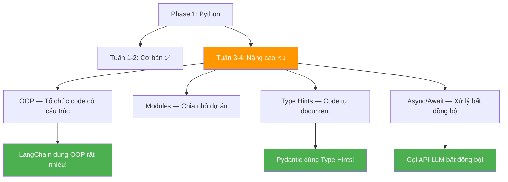
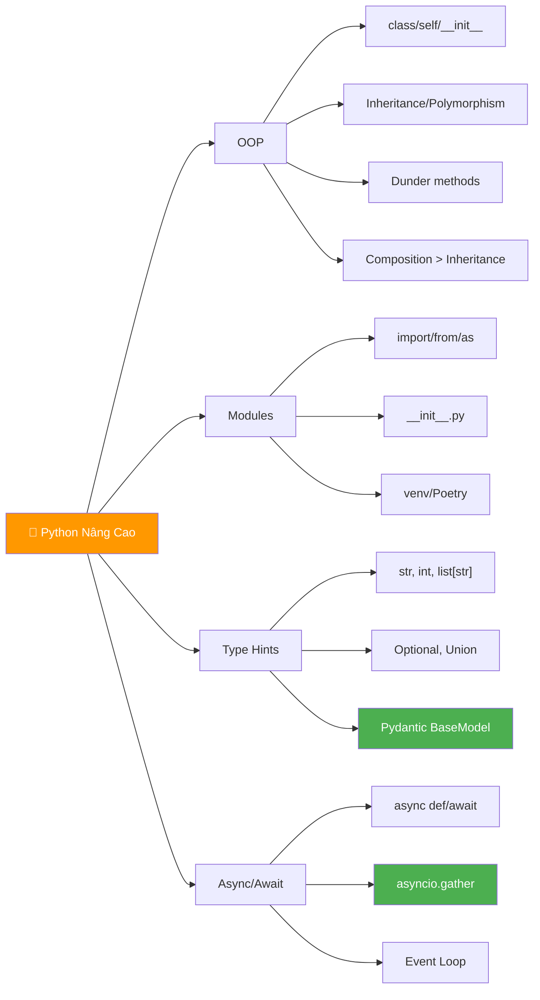

# 🐍 Python Nâng Cao — Tuần 3-4: OOP, Modules, Type Hints, Async

> 📅 Thuộc Phase 1 của [AI Solution Engineer Roadmap](./AI%20Solution%20Engineer%20Roadmap.md)
> 📖 Tiếp nối [Python Cơ Bản — Tuần 1-2](./Python%20Cơ%20Bản%20-%20Tuần%201-2.md)
> 🎯 Mục tiêu: Viết Python như ENGINEER, không chỉ như scripter

---

## 🗺️ Mental Map — Tuần 3-4 trong bức tranh tổng thể



```
  Tại sao phải học 4 chủ đề NÀY?

  ┌─────────────┬──────────────────────────────────────────┐
  │ Chủ đề      │ Tại sao cần cho AI Engineer?             │
  ├─────────────┼──────────────────────────────────────────┤
  │ OOP         │ LangChain/LlamaIndex = TOÀN classes!     │
  │ Modules     │ Dự án AI = nhiều file, cần tổ chức!      │
  │ Type Hints  │ Pydantic (core lib) BẮT BUỘC type hints! │
  │ Async/Await │ Gọi 100 API calls song song, không chờ!  │
  └─────────────┴──────────────────────────────────────────┘
```

---

## 📖 Mục lục

1. [OOP — Lịch sử và Tại sao cần?](#1-oop--lịch-sử-và-tại-sao-cần)
2. [Classes & Objects — "Bản vẽ" và "Ngôi nhà"](#2-classes--objects--bản-vẽ-và-ngôi-nhà)
3. [Inheritance — Kế thừa & Đa hình](#3-inheritance--kế-thừa--đa-hình)
4. [Dunder Methods — "Phép thuật" của Python](#4-dunder-methods--phép-thuật-của-python)
5. [Modules & Packages — Chia nhỏ dự án](#5-modules--packages--chia-nhỏ-dự-án)
6. [Virtual Environments — Cách ly dự án](#6-virtual-environments--cách-ly-dự-án)
7. [Type Hints — Code tự giải thích](#7-type-hints--code-tự-giải-thích)
8. [Async/Await — Làm nhiều việc cùng lúc](#8-asyncawait--làm-nhiều-việc-cùng-lúc)

---

# 1. OOP — Lịch sử và Tại sao cần?

> 🔄 **Pattern: Contextual History — Trước OOP, code hỗn loạn thế nào?**

### Kỷ nguyên Procedural Programming (trước OOP)

```
  Thập niên 1960-70: Code = một đống functions + global variables

  ❌ Vấn đề 1: Global State Chaos
     Mọi function sửa chung 1 đống biến global
     → Function A sửa biến, Function B không biết → BUG!
     → Giống 10 đầu bếp dùng chung 1 cái nồi — ai cũng bỏ gia vị!

  ❌ Vấn đề 2: Code khó mở rộng
     Thêm tính năng = sửa NHIỀU functions → rủi ro cao
     → Giống sửa 1 dây điện trong tường = phải đục cả bức tường!

  ❌ Vấn đề 3: Không thể TÁI SỬ DỤNG
     Code calculator cho phòng kế toán ≠ code calculator cho phòng kỹ thuật
     → Phải viết lại từ đầu mỗi lần!

  → 1967: Simula (Na Uy) ra đời = ngôn ngữ OOP đầu tiên!
  → 1972: Smalltalk (Alan Kay) hoàn thiện khái niệm OOP
  → MỌI ngôn ngữ sau đó: C++, Java, Python, JS, Go... đều có OOP!
```

### 🔍 5 Whys: Tại sao AI frameworks dùng OOP?

```
  Q1: Tại sao LangChain viết bằng classes?
  A1: Vì mỗi component (LLM, Chain, Tool) cần STATE riêng!

  Q2: Tại sao cần state riêng?
  A2: Vì mỗi LLM có config khác nhau (model name, temperature, API key)!

  Q3: Tại sao không dùng dict để lưu config?
  A3: Dict không có METHODS! Class = data + behavior gắn liền!

  Q4: Tại sao data + behavior cần gắn liền?
  A4: Vì khi thay đổi data format → methods cũng phải đổi
      → Đặt chung 1 chỗ = dễ maintain, khó quên sửa!

  Q5: Có cách khác ngoài OOP không?
  A5: Có! Functional Programming (FP). Nhưng Python ecosystem CHỌN OOP
      → LangChain, FastAPI, Django, Pydantic... TẤT CẢ dùng classes!
```

---

# 2. Classes & Objects — "Bản vẽ" và "Ngôi nhà"

### Khái niệm cốt lõi

```
  CLASS = BẢN VẼ KIẾN TRÚC
    → Mô tả: nhà có mấy phòng, cửa ở đâu, tường màu gì
    → KHÔNG PHẢI nhà thật! Chỉ là bản thiết kế!

  OBJECT (Instance) = NGÔI NHÀ THẬT
    → Xây từ bản vẽ, nhưng mỗi nhà có thể SƠN MÀU KHÁC
    → Nhiều nhà cùng 1 bản vẽ, nhưng mỗi nhà ĐỘC LẬP!

  ┌──────────────────────┐
  │  class Dog:          │ ← BẢN VẼ
  │    name: str         │
  │    breed: str        │
  │    bark()            │
  └──────┬───────┬───────┘
         │       │
    ┌────▼──┐ ┌──▼────┐
    │ Rex   │ │ Buddy │   ← OBJECTS (instances)
    │ Husky │ │ Corgi │
    └───────┘ └───────┘
```

```python
class Dog:
    # ═══ Class variable — CHIA SẺ cho TẤT CẢ instances ═══
    species = "Canis familiaris"

    # ═══ __init__ — Constructor (khởi tạo) ═══
    def __init__(self, name, breed, age):
        """Chạy MỖI KHI tạo object mới"""
        # Instance variables — RIÊNG cho từng object
        self.name = name
        self.breed = breed
        self.age = age
        self._health = 100      # _prefix = "private" (convention)

    # ═══ Instance method — hành vi của object ═══
    def bark(self):
        """self = chính object này (tự động truyền!)"""
        return f"{self.name} sủa: Gâu gâu!"

    def birthday(self):
        self.age += 1
        return f"{self.name} giờ {self.age} tuổi! 🎂"

# ═══ Tạo objects (instances) ═══
rex = Dog("Rex", "Husky", 3)
buddy = Dog("Buddy", "Corgi", 5)

print(rex.bark())          # "Rex sủa: Gâu gâu!"
print(buddy.birthday())    # "Buddy giờ 6 tuổi! 🎂"
print(rex.species)         # "Canis familiaris" (class variable)

# ⚠️ rex và buddy là 2 objects ĐỘC LẬP!
rex.age = 10
print(buddy.age)           # 5 — KHÔNG thay đổi!
```

### Giải thích `self` — Cái gây BỐI RỐI nhất!

```python
# self = "chính tôi" = object đang gọi method

# Khi bạn viết:
rex.bark()

# Python THỰC SỰ chạy:
Dog.bark(rex)     # Truyền rex vào parameter self!

# → self KHÔNG PHẢI keyword! Chỉ là convention!
# Bạn có thể viết: def bark(this): — nhưng ĐỪNG! Dùng self!

# 🔍 5 Whys: Tại sao Python cần self mà Java/JS không cần?
# Q1: Tại sao phải viết self.name mà không phải name?
# A1: Vì Python KHÔNG tự gắn instance variables! Phải nói RÕ!
# Q2: Java dùng "this" mà không cần khai báo, sao Python khác?
# A2: Vì Python triết lý "Explicit is better than implicit"!
# Q3: Tại sao explicit tốt hơn?
# A3: Vì đọc code luôn biết NGAY biến thuộc object hay local!
#     Java: name (biến nào? local? instance? class?) → AMBIGUOUS!
#     Python: self.name (instance) vs name (local) → RÕ RÀNG!
```

### Class method vs Static method vs Instance method

```python
class MathHelper:
    PI = 3.14159  # Class variable

    def __init__(self, precision):
        self.precision = precision  # Instance variable

    # Instance method — cần OBJECT (self)
    def round_pi(self):
        return round(self.PI, self.precision)

    # Class method — cần CLASS (cls), không cần object
    @classmethod
    def from_string(cls, text):
        """Factory method: tạo object từ string"""
        precision = int(text.strip())
        return cls(precision)  # cls = MathHelper

    # Static method — KHÔNG cần class lẫn object
    @staticmethod
    def add(a, b):
        """Pure function, không dùng self hay cls"""
        return a + b

# Instance method: gọi trên OBJECT
calc = MathHelper(2)
print(calc.round_pi())           # 3.14

# Class method: gọi trên CLASS
calc2 = MathHelper.from_string("4")
print(calc2.round_pi())          # 3.1416

# Static method: gọi trên CLASS hoặc object
print(MathHelper.add(3, 5))      # 8
```

```
  📐 Trade-off: Khi nào dùng gì?

  ┌────────────────┬──────────────┬────────────────────────┐
  │ Loại           │ Nhận gì?     │ Dùng khi nào?          │
  ├────────────────┼──────────────┼────────────────────────┤
  │ Instance method│ self (object)│ Cần data của object    │
  │ Class method   │ cls (class)  │ Factory method, alter- │
  │                │              │ native constructor     │
  │ Static method  │ Không gì cả │ Utility function,      │
  │                │              │ không dùng class state │
  └────────────────┴──────────────┴────────────────────────┘
```

---

# 3. Inheritance — Kế thừa & Đa hình

> 🧱 **Pattern: First Principles — Kế thừa = TÁI SỬ DỤNG code qua "IS-A" relationship**

### Tại sao cần Inheritance?

```python
# ❌ KHÔNG có inheritance — code LẶP LẠI!

class Dog:
    def __init__(self, name, age):
        self.name = name
        self.age = age
    def eat(self): return f"{self.name} đang ăn"
    def sleep(self): return f"{self.name} đang ngủ"
    def bark(self): return "Gâu gâu!"

class Cat:
    def __init__(self, name, age):
        self.name = name
        self.age = age
    def eat(self): return f"{self.name} đang ăn"     # GIỐNG Dog!
    def sleep(self): return f"{self.name} đang ngủ"   # GIỐNG Dog!
    def meow(self): return "Meo meo!"

# → eat() và sleep() COPY-PASTE! DRY violation!

# ✅ CÓ inheritance — tái sử dụng!

class Animal:       # Parent class (Base class)
    def __init__(self, name, age):
        self.name = name
        self.age = age
    def eat(self): return f"{self.name} đang ăn"
    def sleep(self): return f"{self.name} đang ngủ"

class Dog(Animal):  # Child class — KẾ THỪA từ Animal
    def bark(self): return "Gâu gâu!"

class Cat(Animal):  # Child class — KẾ THỪA từ Animal
    def meow(self): return "Meo meo!"

rex = Dog("Rex", 3)
print(rex.eat())    # "Rex đang ăn" ← KẾ THỪA từ Animal!
print(rex.bark())   # "Gâu gâu!"   ← RIÊNG của Dog!
```

```
  Quan hệ IS-A:
    Dog IS-A Animal     ✅ → dùng inheritance
    Cat IS-A Animal     ✅ → dùng inheritance
    Car IS-A Animal     ❌ → KHÔNG dùng inheritance!
```

### Method Overriding — Ghi đè phương thức cha

```python
class Animal:
    def speak(self):
        return "..."       # Animal chung chung, chưa biết kêu gì

class Dog(Animal):
    def speak(self):
        return "Gâu gâu!"  # GHI ĐÈ method của Animal!

class Cat(Animal):
    def speak(self):
        return "Meo meo!"  # GHI ĐÈ method của Animal!

# POLYMORPHISM — cùng gọi speak(), khác kết quả!
animals = [Dog("Rex", 3), Cat("Luna", 2), Dog("Buddy", 5)]

for animal in animals:
    print(f"{animal.name}: {animal.speak()}")
# Rex: Gâu gâu!
# Luna: Meo meo!
# Buddy: Gâu gâu!

# → CÙNG gọi speak(), Python TỰ BIẾT gọi phiên bản ĐÚNG!
# → Đây là POLYMORPHISM (đa hình) — khái niệm CỐT LÕI của OOP!
```

### super() — Gọi method của class CHA

```python
class Animal:
    def __init__(self, name, age):
        self.name = name
        self.age = age

class Dog(Animal):
    def __init__(self, name, age, breed):
        super().__init__(name, age)   # Gọi __init__ CỦA CHA!
        self.breed = breed             # Thêm attribute RIÊNG

rex = Dog("Rex", 3, "Husky")
print(rex.name)    # "Rex"   ← từ Animal
print(rex.breed)   # "Husky" ← riêng Dog
```

### 📐 Trade-off: Inheritance vs Composition

```
  ⚠️ CẢNH BÁO: Inheritance KHÔNG phải lúc nào cũng tốt!

  "Favor composition over inheritance" — Gang of Four

  INHERITANCE (IS-A):
    Dog IS-A Animal → ✅ Hợp lý
    Rectangle IS-A Shape → ✅ Hợp lý
    Stack IS-A ArrayList → ❌ Stack dùng ArrayList, KHÔNG PHẢI IS-A!

  COMPOSITION (HAS-A):
    Car HAS-A Engine → ✅ Dùng composition
    Person HAS-A Address → ✅ Dùng composition

  ┌──────────────┬───────────────────┬───────────────────┐
  │              │ Inheritance       │ Composition       │
  ├──────────────┼───────────────────┼───────────────────┤
  │ Quan hệ      │ IS-A (là một)    │ HAS-A (có một)    │
  │ Coupling     │ CHẶT (tightly)   │ LỎNG (loosely)    │
  │ Linh hoạt    │ Khó đổi cha      │ Dễ thay component │
  │ Khi nào      │ Cùng "loại"      │ Cùng "chức năng"  │
  └──────────────┴───────────────────┴───────────────────┘
```

```python
# ═══ Composition example ═══

class Engine:
    def start(self): return "🔥 Máy nổ!"

class GPS:
    def navigate(self, dest): return f"📍 Đi đến {dest}"

class Car:
    def __init__(self):
        self.engine = Engine()    # HAS-A Engine
        self.gps = GPS()          # HAS-A GPS

    def drive(self, dest):
        return f"{self.engine.start()} {self.gps.navigate(dest)}"

car = Car()
print(car.drive("Đà Lạt"))  # "🔥 Máy nổ! 📍 Đi đến Đà Lạt"

# → Dễ dàng THAY Engine mới mà KHÔNG đổi Car!
```

### Ứng dụng thực tế: LangChain dùng Inheritance

```python
# LangChain: MỌI LLM đều kế thừa từ BaseLLM!

# Simplified version:
class BaseLLM:
    """Base class cho TẤT CẢ language models"""
    def invoke(self, prompt: str) -> str:
        raise NotImplementedError  # Child PHẢI override!

class OpenAI(BaseLLM):
    def __init__(self, model="gpt-4", temperature=0.7):
        self.model = model
        self.temperature = temperature

    def invoke(self, prompt: str) -> str:
        # Gọi OpenAI API...
        return f"[GPT-4 response to: {prompt}]"

class Anthropic(BaseLLM):
    def invoke(self, prompt: str) -> str:
        # Gọi Anthropic API...
        return f"[Claude response to: {prompt}]"

# POLYMORPHISM: dùng BẤT KỲ LLM nào cùng interface!
def ask_question(llm: BaseLLM, question: str):
    return llm.invoke(question)

gpt = OpenAI()
claude = Anthropic()
print(ask_question(gpt, "Hello"))    # Gọi OpenAI
print(ask_question(claude, "Hello")) # Gọi Anthropic
# → Code KHÔNG cần biết dùng LLM nào! Đổi LLM = đổi 1 dòng!
```

---

# 4. Dunder Methods — "Phép thuật" của Python

> 🔧 **Pattern: Reverse Engineering — Tự xây class hoạt động như list!**

### Dunder = Double UNDERscore = `__method__`

```
  🔍 5 Whys: Tại sao Python cần dunder methods?

  Q1: Tại sao print(obj) chỉ in "<Dog object at 0x...>"?
  A1: Vì Python không biết BẠN muốn in gì!

  Q2: Làm sao bảo Python in thông tin hữu ích?
  A2: Định nghĩa __str__() → Python gọi nó khi print()!

  Q3: Tại sao dùng dấu __ mà không đặt tên bình thường?
  A3: Để PHÂN BIỆT: __str__ là "giao thức" với Python, 
      str() là method bạn tự viết!

  Q4: Giao thức nghĩa là gì?
  A4: = "Nếu bạn định nghĩa __X__, Python sẽ tự động gọi khi cần X"
      → print() → gọi __str__
      → len()   → gọi __len__
      → +       → gọi __add__
      → []      → gọi __getitem__

  Q5: Có bao nhiêu dunder methods?
  A5: ~100+! Nhưng chỉ cần biết ~10 phổ biến nhất!
```

```python
class Vector:
    """Vector 2D — minh họa dunder methods"""

    def __init__(self, x, y):
        self.x = x
        self.y = y

    # ═══ Representation (hiển thị) ═══

    def __str__(self):
        """Gọi khi: print(v), str(v), f"{v}" """
        return f"({self.x}, {self.y})"

    def __repr__(self):
        """Gọi khi: gõ v trong REPL, repr(v), debug"""
        return f"Vector({self.x}, {self.y})"

    # ═══ Operators (toán tử) ═══

    def __add__(self, other):
        """Gọi khi: v1 + v2"""
        return Vector(self.x + other.x, self.y + other.y)

    def __mul__(self, scalar):
        """Gọi khi: v * 3"""
        return Vector(self.x * scalar, self.y * scalar)

    def __eq__(self, other):
        """Gọi khi: v1 == v2"""
        return self.x == other.x and self.y == other.y

    # ═══ Container protocol ═══

    def __len__(self):
        """Gọi khi: len(v)"""
        return 2  # Vector 2D luôn có 2 thành phần

    def __getitem__(self, index):
        """Gọi khi: v[0], v[1]"""
        if index == 0: return self.x
        if index == 1: return self.y
        raise IndexError("Vector chỉ có 2 chiều!")

    def __iter__(self):
        """Gọi khi: for x in v, list(v), tuple(v)"""
        yield self.x
        yield self.y

# Dùng:
v1 = Vector(3, 4)
v2 = Vector(1, 2)

print(v1)           # (3, 4)        ← gọi __str__
print(v1 + v2)      # (4, 6)        ← gọi __add__
print(v1 * 3)       # (9, 12)       ← gọi __mul__
print(v1 == v2)     # False         ← gọi __eq__
print(len(v1))      # 2             ← gọi __len__
print(v1[0])        # 3             ← gọi __getitem__
print(list(v1))     # [3, 4]        ← gọi __iter__
```

### Bảng tra cứu Dunder Methods quan trọng

```
  ┌──────────────────┬────────────────────┬──────────────────┐
  │ Dunder           │ Trigger            │ Mục đích         │
  ├──────────────────┼────────────────────┼──────────────────┤
  │ __init__         │ MyClass()          │ Khởi tạo object  │
  │ __str__          │ print(), str()     │ Hiển thị cho USER│
  │ __repr__         │ REPL, repr()       │ Hiển thị cho DEV │
  │ __len__          │ len()              │ Độ dài           │
  │ __getitem__      │ obj[key]           │ Truy cập bằng [] │
  │ __setitem__      │ obj[key] = value   │ Gán bằng []      │
  │ __iter__         │ for x in obj       │ Lặp qua object   │
  │ __contains__     │ x in obj           │ Kiểm tra chứa    │
  │ __add__          │ a + b              │ Phép cộng        │
  │ __eq__           │ a == b             │ So sánh bằng     │
  │ __lt__           │ a < b              │ So sánh nhỏ hơn  │
  │ __hash__         │ hash(), dict key   │ Hash value       │
  │ __enter__/__exit__│ with statement     │ Context manager  │
  │ __call__         │ obj()              │ Gọi như function  │
  └──────────────────┴────────────────────┴──────────────────┘
```

### 🔧 Reverse Engineering: Tự xây Context Manager

```python
# Hiểu "with" bằng cách tự xây!

class FileManager:
    """Tự xây context manager = hiểu with statement!"""

    def __init__(self, filename, mode):
        self.filename = filename
        self.mode = mode
        self.file = None

    def __enter__(self):
        """Chạy khi VÀO block 'with' """
        print(f"📂 Mở file: {self.filename}")
        self.file = open(self.filename, self.mode)
        return self.file      # Giá trị trong "as ..."

    def __exit__(self, exc_type, exc_val, exc_tb):
        """Chạy khi THOÁT block 'with' (kể cả lỗi!)"""
        print(f"📁 Đóng file: {self.filename}")
        if self.file:
            self.file.close()
        # Return False → exception vẫn raise
        # Return True  → nuốt exception (ĐỪNG LÀM!)
        return False

# Dùng:
with FileManager("test.txt", "w") as f:
    f.write("Hello!")
# Output:
# 📂 Mở file: test.txt
# 📁 Đóng file: test.txt  ← TỰ ĐỘNG đóng!
```

---

# 5. Modules & Packages — Chia nhỏ dự án

> 🔄 **Pattern: Contextual History — Từ 1 file → nghìn file**

### Vấn đề: Dự án lớn KHÔNG THỂ nằm trong 1 file!

```
  Dự án nhỏ:   1 file main.py (200 dòng) → OK!
  Dự án trung: 5-10 files (2,000 dòng) → cần TỔ CHỨC!
  Dự án lớn:   100+ files (50,000+ dòng) → cần KIẾN TRÚC!

  AI Project thực tế:
  ┌─ my_ai_project/
  │  ├─ main.py                  # Entry point
  │  ├─ config.py                # Cấu hình (API keys, params)
  │  ├─ models/
  │  │  ├─ __init__.py
  │  │  ├─ openai_llm.py         # Wrapper cho OpenAI
  │  │  └─ anthropic_llm.py      # Wrapper cho Anthropic
  │  ├─ rag/
  │  │  ├─ __init__.py
  │  │  ├─ embeddings.py         # Tạo embeddings
  │  │  ├─ vectorstore.py        # Lưu/tìm vectors
  │  │  └─ retriever.py          # Tìm tài liệu liên quan
  │  ├─ agents/
  │  │  ├─ __init__.py
  │  │  └─ research_agent.py     # Agent tìm kiếm
  │  └─ utils/
  │     ├─ __init__.py
  │     └─ helpers.py            # Hàm tiện ích
  └─ tests/
     └─ test_rag.py              # Unit tests
```

### Module vs Package

```python
# MODULE = 1 file .py
# math_utils.py ← đây là module "math_utils"

# PACKAGE = 1 thư mục chứa __init__.py
# models/
#   __init__.py          ← biến thư mục thành package!
#   openai_llm.py
#   anthropic_llm.py

# ═══ Import styles ═══

# 1. Import toàn bộ module
import math
print(math.sqrt(16))      # 4.0

# 2. Import từng thứ cụ thể (KHUYÊN DÙNG!)
from math import sqrt, pi
print(sqrt(16))            # 4.0 — không cần math. prefix

# 3. Import với alias (đặt tên ngắn)
import numpy as np         # Convention: numpy = np
import pandas as pd        # Convention: pandas = pd

# 4. Import tất cả (ĐỪNG LÀM!)
from math import *         # ❌ Không biết import GÌ → dễ conflict!

# ═══ __init__.py — Cửa ngõ của Package ═══

# models/__init__.py
from .openai_llm import OpenAIModel       # . = thư mục hiện tại
from .anthropic_llm import AnthropicModel

# Bây giờ user chỉ cần:
from models import OpenAIModel  # Clean! Không cần biết file nào!
```

### `if __name__ == "__main__"` — Guard pattern

```python
# utils.py
def add(a, b):
    return a + b

def multiply(a, b):
    return a * b

# Guard: chỉ chạy khi file được CHẠY TRỰC TIẾP
if __name__ == "__main__":
    # Test code — chỉ chạy khi: python utils.py
    print(add(2, 3))       # 5
    print(multiply(4, 5))  # 20

# Khi import:
# import utils ← KHÔNG chạy test code! __name__ = "utils", KHÔNG = "__main__"

# 🔍 5 Whys: Tại sao cần guard?
# Q1: Tại sao KHÔNG nên chạy test khi import?
# A1: Vì import chỉ muốn DÙNG functions, không muốn chạy test!
# Q2: Tại sao __name__ thay đổi?
# A2: Python tự gán: chạy trực tiếp → "__main__", import → tên module
# Q3: Tại sao Python thiết kế vậy?
# A3: Để MỘT file vừa là module (import được) vừa là script (chạy được)!
```

---

# 6. Virtual Environments — Cách ly dự án

> 🧱 **Pattern: First Principles — Tại sao không dùng chung thư viện?**

### Vấn đề: Dependency Hell 🔥

```
  Dự Án A cần: langchain==0.1.0, pydantic==1.10
  Dự Án B cần: langchain==0.3.0, pydantic==2.5

  Nếu dùng CHUNG 1 Python:
    pip install pydantic==2.5  → Dự Án A CRASH! (vì cần 1.10)
    pip install pydantic==1.10 → Dự Án B CRASH! (vì cần 2.5)
    → KHÔNG THỂ làm 2 dự án cùng máy! 💀

  GIẢI PHÁP: Virtual Environment = mỗi dự án có Python RIÊNG!

  ┌─────── Dự Án A ──────┐  ┌─────── Dự Án B ──────┐
  │  venv/                │  │  venv/                │
  │  ├─ python 3.11       │  │  ├─ python 3.12       │
  │  ├─ langchain 0.1.0   │  │  ├─ langchain 0.3.0   │
  │  └─ pydantic 1.10     │  │  └─ pydantic 2.5      │
  └───────────────────────┘  └───────────────────────┘
  → ĐỘC LẬP! Cài gì trong A không ảnh hưởng B!
```

```bash
# ═══ venv — Built-in (đủ dùng!) ═══

# Tạo virtual environment
python -m venv myenv

# Kích hoạt
source myenv/bin/activate       # macOS/Linux
# myenv\Scripts\activate        # Windows

# Cài packages
pip install langchain openai

# Lưu dependencies
pip freeze > requirements.txt

# Cài lại từ requirements.txt (người khác clone project)
pip install -r requirements.txt

# Thoát
deactivate
```

```bash
# ═══ Poetry — Modern, KHUYÊN DÙNG cho AI projects ═══

# Cài Poetry
pip install poetry

# Tạo project mới
poetry new my-ai-project

# Thêm dependency
poetry add langchain openai
poetry add --dev pytest   # Dev dependency (chỉ dùng khi dev)

# Cài dependencies (từ pyproject.toml)
poetry install

# Chạy trong virtual env
poetry run python main.py
```

```
  📐 Trade-off: venv vs Poetry vs Conda

  ┌────────┬──────────────┬──────────────┬──────────────┐
  │        │ venv         │ Poetry       │ Conda        │
  ├────────┼──────────────┼──────────────┼──────────────┤
  │ Cài    │ Built-in     │ pip install  │ Riêng        │
  │ Lock   │ ❌ Không     │ ✅ poetry.lock│ ✅ env.yml  │
  │ Resolve│ Cơ bản       │ ✅ Tốt       │ ✅ Tốt      │
  │ Dùng cho│ Script nhỏ  │ App/API      │ Data Science │
  │ AI rec │ ⭐⭐         │ ⭐⭐⭐⭐     │ ⭐⭐⭐       │
  └────────┴──────────────┴──────────────┴──────────────┘
```

---

# 7. Type Hints — Code tự giải thích

> 🔄 **Pattern: Contextual History — Python từ "tự do" đến "có kỷ luật"**

### Lịch sử: Python dynamic → type hints

```
  Python 2 (2000s): KHÔNG có type hints
    def add(a, b): return a + b   # a là gì? b là gì? 🤷

  Python 3.5 (2015): Thêm type hints (PEP 484)
    def add(a: int, b: int) -> int: return a + b  # RÕ RÀNG!

  Python 3.10+ (2021): Type hints ngắn gọn hơn
    def greet(name: str | None) -> str: ...  # Union type!

  ⚠️ Type hints KHÔNG KIỂM TRA runtime!
  → Chỉ là "gợi ý" cho IDE và developer!
  → Tools như mypy KIỂM TRA static!
```

### 🔍 5 Whys: Tại sao Python cần type hints khi đã dynamic?

```
  Q1: Python dynamic typing rồi, sao cần type hints?
  A1: Vì dự án LỚN, đọc code KHÔNG BIẾT parameter nhận gì!

  Q2: Tại sao dự án lớn cần biết type?
  A2: Vì 10 developers cùng code → phải hiểu function của NGƯỜI KHÁC!

  Q3: Không đọc docstring được à?
  A3: Docstring dễ LỖI THỜI (code đổi, docstring quên sửa)!
      Type hints = IDE tự kiểm tra → luôn ĐỒNG BỘ!

  Q4: Pydantic (lib AI dùng nhiều nhất) yêu cầu type hints — tại sao?
  A4: Vì Pydantic SINH CODE validation từ type hints!
      class User(BaseModel):
        name: str       → Pydantic tự validate name phải là string!
        age: int        → Pydantic tự validate age phải là int!

  Q5: Vậy type hints là BẮT BUỘC cho AI engineer?
  A5: GẦN NHƯ! LangChain, FastAPI, Pydantic ĐỀU dùng type hints!
```

```python
# ═══ Type Hints cơ bản ═══

# Biến
name: str = "Python"
age: int = 25
price: float = 19.99
is_active: bool = True

# Function
def greet(name: str, times: int = 1) -> str:
    """name: str, times: int → return str"""
    return (f"Xin chào {name}! " * times).strip()

# Không return gì → None
def log(message: str) -> None:
    print(f"[LOG] {message}")
```

```python
# ═══ Type Hints nâng cao ═══

from typing import Optional, Union

# Optional = có thể None
def find_user(user_id: int) -> Optional[dict]:
    """Tìm user, trả về None nếu không có"""
    # Optional[dict] = dict | None
    if user_id == 1:
        return {"name": "An"}
    return None

# Python 3.10+: dùng | thay Optional
def find_user_modern(user_id: int) -> dict | None:
    ...

# List, Dict, Tuple với type bên trong
from typing import List, Dict, Tuple

def get_scores() -> List[int]:
    return [90, 85, 92]

def get_config() -> Dict[str, str]:
    return {"model": "gpt-4", "key": "sk-..."}

# Python 3.9+: dùng built-in types (lowercase)
def get_scores_modern() -> list[int]:
    return [90, 85, 92]

def get_config_modern() -> dict[str, str]:
    return {"model": "gpt-4"}

# Callable — function type
from typing import Callable

def apply(func: Callable[[int, int], int], a: int, b: int) -> int:
    """func nhận 2 int, trả về int"""
    return func(a, b)

apply(lambda x, y: x + y, 3, 5)  # 8
```

### Pydantic — Type Hints thành SIÊU NĂNG LỰC!

```python
from pydantic import BaseModel, Field

# ═══ Pydantic: Type hints + AUTO VALIDATION! ═══

class LLMConfig(BaseModel):
    """Pydantic TỰ ĐỘNG validate từ type hints!"""
    model: str = "gpt-4"
    temperature: float = Field(ge=0, le=2, default=0.7)
    max_tokens: int = Field(gt=0, default=1000)
    api_key: str

# ✅ OK:
config = LLMConfig(api_key="sk-abc123")
print(config.model)        # "gpt-4"
print(config.temperature)  # 0.7

# ❌ Auto validation — Pydantic BẮT LỖI!
try:
    bad = LLMConfig(api_key="sk-...", temperature=5.0)
except Exception as e:
    print(e)  # "temperature must be <= 2"

# ❌ Type coercion — tự chuyển đổi!
config2 = LLMConfig(api_key="sk-...", max_tokens="500")
print(type(config2.max_tokens))  # <class 'int'> — tự đổi str → int!

# → Pydantic = LỚP BẢO VỆ dữ liệu!
# → FastAPI + LangChain dùng Pydantic KHẮP NƠI!
```

---

# 8. Async/Await — Làm nhiều việc cùng lúc

> 🧱 **Pattern: First Principles — CPU nhanh, I/O CHẬM!**

### Bản chất vấn đề: WAITING = LÃNG PHÍ!

```
  Khi gọi API (ví dụ: OpenAI GPT-4):

  SYNCHRONOUS (đồng bộ):
    Gọi API 1 ──────── chờ 2s ──────── nhận response
    Gọi API 2 ─────────────────── chờ 2s ──────── nhận response
    Gọi API 3 ──────────────────────────── chờ 2s ──────── nhận response
    → Tổng: 6 giây! CPU ngồi KHÔNG LÀM GÌ trong lúc chờ!

  ASYNCHRONOUS (bất đồng bộ):
    Gọi API 1 ──── chờ ─────── nhận
    Gọi API 2 ──── chờ ─────── nhận
    Gọi API 3 ──── chờ ─────── nhận
    → Tổng: ~2 giây! Gửi TẤT CẢ cùng lúc, chờ cùng lúc!
```

### 🔍 5 Whys: Tại sao cần async?

```
  Q1: Tại sao không dùng Threading?
  A1: Python có GIL → chỉ 1 thread chạy Python tại 1 thời điểm!

  Q2: Vậy threading vô dụng?
  A2: KHÔNG! Threading vẫn TỐT cho I/O-bound (chờ mạng, file)
      Nhưng async HIỆU QUẢ hơn (ít overhead hơn threads)!

  Q3: Async hiệu quả hơn threading thế nào?
  A3: Thread = OS quản lý (nặng, ~1MB stack mỗi thread)
      Async coroutine = Python quản lý (nhẹ, ~1KB mỗi coroutine)
      → 10,000 threads = 10GB RAM 💀
      → 10,000 coroutines = 10MB RAM ✅

  Q4: Khi nào dùng async, khi nào dùng threading?
  A4: I/O bound (API, file, DB) → async (nhẹ hơn!)
      CPU bound (tính toán nặng) → multiprocessing (bypass GIL!)
      Mixed → threading (đủ tốt!)

  Q5: AI Engineer cần async ở đâu?
  A5: Gọi 100 LLM API calls song song → async!
      Embed 10,000 documents cùng lúc → async!
      Serve API cho nhiều users → FastAPI dùng async!
```

### Analogy: Quán café

```
  SYNC = 1 BARISTA, phục vụ TUẦN TỰ:
    Khách 1 gọi → pha cà phê (5 phút) → đưa cho khách 1
    Khách 2 gọi → pha cà phê (5 phút) → đưa cho khách 2
    → 10 phút cho 2 ly! Khách 2 chờ 5 phút không làm gì!

  ASYNC = 1 BARISTA, THÔNG MINH:
    Khách 1 gọi → bỏ cà phê vào máy (10 giây) → máy tự pha...
    Khách 2 gọi → bỏ cà phê vào máy (10 giây) → máy tự pha...
    ← chờ... →
    Máy 1 xong → đưa cho khách 1
    Máy 2 xong → đưa cho khách 2
    → ~5 phút cho 2 ly! Barista KHÔNG ĐỨNG CHỜ!

  → async = "không đứng chờ" = dùng thời gian chờ để làm việc khác!
```

```python
import asyncio
import time

# ═══ Sync (đồng bộ) — CHẬM! ═══

def fetch_sync(url, delay):
    """Giả lập gọi API mất delay giây"""
    print(f"⏳ Bắt đầu gọi {url}")
    time.sleep(delay)              # BLOCK! CPU đứng chờ!
    print(f"✅ Nhận response từ {url}")
    return f"data from {url}"

# Sync: tuần tự
start = time.time()
fetch_sync("api/1", 2)
fetch_sync("api/2", 2)
fetch_sync("api/3", 2)
print(f"Sync: {time.time() - start:.1f}s")  # ~6 giây!

# ═══ Async (bất đồng bộ) — NHANH! ═══

async def fetch_async(url, delay):
    """Giả lập gọi API bất đồng bộ"""
    print(f"⏳ Bắt đầu gọi {url}")
    await asyncio.sleep(delay)     # KHÔNG block! Nhường quyền!
    print(f"✅ Nhận response từ {url}")
    return f"data from {url}"

async def main():
    start = time.time()
    # Gửi TẤT CẢ cùng lúc!
    results = await asyncio.gather(
        fetch_async("api/1", 2),
        fetch_async("api/2", 2),
        fetch_async("api/3", 2),
    )
    print(f"Async: {time.time() - start:.1f}s")  # ~2 giây!
    print(results)

asyncio.run(main())
```

### Giải thích async/await từng bước

```python
# async def = khai báo coroutine (hàm bất đồng bộ)
async def my_function():
    # await = "chờ ở đây, nhưng NHƯỜNG CPU cho task khác!"
    result = await some_async_operation()
    return result

# asyncio.gather() = chạy NHIỀU coroutines CÙNG LÚC
# asyncio.run() = khởi động event loop (chỉ gọi 1 lần ở top-level!)
```

```
  Cơ chế hoạt động (First Principles):

  EVENT LOOP = "Quản lý" phân việc

  ┌─────────────────────────────────────────┐
  │  Event Loop                             │
  │                                         │
  │  Task 1: fetch("api/1")                 │
  │    → gửi request → AWAIT (nhường)       │
  │                                         │
  │  Task 2: fetch("api/2")                 │
  │    → gửi request → AWAIT (nhường)       │
  │                                         │
  │  Task 3: fetch("api/3")                 │
  │    → gửi request → AWAIT (nhường)       │
  │                                         │
  │  ... chờ network ...                    │
  │                                         │
  │  Task 1: response về! → xử lý → done   │
  │  Task 3: response về! → xử lý → done   │
  │  Task 2: response về! → xử lý → done   │
  └─────────────────────────────────────────┘

  → 1 thread DUY NHẤT quản lý NHIỀU tasks!
  → Khi task AWAIT → event loop chuyển sang task khác!
  → Khi I/O xong → event loop quay lại task đó!
```

### Ứng dụng thực tế: Gọi LLM API song song

```python
import asyncio
from openai import AsyncOpenAI  # Async version!

client = AsyncOpenAI(api_key="sk-...")

async def ask_llm(question: str) -> str:
    """Gọi GPT-4 bất đồng bộ"""
    response = await client.chat.completions.create(
        model="gpt-4",
        messages=[{"role": "user", "content": question}]
    )
    return response.choices[0].message.content

async def batch_questions():
    """Hỏi 5 câu CÙNG LÚC — nhanh gấp 5x!"""
    questions = [
        "Python là gì?",
        "RAG là gì?",
        "LangChain dùng để làm gì?",
        "Vector database hoạt động thế nào?",
        "Prompt engineering là gì?",
    ]

    # Gửi TẤT CẢ cùng lúc!
    results = await asyncio.gather(
        *[ask_llm(q) for q in questions]
    )

    for q, a in zip(questions, results):
        print(f"Q: {q}\nA: {a[:100]}...\n")

asyncio.run(batch_questions())
# → 5 câu hỏi nhưng chỉ mất ~2-3s (thay vì 10-15s sync)!
```

---

## 📐 Tổng kết — Mental Map Tuần 3-4



```
  ┌────────────────────────────────────────────────────────┐
  │  Tuần 3-4 Checklist:                                   │
  │                                                        │
  │  OOP:                                                  │
  │  □ class, self, __init__ — tạo objects                │
  │  □ Inheritance + super() — tái sử dụng code           │
  │  □ Polymorphism — cùng interface, khác hành vi         │
  │  □ Composition > Inheritance (HAS-A vs IS-A)           │
  │  □ Dunder methods: __str__, __repr__, __len__, __eq__  │
  │                                                        │
  │  Modules:                                              │
  │  □ import / from / as — 3 cách import                 │
  │  □ __init__.py — biến folder thành package             │
  │  □ if __name__ == "__main__" — guard pattern           │
  │  □ venv hoặc Poetry — tạo virtual environment         │
  │                                                        │
  │  Type Hints:                                           │
  │  □ Khai báo type cho biến, parameter, return           │
  │  □ Optional, list[str], dict[str, int]                │
  │  □ Pydantic BaseModel — auto validation từ types!      │
  │                                                        │
  │  Async:                                                │
  │  □ async def / await — khai báo và chờ                │
  │  □ asyncio.gather — chạy song song                    │
  │  □ asyncio.run — khởi động event loop                 │
  │  □ Phân biệt: I/O bound → async, CPU bound → multiproc│
  └────────────────────────────────────────────────────────┘
```

---

## 📚 Tài liệu đọc thêm

```
  📖 Sách:
    "Fluent Python" Ch.9-12 — OOP nâng cao
    "Python Cookbook" — Recipes thực tế
    "Architecture Patterns with Python" — Clean code

  🎥 Video:
    Corey Schafer — OOP Tutorials (YouTube, 6 videos)
    ArjanCodes — Python design patterns (YouTube)
    mCoding — "async Python" deep dive

  📖 Docs:
    docs.pydantic.dev — Pydantic v2 docs
    docs.python.org/3/library/asyncio — Official async docs
    python-poetry.org — Poetry docs

  🏋️ Luyện tập:
    Xây 1 CLI tool dùng classes + modules
    Tạo Pydantic models cho AI config
    Viết async script gọi 10 API cùng lúc
```
