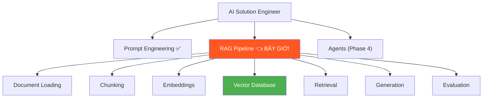
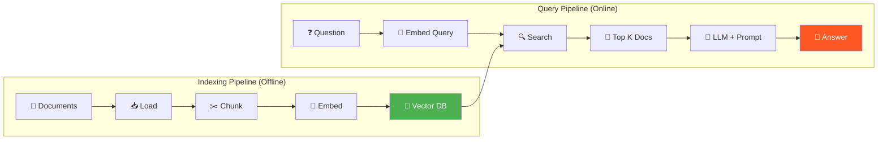

# 🔍 RAG Pipeline — Phase 3, Tuần 3-4: Kỹ Năng QUAN TRỌNG NHẤT!

> 📅 Thuộc Phase 3: Core Skills — ĐÂY LÀ TUẦN QUAN TRỌNG NHẤT CỦA TOÀN ROADMAP!
> 📖 Tiếp nối [Prompt Engineering Nâng Cao — Phase 3, Tuần 2](./Prompt%20Engineering%20Nâng%20Cao%20-%20Phase%203%20Tuần%202.md)
> 🎯 Mục tiêu: Xây được RAG pipeline END-TO-END — từ documents đến câu trả lời chính xác

---

## 🗺️ Mental Map — RAG = Trái tim của AI Solution Engineer



```
  TẠI SAO RAG LÀ KỸ NĂNG SỐ 1?

  → 80% sản phẩm AI hiện tại DÙNG RAG!
  → Chatbot nội bộ doanh nghiệp = RAG
  → QA trên tài liệu = RAG
  → Customer support AI = RAG
  → Legal/Medical AI assistant = RAG

  → BIẾT RAG = BIẾT XÂY 80% SẢN PHẨM AI!
```

---

## 📖 Mục lục

1. [RAG là gì? — Tại sao cần RAG?](#1-rag-là-gì--tại-sao-cần-rag)
2. [RAG Architecture — Kiến trúc tổng thể](#2-rag-architecture--kiến-trúc-tổng-thể)
3. [Document Loading — Đọc tài liệu](#3-document-loading--đọc-tài-liệu)
4. [Chunking — Chia nhỏ tài liệu](#4-chunking--chia-nhỏ-tài-liệu)
5. [Embeddings — Biến text thành vector](#5-embeddings--biến-text-thành-vector)
6. [Vector Databases — Kho lưu trữ vector](#6-vector-databases--kho-lưu-trữ-vector)
7. [Retrieval — Tìm tài liệu liên quan](#7-retrieval--tìm-tài-liệu-liên-quan)
8. [Generation — Sinh câu trả lời](#8-generation--sinh-câu-trả-lời)
9. [Advanced RAG — Kỹ thuật nâng cao](#9-advanced-rag--kỹ-thuật-nâng-cao)
10. [RAG Evaluation — Đo lường chất lượng](#10-rag-evaluation--đo-lường-chất-lượng)
11. [Project: Xây RAG Pipeline Hoàn Chỉnh](#11-project-xây-rag-pipeline-hoàn-chỉnh)

---

# 1. RAG là gì? — Tại sao cần RAG?

> 🔄 **Pattern: Contextual History — RAG sinh ra vì LLM CÓ GIỚI HẠN!**

### Bối cảnh: LLM biết NHIỀU nhưng KHÔNG biết ĐỦ!

```
  🔍 5 Whys: Tại sao RAG tồn tại?

  Q1: LLM đã biết rất nhiều, sao cần RAG?
  A1: LLM biết "kiến thức CHUNG" nhưng KHÔNG biết:
      → Tài liệu NỘI BỘ công ty bạn
      → Tin tức MỚI NHẤT (sau training cutoff)
      → Dữ liệu RIÊNG TƯ của khách hàng

  Q2: Fine-tuning thêm data vào model?
  A2: TỐN KÉM + CHẬM! Train lại mỗi khi data thay đổi?
      Data công ty update HÀNG NGÀY → fine-tune hàng ngày? → ❌

  Q3: Nhét tất cả vào context window?
  A3: Context có GIỚI HẠN! 1000 trang tài liệu = 650K tokens!
      GPT-4 context 128K → KHÔNG ĐỦ! Và TỐN TIỀN!

  Q4: Vậy giải pháp là gì?
  A4: TÌM trước, trả lời sau!
      Chỉ đưa 5-10 trang LIÊN QUAN nhất vào context!
      = RAG: Retrieval-Augmented Generation!

  Q5: RAG hiệu quả thế nào?
  A5: → Giảm hallucination 50-80%!
      → Luôn CẬP NHẬT (thêm doc mới = có kiến thức mới!)
      → Chi phí thấp hơn fine-tuning 10-100x!
```

```
  RAG = "Thi OPEN-BOOK!" 📖

  CLOSED-BOOK (LLM thuần):
    Vào phòng thi → chỉ dùng KIẾN THỨC TRONG ĐẦU
    → Nhớ gì nói nấy, không nhớ thì BỊA! 💀

  OPEN-BOOK (RAG):
    Vào phòng thi → ĐƯỢC MANG TÀI LIỆU
    → Tìm đúng trang → đọc → trả lời chính xác!
    → Không tìm thấy → nói "Không có trong tài liệu" ✅
```

---

# 2. RAG Architecture — Kiến trúc tổng thể

> 🗺️ **Pattern: Mental Mapping — 2 giai đoạn, 6 bước**

```
  RAG = 2 GIAI ĐOẠN:

  ┌─────────────────────────────────────────────────────────┐
  │  GIAI ĐOẠN 1: INDEXING (làm 1 lần, offline)            │
  │                                                         │
  │  Documents → Load → Chunk → Embed → Store in VectorDB  │
  │  📄📄📄     📥     ✂️      🔢       💾                  │
  │                                                         │
  │  Ví dụ: 1000 trang PDF → chia → embed → lưu vào DB     │
  │  Thời gian: vài phút → chạy offline, 1 lần!            │
  ├─────────────────────────────────────────────────────────┤
  │  GIAI ĐOẠN 2: QUERYING (mỗi câu hỏi, online)          │
  │                                                         │
  │  Question → Embed → Search VectorDB → Top docs → LLM   │
  │  ❓         🔢      🔍               📄📄      🤖       │
  │                                                         │
  │  Ví dụ: "Chính sách nghỉ phép?" → tìm → 5 docs → GPT  │
  │  Thời gian: 1-3 giây!                                   │
  └─────────────────────────────────────────────────────────┘
```



---

# 3. Document Loading — Đọc tài liệu

> 🧱 **Pattern: First Principles — Mọi thứ bắt đầu từ RAW DATA**

### Loại tài liệu AI Engineer phải xử lý

```
  ┌──────────────┬─────────────────┬──────────────────────┐
  │ Format       │ Library         │ Ghi chú              │
  ├──────────────┼─────────────────┼──────────────────────┤
  │ PDF          │ PyPDF2, pdfplumber│ Phổ biến nhất!      │
  │ Word (.docx) │ python-docx     │ Tài liệu nội bộ     │
  │ TXT/Markdown │ Built-in Python │ Đơn giản nhất        │
  │ HTML/Web     │ BeautifulSoup   │ Crawl web pages      │
  │ CSV/Excel    │ pandas          │ Bảng biểu, data      │
  │ PowerPoint   │ python-pptx     │ Slides               │
  │ Notion/Confl.│ API             │ Knowledge bases      │
  └──────────────┴─────────────────┴──────────────────────┘
```

```python
# ═══ Document Loaders ═══

# PDF
import pdfplumber

def load_pdf(path: str) -> str:
    text = ""
    with pdfplumber.open(path) as pdf:
        for page in pdf.pages:
            page_text = page.extract_text()
            if page_text:
                text += page_text + "\n\n"
    return text

# Web page
import requests
from bs4 import BeautifulSoup

def load_webpage(url: str) -> str:
    response = requests.get(url)
    soup = BeautifulSoup(response.text, 'html.parser')
    # Bỏ script, style
    for tag in soup(["script", "style", "nav", "footer"]):
        tag.decompose()
    return soup.get_text(separator="\n", strip=True)

# Multiple files
from pathlib import Path

def load_directory(dir_path: str, extensions: list = [".pdf", ".txt", ".md"]) -> list[dict]:
    documents = []
    for path in Path(dir_path).rglob("*"):
        if path.suffix.lower() in extensions:
            if path.suffix == ".pdf":
                text = load_pdf(str(path))
            else:
                text = path.read_text(encoding="utf-8")
            documents.append({
                "text": text,
                "source": str(path),
                "filename": path.name
            })
    return documents
```

---

# 4. Chunking — Chia nhỏ tài liệu

> 📐 **Pattern: Trade-off — Chunk size = quyết định QUAN TRỌNG NHẤT của RAG!**

### Tại sao phải chunk?

```
  🔍 5 Whys: Tại sao không embed NGUYÊN tài liệu?

  Q1: Embedding 1 trang PDF nguyên luôn được không?
  A1: Được! Nhưng embedding 500 từ = MỘT vector 1536D!
      → VÉG QUÉT cả 500 từ thành 1 điểm → MẤT CHI TIẾT!

  Q2: Mất chi tiết là sao?
  A2: Trang nói về 5 chủ đề → embedding = TRUNG BÌNH 5 chủ đề!
      Search "nghỉ phép" → trang nói 80% lương + 20% nghỉ phép
      → Embedding thiên về lương → TÌM KHÔNG THẤY nghỉ phép!

  Q3: Chia nhỏ quá thì sao?
  A3: 1 câu = 1 chunk → embedding rất CHÍNH XÁC
      NHƯNG: thiếu NGỮ CẢNH! "12 ngày" → 12 ngày GÌ? Không biết!

  Q4: Chunk size LÝ TƯỞNG là bao nhiêu?
  A4: Thường 200-1000 tokens (tùy use case!)
      → ĐÂY LÀ HYPERPARAMETER quan trọng nhất của RAG!
      → PHẢI THỬNGHIỆM!

  Q5: Có cách chunk thông minh hơn không?
  A5: CÓ! Semantic chunking, recursive chunking...
```

### Các chiến lược Chunking

```python
# ═══ Strategy 1: Fixed-size + Overlap ═══

def chunk_fixed(text: str, chunk_size: int = 500, overlap: int = 50) -> list[str]:
    """Chia theo số từ cố định + overlap"""
    words = text.split()
    chunks = []
    for i in range(0, len(words), chunk_size - overlap):
        chunk = " ".join(words[i:i + chunk_size])
        if chunk.strip():
            chunks.append(chunk)
    return chunks

# ═══ Strategy 2: Recursive Character Splitting ═══

def chunk_recursive(text: str, max_size: int = 1000, separators: list = None) -> list[str]:
    """Chia theo hierarchy: \n\n → \n → . → space"""
    if separators is None:
        separators = ["\n\n", "\n", ". ", " "]
    
    if len(text) <= max_size:
        return [text]
    
    chunks = []
    for sep in separators:
        parts = text.split(sep)
        if len(parts) > 1:
            current = ""
            for part in parts:
                if len(current) + len(part) + len(sep) <= max_size:
                    current += part + sep
                else:
                    if current.strip():
                        chunks.append(current.strip())
                    current = part + sep
            if current.strip():
                chunks.append(current.strip())
            return chunks
    
    # Fallback: cắt cứng
    return [text[i:i+max_size] for i in range(0, len(text), max_size)]

# ═══ Strategy 3: Semantic Chunking ═══

def chunk_by_headers(text: str) -> list[dict]:
    """Chia theo headers Markdown — giữ semantic boundaries!"""
    import re
    
    sections = re.split(r'\n(#{1,3}\s+.+)\n', text)
    chunks = []
    current_header = "Introduction"
    
    for i, section in enumerate(sections):
        if re.match(r'^#{1,3}\s+', section):
            current_header = section.strip()
        elif section.strip():
            chunks.append({
                "text": section.strip(),
                "header": current_header,
                "metadata": {"section": current_header}
            })
    
    return chunks
```

```
  📐 Trade-off: Chunk Size

  ┌──────────────┬───────────────────┬───────────────────┐
  │ Size         │ Ưu                │ Nhược             │
  ├──────────────┼───────────────────┼───────────────────┤
  │ NHỎ (100-200)│ Search chính xác  │ Thiếu context ❌  │
  │              │ Embedding focused │ Nhiều chunks hơn  │
  ├──────────────┼───────────────────┼───────────────────┤
  │ VỪA (300-500)│ Cân bằng ✅       │                   │
  │              │ Best practice!    │                   │
  ├──────────────┼───────────────────┼───────────────────┤
  │ LỚN (800+)  │ Đủ context ✅     │ Search kém ❌     │
  │              │ Ít chunks         │ Embedding "loãng" │
  └──────────────┴───────────────────┴───────────────────┘

  💡 Best Practice:
  → Start với 300-500 tokens
  → Test accuracy → adjust
  → Overlap 10-20% để không mất info ở ranh giới!
```

---

# 5. Embeddings — Biến text thành vector

> 🧱 **Pattern: First Principles — Embedding = TỌA ĐỘ trong không gian ý nghĩa**

### Embedding Models

```
  ┌──────────────────────┬──────────┬──────────┬──────────┐
  │ Model                │ Dims     │ Cost     │ Chất lượng│
  ├──────────────────────┼──────────┼──────────┼──────────┤
  │ text-embedding-3-small│ 1536    │ $0.02/1M │ Tốt ✅   │
  │ text-embedding-3-large│ 3072    │ $0.13/1M │ Rất tốt  │
  │ Cohere embed-v3      │ 1024    │ $0.10/1M │ Rất tốt  │
  │ all-MiniLM-L6 (free!)│ 384     │ FREE     │ Khá ✅    │
  │ bge-large-en-v1.5    │ 1024    │ FREE     │ Tốt      │
  └──────────────────────┴──────────┴──────────┴──────────┘

  AI Engineer chọn:
    Prototype nhanh → text-embedding-3-small (rẻ, tốt!)
    Production chất lượng → text-embedding-3-large
    Self-hosted/Privacy → all-MiniLM hoặc bge (free, local!)
```

```python
# ═══ Embedding với OpenAI ═══

from openai import OpenAI

client = OpenAI()

def embed_texts(texts: list[str], model: str = "text-embedding-3-small") -> list[list[float]]:
    """Embed nhiều texts cùng lúc (batch = nhanh hơn!)"""
    response = client.embeddings.create(
        model=model,
        input=texts   # Batch! Gửi list → rẻ + nhanh hơn gửi từng cái!
    )
    return [item.embedding for item in response.data]

# Embed chunks
chunks = ["Python là ngôn ngữ lập trình...", "RAG giải quyết hallucination...", ...]
vectors = embed_texts(chunks)
print(f"Shape: {len(vectors)} vectors × {len(vectors[0])} dimensions")
# Shape: 100 vectors × 1536 dimensions

# ═══ Hoặc dùng model FREE (local!) ═══

from sentence_transformers import SentenceTransformer

model = SentenceTransformer('all-MiniLM-L6-v2')  # FREE! Chạy local!
vectors = model.encode(chunks)
# Shape: (100, 384) — 384 dimensions
```

---

# 6. Vector Databases — Kho lưu trữ vector

> 🔄 **Pattern: Contextual History — Tại sao CSDL truyền thống không đủ?**

### SQL vs Vector Search

```
  SQL Database:
    SELECT * FROM docs WHERE content LIKE '%nghỉ phép%'
    → TÌM CHÍNH XÁC TỪ KHÓA! "nghỉ phép" phải XUẤT HIỆN trong text!
    → "annual leave", "thời gian nghỉ" → KHÔNG TÌM THẤY! ❌

  Vector Database:
    search(embed("chính sách nghỉ phép"), top_k=5)
    → TÌM THEO Ý NGHĨA! Không cần trùng từ khóa!
    → "annual leave", "thời gian nghỉ" → TÌM THẤY! ✅
    → Vì embedding "nghỉ phép" GẦN "annual leave" trong vector space!
```

### So sánh Vector Databases

```
  ┌────────────────┬──────────┬──────────┬──────────┬────────────┐
  │ Database       │ Type     │ Cost     │ Scale    │ Best for   │
  ├────────────────┼──────────┼──────────┼──────────┼────────────┤
  │ Chroma         │ In-memory│ FREE     │ Nhỏ      │ Prototype ⭐│
  │ FAISS          │ Library  │ FREE     │ Lớn      │ Research   │
  │ Pinecone       │ Cloud    │ Freemium │ Rất lớn  │ Production │
  │ Weaviate       │ Self-host│ FREE     │ Lớn      │ Enterprise │
  │ Qdrant         │ Self-host│ FREE     │ Lớn      │ Performance│
  │ pgvector       │ Extension│ FREE     │ Lớn      │ Đã dùng PG │
  └────────────────┴──────────┴──────────┴──────────┴────────────┘

  📐 Trade-off:
    Prototype/learning → Chroma (đơn giản nhất!)
    Production nhỏ → Pinecone (managed, dễ!)
    Production lớn/privacy → Qdrant/Weaviate (self-host)
    Đã có PostgreSQL → pgvector (thêm extension!)
```

### 🔧 Reverse Engineering: Tự xây Vector Store mini!

```python
import numpy as np
from dataclasses import dataclass

@dataclass
class Document:
    text: str
    embedding: list[float]
    metadata: dict

class MiniVectorStore:
    """Vector store TỰ XÂY — hiểu nguyên lý!"""
    
    def __init__(self):
        self.documents: list[Document] = []
    
    def add(self, text: str, embedding: list[float], metadata: dict = {}):
        self.documents.append(Document(text, embedding, metadata))
    
    def search(self, query_embedding: list[float], top_k: int = 5) -> list[dict]:
        """Tìm documents GẦN NHẤT với query"""
        results = []
        query = np.array(query_embedding)
        
        for doc in self.documents:
            doc_vec = np.array(doc.embedding)
            # Cosine Similarity
            similarity = np.dot(query, doc_vec) / (
                np.linalg.norm(query) * np.linalg.norm(doc_vec)
            )
            results.append({
                "text": doc.text,
                "score": float(similarity),
                "metadata": doc.metadata
            })
        
        # Sort by similarity (cao → thấp)
        results.sort(key=lambda x: x["score"], reverse=True)
        return results[:top_k]
    
    def __len__(self):
        return len(self.documents)

# Dùng:
store = MiniVectorStore()

# Index
for i, chunk in enumerate(chunks):
    vec = embed_texts([chunk])[0]
    store.add(chunk, vec, {"chunk_id": i, "source": "hr_policy.pdf"})

# Search
query_vec = embed_texts(["chính sách nghỉ phép"])[0]
results = store.search(query_vec, top_k=3)
for r in results:
    print(f"Score: {r['score']:.4f}")
    print(f"Text: {r['text'][:100]}...")

# ⚠️ Production: dùng Chroma/Pinecone (nhanh hơn, scale được!)
# MiniVectorStore: O(n) search — CHẬM với data lớn!
# Chroma/FAISS: O(log n) search — dùng ANN algorithms!
```

---

# 7. Retrieval — Tìm tài liệu liên quan

> 📐 **Pattern: Trade-off — Tìm NHIỀU vs Tìm ĐÚNG**

### Retrieval = KHÂU QUAN TRỌNG NHẤT!

```
  🔍 5 Whys: Retrieval ảnh hưởng thế nào đến output?

  Q1: Retrieval kém thì sao?
  A1: Tìm sai docs → LLM trả lời DỰA TRÊN docs SAI → answer SAI!
      "Garbage in, garbage out" — sai ở retrieval = sai TOÀN BỘ!

  Q2: Retrieval tốt = gì?
  A2: Tìm được ĐÚNG chunks chứa câu trả lời! 
      Precision cao + Recall cao!

  Q3: Tại sao vector search đôi khi kém?
  A3: Embedding "gần" ≠ "đúng"!
      "Apple computer" vs "apple fruit" → embeddings có thể gần!
      → Cần kỹ thuật BỔ SUNG: hybrid search, re-ranking!

  Q4: Hybrid search là gì?
  A4: Vector search + Keyword search KẾT HỢP!
      Vector: tìm theo ý nghĩa ✅ | miss exact terms ❌
      Keyword: tìm chính xác ✅ | miss synonyms ❌
      Hybrid: cả hai! ✅✅

  Q5: Re-ranking là gì?
  A5: Lấy TOP 20 results → re-rank bằng model chính xác hơn → TOP 5!
      = "Cast a wide net → filter carefully"
```

```python
# ═══ Basic Retrieval ═══

def retrieve(query: str, store, top_k: int = 5) -> list[str]:
    query_vec = embed_texts([query])[0]
    results = store.search(query_vec, top_k=top_k)
    return [r["text"] for r in results]

# ═══ Hybrid Search: Vector + Keyword ═══

def hybrid_search(query: str, store, documents: list[str], 
                  top_k: int = 5, alpha: float = 0.7) -> list[dict]:
    """
    alpha: weight cho vector search (0=keyword only, 1=vector only)
    """
    # Vector search
    query_vec = embed_texts([query])[0]
    vector_results = store.search(query_vec, top_k=top_k * 2)
    
    # Keyword search (BM25)
    from rank_bm25 import BM25Okapi
    tokenized = [doc.split() for doc in documents]
    bm25 = BM25Okapi(tokenized)
    keyword_scores = bm25.get_scores(query.split())
    
    # Combine scores
    combined = {}
    for r in vector_results:
        combined[r["text"]] = alpha * r["score"]
    
    for i, score in enumerate(keyword_scores):
        text = documents[i]
        if text in combined:
            combined[text] += (1 - alpha) * (score / max(keyword_scores))
        else:
            combined[text] = (1 - alpha) * (score / max(keyword_scores))
    
    # Sort & return top_k
    sorted_results = sorted(combined.items(), key=lambda x: -x[1])
    return [{"text": t, "score": s} for t, s in sorted_results[:top_k]]

# ═══ Re-ranking: Cohere Rerank ═══

import cohere

co = cohere.Client("YOUR_API_KEY")

def rerank(query: str, documents: list[str], top_k: int = 5) -> list[str]:
    """Lấy nhiều → re-rank → chọn top"""
    response = co.rerank(
        model="rerank-english-v3.0",
        query=query,
        documents=documents,
        top_n=top_k
    )
    return [documents[r.index] for r in response.results]
```

---

# 8. Generation — Sinh câu trả lời

> 🔧 **Pattern: Reverse Engineering — Prompt thiết kế = quyết định chất lượng!**

### RAG Prompt Template

```python
# ═══ RAG Generation — prompt là CHÌA KHÓA! ═══

def generate_answer(question: str, context_docs: list[str]) -> str:
    """Generate answer từ retrieved documents"""
    
    context = "\n\n---\n\n".join(
        f"[Document {i+1}]:\n{doc}" for i, doc in enumerate(context_docs)
    )
    
    prompt = f"""Bạn là trợ lý AI hỏi đáp trên tài liệu.

## QUY TẮC BẮT BUỘC:
1. CHỈ trả lời dựa trên TÀI LIỆU bên dưới
2. Nếu tài liệu KHÔNG chứa câu trả lời, nói: "Tôi không tìm thấy thông tin này trong tài liệu."
3. TRÍCH DẪN nguồn: "[Document X]"
4. Trả lời bằng tiếng Việt, rõ ràng, có cấu trúc

## TÀI LIỆU:
{context}

## CÂU HỎI:
{question}

## TRẢ LỜI:"""
    
    response = client.chat.completions.create(
        model="gpt-4o",
        messages=[{"role": "user", "content": prompt}],
        temperature=0,  # Deterministic cho factual QA!
    )
    return response.choices[0].message.content

# Dùng:
docs = retrieve("chính sách nghỉ phép", store, top_k=5)
answer = generate_answer("Nhân viên được nghỉ phép bao nhiêu ngày?", docs)
# → "Theo [Document 2], nhân viên chính thức được nghỉ phép 
#    15 ngày/năm (Quy định HR-2024, Mục 3.2)."
```

---

# 9. Advanced RAG — Kỹ thuật nâng cao

> 📐 **Pattern: Trade-off — Naive RAG vs Advanced RAG**

### Vấn đề của Naive RAG

```
  Naive RAG:   Chunk → Embed → Search → Generate
  → HOẠT ĐỘNG cho 70% use cases!
  → NHƯNG 30% THẤT BẠI:
    ❌ Query mơ hồ → search kém
    ❌ Câu trả lời cần INFO TỪ NHIỀU chunks
    ❌ Chunks thiếu context (parent document)
    ❌ Questions quá phức tạp/multi-hop
```

### Technique 1: Query Transformation

```python
# ═══ Cải thiện QUERY trước khi search ═══

async def transform_query(original_query: str) -> list[str]:
    """Biến 1 query → nhiều queries tốt hơn"""
    
    prompt = f"""Cho câu hỏi sau, tạo 3 phiên bản KHÁC NHAU 
giúp tìm kiếm tốt hơn.

CÂU HỎI GỐC: {original_query}

Viết 3 phiên bản (1 dòng mỗi cái):
1. Rephrase rõ ràng hơn
2. Dùng từ khóa kỹ thuật
3. Đặt câu hỏi ngược (aspect khác)"""

    result = await call_llm(prompt)
    queries = [q.strip() for q in result.strip().split("\n") if q.strip()]
    return [original_query] + queries

# Ví dụ:
# Input: "Làm sao để không bị đuổi việc?"
# Output: [
#   "Làm sao để không bị đuổi việc?",
#   "Quy định về sa thải và kỷ luật nhân viên",
#   "Điều kiện chấm dứt hợp đồng lao động",
#   "Tiêu chí đánh giá hiệu suất nhân viên"
# ]
# → Search 4 queries → merge results → TOÀN DIỆN hơn!
```

### Technique 2: Parent-Child Chunking

```python
# ═══ Small chunk để SEARCH, large chunk để ANSWER ═══

class ParentChildChunker:
    """
    Parent (800 tokens): đủ context cho LLM đọc
    Child (200 tokens): đủ specific cho search
    
    Search trên CHILD → trả về PARENT cho LLM!
    """
    
    def __init__(self, parent_size: int = 800, child_size: int = 200):
        self.parent_size = parent_size
        self.child_size = child_size
    
    def chunk(self, text: str) -> list[dict]:
        words = text.split()
        results = []
        
        # Tạo parent chunks
        parent_id = 0
        for i in range(0, len(words), self.parent_size):
            parent_text = " ".join(words[i:i + self.parent_size])
            parent_words = parent_text.split()
            
            # Tạo child chunks TRONG mỗi parent
            for j in range(0, len(parent_words), self.child_size):
                child_text = " ".join(parent_words[j:j + self.child_size])
                results.append({
                    "child_text": child_text,    # Embed & search on THIS
                    "parent_text": parent_text,  # Return THIS to LLM!
                    "parent_id": parent_id,
                })
            parent_id += 1
        
        return results

# Dùng:
chunker = ParentChildChunker()
chunks = chunker.chunk(long_document)

# Index: embed CHILD texts
for chunk in chunks:
    vec = embed_texts([chunk["child_text"]])[0]
    store.add(chunk["child_text"], vec, 
              {"parent_text": chunk["parent_text"], "parent_id": chunk["parent_id"]})

# Search: tìm child → return PARENT
results = store.search(query_vec, top_k=5)
parent_texts = list(set(r["metadata"]["parent_text"] for r in results))
# → parent_texts có ĐỦ CONTEXT cho LLM!
```

### Technique 3: HyDE — Hypothetical Document Embeddings

```python
# ═══ HyDE: Tạo document GIẢ → dùng embedding document giả để search ═══

async def hyde_search(question: str, store, top_k: int = 5) -> list[str]:
    """
    Ý tưởng: Embedding câu HỎI ≠ embedding câu TRẢ LỜI!
    → Tạo câu trả lời GIẢ → embed CÂU TRẢ LỜI GIẢ → search!
    → Embedding document giả GẦN embedding document THẬT hơn!
    """
    
    # 1. LLM tạo document giả
    hypothetical = await call_llm(f"""Viết 1 đoạn văn ngắn TRẢ LỜI câu hỏi sau.
Viết như thể bạn đang trích từ tài liệu chính thức.

Câu hỏi: {question}
Đoạn trả lời:""")
    
    # 2. Embed document GIẢ (không phải câu hỏi!)
    hyde_vec = embed_texts([hypothetical])[0]
    
    # 3. Search vector DB bằng embedding document giả
    results = store.search(hyde_vec, top_k=top_k)
    return [r["text"] for r in results]

# Tại sao HyDE hoạt động?
# Question: "Nghỉ phép bao nhiêu ngày?" → embedding câu HỎI
# HyDE doc: "Nhân viên được nghỉ 15 ngày/năm" → embedding câu TRẢ LỜI
# Real doc: "Mỗi nhân viên có 15 ngày phép năm" → embedding câu TRẢ LỜI
# → embedding HyDE GẦN real doc hơn embedding question!
```

---

# 10. RAG Evaluation — Đo lường chất lượng

> 📐 **Pattern: Trade-off — "Nếu không ĐO được, không CẢI THIỆN được!"**

### RAG Evaluation Metrics

```
  ┌─────────────────┬──────────────────────────────────────┐
  │ Metric          │ Đo gì?                               │
  ├─────────────────┼──────────────────────────────────────┤
  │ Retrieval       │                                      │
  │ ├ Precision@K   │ Trong K docs retrieved, bao nhiêu    │
  │ │               │ THẬT SỰ liên quan?                   │
  │ ├ Recall@K      │ Trong tất cả docs liên quan,         │
  │ │               │ tìm được bao nhiêu %?                │
  │ └ MRR           │ Doc đúng xuất hiện ở vị trí thứ mấy? │
  ├─────────────────┼──────────────────────────────────────┤
  │ Generation      │                                      │
  │ ├ Faithfulness  │ Answer có ĐÚNG với context đã cho?   │
  │ ├ Relevance     │ Answer có ĐÚNG câu hỏi?              │
  │ └ Correctness   │ Answer có ĐÚNG sự thật?              │
  └─────────────────┴──────────────────────────────────────┘

  RAG evaluation = ĐO CẢ 2: Retrieval + Generation!
  Retrieval kém → Generation kém (bất kể LLM tốt thế nào!)
```

```python
# ═══ RAG Evaluation Framework ═══

class RAGEvaluator:
    """Đánh giá RAG pipeline end-to-end"""
    
    def __init__(self):
        self.test_cases = []
    
    def add_test(self, question: str, expected_answer: str, 
                 relevant_chunks: list[str]):
        self.test_cases.append({
            "question": question,
            "expected": expected_answer,
            "relevant": relevant_chunks
        })
    
    async def evaluate(self, rag_pipeline) -> dict:
        results = {"retrieval": [], "generation": []}
        
        for tc in self.test_cases:
            # Run RAG
            retrieved = rag_pipeline.retrieve(tc["question"])
            answer = rag_pipeline.generate(tc["question"], retrieved)
            
            # Eval retrieval: có tìm đúng chunks?
            retrieved_texts = set(r["text"] for r in retrieved)
            relevant_texts = set(tc["relevant"])
            precision = len(retrieved_texts & relevant_texts) / len(retrieved_texts)
            recall = len(retrieved_texts & relevant_texts) / len(relevant_texts)
            results["retrieval"].append({"precision": precision, "recall": recall})
            
            # Eval generation: answer có đúng không? (LLM-as-Judge)
            faithfulness = await self._judge_faithfulness(answer, retrieved)
            relevance = await self._judge_relevance(answer, tc["question"])
            results["generation"].append({
                "faithfulness": faithfulness, 
                "relevance": relevance
            })
        
        return self._aggregate(results)
    
    async def _judge_faithfulness(self, answer: str, context: list) -> float:
        """LLM judge: answer có dựa trên context?"""
        prompt = f"""Đánh giá: câu trả lời có DỰA TRÊN context đã cho không?
Context: {context[:500]}...
Answer: {answer}
Chấm 1-10 (10=hoàn toàn faithful):"""
        score = await call_llm(prompt)
        return float(score.strip()) / 10

# Dùng:
evaluator = RAGEvaluator()
evaluator.add_test(
    "Nghỉ phép bao nhiêu ngày?",
    "15 ngày/năm",
    ["Mục 3.2: Nhân viên được nghỉ 15 ngày phép/năm"]
)
metrics = await evaluator.evaluate(my_rag_pipeline)
# {"retrieval_precision": 0.8, "faithfulness": 0.9, "relevance": 0.85}
```

---

# 11. Project: Xây RAG Pipeline Hoàn Chỉnh

> 🔧 **Pattern: Reverse Engineering — XÂY để HIỂU!**

```python
# ═══ COMPLETE RAG PIPELINE — from scratch! ═══

import os
from openai import OpenAI
import chromadb

client = OpenAI()

class SimpleRAG:
    """RAG Pipeline hoàn chỉnh — production-ready basics!"""
    
    def __init__(self, collection_name: str = "my_docs"):
        self.chroma = chromadb.Client()
        self.collection = self.chroma.create_collection(
            name=collection_name,
            metadata={"hnsw:space": "cosine"}
        )
    
    # ═══ STEP 1: Load documents ═══
    def load_documents(self, directory: str) -> list[dict]:
        docs = []
        for file in os.listdir(directory):
            path = os.path.join(directory, file)
            if file.endswith('.txt') or file.endswith('.md'):
                text = open(path, 'r', encoding='utf-8').read()
                docs.append({"text": text, "source": file})
        print(f"Loaded {len(docs)} documents")
        return docs
    
    # ═══ STEP 2: Chunk documents ═══
    def chunk_documents(self, docs: list[dict], 
                        chunk_size: int = 500, overlap: int = 50) -> list[dict]:
        chunks = []
        for doc in docs:
            words = doc["text"].split()
            for i in range(0, len(words), chunk_size - overlap):
                chunk_text = " ".join(words[i:i + chunk_size])
                if chunk_text.strip():
                    chunks.append({
                        "text": chunk_text,
                        "source": doc["source"],
                        "chunk_index": len(chunks)
                    })
        print(f"Created {len(chunks)} chunks")
        return chunks
    
    # ═══ STEP 3: Embed & Store ═══
    def index_chunks(self, chunks: list[dict]):
        batch_size = 100
        for i in range(0, len(chunks), batch_size):
            batch = chunks[i:i + batch_size]
            texts = [c["text"] for c in batch]
            
            # Embed
            response = client.embeddings.create(
                model="text-embedding-3-small",
                input=texts
            )
            embeddings = [item.embedding for item in response.data]
            
            # Store in Chroma
            self.collection.add(
                documents=texts,
                embeddings=embeddings,
                ids=[f"chunk_{i+j}" for j in range(len(batch))],
                metadatas=[{"source": c["source"]} for c in batch]
            )
        print(f"Indexed {len(chunks)} chunks into ChromaDB")
    
    # ═══ STEP 4: Retrieve ═══
    def retrieve(self, query: str, top_k: int = 5) -> list[dict]:
        query_embedding = client.embeddings.create(
            model="text-embedding-3-small",
            input=[query]
        ).data[0].embedding
        
        results = self.collection.query(
            query_embeddings=[query_embedding],
            n_results=top_k
        )
        
        return [
            {"text": doc, "source": meta["source"], "score": 1 - dist}
            for doc, meta, dist in zip(
                results["documents"][0],
                results["metadatas"][0],
                results["distances"][0]
            )
        ]
    
    # ═══ STEP 5: Generate ═══
    def answer(self, question: str, top_k: int = 5) -> dict:
        # Retrieve
        docs = self.retrieve(question, top_k)
        
        # Build context
        context = "\n\n---\n\n".join(
            f"[Source: {d['source']}] (relevance: {d['score']:.2f})\n{d['text']}"
            for d in docs
        )
        
        # Generate
        response = client.chat.completions.create(
            model="gpt-4o",
            messages=[{
                "role": "system",
                "content": """Trả lời câu hỏi DỰA TRÊN tài liệu.
Nếu không tìm thấy, nói "Không có thông tin."
Trích dẫn [Source: filename]."""
            }, {
                "role": "user",
                "content": f"TÀI LIỆU:\n{context}\n\nCÂU HỎI: {question}"
            }],
            temperature=0,
        )
        
        return {
            "answer": response.choices[0].message.content,
            "sources": [d["source"] for d in docs],
            "num_docs": len(docs)
        }

# ═══ SỬ DỤNG ═══

rag = SimpleRAG("company_docs")

# 1. Index (chạy 1 lần!)
docs = rag.load_documents("./documents/")
chunks = rag.chunk_documents(docs)
rag.index_chunks(chunks)

# 2. Query (chạy mỗi câu hỏi!)
result = rag.answer("Chính sách nghỉ phép của công ty?")
print(result["answer"])
print(f"Sources: {result['sources']}")
```

---

## 📐 Tổng kết Mental Map

```mermaid
graph TD
    A["RAG Pipeline"] --> B["Indexing"]
    A --> C["Querying"]
    A --> D["Advanced"]
    A --> E["Evaluation"]

    B --> B1["Load: PDF, Web, DOCX"]
    B --> B2["Chunk: 300-500 tokens + overlap"]
    B --> B3["Embed: OpenAI/MiniLM"]
    B --> B4["Store: Chroma/Pinecone"]

    C --> C1["Embed query"]
    C --> C2["Vector search (cosine)"]
    C --> C3["Generate: GPT + context"]

    D --> D1["Hybrid search: vector + BM25"]
    D --> D2["Re-ranking: Cohere"]
    D --> D3["Query transform: multi-query"]
    D --> D4["Parent-child chunks"]
    D --> D5["HyDE: hypothetical docs"]

    E --> E1["Retrieval: Precision/Recall"]
    E --> E2["Generation: Faithfulness"]
    E --> E3["LLM-as-Judge"]

    style A fill:#FF5722,color:white
    style B4 fill:#4CAF50,color:white
    style D fill:#9C27B0,color:white
```



```
  ┌────────────────────────────────────────────────────────┐
  │  Phase 3 Tuần 3-4 Checklist:                           │
  │                                                        │
  │  Core Pipeline:                                        │
  │  □ Load → Chunk → Embed → Store → Retrieve → Generate │
  │  □ Chunking: best practices (300-500 tokens + overlap) │
  │  □ Embeddings: OpenAI vs local (MiniLM)               │
  │  □ Vector DB: Chroma (prototype), Pinecone (prod)     │
  │  □ RAG prompt: "CHỈ dùng tài liệu", trích dẫn nguồn │
  │                                                        │
  │  Advanced:                                             │
  │  □ Hybrid search: vector + keyword (BM25)             │
  │  □ Re-ranking: Cohere rerank                          │
  │  □ Query transformation: multi-query                   │
  │  □ Parent-child chunking: small search, large context │
  │  □ HyDE: hypothetical document embeddings              │
  │                                                        │
  │  Evaluation:                                           │
  │  □ Retrieval: Precision@K, Recall@K                   │
  │  □ Generation: Faithfulness, Relevance                │
  │  □ LLM-as-Judge: automated eval                       │
  │                                                        │
  │  Project:                                              │
  │  □ Xây SimpleRAG class hoàn chỉnh                     │
  │  □ Test với documents thực tế                         │
  └────────────────────────────────────────────────────────┘
```

---

## 📚 Tài liệu đọc thêm

```
  📖 Papers:
    "Retrieval-Augmented Generation" — Lewis et al. (2020, paper gốc!)
    "Lost in the Middle" — Liu et al. (2023)
    "HyDE" — Gao et al. (2022)
    "RAGAS: Automated Eval of RAG" — Es et al. (2023)

  🎥 Video:
    "RAG from Scratch" — LangChain YouTube (playlist 14 videos!)
    "Building RAG Applications" — DeepLearning.AI
    "Vector Databases Explained" — Fireship (YouTube, 5 min)

  📖 Docs:
    docs.trychroma.com — ChromaDB docs
    platform.openai.com/docs/guides/embeddings
    python.langchain.com/docs/tutorials/rag/ — LangChain RAG tutorial

  🏋️ Thực hành:
    Xây RAG cho 10 file PDF nội bộ
    So sánh chunk sizes: 200 vs 500 vs 1000
    Test hybrid search vs vector-only
    Evaluate với 20 Q&A pairs
```
