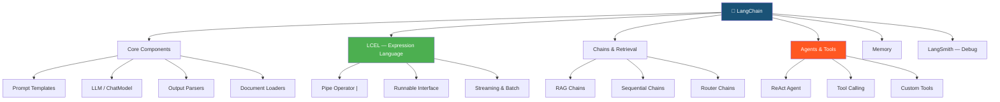
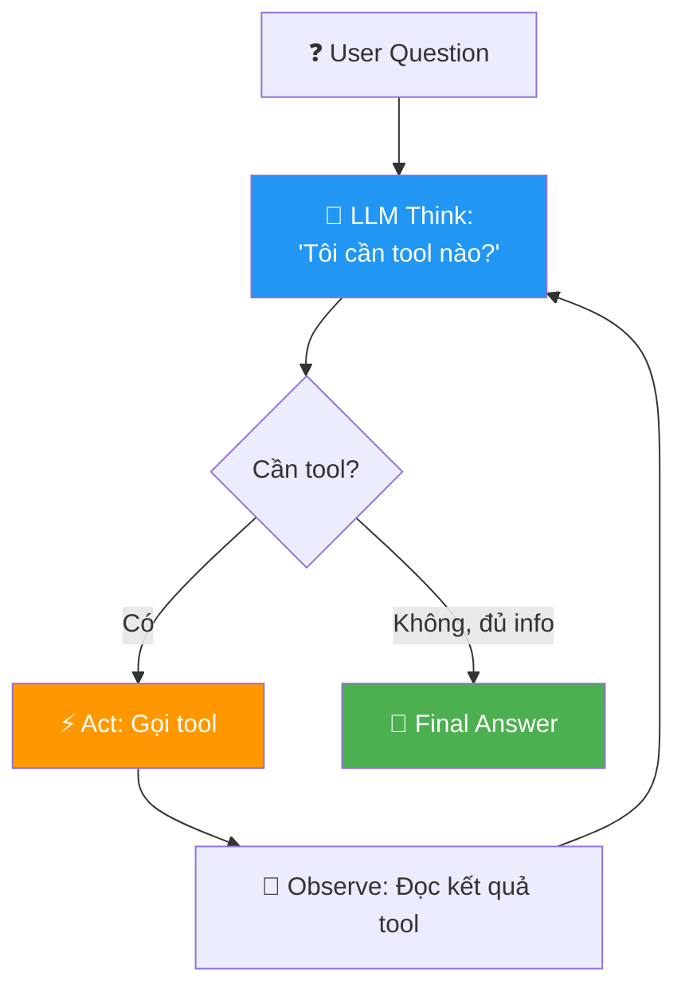

# 🦜🔗 LangChain Deep Dive — Phase 3.3, Tuần 1-2

> 📅 Thuộc Phase 3: Core Skills — Framework #1 cho AI Applications
> 📖 Tiếp nối [RAG Nâng Cao — Phase 3, Tuần 5-6](./RAG%20Nâng%20Cao%20-%20Phase%203%20Tuần%205-6.md)
> 🎯 Mục tiêu: Xây được AI application hoàn chỉnh bằng LangChain — từ Chains đến Agents

---

## 🗺️ Mental Map — LangChain = "Lego cho AI"



```
  TẠI SAO LANGCHAIN?

  KHÔNG có LangChain:
    → Tự viết prompt formatting
    → Tự parse output
    → Tự quản lý API calls, retries, streaming
    → Tự nối các bước lại với nhau
    → Tự implement RAG pipeline
    → = HÀNG TRĂM dòng boilerplate code!

  CÓ LangChain:
    → Chain = nối các components lại
    → LCEL = chain bằng pipe operator (|)
    → Built-in: RAG, Agents, Memory, Tools
    → LangSmith: debug, monitor, evaluate
    → = TẬP TRUNG vào LOGIC, không phải plumbing!

  ⚠️ LangChain vs LlamaIndex:
    LangChain: TỔNG QUÁT — chains, agents, tools, memory
    LlamaIndex: CHUYÊN về DATA — RAG, knowledge base
    Production: thường dùng CẢ HAI!
```

---

## 📖 Mục lục

1. [Luồng Suy Nghĩ — Tại sao cần Framework?](#1-luồng-suy-nghĩ--tại-sao-cần-framework)
2. [Core Components — Khối xây dựng cơ bản](#2-core-components--khối-xây-dựng-cơ-bản)
3. [LCEL — LangChain Expression Language ⭐](#3-lcel--langchain-expression-language-)
4. [Chains — Nối components thành pipeline](#4-chains--nối-components-thành-pipeline)
5. [RAG Chain — Kết hợp RAG + LangChain](#5-rag-chain--kết-hợp-rag--langchain)
6. [Agents — LLM tự quyết định ⭐](#6-agents--llm-tự-quyết-định-)
7. [Tools — Khả năng của Agent](#7-tools--khả-năng-của-agent)
8. [Memory — Nhớ lịch sử hội thoại](#8-memory--nhớ-lịch-sử-hội-thoại)
9. [LangSmith — Debug & Monitor](#9-langsmith--debug--monitor)
10. [Production Patterns — Best Practices](#10-production-patterns--best-practices)

---

# 1. Luồng Suy Nghĩ — Tại sao cần Framework?

### Bước 1: Không có LangChain — viết thủ công

```python
# ❌ KHÔNG có LangChain — mọi thứ tự viết!

from openai import OpenAI
client = OpenAI()

def my_rag_chatbot(question: str, docs_db, chat_history: list) -> str:
    # 1. Format history (tự viết!)
    history_text = ""
    for msg in chat_history:
        history_text += f"{msg['role']}: {msg['content']}\n"
    
    # 2. Retrieve docs (tự viết!)
    query_vec = client.embeddings.create(
        model="text-embedding-3-small", input=[question]
    ).data[0].embedding
    results = docs_db.search(query_vec, top_k=5)
    context = "\n".join([r["text"] for r in results])
    
    # 3. Build prompt (tự viết!)
    prompt = f"""Context: {context}
History: {history_text}
Question: {question}
Answer:"""
    
    # 4. Call LLM (tự xử lý errors, retries!)
    try:
        response = client.chat.completions.create(
            model="gpt-4o",
            messages=[{"role": "user", "content": prompt}],
        )
        answer = response.choices[0].message.content
    except Exception as e:
        answer = f"Error: {e}"
    
    # 5. Parse output (tự viết!)
    # 6. Update history (tự viết!)
    chat_history.append({"role": "user", "content": question})
    chat_history.append({"role": "assistant", "content": answer})
    
    return answer

# → 40+ dòng cho 1 use case ĐƠN GIẢN!
```

### Bước 2: Có LangChain — gọn hơn NHIỀU

```python
# ✅ CÓ LangChain — cùng chức năng, ít code hơn!

from langchain_openai import ChatOpenAI, OpenAIEmbeddings
from langchain_core.prompts import ChatPromptTemplate
from langchain_core.output_parsers import StrOutputParser
from langchain_chroma import Chroma
from langchain.chains import create_retrieval_chain

# Components (khai báo 1 lần, dùng nhiều lần!)
llm = ChatOpenAI(model="gpt-4o")
embeddings = OpenAIEmbeddings()
vectorstore = Chroma(embedding_function=embeddings)
retriever = vectorstore.as_retriever(search_kwargs={"k": 5})

# Chain = nối components bằng LCEL!
prompt = ChatPromptTemplate.from_template(
    "Context: {context}\nQuestion: {input}\nAnswer:"
)

chain = (
    {"context": retriever, "input": lambda x: x["input"]}
    | prompt
    | llm
    | StrOutputParser()
)

# Dùng!
answer = chain.invoke({"input": "Chính sách nghỉ phép?"})

# → 15 dòng cho CÙNG chức năng! + Streaming, retry, logging miễn phí!
```

```
  📌 Key insight:
    LangChain KHÔNG làm gì MAGIC — nó chỉ TRỪU TƯỢNG HÓA!
    → Bạn VẪN cần hiểu từng bước (đã học ở RAG Pipeline)
    → LangChain giúp: ÍT CODE, DỄ TEST, DỄ THAY ĐỔI components
```

---

# 2. Core Components — Khối xây dựng cơ bản

> 🧱 **4 components cơ bản: Prompt + Model + Output Parser + Document Loader**

### 2.1 Prompt Templates

```python
from langchain_core.prompts import (
    ChatPromptTemplate,
    SystemMessagePromptTemplate,
    HumanMessagePromptTemplate,
    MessagesPlaceholder,
)

# ═══ Prompt đơn giản ═══
simple_prompt = ChatPromptTemplate.from_template(
    "Dịch sang tiếng Anh: {text}"
)
result = simple_prompt.invoke({"text": "Xin chào"})
# → [HumanMessage(content="Dịch sang tiếng Anh: Xin chào")]


# ═══ Prompt với System + Human ═══
chat_prompt = ChatPromptTemplate.from_messages([
    ("system", "Bạn là trợ lý AI chuyên về {domain}. Trả lời ngắn gọn."),
    ("human", "{question}"),
])
result = chat_prompt.invoke({"domain": "HR", "question": "Nghỉ phép bao nhiêu ngày?"})


# ═══ Prompt với history (cho chatbot!) ═══
chat_with_history = ChatPromptTemplate.from_messages([
    ("system", "Bạn là trợ lý AI thân thiện."),
    MessagesPlaceholder("history"),      # ← Lịch sử chat sẽ được inject vào đây!
    ("human", "{input}"),
])
```

```
  💡 Tại sao dùng Prompt Template thay vì f-string?
    f-string: prompt = f"Translate {text}"
    Template: prompt = ChatPromptTemplate.from_template("Translate {text}")

    Template hơn ở:
    → REUSABLE: dùng lại cho nhiều inputs
    → TYPE-SAFE: biết variables nào cần truyền
    → COMPOSABLE: nối với components khác qua LCEL
    → SERIALIZABLE: save/load prompt từ file
    → INTEGRABLE: tự động format cho ChatGPT/Claude/Llama
```

### 2.2 LLM / ChatModel

```python
from langchain_openai import ChatOpenAI
from langchain_anthropic import ChatAnthropic
from langchain_google_genai import ChatGoogleGenerativeAI

# ═══ Các model providers ═══
gpt = ChatOpenAI(model="gpt-4o", temperature=0)
claude = ChatAnthropic(model="claude-3-5-sonnet-20241022")
gemini = ChatGoogleGenerativeAI(model="gemini-1.5-pro")

# Tất cả đều có CÙNG INTERFACE!
response = gpt.invoke("Hello!")
response = claude.invoke("Hello!")     # Cùng method!
response = gemini.invoke("Hello!")     # Cùng method!

# → Đổi model = đổi 1 DÒNG! Không cần sửa pipeline!
```

```
  📐 Trade-off: Model selection
  ┌──────────────────┬──────────┬──────────┬──────────────┐
  │ Model            │ Quality  │ Speed    │ Cost         │
  ├──────────────────┼──────────┼──────────┼──────────────┤
  │ GPT-4o           │ ⭐⭐⭐⭐⭐│ Medium   │ $2.5/1M in   │
  │ GPT-4o-mini      │ ⭐⭐⭐⭐ │ Fast ⚡  │ $0.15/1M in  │
  │ Claude 3.5 Sonnet│ ⭐⭐⭐⭐⭐│ Medium   │ $3/1M in     │
  │ Gemini 1.5 Pro   │ ⭐⭐⭐⭐ │ Fast     │ $1.25/1M in  │
  └──────────────────┴──────────┴──────────┴──────────────┘

  Chiến lược:
    Prototype/test → GPT-4o-mini (rẻ, nhanh!)
    Production quality → GPT-4o hoặc Claude 3.5
    Budget tight → Gemini 1.5 Pro
```

### 2.3 Output Parsers

```python
from langchain_core.output_parsers import StrOutputParser, JsonOutputParser
from langchain_core.pydantic_v1 import BaseModel, Field

# ═══ String parser (đơn giản nhất) ═══
str_parser = StrOutputParser()
# AIMessage → "string content"

# ═══ JSON parser (structured output!) ═══
class MovieReview(BaseModel):
    title: str = Field(description="Tên phim")
    rating: int = Field(description="Điểm 1-10")
    summary: str = Field(description="Tóm tắt 1 câu")

json_parser = JsonOutputParser(pydantic_object=MovieReview)

# Prompt tự động thêm format instructions!
prompt = ChatPromptTemplate.from_template(
    "Review phim '{movie}'.\n{format_instructions}"
)

chain = prompt.partial(
    format_instructions=json_parser.get_format_instructions()
) | llm | json_parser

result = chain.invoke({"movie": "Inception"})
# → {"title": "Inception", "rating": 9, "summary": "Phim về giấc mơ..."}
```

```
  💡 Tại sao Output Parser quan trọng?

  KHÔNG có parser:
    LLM trả: "Phim hay lắm! 9 điểm. Inception là phim về giấc mơ..."
    → TEXT thuần! Code phải REGEX parse → FRAGILE!

  CÓ parser:
    LLM trả: {"title": "Inception", "rating": 9, "summary": "..."}
    → STRUCTURED DATA! Code dùng trực tiếp! → RELIABLE!

  Production: LUÔN dùng structured output!
```

---

# 3. LCEL — LangChain Expression Language ⭐

> ⭐ **LCEL = Cách CHÍNH THỨC để xây chains trong LangChain hiện đại**

### LCEL = Pipe operator!

```python
# ═══ LCEL cơ bản: dùng | để nối components ═══

from langchain_openai import ChatOpenAI
from langchain_core.prompts import ChatPromptTemplate
from langchain_core.output_parsers import StrOutputParser

prompt = ChatPromptTemplate.from_template("Giải thích {concept} cho trẻ 5 tuổi")
llm = ChatOpenAI(model="gpt-4o-mini")
parser = StrOutputParser()

# Chain = prompt | llm | parser
chain = prompt | llm | parser

# Dùng!
result = chain.invoke({"concept": "blockchain"})
# → "Blockchain giống như 1 cuốn sổ mà ai cũng có thể đọc..."
```

```
  LCEL hoạt động thế nào?

  chain = prompt | llm | parser

  Khi gọi chain.invoke({"concept": "blockchain"}):

  ┌────────────┐     ┌────────┐     ┌────────┐
  │  prompt    │ →   │  llm   │ →   │ parser │
  │            │     │        │     │        │
  │ Input:     │     │ Input: │     │ Input: │
  │ {concept:  │     │ Message│     │ AI     │
  │  "block.."}│     │ list   │     │ Message│
  │            │     │        │     │        │
  │ Output:    │     │ Output:│     │ Output:│
  │ Message    │     │ AI     │     │ "plain │
  │ list       │     │ Message│     │  text" │
  └────────────┘     └────────┘     └────────┘

  Mỗi component nhận OUTPUT của component trước làm INPUT!
  = UNIX pipe: cat file | grep "error" | wc -l
```

### LCEL: Streaming, Batch, Async — miễn phí!

```python
# ═══ Streaming (token by token) ═══
for chunk in chain.stream({"concept": "AI"}):
    print(chunk, end="", flush=True)
# → Hiển thị từng từ real-time! (như ChatGPT)


# ═══ Batch (nhiều inputs cùng lúc) ═══
results = chain.batch([
    {"concept": "AI"},
    {"concept": "blockchain"},
    {"concept": "quantum computing"},
])
# → 3 kết quả, chạy SONG SONG! Nhanh hơn 3x!


# ═══ Async (cho web servers) ═══
result = await chain.ainvoke({"concept": "AI"})
# → Non-blocking! Tốt cho FastAPI!


# 💡 Bạn KHÔNG CẦN implement streaming/batch/async!
# LCEL tự thêm cho bạn khi dùng pipe operator!
```

### LCEL: RunnablePassthrough & RunnableLambda

```python
from langchain_core.runnables import RunnablePassthrough, RunnableLambda

# ═══ RunnablePassthrough: truyền input qua không đổi ═══
chain = (
    {"context": retriever, "question": RunnablePassthrough()}
    | prompt
    | llm
    | StrOutputParser()
)
# RunnablePassthrough() → input đi thẳng, không transform

# ═══ RunnableLambda: custom function trong chain ═══
def format_docs(docs):
    return "\n\n".join(doc.page_content for doc in docs)

chain = (
    {"context": retriever | RunnableLambda(format_docs), 
     "question": RunnablePassthrough()}
    | prompt
    | llm
    | StrOutputParser()
)
```

### LCEL: RunnableParallel — chạy song song

```python
from langchain_core.runnables import RunnableParallel

# ═══ Chạy NHIỀU chains CÙNG LÚC ═══
joke_chain = ChatPromptTemplate.from_template("Kể joke về {topic}") | llm | StrOutputParser()
poem_chain = ChatPromptTemplate.from_template("Viết thơ về {topic}") | llm | StrOutputParser()

parallel = RunnableParallel(joke=joke_chain, poem=poem_chain)
result = parallel.invoke({"topic": "AI"})
# → {"joke": "Tại sao AI...", "poem": "AI ơi AI..."}
# Chạy ĐỒNG THỜI! Nhanh gấp 2!
```

---

# 4. Chains — Nối components thành pipeline

### Sequential Chain — Bước 1 → Bước 2 → Bước 3

```python
# ═══ Chain 2 bước: Viết nội dung → Dịch ═══

write_chain = (
    ChatPromptTemplate.from_template("Viết email chuyên nghiệp về: {topic}")
    | llm
    | StrOutputParser()
)

translate_chain = (
    ChatPromptTemplate.from_template("Dịch sang tiếng Anh:\n{text}")
    | llm
    | StrOutputParser()
)

# Nối 2 chains: output chain 1 → input chain 2
full_chain = (
    write_chain
    | (lambda text: {"text": text})   # Transform output format
    | translate_chain
)

result = full_chain.invoke({"topic": "Xin nghỉ phép"})
# → Email tiếng Anh chuyên nghiệp!
```

### Router Chain — Chọn đường đi theo điều kiện

```python
from langchain_core.runnables import RunnableBranch

# ═══ Route theo loại câu hỏi ═══
hr_chain = ChatPromptTemplate.from_template(
    "Bạn là HR expert. Trả lời: {input}"
) | llm | StrOutputParser()

it_chain = ChatPromptTemplate.from_template(
    "Bạn là IT support. Trả lời: {input}"
) | llm | StrOutputParser()

general_chain = ChatPromptTemplate.from_template(
    "Trả lời: {input}"
) | llm | StrOutputParser()

# Classifier
def classify(input_dict):
    question = input_dict["input"].lower()
    if any(w in question for w in ["nghỉ phép", "lương", "tuyển dụng"]):
        return "hr"
    elif any(w in question for w in ["password", "vpn", "laptop"]):
        return "it"
    return "general"

# Router
branch = RunnableBranch(
    (lambda x: classify(x) == "hr", hr_chain),
    (lambda x: classify(x) == "it", it_chain),
    general_chain,  # default
)

result = branch.invoke({"input": "Cách reset password?"})
# → Route đến IT chain!
```

---

# 5. RAG Chain — Kết hợp RAG + LangChain

> ⭐ **Đây là pattern DÙNG NHIỀU NHẤT trong production!**

### RAG Chain cơ bản

```python
from langchain_openai import ChatOpenAI, OpenAIEmbeddings
from langchain_chroma import Chroma
from langchain_core.prompts import ChatPromptTemplate
from langchain_core.output_parsers import StrOutputParser
from langchain_core.runnables import RunnablePassthrough

# Setup
llm = ChatOpenAI(model="gpt-4o", temperature=0)
embeddings = OpenAIEmbeddings(model="text-embedding-3-small")
vectorstore = Chroma(persist_directory="./chroma_db", embedding_function=embeddings)
retriever = vectorstore.as_retriever(search_kwargs={"k": 5})

# Format retrieved docs
def format_docs(docs):
    return "\n\n---\n\n".join(
        f"[{doc.metadata.get('source', 'unknown')}]\n{doc.page_content}"
        for doc in docs
    )

# RAG Prompt
rag_prompt = ChatPromptTemplate.from_template("""Dựa trên tài liệu sau, trả lời câu hỏi.
Nếu không tìm thấy, nói "Không có thông tin."
Trích dẫn nguồn [source].

TÀI LIỆU:
{context}

CÂU HỎI: {question}

TRẢ LỜI:""")

# RAG Chain — LCEL style!
rag_chain = (
    {"context": retriever | format_docs, "question": RunnablePassthrough()}
    | rag_prompt
    | llm
    | StrOutputParser()
)

# Dùng!
answer = rag_chain.invoke("Chính sách nghỉ phép?")
```

### RAG Chain với History (Conversational RAG)

```python
from langchain_core.prompts import MessagesPlaceholder
from langchain_core.messages import HumanMessage, AIMessage

# Prompt có history
conversational_prompt = ChatPromptTemplate.from_messages([
    ("system", """Trả lời dựa trên tài liệu. Trích dẫn nguồn.
Nếu không tìm thấy, nói "Không có thông tin."

TÀI LIỆU:
{context}"""),
    MessagesPlaceholder("history"),
    ("human", "{input}"),
])

# Contextualize question (dùng history để rephrase!)
contextualize_prompt = ChatPromptTemplate.from_messages([
    ("system", """Cho lịch sử chat và câu hỏi mới, viết lại câu hỏi
ĐỘC LẬP (không cần history để hiểu). KHÔNG trả lời, chỉ rephrase."""),
    MessagesPlaceholder("history"),
    ("human", "{input}"),
])

contextualize_chain = contextualize_prompt | llm | StrOutputParser()

def get_contextual_retriever(input_dict):
    """Nếu có history → rephrase question trước khi search"""
    if input_dict.get("history"):
        rephrased = contextualize_chain.invoke(input_dict)
        return retriever.invoke(rephrased)
    return retriever.invoke(input_dict["input"])

# Full conversational RAG
conv_rag_chain = (
    RunnablePassthrough.assign(context=lambda x: format_docs(get_contextual_retriever(x)))
    | conversational_prompt
    | llm
    | StrOutputParser()
)

# Chat!
history = []
answer1 = conv_rag_chain.invoke({"input": "Nghỉ phép bao nhiêu ngày?", "history": history})
history += [HumanMessage("Nghỉ phép bao nhiêu ngày?"), AIMessage(answer1)]

answer2 = conv_rag_chain.invoke({"input": "Còn nghỉ bệnh thì sao?", "history": history})
# → LLM hiểu "nghỉ bệnh" là tiếp nối topic "nghỉ phép"
```

---

# 6. Agents — LLM tự quyết định ⭐

> ⭐ **Agent = LLM + Tools + Loop. LLM TỰ QUYẾT ĐỊNH dùng tool nào!**

### Agent vs Chain — Sự khác biệt QUAN TRỌNG

```
  Chain:  Bước 1 → Bước 2 → Bước 3    (CỐ ĐỊNH, luôn chạy giống nhau)
  Agent:  Think → Act → Observe → repeat (LINH HOẠT, tùy câu hỏi!)

  Ví dụ chain:
    Input → Search docs → LLM → Output
    LUÔN search, LUÔN gọi LLM, LUÔN cùng flow

  Ví dụ agent:
    "Thời tiết HCM?" → Think: cần search web → Act: gọi search tool
    "2 + 2 = ?" → Think: tính toán → Act: gọi calculator tool  
    "Xin chào!" → Think: không cần tool → Act: trả lời trực tiếp!

  Agent = LLM "suy nghĩ" trước khi hành động!
```



### Code: Tạo Agent đầu tiên

```python
from langchain_openai import ChatOpenAI
from langchain.agents import create_tool_calling_agent, AgentExecutor
from langchain_core.prompts import ChatPromptTemplate, MessagesPlaceholder
from langchain_community.tools import DuckDuckGoSearchRun, WikipediaQueryRun
from langchain_community.utilities import WikipediaAPIWrapper

# 1. LLM (phải hỗ trợ tool calling!)
llm = ChatOpenAI(model="gpt-4o", temperature=0)

# 2. Tools
search = DuckDuckGoSearchRun()
wiki = WikipediaQueryRun(api_wrapper=WikipediaAPIWrapper())
tools = [search, wiki]

# 3. Agent Prompt
agent_prompt = ChatPromptTemplate.from_messages([
    ("system", """Bạn là trợ lý thông minh. Dùng tools khi cần tìm thông tin.
Suy nghĩ kỹ trước khi quyết định dùng tool nào."""),
    MessagesPlaceholder("chat_history", optional=True),
    ("human", "{input}"),
    MessagesPlaceholder("agent_scratchpad"),   # ← Agent ghi chú ở đây!
])

# 4. Create Agent
agent = create_tool_calling_agent(llm, tools, agent_prompt)

# 5. Agent Executor (runs the Think → Act → Observe loop)
agent_executor = AgentExecutor(
    agent=agent,
    tools=tools,
    verbose=True,     # Xem agent "suy nghĩ"!
    max_iterations=5,  # Tránh infinite loop!
)

# Dùng!
result = agent_executor.invoke({"input": "Ai là tổng thống Mỹ hiện tại?"})
# Agent: Think → "Cần search web" → DuckDuckGo → "Joe Biden" → Answer!
```

---

# 7. Tools — Khả năng của Agent

### Built-in Tools phổ biến

```
  ┌─────────────────────┬──────────────────────────────┐
  │ Tool                │ Chức năng                     │
  ├─────────────────────┼──────────────────────────────┤
  │ DuckDuckGoSearch    │ Search web                    │
  │ WikipediaQuery      │ Tra cứu Wikipedia             │
  │ PythonREPL          │ Chạy Python code              │
  │ RequestsGet         │ Gọi API                       │
  │ ShellTool           │ Chạy terminal commands        │
  │ Retriever (RAG!)    │ Search vector database        │
  └─────────────────────┴──────────────────────────────┘
```

### Custom Tool — Tạo tool riêng!

```python
from langchain_core.tools import tool

# ═══ Dùng @tool decorator — DỄ NHẤT! ═══

@tool
def get_weather(city: str) -> str:
    """Lấy thông tin thời tiết theo thành phố.
    
    Args:
        city: Tên thành phố (ví dụ: "Ho Chi Minh City")
    """
    # Giả lập — thực tế gọi weather API!
    weather_data = {
        "Ho Chi Minh City": "32°C, nắng, độ ẩm 75%",
        "Hanoi": "28°C, mây, độ ẩm 80%",
    }
    return weather_data.get(city, f"Không có dữ liệu cho {city}")

@tool
def calculate(expression: str) -> str:
    """Tính toán biểu thức toán học.
    
    Args:
        expression: Biểu thức cần tính (ví dụ: "2 + 3 * 4")
    """
    try:
        result = eval(expression)    # ⚠️ Production: dùng safe eval!
        return str(result)
    except Exception as e:
        return f"Lỗi: {e}"

# Thêm vào agent
tools = [get_weather, calculate, search]
agent = create_tool_calling_agent(llm, tools, agent_prompt)
executor = AgentExecutor(agent=agent, tools=tools, verbose=True)

result = executor.invoke({"input": "Thời tiết HCM thế nào? Nếu nhiệt độ > 30 thì 30 * 1.5 = ?"})
# Agent:
#   Think: Cần biết thời tiết → dùng get_weather
#   Act: get_weather("Ho Chi Minh City") → "32°C, nắng..."
#   Think: 32 > 30, cần tính 30 * 1.5 → dùng calculate
#   Act: calculate("30 * 1.5") → "45.0"
#   Answer: "HCM đang 32°C nắng. 30 × 1.5 = 45."
```

```
  💡 Docstring = HƯỚNG DẪN cho Agent!
    Agent đọc docstring để HIỂU tool làm gì → QUYẾT ĐỊNH khi nào dùng!
    → Docstring PHẢI rõ ràng, chi tiết!
    → Thử nghĩ: "Nếu một người mới đọc mô tả này, họ có biết khi nào dùng tool?"
```

---

# 8. Memory — Nhớ lịch sử hội thoại

> 🧱 **Vấn đề: LLM KHÔNG nhớ gì giữa các requests!**

```
  Mỗi lần gọi LLM = 1 cuộc hội thoại MỚI HOÀN TOÀN!
    Call 1: "Tên tôi là Jun" → "Chào Jun!"
    Call 2: "Tên tôi là gì?" → "Tôi không biết!" ← QUÊN!

  Memory = GIẢI PHÁP: lưu history → đưa vào prompt mỗi lần!
```

### Các loại Memory

```python
from langchain.memory import (
    ConversationBufferMemory,
    ConversationBufferWindowMemory,
    ConversationSummaryMemory,
)

# ═══ 1. Buffer: GIỮ TẤT CẢ ═══
buffer = ConversationBufferMemory(return_messages=True)
# Pro: Chính xác nhất
# Con: Context NGÀY CÀNG DÀI → tốn tokens → chậm + đắt!

# ═══ 2. Buffer Window: GIỮ N TIN NHẮN GẦN NHẤT ═══
window = ConversationBufferWindowMemory(k=10, return_messages=True)
# Pro: Context size cố định
# Con: Quên thông tin cũ!

# ═══ 3. Summary: TÓM TẮT lịch sử ═══
summary = ConversationSummaryMemory(llm=llm, return_messages=True)
# Pro: Nhớ TỔNG THỂ, context ngắn
# Con: Mất chi tiết + thêm LLM call để tóm tắt!
```

```
  📐 Trade-off: Memory Types
  ┌──────────────────┬──────────────┬──────────────┬──────────────┐
  │ Type             │ Accuracy     │ Token Cost   │ Best for     │
  ├──────────────────┼──────────────┼──────────────┼──────────────┤
  │ Buffer           │ ⭐⭐⭐⭐⭐  │ Tăng dần!    │ Chat ngắn    │
  │ Window (k=10)    │ ⭐⭐⭐⭐    │ Cố định      │ Chat dài ⭐  │
  │ Summary          │ ⭐⭐⭐      │ Thấp + LLM   │ Chat rất dài │
  │ Buffer + Summary │ ⭐⭐⭐⭐    │ Trung bình   │ Production   │
  └──────────────────┴──────────────┴──────────────┴──────────────┘

  Production thường dùng: Window (k=10-20) hoặc Buffer + Summary hybrid
```

### LCEL cách: Quản lý history thủ công

```python
# ═══ Cách HIỆN ĐẠI: quản lý history bằng LCEL ═══

from langchain_core.messages import HumanMessage, AIMessage

# Store history (trong production: dùng Redis/Database!)
store = {}

def get_history(session_id: str) -> list:
    return store.get(session_id, [])

def add_to_history(session_id: str, human: str, ai: str):
    if session_id not in store:
        store[session_id] = []
    store[session_id].extend([
        HumanMessage(content=human),
        AIMessage(content=ai),
    ])
    # Giữ 20 messages gần nhất
    store[session_id] = store[session_id][-20:]

# Chain with history
prompt = ChatPromptTemplate.from_messages([
    ("system", "Bạn là trợ lý AI thân thiện."),
    MessagesPlaceholder("history"),
    ("human", "{input}"),
])

chain = prompt | llm | StrOutputParser()

# Chat!
session = "user_123"
answer = chain.invoke({
    "input": "Tên tôi là Jun",
    "history": get_history(session),
})
add_to_history(session, "Tên tôi là Jun", answer)

answer = chain.invoke({
    "input": "Tên tôi là gì?",
    "history": get_history(session),
})
# → "Tên bạn là Jun!" ✅ NHỚ RỒI!
```

---

# 9. LangSmith — Debug & Monitor

> 🔍 **LangSmith = "DevTools cho AI" — xem TỪNG BƯỚC trong chain**

### Tại sao cần LangSmith?

```
  KHÔNG có LangSmith:
    Chain fail → ĐỂ Ở ĐÂU? Prompt sai? LLM sai? Parser sai?
    → console.log("Debug: ...") → CHẬM, KHÓ debug!

  CÓ LangSmith:
    → Xem TỪNG BƯỚC: prompt → LLM response → parser
    → Xem LATENCY mỗi bước: prompt 5ms, LLM 2s, parser 3ms
    → Xem TOKEN COUNT: prompt 500 tokens, response 200 tokens
    → Xem COST: $0.003 per request
    → Compare: version A vs version B
```

### Setup LangSmith

```python
import os

# ═══ Setup (chỉ cần env vars!) ═══
os.environ["LANGCHAIN_TRACING_V2"] = "true"
os.environ["LANGCHAIN_API_KEY"] = "ls__..."        # Từ smith.langchain.com
os.environ["LANGCHAIN_PROJECT"] = "my-rag-project"  # Tên project

# Xong! Mọi chain/agent tự động được trace!
# Vào smith.langchain.com để xem!
```

```
  LangSmith Dashboard cho bạn thấy:

  ┌────────────────────────────────────────────────────┐
  │  Run: "Nghỉ phép bao nhiêu ngày?"                 │
  │  Status: ✅ Success | Latency: 2.3s | Cost: $0.004│
  │                                                    │
  │  ├─ Retriever (0.3s)                               │
  │  │  → 5 docs retrieved                             │
  │  │  → Top score: 0.92                              │
  │  │                                                  │
  │  ├─ ChatPromptTemplate (0.001s)                    │
  │  │  → Tokens: 850                                  │
  │  │                                                  │
  │  ├─ ChatOpenAI (1.9s)                              │
  │  │  → Model: gpt-4o                                │
  │  │  → Tokens in: 850, out: 120                     │
  │  │  → Cost: $0.004                                 │
  │  │                                                  │
  │  └─ StrOutputParser (0.001s)                       │
  │     → "Nhân viên được nghỉ 15 ngày/năm..."        │
  └────────────────────────────────────────────────────┘
```

---

# 10. Production Patterns — Best Practices

### Pattern 1: Fallback — Model A fail → dùng Model B

```python
from langchain_openai import ChatOpenAI
from langchain_anthropic import ChatAnthropic

# Primary + Fallback
primary = ChatOpenAI(model="gpt-4o")
fallback = ChatAnthropic(model="claude-3-5-sonnet-20241022")

# LangChain built-in fallback!
llm_with_fallback = primary.with_fallback([fallback])

# Nếu GPT-4o fail (timeout, rate limit) → tự động dùng Claude!
chain = prompt | llm_with_fallback | parser
```

### Pattern 2: Retry — Tự thử lại khi fail

```python
from langchain_core.runnables import RunnableConfig

# Retry config
chain_with_retry = chain.with_retry(
    stop_after_attempt=3,  # Thử 3 lần
    wait_exponential_jitter=True,  # Wait: 1s → 2s → 4s (random jitter)
)
```

### Pattern 3: Rate Limiting — Không quá tải API

```python
from langchain_core.rate_limiters import InMemoryRateLimiter

rate_limiter = InMemoryRateLimiter(
    requests_per_second=10,     # Max 10 requests/giây
    check_every_n_seconds=0.1,
)

llm = ChatOpenAI(model="gpt-4o", rate_limiter=rate_limiter)
```

---

## 📐 Tổng kết — Checklist Tuần 1-2

```
  ┌────────────────────────────────────────────────────────────┐
  │  LangChain Checklist:                                      │
  │                                                            │
  │  Core Components:                                          │
  │  □ Prompt Templates — ChatPromptTemplate, MessagesPlaceholder│
  │  □ LLM/Chat Models — ChatOpenAI, interface thống nhất     │
  │  □ Output Parsers — StrOutputParser, JsonOutputParser      │
  │                                                            │
  │  LCEL (⭐ QUAN TRỌNG NHẤT):                                │
  │  □ Pipe operator | — nối components                       │
  │  □ RunnablePassthrough — truyền input qua                 │
  │  □ RunnableLambda — custom function                        │
  │  □ RunnableParallel — chạy song song                      │
  │  □ .stream(), .batch(), .ainvoke() — miễn phí!            │
  │                                                            │
  │  Chains:                                                   │
  │  □ Sequential chain — bước 1 → 2 → 3                     │
  │  □ RAG chain — retriever + prompt + LLM                   │
  │  □ Conversational RAG — có history + rephrase             │
  │  □ Router chain — route theo điều kiện                    │
  │                                                            │
  │  Agents (⭐):                                              │
  │  □ Agent vs Chain — agent TỰ QUYẾT ĐỊNH                  │
  │  □ Tool calling — @tool decorator                         │
  │  □ AgentExecutor — Think → Act → Observe loop             │
  │  □ Custom tools — tạo tool riêng                          │
  │                                                            │
  │  Memory:                                                   │
  │  □ Buffer, Window, Summary — 3 loại chính                 │
  │  □ LCEL cách — quản lý history thủ công                   │
  │                                                            │
  │  LangSmith:                                                │
  │  □ Setup tracing — env vars                               │
  │  □ Đọc trace — latency, tokens, cost per step             │
  │                                                            │
  │  Production:                                               │
  │  □ Fallback — model backup                                │
  │  □ Retry — tự thử lại                                     │
  │  □ Rate limiting — tránh quá tải API                      │
  └────────────────────────────────────────────────────────────┘
```

---

## 📚 Tài liệu đọc thêm

```
  📖 Docs (ĐỌC HÀNG NGÀY!):
    python.langchain.com — LangChain docs chính thức
    python.langchain.com/docs/tutorials/ — Tutorials step-by-step
    python.langchain.com/docs/how_to/ — How-to guides

  🎥 Video:
    "LangChain for LLM App Dev" — DeepLearning.AI (Andrew Ng + Harrison Chase)
    "LangChain Crash Course" — FreeCodeCamp YouTube
    "Build AI Apps with LangChain" — TechWithTim YouTube

  🏋️ Thực hành:
    1. Xây chain đơn giản: prompt | llm | parser
    2. Xây RAG chain với Chroma + LCEL
    3. Xây agent với 3 custom tools
    4. Thêm memory (conversation history)
    5. Setup LangSmith, đọc trace
    6. Thêm fallback + retry cho production
```
