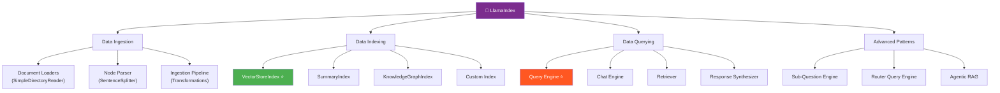
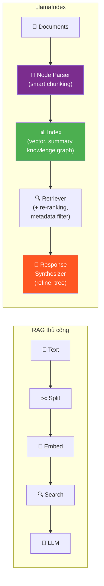
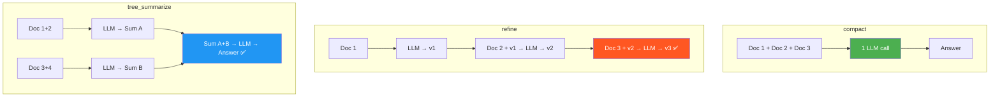

# 🦙 LlamaIndex Deep Dive — Phase 3.3, Tuần 3-4

> 📅 Thuộc Phase 3: Core Skills — Framework #2 CHUYÊN về Data & RAG
> 📖 Tiếp nối [LangChain Deep Dive — Phase 3.3, Tuần 1-2](./LangChain%20Deep%20Dive%20-%20Phase%203.3%20Tuần%201-2.md)
> 🎯 Mục tiêu: Master LlamaIndex để xây RAG pipeline production-grade, hiểu khi nào dùng LlamaIndex vs LangChain

---

## 🗺️ Mental Map — LlamaIndex = "Data Framework cho LLM"



```
  LANGCHAIN vs LLAMAINDEX — Khác biệt CORE

  ┌─────────────────────────────────────────────────────────────┐
  │                                                             │
  │  LangChain 🦜:     TỔNG QUÁT — "Swiss Army Knife"         │
  │    → Chains, Agents, Tools, Memory                          │
  │    → Connect MỌI THỨ lại với nhau                           │
  │    → Tốt cho: orchestration, multi-step workflows          │
  │                                                             │
  │  LlamaIndex 🦙:    CHUYÊN DATA — "Data Surgeon"            │
  │    → Document parsing, chunking, indexing                   │
  │    → Query + synthesis THÔNG MINH                           │
  │    → Tốt cho: RAG chất lượng cao, knowledge base           │
  │                                                             │
  │  Production: THƯỜNG dùng CẢ HAI!                            │
  │    LlamaIndex xử lý DATA → LangChain orchestrate WORKFLOW │
  │                                                             │
  └─────────────────────────────────────────────────────────────┘

  Analogy:
    LangChain = "Kiến trúc sư" — thiết kế tổng thể, nối phòng lại
    LlamaIndex = "Thợ mộc" — làm từng chi tiết nội thất CHÍNH XÁC
```

---

## 📖 Mục lục

1. [Luồng Suy Nghĩ — LlamaIndex giải quyết gì?](#1-luồng-suy-nghĩ--llamaindex-giải-quyết-gì)
2. [Core Concepts — Document, Node, Index](#2-core-concepts--document-node-index)
3. [Data Ingestion — Load, Parse, Transform](#3-data-ingestion--load-parse-transform)
4. [Indexing — Cách LlamaIndex tổ chức data](#4-indexing--cách-llamaindex-tổ-chức-data)
5. [Query Engine — Hỏi và nhận câu trả lời ⭐](#5-query-engine--hỏi-và-nhận-câu-trả-lời-)
6. [Chat Engine — Hội thoại nhiều lượt](#6-chat-engine--hội-thoại-nhiều-lượt)
7. [Response Synthesis — Cách LLM tổng hợp câu trả lời](#7-response-synthesis--cách-llm-tổng-hợp-câu-trả-lời)
8. [Advanced: Sub-Question & Router](#8-advanced-sub-question--router)
9. [LangChain + LlamaIndex — Kết hợp cả hai](#9-langchain--llamaindex--kết-hợp-cả-hai)
10. [Production Patterns](#10-production-patterns)

---

# 1. Luồng Suy Nghĩ — LlamaIndex giải quyết gì?

### So sánh: RAG tự viết vs LlamaIndex

```
  🔍 RAG tự viết (hoặc LangChain basic):
    1. Load PDF → text thuần
    2. Chunk bằng split() → 500 tokens
    3. Embed bằng OpenAI → vectors
    4. Store vào Chroma → search
    5. Top K docs → prompt → LLM → answer

    → HOẠT ĐỘNG! Nhưng THIẾU gì?
      ❌ Chunk giữa câu (split "xin. chào" thành "xin." + "chào")
      ❌ Mất metadata (page number, section title)
      ❌ Không biết doc lớn hay nhỏ → chunk size cố định
      ❌ Answer chỉ từ 5 chunks → miss info ở chunk #6!
      ❌ Không xử lý multi-hop questions

  🦙 LlamaIndex giải quyết TẤT CẢ:
    → Smart parsing: giữ structure (heading, table, list)
    → Node = chunk + metadata + relationships
    → Multiple index types: vector, summary, knowledge graph  
    → Response synthesis: compact, tree_summarize, refine
    → Sub-question engine: tách câu hỏi phức tạp
```



---

# 2. Core Concepts — Document, Node, Index

> 🧱 **3 khái niệm NỀN TẢNG: Document → Node → Index**

### Document, Node, Index là gì?

```
  DOCUMENT = file gốc (PDF, web page, CSV, ...)
    → 1 Document = 1 file hoàn chỉnh
    → Có metadata: filename, page_count, author, ...

  NODE = mảnh nhỏ của Document (= "chunk" nhưng THÔNG MINH hơn!)
    → 1 Document → nhiều Nodes
    → Node có: text + metadata + RELATIONSHIPS!
      relationships = biết node trước/sau nó là gì!
    → Node ≈ chunk + context awareness

  INDEX = cấu trúc DỮ LIỆU tổ chức Nodes để search
    → VectorStoreIndex: embed nodes → vector search
    → SummaryIndex: tóm tắt nodes → dùng cho summarization
    → KG Index: nodes thành knowledge graph → relationship queries

  Luồng: Document → parse → Nodes → index → Index → query → Answer

  ┌──────────┐     ┌────────┐     ┌───────────────┐
  │ Document │ →   │ Nodes  │ →   │ Index         │
  │ (PDF gốc)│     │ (smart │     │ (Vector/      │
  │          │     │  chunks)│     │  Summary/KG)  │
  └──────────┘     └────────┘     └───────────────┘
```

```python
from llama_index.core import Document
from llama_index.core.node_parser import SentenceSplitter

# ═══ Document ═══
doc = Document(
    text="Chương 1: Giới thiệu...\nChương 2: Chi tiết...",
    metadata={
        "source": "company_handbook.pdf",
        "author": "HR Department",
        "year": 2024,
    }
)

# ═══ Node — tự động từ Document ═══
parser = SentenceSplitter(chunk_size=512, chunk_overlap=50)
nodes = parser.get_nodes_from_documents([doc])

for node in nodes:
    print(f"Text: {node.text[:80]}...")
    print(f"Metadata: {node.metadata}")
    print(f"Relationships: {node.relationships}")  # ← BIẾT node trước/sau!
    print()
```

```
  💡 Node vs Chunk — sự khác biệt QUAN TRỌNG:

  Chunk (thủ công):
    text = "Nhân viên được 15 ngày..."   ← CHỈ text, không biết gì khác!
  
  Node (LlamaIndex):
    text = "Nhân viên được 15 ngày..."
    metadata = {source: "hr.pdf", page: 3, section: "Nghỉ phép"}
    prev_node = "Node về chương 3 intro"   ← BIẾT context!
    next_node = "Node về nghỉ bệnh"       ← BIẾT liên kết!
    embedding = [0.23, -0.45, ...]         ← Đã embed sẵn!

  → Node = chunk có "ĐỒ CHƠI" kèm theo!
```

---

# 3. Data Ingestion — Load, Parse, Transform

### SimpleDirectoryReader — Load mọi thứ

```python
from llama_index.core import SimpleDirectoryReader

# ═══ Load TẤT CẢ files trong folder ═══
reader = SimpleDirectoryReader(
    input_dir="./documents",
    required_exts=[".pdf", ".txt", ".md", ".docx"],
    recursive=True,  # Bao gồm sub-folders
)
documents = reader.load_data()
print(f"Loaded {len(documents)} documents")

# ═══ Load file cụ thể ═══
documents = SimpleDirectoryReader(
    input_files=["./reports/q4_2024.pdf", "./policies/leave.pdf"]
).load_data()
```

```
  SimpleDirectoryReader tự nhận diện format:
  ┌────────────┬──────────────────────────┐
  │ Format     │ Cách xử lý               │
  ├────────────┼──────────────────────────┤
  │ .pdf       │ PyPDF / pdfplumber        │
  │ .docx      │ python-docx              │
  │ .csv       │ pandas                    │
  │ .md        │ text parsing              │
  │ .html      │ BeautifulSoup             │
  │ .pptx      │ python-pptx              │
  │ .jpg/.png  │ OCR (nếu cài plugin!)    │
  └────────────┴──────────────────────────┘
```

### Node Parsers — Chunking THÔNG MINH

```python
from llama_index.core.node_parser import (
    SentenceSplitter,
    SemanticSplitterNodeParser,
    MarkdownNodeParser,
    HierarchicalNodeParser,
)
from llama_index.embeddings.openai import OpenAIEmbedding

# ═══ 1. SentenceSplitter — phổ biến nhất ═══
sentence_parser = SentenceSplitter(
    chunk_size=512,     # Max tokens per chunk
    chunk_overlap=50,   # Overlap giữa chunks
)
# Tách theo CÂU, không cắt giữa câu!
# "Nhân viên được 15 ngày. | Nghỉ bệnh theo giấy BS."
#                           ^ Tách ở đây, không giữa câu!


# ═══ 2. MarkdownNodeParser — tách theo heading ═══
md_parser = MarkdownNodeParser()
# Markdown: # Chapter 1 → Node 1
#            ## Section 1.1 → Node 2
#            ## Section 1.2 → Node 3
# → Giữ STRUCTURE! Metadata có header path!


# ═══ 3. SemanticSplitter — tách theo Ý NGHĨA ═══
semantic_parser = SemanticSplitterNodeParser(
    embed_model=OpenAIEmbedding(),
    breakpoint_percentile_threshold=95,  # Ngưỡng "khác nghĩa"
)
# So sánh embedding liên tiếp:
#   Câu 1 vs Câu 2 → similarity 0.92 → CÙNG topic → giữ chung
#   Câu 5 vs Câu 6 → similarity 0.45 → KHÁC topic → TÁCH!
# → chunks theo Ý NGHĨA, không theo SIZE! 🎯


# ═══ 4. HierarchicalNodeParser — Parent-Child ═══
hierarchical_parser = HierarchicalNodeParser.from_defaults(
    chunk_sizes=[2048, 512, 128]   # Parent → Child → Grandchild
)
# Level 0: 2048 tokens (parent — context cho LLM)
# Level 1: 512 tokens (child — search chính)
# Level 2: 128 tokens (grandchild — search cực kỳ chính xác)
```

```
  📐 Trade-off: Chọn Node Parser nào?

  ┌─────────────────────┬──────────┬──────────┬─────────────────┐
  │ Parser              │ Quality  │ Speed    │ Best for        │
  ├─────────────────────┼──────────┼──────────┼─────────────────┤
  │ SentenceSplitter    │ ⭐⭐⭐⭐│ Fast ⚡  │ General use ⭐   │
  │ MarkdownNodeParser  │ ⭐⭐⭐⭐│ Fast     │ Markdown/docs    │
  │ SemanticSplitter    │ ⭐⭐⭐⭐⭐│ Slow (embed)│ Accuracy first│
  │ HierarchicalParser  │ ⭐⭐⭐⭐⭐│ Medium   │ Parent-child RAG│
  └─────────────────────┴──────────┴──────────┴─────────────────┘

  Start: SentenceSplitter → đo evaluation → upgrade nếu cần!
```

### Ingestion Pipeline — Load + Transform pipeline

```python
from llama_index.core.ingestion import IngestionPipeline
from llama_index.core.node_parser import SentenceSplitter
from llama_index.embeddings.openai import OpenAIEmbedding

# ═══ Pipeline: Load → Parse → Embed (1 lần setup, tái sử dụng!) ═══
pipeline = IngestionPipeline(
    transformations=[
        SentenceSplitter(chunk_size=512, chunk_overlap=50),
        OpenAIEmbedding(model="text-embedding-3-small"),
    ]
)

# Chạy pipeline
documents = SimpleDirectoryReader("./docs").load_data()
nodes = pipeline.run(documents=documents)
print(f"Created {len(nodes)} nodes with embeddings")

# ═══ Pipeline với CACHE (không embed lại doc đã có!) ═══
from llama_index.core.ingestion import IngestionCache

pipeline_with_cache = IngestionPipeline(
    transformations=[
        SentenceSplitter(chunk_size=512),
        OpenAIEmbedding(),
    ],
    cache=IngestionCache(),   # ← Cache! Thêm doc mới, chỉ embed doc MỚI!
)
# Lần 1: embed 100 docs → 5 phút
# Lần 2: thêm 10 docs → embed 10 docs mới → 30 giây! ⚡
```

---

# 4. Indexing — Cách LlamaIndex tổ chức data

### VectorStoreIndex — Phổ biến nhất ⭐

```python
from llama_index.core import VectorStoreIndex, StorageContext
from llama_index.vector_stores.chroma import ChromaVectorStore
import chromadb

# ═══ Cách 1: In-memory (prototype) ═══
index = VectorStoreIndex.from_documents(documents)
# Tự động: parse → chunk → embed → index!

# ═══ Cách 2: Với Chroma (persist data!) ═══
chroma_client = chromadb.PersistentClient(path="./chroma_db")
chroma_collection = chroma_client.get_or_create_collection("my_docs")
vector_store = ChromaVectorStore(chroma_collection=chroma_collection)

storage_context = StorageContext.from_defaults(vector_store=vector_store)
index = VectorStoreIndex.from_documents(
    documents,
    storage_context=storage_context,
)

# ═══ Load index đã lưu (không cần re-index!) ═══
vector_store = ChromaVectorStore(chroma_collection=chroma_collection)
index = VectorStoreIndex.from_vector_store(vector_store)
```

### SummaryIndex — Cho summarization

```python
from llama_index.core import SummaryIndex

# ═══ SummaryIndex: đọc TẤT CẢ nodes → tổng hợp ═══
summary_index = SummaryIndex.from_documents(documents)
query_engine = summary_index.as_query_engine()
response = query_engine.query("Tóm tắt toàn bộ tài liệu")
# → LLM đọc TẤT CẢ nodes → viết tóm tắt!
# ⚠️ Chậm + tốn tokens! Dùng cho summarization, KHÔNG dùng cho Q&A!
```

```
  Khi nào dùng Index nào?

  ┌────────────────────┬──────────────────────────────────────────┐
  │ Index              │ Khi nào dùng?                             │
  ├────────────────────┼──────────────────────────────────────────┤
  │ VectorStoreIndex   │ Q&A, search → 90% use cases ⭐           │
  │ SummaryIndex       │ Tóm tắt toàn bộ document                │
  │ KG Index           │ Relationship queries ("Ai report ai?")  │
  │ Tree Index         │ Nhiều tầng summary → drill down         │
  └────────────────────┴──────────────────────────────────────────┘
```

---

# 5. Query Engine — Hỏi và nhận câu trả lời ⭐

> ⭐ **Query Engine = Retriever + Response Synthesizer**

### Basic Query

```python
# ═══ Query Engine — 1 dòng! ═══
query_engine = index.as_query_engine(
    similarity_top_k=5,           # Lấy 5 docs gần nhất
    response_mode="compact",      # Gom docs → 1 LLM call
)

response = query_engine.query("Chính sách nghỉ phép?")
print(response)                   # Câu trả lời
print(response.source_nodes)      # Documents đã dùng (trích dẫn!)
print(response.metadata)          # Metadata
```

### Customized Query Engine

```python
from llama_index.core import get_response_synthesizer
from llama_index.core.retrievers import VectorIndexRetriever
from llama_index.core.query_engine import RetrieverQueryEngine
from llama_index.core.postprocessor import SimilarityPostprocessor

# ═══ Custom: Retriever + Postprocessor + Synthesizer ═══

# 1. Retriever: lấy top 10
retriever = VectorIndexRetriever(
    index=index,
    similarity_top_k=10,
)

# 2. Postprocessor: lọc score thấp
postprocessor = SimilarityPostprocessor(similarity_cutoff=0.7)
# Chỉ giữ nodes có score ≥ 0.7 → loại noise!

# 3. Synthesizer: cách LLM tổng hợp
synthesizer = get_response_synthesizer(
    response_mode="tree_summarize",  # Xem chi tiết ở section 7!
)

# 4. Kết hợp!
query_engine = RetrieverQueryEngine(
    retriever=retriever,
    node_postprocessors=[postprocessor],
    response_synthesizer=synthesizer,
)

response = query_engine.query("Quy trình xin nghỉ phép?")
```

### Query Engine với Metadata Filters

```python
from llama_index.core.vector_stores import (
    MetadataFilter,
    MetadataFilters,
    FilterOperator,
)

# ═══ Lọc theo metadata TRƯỚC KHI search ═══
filters = MetadataFilters(
    filters=[
        MetadataFilter(key="department", value="HR", operator=FilterOperator.EQ),
        MetadataFilter(key="year", value=2023, operator=FilterOperator.GTE),
    ]
)

query_engine = index.as_query_engine(
    similarity_top_k=5,
    filters=filters,    # Chỉ search trong HR docs, từ 2023 trở đi!
)
```

---

# 6. Chat Engine — Hội thoại nhiều lượt

```python
from llama_index.core.memory import ChatMemoryBuffer

# ═══ Chat Engine = Query Engine + Memory ═══
memory = ChatMemoryBuffer.from_defaults(token_limit=3000)

chat_engine = index.as_chat_engine(
    chat_mode="condense_plus_context",   # Rephrase + RAG
    memory=memory,
    system_prompt="Bạn là trợ lý HR. Trả lời dựa trên tài liệu.",
)

# Chat nhiều lượt!
response1 = chat_engine.chat("Nghỉ phép bao nhiêu ngày?")
print(response1)
# → "Nhân viên được 15 ngày phép/năm."

response2 = chat_engine.chat("Còn nghỉ bệnh thì sao?")
print(response2)
# → Chat engine tự rephrase: "Nghỉ bệnh bao nhiêu ngày?"
# → "Nghỉ bệnh tối đa 30 ngày, cần giấy bác sĩ."

response3 = chat_engine.chat("So sánh 2 loại trên")
print(response3)
# → Hiểu "2 loại" = nghỉ phép + nghỉ bệnh → so sánh!
```

```
  Chat Modes:

  ┌──────────────────────────┬──────────────────────────────────┐
  │ Mode                     │ Hoạt động                         │
  ├──────────────────────────┼──────────────────────────────────┤
  │ "best"                   │ Agent mode, TỰ QUYẾT ĐỊNH         │
  │ "condense_question"      │ Rephrase question → search        │
  │ "condense_plus_context"  │ Rephrase + RAG ⭐ (recommended!)  │
  │ "context"                │ Luôn search, không rephrase       │
  │ "simple"                 │ Không search, LLM trực tiếp       │
  └──────────────────────────┴──────────────────────────────────┘
```

---

# 7. Response Synthesis — Cách LLM tổng hợp câu trả lời

> 📐 **Response mode = cách LLM "đọc" và "viết" từ retrieved documents**

```
  ┌─────────────────────────────────────────────────────────────────┐
  │                                                                 │
  │  "compact" (default):                                           │
  │    Gom TẤT CẢ docs → 1 prompt → 1 LLM call                   │
  │    ✅ Nhanh + rẻ | ❌ Context dài → miss info giữa             │
  │                                                                 │
  │  "refine":                                                      │
  │    Doc 1 → LLM → answer 1                                      │
  │    Doc 2 + answer 1 → LLM → answer 2 (refined!)               │
  │    Doc 3 + answer 2 → LLM → answer 3 (more refined!)          │
  │    ✅ Chính xác nhất | ❌ Nhiều LLM calls → chậm + đắt        │
  │                                                                 │
  │  "tree_summarize":                                              │
  │    Doc 1+2 → LLM → summary A                                   │
  │    Doc 3+4 → LLM → summary B                                   │
  │    Summary A+B → LLM → final answer                            │
  │    ✅ Xử lý nhiều docs tốt | ❌ Mất chi tiết                   │
  │                                                                 │
  │  "simple_summarize":                                            │
  │    CẮT hết docs → fit context window → 1 LLM call             │
  │    ✅ Siêu nhanh | ❌ Mất data nếu quá dài                     │
  │                                                                 │
  └─────────────────────────────────────────────────────────────────┘
```



```python
# ═══ Chọn response mode ═══

# Default (nhanh, tốt cho hầu hết)
engine = index.as_query_engine(response_mode="compact")

# Chính xác nhất (chậm, đắt)
engine = index.as_query_engine(response_mode="refine")

# Nhiều documents (10+)
engine = index.as_query_engine(response_mode="tree_summarize")
```

---

# 8. Advanced: Sub-Question & Router

### Sub-Question Query Engine — Tách câu hỏi phức tạp

```
  Vấn đề: "So sánh chính sách nghỉ phép của phòng HR và phòng IT"
  
  Naive RAG:
    Search "so sánh nghỉ phép HR IT" → miss! Quá chung chung!

  Sub-Question Engine:
    1. Tách thành sub-questions:
       Q1: "Chính sách nghỉ phép phòng HR?"
       Q2: "Chính sách nghỉ phép phòng IT?"
    2. Search + answer mỗi sub-question RIÊNG
    3. Tổng hợp tất cả answers → final answer!
```

```python
from llama_index.core.tools import QueryEngineTool, ToolMetadata
from llama_index.core.query_engine import SubQuestionQueryEngine

# ═══ Setup: mỗi index = 1 tool ═══
hr_tool = QueryEngineTool(
    query_engine=hr_index.as_query_engine(),
    metadata=ToolMetadata(
        name="hr_policies",
        description="Chính sách HR: nghỉ phép, lương, tuyển dụng",
    ),
)
it_tool = QueryEngineTool(
    query_engine=it_index.as_query_engine(),
    metadata=ToolMetadata(
        name="it_policies",
        description="Chính sách IT: bảo mật, laptop, VPN",
    ),
)

# ═══ Sub-Question Engine: tự tách + tự tổng hợp! ═══
sub_question_engine = SubQuestionQueryEngine.from_defaults(
    query_engine_tools=[hr_tool, it_tool],
)

response = sub_question_engine.query(
    "So sánh chính sách nghỉ phép giữa HR và IT"
)
# → Tách: Q1 cho hr_policies, Q2 cho it_policies
# → Trả lời từng cái → tổng hợp so sánh!
```

### Router Query Engine — Route câu hỏi đến đúng index

```python
from llama_index.core.query_engine import RouterQueryEngine
from llama_index.core.selectors import LLMSingleSelector

# ═══ Route: HR questions → HR index, IT → IT index ═══
router_engine = RouterQueryEngine(
    selector=LLMSingleSelector.from_defaults(),
    query_engine_tools=[hr_tool, it_tool],
)

response = router_engine.query("Cách reset password?")
# → LLM selector: "Đây là IT question" → route đến it_policies
```

---

# 9. LangChain + LlamaIndex — Kết hợp cả hai

```python
# ═══ Dùng LlamaIndex index TRONG LangChain chain! ═══

from llama_index.core import VectorStoreIndex
from langchain_core.prompts import ChatPromptTemplate
from langchain_openai import ChatOpenAI
from langchain_core.output_parsers import StrOutputParser
from langchain_core.runnables import RunnablePassthrough

# 1. LlamaIndex: xử lý data (mạnh hơn LangChain ở phần này!)
index = VectorStoreIndex.from_documents(documents)
llama_retriever = index.as_retriever(similarity_top_k=5)

# 2. Adapter: LlamaIndex retriever → LangChain compatible
def retrieve_with_llama(query: str) -> str:
    nodes = llama_retriever.retrieve(query)
    return "\n\n---\n\n".join(
        f"[{n.metadata.get('source', '?')}] (score: {n.score:.2f})\n{n.text}"
        for n in nodes
    )

# 3. LangChain: orchestration (LCEL pipeline!)
prompt = ChatPromptTemplate.from_template(
    """Dựa trên tài liệu, trả lời câu hỏi. Trích dẫn [source].

TÀI LIỆU:
{context}

CÂU HỎI: {question}"""
)

llm = ChatOpenAI(model="gpt-4o", temperature=0)

# 4. Combined chain: LlamaIndex retrieval + LangChain pipeline!
chain = (
    {"context": lambda x: retrieve_with_llama(x["question"]),
     "question": RunnablePassthrough()}
    | prompt
    | llm
    | StrOutputParser()
)

answer = chain.invoke({"question": "Chính sách nghỉ phép?"})
```

```
  TẠI SAO KẾT HỢP?

  LlamaIndex mạnh ở:
    → Smart node parsing (semantic, hierarchical)
    → Multiple index types
    → Response synthesis (refine, tree_summarize)
    → Sub-question decomposition

  LangChain mạnh ở:
    → LCEL pipe operator (clean code!)
    → Agent + Tool ecosystem
    → Memory management
    → LangSmith debugging
    → Fallback, retry, rate limit

  Kết hợp = BEST OF BOTH WORLDS! 🎯
```

---

# 10. Production Patterns

### Pattern 1: Caching — Tránh re-embed

```python
from llama_index.core.ingestion import IngestionPipeline, IngestionCache
from llama_index.core.storage.docstore import SimpleDocumentStore

# Pipeline với cache
pipeline = IngestionPipeline(
    transformations=[
        SentenceSplitter(),
        OpenAIEmbedding(),
    ],
    docstore=SimpleDocumentStore(),  # Theo dõi docs đã xử lý
    cache=IngestionCache(),          # Cache embeddings
)

# Lần đầu: process 100 docs (5 phút)
nodes = pipeline.run(documents=docs_batch_1)

# Thêm 10 docs mới: CHỈ process 10 docs mới! (30 giây)
nodes = pipeline.run(documents=docs_batch_1 + docs_batch_2)
```

### Pattern 2: Streaming — Real-time response

```python
# ═══ Streaming: từng token, như ChatGPT! ═══
query_engine = index.as_query_engine(streaming=True)
streaming_response = query_engine.query("Giải thích RAG")

for text in streaming_response.response_gen:
    print(text, end="", flush=True)
```

### Pattern 3: Async — cho Web servers

```python
# ═══ Async: cho FastAPI, non-blocking! ═══
response = await query_engine.aquery("Chính sách nghỉ phép?")
```

---

## 📐 Tổng kết — Checklist Tuần 3-4

```
  ┌────────────────────────────────────────────────────────────┐
  │  LlamaIndex Checklist:                                     │
  │                                                            │
  │  Core Concepts:                                            │
  │  □ Document, Node, Index — 3 abstraction chính            │
  │  □ Node vs Chunk — Node có metadata + relationships       │
  │                                                            │
  │  Data Ingestion:                                           │
  │  □ SimpleDirectoryReader — load PDF, docx, md, csv        │
  │  □ SentenceSplitter — chunking theo câu (default ⭐)       │
  │  □ SemanticSplitter — chunking theo ý nghĩa               │
  │  □ IngestionPipeline — pipeline có cache                  │
  │                                                            │
  │  Indexing:                                                 │
  │  □ VectorStoreIndex — 90% use cases ⭐                     │
  │  □ SummaryIndex — cho summarization                       │
  │  □ Persist với Chroma/Pinecone                             │
  │                                                            │
  │  Querying (⭐ QUAN TRỌNG NHẤT):                             │
  │  □ Query Engine — retriever + synthesizer                  │
  │  □ Chat Engine — conversation mode                        │
  │  □ Response modes: compact, refine, tree_summarize        │
  │  □ Metadata filters — lọc trước khi search               │
  │  □ Similarity postprocessor — lọc score thấp             │
  │                                                            │
  │  Advanced:                                                 │
  │  □ Sub-Question Engine — tách câu hỏi phức tạp           │
  │  □ Router Engine — route đến đúng index                   │
  │                                                            │
  │  Integration:                                              │
  │  □ LlamaIndex retriever trong LangChain chain             │
  │  □ Khi nào LlamaIndex vs LangChain vs cả hai             │
  │                                                            │
  │  Production:                                               │
  │  □ IngestionCache — tránh re-embed                        │
  │  □ Streaming — real-time response                         │
  │  □ Async — cho web servers                                │
  └────────────────────────────────────────────────────────────┘
```

---

## 📚 Tài liệu đọc thêm

```
  📖 Docs (ĐỌC HÀNG NGÀY):
    docs.llamaindex.ai — LlamaIndex docs chính thức
    docs.llamaindex.ai/en/stable/getting_started/ — Getting started
    docs.llamaindex.ai/en/stable/examples/ — Examples (RẤT NHIỀU!)

  🎥 Video:
    "Building RAG with LlamaIndex" — DeepLearning.AI (Jerry Liu!)
    "LlamaIndex Full Course" — FreeCodeCamp YouTube
    "LlamaIndex vs LangChain" — AI Jason YouTube

  🏋️ Thực hành:
    1. Load 5 PDFs → VectorStoreIndex → query
    2. So sánh SentenceSplitter vs SemanticSplitter (đo chất lượng!)
    3. Thử response modes: compact vs refine vs tree_summarize
    4. Xây Chat Engine với memory
    5. Xây Sub-Question Engine cho multi-doc Q&A
    6. Kết hợp LlamaIndex retriever + LangChain LCEL chain
```
