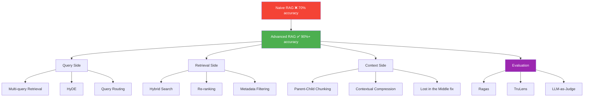
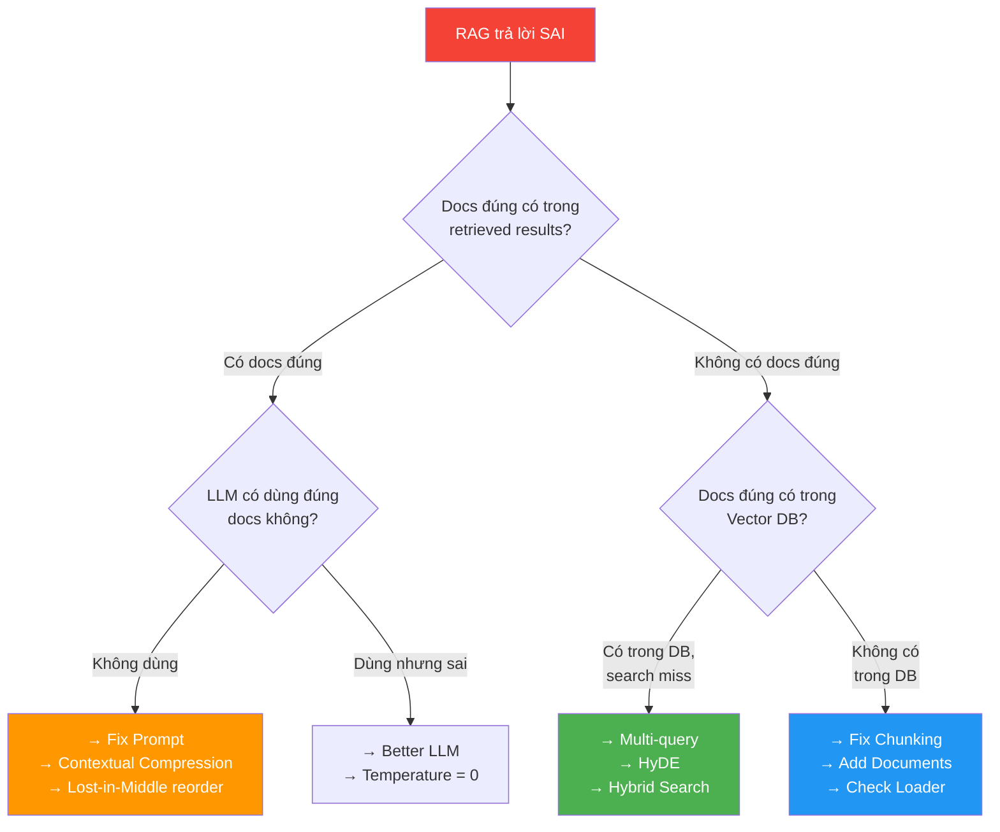
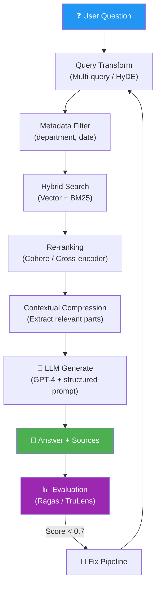

# 🔬 RAG Nâng Cao — Phase 3, Tuần 5-6: Từ "Hoạt Động" đến "Hoạt Động TỐT"

> 📅 Thuộc Phase 3: Core Skills — Nâng cấp RAG Pipeline lên Production-grade
> 📖 Tiếp nối [RAG Pipeline — Phase 3, Tuần 3-4](./RAG%20Pipeline%20-%20Phase%203%20Tuần%203-4.md)
> 🎯 Mục tiêu: Master các kỹ thuật nâng cao để RAG chính xác, nhanh, và đáng tin cậy

---

## 🗺️ Mental Map — Từ Naive RAG → Advanced RAG



```
  TẠI SAO CẦN ADVANCED RAG?

  Naive RAG (basic pipeline):
    Document → Chunk → Embed → Vector Search → LLM → Answer
    → HOẠT ĐỘNG cho 70% use cases ✅
    → THẤT BẠI cho 30% ❌

  30% thất bại ở đâu?
  ┌────────────────────────────────────────────────────────────┐
  │  ❌ Query mơ hồ              → Multi-query, HyDE          │
  │  ❌ Search miss do synonym    → Hybrid Search               │
  │  ❌ Top-K có noise            → Re-ranking                  │
  │  ❌ Chunk thiếu context       → Parent-child chunking       │
  │  ❌ Quá nhiều docs irrelevant → Metadata filtering          │
  │  ❌ Không biết RAG có tốt không → Evaluation (Ragas)       │
  └────────────────────────────────────────────────────────────┘

  → Advanced RAG = FIX từng vấn đề cụ thể!
```

---

## 📖 Mục lục

1. [Luồng Suy Nghĩ — Khi nào cần Advanced RAG?](#1-luồng-suy-nghĩ--khi-nào-cần-advanced-rag)
2. [Multi-query Retrieval — Tìm từ nhiều góc độ](#2-multi-query-retrieval--tìm-từ-nhiều-góc-độ)
3. [HyDE — Hypothetical Document Embeddings](#3-hyde--hypothetical-document-embeddings)
4. [Hybrid Search — Keyword + Semantic](#4-hybrid-search--keyword--semantic)
5. [Re-ranking — Lọc lại kết quả](#5-re-ranking--lọc-lại-kết-quả)
6. [Parent-Child Chunking — Search nhỏ, Context lớn](#6-parent-child-chunking--search-nhỏ-context-lớn)
7. [Metadata Filtering — Lọc trước khi search](#7-metadata-filtering--lọc-trước-khi-search)
8. [Contextual Compression — Nén context](#8-contextual-compression--nén-context)
9. [RAG Evaluation — Đo lường với Ragas & TruLens](#9-rag-evaluation--đo-lường-với-ragas--trulens)
10. [Production RAG Architecture — Kết hợp tất cả](#10-production-rag-architecture--kết-hợp-tất-cả)

---

# 1. Luồng Suy Nghĩ — Khi nào cần Advanced RAG?

> 💡 Phần này dạy bạn **CÁCH TƯ DUY** để biết khi nào cần technique nào.

### Bước 1: Xác định RAG đang FAIL ở đâu?

```
  🧠 RAG pipeline có 3 điểm có thể fail:

  ┌──────────┐     ┌──────────┐     ┌──────────┐
  │ QUERY    │ →   │ RETRIEVAL│ →   │ GENERATION│
  │          │     │          │     │           │
  │ User hỏi │     │ Tìm docs │     │ LLM trả  │
  │ mơ hồ?   │     │ đúng?    │     │ lời đúng?│
  └──────────┘     └──────────┘     └──────────┘
      ↓                 ↓                ↓
  Multi-query      Hybrid Search    Better prompts
  HyDE             Re-ranking       Compression
  Query routing    Metadata filter  Lost in middle

  🔍 CÁCH CHẨN ĐOÁN:
    1. Hỏi câu hỏi → LLM trả lời sai
    2. Xem retrieved docs → có doc ĐÚNG không?
       → CÓ doc đúng nhưng LLM vẫn sai → GENERATION problem
       → KHÔNG có doc đúng → RETRIEVAL problem
    3. Xem doc đúng có trong DB không?
       → CÓ trong DB nhưng search miss → QUERY/SEARCH problem
       → KHÔNG có trong DB → INDEXING problem (chunk sai, missing data)
```

### Bước 2: Chọn technique theo vấn đề

```
  ┌─────────────────────────────────────────────────────────────────┐
  │  TRIỆU CHỨNG                  │  NGUYÊN NHÂN     │  GIẢI PHÁP │
  ├────────────────────────────────┼──────────────────┼────────────┤
  │  Search miss dù doc có trong   │  Query ≠ doc     │  Multi-    │
  │  DB (user hỏi khác cách doc   │  embedding khác  │  query,    │
  │  viết)                         │  nhau            │  HyDE      │
  ├────────────────────────────────┼──────────────────┼────────────┤
  │  Search miss cho exact terms   │  Vector search   │  Hybrid    │
  │  ("ISO 9001", tên riêng)      │  kém exact match │  Search    │
  ├────────────────────────────────┼──────────────────┼────────────┤
  │  Top-K có docs irrelevant     │  Cosine sim quá  │  Re-ranking│
  │  (score cao nhưng sai chủ đề) │  đơn giản        │            │
  ├────────────────────────────────┼──────────────────┼────────────┤
  │  LLM thiếu context để trả lời │  Chunks quá nhỏ  │  Parent-   │
  │  (đúng chunk nhưng thiếu info)│                  │  child     │
  ├────────────────────────────────┼──────────────────┼────────────┤
  │  Search trả docs sai domain   │  Không lọc theo  │  Metadata  │
  │  (HR query → lấy IT docs)     │  category        │  filtering │
  ├────────────────────────────────┼──────────────────┼────────────┤
  │  Không biết RAG có tốt không  │  Không có metrics│  Ragas,    │
  │  (cảm tính, vibe-based)       │                  │  TruLens   │
  └────────────────────────────────┴──────────────────┴────────────┘

  📌 QUY TẮC VÀNG:
    ĐỪNG dùng tất cả techniques cùng lúc!
    → Chẩn đoán trước → chọn 1-2 techniques → đo kết quả → lặp lại!
```



---

# 2. Multi-query Retrieval — Tìm từ nhiều góc độ

> 🧱 **Vấn đề: User hỏi 1 cách, tài liệu viết CÁCH KHÁC**

### Tại sao cần Multi-query?

```
  Ví dụ thực tế:
    User: "Làm sao để không bị đuổi việc?"
    Tài liệu: "Quy trình kỷ luật nhân viên" — KHÔNG có từ "đuổi việc"!

    → Embedding "đuổi việc" ≠ Embedding "kỷ luật nhân viên"
    → Vector search MISS!

  💡 Giải pháp: Tạo NHIỀU phiên bản câu hỏi → search tất cả!
    Query 1: "Làm sao để không bị đuổi việc?"        ← gốc
    Query 2: "Quy định sa thải và kỷ luật nhân viên"  ← rephrase
    Query 3: "Điều kiện chấm dứt hợp đồng lao động"  ← pháp lý
    Query 4: "Tiêu chí đánh giá hiệu suất nhân viên" ← góc khác

    → 4 queries × top 5 = 20 results → deduplicate → top 5 TỐT NHẤT!
```

### Code: Multi-query Retriever

```python
from openai import OpenAI

client = OpenAI()

def generate_multi_queries(original_query: str, n: int = 3) -> list[str]:
    """Dùng LLM tạo n phiên bản khác nhau của câu hỏi"""
    
    prompt = f"""Cho câu hỏi sau, tạo {n} phiên bản KHÁC NHAU giúp tìm kiếm tốt hơn.
Mỗi phiên bản nên dùng TỪ KHÁC, GÓC ĐỘ KHÁC.

CÂU HỎI GỐC: {original_query}

Viết {n} phiên bản, mỗi dòng 1 cái (KHÔNG đánh số):"""

    response = client.chat.completions.create(
        model="gpt-4o-mini",      # Model nhẹ để tiết kiệm!
        messages=[{"role": "user", "content": prompt}],
        temperature=0.7,           # Cần sáng tạo để tạo queries khác nhau
    )
    
    queries = [q.strip() for q in response.choices[0].message.content.strip().split("\n") if q.strip()]
    return [original_query] + queries[:n]   # Luôn giữ query gốc!


def multi_query_retrieve(query: str, store, top_k: int = 5) -> list[dict]:
    """Search nhiều queries → merge → deduplicate → top K"""
    
    queries = generate_multi_queries(query)
    print(f"Generated {len(queries)} queries:")
    for i, q in enumerate(queries):
        print(f"  {i+1}. {q}")
    
    # Search mỗi query
    all_results = {}   # text → best score
    for q in queries:
        q_vec = embed_texts([q])[0]
        results = store.search(q_vec, top_k=top_k)
        for r in results:
            key = r["text"][:100]  # Dùng 100 chars đầu làm key
            if key not in all_results or r["score"] > all_results[key]["score"]:
                all_results[key] = r
    
    # Sort by score, return top K
    merged = sorted(all_results.values(), key=lambda x: -x["score"])
    return merged[:top_k]
```

### Trace: Multi-query hoạt động thế nào

```
  User: "Lương tháng 13 trả khi nào?"

  ═══ Bước 1: Generate queries ═══
    Q1: "Lương tháng 13 trả khi nào?"              ← gốc
    Q2: "Thời điểm chi trả thưởng cuối năm"        ← rephrase
    Q3: "Quy định về bonus và lương thưởng Tết"     ← mở rộng
    Q4: "Chính sách tiền thưởng hàng năm"           ← formal

  ═══ Bước 2: Search từng query (top 3 mỗi cái) ═══
    Q1 results: [doc_5 (0.87), doc_12 (0.82), doc_3 (0.79)]
    Q2 results: [doc_5 (0.91), doc_8 (0.85), doc_12 (0.80)]  ← tìm thêm doc_8!
    Q3 results: [doc_8 (0.88), doc_15 (0.84), doc_5 (0.83)]  ← tìm thêm doc_15!
    Q4 results: [doc_5 (0.89), doc_8 (0.86), doc_3 (0.77)]

  ═══ Bước 3: Merge + Deduplicate ═══
    doc_5:  best score = 0.91 (xuất hiện 4/4 queries → RẤT RELEVANT!)
    doc_8:  best score = 0.88 (xuất hiện 3/4 queries)
    doc_12: best score = 0.82 (xuất hiện 2/4 queries)
    doc_15: best score = 0.84 (chỉ Q3 tìm thấy → BONUS!)
    doc_3:  best score = 0.79 (2/4 queries)

  ═══ Kết quả: [doc_5, doc_8, doc_15, doc_12, doc_3] ═══
    So với single query: Q1 MISS doc_8 và doc_15!
    Multi-query tìm được 2 docs QUAN TRỌNG bổ sung!
```

---

# 3. HyDE — Hypothetical Document Embeddings

> 🧱 **Vấn đề: Embedding CÂU HỎI ≠ Embedding CÂU TRẢ LỜI**

### Tại sao HyDE hoạt động?

```
  Vấn đề core:
    Question: "Nghỉ phép bao nhiêu ngày?"
    Document: "Mỗi nhân viên được 15 ngày phép/năm"

    Embedding("Nghỉ phép bao nhiêu ngày?")    → vector A (dạng CÂU HỎI)
    Embedding("Mỗi nhân viên được 15 ngày...")  → vector B (dạng CÂU TRẢ LỜI)

    → A và B KHÁC DẠNG! Cosine similarity CÓ THỂ thấp!

  💡 HyDE trick:
    1. Hỏi LLM: "Viết 1 đoạn TRẢ LỜI câu hỏi này"
    2. LLM viết: "Nhân viên được nghỉ phép 12 ngày/năm" ← SAI nhưng OK!
    3. Embed đoạn TRẢ LỜI GIẢ → vector C (dạng CÂU TRẢ LỜI!)
    4. Search bằng vector C → GẦN vector B hơn vector A!

    Tại sao?
    C = "Nhân viên được nghỉ phép 12 ngày/năm"  (giả)
    B = "Mỗi nhân viên được 15 ngày phép/năm"   (thật)
    → C và B CÙNG DẠNG (câu khẳng định) → embedding GẦN nhau!

  ⚠️ Data trong HyDE doc có thể SAI (12 ngày thay vì 15)
     Nhưng EMBEDDING vẫn ĐÚNG! Vì embedding capture DẠNG, không capture CON SỐ!
```

### Code: HyDE Retriever

```python
def hyde_retrieve(question: str, store, top_k: int = 5) -> list[dict]:
    """Generate hypothetical doc → embed → search"""
    
    # 1. LLM tạo document giả
    prompt = f"""Viết 1 đoạn văn ngắn (3-5 câu) TRẢ LỜI câu hỏi sau.
Viết như thể bạn đang trích từ tài liệu nội bộ công ty.
KHÔNG cần chính xác — chỉ cần ĐÚNG DẠNG!

Câu hỏi: {question}

Đoạn trả lời:"""

    response = client.chat.completions.create(
        model="gpt-4o-mini",
        messages=[{"role": "user", "content": prompt}],
        temperature=0.5,
    )
    hypothetical_doc = response.choices[0].message.content
    
    print(f"HyDE doc: {hypothetical_doc[:150]}...")
    
    # 2. Embed document GIẢ (KHÔNG embed câu hỏi!)
    hyde_vec = embed_texts([hypothetical_doc])[0]
    
    # 3. Search bằng embedding document giả
    results = store.search(hyde_vec, top_k=top_k)
    return results
```

### Khi nào dùng / không dùng HyDE

```
  ✅ Dùng HyDE khi:
    → Câu hỏi ngắn, tài liệu dài (Q&A mismatch)
    → Domain-specific (medical, legal) — embedding gần hơn
    → Multi-hop questions — HyDE "tổng hợp" ý

  ❌ KHÔNG dùng khi:
    → Câu hỏi ĐÃ rõ ràng, specific (keyword match tốt rồi)
    → Realtime requirement — thêm 1 LLM call = chậm hơn!
    → Document style giống question style (FAQ → FAQ)
    → Chi phí API quan trọng — mỗi query thêm 1 LLM call!

  📐 Trade-off:
    Accuracy: +10-20% nhưng Latency: +500ms-2s (thêm LLM call)
    → Phù hợp cho use cases CHÍNH XÁC > NHANH
```

---

# 4. Hybrid Search — Keyword + Semantic

> 🧱 **Vấn đề: Vector search MISS exact terms, Keyword search MISS synonyms**

### Tại sao cần kết hợp?

```
  Vector search (semantic):
    ✅ "nghỉ phép" tìm thấy "annual leave" (synonym!)
    ❌ "ISO 9001" tìm thấy "ISO 14001" (gần nhưng SAI!)
    ❌ Tên riêng, mã số, viết tắt → embedding không capture!

  Keyword search (BM25):
    ✅ "ISO 9001" chỉ match ĐÚNG "ISO 9001"
    ✅ Tên riêng, mã số → chính xác!
    ❌ "nghỉ phép" KHÔNG match "annual leave" (miss synonym!)

  Hybrid = BEST OF BOTH WORLDS:
    Score = α × vector_score + (1-α) × keyword_score
    α = 0.7 → ưu tiên semantic (default, phù hợp hầu hết)
    α = 0.3 → ưu tiên keyword (khi cần exact match)
```

### Code: Hybrid Search với BM25 + Vector

```python
from rank_bm25 import BM25Okapi
import numpy as np

class HybridSearcher:
    """Kết hợp BM25 (keyword) + Vector search (semantic)"""
    
    def __init__(self, chunks: list[str], embeddings: list[list[float]]):
        # BM25 index
        tokenized = [chunk.lower().split() for chunk in chunks]
        self.bm25 = BM25Okapi(tokenized)
        
        # Vector index
        self.chunks = chunks
        self.embeddings = np.array(embeddings)
    
    def search(self, query: str, query_vec: list[float], 
               top_k: int = 5, alpha: float = 0.7) -> list[dict]:
        """
        alpha: weight cho vector search
          0.0 = chỉ keyword
          1.0 = chỉ vector
          0.7 = default (semantic-heavy)
        """
        # BM25 scores
        bm25_scores = self.bm25.get_scores(query.lower().split())
        bm25_norm = bm25_scores / (bm25_scores.max() + 1e-8)  # Normalize 0-1
        
        # Vector scores (cosine similarity)
        q = np.array(query_vec)
        cos_scores = np.dot(self.embeddings, q) / (
            np.linalg.norm(self.embeddings, axis=1) * np.linalg.norm(q) + 1e-8
        )
        cos_norm = (cos_scores + 1) / 2  # Normalize -1,1 → 0,1
        
        # Combine
        combined = alpha * cos_norm + (1 - alpha) * bm25_norm
        
        # Top K
        top_indices = combined.argsort()[::-1][:top_k]
        return [
            {
                "text": self.chunks[i],
                "score": float(combined[i]),
                "vector_score": float(cos_norm[i]),
                "keyword_score": float(bm25_norm[i]),
            }
            for i in top_indices
        ]
```

### Trace: Hybrid vs Pure Vector vs Pure Keyword

```
  Query: "Quy trình ISO 9001 về kiểm soát chất lượng"

  ═══ Vector Search Only (α=1.0) ═══
    #1: "Kiểm soát chất lượng sản phẩm..." (0.89)    ← ĐÚNG
    #2: "Tiêu chuẩn ISO 14001 môi trường" (0.85)      ← SAI! (ISO khác)
    #3: "Quy trình đảm bảo quality assurance" (0.83)   ← ĐÚNG
    🔍 2/3 đúng — ISO 14001 bị lẫn vì embedding "ISO" gần nhau

  ═══ Keyword Search Only (α=0.0) ═══
    #1: "ISO 9001 clause 8.5.1 kiểm soát" (BM25=3.2)  ← ĐÚNG!
    #2: "ISO 9001 requirements overview" (BM25=2.8)     ← ĐÚNG!
    #3: "Kiểm soát tài liệu ISO" (BM25=2.1)            ← ĐÚNG, chung chung
    🔍 3/3 đúng cho ISO — nhưng miss synonyms

  ═══ Hybrid (α=0.7) ═══
    #1: "ISO 9001 clause 8.5.1 kiểm soát" (0.91)      ← BEST!
    #2: "Kiểm soát chất lượng sản phẩm..." (0.88)      ← semantic match
    #3: "Quy trình đảm bảo quality assurance" (0.85)    ← synonym match
    🔍 3/3 đúng — ISO 14001 bị loại nhờ keyword score thấp!
```

---

# 5. Re-ranking — Lọc lại kết quả

> 🧱 **Vấn đề: Cosine similarity ≠ Relevance**

### Tại sao Re-ranking quan trọng?

```
  Embedding model: bi-encoder (encode RIÊNG query và document)
    → Nhanh! (encode 1 lần, search O(log n))
    → Nhưng THỎA HIỆP chất lượng (không "nhìn" query+doc cùng lúc)

  Re-ranker: cross-encoder (encode query+document CÙNG LÚC)
    → Chậm! (phải encode lại mỗi cặp query-doc)
    → Nhưng CHÍNH XÁC hơn NHIỀU! (thấy interaction giữa query và doc)

  Chiến lược: Lấy NHIỀU → Re-rank → Chọn ÍT
    Step 1: Vector search → top 20 (nhanh, cast a wide net)
    Step 2: Re-rank 20 docs → top 5 (chậm nhưng chính xác)
    → Tiết kiệm: chỉ re-rank 20 docs, không phải hàng triệu!
```

### Code: Re-ranking với Cohere

```python
import cohere

co = cohere.Client("YOUR_COHERE_API_KEY")

def retrieve_and_rerank(query: str, store, 
                        initial_k: int = 20, final_k: int = 5) -> list[dict]:
    """Cast wide net → rerank → top K"""
    
    # Step 1: Lấy top 20 (nhanh)
    query_vec = embed_texts([query])[0]
    candidates = store.search(query_vec, top_k=initial_k)
    
    # Step 2: Re-rank bằng Cohere (chính xác)
    docs = [c["text"] for c in candidates]
    rerank_response = co.rerank(
        model="rerank-english-v3.0",   # hoặc rerank-multilingual-v3.0
        query=query,
        documents=docs,
        top_n=final_k,
    )
    
    # Step 3: Return top K sau re-rank
    results = []
    for r in rerank_response.results:
        original = candidates[r.index]
        results.append({
            "text": original["text"],
            "original_score": original["score"],
            "rerank_score": r.relevance_score,
            "metadata": original.get("metadata", {}),
        })
    
    return results
```

### Khi nào dùng Re-ranking

```
  ✅ LUÔN dùng nếu:
    → Accuracy quan trọng hơn latency
    → Top-K có noise (docs irrelevant nhưng score cao)
    → Multi-lingual (re-ranker cross-lingual tốt hơn embedding!)

  ❌ Không cần nếu:
    → Realtime chatbot (thêm ~200ms latency)
    → Budget hạn chế (Cohere tính phí per request)
    → RAG đã đủ tốt (đo bằng metrics trước!)

  📐 Lựa chọn Re-ranker:
  ┌────────────────────┬──────────┬──────────┬────────────┐
  │ Model              │ Quality  │ Speed    │ Cost       │
  ├────────────────────┼──────────┼──────────┼────────────┤
  │ Cohere rerank v3   │ ⭐⭐⭐⭐⭐│ ~200ms   │ $2/1K calls│
  │ cross-encoder(SBERT)│ ⭐⭐⭐⭐ │ ~500ms   │ FREE (local)│
  │ GPT-4 as reranker  │ ⭐⭐⭐⭐⭐│ ~2s      │ $$$        │
  │ bge-reranker-v2    │ ⭐⭐⭐⭐ │ ~300ms   │ FREE (local)│
  └────────────────────┴──────────┴──────────┴────────────┘
```

---

# 6. Parent-Child Chunking — Search nhỏ, Context lớn

> 🧱 **Vấn đề: Chunk NHỎ search tốt, Chunk LỚN context tốt — chọn gì?**

### CẢ HAI! Parent-Child giải quyết

```
  Dilemma:
    Chunk 200 tokens → search CHÍNH XÁC ✅ nhưng thiếu context ❌
    Chunk 800 tokens → đủ context ✅ nhưng search kém ❌ (embedding "loãng")

  💡 Parent-Child trick:
    PARENT chunk (800 tokens): ĐƯA CHO LLM đọc
    CHILD chunk (200 tokens): DÙNG ĐỂ SEARCH

    Search trên CHILD → tìm thấy → return PARENT cho LLM!

  Ví dụ:
    Parent: "Chương 3: Chính sách nghỉ phép
             3.1 Nghỉ phép năm: 15 ngày/năm cho NV chính thức
             3.2 Nghỉ phép bệnh: theo giấy bác sĩ, tối đa 30 ngày
             3.3 Nghỉ phép thai sản: 6 tháng (nữ), 5 ngày (nam)"
    
    Children:
      Child 1: "3.1 Nghỉ phép năm: 15 ngày/năm cho NV chính thức"
      Child 2: "3.2 Nghỉ phép bệnh: theo giấy bác sĩ, tối đa 30 ngày"
      Child 3: "3.3 Nghỉ phép thai sản: 6 tháng (nữ), 5 ngày (nam)"

    Query: "nghỉ phép bệnh"
    → Search child → match Child 2 (score 0.95!)
    → Return PARENT → LLM thấy TOÀN BỘ chương 3 → trả lời đầy đủ!
```

### Code: Parent-Child Indexing

```python
class ParentChildRAG:
    """Search trên child, return parent cho LLM"""
    
    def __init__(self, parent_size: int = 800, child_size: int = 200):
        self.parent_size = parent_size
        self.child_size = child_size
        self.parents = {}    # parent_id → parent_text
        self.children = []   # list of {child_text, parent_id, embedding}
    
    def index(self, text: str, source: str = ""):
        """Chia thành parent → children → embed children"""
        words = text.split()
        
        for p_start in range(0, len(words), self.parent_size):
            parent_text = " ".join(words[p_start:p_start + self.parent_size])
            parent_id = f"{source}_{p_start}"
            self.parents[parent_id] = parent_text
            
            # Chia parent thành children
            p_words = parent_text.split()
            for c_start in range(0, len(p_words), self.child_size):
                child_text = " ".join(p_words[c_start:c_start + self.child_size])
                child_vec = embed_texts([child_text])[0]
                self.children.append({
                    "text": child_text,
                    "parent_id": parent_id,
                    "embedding": child_vec,
                })
    
    def search(self, query: str, top_k: int = 3) -> list[str]:
        """Search children → return unique parents"""
        query_vec = embed_texts([query])[0]
        
        # Score all children
        scored = []
        for child in self.children:
            score = cosine_sim(query_vec, child["embedding"])
            scored.append((child["parent_id"], score))
        
        # Sort by score, get unique parents
        scored.sort(key=lambda x: -x[1])
        seen = set()
        parent_texts = []
        for parent_id, score in scored:
            if parent_id not in seen:
                seen.add(parent_id)
                parent_texts.append(self.parents[parent_id])
            if len(parent_texts) >= top_k:
                break
        
        return parent_texts
```

---

# 7. Metadata Filtering — Lọc trước khi search

> 🧱 **Vấn đề: Vector search tìm TOÀN BỘ DB — bao gồm docs không liên quan**

```
  Ví dụ:
    DB có: HR docs, IT docs, Finance docs, Legal docs
    Query: "Chính sách nghỉ phép" (thuộc HR)

    Naive search: tìm trong TOÀN BỘ DB
    → Có thể match IT doc nói "server maintenance leave" → NOISE!

  Metadata filtering: LỌC trước, search sau!
    filter = {"department": "HR"}
    → Chỉ search trong HR docs → kết quả chính xác hơn!

  Metadata thường dùng:
  ┌──────────────────┬──────────────────────────────────┐
  │ Metadata field   │ Ví dụ                            │
  ├──────────────────┼──────────────────────────────────┤
  │ department       │ "HR", "IT", "Finance"            │
  │ document_type    │ "policy", "guideline", "FAQ"     │
  │ date_created     │ 2024-01-15                       │
  │ language         │ "vi", "en"                       │
  │ confidentiality  │ "public", "internal", "secret"   │
  │ version          │ "v2.1"                           │
  └──────────────────┴──────────────────────────────────┘
```

### Code: Metadata filtering với Chroma

```python
import chromadb

chroma = chromadb.Client()
collection = chroma.create_collection("company_docs")

# Index với metadata
collection.add(
    documents=["Nghỉ phép 15 ngày/năm...", "Server backup mỗi ngày..."],
    embeddings=[vec1, vec2],
    metadatas=[
        {"department": "HR", "type": "policy", "year": 2024},
        {"department": "IT", "type": "guideline", "year": 2024},
    ],
    ids=["hr_001", "it_001"],
)

# Search VỚI filter
results = collection.query(
    query_embeddings=[query_vec],
    n_results=5,
    where={"department": "HR"},                    # Chỉ HR docs!
    # where={"$and": [{"department": "HR"}, {"year": {"$gte": 2023}}]},  # Combo!
)
```

---

# 8. Contextual Compression — Nén context

> 🧱 **Vấn đề: Retrieved chunks quá DÀI, LLM "lạc" giữa thông tin**

```
  "Lost in the Middle" problem:
    Nếu đưa 10 docs cho LLM, nó thường:
    → NHỚ doc 1 và doc 10 (đầu và cuối)
    → QUÊN docs 5-7 (giữa!)

  💡 Contextual Compression:
    Retrieved chunks → LLM extract PHẦN LIÊN QUAN → Compressed context → LLM final
    
    Ví dụ:
      Chunk: "Chương 3 gồm nhiều mục. 3.1 Lương cơ bản... 3.2 Phụ cấp...
              3.3 Nghỉ phép: mỗi NV được 15 ngày/năm. 3.4 Bảo hiểm..."
      Query: "Nghỉ phép bao nhiêu ngày?"
      
      Compressed: "Nghỉ phép: mỗi NV được 15 ngày/năm"
      → LLM chỉ thấy PHẦN LIÊN QUAN → trả lời CHÍNH XÁC hơn!
```

```python
def compress_context(query: str, documents: list[str]) -> list[str]:
    """Chỉ giữ phần LIÊN QUAN trong mỗi document"""
    
    compressed = []
    for doc in documents:
        prompt = f"""Trích xuất PHẦN LIÊN QUAN đến câu hỏi từ đoạn văn sau.
Chỉ giữ câu/ý TRỰC TIẾP trả lời. Nếu không liên quan, trả về "IRRELEVANT".

Câu hỏi: {query}
Đoạn văn: {doc}

Phần liên quan:"""

        response = client.chat.completions.create(
            model="gpt-4o-mini",
            messages=[{"role": "user", "content": prompt}],
            temperature=0,
        )
        result = response.choices[0].message.content.strip()
        if result != "IRRELEVANT":
            compressed.append(result)
    
    return compressed
```

---

# 9. RAG Evaluation — Đo lường với Ragas & TruLens

> 📐 **"Nếu không ĐO được, không CẢI THIỆN được!"**

### Ragas — Framework đo lường RAG phổ biến nhất

```
  Ragas đo 4 metrics chính:

  ┌─────────────────────┬──────────────────────────────────────────┐
  │ Metric              │ Đo gì?                                   │
  ├─────────────────────┼──────────────────────────────────────────┤
  │ Faithfulness        │ Answer có DỰA TRÊN context? (không bịa?) │
  │                     │ = "LLM có trung thực không?"             │
  ├─────────────────────┼──────────────────────────────────────────┤
  │ Answer Relevancy    │ Answer có TRẢ LỜI ĐÚNG câu hỏi?         │
  │                     │ = "LLM có lạc đề không?"                 │
  ├─────────────────────┼──────────────────────────────────────────┤
  │ Context Precision   │ Retrieved docs có ĐÚNG chủ đề?           │
  │                     │ = "Search có chính xác không?"            │
  ├─────────────────────┼──────────────────────────────────────────┤
  │ Context Recall      │ Retrieved docs có ĐỦ info để trả lời?    │
  │                     │ = "Search có bao phủ đủ không?"           │
  └─────────────────────┴──────────────────────────────────────────┘

  Score 0-1 cho mỗi metric (1 = perfect)
```

### Code: Đánh giá RAG với Ragas

```python
# pip install ragas

from ragas import evaluate
from ragas.metrics import faithfulness, answer_relevancy, context_precision, context_recall
from datasets import Dataset

# Chuẩn bị test data
eval_data = {
    "question": [
        "Nhân viên được nghỉ phép bao nhiêu ngày?",
        "Quy trình xin nghỉ phép như thế nào?",
    ],
    "answer": [       # RAG's actual answers
        "Nhân viên được nghỉ 15 ngày phép/năm theo quy định mục 3.2.",
        "Nhân viên cần nộp đơn trước 3 ngày làm việc qua hệ thống HR.",
    ],
    "contexts": [     # Retrieved documents
        ["Mục 3.2: NV chính thức được 15 ngày phép/năm"],
        ["Quy trình: Nộp đơn qua portal HR, trước 3 ngày, quản lý duyệt"],
    ],
    "ground_truth": [ # Câu trả lời đúng (do người viết)
        "15 ngày/năm",
        "Nộp đơn trước 3 ngày qua hệ thống HR",
    ],
}

dataset = Dataset.from_dict(eval_data)

# Đánh giá
results = evaluate(
    dataset=dataset,
    metrics=[faithfulness, answer_relevancy, context_precision, context_recall],
)

print(results)
# {'faithfulness': 0.92, 'answer_relevancy': 0.88, 
#  'context_precision': 0.85, 'context_recall': 0.90}
```

### Cách đọc Ragas scores

```
  ┌────────────────────────────────────────────────────────────┐
  │                                                            │
  │  Score > 0.9:  TUYỆT VỜI! RAG đang hoạt động rất tốt    │
  │  Score 0.7-0.9: TỐT, nhưng còn cải thiện được            │
  │  Score 0.5-0.7: CẦN CẢI THIỆN! Có vấn đề rõ ràng       │
  │  Score < 0.5:  BAD! Cần debug ngay                        │
  │                                                            │
  │  Nếu Faithfulness thấp → LLM bịa! Fix: stricter prompt   │
  │  Nếu Relevancy thấp → LLM lạc đề! Fix: better prompt    │
  │  Nếu Precision thấp → Search noise! Fix: re-ranking      │
  │  Nếu Recall thấp → Search miss! Fix: hybrid, multi-query │
  │                                                            │
  └────────────────────────────────────────────────────────────┘
```

---

# 10. Production RAG Architecture — Kết hợp tất cả

### Pipeline hoàn chỉnh



### Khi nào dùng technique nào — Decision Matrix

```
  ┌─────────────────────┬───────────┬──────────┬──────────┬────────────┐
  │ Technique           │ Accuracy  │ Latency  │ Cost     │ Complexity │
  │                     │ Boost     │ Impact   │ Impact   │            │
  ├─────────────────────┼───────────┼──────────┼──────────┼────────────┤
  │ Multi-query         │ +15-25%   │ +1-2s    │ +$       │ Thấp ⭐    │
  │ HyDE                │ +10-20%   │ +1-2s    │ +$       │ Thấp       │
  │ Hybrid Search       │ +10-15%   │ +50ms    │ FREE     │ Trung bình │
  │ Re-ranking          │ +15-30%   │ +200ms   │ +$$      │ Thấp ⭐    │
  │ Parent-Child        │ +10-20%   │ +0ms     │ FREE     │ Trung bình │
  │ Metadata filter     │ +5-15%    │ -50ms!   │ FREE     │ Thấp ⭐    │
  │ Compression         │ +5-10%    │ +1-2s    │ +$$      │ Trung bình │
  └─────────────────────┴───────────┴──────────┴──────────┴────────────┘

  📌 Khuyến nghị thứ tự triển khai:
    1. Metadata filtering (FREE, dễ, giảm latency!)
    2. Hybrid Search (FREE, dễ setup với BM25!)
    3. Re-ranking (accuracy boost lớn nhất!)
    4. Multi-query (nếu queries mơ hồ)
    5. Parent-child (nếu chunks thiếu context)
    6. HyDE (nếu Q&A style mismatch)
    7. Compression (nếu "Lost in the Middle")
```

---

## 📐 Tổng kết — Checklist Tuần 5-6

```
  ┌────────────────────────────────────────────────────────────┐
  │  RAG Nâng Cao Checklist:                                   │
  │                                                            │
  │  Diagnosis:                                                │
  │  □ Biết cách chẩn đoán RAG fail ở đâu (Query/Retrieval/Gen)│
  │  □ Biết chọn technique theo triệu chứng                   │
  │                                                            │
  │  Query Enhancement:                                        │
  │  □ Multi-query retrieval — generate + merge               │
  │  □ HyDE — hypothetical document embeddings                │
  │                                                            │
  │  Retrieval Enhancement:                                    │
  │  □ Hybrid Search — BM25 + Vector (alpha tuning)           │
  │  □ Re-ranking — Cohere / cross-encoder                    │
  │  □ Metadata filtering — Chroma where clause               │
  │                                                            │
  │  Context Enhancement:                                      │
  │  □ Parent-child chunking — search small, context large    │
  │  □ Contextual compression — extract relevant parts        │
  │                                                            │
  │  Evaluation:                                               │
  │  □ Ragas — Faithfulness, Relevancy, Precision, Recall     │
  │  □ Biết đọc scores và chẩn đoán vấn đề                   │
  │                                                            │
  │  Production:                                               │
  │  □ Biết thứ tự triển khai techniques                      │
  │  □ Hiểu trade-off: accuracy vs latency vs cost            │
  └────────────────────────────────────────────────────────────┘
```

---

## 📚 Tài liệu đọc thêm

```
  📖 Papers:
    "Retrieval-Augmented Generation" — Lewis et al. (2020)
    "HyDE: Precise Zero-Shot Dense Retrieval" — Gao et al. (2022)
    "Lost in the Middle" — Liu et al. (2023)
    "RAGAS: Automated Eval of RAG" — Es et al. (2023)

  🎥 Video:
    "RAG from Scratch" — LangChain YouTube (playlist 14 videos!)
    "Advanced RAG Techniques" — DeepLearning.AI
    "Let's build RAG" — James Briggs YouTube

  📖 Docs:
    docs.ragas.io — Ragas documentation
    docs.cohere.com/docs/rerank — Cohere Rerank API
    python.langchain.com/docs/how_to/#retrievers — LangChain retrievers

  🏋️ Thực hành:
    1. Xây naive RAG → đo Ragas scores → ghi nhận baseline
    2. Thêm hybrid search → đo lại → so sánh
    3. Thêm re-ranking → đo lại → so sánh
    4. Thêm multi-query → đo lại → so sánh
    5. Viết report: technique nào boost nhiều nhất?
```
