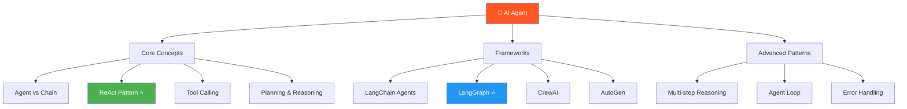
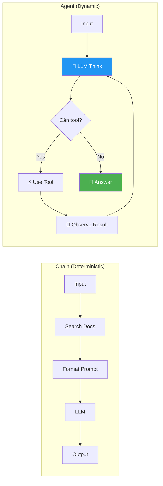
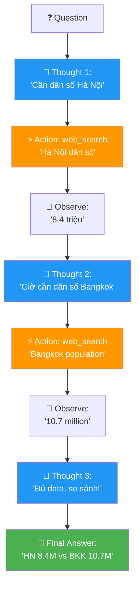
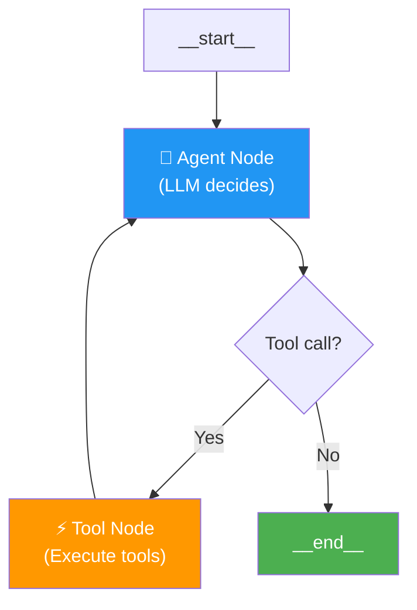
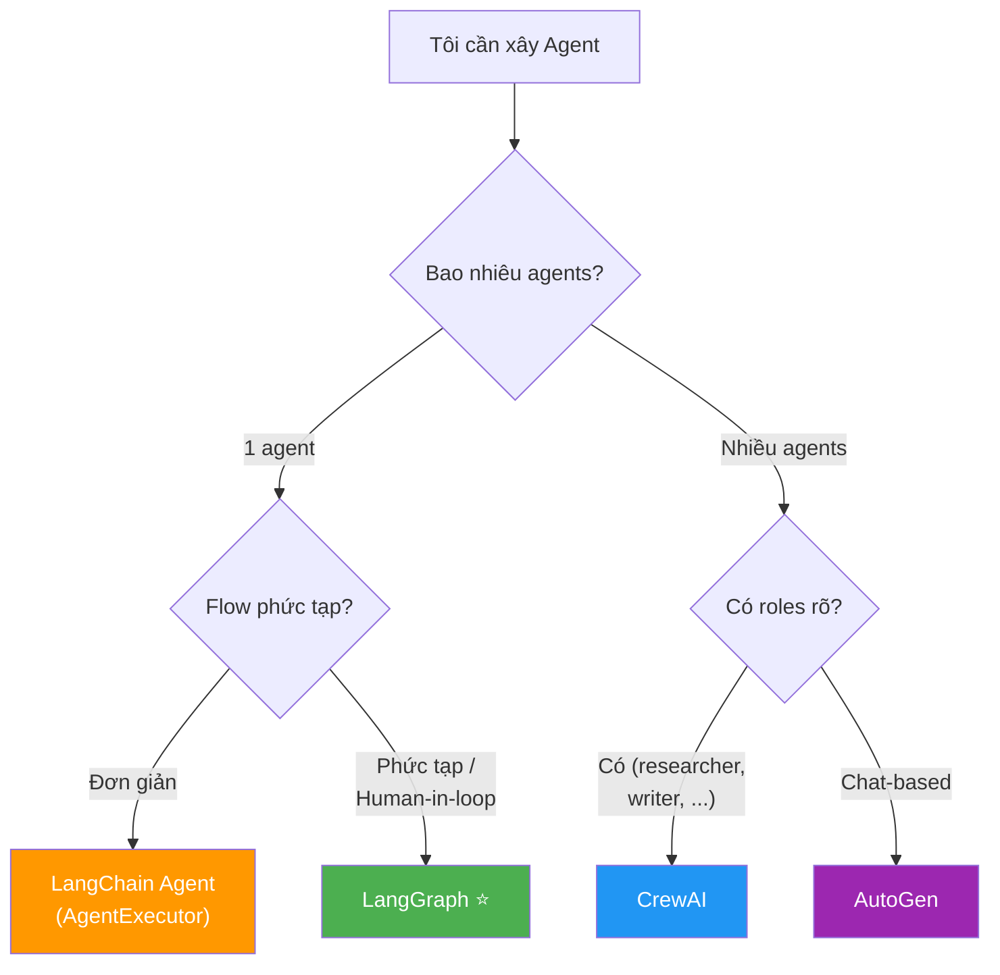

# 🤖 AI Agent Fundamentals — Phase 4, Tuần 1-2

> 📅 Thuộc Phase 4: AI Agents — Xu hướng HOT nhất 2024-2025!
> 📖 Tiếp nối [LlamaIndex Deep Dive — Phase 3.3, Tuần 3-4](./LlamaIndex%20Deep%20Dive%20-%20Phase%203.3%20Tuần%203-4.md)
> 🎯 Mục tiêu: Hiểu Agent là gì, xây Agent với LangChain/LangGraph/CrewAI, và biết khi nào dùng Agent vs Chain

---

## 🗺️ Mental Map — Agent = LLM có "tay chân"



```
  Agent = LLM + TOOLS + LOOP

  LLM thuần:
    Input → LLM → Output       (1 lần, xong!)
    "Thời tiết HCM?" → "Tôi không biết, data tôi cũ rồi" 😢

  Chain:
    Input → Step1 → Step2 → Step3 → Output  (CỐ ĐỊNH, luôn cùng flow)

  Agent:
    Input → LLM suy nghĩ → "Cần search web!" → Search → 
    LLM đọc kết quả → "Đủ rồi!" → Output    (TỰ QUYẾT ĐỊNH!)

  → Agent = LLM có khả năng TỰ HÀNH ĐỘNG!
    Nó quyết định: dùng tool gì, khi nào dùng, khi nào dừng!
```

---

## 📖 Mục lục

1. [Luồng Suy Nghĩ — Tại sao cần Agent?](#1-luồng-suy-nghĩ--tại-sao-cần-agent)
2. [Agent vs Chain — Sự khác biệt CỐT LÕI](#2-agent-vs-chain--sự-khác-biệt-cốt-lõi)
3. [ReAct Pattern — Think → Act → Observe ⭐](#3-react-pattern--think--act--observe-)
4. [Tool Calling / Function Calling](#4-tool-calling--function-calling)
5. [Planning & Multi-step Reasoning](#5-planning--multi-step-reasoning)
6. [LangChain Agents — Agent đầu tiên](#6-langchain-agents--agent-đầu-tiên)
7. [LangGraph — Agent phức tạp với State Machine ⭐](#7-langgraph--agent-phức-tạp-với-state-machine-)
8. [CrewAI — Multi-Agent Collaboration](#8-crewai--multi-agent-collaboration)
9. [AutoGen — Microsoft's Multi-Agent](#9-autogen--microsofts-multi-agent)
10. [So sánh Frameworks & Khi nào dùng gì](#10-so-sánh-frameworks--khi-nào-dùng-gì)

---

# 1. Luồng Suy Nghĩ — Tại sao cần Agent?

### Bước 1: Chain KHÔNG ĐỦ khi nào?

```
  🔍 5 Whys: Tại sao cần Agent?

  Q1: Chain đã giải quyết vấn đề, sao cần Agent?
  A1: Chain = CỨNG NHẮC! Luôn chạy CÙNG flow bất kể input!
      "Thời tiết HCM?" → chain vẫn search docs → sai!
      "2 + 2 = ?" → chain vẫn search docs → lãng phí!

  Q2: Vậy Agent khác gì?
  A2: Agent = LINH HOẠT! LLM TỰ QUYẾT ĐỊNH flow!
      "Thời tiết?" → Agent chọn: search web tool
      "2 + 2?" → Agent chọn: calculator tool
      "Chào!" → Agent chọn: trả lời trực tiếp (không cần tool!)

  Q3: LLM làm sao "quyết định"?
  A3: Dùng ReAct pattern: Think → Act → Observe → repeat!
      LLM "suy nghĩ" bằng text → chọn tool → đọc kết quả → suy nghĩ tiếp

  Q4: Có rủi ro gì không?
  A4: CÓ! Agent có thể:
      → Loop vô hạn (không biết dừng!)
      → Chọn SAI tool
      → Hành động NGUY HIỂM (delete files!)
      → Tốn TIỀN (gọi LLM nhiều lần!)

  Q5: Vậy dùng Agent hay Chain?
  A5: PHẦN LỚN dùng Chain! Agent chỉ khi:
      → Input KHÔNG dự đoán được flow
      → Cần NHIỀU tools, tùy tình huống
      → Cần multi-step reasoning

  ⭐ QUY TẮC: "Chain khi CÓ THỂ, Agent khi CẦN THIẾT!"
```

---

# 2. Agent vs Chain — Sự khác biệt CỐT LÕI

```
  ┌────────────────────────────────────────────────────────────────┐
  │                     CHAIN                    AGENT             │
  ├────────────────────────────────────────────────────────────────┤
  │  Flow:              CỐ ĐỊNH                 LINH HOẠT         │
  │  Ai quyết định:     Developer               LLM               │
  │  Số bước:           Biết trước               Không biết trước  │
  │  Predictable:       ✅ Luôn giống nhau       ❌ Có thể khác    │
  │  Debug:             ✅ Dễ                    ❌ Khó hơn         │
  │  Chi phí:           💚 Cố định               🔴 Biến đổi       │
  │  Phù hợp:          80% use cases            20% use cases     │
  └────────────────────────────────────────────────────────────────┘
```



### Trace so sánh: Cùng câu hỏi, khác xử lý

```
  Input: "Tìm giá Bitcoin hiện tại, rồi tính nếu mua 0.5 BTC thì bao nhiêu USD?"

  ═══ CHAIN approach (developer phải code flow!) ═══
    Step 1: Always search web → "Bitcoin $67,000"
    Step 2: Always calculate → 0.5 × 67000 = $33,500
    Step 3: Always format → "0.5 BTC = $33,500"
    → HOẠT ĐỘNG! Nhưng developer phải BIẾT TRƯỚC cần search + calculate
    → Nếu user hỏi "Xin chào?" → chain vẫn search web → LÃNG PHÍ!

  ═══ AGENT approach (LLM tự quyết!) ═══
    Think: "Cần biết giá Bitcoin → dùng web_search tool"
    Act: web_search("Bitcoin price") → "$67,000"
    Observe: "Bitcoin = $67,000"
    Think: "Cần tính 0.5 × 67000 → dùng calculator tool"
    Act: calculator("0.5 * 67000") → "33500"
    Observe: "33500"
    Think: "Đủ info rồi → trả lời!"
    Answer: "0.5 BTC hiện tại = $33,500 USD"
    → LINH HOẠT! Nếu hỏi "Xin chào?" → Agent trả lời trực tiếp!
```

---

# 3. ReAct Pattern — Think → Act → Observe ⭐

> ⭐ **ReAct = Reasoning + Acting — Pattern CỐT LÕI của mọi Agent!**

### ReAct là gì?

```
  ReAct = "Suy nghĩ rồi hành động, quan sát, rồi suy nghĩ tiếp"

  Loop:
    1. THINK (Thought):  LLM suy nghĩ: "Tôi cần làm gì?"
    2. ACT (Action):     LLM chọn tool + input
    3. OBSERVE:          Đọc kết quả từ tool
    4. Repeat cho đến khi có đủ info → FINAL ANSWER

  Paper gốc: "ReAct: Synergizing Reasoning and Acting in Language Models"
             (Yao et al., 2022)
```

### Trace CHI TIẾT: ReAct Loop

```
  Question: "Thủ đô Việt Nam có bao nhiêu dân? So sánh với thủ đô Thái Lan."

  ═══ Iteration 1 ═══
  THOUGHT: Cần biết dân số thủ đô Việt Nam. Thủ đô VN = Hà Nội.
           Dùng web_search.
  ACTION:  web_search("Hà Nội dân số 2024")
  OBSERVE: "Hà Nội có khoảng 8.4 triệu dân (2024)"

  ═══ Iteration 2 ═══
  THOUGHT: Đã biết Hà Nội 8.4 triệu. Giờ cần dân số thủ đô Thái Lan.
           Thủ đô Thái = Bangkok. Dùng web_search.
  ACTION:  web_search("Bangkok population 2024")
  OBSERVE: "Bangkok: 10.7 million (metropolitan: 17.1 million)"

  ═══ Iteration 3 ═══
  THOUGHT: Đã có đủ data:
           - Hà Nội: 8.4 triệu
           - Bangkok: 10.7 triệu
           Có thể so sánh rồi. Không cần tool nữa.
  FINAL ANSWER: "Hà Nội có ~8.4 triệu dân, Bangkok có ~10.7 triệu dân.
                 Bangkok đông hơn Hà Nội khoảng 27%."

  Total: 3 iterations, 2 tool calls, 3 LLM calls
```



---

# 4. Tool Calling / Function Calling

> 🧱 **Tool = "tay chân" của Agent. Không có tool = Agent chỉ nói, không làm!**

### Tool Calling hoạt động thế nào?

```
  1. Developer ĐĂNG KÝ tools (tên, mô tả, parameters)
  2. LLM NHẬN danh sách tools
  3. LLM CHỌN tool + tạo arguments (JSON)
  4. Code THỰC THI tool với arguments
  5. Kết quả trả VỀ cho LLM
  6. LLM suy nghĩ tiếp hoặc trả lời

  ⚠️ LLM KHÔNG chạy tool! LLM chỉ OUTPUT tên tool + arguments!
     CODE của bạn mới THỰC SỰ chạy tool!

  Ví dụ:
    LLM output: {"tool": "search", "args": {"query": "Bitcoin price"}}
    Code chạy: search("Bitcoin price") → "Bitcoin: $67,000"
    Code gửi kết quả lại cho LLM
```

```python
# ═══ Tool Calling với OpenAI API (low-level) ═══

from openai import OpenAI
import json

client = OpenAI()

# 1. Định nghĩa tools
tools = [
    {
        "type": "function",
        "function": {
            "name": "get_weather",
            "description": "Lấy thời tiết theo thành phố",
            "parameters": {
                "type": "object",
                "properties": {
                    "city": {"type": "string", "description": "Tên thành phố"}
                },
                "required": ["city"],
            },
        },
    },
    {
        "type": "function",
        "function": {
            "name": "calculate",
            "description": "Tính toán biểu thức toán học",
            "parameters": {
                "type": "object",
                "properties": {
                    "expression": {"type": "string", "description": "Biểu thức (e.g., '2+3*4')"}
                },
                "required": ["expression"],
            },
        },
    },
]

# 2. Gọi LLM với tools
response = client.chat.completions.create(
    model="gpt-4o",
    messages=[{"role": "user", "content": "Thời tiết HCM thế nào?"}],
    tools=tools,
    tool_choice="auto",   # LLM tự chọn tool!
)

# 3. LLM trả về: tool call (KHÔNG trả answer!)
tool_call = response.choices[0].message.tool_calls[0]
print(f"Tool: {tool_call.function.name}")
print(f"Args: {tool_call.function.arguments}")
# Tool: get_weather
# Args: {"city": "Ho Chi Minh City"}

# 4. Code THỰC THI tool (developer viết!)
def get_weather(city):
    return f"{city}: 32°C, nắng"

result = get_weather(**json.loads(tool_call.function.arguments))

# 5. Gửi kết quả lại cho LLM
messages = [
    {"role": "user", "content": "Thời tiết HCM thế nào?"},
    response.choices[0].message,   # Tool call message
    {"role": "tool", "content": result, "tool_call_id": tool_call.id},
]

final = client.chat.completions.create(model="gpt-4o", messages=messages)
print(final.choices[0].message.content)
# "HCM hiện tại 32°C, trời nắng."
```

```
  💡 Tool description = HƯỚNG DẪN cho LLM!

  Description TỐT:
    "Lấy thời tiết HIỆN TẠI theo tên thành phố.
     Dùng khi user hỏi về thời tiết, nhiệt độ, mưa nắng."
    → LLM BIẾT khi nào dùng!

  Description TỆ:
    "Weather function"
    → LLM KHÔNG CHẮC khi nào dùng → chọn SAI tool!

  ⭐ Viết tool description như viết HƯỚNG DẪN cho NGƯỜI MỚI!
```

---

# 5. Planning & Multi-step Reasoning

### LLM lên kế hoạch thế nào?

```
  Planning = LLM "lên kế hoạch" TRƯỚC KHI hành động

  Comparison:
    ReAct: Think → Act → Think → Act → ... (suy nghĩ TỪNG BƯỚC)
    Plan-and-Execute: Plan → Execute step 1 → step 2 → ... (LÊN KẾ HOẠCH TRƯỚC!)

  Plan-and-Execute trace:
    Question: "Tìm 3 nhà hàng ngon ở HCM, check review, bảng so sánh"

    ═══ PLAN PHASE ═══
    Plan:
      1. Search "best restaurants HCM 2024"
      2. Với mỗi nhà hàng: search review
      3. Tổng hợp thành bảng so sánh

    ═══ EXECUTE PHASE ═══
    Step 1: web_search(...) → [NH1, NH2, NH3]
    Step 2a: web_search("NH1 review") → 4.5⭐
    Step 2b: web_search("NH2 review") → 4.2⭐
    Step 2c: web_search("NH3 review") → 4.8⭐
    Step 3: Format table → Final Answer!
```

```
  📐 ReAct vs Plan-and-Execute

  ┌──────────────────┬─────────────────────┬─────────────────────┐
  │                  │ ReAct               │ Plan-and-Execute    │
  ├──────────────────┼─────────────────────┼─────────────────────┤
  │ Phong cách       │ Suy nghĩ từng bước  │ Lên kế hoạch trước  │
  │ Linh hoạt        │ ⭐⭐⭐⭐⭐          │ ⭐⭐⭐              │
  │ Hiệu quả        │ ⭐⭐⭐              │ ⭐⭐⭐⭐⭐          │
  │ LLM calls        │ Nhiều (mỗi step)    │ Ít hơn              │
  │ Error recovery   │ Tốt (adapt realtime)│ Kém (re-plan!)      │
  │ Complex tasks    │ Kém                 │ Tốt ⭐              │
  │ Simple tasks     │ Tốt ⭐              │ Overkill            │
  └──────────────────┴─────────────────────┴─────────────────────┘
```

---

# 6. LangChain Agents — Agent đầu tiên

```python
from langchain_openai import ChatOpenAI
from langchain.agents import create_tool_calling_agent, AgentExecutor
from langchain_core.prompts import ChatPromptTemplate, MessagesPlaceholder
from langchain_core.tools import tool
from langchain_community.tools import DuckDuckGoSearchRun

# ═══ 1. Tools ═══
search = DuckDuckGoSearchRun()

@tool
def calculator(expression: str) -> str:
    """Tính toán biểu thức toán học. Ví dụ: '2 + 3 * 4'"""
    try:
        return str(eval(expression))
    except Exception as e:
        return f"Lỗi: {e}"

@tool
def get_current_time() -> str:
    """Lấy thời gian hiện tại."""
    from datetime import datetime
    return datetime.now().strftime("%Y-%m-%d %H:%M:%S")

tools = [search, calculator, get_current_time]

# ═══ 2. Prompt ═══
prompt = ChatPromptTemplate.from_messages([
    ("system", """Bạn là trợ lý AI thông minh.
Suy nghĩ kỹ trước khi dùng tool. Giải thích reasoning."""),
    MessagesPlaceholder("chat_history", optional=True),
    ("human", "{input}"),
    MessagesPlaceholder("agent_scratchpad"),
])

# ═══ 3. Agent + Executor ═══
llm = ChatOpenAI(model="gpt-4o", temperature=0)
agent = create_tool_calling_agent(llm, tools, prompt)

executor = AgentExecutor(
    agent=agent,
    tools=tools,
    verbose=True,        # Xem agent "suy nghĩ"!
    max_iterations=10,   # Giới hạn loop!
    handle_parsing_errors=True,  # Tự xử lý lỗi parse
)

# ═══ 4. Chạy! ═══
result = executor.invoke({
    "input": "Bây giờ là mấy giờ? Nếu thêm 3.5 tiếng nữa là mấy giờ?"
})
# Agent:
#   Think: Cần biết giờ hiện tại → get_current_time
#   Act: get_current_time() → "2024-03-24 10:30:00"
#   Think: 10:30 + 3.5h = 14:00 → dùng calculator
#   Act: calculator("10.5 + 3.5") → "14.0"
#   Answer: "Hiện tại 10:30, thêm 3.5 tiếng = 14:00"
```

---

# 7. LangGraph — Agent phức tạp với State Machine ⭐

> ⭐ **LangGraph = "Agent dưới dạng GRAPH" — kiểm soát flow tốt hơn!**

### Tại sao cần LangGraph?

```
  Vấn đề với AgentExecutor:
    → Agent loop là BLACK BOX! Khó control.
    → Muốn: "Nếu search fail → fallback" → KHÓ!
    → Muốn: "Human approval trước khi delete" → KHÓ!
    → Muốn: nhiều agents phối hợp → KHÔNG HỖ TRỢ!

  LangGraph giải quyết:
    → Agent = GRAPH (nodes + edges)
    → Mỗi node = 1 bước (function)
    → Edges = điều kiện chuyển tiếp
    → State = data chia sẻ giữa nodes
    → HOÀN TOÀN kiểm soát flow!

  LangGraph = "LangChain Agent 2.0"
```



### Code: LangGraph Agent

```python
from langgraph.graph import StateGraph, MessagesState, START, END
from langgraph.prebuilt import ToolNode, tools_condition
from langchain_openai import ChatOpenAI
from langchain_core.tools import tool

# ═══ 1. Tools ═══
@tool
def search_web(query: str) -> str:
    """Search the web for information."""
    return f"Search results for '{query}': ..."

@tool
def calculate(expression: str) -> str:
    """Calculate a math expression."""
    return str(eval(expression))

tools = [search_web, calculate]

# ═══ 2. LLM with tools ═══
llm = ChatOpenAI(model="gpt-4o", temperature=0)
llm_with_tools = llm.bind_tools(tools)

# ═══ 3. Agent node function ═══
def agent_node(state: MessagesState):
    """LLM suy nghĩ và quyết định"""
    response = llm_with_tools.invoke(state["messages"])
    return {"messages": [response]}

# ═══ 4. Build Graph ═══
graph = StateGraph(MessagesState)

# Add nodes
graph.add_node("agent", agent_node)
graph.add_node("tools", ToolNode(tools))

# Add edges
graph.add_edge(START, "agent")           # Start → Agent
graph.add_conditional_edges(             # Agent → Tools hoặc End
    "agent",
    tools_condition,                      # Tự check: có tool call không?
)
graph.add_edge("tools", "agent")         # Tools → Agent (loop lại!)

# Compile!
agent = graph.compile()

# ═══ 5. Chạy! ═══
result = agent.invoke({
    "messages": [("user", "Tìm giá Bitcoin rồi tính mua 0.5 BTC bao nhiêu?")]
})
print(result["messages"][-1].content)
```

### LangGraph: Human-in-the-Loop

```python
from langgraph.checkpoint.memory import MemorySaver

# ═══ Agent CẦN XÁC NHẬN trước khi hành động nguy hiểm ═══

@tool
def delete_file(filename: str) -> str:
    """Xóa file. CẨN THẬN! Không khôi phục được."""
    import os
    os.remove(filename)
    return f"Đã xóa {filename}"

# Thêm interrupt (dừng trước tools node!)
graph = StateGraph(MessagesState)
graph.add_node("agent", agent_node)
graph.add_node("tools", ToolNode([search_web, delete_file]))
graph.add_edge(START, "agent")
graph.add_conditional_edges("agent", tools_condition)
graph.add_edge("tools", "agent")

agent = graph.compile(
    checkpointer=MemorySaver(),
    interrupt_before=["tools"],   # ← DỪNG trước khi chạy tool!
)

# Chạy — sẽ DỪNG trước tool execution!
config = {"configurable": {"thread_id": "1"}}
result = agent.invoke(
    {"messages": [("user", "Xóa file temp.txt")]},
    config=config,
)

# Agent dừng, chờ xác nhận!
print("Agent muốn chạy:", result)  # → delete_file("temp.txt")
# Developer/User duyệt → continue
# agent.invoke(None, config=config)   # Tiếp tục execution
```

---

# 8. CrewAI — Multi-Agent Collaboration

> 🧱 **CrewAI = Nhiều Agent phối hợp như 1 TEAM**

```
  Ý tưởng: Thay vì 1 agent làm TẤT CẢ → chia thành TEAM!

  Researcher Agent: tìm thông tin
  Writer Agent: viết nội dung
  Reviewer Agent: kiểm tra chất lượng

  → Mỗi agent CHUYÊN 1 việc → output tốt hơn!
```

```python
# pip install crewai crewai-tools

from crewai import Agent, Task, Crew, Process
from crewai_tools import SerperDevTool

search_tool = SerperDevTool()

# ═══ 1. Agents ═══
researcher = Agent(
    role="Research Specialist",
    goal="Tìm thông tin chính xác và cập nhật nhất",
    backstory="Bạn là chuyên gia research 10 năm kinh nghiệm.",
    tools=[search_tool],
    llm="gpt-4o",
    verbose=True,
)

writer = Agent(
    role="Content Writer",
    goal="Viết báo cáo chuyên nghiệp từ research data",
    backstory="Bạn là nhà báo kinh tế, viết rõ ràng và có structure.",
    llm="gpt-4o",
    verbose=True,
)

reviewer = Agent(
    role="Quality Reviewer",
    goal="Review và cải thiện nội dung, check facts",
    backstory="Bạn là editor chuyên kiểm tra sự chính xác.",
    llm="gpt-4o",
    verbose=True,
)

# ═══ 2. Tasks ═══
research_task = Task(
    description="Research xu hướng AI 2025: 5 trends chính, số liệu cụ thể.",
    expected_output="Báo cáo research với 5 trends, mỗi trend có data.",
    agent=researcher,
)

write_task = Task(
    description="Viết bài blog 1000 từ từ research data.",
    expected_output="Blog post Markdown, có heading, bullet points.",
    agent=writer,
)

review_task = Task(
    description="Review bài blog: check facts, improve style, fix errors.",
    expected_output="Bài blog đã được review và cải thiện.",
    agent=reviewer,
)

# ═══ 3. Crew = Team! ═══
crew = Crew(
    agents=[researcher, writer, reviewer],
    tasks=[research_task, write_task, review_task],
    process=Process.sequential,   # Task 1 → 2 → 3
    verbose=True,
)

# ═══ 4. Kickoff! ═══
result = crew.kickoff()
print(result)
# → Researcher tìm data → Writer viết blog → Reviewer review!
```

---

# 9. AutoGen — Microsoft's Multi-Agent

```
  AutoGen = Microsoft's framework cho multi-agent CONVERSATIONS

  Khác CrewAI:
    CrewAI: agents có ROLES + TASKS cụ thể
    AutoGen: agents "NÓI CHUYỆN" với nhau → giải quyết vấn đề

  Core concepts:
    → ConversableAgent: agent có thể chat
    → AssistantAgent: LLM-powered
    → UserProxyAgent: đại diện cho user (có thể auto-approve)
    → GroupChat: nhiều agents chat với nhau
```

```python
# pip install autogen-agentchat

from autogen import ConversableAgent, AssistantAgent, UserProxyAgent

# ═══ 2-agent conversation ═══

# Agent 1: LLM Assistant
assistant = AssistantAgent(
    name="AI_Assistant",
    llm_config={"model": "gpt-4o", "temperature": 0},
    system_message="Bạn là senior developer. Viết code Python clean.",
)

# Agent 2: User Proxy (chạy code, approve actions)
user_proxy = UserProxyAgent(
    name="User",
    human_input_mode="NEVER",      # Tự approve (hoặc "ALWAYS" để hỏi user)
    code_execution_config={"work_dir": "output"},
    max_consecutive_auto_reply=5,
)

# Chat!
user_proxy.initiate_chat(
    assistant,
    message="Viết script Python crawl top 10 trending repos trên GitHub",
)
# → Assistant viết code → User_proxy CHẠY code → kiểm tra output
# → Nếu lỗi → gửi error lại → Assistant fix → chạy lại!
```

---

# 10. So sánh Frameworks & Khi nào dùng gì

```
  ┌─────────────────┬──────────────┬───────────────┬────────────────┐
  │ Framework       │ Best for     │ Complexity    │ Production     │
  ├─────────────────┼──────────────┼───────────────┼────────────────┤
  │ LangChain Agent │ Simple agent │ ⭐ Thấp       │ ✅ Tốt         │
  │                 │ (1-3 tools)  │               │                │
  ├─────────────────┼──────────────┼───────────────┼────────────────┤
  │ LangGraph ⭐     │ Complex flow │ ⭐⭐ Trung bình│ ✅✅ Rất tốt   │
  │                 │ Human-in-loop│               │                │
  │                 │ State mgmt   │               │                │
  ├─────────────────┼──────────────┼───────────────┼────────────────┤
  │ CrewAI          │ Multi-agent  │ ⭐⭐ Trung bình│ ✅ Tốt         │
  │                 │ Team tasks   │               │                │
  ├─────────────────┼──────────────┼───────────────┼────────────────┤
  │ AutoGen         │ Agent chat   │ ⭐⭐⭐ Cao     │ ⚠️ Mới         │
  │                 │ Code exec    │               │                │
  └─────────────────┴──────────────┴───────────────┴────────────────┘

  📌 Khuyến nghị:
    Bắt đầu: LangChain Agent (đơn giản nhất!)
    Production: LangGraph (kiểm soát tốt nhất!)
    Multi-agent: CrewAI (dễ setup, roles rõ ràng!)
    Experimental: AutoGen (code execution, chat-based)
```



---

## 📐 Tổng kết — Checklist Phase 4.1

```
  ┌────────────────────────────────────────────────────────────┐
  │  AI Agent Fundamentals Checklist:                          │
  │                                                            │
  │  Tuần 1 — Concepts:                                        │
  │  □ Agent vs Chain — khi nào Agent, khi nào Chain          │
  │  □ ReAct pattern — Think → Act → Observe loop            │
  │  □ Tool Calling — LLM chọn tool, code chạy tool          │
  │  □ Planning — ReAct vs Plan-and-Execute                   │
  │  □ Multi-step reasoning — agent giải bài nhiều bước      │
  │                                                            │
  │  Tuần 2 — Frameworks:                                      │
  │  □ LangChain Agent — create_tool_calling_agent            │
  │  □ Custom @tool — tạo tool riêng, viết docstring tốt     │
  │  □ LangGraph ⭐ — StateGraph, nodes, edges, compile       │
  │  □ LangGraph Human-in-loop — interrupt_before             │
  │  □ CrewAI — Agent, Task, Crew, Process                    │
  │  □ AutoGen — ConversableAgent, chat-based                 │
  │                                                            │
  │  Practice:                                                 │
  │  □ Xây agent với 3+ custom tools                          │
  │  □ Xây LangGraph agent với human approval                │
  │  □ Xây CrewAI team (researcher + writer + reviewer)      │
  └────────────────────────────────────────────────────────────┘
```

---

## 📚 Tài liệu đọc thêm

```
  📖 Papers:
    "ReAct: Synergizing Reasoning and Acting" — Yao et al. (2022)
    "Toolformer" — Schick et al. (2023)
    "Plan-and-Solve Prompting" — Wang et al. (2023)

  📖 Docs:
    python.langchain.com/docs/how_to/#agents — LangChain agents
    langchain-ai.github.io/langgraph/ — LangGraph docs
    docs.crewai.com — CrewAI docs
    microsoft.github.io/autogen/ — AutoGen docs

  🎥 Video:
    "Functions, Tools and Agents with LangChain" — DeepLearning.AI
    "AI Agents in LangGraph" — DeepLearning.AI (Harrison Chase!)
    "AI Agents Fundamentals" — Frontend Masters (Scott Moss)
    "CrewAI Crash Course" — Matt Williams YouTube

  🏋️ Thực hành:
    1. Xây LangChain agent: search + calculator + datetime
    2. Chuyển sang LangGraph: thêm human-in-loop
    3. Xây CrewAI crew: 3 agents research + write + review
    4. So sánh: cùng task, chạy trên 4 frameworks → so sánh output
```
