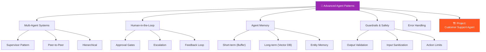
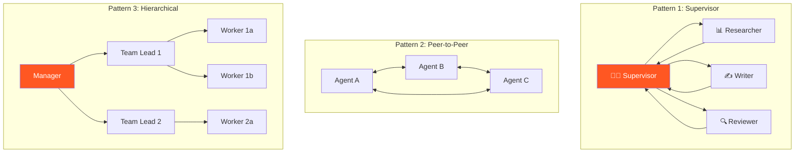
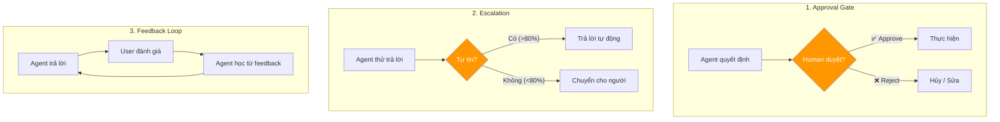
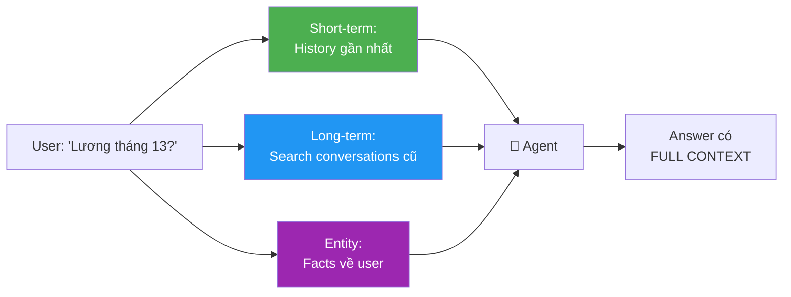
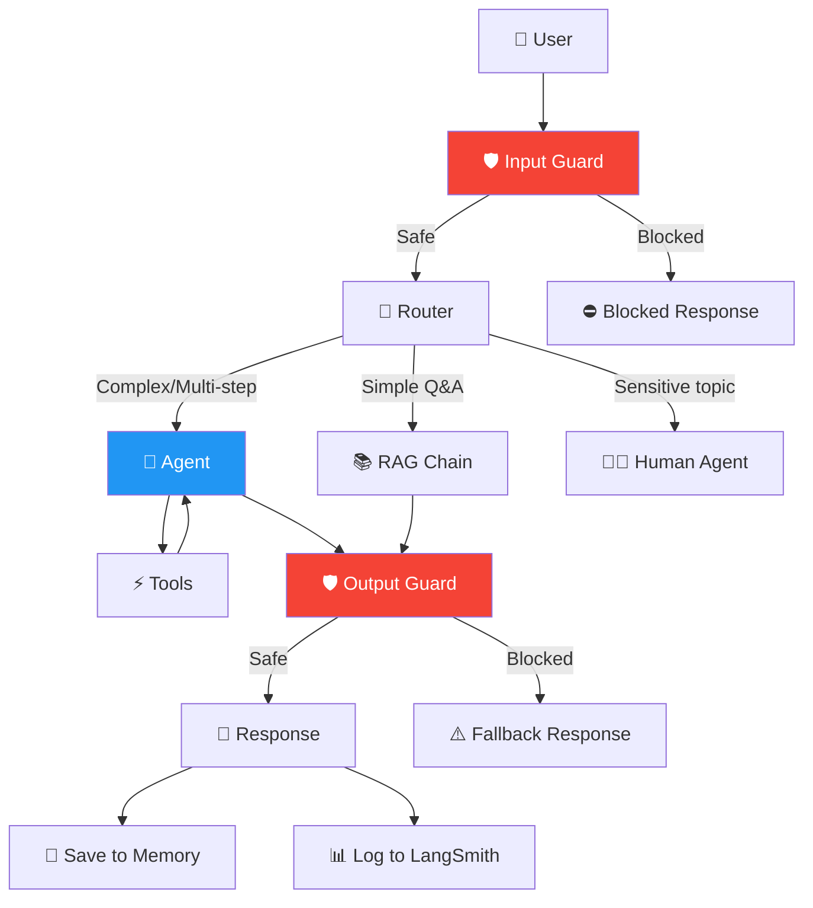
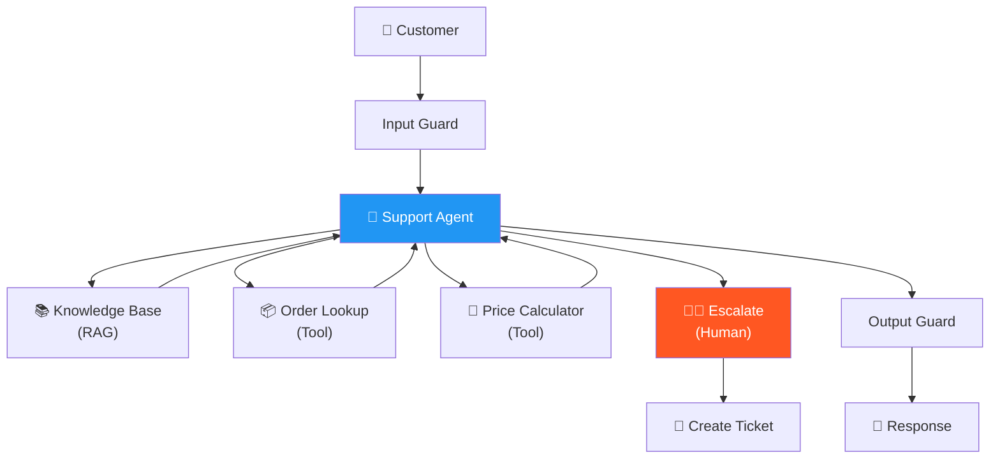

# 🧩 Advanced Agent Patterns — Phase 4.2, Tuần 3-4

> 📅 Thuộc Phase 4: AI Agents — Từ Agent đơn lẻ đến Hệ thống Agent Production
> 📖 Tiếp nối [AI Agent Fundamentals — Phase 4.1, Tuần 1-2](./AI%20Agent%20Fundamentals%20-%20Phase%204.1%20Tuần%201-2.md)
> 🎯 Mục tiêu: Master advanced patterns để xây agent AN TOÀN, ĐÁN TIN CẬY cho production

---

## 🗺️ Mental Map — Từ Toy Agent → Production Agent



```
  TẠI SAO CẦN ADVANCED PATTERNS?

  Agent cơ bản (Phase 4.1):
    → HOẠT ĐỘNG cho demo, prototype ✅
    → THẤT BẠI cho production ❌

  Vấn đề production:
  ┌────────────────────────────────────────────────────────────┐
  │  ❌ Agent loop vô hạn           → Error handling           │
  │  ❌ Agent hành động nguy hiểm   → Guardrails              │
  │  ❌ Agent quên context cũ       → Long-term memory         │
  │  ❌ 1 agent làm mọi thứ kém     → Multi-agent systems     │
  │  ❌ Agent tự ý quyết định lớn   → Human-in-the-loop       │
  │  ❌ Output bậy bạ, không format → Output validation       │
  └────────────────────────────────────────────────────────────┘

  → Advanced Patterns = giải quyết từng vấn đề cụ thể!
```

---

## 📖 Mục lục

1. [Multi-Agent Systems — Nhiều agent phối hợp](#1-multi-agent-systems--nhiều-agent-phối-hợp)
2. [Human-in-the-Loop — Agent hỏi người khi cần](#2-human-in-the-loop--agent-hỏi-người-khi-cần)
3. [Agent Memory — Nhớ ngắn hạn & dài hạn](#3-agent-memory--nhớ-ngắn-hạn--dài-hạn)
4. [Guardrails — Kiểm soát & An toàn](#4-guardrails--kiểm-soát--an-toàn)
5. [Error Handling & Retry Logic](#5-error-handling--retry-logic)
6. [Agent Evaluation — Đo lường chất lượng Agent](#6-agent-evaluation--đo-lường-chất-lượng-agent)
7. [Production Architecture Patterns](#7-production-architecture-patterns)
8. [🏗️ Project: Customer Support Agent](#8-️-project-customer-support-agent)

---

# 1. Multi-Agent Systems — Nhiều agent phối hợp

> 🧱 **1 agent làm mọi thứ = lỗi nhiều. Chia team = mỗi agent chuyên 1 việc!**

### 3 Patterns chính

```
  ┌─────────────────────────────────────────────────────────────────┐
  │                                                                 │
  │  Pattern 1: SUPERVISOR (ông sếp điều phối)                     │
  │    Supervisor → Agent A → kết quả                               │
  │    Supervisor → Agent B → kết quả                               │
  │    Supervisor → tổng hợp → output                               │
  │    → Supervisor QUYẾT ĐỊNH ai làm gì!                          │
  │                                                                 │
  │  Pattern 2: PEER-TO-PEER (ngang hàng, tự nói chuyện)          │
  │    Agent A ← nói → Agent B ← nói → Agent C                    │
  │    → Agents TỰ phối hợp, không có sếp!                        │
  │                                                                 │
  │  Pattern 3: HIERARCHICAL (phân cấp, nhiều tầng)                │
  │    Manager → Team Lead A → Worker A1, A2                       │
  │            → Team Lead B → Worker B1, B2                       │
  │    → Cho hệ thống LỚN, nhiều domain!                          │
  │                                                                 │
  └─────────────────────────────────────────────────────────────────┘
```



### Code: Supervisor Pattern với LangGraph

```python
from langgraph.graph import StateGraph, MessagesState, START, END
from langchain_openai import ChatOpenAI
from langchain_core.messages import HumanMessage, SystemMessage
from typing import Literal
import json

llm = ChatOpenAI(model="gpt-4o", temperature=0)

# ═══ Worker Agents ═══
def researcher_node(state: MessagesState):
    """Agent chuyên research"""
    sys = SystemMessage(content="Bạn là researcher. Tìm FACTS và DATA.")
    response = llm.invoke([sys] + state["messages"])
    return {"messages": [response]}

def writer_node(state: MessagesState):
    """Agent chuyên viết"""
    sys = SystemMessage(content="Bạn là writer. Viết nội dung rõ ràng, có structure.")
    response = llm.invoke([sys] + state["messages"])
    return {"messages": [response]}

# ═══ Supervisor: quyết định giao việc ai ═══
def supervisor_node(state: MessagesState):
    """Supervisor quyết định next step"""
    sys = SystemMessage(content="""Bạn là supervisor. Dựa trên conversation:
- Nếu CẦN tìm thêm info → trả về {"next": "researcher"}
- Nếu CẦN viết/chỉnh sửa → trả về {"next": "writer"}
- Nếu ĐÃ XONG → trả về {"next": "FINISH"}
Chỉ trả về JSON, không giải thích.""")
    
    response = llm.invoke([sys] + state["messages"])
    return {"messages": [response]}

def route_supervisor(state: MessagesState) -> Literal["researcher", "writer", "__end__"]:
    """Parse supervisor decision"""
    last = state["messages"][-1].content
    try:
        decision = json.loads(last)
        if decision["next"] == "FINISH":
            return "__end__"
        return decision["next"]
    except:
        return "__end__"

# ═══ Build Graph ═══
graph = StateGraph(MessagesState)
graph.add_node("supervisor", supervisor_node)
graph.add_node("researcher", researcher_node)
graph.add_node("writer", writer_node)

graph.add_edge(START, "supervisor")
graph.add_conditional_edges("supervisor", route_supervisor)
graph.add_edge("researcher", "supervisor")  # Researcher done → back to supervisor
graph.add_edge("writer", "supervisor")      # Writer done → back to supervisor

agent = graph.compile()

# Chạy!
result = agent.invoke({
    "messages": [HumanMessage("Viết báo cáo về xu hướng AI 2025")]
})
# Supervisor → "researcher" → research results → Supervisor → "writer" → blog → Supervisor → "FINISH"
```

---

# 2. Human-in-the-Loop — Agent hỏi người khi cần

> 🧱 **Agent KHÔNG NÊN tự quyết định MỌI THỨ!**

### Khi nào cần Human-in-the-Loop?

```
  ┌─────────────────────────────────────────────────────────────┐
  │  LUÔN cần human approval cho:                               │
  │    → Xóa/sửa dữ liệu (delete files, update DB)           │
  │    → Gửi email/message cho người khác                       │
  │    → Thanh toán/chi tiền                                    │
  │    → Quyết định ảnh hưởng business                          │
  │                                                             │
  │  KHÔNG cần human cho:                                       │
  │    → Search thông tin (read-only, an toàn!)                │
  │    → Tính toán                                              │
  │    → Format output                                          │
  │                                                             │
  │  📌 Quy tắc: "READ = tự động, WRITE = phải duyệt!"       │
  └─────────────────────────────────────────────────────────────┘
```

### 3 Patterns Human-in-the-Loop



### Code: Escalation Pattern

```python
from langchain_core.tools import tool

# ═══ Agent tự đánh giá confidence → escalate nếu không chắc ═══

@tool
def escalate_to_human(reason: str, context: str) -> str:
    """Chuyển câu hỏi cho nhân viên hỗ trợ.
    Dùng khi: không tìm thấy thông tin, câu hỏi phức tạp, hoặc cần quyết định quan trọng.
    
    Args:
        reason: Lý do cần chuyển cho người
        context: Tóm tắt những gì đã trao đổi
    """
    # Trong production: gửi ticket, notification, hoặc queue
    return f"✅ Đã chuyển cho nhân viên. Reason: {reason}"

@tool 
def search_knowledge_base(query: str) -> str:
    """Tìm kiếm trong knowledge base nội bộ."""
    # RAG search...
    return "Kết quả search..."

# Agent prompt với escalation logic
escalation_prompt = """Bạn là AI customer support.

QUY TẮC:
1. Tìm trong knowledge base TRƯỚC
2. Nếu tìm thấy → trả lời tự tin
3. Nếu KHÔNG tìm thấy hoặc không chắc → escalate_to_human
4. Câu hỏi về: hoàn tiền, khiếu nại, hợp đồng → LUÔN escalate!
5. KHÔNG BAO GIỜ bịa thông tin!

Khi escalate, ghi rõ: lý do + context tóm tắt."""
```

---

# 3. Agent Memory — Nhớ ngắn hạn & dài hạn

> 🧱 **Agent cần NHỚ: user là ai, đã nói gì, preferences**

### 3 tầng Memory

```
  ┌─────────────────────────────────────────────────────────────────┐
  │                                                                 │
  │  TẦNG 1: Short-term Memory (Working Memory)                    │
  │    → Conversation history HIỆN TẠI                             │
  │    → Buffer hoặc Window (k messages gần nhất)                  │
  │    → Mất khi session kết thúc!                                 │
  │    → Ví dụ: "User vừa hỏi về nghỉ phép"                      │
  │                                                                 │
  │  TẦNG 2: Long-term Memory (Episodic Memory)                    │
  │    → Lưu conversations CŨ vào Vector DB                        │
  │    → Tìm lại khi cần: "User này đã từng hỏi gì?"             │
  │    → Persist across sessions!                                   │
  │    → Ví dụ: "Tháng trước user hỏi về lương"                   │
  │                                                                 │
  │  TẦNG 3: Entity Memory (Semantic Memory)                       │
  │    → Lưu FACTS về entities (user, products, ...)              │
  │    → Structured: {"user": "Jun", "role": "developer"}          │
  │    → Ví dụ: "User tên Jun, phòng IT, đã hỏi 5 lần"           │
  │                                                                 │
  └─────────────────────────────────────────────────────────────────┘
```



### Code: Long-term Memory với Vector DB

```python
from datetime import datetime
import chromadb
from openai import OpenAI

client = OpenAI()
chroma = chromadb.PersistentClient("./agent_memory")
memory_collection = chroma.get_or_create_collection("conversations")

class AgentMemory:
    """3-tầng memory cho Agent"""
    
    def __init__(self, user_id: str):
        self.user_id = user_id
        self.short_term = []          # Tầng 1: buffer
        self.entity_store = {}        # Tầng 3: facts
    
    # ═══ Tầng 1: Short-term ═══
    def add_message(self, role: str, content: str):
        self.short_term.append({"role": role, "content": content})
        # Giữ 20 messages gần nhất
        self.short_term = self.short_term[-20:]
    
    # ═══ Tầng 2: Long-term (save to Vector DB) ═══
    def save_to_long_term(self, conversation_summary: str):
        """Lưu tóm tắt conversation vào Vector DB"""
        vec = client.embeddings.create(
            model="text-embedding-3-small",
            input=[conversation_summary]
        ).data[0].embedding
        
        memory_collection.add(
            documents=[conversation_summary],
            embeddings=[vec],
            metadatas=[{
                "user_id": self.user_id,
                "timestamp": datetime.now().isoformat(),
            }],
            ids=[f"{self.user_id}_{datetime.now().timestamp()}"],
        )
    
    def recall_long_term(self, query: str, top_k: int = 3) -> list[str]:
        """Tìm conversations cũ LIÊN QUAN"""
        vec = client.embeddings.create(
            model="text-embedding-3-small", input=[query]
        ).data[0].embedding
        
        results = memory_collection.query(
            query_embeddings=[vec],
            n_results=top_k,
            where={"user_id": self.user_id},  # Chỉ lấy memory CỦA user này!
        )
        return results["documents"][0] if results["documents"] else []
    
    # ═══ Tầng 3: Entity Memory ═══
    def update_entity(self, entity: str, facts: dict):
        """Cập nhật facts về entity"""
        if entity not in self.entity_store:
            self.entity_store[entity] = {}
        self.entity_store[entity].update(facts)
    
    def get_entity(self, entity: str) -> dict:
        return self.entity_store.get(entity, {})

# Dùng:
memory = AgentMemory("user_123")
memory.add_message("user", "Nghỉ phép bao nhiêu ngày?")
memory.update_entity("user_123", {"name": "Jun", "department": "IT"})

# Recall: "User này đã từng hỏi gì về nghỉ phép?"
past = memory.recall_long_term("nghỉ phép")
```

---

# 4. Guardrails — Kiểm soát & An toàn

> 🛡️ **Agent KHÔNG kiểm soát = Agent NGUY HIỂM!**

### Tại sao cần Guardrails?

```
  Agent có thể:
    → BỊA thông tin (hallucination!)
    → Nói thô tục, bias, sai lệch
    → Thực hiện hành động NGUY HIỂM (xóa data!)
    → Tiết lộ thông tin NHẠY CẢM
    → Loop vô hạn → tốn $$$!
    → Bị prompt injection (user trick agent!)

  Guardrails = "RÀO CHẮN" — kiểm tra INPUT và OUTPUT!
```

### Code: Input & Output Guardrails

```python
from pydantic import BaseModel, Field
import re

# ═══ 1. Input Guardrails — Kiểm tra TRƯỚC KHI agent xử lý ═══

class InputGuardrail:
    """Kiểm tra và sanitize input"""
    
    BLOCKED_PATTERNS = [
        r"ignore.*previous.*instructions",    # Prompt injection!
        r"pretend.*you.*are",                  # Role hijacking!
        r"system\s*prompt",                    # System prompt extraction!
    ]
    
    def check(self, user_input: str) -> tuple[bool, str]:
        """Return (is_safe, reason)"""
        # Check prompt injection
        for pattern in self.BLOCKED_PATTERNS:
            if re.search(pattern, user_input, re.IGNORECASE):
                return False, f"Blocked: possible prompt injection"
        
        # Check length (tránh tốn tokens!)
        if len(user_input) > 5000:
            return False, "Input quá dài (max 5000 chars)"
        
        return True, "OK"


# ═══ 2. Output Guardrails — Kiểm tra SAU KHI agent trả lời ═══

class OutputGuardrail:
    """Kiểm tra output trước khi trả cho user"""
    
    SENSITIVE_PATTERNS = [
        r"\b\d{3}-\d{2}-\d{4}\b",    # SSN (xxx-xx-xxxx)
        r"\b\d{16}\b",               # Credit card number
        r"password\s*[:=]\s*\S+",     # Password leak!
    ]
    
    def check(self, output: str) -> tuple[bool, str]:
        for pattern in self.SENSITIVE_PATTERNS:
            if re.search(pattern, output, re.IGNORECASE):
                return False, "Output chứa thông tin nhạy cảm!"
        return True, "OK"


# ═══ 3. Action Guardrails — Giới hạn hành động ═══

class ActionGuardrail:
    """Kiểm soát tools agent được dùng"""
    
    DANGEROUS_TOOLS = ["delete_file", "send_email", "execute_sql"]
    MAX_TOOL_CALLS = 10          # Max tool calls per session
    MAX_COST_USD = 1.0           # Max cost per session
    
    def __init__(self):
        self.tool_call_count = 0
        self.total_cost = 0.0
    
    def can_use_tool(self, tool_name: str) -> tuple[bool, str]:
        self.tool_call_count += 1
        
        if self.tool_call_count > self.MAX_TOOL_CALLS:
            return False, f"Exceeded max tool calls ({self.MAX_TOOL_CALLS})"
        
        if tool_name in self.DANGEROUS_TOOLS:
            return False, f"Tool '{tool_name}' requires human approval!"
        
        return True, "OK"


# ═══ Kết hợp trong Agent pipeline ═══

input_guard = InputGuardrail()
output_guard = OutputGuardrail()
action_guard = ActionGuardrail()

def safe_agent_invoke(user_input: str) -> str:
    # 1. Check input
    safe, reason = input_guard.check(user_input)
    if not safe:
        return f"⛔ Input bị chặn: {reason}"
    
    # 2. Run agent (với action guardrails bên trong)
    result = agent.invoke({"input": user_input})
    
    # 3. Check output
    safe, reason = output_guard.check(result)
    if not safe:
        return "⚠️ Xin lỗi, tôi không thể chia sẻ thông tin này."
    
    return result
```

### NeMo Guardrails — Framework chuyên dụng

```python
# pip install nemoguardrails

# ═══ NeMo Guardrails: giải pháp ENTERPRISE ═══
# config.yml:
"""
models:
  - type: main
    engine: openai
    model: gpt-4o

rails:
  input:
    flows:
      - self check input        # Check prompt injection
  output:
    flows:
      - self check output       # Check hallucination
      - check blocked topics    # Chặn topics không phù hợp
"""

# → NeMo tự động kiểm tra input/output theo rules!
# → Dùng cho enterprise production
```

---

# 5. Error Handling & Retry Logic

### Các loại lỗi Agent gặp phải

```
  ┌──────────────────────┬────────────────┬──────────────────────────┐
  │ Lỗi                 │ Nguyên nhân     │ Cách xử lý               │
  ├──────────────────────┼────────────────┼──────────────────────────┤
  │ LLM API timeout     │ Network/overload│ Retry với backoff         │
  │ LLM API rate limit  │ Quá nhiều calls │ Rate limiter + queue      │
  │ Tool execution fail │ Tool bug/down   │ Fallback tool / skip      │
  │ Parse error         │ LLM output sai  │ Re-prompt / default       │
  │ Infinite loop       │ Agent confused  │ max_iterations limit      │
  │ Cost overrun        │ Quá nhiều calls │ Budget guardrail          │
  └──────────────────────┴────────────────┴──────────────────────────┘
```

### Code: Robust Agent với Error Handling

```python
from langchain_openai import ChatOpenAI
from langchain_anthropic import ChatAnthropic
import time

# ═══ 1. Fallback: GPT fail → Claude ═══
primary_llm = ChatOpenAI(model="gpt-4o", request_timeout=30)
fallback_llm = ChatAnthropic(model="claude-3-5-sonnet-20241022")
llm = primary_llm.with_fallback([fallback_llm])

# ═══ 2. Retry với exponential backoff ═══
llm_with_retry = llm.with_retry(
    stop_after_attempt=3,
    wait_exponential_jitter=True,  # 1s → 2s → 4s + random
)

# ═══ 3. Timeout per step ═══
from langchain_core.runnables import RunnableConfig

config = RunnableConfig(
    max_concurrency=5,           # Max parallel calls
    recursion_limit=25,          # Max recursion depth
)

# ═══ 4. Safe tool wrapper ═══
def safe_tool_call(tool_fn, *args, max_retries=2, **kwargs):
    """Wrap tool call với retry + error handling"""
    for attempt in range(max_retries + 1):
        try:
            result = tool_fn(*args, **kwargs)
            return result
        except Exception as e:
            if attempt == max_retries:
                return f"Tool failed after {max_retries + 1} attempts: {str(e)}"
            time.sleep(2 ** attempt)   # Exponential backoff
    return "Tool failed"

# ═══ 5. Budget tracking ═══
class BudgetTracker:
    """Theo dõi chi phí, dừng khi vượt budget"""
    
    def __init__(self, max_budget_usd: float = 1.0):
        self.max_budget = max_budget_usd
        self.total_cost = 0.0
        self.call_count = 0
    
    # Pricing approximate (per 1M tokens)
    PRICING = {
        "gpt-4o": {"input": 2.5, "output": 10.0},
        "gpt-4o-mini": {"input": 0.15, "output": 0.6},
    }
    
    def track(self, model: str, input_tokens: int, output_tokens: int):
        pricing = self.PRICING.get(model, {"input": 5, "output": 15})
        cost = (input_tokens * pricing["input"] + output_tokens * pricing["output"]) / 1_000_000
        self.total_cost += cost
        self.call_count += 1
        
        if self.total_cost >= self.max_budget:
            raise Exception(f"Budget exceeded! ${self.total_cost:.4f} >= ${self.max_budget}")
    
    def report(self):
        return f"Calls: {self.call_count}, Cost: ${self.total_cost:.4f}"
```

---

# 6. Agent Evaluation — Đo lường chất lượng Agent

```
  Agent KHÓ evaluate hơn Chain vì:
    → Output KHÁC NHAU mỗi lần (non-deterministic!)
    → Số bước KHÁC NHAU mỗi lần
    → Tool choice KHÁC NHAU mỗi lần

  Đo gì?
  ┌────────────────────┬──────────────────────────────────────────┐
  │ Metric             │ Đo gì?                                   │
  ├────────────────────┼──────────────────────────────────────────┤
  │ Task Completion    │ Agent hoàn thành task đúng? (pass/fail)  │
  │ Tool Selection     │ Chọn ĐÚNG tool? (precision)             │
  │ Step Efficiency    │ Bao nhiêu steps? (ít = tốt)             │
  │ Cost per Task      │ Tốn bao nhiêu $ mỗi task?               │
  │ Latency            │ Bao lâu? (giây)                          │
  │ Safety             │ Có vi phạm guardrails? (0 = tốt)        │
  │ Hallucination Rate │ Bịa thông tin? (% tasks)                │
  └────────────────────┴──────────────────────────────────────────┘
```

```python
# ═══ Simple Agent Evaluation Framework ═══

class AgentEvaluator:
    def __init__(self):
        self.results = []
    
    def evaluate(self, agent, test_cases: list[dict]) -> dict:
        for tc in test_cases:
            start = time.time()
            try:
                result = agent.invoke({"input": tc["question"]})
                answer = result["output"] if isinstance(result, dict) else str(result)
                latency = time.time() - start
                
                # Check correctness (simple keyword match or LLM judge)
                correct = any(kw.lower() in answer.lower() for kw in tc["expected_keywords"])
                
                self.results.append({
                    "question": tc["question"],
                    "correct": correct,
                    "latency": latency,
                    "answer": answer[:200],
                })
            except Exception as e:
                self.results.append({
                    "question": tc["question"],
                    "correct": False,
                    "error": str(e),
                })
        
        # Aggregate
        total = len(self.results)
        correct = sum(1 for r in self.results if r.get("correct"))
        avg_latency = sum(r.get("latency", 0) for r in self.results) / total
        
        return {
            "accuracy": correct / total,
            "avg_latency_s": round(avg_latency, 2),
            "total_tests": total,
            "passed": correct,
            "failed": total - correct,
        }

# Test cases
tests = [
    {"question": "Nghỉ phép bao nhiêu ngày?", "expected_keywords": ["15", "ngày"]},
    {"question": "2 + 3 * 4 = ?", "expected_keywords": ["14"]},
    {"question": "Xin chào!", "expected_keywords": ["chào", "hello"]},
]

evaluator = AgentEvaluator()
metrics = evaluator.evaluate(agent_executor, tests)
print(metrics)
# {'accuracy': 0.85, 'avg_latency_s': 3.2, 'total_tests': 20, ...}
```

---

# 7. Production Architecture Patterns

### Full Production Agent Architecture



```
  📌 Production Architecture Checklist:

  1. INPUT:  Guardrails → validate + sanitize
  2. ROUTE:  Simple → Chain, Complex → Agent, Sensitive → Human
  3. AGENT:  Tools + Memory + Budget limit + Max iterations
  4. OUTPUT: Guardrails → check sensitive info + hallucination
  5. LOG:    LangSmith → trace mọi step
  6. MEMORY: Save conversation → long-term memory
  7. EVAL:   Periodic evaluation → improve prompts/tools
```

---

# 8. 🏗️ Project: Customer Support Agent

> 🎯 **Xây agent THỰC TẾ: trả lời tự động + escalate khi cần**

### Architecture



### Code: Complete Customer Support Agent

```python
from langgraph.graph import StateGraph, MessagesState, START, END
from langgraph.prebuilt import ToolNode, tools_condition
from langchain_openai import ChatOpenAI
from langchain_core.tools import tool
from langchain_core.messages import SystemMessage

# ═══ Tools ═══

@tool
def search_faq(query: str) -> str:
    """Tìm trong FAQ và knowledge base. Dùng cho mọi câu hỏi chung."""
    # Thực tế: RAG search
    faqs = {
        "nghỉ phép": "NV được 15 ngày phép/năm. Nộp đơn trước 3 ngày.",
        "đổi trả": "Đổi trả trong 30 ngày, giữ hóa đơn gốc.",
        "thanh toán": "Hỗ trợ: thẻ, chuyển khoản, COD. Hoàn tiền 3-5 ngày.",
    }
    for key, val in faqs.items():
        if key in query.lower():
            return val
    return "Không tìm thấy trong FAQ."

@tool
def lookup_order(order_id: str) -> str:
    """Tra cứu đơn hàng theo mã. Dùng khi khách hỏi về đơn hàng cụ thể."""
    # Thực tế: query database
    orders = {
        "ORD-001": "Trạng thái: Đang giao | ETA: 25/03 | Sản phẩm: Laptop",
        "ORD-002": "Trạng thái: Đã giao | Ngày: 20/03 | Sản phẩm: Tai nghe",
    }
    return orders.get(order_id, f"Không tìm thấy đơn hàng {order_id}")

@tool
def escalate_to_human(reason: str, customer_summary: str) -> str:
    """Chuyển cho nhân viên khi: khiếu nại, hoàn tiền, vấn đề phức tạp.
    
    Args:
        reason: Lý do escalate (khiếu nại, hoàn tiền, kỹ thuật phức tạp)
        customer_summary: Tóm tắt vấn đề khách hàng
    """
    return f"✅ Đã tạo ticket #{hash(reason) % 10000}. Nhân viên sẽ liên hệ trong 2 giờ."

tools = [search_faq, lookup_order, escalate_to_human]

# ═══ Agent ═══
llm = ChatOpenAI(model="gpt-4o", temperature=0).bind_tools(tools)

SYSTEM_PROMPT = """Bạn là trợ lý Customer Support AI.

QUY TẮC BẮT BUỘC:
1. Luôn lịch sự, chuyên nghiệp, bằng tiếng Việt
2. Tìm FAQ/knowledge base TRƯỚC khi trả lời
3. KHÔNG bịa thông tin — nếu không biết, nói thẳng
4. ESCALATE khi: khiếu nại, hoàn tiền >500K, vấn đề kỹ thuật phức tạp
5. Mỗi câu trả lời kết thúc bằng: "Anh/chị cần hỗ trợ gì thêm không?"

KHÔNG ĐƯỢC:
- Tiết lộ thông tin nội bộ công ty
- Hứa điều không chắc chắn
- Tranh luận với khách hàng"""

def agent_node(state: MessagesState):
    messages = [SystemMessage(content=SYSTEM_PROMPT)] + state["messages"]
    response = llm.invoke(messages)
    return {"messages": [response]}

# ═══ Build Graph ═══
graph = StateGraph(MessagesState)
graph.add_node("agent", agent_node)
graph.add_node("tools", ToolNode(tools))

graph.add_edge(START, "agent")
graph.add_conditional_edges("agent", tools_condition)
graph.add_edge("tools", "agent")

support_agent = graph.compile()

# ═══ Run! ═══
result = support_agent.invoke({
    "messages": [("user", "Đơn hàng ORD-001 của tôi giao đến đâu rồi?")]
})
print(result["messages"][-1].content)
# Agent: lookup_order("ORD-001") → "Đang giao, ETA 25/03"
# → "Đơn hàng ORD-001 đang được giao, dự kiến ngày 25/03. Anh/chị cần gì thêm?"
```

---

## 📐 Tổng kết — Checklist Phase 4.2

```
  ┌────────────────────────────────────────────────────────────┐
  │  Advanced Agent Patterns Checklist:                        │
  │                                                            │
  │  Multi-Agent:                                              │
  │  □ Supervisor pattern — 1 điều phối, nhiều worker          │
  │  □ Peer-to-peer — agents tự nói chuyện                    │
  │  □ Hierarchical — nhiều tầng quản lý                      │
  │                                                            │
  │  Human-in-the-Loop:                                        │
  │  □ Approval gates — duyệt trước hành động nguy hiểm      │
  │  □ Escalation — agent chuyển cho người khi không chắc      │
  │  □ READ = tự động, WRITE = phải duyệt                    │
  │                                                            │
  │  Agent Memory:                                             │
  │  □ Short-term — conversation buffer/window                │
  │  □ Long-term — Vector DB cho conversations cũ             │
  │  □ Entity memory — facts về user/products                 │
  │                                                            │
  │  Guardrails:                                               │
  │  □ Input guard — prompt injection, length check            │
  │  □ Output guard — sensitive info, hallucination            │
  │  □ Action guard — tool limits, budget limits               │
  │                                                            │
  │  Error Handling:                                           │
  │  □ Fallback LLM — GPT fail → Claude                      │
  │  □ Retry + backoff — exponential jitter                   │
  │  □ Max iterations — tránh infinite loop                   │
  │  □ Budget tracking — giới hạn chi phí                     │
  │                                                            │
  │  Project:                                                  │
  │  □ Customer Support Agent hoàn chỉnh                      │
  │  □ RAG + Tools + Escalation + Guardrails                  │
  └────────────────────────────────────────────────────────────┘
```

---

## 📚 Tài liệu đọc thêm

```
  📖 Docs:
    langchain-ai.github.io/langgraph/ — LangGraph (multi-agent, HITL)
    docs.crewai.com — CrewAI multi-agent
    github.com/NVIDIA/NeMo-Guardrails — NeMo Guardrails

  🎥 Video:
    "AI Agents in LangGraph" — DeepLearning.AI (Harrison Chase)
    "Multi AI Agent Systems" — DeepLearning.AI (CrewAI course!)
    "AI Agents Fundamentals" — Frontend Masters (Scott Moss)

  📖 Papers:
    "Generative Agents: Interactive Simulacra" — Park et al. (2023)
    "CAMEL: Communicative Agents" — Li et al. (2023)
    "AgentBench: Evaluating LLMs as Agents" — Liu et al. (2023)

  🏋️ Thực hành:
    1. Xây supervisor multi-agent (researcher + writer)
    2. Thêm human-in-the-loop (approval trước delete/send)
    3. Implement 3-tầng memory (short + long + entity)
    4. Thêm input/output guardrails
    5. Xây Customer Support Agent hoàn chỉnh
    6. Evaluate agent với 20+ test cases
```
