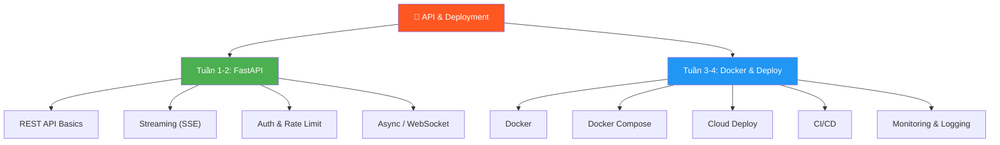
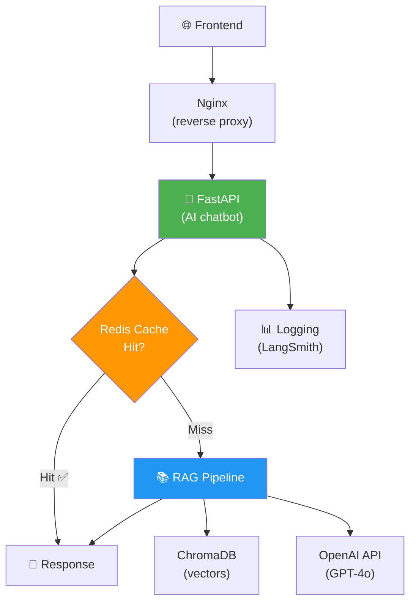

# 🚀 API & Deployment — Phase 5.1 (1 tháng)

> 📅 Thuộc Phase 5: Production Integration — Đưa AI từ Notebook → Production
> 📖 Tiếp nối [Advanced Agent Patterns — Phase 4.2](./Advanced%20Agent%20Patterns%20-%20Phase%204.2%20Tuần%203-4.md)
> 🎯 Mục tiêu: Deploy RAG chatbot thật sự lên server — FastAPI + Docker + Cloud

---

## 🗺️ Mental Map — Từ "chạy local" đến "chạy production"



```
  TẠI SAO PHẦN NÀY QUAN TRỌNG?

  AI Engineer GIỎI ≠ chạy được trên Jupyter Notebook
  AI Engineer GIỎI = deploy lên server, người khác DÙNG ĐƯỢC!

  Notebook:
    → Chạy 1 lần, cho 1 người dùng
    → Không có API, không ai gọi được
    → Tắt máy = mất hết

  Production:
    → Chạy 24/7, ngàn người dùng ĐỒNG THỜI
    → API endpoint: ai cũng gọi được
    → Docker container: chạy ở ĐÂU CŨNG GIỐNG NHAU
    → Monitoring: biết lỗi NGAY khi xảy ra

  → Phase này = biến PROTOTYPE thành PRODUCT!
```

---

## 📖 Mục lục

1. [FastAPI Cơ Bản — REST API cho AI](#1-fastapi-cơ-bản--rest-api-cho-ai)
2. [Streaming Responses — SSE như ChatGPT](#2-streaming-responses--sse-như-chatgpt)
3. [Authentication & Rate Limiting](#3-authentication--rate-limiting)
4. [Async & WebSocket](#4-async--websocket)
5. [Caching — Redis cho AI](#5-caching--redis-cho-ai)
6. [Docker — Containerize AI App](#6-docker--containerize-ai-app)
7. [Docker Compose — Multi-service](#7-docker-compose--multi-service)
8. [Cloud Deployment — AWS / GCP / Railway](#8-cloud-deployment--aws--gcp--railway)
9. [CI/CD — GitHub Actions](#9-cicd--github-actions)
10. [Monitoring & Logging](#10-monitoring--logging)
11. [🏗️ Project: Deploy RAG Chatbot](#11-️-project-deploy-rag-chatbot)

---

# 1. FastAPI Cơ Bản — REST API cho AI

> 🧱 **FastAPI = Framework #1 cho AI/ML APIs (nhanh, typed, auto docs)**

### Tại sao FastAPI?

```
  ┌──────────────────┬──────────┬──────────┬──────────┬──────────────┐
  │ Framework        │ Speed    │ Type-safe│ Async    │ AI community │
  ├──────────────────┼──────────┼──────────┼──────────┼──────────────┤
  │ FastAPI ⭐        │ ⚡ Nhanh │ ✅ Pydantic│ ✅ Native│ ⭐⭐⭐⭐⭐   │
  │ Flask            │ Medium   │ ❌       │ ❌       │ ⭐⭐⭐        │
  │ Django           │ Slow     │ ❌       │ ⚠️ Partial│ ⭐⭐          │
  │ Express (Node)   │ Fast     │ ❌       │ ✅       │ ⭐⭐⭐        │
  └──────────────────┴──────────┴──────────┴──────────┴──────────────┘

  FastAPI thắng vì:
    → NHANH (dựa trên Starlette + Uvicorn)
    → Type-safe (Pydantic models = validate request/response!)
    → Auto docs (Swagger UI miễn phí tại /docs!)
    → Async native (xử lý I/O-bound AI tasks!)
    → AI community yêu thích (LangServe, vLLM đều dùng FastAPI!)
```

### Code: API đầu tiên

```python
# main.py
from fastapi import FastAPI
from pydantic import BaseModel

app = FastAPI(
    title="AI Chatbot API",
    description="RAG-powered chatbot API",
    version="1.0.0",
)

# ═══ Request / Response Models (Type-safe!) ═══
class ChatRequest(BaseModel):
    message: str
    session_id: str = "default"
    top_k: int = 5

class ChatResponse(BaseModel):
    answer: str
    sources: list[str]
    latency_ms: float

# ═══ Health check ═══
@app.get("/health")
async def health():
    return {"status": "ok", "version": "1.0.0"}

# ═══ Chat endpoint ═══
@app.post("/chat", response_model=ChatResponse)
async def chat(request: ChatRequest):
    import time
    start = time.time()
    
    # RAG pipeline (từ Phase 3!)
    answer = "Nhân viên được 15 ngày phép/năm."  # Thực tế: gọi RAG chain
    sources = ["hr_policy.pdf"]
    
    latency = (time.time() - start) * 1000
    return ChatResponse(answer=answer, sources=sources, latency_ms=latency)

# Chạy: uvicorn main:app --reload --port 8000
# Docs: http://localhost:8000/docs (Swagger UI tự động!)
```

### Dependency Injection — Quản lý Resources

```python
from fastapi import Depends
from functools import lru_cache

# ═══ Singleton pattern cho AI resources (chỉ load 1 lần!) ═══

class RAGService:
    """RAG pipeline — load 1 lần, dùng cho mọi request"""
    def __init__(self):
        print("🔄 Loading RAG pipeline...")
        # Load vectorstore, embeddings, LLM (TỐN THỜI GIAN!)
        # self.chain = create_rag_chain()
    
    def query(self, question: str) -> dict:
        # return self.chain.invoke(question)
        return {"answer": "...", "sources": []}

@lru_cache()   # ← Singleton! Chỉ tạo 1 instance!
def get_rag_service() -> RAGService:
    return RAGService()

@app.post("/chat")
async def chat(request: ChatRequest, rag: RAGService = Depends(get_rag_service)):
    result = rag.query(request.message)
    return ChatResponse(**result, latency_ms=0)
```

```
  💡 Tại sao Dependency Injection?

  KHÔNG DI: 
    Mỗi request → load model → 5 giây → MẤT 5 GIÂY mỗi request!
    
  CÓ DI:
    Server start → load model 1 lần (5 giây)
    Mỗi request → dùng model đã load → 0.1 giây! ⚡
```

---

# 2. Streaming Responses — SSE như ChatGPT

> 🧱 **User KHÔNG muốn đợi 10 giây rồi mới thấy response!**

```
  KHÔNG streaming:
    User gửi → [=======đợi 8 giây=======] → "Đây là câu trả lời dài..."
    UX: ❌ Tệ! User nghĩ bị lag!

  CÓ streaming (SSE):
    User gửi → "Đây" → " là" → " câu" → " trả" → " lời" → " dài..."
    UX: ✅ Tuyệt! Giống ChatGPT! User đọc đuổi!
```

### Code: Streaming với SSE

```python
from fastapi import FastAPI
from fastapi.responses import StreamingResponse
from pydantic import BaseModel
import asyncio
import json

app = FastAPI()

class StreamRequest(BaseModel):
    message: str

# ═══ SSE Streaming ═══
async def generate_stream(message: str):
    """Generator tạo SSE events"""
    
    # Giả lập LLM streaming
    words = f"Đây là câu trả lời cho: {message}. Streaming từng token!".split()
    
    for word in words:
        data = json.dumps({"token": word + " ", "done": False})
        yield f"data: {data}\n\n"    # SSE format!
        await asyncio.sleep(0.1)     # Giả lập latency
    
    # Signal done
    yield f"data: {json.dumps({'token': '', 'done': True})}\n\n"

@app.post("/chat/stream")
async def chat_stream(request: StreamRequest):
    return StreamingResponse(
        generate_stream(request.message),
        media_type="text/event-stream",
        headers={
            "Cache-Control": "no-cache",
            "Connection": "keep-alive",
        },
    )
```

### Streaming với LangChain thật

```python
from langchain_openai import ChatOpenAI
from langchain_core.prompts import ChatPromptTemplate
from langchain_core.output_parsers import StrOutputParser

llm = ChatOpenAI(model="gpt-4o", streaming=True)
prompt = ChatPromptTemplate.from_template("{question}")
chain = prompt | llm | StrOutputParser()

async def langchain_stream(question: str):
    """Stream LangChain chain output"""
    async for chunk in chain.astream({"question": question}):
        data = json.dumps({"token": chunk, "done": False})
        yield f"data: {data}\n\n"
    yield f"data: {json.dumps({'token': '', 'done': True})}\n\n"

@app.post("/chat/stream")
async def chat_stream(request: StreamRequest):
    return StreamingResponse(
        langchain_stream(request.message),
        media_type="text/event-stream",
    )
```

### Frontend: Consume SSE

```javascript
// Frontend JavaScript — đọc SSE stream
async function streamChat(message) {
  const response = await fetch("/chat/stream", {
    method: "POST",
    headers: { "Content-Type": "application/json" },
    body: JSON.stringify({ message }),
  });

  const reader = response.body.getReader();
  const decoder = new TextDecoder();

  while (true) {
    const { done, value } = await reader.read();
    if (done) break;

    const text = decoder.decode(value);
    const lines = text.split("\n").filter(l => l.startsWith("data: "));
    
    for (const line of lines) {
      const data = JSON.parse(line.slice(6));  // Remove "data: "
      if (data.done) return;
      document.getElementById("output").textContent += data.token;
    }
  }
}
```

---

# 3. Authentication & Rate Limiting

### API Key Authentication

```python
from fastapi import FastAPI, Depends, HTTPException, Security
from fastapi.security import APIKeyHeader

app = FastAPI()

# ═══ API Key Auth ═══
API_KEYS = {
    "sk-prod-abc123": {"name": "Client A", "tier": "pro", "rpm": 100},
    "sk-dev-xyz789": {"name": "Dev Team", "tier": "dev", "rpm": 10},
}

api_key_header = APIKeyHeader(name="X-API-Key")

async def verify_api_key(api_key: str = Security(api_key_header)):
    if api_key not in API_KEYS:
        raise HTTPException(status_code=403, detail="Invalid API key")
    return API_KEYS[api_key]

@app.post("/chat")
async def chat(request: ChatRequest, client: dict = Depends(verify_api_key)):
    # client = {"name": "Client A", "tier": "pro", "rpm": 100}
    return {"answer": "...", "client": client["name"]}
```

### Rate Limiting

```python
from fastapi import Request
from datetime import datetime, timedelta
import time

# ═══ Simple Rate Limiter (In-memory) ═══
class RateLimiter:
    def __init__(self):
        self.requests = {}   # api_key → [timestamps]
    
    def check(self, api_key: str, max_rpm: int) -> bool:
        now = time.time()
        minute_ago = now - 60
        
        if api_key not in self.requests:
            self.requests[api_key] = []
        
        # Xóa requests cũ hơn 1 phút
        self.requests[api_key] = [t for t in self.requests[api_key] if t > minute_ago]
        
        if len(self.requests[api_key]) >= max_rpm:
            return False
        
        self.requests[api_key].append(now)
        return True

rate_limiter = RateLimiter()

@app.post("/chat")
async def chat(request: ChatRequest, client: dict = Depends(verify_api_key)):
    if not rate_limiter.check(request.session_id, client["rpm"]):
        raise HTTPException(status_code=429, detail="Rate limit exceeded")
    return {"answer": "..."}
```

```
  📐 Production Rate Limiting:
    In-memory:  ✅ Đơn giản | ❌ Multi-server không share!
    Redis:      ✅ Shared | ✅ Fast | ⭐ PRODUCTION CHOICE!
    
  # Redis rate limiting (production!)
  # pip install redis
  import redis
  r = redis.Redis()
  
  def check_rate(key: str, max_rpm: int) -> bool:
      pipe = r.pipeline()
      pipe.incr(f"rate:{key}")
      pipe.expire(f"rate:{key}", 60)
      count, _ = pipe.execute()
      return count <= max_rpm
```

---

# 4. Async & WebSocket

### Async — Tại sao quan trọng cho AI?

```
  AI tasks = I/O-bound (chờ API response!)
    → Gọi OpenAI: chờ 2-5 giây
    → Search Vector DB: chờ 0.5 giây
    → Embedding: chờ 0.3 giây

  SYNC (không async):
    Request 1: [===chờ OpenAI 3s===] → trả lời
    Request 2:                        [===chờ 3s===] → trả lời
    Request 3:                                        [===chờ 3s===]
    → 3 requests = 9 giây! Server chỉ xử lý 1 request 1 lúc!

  ASYNC:
    Request 1: [===chờ OpenAI===]
    Request 2: [===chờ OpenAI===]      (chờ ĐỒNG THỜI!)
    Request 3: [===chờ OpenAI===]
    → 3 requests = 3 giây! 3x nhanh hơn!
```

```python
# ═══ Async endpoint ═══
@app.post("/chat")
async def chat(request: ChatRequest):
    # await = "đợi nhưng KHÔNG BLOCK server"
    answer = await rag_chain.ainvoke({"input": request.message})
    return {"answer": answer}


# ═══ WebSocket — Bidirectional, realtime ═══
from fastapi import WebSocket

@app.websocket("/ws/chat")
async def websocket_chat(websocket: WebSocket):
    await websocket.accept()
    
    try:
        while True:
            # Nhận message từ client
            data = await websocket.receive_text()
            message = json.loads(data)
            
            # Stream response
            async for chunk in chain.astream({"question": message["text"]}):
                await websocket.send_json({"token": chunk, "done": False})
            
            await websocket.send_json({"token": "", "done": True})
    except Exception:
        await websocket.close()
```

```
  📐 SSE vs WebSocket

  ┌──────────────┬────────────────────┬──────────────────────┐
  │              │ SSE                │ WebSocket            │
  ├──────────────┼────────────────────┼──────────────────────┤
  │ Direction    │ Server → Client    │ Bidirectional ↔      │
  │ Protocol     │ HTTP               │ WS (separate)        │
  │ Reconnect    │ Auto               │ Manual               │
  │ Complexity   │ ⭐ Đơn giản       │ ⭐⭐ Phức tạp hơn   │
  │ Best for     │ Chatbot stream ⭐  │ Realtime app (game)  │
  └──────────────┴────────────────────┴──────────────────────┘

  AI Chatbot → SSE đủ dùng! (ChatGPT cũng dùng SSE!)
```

---

# 5. Caching — Redis cho AI

> 📐 **Cùng câu hỏi → cùng mọi bước → tốn tiền lại! Cache = TIẾT KIỆM**

```python
import redis
import hashlib
import json

r = redis.Redis(host="localhost", port=6379, decode_responses=True)

class AICache:
    """Cache AI responses — tiết kiệm tiền + nhanh hơn!"""
    
    def __init__(self, ttl_seconds: int = 3600):  # 1 giờ
        self.ttl = ttl_seconds
    
    def _key(self, question: str) -> str:
        """Hash câu hỏi thành cache key"""
        return f"ai:cache:{hashlib.md5(question.lower().strip().encode()).hexdigest()}"
    
    def get(self, question: str) -> dict | None:
        """Tìm trong cache"""
        data = r.get(self._key(question))
        if data:
            return json.loads(data)
        return None
    
    def set(self, question: str, response: dict):
        """Lưu vào cache"""
        r.setex(self._key(question), self.ttl, json.dumps(response))

cache = AICache(ttl_seconds=3600)

@app.post("/chat")
async def chat(request: ChatRequest):
    # 1. Check cache TRƯỚC!
    cached = cache.get(request.message)
    if cached:
        cached["from_cache"] = True
        return cached   # ← 0ms, $0.00!
    
    # 2. Không có cache → gọi RAG (tốn tiền!)
    result = await rag_chain.ainvoke({"input": request.message})
    response = {"answer": result, "sources": [], "from_cache": False}
    
    # 3. Lưu cache cho lần sau
    cache.set(request.message, response)
    return response
```

```
  💡 Cache AI responses tiết kiệm BAO NHIÊU?

  Ví dụ: 1000 requests/ngày, 30% câu hỏi trùng lặp
    Không cache: 1000 × $0.01 = $10/ngày = $300/tháng!
    Có cache:    700 × $0.01 = $7/ngày = $210/tháng!
    Tiết kiệm:  $90/tháng! + latency giảm 10x cho cached requests!
```

---

# 6. Docker — Containerize AI App

> 🧱 **Docker = "Ship code + environment CÙNG LÚC"**

```
  Vấn đề: "Runs on my machine!" 🤷
    → Python 3.11 vs 3.12?
    → Thiếu library? Sai version?
    → OS khác? Linux vs Mac?

  Docker:
    → Container = mini OS + code + dependencies
    → Chạy GIỐNG NHAU ở MỌI NƠI!
    → Local = Staging = Production!
```

### Dockerfile cho AI App

```dockerfile
# Dockerfile
FROM python:3.11-slim

WORKDIR /app

# Install dependencies (layer caching!)
COPY requirements.txt .
RUN pip install --no-cache-dir -r requirements.txt

# Copy app code
COPY . .

# Expose port
EXPOSE 8000

# Run!
CMD ["uvicorn", "main:app", "--host", "0.0.0.0", "--port", "8000"]
```

```bash
# requirements.txt
fastapi==0.109.0
uvicorn[standard]==0.27.0
langchain==0.1.0
langchain-openai==0.0.5
chromadb==0.4.22
redis==5.0.1
python-dotenv==1.0.0
pydantic==2.5.3

# Build & Run
docker build -t ai-chatbot .
docker run -p 8000:8000 --env-file .env ai-chatbot
# → http://localhost:8000/docs
```

```
  📐 Dockerfile Best Practices cho AI:

  1. python:3.11-slim (KHÔNG dùng full — 1GB vs 150MB!)
  2. COPY requirements.txt TRƯỚC code → layer cache!
     (dependencies ít thay đổi → Docker skip rebuild!)
  3. --no-cache-dir → giảm image size
  4. .dockerignore → loại .git, __pycache__, .env
  5. Non-root user → security!
```

```
# .dockerignore
.git
__pycache__
*.pyc
.env
.venv
node_modules
chroma_db/
```

---

# 7. Docker Compose — Multi-service

> 🧱 **AI app cần NHIỀU services: API + Vector DB + Redis + Worker**

```yaml
# docker-compose.yml
version: "3.9"

services:
  # ═══ AI API Server ═══
  api:
    build: .
    ports:
      - "8000:8000"
    env_file:
      - .env
    depends_on:
      - redis
      - chroma
    environment:
      - REDIS_URL=redis://redis:6379
      - CHROMA_HOST=chroma
      - CHROMA_PORT=8001
    restart: unless-stopped

  # ═══ Redis (Caching + Rate Limiting) ═══
  redis:
    image: redis:7-alpine
    ports:
      - "6379:6379"
    volumes:
      - redis_data:/data
    restart: unless-stopped

  # ═══ ChromaDB (Vector Database) ═══
  chroma:
    image: chromadb/chroma:latest
    ports:
      - "8001:8000"
    volumes:
      - chroma_data:/chroma/chroma
    restart: unless-stopped

volumes:
  redis_data:
  chroma_data:
```

```bash
# Start TOÀN BỘ services chỉ 1 lệnh!
docker compose up -d

# Check logs
docker compose logs -f api

# Stop
docker compose down

# Rebuild (khi code thay đổi)
docker compose up -d --build api
```

---

# 8. Cloud Deployment — AWS / GCP / Railway

### Lựa chọn Platform

```
  ┌────────────────────┬──────────┬──────────┬────────────────────┐
  │ Platform           │ Difficulty│ Cost     │ Best for           │
  ├────────────────────┼──────────┼──────────┼────────────────────┤
  │ Railway ⭐          │ ⭐ Easy   │ Free tier│ MVP, demo, hobby   │
  │ Render             │ ⭐ Easy   │ Free tier│ Side projects      │
  │ Fly.io             │ ⭐⭐      │ Pay-as-go│ Containers         │
  │ AWS (ECS/Lambda)   │ ⭐⭐⭐    │ Complex  │ Enterprise ⭐       │
  │ GCP (Cloud Run)    │ ⭐⭐      │ Pay-as-go│ Scalable APIs ⭐    │
  │ Azure              │ ⭐⭐⭐    │ Complex  │ Enterprise (MS)    │
  └────────────────────┴──────────┴──────────┴────────────────────┘

  AI Engineer mới → Railway hoặc GCP Cloud Run
  Enterprise → AWS ECS hoặc GCP Cloud Run
```

### Deploy lên Railway (đơn giản nhất!)

```bash
# 1. Install Railway CLI
npm install -g @railway/cli

# 2. Login
railway login

# 3. Init project
railway init

# 4. Add Redis service (trên dashboard)
# railway.app → New Service → Redis

# 5. Deploy!
railway up

# → URL: https://your-app.up.railway.app
# → Tự build Docker, tự deploy!
```

### Deploy lên GCP Cloud Run

```bash
# 1. Build & push Docker image
gcloud builds submit --tag gcr.io/PROJECT_ID/ai-chatbot

# 2. Deploy to Cloud Run
gcloud run deploy ai-chatbot \
  --image gcr.io/PROJECT_ID/ai-chatbot \
  --port 8000 \
  --memory 2Gi \
  --cpu 2 \
  --min-instances 0 \
  --max-instances 10 \
  --set-env-vars "OPENAI_API_KEY=sk-..." \
  --allow-unauthenticated

# → URL: https://ai-chatbot-xxxxx.a.run.app
# → Auto-scale 0→10 instances!
```

---

# 9. CI/CD — GitHub Actions

```yaml
# .github/workflows/deploy.yml
name: Deploy AI Chatbot

on:
  push:
    branches: [main]

jobs:
  test:
    runs-on: ubuntu-latest
    steps:
      - uses: actions/checkout@v4
      - uses: actions/setup-python@v5
        with:
          python-version: "3.11"
      - run: pip install -r requirements.txt
      - run: pytest tests/ -v

  deploy:
    needs: test      # Deploy CHỈ KHI test PASS!
    runs-on: ubuntu-latest
    steps:
      - uses: actions/checkout@v4
      - name: Deploy to Railway
        uses: bervProject/railway-deploy@main
        with:
          railway_token: ${{ secrets.RAILWAY_TOKEN }}
          service: ai-chatbot
```

```
  CI/CD cho AI có gì khác?

  Traditional CI/CD:
    Code change → Test → Deploy

  AI CI/CD (thêm bước!):
    Code change → Unit Test → AI EVAL → Deploy → Monitor quality
                               ↑
                    Chạy evaluation suite!
                    Accuracy < 0.8? → BLOCK deploy!
```

---

# 10. Monitoring & Logging

```python
# ═══ Structured Logging ═══
import logging
import json
from datetime import datetime

class AILogger:
    def __init__(self):
        self.logger = logging.getLogger("ai-chatbot")
        handler = logging.StreamHandler()
        handler.setFormatter(logging.Formatter('%(message)s'))
        self.logger.addHandler(handler)
        self.logger.setLevel(logging.INFO)
    
    def log_request(self, question: str, answer: str, 
                    latency_ms: float, tokens: int, cost: float):
        log_entry = {
            "timestamp": datetime.utcnow().isoformat(),
            "type": "ai_request",
            "question": question[:200],
            "answer_length": len(answer),
            "latency_ms": round(latency_ms, 2),
            "tokens": tokens,
            "cost_usd": round(cost, 6),
        }
        self.logger.info(json.dumps(log_entry))

ai_logger = AILogger()

# ═══ Middleware — log MỌI request ═══
from fastapi import Request
import time

@app.middleware("http")
async def log_requests(request: Request, call_next):
    start = time.time()
    response = await call_next(request)
    latency = (time.time() - start) * 1000
    
    logging.info(json.dumps({
        "path": request.url.path,
        "method": request.method,
        "status": response.status_code,
        "latency_ms": round(latency, 2),
    }))
    return response
```

```
  📊 AI-specific Metrics cần monitor:

  ┌────────────────────┬──────────────────────────────────────┐
  │ Metric             │ Tại sao?                              │
  ├────────────────────┼──────────────────────────────────────┤
  │ Latency (P50, P99) │ User đợi lâu = UX kém!              │
  │ Token count/request│ Tokens ↑ = Cost ↑                    │
  │ Cost per request   │ Budget tracking!                     │
  │ Error rate         │ % requests fail                      │
  │ Cache hit rate     │ Cao = tiết kiệm tiền!                │
  │ Retrieval quality  │ RAG search có đúng?                   │
  │ LLM latency       │ OpenAI response time                  │
  └────────────────────┴──────────────────────────────────────┘
```

---

# 11. 🏗️ Project: Deploy RAG Chatbot

### Architecture hoàn chỉnh



### Project Structure

```
ai-chatbot/
├── app/
│   ├── main.py              # FastAPI app
│   ├── routes/
│   │   ├── chat.py           # Chat endpoints
│   │   └── admin.py          # Admin endpoints
│   ├── services/
│   │   ├── rag_service.py    # RAG pipeline
│   │   ├── cache_service.py  # Redis caching
│   │   └── auth_service.py   # Authentication
│   ├── models/
│   │   ├── request.py        # Pydantic request models
│   │   └── response.py       # Pydantic response models
│   └── config.py             # Settings
├── tests/
│   ├── test_chat.py
│   └── test_rag.py
├── Dockerfile
├── docker-compose.yml
├── requirements.txt
├── .env.example
├── .github/workflows/deploy.yml
└── README.md
```

---

## 📐 Tổng kết — Checklist Phase 5.1

```
  ┌────────────────────────────────────────────────────────────┐
  │  API & Deployment Checklist:                               │
  │                                                            │
  │  Tuần 1-2: FastAPI                                         │
  │  □ Routes, Pydantic models, Swagger docs (/docs)          │
  │  □ Dependency injection — singleton cho AI resources       │
  │  □ SSE streaming — langchain astream + StreamingResponse  │
  │  □ Authentication — API keys                              │
  │  □ Rate limiting — in-memory / Redis                      │
  │  □ Async endpoints — await cho I/O-bound tasks            │
  │  □ Redis caching — cache responses, tiết kiệm tiền       │
  │                                                            │
  │  Tuần 3-4: Docker & Deploy                                 │
  │  □ Dockerfile — python:slim, layer caching                │
  │  □ Docker Compose — API + Redis + ChromaDB                │
  │  □ Cloud deploy — Railway (easy) / GCP Cloud Run (scale)  │
  │  □ CI/CD — GitHub Actions: test → eval → deploy           │
  │  □ Monitoring — structured logging, AI-specific metrics   │
  │                                                            │
  │  Project:                                                  │
  │  □ Deploy RAG chatbot lên server thật                     │
  │  □ SSE streaming + caching + auth + monitoring            │
  └────────────────────────────────────────────────────────────┘
```

---

## 📚 Tài liệu đọc thêm

```
  📖 Docs:
    fastapi.tiangolo.com — FastAPI docs (tuyệt vời!)
    docs.docker.com — Docker docs
    docs.railway.app — Railway deployment
    cloud.google.com/run/docs — GCP Cloud Run

  🎥 Video:
    "FastAPI Full Course" — FreeCodeCamp YouTube
    "Docker for Beginners" — TechWorld with Nana
    "Deploy ML Models" — Patrick Loeber YouTube
    "LLM API Best Practices" — AI Engineer YouTube

  🏋️ Thực hành:
    1. Xây FastAPI + RAG chain + /docs
    2. Thêm SSE streaming endpoint
    3. Docker build + run local
    4. Docker Compose (API + Redis + Chroma)
    5. Deploy lên Railway
    6. Thêm CI/CD pipeline
```
