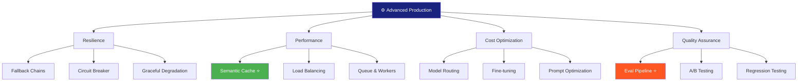
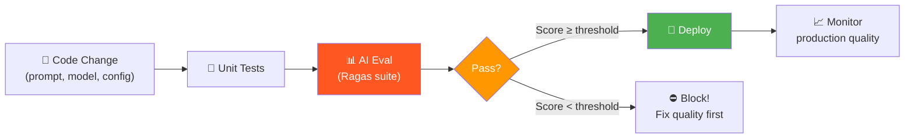

# ⚙️ Advanced Production Patterns — Phase 5.3 (2 tuần)

> 📅 Thuộc Phase 5: Production Integration — Phần cuối cùng trước Portfolio!
> 📖 Tiếp nối [Monitoring & Observability — Phase 5.2](./Monitoring%20Observability%20-%20Phase%205.2.md)
> 🎯 Mục tiêu: Xây AI system chịu được scale, fault-tolerant, chi phí tối ưu, tự kiểm tra chất lượng

---

## 🗺️ Mental Map — Từ "Chạy được" đến "Chạy ỔN ĐỊNH"



```
  PHASE NÀY GIẢI QUYẾT GÌ?

  Bạn đã có:
    ✅ RAG pipeline hoạt động
    ✅ FastAPI + Docker deployed
    ✅ Monitoring + Logging

  Vấn đề còn lại:
  ┌────────────────────────────────────────────────────────────┐
  │  ❌ OpenAI down → APP down!           → Fallback chains   │
  │  ❌ Cùng câu hỏi gọi LLM lại → tốn $ → Semantic cache    │
  │  ❌ Traffic spike → chậm/crash        → Load balancing    │
  │  ❌ Model chung không fit domain       → Fine-tuning       │
  │  ❌ Deploy xong, chất lượng giảm?      → Eval pipeline    │
  │  ❌ Không biết prompt A hay B tốt hơn? → A/B testing      │
  └────────────────────────────────────────────────────────────┘
```

---

## 📖 Mục lục

1. [Semantic Caching — Cache THÔNG MINH ⭐](#1-semantic-caching--cache-thông-minh-)
2. [Fallback Chains — Không bao giờ DOWN](#2-fallback-chains--không-bao-giờ-down)
3. [Circuit Breaker — Bảo vệ hệ thống](#3-circuit-breaker--bảo-vệ-hệ-thống)
4. [Load Balancing — Nhiều LLM providers](#4-load-balancing--nhiều-llm-providers)
5. [Queue & Workers — Xử lý heavy tasks](#5-queue--workers--xử-lý-heavy-tasks)
6. [Model Routing — Thông minh chọn model](#6-model-routing--thông-minh-chọn-model)
7. [Fine-tuning Basics — Customize model](#7-fine-tuning-basics--customize-model)
8. [Prompt Optimization — Giảm tokens, giữ quality](#8-prompt-optimization--giảm-tokens-giữ-quality)
9. [Evaluation Pipeline — CI/CD cho AI ⭐](#9-evaluation-pipeline--cicd-cho-ai-)
10. [A/B Testing — So sánh khoa học](#10-ab-testing--so-sánh-khoa-học)

---

# 1. Semantic Caching — Cache THÔNG MINH ⭐

> 🧱 **Exact cache miss synonym! "nghỉ phép" ≠ "annual leave" nhưng CÙNG Ý**

### Exact Cache vs Semantic Cache

```
  Exact Cache (Redis key match):
    Q: "Nghỉ phép bao nhiêu ngày?" → CACHE HIT ✅
    Q: "nghỉ phép bao nhiêu ngày?" → CACHE HIT ✅ (lowercase)
    Q: "Được nghỉ phép mấy ngày?"  → CACHE MISS ❌ (khác chữ!)
    Q: "Annual leave policy?"       → CACHE MISS ❌ (khác ngôn ngữ!)

  Semantic Cache (embedding similarity):
    Q: "Nghỉ phép bao nhiêu ngày?" → CACHE HIT ✅
    Q: "Được nghỉ phép mấy ngày?"  → CACHE HIT ✅ (cùng ý!)
    Q: "Annual leave policy?"       → CACHE HIT ✅ (cùng ý!)
    Q: "Chính sách lương tháng 13?" → CACHE MISS ❌ (khác ý!)

  → Semantic cache = HIT RATE cao hơn nhiều = TIẾT KIỆM nhiều hơn!
```

### Code: Semantic Cache

```python
import numpy as np
import json
import hashlib
from datetime import datetime

class SemanticCache:
    """Cache dựa trên MEANING, không phải exact string"""
    
    def __init__(self, similarity_threshold: float = 0.92, ttl_hours: int = 24):
        self.threshold = similarity_threshold
        self.ttl_hours = ttl_hours
        self.cache = []   # Production: dùng Vector DB!
    
    def _embed(self, text: str) -> list[float]:
        """Embed text (production: batch + cache embeddings)"""
        from openai import OpenAI
        client = OpenAI()
        response = client.embeddings.create(
            model="text-embedding-3-small", input=[text]
        )
        return response.data[0].embedding
    
    def _cosine_sim(self, a: list, b: list) -> float:
        a, b = np.array(a), np.array(b)
        return float(np.dot(a, b) / (np.linalg.norm(a) * np.linalg.norm(b)))
    
    def get(self, question: str) -> dict | None:
        """Tìm cache entry có Ý NGHĨA tương tự"""
        q_vec = self._embed(question)
        
        best_match = None
        best_score = 0
        
        for entry in self.cache:
            sim = self._cosine_sim(q_vec, entry["embedding"])
            if sim > best_score and sim >= self.threshold:
                best_score = sim
                best_match = entry
        
        if best_match:
            return {
                "answer": best_match["answer"],
                "sources": best_match["sources"],
                "cache_hit": True,
                "similarity": round(best_score, 4),
                "original_question": best_match["question"],
            }
        return None
    
    def set(self, question: str, answer: str, sources: list = []):
        """Lưu response vào cache"""
        q_vec = self._embed(question)
        self.cache.append({
            "question": question,
            "answer": answer,
            "sources": sources,
            "embedding": q_vec,
            "created_at": datetime.utcnow().isoformat(),
        })

# Dùng:
sem_cache = SemanticCache(similarity_threshold=0.92)

# Request 1: MISS → gọi LLM
result = sem_cache.get("Nghỉ phép bao nhiêu ngày?")   # None
answer = rag_chain.invoke(...)                          # $0.005
sem_cache.set("Nghỉ phép bao nhiêu ngày?", answer)

# Request 2: HIT! (câu hỏi KHÁC nhưng CÙNG Ý)
result = sem_cache.get("Được nghỉ phép mấy ngày vậy?") # HIT!
# → $0.00002 (chỉ embed query!) thay vì $0.005!
```

```
  📐 Trade-off: Similarity Threshold

  Threshold 0.98: STRICT — chỉ hit khi gần y hệt
    → Ít false positives, nhiều cache miss → tiết kiệm ÍT
  
  Threshold 0.90: LOOSE — hit khi tương đối giống
    → Nhiều cache hits → tiết kiệm NHIỀU
    → Nhưng có thể trả lời SAI! (question A ≈ question B nhưng khác!)

  Recommended: 0.92-0.95 (cân bằng accuracy vs savings)
```

---

# 2. Fallback Chains — Không bao giờ DOWN

> 🛡️ **Rule #1 của Production: ĐỪNG BAO GIỜ để user thấy error 500!**

### Fallback Strategy

```
  ┌────────────────────────────────────────────────────────────┐
  │  FALLBACK CHAIN = Danh sách "Plan B, C, D..."              │
  │                                                            │
  │  Level 1: GPT-4o (best quality)                           │
  │    ↓ fail (timeout/rate limit/down)                        │
  │  Level 2: Claude 3.5 Sonnet (backup)                      │
  │    ↓ fail                                                  │
  │  Level 3: GPT-4o-mini (cheaper, faster)                   │
  │    ↓ fail                                                  │
  │  Level 4: Cached response (semantic cache)                │
  │    ↓ fail                                                  │
  │  Level 5: "Xin lỗi, hệ thống đang bận. Thử lại sau."    │
  │                                                            │
  │  → User LUÔN nhận được response! Không bao giờ error 500! │
  └────────────────────────────────────────────────────────────┘
```

### Code: Multi-level Fallback

```python
from langchain_openai import ChatOpenAI
from langchain_anthropic import ChatAnthropic

# ═══ LangChain built-in fallback ═══
primary = ChatOpenAI(model="gpt-4o", request_timeout=30)
backup1 = ChatAnthropic(model="claude-3-5-sonnet-20241022", timeout=30)
backup2 = ChatOpenAI(model="gpt-4o-mini", request_timeout=15)

llm = primary.with_fallback([backup1, backup2])
# GPT-4o fail → Claude → GPT-4o-mini → error


# ═══ Custom fallback VỚI semantic cache ═══
async def resilient_query(question: str) -> dict:
    """5-level fallback — NEVER return 500!"""
    
    # Level 0: Semantic cache (fastest, cheapest!)
    cached = sem_cache.get(question)
    if cached:
        return {**cached, "model": "cache", "cost": 0}
    
    # Level 1-3: LLM fallback chain
    models = [
        ("gpt-4o", ChatOpenAI(model="gpt-4o", request_timeout=30)),
        ("claude-3.5", ChatAnthropic(model="claude-3-5-sonnet-20241022")),
        ("gpt-4o-mini", ChatOpenAI(model="gpt-4o-mini", request_timeout=15)),
    ]
    
    for model_name, model in models:
        try:
            response = await model.ainvoke(question)
            # Cache cho lần sau!
            sem_cache.set(question, response.content)
            return {"answer": response.content, "model": model_name}
        except Exception as e:
            logger.warning(f"Model {model_name} failed: {e}")
            continue
    
    # Level 4: Graceful degradation
    return {
        "answer": "Xin lỗi, hệ thống đang bận. Vui lòng thử lại sau 30 giây.",
        "model": "fallback",
        "retry_after": 30,
    }
```

---

# 3. Circuit Breaker — Bảo vệ hệ thống

> 🧱 **Khi provider DOWN, ĐỪNG tiếp tục gọi! Chuyển sang backup NGAY!**

```
  Circuit Breaker = "Tự ngắt" khi quá nhiều lỗi

  CLOSED (bình thường):
    Request → Provider → Response ✅
    
  OPEN (provider đang lỗi, NGẮT!):
    Request → SKIP provider → dùng backup ngay!
    Không đợi timeout 30s mỗi request → NHANH hơn!

  HALF-OPEN (thử lại):
    Sau 60s → thử 1 request → nếu OK → CLOSED
                              → nếu fail → OPEN thêm 60s
```

```python
import time

class CircuitBreaker:
    """Tự ngắt khi provider fail liên tục"""
    
    def __init__(self, failure_threshold: int = 3, reset_timeout: int = 60):
        self.failure_threshold = failure_threshold
        self.reset_timeout = reset_timeout
        self.failure_count = 0
        self.last_failure_time = 0
        self.state = "CLOSED"   # CLOSED | OPEN | HALF_OPEN
    
    def can_proceed(self) -> bool:
        if self.state == "CLOSED":
            return True
        if self.state == "OPEN":
            # Check if enough time passed → try again
            if time.time() - self.last_failure_time > self.reset_timeout:
                self.state = "HALF_OPEN"
                return True
            return False
        if self.state == "HALF_OPEN":
            return True
        return False
    
    def record_success(self):
        self.failure_count = 0
        self.state = "CLOSED"
    
    def record_failure(self):
        self.failure_count += 1
        self.last_failure_time = time.time()
        if self.failure_count >= self.failure_threshold:
            self.state = "OPEN"

# Dùng per provider:
openai_breaker = CircuitBreaker(failure_threshold=3, reset_timeout=60)
claude_breaker = CircuitBreaker(failure_threshold=3, reset_timeout=60)

async def smart_llm_call(question: str):
    providers = [
        ("openai", openai_breaker, openai_llm),
        ("claude", claude_breaker, claude_llm),
    ]
    
    for name, breaker, llm in providers:
        if not breaker.can_proceed():
            logger.info(f"Circuit OPEN for {name}, skipping")
            continue
        try:
            result = await llm.ainvoke(question)
            breaker.record_success()
            return result
        except:
            breaker.record_failure()
    
    return "All providers unavailable"
```

---

# 4. Load Balancing — Nhiều LLM providers

```
  Tại sao cần load balancing?

  1 provider:
    → Rate limit: 10K RPM → hết!
    → Cost: 100% chi phí 1 provider
    → Risk: provider down = app down!

  Nhiều providers:
    → Rate limit: 10K (OpenAI) + 5K (Claude) = 15K RPM!
    → Cost: dùng provider rẻ hơn khi có thể
    → Risk: 1 down, dùng provider khác!
```

```python
import random

class LLMLoadBalancer:
    """Distribute requests across providers"""
    
    def __init__(self):
        self.providers = [
            {
                "name": "openai",
                "llm": ChatOpenAI(model="gpt-4o"),
                "weight": 0.6,        # 60% traffic
                "cost_per_1k": 12.5,  # $/1K requests
                "breaker": CircuitBreaker(),
            },
            {
                "name": "claude",
                "llm": ChatAnthropic(model="claude-3-5-sonnet-20241022"),
                "weight": 0.3,
                "cost_per_1k": 18.0,
                "breaker": CircuitBreaker(),
            },
            {
                "name": "openai-mini",
                "llm": ChatOpenAI(model="gpt-4o-mini"),
                "weight": 0.1,
                "cost_per_1k": 0.75,
                "breaker": CircuitBreaker(),
            },
        ]
    
    def select(self) -> dict:
        """Weighted random selection (skip broken providers)"""
        available = [p for p in self.providers if p["breaker"].can_proceed()]
        if not available:
            raise Exception("No providers available!")
        
        total_weight = sum(p["weight"] for p in available)
        r = random.random() * total_weight
        
        cumulative = 0
        for p in available:
            cumulative += p["weight"]
            if r <= cumulative:
                return p
        return available[-1]
    
    async def invoke(self, question: str):
        provider = self.select()
        try:
            result = await provider["llm"].ainvoke(question)
            provider["breaker"].record_success()
            return {"answer": result.content, "provider": provider["name"]}
        except:
            provider["breaker"].record_failure()
            return await self.invoke(question)  # Retry with different provider

lb = LLMLoadBalancer()
```

---

# 5. Queue & Workers — Xử lý heavy tasks

> 🧱 **Dài quá → đừng block API! Đẩy vào queue, trả job_id, user poll sau.**

```
  Sync (blocking):
    POST /analyze-report (10 PDF pages)
    → User đợi 30 giây... timeout 504!

  Async Queue:
    POST /analyze-report → {"job_id": "abc123", "status": "queued"}
    GET /jobs/abc123    → {"status": "processing", "progress": 40}
    GET /jobs/abc123    → {"status": "done", "result": "..."}

  → User KHÔNG bị block! Background worker xử lý.
```

```python
# ═══ Simple Queue pattern (Redis + Background worker) ═══

import redis
import json
import uuid
from fastapi import BackgroundTasks

r = redis.Redis(decode_responses=True)

@app.post("/analyze")
async def analyze_document(file_path: str, background: BackgroundTasks):
    """Start async job — return immediately!"""
    job_id = str(uuid.uuid4())
    
    # Save job
    r.hset(f"job:{job_id}", mapping={
        "status": "queued",
        "progress": 0,
        "created_at": datetime.utcnow().isoformat(),
    })
    
    # Process in background
    background.add_task(process_document, job_id, file_path)
    
    return {"job_id": job_id, "status": "queued"}

@app.get("/jobs/{job_id}")
async def get_job(job_id: str):
    """Poll job status"""
    data = r.hgetall(f"job:{job_id}")
    if not data:
        raise HTTPException(404, "Job not found")
    return data

async def process_document(job_id: str, file_path: str):
    """Background worker"""
    r.hset(f"job:{job_id}", "status", "processing")
    
    # Simulate heavy AI processing
    for i in range(10):
        r.hset(f"job:{job_id}", "progress", (i + 1) * 10)
        await asyncio.sleep(1)
    
    r.hset(f"job:{job_id}", mapping={
        "status": "done",
        "progress": 100,
        "result": "Analysis complete: ...",
    })
```

---

# 6. Model Routing — Thông minh chọn model

> 📐 **Câu hỏi ĐƠN GIẢN dùng model RẺ, câu PHỨC TẠP dùng model MẠNH**

```
  Model routing = tiết kiệm NHIỀU tiền!

  Không routing: TẤT CẢ đều dùng GPT-4o ($5/ngày)
  Có routing:
    "Xin chào!" → GPT-4o-mini ($0.0003)    ← SIMPLE
    "So sánh 3 chính sách..." → GPT-4o ($0.005) ← COMPLEX
    → Tiết kiệm 40-60%!
```

```python
class ModelRouter:
    """Route câu hỏi đến model phù hợp"""
    
    def __init__(self):
        self.simple_llm = ChatOpenAI(model="gpt-4o-mini")     # Rẻ, nhanh
        self.complex_llm = ChatOpenAI(model="gpt-4o")          # Mạnh, đắt
    
    def classify_complexity(self, question: str) -> str:
        """Phân loại: simple vs complex"""
        simple_patterns = [
            "xin chào", "hello", "cảm ơn", "thank",
            "có", "không", "bao nhiêu", "khi nào",
        ]
        complex_patterns = [
            "so sánh", "phân tích", "giải thích chi tiết",
            "tại sao", "liệt kê", "đánh giá",
        ]
        
        q = question.lower()
        
        if len(question) < 30:
            return "simple"
        for p in complex_patterns:
            if p in q:
                return "complex"
        for p in simple_patterns:
            if p in q:
                return "simple"
        
        return "complex"   # Default: dùng model mạnh cho an toàn
    
    def route(self, question: str):
        complexity = self.classify_complexity(question)
        if complexity == "simple":
            return self.simple_llm, "gpt-4o-mini"
        return self.complex_llm, "gpt-4o"

router = ModelRouter()

@app.post("/chat")
async def chat(request: ChatRequest):
    llm, model_name = router.route(request.message)
    answer = await llm.ainvoke(request.message)
    return {"answer": answer.content, "model_used": model_name}
```

---

# 7. Fine-tuning Basics — Customize model

> 📐 **Fine-tuning = "Dạy thêm" LLM kiến thức/style RIÊNG**

### Khi nào Fine-tune vs khi nào RAG?

```
  ┌──────────────────┬──────────────────┬──────────────────────┐
  │                  │ RAG              │ Fine-tuning          │
  ├──────────────────┼──────────────────┼──────────────────────┤
  │ Khi nào?         │ Cần data MỚI,   │ Cần model BIẾT style,│
  │                  │ cập nhật thường  │ format, domain terms │
  │ Data cần         │ Documents (text) │ Input-output pairs   │
  │ Số lượng         │ 10-1M docs       │ 50-10K examples      │
  │ Update           │ Thêm docs = xong │ Re-train! (tốn tiền)│
  │ Chi phí          │ Embedding + DB   │ Training + inference │
  │ Best for         │ Knowledge base ⭐ │ Tone, format, style  │
  └──────────────────┴──────────────────┴──────────────────────┘

  📌 QUY TẮC: RAG trước! Fine-tune chỉ khi RAG KHÔNG ĐỦ!
    RAG = thêm KIẾN THỨC
    Fine-tune = thay đổi CÁCH HÀNH XỬ
```

### Code: Fine-tune OpenAI GPT-4o-mini

```python
from openai import OpenAI
import json

client = OpenAI()

# ═══ 1. Chuẩn bị data (JSONL format) ═══
training_data = [
    {
        "messages": [
            {"role": "system", "content": "Bạn là HR Assistant của Công ty ABC."},
            {"role": "user", "content": "Nghỉ phép bao nhiêu ngày?"},
            {"role": "assistant", "content": "Theo quy định ABC-HR-2024, nhân viên chính thức được 15 ngày phép/năm (Mục 3.2). Nhân viên thử việc: 1 ngày/tháng."},
        ]
    },
    {
        "messages": [
            {"role": "system", "content": "Bạn là HR Assistant của Công ty ABC."},
            {"role": "user", "content": "Quy trình xin nghỉ?"},
            {"role": "assistant", "content": "Quy trình: (1) Nộp đơn trên HR Portal trước 3 ngày, (2) Quản lý duyệt trong 24h, (3) HR xác nhận. Nghỉ đột xuất: gọi hotline 1900-xxxx."},
        ]
    },
    # ... 50-200 examples minimum!
]

# Ghi JSONL
with open("training.jsonl", "w") as f:
    for item in training_data:
        f.write(json.dumps(item) + "\n")

# ═══ 2. Upload file ═══
file = client.files.create(file=open("training.jsonl", "rb"), purpose="fine-tune")

# ═══ 3. Start fine-tuning ═══
job = client.fine_tuning.jobs.create(
    training_file=file.id,
    model="gpt-4o-mini-2024-07-18",   # Base model
    hyperparameters={"n_epochs": 3},
)
print(f"Job ID: {job.id}")

# ═══ 4. Check status ═══
status = client.fine_tuning.jobs.retrieve(job.id)
print(f"Status: {status.status}")   # queued → running → succeeded

# ═══ 5. Dùng fine-tuned model! ═══
response = client.chat.completions.create(
    model="ft:gpt-4o-mini-2024-07-18:my-org::abc123",  # Model ID
    messages=[
        {"role": "system", "content": "Bạn là HR Assistant của Công ty ABC."},
        {"role": "user", "content": "Nghỉ phép sao?"},
    ],
)
# → Trả lời ĐÚNG STYLE + FORMAT đã train!
```

```
  ⚠️ Fine-tuning gotchas:
    → Cần ÍT NHẤT 50 examples (best: 200-500)
    → Data quality QUAN TRỌNG hơn quantity
    → Chi phí training: ~$3-10 cho GPT-4o-mini
    → Chi phí inference: đắt hơn base model ~1.5-2x
    → PHẢI eval trước và sau fine-tune!
```

---

# 8. Prompt Optimization — Giảm tokens, giữ quality

```
  Tại sao optimize prompt?
    Mỗi token = TIỀN!
    Prompt 2000 tokens vs 800 tokens = TIẾT KIỆM 60%!
    Và: ngắn hơn = NHANH hơn + LLM focus hơn!
```

```python
# ═══ Các kỹ thuật Prompt Optimization ═══

# 1. Loại bỏ redundancy
# BAD (verbose):
bad_prompt = """Bạn là một trợ lý AI rất thông minh và hữu ích. 
Bạn luôn cố gắng trả lời câu hỏi một cách chính xác nhất có thể.
Bạn nên dựa trên tài liệu được cung cấp để trả lời.
Nếu bạn không tìm thấy thông tin trong tài liệu, 
bạn nên nói rằng bạn không tìm thấy thông tin.
Hãy trả lời bằng tiếng Việt."""  # 85 tokens

# GOOD (concise, same quality):
good_prompt = """Trả lời dựa trên tài liệu. Nếu không có → nói "Không tìm thấy."
Tiếng Việt. Trích dẫn nguồn."""  # 25 tokens! Tiết kiệm 70%!


# 2. Compress context (chỉ giữ phần liên quan)
def compress_context(docs: list, question: str, max_tokens: int = 1000):
    """Chỉ giữ sentences LIÊN QUAN đến question"""
    relevant_sentences = []
    for doc in docs:
        for sentence in doc.split(". "):
            # Simple relevancy check (production: dùng embedding similarity)
            if any(word in sentence.lower() for word in question.lower().split()):
                relevant_sentences.append(sentence)
    return ". ".join(relevant_sentences)[:max_tokens]


# 3. Few-shot → Zero-shot (bỏ examples nếu model đủ giỏi)
# Few-shot: 5 examples = +500 tokens mỗi request
# Zero-shot: 0 examples = tiết kiệm 500 tokens
# → Test: quality giảm bao nhiêu? Nếu < 5% thì bỏ examples!
```

---

# 9. Evaluation Pipeline — CI/CD cho AI ⭐

> ⭐ **Deploy = PHẢI qua eval! Accuracy giảm = BLOCK deploy!**

### Eval Pipeline Flow



### Code: Eval Pipeline

```python
# eval_pipeline.py — chạy trong CI/CD!

import json
from dataclasses import dataclass

@dataclass
class EvalResult:
    score: float
    passed: bool
    details: dict

class AIEvalPipeline:
    """Gate keeper: chỉ deploy khi quality ĐỦ TỐT!"""
    
    def __init__(self, min_score: float = 0.8):
        self.min_score = min_score
        self.test_suite = self._load_test_suite()
    
    def _load_test_suite(self) -> list[dict]:
        """Load golden Q&A dataset"""
        with open("eval/test_suite.json") as f:
            return json.load(f)
        # [{"question": "Nghỉ phép?", "expected": "15 ngày", "keywords": ["15", "ngày"]}]
    
    def run(self, rag_pipeline) -> EvalResult:
        """Chạy evaluation suite"""
        results = []
        
        for tc in self.test_suite:
            answer = rag_pipeline.query(tc["question"])
            
            # Check keywords present
            keyword_score = sum(
                1 for kw in tc["keywords"] if kw.lower() in answer.lower()
            ) / len(tc["keywords"])
            
            results.append({
                "question": tc["question"],
                "score": keyword_score,
                "answer": answer[:200],
            })
        
        avg_score = sum(r["score"] for r in results) / len(results)
        passed = avg_score >= self.min_score
        
        return EvalResult(
            score=avg_score,
            passed=passed,
            details={
                "total": len(results),
                "passed": sum(1 for r in results if r["score"] >= self.min_score),
                "failed": sum(1 for r in results if r["score"] < self.min_score),
                "failures": [r for r in results if r["score"] < self.min_score],
            },
        )

# CI/CD script:
eval = AIEvalPipeline(min_score=0.8)
result = eval.run(my_rag_pipeline)

if not result.passed:
    print(f"❌ EVAL FAILED! Score: {result.score:.2f} < 0.80")
    print(f"Failed cases: {result.details['failures']}")
    exit(1)   # ← BLOCK deploy!
else:
    print(f"✅ EVAL PASSED! Score: {result.score:.2f}")
    # Proceed to deploy...
```

### GitHub Actions: AI Eval trong CI

```yaml
# .github/workflows/deploy.yml
name: Deploy with AI Eval

on:
  push:
    branches: [main]

jobs:
  test-and-eval:
    runs-on: ubuntu-latest
    steps:
      - uses: actions/checkout@v4
      - uses: actions/setup-python@v5
        with:
          python-version: "3.11"
      
      - name: Install dependencies
        run: pip install -r requirements.txt
      
      - name: Unit tests
        run: pytest tests/ -v
      
      - name: AI Evaluation  # ← BƯỚC MỚI cho AI!
        env:
          OPENAI_API_KEY: ${{ secrets.OPENAI_API_KEY }}
        run: python eval_pipeline.py
        # Exit code 1 = BLOCK deploy!
      
  deploy:
    needs: test-and-eval   # Chỉ deploy nếu eval PASS!
    runs-on: ubuntu-latest
    steps:
      - name: Deploy
        run: railway up
```

---

# 10. A/B Testing — So sánh khoa học

```
  A/B testing cho AI:
    Prompt A vs Prompt B: cái nào TỐT HƠN?
    Model A vs Model B?
    Chunk size 300 vs 500?

  → ĐỪNG đoán! ĐO THẬT!
```

```python
import random

class ABTest:
    """A/B test cho AI pipeline"""
    
    def __init__(self, name: str, variant_a, variant_b, traffic_split: float = 0.5):
        self.name = name
        self.variant_a = variant_a
        self.variant_b = variant_b
        self.split = traffic_split
        self.results = {"A": [], "B": []}
    
    def get_variant(self, user_id: str):
        """Deterministic split by user_id (consistent experience!)"""
        if hash(user_id) % 100 < self.split * 100:
            return "A", self.variant_a
        return "B", self.variant_b
    
    def record(self, variant: str, quality_score: float, latency_ms: float):
        self.results[variant].append({
            "quality": quality_score,
            "latency": latency_ms,
        })
    
    def report(self) -> dict:
        import numpy as np
        report = {}
        for v in ["A", "B"]:
            if self.results[v]:
                scores = [r["quality"] for r in self.results[v]]
                latencies = [r["latency"] for r in self.results[v]]
                report[v] = {
                    "n": len(scores),
                    "avg_quality": round(np.mean(scores), 3),
                    "avg_latency": round(np.mean(latencies), 1),
                }
        return report

# Ví dụ: test 2 prompts
prompt_a = "Trả lời ngắn gọn. Trích dẫn nguồn."
prompt_b = "Trả lời chi tiết. Liệt kê các điểm chính. Trích dẫn nguồn."

ab_test = ABTest("prompt-style", prompt_a, prompt_b, traffic_split=0.5)
```

---

## 📐 Tổng kết — Checklist Phase 5.3

```
  ┌────────────────────────────────────────────────────────────┐
  │  Advanced Production Patterns Checklist:                    │
  │                                                            │
  │  Resilience:                                               │
  │  □ Semantic cache — embedding similarity, threshold tuning │
  │  □ Fallback chains — multi-level (GPT→Claude→mini→cache)  │
  │  □ Circuit breaker — auto-skip down providers              │
  │                                                            │
  │  Performance:                                              │
  │  □ Load balancing — weighted random, multi-provider        │
  │  □ Queue + workers — async jobs, progress polling          │
  │  □ Model routing — simple→mini, complex→4o                │
  │                                                            │
  │  Cost:                                                     │
  │  □ Prompt optimization — compress, reduce tokens 60%      │
  │  □ Fine-tuning basics — when/how, JSONL, evaluate         │
  │                                                            │
  │  Quality:                                                  │
  │  □ Eval pipeline ⭐ — CI/CD gate, block bad deploys        │
  │  □ A/B testing — prompt/model comparison, deterministic   │
  │  □ Regression testing — detect quality drops               │
  └────────────────────────────────────────────────────────────┘
```

---

## 📚 Tài liệu đọc thêm

```
  📖 Papers & Articles:
    "GPTCache: Semantic Caching for LLMs" — Zilliz
    "LLM-powered A/B Testing" — various AI engineering blogs
    "Fine-tuning GPT-4o-mini" — OpenAI cookbook

  📖 Docs:
    platform.openai.com/docs/guides/fine-tuning
    docs.anthropic.com/en/docs/build-with-claude/prompt-caching
    gptcache.readthedocs.io — GPTCache library

  🎥 Video:
    "Production LLM Applications" — AI Engineer Summit
    "Fine-tuning OpenAI Models" — OpenAI YouTube
    "Scaling AI Applications" — MLOps Community

  🏋️ Thực hành:
    1. Implement semantic cache → đo cache hit rate
    2. Setup fallback chain (GPT → Claude → mini)
    3. Implement model router → đo cost savings
    4. Tạo eval test suite (20+ Q&A pairs)
    5. Setup CI/CD eval pipeline → block bad deploys
    6. Run A/B test: prompt A vs prompt B (50 requests mỗi cái)
```
