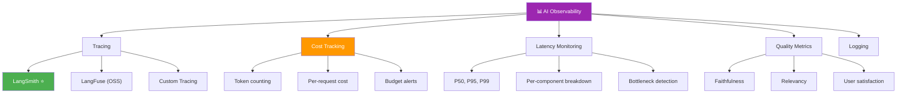
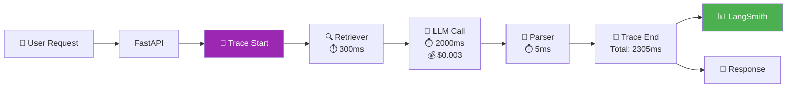

# 📊 Monitoring & Observability — Phase 5.2 (2 tuần)

> 📅 Thuộc Phase 5: Production Integration
> 📖 Tiếp nối [API & Deployment — Phase 5.1](./API%20Deployment%20-%20Phase%205.1.md)
> 🎯 Mục tiêu: "Nếu không ĐO được, không CẢI THIỆN được!" — Biết chính xác AI system đang hoạt động ra sao

---

## 🗺️ Mental Map — Monitoring AI ≠ Monitoring truyền thống



```
  TẠI SAO MONITORING AI KHÁC MONITORING TRUYỀN THỐNG?

  Traditional app:
    Monitor: uptime, latency, error rate → ĐỦ!
    Bug = code bug → fix code → XONG!

  AI app (THÊM nhiều vấn đề!):
    → Output ĐÚNG hay SAI? (không có unit test cho "creativity"!)
    → LLM BỊA thông tin? (hallucination — lỗi NHƯNG status 200!)
    → Chi phí API TĂNG bất thường?
    → Prompt thay đổi → quality thay đổi?
    → RAG search có tìm ĐÚNG docs?
    → User HÀI LÒNG không?

  ⭐ AI monitoring = Traditional monitoring + QUALITY monitoring!
    Status 200 ≠ Đúng!
    Response nhanh ≠ Response tốt!
```

---

## 📖 Mục lục

1. [Luồng Suy Nghĩ — Monitor cái gì?](#1-luồng-suy-nghĩ--monitor-cái-gì)
2. [LangSmith — Tracing cho LLM ⭐](#2-langsmith--tracing-cho-llm-)
3. [LangFuse — Open Source Alternative](#3-langfuse--open-source-alternative)
4. [Cost Tracking — Theo dõi chi phí](#4-cost-tracking--theo-dõi-chi-phí)
5. [Latency Monitoring — Đo tốc độ từng bước](#5-latency-monitoring--đo-tốc-độ-từng-bước)
6. [Quality Metrics — Đo chất lượng output](#6-quality-metrics--đo-chất-lượng-output)
7. [Logging Best Practices cho AI](#7-logging-best-practices-cho-ai)
8. [Alerting — Biết lỗi NGAY khi xảy ra](#8-alerting--biết-lỗi-ngay-khi-xảy-ra)
9. [Dashboard — Tổng hợp tất cả metrics](#9-dashboard--tổng-hợp-tất-cả-metrics)

---

# 1. Luồng Suy Nghĩ — Monitor cái gì?

### AI Observability Stack

```
  ┌────────────────────────────────────────────────────────────────┐
  │  TẦNG 1: INFRASTRUCTURE (giống traditional)                    │
  │    → Uptime, CPU, Memory, Disk                                 │
  │    → HTTP status codes, error rates                            │
  │    → Request throughput (requests/sec)                         │
  │    Tool: Prometheus + Grafana, Datadog, CloudWatch             │
  ├────────────────────────────────────────────────────────────────┤
  │  TẦNG 2: LLM OPERATIONS (mới cho AI!)                         │
  │    → Token usage per request                                   │
  │    → Cost per request ($)                                      │
  │    → Latency per component (retrieval, LLM, parsing)          │
  │    → Model version tracking                                    │
  │    Tool: LangSmith, LangFuse, custom middleware               │
  ├────────────────────────────────────────────────────────────────┤
  │  TẦNG 3: QUALITY (khó nhất!)                                   │
  │    → Faithfulness — LLM có bịa không?                         │
  │    → Relevancy — trả lời có đúng câu hỏi?                    │
  │    → Retrieval quality — search có tìm đúng docs?             │
  │    → User satisfaction — user có hài lòng?                    │
  │    Tool: Ragas, LLM-as-Judge, user feedback, A/B testing      │
  └────────────────────────────────────────────────────────────────┘

  📌 Thứ tự ưu tiên:
    1. Tầng 1 (1 ngày setup) — biết app CÓ sống không
    2. Tầng 2 (2-3 ngày) — biết AI TỐN bao nhiêu
    3. Tầng 3 (ongoing) — biết AI CÓ TỐT không
```



---

# 2. LangSmith — Tracing cho LLM ⭐

> ⭐ **LangSmith = "DevTools cho AI" — xem TỪNG BƯỚC trong chain/agent**

### Setup (chỉ 3 dòng!)

```python
import os

# ═══ Chỉ cần 3 env vars! ═══
os.environ["LANGCHAIN_TRACING_V2"] = "true"
os.environ["LANGCHAIN_API_KEY"] = "ls__..."         # Từ smith.langchain.com
os.environ["LANGCHAIN_PROJECT"] = "rag-chatbot-prod" # Tên project

# XONG! Mọi LangChain chain/agent TỰ ĐỘNG được trace!
# Vào smith.langchain.com để xem dashboard!
```

### LangSmith cho bạn thấy gì?

```
  ┌──────────────────────────────────────────────────────────────┐
  │  📊 LangSmith Dashboard                                      │
  │                                                              │
  │  Run: "Nghỉ phép bao nhiêu ngày?"                           │
  │  Status: ✅ Success | Total: 2.3s | Cost: $0.004             │
  │                                                              │
  │  ├─ 🔍 VectorStoreRetriever (0.35s)                         │
  │  │   Input:  "Nghỉ phép bao nhiêu ngày?"                    │
  │  │   Output: 5 documents (scores: 0.92, 0.87, 0.84, ...)    │
  │  │                                                            │
  │  ├─ 📝 ChatPromptTemplate (0.001s)                           │
  │  │   Variables: {context: "...", question: "..."}             │
  │  │   Output: 850 tokens                                      │
  │  │                                                            │
  │  ├─ 🤖 ChatOpenAI (1.9s) ← BOTTLENECK!                      │
  │  │   Model: gpt-4o                                           │
  │  │   Input tokens: 850 | Output tokens: 120                 │
  │  │   Cost: $0.004                                            │
  │  │                                                            │
  │  └─ 📤 StrOutputParser (0.001s)                              │
  │      Output: "Nhân viên được nghỉ 15 ngày/năm..."           │
  │                                                              │
  └──────────────────────────────────────────────────────────────┘

  Từ trace này bạn BIẾT:
    → Retriever mất 0.35s → OK ✅
    → LLM mất 1.9s → BOTTLENECK! Xem xét cache hoặc model nhẹ hơn
    → Cost $0.004 → OK cho single request
    → 850 input tokens → có thể optimize prompt để giảm tokens
```

### LangSmith: Feedback & Annotation

```python
from langsmith import Client

ls_client = Client()

# ═══ User feedback — đánh giá từng response ═══
def log_feedback(run_id: str, score: int, comment: str = ""):
    """User đánh giá response (thumbs up/down)"""
    ls_client.create_feedback(
        run_id=run_id,
        key="user-rating",
        score=score,           # 1 = bad, 5 = great
        comment=comment,
    )

# ═══ Tạo test dataset từ production data ═══
dataset = ls_client.create_dataset("rag-eval-v1")

ls_client.create_example(
    dataset_id=dataset.id,
    inputs={"question": "Nghỉ phép bao nhiêu ngày?"},
    outputs={"answer": "15 ngày/năm"},
)

# → Dùng dataset này để eval pipeline mỗi khi thay đổi prompt/model!
```

---

# 3. LangFuse — Open Source Alternative

```
  LangSmith vs LangFuse:

  ┌──────────────────┬────────────────────┬────────────────────┐
  │                  │ LangSmith          │ LangFuse           │
  ├──────────────────┼────────────────────┼────────────────────┤
  │ Source           │ Closed (LangChain) │ Open Source ⭐      │
  │ Self-host        │ ❌                 │ ✅ Docker!          │
  │ Free tier        │ 5K traces/month    │ 50K events/month   │
  │ LangChain native │ ✅ Tự động         │ ✅ Callback handler│
  │ Framework agnostic│ ❌ LangChain only │ ✅ Any framework    │
  │ Cost             │ From $39/month     │ FREE (self-host!)  │
  │ Data privacy     │ Cloud (US)         │ Self-host = full!  │
  └──────────────────┴────────────────────┴────────────────────┘

  Chọn:
    Prototype / dùng LangChain → LangSmith (dễ nhất!)
    Enterprise / privacy → LangFuse (self-host, free!)
    Framework khác (vLLM, custom) → LangFuse
```

### Setup LangFuse

```python
# pip install langfuse

# ═══ Cách 1: LangChain callback (dễ nhất!) ═══
from langfuse.callback import CallbackHandler

langfuse_handler = CallbackHandler(
    public_key="pk-lf-...",
    secret_key="sk-lf-...",
    host="https://cloud.langfuse.com",  # hoặc self-hosted URL
)

# Thêm vào chain!
result = chain.invoke(
    {"question": "Nghỉ phép?"},
    config={"callbacks": [langfuse_handler]}
)

# ═══ Cách 2: Manual trace (any framework!) ═══
from langfuse import Langfuse

langfuse = Langfuse()

trace = langfuse.trace(name="rag-query", user_id="user_123")

# Retrieval span
span = trace.span(name="retrieval")
docs = retriever.invoke(question)
span.end(output={"num_docs": len(docs)})

# LLM span
generation = trace.generation(
    name="gpt-4o-call",
    model="gpt-4o",
    input=[{"role": "user", "content": question}],
)
response = llm.invoke(question)
generation.end(
    output=response,
    usage={"input": 850, "output": 120},  # Token counts
)

trace.update(output=response)
langfuse.flush()
```

---

# 4. Cost Tracking — Theo dõi chi phí

> 💰 **AI apps TỐN TIỀN MỌI REQUEST! Không track = bill shock!**

### Pricing table (2024)

```
  ┌──────────────────────┬────────────┬────────────┬────────────┐
  │ Model                │ Input/1M   │ Output/1M  │ Estimate   │
  ├──────────────────────┼────────────┼────────────┼────────────┤
  │ GPT-4o               │ $2.50      │ $10.00     │ ~$0.005/req│
  │ GPT-4o-mini          │ $0.15      │ $0.60      │ ~$0.0003   │
  │ Claude 3.5 Sonnet    │ $3.00      │ $15.00     │ ~$0.007    │
  │ Gemini 1.5 Pro       │ $1.25      │ $5.00      │ ~$0.003    │
  │ text-embedding-3-small│ $0.02     │ —          │ ~$0.00001  │
  ├──────────────────────┼────────────┼────────────┼────────────┤
  │ Cohere Rerank        │ $2/1K call │            │ ~$0.002    │
  └──────────────────────┴────────────┴────────────┴────────────┘

  Ví dụ: RAG chatbot, 1000 requests/ngày:
    Embedding query: 1000 × $0.00001 = $0.01
    LLM (GPT-4o):   1000 × $0.005   = $5.00
    Rerank (nếu có): 1000 × $0.002  = $2.00
    ────────────────────────────────────────
    Total:                            $7.01/ngày = ~$210/tháng!

  ⚠️ Nếu KHÔNG track: 1 bug tạo loop → 10,000 calls → $50 1 đêm!
```

### Code: Cost Tracker

```python
import tiktoken
from dataclasses import dataclass, field
from datetime import datetime

@dataclass 
class CostRecord:
    timestamp: str
    model: str
    input_tokens: int
    output_tokens: int
    cost_usd: float
    endpoint: str = ""

class CostTracker:
    """Track chi phí MỌI LLM call"""
    
    PRICING = {
        "gpt-4o":         {"input": 2.50, "output": 10.00},
        "gpt-4o-mini":    {"input": 0.15, "output": 0.60},
        "text-embedding-3-small": {"input": 0.02, "output": 0},
    }
    
    def __init__(self, daily_budget_usd: float = 10.0):
        self.daily_budget = daily_budget_usd
        self.records: list[CostRecord] = []
        self._today_cost = 0.0
    
    def count_tokens(self, text: str, model: str = "gpt-4o") -> int:
        """Đếm tokens TRƯỚC KHI gọi API"""
        try:
            enc = tiktoken.encoding_for_model(model)
            return len(enc.encode(text))
        except:
            return len(text) // 4  # Ước lượng: 1 token ≈ 4 chars
    
    def record(self, model: str, input_tokens: int, output_tokens: int, 
               endpoint: str = "") -> float:
        """Ghi nhận chi phí"""
        pricing = self.PRICING.get(model, {"input": 5, "output": 15})
        cost = (input_tokens * pricing["input"] + output_tokens * pricing["output"]) / 1_000_000
        
        record = CostRecord(
            timestamp=datetime.utcnow().isoformat(),
            model=model,
            input_tokens=input_tokens,
            output_tokens=output_tokens,
            cost_usd=cost,
            endpoint=endpoint,
        )
        self.records.append(record)
        self._today_cost += cost
        
        # Budget alert!
        if self._today_cost >= self.daily_budget * 0.8:
            print(f"⚠️ WARNING: Daily cost ${self._today_cost:.4f} / ${self.daily_budget}")
        if self._today_cost >= self.daily_budget:
            raise Exception(f"🚨 BUDGET EXCEEDED: ${self._today_cost:.4f}!")
        
        return cost
    
    def report(self) -> dict:
        total_cost = sum(r.cost_usd for r in self.records)
        total_tokens = sum(r.input_tokens + r.output_tokens for r in self.records)
        by_model = {}
        for r in self.records:
            by_model.setdefault(r.model, 0)
            by_model[r.model] += r.cost_usd
        
        return {
            "total_cost_usd": round(total_cost, 6),
            "total_tokens": total_tokens,
            "total_requests": len(self.records),
            "avg_cost_per_request": round(total_cost / max(len(self.records), 1), 6),
            "by_model": {k: round(v, 6) for k, v in by_model.items()},
        }

# Dùng:
tracker = CostTracker(daily_budget_usd=10.0)

# Sau mỗi LLM call:
cost = tracker.record("gpt-4o", input_tokens=850, output_tokens=120, endpoint="/chat")
print(f"Request cost: ${cost:.6f}")
print(tracker.report())
```

---

# 5. Latency Monitoring — Đo tốc độ từng bước

### Latency Breakdown cho RAG Pipeline

```
  Typical RAG request latency:

  ┌──────────────────────────────────────────────────┐
  │  Component           │ Typical  │ Target  │ Fix  │
  ├──────────────────────┼──────────┼─────────┼──────┤
  │  Embed query         │ 50-100ms │ <100ms  │ Cache│
  │  Vector search       │ 50-200ms │ <200ms  │ ANN  │
  │  Re-ranking (nếu có) │ 100-300ms│ <300ms  │ Skip │
  │  LLM generation      │ 1-5s ← BOTTLENECK │ Cache│
  │  Total               │ 1.5-6s  │ <3s     │      │
  └──────────────────────┴──────────┴─────────┴──────┘

  LLM = 70-90% tổng latency!
  → Optimize LLM call = CẢI THIỆN NHIỀU NHẤT!
  → Strategies: cache, smaller model, shorter prompts
```

### Code: Latency Tracker

```python
import time
from contextlib import contextmanager
from collections import defaultdict

class LatencyTracker:
    """Đo latency TỪNG COMPONENT"""
    
    def __init__(self):
        self.timings = defaultdict(list)   # component → [latencies]
    
    @contextmanager
    def measure(self, component: str):
        """Context manager đo thời gian"""
        start = time.perf_counter()
        yield
        elapsed_ms = (time.perf_counter() - start) * 1000
        self.timings[component].append(elapsed_ms)
    
    def percentiles(self, component: str) -> dict:
        """P50, P95, P99"""
        import numpy as np
        data = self.timings.get(component, [])
        if not data:
            return {}
        return {
            "p50": round(np.percentile(data, 50), 2),
            "p95": round(np.percentile(data, 95), 2),
            "p99": round(np.percentile(data, 99), 2),
            "count": len(data),
        }
    
    def report(self) -> dict:
        return {comp: self.percentiles(comp) for comp in self.timings}

latency = LatencyTracker()

# Dùng trong RAG pipeline:
async def rag_query(question: str):
    with latency.measure("embed_query"):
        query_vec = embed(question)
    
    with latency.measure("vector_search"):
        docs = vector_store.search(query_vec, top_k=5)
    
    with latency.measure("llm_generation"):
        answer = await llm.ainvoke(prompt.format(context=docs, question=question))
    
    return answer

# Report:
print(latency.report())
# {
#   "embed_query":    {"p50": 45, "p95": 80, "p99": 120},
#   "vector_search":  {"p50": 100, "p95": 200, "p99": 350},
#   "llm_generation": {"p50": 1800, "p95": 3500, "p99": 5000}, ← Fix this!
# }
```

---

# 6. Quality Metrics — Đo chất lượng output

### 3 cách đo quality

```
  ┌───────────────────────────────────────────────────────────────┐
  │                                                               │
  │  1. OFFLINE Evaluation (Ragas, test dataset)                  │
  │     → Chuẩn bị Q&A pairs → chạy pipeline → đo scores        │
  │     → Dùng khi: thay đổi prompt, model, chunking             │
  │     → Frequency: mỗi lần deploy                              │
  │                                                               │
  │  2. ONLINE Evaluation (LLM-as-Judge, realtime)                │
  │     → Mỗi response → LLM judge chấm điểm                    │
  │     → Dùng khi: monitor production quality                    │
  │     → Frequency: mỗi request hoặc sample                    │
  │                                                               │
  │  3. USER Feedback (thumbs up/down, rating)                    │
  │     → User đánh giá response                                  │
  │     → Dùng khi: ground truth cho quality                      │
  │     → Frequency: user-driven                                  │
  │                                                               │
  └───────────────────────────────────────────────────────────────┘
```

### Code: LLM-as-Judge (Online Eval)

```python
async def judge_response(question: str, answer: str, context: str) -> dict:
    """LLM chấm điểm response (chạy async, không block user!)"""
    
    judge_prompt = f"""Đánh giá chất lượng câu trả lời AI.

CÂU HỎI: {question}
CONTEXT (tài liệu): {context[:500]}
CÂU TRẢ LỜI AI: {answer}

Chấm điểm 1-5 cho mỗi tiêu chí:
1. Faithfulness: Trả lời CÓ dựa trên context? (1=bịa, 5=hoàn toàn dựa trên context)
2. Relevancy: Trả lời CÓ đúng câu hỏi? (1=lạc đề, 5=hoàn toàn đúng)
3. Completeness: Trả lời CÓ đầy đủ? (1=thiếu nhiều, 5=đầy đủ)

Trả về JSON:
{{"faithfulness": X, "relevancy": X, "completeness": X, "explanation": "..."}}"""

    response = await llm.ainvoke(judge_prompt)
    return json.loads(response.content)

# Chạy SONG SONG với response (không block user!)
import asyncio

async def chat_with_eval(question: str):
    # 1. Trả lời user (NHANH!)
    answer = await rag_chain.ainvoke(question)
    
    # 2. Judge ĐỒNG THỜI (background, user không đợi!)
    asyncio.create_task(
        judge_and_log(question, answer)
    )
    
    return answer

async def judge_and_log(question, answer):
    scores = await judge_response(question, answer, "...")
    # Log to LangSmith / database
    logger.info(json.dumps({"type": "quality", "scores": scores}))
```

### User Feedback Integration

```python
from fastapi import FastAPI

app = FastAPI()

@app.post("/feedback")
async def submit_feedback(
    run_id: str,
    score: int,           # 1-5 hoặc thumbs up(1) / down(0)
    comment: str = ""
):
    """User đánh giá response"""
    # Lưu vào DB
    feedback_store.save({
        "run_id": run_id,
        "score": score,
        "comment": comment,
        "timestamp": datetime.utcnow().isoformat(),
    })
    
    # Gửi lên LangSmith (nếu dùng)
    ls_client.create_feedback(run_id=run_id, key="user-score", score=score)
    
    return {"status": "saved"}
```

---

# 7. Logging Best Practices cho AI

### Structured Logging

```python
import logging
import json
from datetime import datetime

# ═══ AI-specific log format ═══

class AIStructuredLogger:
    def __init__(self, service_name: str = "ai-chatbot"):
        self.logger = logging.getLogger(service_name)
        self.logger.setLevel(logging.INFO)
        handler = logging.StreamHandler()
        handler.setFormatter(logging.Formatter('%(message)s'))
        self.logger.addHandler(handler)
    
    def log_request(self, **kwargs):
        """Log MỌI AI request"""
        entry = {
            "timestamp": datetime.utcnow().isoformat(),
            "type": "ai_request",
            **kwargs,
        }
        self.logger.info(json.dumps(entry))

ai_log = AIStructuredLogger()

# Mỗi request:
ai_log.log_request(
    request_id="req-abc123",
    user_id="user-456",
    question="Nghỉ phép bao nhiêu ngày?",
    answer_preview="Nhân viên được 15 ngày...",
    model="gpt-4o",
    input_tokens=850,
    output_tokens=120,
    cost_usd=0.004,
    latency_ms=2300,
    retrieval_scores=[0.92, 0.87, 0.84],
    cache_hit=False,
    quality_score=None,        # Filled async by judge
)
```

```
  📌 AI Logging — PHẢI log gì?

  ✅ LUÔN log:
    → request_id (trace request xuyên suốt pipeline)
    → question (đầu vào)
    → answer preview (100 chars đầu)
    → model + tokens + cost
    → latency per component
    → retrieval scores
    → cache hit/miss
    → errors + stack trace

  ❌ KHÔNG log:
    → Full answer (quá dài, tốn storage!)
    → User PII (tên, email) — privacy!
    → API keys, passwords
    → Full embeddings (vector 1536D = huge!)

  💡 Log LEVEL:
    INFO:  mỗi request (normal operation)
    WARNING: latency > 5s, cost > $0.05/request, low quality score
    ERROR: API fail, parse error, budget exceeded
    CRITICAL: service down, data corruption
```

---

# 8. Alerting — Biết lỗi NGAY khi xảy ra

```python
# ═══ Alert Rules cho AI Systems ═══

class AlertManager:
    """Alert khi metrics vượt ngưỡng"""
    
    RULES = {
        "high_latency":     {"metric": "latency_p99",  "threshold": 5000, "unit": "ms"},
        "high_cost":        {"metric": "daily_cost",   "threshold": 8.0,  "unit": "USD"},
        "low_quality":      {"metric": "avg_quality",  "threshold": 3.0,  "unit": "score"},
        "high_error_rate":  {"metric": "error_rate",   "threshold": 0.05, "unit": "%"},
        "low_cache_hit":    {"metric": "cache_hit_rate","threshold": 0.2,  "unit": "%"},
    }
    
    def check(self, metrics: dict):
        alerts = []
        for name, rule in self.RULES.items():
            value = metrics.get(rule["metric"], 0)
            if name in ["low_quality", "low_cache_hit"]:
                if value < rule["threshold"]:
                    alerts.append(f"🚨 {name}: {value} < {rule['threshold']} {rule['unit']}")
            else:
                if value > rule["threshold"]:
                    alerts.append(f"🚨 {name}: {value} > {rule['threshold']} {rule['unit']}")
        
        for alert in alerts:
            self.send_alert(alert)
        return alerts
    
    def send_alert(self, message: str):
        # Production: Slack webhook, PagerDuty, email
        print(f"ALERT: {message}")

# Chạy mỗi 5 phút:
alert_mgr = AlertManager()
alert_mgr.check({
    "latency_p99": 6200,     # → 🚨 high_latency!
    "daily_cost": 12.5,      # → 🚨 high_cost!
    "avg_quality": 4.2,      # ✅ OK
    "error_rate": 0.02,      # ✅ OK
    "cache_hit_rate": 0.35,  # ✅ OK
})
```

---

# 9. Dashboard — Tổng hợp tất cả metrics

### Dashboard Layout

```
  ┌──────────────────────────────────────────────────────────────┐
  │  🟢 AI Chatbot Dashboard                   Last 24h         │
  │                                                              │
  │  ┌──────────┐  ┌──────────┐  ┌──────────┐  ┌──────────┐    │
  │  │ Requests │  │ Avg      │  │ Daily    │  │ Quality  │    │
  │  │  1,247   │  │ Latency  │  │  Cost    │  │  Score   │    │
  │  │ +12% ↑   │  │  2.3s    │  │  $8.42   │  │  4.2/5   │    │
  │  └──────────┘  └──────────┘  └──────────┘  └──────────┘    │
  │                                                              │
  │  📈 Latency (P50/P95/P99)    💰 Cost Breakdown              │
  │  ┌───────────────────────┐   ┌───────────────────────┐      │
  │  │ P50: ████ 1.8s       │   │ GPT-4o:      $6.20   │      │
  │  │ P95: ██████ 3.5s     │   │ Embeddings:  $0.12   │      │
  │  │ P99: █████████ 5.2s  │   │ Rerank:      $2.10   │      │
  │  └───────────────────────┘   └───────────────────────┘      │
  │                                                              │
  │  🔍 Cache Hit Rate: 32%      📊 Error Rate: 1.2%            │
  │  ████████░░░░░░░░░░░░░░░     ██░░░░░░░░░░░░░░░░░░░░░░░     │
  │                                                              │
  │  ⚠️ Alerts:                                                  │
  │    🚨 P99 latency > 5s (5.2s) → Check LLM provider          │
  │    ⚠️ Daily cost approaching budget ($8.42 / $10)            │
  │                                                              │
  └──────────────────────────────────────────────────────────────┘
```

### FastAPI Health + Metrics Endpoint

```python
@app.get("/metrics")
async def get_metrics():
    """Dashboard data endpoint"""
    return {
        "requests": {
            "total_24h": 1247,
            "error_rate": 0.012,
        },
        "latency": latency_tracker.report(),
        "cost": cost_tracker.report(),
        "quality": {
            "avg_score": 4.2,
            "faithfulness": 4.5,
            "relevancy": 4.1,
        },
        "cache": {
            "hit_rate": 0.32,
            "total_hits": 399,
        },
        "alerts": alert_mgr.check_current(),
    }
```

---

## 📐 Tổng kết — Checklist Phase 5.2

```
  ┌────────────────────────────────────────────────────────────┐
  │  Monitoring & Observability Checklist:                      │
  │                                                            │
  │  Tracing:                                                   │
  │  □ LangSmith setup — 3 env vars, auto trace               │
  │  □ LangFuse (OSS) — callback handler, self-host option    │
  │  □ Xem trace per-component: retrieval, LLM, parser        │
  │                                                            │
  │  Cost Tracking:                                            │
  │  □ Token counting — tiktoken TRƯỚC khi gọi API            │
  │  □ Per-request cost — record mỗi LLM call                 │
  │  □ Daily budget — alert khi gần vượt                       │
  │  □ Cost breakdown by model — biết tiền đi đâu             │
  │                                                            │
  │  Latency:                                                  │
  │  □ Per-component timing — embed, search, LLM, parse       │
  │  □ Percentiles — P50, P95, P99                             │
  │  □ Bottleneck identification — LLM thường = 70-90%        │
  │                                                            │
  │  Quality:                                                  │
  │  □ Offline eval — Ragas test suite mỗi deploy             │
  │  □ Online eval — LLM-as-Judge (async, background!)        │
  │  □ User feedback — thumbs up/down + comments              │
  │                                                            │
  │  Logging:                                                  │
  │  □ Structured JSON logs — request_id, tokens, cost        │
  │  □ Log levels — INFO/WARNING/ERROR/CRITICAL               │
  │  □ Không log PII, API keys, full embeddings               │
  │                                                            │
  │  Alerting:                                                 │
  │  □ Alert rules — latency, cost, quality, error rate       │
  │  □ Notification — Slack/email khi vượt ngưỡng             │
  └────────────────────────────────────────────────────────────┘
```

---

## 📚 Tài liệu đọc thêm

```
  📖 Docs:
    smith.langchain.com — LangSmith docs
    langfuse.com/docs — LangFuse docs
    docs.ragas.io — Ragas evaluation

  🎥 Video:
    "LangSmith Overview" — LangChain YouTube
    "LLM Observability" — Weights & Biases YouTube
    "Monitoring LLM Applications" — AI Engineer Summit talks

  🏋️ Thực hành:
    1. Setup LangSmith → chạy 10 queries → đọc traces
    2. Implement CostTracker → report chi phí 1 ngày
    3. Implement LatencyTracker → tìm bottleneck
    4. Chạy Ragas offline eval → baseline scores
    5. Implement LLM-as-Judge → online quality monitoring
    6. Setup alerts → Slack notification khi latency > 5s
```
