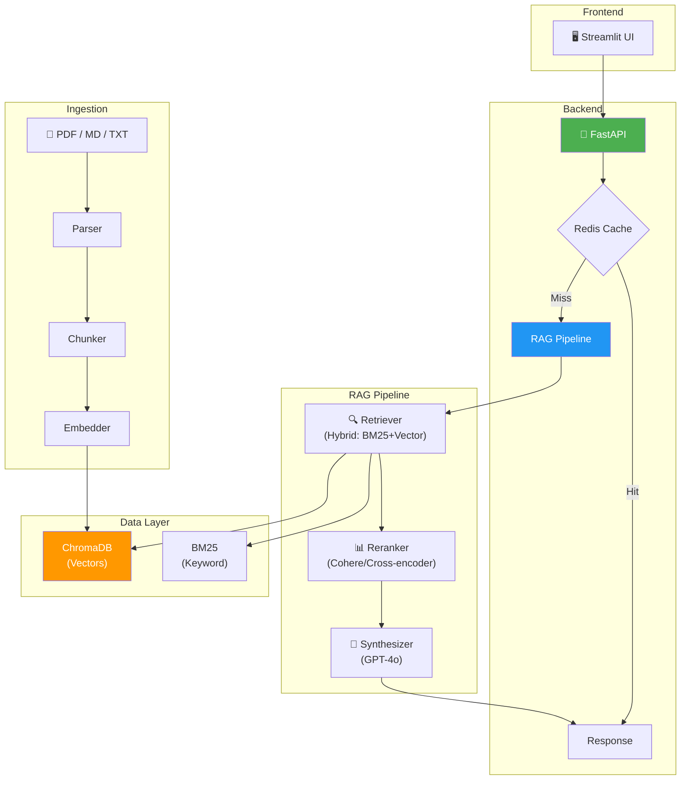

# 🏗️ Project 1: RAG Chatbot — Hướng dẫn xây từ A→Z

> 📅 Portfolio Project #1 — Xây sau Phase 3 (RAG + LangChain + LlamaIndex)
> 🎯 Mục tiêu: Chatbot hỏi đáp trên tài liệu PDF/web — USE CASE #1 của mọi công ty AI!
> 📚 Stack: Python + LangChain + ChromaDB + FastAPI + Streamlit

---

## 🗺️ Tổng quan Project

```
  ┌────────────────────────────────────────────────────────────┐
  │                                                            │
  │  RAG CHATBOT = Chatbot HỎI ĐÁP trên TÀI LIỆU RIÊNG     │
  │                                                            │
  │  Input:  Tài liệu PDF/MD/TXT + Câu hỏi user              │
  │  Output: Câu trả lời + Trích dẫn nguồn                    │
  │                                                            │
  │  Use cases thực tế:                                        │
  │    • HR Bot — hỏi chính sách nhân sự                      │
  │    • Docs Bot — hỏi documentation sản phẩm                │
  │    • Legal Bot — hỏi hợp đồng, điều khoản                 │
  │    • Support Bot — hỏi FAQ, troubleshooting               │
  │                                                            │
  │  ⭐ Đây là project MỌI công ty AI đều cần!                 │
  │     → Portfolio CÓ project này = điểm CỘNG LỚN!           │
  └────────────────────────────────────────────────────────────┘
```

---

## 📖 Mục lục

1. [Architecture & System Design](#1-architecture--system-design)
2. [Phase 1: Ingestion Pipeline — Load & Index tài liệu](#2-phase-1-ingestion-pipeline--load--index-tài-liệu)
3. [Phase 2: RAG Chain — Retrieval + Generation](#3-phase-2-rag-chain--retrieval--generation)
4. [Phase 3: Chat Engine — Hội thoại nhiều lượt](#4-phase-3-chat-engine--hội-thoại-nhiều-lượt)
5. [Phase 4: FastAPI Backend](#5-phase-4-fastapi-backend)
6. [Phase 5: Streamlit UI](#6-phase-5-streamlit-ui)
7. [Phase 6: Advanced Features](#7-phase-6-advanced-features)
8. [Phase 7: Evaluation & Testing](#8-phase-7-evaluation--testing)
9. [Phase 8: Docker & Deploy](#9-phase-8-docker--deploy)
10. [README & Portfolio Presentation](#10-readme--portfolio-presentation)

---

# 1. Architecture & System Design

### Full Architecture



### Project Structure

```
rag-chatbot/
├── app/
│   ├── main.py                 # FastAPI entry point
│   ├── config.py               # Settings (env vars)
│   ├── routes/
│   │   ├── chat.py             # POST /chat, POST /chat/stream
│   │   ├── documents.py        # POST /upload, GET /documents
│   │   └── health.py           # GET /health
│   ├── services/
│   │   ├── ingestion.py        # Document loading + indexing
│   │   ├── rag_service.py      # RAG pipeline (retrieval + generation)
│   │   ├── cache_service.py    # Redis semantic cache
│   │   └── chat_service.py     # Chat with history
│   └── models/
│       ├── schemas.py          # Pydantic request/response models
│       └── prompts.py          # Prompt templates
├── ui/
│   └── streamlit_app.py        # Streamlit frontend
├── eval/
│   ├── test_suite.json         # Golden Q&A dataset
│   └── run_eval.py             # Evaluation script
├── tests/
│   ├── test_rag.py
│   └── test_api.py
├── documents/                  # Uploaded documents
├── Dockerfile
├── docker-compose.yml
├── requirements.txt
├── .env.example
├── README.md
└── .github/workflows/deploy.yml
```

---

# 2. Phase 1: Ingestion Pipeline — Load & Index tài liệu

### ingestion.py

```python
# app/services/ingestion.py
from langchain_community.document_loaders import (
    PyPDFLoader,
    TextLoader,
    UnstructuredMarkdownLoader,
    DirectoryLoader,
)
from langchain.text_splitter import RecursiveCharacterTextSplitter
from langchain_openai import OpenAIEmbeddings
from langchain_chroma import Chroma
from app.config import settings

class IngestionService:
    """Load documents → chunk → embed → store in ChromaDB"""
    
    def __init__(self):
        self.embeddings = OpenAIEmbeddings(
            model="text-embedding-3-small",
            openai_api_key=settings.OPENAI_API_KEY,
        )
        self.text_splitter = RecursiveCharacterTextSplitter(
            chunk_size=500,
            chunk_overlap=50,
            separators=["\n\n", "\n", ". ", " ", ""],
        )
        self.vectorstore = Chroma(
            collection_name="rag_docs",
            embedding_function=self.embeddings,
            persist_directory="./chroma_db",
        )
    
    def load_pdf(self, file_path: str) -> list:
        """Load PDF → Documents"""
        loader = PyPDFLoader(file_path)
        docs = loader.load()
        # Thêm metadata
        for doc in docs:
            doc.metadata["source_type"] = "pdf"
            doc.metadata["filename"] = file_path.split("/")[-1]
        return docs
    
    def load_directory(self, dir_path: str) -> list:
        """Load TẤT CẢ documents trong folder"""
        loader = DirectoryLoader(
            dir_path,
            glob="**/*.*",
            show_progress=True,
        )
        return loader.load()
    
    def ingest(self, documents: list) -> dict:
        """Full pipeline: split → embed → store"""
        # 1. Split
        chunks = self.text_splitter.split_documents(documents)
        
        # 2. Embed + Store
        self.vectorstore.add_documents(chunks)
        
        return {
            "documents": len(documents),
            "chunks": len(chunks),
            "status": "indexed",
        }
    
    def ingest_file(self, file_path: str) -> dict:
        """Ingest single file"""
        if file_path.endswith(".pdf"):
            docs = self.load_pdf(file_path)
        elif file_path.endswith(".md"):
            docs = UnstructuredMarkdownLoader(file_path).load()
        else:
            docs = TextLoader(file_path).load()
        return self.ingest(docs)
    
    def get_retriever(self, top_k: int = 5):
        """Return retriever cho RAG"""
        return self.vectorstore.as_retriever(
            search_type="similarity",
            search_kwargs={"k": top_k},
        )
```

---

# 3. Phase 2: RAG Chain — Retrieval + Generation

### rag_service.py

```python
# app/services/rag_service.py
from langchain_openai import ChatOpenAI
from langchain_core.prompts import ChatPromptTemplate
from langchain_core.output_parsers import StrOutputParser
from langchain_core.runnables import RunnablePassthrough, RunnableParallel
from app.services.ingestion import IngestionService

class RAGService:
    """Core RAG pipeline — retrieval + generation"""
    
    def __init__(self, ingestion: IngestionService):
        self.retriever = ingestion.get_retriever(top_k=5)
        self.llm = ChatOpenAI(model="gpt-4o", temperature=0, streaming=True)
        self.chain = self._build_chain()
    
    def _build_chain(self):
        prompt = ChatPromptTemplate.from_template("""Dựa trên tài liệu dưới đây, trả lời câu hỏi.
Nếu không tìm thấy trong tài liệu → nói "Không tìm thấy thông tin."
Trích dẫn nguồn [filename, page] khi có thể.

TÀI LIỆU:
{context}

CÂU HỎI: {question}

TRẢ LỜI:""")
        
        def format_docs(docs):
            return "\n\n---\n\n".join(
                f"[{d.metadata.get('filename', '?')}, p.{d.metadata.get('page', '?')}]\n{d.page_content}"
                for d in docs
            )
        
        chain = (
            RunnableParallel(
                context=self.retriever | format_docs,
                question=RunnablePassthrough(),
            )
            | prompt
            | self.llm
            | StrOutputParser()
        )
        return chain
    
    def query(self, question: str) -> dict:
        """Synchronous query"""
        # Get docs for citation
        docs = self.retriever.invoke(question)
        answer = self.chain.invoke(question)
        
        sources = list(set(
            d.metadata.get("filename", "unknown") for d in docs
        ))
        
        return {
            "answer": answer,
            "sources": sources,
            "num_docs_used": len(docs),
        }
    
    async def astream(self, question: str):
        """Streaming query"""
        async for chunk in self.chain.astream(question):
            yield chunk
```

---

# 4. Phase 3: Chat Engine — Hội thoại nhiều lượt

### chat_service.py

```python
# app/services/chat_service.py
from langchain_core.prompts import ChatPromptTemplate, MessagesPlaceholder
from langchain_core.messages import HumanMessage, AIMessage
from langchain_core.runnables import RunnableWithMessageHistory
from langchain_community.chat_message_histories import ChatMessageHistory

class ChatService:
    """RAG + Conversation history"""
    
    def __init__(self, rag_service):
        self.rag = rag_service
        self.sessions = {}   # session_id → ChatMessageHistory
        self.chain = self._build_conversational_chain()
    
    def _build_conversational_chain(self):
        # 1. Rephrase question (dùng history để hiểu "nó" = gì?)
        rephrase_prompt = ChatPromptTemplate.from_messages([
            ("system", """Dựa trên lịch sử hội thoại, rephrase câu hỏi mới nhất 
thành câu hỏi ĐỘC LẬP (không cần đọc history để hiểu).
Nếu câu hỏi đã rõ ràng → giữ nguyên."""),
            MessagesPlaceholder("history"),
            ("human", "{question}"),
        ])
        
        rephrase_chain = rephrase_prompt | self.rag.llm | StrOutputParser()
        
        # 2. Full chain: rephrase → RAG
        def full_pipeline(inputs):
            rephrased = rephrase_chain.invoke({
                "question": inputs["question"],
                "history": inputs.get("history", []),
            })
            return self.rag.query(rephrased)
        
        return full_pipeline
    
    def _get_history(self, session_id: str) -> ChatMessageHistory:
        if session_id not in self.sessions:
            self.sessions[session_id] = ChatMessageHistory()
        return self.sessions[session_id]
    
    def chat(self, session_id: str, message: str) -> dict:
        history = self._get_history(session_id)
        
        result = self.chain({
            "question": message,
            "history": history.messages,
        })
        
        # Save to history
        history.add_user_message(message)
        history.add_ai_message(result["answer"])
        
        return result
```

```
  Ví dụ nhiều lượt:

  User: "Nghỉ phép bao nhiêu ngày?"
  Bot:  "Nhân viên được 15 ngày phép/năm." ← RAG search "nghỉ phép"

  User: "Còn nghỉ bệnh?"
  Bot:  → Rephrase: "Nghỉ bệnh bao nhiêu ngày?" ← Hiểu context!
        "Nghỉ bệnh tối đa 30 ngày/năm."

  User: "So sánh 2 loại đó"
  Bot:  → Rephrase: "So sánh nghỉ phép và nghỉ bệnh" ← Hiểu "2 loại"!
        "Nghỉ phép: 15 ngày, tự chọn. Nghỉ bệnh: 30 ngày, cần giấy BS."
```

---

# 5. Phase 4: FastAPI Backend

### main.py + routes

```python
# app/main.py
from fastapi import FastAPI
from fastapi.middleware.cors import CORSMiddleware
from app.routes import chat, documents, health

app = FastAPI(
    title="RAG Chatbot API",
    description="Chat with your documents using AI",
    version="1.0.0",
)

app.add_middleware(
    CORSMiddleware,
    allow_origins=["*"],
    allow_methods=["*"],
    allow_headers=["*"],
)

app.include_router(health.router)
app.include_router(chat.router, prefix="/api")
app.include_router(documents.router, prefix="/api")
```

```python
# app/routes/chat.py
from fastapi import APIRouter, Depends
from fastapi.responses import StreamingResponse
from app.models.schemas import ChatRequest, ChatResponse
from app.services.chat_service import ChatService
import json

router = APIRouter(tags=["Chat"])

@router.post("/chat", response_model=ChatResponse)
async def chat(request: ChatRequest, service: ChatService = Depends(get_chat_service)):
    result = service.chat(request.session_id, request.message)
    return ChatResponse(**result)

@router.post("/chat/stream")
async def chat_stream(request: ChatRequest, service: ChatService = Depends(get_chat_service)):
    async def generate():
        async for chunk in service.rag.astream(request.message):
            yield f"data: {json.dumps({'token': chunk, 'done': False})}\n\n"
        yield f"data: {json.dumps({'token': '', 'done': True})}\n\n"
    
    return StreamingResponse(generate(), media_type="text/event-stream")
```

```python
# app/routes/documents.py
from fastapi import APIRouter, UploadFile, File
import shutil, os

router = APIRouter(tags=["Documents"])

@router.post("/upload")
async def upload_document(
    file: UploadFile = File(...),
    service: IngestionService = Depends(get_ingestion_service),
):
    # Save file
    path = f"./documents/{file.filename}"
    with open(path, "wb") as f:
        shutil.copyfileobj(file.file, f)
    
    # Ingest
    result = service.ingest_file(path)
    return {"filename": file.filename, **result}

@router.get("/documents")
async def list_documents():
    files = os.listdir("./documents")
    return {"documents": files, "count": len(files)}
```

```python
# app/models/schemas.py
from pydantic import BaseModel

class ChatRequest(BaseModel):
    message: str
    session_id: str = "default"

class ChatResponse(BaseModel):
    answer: str
    sources: list[str] = []
    num_docs_used: int = 0
```

---

# 6. Phase 5: Streamlit UI

```python
# ui/streamlit_app.py
import streamlit as st
import requests
import json

API_URL = "http://localhost:8000/api"

st.set_page_config(page_title="📚 RAG Chatbot", page_icon="🤖", layout="wide")

# ═══ Sidebar: Upload Documents ═══
with st.sidebar:
    st.header("📄 Upload Documents")
    uploaded = st.file_uploader("Upload PDF/TXT/MD", type=["pdf", "txt", "md"])
    if uploaded and st.button("📥 Upload & Index"):
        files = {"file": (uploaded.name, uploaded.getvalue())}
        resp = requests.post(f"{API_URL}/upload", files=files)
        if resp.ok:
            r = resp.json()
            st.success(f"✅ {r['filename']}: {r['chunks']} chunks indexed!")
        else:
            st.error("Upload failed!")
    
    st.divider()
    st.header("📂 Indexed Documents")
    docs = requests.get(f"{API_URL}/documents").json()
    for doc in docs.get("documents", []):
        st.text(f"📄 {doc}")

# ═══ Main: Chat Interface ═══
st.title("🤖 RAG Chatbot")
st.caption("Chat with your documents — powered by LangChain + GPT-4o")

# Session management
if "messages" not in st.session_state:
    st.session_state.messages = []
if "session_id" not in st.session_state:
    st.session_state.session_id = "default"

# Display history
for msg in st.session_state.messages:
    with st.chat_message(msg["role"]):
        st.markdown(msg["content"])

# Chat input
if prompt := st.chat_input("Hỏi gì về tài liệu?"):
    # Display user message
    st.session_state.messages.append({"role": "user", "content": prompt})
    with st.chat_message("user"):
        st.markdown(prompt)
    
    # Get AI response (streaming!)
    with st.chat_message("assistant"):
        placeholder = st.empty()
        full_response = ""
        
        resp = requests.post(
            f"{API_URL}/chat/stream",
            json={"message": prompt, "session_id": st.session_state.session_id},
            stream=True,
        )
        
        for line in resp.iter_lines():
            if line:
                line = line.decode("utf-8")
                if line.startswith("data: "):
                    data = json.loads(line[6:])
                    if not data["done"]:
                        full_response += data["token"]
                        placeholder.markdown(full_response + "▌")
        
        placeholder.markdown(full_response)
    
    st.session_state.messages.append({"role": "assistant", "content": full_response})
```

---

# 7. Phase 6: Advanced Features

### Feature 1: Semantic Cache

```python
# app/services/cache_service.py — (code từ Phase 5.3!)
# Cache responses → tiết kiệm tiền + nhanh hơn
```

### Feature 2: Hybrid Search (BM25 + Vector)

```python
from langchain.retrievers import EnsembleRetriever
from langchain_community.retrievers import BM25Retriever

# BM25 (keyword) + Vector (semantic) = HYBRID!
bm25 = BM25Retriever.from_documents(documents, k=5)
vector = vectorstore.as_retriever(search_kwargs={"k": 5})

hybrid_retriever = EnsembleRetriever(
    retrievers=[bm25, vector],
    weights=[0.3, 0.7],   # 30% keyword + 70% semantic
)
```

### Feature 3: Source Citation Display

```python
# Trong Streamlit UI — hiển thị sources
with st.expander("📚 Sources"):
    for source in result["sources"]:
        st.markdown(f"- 📄 **{source}**")
```

### Feature 4: Document Upload Progress

```python
# Streamlit progress bar cho ingestion
with st.spinner("🔄 Indexing document..."):
    progress = st.progress(0)
    # Upload → 30%
    progress.progress(30, "Uploading...")
    # Parse → 60%
    progress.progress(60, "Parsing & Chunking...")
    # Embed → 100%
    progress.progress(100, "Embedding & Indexing...")
    st.success("✅ Done!")
```

---

# 8. Phase 7: Evaluation & Testing

### Test Suite

```json
// eval/test_suite.json
[
    {
        "question": "Nghỉ phép bao nhiêu ngày?",
        "expected_keywords": ["15", "ngày"],
        "category": "leave_policy"
    },
    {
        "question": "Quy trình xin nghỉ?",
        "expected_keywords": ["đơn", "trước", "ngày", "duyệt"],
        "category": "leave_process"
    },
    {
        "question": "Nghỉ bệnh cần giấy tờ gì?",
        "expected_keywords": ["bác sĩ", "giấy"],
        "category": "sick_leave"
    }
]
```

### Evaluation Script

```python
# eval/run_eval.py
import json
from app.services.rag_service import RAGService

def run_evaluation():
    with open("eval/test_suite.json") as f:
        tests = json.load(f)
    
    rag = RAGService(...)
    results = []
    
    for tc in tests:
        answer = rag.query(tc["question"])["answer"]
        keywords_found = sum(
            1 for kw in tc["expected_keywords"]
            if kw.lower() in answer.lower()
        )
        score = keywords_found / len(tc["expected_keywords"])
        results.append({"question": tc["question"], "score": score})
        print(f"{'✅' if score >= 0.8 else '❌'} [{score:.0%}] {tc['question']}")
    
    avg = sum(r["score"] for r in results) / len(results)
    print(f"\n{'='*50}")
    print(f"Average Score: {avg:.1%}")
    print(f"Pass: {sum(1 for r in results if r['score'] >= 0.8)}/{len(results)}")
    
    if avg < 0.8:
        print("❌ EVAL FAILED!")
        exit(1)

if __name__ == "__main__":
    run_evaluation()
```

---

# 9. Phase 8: Docker & Deploy

### docker-compose.yml

```yaml
version: "3.9"

services:
  api:
    build: .
    ports:
      - "8000:8000"
    env_file: .env
    depends_on:
      - redis
      - chroma
    volumes:
      - ./documents:/app/documents
    restart: unless-stopped

  ui:
    build:
      context: .
      dockerfile: Dockerfile.ui
    ports:
      - "8501:8501"
    environment:
      - API_URL=http://api:8000/api
    depends_on:
      - api
    restart: unless-stopped

  redis:
    image: redis:7-alpine
    ports:
      - "6379:6379"
    volumes:
      - redis_data:/data

  chroma:
    image: chromadb/chroma:latest
    ports:
      - "8001:8000"
    volumes:
      - chroma_data:/chroma/chroma

volumes:
  redis_data:
  chroma_data:
```

```bash
# Start EVERYTHING chỉ 1 lệnh!
docker compose up -d

# Access:
# UI:   http://localhost:8501
# API:  http://localhost:8000/docs
# Chroma: localhost:8001
```

---

# 10. README & Portfolio Presentation

### README.md Template

```markdown
# 🤖 RAG Chatbot — Chat with Your Documents

> AI-powered chatbot that answers questions from your PDF/TXT/MD documents
> using Retrieval-Augmented Generation (RAG).

## 🎥 Demo


## ✨ Features
- 📄 Upload PDF/TXT/MD documents
- 💬 Chat with documents (multi-turn conversation)
- 🔍 Hybrid search (BM25 + Vector similarity)
- ⚡ Streaming responses (SSE)
- 📚 Source citations
- 🧠 Semantic caching (Redis)
- 🐳 Dockerized deployment

## 🏗️ Architecture


## 🛠️ Tech Stack
| Component    | Technology           |
|-------------|---------------------|
| LLM         | OpenAI GPT-4o       |
| Embeddings  | text-embedding-3-small |
| Vector DB   | ChromaDB            |
| Framework   | LangChain + LCEL    |
| Backend     | FastAPI             |
| Frontend    | Streamlit           |
| Cache       | Redis               |
| Deploy      | Docker Compose      |

## 🚀 Quick Start
\```bash
# Clone
git clone https://github.com/yourname/rag-chatbot.git
cd rag-chatbot

# Environment
cp .env.example .env
# Edit .env → add OPENAI_API_KEY

# Run
docker compose up -d

# Open
open http://localhost:8501
\```

## 📊 Evaluation
\```bash
python eval/run_eval.py
# Average Score: 87%
# Pass: 18/20
\```

## 📝 What I Learned
- Building production RAG pipelines with LangChain
- Trade-offs: chunk size, retrieval top-k, response modes
- Streaming SSE for real-time user experience
- Semantic caching to reduce API costs by 30%
```

---

## 📐 Tổng kết — Project Phases Checklist

```
  ┌────────────────────────────────────────────────────────────┐
  │  RAG Chatbot Project Checklist:                            │
  │                                                            │
  │  Phase 1 — Ingestion:                                      │
  │  □ PDF/TXT/MD loader                                       │
  │  □ RecursiveCharacterTextSplitter (500 tokens, 50 overlap)│
  │  □ OpenAI embeddings → ChromaDB                           │
  │                                                            │
  │  Phase 2 — RAG Chain:                                      │
  │  □ Retriever (top_k=5)                                    │
  │  □ Prompt template (context + question)                   │
  │  □ LLM (GPT-4o, temperature=0)                            │
  │  □ Source citation trong response                          │
  │                                                            │
  │  Phase 3 — Chat Engine:                                    │
  │  □ Rephrase question (conversation history)               │
  │  □ Session management (multi-user)                        │
  │                                                            │
  │  Phase 4 — API:                                            │
  │  □ POST /chat, POST /chat/stream                          │
  │  □ POST /upload, GET /documents                           │
  │  □ SSE streaming                                           │
  │                                                            │
  │  Phase 5 — UI:                                             │
  │  □ Streamlit chat interface                               │
  │  □ File upload sidebar                                    │
  │  □ Streaming display + source citations                   │
  │                                                            │
  │  Phase 6 — Advanced:                                       │
  │  □ Hybrid search (BM25 + Vector)                          │
  │  □ Semantic cache (Redis)                                  │
  │                                                            │
  │  Phase 7 — Eval:                                           │
  │  □ Test suite (20+ Q&A pairs)                             │
  │  □ Keyword-based scoring                                   │
  │  □ Pass/fail gate (≥80%)                                   │
  │                                                            │
  │  Phase 8 — Deploy:                                         │
  │  □ Docker Compose (API + UI + Redis + Chroma)             │
  │  □ README.md portfolio-ready                              │
  │  □ Architecture diagram + demo GIF                        │
  └────────────────────────────────────────────────────────────┘
```

---

## 📚 Tài liệu tham khảo

```
  📖 Study Guides liên quan:
    → RAG Pipeline - Phase 3 Tuần 3-4.md
    → RAG Nâng Cao - Phase 3 Tuần 5-6.md
    → LangChain Deep Dive - Phase 3.3 Tuần 1-2.md
    → API Deployment - Phase 5.1.md

  🎥 Video hướng dẫn:
    "Build a RAG App" — LangChain YouTube
    "Streamlit + LangChain" — Streamlit YouTube
    "Full Stack RAG" — AI Jason YouTube

  🏋️ Mở rộng (nếu muốn nổi bật hơn):
    → Thêm OCR cho hình ảnh trong PDF (pytesseract)
    → Thêm web scraping (load từ URL)
    → Thêm authentication (login page)
    → Deploy lên cloud (Railway/GCP) thay vì local
    → Thêm LangSmith tracing
```
