# 🧱 Array Prerequisites — Kiến Thức Nền Tảng

> Học từng phần THEO THỨ TỰ. Phần sau dùng kiến thức phần trước!

---

## 📚 Mục lục

1. [Array Basics — Mảng là gì?](#1)
2. [Memory Representation — Bộ nhớ](#2)
3. [Array Operations — Các thao tác cơ bản](#3)
4. [Two Pointers Technique](#4)
5. [Sliding Window Technique](#5)
6. [Prefix Sum — Tổng tích lũy](#6)
7. [Kadane's Algorithm — Max Subarray Sum](#7)
8. [Binary Search trên Array](#8)
9. [Sorting Algorithms cơ bản](#9)
10. [Hashing với Array](#10)
11. [Subarray vs Subsequence vs Subset](#11)
12. [Tổng hợp các Pattern quan trọng](#12)

---

<a id="1"></a>

## 1️⃣ Array Basics — Mảng là gì?

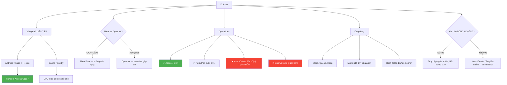

### Định nghĩa

```
Array = TẬP HỢP các phần tử CÙNG KIỂU, lưu ở vùng nhớ LIÊN TIẾP!

  Ví dụ đời thường:
  Hãy tưởng tượng DÃY TỦ ĐỒ trong phòng gym:

    📦 📦 📦 📦 📦
    #0  #1  #2  #3  #4    ← SỐ TỦ = INDEX

    - Các tủ nằm LIỀN NHAU (contiguous)
    - Mỗi tủ có SỐ THỨ TỰ (index, bắt đầu từ 0)
    - Biết số tủ → MỞ NGAY → O(1)!
    - Không cần đi tìm từ tủ đầu tiên!
```

### Khai báo trong JavaScript

```javascript
// Cách 1: Array literal (phổ biến nhất)
let arr = [1, 2, 3, 4, 5];

// Cách 2: Array constructor
let arr2 = new Array(5); // [empty × 5] — chỉ có size, chưa có giá trị
let arr3 = new Array(1, 2, 3); // [1, 2, 3]

// Cách 3: Array.from
let arr4 = Array.from({ length: 5 }, (_, i) => i); // [0, 1, 2, 3, 4]

// Cách 4: Array.fill
let arr5 = new Array(5).fill(0); // [0, 0, 0, 0, 0]
```

### Fixed Size vs Dynamic Size

```
                Fixed Size (C/C++/Java)     Dynamic Size (JS/Python)
  ──────────────────────────────────────────────────────────────────
  Khai báo      int arr[5]                  let arr = []
  Thêm phần tử  ❌ Không được!               ✅ arr.push(x)
  Xóa phần tử   ❌ Khó khăn                  ✅ arr.pop(), arr.splice()
  Bộ nhớ        Cố định, không đổi          Tự động mở rộng ✅
  Hiệu suất     Nhanh hơn (cache)           Linh hoạt hơn ✅

  ⚠️ JS Array thực chất là DYNAMIC ARRAY
     Khi push vượt capacity → tạo mảng mới GẤP ĐÔI → copy sang!
```

### Tại sao cần Array?

```
5 học sinh → 5 biến?           5 học sinh → 1 mảng!

  let mark1 = 90;                let marks = [90, 85, 77, 92, 88];
  let mark2 = 85;
  let mark3 = 77;                // Truy cập: marks[0] = 90
  let mark4 = 92;                // Tổng: marks.reduce((a,b) => a+b)
  let mark5 = 88;                // Max:  Math.max(...marks)

  → 100 học sinh = 100 biến? 😱   → marks[99] → EZ! 😎
```

### Ứng dụng của Array

```
1️⃣  Lưu trữ & Truy cập dữ liệu
    → Lưu theo thứ tự, truy cập O(1) bất kỳ phần tử nào!

2️⃣  Tìm kiếm hiệu quả
    → Mảng sorted → Binary Search O(log n)
    → Tìm floor(), ceiling(), kth smallest, kth largest

3️⃣  Ma trận (Matrix)
    → 2D Array = bảng dữ liệu
    → Dùng trong: đồ thị, xử lý ảnh, game board

4️⃣  Xây dựng cấu trúc dữ liệu khác
    → Stack, Queue, Deque, Hash Table, Heap
    → ĐỀU dùng Array làm NỀN TẢNG bên dưới!

    ┌──────────────────────────────────────┐
    │              Stack                    │
    │         ┌──────────┐                  │
    │         │  Array   │ ← nền tảng!      │
    │         └──────────┘                  │
    │    Queue    Heap    Hash Table         │
    │    ┌────┐  ┌────┐  ┌──────────┐      │
    │    │Arr │  │Arr │  │   Arr    │      │
    │    └────┘  └────┘  └──────────┘      │
    └──────────────────────────────────────┘

5️⃣  Dynamic Programming (QHĐ)
    → Lưu kết quả TRUNG GIAN (memoization / tabulation)
    → VD: dp[i] = kết quả bài con thứ i

6️⃣  Data Buffers — Bộ đệm dữ liệu
    → Tạm lưu dữ liệu đến: network packets, file streams, DB results
    → Xử lý TUẦN TỰ sau khi đã thu thập đủ
```

### Ưu điểm (Advantages)

```
✅ Truy cập NHANH — O(1)
   → Dữ liệu liên tiếp + công thức address = base + i × size
   → Biết index → đến NGAY, không cần duyệt!

✅ Tiết kiệm bộ nhớ
   → 1 block liên tiếp, KHÔNG cần extra pointer
   → Linked List: mỗi node cần thêm con trỏ next (4-8 bytes!)

   So sánh lưu 4 số nguyên (4 bytes/int):
     Array:       [16 bytes]  ← chỉ data!
     Linked List: [16 bytes data] + [16-32 bytes pointers] 💀

✅ Cache Friendly
   → CPU load CẢ BLOCK liền kề vào cache
   → Duyệt mảng = siêu nhanh nhờ spatial locality!

✅ Đa năng (Versatility)
   → Lưu được: int, float, char, string, object, pointer
   → Dùng được ở MỌI NƠI!

✅ Tương thích phần cứng
   → Phần cứng CPU thiết kế tối ưu cho truy cập liên tiếp
   → Array work well với mọi kiến trúc (x86, ARM, ...)
```

### Nhược điểm (Disadvantages)

```
❌ Kích thước CỐ ĐỊNH (Fixed Size)
   → Tạo xong → KHÔNG thể mở rộng!
   → Muốn lớn hơn → tạo mảng MỚI + copy toàn bộ → O(n)!

   Dynamic Array (JS, Python) giải quyết PHẦN NÀO:
     → Tự động resize, nhưng BÊN TRONG vẫn là:
       allocated fixed → đầy → tạo mới gấp đôi → copy!

   capacity: 4        capacity: 8 (gấp đôi!)
   [1, 2, 3, 4] FULL! → [1, 2, 3, 4, 5, _, _, _]
                           ↑ copy toàn bộ + thêm mới

❌ Vấn đề bộ nhớ khi quá lớn
   → Cấp phát mảng quá lớn → HẾT RAM → crash! 💀
   → Đặc biệt trên hệ thống tài nguyên hạn chế

❌ Insert / Delete CHẬM — O(n)
   → Thêm/xóa ở đầu hoặc giữa → phải DỒN tất cả phần tử!

   Xóa ở giữa:
   [10, 20, ✕, 40, 50]
             ←  ←  ←     ← dồn trái n/2 phần tử!
   [10, 20, 40, 50]

   → Nếu cần insert/delete nhiều → dùng Linked List!
```

### Khi nào DÙNG / KHÔNG dùng Array?

```
  ✅ DÙNG Array khi:                    ❌ KHÔNG dùng khi:
  ──────────────────────────────────────────────────────────────
  Cần truy cập ngẫu nhiên nhiều          Insert/Delete ĐẦU nhiều
  Biết trước kích thước                  Kích thước thay đổi liên tục
  Duyệt tuần tự (cache friendly)        Cần insert/delete GIỮA nhiều
  Implement Stack, Queue, Heap           Dữ liệu sparse (nhiều ô trống)
  Dynamic Programming (tabulation)       Không biết trước size max

  → Array = NHANH đọc, CHẬM thêm/xóa
  → Linked List = CHẬM đọc, NHANH thêm/xóa
```

```
💡 TÓM TẮT:
  Array = phần tử cùng kiểu + vùng nhớ liên tiếp
  Index bắt đầu từ 0
  Truy cập O(1) — biết index → lấy ngay!
  JS Array là dynamic — tự mở rộng

  ƯU ĐIỂM:  O(1) access, cache friendly, tiết kiệm bộ nhớ
  NHƯỢC ĐIỂM: fixed size, insert/delete O(n), memory issues
  ỨNG DỤNG:  Stack, Queue, DP, Matrix, Buffer, Search
```

---

<a id="2"></a>

## 2️⃣ Memory Representation — Bộ nhớ

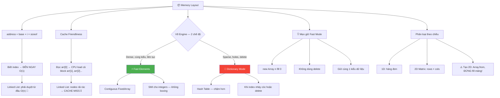

### Cách Array được lưu trong RAM

```
Mảng arr = [10, 20, 30, 40, 50]
Base address = 1000 (giả sử)
Mỗi phần tử = 4 bytes (int)

  Địa chỉ:   1000    1004    1008    1012    1016
              ┌───────┬───────┬───────┬───────┬───────┐
              │  10   │  20   │  30   │  40   │  50   │
              └───────┴───────┴───────┴───────┴───────┘
  Index:        0       1       2       3       4

  CÔNG THỨC: address(arr[i]) = base + i × sizeof(element)

  arr[3] = 1000 + 3 × 4 = 1012 → giá trị 40 → O(1)!
```

### Tại sao Random Access = O(1)?

```
KHÔNG cần duyệt từ đầu!

  Linked List: muốn phần tử thứ 3?
    → đi qua #0 → #1 → #2 → #3 → O(n)! 🐢

  Array: muốn phần tử thứ 3?
    → base + 3 × size = ĐỊA CHỈ → O(1)! ⚡

  Giống như:
    Linked List = đi hỏi đường từng nhà       🐢
    Array       = biết SỐ NHÀ → đến NGAY!     ⚡
```

### Cache Friendliness — Tại sao Array nhanh?

```
CPU Cache = bộ nhớ siêu nhanh, nhỏ, gần CPU

  Khi đọc arr[0], CPU sẽ LOAD cả BLOCK liền kề vào cache:
    arr[0] → cache cũng load arr[1], arr[2], arr[3]...

    ┌───────────────────────────────────┐
    │ CPU Cache (siêu nhanh)            │
    │  [10] [20] [30] [40] [50]         │  ← Cả block được load!
    └───────────────────────────────────┘

    → arr[1], arr[2]... đã SẴN trong cache → NHANH!

  Linked List thì sao?
    Node 1 ở địa chỉ 1000
    Node 2 ở địa chỉ 5000   ← xa nhau!
    Node 3 ở địa chỉ 2500   ← nhảy lung tung!

    → Mỗi node = 1 CACHE MISS → CHẬM! 🐢
```

### JavaScript Array — Bên trong thực sự là gì?

```
⚠️ JS Array ≠ "true array" trong C!

  V8 Engine (Chrome/Node.js) dùng 2 CHẾ ĐỘ lưu trữ:

  ═══════════════════════════════════════════════════════════
  CHẾ ĐỘ 1: FAST ELEMENTS — C-style contiguous array ⚡
  ═══════════════════════════════════════════════════════════
  Khi: mảng dense (liền nhau), index tuần tự, cùng kiểu

  let arr = [1, 2, 3, 4, 5];

  V8 lưu BÊN TRONG (FixedArray):
    ┌─────┬─────┬─────┬─────┬─────┐
    │  1  │  2  │  3  │  4  │  5  │  ← contiguous! NHANH!
    └─────┴─────┴─────┴─────┴─────┘
    → Random access O(1), cache friendly ✅

  Với Primitives (number, boolean):
    V8 dùng "SMI" (Small Integer) → lưu TRỰC TIẾP, không boxing!

  Với Objects:
    Lưu REFERENCES liên tiếp, objects nằm rải rác trên Heap:
    ┌──────────┐
    │ ref_0 ───────→  { name: "A" }    (ở đâu đó trong heap)
    │ ref_1 ───────→  { name: "B" }    (ở chỗ khác trong heap)
    └──────────┘
        ↑ references liên tiếp, nhưng objects thì KHÔNG!

  ═══════════════════════════════════════════════════════════
  CHẾ ĐỘ 2: DICTIONARY MODE — Hash Table! 🐢
  ═══════════════════════════════════════════════════════════
  Khi: mảng sparse (lỗ hổng), index rất lớn, hoặc delete nhiều

  let arr = [];
  arr[0] = "a";
  arr[99999] = "b";   ← LỖ HỔNG 99998 ô!

  V8 KHÔNG tạo mảng 100000 ô (lãng phí!)
  → Chuyển sang HASH TABLE:
    ┌─────────────────────┐
    │ Bucket 0:  0 → "a"  │
    │ Bucket 1:  (empty)   │
    │ ...                  │
    │ Bucket k:  99999→"b" │
    └─────────────────────┘
    → Tiết kiệm bộ nhớ, nhưng CHẬM hơn (hash lookup)!

  ⚠️ KHI NÀO V8 CHUYỂN sang Dictionary Mode?
    → Mảng có LỖ HỔNG (holes): arr = [1, , , 4]
    → Index quá lớn so với length
    → Dùng delete arr[i] (tạo hole)
    → Thêm property non-numeric: arr.foo = "bar"

  💡 MẸO GIỮ FAST MODE:
    → Khởi tạo mảng với giá trị: new Array(n).fill(0)
    → Không dùng delete, dùng splice hoặc gán undefined
    → Giữ index liên tục, không nhảy cóc
    → Giữ cùng 1 kiểu dữ liệu trong mảng
```

### Types of Arrays — Phân loại theo chiều

```
1️⃣ 1D Array (1 chiều):
  [1, 2, 3, 4, 5]

  → Giống 1 HÀNG đơn

2️⃣ 2D Array (Matrix):
  [
    [1, 2, 3],    ← row 0
    [4, 5, 6],    ← row 1
    [7, 8, 9]     ← row 2
  ]

  → Giống BẢNG (rows × cols)
  → Truy cập: matrix[row][col] → matrix[1][2] = 6

3️⃣ 3D Array:
  → Giống KHỐI RUBIK (layers × rows × cols)
  → Ít dùng trong phỏng vấn
```

```javascript
// Tạo 2D Array trong JS:
const rows = 3,
  cols = 4;

// ✅ ĐÚNG:
const matrix = Array.from({ length: rows }, () => new Array(cols).fill(0));

// ❌ SAI (bẫy kinh điển!):
const bad = new Array(rows).fill(new Array(cols).fill(0));
// → Tất cả rows DÙNG CHUNG 1 array! Thay đổi 1 = thay đổi tất cả!
```

```
💡 TÓM TẮT:
  Array lưu liên tiếp → Random Access O(1)
  Cache friendly → nhanh hơn Linked List
  JS Array = dynamic, lưu references
  Tạo 2D: dùng Array.from(), ĐỪNG dùng fill([])!
```

---

<a id="3"></a>

## 3️⃣ Array Operations — Các thao tác cơ bản

```mermaid
graph TD
    A["🔧 Array Operations"] --> B["Thêm phần tử"]
    B --> B1["push cuối: O(1) amortized ✅"]
    B --> B2["unshift đầu: O(n) ❌ — dồn tất cả"]
    B --> B3["splice giữa: O(n) — dồn phần sau"]

    A --> C["Xóa phần tử"]
    C --> C1["pop cuối: O(1) ✅"]
    C --> C2["shift đầu: O(n) ❌ — dồn trái"]
    C --> C3["splice giữa: O(n)"]

    A --> D["Tìm kiếm"]
    D --> D1["Linear Search: O(n)"]
    D --> D2["Binary Search: O(log n) — CHỈ khi SORTED"]

    A --> E["⚠️ JS Pitfalls"]
    E --> E1["splice MUTATE gốc"]
    E --> E2["slice KHÔNG mutate"]
    E --> E3["sort: PHẢI truyền a,b => a-b"]
    E --> E4["fill mảng → CÙNG reference 💀"]
    E --> E5["Shallow copy ≠ Deep copy"]

    A --> F["💡 LeetCode Tips"]
    F --> F1["Swap: [a,b] = [b,a]"]
    F --> F2["Max: Math.max...arr"]
    F --> F3["Dedup: ...new Set arr"]
    F --> F4["Sum: reduce a+b, 0"]

    style B1 fill:#4CAF50,color:white
    style C1 fill:#4CAF50,color:white
    style B2 fill:#F44336,color:white
    style C2 fill:#F44336,color:white
```

### Traversal — Duyệt mảng

```javascript
const arr = [10, 20, 30, 40, 50];

// Cách 1: for loop (kinh điển, linh hoạt nhất)
for (let i = 0; i < arr.length; i++) {
  console.log(arr[i]);
}

// Cách 2: for...of (gọn, khi không cần index)
for (const val of arr) {
  console.log(val);
}

// Cách 3: forEach (functional)
arr.forEach((val, index) => {
  console.log(index, val);
});

// Time: O(n) — phải đi qua TỪNG phần tử
```

### Insertion — Thêm phần tử

```
VỊ TRÍ THÊM ảnh hưởng độ phức tạp!

  Thêm CUỐI (push):    O(1) amortized ✅
  Thêm ĐẦU (unshift):  O(n) ❌ — phải DỒN tất cả!
  Thêm GIỮA (splice):  O(n) ❌ — phải dồn phần sau!
```

```javascript
let arr = [10, 20, 30, 40];

// 1️⃣ Thêm CUỐI — O(1) amortized
arr.push(50);
// arr = [10, 20, 30, 40, 50]

// 2️⃣ Thêm ĐẦU — O(n)
arr.unshift(5);
// arr = [5, 10, 20, 30, 40, 50]
// Vì phải DỒN tất cả sang phải 1 ô!
```

```
Trace unshift(5):
  TRƯỚC: [10, 20, 30, 40]
              ↓   ↓   ↓   ↓     ← dồn phải!
  SAU:   [ 5, 10, 20, 30, 40]

  Phải DI CHUYỂN n phần tử → O(n)!
```

```javascript
// 3️⃣ Thêm VÀO GIỮA — O(n)
let arr = [10, 20, 40, 50];
arr.splice(2, 0, 30); // Tại index 2, xóa 0, thêm 30
// arr = [10, 20, 30, 40, 50]
```

```
Trace splice(2, 0, 30):
  TRƯỚC: [10, 20, 40, 50]
                     ↓   ↓    ← dồn phải từ index 2!
  SAU:   [10, 20, 30, 40, 50]
                  ↑ thêm 30
```

### Deletion — Xóa phần tử

```javascript
let arr = [10, 20, 30, 40, 50];

// 1️⃣ Xóa CUỐI — O(1)
arr.pop(); // arr = [10, 20, 30, 40]

// 2️⃣ Xóa ĐẦU — O(n)
arr.shift(); // arr = [20, 30, 40]

// 3️⃣ Xóa GIỮA — O(n)
arr.splice(1, 1); // Tại index 1, xóa 1 phần tử
// arr = [20, 40]
```

```
Trace shift():
  TRƯỚC: [10, 20, 30, 40, 50]
           ✕  ←   ←   ←   ←     ← dồn trái!
  SAU:   [20, 30, 40, 50]

  Phải DI CHUYỂN n-1 phần tử → O(n)!
```

### Searching — Tìm kiếm

```javascript
// 1️⃣ Linear Search — O(n)
function linearSearch(arr, target) {
  for (let i = 0; i < arr.length; i++) {
    if (arr[i] === target) return i;
  }
  return -1;
}

// 2️⃣ Binary Search — O(log n) — CHỈ khi ĐÃ SẮP XẾP!
function binarySearch(arr, target) {
  let lo = 0,
    hi = arr.length - 1;
  while (lo <= hi) {
    const mid = Math.floor((lo + hi) / 2);
    if (arr[mid] === target) return mid;
    else if (arr[mid] < target) lo = mid + 1;
    else hi = mid - 1;
  }
  return -1;
}
```

### Bảng tổng hợp Big-O

```
  Thao tác           Array       Linked List
  ──────────────────────────────────────────────
  Access (by index)   O(1) ✅     O(n)
  Search              O(n)        O(n)
  Insert ở ĐẦU       O(n)        O(1) ✅
  Insert ở CUỐI       O(1)*       O(1)*
  Insert ở GIỮA       O(n)        O(1)**
  Delete ở ĐẦU       O(n)        O(1) ✅
  Delete ở CUỐI       O(1)        O(n) hoặc O(1)*
  Delete ở GIỮA       O(n)        O(1)**

  * amortized
  ** nếu đã có pointer đến node cần thao tác!
```

### JavaScript Array Methods — Cheat Sheet

```
  THAY ĐỔI mảng gốc (MUTATE):         TẠO mảng mới (KHÔNG mutate):
  ────────────────────────────────      ────────────────────────────
  push(x)     → thêm cuối  O(1)*       slice(i, j)   → copy đoạn O(j-i)
  pop()       → xóa cuối   O(1)        concat(arr2)  → nối mảng  O(n+m)
  unshift(x)  → thêm đầu   O(n)        map(fn)       → transform O(n)
  shift()     → xóa đầu    O(n)        filter(fn)    → lọc       O(n)
  splice(i,d) → xóa/thêm   O(n)        reduce(fn)    → tích lũy  O(n)
  sort(fn)    → sắp xếp    O(n log n)  flat(depth)   → làm phẳng O(n)
  reverse()   → đảo ngược  O(n)        flatMap(fn)   → map+flat  O(n)
  fill(v)     → điền giá trị O(n)       join(sep)     → → string  O(n)

  TÌM KIẾM:                            KIỂM TRA:
  ────────────────────────────          ────────────────────────────
  indexOf(x)      → index     O(n)     includes(x)    → boolean   O(n)
  lastIndexOf(x)  → last idx  O(n)     every(fn)      → tất cả?   O(n)
  find(fn)        → element   O(n)     some(fn)       → ít nhất?  O(n)
  findIndex(fn)   → index     O(n)     Array.isArray() → is arr?  O(1)

  * amortized — đôi khi O(n) khi cần resize
```

### ⚠️ Cạm bẫy Array Methods trong JS

```javascript
// 1️⃣ splice vs slice — HAY NHẦM!
const arr = [1, 2, 3, 4, 5];
arr.splice(1, 2);   // MUTATE! xóa 2 phần tử từ idx 1 → arr = [1, 4, 5]
arr.slice(1, 3);     // KHÔNG mutate! copy [1, 3) → [4, 5] (arr giữ nguyên)

// 2️⃣ sort() THAY ĐỔI mảng gốc!
const nums = [3, 1, 2];
const sorted = nums.sort();    // nums BỊ THAY ĐỔI! nums === sorted === [1,2,3]
const safe = [...nums].sort(); // ✅ ĐÚNG: tạo copy trước khi sort

// 3️⃣ Clone mảng — các cách phổ biến
const original = [1, [2, 3], 4];
const shallow1 = [...original];        // spread — shallow copy ✅
const shallow2 = original.slice();     // slice — shallow copy ✅
const shallow3 = Array.from(original); // Array.from — shallow copy ✅
const deep = JSON.parse(JSON.stringify(original)); // deep copy (chậm!)
// structuredClone(original);          // deep copy (modern, nhanh hơn!)

// ⚠️ Shallow copy = chỉ copy LỚP NGOÀI!
shallow1[1].push(99);   // original[1] cũng BỊ THAY ĐỔI! [2, 3, 99]

// 4️⃣ Array destructuring — rất dùng trong LeetCode
const [first, ...rest] = [1, 2, 3, 4];
// first = 1, rest = [2, 3, 4]

const [a, , c] = [10, 20, 30];  // skip phần tử giữa!
// a = 10, c = 30

// 5️⃣ Array.from — tạo mảng từ length
const matrix = Array.from({ length: 3 }, () => new Array(4).fill(0));
// → [[0,0,0,0], [0,0,0,0], [0,0,0,0]]

// ⚠️ SAI: new Array(3).fill(new Array(4).fill(0))
// → 3 hàng CÙNG THAM CHIẾU 1 mảng! Sửa 1 hàng = sửa hết! 💀
```

### Practical Tips cho LeetCode

```
  1. Dùng Swap trong JS:
     [arr[i], arr[j]] = [arr[j], arr[i]];
     → Destructuring swap, KHÔNG cần biến temp!

  2. Tạo mảng:
     new Array(n).fill(0)         → [0, 0, ..., 0]
     Array.from({length: n}, (_, i) => i)  → [0, 1, ..., n-1]

  3. Max/Min trong mảng:
     Math.max(...arr)  → max  ⚠️ stack overflow nếu arr quá lớn!
     arr.reduce((a,b) => Math.max(a,b))  → an toàn hơn ✅

  4. Tổng mảng:
     arr.reduce((sum, x) => sum + x, 0)

  5. Đếm phần tử:
     arr.reduce((map, x) => map.set(x, (map.get(x)||0)+1) || map, new Map())

  6. Flatten nested array:
     arr.flat(Infinity)           → [1, [2, [3]]] → [1, 2, 3]

  7. Remove duplicates:
     [...new Set(arr)]            → unique values!

  8. Chunk array (chia đoạn):
     Array.from({length: Math.ceil(n/k)}, (_, i) => arr.slice(i*k, i*k+k))
```

```
💡 TÓM TẮT:
  Array MẠNH ở: Access O(1), Cache friendly
  Array YẾU ở:  Insert/Delete ở đầu/giữa → O(n) vì phải DỒN!
  → Dùng Array khi cần truy cập ngẫu nhiên nhiều
  → Dùng Linked List khi cần insert/delete đầu/giữa nhiều

  ⚠️ JS Pitfalls:
  - splice MUTATE, slice KHÔNG mutate
  - sort() THAY ĐỔI gốc → clone trước!
  - fill([]) → CÙNG reference! Dùng Array.from!
  - Shallow copy ≠ Deep copy cho nested arrays
```

---

<a id="4"></a>

## 4️⃣ Two Pointers Technique

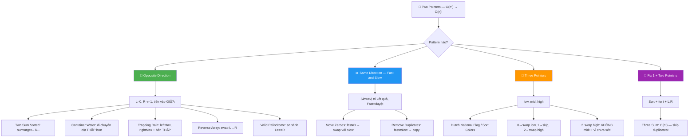

### Two Pointers là gì?

```
Dùng 2 CON TRỎ (index) di chuyển trên mảng
thay vì dùng 2 vòng for lồng nhau!

  2 vòng for: O(n²) → Two Pointers: O(n)!

  Ví dụ đời thường:
  2 người ĐI TỪ 2 ĐẦU hành lang → gặp nhau ở giữa!

    L →                        ← R
    📦 📦 📦 📦 📦 📦 📦 📦
    0  1  2  3  4  5  6  7
```

### Pattern 1: Opposite Direction (đi ngược chiều)

```
2 pointers bắt đầu từ 2 ĐẦU, tiến vào GIỮA

  Dùng khi: mảng ĐÃ SẮP XẾP + tìm pair
```

### Ví dụ: Two Sum trên mảng sorted

```javascript
// Cho mảng SORTED, tìm 2 số có tổng = target
function twoSumSorted(arr, target) {
  let left = 0,
    right = arr.length - 1;

  while (left < right) {
    const sum = arr[left] + arr[right];

    if (sum === target) return [left, right];
    else if (sum < target)
      left++; // tổng nhỏ → tăng left
    else right--; // tổng lớn → giảm right
  }
  return [-1, -1]; // không tìm thấy
}
```

### Trace Two Sum: arr = [1, 3, 5, 7, 9], target = 8

```
  L=0, R=4: arr[0]+arr[4] = 1+9 = 10 > 8 → R--
  L=0, R=3: arr[0]+arr[3] = 1+7 = 8 = target → FOUND! ✅

  [1, 3, 5, 7, 9]
   L        R       → 1+9=10 > 8 → R--
   L     R          → 1+7=8 = target ✅

  Time: O(n) thay vì O(n²)!
```

### Tại sao Two Pointers đúng?

```
CHỨNG MINH tại sao KHÔNG BỎ SÓT đáp án:

  Mảng sorted: [a₀ ≤ a₁ ≤ ... ≤ aₙ]

  Khi sum > target → giảm R:
    Vì aL + aR > target
    → aL + a(R-1) sẽ NHỎ HƠN (gần target hơn)
    → aL + a(R+1) sẽ CÒN LỚN HƠN → CHẮC CHẮN sai!
    → Loại bỏ CỘT R trong ma trận → KHÔNG MẤT đáp án!

  Khi sum < target → tăng L: lý luận tương tự!
```

### Pattern 2: Same Direction (cùng chiều) — Fast & Slow

```
2 pointers cùng đi 1 hướng, tốc độ KHÁC NHAU

  Dùng khi: xóa duplicates, partition, ...
```

### Ví dụ: Remove Duplicates from Sorted Array

```javascript
// Xóa duplicates in-place, return new length
function removeDuplicates(arr) {
  if (arr.length === 0) return 0;

  let slow = 0; // vị trí phần tử unique cuối cùng

  for (let fast = 1; fast < arr.length; fast++) {
    if (arr[fast] !== arr[slow]) {
      slow++;
      arr[slow] = arr[fast]; // copy phần tử unique
    }
  }
  return slow + 1; // length of unique elements
}
```

### Trace: arr = [1, 1, 2, 2, 3]

```
  Ban đầu: slow=0, fast=1

  fast=1: arr[1]=1 === arr[0]=1 → skip
  fast=2: arr[2]=2 !== arr[0]=1 → slow=1, arr[1]=2
  fast=3: arr[3]=2 === arr[1]=2 → skip
  fast=4: arr[4]=3 !== arr[1]=2 → slow=2, arr[2]=3

  Kết quả: arr = [1, 2, 3, ...], return 3

  Minh họa:
  [1, 1, 2, 2, 3]
   S  F              → same → skip
   S     F           → diff → S++, copy
      S     F        → same → skip
      S        F     → diff → S++, copy
         S        F  → DONE! unique = 3 ✅
```

### Ví dụ kinh điển: Reverse an Array

```javascript
function reverseArray(arr) {
  let left = 0,
    right = arr.length - 1;

  while (left < right) {
    // Swap
    [arr[left], arr[right]] = [arr[right], arr[left]];
    left++;
    right--;
  }
  return arr;
}
```

```
Trace: [1, 2, 3, 4, 5]

  L=0, R=4: swap(1,5) → [5, 2, 3, 4, 1]
  L=1, R=3: swap(2,4) → [5, 4, 3, 2, 1]
  L=2, R=2: L >= R → STOP!

  Kết quả: [5, 4, 3, 2, 1] ✅
  Time: O(n/2) = O(n)
```

### Ví dụ: Move Zeroes to End

```javascript
function moveZeroes(arr) {
  let slow = 0; // vị trí để đặt phần tử khác 0

  for (let fast = 0; fast < arr.length; fast++) {
    if (arr[fast] !== 0) {
      [arr[slow], arr[fast]] = [arr[fast], arr[slow]];
      slow++;
    }
  }
  return arr;
}
```

```
Trace: [0, 1, 0, 3, 12]

  S=0, F=0: arr[0]=0 → skip
  S=0, F=1: arr[1]=1 → swap(0,1) → [1, 0, 0, 3, 12], S=1
  S=1, F=2: arr[2]=0 → skip
  S=1, F=3: arr[3]=3 → swap(1,3) → [1, 3, 0, 0, 12], S=2
  S=2, F=4: arr[4]=12 → swap(2,4) → [1, 3, 12, 0, 0], S=3

  Kết quả: [1, 3, 12, 0, 0] ✅
```

### Ví dụ: Three Sum (LeetCode #15) — KINH ĐIỂN!

```
Tìm tất cả bộ 3 số có tổng = 0 (không trùng lặp!)

  nums = [-1, 0, 1, 2, -1, -4]
  → [[-1, -1, 2], [-1, 0, 1]]

  Ý tưởng: FIX 1 số (vòng for) + Two Sum sorted (phần còn lại)!
  Sort trước → Two Pointers cho 2 số còn lại
```

```javascript
function threeSum(nums) {
  nums.sort((a, b) => a - b); // Sort trước!
  const result = [];

  for (let i = 0; i < nums.length - 2; i++) {
    // Skip duplicates cho số thứ 1
    if (i > 0 && nums[i] === nums[i - 1]) continue;

    // Nếu nums[i] > 0 → không thể tổng = 0 (vì sorted, tất cả còn lại > 0)
    if (nums[i] > 0) break;

    let left = i + 1, right = nums.length - 1;

    while (left < right) {
      const sum = nums[i] + nums[left] + nums[right];

      if (sum === 0) {
        result.push([nums[i], nums[left], nums[right]]);
        // Skip duplicates cho số thứ 2 và 3
        while (left < right && nums[left] === nums[left + 1]) left++;
        while (left < right && nums[right] === nums[right - 1]) right--;
        left++;
        right--;
      } else if (sum < 0) {
        left++;    // tổng nhỏ → tăng left
      } else {
        right--;   // tổng lớn → giảm right
      }
    }
  }
  return result;
}
// Time: O(n²) — sort O(n log n) + vòng for × two pointers O(n)
```

### Trace Three Sum: [-1, 0, 1, 2, -1, -4]

```
  Sau sort: [-4, -1, -1, 0, 1, 2]

  i=0, nums[0]=-4:
    L=1, R=5: -4 + -1 + 2 = -3 < 0 → L++
    L=2, R=5: -4 + -1 + 2 = -3 < 0 → L++
    L=3, R=5: -4 + 0 + 2 = -2 < 0 → L++
    L=4, R=5: -4 + 1 + 2 = -1 < 0 → L++
    L=5, R=5: L >= R → STOP

  i=1, nums[1]=-1:
    L=2, R=5: -1 + -1 + 2 = 0 → FOUND! [-1,-1,2] ✅
    skip dups → L=3, R=4
    L=3, R=4: -1 + 0 + 1 = 0 → FOUND! [-1,0,1] ✅
    L=4, R=3: L >= R → STOP

  i=2, nums[2]=-1: SKIP (duplicate! nums[2]=nums[1])

  i=3, nums[3]=0: 0 > 0? Không, nhưng 0+1+2=3 > 0, sẽ chạy bình thường
    L=4, R=5: 0 + 1 + 2 = 3 > 0 → R--
    L=4, R=4: L >= R → STOP

  Kết quả: [[-1,-1,2], [-1,0,1]] ✅
```

### ⚠️ Tại sao phải skip duplicates?

```
  Nếu KHÔNG skip:

  [-1, -1, 0, 1]
    i=0: [-1, -1, 0+1=1? → [-1,0,1]]
    i=1: [-1, 0, 1] → LẬP LẠI! ❌

  3 chỗ cần skip:
    1. nums[i] === nums[i-1]       → skip số thứ 1
    2. nums[left] === nums[left+1] → skip số thứ 2
    3. nums[right] === nums[right-1] → skip số thứ 3
```

### Ví dụ: Container With Most Water (LeetCode #11)

```
Cho mảng height[], tìm 2 cột tạo thành bình chứa NHIỀU NƯỚC nhất!

  height = [1, 8, 6, 2, 5, 4, 8, 3, 7]

    8 |   █           █
    7 |   █     ░ ░ ░ █ ░ █    ← water level = min(8,7) = 7
    6 |   █ █   ░ ░ ░ █ ░ █    width = 8 - 1 = 7
    5 |   █ █ ░ █ ░ ░ █ ░ █    area = 7 × 7 = 49 ✅
    4 |   █ █ ░ █ █ ░ █ ░ █
    3 |   █ █ ░ █ █ ░ █ █ █
    2 |   █ █ █ █ █ ░ █ █ █
    1 | █ █ █ █ █ █ █ █ █
      └─────────────────────
        0 1 2 3 4 5 6 7 8

  Diện tích = min(height[L], height[R]) × (R - L)
```

```javascript
function maxArea(height) {
  let left = 0, right = height.length - 1;
  let maxWater = 0;

  while (left < right) {
    const water = Math.min(height[left], height[right]) * (right - left);
    maxWater = Math.max(maxWater, water);

    // Di chuyển cột THẤP HƠN!
    if (height[left] < height[right]) left++;
    else right--;
  }
  return maxWater;
}
// Time: O(n), Space: O(1)
```

### Tại sao di chuyển cột THẤP?

```
  Nước bị GIỚI HẠN bởi cột THẤP hơn!

  Nếu giữ cột thấp + di chuyển cột cao:
    → Cột mới có thể cao hơn NHƯNG nước vẫn bị GIỮ bởi cột thấp
    → Width giảm → area CHẮC CHẮN giảm! ❌

  Nếu di chuyển cột thấp:
    → Cột mới CÓ THỂ cao hơn → min tăng → area CÓ THỂ tăng! ✅
    → Dù width giảm 1, nhưng height có thể tăng nhiều hơn

  → Luôn di chuyển cột THẤP để TÌM CÓ HỘI cải thiện!
```

### Ví dụ: Dutch National Flag / Sort Colors (LeetCode #75)

```
Sort mảng chỉ có 3 giá trị: 0, 1, 2 — trong O(n), 1 pass!

  [2, 0, 2, 1, 1, 0] → [0, 0, 1, 1, 2, 2]

  Dùng 3 POINTERS:
    low   = ranh giới vùng 0 (mọi thứ trước low = 0)
    mid   = pointer đang xét
    high  = ranh giới vùng 2 (mọi thứ sau high = 2)
```

```javascript
function sortColors(nums) {
  let low = 0, mid = 0, high = nums.length - 1;

  while (mid <= high) {
    if (nums[mid] === 0) {
      [nums[low], nums[mid]] = [nums[mid], nums[low]];
      low++;
      mid++;
    } else if (nums[mid] === 1) {
      mid++; // 1 đã đúng chỗ!
    } else { // nums[mid] === 2
      [nums[mid], nums[high]] = [nums[high], nums[mid]];
      high--;
      // KHÔNG mid++! Vì phần tử swap từ high chưa xét!
    }
  }
}
```

### Trace: [2, 0, 2, 1, 1, 0]

```
  L=0, M=0, H=5

  M=0: nums[0]=2 → swap(M,H) → [0, 0, 2, 1, 1, 2], H=4
       ⚠️ KHÔNG M++! (phần tử mới chưa xét)

  M=0: nums[0]=0 → swap(L,M) → [0, 0, 2, 1, 1, 2], L=1, M=1

  M=1: nums[1]=0 → swap(L,M) → [0, 0, 2, 1, 1, 2], L=2, M=2

  M=2: nums[2]=2 → swap(M,H) → [0, 0, 1, 1, 2, 2], H=3

  M=2: nums[2]=1 → M=3

  M=3: nums[3]=1 → M=4

  M=4: M > H=3 → STOP!

  Kết quả: [0, 0, 1, 1, 2, 2] ✅

  Minh họa VÙNG:
   [0, 0, | 1, 1, | 2, 2]
    vùng 0   vùng 1   vùng 2
    ↑ low    ↑ mid    ↑ high
```

### Ví dụ: Trapping Rain Water (LeetCode #42) — HARD!

```
Cho mảng height[], tính TỔNG lượng nước bẫy được!

  height = [0, 1, 0, 2, 1, 0, 1, 3, 2, 1, 2, 1]
  → water = 6

    3 |               █
    2 |       █ ░ ░ ░ █ █ ░ █
    1 |   █ ░ █ █ ░ █ █ █ █ █ █
    0 | ░ █ ░ █ █ ░ █ █ █ █ █ █
      └─────────────────────────
        0 1 2 3 4 5 6 7 8 9 10 11

  Tại mỗi cột i:
    water[i] = min(maxLeft[i], maxRight[i]) - height[i]
    (nếu > 0)
```

```javascript
// Cách 1: Prefix Max — O(n) time, O(n) space
function trap(height) {
  const n = height.length;
  if (n === 0) return 0;

  const maxLeft = new Array(n);
  const maxRight = new Array(n);

  maxLeft[0] = height[0];
  for (let i = 1; i < n; i++) {
    maxLeft[i] = Math.max(maxLeft[i - 1], height[i]);
  }

  maxRight[n - 1] = height[n - 1];
  for (let i = n - 2; i >= 0; i--) {
    maxRight[i] = Math.max(maxRight[i + 1], height[i]);
  }

  let water = 0;
  for (let i = 0; i < n; i++) {
    water += Math.min(maxLeft[i], maxRight[i]) - height[i];
  }
  return water;
}
```

```javascript
// Cách 2: Two Pointers — O(n) time, O(1) space! ✅
function trapOptimal(height) {
  let left = 0, right = height.length - 1;
  let leftMax = 0, rightMax = 0;
  let water = 0;

  while (left < right) {
    if (height[left] < height[right]) {
      leftMax = Math.max(leftMax, height[left]);
      water += leftMax - height[left]; // nước tại cột left
      left++;
    } else {
      rightMax = Math.max(rightMax, height[right]);
      water += rightMax - height[right]; // nước tại cột right
      right--;
    }
  }
  return water;
}
```

### Trace Two Pointers: [0, 1, 0, 2, 1, 0, 1, 3, 2, 1, 2, 1]

```
  L=0, R=11, lMax=0, rMax=0, water=0

  h[L]=0 < h[R]=1:
    lMax=max(0,0)=0, water+=0-0=0, L=1

  h[L]=1 >= h[R]=1:
    rMax=max(0,1)=1, water+=1-1=0, R=10

  h[L]=1 < h[R]=2:
    lMax=max(0,1)=1, water+=1-1=0, L=2

  h[L]=0 < h[R]=2:
    lMax=max(1,0)=1, water+=1-0=1 ✅, L=3

  h[L]=2 >= h[R]=2:
    rMax=max(1,2)=2, water+=2-2=0, R=9

  h[L]=2 >= h[R]=1:
    rMax=max(2,1)=2, water+=2-1=1 ✅, R=8

  h[L]=2 >= h[R]=2:
    rMax=max(2,2)=2, water+=2-2=0, R=7

  h[L]=2 < h[R]=3:
    lMax=max(1,2)=2, water+=2-2=0, L=4

  h[L]=1 < h[R]=3:
    lMax=max(2,1)=2, water+=2-1=1 ✅, L=5

  h[L]=0 < h[R]=3:
    lMax=max(2,0)=2, water+=2-0=2 ✅, L=6

  h[L]=1 < h[R]=3:
    lMax=max(2,1)=2, water+=2-1=1 ✅, L=7

  L=7 >= R=7: STOP!
  water = 0+0+0+1+0+1+0+0+1+2+1 = 6 ✅
```

```
💡 TÓM TẮT:
  Two Pointers biến O(n²) → O(n)!

  3 Pattern chính:
    🔄 Opposite: L→ ←R (sorted array, pair tìm kiếm)
    ➡️  Same:    S→ F→ (remove, partition, filter in-place)
    🏁 Three:   L, M, H (Dutch National Flag, 3-way partition)

  Bài kinh điển:
    Two Sum Sorted    → Opposite direction
    Three Sum         → Fix 1 + Two Pointers (O(n²))
    Container Water   → Di chuyển cột THẤP
    Sort Colors       → 3 pointers: low, mid, high
    Trapping Rain     → leftMax, rightMax + di chuyển bên THẤP
    Move Zeroes       → Same direction (fast/slow)
    Reverse Array     → Opposite direction + swap

  Điều kiện hay dùng: mảng ĐÃ SẮP XẾP hoặc in-place operation
```

---

<a id="5"></a>

## 5️⃣ Sliding Window Technique

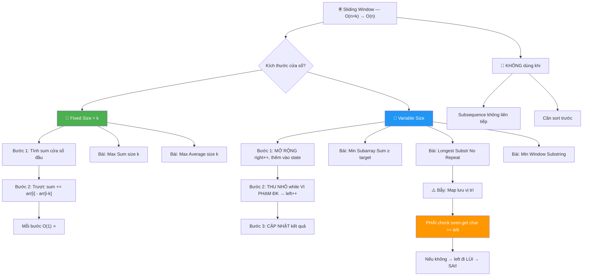

### Sliding Window là gì?

```
Duy trì 1 "CỬA SỔ" trượt trên mảng!

  Thay vì tính lại TỪ ĐẦU mỗi lần,
  chỉ CẬP NHẬT khi cửa sổ TRƯỢT!

  Ví dụ: Tìm max sum của 3 phần tử LIÊN TIẾP

  [1, 4, 2, 10, 2, 3, 1, 0, 20]

  Brute force: tính sum mỗi subarray 3 phần tử → O(n×k)
  Sliding Window: trượt cửa sổ → O(n)!

  ┌─────────┐
  │1, 4, 2, │10, 2, 3, 1, 0, 20    sum = 7
  └─────────┘
     ┌─────────┐
   1,│4, 2, 10,│ 2, 3, 1, 0, 20    sum = 7 - 1 + 10 = 16
     └─────────┘
            ← BỎ phần tử đầu, THÊM phần tử cuối!
```

### Fixed Size Window

```javascript
// Max sum of subarray có size = k
function maxSumSubarray(arr, k) {
  // Tính sum cửa sổ ĐẦU TIÊN
  let windowSum = 0;
  for (let i = 0; i < k; i++) windowSum += arr[i];

  let maxSum = windowSum;

  // TRƯỢT cửa sổ
  for (let i = k; i < arr.length; i++) {
    windowSum += arr[i]; // THÊM phần tử mới (bên phải)
    windowSum -= arr[i - k]; // BỎ phần tử cũ (bên trái)
    maxSum = Math.max(maxSum, windowSum);
  }
  return maxSum;
}
```

### Trace: arr = [1, 4, 2, 10, 2, 3], k = 3

```
  Cửa sổ đầu: sum = 1+4+2 = 7, max = 7

  i=3: sum = 7 + arr[3] - arr[0] = 7 + 10 - 1 = 16, max = 16
     [1, |4, 2, 10|, 2, 3]

  i=4: sum = 16 + arr[4] - arr[1] = 16 + 2 - 4 = 14, max = 16
     [1, 4, |2, 10, 2|, 3]

  i=5: sum = 14 + arr[5] - arr[2] = 14 + 3 - 2 = 15, max = 16
     [1, 4, 2, |10, 2, 3|]

  Kết quả: maxSum = 16 ✅ (subarray [4, 2, 10])
```

### Variable Size Window

```
Size KHÔNG CỐ ĐỊNH — mở rộng/thu nhỏ tùy điều kiện!

  Dùng khi: "tìm subarray nhỏ nhất/dài nhất THỎA điều kiện"
```

### Ví dụ: Smallest Subarray with Sum ≥ target

```javascript
function minSubarrayLen(target, arr) {
  let left = 0,
    sum = 0;
  let minLen = Infinity;

  for (let right = 0; right < arr.length; right++) {
    sum += arr[right]; // MỞ RỘNG cửa sổ

    // THU NHỎ cửa sổ khi sum đủ lớn
    while (sum >= target) {
      minLen = Math.min(minLen, right - left + 1);
      sum -= arr[left]; // bỏ phần tử trái
      left++; // thu nhỏ!
    }
  }
  return minLen === Infinity ? 0 : minLen;
}
```

### Trace: arr = [2, 3, 1, 2, 4, 3], target = 7

```
  R=0: sum=2, < 7
  R=1: sum=5, < 7
  R=2: sum=6, < 7
  R=3: sum=8, ≥ 7 → minLen=4 [2,3,1,2], bỏ L=0 → sum=6, L=1
  R=4: sum=10, ≥ 7 → minLen=3 [1,2,4], bỏ L=1 → sum=7
       still ≥ 7 → minLen=3 [2,4], wait... 7≥7 → minLen=2? NO
       sum=7 ≥ 7 → minLen=min(3, 4-2+1)=3, bỏ L=2 → sum=6, L=3
  R=5: sum=9, ≥ 7 → minLen=min(3, 5-3+1)=3, bỏ L=3 → sum=7
       ≥ 7 → minLen=min(3, 5-4+1)=2! bỏ L=4 → sum=3, L=5

  Kết quả: minLen = 2 ✅ (subarray [4, 3])
```

### Ví dụ quan trọng: Longest Substring Without Repeating Characters

```
Bài LeetCode #3 — kinh điển nhất cho Sliding Window!

  Cho string, tìm SUBSTRING DÀI NHẤT không có ký tự lặp

  "abcabcbb" → "abc" → length = 3
  "bbbbb"    → "b"   → length = 1
  "pwwkew"   → "wke" → length = 3
```

```javascript
function lengthOfLongestSubstring(s) {
  const seen = new Map(); // char → last index
  let left = 0,
    maxLen = 0;

  for (let right = 0; right < s.length; right++) {
    const char = s[right];

    // Nếu char đã xuất hiện VÀ trong cửa sổ hiện tại
    if (seen.has(char) && seen.get(char) >= left) {
      left = seen.get(char) + 1; // THU NHỎ: nhảy qua vị trí trùng
    }

    seen.set(char, right); // cập nhật vị trí mới nhất
    maxLen = Math.max(maxLen, right - left + 1);
  }
  return maxLen;
}
```

### Trace: "abcabcbb"

```
  Map = {}, L=0, maxLen=0

  R=0, char='a': chưa có → Map={a:0}, len=1, maxLen=1
    CỬA SỔ: [a]bcabcbb

  R=1, char='b': chưa có → Map={a:0,b:1}, len=2, maxLen=2
    CỬA SỔ: [ab]cabcbb

  R=2, char='c': chưa có → Map={a:0,b:1,c:2}, len=3, maxLen=3
    CỬA SỔ: [abc]abcbb

  R=3, char='a': ĐÃ CÓ tại 0 (≥ L=0) → L=0+1=1
    Map={a:3,b:1,c:2}, len=3, maxLen=3
    CỬA SỔ: a[bca]bcbb
                ↑ nhảy qua 'a' cũ!

  R=4, char='b': ĐÃ CÓ tại 1 (≥ L=1) → L=1+1=2
    Map={a:3,b:4,c:2}, len=3, maxLen=3
    CỬA SỔ: ab[cab]cbb

  R=5, char='c': ĐÃ CÓ tại 2 (≥ L=2) → L=2+1=3
    Map={a:3,b:4,c:5}, len=3, maxLen=3
    CỬA SỔ: abc[abc]bb

  R=6, char='b': ĐÃ CÓ tại 4 (≥ L=3) → L=4+1=5
    Map={a:3,b:6,c:5}, len=2, maxLen=3
    CỬA SỔ: abcab[cb]b

  R=7, char='b': ĐÃ CÓ tại 6 (≥ L=5) → L=6+1=7
    Map={a:3,b:7,c:5}, len=1, maxLen=3
    CỬA SỔ: abcabcb[b]

  Kết quả: maxLen = 3 ✅ ("abc")
```

### Tại sao kiểm tra `seen.get(char) >= left`?

```
⚠️ QUAN TRỌNG! Không kiểm tra → SAI!

  Ví dụ: "abba"
  R=0: a→0, L=0  CỬA SỔ: [a]bba
  R=1: b→1, L=0  CỬA SỔ: [ab]ba
  R=2: b trùng tại 1 (≥ L=0) → L=2  CỬA SỔ: ab[b]a
  R=3: a trùng tại 0, NHƯNG 0 < L=2! → a cũ ĐÃ NGOÀI cửa sổ!
       → KHÔNG cần thu nhỏ! len = 3-2+1 = 2

  Nếu không check >= left:
       → L sẽ nhảy về 0+1=1 (SAI! Đi lùi!)
       → Cửa sổ sẽ chứa 'b' lặp!
```

### So sánh Fixed vs Variable Window

```
                     Fixed Size               Variable Size
  ──────────────────────────────────────────────────────────────
  Size cửa sổ        LUÔN = k                 Thay đổi tùy ĐK
  Template           for(i=k; i<n; i++)       while(thỏa ĐK) left++
  Khi nào mở rộng    Luôn mở rộng             right++ mỗi vòng
  Khi nào thu nhỏ    Luôn thu nhỏ (bỏ trái)   Chỉ khi thỏa/vi phạm ĐK
  Ví dụ bài toán     Max sum size k           Min subarray sum ≥ target
                     Max avg size k           Longest substr no repeat
                     Fixed window count       Min window substring
```

### Template tổng quát — Variable Window

```javascript
function slidingWindowTemplate(arr) {
  let left = 0;
  let result = 0; // hoặc Infinity tùy min/max

  // State tracking (Map, Set, counter, sum, ...)
  const state = new Map();

  for (let right = 0; right < arr.length; right++) {
    // 1️⃣ MỞ RỘNG: thêm arr[right] vào state

    // 2️⃣ THU NHỎ: khi vi phạm điều kiện
    while (/* vi phạm ĐK */) {
      // bỏ arr[left] khỏi state
      left++;
    }

    // 3️⃣ CẬP NHẬT kết quả
    result = Math.max(result, right - left + 1);
  }
  return result;
}
```

```
💡 TÓM TẮT:
  Sliding Window = "cửa sổ trượt" trên subarray liên tiếp!

  Fixed Size:    trượt k phần tử, cập nhật O(1) mỗi bước
  Variable Size: mở rộng right, thu nhỏ left khi thỏa ĐK

  3 bước: MỞ RỘNG (right++) → THU NHỎ (while ĐK → left++) → CẬP NHẬT

  TRÁNH nhầm: Sliding Window CHỈ dùng cho SUBARRAY/SUBSTRING LIÊN TIẾP!
  (Không dùng cho subsequence — các phần tử không liên tiếp)

  ⚠️ BẪY THƯỜNG GẶP:
  - Quên check >= left khi dùng Map lưu vị trí
  - Nhầm while vs if khi thu nhỏ cửa sổ
  - Quên reset state khi left vượt qua
```

---

<a id="6"></a>

## 6️⃣ Prefix Sum — Tổng tích lũy

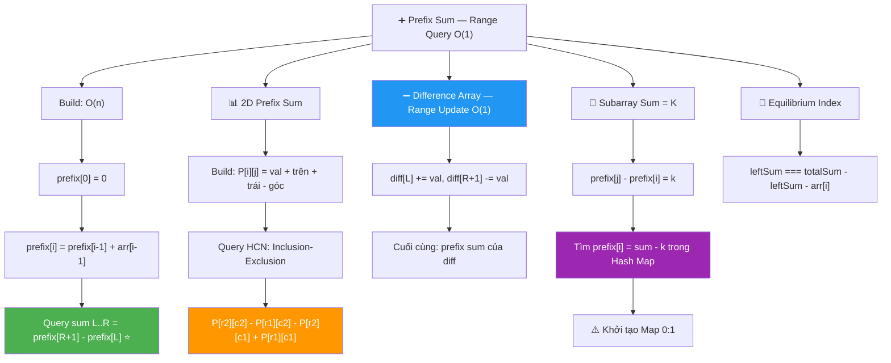

### Prefix Sum là gì?

```
Prefix Sum = mảng lưu TỔNG TÍCH LŨY từ đầu đến mỗi vị trí!

  arr:       [3, 1, 4, 1, 5]
  prefix:    [0, 3, 4, 8, 9, 14]
              ↑
            thêm 0 ở đầu!

  prefix[0] = 0       (chưa có phần tử)
  prefix[1] = 3       (arr[0])
  prefix[2] = 3+1 = 4 (arr[0..1])
  prefix[3] = 3+1+4 = 8
  prefix[4] = 3+1+4+1 = 9
  prefix[5] = 3+1+4+1+5 = 14
```

### Tại sao cần Prefix Sum?

```
BÀI TOÁN: Tính tổng ĐOẠN [L, R] — nhiều lần!

  Cách ngây thơ: cộng từ L đến R → O(n) mỗi query
  Nếu có Q queries → O(n × Q) 💀

  Prefix Sum: O(1) mỗi query! Chỉ cần TRỪ!

  sum(L, R) = prefix[R+1] - prefix[L]

  Ví dụ: sum(2, 4) = prefix[5] - prefix[2] = 14 - 4 = 10
  Kiểm tra: arr[2]+arr[3]+arr[4] = 4+1+5 = 10 ✅
```

```javascript
// Build prefix sum: O(n)
function buildPrefix(arr) {
  const prefix = [0];
  for (let i = 0; i < arr.length; i++) {
    prefix.push(prefix[i] + arr[i]);
  }
  return prefix;
}

// Query sum [L, R] trong O(1):
function rangeSum(prefix, L, R) {
  return prefix[R + 1] - prefix[L];
}
```

### Trace chi tiết

```
arr = [2, 4, 6, 8, 10]

prefix:
  [0] = 0
  [1] = 0 + 2 = 2
  [2] = 2 + 4 = 6
  [3] = 6 + 6 = 12
  [4] = 12 + 8 = 20
  [5] = 20 + 10 = 30

  prefix = [0, 2, 6, 12, 20, 30]

  sum(1, 3) = prefix[4] - prefix[1] = 20 - 2 = 18
  Kiểm tra: 4 + 6 + 8 = 18 ✅

  sum(0, 4) = prefix[5] - prefix[0] = 30 - 0 = 30
  Kiểm tra: 2 + 4 + 6 + 8 + 10 = 30 ✅
```

### Ứng dụng: Equilibrium Index

```
Tìm index i sao cho:
  sum(0..i-1) === sum(i+1..n-1)
  Tức là tổng TRÁI = tổng PHẢI!
```

```javascript
function equilibriumIndex(arr) {
  const totalSum = arr.reduce((a, b) => a + b, 0);
  let leftSum = 0;

  for (let i = 0; i < arr.length; i++) {
    const rightSum = totalSum - leftSum - arr[i];
    if (leftSum === rightSum) return i;
    leftSum += arr[i];
  }
  return -1;
}
```

```
Trace: arr = [-7, 1, 5, 2, -4, 3, 0]
  totalSum = 0

  i=0: leftSum=0, rightSum=0-0-(-7)=7 → 0≠7
       leftSum=0+(-7)=-7
  i=1: leftSum=-7, rightSum=0-(-7)-1=6 → -7≠6
       leftSum=-7+1=-6
  i=2: leftSum=-6, rightSum=0-(-6)-5=1 → -6≠1
       leftSum=-6+5=-1
  i=3: leftSum=-1, rightSum=0-(-1)-2=-1 → -1===-1 → FOUND! ✅
       return 3

  Kiểm tra: left = -7+1+5 = -1, right = -4+3+0 = -1 ✅
```

### Prefix Sum 2D — Ma trận

```
Tính tổng HCN bất kỳ trong matrix O(1)!

  Matrix:         Prefix 2D:
  1 2 3           0  0  0  0
  4 5 6           0  1  3  6
  7 8 9           0  5  12 21
                  0  12 27 45

  Công thức build:
    P[i][j] = matrix[i-1][j-1] + P[i-1][j] + P[i][j-1] - P[i-1][j-1]

  Công thức query sum HCN (r1,c1) → (r2,c2):
    sum = P[r2+1][c2+1] - P[r1][c2+1] - P[r2+1][c1] + P[r1][c1]
```

### Tại sao công thức query đúng? — Inclusion-Exclusion

```
Muốn tính tổng vùng D:

  ┌─────┬─────┐
  │  A  │  B  │
  ├─────┼─────┤   D = Tổng_toàn_bộ - B - C + A
  │  C  │  D  │       (A bị trừ 2 lần nên phải cộng lại!)
  └─────┴─────┘

  P[r2+1][c2+1] = A + B + C + D
  P[r1][c2+1]   = A + B              ← trừ hàng trên
  P[r2+1][c1]   = A + C              ← trừ cột trái
  P[r1][c1]     = A                  ← cộng lại góc (bị trừ 2 lần!)

  D = P[r2+1][c2+1] - P[r1][c2+1] - P[r2+1][c1] + P[r1][c1]
```

```javascript
// Build Prefix Sum 2D
function buildPrefix2D(matrix) {
  const rows = matrix.length,
    cols = matrix[0].length;
  // Tạo bảng (rows+1) x (cols+1) với hàng 0 và cột 0 = 0
  const P = Array.from({ length: rows + 1 }, () => new Array(cols + 1).fill(0));

  for (let i = 1; i <= rows; i++) {
    for (let j = 1; j <= cols; j++) {
      P[i][j] =
        matrix[i - 1][j - 1] +
        P[i - 1][j] + // phía trên
        P[i][j - 1] - // bên trái
        P[i - 1][j - 1]; // góc (bị cộng 2 lần)
    }
  }
  return P;
}

// Query tổng HCN (r1,c1) → (r2,c2) trong O(1)
function rangeSum2D(P, r1, c1, r2, c2) {
  return P[r2 + 1][c2 + 1] - P[r1][c2 + 1] - P[r2 + 1][c1] + P[r1][c1];
}
```

### Trace 2D chi tiết

```
Matrix:
  [[1, 2, 3],
   [4, 5, 6],
   [7, 8, 9]]

Build P (step by step):
  P[1][1] = 1 + 0 + 0 - 0 = 1
  P[1][2] = 2 + 0 + 1 - 0 = 3     (1+2)
  P[1][3] = 3 + 0 + 3 - 0 = 6     (1+2+3)
  P[2][1] = 4 + 1 + 0 - 0 = 5     (1+4)
  P[2][2] = 5 + 3 + 5 - 1 = 12    (1+2+4+5)
  P[2][3] = 6 + 6 + 12 - 3 = 21   (1+2+3+4+5+6)
  P[3][1] = 7 + 5 + 0 - 0 = 12    (1+4+7)
  P[3][2] = 8 + 12 + 12 - 5 = 27  (1+2+4+5+7+8)
  P[3][3] = 9 + 21 + 27 - 12 = 45 (tổng tất cả)

  P = [[0,  0,  0,  0],
       [0,  1,  3,  6],
       [0,  5, 12, 21],
       [0, 12, 27, 45]]

Query: sum HCN (1,1) → (2,2) = ?   (matrix[1][1]..matrix[2][2] = 5+6+8+9)
  = P[3][3] - P[1][3] - P[3][1] + P[1][1]
  = 45 - 6 - 12 + 1 = 28
  Kiểm tra: 5 + 6 + 8 + 9 = 28 ✅
```

### Ứng dụng: Difference Array — Cập nhật nhiều đoạn O(1)

```
Prefix Sum → QUERY nhanh (O(1) per query)
Difference Array → UPDATE nhanh (O(1) per update)!

  Bài toán: Cho mảng, thực hiện nhiều lần "cộng val cho đoạn [L, R]"

  Brute force: mỗi update O(n) → Q updates = O(n×Q) 💀
  Difference Array: mỗi update O(1)! → cuối cùng O(n) build lại ✅
```

```javascript
// Difference Array: update đoạn [L, R] += val trong O(1)!
function rangeUpdates(n, updates) {
  // updates = [[L, R, val], ...]
  const diff = new Array(n + 1).fill(0);

  for (const [L, R, val] of updates) {
    diff[L] += val; // bắt đầu cộng từ L
    diff[R + 1] -= val; // ngừng cộng sau R
  }

  // Build kết quả = prefix sum của diff
  const result = new Array(n).fill(0);
  result[0] = diff[0];
  for (let i = 1; i < n; i++) {
    result[i] = result[i - 1] + diff[i];
  }
  return result;
}
```

```
Trace: n=5, updates = [[1,3,2], [2,4,3]]

  "Cộng 2 cho đoạn [1,3]" + "Cộng 3 cho đoạn [2,4]"

  diff sau update 1: [0, +2, 0, 0, -2, 0]
                          L           R+1

  diff sau update 2: [0, +2, +3, 0, -2, -3]
                              L          R+1

  prefix sum: [0, 2, 5, 5, 3, 0]
  Kết quả:    [0, 2, 5, 5, 3]

  Kiểm tra:
    index:  0  1  2  3  4
    ban đầu: 0  0  0  0  0
    +2 [1,3]: 0  2  2  2  0
    +3 [2,4]: 0  2  5  5  3 ✅
```

---

<a id="7"></a>

## 7️⃣ Kadane's Algorithm — Max Subarray Sum

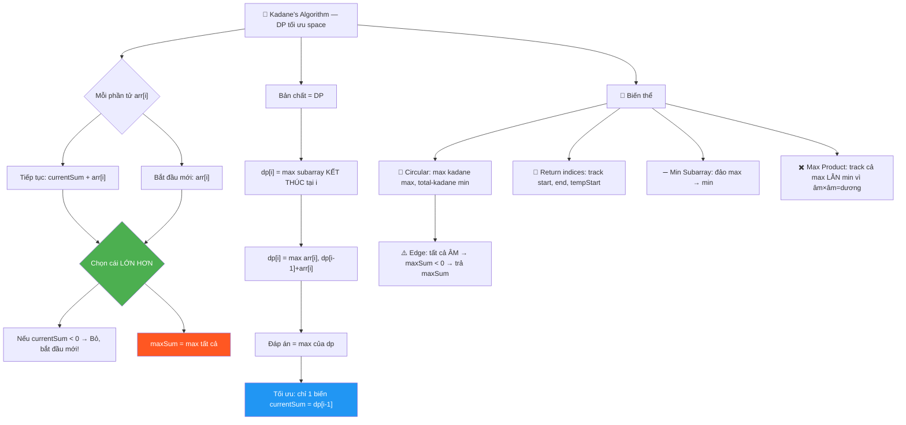

### Bài toán

```
Cho mảng số nguyên (có thể ÂM), tìm SUBARRAY LIÊN TIẾP
có TỔNG LỚN NHẤT!

  [-2, 1, -3, 4, -1, 2, 1, -5, 4]

  Đáp án: [4, -1, 2, 1] → sum = 6 ✅
```

### Brute Force — O(n²)

```javascript
function maxSubarrayBrute(arr) {
  let maxSum = -Infinity;
  for (let i = 0; i < arr.length; i++) {
    let sum = 0;
    for (let j = i; j < arr.length; j++) {
      sum += arr[j];
      maxSum = Math.max(maxSum, sum);
    }
  }
  return maxSum;
}
// Thử TẤT CẢ subarrays → O(n²)
```

### Kadane's Algorithm — O(n)

```
Ý TƯỞNG THIÊN TÀI:

  Tại mỗi phần tử, chỉ có 2 lựa chọn:
    1. TIẾP TỤC subarray hiện tại (cộng thêm)
    2. BẮT ĐẦU MỚI từ phần tử này

  Chọn cái nào LỚN HƠN!

  currentSum = max(arr[i], currentSum + arr[i])
  → Nếu currentSum + arr[i] < arr[i]
  → Tức là currentSum < 0
  → Bỏ subarray cũ, bắt đầu mới!
```

```javascript
function maxSubarrayKadane(arr) {
  let currentSum = arr[0];
  let maxSum = arr[0];

  for (let i = 1; i < arr.length; i++) {
    // QUYẾT ĐỊNH: tiếp tục hay bắt đầu mới?
    currentSum = Math.max(arr[i], currentSum + arr[i]);
    maxSum = Math.max(maxSum, currentSum);
  }
  return maxSum;
}
```

### Trace chi tiết: [-2, 1, -3, 4, -1, 2, 1, -5, 4]

```
  i=0: currentSum = -2, maxSum = -2

  i=1: max(1, -2+1) = max(1, -1) = 1     ← bắt đầu MỚI!
       currentSum=1, maxSum=1

  i=2: max(-3, 1+(-3)) = max(-3, -2) = -2  ← tiếp tục (vì -2 > -3)
       currentSum=-2, maxSum=1

  i=3: max(4, -2+4) = max(4, 2) = 4       ← bắt đầu MỚI!
       currentSum=4, maxSum=4

  i=4: max(-1, 4+(-1)) = max(-1, 3) = 3   ← tiếp tục
       currentSum=3, maxSum=4

  i=5: max(2, 3+2) = max(2, 5) = 5        ← tiếp tục
       currentSum=5, maxSum=5

  i=6: max(1, 5+1) = max(1, 6) = 6        ← tiếp tục
       currentSum=6, maxSum=6 ✅

  i=7: max(-5, 6+(-5)) = max(-5, 1) = 1   ← tiếp tục
       currentSum=1, maxSum=6

  i=8: max(4, 1+4) = max(4, 5) = 5        ← tiếp tục
       currentSum=5, maxSum=6

  Kết quả: maxSum = 6 ✅ (subarray [4, -1, 2, 1])
```

### Kadane's mở rộng: Trả về subarray

```javascript
function maxSubarrayWithIndices(arr) {
  let currentSum = arr[0],
    maxSum = arr[0];
  let start = 0,
    end = 0,
    tempStart = 0;

  for (let i = 1; i < arr.length; i++) {
    if (arr[i] > currentSum + arr[i]) {
      currentSum = arr[i];
      tempStart = i; // bắt đầu mới từ i
    } else {
      currentSum += arr[i];
    }

    if (currentSum > maxSum) {
      maxSum = currentSum;
      start = tempStart;
      end = i;
    }
  }
  return { maxSum, subarray: arr.slice(start, end + 1) };
}
```

### Trace trả về subarray: [-2, 1, -3, 4, -1, 2, 1, -5, 4]

```
  i=0: cur=-2, max=-2, tempStart=0, start=0, end=0
  i=1: 1 > -2+1=-1 → MỚI! cur=1, tempStart=1, max=1, start=1, end=1
  i=2: -3 < 1+(-3)=-2 → tiếp. cur=-2, max=1
  i=3: 4 > -2+4=2 → MỚI! cur=4, tempStart=3, max=4, start=3, end=3
  i=4: -1 < 4+(-1)=3 → tiếp. cur=3, max=4
  i=5: 2 < 3+2=5 → tiếp. cur=5, max=5, start=3, end=5
  i=6: 1 < 5+1=6 → tiếp. cur=6, max=6, start=3, end=6 ✅

  Kết quả: { maxSum: 6, subarray: [4, -1, 2, 1] } ✅
```

### Kadane's = Dynamic Programming!

```
KHÔNG phải trick — đây là DP CHUẨN!

  Định nghĩa: dp[i] = Max subarray sum KẾT THÚC tại index i

  Hệ thức truy hồi:
    dp[i] = max(arr[i], dp[i-1] + arr[i])
          = max(bắt đầu mới, tiếp tục)

  Đáp án: max(dp[0], dp[1], ..., dp[n-1])

  Kadane's chỉ dùng 1 biến currentSum = dp[i-1]
  → Tối ưu space từ O(n) → O(1)!

  arr:  [-2,  1, -3,  4, -1,  2,  1, -5,  4]
  dp:   [-2,  1, -2,  4,  3,  5,  6,  1,  5]
                       ↑                ↑
                   bắt đầu mới      maxSum=6
```

### Biến thể: Maximum Circular Subarray Sum

```
Bài LeetCode #918 — subarray CÓ THỂ QUẤN VÒNG!

  [5, -3, 5] → max circular = [5, ..., 5] = 10 (quấn vòng!)

  Ý tưởng THIÊN TÀI:
    Max circular = Total Sum - Min Subarray Sum!

    Nếu max subarray quấn vòng = ĐẦU + ĐUÔI
    → Phần ở GIỮA bị bỏ = MIN subarray (liên tiếp)!

    ┌──────────────────────────┐
    │ █ █ █  ░ ░ ░ ░  █ █ █ █ │  ← circular max
    │ (đuôi)  (min)   (đầu)   │
    └──────────────────────────┘
    max_circular = totalSum - minSubarraySum
```

```javascript
function maxSubarraySumCircular(nums) {
  let maxSum = nums[0],
    minSum = nums[0];
  let curMax = 0,
    curMin = 0;
  let totalSum = 0;

  for (const num of nums) {
    // Kadane's cho MAX
    curMax = Math.max(num, curMax + num);
    maxSum = Math.max(maxSum, curMax);

    // Kadane's cho MIN (đảo logic!)
    curMin = Math.min(num, curMin + num);
    minSum = Math.min(minSum, curMin);

    totalSum += num;
  }

  // Edge case: tất cả ÂM → minSum = totalSum → trả 0 → SAI!
  if (maxSum < 0) return maxSum;

  return Math.max(maxSum, totalSum - minSum);
}
```

### Trace Circular: [5, -3, 5]

```
  num=5:  curMax=5, maxSum=5, curMin=5, minSum=5, total=5
  num=-3: curMax=-3, maxSum=5, curMin=-3, minSum=-3, total=2
  num=5:  curMax=5, maxSum=5, curMin=2, minSum=-3, total=7

  maxSum=5 (linear)
  circular=totalSum-minSum = 7-(-3) = 10 ✅

  max(5, 10) = 10 ✅ (subarray [5, ..., 5] quấn vòng!)
```

### Biến thể: Min Subarray Sum

```javascript
// Chỉ cần ĐẢO dấu trong Kadane's!
function minSubarraySum(arr) {
  let currentMin = arr[0],
    minSum = arr[0];

  for (let i = 1; i < arr.length; i++) {
    currentMin = Math.min(arr[i], currentMin + arr[i]);
    minSum = Math.min(minSum, currentMin);
  }
  return minSum;
}

// Hoặc trick: minSubarray(arr) = -maxSubarray(-arr)
```

```
💡 TÓM TẮT:
  Kadane's = DP tối ưu space! "tiếp tục hay bắt đầu mới?"
  currentSum = max(arr[i], currentSum + arr[i])
  Nếu currentSum < 0 → bỏ, bắt đầu mới!
  Time: O(n), Space: O(1) — OPTIMAL!

  Biến thể:
    ✅ Trả về subarray → track start, end, tempStart
    ✅ Circular → max(Kadane_max, totalSum - Kadane_min)
    ✅ Min subarray → đảo max thành min
    ✅ Product → track cả max lẫn min (vì âm × âm = dương!)
```

---

<a id="8"></a>

## 8️⃣ Binary Search trên Array

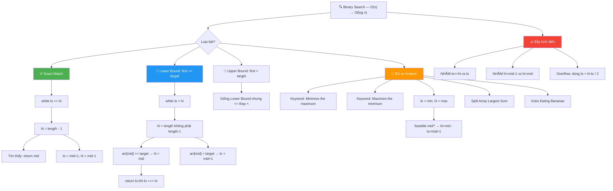

### Binary Search là gì?

```
TÌM KIẾM bằng cách CHIA ĐÔI liên tục!

  Điều kiện: mảng PHẢI ĐƯỢC SẮP XẾP!

  Ví dụ đời thường:
  Đoán số từ 1-100, mỗi lần được biết "lớn hơn" hay "nhỏ hơn"

    Đoán 50 → "lớn hơn" → loại 1-50
    Đoán 75 → "nhỏ hơn" → loại 75-100
    Đoán 62 → "nhỏ hơn" → loại 62-75
    ...chỉ cần 7 lần! (log₂100 ≈ 7)

  Thay vì tìm từ đầu đến cuối: O(n)
  Binary Search: O(log n)! ⚡
```

### Code chuẩn

```javascript
function binarySearch(arr, target) {
  let lo = 0,
    hi = arr.length - 1;

  while (lo <= hi) {
    const mid = Math.floor((lo + hi) / 2);

    if (arr[mid] === target)
      return mid; // TÌM THẤY!
    else if (arr[mid] < target)
      lo = mid + 1; // target bên PHẢI
    else hi = mid - 1; // target bên TRÁI
  }
  return -1; // không tìm thấy
}
// Time: O(log n), Space: O(1)
```

### Trace: arr = [2, 5, 8, 12, 16, 23, 38, 56, 72, 91], target = 23

```
  lo=0, hi=9: mid=4, arr[4]=16 < 23 → lo=5
  lo=5, hi=9: mid=7, arr[7]=56 > 23 → hi=6
  lo=5, hi=6: mid=5, arr[5]=23 = target → FOUND! return 5 ✅

  [2, 5, 8, 12, 16, 23, 38, 56, 72, 91]
                       ↑ mid=4: 16<23 → tìm bên phải
                           [23, 38, 56, 72, 91]
                                    ↑ mid=7: 56>23 → tìm bên trái
                           [23, 38]
                            ↑ mid=5: 23=23 ✅

  Chỉ 3 lần so sánh thay vì 6 lần (linear)!
```

### Binary Search biến thể: Lower Bound & Upper Bound

```
2 biến thể QUAN TRỌNG nhất cho phỏng vấn!

  Lower Bound: vị trí ĐẦU TIÊN mà arr[i] >= target
  Upper Bound: vị trí ĐẦU TIÊN mà arr[i] > target

  arr = [1, 3, 3, 3, 5, 7]

  lowerBound(3) = 1  ← vị trí 3 ĐẦU TIÊN
  upperBound(3) = 4  ← vị trí sau 3 CUỐI CÙNG
  count(3) = upper - lower = 4 - 1 = 3 lần! ✅

        idx:  0  1  2  3  4  5
  arr:       [1, 3, 3, 3, 5, 7]
                 ↑        ↑
              lower=1   upper=4
              (>=3)      (>3)
```

```javascript
// Lower Bound: tìm vị trí ĐẦU TIÊN mà arr[i] >= target
function lowerBound(arr, target) {
  let lo = 0,
    hi = arr.length;
  while (lo < hi) {
    const mid = Math.floor((lo + hi) / 2);
    if (arr[mid] < target) lo = mid + 1;
    else hi = mid; // arr[mid] >= target → mid CÓ THỂ là answer!
  }
  return lo;
}

// Upper Bound: tìm vị trí ĐẦU TIÊN mà arr[i] > target
function upperBound(arr, target) {
  let lo = 0,
    hi = arr.length;
  while (lo < hi) {
    const mid = Math.floor((lo + hi) / 2);
    if (arr[mid] <= target) lo = mid + 1;
    else hi = mid; // arr[mid] > target → mid CÓ THỂ là answer!
  }
  return lo;
}

// Đếm số lần xuất hiện của target:
// count = upperBound(target) - lowerBound(target)
```

### Trace Lower Bound: arr = [1, 3, 3, 3, 5, 7], target = 3

```
  lo=0, hi=6: mid=3, arr[3]=3 >= 3 → hi=3
  lo=0, hi=3: mid=1, arr[1]=3 >= 3 → hi=1
  lo=0, hi=1: mid=0, arr[0]=1 < 3  → lo=1
  lo=1, hi=1: lo === hi → STOP! return 1 ✅

  ⚠️ CHÚ Ý: khi arr[mid] >= target → hi = mid (KHÔNG phải mid-1!)
     Vì mid CÓ THỂ là đáp án! Không được loại nó!
```

### Trace Upper Bound: arr = [1, 3, 3, 3, 5, 7], target = 3

```
  lo=0, hi=6: mid=3, arr[3]=3 <= 3 → lo=4
  lo=4, hi=6: mid=5, arr[5]=7 > 3  → hi=5
  lo=4, hi=5: mid=4, arr[4]=5 > 3  → hi=4
  lo=4, hi=4: lo === hi → STOP! return 4 ✅
```

### ⚠️ `lo <= hi` vs `lo < hi` — HAI pattern khác nhau!

```
  Pattern 1: lo <= hi (Exact Match — tìm chính xác)
  ──────────────────────────────────────────────────
  - hi = arr.length - 1
  - Khi tìm thấy: return mid
  - Khi không thấy: return -1
  - lo = mid + 1, hi = mid - 1

  Pattern 2: lo < hi (Boundary — tìm biên)
  ──────────────────────────────────────────────────
  - hi = arr.length (không phải length - 1!)
  - Không return sớm, chạy đến lo === hi
  - return lo (= hi = vị trí boundary)
  - lo = mid + 1, hi = mid (KHÔNG phải mid - 1!)

  ⚠️ NHẦM 2 pattern này = BUG KINH ĐIỂN!
     Pattern 2 mà dùng hi = mid - 1 → INFINITE LOOP!
     Pattern 1 mà dùng hi = mid → cũng INFINITE LOOP!
```

### Binary Search on Answer — Tìm kiếm trên đáp án

```
KHÔNG chỉ tìm phần tử trong mảng!
Có thể tìm ĐÁP ÁN trong khoảng [min, max]!

  Ví dụ: "Chia mảng thành k đoạn sao cho tổng max nhỏ nhất"
  → Binary Search trên "tổng max" từ [max(arr), sum(arr)]
  → Mỗi mid, check: có chia được k đoạn với max ≤ mid?
```

### Ví dụ: Split Array Largest Sum (LeetCode #410)

```
Chia mảng nums thành k subarrays liên tiếp
sao cho TỔNG LỚN NHẤT trong các subarray là NHỎ NHẤT!

  nums = [7, 2, 5, 10, 8], k = 2

  Cách chia:    subarray sums    max
  [7] [2,5,10,8]   7, 25         25
  [7,2] [5,10,8]   9, 23         23
  [7,2,5] [10,8]   14, 18        18 ← NHỎ NHẤT! ✅
  [7,2,5,10] [8]   24, 8         24
```

```javascript
function splitArray(nums, k) {
  // Khoảng tìm kiếm đáp án:
  let lo = Math.max(...nums); // min possible = phần tử lớn nhất
  let hi = nums.reduce((a, b) => a + b); // max possible = tổng tất cả

  while (lo < hi) {
    const mid = Math.floor((lo + hi) / 2);

    if (canSplit(nums, k, mid)) {
      hi = mid; // mid khả thi → thử nhỏ hơn
    } else {
      lo = mid + 1; // mid không khả thi → tăng lên
    }
  }
  return lo;
}

// Check: có thể chia thành ≤ k đoạn với max sum ≤ maxSum?
function canSplit(nums, k, maxSum) {
  let groups = 1,
    currentSum = 0;

  for (const num of nums) {
    if (currentSum + num > maxSum) {
      groups++; // cắt đoạn mới!
      currentSum = num;
      if (groups > k) return false; // quá k đoạn → FAIL
    } else {
      currentSum += num;
    }
  }
  return true;
}
```

### Trace: nums = [7, 2, 5, 10, 8], k = 2

```
  lo = max(7,2,5,10,8) = 10
  hi = 7+2+5+10+8 = 32

  Iteration 1: mid = 21
    canSplit(k=2, maxSum=21)?
    [7,2,5] sum=14, +10→24>21 → cắt! groups=2, [10,8] sum=18
    groups=2 ≤ 2 → TRUE → hi=21

  Iteration 2: mid = 15
    canSplit(k=2, maxSum=15)?
    [7,2,5] sum=14, +10→24>15 → cắt! groups=2, [10,8] sum=18>15?
    Nhưng 18>15 → nên: [10] sum=10, +8→18>15 → cắt! groups=3
    groups=3 > 2 → FALSE → lo=16

  Iteration 3: mid = 18
    canSplit(k=2, maxSum=18)?
    [7,2,5] sum=14, +10→24>18 → cắt! groups=2, [10,8] sum=18
    18 ≤ 18 → TRUE → hi=18

  Iteration 4: mid = 17
    canSplit(k=2, maxSum=17)?
    [7,2,5] sum=14, +10→24>17 → cắt! groups=2, [10,8] sum=18>17
    → cắt! groups=3 > 2 → FALSE → lo=18

  lo=18, hi=18 → STOP! return 18 ✅
```

### Nhận diện Binary Search on Answer

```
KEYWORD trong đề bài:
  "Minimize the maximum..."       → BS on Answer!
  "Maximize the minimum..."       → BS on Answer!
  "Find the smallest X such that..."  → BS on Answer!
  "Is it possible to achieve X?"  → canDo(mid) → BS!

  Template:
    lo = giá trị nhỏ nhất có thể
    hi = giá trị lớn nhất có thể
    while (lo < hi) {
      mid = (lo + hi) / 2
      if (feasible(mid)) hi = mid   // thử nhỏ hơn
      else lo = mid + 1             // tăng lên
    }
    return lo
```

### Edge Cases cần nhớ

```
⚠️ Integer Overflow khi tính mid:
  mid = (lo + hi) / 2  → nếu lo + hi > MAX_INT → overflow!
  ✅ ĐÚNG: mid = lo + Math.floor((hi - lo) / 2)
  (JS dùng float nên ít gặp, nhưng C++/Java CẦN!)

⚠️ Mảng rỗng:
  if (arr.length === 0) return -1;

⚠️ Target không tồn tại (Lower Bound):
  lowerBound trả về vị trí INSERT, không phải "tìm thấy"!
  Phải check: arr[result] === target? nếu cần exact match

⚠️ Off-by-one (sai 1 đơn vị):
  Bài toán khác nhau cần formulae khác nhau!
  → Luôn TEST với ví dụ nhỏ (2-3 phần tử) trước!
```

```
💡 TÓM TẮT:
  Binary Search: chia đôi → O(log n)!
  Điều kiện: mảng SORTED (hoặc monotonic property)

  3 biến thể:
    1. Exact Match: lo <= hi, return mid khi tìm thấy
    2. Lower Bound: lo < hi, hi=mid, tìm >= target
    3. Upper Bound: lo < hi, hi=mid, tìm > target

  Advanced: Binary Search on Answer
    → "Minimize max" / "Maximize min" → BS!
    → lo=min, hi=max, check feasible(mid)

  ⚠️ NHẦM lo<=hi vs lo<hi = BUG KINH ĐIỂN!
```

---

<a id="9"></a>

## 9️⃣ Sorting Algorithms cơ bản

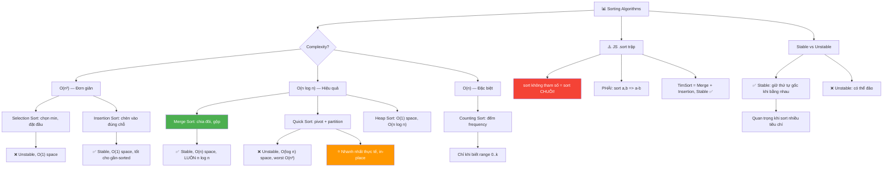

### So sánh nhanh

```
  Algorithm        Time (avg)    Time (worst)   Space   Stable?
  ─────────────────────────────────────────────────────────────
  Selection Sort   O(n²)         O(n²)          O(1)    ❌
  Insertion Sort   O(n²)         O(n²)          O(1)    ✅
  Merge Sort       O(n log n)    O(n log n)     O(n)    ✅
  Quick Sort       O(n log n)    O(n²)          O(log n) ❌
  Heap Sort        O(n log n)    O(n log n)     O(1)    ❌

  JS built-in: arr.sort() → TimSort = Merge + Insertion
               O(n log n), Stable ✅
```

### Selection Sort — "Chọn nhỏ nhất, đặt đầu"

```javascript
function selectionSort(arr) {
  for (let i = 0; i < arr.length; i++) {
    let minIdx = i;
    for (let j = i + 1; j < arr.length; j++) {
      if (arr[j] < arr[minIdx]) minIdx = j;
    }
    [arr[i], arr[minIdx]] = [arr[minIdx], arr[i]]; // swap
  }
  return arr;
}
```

```
Trace: [64, 25, 12, 22, 11]

  i=0: min=11 at idx 4 → swap → [11, 25, 12, 22, 64]
  i=1: min=12 at idx 2 → swap → [11, 12, 25, 22, 64]
  i=2: min=22 at idx 3 → swap → [11, 12, 22, 25, 64]
  i=3: min=25 at idx 3 → no swap
  → [11, 12, 22, 25, 64] ✅
```

### Insertion Sort — "Chèn vào đúng vị trí"

```javascript
function insertionSort(arr) {
  for (let i = 1; i < arr.length; i++) {
    const key = arr[i];
    let j = i - 1;
    while (j >= 0 && arr[j] > key) {
      arr[j + 1] = arr[j]; // dồn phải
      j--;
    }
    arr[j + 1] = key; // chèn vào đúng chỗ
  }
  return arr;
}
```

```
Trace: [5, 2, 4, 6, 1, 3]

  i=1: key=2, dồn 5 phải → [2, 5, 4, 6, 1, 3]
  i=2: key=4, dồn 5 phải → [2, 4, 5, 6, 1, 3]
  i=3: key=6, không dồn  → [2, 4, 5, 6, 1, 3]
  i=4: key=1, dồn 6,5,4,2 → [1, 2, 4, 5, 6, 3]
  i=5: key=3, dồn 6,5,4   → [1, 2, 3, 4, 5, 6] ✅
```

### Merge Sort — "Chia đôi, sort, gộp"

```
TƯ TƯỞNG:
  1. CHIA đôi mảng cho đến khi mỗi phần chỉ còn 1 phần tử
  2. GỘP (merge) 2 mảng sorted thành 1 mảng sorted
  3. Lặp lại cho đến khi gộp xong toàn bộ

  Divide & Conquer — Chia để trị!
```

```javascript
function mergeSort(arr) {
  if (arr.length <= 1) return arr;

  const mid = Math.floor(arr.length / 2);
  const left = mergeSort(arr.slice(0, mid));
  const right = mergeSort(arr.slice(mid));

  return merge(left, right);
}

function merge(left, right) {
  const result = [];
  let i = 0,
    j = 0;

  while (i < left.length && j < right.length) {
    if (left[i] <= right[j]) result.push(left[i++]);
    else result.push(right[j++]);
  }

  return result.concat(left.slice(i)).concat(right.slice(j));
}
```

### Trace Merge Sort: [38, 27, 43, 3, 9, 82, 10]

```
CHIA:
                    [38, 27, 43, 3, 9, 82, 10]
                   /                           \
          [38, 27, 43]                    [3, 9, 82, 10]
          /         \                     /            \
      [38]      [27, 43]            [3, 9]         [82, 10]
                 /    \              /    \          /     \
              [27]   [43]         [3]    [9]     [82]    [10]

GỘP (từ dưới lên):
  merge([27],[43])     → [27, 43]       ← so sánh: 27<43
  merge([38],[27,43])  → [27, 38, 43]   ← 38>27, lấy 27; 38<43, lấy 38; lấy 43
  merge([3],[9])       → [3, 9]
  merge([82],[10])     → [10, 82]
  merge([3,9],[10,82]) → [3, 9, 10, 82] ← lần lượt so sánh
  merge([27,38,43],[3,9,10,82]) → [3, 9, 10, 27, 38, 43, 82] ✅

CHI TIẾT merge([27,38,43], [3,9,10,82]):
  i=0,j=0: 27 vs 3  → 3  ← right nhỏ hơn
  i=0,j=1: 27 vs 9  → 9
  i=0,j=2: 27 vs 10 → 10
  i=0,j=3: 27 vs 82 → 27 ← left nhỏ hơn
  i=1,j=3: 38 vs 82 → 38
  i=2,j=3: 43 vs 82 → 43
  Còn lại: 82 → concat
  Kết quả: [3, 9, 10, 27, 38, 43, 82] ✅
```

### Quick Sort — "Chọn pivot, partition"

```
TƯ TƯỞNG:
  1. CHỌN 1 phần tử làm pivot
  2. PARTITION: đặt tất cả < pivot bên TRÁI, > pivot bên PHẢI
  3. pivot giờ ĐÃ Ở ĐÚNG VỊ TRÍ CUỐI CÙNG!
  4. Recursion cho 2 nửa

  In-place! Không cần mảng phụ (khác Merge Sort)
```

```javascript
function quickSort(arr, lo = 0, hi = arr.length - 1) {
  if (lo >= hi) return arr;

  const pivotIdx = partition(arr, lo, hi);
  quickSort(arr, lo, pivotIdx - 1);
  quickSort(arr, pivotIdx + 1, hi);
  return arr;
}

function partition(arr, lo, hi) {
  const pivot = arr[hi]; // chọn phần tử cuối làm pivot
  let i = lo - 1; // i = ranh giới "vùng nhỏ"

  for (let j = lo; j < hi; j++) {
    if (arr[j] <= pivot) {
      i++;
      [arr[i], arr[j]] = [arr[j], arr[i]]; // đưa vào vùng nhỏ
    }
  }
  [arr[i + 1], arr[hi]] = [arr[hi], arr[i + 1]]; // đặt pivot đúng chỗ
  return i + 1;
}
```

### Trace Partition: [10, 80, 30, 90, 40, 50, 70], pivot = 70

```
  pivot = arr[6] = 70
  i = -1

  j=0: arr[0]=10 ≤ 70 → i=0, swap(0,0) → [10, 80, 30, 90, 40, 50, 70]
  j=1: arr[1]=80 > 70  → skip
  j=2: arr[2]=30 ≤ 70 → i=1, swap(1,2) → [10, 30, 80, 90, 40, 50, 70]
  j=3: arr[3]=90 > 70  → skip
  j=4: arr[4]=40 ≤ 70 → i=2, swap(2,4) → [10, 30, 40, 90, 80, 50, 70]
  j=5: arr[5]=50 ≤ 70 → i=3, swap(3,5) → [10, 30, 40, 50, 80, 90, 70]

  Đặt pivot: swap(4, 6) → [10, 30, 40, 50, 70, 90, 80]
                                              ↑
                                        pivot ĐÃ ĐÚNG CHỖ!
  return 4

  Minh họa:
  [10, 30, 40, 50] 70 [90, 80]
   ← tất cả ≤ 70 →  ↑  ← tất cả > 70 →
                   pivot
```

### Stable vs Unstable Sort — Tại sao QUAN TRỌNG?

```
Stable = phần tử BẰNG NHAU giữ nguyên THỨ TỰ GỐC!

  Ví dụ sort theo ĐIỂM:
  Ban đầu: [(An,90), (Bình,80), (Cúc,80), (Dũng,90)]

  Stable sort (theo điểm):
    [(Bình,80), (Cúc,80), (An,90), (Dũng,90)]
     ← 80 giữ thứ tự gốc → ← 90 giữ thứ tự gốc →  ✅

  Unstable sort (theo điểm):
    [(Cúc,80), (Bình,80), (Dũng,90), (An,90)]
     ← 80 bị ĐẢO! →      ← 90 bị ĐẢO! →          ❌

  KHI NÀO CẦN STABLE?
    → Sort theo nhiều tiêu chí (sort điểm, rồi sort tên)
    → Sort UI elements (giữ thứ tự gốc khi bằng nhau)
    → Database queries với ORDER BY nhiều cột
```

### Counting Sort — O(n) khi biết range!

```
Khi biết giá trị nằm trong [0, k] → sort O(n+k)!

  Không so sánh! Đếm tần suất → build kết quả!
```

```javascript
function countingSort(arr, maxVal) {
  const count = new Array(maxVal + 1).fill(0);

  // Đếm tần suất
  for (const num of arr) count[num]++;

  // Build kết quả
  const result = [];
  for (let i = 0; i <= maxVal; i++) {
    for (let j = 0; j < count[i]; j++) {
      result.push(i);
    }
  }
  return result;
}
```

```
Trace: arr = [4, 2, 2, 8, 3, 3, 1], maxVal = 8

  count: [0, 1, 2, 2, 1, 0, 0, 0, 1]
         idx: 0  1  2  3  4  5  6  7  8
              ↑  ↑  ↑  ↑  ↑           ↑
              0  1  2  2  1           1 số

  Build: 1, 2, 2, 3, 3, 4, 8 ✅

  Time: O(n + k), Space: O(k)
  → CHỈ hiệu quả khi k (range) KHÔNG quá lớn!
```

### JavaScript sort() — Cẩn thận!

```javascript
// ⚠️ BẪY KINH ĐIỂN:
[10, 9, 8, 1, 2]
  .sort()
  [
    // → [1, 10, 2, 8, 9] ← SAI! (sort theo STRING!)

    // ✅ ĐÚNG: phải truyền comparator!
    (10, 9, 8, 1, 2)
  ].sort((a, b) => a - b)
  [
    // → [1, 2, 8, 9, 10] ✅

    // Giảm dần:
    (10, 9, 8, 1, 2)
  ].sort((a, b) => b - a);
// → [10, 9, 8, 2, 1] ✅
```

### Sort nâng cao — Practical patterns

```javascript
// Sort objects theo nhiều tiêu chí:
const students = [
  { name: "An", score: 90 },
  { name: "Bình", score: 80 },
  { name: "Cúc", score: 80 },
];

// Sort theo score (tăng), nếu bằng → sort tên (alphabetical)
students.sort((a, b) => {
  if (a.score !== b.score) return a.score - b.score;
  return a.name.localeCompare(b.name);
});
// → [{ Bình,80 }, { Cúc,80 }, { An,90 }]

// Sort mảng 2D theo cột thứ 2:
const intervals = [
  [3, 5],
  [1, 4],
  [2, 6],
];
intervals.sort((a, b) => a[1] - b[1]); // sort theo end time
// → [[1,4], [3,5], [2,6]]
```

```
💡 TÓM TẮT:
  O(n²): Selection, Insertion — chỉ dùng cho mảng nhỏ / gần sorted
  O(n log n): Merge, Quick, Heap — dùng cho mảng lớn
  O(n+k): Counting Sort — khi range nhỏ!
  JS .sort(): dùng (a,b) => a-b cho số! Không truyền = sort CHUỖI!

  Stable (giữ thứ tự gốc): Merge ✅, Insertion ✅, Counting ✅
  Unstable: Quick ❌, Selection ❌, Heap ❌

  Merge Sort: ổn định, luôn O(n log n), nhưng cần O(n) extra space
  Quick Sort: nhanh hơn avg, in-place, nhưng worst O(n²) khi bad pivot
```

---

<a id="10"></a>

## 🔟 Hashing với Array

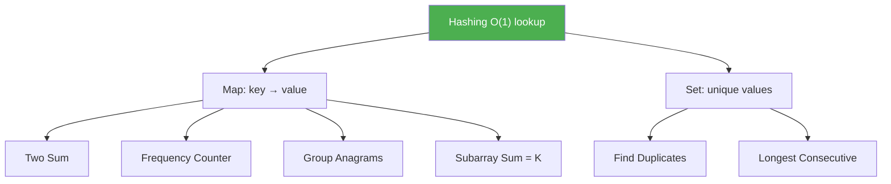

### Hashing là gì?

```
Dùng BẢNG BĂNG (Hash Map/Set) để truy cập O(1)!

  Ví dụ: Tìm 2 số có tổng = target (Two Sum)

  Brute force: 2 vòng for → O(n²)
  Hash Map:    1 vòng for → O(n)!

  Bí quyết: lưu SỐ ĐÃ GẶP vào Map
  → Khi gặp số mới, CHECK Map xem "complement" đã có chưa?
```

### Two Sum — Hash Map approach

```javascript
function twoSum(nums, target) {
  const map = new Map(); // value → index

  for (let i = 0; i < nums.length; i++) {
    const complement = target - nums[i];

    if (map.has(complement)) {
      return [map.get(complement), i]; // TÌM THẤY!
    }
    map.set(nums[i], i); // lưu số hiện tại
  }
  return [];
}
```

### Trace: nums = [2, 7, 11, 15], target = 9

```
  Map = {}

  i=0: complement = 9-2 = 7, Map không có 7 → lưu {2:0}
  i=1: complement = 9-7 = 2, Map CÓ 2! → return [0, 1] ✅

  Chỉ cần 1 vòng for! O(n) time, O(n) space
```

### Đếm tần suất — Frequency Counter

```javascript
function frequencyCounter(arr) {
  const freq = new Map();
  for (const item of arr) {
    freq.set(item, (freq.get(item) || 0) + 1);
  }
  return freq;
}

// arr = [1, 2, 2, 3, 3, 3]
// → Map { 1→1, 2→2, 3→3 }
```

### Find Duplicates

```javascript
function findDuplicates(arr) {
  const seen = new Set();
  const duplicates = [];

  for (const num of arr) {
    if (seen.has(num)) duplicates.push(num);
    else seen.add(num);
  }
  return duplicates;
}
```

### Duplicate within K Distance (LeetCode #219)

```
Kiểm tra có 2 phần tử BẰNG NHAU cách nhau ≤ k vị trí?
```

```javascript
function containsNearbyDuplicate(nums, k) {
  const window = new Set();

  for (let i = 0; i < nums.length; i++) {
    if (window.has(nums[i])) return true;
    window.add(nums[i]);

    // Giữ cửa sổ size ≤ k
    if (window.size > k) {
      window.delete(nums[i - k]);
    }
  }
  return false;
}
```

```
Trace: nums = [1, 2, 3, 1], k = 3

  i=0: window={1}
  i=1: window={1,2}
  i=2: window={1,2,3}
  i=3: nums[3]=1, window CÓ 1! → return true ✅

  Khoảng cách: |3-0| = 3 ≤ k=3 ✅
```

### Group Anagrams (LeetCode #49)

```
Nhóm các từ là ANAGRAM của nhau!

  ["eat","tea","tan","ate","nat","bat"]
  → [["eat","tea","ate"], ["tan","nat"], ["bat"]]

  TRICK: sort mỗi từ → cùng key = cùng nhóm!
    "eat" → "aet"
    "tea" → "aet"  ← GIỐNG!
    "ate" → "aet"  ← GIỐNG!
```

```javascript
function groupAnagrams(strs) {
  const map = new Map();

  for (const str of strs) {
    // Sort ký tự → tạo KEY
    const key = str.split("").sort().join("");

    if (!map.has(key)) map.set(key, []);
    map.get(key).push(str);
  }
  return [...map.values()];
}
// Time: O(n × k log k) — n từ, mỗi từ dài k
```

```
Trace:
  "eat" → key="aet" → Map={"aet": ["eat"]}
  "tea" → key="aet" → Map={"aet": ["eat","tea"]}
  "tan" → key="ant" → Map={"aet": ["eat","tea"], "ant": ["tan"]}
  "ate" → key="aet" → Map={"aet": ["eat","tea","ate"], "ant": ["tan"]}
  "nat" → key="ant" → Map={"aet": ["eat","tea","ate"], "ant": ["tan","nat"]}
  "bat" → key="abt" → Map={..., "abt": ["bat"]}

  values = [["eat","tea","ate"], ["tan","nat"], ["bat"]] ✅
```

```javascript
// Cách 2: KHÔNG sort — dùng frequency làm key (nhanh hơn!)
function groupAnagramsFast(strs) {
  const map = new Map();

  for (const str of strs) {
    // Đếm frequency 26 ký tự → tạo key unique
    const count = new Array(26).fill(0);
    for (const char of str) count[char.charCodeAt(0) - 97]++;
    const key = count.join("#");

    if (!map.has(key)) map.set(key, []);
    map.get(key).push(str);
  }
  return [...map.values()];
}
// Time: O(n × k) — nhanh hơn! Không cần sort
```

### Longest Consecutive Sequence (LeetCode #128)

```
Tìm dãy SỐ LIÊN TIẾP DÀI NHẤT (không cần sorted)!

  [100, 4, 200, 1, 3, 2] → dãy [1,2,3,4] → length = 4

  Brute force: sort → O(n log n)
  Hash Set:    O(n)!
```

```javascript
function longestConsecutive(nums) {
  const set = new Set(nums);
  let maxLen = 0;

  for (const num of set) {
    // Chỉ BẮT ĐẦU đếm từ số KHÔNG CÓ num-1
    // (tức là num là ĐẦU dãy liên tiếp!)
    if (!set.has(num - 1)) {
      let current = num;
      let length = 1;

      while (set.has(current + 1)) {
        current++;
        length++;
      }
      maxLen = Math.max(maxLen, length);
    }
  }
  return maxLen;
}
```

### Trace: [100, 4, 200, 1, 3, 2]

```
  set = {100, 4, 200, 1, 3, 2}

  num=100: set.has(99)? ❌ → ĐẦU dãy!
    100→ has(101)? ❌ → length=1

  num=4: set.has(3)? ✅ → SKIP! (4 không phải đầu dãy)

  num=200: set.has(199)? ❌ → ĐẦU dãy!
    200→ has(201)? ❌ → length=1

  num=1: set.has(0)? ❌ → ĐẦU dãy!
    1→ has(2)? ✅ → 2→ has(3)? ✅ → 3→ has(4)? ✅ → 4→ has(5)? ❌
    length=4 ← MAX! ✅

  num=3: set.has(2)? ✅ → SKIP!
  num=2: set.has(1)? ✅ → SKIP!

  Kết quả: maxLen = 4 ✅

  ⚠️ TRICK QUAN TRỌNG: `if (!set.has(num - 1))`
     → Chỉ đếm từ ĐẦU dãy → mỗi số chỉ được duyệt 1 lần → O(n)!
     → Nếu không có check này → O(n²) vì đếm lại từ giữa dãy!
```

### Product Except Self (LeetCode #238)

```
Cho mảng nums, trả về mảng mà result[i] = tích TẤT CẢ
phần tử NGOẠI TRỪ nums[i]. KHÔNG được dùng phép chia!
```

```javascript
function productExceptSelf(nums) {
  const n = nums.length;
  const result = new Array(n).fill(1);

  // Pass 1: tích từ TRÁI sang
  let leftProduct = 1;
  for (let i = 0; i < n; i++) {
    result[i] = leftProduct;
    leftProduct *= nums[i];
  }

  // Pass 2: tích từ PHẢI sang
  let rightProduct = 1;
  for (let i = n - 1; i >= 0; i--) {
    result[i] *= rightProduct;
    rightProduct *= nums[i];
  }

  return result;
}
// Time: O(n), Space: O(1) (không tính output)
```

```
Trace: nums = [1, 2, 3, 4]

  Pass 1 (left prefix product):
    i=0: result=[1, _, _, _], leftProduct=1×1=1
    i=1: result=[1, 1, _, _], leftProduct=1×2=2
    i=2: result=[1, 1, 2, _], leftProduct=2×3=6
    i=3: result=[1, 1, 2, 6], leftProduct=6×4=24

  Pass 2 (right prefix product):
    i=3: result=[1, 1, 2, 6×1=6],  rightProduct=1×4=4
    i=2: result=[1, 1, 2×4=8, 6],  rightProduct=4×3=12
    i=1: result=[1, 1×12=12, 8, 6], rightProduct=12×2=24
    i=0: result=[1×24=24, 12, 8, 6], rightProduct=24×1=24

  result = [24, 12, 8, 6] ✅
  Kiểm tra: [2×3×4, 1×3×4, 1×2×4, 1×2×3] ✅
```

### Subarray Sum Equals K — Pattern quan trọng!

```
TẠI SAO prefix sum + hash map ĐÚNG?

  prefix[j] - prefix[i] = sum(i+1...j)

  Nếu prefix[j] - prefix[i] = k
  → prefix[i] = prefix[j] - k

  Vậy khi đang ở index j (prefix = sum):
    Tìm xem có bao nhiêu prefix[i] = sum - k
    = Số subarrays kết thúc tại j có tổng = k!

  ┌─────────────────────────────┐
  │ prefix[i]   │  subarray = k │  = prefix[j]
  │─────────────│───────────────│
  │  sum - k    │      k        │  = sum
  └─────────────────────────────┘
```

```javascript
// Đếm số subarrays có tổng = k
function subarraySum(nums, k) {
  const prefixCount = new Map([[0, 1]]); // prefix sum 0 xuất hiện 1 lần
  let sum = 0,
    count = 0;

  for (const num of nums) {
    sum += num;
    // Nếu (sum - k) đã xuất hiện → có subarray tổng = k!
    if (prefixCount.has(sum - k)) {
      count += prefixCount.get(sum - k);
    }
    prefixCount.set(sum, (prefixCount.get(sum) || 0) + 1);
  }
  return count;
}
```

### Trace: nums = [1, 2, 3], k = 3

```
  Map = {0: 1}, sum=0, count=0

  num=1: sum=1, sum-k=1-3=-2 → không có
         Map={0:1, 1:1}

  num=2: sum=3, sum-k=3-3=0  → CÓ (1 lần)! count=1
         Map={0:1, 1:1, 3:1}
         → subarray: prefix[j]-prefix[i] = 3-0 = 3 → [1,2] ✅

  num=3: sum=6, sum-k=6-3=3  → CÓ (1 lần)! count=2
         Map={0:1, 1:1, 3:1, 6:1}
         → subarray: prefix[j]-prefix[i] = 6-3 = 3 → [3] ✅

  Kết quả: 2 ✅ → [1,2] và [3]
```

### Trace: nums = [1, 1, 1], k = 2

```
  Map = {0: 1}, sum=0, count=0

  num=1: sum=1, sum-k=-1 → không có, Map={0:1, 1:1}
  num=1: sum=2, sum-k=0  → CÓ (1 lần)! count=1, Map={0:1, 1:1, 2:1}
  num=1: sum=3, sum-k=1  → CÓ (1 lần)! count=2, Map={0:1, 1:1, 2:1, 3:1}

  Kết quả: 2 ✅ → [1,1] (idx 0-1) và [1,1] (idx 1-2)
```

### Map vs Set vs Object — Khi nào dùng gì?

```
  Map                    Set                     Object
  ────────────────────────────────────────────────────────
  Key → Value            Chỉ Value (unique)      String key → Value
  map.set(k, v)          set.add(v)              obj[k] = v
  map.get(k)             set.has(v)              obj[k]
  map.has(k)             set.delete(v)           k in obj
  map.size               set.size                Object.keys(obj).length

  Dùng Map khi:  key là NUMBER hoặc OBJECT
  Dùng Set khi:  chỉ cần check TỒN TẠI (dedup)
  Dùng Object:   key là STRING (đơn giản, nhưng hạn chế)

  ⚠️ Object key luôn convert thành STRING!
     obj[1] và obj["1"] là CÙNG key!
     Map thì PHÂN BIỆT: map.get(1) ≠ map.get("1")
```

```
💡 TÓM TẮT:
  Hash Map/Set: truy cập O(1)!
  Two Sum: lưu complement vào Map
  Frequency: Map(value → count)
  Prefix Sum + Hash Map = đếm subarrays tổng = k → O(n)!
  Group Anagrams: sort char / frequency → key cho Map
  Longest Consecutive: Set + chỉ đếm từ ĐẦU dãy → O(n)
  Product Except Self: 2 pass (left prefix × right prefix)
```

---

<a id="11"></a>

## 1️⃣1️⃣ Subarray vs Subsequence vs Subset

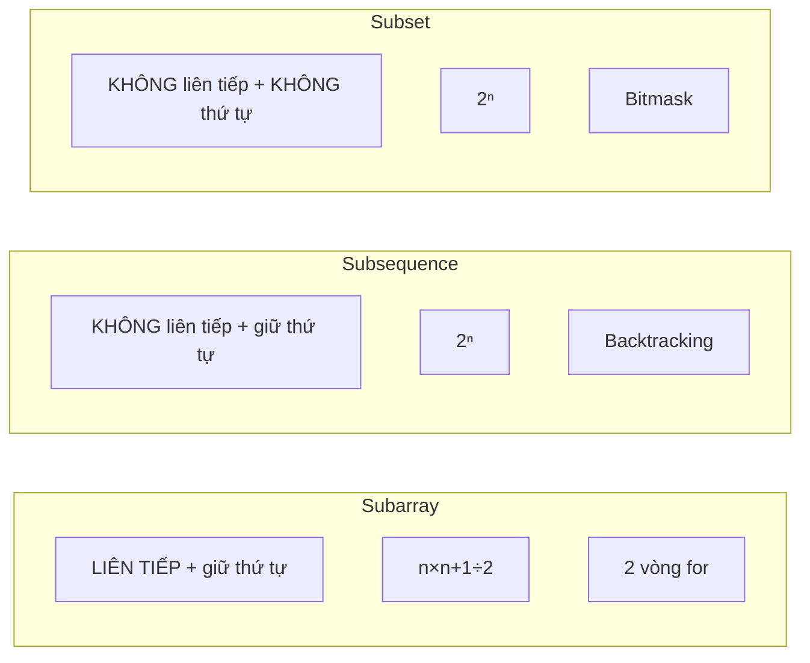

### Phân biệt 3 khái niệm

```
arr = [1, 2, 3, 4]

SUBARRAY (mảng con LIÊN TIẾP):
  Phải LIỀN NHAU, giữ THỨ TỰ!
  [1], [1,2], [2,3], [2,3,4], [1,2,3,4], ...
  ❌ [1,3] — không liên tiếp!
  Số lượng: n×(n+1)/2 = 10

SUBSEQUENCE (dãy con):
  KHÔNG cần liền, nhưng giữ THỨ TỰ!
  [1], [1,3], [1,2,4], [2,4], [1,2,3,4], ...
  ❌ [3,1] — sai thứ tự!
  Số lượng: 2ⁿ - 1 = 15

SUBSET (tập con):
  KHÔNG cần liền, KHÔNG cần thứ tự!
  {1}, {1,3}, {3,1}, {2,4,1}, ...
  Số lượng: 2ⁿ - 1 = 15 (giống subsequence nhưng thứ tự khác = cùng 1 subset)
```

```
HÌNH DUNG:

  Array:      [1, 2, 3, 4, 5]

  Subarray:   ████░░░░░░  ← KHỐI LIÊN TỤC
              ░░████░░░░
              ░░░░░░████

  Subsequence: █░█░░█░░░░  ← BỎ PHẦN TỬ (giữ thứ tự)
               █░░░█░░░░█

  Subset:     {bất kỳ tập con nào} → không quan tâm thứ tự
```

### Generate All Subarrays — O(n²)

```javascript
function allSubarrays(arr) {
  const result = [];
  for (let i = 0; i < arr.length; i++) {
    for (let j = i; j < arr.length; j++) {
      result.push(arr.slice(i, j + 1));
    }
  }
  return result;
}

// arr = [1, 2, 3]
// → [[1], [1,2], [1,2,3], [2], [2,3], [3]]
// Số lượng: n(n+1)/2 = 6
```

### Generate All Subsequences — Backtracking O(2ⁿ)

```
Mỗi phần tử có 2 lựa chọn: CHỌN hoặc BỎ!
  → Giống "thử đồ" trong Backtracking!
```

```javascript
function allSubsequences(arr) {
  const result = [];

  function backtrack(index, current) {
    if (index === arr.length) {
      if (current.length > 0) result.push([...current]);
      return;
    }

    // Lựa chọn 1: CHỌN arr[index]
    current.push(arr[index]);
    backtrack(index + 1, current);

    // Lựa chọn 2: BỎ arr[index]
    current.pop(); // undo!
    backtrack(index + 1, current);
  }

  backtrack(0, []);
  return result;
}
```

### Trace: allSubsequences([1, 2, 3])

```
backtrack(0, [])
├── CHỌN 1 → [1]
│   ├── CHỌN 2 → [1,2]
│   │   ├── CHỌN 3 → [1,2,3] → LƯU ✅
│   │   └── BỎ 3   → [1,2]   → LƯU ✅
│   └── BỎ 2   → [1]
│       ├── CHỌN 3 → [1,3]   → LƯU ✅
│       └── BỎ 3   → [1]     → LƯU ✅
└── BỎ 1   → []
    ├── CHỌN 2 → [2]
    │   ├── CHỌN 3 → [2,3]   → LƯU ✅
    │   └── BỎ 3   → [2]     → LƯU ✅
    └── BỎ 2   → []
        ├── CHỌN 3 → [3]     → LƯU ✅
        └── BỎ 3   → []      → SKIP (empty)

Kết quả: [1,2,3], [1,2], [1,3], [1], [2,3], [2], [3]
= 7 subsequences = 2³ - 1 ✅
```

### Generate All Subsets — Bitmask O(2ⁿ)

```
Cách tiếp cận KHÁC: dùng BITMASK!

  n = 3, mỗi mask từ 000 đến 111 (0 đến 7)

  mask=0 (000): {}         ← empty set
  mask=1 (001): {1}
  mask=2 (010): {2}
  mask=3 (011): {1, 2}
  mask=4 (100): {3}
  mask=5 (101): {1, 3}
  mask=6 (110): {2, 3}
  mask=7 (111): {1, 2, 3}

  Bit thứ i = 1? → CHỌN arr[i]!
```

```javascript
function allSubsets(arr) {
  const result = [];
  const n = arr.length;

  // mask từ 0 đến 2^n - 1
  for (let mask = 0; mask < 1 << n; mask++) {
    const subset = [];
    for (let i = 0; i < n; i++) {
      if (mask & (1 << i)) {
        subset.push(arr[i]); // bit i đang bật → chọn!
      }
    }
    result.push(subset);
  }
  return result;
}

// arr = [1, 2, 3]
// → [[], [1], [2], [1,2], [3], [1,3], [2,3], [1,2,3]]
// = 2³ = 8 subsets (kể cả empty set)
```

### Bảng so sánh CHI TIẾT

```
                  Subarray         Subsequence      Subset
  ─────────────────────────────────────────────────────────────
  Liên tiếp?      ✅ BẮT BUỘC       ❌ Không cần     ❌ Không cần
  Giữ thứ tự?     ✅ BẮT BUỘC       ✅ BẮT BUỘC      ❌ Không cần
  Số lượng        n(n+1)/2         2ⁿ - 1          2ⁿ
  Thuật toán      2 vòng for       Backtracking     Bitmask
  Complexity      O(n²)            O(2ⁿ)           O(2ⁿ)
  Ví dụ [1,2,3]   [1],[1,2],[2,3]  [1,3],[2]       {3,1}={1,3}
  LeetCode        #53, #560, #209  #300, #1143      #78, #90

  ⚠️ SUBSEQUENCE ≠ SUBSTRING!
     Substring = Subarray (cho strings) = LIÊN TIẾP!
     Subsequence = BỎ ký tự, GIỮA THỨ TỰ!

  Ví dụ "abcde":
    Substring:    "abc", "bcd", "cde"    ← liền nhau
    Subsequence:  "ace", "ade", "be"     ← giữ thứ tự, bỏ ký tự
```

### Bài toán KINH ĐIỂN theo từng loại

```
  SUBARRAY (liên tiếp):
    Maximum Subarray Sum         → Kadane's O(n)
    Subarray Sum = K             → Prefix Sum + Hash O(n)
    Min Size Subarray Sum ≥ K    → Sliding Window O(n)
    Product of Array Except Self → Prefix Product O(n)

  SUBSEQUENCE (giữ thứ tự):
    Longest Increasing Subseq.   → DP O(n²) / Binary Search O(n log n)
    Longest Common Subsequence   → DP O(n×m)
    Is Subsequence              → Two Pointers O(n)

  SUBSET (tập con):
    Subset Sum                   → DP O(n×sum)
    Combination Sum              → Backtracking
    Partition Equal Subset Sum   → DP O(n×sum/2)
```

```
💡 TÓM TẮT:
  Subarray:    liên tiếp + giữ thứ tự    → n(n+1)/2
  Subsequence: không liên tiếp + thứ tự  → 2ⁿ (Backtracking)
  Subset:      không liên tiếp + KO thứ tự → 2ⁿ (Bitmask)

  ⚠️ Substring = Subarray (cho string)!
  ⚠️ Subsequence ≠ Substring!

  Phỏng vấn hay nhầm! Đọc KỸ đề bài "subarray" hay "subsequence"!
```

---

<a id="13"></a>

## 1️⃣3️⃣ Monotonic Stack / Monotonic Queue

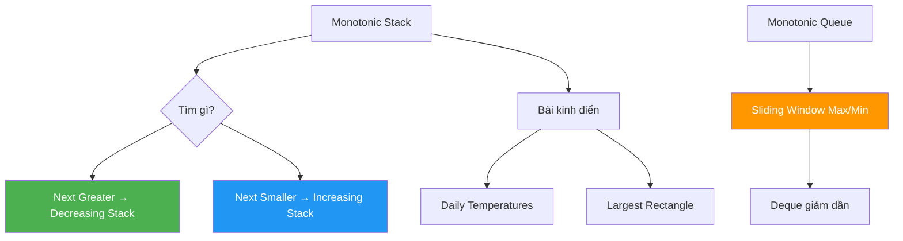

### Monotonic Stack là gì?

```
Stack mà luôn giữ THỨ TỰ TĂNG hoặc GIẢM!

  Monotonic Decreasing Stack (giảm dần từ đáy lên đỉnh):
    Push 5:  [5]
    Push 3:  [5, 3]        ← 3 < 5, OK!
    Push 7:  pop 3, pop 5 → [7]    ← loại các phần tử nhỏ hơn!

  Dùng để: tìm Next Greater / Smaller Element trong O(n)!
```

### Bài toán: Next Greater Element (NGE)

```
Cho mỗi phần tử, tìm phần tử ĐẦU TIÊN BÊN PHẢI lớn hơn nó!

  arr = [4, 5, 2, 10, 8]
  NGE = [5, 10, 10, -1, -1]

  Brute force: 2 vòng for → O(n²)
  Monotonic Stack: O(n)!
```

```javascript
function nextGreaterElement(arr) {
  const n = arr.length;
  const result = new Array(n).fill(-1);
  const stack = []; // lưu INDEX, không phải value!

  for (let i = 0; i < n; i++) {
    // Pop tất cả phần tử mà arr[i] LỚN HƠN
    while (stack.length > 0 && arr[i] > arr[stack[stack.length - 1]]) {
      const idx = stack.pop();
      result[idx] = arr[i]; // arr[i] là NGE của arr[idx]!
    }
    stack.push(i);
  }
  return result;
}
```

### Trace: [4, 5, 2, 10, 8]

```
  stack=[], result=[-1,-1,-1,-1,-1]

  i=0 (4): stack=[] → push → stack=[0]
  
  i=1 (5): 5 > arr[0]=4 → pop 0, result[0]=5 → stack=[1]
           NGE của 4 = 5 ✅

  i=2 (2): 2 < arr[1]=5 → push → stack=[1, 2]

  i=3 (10): 10 > arr[2]=2 → pop 2, result[2]=10
            10 > arr[1]=5 → pop 1, result[1]=10
            stack=[3]

  i=4 (8): 8 < arr[3]=10 → push → stack=[3, 4]

  Còn lại trong stack: không có NGE → -1

  result = [5, 10, 10, -1, -1] ✅

  Mỗi phần tử push 1 lần, pop TỐI ĐA 1 lần → O(n) tổng!
```

### Next Smaller Element (NSE) — đảo chiều!

```javascript
// Chỉ đổi DẤU SO SÁNH: > thành <
function nextSmallerElement(arr) {
  const n = arr.length;
  const result = new Array(n).fill(-1);
  const stack = []; // monotonic INCREASING stack!

  for (let i = 0; i < n; i++) {
    while (stack.length > 0 && arr[i] < arr[stack[stack.length - 1]]) {
      const idx = stack.pop();
      result[idx] = arr[i]; // arr[i] là NSE!
    }
    stack.push(i);
  }
  return result;
}

// arr = [4, 5, 2, 10, 8]
// NSE = [2, 2, -1, 8, -1]
```

### 4 biến thể Monotonic Stack

```
  Bài toán               Stack type        Điều kiện pop
  ────────────────────────────────────────────────────────────
  Next GREATER Right     Decreasing ↘      arr[i] > stack.top
  Next SMALLER Right     Increasing ↗      arr[i] < stack.top
  Next GREATER Left      Duyệt từ PHẢI     arr[i] > stack.top
  Next SMALLER Left      Duyệt từ PHẢI     arr[i] < stack.top

  ⚠️ Chỉ cần thay đổi 2 thứ:
    1. Dấu so sánh (> hay <)
    2. Hướng duyệt (trái→phải hay phải→trái)
```

### Daily Temperatures (LeetCode #739)

```
Cho mảng nhiệt độ, tìm SỐ NGÀY phải đợi để gặp ngày ẤM HƠN!

  temps = [73, 74, 75, 71, 69, 72, 76, 73]
  answer = [1, 1, 4, 2, 1, 1, 0, 0]
```

```javascript
function dailyTemperatures(temperatures) {
  const n = temperatures.length;
  const answer = new Array(n).fill(0);
  const stack = []; // monotonic decreasing stack (lưu index)

  for (let i = 0; i < n; i++) {
    while (stack.length > 0 && temperatures[i] > temperatures[stack[stack.length - 1]]) {
      const prevIdx = stack.pop();
      answer[prevIdx] = i - prevIdx; // số ngày đợi!
    }
    stack.push(i);
  }
  return answer;
}
```

```
Trace: [73, 74, 75, 71, 69, 72, 76, 73]

  i=0 (73): push → stack=[0]
  i=1 (74): 74>73 → pop 0, ans[0]=1-0=1 → stack=[1]
  i=2 (75): 75>74 → pop 1, ans[1]=2-1=1 → stack=[2]
  i=3 (71): push → stack=[2,3]
  i=4 (69): push → stack=[2,3,4]
  i=5 (72): 72>69 → pop 4, ans[4]=5-4=1
            72>71 → pop 3, ans[3]=5-3=2
            72<75 → push → stack=[2,5]
  i=6 (76): 76>72 → pop 5, ans[5]=6-5=1
            76>75 → pop 2, ans[2]=6-2=4
            stack=[6]
  i=7 (73): push → stack=[6,7]

  answer = [1, 1, 4, 2, 1, 1, 0, 0] ✅
```

### Monotonic Queue — Sliding Window Maximum (LeetCode #239)

```
Tìm MAX trong mỗi cửa sổ size k!

  nums = [1, 3, -1, -3, 5, 3, 6, 7], k = 3
  → [3, 3, 5, 5, 6, 7]

  Brute force: mỗi window tìm max O(k) → O(n×k)
  Monotonic Queue (Deque): O(n)!
```

```javascript
function maxSlidingWindow(nums, k) {
  const result = [];
  const deque = []; // lưu INDEX, giữ giảm dần (front = max)

  for (let i = 0; i < nums.length; i++) {
    // 1️⃣ Xóa phần tử NGOÀI cửa sổ
    while (deque.length > 0 && deque[0] <= i - k) {
      deque.shift();
    }

    // 2️⃣ Xóa phần tử NHỎ HƠN nums[i] (vì chúng KHÔNG BAO GIỜ là max)
    while (deque.length > 0 && nums[deque[deque.length - 1]] <= nums[i]) {
      deque.pop();
    }

    deque.push(i);

    // 3️⃣ Thêm max vào result (khi cửa sổ đủ size)
    if (i >= k - 1) {
      result.push(nums[deque[0]]); // front = max hiện tại!
    }
  }
  return result;
}
```

### Trace: [1, 3, -1, -3, 5, 3, 6, 7], k = 3

```
  deque=[], result=[]

  i=0 (1): deque=[0]                           window chưa đủ
  i=1 (3): 3>1 → pop 0, deque=[1]              window chưa đủ
  i=2 (-1): deque=[1,2]                         max=nums[1]=3 → result=[3]
  i=3 (-3): deque=[1,2,3]                       max=nums[1]=3 → result=[3,3]
  i=4 (5): deque[0]=1 ≤ 4-3=1 → shift!
           5>-3 → pop 3, 5>-1 → pop 2
           deque=[4]                             max=5 → result=[3,3,5]
  i=5 (3): deque=[4,5]                          max=5 → result=[3,3,5,5]
  i=6 (6): 6>3 → pop 5, 6>5 → pop 4
           deque=[6]                             max=6 → result=[3,3,5,5,6]
  i=7 (7): 7>6 → pop 6
           deque=[7]                             max=7 → result=[3,3,5,5,6,7]

  Kết quả: [3, 3, 5, 5, 6, 7] ✅
```

### Tại sao Monotonic Queue hiệu quả?

```
  Deque giữ thứ tự GIẢM DẦN:
    front = phần tử LỚN NHẤT = max hiện tại!
    
  Khi thêm phần tử mới:
    → Pop tất cả phần tử NHỎ HƠN (chúng KHÔNG BAO GIỜ là max nữa)
    → Vì phần tử mới VỪA mới hơn VỪA lớn hơn!

  Khi cửa sổ trượt:
    → Check front có NGOÀI cửa sổ không → shift!

  Mỗi phần tử push 1 lần, pop TỐI ĐA 1 lần → O(n) tổng!
```

### Largest Rectangle in Histogram (LeetCode #84) — HARD!

```
Cho mảng heights[], tìm hình chữ nhật LỚN NHẤT!

  heights = [2, 1, 5, 6, 2, 3]

  6 |       █
  5 |     █ █
  4 |     █ █
  3 |     █ █   █
  2 | █   █ █ █ █
  1 | █ █ █ █ █ █
    └─────────────
      0 1 2 3 4 5

  Max rectangle = 5×2 = 10 (cột 2,3 với height=5)

  Ý tưởng: với mỗi cột i, tìm nó MỞ RỘNG được bao xa?
    → Tìm Next Smaller Element bên TRÁI và bên PHẢI!
    → width = rightSmaller[i] - leftSmaller[i] - 1
    → area = height[i] × width
```

```javascript
function largestRectangleArea(heights) {
  const n = heights.length;
  const stack = []; // monotonic increasing stack
  let maxArea = 0;

  for (let i = 0; i <= n; i++) {
    const h = i === n ? 0 : heights[i]; // sentinel cuối

    while (stack.length > 0 && h < heights[stack[stack.length - 1]]) {
      const height = heights[stack.pop()];
      const width = stack.length === 0 ? i : i - stack[stack.length - 1] - 1;
      maxArea = Math.max(maxArea, height * width);
    }
    stack.push(i);
  }
  return maxArea;
}
```

```
Trace: [2, 1, 5, 6, 2, 3]

  i=0 (2): stack=[0]
  i=1 (1): 1<2 → pop 0, height=2, width=1, area=2 → stack=[1]
  i=2 (5): stack=[1,2]
  i=3 (6): stack=[1,2,3]
  i=4 (2): 2<6 → pop 3, height=6, width=4-2-1=1, area=6
           2<5 → pop 2, height=5, width=4-1-1=2, area=10 ✅
           stack=[1,4]
  i=5 (3): stack=[1,4,5]
  i=6 (0): 0<3 → pop 5, height=3, width=6-4-1=1, area=3
           0<2 → pop 4, height=2, width=6-1-1=4, area=8
           0<1 → pop 1, height=1, width=6, area=6

  maxArea = 10 ✅ (cột 2,3 với height 5)
```

```
💡 TÓM TẮT:
  Monotonic Stack: tìm Next Greater/Smaller Element → O(n)!
  Monotonic Queue (Deque): Sliding Window Max/Min → O(n)!

  Trick: lưu INDEX thay vì VALUE (để check ngoài cửa sổ)
  Mỗi phần tử push/pop TỐI ĐA 1 lần → amortized O(n)

  Bài kinh điển:
    Next Greater Element         → decreasing stack
    Daily Temperatures (#739)    → số ngày đợi = index gap
    Sliding Window Maximum (#239) → monotonic deque
    Largest Rectangle (#84)      → increasing stack + sentinel
```

---

<a id="14"></a>

## 1️⃣4️⃣ Quick Select — Tìm Kth Element

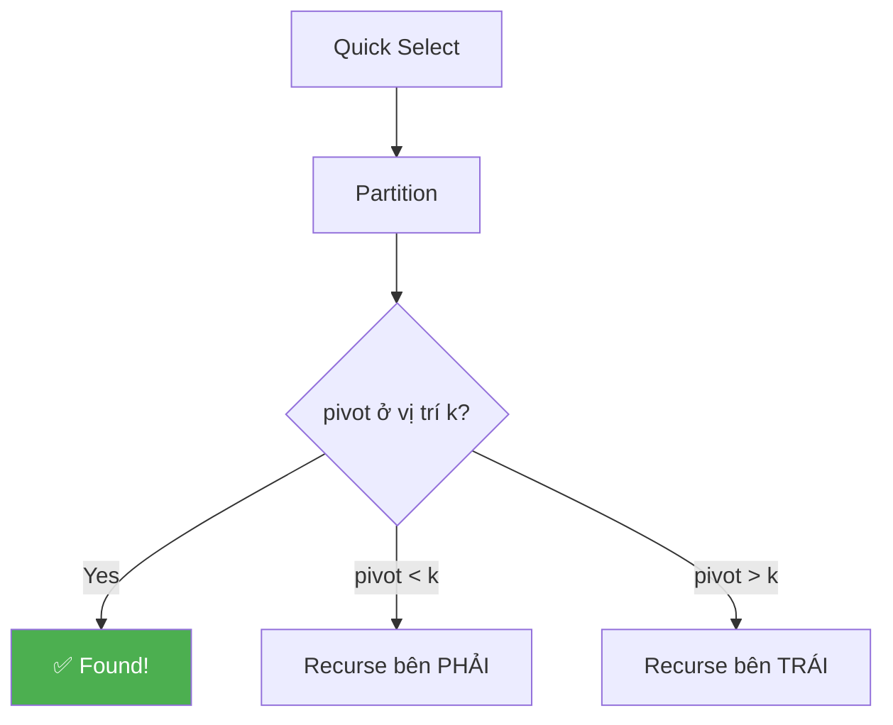

### Bài toán

```
Tìm phần tử LỚN THỨ K trong mảng KHÔNG sorted!

  nums = [3, 2, 1, 5, 6, 4], k = 2
  → Phần tử lớn thứ 2 = 5

  Cách 1: Sort → O(n log n) + lấy arr[n-k]
  Cách 2: Heap → O(n log k)
  Cách 3: Quick Select → O(n) average! ⚡
```

### Quick Select = Quick Sort nhưng chỉ sort NỬA!

```
TƯ TƯỞNG:
  1. Partition (giống Quick Sort) → pivot vào đúng chỗ
  2. Nếu pivot ở đúng vị trí k → XONG!
  3. Nếu chưa → chỉ recursion BÊN CÓ k (bỏ nửa kia!)

  Quick Sort:  sort CẢ HAI nửa → O(n log n)
  Quick Select: sort MỘT nửa  → O(n) average!
```

```javascript
function findKthLargest(nums, k) {
  const targetIdx = nums.length - k; // kth largest = (n-k)th smallest

  function quickSelect(lo, hi) {
    const pivotIdx = partition(nums, lo, hi);

    if (pivotIdx === targetIdx) return nums[pivotIdx]; // FOUND!
    if (pivotIdx < targetIdx) return quickSelect(pivotIdx + 1, hi); // bên PHẢI
    return quickSelect(lo, pivotIdx - 1); // bên TRÁI
  }

  return quickSelect(0, nums.length - 1);
}

function partition(arr, lo, hi) {
  // Random pivot để tránh worst case!
  const randomIdx = lo + Math.floor(Math.random() * (hi - lo + 1));
  [arr[randomIdx], arr[hi]] = [arr[hi], arr[randomIdx]];

  const pivot = arr[hi];
  let i = lo - 1;

  for (let j = lo; j < hi; j++) {
    if (arr[j] <= pivot) {
      i++;
      [arr[i], arr[j]] = [arr[j], arr[i]];
    }
  }
  [arr[i + 1], arr[hi]] = [arr[hi], arr[i + 1]];
  return i + 1;
}
```

### Trace: nums = [3, 2, 1, 5, 6, 4], k = 2

```
  targetIdx = 6 - 2 = 4 (tìm phần tử thứ 4 trong sorted order)

  quickSelect(0, 5):
    partition → giả sử pivot=4 ở vị trí 3
    [3, 2, 1, 4, 6, 5]
                ↑ pivotIdx=3

    3 < 4 → quickSelect(4, 5)  ← chỉ xét bên PHẢI!

  quickSelect(4, 5):
    partition → pivot=5 ở vị trí 4
    [..., 5, 6]
          ↑ pivotIdx=4

    4 === targetIdx=4 → return nums[4] = 5 ✅

  Chỉ partition 2 lần! (thay vì sort toàn bộ)
```

### Complexity

```
  Average: O(n)     ← n + n/2 + n/4 + ... = 2n = O(n)
  Worst:   O(n²)    ← nếu luôn chọn pivot tệ nhất
  
  → Random pivot → gần như LUÔN O(n) trong thực tế
  → Median of Medians → O(n) guaranteed (nhưng constant lớn)

  So sánh:
    Sort:         O(n log n), stable
    Heap:         O(n log k), dùng khi k nhỏ hoặc stream
    Quick Select: O(n) avg, tốt nhất cho single query!
```

```
💡 TÓM TẮT:
  Quick Select = Partition + chỉ recursion 1 NỬA → O(n) avg!
  Kth largest = (n-k)th smallest → targetIdx = n - k
  Random pivot → tránh worst case O(n²)
  Dùng khi: cần tìm kth element, KHÔNG cần sort toàn bộ
```

---

<a id="15"></a>

## 1️⃣5️⃣ Sqrt Decomposition — Chia √n block

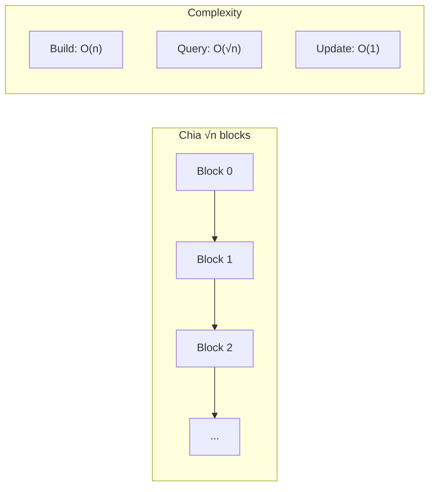

### Ý tưởng

```
Chia mảng thành √n BLOCKS, mỗi block √n phần tử!
Tiền xử lý mỗi block → query nhanh hơn!

  arr = [1, 5, 2, 4, 6, 1, 3, 5, 7, 10, 8, 4]
  n = 12, √12 ≈ 3 → block size = 3

  Block 0: [1, 5, 2]   sum=8
  Block 1: [4, 6, 1]   sum=11
  Block 2: [3, 5, 7]   sum=15
  Block 3: [10, 8, 4]  sum=22

  Query sum(2, 10):
    Partial block: [2]           → cộng thủ công
    Full blocks:   [4,6,1]+[3,5,7] → dùng sum pre-computed!
    Partial block: [10]          → cộng thủ công

  Thay vì cộng 9 phần tử → chỉ cần cộng ~√n lần!
```

```javascript
class SqrtDecomposition {
  constructor(arr) {
    this.arr = [...arr];
    this.n = arr.length;
    this.blockSize = Math.floor(Math.sqrt(this.n)) || 1;
    this.blocks = [];

    // Build: tính sum mỗi block
    for (let i = 0; i < this.n; i += this.blockSize) {
      let sum = 0;
      for (let j = i; j < Math.min(i + this.blockSize, this.n); j++) {
        sum += arr[j];
      }
      this.blocks.push(sum);
    }
  }

  // Update: O(1)
  update(idx, val) {
    const blockIdx = Math.floor(idx / this.blockSize);
    this.blocks[blockIdx] += val - this.arr[idx];
    this.arr[idx] = val;
  }

  // Range Sum Query: O(√n)
  query(L, R) {
    let sum = 0;
    const startBlock = Math.floor(L / this.blockSize);
    const endBlock = Math.floor(R / this.blockSize);

    if (startBlock === endBlock) {
      // Cùng 1 block → cộng thủ công
      for (let i = L; i <= R; i++) sum += this.arr[i];
    } else {
      // Partial đầu
      for (let i = L; i < (startBlock + 1) * this.blockSize; i++) {
        sum += this.arr[i];
      }
      // Full blocks ở giữa
      for (let b = startBlock + 1; b < endBlock; b++) {
        sum += this.blocks[b];
      }
      // Partial cuối
      for (let i = endBlock * this.blockSize; i <= R; i++) {
        sum += this.arr[i];
      }
    }
    return sum;
  }
}
```

```
Complexity:
  Build:    O(n)
  Query:    O(√n)     ← tối đa √n blocks + 2×√n partial
  Update:   O(1)

  So sánh:
    Prefix Sum:   query O(1) nhưng update O(n) ← tĩnh!
    Sqrt Decomp:  query O(√n), update O(1) ← cân bằng!
    Segment Tree: query O(log n), update O(log n) ← tốt nhất!
```

---

<a id="16"></a>

## 1️⃣6️⃣ Sparse Table — Range Query O(1) cho IMMUTABLE

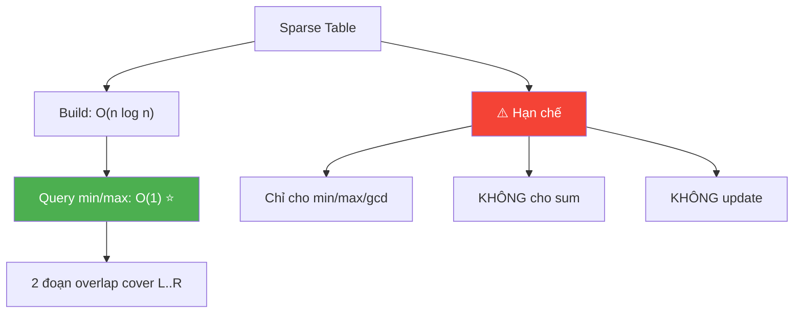

### Ý tưởng

```
Tiền xử lý O(n log n) → trả lời Range Min/Max query O(1)!

  CHỈ dùng cho: overlap-friendly operations (min, max, gcd)
  KHÔNG dùng cho: sum (vì overlap = đếm trùng!)

  Lưu: table[i][j] = min/max đoạn [i, i + 2^j - 1]
       (đoạn dài 2^j bắt đầu từ i)

  Query min(L, R):
    Tìm k = log₂(R-L+1)
    min = Math.min(table[L][k], table[R - 2^k + 1][k])
    → 2 đoạn overlap COVER toàn bộ [L, R]!

    [L ──────── 2^k ────────]
                  [──── 2^k ──────── R]
    ← overlap OK vì min(overlap) = min(gốc) →
```

```javascript
class SparseTable {
  constructor(arr) {
    const n = arr.length;
    const LOG = Math.floor(Math.log2(n)) + 1;

    // table[i][j] = min of range [i, i + 2^j - 1]
    this.table = Array.from({ length: n }, () => new Array(LOG).fill(0));
    this.LOG = LOG;

    // Base case: đoạn dài 1 = chính nó
    for (let i = 0; i < n; i++) {
      this.table[i][0] = arr[i];
    }

    // Build: đoạn dài 2^j = min(nửa trái, nửa phải)
    for (let j = 1; j < LOG; j++) {
      for (let i = 0; i + (1 << j) - 1 < n; i++) {
        this.table[i][j] = Math.min(
          this.table[i][j - 1],                // nửa trái
          this.table[i + (1 << (j - 1))][j - 1] // nửa phải
        );
      }
    }
  }

  // Range Minimum Query: O(1)!
  query(L, R) {
    const k = Math.floor(Math.log2(R - L + 1));
    return Math.min(
      this.table[L][k],
      this.table[R - (1 << k) + 1][k]
    );
  }
}
```

### Trace: arr = [3, 1, 4, 1, 5, 9, 2, 6]

```
Build Sparse Table:

  j=0 (đoạn dài 1):
    table[i][0] = arr[i]
    [3, 1, 4, 1, 5, 9, 2, 6]

  j=1 (đoạn dài 2):
    table[0][1] = min(3,1) = 1
    table[1][1] = min(1,4) = 1
    table[2][1] = min(4,1) = 1
    table[3][1] = min(1,5) = 1
    table[4][1] = min(5,9) = 5
    table[5][1] = min(9,2) = 2
    table[6][1] = min(2,6) = 2

  j=2 (đoạn dài 4):
    table[0][2] = min(table[0][1], table[2][1]) = min(1,1) = 1
    table[1][2] = min(table[1][1], table[3][1]) = min(1,1) = 1
    table[2][2] = min(table[2][1], table[4][1]) = min(1,5) = 1
    table[3][2] = min(table[3][1], table[5][1]) = min(1,2) = 1
    table[4][2] = min(table[4][1], table[6][1]) = min(5,2) = 2

Query min(2, 6):
  k = log₂(6-2+1) = log₂(5) = 2 (đoạn dài 4)
  min(table[2][2], table[6-4+1][2]) = min(table[2][2], table[3][2])
  = min(1, 1) = 1 ✅

  Kiểm tra: min(4, 1, 5, 9, 2) = 1 ✅
```

```
💡 TÓM TẮT:
  Sparse Table: tiền xử lý O(n log n), query O(1)!
  CHỈ cho: min, max, gcd (overlap-friendly, IDEMPOTENT)
  KHÔNG cho: sum (overlap = đếm trùng!)
  KHÔNG hỗ trợ update → chỉ dùng cho mảng IMMUTABLE!

  So sánh:
    Prefix Sum:   sum O(1), KHÔNG min/max
    Sparse Table: min/max O(1), KHÔNG sum, KHÔNG update
    Segment Tree: cả sum VÀ min/max, CÓ update, query O(log n)
```

---

<a id="17"></a>

## 1️⃣7️⃣ Segment Tree — Range Query + Update O(log n)

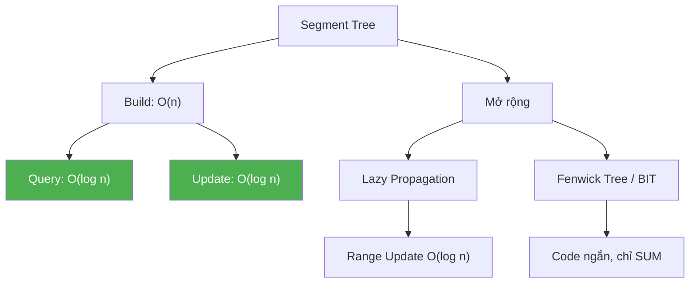

### Tại sao cần Segment Tree?

```
  So sánh các kỹ thuật Range Query:

                      Build    Query    Update
  Prefix Sum:         O(n)     O(1)     O(n) ❌
  Sqrt Decomp:        O(n)     O(√n)    O(1)
  Sparse Table:       O(nlogn) O(1)     ❌ immutable
  Segment Tree:       O(n)     O(logn)  O(logn) ✅ BEST!

  Segment Tree = CHUẨN cho bài toán range query + update!
  Hỗ trợ: sum, min, max, gcd, xor, ... BẤT KỲ!
```

### Cấu trúc

```
Segment Tree = CÂY NHỊ PHÂN lưu thông tin ĐOẠN!

  arr = [1, 3, 5, 7, 9, 11]

                    [36]           ← sum(0..5)
                 /       \
            [9]              [27]      ← sum(0..2), sum(3..5)
           /   \            /    \
        [4]    [5]       [16]    [11]   ← sum(0..1), sum(2), sum(3..4), sum(5)
        / \              /  \
      [1] [3]         [7]  [9]         ← leaf nodes = mảng gốc

  Mỗi node lưu kết quả TỔNG HỢP (sum/min/max) của đoạn con!
  → Query đoạn bất kỳ: gom vài node → O(log n)
  → Update 1 phần tử: cập nhật từ leaf lên root → O(log n)
```

### Implementation

```javascript
class SegmentTree {
  constructor(arr) {
    this.n = arr.length;
    this.tree = new Array(4 * this.n).fill(0); // tree gấp 4 lần
    this.build(arr, 1, 0, this.n - 1);
  }

  // Build: O(n)
  build(arr, node, start, end) {
    if (start === end) {
      this.tree[node] = arr[start]; // leaf = giá trị gốc
      return;
    }

    const mid = Math.floor((start + end) / 2);
    this.build(arr, 2 * node, start, mid);       // con trái
    this.build(arr, 2 * node + 1, mid + 1, end); // con phải
    this.tree[node] = this.tree[2 * node] + this.tree[2 * node + 1]; // merge
  }

  // Query sum [L, R]: O(log n)
  query(node, start, end, L, R) {
    if (R < start || end < L) return 0;           // NGOÀI range → bỏ
    if (L <= start && end <= R) return this.tree[node]; // TRỌN trong range → lấy

    const mid = Math.floor((start + end) / 2);
    const leftSum = this.query(2 * node, start, mid, L, R);
    const rightSum = this.query(2 * node + 1, mid + 1, end, L, R);
    return leftSum + rightSum;
  }

  // Update arr[idx] = val: O(log n)
  update(node, start, end, idx, val) {
    if (start === end) {
      this.tree[node] = val; // leaf → cập nhật trực tiếp
      return;
    }

    const mid = Math.floor((start + end) / 2);
    if (idx <= mid) this.update(2 * node, start, mid, idx, val);
    else this.update(2 * node + 1, mid + 1, end, idx, val);
    this.tree[node] = this.tree[2 * node] + this.tree[2 * node + 1]; // recalc
  }

  // Helper methods
  rangeSum(L, R) { return this.query(1, 0, this.n - 1, L, R); }
  pointUpdate(idx, val) { this.update(1, 0, this.n - 1, idx, val); }
}
```

### Trace: arr = [1, 3, 5, 7, 9, 11]

```
Build (bottom-up):
  Leaves:    tree[8]=1, tree[9]=3, tree[10]=5, tree[11]=7, tree[12]=9, tree[13]=11
  Level 2:   tree[4]=1+3=4, tree[5]=5, tree[6]=7+9=16, tree[7]=11
  Level 1:   tree[2]=4+5=9, tree[3]=16+11=27
  Root:      tree[1]=9+27=36

Query sum(2, 4):
  node=1 [0,5]: không trọn → chia đôi
    node=2 [0,2]: không trọn → chia đôi
      node=4 [0,1]: NGOÀI [2,4] → return 0
      node=5 [2,2]: TRỌN trong [2,4] → return 5
    node=3 [3,5]: không trọn → chia đôi
      node=6 [3,4]: TRỌN trong [2,4] → return 16
      node=7 [5,5]: NGOÀI [2,4] → return 0
  
  sum = 0 + 5 + 16 + 0 = 21
  Kiểm tra: 5 + 7 + 9 = 21 ✅

Update arr[3] = 10:
  Đi từ root → leaf [3]
  tree[11] = 10 (was 7)
  tree[6] = 10 + 9 = 19 (was 16)
  tree[3] = 19 + 11 = 30 (was 27)
  tree[1] = 9 + 30 = 39 (was 36) ✅
```

### Lazy Propagation — Range Update O(log n)

```
Bình thường: update 1 PHẦN TỬ → O(log n)
Nếu update cả ĐOẠN [L, R] += val → mỗi phần tử O(log n) → O(n log n) 💀

LAZY: "Ghi nhớ" update ở node cha, CHƯA cập nhật xuống con!
      → Chỉ push down khi CẦN (khi query/update node con)

  lazy[node] = giá trị ĐANG CHỜ cập nhật xuống!

  Ví dụ: Range Update [0, 5] += 3

  KHÔNG lazy: cập nhật tất cả 6 leaf nodes
  CÓ lazy:   chỉ đánh dấu lazy ở ROOT → O(1)!
             Khi query node con → push lazy XUỐNG
```

```javascript
class LazySegmentTree {
  constructor(n) {
    this.n = n;
    this.tree = new Array(4 * n).fill(0);
    this.lazy = new Array(4 * n).fill(0); // pending updates
  }

  // Push lazy xuống con
  pushDown(node, start, end) {
    if (this.lazy[node] !== 0) {
      const mid = Math.floor((start + end) / 2);
      const leftLen = mid - start + 1;
      const rightLen = end - mid;

      // Cập nhật con trái
      this.tree[2 * node] += this.lazy[node] * leftLen;
      this.lazy[2 * node] += this.lazy[node];

      // Cập nhật con phải
      this.tree[2 * node + 1] += this.lazy[node] * rightLen;
      this.lazy[2 * node + 1] += this.lazy[node];

      this.lazy[node] = 0; // clear lazy!
    }
  }

  // Range Update [L, R] += val: O(log n)
  rangeUpdate(node, start, end, L, R, val) {
    if (R < start || end < L) return;           // ngoài range

    if (L <= start && end <= R) {               // trọn trong range
      this.tree[node] += val * (end - start + 1);
      this.lazy[node] += val;                   // ghi nhớ lazy!
      return;
    }

    this.pushDown(node, start, end);            // push lazy trước khi đi sâu
    const mid = Math.floor((start + end) / 2);
    this.rangeUpdate(2 * node, start, mid, L, R, val);
    this.rangeUpdate(2 * node + 1, mid + 1, end, L, R, val);
    this.tree[node] = this.tree[2 * node] + this.tree[2 * node + 1];
  }

  // Range Query [L, R]: O(log n)
  rangeQuery(node, start, end, L, R) {
    if (R < start || end < L) return 0;
    if (L <= start && end <= R) return this.tree[node];

    this.pushDown(node, start, end);            // PHẢI push trước query!
    const mid = Math.floor((start + end) / 2);
    return this.rangeQuery(2 * node, start, mid, L, R)
         + this.rangeQuery(2 * node + 1, mid + 1, end, L, R);
  }
}
```

```
Trace: n=6, rangeUpdate([1,4], +3)

  TRƯỚC: tree = [0, 0, 0, 0, 0, 0]
         (tất cả = 0)

  rangeUpdate(root, 0, 5, 1, 4, 3):
    node=1 [0,5]: giao → pushDown, chia đôi
      node=2 [0,2]: giao → chia đôi
        node=4 [0,1]: giao → chia đôi
          node=8 [0,0]: NGOÀI [1,4] → skip
          node=9 [1,1]: TRỌN! tree+=3, lazy=3
        node=5 [2,2]: TRỌN! tree+=3, lazy=3
      node=3 [3,5]: giao → chia đôi
        node=6 [3,4]: TRỌN! tree+=3×2=6, lazy=3 ← cả đoạn!
        node=7 [5,5]: NGOÀI → skip

  Kết quả: arr hiệu quả = [0, 3, 3, 3, 3, 0]
  Sum(1,4) = 12 ✅ — chỉ cần O(log n) nodes!
```

### Fenwick Tree (Binary Indexed Tree / BIT)

```
Fenwick Tree = Segment Tree "nhẹ cân" hơn!

  Code NGẮN hơn, hằng số NHỎ hơn, nhưng:
  → Chỉ hỗ trợ PREFIX operations (sum, xor, ...)
  → KHÔNG hỗ trợ min/max (vì không inverse!)

  Cấu trúc: mỗi node quản lý ĐOẠN dựa trên bit thấp nhất!

  index (binary):  lowbit:  manages range:
    1 (0001)         1      [1, 1]
    2 (0010)         2      [1, 2]
    3 (0011)         1      [3, 3]
    4 (0100)         4      [1, 4]
    5 (0101)         1      [5, 5]
    6 (0110)         2      [5, 6]
    7 (0111)         1      [7, 7]
    8 (1000)         8      [1, 8]
```

```javascript
class FenwickTree {
  constructor(n) {
    this.n = n;
    this.tree = new Array(n + 1).fill(0); // 1-indexed!
  }

  // Update: add val to index i — O(log n)
  update(i, val) {
    for (i++; i <= this.n; i += i & (-i)) {
      this.tree[i] += val;
    }
  }

  // Prefix Sum: sum [0, i] — O(log n)
  prefixSum(i) {
    let sum = 0;
    for (i++; i > 0; i -= i & (-i)) {
      sum += this.tree[i];
    }
    return sum;
  }

  // Range Sum: sum [L, R] — O(log n)
  rangeSum(L, R) {
    return this.prefixSum(R) - (L > 0 ? this.prefixSum(L - 1) : 0);
  }
}

// Xây dựng từ mảng:
function buildFenwick(arr) {
  const bit = new FenwickTree(arr.length);
  for (let i = 0; i < arr.length; i++) {
    bit.update(i, arr[i]);
  }
  return bit;
}
```

### Trace Fenwick: arr = [1, 3, 5, 7, 9, 11]

```
  Build (update từng phần tử):
    update(0, 1): tree[1]+=1
    update(1, 3): tree[2]+=3
    update(2, 5): tree[3]+=5
    update(3, 7): tree[4]+=7
    ...

  prefixSum(3):  (tổng [0..3] = 1+3+5+7 = 16)
    i=4 (0100): sum += tree[4] = 16    ← tree[4] quản lý [1..4]
    i=0: STOP!
    return 16 ✅

  rangeSum(2, 4):  (tổng [2..4] = 5+7+9 = 21)
    prefixSum(4) - prefixSum(1)
    = (1+3+5+7+9) - (1+3) = 25 - 4 = 21 ✅
```

### ⚠️ `i & (-i)` là gì?

```
  i & (-i) = LOWBIT = bit thấp nhất = 1!

  Ví dụ:
    6  = 0110 → -6 = 1010 → 6 & (-6) = 0010 = 2
    12 = 1100 → -12= 0100 → 12&(-12) = 0100 = 4

  Update: i += lowbit(i) → đi LÊN tree
  Query:  i -= lowbit(i) → đi XUỐNG = cộng dồn prefix
```

### Fenwick vs Segment Tree

```
                    Fenwick Tree       Segment Tree
  ─────────────────────────────────────────────────────
  Code length       ~10 dòng           ~40 dòng
  Space             O(n)               O(4n)
  Point Update      O(log n) ✅        O(log n) ✅
  Range Query       O(log n) ✅        O(log n) ✅
  Range Update      O(log n)*          O(log n) + lazy
  Min/Max Query     ❌ KHÔNG            ✅ CÓ
  Hằng số           Nhỏ, NHANH         Lớn hơn

  * Fenwick range update cần thêm trick (2 BITs)

  → Dùng Fenwick khi: chỉ cần SUM + code ngắn
  → Dùng Segment Tree khi: cần min/max hoặc complex operations
```

```
💡 TÓM TẮT:
  Segment Tree: query + update O(log n)!
  Build O(n), dùng mảng 4n lưu tree
  Hỗ trợ: sum, min, max, gcd, xor — BẤT KỲ phép merge!
  
  Query: nếu node TRỌN trong [L,R] → lấy, NGOÀI → bỏ, GIAO → chia đôi
  Update: đi từ root → leaf, recalc các node cha

  Lazy Propagation: range update O(log n) — "nhớ trước, tính sau"!
  Fenwick Tree (BIT): code ngắn, nhanh, nhưng CHỈ cho SUM!

  Khi nào: cần QUERY + UPDATE trên đoạn → Segment Tree!
  Nếu chỉ query (no update) → Sparse Table O(1) nhanh hơn!
  Nếu chỉ cần SUM → Fenwick Tree code ngắn hơn!
```

---

<a id="18"></a>

## 1️⃣8️⃣ MO's Algorithm — Offline Range Queries

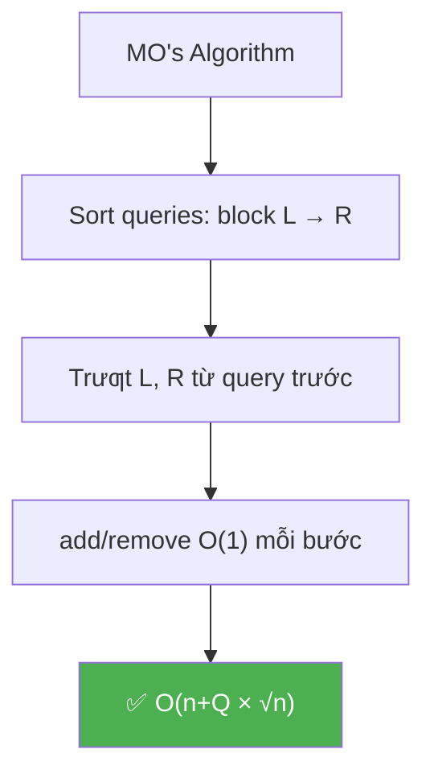

### Ý tưởng

```
Trả lời NHIỀU range queries [L, R] trên mảng OFFLINE!

  OFFLINE = biết TẤT CẢ queries trước → sắp xếp thông minh!

  Ví dụ: Đếm số phần tử DISTINCT trong đoạn [L, R]

  Brute force: mỗi query O(n) → Q queries = O(n×Q)
  MO's: sort queries + "trượt" L, R → O((n + Q) × √n)!
```

### Thuật toán

```
  1. Chia mảng thành √n BLOCKS (giống Sqrt Decomposition)
  2. SORT queries theo: block(L) tăng, nếu cùng block → R tăng
  3. Duyệt queries theo thứ tự đã sort
  4. Di chuyển L, R từ query trước → query hiện tại
     (chỉ thêm/xóa 1 phần tử mỗi bước!)

  Tại sao SORT giúp nhanh?
    → L di chuyển TRONG cùng block (≤ √n bước)
    → R tăng dần khi cùng block (tổng ≤ n bước)
    → Tổng di chuyển: O((n + Q) × √n)!
```

```javascript
function mosAlgorithm(arr, queries) {
  const n = arr.length;
  const blockSize = Math.floor(Math.sqrt(n)) || 1;

  // Sort queries theo MO's order
  const sortedQueries = queries.map((q, i) => ({ ...q, idx: i }));
  sortedQueries.sort((a, b) => {
    const blockA = Math.floor(a.L / blockSize);
    const blockB = Math.floor(b.L / blockSize);
    if (blockA !== blockB) return blockA - blockB;
    return a.R - b.R;
  });

  // State: đếm distinct trong window hiện tại
  const freq = new Map();
  let distinct = 0;
  let curL = 0, curR = -1;

  function add(idx) {
    const val = arr[idx];
    freq.set(val, (freq.get(val) || 0) + 1);
    if (freq.get(val) === 1) distinct++; // phần tử MỚI!
  }

  function remove(idx) {
    const val = arr[idx];
    freq.set(val, freq.get(val) - 1);
    if (freq.get(val) === 0) distinct--; // hết phần tử này!
  }

  const result = new Array(queries.length);

  for (const q of sortedQueries) {
    // Di chuyển R sang phải
    while (curR < q.R) { curR++; add(curR); }
    // Di chuyển R sang trái
    while (curR > q.R) { remove(curR); curR--; }
    // Di chuyển L sang trái
    while (curL > q.L) { curL--; add(curL); }
    // Di chuyển L sang phải
    while (curL < q.L) { remove(curL); curL++; }

    result[q.idx] = distinct;
  }
  return result;
}
```

### Trace

```
  arr = [1, 2, 1, 3, 2, 1], n=6, blockSize=2
  queries = [{L:0,R:3}, {L:1,R:5}, {L:2,R:4}]

  Sort (block(L), R):
    q0: block(0)=0, R=3
    q2: block(2)=1, R=4
    q1: block(1)=0, R=5 → oops, block(1)=0 cùng block q0
    → sorted: q0(b0,R3), q1(b0,R5), q2(b1,R4)

  Process:
    q0 [0,3]: add 0,1,2,3 → freq={1:2,2:1,3:1} → distinct=3
    q1 [1,5]: remove 0, add 4,5 → freq={1:1,2:2,3:1} → distinct=3  
    q2 [2,4]: remove 1, remove 5 → freq={1:1,2:1,3:1} → distinct=3

  result = [3, 3, 3]
```

```
💡 TÓM TẮT:
  MO's Algorithm: OFFLINE range queries → O((n+Q)√n)!
  Sort queries: block(L) → R → giảm tổng di chuyển
  Key: add/remove 1 phần tử phải O(1)!
  Dùng khi: nhiều queries + CÓ THỂ process offline
  KHÔNG dùng khi: online (queries đến từng cái) hoặc update
```

---

<a id="18"></a>

## 1️⃣9️⃣ Tổng hợp các Pattern quan trọng

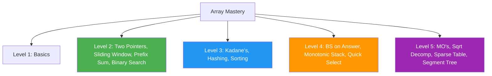

### Khi nào dùng kỹ thuật gì?

```
  BÀI TOÁN                              → KỸ THUẬT
  ──────────────────────────────────────────────────────
  Tìm pair/triplet thỏa ĐK             → Two Pointers (sorted) hoặc Hash Map
  Subarray liên tiếp max/min            → Sliding Window hoặc Kadane's
  Tổng đoạn [L, R] nhiều lần           → Prefix Sum
  Tìm phần tử trong sorted array       → Binary Search
  Đếm frequency / tìm duplicate        → Hash Map / Hash Set
  In-place rearrange                    → Two Pointers (same direction)
  Tìm k-th largest/smallest            → Quick Select hoặc Heap
  Merge sorted arrays                   → Two Pointers (merge)
  Next Greater/Smaller Element          → Monotonic Stack
  Sliding Window Max/Min                → Monotonic Queue (Deque)
  Range Min/Max (no update)             → Sparse Table O(1)
  Range Sum (with update)               → Sqrt Decomposition / Segment Tree
  Nhiều range queries (offline)         → MO's Algorithm
  "Minimize the maximum"               → Binary Search on Answer
```

### Bảng complexity tóm tắt

```
  Kỹ thuật          Tiền xử lý    Query/Thao tác     Update
  ──────────────────────────────────────────────────────────────
  Two Pointers       O(n log n)*   O(n)               —
  Sliding Window     —             O(n)               —
  Prefix Sum         O(n)          O(1) per query     O(n) rebuild
  Kadane's           —             O(n)               —
  Binary Search      O(n log n)*   O(log n) per query —
  Hash Map/Set       O(n)          O(1) per lookup    O(1)
  Monotonic Stack    —             O(n) total         —
  Quick Select       —             O(n) avg           —
  Sqrt Decomp        O(n)          O(√n)              O(1)
  Sparse Table       O(n log n)    O(1) min/max       ❌ immutable
  Segment Tree       O(n)          O(log n)           O(log n)
  MO's Algorithm     O((n+Q)√n)    batch offline      ❌ no update

  * cần sort trước
```

### Đường học — Learning Path

```
  ┌─────────────────────────────────────────────────┐
  │               ARRAY MASTERY PATH                 │
  ├─────────────────────────────────────────────────┤
  │                                                  │
  │  Level 1: BASICS                                │
  │  ├── Array operations (traverse, insert, delete) │
  │  ├── Basic sorting (Selection, Insertion)        │
  │  └── Linear Search                              │
  │                                                  │
  │  Level 2: ESSENTIAL TECHNIQUES                   │
  │  ├── Two Pointers                               │
  │  ├── Sliding Window                             │
  │  ├── Prefix Sum                                 │
  │  └── Binary Search                              │
  │                                                  │
  │  Level 3: INTERMEDIATE                          │
  │  ├── Kadane's Algorithm                         │
  │  ├── Hashing (Two Sum, Frequency)               │
  │  ├── Merge Sort, Quick Sort                     │
  │  └── Subarray Sum = K (Prefix + Hash)           │
  │                                                  │
  │  Level 4: ADVANCED                              │
  │  ├── Binary Search on Answer                    │
  │  ├── Monotonic Stack / Queue                    │
  │  ├── Dutch National Flag (3-way partition)      │
  │  └── Quick Select (Kth element)                 │
  │                                                  │
  │  Level 5: EXPERT                                │
  │  ├── MO's Algorithm                             │
  │  ├── Sqrt Decomposition                         │
  │  ├── Sparse Table (Range Query)                 │
  │  └── Segment Tree / BIT                         │
  │                                                  │
  └─────────────────────────────────────────────────┘
```

```
💡 TỔNG KẾT TOÀN BỘ:
  Array = cấu trúc dữ liệu NỀN TẢNG nhất!
  Random Access O(1) + Cache Friendly = NHANH!

  6 kỹ thuật PHẢI THUỘC:
    1. Two Pointers      — pair matching, in-place
    2. Sliding Window     — subarray liên tiếp
    3. Prefix Sum         — range query O(1)
    4. Kadane's           — max subarray sum
    5. Binary Search      — tìm kiếm O(log n)
    6. Hash Map/Set       — lookup O(1)

  Nắm vững 6 kỹ thuật này → GIẢI ĐƯỢC 80% bài Array! 🎯
```
