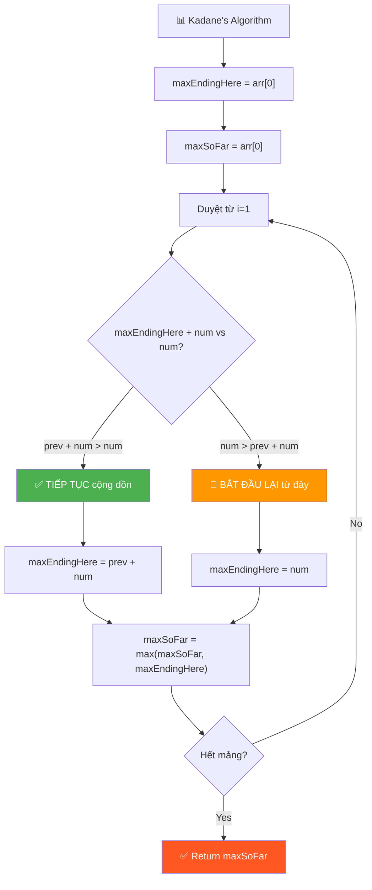
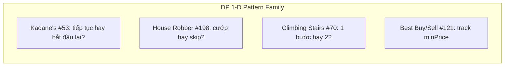

# 📊 Kadane's Algorithm — Maximum Subarray (LeetCode #53)

> 📖 Code: [Kadane's Algorithm.js](./Kadane's%20Algorithm.js)





---

## 🧠 Bản chất bài toán — Hiểu để NHỚ, không chỉ để GIẢI

> ⚡ **Đọc phần này TRƯỚC. Nếu bạn chỉ nhớ 1 thứ, nhớ phần này.**

### 1️⃣ Analogy — Ví dụ đời thường

```
💰 ĐẦU TƯ CHỨNG KHOÁN — đây là TẤT CẢ bạn cần nhớ!

  Mỗi ngày bạn lãi hoặc lỗ 1 số tiền:
  [3, 5, -9, 1, 3, -2, 3, 4, 7, 2, -9, 6, 3, 1, -5, 4]

  Bạn muốn tìm: GIAI ĐOẠN LIÊN TỤC cho lợi nhuận CAO NHẤT!

  Tại mỗi ngày, bạn hỏi: 
    "Tiếp tục giữ từ trước → cộng dồn?"
    "Hay BỎ hết, bắt đầu lại từ HÔM NAY?"

  Nếu cộng dồn + hôm nay > chỉ hôm nay → TIẾP TỤC!
  Nếu cộng dồn + hôm nay < chỉ hôm nay → BỎ, BẮT ĐẦU LẠI!

  ĐÓ LÀ TẤT CẢ. Kadane's Algorithm!
```

### 2️⃣ Recipe — 2 biến, 1 công thức

```
📝 RECIPE:

  Biến 1: maxEndingHere = "lợi nhuận tốt nhất KẾT THÚC tại đây"
  Biến 2: maxSoFar      = "lợi nhuận tốt nhất TỪNG THẤY"

  Công thức tại MỖI SỐ:
    maxEndingHere = max(num, maxEndingHere + num)
                        ↑           ↑
                   bắt đầu lại   tiếp tục cộng dồn

    maxSoFar = max(maxSoFar, maxEndingHere)
                     ↑              ↑
                  giữ cũ       cập nhật mới

  Chỉ 2 dòng code logic. Duyệt 1 lần. O(n) time, O(1) space!
```

```javascript
// BẢN CHẤT — chỉ 6 dòng:
function kadanesAlgorithm(array) {
  let maxEndingHere = array[0];
  let maxSoFar = array[0];
  for (let i = 1; i < array.length; i++) {
    const num = array[i];
    maxEndingHere = Math.max(num, maxEndingHere + num);
    maxSoFar = Math.max(maxSoFar, maxEndingHere);
  }
  return maxSoFar;
}
```

### 3️⃣ Visual — Hình ảnh ghi vào đầu

```
array = [3, 5, -9, 1, 3, -2, 3, 4, 7, 2, -9, 6, 3, 1, -5, 4]

maxEndingHere tại mỗi vị trí:

  num:              3   5  -9   1   3  -2   3   4   7   2  -9   6   3   1  -5   4
  maxEndingHere:    3   8  -1   1   4   2   5   9  16  18   9  15  18  19  14  18
                    ↑   ↑   ↑   ↑                              ↑
                  base 3+5 8-9  BẮT ĐẦU LẠI!                  MAX!
                             <0? Không, =-1                     
                                  -1+1=0 < 1
                                  → bắt đầu lại = 1!

  maxSoFar:         3   8   8   8   8   8   8   9  16  18  18  18  18  19  19  19
                                                                    ↑
                                                                   ĐÁP ÁN = 19!
```

```
Subarray cho max sum = 19:
  [3, 5, -9, 1, 3, -2, 3, 4, 7, 2, -9, 6, 3, 1, -5, 4]
                   |__________________________|
                    1 + 3 + (-2) + 3 + 4 + 7 + 2 + (-9) + 6 + 3 + 1 = 19
```

### 4️⃣ Tại sao công thức hoạt động?

```
maxEndingHere = max(num, maxEndingHere + num)

  Ý nghĩa: TẠI MỖI SỐ, chỉ có 2 LỰA CHỌN:

  ① num                  → "Bỏ hết phía trước, bắt đầu lại từ đây"
  ② maxEndingHere + num  → "Tiếp tục cộng dồn từ trước"

  Khi nào BẮT ĐẦU LẠI?
  → Khi maxEndingHere + num < num
  → Tức maxEndingHere < 0!
  → Nếu tổng trước đó ÂM → cộng thêm chỉ làm GIẢM → bỏ!

  VÍ DỤ:
  [3, 5, -9, 1]
        ↑    ↑
  maxEndingHere = 8-9 = -1  (tổng đến đây = -1)
  Tại 1: max(1, -1+1) = max(1, 0) = 1 → BẮT ĐẦU LẠI!
  Vì cộng dồn (-1+1=0) TỆ hơn bắt đầu lại (1)!
```

```
maxSoFar = max(maxSoFar, maxEndingHere)

  Ý nghĩa: "Ghi nhớ KẾT QUẢ TỐT NHẤT từng thấy"

  maxEndingHere có thể GIẢM (khi gặp số âm)
  Nhưng maxSoFar CHỈ TĂNG hoặc giữ nguyên → luôn giữ MAX!
```

### 5️⃣ Flashcard — Tự kiểm tra

| ❓ Câu hỏi | ✅ Đáp án |
|---|---|
| Subarray là gì? | Phần tử LIÊN TỤC trong mảng |
| maxEndingHere nghĩa gì? | Max sum kết thúc TẠI vị trí hiện tại |
| maxSoFar nghĩa gì? | Max sum TỐT NHẤT từng thấy |
| 2 lựa chọn tại mỗi số? | Bắt đầu lại (num) HOẶC cộng dồn (maxEndingHere + num) |
| Khi nào bắt đầu lại? | Khi maxEndingHere < 0 (tổng trước âm) |
| Time? | **O(n)** — duyệt 1 lần |
| Space? | **O(1)** — chỉ 2 biến! |
| Mảng toàn dương? | Sum tất cả = đáp án (không bao giờ bắt đầu lại) |
| Mảng toàn âm? | Số âm LỚN NHẤT = đáp án (ít âm nhất) |
| Đây là DP? | CÓ! maxEndingHere[i] phụ thuộc maxEndingHere[i-1] |

### 6️⃣ Sai lầm phổ biến

```
❌ SAI LẦM #1: Nhầm SUBARRAY vs SUBSEQUENCE!

   Subarray = LIÊN TỤC:    [3, -2, 5] từ index 2 đến 4 ← BÀI NÀY!
   Subsequence = KHÔNG CẦN: [3, 5] lấy index 0 và 2 ← KHÁC!

─────────────────────────────────────────────────────

❌ SAI LẦM #2: Khởi tạo maxEndingHere = 0!

   Nếu mảng toàn âm: [-3, -2, -1]
   maxEndingHere = 0 → max(0, -3) = 0??? → SAI!
   Đáp án đúng = -1 (số âm lớn nhất!)

   Phải: maxEndingHere = array[0], duyệt từ index 1!

─────────────────────────────────────────────────────

❌ SAI LẦM #3: Quên cập nhật maxSoFar!

   maxEndingHere có thể đạt 19 rồi GIẢM xuống 14
   Nếu không có maxSoFar → mất kết quả 19!
   maxSoFar luôn GIỮ peak!

─────────────────────────────────────────────────────

❌ SAI LẦM #4: Return maxEndingHere thay vì maxSoFar!

   maxEndingHere = tổng KẾT THÚC tại cuối mảng (có thể không phải max!)
   maxSoFar = tổng TỐT NHẤT TỪNG THẤY → ĐÂY là đáp án!
```

### 7️⃣ Luyện tập — Spaced Repetition

```
📅 LỊCH LUYỆN TẬP:

  Ngày 1: Đọc hiểu → viết code nhìn tài liệu
  Ngày 2: Viết code KHÔNG NHÌN (chỉ 6 dòng!)
  Ngày 4: Viết + trace ví dụ [3, -2, 5, -1] bằng tay
  Ngày 7: Viết + giải thích tại sao max(num, maxEndingHere + num)
  Ngày 14: Full mock interview

  💡 Mỗi lần, tự hỏi:
  → "2 biến là gì?" (maxEndingHere, maxSoFar)
  → "2 lựa chọn?" (bắt đầu lại vs cộng dồn)
  → "Khi nào bắt đầu lại?" (tổng trước < 0)
```

---

### 8️⃣ Cách TƯ DUY — Gặp lại vẫn làm được!

**Bước 1: "Subarray → tại mỗi vị trí, tổng tốt nhất KẾT THÚC ở đây?"**

```
🧠 "Đây là câu hỏi DP kinh điển!
   maxEndingHere[i] = tổ̉ng tốt nhất kết thúc tại vị trí i
   Nó phụ thuộc vào maxEndingHere[i-1] → DP!"
```

**Bước 2: "Tại mỗi vị trí, 2 lựa chọn?"**

```
🧠 "Tiếp tục (maxEndingHere + num) hay bắt đầu lại (num)?
   → max(num, maxEndingHere + num)
   → Bắt đầu lại khi tổng trước ÂM!"
```

**Bước 3: "Đáp án = max trong TẤT CẢ maxEndingHere?"**

```
🧠 "maxSoFar theo dõi peak → không cần mảng phụ!
   2 biến đủ → O(1) space!"
```

**💡 So sánh pattern:**

```
┌────────────────────────────────────────────────────┐
│  Kadane's:     max(num, maxEndingHere + num)        │
│  Two Sum:      y = target - x, check hash           │
│  Good Nodes:   val >= maxSoFar trên path             │
│                                                     │
│  CHUNG: duyệt 1 lần, quyết định tại mỗi bước!     │
│  Kadane's: "tiếp tục hay bắt đầu lại?"             │
│  Two Sum:  "bạn có trong hash không?"               │
└────────────────────────────────────────────────────┘
```

---

> 📚 **GIẢI THÍCH CHI TIẾT + INTERVIEW SCRIPT bên dưới.**

---

## R — Repeat & Clarify

💬 *"Cho mảng số nguyên. Tìm tổng LỚN NHẤT có thể tạo từ SUBARRAY (phần tử liên tục)."*

### Câu hỏi:

1. **"Subarray phải có ít nhất 1 phần tử?"** → CÓ!
2. **"Có số âm?"** → CÓ! Đây là điểm khó!
3. **"Mảng toàn âm thì sao?"** → Trả về số âm LỚN NHẤT.
4. **"Return sum hay subarray?"** → Chỉ SUM!
5. **"Mảng rỗng?"** → Đề guarantee ≥ 1 phần tử.

---

## E — Examples

```
VÍ DỤ 1: [3, 5, -9, 1, 3, -2, 3, 4, 7, 2, -9, 6, 3, 1, -5, 4]
  → 19 (subarray: [1, 3, -2, 3, 4, 7, 2, -9, 6, 3, 1])

VÍ DỤ 2: [3, -2, 4]
  → 5 (toàn bộ mảng: 3 + (-2) + 4)
  → Số âm -2 "chấp nhận được" vì 5 > 4 > 3

VÍ DỤ 3: [3, -10, 4]
  → 4 (chỉ lấy 4, vì -10 quá lớn: 3-10+4 = -3 < 4)
  → Số âm -10 "quá tệ" → bắt đầu lại từ 4!

VÍ DỤ 4: [-3, -2, -1]
  → -1 (lấy số ÍT ÂM nhất!)

VÍ DỤ 5: [1, 2, 3]
  → 6 (toàn dương → sum hết!)

VÍ DỤ 6: [5]
  → 5 (1 phần tử)
```

---

## A — Approach

```
┌──────────────────────────────────────────────────────────┐
│ APPROACH 1: BRUTE FORCE — thử mọi subarray              │
│ → 2 vòng lặp: start + end → tính sum                    │
│ → Time: O(n²) | Space: O(1)                             │
├──────────────────────────────────────────────────────────┤
│ APPROACH 2: KADANE'S — DP 1 pass ⭐                      │
│ → maxEndingHere = max(num, maxEndingHere + num)          │
│ → maxSoFar = max(maxSoFar, maxEndingHere)                │
│ → Time: O(n) | Space: O(1)                              │
└──────────────────────────────────────────────────────────┘
```

---

## C — Code

### Approach 1: Brute Force — O(n²)

```javascript
function kadanesBrute(array) {
  let maxSum = -Infinity;
  for (let i = 0; i < array.length; i++) {
    let currentSum = 0;
    for (let j = i; j < array.length; j++) {
      currentSum += array[j];
      maxSum = Math.max(maxSum, currentSum);
    }
  }
  return maxSum;
}
```

```
Tại sao O(n²)?
  i=0: tính sum [0..0], [0..1], [0..2], ..., [0..n-1] → n sums
  i=1: tính sum [1..1], [1..2], ..., [1..n-1]         → n-1 sums
  ...
  Tổng = n + (n-1) + ... + 1 = n(n-1)/2 → O(n²)
```

### Approach 2: Kadane's Algorithm — O(n) ⭐

```javascript
function kadanesAlgorithm(array) {
  let maxEndingHere = array[0];
  let maxSoFar = array[0];

  for (let i = 1; i < array.length; i++) {
    const num = array[i];
    maxEndingHere = Math.max(num, maxEndingHere + num);
    maxSoFar = Math.max(maxSoFar, maxEndingHere);
  }

  return maxSoFar;
}
```

### Trace chi tiết:

```
array = [3, 5, -9, 1, 3, -2, 3, 4, 7, 2, -9, 6, 3, 1, -5, 4]

Init: maxEndingHere=3, maxSoFar=3

i=1, num=5:
  maxEndingHere = max(5, 3+5) = max(5, 8) = 8     ← cộng dồn!
  maxSoFar = max(3, 8) = 8

i=2, num=-9:
  maxEndingHere = max(-9, 8+(-9)) = max(-9, -1) = -1  ← vẫn cộng dồn!
  maxSoFar = max(8, -1) = 8                           ← giữ cũ!

i=3, num=1:
  maxEndingHere = max(1, -1+1) = max(1, 0) = 1    ← BẮT ĐẦU LẠI! 🔄
  maxSoFar = max(8, 1) = 8                         vì -1+1=0 < 1

i=4, num=3:
  maxEndingHere = max(3, 1+3) = max(3, 4) = 4     ← cộng dồn
  maxSoFar = max(8, 4) = 8

i=5, num=-2:
  maxEndingHere = max(-2, 4+(-2)) = max(-2, 2) = 2
  maxSoFar = max(8, 2) = 8

i=6, num=3:
  maxEndingHere = max(3, 2+3) = max(3, 5) = 5
  maxSoFar = max(8, 5) = 8

i=7, num=4:
  maxEndingHere = max(4, 5+4) = 9
  maxSoFar = max(8, 9) = 9                         ← cập nhật!

i=8, num=7:
  maxEndingHere = max(7, 9+7) = 16
  maxSoFar = max(9, 16) = 16

i=9, num=2:
  maxEndingHere = max(2, 16+2) = 18
  maxSoFar = max(16, 18) = 18

i=10, num=-9:
  maxEndingHere = max(-9, 18+(-9)) = max(-9, 9) = 9
  maxSoFar = max(18, 9) = 18                       ← giữ 18!

i=11, num=6:
  maxEndingHere = max(6, 9+6) = 15
  maxSoFar = max(18, 15) = 18

i=12, num=3:
  maxEndingHere = max(3, 15+3) = 18
  maxSoFar = max(18, 18) = 18

i=13, num=1:
  maxEndingHere = max(1, 18+1) = 19
  maxSoFar = max(18, 19) = 19                      ← ĐÁP ÁN! ⭐

i=14, num=-5:
  maxEndingHere = max(-5, 19+(-5)) = 14
  maxSoFar = max(19, 14) = 19                      ← giữ 19!

i=15, num=4:
  maxEndingHere = max(4, 14+4) = 18
  maxSoFar = max(19, 18) = 19

return 19 ✅
```

### Trace mảng toàn âm:

```
array = [-3, -2, -1]

Init: maxEndingHere = -3, maxSoFar = -3

i=1, num=-2:
  maxEndingHere = max(-2, -3+(-2)) = max(-2, -5) = -2  ← BẮT ĐẦU LẠI!
  maxSoFar = max(-3, -2) = -2                           (vì -2 > -3)

i=2, num=-1:
  maxEndingHere = max(-1, -2+(-1)) = max(-1, -3) = -1  ← BẮT ĐẦU LẠI!
  maxSoFar = max(-2, -1) = -1

return -1 ✅ (số ÍT ÂM nhất!)
```

---

## T — Test

```
  ✅ [3,5,-9,1,3,-2,3,4,7,2,-9,6,3,1,-5,4] → 19
  ✅ [3,-2,4]                               → 5  (3-2+4)
  ✅ [3,-10,4]                              → 4  (chỉ 4)
  ✅ [-3,-2,-1]                             → -1 (toàn âm)
  ✅ [1,2,3]                                → 6  (toàn dương)
  ✅ [5]                                    → 5  (1 phần tử)
  ✅ [-1]                                   → -1 (1 phần tử âm)
  ✅ [1,-1,1,-1,1]                          → 1
  ✅ [-2,1,-3,4,-1,2,1,-5,4]               → 6  (4,-1,2,1)
```

---

## O — Optimize

```
┌─────────────────────┬──────────────┬──────────────┐
│ Approach             │ Time         │ Space        │
├─────────────────────┼──────────────┼──────────────┤
│ Brute Force (2 loop)│ O(n²)        │ O(1)         │
│ Kadane's ⭐          │ O(n)         │ O(1)         │
│ Divide & Conquer    │ O(n log n)   │ O(log n)     │
└─────────────────────┴──────────────┴──────────────┘

  Kadane's = TỐI ƯU nhất cả time VÀ space!
  Không thể nhanh hơn O(n) — phải xem mọi phần tử!
  O(1) space — chỉ 2 biến!
```

---

## 🧩 Pattern Recognition

```
Pattern: "DP 1-D + quyết định tại mỗi bước"

  Kadane's (#53):         max(num, prev + num) → tiếp tục hay bắt đầu lại?
  House Robber (#198):    max(skip, rob + prev2) → cướp hay không?
  Climbing Stairs (#70):  dp[i] = dp[i-1] + dp[i-2] → 1 bước hay 2?
  Best Time to Buy (#121): track minPrice, maxProfit

  CHUNG: dp[i] phụ thuộc dp[i-1] → tối ưu O(1) space!
  Chỉ cần 1-2 biến thay vì mảng dp!
```

---

## 🔗 Liên hệ

```
Kadane's vs Two Sum:
  Two Sum: hash table, tìm COMPLEMENT
  Kadane's: DP, quyết định TIẾP TỤC hay BẮT ĐẦU LẠI
  Cả 2: duyệt 1 lần O(n)!

Kadane's vs Balanced Tree:
  Balanced: bottom-up, con trả info cho cha
  Kadane's: left-to-right, phần tử trước ảnh hưởng phần tử sau
  Cả 2 là DP!
```

---

## 🗣️ Think Out Loud — Kịch Bản Interview Chi Tiết

> Format: 🎙️ = **NÓI TO** | 🧠 = **SUY NGHĨ THẦM**

---

### 📌 Phút 0–2: Nhận đề + Clarify

> 🎙️ *"The problem asks me to find the maximum sum of a contiguous subarray. A subarray must consist of adjacent elements — this is not a subsequence problem where I can pick and choose."*

> 🎙️ *"Clarifications:*
> *— Can the array contain negative numbers?"*
> *(Interviewer: "Yes.")*
>
> *"— What if ALL numbers are negative? Do I return the least negative one?"*
> *(Interviewer: "Yes, the subarray must contain at least one element.")*
>
> *"— Should I return the sum or the actual subarray?"*
> *(Interviewer: "Just the sum.")*

---

### 📌 Phút 2–3: Vẽ ví dụ

> 🎙️ *"Example: [3, -2, 5, -1]. Possible subarrays and their sums:*
> *[3]=3, [3,-2]=1, [3,-2,5]=6, [3,-2,5,-1]=5*
> *[-2]=-2, [-2,5]=3, [-2,5,-1]=2*
> *[5]=5, [5,-1]=4*
> *[-1]=-1*
> *Maximum is 6 from [3,-2,5]."*

---

### 📌 Phút 3–5: Approaches

> 🎙️ *"**Brute force**: try every subarray — two loops, O(n²) time."*

> 🎙️ *"**Optimal — Kadane's Algorithm**: I notice this has DP structure. At each index, the max sum ending here is either: (1) just the current number — start fresh, or (2) the previous max sum plus current number — continue the subarray. This is because if the previous sum is negative, it can only hurt, so I should start over."*

> 🎙️ *"I keep a running maxEndingHere and a global maxSoFar. One pass, O(n) time, O(1) space."*

---

### 📌 Phút 5–8: Code + Narrate

> 🎙️ *"I initialize both variables to the first element — that's my base case."*

> 🎙️ *"At each subsequent element, maxEndingHere = max(num, maxEndingHere + num). This is the key insight — should I continue or restart? Then I update maxSoFar."*

```javascript
function kadanesAlgorithm(array) {
  let maxEndingHere = array[0];
  let maxSoFar = array[0];
  for (let i = 1; i < array.length; i++) {
    const num = array[i];
    maxEndingHere = Math.max(num, maxEndingHere + num);
    maxSoFar = Math.max(maxSoFar, maxEndingHere);
  }
  return maxSoFar;
}
```

---

### 📌 Phút 8–10: Trace + Complexity

> 🎙️ *"Tracing [3, -2, 5, -1]:*
> *i=1: max(-2, 3-2)=1, maxSoFar=3*
> *i=2: max(5, 1+5)=6, maxSoFar=6 ⭐*
> *i=3: max(-1, 6-1)=5, maxSoFar=6*
> *Answer: 6 ✅"*

> 🎙️ *"Time O(n) — single pass. Space O(1) — only two variables. This is optimal — can't do better since we must examine every element."*

---

### 📌 Khi bạn BÍ — Emergency Phrases

```
  🎙️ "What if I think about this from a DP perspective?
      At each index, what's the best subarray ending here?"
  🎙️ "At each position, I have two choices:
      continue the previous subarray, or start a new one..."
  🎙️ "If the previous sum is negative, there's no point
      carrying it forward — I should start fresh."
```

---

### 📌 Follow-up Q&A

**Q1: "Can you return the actual subarray, not just the sum?"**

> 🎙️ *"Yes — I track start and end indices. When I 'restart' (num > maxEndingHere + num), I update tempStart. When maxEndingHere > maxSoFar, I save tempStart as start and current index as end."*

**Q2: "What about Maximum Product Subarray (#152)?"**

> 🎙️ *"Similar idea but trickier — negative × negative = positive! I track both maxEndingHere and minEndingHere, because a very negative number times another negative could become the max."*

**Q3: "Why is this considered DP?"**

> 🎙️ *"Because maxEndingHere[i] depends on maxEndingHere[i-1] — it's a recurrence relation. The 'table' would be an array of maxEndingHere values, but we optimize space by only keeping the previous value."*

---

### 🧠 Tóm tắt

```
  KEY POINTS:
  ✅ 2 biến: maxEndingHere + maxSoFar
  ✅ Công thức: max(num, maxEndingHere + num)
  ✅ "Tiếp tục hay bắt đầu lại?" tại mỗi bước
  ✅ Bắt đầu lại khi tổng trước ÂM
  ✅ O(n) time, O(1) space — KHÔNG thể tốt hơn!
  ✅ Khởi tạo = array[0], duyệt từ index 1
  ✅ Return maxSoFar (KHÔNG PHẢI maxEndingHere!)
```
