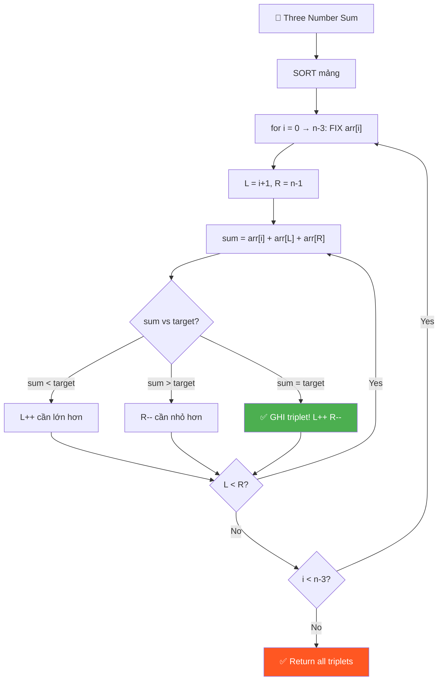
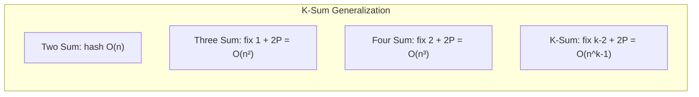

# 🔢 Three Number Sum (AlgoExpert / LeetCode #15)

> 📖 Code: [Three Number Sum.js](./Three%20Number%20Sum.js)





---

## 🧠 Bản chất bài toán — Hiểu để NHỚ, không chỉ để GIẢI

> ⚡ **Đọc phần này TRƯỚC. Nếu bạn chỉ nhớ 1 thứ, nhớ phần này.**

### 1️⃣ Analogy — Ví dụ đời thường

```
🎯 GỌI 3 NGƯỜI LÊN SÂN KHẤU — đây là TẤT CẢ bạn cần nhớ!

  Mỗi người có 1 SỐ trên áo. MC cần 3 người TỔNG = 0.

  Cách ngu: thử TẤT CẢ bộ 3 → O(n³) → quá chậm!

  Cách khôn: XẾP HÀNG theo số (sort!), rồi:
    ① Cố định 1 người (current number)
    ② Đặt L ở ĐẦU hàng, R ở CUỐI hàng
    ③ Tổng < target? → L tiến phải (cần LỚN hơn!)
       Tổng > target? → R tiến trái (cần NHỎ hơn!)
       Tổng = target? → GHI LẠI! Cả L và R tiến vào!

  Giống Two Sum, nhưng FIX 1 số → chạy Two Sum cho 2 số còn lại!
```

### 2️⃣ Recipe — Sort + Fix + Two Pointers

```
📝 RECIPE:

  Bước 1: SORT mảng (ascending)
  Bước 2: Duyệt i từ 0 → n-3 (fix current number)
  Bước 3: left = i+1, right = n-1
  Bước 4: While left < right:
           sum = arr[i] + arr[left] + arr[right]
           sum < target → left++
           sum > target → right--
           sum = target → GHI! left++ VÀ right--
```

```javascript
// BẢN CHẤT:
function threeNumberSum(array, targetSum) {
  array.sort((a, b) => a - b);
  const triplets = [];
  for (let i = 0; i < array.length - 2; i++) {
    let left = i + 1;
    let right = array.length - 1;
    while (left < right) {
      const sum = array[i] + array[left] + array[right];
      if (sum === targetSum) {
        triplets.push([array[i], array[left], array[right]]);
        left++;
        right--;
      } else if (sum < targetSum) {
        left++;
      } else {
        right--;
      }
    }
  }
  return triplets;
}
```

### 3️⃣ Visual — Hình ảnh ghi vào đầu

```
array = [12, 3, 1, 2, -6, 5, -8, 6]    targetSum = 0
sorted = [-8, -6, 1, 2, 3, 5, 6, 12]

Fix i=0 (current = -8):
  [-8, -6, 1, 2, 3, 5, 6, 12]
    i   L                   R

  sum = -8 + (-6) + 12 = -2 < 0    → L++
  [-8, -6, 1, 2, 3, 5, 6, 12]
    i      L                R

  sum = -8 + 1 + 12 = 5 > 0        → R--
  [-8, -6, 1, 2, 3, 5, 6, 12]
    i      L           R

  sum = -8 + 1 + 6 = -1 < 0        → L++
  [-8, -6, 1, 2, 3, 5, 6, 12]
    i         L        R

  sum = -8 + 2 + 6 = 0 = target!   → GHI [-8, 2, 6]! L++ R--
  [-8, -6, 1, 2, 3, 5, 6, 12]
    i            L  R

  sum = -8 + 3 + 5 = 0 = target!   → GHI [-8, 3, 5]! L++ R--
  L >= R → XONG vòng i=0!

Fix i=1 (current = -6):
  [-8, -6, 1, 2, 3, 5, 6, 12]
        i  L                R

  sum = -6 + 1 + 12 = 7 > 0        → R--
  sum = -6 + 1 + 6 = 1 > 0         → R--
  sum = -6 + 1 + 5 = 0 = target!   → GHI [-6, 1, 5]! L++ R--
  sum = -6 + 2 + 3 = -1 < 0        → L++
  L >= R → XONG!

  ... tiếp tục cho i=2,3,... (không tìm thêm)

Kết quả: [[-8, 2, 6], [-8, 3, 5], [-6, 1, 5]] ✅
```

### 4️⃣ Tại sao phải SORT?

```
❓ "SORT để làm gì?"

  SORT → mảng có THỨ TỰ → biết HƯỚNG di chuyển pointer!

  sum < target? → Cần TĂNG sum → L++ (số LỚN hơn bên phải!)
  sum > target? → Cần GIẢM sum → R-- (số NHỎ hơn bên trái!)

  Nếu KHÔNG sort: không biết di chuyển L hay R!
  Nếu CÓ sort: mỗi bước LOẠI BỎ 1 khả năng → O(n) cho mỗi i!
```

### 5️⃣ Flashcard — Tự kiểm tra

| ❓ Câu hỏi | ✅ Đáp án |
|---|---|
| Bước đầu tiên? | **SORT** mảng! |
| i duyệt đến đâu? | `n-3` (cần chừa 2 chỗ cho L, R) |
| L bắt đầu ở đâu? | `i + 1` (ngay sau current number) |
| R bắt đầu ở đâu? | `n - 1` (cuối mảng) |
| sum < target? | `left++` (cần số lớn hơn) |
| sum > target? | `right--` (cần số nhỏ hơn) |
| sum = target? | Ghi lại + `left++` VÀ `right--` |
| Tại sao move CẢ HAI khi bằng? | Vì integers distinct: chỉ move 1 → chắc chắn ≠ target |
| Time? | **O(n²)** — for loop × while loop |
| Space? | **O(n)** — lưu triplets |
| Relation to Two Sum? | Fix 1 số → Two Sum cho 2 số còn lại! |

### 6️⃣ Sai lầm phổ biến

```
❌ SAI LẦM #1: Quên SORT!

   Two pointers CHỈ hoạt động khi mảng SORTED!
   Không sort → không biết move pointer nào!

─────────────────────────────────────────────────────

❌ SAI LẦM #2: Chỉ move 1 pointer khi sum = target!

   Khi tìm thấy triplet:
   Nếu chỉ left++: sum mới > target (chắc chắn!)
   Nếu chỉ right--: sum mới < target (chắc chắn!)
   → Phải move CẢ HAI! (vì distinct → cùng vị trí không lặp)

─────────────────────────────────────────────────────

❌ SAI LẦM #3: i duyệt đến n-1!

   for (let i = 0; i < array.length; i++) ← SAI!
   → Cần chừa 2 chỗ cho L và R!
   → i < array.length - 2

─────────────────────────────────────────────────────

❌ SAI LẦM #4: Dùng 3 for loops = O(n³)!

   Chậm gấp n lần! Sort + 2 pointers = O(n²)!
```

---

### 7️⃣ Cách TƯ DUY — Gặp lại vẫn làm được!

```
🧠 Framework:

  ❶ "Tìm BỘ 3 → reduce thành Two Sum!"
  ❷ "Fix 1 số → tìm 2 số còn lại sum = target - fixed"
  ❸ "Two Sum trên sorted array = TWO POINTERS!"

  Three Sum = for loop (fix) + Two Sum (2 pointers)!
```

**💡 Pattern mở rộng:**

```
┌────────────────────────────────────────────────────┐
│  Two Sum:   hash table HOẶC sort + 2 pointers      │
│  Three Sum: sort + fix 1 + 2 pointers = O(n²)     │
│  Four Sum:  sort + fix 2 + 2 pointers = O(n³)     │
│                                                    │
│  K-Sum = fix (k-2) số + Two Sum cho 2 còn lại!    │
│  Time: O(n^(k-1))                                  │
└────────────────────────────────────────────────────┘
```

---

> 📚 **GIẢI THÍCH CHI TIẾT + INTERVIEW SCRIPT bên dưới.**

---

## R — Repeat & Clarify

💬 *"Cho mảng distinct integers và targetSum. Tìm TẤT CẢ bộ 3 số (triplets) có tổng = targetSum."*

### Câu hỏi:

1. **"Số có trùng nhau?"** → KHÔNG! Distinct.
2. **"Return tất cả triplets hay chỉ 1?"** → TẤT CẢ!
3. **"Triplets có thứ tự?"** → Sorted ascending trong mỗi triplet.
4. **"Có thể dùng 1 số 2 lần?"** → KHÔNG!
5. **"Không có triplet?"** → Return mảng rỗng.

---

## E — Examples

```
VÍ DỤ 1: [12,3,1,2,-6,5,-8,6], target=0
  → [[-8,2,6], [-8,3,5], [-6,1,5]]

VÍ DỤ 2: [1,2,3], target=6
  → [[1,2,3]]

VÍ DỤ 3: [1,2,3], target=10
  → [] (không có)

VÍ DỤ 4: [-1,0,1,2,-1,-4], target=0  (LeetCode version, có trùng!)
  → [[-1,-1,2], [-1,0,1]]
```

---

## A — Approach

```
┌──────────────────────────────────────────────────────────┐
│ APPROACH 1: BRUTE FORCE — 3 for loops                    │
│ → Thử TẤT CẢ bộ 3                                       │
│ → Time: O(n³) | Space: O(n)                             │
├──────────────────────────────────────────────────────────┤
│ APPROACH 2: SORT + TWO POINTERS ⭐                       │
│ → Sort + fix 1 + left/right pointers                     │
│ → Time: O(n²) | Space: O(n)                             │
└──────────────────────────────────────────────────────────┘
```

---

## C — Code

### Approach 1: Brute Force — O(n³)

```javascript
function threeNumberSumBrute(array, targetSum) {
  array.sort((a, b) => a - b);
  const triplets = [];
  for (let i = 0; i < array.length - 2; i++) {
    for (let j = i + 1; j < array.length - 1; j++) {
      for (let k = j + 1; k < array.length; k++) {
        if (array[i] + array[j] + array[k] === targetSum) {
          triplets.push([array[i], array[j], array[k]]);
        }
      }
    }
  }
  return triplets;
}
```

### Approach 2: Sort + Two Pointers — O(n²) ⭐

```javascript
function threeNumberSum(array, targetSum) {
  array.sort((a, b) => a - b); // SORT!
  const triplets = [];

  for (let i = 0; i < array.length - 2; i++) {
    let left = i + 1;
    let right = array.length - 1;

    while (left < right) {
      const sum = array[i] + array[left] + array[right];

      if (sum === targetSum) {
        triplets.push([array[i], array[left], array[right]]);
        left++;   // move CẢ HAI!
        right--;
      } else if (sum < targetSum) {
        left++;   // cần lớn hơn
      } else {
        right--;  // cần nhỏ hơn
      }
    }
  }
  return triplets;
}
```

### Trace chi tiết:

```
array = [12, 3, 1, 2, -6, 5, -8, 6], targetSum = 0
sorted = [-8, -6, 1, 2, 3, 5, 6, 12]

━━━ i=0, current=-8 ━━━
  L=1(-6), R=7(12): sum = -8-6+12 = -2 < 0 → L++
  L=2(1),  R=7(12): sum = -8+1+12 = 5  > 0 → R--
  L=2(1),  R=6(6):  sum = -8+1+6  = -1 < 0 → L++
  L=3(2),  R=6(6):  sum = -8+2+6  = 0  ✅ → GHI [-8,2,6]! L++ R--
  L=4(3),  R=5(5):  sum = -8+3+5  = 0  ✅ → GHI [-8,3,5]! L++ R--
  L=5, R=4: L >= R → XONG!

━━━ i=1, current=-6 ━━━
  L=2(1),  R=7(12): sum = -6+1+12 = 7  > 0 → R--
  L=2(1),  R=6(6):  sum = -6+1+6  = 1  > 0 → R--
  L=2(1),  R=5(5):  sum = -6+1+5  = 0  ✅ → GHI [-6,1,5]! L++ R--
  L=3(2),  R=4(3):  sum = -6+2+3  = -1 < 0 → L++
  L=4, R=4: L >= R → XONG!

━━━ i=2, current=1 ━━━
  L=3(2),  R=7(12): sum = 1+2+12 = 15 > 0 → R--
  ... giảm dần, nhưng min sum = 1+2+3 = 6 > 0 → KHÔNG tìm thấy

━━━ i=3,4,5: tương tự, không tìm thêm ━━━

Kết quả: [[-8,2,6], [-8,3,5], [-6,1,5]] ✅
```

---

## T — Test

```
  ✅ [12,3,1,2,-6,5,-8,6], 0           → [[-8,2,6],[-8,3,5],[-6,1,5]]
  ✅ [1,2,3], 6                         → [[1,2,3]]
  ✅ [1,2,3], 10                        → []
  ✅ [1,2,3,4,5], 9                     → [[1,3,5],[2,3,4]]
  ✅ [-1,0,1], 0                        → [[-1,0,1]]
  ✅ [0,0,0], 0                         → [[0,0,0]] (nếu cho trùng)
```

---

## O — Optimize

```
┌─────────────────────┬──────────────┬──────────────┐
│ Approach             │ Time         │ Space        │
├─────────────────────┼──────────────┼──────────────┤
│ 3 for loops          │ O(n³)        │ O(n)         │
│ Sort + 2 Pointers ⭐ │ O(n²)        │ O(n)         │
└─────────────────────┴──────────────┴──────────────┘

  Sort = O(n log n) < O(n²) → không ảnh hưởng tổng!
  Không thể tốt hơn O(n²) cho bài này (phải thử mọi cặp!)
```

---

## 🧩 Pattern Recognition

```
Pattern: "SORT + FIX + TWO POINTERS"

  Two Sum (sorted):  2 pointers trực tiếp
  Three Sum (#15):   fix 1 + 2 pointers = O(n²)
  Four Sum (#18):    fix 2 + 2 pointers = O(n³)
  3Sum Closest (#16): fix 1 + 2 pointers, track closest

  TEMPLATE:
  sort(array);
  for (i = 0; i < n - 2; i++) {    // fix 1 số
    let L = i + 1, R = n - 1;
    while (L < R) {                  // two pointers
      sum = arr[i] + arr[L] + arr[R];
      if (sum < target) L++;
      else if (sum > target) R--;
      else { FOUND! L++; R--; }
    }
  }
```

---

## 🔗 Liên hệ

```
Three Sum vs Two Sum:
  Two Sum: 1 pass, hash table → O(n)
  Three Sum: fix 1 + Two Sum → O(n²)
  Three Sum = Two Sum NÂNG CẤP!

Three Sum vs Kadane's:
  Kadane's: 1 pass DP, quyết định "tiếp tục hay bắt đầu lại"
  Three Sum: sort + 2 pointers, quyết định "L++ hay R--"
  Cả 2: quyết định tại mỗi bước dựa vào so sánh!
```

---

## 🗣️ Think Out Loud — Kịch Bản Interview Chi Tiết

> Format: 🎙️ = **NÓI TO** | 🧠 = **SUY NGHĨ THẦM**

---

### 📌 Phút 0–2: Nhận đề + Clarify

> 🎙️ *"Find all unique triplets that sum to target. Distinct integers, return all valid triplets. Let me clarify: do triplets need to be in sorted order?"*
> *(Interviewer: "Yes.")*

---

### 📌 Phút 2–4: Approaches

> 🎙️ *"Brute force: three nested loops, O(n³). But I can do better by reducing this to a Two Sum problem."*

> 🎙️ *"If I sort the array first, I can fix one number and use two pointers for the remaining two. The sorted order tells me which pointer to move based on the current sum. This gives O(n²) time."*

🧠 *"Nói 'reduce to Two Sum' = show bạn nhận ra pattern!"*

---

### 📌 Phút 4–8: Code + Narrate

> 🎙️ *"Sort first. For each number at index i, set left = i+1 and right = end. If sum < target, move left right to increase. If sum > target, move right left to decrease. If equal, record and move both."*

> 🎙️ *"Why move both on match? Because integers are distinct — moving only left guarantees a larger sum, only right guarantees smaller. Moving both is the only way to find other valid triplets."*

---

### 📌 Phút 8–10: Complexity

> 🎙️ *"Time: O(n²) — outer loop O(n), inner while loop O(n). Sort is O(n log n), dominated by O(n²). Space: O(n) for storing triplets. This is optimal — any algorithm must examine O(n²) pairs."*

---

### 📌 Follow-up Q&A

**Q1: "What if there are duplicate values?" (LeetCode #15)**

> 🎙️ *"Skip duplicates: if arr[i] === arr[i-1], continue. After finding a match, skip while arr[left] === arr[left-1] and arr[right] === arr[right+1]. This avoids duplicate triplets."*

**Q2: "Can you do this without sorting?"**

> 🎙️ *"Yes — hash table approach. For each pair (i,j), check if target-arr[i]-arr[j] is in a set. But deduplication is trickier, and sorting + two pointers is cleaner."*

**Q3: "How does this extend to Four Sum?"**

> 🎙️ *"Add another outer loop. Fix TWO numbers, then Two Sum for the remaining two. O(n³) time."*

---

### 🧠 Tóm tắt

```
  KEY POINTS:
  ✅ SORT trước! (two pointers cần sorted!)
  ✅ Fix 1 số + Two Sum cho 2 còn lại
  ✅ sum < target → L++ | sum > target → R--
  ✅ sum = target → GHI + L++ VÀ R-- (cả hai!)
  ✅ i < n-2 (chừa 2 chỗ cho L, R)
  ✅ O(n²) time, O(n) space
  ✅ Pattern mở rộng: K-Sum = fix (k-2) + Two Sum
```
