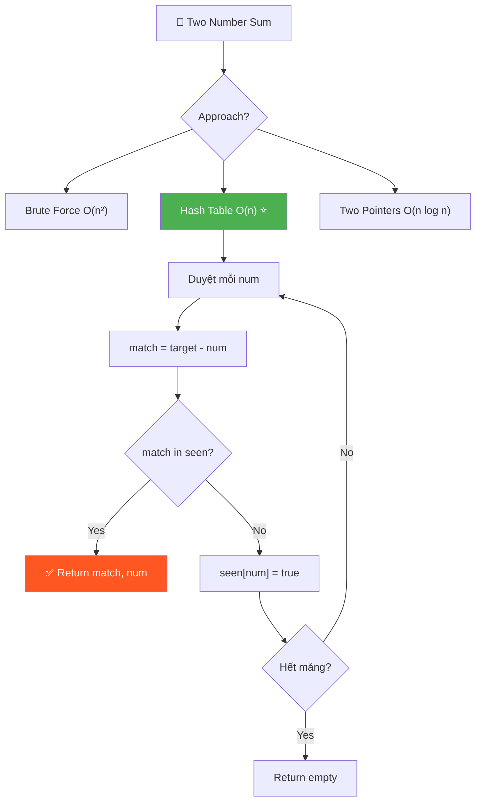
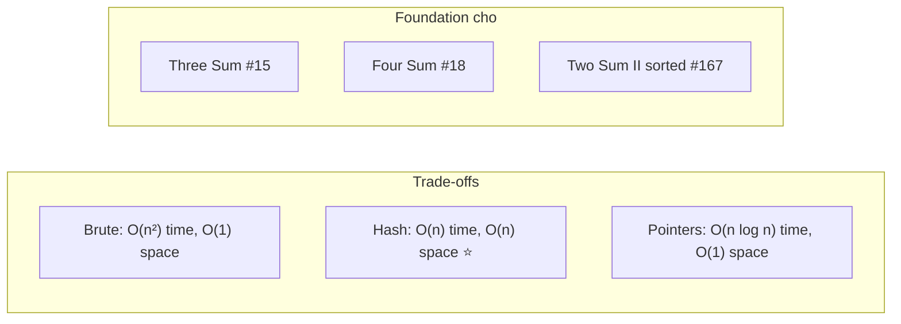

# 🔢 Two Number Sum (AlgoExpert / LeetCode #1)

> 📖 Code: [Two Number Sum.js](./Two%20Number%20Sum.js)





---

## 🧠 Bản chất bài toán — Hiểu để NHỚ, không chỉ để GIẢI

> ⚡ **Đọc phần này TRƯỚC. Nếu bạn chỉ nhớ 1 thứ, nhớ phần này.**

### 1️⃣ Analogy — Ví dụ đời thường

```
🎯 TÌM BẠN NHẢY — đây là TẤT CẢ bạn cần nhớ!

  Bạn đang ở tiệc nhảy. Mỗi người có 1 SỐ trên áo.
  MC nói: "Ai có 2 người mà TỔNG SỐ = 10, lên sân khấu!"

  Cách 1 (ngu): Hỏi TỪNG CẶP — "ê, 2 đứa mình cộng lại = 10 không?"
  → Hỏi hết mọi cặp → LÂU!

  Cách 2 (khôn): Ghi SỔ!
  → Bạn đeo số 3 → cần tìm số 7 (10-3=7)
  → Nhìn sổ: có ai số 7 không? KHÔNG → ghi "3" vào sổ
  → Đến người số 7 → cần số 3 → nhìn sổ → CÓ! → TÌM THẤY!

  Cách 3: Xếp hàng theo số, 2 đầu tiến vào giữa!

  ĐÓ LÀ TẤT CẢ. 3 cách giải = 3 trade-offs!
```

### 2️⃣ Recipe — Cách nhanh nhất (Hash Table)

```
📝 RECIPE (3 bước):

  Bước 1: Duyệt từng số x trong mảng
  Bước 2: Tính y = targetSum - x ("tôi cần tìm ai?")
  Bước 3: y có trong hash table? → TÌM THẤY! Không → ghi x vào hash

  Chỉ 3 bước. Duyệt 1 lần. O(n)!
```

```javascript
// BẢN CHẤT — duyệt 1 lần, dùng hash table:
function twoNumberSum(array, targetSum) {
  const seen = {};
  for (const num of array) {
    const match = targetSum - num; // "tôi cần tìm ai?"
    if (match in seen) return [match, num]; // tìm thấy!
    seen[num] = true; // ghi sổ
  }
  return [];
}
```

### 3️⃣ Visual — Hình ảnh ghi vào đầu

```
array = [3, 5, -4, 8, 11, 1, -1, 6]    targetSum = 10

Duyệt:
  x=3:  cần 7   → seen={}         → KHÔNG có 7  → ghi 3
  x=5:  cần 5   → seen={3}        → KHÔNG có 5  → ghi 5
  x=-4: cần 14  → seen={3,5}      → KHÔNG có 14 → ghi -4
  x=8:  cần 2   → seen={3,5,-4}   → KHÔNG có 2  → ghi 8
  x=11: cần -1  → seen={3,5,-4,8} → KHÔNG có -1 → ghi 11
  x=1:  cần 9   → seen={...,11}   → KHÔNG có 9  → ghi 1
  x=-1: cần 11  → seen={...,1}    → CÓ 11! ✅   → return [11, -1]!

  Tìm thấy: 11 + (-1) = 10 ✅
```

### 4️⃣ Flashcard — Tự kiểm tra

| ❓ Câu hỏi | ✅ Đáp án |
|---|---|
| Công thức tìm y? | `y = targetSum - x` |
| Hash table lưu gì? | Các số ĐÃ DUYỆT qua |
| Tại sao O(n)? | Duyệt 1 lần, lookup hash = O(1) |
| Tại sao O(n) space? | Hash table lưu tối đa n số |
| Không tìm thấy trả gì? | Mảng rỗng `[]` |
| Brute force bao nhiêu? | O(n²) time, O(1) space |
| Two pointers bao nhiêu? | O(n log n) time, O(1) space |
| Số trùng nhau? | Bài này nói DISTINCT (không trùng) |

### 5️⃣ Sai lầm phổ biến

```
❌ SAI LẦM #1: Dùng chính số đó 2 lần!

   array = [5, ...], targetSum = 10
   5 + 5 = 10? → SAI! Chỉ có 1 số 5 trong mảng!
   → Hash table giải quyết: ghi SAU khi check!
   → Check trước, ghi sau → không dùng chính mình!

─────────────────────────────────────────────────────

❌ SAI LẦM #2: Two pointers quên SORT trước!

   Two pointers CHỈ hoạt động trên mảng ĐÃ SORT!
   → Phải sort trước → O(n log n)!

─────────────────────────────────────────────────────

❌ SAI LẦM #3: Return index thay vì value!

   AlgoExpert: return [value, value]
   LeetCode #1: return [index, index] ← KHÁC!
   → Đọc kỹ đề!
```

---

### 6️⃣ Cách TƯ DUY — Gặp lại vẫn làm được!

```
🧠 Framework:

  ❶ "Cần tìm CẶP → mỗi số, hỏi: AI LÀ BẠN CỦA TÔI?"
  ❷ "Bạn = targetSum - x"
  ❸ "Nhớ mặt nhau = HASH TABLE!"

  Chỉ 3 ý tưởng → tự viết code!
```

---

> 📚 **GIẢI THÍCH CHI TIẾT 3 CÁCH + INTERVIEW SCRIPT bên dưới.**

---

## R — Repeat & Clarify

💬 *"Cho mảng số nguyên DISTINCT và targetSum. Tìm 2 số trong mảng mà tổng = targetSum. Return cặp số đó hoặc mảng rỗng nếu không có."*

### Câu hỏi:

1. **"Số có trùng nhau không?"** → KHÔNG! Distinct integers.
2. **"Có chắc chắn có đáp án?"** → Không chắc! Có thể không có → return [].
3. **"Có thể dùng 1 số 2 lần?"** → KHÔNG! Phải là 2 số KHÁC NHAU.
4. **"Return value hay index?"** → AlgoExpert: values. LeetCode: indices.

---

## E — Examples

```
VÍ DỤ 1: array=[3,5,-4,8,11,1,-1,6], target=10
  → 11 + (-1) = 10 → return [11, -1]

VÍ DỤ 2: array=[1,2,3,4], target=10
  → Không có cặp nào → return []

VÍ DỤ 3: array=[5,5], target=10
  → KHÔNG XẢY RA! Đề nói distinct!

VÍ DỤ 4: array=[-3,7], target=4
  → -3 + 7 = 4 → return [-3, 7]

VÍ DỤ 5: array=[1], target=1
  → Chỉ 1 số, cần CẶP → return []
```

---

## A — Approach (3 cách!)

```
┌──────────────────────────────────────────────────────────┐
│ APPROACH 1: BRUTE FORCE — 2 for loops                    │
│ → Thử TẤT CẢ cặp (i,j)                                 │
│ → Time: O(n²) | Space: O(1)                             │
├──────────────────────────────────────────────────────────┤
│ APPROACH 2: HASH TABLE — lookup O(1)                     │
│ → Duyệt 1 lần, check complement trong hash              │
│ → Time: O(n) | Space: O(n)                               │
├──────────────────────────────────────────────────────────┤
│ APPROACH 3: TWO POINTERS — sort trước                    │
│ → Sort + left/right pointers tiến vào giữa              │
│ → Time: O(n log n) | Space: O(1)                        │
└──────────────────────────────────────────────────────────┘
```

```
TRADE-OFFS:

            Time          Space        Khi nào dùng?
  ──────────────────────────────────────────────────────
  Brute     O(n²)         O(1)         Chỉ khi n rất nhỏ
  Hash      O(n)  ✅      O(n)         Ưu tiên SPEED
  Pointers  O(n log n)    O(1)  ✅     Ưu tiên MEMORY
```

---

## C — Code

> 📖 Full code: [Two Number Sum.js](./Two%20Number%20Sum.js)

### Approach 1: Brute Force — O(n²)

```javascript
function twoNumberSumBrute(array, targetSum) {
  for (let i = 0; i < array.length - 1; i++) {
    const firstNum = array[i];
    for (let j = i + 1; j < array.length; j++) {
      const secondNum = array[j];
      if (firstNum + secondNum === targetSum) {
        return [firstNum, secondNum];
      }
    }
  }
  return [];
}
```

```
Tại sao O(n²)?

  i=0: so sánh với j=1,2,3,...,n-1  → n-1 cặp
  i=1: so sánh với j=2,3,...,n-1    → n-2 cặp
  ...
  Tổng = (n-1) + (n-2) + ... + 1 = n(n-1)/2 → O(n²)

Tại sao j = i+1?
  → Tránh so sánh LẠI: (3,5) đã xét → không cần xét (5,3)
  → Tránh dùng chính mình: i=0, j=0 → cùng 1 số!
```

### Approach 2: Hash Table — O(n) ⭐ TỐI ƯU NHẤT

```javascript
function twoNumberSum(array, targetSum) {
  const seen = {};
  for (const num of array) {
    const match = targetSum - num; // "tôi cần số mấy?"
    if (match in seen) return [match, num]; // tìm thấy bạn!
    seen[num] = true; // ghi sổ: "tôi đã đến rồi"
  }
  return [];
}
```

### Trace Hash Table:

```
array = [3, 5, -4, 8, 11, 1, -1, 6], targetSum = 10

  num=3:  match = 10-3 = 7    → 7 in {}? ❌         → seen={3:true}
  num=5:  match = 10-5 = 5    → 5 in {3}? ❌        → seen={3,5}
  num=-4: match = 10-(-4) = 14 → 14 in {3,5}? ❌   → seen={3,5,-4}
  num=8:  match = 10-8 = 2    → 2 in {3,5,-4}? ❌   → seen={3,5,-4,8}
  num=11: match = 10-11 = -1  → -1 in {...}? ❌     → seen={3,5,-4,8,11}
  num=1:  match = 10-1 = 9    → 9 in {...}? ❌      → seen={...,1}
  num=-1: match = 10-(-1) = 11 → 11 in {...}? ✅!   → return [11, -1]!

  11 + (-1) = 10 ✅
```

```
Tại sao ghi SAU khi check?

  Nếu ghi TRƯỚC:
    num=5, targetSum=10 → match=5
    ghi seen[5]=true TRƯỚC
    5 in seen? CÓ! → return [5, 5] ← SAI! Dùng 5 hai lần!

  Ghi SAU:
    num=5, targetSum=10 → match=5
    5 in seen? ❌ (chưa ghi) → OK, ghi seen[5]=true
    → ĐÚNG! Không dùng chính mình!
```

### Approach 3: Two Pointers — O(n log n)

```javascript
function twoNumberSumPointers(array, targetSum) {
  array.sort((a, b) => a - b); // SORT trước!
  let left = 0;
  let right = array.length - 1;

  while (left < right) {
    const currentSum = array[left] + array[right];

    if (currentSum === targetSum) {
      return [array[left], array[right]]; // tìm thấy!
    } else if (currentSum < targetSum) {
      left++; // tổng nhỏ quá → tăng số nhỏ
    } else {
      right--; // tổng lớn quá → giảm số lớn
    }
  }
  return [];
}
```

### Trace Two Pointers:

```
array sorted = [-4, -1, 1, 3, 5, 6, 8, 11]    targetSum = 10
                 L                         R

Step 1: L=-4, R=11 → sum = 7 < 10 → sum nhỏ → L++
             L                         R

Step 2: L=-1, R=11 → sum = 10 = 10 → TÌM THẤY! return [-1, 11] ✅
```

```
Tại sao hoạt động?

  Mảng SORTED: [-4, -1, 1, 3, 5, 6, 8, 11]
                 ↑ nhỏ nhất        lớn nhất ↑

  sum < target? → Cần TĂNG sum → di chuyển LEFT sang phải (số LỚN hơn)
  sum > target? → Cần GIẢM sum → di chuyển RIGHT sang trái (số NHỎ hơn)
  sum = target? → TÌM THẤY!

  Left và Right tiến vào giữa → gặp nhau = hết → O(n)!
  Nhưng sort = O(n log n) → tổng = O(n log n)!
```

---

## T — Test

```
  ✅ [3,5,-4,8,11,1,-1,6], 10     → [11,-1]
  ✅ [1,2,3,4], 10                 → []
  ✅ [-3,7], 4                     → [-3,7]
  ✅ [1], 1                        → []
  ✅ [4,6], 10                     → [4,6]
  ✅ [-1,-3,-5], -8                → [-3,-5]
  ✅ [14], 15                      → []
```

---

## O — Optimize

```
┌─────────────────────┬──────────────┬──────────────┐
│ Approach             │ Time         │ Space        │
├─────────────────────┼──────────────┼──────────────┤
│ Brute Force (2 loop)│ O(n²)        │ O(1)         │
│ Hash Table ⭐        │ O(n)         │ O(n)         │
│ Two Pointers        │ O(n log n)   │ O(1)         │
└─────────────────────┴──────────────┴──────────────┘

  Interview: nói CẢ 3 → show trade-off thinking!
  Thực tế: Hash Table thắng (O(n) time > O(1) space)
```

---

## 🧩 Pattern Recognition

```
Pattern: "TÌM CẶP / BỘ BA / BỘ BỐN + TARGET SUM"

  Two Sum (#1)           → hash table hoặc 2 pointers
  Three Sum (#15)        → sort + 2 pointers (fix 1, tìm 2)
  Four Sum (#18)         → sort + fix 2, tìm 2
  Two Sum II (sorted)    → 2 pointers trực tiếp!

  Hash Table pattern:
    y = target - x
    x duyệt → check y → ghi x
    → Áp dụng cho MỌI bài "tìm complement"!

  Two Pointers pattern:
    sort → L=0, R=end
    sum < target → L++
    sum > target → R--
    → Áp dụng cho mảng SORTED!
```

---

## 🔗 Liên hệ với bài đã học

```
Two Sum vs Good Nodes:
  Cả 2 dùng 1 vòng lặp duyệt qua data
  Two Sum: hash table lưu "đã thấy"
  Good Nodes: parameter truyền "max đã thấy"

Two Sum là BÀI ĐẦU TIÊN:
  → Dạy pattern HASH TABLE (dùng ở rất nhiều bài)
  → Dạy pattern TWO POINTERS (dùng ở Three Sum, Container...)
  → Dạy trade-off TIME vs SPACE
```

---

## 🗣️ Think Out Loud — Kịch Bản Interview Chi Tiết

> Format: 🎙️ = **NÓI TO** | 🧠 = **SUY NGHĨ THẦM**

---

### 📌 Phút 0–2: Nhận đề + Clarify

> 🎙️ *"The problem gives me an array of distinct integers and a target sum. I need to find a pair of numbers that add up to the target sum, or return empty if no such pair exists."*

> 🎙️ *"A few clarifications:*
> *— The integers are distinct, so no duplicates?"*
> *(Interviewer: "Correct.")*
>
> *"— Can I use the same element twice?"*
> *(Interviewer: "No, must be two different elements.")*
>
> *"— Should I return values or indices?"*
> *(Interviewer: "Values.")*

---

### 📌 Phút 2–3: Vẽ ví dụ

> 🎙️ *"Example: [3, 5, -4, 8, 11, 1, -1, 6], target 10. I can see 11 + (-1) = 10, so the answer is [11, -1]."*

---

### 📌 Phút 3–5: Nói 3 Approaches

> 🎙️ *"I see three ways to solve this:*
>
> *1. **Brute force**: try every pair with two nested loops. O(n²) time, O(1) space.*
>
> *2. **Hash table**: for each number x, check if (target - x) was already seen. O(n) time, O(n) space.*
>
> *3. **Two pointers**: sort the array, then use left/right pointers. O(n log n) time, O(1) space.*
>
> *I'll implement the hash table approach since it has the best time complexity. But I can code the others if you'd like."*

🧠 *"Nói cả 3 cách TRƯỚC khi code = show breadth. Interviewer THÍCH điều này!"*

---

### 📌 Phút 5–8: Code Hash Table + Narrate

> 🎙️ *"I iterate through the array once. For each number, I compute its complement — the number I need to reach the target. If that complement is in my hash table, I've found a pair. Otherwise, I store the current number for future lookups."*

```javascript
function twoNumberSum(array, targetSum) {
  const seen = {};
  for (const num of array) {
    const match = targetSum - num;
    if (match in seen) return [match, num];
    seen[num] = true;
  }
  return [];
}
```

> 🎙️ *"Important: I store the number AFTER checking, not before. This prevents using the same element twice."*

---

### 📌 Phút 8–10: Trace + Complexity

> 🎙️ *"Tracing: at num=-1, match=11, and 11 IS in our hash table (stored earlier). Return [11, -1]. ✅"*

> 🎙️ *"Time O(n) — one pass, constant-time hash lookups. Space O(n) — storing up to n values. This is optimal for time — we can't do better since we must examine each element at least once."*

---

### 📌 Follow-up Q&A

**Q1: "Can you do it without extra space?"**

> 🎙️ *"Yes — sort first, then two pointers. O(n log n) time but O(1) space. Trade-off: worse time for better space."*

**Q2: "What if there are duplicate values?"**

> 🎙️ *"The hash table approach still works — just need to be careful about storing. If target = 10 and we have [5, 5], the hash table catches it: first 5 stored, second 5 finds match=5 in hash."*

**Q3: "How does this extend to Three Sum?"**

> 🎙️ *"Fix one number, then run Two Sum on the rest. Sort + fix i + two pointers for j,k. Total O(n²) — much better than O(n³) brute force."*

---

### 🧠 Tóm tắt

```
  KEY POINTS:
  ✅ y = targetSum - x (công thức cốt lõi!)
  ✅ Hash table: check TRƯỚC, ghi SAU (tránh dùng 2 lần!)
  ✅ Two pointers: PHẢI sort trước!
  ✅ Nói 3 cách + trade-offs = strong interview performance
  ✅ Bài này là NỀN TẢNG cho Three Sum, Four Sum!
```
