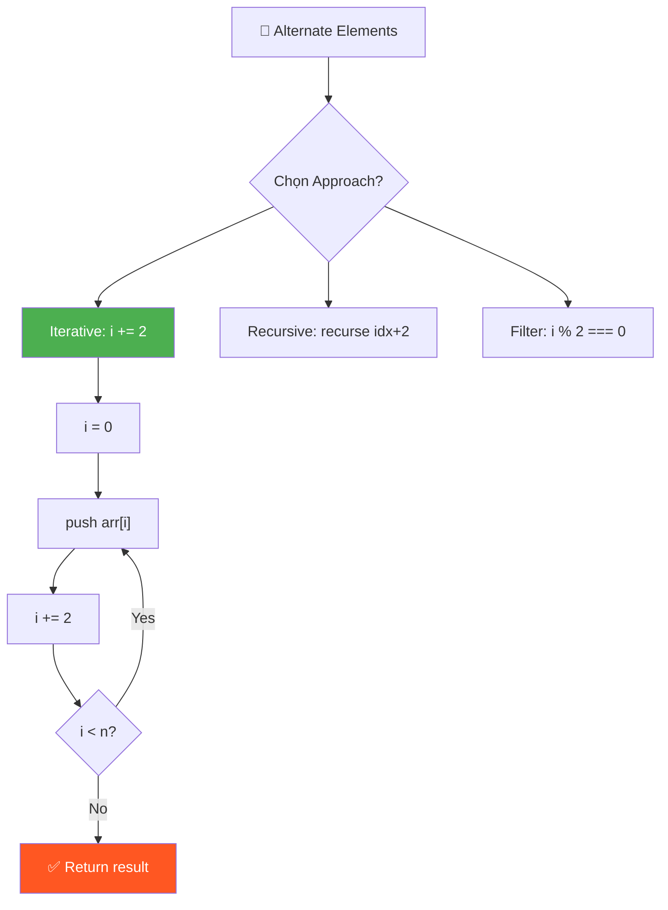
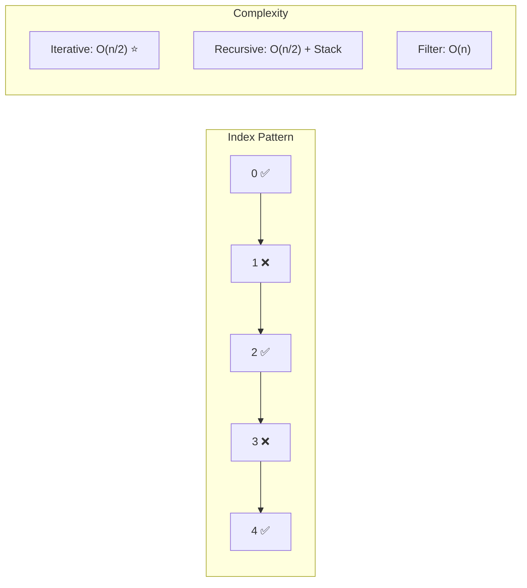

# 🔄 Alternate Elements of an Array — GfG (Easy)

> 📖 Code: [Alternate Elements of an Array.js](./Alternate%20Elements%20of%20an%20Array.js)





---

## R — Repeat & Clarify

🧠 *"In alternate = bỏ 1, lấy 1. Bắt đầu từ index 0, nhảy bước 2."*

> 🎙️ *"Given an array, print every alternate element starting from the first element. So we take index 0, skip 1, take 2, skip 3, and so on."*

### Clarification Questions

```
Q: Bắt đầu từ phần tử đầu tiên hay thứ hai?
A: Đầu tiên (index 0)

Q: Nếu mảng rỗng hoặc 1 phần tử?
A: Rỗng → [], 1 phần tử → [phần tử đó]

Q: Return mảng mới hay in-place?
A: Return mảng mới chứa các phần tử alternate

Q: Array có thể chứa negative numbers?
A: Có! Giá trị không ảnh hưởng — chỉ quan tâm INDEX
```

### Tại sao bài này quan trọng?

```
  Đây là bài ĐẦU TIÊN về INDEX MANIPULATION:
    → Hiểu cách dùng i += step (không chỉ i++)
    → Foundation cho: Sliding Window, Two Pointers, Skip patterns
    → Hiểu sự khác nhau giữa VALUE và INDEX

  Index:  0    1    2    3    4     ← VỊ TRÍ (luôn tăng 1)
  Value: 10   20   30   40   50    ← GIÁ TRỊ (bất kỳ)
```

---

## E — Examples

```
VÍ DỤ 1:
  Input:  [10, 20, 30, 40, 50]
  Output: [10, 30, 50]

  Minh họa chi tiết:
     Index:   0     1     2     3     4
     Value:  10    20    30    40    50
             ✅    ❌    ✅    ❌    ✅
             LẤY  skip  LẤY  skip  LẤY

  Tại sao lấy 10, 30, 50?
    → index 0 (chẵn) → LẤY 10
    → index 1 (lẻ)   → BỎ QUA
    → index 2 (chẵn) → LẤY 30
    → index 3 (lẻ)   → BỎ QUA
    → index 4 (chẵn) → LẤY 50

  QUY LUẬT: lấy tất cả index CHẴN (0, 2, 4, ...)!

VÍ DỤ 2:
  Input:  [-5, 1, 4, 2, 12]
  Output: [-5, 4, 12]

  Index:   0     1     2     3     4
  Value:  -5     1     4     2    12
           ✅    ❌    ✅    ❌    ✅

  → Negative numbers vẫn hoạt động bình thường!
    (vì ta check INDEX, không check VALUE)
```

### Edge Cases — PHẢI nhớ!

```
VÍ DỤ 3 (1 phần tử):
  Input:  [1]
  Output: [1]
  → index 0 → LẤY → chỉ có 1 phần tử

VÍ DỤ 4 (2 phần tử):
  Input:  [1, 2]
  Output: [1]
  → index 0 → LẤY → index 2 → NGOÀI mảng → STOP

VÍ DỤ 5 (rỗng):
  Input:  []
  Output: []
  → Không có phần tử nào → mảng rỗng

VÍ DỤ 6 (Odd vs Even length):
  [1, 2, 3]     → [1, 3]       ← n=3 lẻ, lấy ⌈n/2⌉ = 2 phần tử
  [1, 2, 3, 4]  → [1, 3]       ← n=4 chẵn, lấy n/2 = 2 phần tử

  📐 CÔNG THỨC: Số phần tử output = ⌈n/2⌉ = Math.ceil(n/2)
    n=5 → 3 phần tử
    n=6 → 3 phần tử
    n=7 → 4 phần tử
    n=1 → 1 phần tử
    n=0 → 0 phần tử
```

---

## A — Approach

### Approach 1: Iterative — i += 2

```
💡 Ý tưởng: Thay đổi BƯỚC NHẢY của vòng for!

  Bình thường (duyệt tất cả):
    for (i = 0; i < n; i++)       ← bước 1: 0, 1, 2, 3, 4, ...
                                             ↑  ↑  ↑  ↑  ↑

  Alternate (bỏ 1 lấy 1):
    for (i = 0; i < n; i += 2)    ← bước 2: 0, 2, 4, 6, ...
                                             ↑     ↑     ↑

  Tại sao i += 2?
    i = 0 → 0+2 = 2 → 2+2 = 4 → 4+2 = 6 → ...
    → Chỉ duyệt index CHẴN!
    → Tự động "skip" các index LẺ!

  📊 So sánh:
    i++:    [0] [1] [2] [3] [4]   → 5 iterations
    i += 2: [0]     [2]     [4]   → 3 iterations (nhanh hơn!)
```

### Approach 2: Recursive

```
💡 Ý tưởng: Mỗi lần gọi lại chính mình với idx + 2

  Base case: idx >= length → DỪNG!
  Recursive case: lấy arr[idx], rồi gọi lại với idx + 2

  f(arr, 0) → lấy arr[0], gọi f(arr, 2)
  f(arr, 2) → lấy arr[2], gọi f(arr, 4)
  f(arr, 4) → lấy arr[4], gọi f(arr, 6)
  f(arr, 6) → idx >= length → STOP!

  ⚠️ Tail Recursion: recursive call là LỆNH CUỐI CÙNG
     → Một số engine tối ưu thành iteration (không tốn stack)
     → Nhưng JS KHÔNG đảm bảo tail call optimization!
```

### Approach 3: Filter với index

```
💡 Ý tưởng: Dùng filter kiểm tra index chẵn

  arr.filter((element, index) => index % 2 === 0)

  Cách hoạt động:
    filter duyệt TẤT CẢ phần tử, gọi callback cho mỗi cái
    Callback nhận (element, index) → check index % 2 === 0
    Nếu true → giữ lại, false → bỏ qua

  ⚠️ Chú ý: (_, i) → dấu _ nghĩa là KHÔNG DÙNG element!
     JavaScript convention: _ = unused parameter
```

### So sánh 3 approaches

```
                 Ưu điểm               Nhược điểm
  ─────────────────────────────────────────────────────
  Iterative    Đơn giản, nhanh nhất    Không "elegant"
  Recursive    Dễ hiểu về logic        Stack overflow risk
  Filter       One-liner, clean        Duyệt CẢ mảng
```

---

## C — Code

### Solution 1: Iterative (Tối ưu nhất)

```javascript
function getAlternates(arr) {
  const res = [];

  // Bước nhảy 2: lấy index 0, 2, 4, 6, ...
  for (let i = 0; i < arr.length; i += 2) {
    res.push(arr[i]);
  }
  return res;
}
```

### Giải thích từng dòng

```
  const res = [];
    → Tạo mảng rỗng để chứa kết quả

  for (let i = 0; ...)
    → i bắt đầu từ 0 (phần tử đầu tiên)

  i < arr.length
    → Điều kiện dừng: hết mảng

  i += 2
    → QUAN TRỌNG! Nhảy 2 bước thay vì 1
    → Giống i = i + 2
    → Nếu i = 0: lần sau i = 2, rồi 4, rồi 6...

  res.push(arr[i])
    → Thêm phần tử tại vị trí i vào kết quả
```

### Trace CHI TIẾT: [10, 20, 30, 40, 50]

```
  Ban đầu: res = [], i = 0

  ┌─ Iteration 1 ─────────────────────────┐
  │  i = 0                                 │
  │  Kiểm tra: 0 < 5? → YES ✅            │
  │  arr[0] = 10                           │
  │  res.push(10) → res = [10]             │
  │  i += 2 → i = 2                        │
  └────────────────────────────────────────┘

  ┌─ Iteration 2 ─────────────────────────┐
  │  i = 2                                 │
  │  Kiểm tra: 2 < 5? → YES ✅            │
  │  arr[2] = 30                           │
  │  res.push(30) → res = [10, 30]         │
  │  i += 2 → i = 4                        │
  └────────────────────────────────────────┘

  ┌─ Iteration 3 ─────────────────────────┐
  │  i = 4                                 │
  │  Kiểm tra: 4 < 5? → YES ✅            │
  │  arr[4] = 50                           │
  │  res.push(50) → res = [10, 30, 50]     │
  │  i += 2 → i = 6                        │
  └────────────────────────────────────────┘

  ┌─ End ─────────────────────────────────┐
  │  i = 6                                 │
  │  Kiểm tra: 6 < 5? → NO ❌ → STOP!    │
  └────────────────────────────────────────┘

  Kết quả: [10, 30, 50] ✅
  Tổng iterations: 3 (= ⌈5/2⌉)
```

### Solution 2: Recursive

```javascript
function getAlternatesRecursive(arr) {
  const res = [];

  function recurse(idx) {
    if (idx >= arr.length) return; // Base case!
    res.push(arr[idx]);
    recurse(idx + 2); // Nhảy 2 bước!
  }

  recurse(0);
  return res;
}
```

### Giải thích Recursive

```
  function recurse(idx):
    1. Base case: idx >= arr.length → DỪNG! (hết mảng)
    2. Lấy phần tử: res.push(arr[idx])
    3. Gọi lại: recurse(idx + 2)

  ⚠️ Tại sao cần base case?
    Không có → gọi recurse MÃI MÃI → Stack Overflow!
    Base case = "lối thoát" của recursion

  📐 Quy tắc viết recursive:
    1. XÁC ĐỊNH base case (khi nào dừng)
    2. XÁC ĐỊNH recursive case (gọi lại với input NHỎ HƠN)
    3. ĐẢM BẢO tiến gần base case mỗi lần gọi (idx tăng → sẽ >= length)
```

### Trace Recursive CHI TIẾT: [10, 20, 30, 40, 50]

```
  recurse(0):
    │  0 >= 5? NO → tiếp tục
    │  push arr[0] = 10 → res = [10]
    │  gọi recurse(2)
    │
    └─→ recurse(2):
         │  2 >= 5? NO → tiếp tục
         │  push arr[2] = 30 → res = [10, 30]
         │  gọi recurse(4)
         │
         └─→ recurse(4):
              │  4 >= 5? NO → tiếp tục
              │  push arr[4] = 50 → res = [10, 30, 50]
              │  gọi recurse(6)
              │
              └─→ recurse(6):
                   │  6 >= 5? YES! → return (BASE CASE!)
                   │
              ← return về recurse(4)
         ← return về recurse(2)
    ← return về recurse(0)

  Call Stack (memory):
    ┌──────────────┐
    │ recurse(6)   │ ← top (xử lý xong, pop ra)
    │ recurse(4)   │
    │ recurse(2)   │
    │ recurse(0)   │ ← bottom
    └──────────────┘
    Stack depth = 4 = ⌈n/2⌉ + 1

  ⚠️ n = 1,000,000 → stack depth = 500,001 → STACK OVERFLOW!
     → Iterative an toàn hơn cho mảng lớn!
```

### Solution 3: One-liner (Functional)

```javascript
const getAlternates = (arr) => arr.filter((_, i) => i % 2 === 0);

// Hoặc: lấy phần tử ở INDEX LẺ
const getOddIndexed = (arr) => arr.filter((_, i) => i % 2 === 1);

// [10, 20, 30, 40, 50].filter((_, i) => i % 2 === 0) → [10, 30, 50]
// [10, 20, 30, 40, 50].filter((_, i) => i % 2 === 1) → [20, 40]
```

### Giải thích filter chi tiết

```
  arr.filter((element, index) => condition)

  → Duyệt TẤT CẢ phần tử
  → Với mỗi phần tử, gọi callback(element, index)
  → Nếu callback return TRUE → GIỮU phần tử
  → Nếu callback return FALSE → BỎ QUA

  Trace [10, 20, 30, 40, 50].filter((_, i) => i % 2 === 0):

  i=0: callback(10, 0) → 0 % 2 === 0 → true  → GIỮU 10 ✅
  i=1: callback(20, 1) → 1 % 2 === 0 → false → BỎ QUA  ❌
  i=2: callback(30, 2) → 2 % 2 === 0 → true  → GIỮU 30 ✅
  i=3: callback(40, 3) → 3 % 2 === 0 → false → BỎ QUA  ❌
  i=4: callback(50, 4) → 4 % 2 === 0 → true  → GIỮU 50 ✅

  Kết quả: [10, 30, 50]

  ⚠️ filter duyệt CẢ 5 phần tử! (for loop chỉ duyệt 3)
  ⚠️ Mỗi lần gọi callback = overhead nhỏ (function call)
```

> 🎙️ *"The simplest approach is iterating with step size 2. The filter approach is more functional but creates a callback per element."*

---

## O — Optimize

```
                  Time      Space     Iterations   Ghi chú
  ────────────────────────────────────────────────────────────
  Iterative       O(n/2)    O(1)*     n/2          Tốt nhất! ✅
  Recursive       O(n/2)    O(n/2)    n/2          Stack depth = n/2
  Filter          O(n)      O(1)*     n            Duyệt TẤT CẢ

  * không tính output array

  ⚠️ Big-O: O(n/2) = O(n) — cùng bậc!
     Nhưng thực tế: iterative chạy NỬA số iterations so với filter

  📊 Thực tế với n = 1,000,000:
     Iterative: ~500,000 iterations → NHANH
     Recursive: ~500,000 stack frames → STACK OVERFLOW! 💀
     Filter:    ~1,000,000 callbacks → CHẬM hơn 2x

  ⚠️ Khi nào dùng gì?
     → Interview: dùng Iterative (simple, efficient)
     → Production code: dùng Filter (readable, clean)
     → Học recursion: dùng Recursive (practice concept)
```

---

## T — Test

```
Test Cases:
  [10, 20, 30, 40, 50]  → [10, 30, 50]     ✅ Normal (odd length)
  [-5, 1, 4, 2, 12]     → [-5, 4, 12]      ✅ Negative numbers
  [1]                    → [1]              ✅ Single element
  [1, 2]                 → [1]              ✅ Two elements
  []                     → []               ✅ Empty array
  [1, 2, 3]              → [1, 3]           ✅ Odd length
  [1, 2, 3, 4]           → [1, 3]           ✅ Even length
  [0, 0, 0, 0]           → [0, 0]           ✅ All zeros
  [100]                  → [100]            ✅ Large value
```

---

## 🗣️ Interview Script

### 🎙️ Mô phỏng phỏng vấn thực... theo chuẩn Google

> ⚠️ Script này dạy cách **NÓI**, không phải cách CODE.
> Candidate nói không hoàn hảo... có do dự, tự sửa.
> Interviewer react ngắn, guide bằng câu hỏi, không lecture.

```
╔══════════════════════════════════════════════════════════════╗
║  PART 1: INTRODUCTION                                        ║
╚══════════════════════════════════════════════════════════════╝

  👤 "Hi! So... tell me a little about yourself.
      Your background, what you've been up to recently."

  🧑 "Sure. I'm a frontend engineer, been doing this
      for a few years. Mostly working on dashboard-type
      products, data tables, that kind of thing."

  👤 "Okay, great. Let's get started then."

  🧑 "Yeah, let's do it."
```

```
╔══════════════════════════════════════════════════════════════╗
║  PART 2: PROBLEM + CLARIFY                                   ║
╚══════════════════════════════════════════════════════════════╝

  👤 "Okay. So here's the problem.

      Given an integer array, write a function that returns
      every alternate element starting from the first one.
      So index 0, then index 2, then index 4, and so on.

      For example, if the input is ten, twenty, thirty, forty, fifty,
      the expected output would be ten, thirty, fifty.

      The array can have any integers, including negatives.
      And you should return a new array, not modify the original.

      Take a moment to read it. Let me know when you're ready."

  🧑 "[Reads. Pauses.]

      Okay. So, I take every other element starting from
      the first one... index 0, then 2, then 4.

      Let me ask a few clarifying questions."

  👤 "Sure, go ahead."

  🧑 "Is the starting point always index 0?
      Or could it vary?"

  👤 "Always index 0 for this problem."

  🧑 "Okay. And what if the array is empty,
      or just has one element?"

  👤 "Empty returns empty.
      One element, return it."

  🧑 "Got it. And can I assume the input is always
      a valid array? Or should I handle null, undefined?"

  👤 "Assume it's always a valid array."

  🧑 "Okay. So... the output would always have
      ceiling of n over 2 elements.
      For five elements I'd get three,
      for six I'd also get three.
      Does that sound right?"

  👤 "Yes, that's correct."

  🧑 "Okay. Um... should I think about the approach now?"

  👤 "Yes, go ahead."
```

```
╔══════════════════════════════════════════════════════════════╗
║  PART 3: APPROACH                                            ║
╚══════════════════════════════════════════════════════════════╝

  🧑 "[Thinks for a moment.]

      Okay. So, when I think about this...
      the most direct thing I can think of is
      just changing the step size in the loop.
      Like, normally you'd write i-plus-plus
      and you'd visit every single element.
      But if I change that to i-plus-equal-2,
      we'd only ever land on index 0, then 2, then 4.

      Which is exactly what we want.
      That's... pretty simple. I think that works."

  👤 "Mhm. Is there any other way you could think about it?
      Even if it's not as efficient?"

  🧑 "Um... yeah. You could do it recursively.
      So you'd write a helper function
      that takes the current index,
      grabs the element at that index,
      adds it to the result,
      then calls itself again with index plus 2.
      Stops when you go out of bounds.

      The logic is the same.
      But in JavaScript, recursion is risky for large inputs.
      Each call adds a frame to the call stack...
      so for a million elements,
      that's 500,000 recursive calls.
      You'd hit a stack overflow before you ever finish."

  👤 "Right. So if someone wanted to avoid that risk,
      is there another way to express the same idea?"

  🧑 "Yeah... there's the functional version.
      Array dot filter, with a callback that checks
      if the index is even.
      It's basically a one-liner.

      [Pauses.]

      Although... filter visits every element, right?
      Even the ones it's going to reject.
      So it's doing the work of checking every index,
      even though we only care about half of them.
      The for loop with step 2 skips that work entirely."

  👤 "Good observation. So which would you go with?"

  🧑 "The for loop. It's the clearest about what it's doing
      and it does the least work.

      Um... would it be okay if I walked you through
      a quick example before writing the code?
      Just to make sure the logic is solid?"

  👤 "Yeah, go ahead."
```


```
╔══════════════════════════════════════════════════════════════╗
║  PART 4: TRACE + CODE                                        ║
╚══════════════════════════════════════════════════════════════╝

  🧑 "Okay, so let me trace through the example first.
      Ten, twenty, thirty, forty, fifty.

      I start at the first element, ten.
      I take it. Then I skip the next one, twenty.
      It never gets looked at.

      I land on thirty. Take it.
      Skip forty.

      Then fifty. Take it.
      I'd move forward two more,
      but there's nothing there, so I stop.

      Right? So I end up with ten, thirty, fifty.
      That's what we expect."

  👤 "Good. Go ahead and write the code."

  🧑 "Okay. [Starts typing.]

      So... function getAlternateElements,
      takes arr as the input array.

      Inside, I need somewhere to collect the output.
      result equals an empty array.

      Now the loop.
      for, i equals zero...

      And the condition.
      i less than arr dot length.

      [Pauses.]

      Actually, let me just double-check this.
      I could write i less than arr.length,
      or i less than or equal to arr.length minus one.
      Are those the same thing?"

  👤 "What do you think?"

  🧑 "Yeah, they are.
      If arr.length is 5, the last valid index is 4.
      i less than 5 stops when i reaches 5, so max is 4.
      i less than or equal to 4 also stops at 4.
      Same behavior.

      I like i less than arr.length better.
      It reads cleanly, and it's the form I'd expect
      in any codebase."

  👤 "Mhm."

  🧑 "Okay. And the update... i-plus-equal-2.
      Inside the loop, result dot push, arr bracket i.

      [Types.]

      And return result."

  👤 "Walk me through each part."

  🧑 "Sure. So...
      result is an empty array that grows as we collect.

      i starts at 0. That's valid because index 0
      is always the first element we want.

      i less than arr.length is the bounds check.
      As soon as i would step past the last element, we stop.

      i-plus-equal-2 is really the key part.
      Instead of moving one step at a time,
      we jump two.
      So we visit 0, then 2, then 4, and on.
      Every odd position just... never gets reached.

      arr bracket i is the element at position i.
      We push it into result.

      When the loop finishes, result holds all the even-indexed elements
      in their original order. Return it."

  👤 "Quick question... what if arr is empty?"

  🧑 "[Pauses.]

      If arr is empty, arr.length is 0.
      i starts at 0. Condition is 0 less than 0,
      that's false immediately.
      Loop never runs. Result is still empty.
      Return empty.

      So yeah, it handles that correctly.
      No special case needed."

  👤 "Good. You mentioned filter earlier. Can you show that?"

  🧑 "Yeah. It's one line.
      arr dot filter, callback takes underscore and i,
      returns i modulo 2 equal zero.
      The underscore signals I'm accepting the element parameter
      but not using it."

  👤 "What does filter do under the hood?"

  🧑 "It visits every element and runs the callback.
      If the callback returns true, the element stays.
      If false, it's dropped.

      So for index 0... zero modulo 2 is zero, true, keep it.
      Index 1... one modulo 2 is one, false, drop it.
      Index 2... even, keep.
      And so on.

      The difference is it visits every single index
      to make that decision,
      whereas the for loop with step 2 never visits
      the odd indices at all.
      So filter does roughly twice the iterations."

  👤 "If you had to pick one for a code review,
      which would you argue for?"

  🧑 "Depends on context.
      If it's in a hot path, or a very large array,
      the for loop is the defensible choice.
      You can point to the exact iteration count.

      If it's a one-off transformation in application code,
      filter is more expressive.
      Anyone reading it immediately understands
      you're picking elements at even positions.

      I'd probably write filter first,
      and only switch to the loop if profiling showed it mattered."

  👤 "Okay. Can you trace through the for loop version
      to verify it's correct?"

  🧑 "Yeah. Let me trace it against the example.
      Ten, twenty, thirty, forty, fifty.

      i is 0. Less than 5. Grab ten. Push.
      Jump to 2.

      i is 2. Less than 5. Grab thirty. Push.
      Jump to 4.

      i is 4. Less than 5. Grab fifty. Push.
      Jump to 6.

      i is 6. Not less than 5. Loop stops.

      Result is ten, thirty, fifty. Correct."

  👤 "And the time complexity?"

  🧑 "O of n.
      Technically n over 2 iterations,
      but Big-O drops constants.

      And the for loop does exactly half the iterations
      that filter does.
      For small arrays it's irrelevant,
      but at scale it matters."

  👤 "Space?"

  🧑 "O of 1 auxiliary. Just the loop variable.
      The output array is O of n over 2,
      but we don't usually count the output
      in space complexity."
```

```
╔══════════════════════════════════════════════════════════════╗
║  PART 5: EDGE CASES                                          ║
╚══════════════════════════════════════════════════════════════╝

  👤 "Can you walk me through some edge cases?
      Let's start with empty array."

  🧑 "Empty array.
      arr.length is 0.
      i starts at 0, condition is 0 less than 0...
      that's false immediately.
      Loop never runs. result stays empty. We return it.
      Correct."

  👤 "Single element."

  🧑 "Single element, like just [7].
      i is 0. Zero is less than 1, true.
      We grab it, push it.
      i becomes 2.
      2 is not less than 1. Stop.
      Result is [7]. Correct."

  👤 "Two elements?"

  🧑 "Two elements, like 1 and 2.
      i is 0. Less than 2, true. Grab 1. Push.
      i becomes 2. Not less than 2. Stop.
      Result is [1].
      We took the first, skipped the second.
      Which is right."

  👤 "What about an array of all zeros?"

  🧑 "All zeros, like [0, 0, 0].
      We'd still take every other one.
      Result would be [0, 0]... just half of them.
      The values don't affect the logic at all,
      we're strictly operating on positions."

  👤 "And negative numbers?"

  🧑 "Same deal.
      We're looking at the index, not the value.
      Something like minus five, one, minus three, four...
      you'd get minus five and minus three back.
      Values are completely irrelevant to the algorithm."

  👤 "Let me give you a larger one.
      What if the array has a million elements?"

  🧑 "That's the happy path for the for loop.
      It visits exactly 500,000 positions.
      Just half the array.

      If you used filter instead, it would visit all million
      to decide which 500,000 to keep.
      For a hot path, that difference is real."

  👤 "Does it matter whether the length is odd or even?"

  🧑 "Slightly.
      For odd length, like five elements...
      you get indices 0, 2, 4. Three elements back.
      For even length, like four elements...
      you get indices 0, 2. Two elements back.
      The last element sits at an odd index, so it gets skipped.

      General formula: ceiling of n over 2 for the output size.
      Odd length rounds up, even is exactly n over 2."

  👤 "Are you satisfied all the cases are handled?"

  🧑 "Yeah.
      Empty... loop never starts, return empty.
      Single element... grab it and stop.
      Negative values... no effect.
      All zeros... no effect.
      Large n... O of n over 2 iterations, no issues.
      Odd versus even... ceiling of n over 2 always.

      I'd feel good putting this through a code review."

```

```
╔══════════════════════════════════════════════════════════════╗
║  PART 6: FOLLOW-UP QUESTIONS                                 ║
╚══════════════════════════════════════════════════════════════╝

  👤 "What if I wanted elements at odd indices instead?
      Like index 1, 3, 5."

  🧑 "Just change the starting index to 1 instead of 0.
      Same step size, just shifted by one.
      So you still jump by 2, you just enter at a different point."

  👤 "What about every kth element, not just every other?"

  🧑 "Just change the step to k.
      So instead of jumping by 2, you jump by k each time.
      The output size becomes ceiling of n over k.

      It is the same algorithm, just more general."

  👤 "How would you analyze complexity for that?"

  🧑 "Same as before.
      O of n time... still visiting every kth element.
      O of 1 auxiliary, just the loop variable.
      Output is ceiling of n over k, but we do not count that."

  👤 "What about doing it in-place?
      Can you modify the original array instead of returning a new one?"

  🧑 "You could.

      Naive way is to remove elements one by one...
      like splice out the odd-indexed ones.
      But each removal shifts everything after it.
      So that is O of n per removal, O of n squared total."

  👤 "Is there a more efficient way?"

  🧑 "Yeah. Two-pointer technique.

      One pointer reads through even indices as normal.
      The other pointer writes, starting from 0,
      incrementing by 1 each time.

      Every time the reader picks up an element,
      the writer places it at its position.

      After the loop, truncate the array to the write count.
      That is O of n time, O of 1 space.
      Genuinely in-place."

  👤 "Good. And what is the tradeoff?"

  🧑 "You lose the original data.
      Once you overwrite those positions,
      you cannot recover the odd-indexed elements.

      So in-place only makes sense if memory is a real constraint
      and you are sure nothing else needs the original."

  👤 "Last thing... if the array were sorted,
      would that change your approach?"

  🧑 "Not for this specific problem.
      We are picking by position, not by value.
      Sorted or not, the algorithm is identical.

      It would matter if the problem were something like
      skip duplicates, or pick every other unique element.
      But for straight index-stepping, no difference."

  👤 "OK. I think that is everything.
      Do you have any questions for me?"

  🧑 "Yeah. When your team reviews solutions like this,
      is there a preference for iterative over recursive?
      Or is it case by case?"

  👤 "Case by case mostly.
      We flag anything that could hit performance
      in a code review.

      OK. I think you did well.
      Good instincts on the complexity analysis
      and on the in-place tradeoff. We will be in touch."

  🧑 "Thank you. I enjoyed it."
```

### Kiến thức liên quan

```
  Bài này là nền tảng cho:
  ┌─────────────────────────────────────────────────────┐
  │  Alternate Elements  →  Index Manipulation (i += 2) │
  │         ↓                                           │
  │  Sliding Window     →  Index Range [i, i+k]        │
  │  Two Pointers       →  Index from both ends         │
  │  Binary Search      →  Index halving (mid)          │
  │  Rotate Array       →  Index modular (i % n)        │
  │  Matrix Traversal   →  Index 2D (row, col)          │
  └─────────────────────────────────────────────────────┘
```
