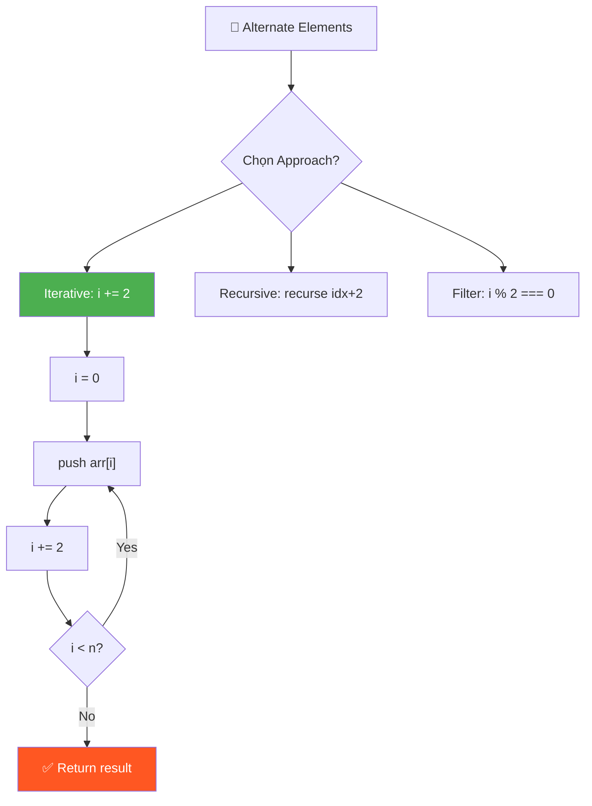
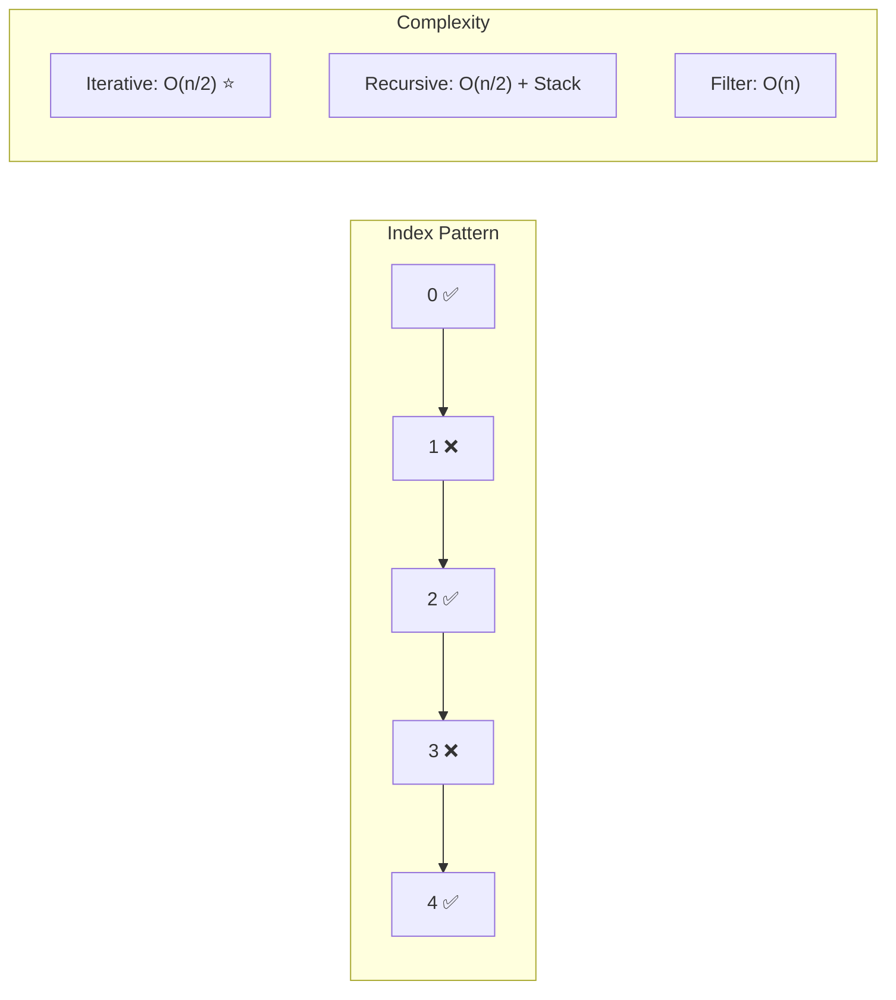

# 🔄 Alternate Elements of an Array — GfG (Easy)

> 📖 Code: [Alternate Elements of an Array.js](./Alternate%20Elements%20of%20an%20Array.js)





---

## R — Repeat & Clarify

🧠 *"In alternate = bỏ 1, lấy 1. Bắt đầu từ index 0, nhảy bước 2."*

> 🎙️ *"Given an array, print every alternate element starting from the first element. So we take index 0, skip 1, take 2, skip 3, and so on."*

### Clarification Questions

```
Q: Bắt đầu từ phần tử đầu tiên hay thứ hai?
A: Đầu tiên (index 0)

Q: Nếu mảng rỗng hoặc 1 phần tử?
A: Rỗng → [], 1 phần tử → [phần tử đó]

Q: Return mảng mới hay in-place?
A: Return mảng mới chứa các phần tử alternate

Q: Array có thể chứa negative numbers?
A: Có! Giá trị không ảnh hưởng — chỉ quan tâm INDEX
```

### Tại sao bài này quan trọng?

```
  Đây là bài ĐẦU TIÊN về INDEX MANIPULATION:
    → Hiểu cách dùng i += step (không chỉ i++)
    → Foundation cho: Sliding Window, Two Pointers, Skip patterns
    → Hiểu sự khác nhau giữa VALUE và INDEX

  Index:  0    1    2    3    4     ← VỊ TRÍ (luôn tăng 1)
  Value: 10   20   30   40   50    ← GIÁ TRỊ (bất kỳ)
```

---

## E — Examples

```
VÍ DỤ 1:
  Input:  [10, 20, 30, 40, 50]
  Output: [10, 30, 50]

  Minh họa chi tiết:
     Index:   0     1     2     3     4
     Value:  10    20    30    40    50
             ✅    ❌    ✅    ❌    ✅
             LẤY  skip  LẤY  skip  LẤY

  Tại sao lấy 10, 30, 50?
    → index 0 (chẵn) → LẤY 10
    → index 1 (lẻ)   → BỎ QUA
    → index 2 (chẵn) → LẤY 30
    → index 3 (lẻ)   → BỎ QUA
    → index 4 (chẵn) → LẤY 50

  QUY LUẬT: lấy tất cả index CHẴN (0, 2, 4, ...)!

VÍ DỤ 2:
  Input:  [-5, 1, 4, 2, 12]
  Output: [-5, 4, 12]

  Index:   0     1     2     3     4
  Value:  -5     1     4     2    12
           ✅    ❌    ✅    ❌    ✅

  → Negative numbers vẫn hoạt động bình thường!
    (vì ta check INDEX, không check VALUE)
```

### Edge Cases — PHẢI nhớ!

```
VÍ DỤ 3 (1 phần tử):
  Input:  [1]
  Output: [1]
  → index 0 → LẤY → chỉ có 1 phần tử

VÍ DỤ 4 (2 phần tử):
  Input:  [1, 2]
  Output: [1]
  → index 0 → LẤY → index 2 → NGOÀI mảng → STOP

VÍ DỤ 5 (rỗng):
  Input:  []
  Output: []
  → Không có phần tử nào → mảng rỗng

VÍ DỤ 6 (Odd vs Even length):
  [1, 2, 3]     → [1, 3]       ← n=3 lẻ, lấy ⌈n/2⌉ = 2 phần tử
  [1, 2, 3, 4]  → [1, 3]       ← n=4 chẵn, lấy n/2 = 2 phần tử

  📐 CÔNG THỨC: Số phần tử output = ⌈n/2⌉ = Math.ceil(n/2)
    n=5 → 3 phần tử
    n=6 → 3 phần tử
    n=7 → 4 phần tử
    n=1 → 1 phần tử
    n=0 → 0 phần tử
```

---

## A — Approach

### Approach 1: Iterative — i += 2

```
💡 Ý tưởng: Thay đổi BƯỚC NHẢY của vòng for!

  Bình thường (duyệt tất cả):
    for (i = 0; i < n; i++)       ← bước 1: 0, 1, 2, 3, 4, ...
                                             ↑  ↑  ↑  ↑  ↑

  Alternate (bỏ 1 lấy 1):
    for (i = 0; i < n; i += 2)    ← bước 2: 0, 2, 4, 6, ...
                                             ↑     ↑     ↑

  Tại sao i += 2?
    i = 0 → 0+2 = 2 → 2+2 = 4 → 4+2 = 6 → ...
    → Chỉ duyệt index CHẴN!
    → Tự động "skip" các index LẺ!

  📊 So sánh:
    i++:    [0] [1] [2] [3] [4]   → 5 iterations
    i += 2: [0]     [2]     [4]   → 3 iterations (nhanh hơn!)
```

### Approach 2: Recursive

```
💡 Ý tưởng: Mỗi lần gọi lại chính mình với idx + 2

  Base case: idx >= length → DỪNG!
  Recursive case: lấy arr[idx], rồi gọi lại với idx + 2

  f(arr, 0) → lấy arr[0], gọi f(arr, 2)
  f(arr, 2) → lấy arr[2], gọi f(arr, 4)
  f(arr, 4) → lấy arr[4], gọi f(arr, 6)
  f(arr, 6) → idx >= length → STOP!

  ⚠️ Tail Recursion: recursive call là LỆNH CUỐI CÙNG
     → Một số engine tối ưu thành iteration (không tốn stack)
     → Nhưng JS KHÔNG đảm bảo tail call optimization!
```

### Approach 3: Filter với index

```
💡 Ý tưởng: Dùng filter kiểm tra index chẵn

  arr.filter((element, index) => index % 2 === 0)

  Cách hoạt động:
    filter duyệt TẤT CẢ phần tử, gọi callback cho mỗi cái
    Callback nhận (element, index) → check index % 2 === 0
    Nếu true → giữ lại, false → bỏ qua

  ⚠️ Chú ý: (_, i) → dấu _ nghĩa là KHÔNG DÙNG element!
     JavaScript convention: _ = unused parameter
```

### So sánh 3 approaches

```
                 Ưu điểm               Nhược điểm
  ─────────────────────────────────────────────────────
  Iterative    Đơn giản, nhanh nhất    Không "elegant"
  Recursive    Dễ hiểu về logic        Stack overflow risk
  Filter       One-liner, clean        Duyệt CẢ mảng
```

---

## C — Code

### Solution 1: Iterative (Tối ưu nhất)

```javascript
function getAlternates(arr) {
  const res = [];

  // Bước nhảy 2: lấy index 0, 2, 4, 6, ...
  for (let i = 0; i < arr.length; i += 2) {
    res.push(arr[i]);
  }
  return res;
}
```

### Giải thích từng dòng

```
  const res = [];
    → Tạo mảng rỗng để chứa kết quả

  for (let i = 0; ...)
    → i bắt đầu từ 0 (phần tử đầu tiên)

  i < arr.length
    → Điều kiện dừng: hết mảng

  i += 2
    → QUAN TRỌNG! Nhảy 2 bước thay vì 1
    → Giống i = i + 2
    → Nếu i = 0: lần sau i = 2, rồi 4, rồi 6...

  res.push(arr[i])
    → Thêm phần tử tại vị trí i vào kết quả
```

### Trace CHI TIẾT: [10, 20, 30, 40, 50]

```
  Ban đầu: res = [], i = 0

  ┌─ Iteration 1 ─────────────────────────┐
  │  i = 0                                 │
  │  Kiểm tra: 0 < 5? → YES ✅            │
  │  arr[0] = 10                           │
  │  res.push(10) → res = [10]             │
  │  i += 2 → i = 2                        │
  └────────────────────────────────────────┘

  ┌─ Iteration 2 ─────────────────────────┐
  │  i = 2                                 │
  │  Kiểm tra: 2 < 5? → YES ✅            │
  │  arr[2] = 30                           │
  │  res.push(30) → res = [10, 30]         │
  │  i += 2 → i = 4                        │
  └────────────────────────────────────────┘

  ┌─ Iteration 3 ─────────────────────────┐
  │  i = 4                                 │
  │  Kiểm tra: 4 < 5? → YES ✅            │
  │  arr[4] = 50                           │
  │  res.push(50) → res = [10, 30, 50]     │
  │  i += 2 → i = 6                        │
  └────────────────────────────────────────┘

  ┌─ End ─────────────────────────────────┐
  │  i = 6                                 │
  │  Kiểm tra: 6 < 5? → NO ❌ → STOP!    │
  └────────────────────────────────────────┘

  Kết quả: [10, 30, 50] ✅
  Tổng iterations: 3 (= ⌈5/2⌉)
```

### Solution 2: Recursive

```javascript
function getAlternatesRecursive(arr) {
  const res = [];

  function recurse(idx) {
    if (idx >= arr.length) return; // Base case!
    res.push(arr[idx]);
    recurse(idx + 2); // Nhảy 2 bước!
  }

  recurse(0);
  return res;
}
```

### Giải thích Recursive

```
  function recurse(idx):
    1. Base case: idx >= arr.length → DỪNG! (hết mảng)
    2. Lấy phần tử: res.push(arr[idx])
    3. Gọi lại: recurse(idx + 2)

  ⚠️ Tại sao cần base case?
    Không có → gọi recurse MÃI MÃI → Stack Overflow!
    Base case = "lối thoát" của recursion

  📐 Quy tắc viết recursive:
    1. XÁC ĐỊNH base case (khi nào dừng)
    2. XÁC ĐỊNH recursive case (gọi lại với input NHỎ HƠN)
    3. ĐẢM BẢO tiến gần base case mỗi lần gọi (idx tăng → sẽ >= length)
```

### Trace Recursive CHI TIẾT: [10, 20, 30, 40, 50]

```
  recurse(0):
    │  0 >= 5? NO → tiếp tục
    │  push arr[0] = 10 → res = [10]
    │  gọi recurse(2)
    │
    └─→ recurse(2):
         │  2 >= 5? NO → tiếp tục
         │  push arr[2] = 30 → res = [10, 30]
         │  gọi recurse(4)
         │
         └─→ recurse(4):
              │  4 >= 5? NO → tiếp tục
              │  push arr[4] = 50 → res = [10, 30, 50]
              │  gọi recurse(6)
              │
              └─→ recurse(6):
                   │  6 >= 5? YES! → return (BASE CASE!)
                   │
              ← return về recurse(4)
         ← return về recurse(2)
    ← return về recurse(0)

  Call Stack (memory):
    ┌──────────────┐
    │ recurse(6)   │ ← top (xử lý xong, pop ra)
    │ recurse(4)   │
    │ recurse(2)   │
    │ recurse(0)   │ ← bottom
    └──────────────┘
    Stack depth = 4 = ⌈n/2⌉ + 1

  ⚠️ n = 1,000,000 → stack depth = 500,001 → STACK OVERFLOW!
     → Iterative an toàn hơn cho mảng lớn!
```

### Solution 3: One-liner (Functional)

```javascript
const getAlternates = (arr) => arr.filter((_, i) => i % 2 === 0);

// Hoặc: lấy phần tử ở INDEX LẺ
const getOddIndexed = (arr) => arr.filter((_, i) => i % 2 === 1);

// [10, 20, 30, 40, 50].filter((_, i) => i % 2 === 0) → [10, 30, 50]
// [10, 20, 30, 40, 50].filter((_, i) => i % 2 === 1) → [20, 40]
```

### Giải thích filter chi tiết

```
  arr.filter((element, index) => condition)

  → Duyệt TẤT CẢ phần tử
  → Với mỗi phần tử, gọi callback(element, index)
  → Nếu callback return TRUE → GIỮU phần tử
  → Nếu callback return FALSE → BỎ QUA

  Trace [10, 20, 30, 40, 50].filter((_, i) => i % 2 === 0):

  i=0: callback(10, 0) → 0 % 2 === 0 → true  → GIỮU 10 ✅
  i=1: callback(20, 1) → 1 % 2 === 0 → false → BỎ QUA  ❌
  i=2: callback(30, 2) → 2 % 2 === 0 → true  → GIỮU 30 ✅
  i=3: callback(40, 3) → 3 % 2 === 0 → false → BỎ QUA  ❌
  i=4: callback(50, 4) → 4 % 2 === 0 → true  → GIỮU 50 ✅

  Kết quả: [10, 30, 50]

  ⚠️ filter duyệt CẢ 5 phần tử! (for loop chỉ duyệt 3)
  ⚠️ Mỗi lần gọi callback = overhead nhỏ (function call)
```

> 🎙️ *"The simplest approach is iterating with step size 2. The filter approach is more functional but creates a callback per element."*

---

## O — Optimize

```
                  Time      Space     Iterations   Ghi chú
  ────────────────────────────────────────────────────────────
  Iterative       O(n/2)    O(1)*     n/2          Tốt nhất! ✅
  Recursive       O(n/2)    O(n/2)    n/2          Stack depth = n/2
  Filter          O(n)      O(1)*     n            Duyệt TẤT CẢ

  * không tính output array

  ⚠️ Big-O: O(n/2) = O(n) — cùng bậc!
     Nhưng thực tế: iterative chạy NỬA số iterations so với filter

  📊 Thực tế với n = 1,000,000:
     Iterative: ~500,000 iterations → NHANH
     Recursive: ~500,000 stack frames → STACK OVERFLOW! 💀
     Filter:    ~1,000,000 callbacks → CHẬM hơn 2x

  ⚠️ Khi nào dùng gì?
     → Interview: dùng Iterative (simple, efficient)
     → Production code: dùng Filter (readable, clean)
     → Học recursion: dùng Recursive (practice concept)
```

---

## T — Test

```
Test Cases:
  [10, 20, 30, 40, 50]  → [10, 30, 50]     ✅ Normal (odd length)
  [-5, 1, 4, 2, 12]     → [-5, 4, 12]      ✅ Negative numbers
  [1]                    → [1]              ✅ Single element
  [1, 2]                 → [1]              ✅ Two elements
  []                     → []               ✅ Empty array
  [1, 2, 3]              → [1, 3]           ✅ Odd length
  [1, 2, 3, 4]           → [1, 3]           ✅ Even length
  [0, 0, 0, 0]           → [0, 0]           ✅ All zeros
  [100]                  → [100]            ✅ Large value
```

---

## 🗣️ Interview Script

> 🎙️ *"This is a straightforward indexing problem. I use a for loop with step 2, starting at index 0. Each iteration pushes the current element. Time is O(n), space O(1) not counting output. The recursive approach works but risks stack overflow for large arrays. The functional filter approach is clean but iterates all elements."*

### Biến thể & Mở rộng

```
  Biến thể phổ biến:

  1. Lấy phần tử ở index LẺ
     for (let i = 1; i < n; i += 2)
     [10, 20, 30, 40, 50] → [20, 40]

  2. Lấy mỗi phần tử thứ K
     for (let i = 0; i < n; i += k)
     k=3: [10, 20, 30, 40, 50] → [10, 40]

  3. Alternate sum (+, -, +, -, ...)
     let sum = 0;
     for (let i = 0; i < n; i++) {
       sum += (i % 2 === 0) ? arr[i] : -arr[i];
     }
     [10, 20, 30, 40, 50] → 10 - 20 + 30 - 40 + 50 = 30

  4. Interleave 2 mảng
     [a, b, c] + [1, 2, 3] → [a, 1, b, 2, c, 3]
     (Two Pointers pattern)

  5. Alternate reverse
     Reverse elements ở index chẵn, giữ index lẻ:
     [1, 2, 3, 4, 5, 6, 7] → [7, 2, 5, 4, 3, 6, 1]

  Pattern: BÀI TOÁN INDEX
    Bất cứ khi nào cần "skip" hoặc "step" → i += step!
    Bất cứ khi nào check chẵn/lẻ → i % 2
```

### Kiến thức liên quan

```
  Bài này là nền tảng cho:
  ┌─────────────────────────────────────────────────────┐
  │  Alternate Elements  →  Index Manipulation (i += 2) │
  │         ↓                                           │
  │  Sliding Window     →  Index Range [i, i+k]        │
  │  Two Pointers       →  Index from both ends         │
  │  Binary Search      →  Index halving (mid)          │
  │  Rotate Array       →  Index modular (i % n)        │
  │  Matrix Traversal   →  Index 2D (row, col)          │
  └─────────────────────────────────────────────────────┘
```
