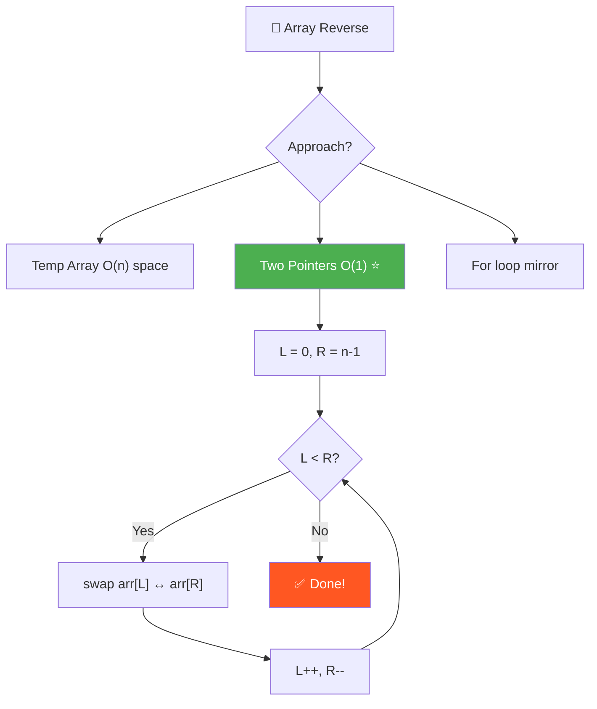
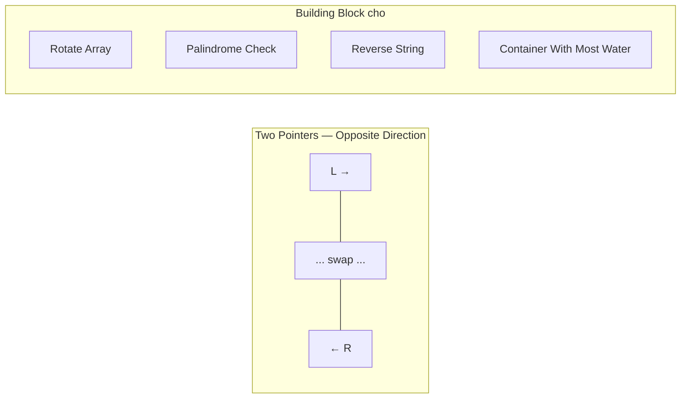

# 🔁 Array Reverse — GfG (Easy)

> 📖 Code: [Array Reverse.js](./Array%20Reverse.js)





---

## R — Repeat & Clarify

🧠 *"Reverse = đổi đầu thành cuối. Two Pointers swap từ 2 đầu vào giữa = O(n), O(1)!"*

> 🎙️ *"Reverse the array in-place so the first element becomes last, second becomes second-last, and so on."*

### Clarification Questions

```
Q: In-place hay tạo mảng mới?
A: In-place (tối ưu), nhưng cũng có thể tạo mới

Q: Mảng rỗng hoặc 1 phần tử?
A: Giữ nguyên — đã tự reverse!

Q: Mảng chẵn/lẻ phần tử?
A: Lẻ → phần tử GIỮA giữ nguyên!

Q: Array có thể chứa gì?
A: Bất kỳ — numbers, strings, objects. Logic KHÔNG phụ thuộc value!
```

### Tại sao bài này quan trọng?

```
  Reverse Array là BUILDING BLOCK cơ bản nhất!

  Dùng trong:
  1. Rotate Array      → reverse 3 lần!
  2. Palindrome Check  → reverse rồi so sánh
  3. Reverse String    → cùng logic!
  4. Reverse LinkedList → tương tự pattern

  Concept: TWO POINTERS — OPPOSITE DIRECTION
  → Một trong những pattern quan trọng nhất của Array!
```

---

## E — Examples

```
VÍ DỤ 1 (Even length):
  Input:  [1, 4, 3, 2, 6, 5]
  Output: [5, 6, 2, 3, 4, 1]

  Minh họa TỪNG BƯỚC swap:

  Ban đầu: [1, 4, 3, 2, 6, 5]
            L→              ←R

  Step 1:   swap arr[0] ↔ arr[5]
            [5, 4, 3, 2, 6, 1]
               L→        ←R

  Step 2:   swap arr[1] ↔ arr[4]
            [5, 6, 3, 2, 4, 1]
                  L→  ←R

  Step 3:   swap arr[2] ↔ arr[3]
            [5, 6, 2, 3, 4, 1]
                   L=R  ← gặp nhau → STOP!

  Tổng: 3 swaps = n/2 = 6/2 ✅

VÍ DỤ 2 (Odd length — phần tử giữa giữ nguyên):
  Input:  [1, 2, 3, 4, 5]
  Output: [5, 4, 3, 2, 1]

  Step 1: swap(1, 5)  → [5, 2, 3, 4, 1]
  Step 2: swap(2, 4)  → [5, 4, 3, 2, 1]
  Step 3: L=2, R=2 → L >= R → STOP!

         Phần tử GIỮA (3) giữ nguyên! ✅
         → Không cần xử lý đặc biệt — while tự dừng!
```

### Edge Cases

```
  [1, 2]  → [2, 1]     ← 1 swap
  [7]     → [7]         ← 0 swaps (L=0, R=0 → L >= R ngay!)
  []      → []          ← 0 swaps (L=0, R=-1 → L >= R ngay!)
```

### Mirror Index — công thức TOÁN

```
  Mỗi phần tử swap với "bạn gương" (mirror) của nó:
  
    index i → swap với index (n - 1 - i)

    n=6:
      0 ↔ 5    (0 + 5 = 5 = n-1)
      1 ↔ 4    (1 + 4 = 5 = n-1)
      2 ↔ 3    (2 + 3 = 5 = n-1)

    TỔNG QUÁT: i + mirror(i) = n - 1 (LUÔN LUÔN!)
    → mirror(i) = n - 1 - i
```

---

## A — Approach

### Approach 1: Temporary Array — O(n) Space

```
  Tạo mảng mới, copy phần tử NGƯỢC:
    temp[0] = arr[n-1]
    temp[1] = arr[n-2]
    ...
    temp[i] = arr[n - 1 - i]

  Rồi copy temp → arr

  ⚠️ Tốn O(n) THÊM bộ nhớ!
  ⚠️ Duyệt 2 lần (copy ngược + copy lại)
  → LÃNG PHÍ! Dùng Two Pointers thay!
```

### Approach 2: Two Pointers — O(1) Space ✅

```
💡 Ý tưởng: 2 con trỏ từ 2 ĐẦU, tiến vào GIỮA!

  LEFT starts at 0 (đầu mảng)
  RIGHT starts at n-1 (cuối mảng)

  L →                       ← R
  [1,  4,  3,  2,  6,  5]
   ↑                    ↑
   swap!

  Mỗi bước:
    1. swap(arr[L], arr[R])  ← đổi 2 đầu
    2. L++                    ← tiến 1 bước vào
    3. R--                    ← lùi 1 bước vào

  Dừng khi: L >= R (đã gặp nhau hoặc qua nhau)

  Tại sao đúng?
    → Mỗi cặp (L, R) swap đúng 1 lần
    → Sau n/2 swaps, TẤT CẢ đã đổi chỗ
    → Phần tử giữa (nếu odd) không cần swap (L = R → skip)
```

### Approach 3: For loop — dùng mirror index

```
💡 Giống Two Pointers nhưng viết bằng for loop:

  for i = 0 → n/2 - 1:
    swap arr[i] ↔ arr[n - 1 - i]

  Chỉ duyệt NỬA ĐẦU! (i < n/2)
  Mirror index = n - 1 - i

  ⚠️ Math.floor(n/2) — quan trọng cho odd length!
     n=5: Math.floor(5/2) = 2 → i = 0, 1 → 2 swaps
     n=6: Math.floor(6/2) = 3 → i = 0, 1, 2 → 3 swaps
```

### Approach 4: Built-in arr.reverse()

```
JS có method sẵn! arr.reverse() đảo in-place.
Nhưng phỏng vấn LUÔN bắt tự implement! 😅
→ Hiểu thuật toán quan trọng hơn biết method!
```

---

## C — Code

### Solution 1: Temporary Array — O(n) Space

```javascript
function reverseArrayCopy(arr) {
  const n = arr.length;
  const temp = new Array(n);

  // Copy ngược: temp[i] = arr[cuối - i]
  for (let i = 0; i < n; i++) {
    temp[i] = arr[n - i - 1];
  }

  // Copy temp lại arr
  for (let i = 0; i < n; i++) {
    arr[i] = temp[i];
  }
}
```

### Giải thích Temp Array

```
  temp[i] = arr[n - i - 1]    ← CÔNG THỨC MIRROR!

  Với n=6:
    temp[0] = arr[6-0-1] = arr[5] = 5
    temp[1] = arr[6-1-1] = arr[4] = 6
    temp[2] = arr[6-2-1] = arr[3] = 2
    temp[3] = arr[6-3-1] = arr[2] = 3
    temp[4] = arr[6-4-1] = arr[1] = 4
    temp[5] = arr[6-5-1] = arr[0] = 1

  temp = [5, 6, 2, 3, 4, 1] ✅

  ⚠️ Tại sao n - i - 1 mà không phải n - i?
    Vì array 0-indexed! Index cuối = n-1, không phải n!
    arr = [a, b, c] → n=3, index cuối = 2 = n-1
```

### Solution 2: Two Pointers — O(1) Space ✅

```javascript
function reverseArray(arr) {
  let left = 0, right = arr.length - 1;

  while (left < right) {
    // Destructuring swap — JS magic! ✨
    [arr[left], arr[right]] = [arr[right], arr[left]];
    left++;
    right--;
  }
}
```

### Giải thích từng dòng

```
  let left = 0
    → Con trỏ TRÁI bắt đầu từ ĐẦU mảng

  let right = arr.length - 1
    → Con trỏ PHẢI bắt đầu từ CUỐI mảng
    → ⚠️ length - 1 vì 0-indexed!

  while (left < right)
    → Tiếp tục swap khi chưa gặp nhau
    → L = R: 1 phần tử giữa → KHÔNG cần swap!
    → L > R: tất cả đã swap xong!

  [arr[left], arr[right]] = [arr[right], arr[left]]
    → JS Destructuring Assignment!
    → Swap KHÔNG cần biến temp!
    → Tương đương:
       let temp = arr[left];
       arr[left] = arr[right];
       arr[right] = temp;

  left++; right--;
    → Cả 2 tiến VÀO GIỮA
    → L tăng 1, R giảm 1
```

### Swap — 3 cách viết

```javascript
// Cách 1: Biến temp (truyền thống)
let temp = arr[left];
arr[left] = arr[right];
arr[right] = temp;

// Cách 2: Destructuring (ES6, clean) ✅
[arr[left], arr[right]] = [arr[right], arr[left]];

// Cách 3: XOR swap (trick, KHÔNG NÊN dùng!)
arr[left] ^= arr[right];
arr[right] ^= arr[left];
arr[left] ^= arr[right];
// ⚠️ Chỉ hoạt động với integers! Không hoạt động nếu left = right!
```

### Trace CHI TIẾT: [1, 4, 3, 2, 6, 5]

```
  Ban đầu: left=0, right=5

  ┌─ Iteration 1 ────────────────────────────────────┐
  │  left=0, right=5                                   │
  │  Kiểm tra: 0 < 5? → YES ✅                        │
  │                                                    │
  │  [1, 4, 3, 2, 6, 5]                               │
  │   L→              ←R                               │
  │                                                    │
  │  swap(arr[0], arr[5]) = swap(1, 5)                 │
  │                                                    │
  │  [5, 4, 3, 2, 6, 1]                               │
  │      L→        ←R                                  │
  │                                                    │
  │  left=1, right=4                                   │
  └────────────────────────────────────────────────────┘

  ┌─ Iteration 2 ────────────────────────────────────┐
  │  left=1, right=4                                   │
  │  Kiểm tra: 1 < 4? → YES ✅                        │
  │                                                    │
  │  [5, 4, 3, 2, 6, 1]                               │
  │      L→        ←R                                  │
  │                                                    │
  │  swap(arr[1], arr[4]) = swap(4, 6)                 │
  │                                                    │
  │  [5, 6, 3, 2, 4, 1]                               │
  │         L→  ←R                                     │
  │                                                    │
  │  left=2, right=3                                   │
  └────────────────────────────────────────────────────┘

  ┌─ Iteration 3 ────────────────────────────────────┐
  │  left=2, right=3                                   │
  │  Kiểm tra: 2 < 3? → YES ✅                        │
  │                                                    │
  │  [5, 6, 3, 2, 4, 1]                               │
  │         L→  ←R                                     │
  │                                                    │
  │  swap(arr[2], arr[3]) = swap(3, 2)                 │
  │                                                    │
  │  [5, 6, 2, 3, 4, 1]                               │
  │            LR                                      │
  │                                                    │
  │  left=3, right=2                                   │
  └────────────────────────────────────────────────────┘

  ┌─ End ────────────────────────────────────────────┐
  │  left=3, right=2                                   │
  │  Kiểm tra: 3 < 2? → NO ❌ → STOP!                │
  └────────────────────────────────────────────────────┘

  Kết quả: [5, 6, 2, 3, 4, 1] ✅
  Tổng: 3 swaps = ⌊6/2⌋ = 3 ✅
```

### Solution 3: For loop — mirror index

```javascript
function reverseArrayLoop(arr) {
  const n = arr.length;

  // Chỉ duyệt NỬA ĐẦU!
  for (let i = 0; i < Math.floor(n / 2); i++) {
    // Mirror index: i ↔ (n - 1 - i)
    [arr[i], arr[n - 1 - i]] = [arr[n - 1 - i], arr[i]];
  }
}
```

### Tại sao chỉ duyệt NỬA ĐẦU? (`i < Math.floor(n/2)`)

```
  Vì mỗi lần swap = ĐỔI CHỖ 2 phần tử cùng lúc!

  arr = [1, 2, 3, 4, 5, 6]    n=6

  Nếu duyệt HẾT (i = 0 → 5):
    i=0: swap(arr[0], arr[5]) → [6, 2, 3, 4, 5, 1]  ← swap lần 1
    i=1: swap(arr[1], arr[4]) → [6, 5, 3, 4, 2, 1]
    i=2: swap(arr[2], arr[3]) → [6, 5, 4, 3, 2, 1]  ← OK đến đây!
    i=3: swap(arr[3], arr[2]) → [6, 5, 3, 4, 2, 1]  ← ĐỔI LẠI! 💀
    i=4: swap(arr[4], arr[1]) → [6, 2, 3, 4, 5, 1]  ← ĐỔI LẠI! 💀
    i=5: swap(arr[5], arr[0]) → [1, 2, 3, 4, 5, 6]  ← VỀ GỐC! 💀

  → Duyệt hết = swap 2 LẦN = mảng KHÔNG ĐỔI! Sai hoàn toàn!

  Nếu duyệt NỬA ĐẦU (i = 0 → 2):
    i=0: swap(arr[0], arr[5]) → đổi cặp (0, 5) ✅
    i=1: swap(arr[1], arr[4]) → đổi cặp (1, 4) ✅
    i=2: swap(arr[2], arr[3]) → đổi cặp (2, 3) ✅
    → DỪNG! Mỗi cặp chỉ swap 1 lần!

  📐 Hình dung:
    [1,  2,  3,  4,  5,  6]
     ╰──────────────────╯  i=0 swap cặp (0, 5)
         ╰──────────╯      i=1 swap cặp (1, 4)
             ╰──╯          i=2 swap cặp (2, 3)
     ← NỬA TRÁI →|← NỬA PHẢI →
     i=0, 1, 2    |  được swap TỰ ĐỘNG bởi arr[n-1-i]!

  → Duyệt nửa trái = nửa phải được xử lý CÙNG LÚC qua mirror!

  ⚠️ Mảng LẺ (n=5):
    Math.floor(5/2) = 2 → i = 0, 1
    [1, 2, 3, 4, 5]
     ╰──────────╯  i=0 → swap (0, 4)
         ╰──╯      i=1 → swap (1, 3)
            3       ← phần tử GIỮA → không ai swap → GIỮ NGUYÊN! ✅
```

### Tại sao `arr[n - 1 - i]`? — Suy ra từ đầu!

```
  Câu hỏi: "Phần tử ở index i sau khi reverse sẽ nằm ở đâu?"

  Reverse = phần tử ĐẦU → CUỐI, phần tử CUỐI → ĐẦU

  Quan sát:
    arr = [A, B, C, D, E]     n=5
    index: 0  1  2  3  4

  Sau reverse:
    arr = [E, D, C, B, A]
    index: 0  1  2  3  4

  Phần tử ở index 0 → đi đến index 4 (cuối)     0 → 4 = n-1
  Phần tử ở index 1 → đi đến index 3             1 → 3 = n-2
  Phần tử ở index 2 → đi đến index 2 (giữa)     2 → 2 = n-3
  Phần tử ở index i → đi đến index ???           i → ?

  Tìm PATTERN:
    0 → n-1 = n - 1 - 0
    1 → n-2 = n - 1 - 1
    2 → n-3 = n - 1 - 2
    i → ???  = n - 1 - i  ← CÔNG THỨC!

  KIỂM TRA: i + mirror(i) luôn = n - 1
    0 + 4 = 4 = n-1 ✅
    1 + 3 = 4 = n-1 ✅
    2 + 2 = 4 = n-1 ✅
    → mirror(i) = n - 1 - i ✅

  ⚠️ Tại sao n - 1 mà không phải n?
    Vì array 0-INDEXED!
    n phần tử → index từ 0 → n-1
    Index cuối = n - 1 (KHÔNG PHẢI n!)

    arr = [A, B, C]  →  n = 3
                         index cuối = 2 = n - 1

    Nếu dùng n - i (SAI!):
      i=0: n - 0 = 3 → arr[3] = UNDEFINED! 💀 (out of bounds!)

    Dùng n - 1 - i (ĐÚNG!):
      i=0: n - 1 - 0 = 2 → arr[2] = C ✅ (phần tử cuối!)
```

### So sánh Two Pointers vs For loop

```
  Two Pointers:
    while (left < right)          ← 2 biến
    swap(arr[left], arr[right])
    left++; right--;

  For loop:
    for (i = 0; i < n/2; i++)    ← 1 biến
    swap(arr[i], arr[n-1-i])

  → CÙNG LOGIC! Chỉ khác cách viết:
    left  = i
    right = n - 1 - i
    left < right ↔ i < n/2

  Chọn cái nào?
    → Two Pointers: rõ ràng hơn, dễ mở rộng
    → For loop: ngắn hơn, ít biến hơn
    → Phỏng vấn: Two Pointers (thể hiện biết pattern!)
```

### Solution 4: Built-in

```javascript
arr.reverse(); // JS built-in, in-place, O(n)
```

---

## O — Optimize

```
                  Time      Space     In-place?  Swaps
  ────────────────────────────────────────────────────────
  Temp Array      O(n)      O(n)      ❌         0
  Two Pointers    O(n)      O(1)      ✅ BEST!   n/2
  For loop        O(n)      O(1)      ✅         n/2
  arr.reverse()   O(n)      O(1)      ✅         n/2

  Two Pointers vs For loop:
    → Cùng logic! Two Pointers rõ ràng hơn
    → For loop: i < n/2, mirror = n-1-i
    → Thực chất GIỐNG NHAU, chỉ khác cách viết

  📊 Thực tế:
    n = 1,000,000 → 500,000 swaps
    → ~1ms trên JS engine hiện đại
    → Cực kỳ nhanh, không có approach nào nhanh hơn O(n)!

  ⚠️ Swap mất bao lâu?
    Destructuring swap tạo temporary array [] → JS engine optimize
    Biến temp swap = 3 assignment → slightly faster in some engines
    → Trong thực tế: không đáng kể (negligible difference)
```

---

## T — Test

```
Test Cases:
  [1, 4, 3, 2, 6, 5]  → [5, 6, 2, 3, 4, 1]    ✅ Even length
  [4, 5, 1, 2]         → [2, 1, 5, 4]           ✅ Even length
  [1, 2, 3, 4, 5]      → [5, 4, 3, 2, 1]        ✅ Odd length
  [1, 2]               → [2, 1]                  ✅ Two elements
  [7]                   → [7]                     ✅ Single element
  []                    → []                      ✅ Empty
  [1, 1, 1]            → [1, 1, 1]               ✅ All same

  ⚠️ Common mistakes:
  1. Quên trừ 1: right = arr.length (SAI!) → phải length - 1
  2. Điều kiện sai: left <= right (SAI nếu lẻ → swap phần tử giữa tự nó)
     → left < right mới ĐÚNG! (= thì dừng, không swap)
  3. XOR swap khi left = right → arr[i] ^= arr[i] = 0! 💀
```

---

## 🗣️ Interview Script

> 🎙️ *"Two pointers from both ends, swap and move inward. O(n) time, O(1) space, n/2 swaps total. This is the standard in-place reversal. The same pattern appears in palindrome checking, rotating arrays, and reversing linked lists."*

### Pattern & Liên kết

```
  TWO POINTERS — OPPOSITE DIRECTION pattern!

  Cấu trúc:
    let L = 0, R = n - 1;
    while (L < R) {
      // xử lý arr[L] và arr[R]
      L++;
      R--;
    }

  Reverse Array là BUILDING BLOCK cho:
  ┌─────────────────────────────────────────────────────────────┐
  │  Array Reverse                                              │
  │         ↓                                                   │
  │  Rotate Array     → reverse 3 lần!                         │
  │    Right: reverse(ALL) → reverse(0..d-1) → reverse(d..n-1) │
  │    Left:  reverse(0..d-1) → reverse(d..n-1) → reverse(ALL) │
  │                                                             │
  │  Palindrome Check → so sánh arr[L] === arr[R] thay vì swap │
  │  Valid Palindrome (#125)                                    │
  │  Two Sum Sorted (#167) → L tăng nếu sum nhỏ, R giảm nếu lớn│
  │  Container With Most Water (#11) → L++/R-- tùy height      │
  │  Trapping Rain Water (#42)                                  │
  │  Reverse String (#344) → cùng logic!                       │
  │  Reverse LinkedList (#206) → prev/curr/next thay vì L/R    │
  └─────────────────────────────────────────────────────────────┘
```
