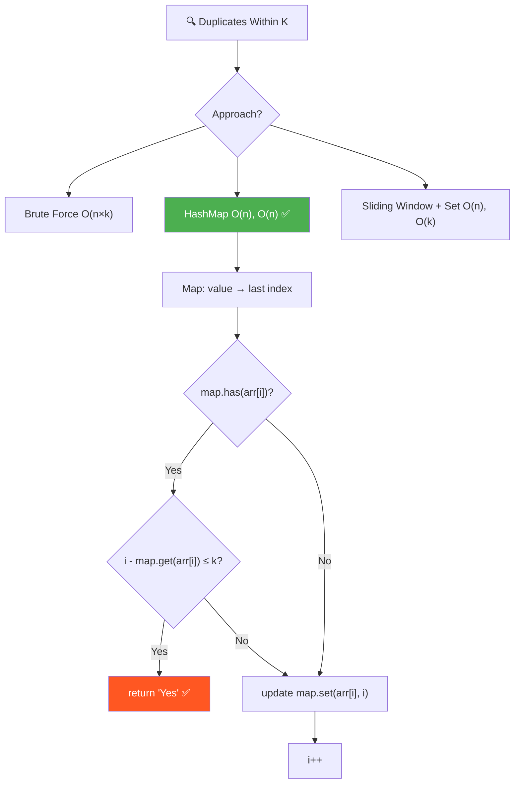
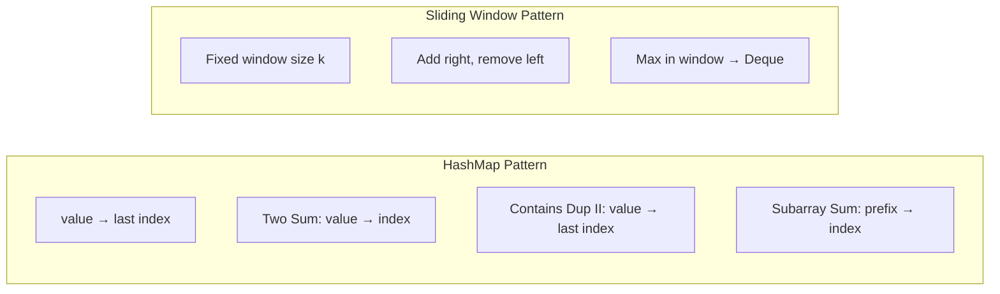
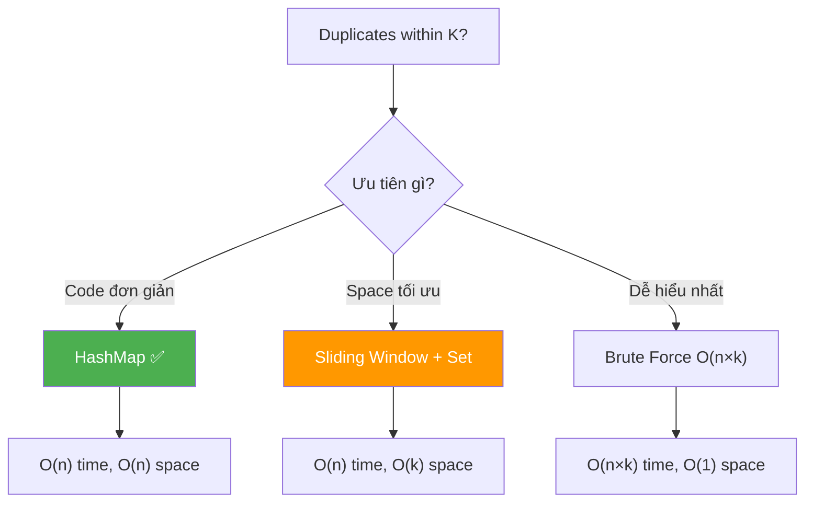
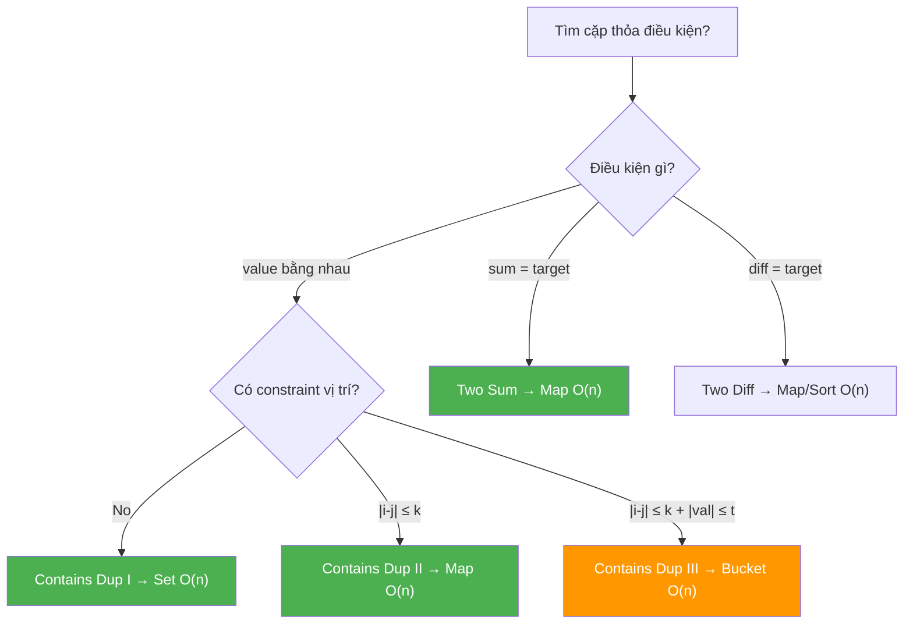
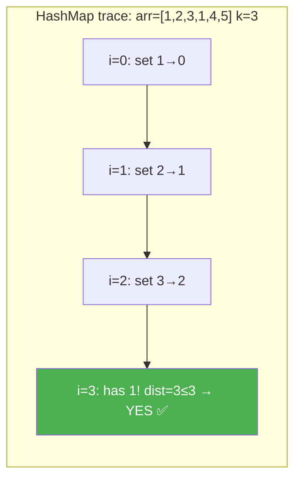
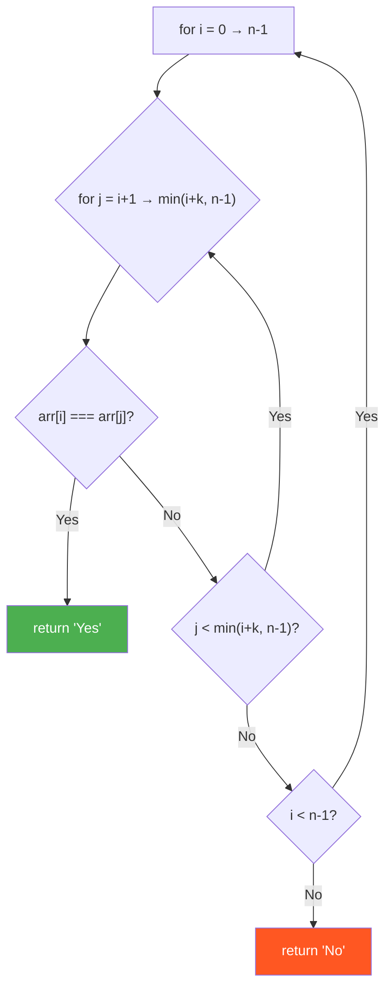
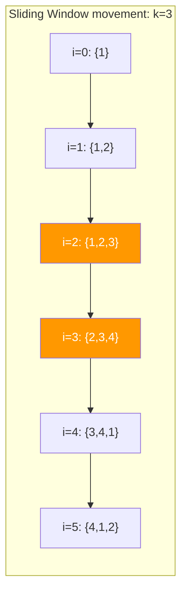
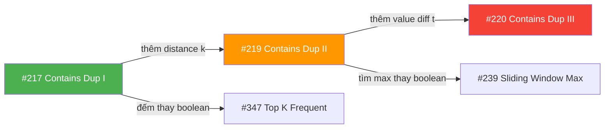

# 🔍 Duplicates Within Distance K — GfG (Easy) / LeetCode #219

> 📖 Code: [Duplicates Within Distance K.js](./Duplicates%20Within%20Distance%20K.js)





---

## R — Repeat & Clarify

🧠 _"HashMap lưu last index. Gặp duplicate → check khoảng cách ≤ k. O(n) time, O(n) space!"_

> 🎙️ _"Given array arr[] and integer k, determine if there exist two indices i and j such that arr[i] == arr[j] and |i - j| ≤ k."_

### Clarification Questions

```
Q: arr[i] == arr[j] — so sánh strict equality?
A: Có, so sánh giá trị bằng nhau

Q: i và j PHẢI KHÁC NHAU?
A: Có! i ≠ j (2 vị trí khác nhau)

Q: |i - j| ≤ k — khoảng cách index, KHÔNG phải giá trị?
A: Đúng! Khoảng cách VỊ TRÍ, không phải chênh lệch giá trị

Q: Có thể có nhiều duplicates?
A: Có, nhưng chỉ cần TÌM THẤY 1 cặp thỏa là return "Yes"

Q: k = 0?
A: |i - j| ≤ 0 → i == j → nhưng i ≠ j → luôn "No" (trừ mảng rỗng)

Q: Mảng rỗng hoặc 1 phần tử?
A: Không thể có 2 indices → "No"
```

### Tại sao bài này quan trọng?

```
  Bài này kết hợp 2 pattern CỐT LÕI:

  1. HASHING — dùng Map/Set để tra cứu O(1)
  2. SLIDING WINDOW — giữ "cửa sổ" kích thước k

  BẠN PHẢI hiểu:
  ┌──────────────────────────────────────────────────────────────┐
  │  Contains Duplicate I (#217):  có duplicate không?           │
  │    → Set, check has() trước khi add()                        │
  │                                                              │
  │  Contains Duplicate II (#219): duplicate WITHIN k distance? │
  │    → Map (value → last index) HOẶC Sliding Window + Set    │
  │                                                              │
  │  Contains Duplicate III (#220): |val diff| ≤ t AND |i-j| ≤ k│
  │    → Bucket Sort / Ordered Set (HARD!)                       │
  └──────────────────────────────────────────────────────────────┘

  → Bài #219 là BẢN LỀ giữa Easy và Hard!
  → Hiểu rõ → giải được #220 (Hard) dễ hơn nhiều!
```

---

## 🧠 Bản chất bài toán — Hiểu để NHỚ, không chỉ để GIẢI

### 2 điều kiện ĐỒNG THỜI

```
  Bài toán yêu cầu TÌM cặp (i, j) thỏa MÃN CẢ 2:
    ① arr[i] == arr[j]    → CÙNG GIÁ TRỊ (duplicate)
    ② |i - j| ≤ k         → GẦN NHAU (khoảng cách ≤ k)

  Nếu CHỈ có ①: bài "Contains Duplicate" (#217) → dùng Set
  Nếu CHỈ có ②: bài "tìm 2 phần tử trong window" → Sliding Window
  CẢ 2: cần KẾT HỢP hashing + distance tracking!

  Ví dụ: k = 3, arr = [1, 2, 3, 4, 1, 2, 3, 4]
    ① 1 xuất hiện ở index 0 và 4 → duplicate ✅
    ② |0 - 4| = 4 > 3            → quá XA ❌
    → "No"!

  Ví dụ: k = 3, arr = [1, 2, 3, 1, 4, 5]
    ① 1 xuất hiện ở index 0 và 3 → duplicate ✅
    ② |0 - 3| = 3 ≤ 3            → đủ GẦN ✅
    → "Yes"!
```

### Tại sao chỉ lưu LAST INDEX?

```
  🧠 Nếu giá trị x xuất hiện ở nhiều vị trí: i₁ < i₂ < i₃ < ...

  Ta đang ở vị trí i₃, check với tất cả vị trí trước?
    |i₃ - i₁| và |i₃ - i₂| → cái nào nhỏ hơn?

    Vì i₁ < i₂ < i₃:
      i₃ - i₁ > i₃ - i₂    ← i₂ GẦN i₃ hơn!

  ┌──────────────────────────────────────────────────────────┐
  │  Nếu i₃ - i₂ > k  (gần nhất vẫn xa)                   │
  │  → i₃ - i₁ > k    (xa hơn chắc chắn cũng xa!)         │
  │  → KHÔNG CẦN check i₁!                                 │
  │                                                          │
  │  Nếu i₃ - i₂ ≤ k  (gần nhất đủ gần)                   │
  │  → return "Yes" ngay! Không cần check i₁!               │
  └──────────────────────────────────────────────────────────┘

  💡 KẾT LUẬN: Chỉ cần so với VỊ TRÍ GẦN NHẤT (last index)!
     → Lưu map: value → LAST SEEN index
     → Update mỗi lần gặp lại → luôn giữ index gần nhất!

  📌 Đây là GREEDY insight:
     "Nếu cặp GẦN NHẤT không thỏa, thì cặp XA hơn CHẮC CHẮN không thỏa"
```

### Hai cách nhìn bài toán

```
  CÁCH 1: HashMap — "Ghi nhớ vị trí cuối"
  ┌──────────────────────────────────────────────────────────┐
  │  Duyệt mảng, với mỗi phần tử:                          │
  │    → "Tôi đã GẶP giá trị này chưa?"                    │
  │    → Nếu rồi: "Nó ở ĐÂU gần nhất? Có ≤ k không?"     │
  │    → Cập nhật vị trí mới nhất                           │
  │                                                          │
  │  Map: value → last index                                 │
  │  Time: O(n)    Space: O(n) — map chứa tối đa n entries  │
  └──────────────────────────────────────────────────────────┘

  CÁCH 2: Sliding Window + Set — "Giữ cửa sổ kích thước k"
  ┌──────────────────────────────────────────────────────────┐
  │  Duy trì 1 CỬA SỔ (Set) chứa k phần tử liên tiếp      │
  │    → Thêm phần tử mới vào cửa sổ                       │
  │    → Nếu ĐÃ CÓ trong Set → duplicate trong window k!   │
  │    → Nếu window > k → xóa phần tử cũ nhất              │
  │                                                          │
  │  Set: chứa tối đa k phần tử                             │
  │  Time: O(n)    Space: O(k) — tốt hơn khi k << n!       │
  └──────────────────────────────────────────────────────────┘

  📌 HashMap dễ code hơn, Sliding Window tốn ít memory hơn!
```



---

## 🧭 Luồng Suy Nghĩ — Từ đọc đề đến solution

> 💡 Phần này dạy bạn **CÁCH TƯ DUY** để tự giải bài, không chỉ biết đáp án.
> Mỗi bước đều có **lý do tại sao**, để bạn áp dụng cho bài khó hơn.

### Bước 1: Đọc đề → Gạch chân KEYWORDS

```
  Đề bài: "Determine if arr[i] == arr[j] and |i - j| ≤ k"

  Gạch chân:
    "arr[i] == arr[j]"  → DUPLICATE values → cần tracking giá trị
    "|i - j| ≤ k"       → DISTANCE constraint → cần tracking index
    "exist"              → chỉ cần TÌM THẤY 1 cặp → return sớm
    "and"                → 2 điều kiện ĐỒNG THỜI!

  🧠 Tự hỏi: "Bài này giống bài nào đã biết?"
    → "arr[i] == arr[j]" = Contains Duplicate (#217)!
    → Nhưng THÊM constraint "|i - j| ≤ k"
    → Đây là bài #217 + thêm 1 RÀNG BUỘC!

  🧠 Tự hỏi: "2 điều kiện → cần data structure nào?"
    → Chỉ cần duplicate? → Set (has/add O(1))
    → Cần duplicate + biết VỊ TRÍ? → Map (value → index)!
    → "Distance ≤ k" yêu cầu biết INDEX → Map!

  📌 Kỹ năng chuyển giao:
    Khi đề có NHIỀU RÀNG BUỘC → phân tách từng ràng buộc:
      ① Ràng buộc về GIÁ TRỊ: "bằng nhau", "chênh lệch ≤ t"
         → Hash (Set/Map) hoặc Sort
      ② Ràng buộc về VỊ TRÍ: "|i-j| ≤ k", "subarray length"
         → Sliding Window hoặc Index tracking
    → Rồi TÌM data structure thỏa MÃN CẢ HAI!
```

### Bước 2: Phân tách bài toán — Giải từng phần riêng trước

```
  🧠 Tách 2 ràng buộc, tự hỏi: "Nếu chỉ có 1 ràng buộc thì giải sao?"

  ① CHỈ CÓ "arr[i] == arr[j]" (Contains Duplicate #217):
    → Dùng Set:
      for mỗi i:
        if set.has(arr[i]) → return "Yes"  (duplicate tìm thấy!)
        set.add(arr[i])
    → O(n) time, O(n) space ✅

  ② CHỈ CÓ "|i - j| ≤ k" (2 phần tử bất kỳ trong window k):
    → Luôn đúng nếu có ≥ 2 phần tử trong window!
    → Không có ý nghĩa khi đứng một mình

  🧠 KẾT HỢP cả 2:
    → Cần tìm duplicate (#1) nhưng CHỈ TRONG PHẠM VI k (#2)
    → Set KHÔNG ĐỦ vì không biết INDEX → cần Map!
    → Map: value → index → check cả giá trị LẪN khoảng cách!

  📌 Kỹ năng chuyển giao:
    Khi bài có nhiều constraints:
    1. Giải từng constraint RIÊNG → biết pattern cho mỗi cái
    2. TÌM CÁCH kết hợp → thường là "nâng cấp" data structure
       Set → Map (thêm metadata)
       Array → Sorted Array (thêm ordering)
       Queue → Priority Queue (thêm priority)
```

### Bước 3: Vẽ ví dụ NHỎ bằng tay → Tìm PATTERN

```
  Lấy 2 ví dụ: 1 cái "Yes", 1 cái "No":

  ─── Ví dụ "Yes": arr = [1, 2, 3, 1, 4, 5], k = 3 ─────

  Duyệt bằng tay, NHỚ vị trí mỗi giá trị:
    i=0: arr[0]=1  → bảng trống, ghi nhớ: {1 → 0}
    i=1: arr[1]=2  → chưa gặp 2, ghi nhớ: {1→0, 2→1}
    i=2: arr[2]=3  → chưa gặp 3, ghi nhớ: {1→0, 2→1, 3→2}
    i=3: arr[3]=1  → ĐÃ GẶP 1! Ở đâu? index 0!
                     Khoảng cách: |3-0| = 3 ≤ k=3? → YES! ✅

  ─── Ví dụ "No": arr = [1, 2, 3, 4, 1], k = 3 ──────────

    i=0: ghi {1→0}
    i=1: ghi {1→0, 2→1}
    i=2: ghi {1→0, 2→1, 3→2}
    i=3: ghi {1→0, 2→1, 3→2, 4→3}
    i=4: ĐÃ GẶP 1! Ở index 0! Khoảng cách: |4-0| = 4 > k=3 → ❌

    Không còn gì để check → "No"

  🧠 Quan sát PATTERN:
    1. Ta NHỚ index của mỗi giá trị đã gặp (bảng/map)
    2. Khi gặp duplicate → CHECK khoảng cách
    3. Chỉ cần TÌM THẤY 1 cặp → return ngay (early exit)

  📌 Kỹ năng chuyển giao:
    LUÔN vẽ ví dụ trước khi code! Vẽ CẢ HAI: Yes case và No case.
    → Thấy rõ khi nào cần return sớm, khi nào duyệt hết
```

### Bước 4: Từ ví dụ → Brute Force (Solution đầu tiên)

```
  Từ quan sát: cần kiểm tra tất cả CẶP (i, j) trong phạm vi k

  🧠 Ý tưởng: "Check TẤT CẢ cặp = 2 vòng for!"

  Nhưng KHÔNG CẦN check mọi j cho mỗi i:
    → Chỉ cần check j trong range [i+1, i+k]!
    → Vì |i-j| > k → chắc chắn KHÔNG thỏa!

    for i = 0 → n-1:
      for j = i+1 → min(i+k, n-1):   ← CHỈ check window k!
        if arr[i] === arr[j]: return "Yes"

  Analysis:
    → Vòng ngoài: n iterations
    → Vòng trong: tối đa min(k, n) iterations
    → Time: O(n × k) → khi k ≈ n → O(n²) 😰
    → Space: O(1) ✅

  📌 Kỹ năng chuyển giao:
    Brute force = CHECK TẤT CẢ khả năng hợp lệ
    → Mỗi "lựa chọn" = 1 vòng for
    → Nhưng CẮT BỚT range nếu có constraint (j ≤ i+k)!
    → LUÔN bắt đầu từ brute force, rồi optimize!
```

### Bước 5: Tự hỏi "Vòng for TRONG làm gì?" → Thay bằng O(1) lookup

```
  🧠 Nhìn vào vòng for trong:
    for j = i+1 → min(i+k, n-1):
      if arr[i] === arr[j]   ← TÌM arr[j] == arr[i] trong range!

  Mục đích: TÌM giá trị arr[i] trong các phần tử ĐÃ GẶP!

  💡 Insight: "Tìm phần tử" = LOOKUP problem!
     → Array scan: O(k) per lookup
     → Hash lookup: O(1) per lookup!
     → Thay vòng for = O(k) bằng Map.has() = O(1)!

  Cách implement:
    Map: value → last seen index
    Với mỗi i:
      if map.has(arr[i]):
        last = map.get(arr[i])
        if i - last ≤ k: return "Yes"    ← O(1) check!
      map.set(arr[i], i)                  ← update mới nhất

    ✅ Solution 2: HashMap — O(n) time, O(n) space!

  📌 Kỹ năng chuyển giao:
    Đây là pattern KINH ĐIỂN nhất trong algorithms:

    ┌────────────────────────────────────────────────────────┐
    │  "Tìm phần tử trong tập hợp"                          │
    │    → Array scan: O(n)                                  │
    │    → Sorted array + binary search: O(log n)            │
    │    → Hash (Set/Map): O(1)                              │
    │                                                        │
    │  → Bất cứ khi nào thấy vòng for TÌM phần tử:         │
    │    HỎI: "Thay bằng Hash lookup được không?"            │
    │    → 90% các bài: O(n²) → O(n) nhờ trick này!         │
    └────────────────────────────────────────────────────────┘

    Ví dụ CÙNG pattern:
      Two Sum (#1):     tìm complement → Map.has(target - arr[i])
      Contains Dup II:  tìm duplicate  → Map.has(arr[i])
      Subarray Sum=K:   tìm prefix sum → Map.has(currentSum - k)
      → TẤT CẢ đều: "thay vòng for scan bằng Hash lookup O(1)"!
```

### Bước 6: "Tại sao chỉ lưu LAST index?" → Chứng minh GREEDY

```
  🧠 Câu hỏi quan trọng:
    Nếu giá trị 1 xuất hiện ở index 0, 5, 10, 15
    và ta đang ở index 16:
    → Nên check với index 0? 5? 10? hay 15?

  Thử tất cả:
    |16-0|  = 16
    |16-5|  = 11
    |16-10| = 6
    |16-15| = 1    ← NHỎ NHẤT!

  💡 Insight: index GẦN NHẤT luôn cho khoảng cách NHỎ NHẤT!

  CHỨNG MINH (phản chứng):
    Nếu i₁ < i₂ < current:
      current - i₁ > current - i₂     (vì i₁ < i₂)

    Nếu current - i₂ > k (gần nhất vẫn xa):
      → current - i₁ > current - i₂ > k → i₁ CHẮC CHẮN cũng xa!

    Nếu current - i₂ ≤ k (gần nhất đủ gần):
      → return "Yes" ngay! Không cần check i₁!

    → DÙ TRƯỜNG HỢP NÀO, chỉ cần check i₂ (gần nhất)!
    → KHÔNG CẦN lưu i₁ (xa hơn)!

  📌 Đây là GREEDY reasoning:
    "Nếu phương án TỐT NHẤT (gần nhất) không thỏa,
     thì phương án TỆ HƠN (xa hơn) CHẮC CHẮN không thỏa"
    → Chỉ cần xét phương án tốt nhất!

  📌 Kỹ năng chuyển giao:
    Khi bài hỏi "tồn tại X thỏa so sánh Y":
    1. Xác định: so sánh Y "tốt nhất" khi nào?
       → |i-j| ≤ k: tốt nhất khi j GẦN i nhất
       → |val - target| ≤ t: tốt nhất khi val GẦN target nhất
    2. Chỉ cần check với phương án TỐT NHẤT!
    3. Lưu/update phương án tốt nhất mỗi bước = GREEDY!

    Áp dụng:
      Dup II (#219):  "gần nhất" = last index → Map update
      Dup III (#220): "gần nhất" = bucket kề → Bucket Sort
      Jump Game (#55): "xa nhất" = max reach → Greedy max
```

### Bước 7: "Có optimize SPACE hơn nữa không?" → Sliding Window

```
  HashMap: O(n) time ✅, O(n) space ← Map chứa TẤT CẢ phần tử

  🧠 Tự hỏi: "Có cần NHỚ tất cả phần tử không?"

  Phân tích: phần tử ở index i CHỈ cần so sánh với phần tử
  trong range [i-k, i-1]. Phần tử ở index < i-k → quá xa!

  Ví dụ: k=3, i=10
    → Chỉ cần so với index 7, 8, 9
    → Index 0, 1, ..., 6 → KHÔNG CẦN nhớ!

  💡 Insight: Chỉ cần NHỚ k phần tử gần nhất!
    → Giữ 1 "cửa sổ" (window) kích thước k
    → Thêm phần tử mới vào window
    → Xóa phần tử CŨ NHẤT (ra khỏi range) ra
    → Check duplicate TRONG window!

  Data structure cho window?
    → Cần: add O(1), delete O(1), has O(1)
    → Set hoàn hảo!

  ✅ Solution 3: Sliding Window + Set — O(n) time, O(k) space!

  🧠 Tại sao Set mà không phải Map?
    → Window chỉ cần biết "có TRONG window không?" → has()
    → KHÔNG cần biết index (vì mọi thứ trong Set đều ≤ k xa!)
    → Set đủ, không cần Map!

  📌 Kỹ năng chuyển giao:
    Khi HashMap chứa QUÁ NHIỀU dữ liệu:
    1. Hỏi: "Thực sự cần NHỚ tất cả?"
    2. Nếu chỉ cần phần tử TRONG RANGE → Sliding Window!
    3. Sliding Window = "quên" phần tử cũ, chỉ giữ cần thiết!

    Pattern: HashMap O(n) space → Sliding Window O(k) space
    → k << n → tiết kiệm rất nhiều!

    Áp dụng cho:
      Max/Min in window (#239)  → Deque O(k)
      Anagram in string (#438)  → Map O(26) = O(1)
      Longest substring (#3)    → Set O(charset)
```

### Bước 8: Tổng kết — Cây quyết định khi gặp bài "Duplicate" / "Pair"



```
  📌 QUY TRÌNH TƯ DUY TỔNG QUÁT (cho bài "tìm cặp"):

  ┌──────────────────────────────────────────────────────────────┐
  │  1. ĐỌC ĐỀ → xác định RÀNG BUỘC                            │
  │     → Giá trị: "bằng", "sum", "diff", "within t"           │
  │     → Vị trí: "within k", "adjacent", "subarray"           │
  │                                                              │
  │  2. TÁCH RÀNG BUỘC → giải từng cái riêng                    │
  │     → Giá trị: Set/Map/Sort                                 │
  │     → Vị trí: Index tracking/Sliding Window                 │
  │                                                              │
  │  3. BRUTE FORCE → 2 vòng for                                │
  │     → Tìm tất cả cặp thỏa mãn → O(n²) hoặc O(n×k)        │
  │                                                              │
  │  4. OPTIMIZE → thay vòng for scan bằng Hash lookup           │
  │     → O(n²) → O(n) nhờ Map/Set!                            │
  │     → Đây là bước QUAN TRỌNG NHẤT!                          │
  │                                                              │
  │  5. GREEDY → chỉ check phương án TỐT NHẤT                   │
  │     → "Gần nhất" → last index (update Map mỗi bước)        │
  │                                                              │
  │  6. SPACE OPTIMIZE → Sliding Window                          │
  │     → Chỉ giữ k phần tử gần nhất thay vì tất cả           │
  │     → O(n) space → O(k) space                               │
  │                                                              │
  │  7. VERIFY → chạy ví dụ bằng tay                            │
  │     → Case "Yes", Case "No", Edge cases                     │
  └──────────────────────────────────────────────────────────────┘

  ⭐ QUY TẮC VÀNG:
    Bạn KHÔNG CẦN nhớ code từng bài.
    Bạn CẦN nhớ QUY TRÌNH TƯ DUY → tự derive solution!

    "Thấy 2 vòng for → hỏi: Hash thay được không?"
    "Thấy O(n) space → hỏi: Window thay được không?"
    "Thấy check tất cả → hỏi: Greedy chỉ check tốt nhất?"
```

---

## E — Examples

### Ví dụ minh họa trực quan

```
VÍ DỤ 1: k = 3, arr = [1, 2, 3, 4, 1, 2, 3, 4]

  Index:  0  1  2  3  4  5  6  7
  Value:  1  2  3  4  1  2  3  4
                      ↑
                      Duplicate 1 → khoảng cách |4-0| = 4 > k=3 ❌

  Kiểm tra TẤT CẢ các cặp duplicate:
    (1)  index 0,4: |0-4| = 4 > 3 → quá xa!
    (2)  index 1,5: |1-5| = 4 > 3 → quá xa!
    (3)  index 2,6: |2-6| = 4 > 3 → quá xa!
    (4)  index 3,7: |3-7| = 4 > 3 → quá xa!
  → "No" (MỌI duplicate đều cách nhau ĐÚNG 4, nhưng k chỉ cho phép 3)

  🧠 Nhận xét: mảng repeat pattern [1,2,3,4] + [1,2,3,4]
     Khoảng cách = chu kỳ = 4 > k = 3 → luôn xa!
```

```
VÍ DỤ 2: k = 3, arr = [1, 2, 3, 1, 4, 5]

  Index:  0  1  2  3  4  5
  Value:  1  2  3  1  4  5
          ↑        ↑
          └── 1 ───┘  khoảng cách |3-0| = 3 ≤ k=3 ✅

  → "Yes"! Tìm thấy ngay cặp (0, 3)
```

```
VÍ DỤ 3: k = 3, arr = [1, 2, 3, 4, 5]

  Index:  0  1  2  3  4
  Value:  1  2  3  4  5   ← Tất cả DISTINCT!

  Không có duplicate nào → "No"
  🧠 Trường hợp ĐẶC BIỆT: nếu không có duplicate, mọi approach
     đều duyệt hết mảng rồi return "No" (worst case)
```

```
VÍ DỤ 4: k = 1, arr = [1, 0, 1, 1]

  Index:  0  1  2  3
  Value:  1  0  1  1
          ↑     ↑  ↑
          │     └──┘  khoảng cách |3-2| = 1 ≤ k=1 ✅
          │     ↑
          └─────┘  khoảng cách |2-0| = 2 > k=1 ❌

  → "Yes"! Cặp (2,3) thỏa, dù cặp (0,2) KHÔNG thỏa!

  🧠 KEY: Nếu Map không ghi đè index 0 → index 2:
     i=3 check với index 0: |3-0| = 3 > 1 → SAI! Bỏ sót (2,3)!
     → PHẢI ghi đè last index mới nhất!
```

```
VÍ DỤ 5 (Edge): k = 0, arr = [1, 1]

  Index:  0  1
  Value:  1  1
          ↑  ↑
          └──┘  khoảng cách |1-0| = 1 > k=0

  |i-j| ≤ 0 → chỉ khi i == j → nhưng i ≠ j bắt buộc!
  → "No" luôn! (k=0 vô nghĩa)
```

### Minh họa — HashMap approach (trace từng bước)

```
  arr = [1, 2, 3, 1, 4, 5], k = 3

  Map (value → last index):

  ┌─────────────────────────────────────────────────────────────────┐
  │ i=0: arr[0]=1  map={}                                          │
  │      has(1)? NO → set(1, 0)                                    │
  │      map = {1: 0}                                              │
  │                                                                │
  │      Trạng thái: [①, 2, 3, 1, 4, 5]                          │
  │                   ↑i                                           │
  ├─────────────────────────────────────────────────────────────────┤
  │ i=1: arr[1]=2  map={1:0}                                       │
  │      has(2)? NO → set(2, 1)                                    │
  │      map = {1: 0, 2: 1}                                       │
  │                                                                │
  │      Trạng thái: [1, ②, 3, 1, 4, 5]                          │
  │                      ↑i                                        │
  ├─────────────────────────────────────────────────────────────────┤
  │ i=2: arr[2]=3  map={1:0, 2:1}                                  │
  │      has(3)? NO → set(3, 2)                                    │
  │      map = {1: 0, 2: 1, 3: 2}                                 │
  │                                                                │
  │      Trạng thái: [1, 2, ③, 1, 4, 5]                          │
  │                         ↑i                                     │
  ├─────────────────────────────────────────────────────────────────┤
  │ i=3: arr[3]=1  map={1:0, 2:1, 3:2}                             │
  │      has(1)? YES! 💥                                           │
  │      last = map.get(1) = 0                                     │
  │      distance = i - last = 3 - 0 = 3                           │
  │      3 ≤ k=3? ✅ YES!                                         │
  │                                                                │
  │      Trạng thái: [1, 2, 3, ①, 4, 5]                          │
  │                   ↑last    ↑i                                  │
  │                   └── 3 ──→┘ ≤ k=3 → return "Yes"!            │
  └─────────────────────────────────────────────────────────────────┘

  → Return "Yes" ngay tại i=3! (early exit, KHÔNG duyệt tiếp)
```



### Minh họa — Sliding Window approach (trace từng bước)

```
  arr = [1, 2, 3, 1, 4, 5], k = 3

  Duy trì Set (cửa sổ kích thước ≤ k):

  ┌──────────────────────────────────────────────────────────────────┐
  │ i=0: [①, 2, 3, 1, 4, 5]     window = {}                       │
  │       ↑i                                                        │
  │      1 ∈ {}? NO → add(1)     window = {1}                      │
  │      size=1 ≤ k=3 → OK                                         │
  ├──────────────────────────────────────────────────────────────────┤
  │ i=1: [1, ②, 3, 1, 4, 5]     window = {1}                      │
  │          ↑i                                                     │
  │      2 ∈ {1}? NO → add(2)   window = {1, 2}                   │
  │      size=2 ≤ 3 → OK                                           │
  │                                                                 │
  │      └── window covers: [1, 2] ──┘                             │
  ├──────────────────────────────────────────────────────────────────┤
  │ i=2: [1, 2, ③, 1, 4, 5]     window = {1, 2}                   │
  │             ↑i                                                  │
  │      3 ∈ {1,2}? NO → add(3) window = {1, 2, 3}                │
  │      size=3 ≤ 3 → OK                                           │
  │                                                                 │
  │      └── window covers: [1, 2, 3] ──┘  (full window!)         │
  ├──────────────────────────────────────────────────────────────────┤
  │ i=3: [1, 2, 3, ①, 4, 5]     window = {1, 2, 3}                │
  │                ↑i                                               │
  │      1 ∈ {1,2,3}? YES! 💥   → return "Yes" ✅                  │
  │                                                                 │
  │      🧠 1 đang trong window = 1 xuất hiện trong k=3            │
  │         phần tử gần nhất → duplicate WITHIN k!                 │
  └──────────────────────────────────────────────────────────────────┘

  → Return "Yes" ngay tại i=3!
```

### Minh họa — Sliding Window "No" case (trace ĐẦY ĐỦ)

```
  arr = [1, 2, 3, 4, 1, 2, 3, 4], k = 3

  ┌──────────────────────────────────────────────────────────────────┐
  │ i=0: 1 ∈ {}? NO → add(1)         window = {1}                  │
  │      size=1 ≤ 3 → OK                                           │
  │      arr: [①, 2, 3, 4, 1, 2, 3, 4]                            │
  │            ↑───window───↑                                      │
  ├──────────────────────────────────────────────────────────────────┤
  │ i=1: 2 ∈ {1}? NO → add(2)        window = {1, 2}               │
  │      size=2 ≤ 3 → OK                                           │
  ├──────────────────────────────────────────────────────────────────┤
  │ i=2: 3 ∈ {1,2}? NO → add(3)      window = {1, 2, 3}            │
  │      size=3 = k → OK (full!)                                    │
  ├──────────────────────────────────────────────────────────────────┤
  │ i=3: 4 ∈ {1,2,3}? NO → add(4)    window = {1, 2, 3, 4}         │
  │      size=4 > k=3!                                              │
  │      → delete arr[i-k] = arr[0] = 1                            │
  │      window = {2, 3, 4}           (size=3=k ✅)                │
  │                                                                 │
  │      arr: [_, ②, ③, ④, 1, 2, 3, 4]                            │
  │              ↑──window──↑                                       │
  │      🧠 1 bị xóa khỏi window! Index 0 quá xa (>k từ index 3)  │
  ├──────────────────────────────────────────────────────────────────┤
  │ i=4: 1 ∈ {2,3,4}? NO! (1 đã bị xóa ở bước trước!)             │
  │      → add(1)                     window = {2, 3, 4, 1}         │
  │      size=4 > k=3 → delete arr[1] = 2                          │
  │      window = {3, 4, 1}           (size=3 ✅)                  │
  │                                                                 │
  │      arr: [_, _, ③, ④, ①, 2, 3, 4]                            │
  │                 ↑──window──↑                                    │
  ├──────────────────────────────────────────────────────────────────┤
  │ i=5: 2 ∈ {3,4,1}? NO → add(2)    window = {3, 4, 1, 2}         │
  │      size=4 > 3 → delete arr[2] = 3                            │
  │      window = {4, 1, 2}                                         │
  ├──────────────────────────────────────────────────────────────────┤
  │ i=6: 3 ∈ {4,1,2}? NO → add(3)    window = {4, 1, 2, 3}         │
  │      size=4 > 3 → delete arr[3] = 4                            │
  │      window = {1, 2, 3}                                         │
  ├──────────────────────────────────────────────────────────────────┤
  │ i=7: 4 ∈ {1,2,3}? NO → add(4)    window = {1, 2, 3, 4}         │
  │      size=4 > 3 → delete arr[4] = 1                            │
  │      window = {2, 3, 4}                                         │
  └──────────────────────────────────────────────────────────────────┘

  END → return "No" ✅

  🧠 Tại sao luôn "No"?
     Mỗi lần gặp duplicate (1 ở i=4, 2 ở i=5, v.v.), phiên bản
     TRƯỚC đã bị DELETE khỏi window (quá xa > k)!
     → Duplicate luôn nằm NGOÀI window → không bao giờ has() = true!
```

---

## A — Approach

### Approach 1: Brute Force — O(n × min(n, k))

```
  Với mỗi i, kiểm tra j từ i+1 đến min(i+k, n-1)

  ┌──────────────────────────────────────────────────────────┐
  │  for i = 0 → n-1:                                        │
  │    for j = i+1 → min(i+k, n-1):                         │
  │      if arr[i] === arr[j]: return "Yes"                  │
  │  return "No"                                              │
  │                                                          │
  │  Time: O(n × k)  → worst case k ≈ n → O(n²)            │
  │  Space: O(1)                                              │
  │                                                          │
  │  ⚠️ Chỉ check range [i+1, i+k] thay vì toàn bộ mảng!  │
  │     Nếu check TẤT CẢ j: O(n²) → T.L.E!                 │
  └──────────────────────────────────────────────────────────┘
```



```
  🧠 Phân tích chi tiết:

  BEST CASE: O(1) — duplicate adjacent ở đầu mảng!
    arr = [5, 5, ...], k ≥ 1 → i=0, j=1 → match ngay!

  WORST CASE: O(n × min(n, k)) — mọi phần tử distinct, hoặc
    duplicate ở cuối mảng
    arr = [1, 2, 3, ..., n], k=n → check tất cả n(n-1)/2 cặp!

  AVERAGE CASE: phụ thuộc vào phân bố dữ liệu
    → Nếu nhiều duplicate: tìm sớm → O(n)
    → Nếu ít duplicate: gần worst case → O(n×k)

  📌 Khi nào Brute Force CHẤP NHẬN ĐƯỢC?
    → k rất nhỏ (k = 1 hoặc 2): vòng trong chỉ 1-2 iterations!
    → O(n×1) = O(n) — nhanh như HashMap!
    → Nhưng KHÔNG scale khi k lớn → cần HashMap
```

### Approach 2: HashMap — O(n) time, O(n) space ✅

```
  💡 KEY INSIGHT: Map lưu value → LAST SEEN index!

  ┌──────────────────────────────────────────────────────────┐
  │  Map: { value → lastIndex }                              │
  │                                                          │
  │  Với mỗi i:                                              │
  │    ① map.has(arr[i])?                                    │
  │       → YES: check i - map.get(arr[i]) ≤ k?             │
  │         → YES: return "Yes"                              │
  │         → NO: update map.set(arr[i], i) (ghi đè!)       │
  │       → NO: map.set(arr[i], i)                           │
  │                                                          │
  │    ② LUÔN update index mới nhất (dù có hay chưa có)     │
  │                                                          │
  │  Time: O(n)    Space: O(n)                               │
  │  → Đơn giản nhất, hiệu quả nhất cho interview!          │
  └──────────────────────────────────────────────────────────┘

  🧠 Tại sao GHI ĐÈ index cũ?
    Nếu |i - lastIndex| > k → CẶP GẦN NHẤT vẫn xa!
    → Cặp XA HƠN chắc chắn cũng xa → KHÔNG CẦN giữ!
    → Ghi đè bằng index MỚI → lần sau check sẽ gần hơn!
```

### Approach 3: Sliding Window + Set — O(n) time, O(k) space

```
  💡 Ý tưởng: Giữ 1 CỬA SỔ (Set) chứa k phần tử gần nhất!

  ┌──────────────────────────────────────────────────────────┐
  │  Set = {} (chứa tối đa k phần tử)                       │
  │                                                          │
  │  Với mỗi i:                                              │
  │    ① set.has(arr[i])? → YES → "Yes"! (duplicate trong k)│
  │    ② set.add(arr[i])                                     │
  │    ③ set.size > k? → delete arr[i - k]                  │
  │       (phần tử cũ nhất, ra khỏi window!)                │
  │                                                          │
  │  Tại sao đúng?                                           │
  │    Set luôn chứa k phần tử VỊ TRÍ gần nhất              │
  │    Nếu arr[i] ∈ Set → tồn tại j ∈ [i-k, i-1] mà        │
  │    arr[j] == arr[i] → |i - j| ≤ k → THỎA!              │
  │                                                          │
  │  Time: O(n)    Space: O(k) ← tốt hơn HashMap khi k<<n! │
  └──────────────────────────────────────────────────────────┘

  📐 Hình dung window:

  arr = [1, 2, 3, 4, 1, 2, 3, 4], k = 3

  i=0: window = {1}               ← [1]
  i=1: window = {1, 2}            ← [1, 2]
  i=2: window = {1, 2, 3}         ← [1, 2, 3]     size=3=k
  i=3: add 4 → size=4>k → delete arr[0]=1
       window = {2, 3, 4}         ← [_, 2, 3, 4]  size=3=k
  i=4: 1 ∈ {2,3,4}? NO → add 1 → size=4>k → delete arr[1]=2
       window = {3, 4, 1}         ← [_, _, 3, 4, 1]
  i=5: 2 ∈ {3,4,1}? NO → add 2 → size=4>k → delete arr[2]=3
       window = {4, 1, 2}
  ...
  → "No"!
```



### ⚠️ GOTCHA: Sliding Window + Duplicate Values trong Set

```
  🧠 Câu hỏi hay: "Nếu arr có giá trị trùng, Set bỏ qua duplicate.
     Window size có bị sai không? Delete có xóa nhầm không?"

  Xét: arr = [1, 2, 1, 3], k = 3

  i=0: add(1)     window = {1}
  i=1: add(2)     window = {1, 2}
  i=2: has(1)? YES! → return "Yes" ✅
       ← ĐÚNG! 1 ở index 0 và 2, distance=2 ≤ k=3

  Nhưng nếu KHÔNG return sớm, và ta continue:
  i=2: add(1)     window = {1, 2} (1 đã có → Set KHÔNG add trùng!)
  i=3: add(3)     window = {1, 2, 3}
       size=4? NO! size=3 = k → KHÔNG delete!

  ⚠️ Set bỏ qua duplicate values → size KHÔNG tăng!
     → Window size có thể < k dù đã add k+1 lần!

  CÓ ẢNH HƯỞNG gì không?
  ┌──────────────────────────────────────────────────────────────┐
  │  KHÔNG! Vì:                                                 │
  │                                                              │
  │  Nếu arr[i] ĐÃ trong Set → has() = true → return "Yes"     │
  │  → Ta KHÔNG BAO GIỜ add duplicate vào Set mà KHÔNG return!  │
  │                                                              │
  │  Dòng add() CHỈ chạy khi has() = false                      │
  │  → Mọi phần tử trong Set luôn DISTINCT                      │
  │  → size luôn đúng, delete luôn đúng ✅                      │
  └──────────────────────────────────────────────────────────────┘

  📌 Đây là lý do THỨ TỰ has() → add() → delete() là CRITICAL!
     Nếu sai thứ tự → logic window BỊ PHÁ VỠ!
```

### ❓ "Tại sao không Sort?"

```
  🧠 Có bạn sẽ hỏi: "Sort rồi check adjacent?"

  CÁCH LÀM:
    1. Tạo array {value, index} pairs
    2. Sort theo value
    3. Check adjacent elements: if same value AND |index diff| ≤ k

  Ví dụ: arr = [1, 2, 3, 1, 4, 5], k = 3
    Pairs: [(1,0), (2,1), (3,2), (1,3), (4,4), (5,5)]
    Sort:  [(1,0), (1,3), (2,1), (3,2), (4,4), (5,5)]
    Adjacent check: (1,0) vs (1,3) → same value, |0-3|=3 ≤ 3 ✅

  COMPLEXITY:
    Time: O(n log n) — Sort!
    Space: O(n) — pairs array

  ⚠️ TỆ HƠN HashMap O(n) time!

  ┌──────────────────────────────────────────────────────────────┐
  │  Sort O(n log n)  vs  HashMap O(n) — HashMap THẮNG!        │
  │                                                              │
  │  Sort CHỈ hợp lý khi:                                       │
  │  1. Không được dùng extra space (nhưng sort cũng tốn!)     │
  │  2. Data ĐÃ SORTED → check adjacent O(n)                   │
  │  3. Cần giải Contains Dup III (#220) — Sort + 2 pointers   │
  │                                                              │
  │  → Cho bài này: HashMap >> Sort!                             │
  └──────────────────────────────────────────────────────────────┘
```

---

## C — Code

### Solution 1: Brute Force — O(n × min(n, k))

```javascript
function hasDuplicateBrute(arr, k) {
  const n = arr.length;
  for (let i = 0; i < n; i++) {
    for (let j = i + 1; j <= Math.min(i + k, n - 1); j++) {
      if (arr[i] === arr[j]) return "Yes";
    }
  }
  return "No";
}
```

```
  📝 Line-by-line:

  Line 4: j <= Math.min(i + k, n - 1)
    → j chỉ duyệt trong WINDOW [i+1, i+k]
    → Math.min: tránh out of bounds khi i+k > n-1

    ⚠️ Tại sao j = i + 1 (KHÔNG PHẢI j = i)?
       → i == j → cùng phần tử → KHÔNG phải "duplicate"!

    ⚠️ Tại sao j <= (KHÔNG PHẢI j <)?
       → |i - j| ≤ k → j CÓ THỂ = i + k → inclusive!
       → j < i + k sẽ BỎ SÓT j = i + k!

  Line 5: if (arr[i] === arr[j]) return "Yes"
    → Tìm thấy 1 cặp → return ngay! (early exit)
```

### Solution 2: HashMap — O(n), O(n) ✅

```javascript
function hasDuplicateMap(arr, k) {
  const map = new Map();

  for (let i = 0; i < arr.length; i++) {
    if (map.has(arr[i]) && i - map.get(arr[i]) <= k) {
      return "Yes";
    }
    map.set(arr[i], i);
  }

  return "No";
}
```

```
  📝 Line-by-line:

  Line 2: const map = new Map()
    → Map: value → last seen index
    → Dùng Map thay Object vì key có thể là BẤT KỲ kiểu nào

  Line 5: if (map.has(arr[i]) && i - map.get(arr[i]) <= k)
    → 2 điều kiện AND:
      ① map.has(arr[i]): giá trị này ĐÃ XUẤT HIỆN trước đó?
      ② i - map.get(arr[i]) ≤ k: khoảng cách ≤ k?

    🧠 Tại sao i - map.get(...) chứ không phải |i - map.get(...)|?
       → i LUÔN > map.get(arr[i]) vì ta duyệt TỪ TRÁI → PHẢI!
       → last index luôn < i → |i - last| = i - last (luôn dương)
       → KHÔNG CẦN Math.abs()!

    ⚠️ SHORT-CIRCUIT: && sẽ NOT check điều kiện 2 nếu 1 false!
       → An toàn: map.get() chỉ gọi khi map.has() true

  Line 8: map.set(arr[i], i)
    → GHI ĐÈ index cũ bằng index MỚI!
    → Chạy BẤT KỂ có tìm thấy duplicate hay chưa
    → Sau khi check (line 5-7), luôn update index mới nhất

    🧠 Tại sao luôn ghi đè?
       TH1: chưa có → thêm mới (first time seen)
       TH2: có nhưng distance > k → ghi đè (cặp cũ quá xa,
            giữ index mới gần hơn cho lần check tiếp!)
       TH3: có và distance ≤ k → đã return "Yes" rồi, 
            không đến dòng này!
```

### Solution 3: Sliding Window + Set — O(n), O(k)

```javascript
function hasDuplicateWindow(arr, k) {
  const window = new Set();

  for (let i = 0; i < arr.length; i++) {
    if (window.has(arr[i])) return "Yes";

    window.add(arr[i]);

    // Giữ window size <= k
    if (window.size > k) {
      window.delete(arr[i - k]);
    }
  }

  return "No";
}
```

```
  📝 Line-by-line:

  Line 5: if (window.has(arr[i])) return "Yes"
    → Check TRƯỚC khi add!
    → Nếu arr[i] đã trong window → duplicate trong k phần tử gần nhất!

    ⚠️ THỨ TỰ quan trọng: has() → add() → delete()
       Nếu add() TRƯỚC has(): luôn tìm thấy chính mình → SAI!

  Line 7: window.add(arr[i])
    → Thêm phần tử mới vào window

  Line 10-12: if (window.size > k) window.delete(arr[i - k])
    → Khi window quá lớn: xóa phần tử CŨ NHẤT
    → Phần tử cũ nhất = arr[i - k]

    🧠 Tại sao arr[i - k]?
       Window chứa: arr[i-k+1], arr[i-k+2], ..., arr[i-1], arr[i]
       Trước khi thêm arr[i]: window đã có k phần tử
       Sau khi thêm: k+1 → xóa arr[i-k] (ra khỏi range)

    🧠 Tại sao size > k (KHÔNG PHẢI size >= k)?
       Window chứa tối đa k phần tử (indices i-k+1 → i)
       Khi size = k+1 → mới cần xóa
       size = k → vẫn OK (đúng k phần tử)

    ⚠️ EDGE CASE: khi i < k thì i-k < 0!
       Nhưng window.size chỉ > k khi đã add k+1 phần tử
       → i ≥ k → i-k ≥ 0 → AN TOÀN!
```

### Trace CHI TIẾT — HashMap: arr = [1, 2, 3, 4, 1, 2, 3, 4], k = 3

```
  i=0: arr[0]=1  map={}
       has(1)? NO → set(1, 0)
       map = {1:0}

  i=1: arr[1]=2  map={1:0}
       has(2)? NO → set(2, 1)
       map = {1:0, 2:1}

  i=2: arr[2]=3  map={1:0, 2:1}
       has(3)? NO → set(3, 2)
       map = {1:0, 2:1, 3:2}

  i=3: arr[3]=4  map={1:0, 2:1, 3:2}
       has(4)? NO → set(4, 3)
       map = {1:0, 2:1, 3:2, 4:3}

  i=4: arr[4]=1  map={1:0, 2:1, 3:2, 4:3}
       has(1)? YES! last = 0, distance = 4-0 = 4 > 3 → ❌
       → set(1, 4) ← GHI ĐÈ! index 0 → 4
       map = {1:4, 2:1, 3:2, 4:3}

  i=5: arr[5]=2  map={1:4, 2:1, 3:2, 4:3}
       has(2)? YES! last = 1, distance = 5-1 = 4 > 3 → ❌
       → set(2, 5)
       map = {1:4, 2:5, 3:2, 4:3}

  i=6: arr[6]=3  map={1:4, 2:5, 3:2, 4:3}
       has(3)? YES! last = 2, distance = 6-2 = 4 > 3 → ❌
       → set(3, 6)

  i=7: arr[7]=4  map={1:4, 2:5, 3:6, 4:3}
       has(4)? YES! last = 3, distance = 7-3 = 4 > 3 → ❌
       → set(4, 7)

  END → return "No" ✅ (mọi duplicate cách nhau 4 > k=3)
```

### Trace — HashMap: arr = [1, 0, 1, 1], k = 1

```
  i=0: arr[0]=1  has(1)? NO → set(1, 0)
  i=1: arr[1]=0  has(0)? NO → set(0, 1)
  i=2: arr[2]=1  has(1)? YES! last=0, distance=2-0=2 > 1 → ❌
       → set(1, 2) ← GHI ĐÈ!
  i=3: arr[3]=1  has(1)? YES! last=2, distance=3-2=1 ≤ 1 → YES! ✅

  🧠 Nhận xét: index 0 bị ghi đè bởi 2 → lần 3 check với 2 (gần hơn!)
     Nếu KHÔNG ghi đè: check 3-0=3 > 1 → SAI! Bỏ sót cặp (2,3)!
     → GHI ĐÈ index cũ là CRITICAL!
```

> 🎙️ _"I use a HashMap storing each value's last seen index. When I encounter a value already in the map, I check if the distance is within k. By always updating to the latest index, I only compare against the closest previous occurrence, which is sufficient since farther occurrences can only have larger distances."_

### Invariant — Chứng minh tính đúng đắn

```
  📐 INVARIANT (bất biến) cho HashMap approach:

  Sau mỗi iteration i:
    map.get(v) = index GẦN NHẤT ≤ i mà arr[index] == v

  Chứng minh:
  ┌──────────────────────────────────────────────────────────────────┐
  │  Base case: i = 0                                               │
  │    map rỗng → set(arr[0], 0) → map.get(arr[0]) = 0             │
  │    → Đúng! (chỉ có 1 vị trí = gần nhất)                       │
  │                                                                 │
  │  Inductive step: giả sử đúng tại i-1, chứng minh tại i        │
  │    TH1: arr[i] chưa trong map → set(arr[i], i)                 │
  │      → map.get(arr[i]) = i = vị trí duy nhất = gần nhất ✅    │
  │                                                                 │
  │    TH2: arr[i] đã trong map, distance > k                      │
  │      → set(arr[i], i) → GHI ĐÈ bằng i                        │
  │      → map.get(arr[i]) = i = vị trí mới nhất = gần nhất ✅    │
  │                                                                 │
  │    TH3: arr[i] đã trong map, distance ≤ k                      │
  │      → return "Yes" → dừng vòng lặp                            │
  │      → Đúng vì tìm thấy cặp thỏa mãn ✅                       │
  └──────────────────────────────────────────────────────────────────┘

  📐 INVARIANT cho Sliding Window approach:

  Sau mỗi iteration i:
    window chứa ĐÚNG các giá trị tại index [max(0, i-k+1), i]
    → tối đa k phần tử
    → mọi phần tử trong window cách i ≤ k-1 ≤ k

  → Nếu arr[i+1] ∈ window tại iteration i+1:
    → ∃ j ∈ [max(0, (i+1)-k+1), i] mà arr[j] == arr[i+1]
    → |j - (i+1)| ≤ k → THỎA! ✅
```

---

## ❌ Common Mistakes — Lỗi thường gặp

### Mistake 1: Không ghi đè index cũ trong Map

```javascript
// ❌ SAI: chỉ set khi chưa có!
if (!map.has(arr[i])) {
  map.set(arr[i], i);
}

// Input: [1, 0, 1, 1], k=1
// i=2: has(1)?YES, last=0, 2-0=2>1→NO
// i=3: has(1)?YES, last=0, 3-0=3>1→NO  ← SAI! (2,3) thỏa!
// → Bỏ sót vì index vẫn giữ 0 thay vì 2!

// ✅ ĐÚNG: LUÔN ghi đè!
map.set(arr[i], i); // chạy BẤT KỂ có hay chưa
```

### Mistake 2: Sliding Window — add trước has

```javascript
// ❌ SAI: add TRƯỚC has → luôn tìm thấy chính mình!
window.add(arr[i]);
if (window.has(arr[i])) return "Yes"; // ← LUÔN true!

// ✅ ĐÚNG: has TRƯỚC add!
if (window.has(arr[i])) return "Yes"; // check trước
window.add(arr[i]); // thêm sau
```

### Mistake 3: Sai điều kiện distance

```javascript
// ❌ SAI: dùng < thay vì <=
if (i - map.get(arr[i]) < k) return "Yes";

// Input: [1, 2, 3, 1], k=3
// i=3: distance = 3-0 = 3, 3 < 3 → FALSE → bỏ sót!

// ✅ ĐÚNG: <=
if (i - map.get(arr[i]) <= k) return "Yes";
// 3 ≤ 3 → TRUE → "Yes" ✅
```

### Mistake 4: Sliding Window — xóa sai phần tử

```javascript
// ❌ SAI: xóa phần tử ĐẦU TIÊN thêm vào Set?
// Set KHÔNG có thứ tự! Không thể "xóa đầu" được!

// ❌ SAI: xóa arr[i - k + 1]
if (window.size > k) {
  window.delete(arr[i - k + 1]); // ← off by 1!
}

// ✅ ĐÚNG: xóa arr[i - k]
if (window.size > k) {
  window.delete(arr[i - k]);
}
```

```
  🧠 Tại sao arr[i - k]?
    Sau khi add arr[i], window chứa: arr[i-k], arr[i-k+1], ..., arr[i]
    → size = k + 1
    → Cần xóa phần tử CŨ NHẤT = arr[i - k]
    → Sau xóa: arr[i-k+1], ..., arr[i] → size = k ✅

    Ví dụ: k=3, i=5
    Window trước add: {arr[2], arr[3], arr[4]}  (size=3=k)
    Sau add arr[5]:   {arr[2], arr[3], arr[4], arr[5]}  (size=4>k)
    Xóa arr[5-3]=arr[2]: {arr[3], arr[4], arr[5]}  (size=3=k) ✅
```

### Mistake 5: Dùng Object thay Map (JS trap)

```javascript
// ❌ NGUY HIỂM: Object key LUÔN là string!
const obj = {};
obj[1] = 0;
obj["1"] = 1; // ← GHI ĐÈ! Vì 1 và "1" cùng key = "1"

// ✅ AN TOÀN: Map giữ nguyên kiểu key
const map = new Map();
map.set(1, 0);
map.set("1", 1); // ← 2 entries khác nhau! 1 ≠ "1"
```

---

## O — Optimize

```
                      Time       Space     Ghi chú
  ─────────────────────────────────────────────────────────
  Brute Force         O(n×k)     O(1)      k≈n → O(n²)
  HashMap ✅          O(n)       O(n)      Đơn giản nhất!
  Sliding Window+Set  O(n)       O(k)      Tốt khi k << n

  📌 HashMap phù hợp nhất cho phỏng vấn:
    → Code ngắn, dễ explain, dễ debug
    → O(n) space không phải vấn đề với hầu hết input

  📌 Sliding Window khi được hỏi "optimize space":
    → k = 10, n = 10⁶: Set chứa 10 vs Map chứa 10⁶
    → Tiết kiệm ~100,000× memory!
```

### So sánh HashMap vs Sliding Window — DEEP DIVE

```
  ┌──────────────────────────────────────────────────────────────────┐
  │  Tiêu chí           HashMap              Sliding Window         │
  ├──────────────────────────────────────────────────────────────────┤
  │  Code logic          5 dòng               7 dòng                │
  │  Space               O(n) luôn            O(min(n, k))          │
  │  Khi k = n           O(n) = O(n)          O(n) = O(n) (giống!) │
  │  Khi k << n          O(n) lãng phí!       O(k) tiết kiệm!      │
  │  Dễ hiểu             ✅ rất trực quan     ⚠️ cần hiểu window  │
  │  Dễ debug            ✅ print map         ⚠️ window moving    │
  │  Cache friendly      ✅ sequential scan   ✅ sequential scan   │
  │  Mở rộng             Two Sum, Subarray    Max in Window, Anagram│
  │  Follow-up #220      ❌ không mở rộng     ✅ bucket sort + k   │
  └──────────────────────────────────────────────────────────────────┘
```

### Phân tích hiệu năng THỰC TẾ

```
  🧠 Khi nào chọn approach nào?

  ┌──────────────────────────────────────────────────────────────────┐
  │  TÌNH HUỐNG                    │  CHỌN                          │
  ├──────────────────────────────────────────────────────────────────┤
  │  Interview round 1 (45 phút)  │  HashMap ✅ (code nhanh!)      │
  │  Follow-up "optimize space"   │  Sliding Window (show depth)   │
  │  n = 10⁶, k = 10              │  Sliding Window (40KB vs 40MB) │
  │  n = 10⁶, k = 10⁶ (k ≈ n)    │  HashMap (giống nhau, đơn giản)│
  │  Embedded/IoT (RAM limited)   │  Sliding Window (O(k) critical)│
  │  Competitive programming      │  HashMap (type nhanh, ít bug)  │
  └──────────────────────────────────────────────────────────────────┘

  📊 Ước tính memory THỰC TẾ (JavaScript V8):

    Map entry ≈ 80 bytes (key + value + hash + pointers)
    Set entry ≈ 56 bytes (value + hash + pointers)

    n = 1,000,000 (10⁶):
      HashMap:          10⁶ × 80B = ~80 MB 😰
      Sliding Window:   k entries × 56B
        k=10:           10 × 56B = 560 B  ← TINY!
        k=100:          100 × 56B = 5.6 KB
        k=10,000:       10⁴ × 56B = 560 KB
        k=1,000,000:    10⁶ × 56B = ~56 MB (giống HashMap)

  📌 "Khi k << n, Sliding Window tiết kiệm 99.99%+ memory!"
```

### Complexity chính xác — Đếm operations

```
  HashMap:
    n lần map.has()    → n × O(1) amortized = O(n)
    n lần map.set()    → n × O(1) amortized = O(n)
    Tổng: 2n hash operations
    → Worst case (hash collision): O(n²) — nhưng HIẾM!

  Sliding Window:
    n lần set.has()    → n × O(1) = O(n)
    n lần set.add()    → n × O(1) = O(n)
    ≤ n lần set.delete() → ≤ n × O(1) = O(n)
    Tổng: 3n hash operations (hơn HashMap 50%, nhưng vẫn O(n))

  ⚠️ Cả 2 đều O(n) amortized, nhưng HashMap HƠI NHANH hơn
     vì ít operations hơn (2n vs 3n)
```

---

## T — Test

```
Test Cases:
  [1,2,3,4,1,2,3,4] k=3  → "No"     ✅ Duplicates cách 4 > 3
  [1,2,3,1,4,5]     k=3  → "Yes"    ✅ 1 ở index 0,3: distance=3≤3
  [1,2,3,4,5]        k=3  → "No"     ✅ Không có duplicate
  [1,1]              k=1  → "Yes"    ✅ Adjacent duplicates
  [1]                k=1  → "No"     ✅ Single element
  []                 k=1  → "No"     ✅ Empty array
  [1,0,1,1]          k=1  → "Yes"    ✅ Multiple occurrences
  [1,2,3,1,2,3]      k=2  → "No"     ✅ Duplicates cách 3 > 2
  [99,99]            k=2  → "Yes"    ✅ k > distance (1 ≤ 2)
```

### Edge Cases giải thích

```
  ┌──────────────────────────────────────────────────────────────┐
  │  Không duplicate:  Map không bao giờ match → "No"           │
  │                                                              │
  │  Tất cả giống:    [5,5,5,5] k=1 → i=1 check last=0,       │
  │                    1-0=1≤1 → "Yes" ngay!                    │
  │                                                              │
  │  k = 0:           |i-j| ≤ 0 → i=j → nhưng cần i≠j         │
  │                    → KHÔNG THỂ thỏa → "No" luôn!            │
  │                                                              │
  │  k >= n:          Tương đương "Contains Duplicate I" (#217) │
  │                    → Chỉ cần check CÓ duplicate hay không   │
  │                                                              │
  │  Mảng rỗng/1:    Không thể có 2 indices → "No"             │
  └──────────────────────────────────────────────────────────────┘
```

---

## 📚 Bài tập liên quan — Practice Problems

### Progression Path: Easy → Hard



### 1. Contains Duplicate I (#217) — Easy

```
  Đề: Có duplicate trong mảng không?
  → Bài #219 KHÔNG có constraint k → đơn giản hơn!

  Solution: Set — has() trước add()

  function containsDuplicate(arr) {
    const set = new Set();
    for (const val of arr) {
      if (set.has(val)) return true;
      set.add(val);
    }
    return false;
  }

  📌 Mối liên hệ: #219 = #217 + constraint "|i-j| ≤ k"
     → Set đủ cho #217, cần Map cho #219 (track index)
```

### 2. Two Sum (#1) — Easy

```
  Đề: Tìm 2 phần tử có tổng = target
  → CÙNG pattern: Map lookup thay vòng for!

  function twoSum(arr, target) {
    const map = new Map();  // value → index
    for (let i = 0; i < arr.length; i++) {
      const complement = target - arr[i];
      if (map.has(complement)) return [map.get(complement), i];
      map.set(arr[i], i);
    }
  }

  📌 So sánh với #219:
    #219: map.has(arr[i])         → tìm CÙNG giá trị
    #1:   map.has(target - arr[i]) → tìm COMPLEMENT
    → Cùng skeleton: "for + map.has() + map.set()"!
```

### 3. Contains Duplicate III (#220) — Hard

```
  Đề: |arr[i] - arr[j]| ≤ t AND |i-j| ≤ k
  → #219 + thêm constraint giá trị!

  Ý tưởng: Sliding Window + Bucket Sort
    → Bucket size = t + 1
    → Mỗi bucket chứa tối đa 1 giá trị
    → Check cùng bucket + 2 bucket kề

  function containsNearbyAlmostDuplicate(arr, k, t) {
    const buckets = new Map();  // bucketId → value
    for (let i = 0; i < arr.length; i++) {
      const id = Math.floor(arr[i] / (t + 1));
      // Check same bucket
      if (buckets.has(id)) return true;
      // Check adjacent buckets
      if (buckets.has(id - 1) && Math.abs(arr[i] - buckets.get(id - 1)) <= t)
        return true;
      if (buckets.has(id + 1) && Math.abs(arr[i] - buckets.get(id + 1)) <= t)
        return true;
      buckets.set(id, arr[i]);
      // Maintain window size k
      if (i >= k) buckets.delete(Math.floor(arr[i - k] / (t + 1)));
    }
    return false;
  }

  📌 Evolution: Set (#217) → Map (#219) → Bucket Map (#220)
     Mỗi bài thêm 1 constraint → nâng cấp data structure!
```

### 4. Sliding Window Maximum (#239) — Hard

```
  Đề: Tìm MAX trong mỗi window kích thước k
  → CÙNG Sliding Window, nhưng thay "has duplicate" bằng "find max"

  Set KHÔNG đủ (cần ordering) → dùng Deque!

  📌 Mối liên hệ:
    #219: Window + Set (membership check O(1))
    #239: Window + Deque (max tracking O(1) amortized)
    → Cùng "duy trì window kích thước k", khác data structure!
```

### 5. First Non-Repeating Character — Easy

```
  Đề: Tìm ký tự đầu tiên không lặp lại
  → CÙNG Map pattern, nhưng đếm COUNT thay track INDEX

  Map: char → count
  Pass 1: đếm frequency
  Pass 2: tìm char đầu tiên có count = 1

  📌 Map có thể lưu:
    → index (bài #219)
    → count (bài này)
    → boolean (đã gặp chưa)
    → list of indices (nếu cần tất cả)
```

### Tổng kết — Map lưu GÌ tùy bài?

```
  ┌──────────────────────────────────────────────────────────────┐
  │  BÀI                    │  Map: key → VALUE?               │
  ├──────────────────────────┼──────────────────────────────────┤
  │  Contains Dup II (#219) │  value → LAST INDEX              │
  │  Two Sum (#1)           │  value → INDEX                   │
  │  Contains Dup III (#220)│  bucketId → VALUE                │
  │  Top K Frequent (#347)  │  value → COUNT                   │
  │  Subarray Sum=K (#560)  │  prefixSum → COUNT               │
  │  Group Anagrams (#49)   │  sortedStr → LIST of strings     │
  │  LRU Cache (#146)       │  key → Node (doubly linked list) │
  └──────────────────────────┴──────────────────────────────────┘

  📌 Map là SWISS ARMY KNIFE của algorithms!
     "Tôi cần O(1) lookup" → Map!
     "Tôi cần lưu metadata" → Map.set(key, metadata)!
     Chỉ khác: CÁI GÌ làm key? CÁI GÌ làm value?
```

---

## 🗣️ Interview Script

### 🎙️ Think Out Loud — Mô phỏng phỏng vấn thực

> ⚠️ Script này dạy cách **NÓI**, không phải cách CODE.
> Mỗi đoạn = cách bạn **PHÁT BIỂU** trong phỏng vấn thực!

```
  ╔══════════════════════════════════════════════════════════════╗
  ║  🕐 FULL INTERVIEW SIMULATION — 1h30 (90 phút)             ║
  ║                                                              ║
  ║  00:00-05:00  Introduction + Icebreaker         (5 min)     ║
  ║  05:00-45:00  Problem Solving                   (40 min)    ║
  ║  45:00-60:00  Deep Technical Probing            (15 min)    ║
  ║  60:00-75:00  Variations + Extensions           (15 min)    ║
  ║  75:00-85:00  System Design at Scale            (10 min)    ║
  ║  85:00-90:00  Behavioral + Q&A                  (5 min)     ║
  ╚══════════════════════════════════════════════════════════════╝
```

```
  ╔══════════════════════════════════════════════════════════════╗
  ║  PART 1: INTRODUCTION (00:00 — 05:00)                       ║
  ╚══════════════════════════════════════════════════════════════╝

  👤 "Tell me about yourself and a time you chose the right
      data structure for a problem."

  🧑 "I'm a frontend engineer with [X] years of experience.
      A relevant example: I was building a rate-limiting
      feature for an API gateway. We needed to detect
      if a user made duplicate requests within a short
      time window — essentially 'has this exact request
      been seen in the last k seconds?'

      My first approach stored every request in a database
      and scanned backwards — analogous to O of n times k.
      Way too slow at scale.

      I switched to a HashMap that mapped each request hash
      to its last-seen timestamp, checking if the gap
      was within our threshold. This brought it down to
      O of 1 per request lookup.

      Later, when memory became a concern, I replaced it
      with a fixed-size sliding window using a Set — only
      keeping the most recent k entries. That cut memory
      usage by 99 percent while maintaining the same
      O of 1 check.

      That progression — brute force scan to HashMap
      to sliding window Set — is exactly the arc of
      this problem."

  👤 "Nice. Let's see how you approach it formally."
```

```
  ╔══════════════════════════════════════════════════════════════╗
  ║  PART 2: PROBLEM SOLVING (05:00 — 45:00)                   ║
  ╚══════════════════════════════════════════════════════════════╝

  ──────────────── 05:00 — Clarify (4 phút) ────────────────

  👤 "Given an array and an integer k, determine if there exist
      two distinct indices i and j such that the values at those
      indices are equal and the absolute difference of i and j
      is at most k."

  🧑 "Let me break this down into two SIMULTANEOUS conditions.

      Condition one: arr at i equal arr at j — same VALUE.
      This is the 'duplicate' part.

      Condition two: the absolute difference of i and j
      is at most k — close POSITION.
      This is the 'within distance' part.

      Both must hold at the same time.

      A few clarifications: i and j must be different indices.
      I just need to find ONE such pair — I return 'Yes'
      as soon as I find it, making early exit valuable.

      For an empty array or single element, there can't be
      two distinct indices, so the answer is always 'No.'

      And if k equal 0, the distance constraint requires
      i equal j, but i must differ from j — so the answer
      is always 'No' regardless of duplicates."

  👤 "That's correct."

  ──────────────── 09:00 — Brute Force (3 phút) ────────────────

  🧑 "The brute force approach: for each index i, I check all
      indices j from i plus 1 up to the minimum of i plus k
      and n minus 1. If arr at i equal arr at j, return 'Yes.'

      I limit j to i plus k because any j beyond that would
      violate the distance constraint — no need to check further.

      Time: O of n times k. When k approaches n, this degrades
      to O of n squared. Space: O of 1.

      The inner loop is essentially SEARCHING for a matching
      value among the k nearest elements. Whenever I see a
      search loop, I ask: can I replace it with O of 1
      hash lookup?"

  ──────────────── 12:00 — Key Insight bằng LỜI (5 phút) ────────────────

  🧑 "And the answer is yes!

      I'll use a HashMap that maps each value to its LAST SEEN
      index. As I scan left to right, for each element:

      Step one: check if this value is already in the map.
      If yes, compute the distance: current index minus
      the stored index. If that distance is at most k,
      I've found my pair — return 'Yes.'

      Step two: regardless of whether I found a match,
      I UPDATE the map with the current index.

      The critical insight here is: I only need to compare
      against the MOST RECENT previous occurrence.

      Why? Because if a value appears at positions i-one,
      i-two, i-three, where i-one is less than i-two is less
      than i-three, and I'm currently at some position j
      greater than all of them:

      j minus i-three is less than j minus i-two
      is less than j minus i-one.

      The closest occurrence gives the SMALLEST distance.
      If even the smallest distance exceeds k, then all
      earlier occurrences are guaranteed to exceed k too.
      Conversely, if the smallest distance is within k,
      I immediately return 'Yes.'

      So storing just the LAST index is sufficient —
      this is a GREEDY insight."

  ──────────────── 17:00 — Trace bằng LỜI (6 phút) ────────────────

  🧑 "Let me trace this with a 'Yes' example.
      Array: one, two, three, one, four, five. k equal 3.

      I start with an empty map.

      i equal 0, value is 1. Map doesn't have 1.
      I store 1 maps-to 0. Map: {1 arrow 0}.

      i equal 1, value is 2. Map doesn't have 2.
      Store 2 maps-to 1. Map: {1 arrow 0, 2 arrow 1}.

      i equal 2, value is 3. Not in map.
      Store 3 maps-to 2. Map: {1 arrow 0, 2 arrow 1, 3 arrow 2}.

      i equal 3, value is 1. Map HAS 1! Last index is 0.
      Distance: 3 minus 0 equal 3. Is 3 at most k equal 3? YES!
      Return 'Yes' immediately!

      I found the pair at indices 0 and 3, both with value 1,
      distance exactly 3 which satisfies at most k equal 3."

  🧑 "Now a 'No' example. Same array structure but k equal 2:
      one, two, three, four, one. k equal 2.

      i equal 0 through 3: store values, no duplicates yet.
      Map: {1 arrow 0, 2 arrow 1, 3 arrow 2, 4 arrow 3}.

      i equal 4, value is 1. Map has 1, last index 0.
      Distance: 4 minus 0 equal 4. Is 4 at most 2? NO.
      I update: 1 now maps-to 4.

      No more elements. Return 'No.'

      The duplicate existed but was too far apart."

  ──────────────── 23:00 — Viết code, NÓI từng block (3 phút) ────────────

  🧑 "Let me code the HashMap solution.

      [Vừa viết vừa nói:]

      I create a new Map.

      I loop through the array. For each index i:

      I check two things with a combined condition:
      does the map have this value, AND is the distance
      from the current index to the stored index at most k?

      If both are true, return 'Yes.'

      Outside the if block, I ALWAYS set the current value
      to the current index — this overwrites any previous entry.

      If the loop finishes without finding a pair,
      return 'No.'

      That's six lines of code. The key design choice is:
      map dot set runs UNCONDITIONALLY after the check.
      Whether the value was new, or the distance was too large,
      I update to the latest index."

  ──────────────── 26:00 — Overwrite deep-dive (4 phút) ────────────────

  👤 "Walk me through why the unconditional overwrite is correct."

  🧑 "Let me use a specific example that breaks without it.

      Array: one, zero, one, one. k equal 1.

      Without overwrite — WRONG behavior:
      i equal 0: store {1 arrow 0}.
      i equal 1: store {1 arrow 0, 0 arrow 1}.
      i equal 2: value 1, last index is 0.
      Distance 2 minus 0 equal 2, greater than k equal 1. Not found.
      But I DON'T update! Map still has {1 arrow 0}.
      i equal 3: value 1, last index is STILL 0.
      Distance 3 minus 0 equal 3, greater than 1. Return 'No.'
      WRONG! The pair at indices 2 and 3 should be 'Yes'!

      With overwrite — CORRECT behavior:
      i equal 2: distance 2, too large. But I UPDATE to {1 arrow 2}.
      i equal 3: value 1, last index is now 2.
      Distance 3 minus 2 equal 1, at most k equal 1. YES!

      The overwrite ensures that even when a match fails on distance,
      I advance the stored index forward so the NEXT check
      uses a closer reference point."

  ──────────────── 30:00 — Edge Cases (3 phút) ────────────────

  🧑 "Edge cases:

      Empty array or single element: the loop doesn't produce
      two distinct indices. Return 'No.'

      k equal 0: the distance constraint requires zero separation,
      which means i equals j. But the problem requires DISTINCT
      indices. So it's always 'No.'

      k greater than or equal to n: this effectively reduces to
      Contains Duplicate without distance constraint.
      Every pair is within range.

      All elements identical: [5, 5, 5, 5] with k equal 1.
      At i equal 1, value 5 has last index 0. Distance is 1,
      which is at most 1. Return 'Yes' immediately.

      No duplicates at all: [1, 2, 3, 4, 5].
      Map dot has never returns true. Full traversal, return 'No.'
      This is the worst case for time."

  ──────────────── 33:00 — Complexity (2 phút) ────────────────

  🧑 "Time: O of n. One pass through the array.
      Each element involves one map dot has and one map dot set,
      both O of 1 amortized.

      Space: O of n. The map can hold up to n entries
      if all values are distinct.

      The brute force was O of n times k time but O of 1 space.
      This HashMap approach trades space for time —
      a classic algorithmic tradeoff."

  ──────────────── 35:00 — Space optimization: Sliding Window (6 phút) ────

  👤 "Can you optimize the space?"

  🧑 "Great question! The HashMap stores ALL previously seen
      values, but I only NEED values within the last k positions.
      Any element more than k positions behind is guaranteed
      to fail the distance check.

      So instead of a Map of size n, I maintain a SET of
      at most k elements — a sliding window.

      For each index i:
      Step one: check if arr at i is in the Set.
      If yes, return 'Yes' — a duplicate exists within
      the current window of k elements.

      Step two: add arr at i to the Set.

      Step three: if the Set size exceeds k, DELETE
      the element that just fell out of the window:
      arr at i minus k.

      The order is critical: check BEFORE add.
      If I add first, Set dot has would always return true
      for the element I just added — a false positive.

      Space: O of k instead of O of n.

      When k is much smaller than n — say k equal 10
      and n equal a million — the Set holds 10 entries
      instead of a million. That's a 100,000x reduction
      in memory."

  👤 "Why a Set and not a Map?"

  🧑 "Because the window guarantees that anything IN the Set
      is within k distance — by construction!

      I don't NEED to know the exact index. If the value
      is in the Set, it was added within the last k iterations.
      Its distance to the current index is at most k.

      The Set answers a simpler question:
      'is this value present in my window?' — membership only.
      The Map answered: 'where was this value last seen?'

      When the window handles the distance constraint
      structurally, I don't need the Map's index metadata."

  ──────────────── 41:00 — Trace Sliding Window (4 phút) ────────────────

  🧑 "Let me trace the sliding window on the 'No' case.
      Array: one, two, three, four, one, two, three, four.
      k equal 3.

      i equal 0: Set is empty. 1 not in Set. Add 1.
      Set: {1}. Size 1, at most 3.

      i equal 1: 2 not in Set. Add 2.
      Set: {1, 2}. Size 2.

      i equal 2: 3 not in Set. Add 3.
      Set: {1, 2, 3}. Size 3 equal k. Full window.

      i equal 3: 4 not in Set. Add 4.
      Set: {1, 2, 3, 4}. Size 4, exceeds k!
      Delete arr at 3 minus 3 equal arr at 0 equal 1.
      Set: {2, 3, 4}. Size 3.

      i equal 4: 1 not in {2, 3, 4}. Add 1.
      Size 4, delete arr at 1 equal 2.
      Set: {3, 4, 1}.

      Notice: 1 was removed at step 3, so when 1 reappears
      at step 4, it's NOT in the Set. The window correctly
      reflects that the previous 1 was at index 0,
      which is farther than k equal 3 from index 4.

      i equal 5 through 7: same pattern. Each duplicate
      arrives after its predecessor has been evicted.
      Final answer: 'No.'"
```

```
  ╔══════════════════════════════════════════════════════════════╗
  ║  PART 3: DEEP TECHNICAL PROBING (45:00 — 60:00)            ║
  ╚══════════════════════════════════════════════════════════════╝

  ──────────────── 45:00 — Greedy proof (4 phút) ────────────────

  👤 "You said 'only compare against the nearest occurrence'
      and called it greedy. Can you prove that's correct?"

  🧑 "Sure. I'll prove by contradiction.

      Suppose the algorithm says 'No,' but there actually exists
      a valid pair at indices p and q where arr at p equal arr at q
      and q minus p is at most k.

      When the algorithm reaches index q, it checks against
      the LAST stored index for this value, call it r.
      By definition, r is at least p and at most q minus 1
      (since r is the most recent occurrence before q).

      Case 1: r is greater than p.
      Then q minus r is less than q minus p, which is at most k.
      So q minus r is also at most k. The algorithm would return
      'Yes' — contradiction.

      Case 2: r equal p.
      The algorithm checks q minus p, which is at most k.
      It returns 'Yes' — contradiction.

      In both cases, if a valid pair exists, the algorithm
      finds it (possibly a DIFFERENT valid pair with an even
      smaller distance). So the algorithm is correct."

  ──────────────── 49:00 — HashMap vs Map vs Object (4 phút) ────────────

  👤 "In JavaScript, why use Map instead of a plain object?"

  🧑 "Three important reasons.

      First, TYPE SAFETY. Object keys are always converted
      to strings. So numeric key 1 and string key '1'
      collide — they map to the same entry. Map preserves
      key types: Map dot set of 1 and Map dot set of '1'
      create two separate entries.

      For this problem, if the array contains both the number 1
      and the string '1,' an Object would incorrectly treat
      them as duplicates.

      Second, PROTOTYPE POLLUTION. Objects inherit properties
      from Object dot prototype. Keys like 'constructor,'
      'toString,' or '__proto__' could cause unexpected behavior.
      Map has no inherited keys.

      Third, PERFORMANCE. Map is optimized for frequent
      insertions and deletions. For large datasets,
      Map typically outperforms Object for hash-table operations.

      In interviews, I always use Map for algorithm problems.
      It's the right tool for the job."

  ──────────────── 53:00 — Short-circuit evaluation (3 phút) ────────────

  👤 "In your condition, you wrote map.has AND distance check.
      What if has returns false?"

  🧑 "JavaScript uses SHORT-CIRCUIT evaluation with the
      logical AND operator. If the left operand is false,
      the right operand is NEVER evaluated.

      So if map dot has of arr at i returns false,
      the expression i minus map dot get of arr at i
      is never computed. This is important because
      map dot get would return undefined if the key
      doesn't exist, and arithmetic with undefined
      gives NaN, which would cause incorrect behavior.

      The short-circuit guarantees safety: I only call
      map dot get when I KNOW the key exists."

  ──────────────── 56:00 — Absolute value (2 phút) ────────────────

  👤 "You wrote i minus map.get instead of Math.abs.
      Is that always correct?"

  🧑 "Yes, because I scan LEFT TO RIGHT. The stored index
      is always from a PREVIOUS iteration, so it's always
      less than the current i. The difference i minus stored
      is always non-negative.

      I don't need Math dot abs because the scan direction
      guarantees the sign. This is a small optimization
      and also shows awareness of the algorithm's invariants."

  ──────────────── 58:00 — Amortized O(1) (2 phút) ────────────────

  👤 "You said hash operations are O(1) amortized. What does that mean?"

  🧑 "Individual hash operations are O of 1 on average, but
      occasionally the hash table needs to RESIZE — doubling
      its capacity and rehashing all entries. That single
      resize operation is O of n.

      However, resizes happen logarithmically infrequently.
      When amortized over n operations, the total cost is
      still O of n, giving O of 1 per operation on average.

      In the worst case — pathological hash collisions —
      ALL entries could hash to the same bucket, degrading
      lookups to O of n. But JavaScript's Map implementation
      uses techniques like open addressing with good hash
      functions that make this extremely rare in practice."
```

```
  ╔══════════════════════════════════════════════════════════════╗
  ║  PART 4: VARIATIONS (60:00 — 75:00)                         ║
  ╚══════════════════════════════════════════════════════════════╝

  ──────────────── 60:00 — Contains Duplicate III (5 phút) ────────────────

  👤 "What if instead of exact equality, the values must be
      within t of each other? LeetCode 220."

  🧑 "That's Contains Duplicate III — the hardest in the trilogy!

      Now I have TWO constraints simultaneously:
      the absolute difference of values at most t,
      AND the absolute difference of indices at most k.

      I can't use a simple Set because 'is this exact value
      in my window' isn't the right question anymore.
      The question is 'is there ANY value in my window
      within plus-or-minus t of the current value?'

      The elegant solution: BUCKET SORT.
      I divide the number line into buckets of size t plus 1.
      Each bucket can hold at most one value at a time.

      For the current element, I compute its bucket ID:
      value divided by t plus 1, rounded down.

      If the same bucket already has an entry, the two values
      are within t of each other — guaranteed.
      I also check the adjacent buckets — bucket minus 1
      and bucket plus 1 — and verify the actual difference
      is at most t.

      To maintain the distance constraint, I use the same
      sliding window trick: when I've processed more than k
      elements, I remove the oldest element's bucket.

      Time: O of n. Space: O of k. Beautiful!"

  ──────────────── 65:00 — Two Sum connection (3 phút) ────────────────

  👤 "How does this pattern connect to Two Sum?"

  🧑 "They share the exact same SKELETON!

      Both use a Map for O of 1 lookup to replace an inner loop.

      In Two Sum, the map stores value to index.
      For each element, I look up target minus current value.
      If found, I have my pair.

      In Duplicates Within K, the map stores value to last index.
      For each element, I look up the SAME value.
      If found AND within distance k, I have my pair.

      The pattern is: scan left to right, at each position
      ask 'have I seen what I'm looking for?' using a Map.
      If yes, check additional constraints. If no, store
      current element for future lookups.

      I call this the 'Retrospective Lookup' pattern —
      look backwards in O of 1 using a hash table."

  ──────────────── 68:00 — Sliding Window Max connection (4 phút) ────────

  👤 "How does the sliding window here compare to
      Sliding Window Maximum?"

  🧑 "Both maintain a window of size k,
      but they ask DIFFERENT questions about the window.

      Duplicates Within K: 'does this value EXIST in the window?'
      Membership query. A Set is perfect — O of 1 lookup.

      Sliding Window Maximum: 'what is the LARGEST value
      in the window?'
      Extremum query. A Set doesn't support this efficiently.
      I need a monotonic deque that maintains decreasing order.

      The window MAINTENANCE is the same: as the window slides,
      add the new element on the right, remove the expired
      element on the left. But the DATA STRUCTURE inside
      the window depends on what question I'm asking.

      Set for membership. Deque for extremum.
      TreeSet for nearest-neighbor. Bucket Map for range query.

      Recognizing which internal structure fits which query
      is the transferable skill here."

  ──────────────── 72:00 — Count duplicates within k (3 phút) ────────────

  👤 "What if instead of boolean, you need to COUNT
      all pairs within distance k?"

  🧑 "That changes the problem significantly!

      With the HashMap approach, when I find a duplicate
      within k, I CAN'T stop early — I need to keep counting.
      And I can only count against the last occurrence,
      which might miss pairs with earlier occurrences.

      For an exact count, I'd need the Map to store a LIST
      of all previous indices for each value.
      For each new occurrence, I'd count how many stored
      indices are within k distance.

      But that could be O of n squared in the worst case
      if all elements are the same.

      A smarter approach: use a sliding window and count.
      Maintain a Map of value to frequency within the window.
      Each time a new element arrives, the number of new pairs
      it forms equals its current frequency in the window.
      Add that to the total count, then update the frequency.

      That's O of n time because each element enters
      and leaves the window exactly once."
```

```
  ╔══════════════════════════════════════════════════════════════╗
  ║  PART 5: SYSTEM DESIGN AT SCALE (75:00 — 85:00)            ║
  ╚══════════════════════════════════════════════════════════════╝

  ──────────────── 75:00 — Abuse detection (5 phút) ────────────────

  👤 "Where does this 'duplicate within distance k' pattern
      appear in real systems?"

  🧑 "It's everywhere in security and operations!

      First — DUPLICATE REQUEST DETECTION.
      In API gateways, I detect if a user sends the exact same
      request within a short time window. This prevents
      double-charging, double-posting, or replay attacks.
      The 'value' is the request hash, and 'k' is a time
      window of maybe 5 seconds.

      Second — SESSION ANOMALY DETECTION.
      If a user's session token appears from two different
      IP addresses within a few minutes, it might indicate
      token theft. The 'value' is the session ID plus IP hash,
      and 'k' is a time-based window.

      Third — IDEMPOTENCY KEYS.
      Payment systems use idempotency keys to prevent
      double charges. When a client retries a payment,
      the server checks if the same key was seen recently.
      This is literally 'duplicate within distance k.'

      Fourth — LOG DEDUPLICATION.
      In distributed systems, the same log message might
      arrive multiple times due to retries. I deduplicate
      by checking if the same message hash appeared
      within the last k entries.

      In all these cases, the sliding window Set approach
      is preferred because memory is bounded — I only keep
      the last k entries regardless of total traffic volume."

  ──────────────── 80:00 — Distributed sliding window (5 phút) ────────

  👤 "How would you handle this at scale across
      multiple servers?"

  🧑 "In a distributed setting, the sliding window can't live
      in a single process's memory.

      Option 1: CENTRALIZED CACHE.
      Use Redis with a sorted set where the score is
      the timestamp. For each request, do a range query
      to find recent duplicates. Redis handles the
      sliding window eviction with ZRANGEBYSCORE
      and ZREMRANGEBYSCORE.

      Option 2: CONSISTENT HASHING.
      Route all requests with the same value to the same
      server. Then each server maintains its own local
      sliding window for its assigned keys. This is
      horizontally scalable but requires a consistent
      hash ring.

      Option 3: BLOOM FILTER with rotation.
      For approximate detection, use a Bloom filter that
      resets every k units. This gives false positives
      but never false negatives, uses very little memory,
      and requires no coordination between servers.

      The choice depends on the tolerance for false positives,
      memory constraints, and latency requirements.
      For payment deduplication, I'd use exact matching
      with Redis. For log deduplication, the Bloom filter
      is often good enough."
```

```
  ╔══════════════════════════════════════════════════════════════╗
  ║  PART 6: BEHAVIORAL + Q&A (85:00 — 90:00)                  ║
  ╚══════════════════════════════════════════════════════════════╝

  ──────────────── 85:00 — Reflection (3 phút) ────────────────

  👤 "What would you take away from this problem?"

  🧑 "Three things.

      First, the HASH LOOKUP pattern. Whenever I see an inner
      loop searching for a value, I ask: 'can I replace this
      with a hash lookup?' This single optimization converts
      O of n squared to O of n in countless problems —
      Two Sum, Contains Duplicate, Subarray Sum Equal K.
      It's possibly the most broadly applicable technique
      in algorithm design.

      Second, the GREEDY insight of 'only check the nearest.'
      When a comparison is monotonic — closer is always
      better or equal — I only need to compare against
      the optimal candidate. This eliminates storing full
      history. The same reasoning applies to jump game,
      stock buy-sell, and interval scheduling.

      Third, the SPACE-TIME tradeoff progression:
      Brute force O of 1 space, O of n-k time.
      HashMap O of n space, O of n time.
      Sliding Window O of k space, O of n time.
      Each step trades differently. Knowing all three
      and being able to articulate WHEN to use each
      is what makes a senior engineer."

  ──────────────── 88:00 — Questions (2 phút) ────────────────

  👤 "Any questions for me?"

  🧑 "A few!

      First — does your product have rate-limiting or
      deduplication needs? I'm curious how you handle
      the 'duplicate within window' pattern at scale.

      Second — when evaluating space complexity in code reviews,
      does your team consider the O of n versus O of k
      distinction meaningful, or is it treated as
      'both are acceptable'?

      Third — how does your team approach the Contains
      Duplicate III follow-up in interviews?
      Do candidates typically reach the bucket sort solution?"

  👤 "Great questions! I really liked how you progressed
      from brute force through HashMap to sliding window,
      and explained the greedy reasoning clearly.
      We'll be in touch!"
```

```
  ╔══════════════════════════════════════════════════════════════╗
  ║  ⭐ 8 MẸO NÓI CHUYỆN TRONG PHỎNG VẤN (Dup Within K)      ║
  ╚══════════════════════════════════════════════════════════════╝

  📌 MẸO #1: Frame as TWO simultaneous constraints
     ✅ "This problem has two conditions that must hold
         at the same time: same VALUE and close POSITION.
         If I only had the value constraint, it's just
         Contains Duplicate with a Set. Adding the distance
         constraint means I need a Map to track indices."

  📌 MẸO #2: Derive HashMap from brute force
     ✅ "The inner loop scans k elements for a match.
         That's a SEARCH operation — exactly what hash tables
         are for. I replace the O of k scan with an O of 1
         map dot has lookup."

  📌 MẸO #3: Explain overwrite with a BREAKING example
     ❌ "I always update the map."
     ✅ "Consider [1, 0, 1, 1] with k equal 1.
         Without overwriting index 0 to 2, I'd miss
         the valid pair at indices 2 and 3.
         The overwrite ensures I compare against the nearest
         occurrence, which is the optimal candidate."

  📌 MẸO #4: Connect to Contains Duplicate trilogy
     ✅ "This is the middle problem in a trilogy:
         I — any duplicate — Set.
         II — duplicate within k — Map.
         III — value within t AND index within k — Bucket Map.
         Each level adds a constraint and upgrades the data structure."

  📌 MẸO #5: Sliding Window — explain WHY Set suffices
     ✅ "In the HashMap approach, I need the index to compute
         distance. In the sliding window, the window structure
         GUARANTEES distance at most k. So I only need to ask
         'is this value present?' — a Set, not a Map."

  📌 MẸO #6: Emphasize the OPERATION ORDER
     ✅ "The order is: check, then add, then evict.
         If I add before checking, Set dot has always returns
         true for the element I just added.
         If I evict before adding, the window might shrink
         below k elements."

  📌 MẸO #7: Quantify the space savings
     ✅ "With n equal a million and k equal ten,
         the HashMap uses about 80 megabytes.
         The sliding window Set uses about 560 bytes.
         That's a 99.999 percent reduction."

  📌 MẸO #8: Name the transferable pattern
     ✅ "I call this the 'Retrospective Lookup' pattern:
         scan left to right, at each step ask
         'have I seen what I need?' via hash lookup.
         Same skeleton works for Two Sum, Subarray Sum equal K,
         and all 'find pair with condition' problems."
```

### Pattern & Liên kết

```
  HASHING + DISTANCE pattern:

  ┌──────────────────────────────────────────────────────────────┐
  │  Contains Duplicate I (#217):                                │
  │    → Set, has() trước add()                                  │
  │    → "Có duplicate không?" → Boolean                         │
  │                                                              │
  │  Contains Duplicate II (#219) — BÀI NÀY:                    │
  │    → Map (value → last index) HOẶC Sliding Window + Set    │
  │    → "Duplicate WITHIN k?" → distance constraint            │
  │                                                              │
  │  Contains Duplicate III (#220):                              │
  │    → Bucket Sort / TreeSet                                   │
  │    → |value diff| ≤ t AND |i-j| ≤ k → 2 constraints!       │
  │                                                              │
  │  Two Sum (#1):                                               │
  │    → Map (value → index), tìm complement                    │
  │    → "Có 2 phần tử sum = target?" → value constraint        │
  │                                                              │
  │  Subarray Sum = K (#560):                                    │
  │    → Map (prefix sum → count/index)                          │
  │    → "Distance" ở đây = subarray length                     │
  └──────────────────────────────────────────────────────────────┘

  📌 PATTERN CHUNG: Map/Set = "bộ nhớ" cho phần tử ĐÃ GẶP!
     → "Đã gặp giá trị X chưa?" → Set.has(X) O(1)
     → "Đã gặp X ở ĐÂU?" → Map.get(X) O(1)
     → "X gặp BAO NHIÊU LẦN?" → Map: value → count
```

### Skeleton code — HashMap lookup pattern

```javascript
// TEMPLATE: "Tìm cặp thỏa điều kiện" bằng HashMap
function findPairWithCondition(arr, condition) {
  const map = new Map(); // value → metadata (index, count, etc.)

  for (let i = 0; i < arr.length; i++) {
    if (map.has(arr[i])) {
      const prev = map.get(arr[i]);
      if (condition(i, prev)) return true;
    }
    map.set(arr[i], i); // update latest
  }

  return false;
}

// Duplicates within K:  condition = (i, last) => i - last <= k
// Two Sum:              map stores complement, condition = found
// First non-repeating:  map stores count, post-process to find first
```

```
  🧠 HỌC 1 PATTERN → GIẢI ĐƯỢC 5+ BÀI!

  Chỉ cần thay ĐỔI:
  ┌──────────────────────────────────────────────────────────┐
  │  Dup within K:  map(value → lastIndex), check distance  │
  │  Two Sum:       map(value → index), lookup complement    │
  │  Dup III:       map(value → bucket), check |diff| ≤ t  │
  │  Anagram:       map(char → count), window tracking       │
  │  Subarray Sum:  map(prefixSum → index), lookup diff     │
  └──────────────────────────────────────────────────────────┘
```
