# ⚖️ Equilibrium Index — GfG (Easy)

> 📖 Code: [Equilibrium Index.js](./Equilibrium%20Index.js)

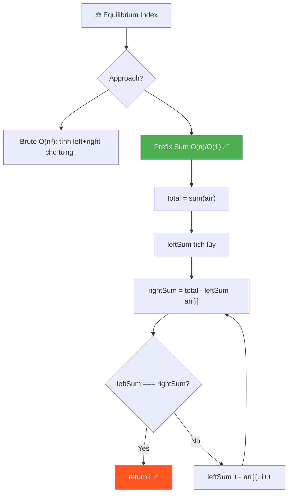

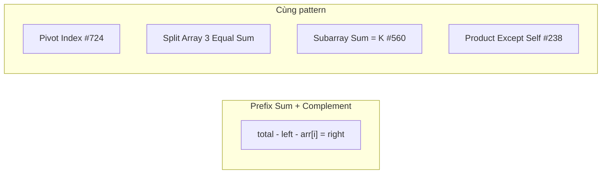

---

## R — Repeat & Clarify

🧠 _"rightSum = total - leftSum - arr[i]. Duyệt 1 pass, tích lũy leftSum. O(n)/O(1)!"_

> 🎙️ _"Find index i where sum of left elements = sum of right elements."_

### Clarification Questions

```
Q: arr[i] có tính vào left hay right không?
A: KHÔNG! arr[i] KHÔNG thuộc left cũng KHÔNG thuộc right!

Q: Nếu có nhiều equilibrium index thì sao?
A: Trả về FIRST index (index NHỎ NHẤT)

Q: Mảng rỗng hoặc 1 phần tử?
A: 1 phần tử → return 0 (left=0, right=0)
   Rỗng → return -1

Q: Không tìm thấy?
A: return -1

Q: Có số âm không?
A: CÓ! Mảng có thể chứa số âm → KHÔNG dùng binary search!

Q: Overflow?
A: JavaScript dùng floating point 64-bit → safe cho giá trị ≤ 2^53
```

### Tại sao bài này quan trọng?

```
  ┌──────────────────────────────────────────────────────────────┐
  │  Pattern: "Prefix Sum + Complement"                          │
  │    right = total - left - arr[i]                             │
  │    → KHÔNG CẦN tính right riêng!                            │
  │                                                              │
  │  Áp dụng:                                                    │
  │    Equilibrium Index (BÀI NÀY)                               │
  │    Pivot Index (#724 LeetCode — GIỐNG HỆT!)                 │
  │    Split Array 3 Equal Sum                                    │
  │    Subarray Sum = K (#560) — Prefix Sum + HashMap            │
  │    Product Except Self (#238) — cùng tư duy left/right       │
  │                                                              │
  │  🧠 TƯ DUY NỀN TẢNG:                                       │
  │    Khi cần biết "sum bên phải" → ĐỪNG tính riêng!            │
  │    → Dùng: right = total - left - current                    │
  │    → Biến O(n²) thành O(n)!                                  │
  └──────────────────────────────────────────────────────────────┘
```

---

## 🧠 Bản chất bài toán — Hiểu để NHỚ, không chỉ để GIẢI

### Equilibrium = "Cân bằng" = Điểm tựa

```
  Tưởng tượng mảng là 1 CÂY CÂN:

       arr[i] = điểm tựa
         ▲
  ┌──────┴──────┐
  │  leftSum    │  rightSum    │
  │  (bên trái) │  (bên phải)  │

  Equilibrium Index = vị trí đặt điểm tựa để 2 bên CÂN BẰNG!

  arr = [1, 2, 0, 3]

      i=2 (arr[2]=0):
        left  = arr[0] + arr[1] = 1 + 2 = 3
        right = arr[3] = 3
                  ▲
        ┌────────┴────────┐
        │  1 + 2 = 3     │  3          │
        │  leftSum = 3   │  rightSum=3  │ ← CÂN BẰNG! ✅

  💡 KEY: arr[i] KHÔNG nằm bên nào!
     leftSum + arr[i] + rightSum = total
```

### Công thức cốt lõi — Tại sao chỉ cần 1 phép trừ?

```
  📌 IDENTITY (đẳng thức):
     leftSum + arr[i] + rightSum = total

  → rightSum = total - leftSum - arr[i]

  🧠 Tại sao đẳng thức này LUÔN ĐÚNG?
     total = tổng TẤT CẢ phần tử
     Mọi phần tử thuộc đúng 1 trong 3 nhóm:
       1. Bên TRÁI i  → nằm trong leftSum
       2. CHÍNH NÓ i  → chính là arr[i]
       3. Bên PHẢI i  → nằm trong rightSum
     → 3 nhóm bao phủ hết → tổng 3 nhóm = total ✅

  📌 Ý NGHĨA THỰC TIỄN:
     Thay vì tính rightSum (cần iterate từ i+1 → n-1),
     ta DẪN XUẤT nó từ total - leftSum - arr[i]
     → CHỈ CẦN:
       1. total (tính 1 lần ở đầu)
       2. leftSum (tích lũy từ trái → phải)
     → KHÔNG CẦN loop thứ 2 cho rightSum!
```

### Tại sao leftSum tích lũy SAU khi check?

```
  ⚠️ ĐÂY LÀ ĐIỂM HAY NHẤT VÀ DỄ SAI NHẤT!

  Thứ tự ĐÚNG:
    1. Tính rightSum = total - leftSum - arr[i]
    2. So sánh leftSum === rightSum?
    3. leftSum += arr[i]   ← SAU KHI CHECK!

  🧠 Tại sao KHÔNG THỂ cộng TRƯỚC?

  Nếu cộng TRƯỚC (SAI ❌):
    leftSum += arr[i]     ← cộng arr[i] vào left
    rightSum = total - leftSum - arr[i]
    → leftSum đã BAO GỒM arr[i]
    → rightSum = total - (leftSum bao gồm arr[i]) - arr[i]
    → arr[i] bị TRỪ 2 LẦN! → SAI!

  Nếu cộng SAU (ĐÚNG ✅):
    rightSum = total - leftSum - arr[i]
    → leftSum CHƯA BAO GỒM arr[i] → đúng!
    → rightSum = phần còn lại bên phải → đúng!
    leftSum += arr[i]     ← cộng SAU, chuẩn bị cho i tiếp theo

  ┌──────────────────────────────────────────────────────────────┐
  │  CÂU HỎI HAY:                                               │
  │  "leftSum += arr[i] ở CUỐI loop, vậy khi i = n-1            │
  │   thì cộng vào để làm gì? Không dùng nữa mà?"              │
  │                                                              │
  │  → ĐÚNG! Lần cuối cộng xong → loop kết thúc → KHÔNG DÙNG   │
  │  → Nhưng vô hại! Và code GỌNG HƠN nếu để trong loop        │
  │  → Thay vì viết if (i < n - 1) leftSum += arr[i]            │
  │    → THỪA logic, không cần thiết!                            │
  └──────────────────────────────────────────────────────────────┘
```

### Visually — Mỗi bước leftSum thay đổi như thế nào?

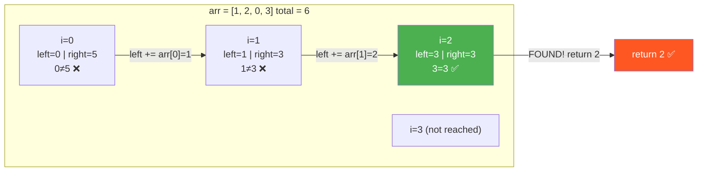

---

## 🧭 Luồng Suy Nghĩ — Từ đọc đề đến solution

> 💡 Phần này dạy bạn **CÁCH TƯ DUY** để tự giải bài, không chỉ biết đáp án.
> Mỗi bước đều có **lý do tại sao**, để bạn áp dụng cho bài khó hơn.

### Bước 1: Đọc đề → Gạch chân KEYWORDS

```
  Đề bài: "Find the FIRST index where sum of elements on left
           equals sum of elements on right."

  Gạch chân:
    "first index"       → Trả về FIRST! → return ngay khi tìm thấy
    "sum of left"       → Tổng tất cả phần tử TRƯỚC i
    "sum of right"      → Tổng tất cả phần tử SAU i
    "equals"            → leftSum === rightSum

  🧠 Tự hỏi: "arr[i] thuộc bên nào?"
    → KHÔNG BÊN NÀO! Nó là "điểm tựa"!
    → left = [0, i-1], right = [i+1, n-1]

  📌 Kỹ năng chuyển giao:
    Bất cứ khi nào đề nói "sum of left/right":
    → Nghĩ ngay: Prefix Sum!
    → Hỏi: "Có thể dẫn xuất 1 bên từ bên kia không?"
```

### Bước 2: Vẽ ví dụ NHỎ bằng tay → Tìm PATTERN

```
  Lấy ví dụ NHỎ: arr = [1, 2, 0, 3]  total = 6

  i=0:  left = []           → leftSum = 0
        right = [2, 0, 3]   → rightSum = 5     0 ≠ 5 ❌

  i=1:  left = [1]          → leftSum = 1
        right = [0, 3]      → rightSum = 3     1 ≠ 3 ❌

  i=2:  left = [1, 2]       → leftSum = 3
        right = [3]          → rightSum = 3     3 = 3 ✅ → return 2!

  🧠 Quan sát PATTERN:
    1. leftSum tăng DẦN (thêm arr[i-1] mỗi bước)
    2. rightSum giảm DẦN (bớt arr[i] mỗi bước)
    3. leftSum + arr[i] + rightSum = total LUÔN ĐÚNG!
    → Biết leftSum + total → suy ra rightSum!

  📌 Kỹ năng chuyển giao:
    LUÔN vẽ ví dụ trước khi code!
    → Pattern ở đây: "left tích lũy + right = complement"
```

### Bước 3: Nghĩ ra Brute Force (Solution đầu tiên)

```
  Từ quan sát: "tính leftSum và rightSum cho MỖI i"
  → Ý tưởng đầu tiên: 2 VÒNG LẶP LỒNG NHAU!

  Với mỗi i từ 0 → n-1:
    leftSum  = sum(arr[0..i-1])    ← 1 loop: O(n)
    rightSum = sum(arr[i+1..n-1])  ← 1 loop: O(n)
    if (leftSum === rightSum) return i

  💡 Đây là Brute Force — O(n²) time, O(1) space

  📌 Kỹ năng chuyển giao:
    Brute force thường là "cho mỗi i, tính XYZ" → O(n) × O(n) = O(n²)
    → Tối ưu = tìm cách tính XYZ không cần loop riêng!
```

### Bước 4: Tự hỏi "Có thể tránh tính lại từ đầu mỗi lần?"

```
  🧠 Nhìn lại brute force:
    i=0: leftSum = 0                → tính từ đầu
    i=1: leftSum = arr[0]           → tính lại từ đầu!
    i=2: leftSum = arr[0] + arr[1]  → tính lại từ đầu!

    → Mỗi lần TÍNH LẠI TỪ ĐẦU = lãng phí!
    → leftSum(i) = leftSum(i-1) + arr[i-1]
    → TÍCH LŨY! Chỉ cần CỘNG THÊM arr[i-1]!

  💡 Insight: leftSum là RUNNING SUM (tổng tích lũy)
    → Không cần tính lại, chỉ cần cộng thêm!
    → Tương tự: rightSum = total - leftSum - arr[i]
    → KHÔNG CẦN vòng lặp riêng cho rightSum!

  📌 Đây là bước QUYẾT ĐỊNH: O(n²) → O(n)!
```

### Bước 5: Tổng kết — Cây quyết định

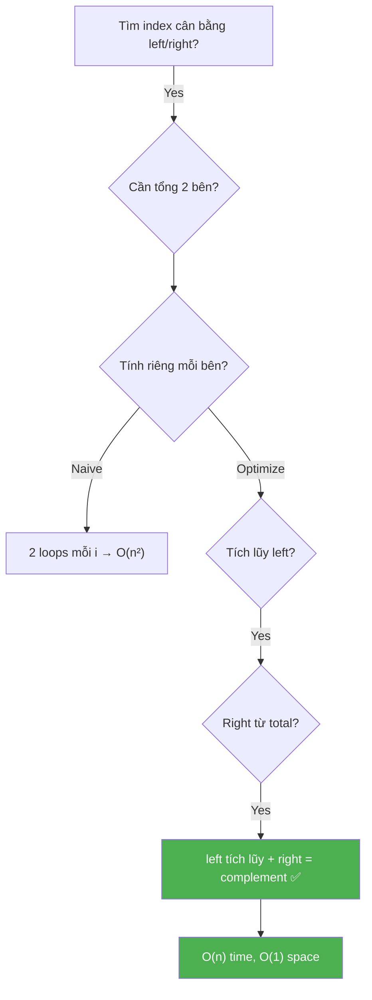

```
  📌 QUY TRÌNH TƯ DUY TỔNG QUÁT:

  ┌──────────────────────────────────────────────────────────────┐
  │  1. ĐỌC ĐỀ → gạch chân keywords                            │
  │     → "first index", "sum left = sum right"                  │
  │                                                              │
  │  2. VẼ VÍ DỤ NHỎ → tìm pattern                             │
  │     → Thấy: "left tích lũy, right = total - left - current" │
  │                                                              │
  │  3. BRUTE FORCE → 2 vòng lặp mỗi i                         │
  │     → O(n²) — chưa tốt                                      │
  │                                                              │
  │  4. OPTIMIZE: tích lũy + complement                          │
  │     → leftSum running sum + rightSum dẫn xuất → O(n)        │
  │                                                              │
  │  5. VERIFY → chạy lại ví dụ bằng tay                        │
  │     → Kiểm tra: leftSum cộng SAU khi check                  │
  └──────────────────────────────────────────────────────────────┘
```

---

## E — Examples

```
VÍ DỤ 1: Standard
  Input:  [1, 2, 0, 3]
  Output: 2
  Giải thích: left=[1,2]=3, right=[3]=3, eq tại i=2 ✅

VÍ DỤ 2: Không có equilibrium
  Input:  [1, 1, 1, 1]
  Output: -1
  i=0: left=0, right=3  ❌
  i=1: left=1, right=2  ❌
  i=2: left=2, right=1  ❌
  i=3: left=3, right=0  ❌

VÍ DỤ 3: Số âm
  Input:  [-7, 1, 5, 2, -4, 3, 0]
  Output: 3
  left=[-7,1,5]=-1, right=[-4,3,0]=-1 ✅

VÍ DỤ 4: 1 phần tử
  Input:  [1]
  Output: 0
  left=[], right=[]. leftSum=0=rightSum=0 ✅

VÍ DỤ 5: Equilibrium ở cuối
  Input:  [1, 3, 5, 2, 2]
  Output: 2
  left=[1,3]=4, right=[2,2]=4 ✅
```

### Minh họa trực quan — Quá trình duyệt

```
  arr = [-7, 1, 5, 2, -4, 3, 0]    total = 0

  Trạng thái ban đầu:
  ┌────┬───┬───┬───┬────┬───┬───┐
  │ -7 │ 1 │ 5 │ 2 │ -4 │ 3 │ 0 │   leftSum=0
  └────┴───┴───┴───┴────┴───┴───┘
    ↑
    i=0

  i=0: rightSum = 0 - 0 - (-7) = 7      left=0, right=7  ❌
       leftSum += -7 → leftSum = -7

  ┌────┬───┬───┬───┬────┬───┬───┐
  │ -7 │ 1 │ 5 │ 2 │ -4 │ 3 │ 0 │
  └────┴───┴───┴───┴────┴───┴───┘
    ✓   ↑
       i=1

  i=1: rightSum = 0 - (-7) - 1 = 6      left=-7, right=6  ❌
       leftSum += 1 → leftSum = -6

  i=2: rightSum = 0 - (-6) - 5 = 1      left=-6, right=1  ❌
       leftSum += 5 → leftSum = -1

  i=3: rightSum = 0 - (-1) - 2 = -1     left=-1, right=-1  ✅
  ┌────┬───┬───┬───┬────┬───┬───┐
  │ -7 │ 1 │ 5 │ 2 │ -4 │ 3 │ 0 │
  └────┴───┴───┴───┴────┴───┴───┘
   ──────────  ↑  ──────────────
    left=-1    │    right=-1
          EQUILIBRIUM!

  → return 3 ✅
```

---

## A — Approach

### Approach 1: Brute Force — O(n²)

```
  Ý tưởng: Với MỖI i, tính leftSum và rightSum riêng

  ┌─────────────────────────────────────────────────────────────┐
  │  for (i = 0 → n-1):                                        │
  │    leftSum  = sum(arr[0..i-1])    ← O(n) mỗi lần!         │
  │    rightSum = sum(arr[i+1..n-1])  ← O(n) mỗi lần!         │
  │    if (leftSum === rightSum) return i                       │
  │                                                             │
  │  → n iterations × O(n) mỗi lần = O(n²)                    │
  │                                                             │
  │  Time: O(n²)    Space: O(1)                                │
  │  → Đơn giản nhưng CHẬM!                                    │
  └─────────────────────────────────────────────────────────────┘

  Trace: arr = [1, 2, 0, 3]

    i=0: leftSum = 0
         rightSum = 2+0+3 = 5        0 ≠ 5 ❌
    i=1: leftSum = 1
         rightSum = 0+3 = 3          1 ≠ 3 ❌
    i=2: leftSum = 1+2 = 3
         rightSum = 3                 3 = 3 ✅ → return 2!

  ⚠️ VẤN ĐỀ: leftSum tại i=2 TÍNH LẠI 1+2 từ đầu!
     Lặp thừa! → Cần tích lũy!
```

### Approach 2: Prefix Array — O(n) time, O(n) space

```
  💡 Tạo mảng prefix sum trước, rồi tra cứu O(1)!

  ┌─────────────────────────────────────────────────────────────┐
  │  Bước 1: prefix[i] = arr[0] + arr[1] + ... + arr[i-1]     │
  │  Bước 2: leftSum = prefix[i]                                │
  │          rightSum = total - prefix[i] - arr[i]             │
  │                                                             │
  │  Time: O(n)    Space: O(n) ← mảng prefix!                  │
  │  → Nhanh hơn nhưng tốn space!                              │
  └─────────────────────────────────────────────────────────────┘

  arr    = [1, 2, 0, 3]    total = 6
  prefix = [0, 1, 3, 3]

  i=0: left = prefix[0] = 0,  right = 6-0-1 = 5    ❌
  i=1: left = prefix[1] = 1,  right = 6-1-2 = 3    ❌
  i=2: left = prefix[2] = 3,  right = 6-3-0 = 3    ✅ → return 2!

  ⚠️ VẤN ĐỀ: Cần O(n) space cho prefix array.
     Có thể bỏ mảng prefix không?
```

### Approach 3: Running Sum (Optimal) — O(n) time, O(1) space ✅

```
  💡 KEY INSIGHT: KHÔNG CẦN mảng prefix!
     leftSum chỉ cần 1 biến → tích lũy dần!

  ┌─────────────────────────────────────────────────────────────┐
  │  total = sum(arr)                     ← O(n) 1 lần         │
  │  leftSum = 0                                                │
  │                                                             │
  │  for i = 0 → n-1:                                          │
  │    rightSum = total - leftSum - arr[i]  ← O(1)!            │
  │    if (leftSum === rightSum) return i                       │
  │    leftSum += arr[i]                   ← tích lũy!         │
  │                                                             │
  │  return -1                                                  │
  │                                                             │
  │  Time: O(n)    Space: O(1) ← chỉ 2 biến!                  │
  └─────────────────────────────────────────────────────────────┘

  🧠 Tại sao O(1) space?
     Approach 2 cần prefix[] vì tra cứu prefix[i] ngẫu nhiên.
     Nhưng ta duyệt TUẦN TỰ từ trái → phải!
     → prefix[i] = prefix[i-1] + arr[i-1]
     → Chỉ cần GIÁ TRỊ TRƯỚC ĐÓ → 1 biến đủ!

  📌 QUYẾT ĐỊNH QUAN TRỌNG: leftSum hay rightSum tích lũy?
     → leftSum tích lũy TỰ NHIÊN HƠN (duyệt trái → phải)
     → rightSum DẪN XUẤT từ total (1 phép trừ)
     → Ngược lại cũng được, nhưng kém trực quan!
```

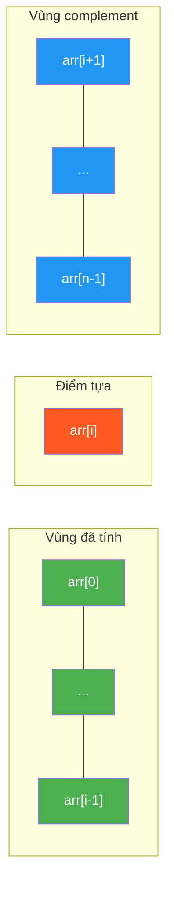

```
  🟩 Xanh lá  = leftSum (đã tích lũy)
  🟥 Đỏ       = arr[i] (điểm tựa, KHÔNG thuộc bên nào)
  🟦 Xanh dương = rightSum (= total - leftSum - arr[i])
```

---

## C — Code ✅

### Solution 1: Brute Force — O(n²)

```javascript
function equilibriumBrute(arr) {
  const n = arr.length;
  for (let i = 0; i < n; i++) {
    let leftSum = 0;
    for (let j = 0; j < i; j++) leftSum += arr[j];     // O(n)

    let rightSum = 0;
    for (let j = i + 1; j < n; j++) rightSum += arr[j]; // O(n)

    if (leftSum === rightSum) return i;
  }
  return -1;
}
```

```
  📝 Line-by-line:

  Line 3: for (let i = 0; i < n; i++)
    → Thử TỪNG vị trí i làm "điểm tựa"

  Line 4-5: for (let j = 0; j < i; j++) leftSum += arr[j]
    → Tính tổng tất cả phần tử TRƯỚC i
    → j chạy từ 0 đến i-1 (KHÔNG BAO GỒM i!)
    → Khi i=0: loop không chạy → leftSum = 0 ✅ (không có phần tử bên trái)

  Line 7-8: for (let j = i + 1; j < n; j++) rightSum += arr[j]
    → Tính tổng tất cả phần tử SAU i
    → j chạy từ i+1 đến n-1 (KHÔNG BAO GỒM i!)
    → Khi i=n-1: loop không chạy → rightSum = 0 ✅

  ⚠️ LÃNG PHÍ: leftSum và rightSum TÍNH LẠI TỪ ĐẦU mỗi lần!
```

### Solution 2: Prefix Array — O(n) time, O(n) space

```javascript
function equilibriumPrefix(arr) {
  const n = arr.length;
  const total = arr.reduce((a, b) => a + b, 0);

  // Xây prefix sum
  const prefix = new Array(n + 1).fill(0);
  for (let i = 0; i < n; i++) {
    prefix[i + 1] = prefix[i] + arr[i];
  }

  for (let i = 0; i < n; i++) {
    const leftSum = prefix[i];
    const rightSum = total - prefix[i + 1]; // prefix[i+1] = left + arr[i]
    if (leftSum === rightSum) return i;
  }
  return -1;
}
```

```
  📝 Line-by-line:

  Line 6: prefix = [0, 1, 3, 3, 6]  (cho arr=[1,2,0,3])
    → prefix[i] = sum(arr[0..i-1])
    → prefix[0] = 0 (tổng rỗng)
    → prefix[n] = total

  Line 12: leftSum = prefix[i]
    → Tổng tất cả phần tử trước i

  Line 13: rightSum = total - prefix[i + 1]
    → prefix[i+1] = leftSum + arr[i]
    → rightSum = total - leftSum - arr[i] ← cùng công thức!

  ⚠️ Tốn O(n) space cho prefix[]. Có thể bỏ!
```

### Solution 3: Running Sum — O(n)/O(1) ✅ (Optimal)

```javascript
function equilibriumIndex(arr) {
  const total = arr.reduce((a, b) => a + b, 0);
  let leftSum = 0;

  for (let i = 0; i < arr.length; i++) {
    const rightSum = total - leftSum - arr[i];
    if (leftSum === rightSum) return i;
    leftSum += arr[i]; // ⚠️ cộng SAU khi check!
  }

  return -1;
}
```

```
  📝 Line-by-line:

  Line 2: const total = arr.reduce((a, b) => a + b, 0)
    → Tính tổng toàn bộ mảng 1 LẦN DUY NHẤT
    → reduce: accumulator a bắt đầu từ 0, cộng dần b
    → O(n)

    🧠 Tại sao cần total?
       → Để DẪN XUẤT rightSum = total - leftSum - arr[i]
       → Không có total → phải tính rightSum riêng → O(n) mỗi lần!

  Line 3: let leftSum = 0
    → Ban đầu: KHÔNG có phần tử bên trái → leftSum = 0
    → Ý nghĩa: "tổng arr[0..i-1]" khi i=0 = tổng rỗng = 0

  Line 5: for (let i = 0; i < arr.length; i++)
    → Duyệt TUẦN TỰ từ trái → phải
    → Mỗi bước: kiểm tra i có phải equilibrium không

  Line 6: const rightSum = total - leftSum - arr[i]
    → ĐÂY là DÒNG QUAN TRỌNG NHẤT!
    → "Tổng bên phải = tổng tất cả - tổng bên trái - chính nó"
    → O(1) cho mỗi i! (thay vì O(n) trong brute force)

    📌 CHỨNG MINH:
       total = leftSum + arr[i] + rightSum   (đẳng thức)
       → rightSum = total - leftSum - arr[i]  (chuyển vế)

  Line 7: if (leftSum === rightSum) return i
    → Tìm thấy equilibrium? → return NGAY!
    → "First equilibrium index" → KHÔNG cần tìm tiếp

  Line 8: leftSum += arr[i]   ← ⚠️ SAU KHI CHECK!
    → Chuẩn bị leftSum cho bước tiếp theo
    → Tại i tiếp theo: leftSum sẽ BÀO GỒM arr[i] hiện tại
    → PHẢI SAU check! (lý do xem phần "bản chất" ở trên)

    🧠 Edge cases tự đúng:
       i=0:   leftSum=0 trước check → "không có gì bên trái" ✅
       i=n-1: rightSum = total - leftSum - arr[n-1]
              = tổng tất cả - tổng (n-1 phần tử đầu) - phần tử cuối
              = 0 → "không có gì bên phải" ✅

  Line 10: return -1
    → Duyệt hết mà KHÔNG TÌM THẤY → trả -1
```

### Trace CHI TIẾT: [-7, 1, 5, 2, -4, 3, 0]

```
  total = -7 + 1 + 5 + 2 + (-4) + 3 + 0 = 0
  leftSum = 0

  i=0 (arr[i]=-7):
    rightSum = 0 - 0 - (-7) = 7
    leftSum === rightSum?  0 === 7?  ❌
    leftSum += -7  →  leftSum = -7

  i=1 (arr[i]=1):
    rightSum = 0 - (-7) - 1 = 6
    leftSum === rightSum?  -7 === 6?  ❌
    leftSum += 1  →  leftSum = -6

  i=2 (arr[i]=5):
    rightSum = 0 - (-6) - 5 = 1
    leftSum === rightSum?  -6 === 1?  ❌
    leftSum += 5  →  leftSum = -1

  i=3 (arr[i]=2):
    rightSum = 0 - (-1) - 2 = -1
    leftSum === rightSum?  -1 === -1?  ✅ → return 3!

  ┌─────────────────────────────────────────────────────────┐
  │  Verification:                                           │
  │  left  = arr[0]+arr[1]+arr[2] = -7+1+5 = -1            │
  │  right = arr[4]+arr[5]+arr[6] = -4+3+0 = -1            │
  │  left === right → -1 === -1 ✅                          │
  └─────────────────────────────────────────────────────────┘
```

### Trace cho edge case: [1] (1 phần tử)

```
  total = 1
  leftSum = 0

  i=0 (arr[i]=1):
    rightSum = 1 - 0 - 1 = 0
    leftSum === rightSum?  0 === 0?  ✅ → return 0!

  🧠 Giải thích:
    → Không có phần tử bên trái → leftSum = 0
    → Không có phần tử bên phải → rightSum = 0
    → 0 = 0 → đúng! Phần tử duy nhất LUÔN là equilibrium!
```

### Trace cho edge case: [1, 1, 1, 1] (không có equilibrium)

```
  total = 4
  leftSum = 0

  i=0: rightSum = 4 - 0 - 1 = 3     0 ≠ 3  ❌  leftSum → 1
  i=1: rightSum = 4 - 1 - 1 = 2     1 ≠ 2  ❌  leftSum → 2
  i=2: rightSum = 4 - 2 - 1 = 1     2 ≠ 1  ❌  leftSum → 3
  i=3: rightSum = 4 - 3 - 1 = 0     3 ≠ 0  ❌  leftSum → 4

  → return -1

  🧠 Nhận xét:
    leftSum tăng đều: 0, 1, 2, 3
    rightSum giảm đều: 3, 2, 1, 0
    → leftSum và rightSum "đi ngược chiều" nhưng KHÔNG BAO GIỜ gặp nhau!
    → Vì tất cả giá trị bằng nhau VÀ n chẵn → không có trung điểm
```

### Trace cho edge case: [0, 0, 0] (toàn zeros)

```
  total = 0
  leftSum = 0

  i=0: rightSum = 0 - 0 - 0 = 0     0 === 0  ✅ → return 0!

  🧠 Mảng toàn zeros → MỌI index đều là equilibrium!
     Nhưng trả về FIRST → return 0
```

---

## ❌ Common Mistakes — Lỗi thường gặp

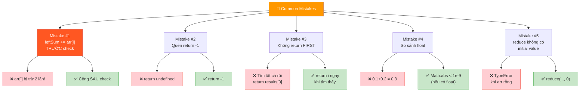

### Mistake 1: leftSum += arr[i] TRƯỚC khi check

```javascript
// ❌ SAI: leftSum bao gồm arr[i]!
for (let i = 0; i < arr.length; i++) {
  leftSum += arr[i];    // ← TRƯỚC! arr[i] vào leftSum!
  const rightSum = total - leftSum - arr[i];
  // → rightSum = total - (leftSum + arr[i]) - arr[i]
  // → arr[i] bị trừ 2 LẦN!
  if (leftSum === rightSum) return i;
}

// ✅ ĐÚNG: Cộng SAU
for (let i = 0; i < arr.length; i++) {
  const rightSum = total - leftSum - arr[i];
  if (leftSum === rightSum) return i;
  leftSum += arr[i];    // ← SAU!
}
```

```
  🧠 Ví dụ cụ thể cho sai lầm này:
    arr = [1, 2, 0, 3]  total = 6

    SAI (cộng trước):
      i=2: leftSum += arr[2] → leftSum = 1+2+0 = 3
           rightSum = 6 - 3 - 0 = 3     3 === 3? ✅
           → Đáp án ĐÚNG TÌNH CỜ! Vì arr[2] = 0!

      Nhưng thử arr = [2, 1, 1, 2]:  total = 6
      i=1: leftSum += arr[1] → leftSum = 2+1 = 3
           rightSum = 6 - 3 - 1 = 2     3 ≠ 2  ← SAI!
           → Đáng lẽ: left=2, right=3 → 2 ≠ 3

    → Cộng trước CHỈ đúng khi arr[i] = 0!
    → Với các giá trị khác → SAI HOÀN TOÀN!
```

### Mistake 2: Quên return -1

```javascript
// ❌ SAI: Không return -1 khi không tìm thấy
function equilibrium(arr) {
  const total = arr.reduce((a, b) => a + b, 0);
  let leftSum = 0;
  for (let i = 0; i < arr.length; i++) {
    const rightSum = total - leftSum - arr[i];
    if (leftSum === rightSum) return i;
    leftSum += arr[i];
  }
  // ← không return gì → return undefined!
}

// ✅ ĐÚNG: return -1 ở cuối
// ...
return -1;
```

```
  🧠 Tại sao quan trọng?
    → Khi KHÔNG CÓ equilibrium index
    → Hàm phải trả -1 (hoặc theo spec)
    → undefined gây bug ở caller!
```

### Mistake 3: Quên "return FIRST"

```javascript
// ❌ SAI: Thu thập TẤT CẢ rồi return cuối
function equilibrium(arr) {
  const results = [];
  // ... tìm tất cả equilibrium indices
  return results[0]; // ← phức tạp thừa!
}

// ✅ ĐÚNG: return NGAY khi tìm thấy
if (leftSum === rightSum) return i; // ← return FIRST!
```

```
  🧠 Đề nói "return FIRST equilibrium index"
    → return NGAY khi tìm thấy, KHÔNG tiếp tục!
    → Duyệt từ trái → phải → index đầu tiên tìm được = nhỏ nhất ✅
```

### Mistake 4: So sánh float

```javascript
// ⚠️ CẨN THẬN: Nếu arr có float
arr = [0.1, 0.2, 0.3]
// 0.1 + 0.2 = 0.30000000000000004 ≠ 0.3!

// Giải pháp (nếu có float):
if (Math.abs(leftSum - rightSum) < 1e-9) return i;
```

```
  🧠 Bài GfG: integers → KHÔNG CẦN lo!
    Nhưng nếu interviewer hỏi "Nếu có float thì sao?"
    → Biết dùng epsilon comparison = điểm cộng!
```

### Mistake 5: Dùng reduce không có initial value

```javascript
// ❌ SAI: reduce không có giá trị khởi tạo
const total = arr.reduce((a, b) => a + b);
// → Nếu arr = [] → TypeError: Reduce of empty array!

// ✅ ĐÚNG: luôn có initial value 0
const total = arr.reduce((a, b) => a + b, 0);
// → arr = [] → total = 0 → loop không chạy → return -1 ✅
```

---

## 📐 Invariant — Chứng minh tính đúng đắn

```
  📐 INVARIANT (bất biến) cho Running Sum approach:

  Tại ĐẦU mỗi iteration i:
    leftSum = Σ arr[j] cho j = 0, 1, ..., i-1
    (tổng tất cả phần tử TRƯỚC index i)

  Chứng minh bằng QUY NẠP:
  ┌──────────────────────────────────────────────────────────────────┐
  │  Base case: i = 0                                               │
  │    leftSum = 0 (khởi tạo)                                       │
  │    Σ arr[j] cho j = 0..(-1) = tổng rỗng = 0                    │
  │    → leftSum = 0 = Σ(empty) ✅                                  │
  │                                                                 │
  │  Inductive step: giả sử đúng tại i, chứng minh tại i+1         │
  │                                                                 │
  │    Tại đầu iteration i:                                         │
  │      leftSum = Σ arr[j] cho j=0..i-1        (giả thiết quy nạp) │
  │                                                                 │
  │    Cuối iteration i (sau dòng leftSum += arr[i]):               │
  │      leftSum = Σ arr[j] cho j=0..i-1 + arr[i]                  │
  │             = Σ arr[j] cho j=0..i                               │
  │                                                                 │
  │    Tại đầu iteration i+1:                                       │
  │      leftSum = Σ arr[j] cho j=0..i = Σ arr[j] cho j=0..(i+1)-1 │
  │    → Đúng tại i+1! ✅                                           │
  └──────────────────────────────────────────────────────────────────┘

  📐 Từ Invariant → CHỨNG MINH thuật toán ĐÚNG:

  Tại mỗi iteration i, khi check leftSum === rightSum:
    leftSum = Σ arr[j] cho j=0..i-1              (invariant)
    rightSum = total - leftSum - arr[i]
            = Σ arr[j] cho j=0..n-1 - Σ arr[j] cho j=0..i-1 - arr[i]
            = Σ arr[j] cho j=i+1..n-1            (đại số)

  → leftSum chính xác = tổng bên trái i
  → rightSum chính xác = tổng bên phải i
  → So sánh leftSum === rightSum là ĐÚNG ĐẮN! ∎

  📐 Completeness — Không bỏ sót:
    Thuật toán duyệt TẤT CẢ i từ 0 → n-1
    → Kiểm tra MỌI vị trí có thể
    → Nếu tồn tại equilibrium → CHẮC CHẮN tìm thấy
    → return FIRST (duyệt trái→phải) → đúng yêu cầu "first index"
```

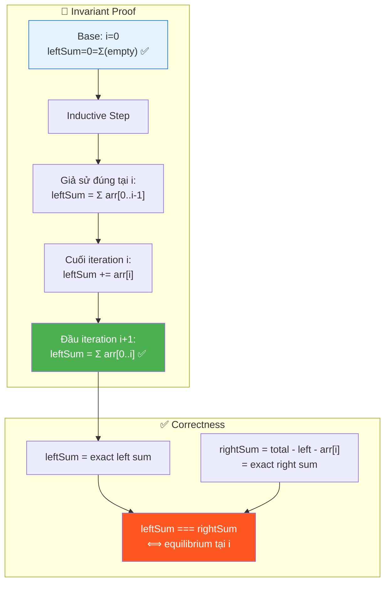

---

## O — Optimize

```
                     Time    Space    Passes    Khi nào dùng?
  ──────────────────────────────────────────────────────────────
  Brute Force        O(n²)   O(1)     1        Chỉ để giải thích
  Prefix Array       O(n)    O(n)     2        Khi cần query nhiều i
  Running Sum ✅     O(n)    O(1)     2*       Interview / Production

  * 2 passes: 1 cho total, 1 cho duyệt. Nhưng chỉ 2 lần duyệt O(n)!
```

### Có thể tối ưu hơn nữa không?

```
  Thời gian: KHÔNG! O(n) đã là optimal
    → Bắt buộc phải đọc MỌI phần tử ít nhất 1 lần
    → Chứng minh: Nếu skip arr[k] → không biết total đúng
      → Không thể tính rightSum cho mọi i → SAI!

  Space: KHÔNG! O(1) đã là optimal
    → Chỉ dùng 2 biến: total và leftSum

  Passes: CÓ THỂ giảm từ 2 → 1?
    → KHÔNG! Cần total TRƯỚC khi duyệt
    → Không biết total → không dẫn xuất được rightSum
    → 2 passes là tối thiểu cho approach này
```

### So sánh 3 approaches

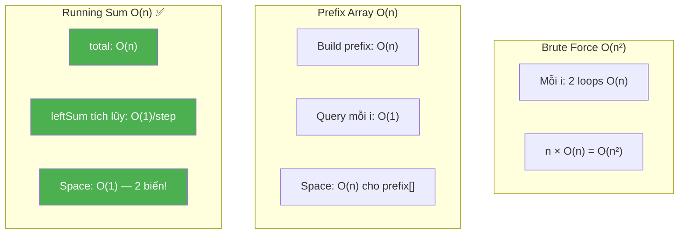

### Khi nào dùng Prefix Array thay Running Sum?

```
  ┌──────────────────────────────────────────────────────────────┐
  │  Running Sum (BÀI NÀY): duyệt 1 chiều, kiểm tra từng i    │
  │    → Chỉ cần leftSum tại bước hiện tại → 1 biến đủ!       │
  │                                                              │
  │  Prefix Array: khi cần query NGẪU NHIÊN                     │
  │    → "Tổng từ index L đến R?" → O(1) nếu có prefix!        │
  │    → Ví dụ: Subarray Sum = K (#560)                         │
  │    → Cần prefix[] vì query nhiều khoảng (L, R) khác nhau   │
  │                                                              │
  │  📌 QUY TẮC:                                                 │
  │    Duyệt tuần tự + chỉ cần "tổng đến hiện tại"?            │
  │    → Running Sum (1 biến)                                    │
  │    Cần tra cứu tổng bất kỳ đoạn [L..R]?                    │
  │    → Prefix Array (mảng)                                     │
  └──────────────────────────────────────────────────────────────┘
```

### Complexity chính xác — Đếm operations

```
  Running Sum approach:
    Pass 1 (tính total):
      n phép cộng (reduce)                    → n operations

    Pass 2 (duyệt + check):
      n phép trừ (total - leftSum - arr[i])   → 2n operations
      n phép so sánh (leftSum === rightSum)   → n operations
      ≤ n phép cộng (leftSum += arr[i])       → ≤ n operations

    TỔNG: n + 2n + n + n = 5n operations
    → O(n) với constant factor ≈ 5

  Brute Force:
    Mỗi i: 2 inner loops, mỗi loop tối đa n phần tử
    WORST: Σ(i=0..n-1) [i + (n-1-i)] = n(n-1)
    → O(n²) với constant factor ≈ 1 (nhưng quadratic!)

  📊 So sánh THỰC TẾ (n = 1,000,000):
    Running Sum: 5 × 10⁶ operations ≈ 5ms
    Brute Force: 10¹² operations ≈ 17 PHÚT! 😰
    → Running Sum nhanh hơn ~200,000×!

  📊 Memory THỰC TẾ (JavaScript V8):
    Running Sum: 2 biến number (16 bytes) → ~16 bytes
    Prefix Array: n+1 numbers (8 bytes each) → ~8MB cho n=10⁶
    → Running Sum tiết kiệm 500,000× memory!
```

### ❓ "Tại sao không Sort?"

```
  🧠 "Sort rồi check adjacent?"

  ❌ KHÔNG ÁP DỤNG cho bài này! Lý do:

  ┌──────────────────────────────────────────────────────────────┐
  │  Equilibrium phụ thuộc VỊ TRÍ, không chỉ GIÁ TRỊ!         │
  │                                                              │
  │  Ví dụ: arr = [1, 2, 0, 3]                                   │
  │  Sort → [0, 1, 2, 3]                                         │
  │  → Vị trí CŨ bị MẤT! Không biết equilibrium ở đâu!         │
  │                                                              │
  │  Equilibrium = "tổng BÊN TRÁI = tổng BÊN PHẢI"             │
  │  → BÊN TRÁI/PHẢI phụ thuộc THỨ TỰ NGUYÊN THỦY!            │
  │  → Sort thay đổi thứ tự → BÀI TOÁN ĐỔI NGHĨA!            │
  │                                                              │
  │  📌 Sort CHỈ hợp lý khi:                                     │
  │  1. Bài không phụ thuộc vị trí (e.g. Two Sum with values)   │
  │  2. Cần tìm closest pair / kth smallest                      │
  │  3. Đề cho phép sắp xếp lại mảng                            │
  │                                                              │
  │  → Bài này: VỊ TRÍ là THAM SỐ CHÍNH → KHÔNG SORT!         │
  └──────────────────────────────────────────────────────────────┘
```

---

## T — Test

```
Test Cases:
  [1, 2, 0, 3]                → 2      ✅ Standard
  [1, 1, 1, 1]                → -1     ✅ No equilibrium
  [-7, 1, 5, 2, -4, 3, 0]     → 3      ✅ Negative numbers
  [1]                          → 0      ✅ Single element
  [1, 3, 5, 2, 2]             → 2      ✅ Equilibrium in middle
  [0, 0, 0]                   → 0      ✅ All zeros (first index)
  [10, -10, 10, -10, 10]      → 4      ✅ Alternating +/-
  [2, 4, 2]                   → 1      ✅ Symmetric array
  [1, 2, 3]                   → -1     ✅ No equilibrium
  [0]                          → 0      ✅ Single zero
```

### Edge Cases giải thích

```
  ┌────────────────────────────────────────────────────────────────┐
  │  Single element:  leftSum=0, rightSum=0 → 0=0 → return 0     │
  │                   → Phần tử duy nhất LUÔN là equilibrium!     │
  │                                                                │
  │  All zeros:       Mọi index đều equilibrium!                   │
  │                   → return 0 (FIRST index)                     │
  │                                                                │
  │  Negative nums:   Công thức vẫn đúng!                          │
  │                   total có thể âm, 0, hoặc dương               │
  │                   → KHÔNG ảnh hưởng logic!                     │
  │                                                                │
  │  Equilibrium ở    i=0: leftSum=0, rightSum = total - arr[0]    │
  │  đầu hoặc cuối:  i=n-1: rightSum=0, leftSum = total - arr[n-1]│
  │                   → Code xử lý TỰ ĐỘNG, không cần đặc biệt!  │
  │                                                                │
  │  No equilibrium:  Duyệt hết → return -1                       │
  │                   → Loop kết thúc tự nhiên                     │
  └────────────────────────────────────────────────────────────────┘
```

---

## 🗣️ Interview Script

### 🎙️ Think Out Loud — Mô phỏng phỏng vấn thực

> ⚠️ Script này dạy cách **NÓI**, không phải cách CODE.
> Mỗi đoạn = cách bạn **PHÁT BIỂU** trong phỏng vấn thực!

```
  ╔══════════════════════════════════════════════════════════════╗
  ║  🕐 FULL INTERVIEW SIMULATION — 1h30 (90 phút)             ║
  ║                                                              ║
  ║  00:00-05:00  Introduction + Icebreaker         (5 min)     ║
  ║  05:00-45:00  Problem Solving                   (40 min)    ║
  ║  45:00-60:00  Deep Technical Probing            (15 min)    ║
  ║  60:00-75:00  Variations + Extensions           (15 min)    ║
  ║  75:00-85:00  System Design at Scale            (10 min)    ║
  ║  85:00-90:00  Behavioral + Q&A                  (5 min)     ║
  ╚══════════════════════════════════════════════════════════════╝
```

```
  ╔══════════════════════════════════════════════════════════════╗
  ║  PART 1: INTRODUCTION (00:00 — 05:00)                       ║
  ╚══════════════════════════════════════════════════════════════╝

  👤 "Tell me about yourself and a time you optimized
      a computation that seemed inherently quadratic."

  🧑 "I'm a frontend engineer with [X] years of experience.
      One relevant project: I was building a data visualization
      dashboard that displayed running totals across time-series
      segments. Users could click any point on the timeline
      and see whether the data to the left of that point
      and the data to the right were 'balanced.'

      My initial implementation computed the left sum and right
      sum separately for each click — two array traversals
      per query. With thousands of data points and high
      interaction frequency, this was noticeably laggy.

      I realized that the total sum was fixed. If I precomputed
      it once, I could derive the right sum as total minus
      the left sum minus the clicked element — turning each
      query from O of n to O of 1.

      Then I took it further: as the user dragged along the
      timeline, the left sum changed by just one element
      per step. So I maintained a running accumulation
      instead of recomputing from scratch.

      That 'complement identity' — right equal total minus left
      minus current — is exactly the core of the equilibrium
      index problem."

  👤 "Great context. Let's dive in."
```

```
  ╔══════════════════════════════════════════════════════════════╗
  ║  PART 2: PROBLEM SOLVING (05:00 — 45:00)                   ║
  ╚══════════════════════════════════════════════════════════════╝

  ──────────────── 05:00 — Clarify (4 phút) ────────────────

  👤 "Find the first index where the sum of elements to its left
      equals the sum of elements to its right."

  🧑 "Let me make sure I understand the definition precisely.

      For an index i, the LEFT sum is the sum of all elements
      from index 0 to i minus 1. The RIGHT sum is the sum
      of all elements from index i plus 1 to n minus 1.

      The element at index i itself is NOT included in either sum.
      It acts as a PIVOT — a divider between two halves.

      If no such index exists, I return negative 1.

      A few edge cases to confirm: for a single-element array,
      the left sum is 0 — empty sum — and the right sum is also 0.
      So a single element is always an equilibrium index.

      For i equal 0, the left sum is 0.
      For i equal n minus 1, the right sum is 0.
      Both boundaries are valid candidates.

      And the array can contain negative numbers?"

  👤 "Correct on all points, including negatives."

  ──────────────── 09:00 — Brute Force (3 phút) ────────────────

  🧑 "The brute force approach: for each index i, I compute
      two separate sums.

      Left sum: iterate from 0 to i minus 1 and accumulate.
      Right sum: iterate from i plus 1 to n minus 1 and accumulate.

      If left sum equal right sum, return i.

      Each sum computation is O of n, and I do this for each
      of n indices. Total: O of n squared.

      For n equal a million, that's a trillion operations.
      I need to do better."

  ──────────────── 12:00 — Key Insight bằng LỜI (5 phút) ────────────────

  🧑 "Here's my key observation.

      The total sum of the array is FIXED. I can compute it
      once in O of n. Call it total.

      Now, at any index i:
      total equal left sum plus arr at i plus right sum.

      Rearranging: right sum equal total minus left sum
      minus arr at i.

      This is a COMPLEMENT IDENTITY — if I know two of the
      three parts, I can derive the third in O of 1.

      So I don't need to compute the right sum from scratch
      each time. I just need the left sum, which I can
      maintain as a RUNNING SUM.

      As I move from index i to i plus 1, the left sum
      increases by exactly arr at i. It's incremental —
      one addition per step instead of a full traversal.

      So my algorithm is:
      Step one: compute total in one pass.
      Step two: scan left to right with a running left sum.
      At each index, derive right sum equal total minus
      left sum minus arr at i.
      If left sum equal right sum, return i.
      Then add arr at i to left sum for the next step.

      Two passes total: O of n time, O of 1 space."

  👤 "Why do you add arr at i to left sum AFTER the check?"

  🧑 "Because at index i, the left sum should represent
      the sum of elements STRICTLY BEFORE i — from 0 to i minus 1.
      The element at i is the pivot and belongs to neither side.

      If I added arr at i BEFORE the check, left sum would
      include the pivot. Then the right sum computation:
      total minus left sum minus arr at i
      would subtract arr at i TWICE — once because it's
      already in left sum, and once explicitly.
      The right sum would be wrong.

      So the order is: USE the current left sum to check,
      THEN update it. I call this the 'use-then-update' pattern.
      It appears in Fibonacci, sliding window, and any
      algorithm with a running accumulator."

      📌 MẸO: Nói "use-then-update pattern" — shows you
      recognize a recurring design principle, not just
      a one-off trick.

  ──────────────── 17:00 — Trace bằng LỜI (6 phút) ────────────────

  🧑 "Let me trace through an example.
      Array: one, three, five, two, two. Total equal 13.
      Left sum starts at 0.

      i equal 0, arr at 0 is 1.
      Right sum: 13 minus 0 minus 1 equal 12.
      Is 0 equal 12? No.
      Update left sum: 0 plus 1 equal 1.

      i equal 1, arr at 1 is 3.
      Right sum: 13 minus 1 minus 3 equal 9.
      Is 1 equal 9? No.
      Update left sum: 1 plus 3 equal 4.

      i equal 2, arr at 2 is 5.
      Right sum: 13 minus 4 minus 5 equal 4.
      Is 4 equal 4? YES!
      Return 2.

      Let me verify: left side is arr at 0 plus arr at 1
      equal 1 plus 3 equal 4. Right side is arr at 3
      plus arr at 4 equal 2 plus 2 equal 4.
      Both equal 4 — correct!"

  🧑 "Now a 'not found' case.
      Array: one, two, three. Total equal 6.

      i equal 0: right equal 6 minus 0 minus 1 equal 5.
      0 versus 5? No. Left becomes 1.

      i equal 1: right equal 6 minus 1 minus 2 equal 3.
      1 versus 3? No. Left becomes 3.

      i equal 2: right equal 6 minus 3 minus 3 equal 0.
      3 versus 0? No. Left becomes 6.

      Loop ends. Return negative 1.

      The issue: the prefix sum grows faster than the suffix
      sum shrinks. They never meet. This happens when the array
      has a 'heavy' right side."

  ──────────────── 23:00 — Negative numbers (4 phút) ────────────────

  🧑 "An important note about negative numbers.

      Array: negative 7, one, five, two, negative 4, three, zero.
      Total equal 0.

      i equal 0: right equal 0 minus 0 minus negative 7 equal 7.
      0 versus 7? No. Left becomes negative 7.

      i equal 1: right equal 0 minus negative 7 minus 1 equal 6.
      Negative 7 versus 6? No. Left becomes negative 6.

      i equal 2: right equal 0 minus negative 6 minus 5 equal 1.
      Negative 6 versus 1? No. Left becomes negative 1.

      i equal 3: right equal 0 minus negative 1 minus 2
      equal negative 1.
      Negative 1 equal negative 1? YES! Return 3.

      Verification: left equal negative 7 plus 1 plus 5
      equal negative 1. Right equal negative 4 plus 3 plus 0
      equal negative 1. Correct!

      The formula works with negatives because it's
      purely algebraic — no absolute values, no sign assumptions.
      Left sum can DECREASE when adding a negative element.
      This means left sum is NOT monotonic — I cannot use
      binary search."

  ──────────────── 27:00 — Viết code, NÓI từng block (3 phút) ────────────

  🧑 "Let me code this up.

      [Vừa viết vừa nói:]

      First, compute the total using reduce with initial
      value 0. The initial value handles empty arrays —
      without it, reduce on an empty array throws a TypeError.

      Initialize left sum to 0.

      Loop from i equal 0 to arr dot length minus 1.

      Inside the loop, THE CORE LINE:
      right sum equal total minus left sum minus arr at i.
      This is the complement identity — deriving the right
      from what we already know in O of 1.

      Check: if left sum equal-equal-equal right sum, return i.

      Then update: left sum plus-equal arr at i.
      This prepares left sum for the next iteration.

      After the loop, return negative 1.

      That's seven lines. Two variables, two passes,
      one complement formula."

      📌 MẹO: Nói "complement identity" khi viết dòng core.
      Interviewer sees you understand the MATHEMATICAL principle,
      not just the code trick.

  ──────────────── 30:00 — Edge Cases (3 phút) ────────────────

  👤 "Walk me through the edge cases."

  🧑 "Single element: [5]. Total equal 5.
      i equal 0: right equal 5 minus 0 minus 5 equal 0.
      Left sum 0 equal right sum 0? Yes! Return 0.
      A single element always has empty left and right — both 0.

      All zeros: [0, 0, 0]. Total equal 0.
      Every index is an equilibrium!
      i equal 0: right equal 0 minus 0 minus 0 equal 0.
      0 equal 0? Yes! Return 0 — the FIRST index.

      Equilibrium at the boundary: [0, 1, negative 1].
      Total equal 0. i equal 0: right equal 0 minus 0 minus 0
      equal 0. 0 equal 0? Yes! Return 0.
      The element at index 0 has no left side — left sum is 0,
      and right sum is 1 plus negative 1 equal 0.

      No equilibrium: [1, 2, 3]. As I traced earlier,
      the prefix grows too fast. Return negative 1.

      Floating point: the problem uses integers, so exact
      comparison is safe. If it used floats, I'd need epsilon
      comparison — Math dot abs of left minus right less than
      1e-9. Good to mention but not needed here."

  ──────────────── 33:00 — Complexity (2 phút) ────────────────

  🧑 "Time: O of n. Two passes — one for total, one for scanning.
      Each pass is O of n. Total: 2n operations.

      Space: O of 1. Just two variables: total and left sum.

      This is provably OPTIMAL for both time and space.
      For time: I must read every element at least once —
      if I skip any element, I don't know the total,
      and I can't compute right sum correctly.
      For space: O of 1 is the minimum possible."

  ──────────────── 35:00 — Why 2 passes? (3 phút) ────────────────

  👤 "Can you do it in a single pass?"

  🧑 "For this specific approach, no.

      I need the total BEFORE I can derive right sum at any
      position. Without total, the formula
      right sum equal total minus left sum minus arr at i
      simply doesn't work.

      Could I compute total on the fly? The problem is that
      at index i, I don't yet know the sum of elements after i.
      I'd need to look ahead, which requires either
      a second pass or extra space.

      There IS a single-pass approach: compute left sum AND
      right sum simultaneously, starting from both ends.
      But this doesn't help with the equilibrium check because
      the left pointer's sum and the right pointer's sum
      don't directly compare to what I need.

      Two passes of O of n is still O of n. The constant
      factor difference is negligible for any practical input."

  ──────────────── 38:00 — Prefix Array alternative (4 phút) ────

  👤 "What if you needed to answer multiple equilibrium queries?"

  🧑 "Great question! If the user can query 'is index i
      an equilibrium?' many times, the running sum approach
      requires a full scan for each query — O of n per query.

      Instead, I'd precompute a PREFIX SUM array.
      prefix at j equal arr at 0 plus arr at 1 plus dot dot dot
      plus arr at j minus 1.

      Then: left sum at i equal prefix at i.
      Right sum at i equal total minus prefix at i minus arr at i.
      Each query is O of 1!

      The trade-off: O of n space for the prefix array,
      but O of 1 per query instead of O of n.

      For the interview problem — one scan, return first match —
      the running sum approach is better. No extra space,
      same O of n time.

      But for a system that handles repeated queries on the same
      array, the prefix array is the right investment."

  ──────────────── 42:00 — Why not binary search? (3 phút) ────

  👤 "Left sum increases as i moves right. Can you binary search?"

  🧑 "Only if the array contains ALL non-negative numbers!

      With non-negatives, left sum is monotonically increasing
      and right sum is monotonically decreasing. They have
      at most one intersection point. Binary search works.

      But with negative numbers, left sum can DECREASE
      when adding a negative element. It oscillates up and down.
      There could be zero, one, or MULTIPLE intersection points.

      Example: [10, negative 20, 15, 5, negative 10].
      Left sum at each index: 0, 10, negative 10, 5, 10.
      Not monotonic! Binary search would miss intersections.

      So for the general case with negatives:
      linear scan is necessary. O of n is optimal."
```

```
  ╔══════════════════════════════════════════════════════════════╗
  ║  PART 3: DEEP TECHNICAL PROBING (45:00 — 60:00)            ║
  ╚══════════════════════════════════════════════════════════════╝

  ──────────────── 45:00 — Invariant proof (5 phút) ────────────────

  👤 "Can you prove your algorithm is correct?"

  🧑 "Sure! I'll use a loop invariant.

      My invariant: at the START of iteration i,
      left sum equal the sum of arr at 0 through arr at i minus 1.

      Base case: i equal 0.
      Left sum is 0, which is the sum of an empty range.
      The sum of zero elements is 0. True.

      Inductive step: assume it holds at the start of iteration i.
      At the end of iteration i, I execute
      left sum plus-equal arr at i.
      So at the start of iteration i plus 1:
      left sum equal sum of arr at 0 through i minus 1
      plus arr at i
      equal sum of arr at 0 through i
      equal sum of arr at 0 through i-plus-1 minus 1.
      This is exactly the invariant for iteration i plus 1. True.

      Now, given this invariant, at each iteration:
      right sum equal total minus left sum minus arr at i
      equal sum of entire array minus sum of arr at 0 through i minus 1
      minus arr at i
      equal sum of arr at i plus 1 through n minus 1.

      So left sum and right sum are EXACTLY the left and right
      partition sums at index i. The comparison is correct.

      And since I iterate all indices from 0 to n minus 1,
      I check every possible equilibrium point.
      If one exists, I find it. QED."

  ──────────────── 50:00 — Strict equality (3 phút) ────────────────

  👤 "You used triple equals. Why not double equals?"

  🧑 "In JavaScript, double equals performs TYPE COERCION.
      For example, 0 double-equal false is true,
      and '' double-equal 0 is true.

      For this problem, both left sum and right sum are always
      numbers, so double equals would actually work correctly.
      But using triple equals is a DEFENSIVE practice —
      it prevents subtle bugs if the types ever diverge
      due to refactoring or unexpected inputs.

      In code reviews and interviews, triple equals signals
      that I'm deliberate about type safety. It costs nothing
      and prevents an entire category of bugs."

  ──────────────── 53:00 — Reduce with initial value (3 phút) ────────────

  👤 "You said reduce needs an initial value. Can you elaborate?"

  🧑 "If I call arr dot reduce with just a callback and no
      initial value, it uses the first element as the accumulator
      and starts from the second element. For a non-empty array,
      this gives the correct sum.

      BUT for an EMPTY array, there's no first element to use
      as accumulator. JavaScript throws a TypeError:
      'Reduce of empty array with no initial value.'

      By passing 0 as the initial value, the accumulator starts
      at 0 and the callback processes all elements from index 0.
      For an empty array, the callback never runs, and reduce
      returns the initial value 0.

      This makes the code robust: total equal 0 for an empty array,
      the loop doesn't execute, and I correctly return negative 1.

      It's a small detail, but in production it prevents
      uncaught exceptions on edge-case inputs."

  ──────────────── 56:00 — Complement pattern family (4 phút) ────────────

  👤 "You called this a 'complement identity.' Where else
      does this pattern appear?"

  🧑 "Everywhere!

      Product Except Self — LeetCode 238.
      Instead of sums, I compute left product and right product.
      But the complement is trickier: I can't just divide total
      product by arr at i because arr at i might be zero.
      So I maintain BOTH left and right product arrays.

      Circular Subarray Sum — LeetCode 918.
      The maximum circular subarray is the complement of the
      minimum non-circular subarray. If total sum is S
      and min subarray sum is M, then max circular equal S minus M.
      Same complement identity!

      Subarray Sum Equal K — LeetCode 560.
      I look for a prefix sum such that current prefix minus
      some earlier prefix equal k. That's complement:
      earlier prefix equal current prefix minus k.
      I use a HashMap to look up the complement.

      The GENERAL PATTERN: if I know the WHOLE and one PART,
      I can derive the OTHER PART in O of 1.
      Whole minus known part equal unknown part.
      This avoids recomputing the unknown part from scratch."
```

```
  ╔══════════════════════════════════════════════════════════════╗
  ║  PART 4: VARIATIONS (60:00 — 75:00)                         ║
  ╚══════════════════════════════════════════════════════════════╝

  ──────────────── 60:00 — All equilibrium indices (3 phút) ────────────────

  👤 "What if you need ALL equilibrium indices, not just the first?"

  🧑 "Simple modification: instead of returning immediately,
      I push each matching index into a results array
      and return it at the end.

      The time complexity stays O of n — I still visit each
      element once. Space becomes O of k where k is the number
      of equilibrium indices.

      The interesting question is: how many equilibrium indices
      can an array have? For an all-zeros array of length n,
      EVERY index is an equilibrium — left sum 0 equal right sum 0.
      So k can be as large as n."

  ──────────────── 63:00 — Weighted equilibrium (4 phút) ────────────────

  👤 "What if elements have weights, and you want the weighted
      sum on each side to be equal?"

  🧑 "If each element has a separate weight, I'd compute
      weighted sum as arr at i times weight at i.
      The complement identity still holds:
      weighted right equal weighted total minus weighted left
      minus arr at i times weight at i.

      Same algorithm, just with weighted sums.

      A more interesting variant: what if I want the left AVERAGE
      to equal the right AVERAGE? That's a different constraint.
      Left sum over i equal right sum over n minus 1 minus i.
      Cross-multiplying: left sum times the count on the right
      equal right sum times the count on the left.
      Still solvable in O of n with running sums."

  ──────────────── 67:00 — Split array into 3 equal parts (4 phút) ────

  👤 "What about splitting the array into three equal sum parts?"

  🧑 "LeetCode 1013! Now I need two split points instead of one.

      The total sum must be divisible by 3. If not, impossible.
      Target for each part: total divided by 3.

      I scan left to right with a running sum. Each time the running
      sum reaches the target, I increment a counter and reset.

      But I need TWO splits, so I need the counter to reach 2
      before the last element — the third part is implied.

      The key difference from equilibrium: equilibrium has ONE
      pivot point with the pivot excluded from both sums.
      Three-way split has TWO cut points with ALL elements
      belonging to some part.

      Same underlying technique: prefix sum and complement.
      But the logic for dividing into parts is more involved."

  ──────────────── 71:00 — Product Except Self (4 phút) ────────────────

  👤 "How does this relate to Product Except Self?"

  🧑 "Product Except Self — LeetCode 238 — is the MULTIPLICATIVE
      analog of equilibrium!

      For equilibrium: right sum equal total minus left sum
      minus arr at i. Division-free.

      For Product Except Self: you might think
      result at i equal total product divided by arr at i.
      But this fails when arr at i is zero!

      So instead, I build left products and right products:
      left at i equal product of arr at 0 through i minus 1.
      right at i equal product of arr at i plus 1 through n minus 1.
      result at i equal left at i times right at i.

      I can optimize space to O of 1 by:
      First pass: fill result with left products.
      Second pass: traverse right to left with a running
      right product, multiplying into result.

      The structural parallel is clear:
      Equilibrium: left SUM and right SUM.
      Product Except Self: left PRODUCT and right PRODUCT.
      Both decompose the array at each index into
      'what's before me' and 'what's after me.'"
```

```
  ╔══════════════════════════════════════════════════════════════╗
  ║  PART 5: SYSTEM DESIGN AT SCALE (75:00 — 85:00)            ║
  ╚══════════════════════════════════════════════════════════════╝

  ──────────────── 75:00 — Load balancing (5 phút) ────────────────

  👤 "Where does the equilibrium concept appear in system design?"

  🧑 "Several places!

      First — DATA PARTITIONING.
      When sharding a database, I want to split the data so
      that each shard handles roughly equal 'load.'
      If load is proportional to the number of records,
      finding the equilibrium point tells me where to split
      so the left shard and right shard have equal work.

      Second — LOAD BALANCER SPLITTING.
      Given a list of servers with different capacities,
      I can model their weights as an array. The equilibrium
      index tells me where to split the server list so that
      the total capacity on each side is balanced.

      Third — AUDIO and VIDEO PROCESSING.
      In audio normalization, I might want to find the point
      where the 'energy' — sum of amplitudes — on the left
      equals the energy on the right. This helps identify
      silences, transitions, or natural break points.

      Fourth — FINANCIAL ANALYSIS.
      Given a sequence of daily profits and losses,
      the equilibrium index represents the day where
      the cumulative profit before equals cumulative profit after.
      It's a 'break-even' point."

  ──────────────── 80:00 — Streaming prefix sums (5 phút) ────────────────

  👤 "What if the data is streaming and you need to maintain
      the equilibrium dynamically?"

  🧑 "This is significantly harder!

      If I append a new element to the end of the array,
      the total changes, which affects the right sum
      at every position. Left sums are unaffected,
      but the equilibrium point can shift.

      For a stream of length n, naively recomputing the
      equilibrium after each append is O of n per update.

      A better approach: maintain the prefix sum array
      and the total. When a new element arrives:
      new total equal old total plus new element.
      Append new prefix sum equal old prefix sum plus new element.

      But I still need to RE-SCAN to find where
      prefix at i equal half of new total minus arr at i.
      That's O of n per query in the worst case.

      For amortized constant-time updates, I'd need
      a balanced BST or segment tree on the prefix sums
      to binary search for the equilibrium condition.
      But that only works for non-negative arrays
      where prefix sums are monotonic.

      For general arrays with negatives, maintaining the
      equilibrium dynamically is fundamentally O of n
      per update because the prefix sums aren't sorted."
```

```
  ╔══════════════════════════════════════════════════════════════╗
  ║  PART 6: BEHAVIORAL + Q&A (85:00 — 90:00)                  ║
  ╚══════════════════════════════════════════════════════════════╝

  ──────────────── 85:00 — Reflection (3 phút) ────────────────

  👤 "What would you take away from this problem?"

  🧑 "Three things.

      First, the COMPLEMENT IDENTITY pattern.
      If I know the whole and one part, I can derive the other
      part in O of 1 without recomputing. This converts
      O of n per query to O of 1 per query,
      and O of n squared overall to O of n.
      The same pattern drives Product Except Self,
      circular subarray, and Subarray Sum Equal K.

      Second, 'USE-THEN-UPDATE' ordering in accumulator loops.
      The left sum must be checked BEFORE being updated
      because the current element is the pivot, not part of
      either side. This sequencing issue appears everywhere:
      Kadane's extends before or after checking,
      sliding windows check before adding,
      and counting sorts accumulate before querying.
      Getting the ORDER right is often more important
      than getting the FORMULA right.

      Third, the importance of NEGATIVE NUMBERS as a
      disqualifier for binary search. My first instinct
      with any 'find the crossing point' problem is
      to binary search. But negatives make the prefix sum
      non-monotonic, which breaks binary search.
      In interviews, this is a key insight to vocalize —
      it shows I understand the PRECONDITIONS of algorithms."

  ──────────────── 88:00 — Questions (2 phút) ────────────────

  👤 "Any questions for me?"

  🧑 "A few!

      First — does your team work with data partitioning
      or sharding? I'm curious if a 'balanced split' calculation
      like this shows up in your infrastructure.

      Second — when you evaluate candidates on this type of problem,
      what distinguishes a strong answer from a great one?
      Is it the optimization, the proof, or the edge case handling?

      Third — what's the most interesting use of prefix sums
      your team has encountered in production?"

  👤 "Excellent questions! I liked how you explained the complement
      identity as a general principle and connected it to
      Product Except Self and circular subarray.
      The invariant proof was thorough.
      We'll be in touch!"
```

```
  ╔══════════════════════════════════════════════════════════════╗
  ║  ⭐ 8 MẸO NÓI CHUYỆN TRONG PHỎNG VẤN (Equilibrium)       ║
  ╚══════════════════════════════════════════════════════════════╝

  📌 MẸO #1: Name the mathematical principle
     ❌ "rightSum = total - leftSum - arr[i]."
     ✅ "This uses the COMPLEMENT IDENTITY — if I know
         the whole and one part, I derive the rest in O of 1.
         Total minus left minus pivot equal right."

  📌 MẸO #2: Explain the ordering with a CONCRETE mistake
     ✅ "If I add arr at i to leftSum BEFORE checking,
         leftSum includes the pivot. Then rightSum equals
         total minus left minus arr at i, which subtracts
         the pivot TWICE. The formula breaks.
         So: CHECK first, then UPDATE."

  📌 MẸO #3: Trace with narrative, not just numbers
     ✅ "At index 2, element is 5. Left sum is 4.
         Right sum: 13 minus 4 minus 5 equal 4.
         Four equal four! The left side — one plus three —
         perfectly BALANCES the right side — two plus two."

  📌 MẹO #4: Address negative numbers proactively
     ✅ "Negative numbers are fine — the formula is purely
         algebraic. But they mean left sum is NOT monotonic,
         which DISQUALIFIES binary search.
         I must scan linearly."

  📌 MẸO #5: Single element = always equilibrium
     ✅ "A single element has empty left and empty right.
         Both sums are 0 — the identity element of addition.
         So it's always an equilibrium. My code handles this
         naturally: left sum 0 equal right sum 0."

  📌 MẸO #6: Connect to the prefix sum family
     ✅ "This is part of the PREFIX SUM family:
         Equilibrium: complement of running sum.
         Pivot Index #724: identical problem.
         Product Except Self: multiplicative version.
         Subarray Sum equal K: prefix plus HashMap.
         Three Equal Parts: prefix with reset."

  📌 MẸO #7: Explain WHY 2 passes are necessary
     ✅ "I need the total BEFORE I can derive right sum.
         Without the total, the complement formula doesn't work.
         So pass one computes total, pass two scans.
         Two passes of O of n is still O of n."

  📌 MẸO #8: Articulate the space-time insight
     ✅ "Prefix array gives O of 1 per query at O of n space.
         Running sum gives O of n per full scan at O of 1 space.
         For a single equilibrium search, running sum wins.
         For repeated queries on the same array, prefix wins.
         Choosing the right one depends on the access pattern."
```

### Pattern & Liên kết

```
  PREFIX SUM + COMPLEMENT pattern!

  leftSum  = tổng tích lũy từ trái
  rightSum = total - leftSum - arr[i]  (COMPLEMENT!)

  Bài tương tự dùng CÙNG pattern:
    Pivot Index (#724)     → GIỐNG HỆT bài này!
    Split Array 3 Equal    → 2 điểm chia thay vì 1
    Subarray Sum = K #560  → prefix + HashMap
    Product Except Self    → left product × right product

  → TẤT CẢ dùng "tổng/tích tích lũy + dẫn xuất phần còn lại"!
```

### Pivot Index #724 — So sánh

```
  🧠 Pivot Index #724 (LeetCode) = GIỐNG HỆT Equilibrium Index!

  Khác biệt DUY NHẤT:
  ┌──────────────────────────────────────────────────────────────┐
  │  GfG Equilibrium:  return -1 nếu không tìm thấy            │
  │  LeetCode Pivot:   return -1 nếu không tìm thấy            │
  │                                                              │
  │  → CÙNG ĐỀ, CÙNG CODE, CÙNG LOGIC!                        │
  │  → Giải 1 bài = giải được cả 2!                             │
  └──────────────────────────────────────────────────────────────┘

  📌 Interview tip:
  Nếu interviewer hỏi "Pivot Index" → viết ĐÚNG code equilibrium!
  Nói: "This is also known as the Equilibrium Index problem."
  → Chứng tỏ bạn hiểu bài ở mức khái niệm, không chỉ thuộc đề!
```

---

## 🔬 Deep Dive — Giải thích CHI TIẾT từng dòng code

> 💡 Phần này phân tích **từng dòng code** để bạn hiểu **TẠI SAO** viết như vậy,
> không chỉ **viết gì**. Mỗi dòng đều có lý do thiết kế.

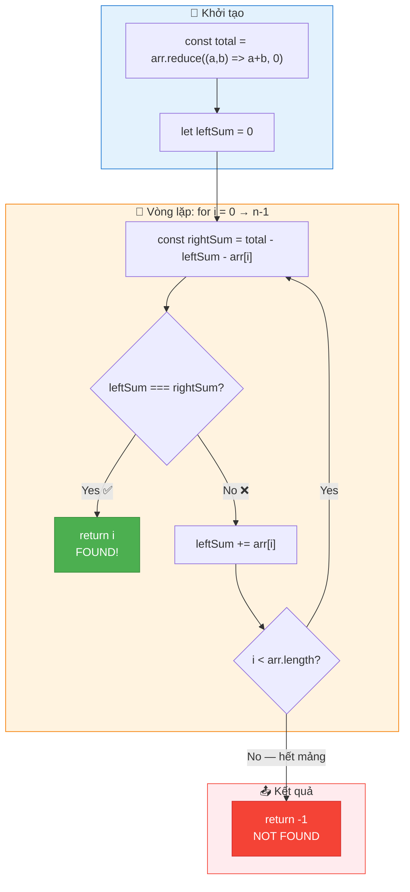

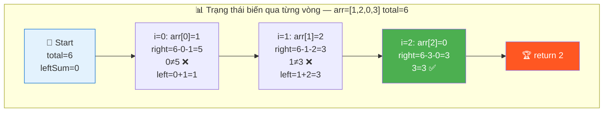

### Code đầy đủ với annotation

```javascript
function equilibriumIndex(arr) {
  // ═══════════════════════════════════════════════════════════════
  // DÒNG 1: Tính TỔNG toàn bộ mảng — nền tảng của complement
  // ═══════════════════════════════════════════════════════════════
  //
  // TẠI SAO cần total?
  //   → Để DẪN XUẤT rightSum từ total - leftSum - arr[i]
  //   → Không có total → phải tính rightSum riêng → O(n) mỗi lần!
  //   → Với total → rightSum = O(1) mỗi lần!
  //
  // TẠI SAO dùng reduce thay vì for loop?
  //   → Ngắn gọn hơn, idiomatic JavaScript
  //   → reduce((a, b) => a + b, 0):
  //     a = accumulator (bắt đầu từ 0)
  //     b = phần tử hiện tại
  //     Mỗi bước: a = a + b → tích lũy tổng
  //
  // TẠI SAO initial value là 0?
  //   → Nếu KHÔNG có 0: arr=[] → TypeError!
  //   → Với 0: arr=[] → reduce trả 0 → total=0 → loop không chạy → -1 ✅
  //
  // TRADE-OFF:
  //   ✅ reduce: ngắn, rõ ý đồ "tính tổng"
  //   ⚠️ for loop: debug dễ hơn (nhìn được từng bước)
  //   📌 Interview: cả 2 cách đều OK, chọn cái nào thoải mái
  //
  const total = arr.reduce((a, b) => a + b, 0);

  // ═══════════════════════════════════════════════════════════════
  // DÒNG 2: Khởi tạo leftSum = 0
  // ═══════════════════════════════════════════════════════════════
  //
  // TẠI SAO let mà không phải const?
  //   → leftSum sẽ THAY ĐỔI (tích lũy) trong vòng lặp
  //   → const cho giá trị KHÔNG ĐỔI, let cho giá trị THAY ĐỔI
  //
  // TẠI SAO = 0?
  //   → Khi i=0: không có phần tử nào bên trái
  //   → "Tổng rỗng" = 0 (identity element của phép cộng)
  //   → Mathematically: Σ(empty set) = 0
  //
  // Ý NGHĨA: leftSum = sum(arr[0..i-1])
  //   → Tại mỗi bước i, leftSum chứa tổng tất cả phần tử TRƯỚC i
  //   → Cập nhật: leftSum += arr[i] SAU khi check (chuẩn bị cho i+1)
  //
  let leftSum = 0;

  // ═══════════════════════════════════════════════════════════════
  // DÒNG 3-8: Vòng lặp chính — Duyệt và kiểm tra từng vị trí
  // ═══════════════════════════════════════════════════════════════
  //
  // TẠI SAO duyệt từ TRÁI → PHẢI?
  //   → leftSum tích lũy TỰ NHIÊN theo chiều này
  //   → Nếu duyệt phải → trái: rightSum tích lũy, leftSum dẫn xuất
  //     (cũng được, nhưng kém trực quan)
  //
  // TẠI SAO duyệt TẤT CẢ phần tử?
  //   → Bất kỳ vị trí nào cũng CÓ THỂ là equilibrium
  //   → Không thể skip (không có monotonicity để binary search!)
  //   → Vì mảng có thể chứa SỐ ÂM → leftSum có thể giảm!
  //
  for (let i = 0; i < arr.length; i++) {

    // ─────────────────────────────────────────────────────────────
    // DÒNG 4: Tính rightSum bằng COMPLEMENT — DÒNG QUAN TRỌNG NHẤT
    // ─────────────────────────────────────────────────────────────
    //
    // CÔNG THỨC: rightSum = total - leftSum - arr[i]
    //
    // CHỨNG MINH:
    //   total = sum(arr[0..n-1])
    //         = sum(arr[0..i-1]) + arr[i] + sum(arr[i+1..n-1])
    //         = leftSum + arr[i] + rightSum
    //   → rightSum = total - leftSum - arr[i]   (chuyển vế)
    //
    // TẠI SAO O(1)?
    //   → Chỉ 2 phép trừ! Không cần loop!
    //   → Brute force cần O(n) cho mỗi rightSum → đây là cải tiến chính!
    //
    // TẠI SAO thứ tự: total - leftSum - arr[i]?
    //   → Toán học: thứ tự trừ không quan trọng
    //   → Nhưng đọc code: "từ total, trừ đi left, trừ đi current"
    //     → Rõ ý đồ "phần còn lại bên phải"
    //
    const rightSum = total - leftSum - arr[i];

    // ─────────────────────────────────────────────────────────────
    // DÒNG 5: So sánh và return nếu cân bằng
    // ─────────────────────────────────────────────────────────────
    //
    // TẠI SAO === thay vì ==?
    //   → === là strict equality (so sánh CÙNG kiểu + cùng giá trị)
    //   → == có type coercion → có thể gây bug khó thấy
    //   → Best practice: LUÔN dùng ===
    //
    // TẠI SAO return NGAY (early return)?
    //   → Đề yêu cầu "FIRST equilibrium index"
    //   → Duyệt trái → phải → index đầu tiên tìm được = NHỎ NHẤT ✅
    //   → Không cần tìm tiếp! Tiết kiệm thời gian!
    //
    // ĐẶC BIỆT: leftSum < 0 VÀ rightSum < 0 vẫn có thể bằng nhau!
    //   → Ví dụ: [-7, 1, 5, 2, -4, 3, 0] → left=-1, right=-1 ✅
    //   → Code KHÔNG cần xử lý đặc biệt cho số âm!
    //
    if (leftSum === rightSum) return i;

    // ─────────────────────────────────────────────────────────────
    // DÒNG 6: Update leftSum — PHẢI Ở SAU CHECK!
    // ─────────────────────────────────────────────────────────────
    //
    // CÂU HỎI QUAN TRỌNG: Tại sao KHÔNG đặt ở đầu loop?
    //
    // Nếu ĐẶT Ở ĐẦU (❌ SAI):
    //   leftSum += arr[i];    ← arr[i] nằm trong leftSum!
    //   rightSum = total - leftSum - arr[i]
    //           = total - (leftSum_cũ + arr[i]) - arr[i]
    //           = total - leftSum_cũ - 2×arr[i]  ← arr[i] bị TRỪ 2 LẦN!
    //
    // ĐẶT Ở CUỐI (✅ ĐÚNG):
    //   rightSum = total - leftSum - arr[i]  ← leftSum CHƯA có arr[i]
    //   leftSum += arr[i]                    ← SAU check, chuẩn bị cho i+1
    //
    // INSIGHT SÂU: Thứ tự thao tác trong loop:
    //   1. DÙNG leftSum hiện tại → tính rightSum
    //   2. KIỂM TRA cân bằng
    //   3. CẬP NHẬT leftSum cho bước tiếp theo
    //   → Pattern "use-then-update" (dùng trước, cập nhật sau)
    //
    // TƯƠNG TỰ: Fibonacci, Running Max, Sliding Window
    //   → Tất cả đều "dùng state hiện tại" rồi mới "cập nhật state"
    //
    leftSum += arr[i];
  }

  // ═══════════════════════════════════════════════════════════════
  // DÒNG 9: Không tìm thấy → return -1
  // ═══════════════════════════════════════════════════════════════
  //
  // TẠI SAO -1 mà không phải null/undefined/false?
  //   → -1 là convention cho "index not found" trong nhiều ngôn ngữ
  //   → Giống: indexOf, findIndex đều trả -1
  //   → -1 không phải valid index → dễ phân biệt
  //
  // Khi nào đến dòng này?
  //   → Duyệt HẾT mảng mà KHÔNG có i nào leftSum === rightSum
  //   → Ví dụ: [1, 1, 1, 1] → left và right không bao giờ gặp
  //
  return -1;
}
```

### Trace CHI TIẾT dạng bảng — [1, 3, 5, 2, 2]

```
  total = 1 + 3 + 5 + 2 + 2 = 13
  leftSum = 0

  ┌───────┬─────────┬──────────────────────┬───────────────┬────────────┬─────────────┐
  │ Vòng  │ arr[i]  │  rightSum            │ leftSum ===   │ Kết quả   │  leftSum    │
  │  i    │         │  = total-left-arr[i] │ rightSum?     │           │  (sau)      │
  ├───────┼─────────┼──────────────────────┼───────────────┼────────────┼─────────────┤
  │  0    │   1     │  13 - 0 - 1 = 12     │ 0 === 12? ❌  │ continue  │  0+1 = 1    │
  │  1    │   3     │  13 - 1 - 3 = 9      │ 1 === 9?  ❌  │ continue  │  1+3 = 4    │
  │  2    │   5     │  13 - 4 - 5 = 4      │ 4 === 4?  ✅  │ RETURN 2! │  ─          │
  │  3    │   2     │  (not reached)       │               │           │             │
  │  4    │   2     │  (not reached)       │               │           │             │
  └───────┴─────────┴──────────────────────┴───────────────┴────────────┴─────────────┘

  Verification cho i=2:
    left  = arr[0] + arr[1] = 1 + 3 = 4       ✅
    right = arr[3] + arr[4] = 2 + 2 = 4       ✅
    left === right → 4 === 4 ✅
```

### Trace dạng bảng — IMPOSSIBLE case [10, -10, 10, -10, 10]

```
  total = 10 + (-10) + 10 + (-10) + 10 = 10
  leftSum = 0

  ┌───────┬─────────┬──────────────────────┬───────────────┬────────────┬─────────────┐
  │  i    │ arr[i]  │  rightSum            │ left===right? │ Kết quả   │  leftSum    │
  ├───────┼─────────┼──────────────────────┼───────────────┼────────────┼─────────────┤
  │  0    │  10     │  10-0-10 = 0         │ 0 === 0?  ✅  │ RETURN 0! │  ─          │
  └───────┴─────────┴──────────────────────┴───────────────┴────────────┴─────────────┘

  🧠 Equilibrium ở i=0!
    left = [] = 0 (tổng rỗng)
    right = [-10, 10, -10, 10] = 0
    → 0 === 0 ✅

  📌 Edge case: equilibrium ở BIÊN (i=0 hoặc i=n-1)
     Code xử lý TỰ ĐỘNG nhờ leftSum=0 ban đầu!
```

---

## 🧮 Chứng minh Toán học — Tại sao Complement Identity đúng

> 💡 Phần này giải thích BẢN CHẤT SỐ HỌC sâu hơn, giúp bạn hiểu thay vì chỉ nhớ.

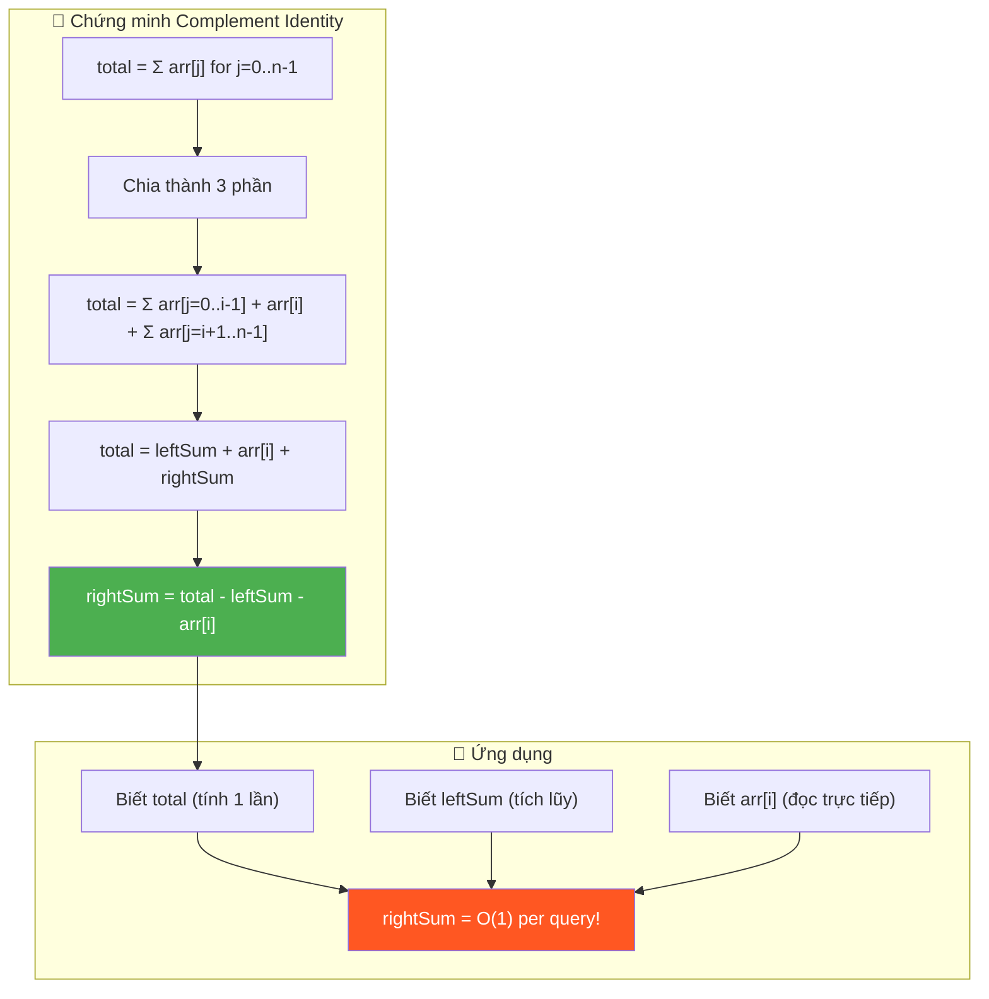

### Chứng minh chặt chẽ

```
  📐 CHỨNG MINH:

  Cho arr = [a₀, a₁, ..., aₙ₋₁], tổng total = Σᵢ aᵢ

  ── Tại một vị trí i bất kỳ (0 ≤ i ≤ n-1) ──

  Định nghĩa:
    leftSum(i)  = Σ{j=0}^{i-1} aⱼ    (tổng các phần tử trước i)
    rightSum(i) = Σ{j=i+1}^{n-1} aⱼ   (tổng các phần tử sau i)

  Phân hoạch (Partition):
    Tập {0, 1, ..., n-1} = {0..i-1} ∪ {i} ∪ {i+1..n-1}
    Ba tập RỜI NHAU (disjoint) và PHỦI HẾT (exhaustive)

  Do đó:
    total = Σ{j=0}^{n-1} aⱼ
          = Σ{j=0}^{i-1} aⱼ + aᵢ + Σ{j=i+1}^{n-1} aⱼ
          = leftSum(i) + aᵢ + rightSum(i)

  Chuyển vế:
    rightSum(i) = total - leftSum(i) - aᵢ   ∎

  ── Tính chất tích lũy của leftSum ──

  leftSum(0)   = Σ(empty) = 0
  leftSum(i+1) = leftSum(i) + aᵢ

  → leftSum là RUNNING SUM: chỉ cần cộng thêm aᵢ mỗi bước!
  → KHÔNG cần tính lại từ đầu!

  ═══════════════════════════════════════════════════════════
   KẾT LUẬN:
   Với total đã biết + leftSum tích lũy:
     rightSum = total - leftSum - arr[i]  (O(1) per query)
   Thay vì: rightSum = Σ{j=i+1}^{n-1} arr[j]  (O(n) per query)
   → Tiết kiệm: O(n) mỗi lần → tổng: O(n²) → O(n)
  ═══════════════════════════════════════════════════════════
```

### Tại sao KHÔNG dùng Binary Search?

```
  🧠 CÂU HỎI HAY: "leftSum tăng, rightSum giảm → dùng binary search?"

  ❌ Trả lời: KHÔNG! Vì mảng có thể chứa SỐ ÂM!

  Ví dụ phản chứng:
    arr = [10, -20, 15, 5, -10]   total = 0

    i=0: left=0,   right=-10    ← right < left
    i=1: left=10,  right=10     ← left < right... rồi right > left!?
    i=2: left=-10, right=-5     ← left GIẢM! (vì arr[1]=-20)
    i=3: left=5,   right=-10
    i=4: left=10,  right=0

  leftSum: 0, 10, -10, 5, 10   ← KHÔNG monotone! (lên xuống!)
  rightSum: -10, 10, -5, -10, 0  ← KHÔNG monotone!

  → Vì leftSum KHÔNG đơn điệu → binary search KHÔNG ÁP DỤNG!
  → Phải duyệt TUẦN TỰ O(n)

  📌 Khi nào binary search cho sum?
    → Chỉ khi mảng TOÀN SỐ DƯƠNG hoặc đã sort
    → Khi đó prefix sum monotone increasing → OK!
    → Bài này: có số âm → NO!
```

---

## 🔄 Alternative Approaches — So sánh các cách tiếp cận

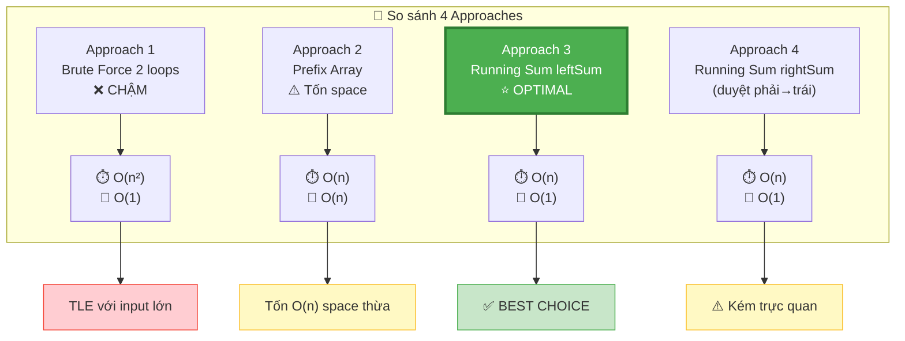

### Approach 4: Duyệt PHẢI → TRÁI (rightSum tích lũy)

```javascript
// ✅ TƯƠNG ĐƯƠNG Approach 3, nhưng ngược chiều
function equilibriumRightToLeft(arr) {
  const total = arr.reduce((a, b) => a + b, 0);
  let rightSum = 0;

  for (let i = arr.length - 1; i >= 0; i--) {
    const leftSum = total - rightSum - arr[i];
    if (leftSum === rightSum) return i; // ⚠️ KHÔNG phải "first"!
    rightSum += arr[i];
  }
  return -1;
}
```

```
  ⚠️ VẤN ĐỀ: Bài yêu cầu "FIRST equilibrium index" (nhỏ nhất)!
     Duyệt phải → trái tìm được LAST equilibrium index trước!
     → Cần duyệt HẾT rồi track min index → phức tạp thêm!

  Khi nào dùng chiều ngược?
    → Khi đề hỏi "LAST equilibrium index"
    → Hoặc khi cần tìm TẤT CẢ equilibrium indices

  📌 Trong phỏng vấn: LUÔN dùng trái → phải (Approach 3)
     → Tự nhiên hơn
     → Trả về FIRST index tự động!
```

### Approach 5: Dùng 2×leftSum thay rightSum — Elegant trick

```javascript
// ✅ TRICK: leftSum === rightSum ⟺ 2×leftSum + arr[i] === total
function equilibriumTrick(arr) {
  const total = arr.reduce((a, b) => a + b, 0);
  let leftSum = 0;

  for (let i = 0; i < arr.length; i++) {
    // leftSum === (total - leftSum - arr[i])
    // 2 * leftSum === total - arr[i]
    // 2 * leftSum + arr[i] === total
    if (2 * leftSum + arr[i] === total) return i;
    leftSum += arr[i];
  }
  return -1;
}
```

```
  🧠 CHỨNG MINH:
    leftSum === rightSum
    leftSum === total - leftSum - arr[i]
    2 × leftSum === total - arr[i]
    2 × leftSum + arr[i] === total        ← ĐIỀU KIỆN MỚI!

  Ưu điểm:
    ✅ Không cần biến rightSum riêng
    ✅ 1 phép nhân + 1 phép cộng + 1 so sánh (thay vì 2 phép trừ + 1 so sánh)
    ✅ Code ngắn hơn 1 dòng

  Nhược điểm:
    ❌ Kém trực quan (interviewer có thể hỏi "tại sao ×2?")
    ❌ Tiềm ẩn integer overflow NẾU giá trị lớn (2×leftSum có thể vượt 2^53)

  📌 Interview tip:
    NÊN biết trick này để MENTION khi interviewer hỏi "có cách nào khác?"
    NHƯNG dùng Approach 3 làm code chính (rõ ràng hơn)
```

### So sánh tất cả approaches

```
  ┌───────────────────────────────────────────────────────────────────────────┐
  │  Approach         │ Time   │ Space │ Passes │ Pros           │ Cons       │
  ├───────────────────────────────────────────────────────────────────────────┤
  │  Brute Force      │ O(n²)  │ O(1)  │ 1      │ Đơn giản       │ Chậm!     │
  │  (2 inner loops)  │        │       │        │                │ TLE!      │
  ├───────────────────────────────────────────────────────────────────────────┤
  │  Prefix Array     │ O(n)   │ O(n)  │ 2      │ Tra cứu O(1)   │ Tốn space │
  │                   │        │       │        │ cho mọi i      │ O(n)      │
  ├───────────────────────────────────────────────────────────────────────────┤
  │  Running Sum ✅   │ O(n)   │ O(1)  │ 2      │ Optimal!       │           │
  │  ← KHUYẾN KHÍCH  │        │       │        │ Rõ ràng        │ Không có  │
  ├───────────────────────────────────────────────────────────────────────────┤
  │  Right-to-Left    │ O(n)   │ O(1)  │ 2      │ Tìm LAST index │ Không     │
  │                   │        │       │        │                │ first!    │
  ├───────────────────────────────────────────────────────────────────────────┤
  │  2×leftSum trick  │ O(n)   │ O(1)  │ 2      │ Compact        │ Kém trực  │
  │                   │        │       │        │ Ít biến hơn    │ quan      │
  └───────────────────────────────────────────────────────────────────────────┘

  📌 Kết luận: Running Sum (Approach 3) là BEST CHOICE cho phỏng vấn!
```

---

## 🧠 Think Out Loud — Quá trình tư duy từ ZERO đến SOLUTION

> 🎙️ Phần này mô phỏng ĐÚNG cách một Senior Engineer suy nghĩ khi gặp bài này,
> bao gồm cả những "ngõ cụt" và cách quay lại đúng hướng.

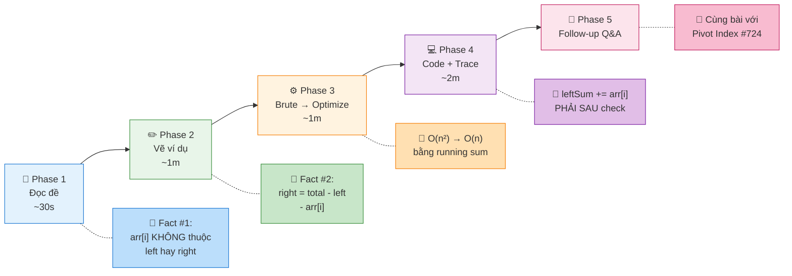

### Phase 1: Đọc đề — 30 giây đầu

```
  🧠 "Find first index where left sum equals right sum..."

  Ghi ra giấy ngay:
    ✏️ "sum of LEFT = sum of RIGHT"
    ✏️ "FIRST index" → return ngay khi tìm thấy
    ✏️ "arr[i] NOT included in either sum" → 3 phần!
    ✏️ "return -1 if not found"

  🧠 "Ok, n phần tử chia thành 3 nhóm: left, pivot, right."
  🧠 "Cần tìm i sao cho left = right. Classic prefix sum problem!"
  🧠 "Fact #1 locked in: arr[i] là partition point, không thuộc bên nào."
```

### Phase 2: Vẽ ví dụ — 1 phút

```
  Tự tạo ví dụ NHỎ:
    arr = [1, 2, 0, 3]

  🧠 "Thử từng i:"
    i=0: left=0,       right=2+0+3=5    → 0≠5 ❌
    i=1: left=1,       right=0+3=3      → 1≠3 ❌
    i=2: left=1+2=3,   right=3          → 3=3 ✅ FOUND at 2!
    i=3: left=1+2+0=3, right=0          → 3≠0 ❌

  🧠 "Thấy rồi! Brute force = tính left & right cho MỖI i."
  🧠 "Nhưng khoan... total = 1+2+0+3 = 6."
  🧠 "i=2: left=3, arr[2]=0, right = 6-3-0 = 3. BINGO!"
  🧠 "→ right = total - left - arr[i]. Fact #2 locked in!"
```

### Phase 3: Brute → Optimize — 1 phút

```
  🧠 "Brute force: mỗi i, 2 inner loops tính left + right → O(n²)."
  🧠 "Optimize: left tích lũy, right dẫn xuất từ total."
  🧠 "→ left chỉ cần 1 biến, right = total - left - arr[i]."
  🧠 "→ O(n) time, O(1) space. 2 passes: 1 tính total, 1 duyệt."

  🧠 "Có thể 1 pass? KHÔNG! Cần total trước khi duyệt."
  🧠 "O(n) đã optimal — phải đọc mọi phần tử để biết total."

  🧠 "⚠️ Cẩn thận: left += arr[i] PHẢI SAU khi check!"
  🧠 "Nếu trước: arr[i] vào left → right bị trừ arr[i] 2 lần!"
```

### Phase 4: Code + Trace — 2 phút

```
  🧠 "Viết code... xong. Tự trace trong đầu:"

  arr = [-7, 1, 5, 2, -4, 3, 0]  total = 0

  i=0: right = 0-0-(-7) = 7     0≠7   left→-7
  i=1: right = 0-(-7)-1 = 6    -7≠6   left→-6
  i=2: right = 0-(-6)-5 = 1    -6≠1   left→-1
  i=3: right = 0-(-1)-2 = -1   -1=-1  ✅ return 3!

  🧠 "Verify: left = -7+1+5 = -1, right = -4+3+0 = -1. Correct!"
  🧠 "Handles negative numbers naturally. No edge case bug."
  🧠 "Done. ~4 minutes total for easy problem."
```

### Phase 5: Nếu interviewer hỏi tiếp — Sẵn sàng

```
  Q: "Có thể có nhiều equilibrium index không?"
  A: "Có! Ví dụ [0,0,0] → mọi index đều là equilibrium.
      Ta return FIRST (nhỏ nhất) vì duyệt trái→phải."

  Q: "Nếu muốn tìm TẤT CẢ equilibrium indices?"
  A: "Thay return i bằng push vào result array.
      Vẫn O(n) time, O(k) space với k = số equilibrium indices."

  Q: "Bài này giống bài nào trên LeetCode?"
  A: "Pivot Index #724 — giống HỆT! Cùng đề, cùng code, cùng logic.
      Cũng liên quan tới Split Array 3 Equal Sum (dùng 2 equilibrium points)."

  Q: "Nếu mảng CỰC LỚN (streaming, không fit memory)?"
  A: "Cần 2 pass → khó streaming vì cần total trước.
      Option 1: Đọc file 2 lần (pass 1: total, pass 2: check)
      Option 2: Nếu biết total trước → 1 pass streaming OK.
      Option 3: Dùng 2×leftSum + arr[i] === total trick."

  Q: "Tại sao không binary search?"
  A: "Vì mảng có số âm → leftSum/rightSum KHÔNG monotone.
      Binary search cần monotonicity. Phải linear scan."
```

---

## 📚 Bài tập liên quan — Practice Problems

### Progression Path: Easy → Hard

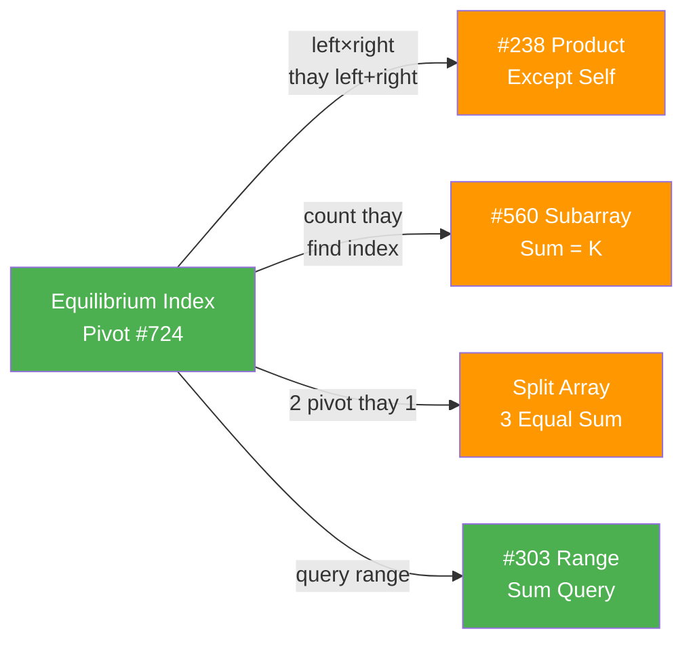

### 1. Pivot Index (#724) — Easy (GIỐNG HỆT!)

```
  Đề: Find the pivot index — leftSum equals rightSum.
  → CÙNG ĐỀ, CÙNG CODE, CÙNG LOGIC!

  function pivotIndex(nums) {
    const total = nums.reduce((a, b) => a + b, 0);
    let leftSum = 0;
    for (let i = 0; i < nums.length; i++) {
      if (leftSum === total - leftSum - nums[i]) return i;
      leftSum += nums[i];
    }
    return -1;
  }

  📌 Khác biệt DUY NHẤT:
     GfG: hàm tên equilibriumIndex
     LC:  hàm tên pivotIndex
     → CÙNG 1 BÀI! Copy-paste đổi tên!
```

### 2. Product Except Self (#238) — Medium

```
  Đề: Với mỗi i, tính tích TẤT CẢ phần tử TRỪ arr[i]
  → CÙNG tư duy left/right, nhưng dùng NHÂN thay CỘNG!

  function productExceptSelf(nums) {
    const n = nums.length;
    const result = new Array(n);

    // Pass 1: leftProduct tích lũy
    let leftProduct = 1;
    for (let i = 0; i < n; i++) {
      result[i] = leftProduct;
      leftProduct *= nums[i];
    }

    // Pass 2: rightProduct tích lũy (ngược)
    let rightProduct = 1;
    for (let i = n - 1; i >= 0; i--) {
      result[i] *= rightProduct;
      rightProduct *= nums[i];
    }

    return result;
  }

  📌 So sánh với Equilibrium:
    Equilibrium: rightSum = total - leftSum - arr[i]
    Product:     KHÔNG thể "trừ" → cần 2 pass (trái + phải)
    → Equilibrium dùng complement (1 biến)
    → Product dùng 2 running values (left pass + right pass)

  📌 Tại sao không dùng total_product / arr[i]?
    → arr[i] có thể = 0! Division by zero!
    → Nếu có 2+ zeros → tất cả result = 0
    → Left×Right approach TRÁNH chia → LUÔN ĐÚNG!
```

### 3. Subarray Sum = K (#560) — Medium

```
  Đề: Đếm số subarray có tổng = k
  → Prefix Sum + HashMap (nâng cấp từ running sum!)

  function subarraySum(nums, k) {
    const map = new Map();  // prefixSum → count
    map.set(0, 1);          // tổng rỗng = 0 (base case)
    let prefix = 0;
    let count = 0;

    for (const num of nums) {
      prefix += num;
      // Nếu prefix - k đã gặp → có subarray sum = k!
      if (map.has(prefix - k)) {
        count += map.get(prefix - k);
      }
      map.set(prefix, (map.get(prefix) || 0) + 1);
    }
    return count;
  }

  📌 Evolution từ Equilibrium:
    Equilibrium: right = total - left - arr[i] (complement = total)
    SubarraySum: complement = prefix - k (tìm trong HashMap!)
    → Cùng "dẫn xuất từ complement", nhưng dùng HashMap đếm!

  📌 Tại sao cần HashMap thay running sum?
    → Equilibrium: chỉ cần biết "tồn tại hay không" → 1 biến
    → SubarraySum: cần ĐẾMSỐ LƯỢNG subarray → HashMap!
```

### 4. Split Array 3 Equal Sum — Medium

```
  Đề: Chia mảng thành 3 phần có tổng bằng nhau
  → ỨNG DỤNG equilibrium 2 LẦN!

  function canSplit3Equal(arr) {
    const total = arr.reduce((a, b) => a + b, 0);
    if (total % 3 !== 0) return false;  // phải chia hết 3!

    const target = total / 3;
    let sum = 0;
    let count = 0;  // số "cắt" tìm được

    // Duyệt đến n-2 (phần cuối phải ≥ 1 phần tử)
    for (let i = 0; i < arr.length - 1; i++) {
      sum += arr[i];
      if (sum === target * (count + 1)) {
        count++;
        if (count === 2) return true;  // 2 cắt = 3 phần!
      }
    }
    return false;
  }

  📌 Mối liên hệ:
    Equilibrium: 1 pivot → leftSum = rightSum
    Split 3:     2 pivots → part1 = part2 = part3 = total/3
    → Equilibrium là "con" của Split 3!
```

### Tổng kết — Prefix Sum lưu GÌ tùy bài?

```
  ┌──────────────────────────────────────────────────────────────┐
  │  BÀI                      │  prefix lưu GÌ?      │ Dẫn xuất? │
  ├──────────────────────────────────────────────────────────────┤
  │  Equilibrium/Pivot #724   │  leftSum (1 biến)     │ right =   │
  │                           │                       │ total-l-a │
  ├──────────────────────────────────────────────────────────────┤
  │  Product Except Self #238 │  leftProduct (1 biến) │ right     │
  │                           │  + rightProduct       │ pass ngược│
  ├──────────────────────────────────────────────────────────────┤
  │  Subarray Sum = K #560    │  prefix sum (HashMap) │ complement│
  │                           │  → count              │ = p - k   │
  ├──────────────────────────────────────────────────────────────┤
  │  Range Sum Query #303     │  prefix[] (mảng)      │ sum(L,R)  │
  │                           │                       │ = p[R+1]  │
  │                           │                       │   - p[L]  │
  ├──────────────────────────────────────────────────────────────┤
  │  Split Array 3 Equal      │  running sum (1 biến) │ target =  │
  │                           │  + counter            │ total/3   │
  └──────────────────────────────────────────────────────────────┘

  📌 Prefix Sum là "Swiss Army Knife" cho bài toán tổng!
     → Dùng 1 biến khi duyệt tuần tự
     → Dùng mảng khi cần query ngẫu nhiên
     → Dùng HashMap khi cần đếm/tra cứu phức tạp
```

### Skeleton code — Reusable template cho Prefix Sum + Complement

```javascript
// TEMPLATE: "Tìm vị trí i mà f(leftSum) = g(rightSum)"
function findBalancePoint(arr, condition) {
  const total = arr.reduce((a, b) => a + b, 0);
  let leftAcc = 0;  // left accumulator (tích lũy trái)

  for (let i = 0; i < arr.length; i++) {
    const rightAcc = total - leftAcc - arr[i];  // complement!!

    if (condition(leftAcc, rightAcc, arr[i], i)) {
      return i;  // hoặc push vào result
    }

    leftAcc += arr[i];  // ⚠️ PHẢI SAU condition!
  }

  return -1;  // hoặc result array
}

// Equilibrium:    condition = (l, r) => l === r
// Weighted Pivot: condition = (l, r) => l >= r (ví dụ)
// Find All:       thay return i bằng result.push(i)
```

```
  📌 PATTERN:
    1. Tính total (pass 1)
    2. Tích lũy leftAcc (pass 2)
    3. DẪN XUẤT rightAcc = total - leftAcc - arr[i]
    4. Check condition TRƯỚC khi update leftAcc
    5. Update leftAcc += arr[i] SAU condition

  → MỌI bài "left/right balance" đều dùng skeleton này!
  → Chỉ đổi condition function!
```

---

## 📊 Tổng kết — Bảng so sánh và Key Insights

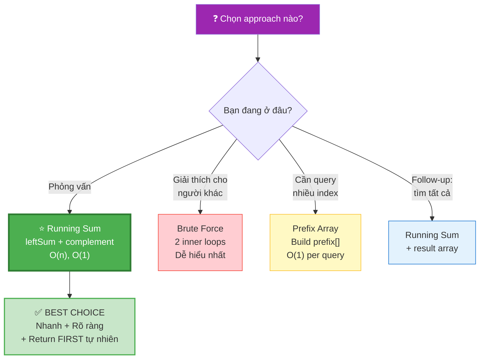

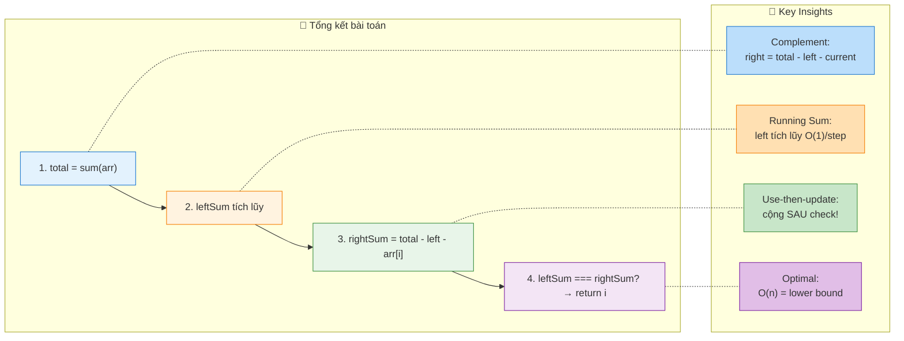

```
  ┌──────────────────────────────────────────────────────────────────────────┐
  │  📌 3 ĐIỀU PHẢI NHỚ                                                    │
  │                                                                          │
  │  1. CÔNG THỨC: rightSum = total - leftSum - arr[i]                      │
  │     → 1 phép trừ thay O(n) loop → biến O(n²) thành O(n)!              │
  │                                                                          │
  │  2. THỨ TỰ: tính rightSum → check → cộng leftSum                       │
  │     → "Use-then-update" pattern                                         │
  │     → Cộng TRƯỚC = arr[i] bị trừ 2 lần = SAI!                         │
  │                                                                          │
  │  3. PATTERN: Prefix Sum + Complement                                    │
  │     → Áp dụng cho Pivot Index, Product Except Self, Subarray Sum = K   │
  │     → HỌC 1 PATTERN → GIẢI ĐƯỢC 5+ BÀI!                              │
  └──────────────────────────────────────────────────────────────────────────┘
```
