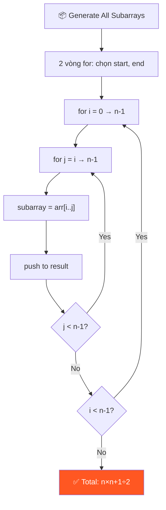
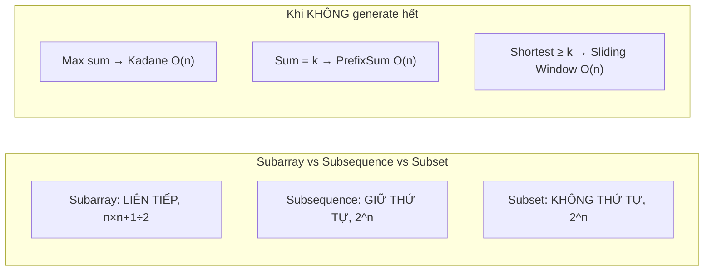

# 📦 Generating All Subarrays — GfG (Easy)

> 📖 Code: [Generating All Subarrays.js](./Generating%20All%20Subarrays.js)





---

## R — Repeat & Clarify

🧠 *"Subarray = đoạn LIÊN TIẾP. 2 index (start, end) xác định 1 subarray. Tổng cộng n(n+1)/2 subarrays."*

> 🎙️ *"Generate all contiguous subarrays of a given array. A subarray is defined by a starting and ending index, where all elements between them are included."*

### Clarification Questions

```
Q: Subarray vs Subsequence vs Subset?
A: Subarray = LIÊN TIẾP! [1,2] ✅, [1,3] ❌ (bỏ qua 2)

Q: Có tính subarray rỗng không?
A: Không, chỉ non-empty subarrays

Q: Số lượng subarrays?
A: n(n+1)/2 = với n=3 → 6 subarrays

Q: Mảng 1 phần tử?
A: Có 1 subarray = chính nó
```

### Tại sao bài này quan trọng?

```
  Subarray là CONCEPT NỀN TẢNG cho hàng chục bài LeetCode!

  BẠN PHẢI hiểu:
  1. Subarray được xác định bởi CẶP (start, end) → 2 vòng for
  2. Tổng số subarrays = n(n+1)/2 → O(n²)
  3. Không bao giờ generate hết cho bài thực tế → dùng technique!

  Phân biệt rõ 3 khái niệm:
  ┌───────────────────────────────────────────────────────┐
  │  Subarray:    LIÊN TIẾP    n(n+1)/2     [1,2] [2,3]  │
  │  Subsequence: BỎ ĐƯỢC      2ⁿ          [1,3] [1]     │
  │  Subset:      KHÔNG THỨ TỰ 2ⁿ          {1,3} = {3,1} │
  └───────────────────────────────────────────────────────┘
```

---

## 🧠 Bản chất bài toán — Hiểu để NHỚ, không chỉ để GIẢI

### Subarray = CẮT 1 ĐOẠN LIÊN TIẾP từ mảng

```
  Tưởng tượng mảng như 1 THANH SÔ-CÔ-LA:

  ┌───┬───┬───┬───┬───┐
  │ 1 │ 2 │ 3 │ 4 │ 5 │    ← thanh sô-cô-la (mảng)
  └───┴───┴───┴───┴───┘

  Subarray = BẺ 1 đoạn liên tiếp:
    BẺ ở vị trí 0-2: [1, 2, 3]     ✅ liên tiếp
    BẺ ở vị trí 2-4: [3, 4, 5]     ✅ liên tiếp
    BẺ ở vị trí 1-1: [2]           ✅ 1 mảnh cũng OK

  KHÔNG THỂ bẻ "nhảy cóc":
    [1, 3, 5] → ❌ KHÔNG phải subarray! (bỏ qua 2 và 4)
    → Đây là SUBSEQUENCE (bỏ phần tử, giữ thứ tự)
```

### Tại sao n(n+1)/2? — Hiểu bằng TRỰC GIÁC!

```
  Bài toán = CHỌN 2 VỊ TRÍ CẮT trên thanh sô-cô-la!

  Đặt n+1 vị trí cắt (trước, giữa, và sau mỗi ô):

    ↓   ↓   ↓   ↓      ← 4 vị trí cắt (n+1 = 3+1)
    | 1 | 2 | 3 |
    0   1   2   3       ← đánh số vị trí cắt

  Chọn 2 vị trí cắt → 1 subarray:
    Cắt tại 0 và 1 → [1]
    Cắt tại 0 và 2 → [1, 2]
    Cắt tại 0 và 3 → [1, 2, 3]
    Cắt tại 1 và 2 → [2]
    Cắt tại 1 và 3 → [2, 3]
    Cắt tại 2 và 3 → [3]
                      = 6 cách = C(4, 2) = 4! / (2! × 2!) = 6

  TỔNG QUÁT:
    Chọn 2 từ (n+1) vị trí = C(n+1, 2) = (n+1)! / (2! × (n-1)!)
                            = (n+1) × n / 2
                            = n(n+1) / 2

  ⚠️ Cách nhớ khác: cộng dãy số!
    Start=0: n subarrays
    Start=1: n-1 subarrays
    ...
    Start=n-1: 1 subarray
    Tổng = n + (n-1) + ... + 1 = n(n+1)/2
         = TỔNG DÃY SỐ TỰ NHIÊN từ 1 đến n!
```

### 2 vòng for = CHỌN CẶP (start, end)

```
  Mỗi subarray được XÁC ĐỊNH DUY NHẤT bởi:
    start (index bắt đầu)
    end   (index kết thúc)    với start <= end

  → BÀI TOÁN = LIỆT KÊ TẤT CẢ CẶP (start, end) hợp lệ!

  for start = 0 → n-1:           ← chọn điểm TRÁI
    for end = start → n-1:       ← chọn điểm PHẢI (>= start!)
      → subarray = arr[start..end]

  ⚠️ Tại sao end bắt đầu từ start (KHÔNG PHẢI 0)?
    Vì end >= start luôn! (subarray có ít nhất 1 phần tử)
    end < start → đoạn rỗng → không tính!
```

### Khi nào KHÔNG NÊN generate tất cả?

```
  ⚠️ QUAN TRỌNG: Trong phỏng vấn THỰC, hầu như KHÔNG BAO GIỜ
     yêu cầu generate tất cả subarrays!

  Thay vào đó, bài sẽ hỏi:
    "Tìm subarray CÓ TÍNH CHẤT X" (max sum, sum=k, min length...)

  → Dùng TECHNIQUE thay vì brute force:
  ┌────────────────────────────────────────────────────────┐
  │  "Max subarray sum"     → Kadane's Algorithm O(n)     │
  │  "Subarray sum = k"     → Prefix Sum + HashMap O(n)   │
  │  "Shortest subarray ≥ k"→ Sliding Window O(n)          │
  │  "Count subarrays < k"  → Two Pointers O(n)            │
  │  "Subarray with max el" → Monotonic Stack O(n)          │
  └────────────────────────────────────────────────────────┘

  TẤT CẢ đều O(n) hoặc O(n log n), KHÔNG cần O(n²) brute force!
  → Bài "Generate All Subarrays" chỉ là BÀI HỌC NỀN TẢNG!
```

---

## E — Examples

```
VÍ DỤ 1: arr = [1, 2, 3]

  Liệt kê THEO START INDEX:

  Start=0:
    end=0: [1]         ← chỉ phần tử 1
    end=1: [1, 2]      ← từ index 0 đến 1
    end=2: [1, 2, 3]   ← từ index 0 đến 2 (toàn bộ)
    → 3 subarrays

  Start=1:
    end=1: [2]         ← chỉ phần tử 2
    end=2: [2, 3]      ← từ index 1 đến 2
    → 2 subarrays

  Start=2:
    end=2: [3]         ← chỉ phần tử 3
    → 1 subarray

  Tổng: 3 + 2 + 1 = 6 = 3×4/2 ✅
```

### Minh họa trực quan

```
  arr = [1, 2, 3]
         0  1  2    ← index

  Tất cả subarrays:
    ┌───┐
    │ 1 │ 2   3     [1]       start=0, end=0
    ├───┤───┐
    │ 1 │ 2 │ 3     [1, 2]    start=0, end=1
    ├───┤───┤───┐
    │ 1 │ 2 │ 3 │   [1, 2, 3] start=0, end=2
    └───┘───┘───┘
            ┌───┐
      1   │ 2 │ 3     [2]       start=1, end=1
            ├───┤───┐
      1   │ 2 │ 3 │   [2, 3]    start=1, end=2
            └───┘───┘
                ┌───┐
      1     2 │ 3 │   [3]       start=2, end=2
                └───┘
```

### Công thức SỐ LƯỢNG subarrays

```
  Số subarrays = n × (n + 1) / 2

  Chứng minh:
    Start=0: có n choices cho end (0, 1, ..., n-1)     → n subarrays
    Start=1: có n-1 choices cho end (1, 2, ..., n-1)   → n-1 subarrays
    Start=2: có n-2 choices cho end                     → n-2 subarrays
    ...
    Start=n-1: có 1 choice (end = n-1)                 → 1 subarray

    Tổng = n + (n-1) + (n-2) + ... + 1 = n(n+1)/2

  📐 Bảng tham khảo:
    n=1:  1     n=5:  15    n=100:  5,050
    n=2:  3     n=6:  21    n=1000: 500,500
    n=3:  6     n=10: 55    n=10000: 50,005,000
    n=4:  10    n=20: 210

  ⚠️ n=10,000 → 50 TRIỆU subarrays → KHÔNG THỂ generate hết!
```

---

## A — Approach

### Approach 1: 3 vòng for — O(n³)

```
  Vòng 1 (i): chọn START index    → n iterations
  Vòng 2 (j): chọn END index      → trung bình n/2 iterations
  Vòng 3 (k): thu thập phần tử    → trung bình n/3 iterations

  i = start index (0 → n-1)
  j = end index   (i → n-1)    ← j bắt đầu từ i, không phải 0!
  k = index duyệt (i → j)     ← cho từng phần tử vào sub[]

  Total iterations ≈ n × n/2 × n/3 ≈ n³/6 → O(n³)
```

### Approach 2: 2 vòng for + slice — O(n²) ✅

```
💡 Dùng arr.slice(i, j+1) thay vì vòng for thứ 3!

  for i = 0 → n-1:       ← start
    for j = i → n-1:     ← end
      subarray = arr.slice(i, j+1)

  ⚠️ slice(start, end) — end KHÔNG ĐƯỢC TÍNH!
     slice(0, 3) = [arr[0], arr[1], arr[2]] → KHÔNG có arr[3]!
     → Phải dùng j+1 chứ không phải j!

  Ưu: code SẠCH hơn, bỏ vòng for thứ 3
  Nhược: slice vẫn copy O(j-i+1) → time vẫn O(n³) tổng
  → Nhưng CODE chỉ 2 vòng for = dễ đọc hơn!
```

### Approach 3: Recursive

```
💡 Dùng 2 pointers (start, end):
  - In subarray [start..end]
  - Nếu start > end → reset start=0, end++
  - Nếu end === n → STOP (base case)

  Ý tưởng: fix END, duyệt tất cả START
    end=0: start=0              → [arr[0]]
    end=1: start=0, start=1     → [arr[0..1]], [arr[1]]
    end=2: start=0, 1, 2        → [arr[0..2]], [arr[1..2]], [arr[2]]
```

---

## C — Code

### Solution 1: Iterative 3 vòng for — O(n³)

```javascript
function allSubarrays3Loops(arr) {
  const n = arr.length;
  const result = [];

  // Vòng 1: start index
  for (let i = 0; i < n; i++) {
    // Vòng 2: end index
    for (let j = i; j < n; j++) {
      // Vòng 3: thu thập phần tử i → j
      const sub = [];
      for (let k = i; k <= j; k++) {
        sub.push(arr[k]);
      }
      result.push(sub);
    }
  }
  return result;
}
```

### Giải thích từng vòng for

```
  for (let i = 0; i < n; i++)
    → i = START index
    → Duyệt từ 0 đến n-1 (mọi vị trí bắt đầu)

  for (let j = i; j < n; j++)
    → j = END index
    → j bắt đầu từ i (KHÔNG phải 0!)
    → Vì end >= start luôn luôn!
    → j = i: subarray 1 phần tử [arr[i]]
    → j = n-1: subarray từ i đến cuối

  for (let k = i; k <= j; k++)
    → k duyệt từ start đến end
    → Thu thập phần tử cho sub[]
    → ⚠️ k <= j (CÓ DẤU =) vì j TÍNH VÀO!
```

### Solution 2: Iterative 2 vòng + slice — O(n²) ✅

```javascript
function allSubarrays(arr) {
  const result = [];

  for (let i = 0; i < arr.length; i++) {
    for (let j = i; j < arr.length; j++) {
      result.push(arr.slice(i, j + 1));
    }
  }
  return result;
}
```

### Giải thích arr.slice()

```
  arr.slice(start, end)
    → Trả về MẢNG MỚI từ index start → end-1
    → end KHÔNG ĐƯỢC TÍNH (exclusive)!
    → KHÔNG thay đổi mảng gốc!

  Ví dụ: arr = [1, 2, 3, 4, 5]
    arr.slice(0, 1) → [1]          chỉ index 0
    arr.slice(0, 3) → [1, 2, 3]    index 0, 1, 2
    arr.slice(2, 5) → [3, 4, 5]    index 2, 3, 4
    arr.slice(1, 2) → [2]          chỉ index 1

  ⚠️ Vì end exclusive → dùng j+1 chứ không phải j!
     Muốn lấy arr[i..j] → slice(i, j+1)
```

### Trace CHI TIẾT: arr = [1, 2, 3]

```
  ┌─ i=0 (start=0) ──────────────────────────────┐
  │                                                │
  │  j=0: slice(0, 1) = [1]                       │
  │        Lấy: arr[0] = 1                        │
  │                                                │
  │  j=1: slice(0, 2) = [1, 2]                    │
  │        Lấy: arr[0], arr[1] = 1, 2             │
  │                                                │
  │  j=2: slice(0, 3) = [1, 2, 3]                 │
  │        Lấy: arr[0], arr[1], arr[2] = 1, 2, 3  │
  │                                                │
  │  → 3 subarrays bắt đầu từ index 0             │
  └────────────────────────────────────────────────┘

  ┌─ i=1 (start=1) ──────────────────────────────┐
  │                                                │
  │  j=1: slice(1, 2) = [2]                       │
  │        Lấy: arr[1] = 2                        │
  │                                                │
  │  j=2: slice(1, 3) = [2, 3]                    │
  │        Lấy: arr[1], arr[2] = 2, 3             │
  │                                                │
  │  → 2 subarrays bắt đầu từ index 1             │
  └────────────────────────────────────────────────┘

  ┌─ i=2 (start=2) ──────────────────────────────┐
  │                                                │
  │  j=2: slice(2, 3) = [3]                       │
  │        Lấy: arr[2] = 3                        │
  │                                                │
  │  → 1 subarray bắt đầu từ index 2              │
  └────────────────────────────────────────────────┘

  result = [[1], [1,2], [1,2,3], [2], [2,3], [3]]
  Tổng: 3 + 2 + 1 = 6 = 3×4/2 ✅
```

### Solution 3: Recursive

```javascript
function allSubarraysRecursive(arr) {
  const result = [];

  function recurse(start, end) {
    if (end === arr.length) return;        // Base case: hết mảng

    if (start > end) {
      recurse(0, end + 1);                 // Reset start, tăng end
      return;
    }

    result.push(arr.slice(start, end + 1)); // Thu thập subarray
    recurse(start + 1, end);                // Tăng start
  }

  recurse(0, 0);
  return result;
}
```

### Giải thích Recursive logic

```
  Ý tưởng: Fix END, duyệt tất cả START từ 0 → end

  recurse(start, end):
    1. Base case: end === n → DỪNG (đã duyệt hết end)
    2. start > end → reset start=0, tăng end (chuyển sang end tiếp)
    3. Bình thường: lấy subarray [start..end], tăng start

  Flow cho arr = [1, 2, 3]:

  ── end=0 ──
    (0,0) → push [1], call (1,0)
    (1,0) → 1>0, call (0,1)    ← reset start, tăng end!

  ── end=1 ──
    (0,1) → push [1,2], call (1,1)
    (1,1) → push [2],   call (2,1)
    (2,1) → 2>1, call (0,2)    ← reset start, tăng end!

  ── end=2 ──
    (0,2) → push [1,2,3], call (1,2)
    (1,2) → push [2,3],   call (2,2)
    (2,2) → push [3],     call (3,2)
    (3,2) → 3>2, call (0,3)    ← reset start, tăng end!

  ── end=3 ──
    (0,3) → end=3=n → STOP! (base case!)

  ⚠️ Thứ tự output khác iterative!
     [[1], [1,2], [2], [1,2,3], [2,3], [3]]
     (nhóm theo END, không theo START)
```

> 🎙️ *"The iterative approach with slice is cleanest. Two nested loops enumerate all (start, end) pairs, and slice extracts each subarray. Total subarrays = n(n+1)/2."*

---

## O — Optimize

```
                  Time      Space          Ghi chú
  ───────────────────────────────────────────────────
  3 vòng for      O(n³)     O(1)*         Chậm nhất
  2 vòng + slice  O(n²)*    O(1)*         Sạch nhất ✅
  Recursive       O(n²)*    O(n) stack    Stack depth

  * không tính output array

  ⚠️ Tại sao Time thực sự là O(n³)?
    Tuy CODE là 2 vòng for, nhưng:
    → slice(i, j+1) tạo mảng MỚI dài (j-i+1)
    → Tổng phần tử = Σ Σ (j-i+1) ≈ n³/6
    → Vậy time bao gồm cả copy là O(n³)!

  📊 Thực tế:
    n=100:  ~5,050 subarrays, ~170,000 tổng phần tử
    n=1000: ~500,000 subarrays, ~167 TRIỆU tổng phần tử 💀
    → KHÔNG BAO GIỜ generate hết cho n lớn!

  ⚠️ Khi nào generate hết?
    → Chỉ khi n nhỏ (< 100)
    → Hoặc bài yêu cầu liệt kê cụ thể

  ⚠️ Thực tế dùng gì thay?
    → Sliding Window: O(n) — tìm subarray thỏa điều kiện
    → Kadane's Algorithm: O(n) — max subarray sum
    → Prefix Sum + Hash: O(n) — subarray sum = k
    → Monotonic Stack: O(n) — subarray min/max
```

---

## T — Test

```
Test Cases:
  [1, 2, 3]    → [[1],[1,2],[1,2,3],[2],[2,3],[3]]     ✅ 6 subarrays
  [1, 2]       → [[1],[1,2],[2]]                        ✅ 3 subarrays
  [5]          → [[5]]                                  ✅ 1 subarray
  [1,2,3,4]   → 10 subarrays                            ✅ n(n+1)/2 = 10
  []           → []                                      ✅ 0 subarrays
```

---

## 🗣️ Interview Script

> 🎙️ *"A subarray is defined by a start and end index. Two nested loops enumerate all valid (start, end) pairs where start ≤ end. For each pair, I extract the subarray using slice. Total count is n(n+1)/2. Time complexity is O(n²) for enumeration, though output size is O(n³) total elements. For practical problems, we use techniques like Sliding Window or Kadane's instead of generating all subarrays."*

### Pattern & Liên kết

```
  GENERATE ALL SUBARRAYS → foundation pattern!

  Các bài dùng subarrays (nhưng KHÔNG generate hết):
  ┌───────────────────────────────────────────────────────────┐
  │  Bài toán                  Technique        Time          │
  │  ──────────────────────────────────────────────────       │
  │  Maximum Subarray Sum      Kadane's          O(n)         │
  │  Subarray Sum = K          Prefix Sum + Hash O(n)         │
  │  Min Size Subarray ≥ S     Sliding Window    O(n)         │
  │  Count Subarrays with Max  Monotonic Stack   O(n)         │
  │  Longest Subarray ≤ K      Sliding Window    O(n)         │
  │  Product of Subarray       Kadane variant    O(n)         │
  └───────────────────────────────────────────────────────────┘

  KEY INSIGHT: Thay vì generate TẤT CẢ → dùng technique thông minh!
    Brute force O(n²) → Sliding Window/Kadane O(n)!

  Phân biệt chi tiết:
  ┌──────────────────────────────────────────────────────────────┐
  │                                                              │
  │  SUBARRAY (đoạn liên tiếp):                                 │
  │    [1, 2, 3] →  [1] [1,2] [1,2,3] [2] [2,3] [3]           │
  │    Số lượng: n(n+1)/2                                       │
  │    Enumerate: 2 vòng for                                    │
  │                                                              │
  │  SUBSEQUENCE (bỏ phần tử, GIỮ THỨ TỰ):                    │
  │    [1, 2, 3] →  [] [1] [2] [3] [1,2] [1,3] [2,3] [1,2,3]  │
  │    Số lượng: 2ⁿ                                             │
  │    Generate: Backtracking / Recursion                        │
  │    ⚠️ [1,3] là subsequence nhưng KHÔNG là subarray!         │
  │                                                              │
  │  SUBSET (tập con, KHÔNG quan tâm thứ tự):                   │
  │    {1, 2, 3} → {} {1} {2} {3} {1,2} {1,3} {2,3} {1,2,3}   │
  │    Số lượng: 2ⁿ                                             │
  │    Generate: Bitmask / Backtracking                          │
  │    ⚠️ {1,3} = {3,1} (same subset!)                         │
  │                                                              │
  └──────────────────────────────────────────────────────────────┘
```
