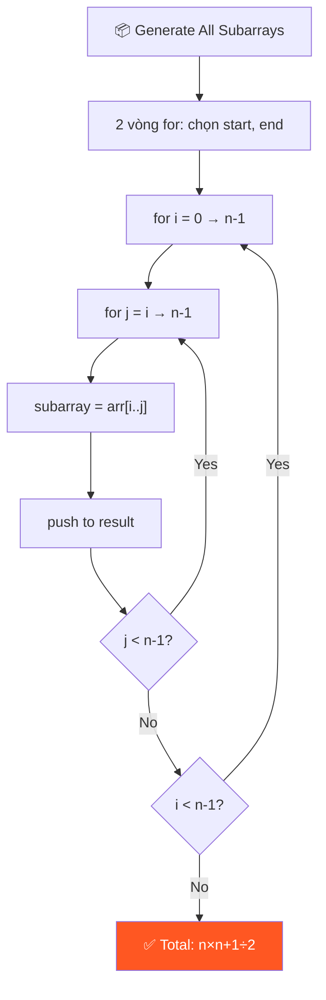
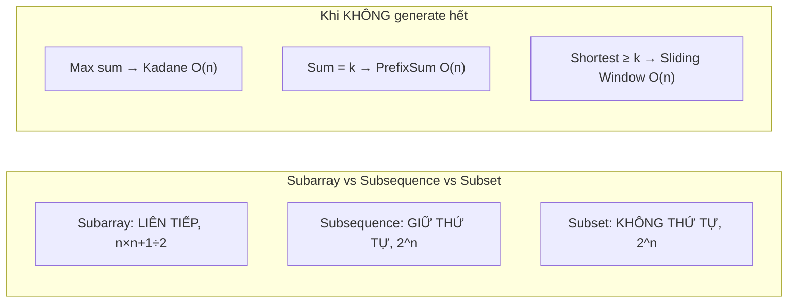
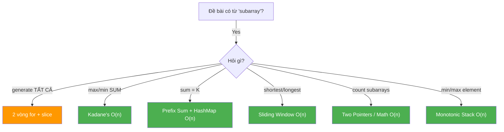
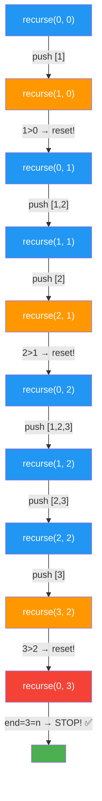
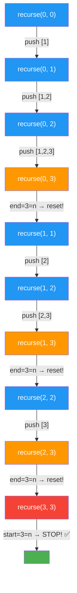
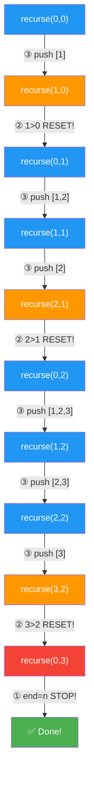

# 📦 Generating All Subarrays — GfG (Easy)

> 📖 Code: [Generating All Subarrays.js](./Generating%20All%20Subarrays.js)





---

## R — Repeat & Clarify

🧠 *"Subarray = đoạn LIÊN TIẾP. 2 index (start, end) xác định 1 subarray. Tổng cộng n(n+1)/2 subarrays."*

> 🎙️ *"Generate all contiguous subarrays of a given array. A subarray is defined by a starting and ending index, where all elements between them are included."*

### Clarification Questions

```
Q: Subarray vs Subsequence vs Subset?
A: Subarray = LIÊN TIẾP! [1,2] ✅, [1,3] ❌ (bỏ qua 2)

Q: Có tính subarray rỗng không?
A: Không, chỉ non-empty subarrays

Q: Số lượng subarrays?
A: n(n+1)/2 = với n=3 → 6 subarrays

Q: Mảng 1 phần tử?
A: Có 1 subarray = chính nó
```

### Tại sao bài này quan trọng?

```
  Subarray là CONCEPT NỀN TẢNG cho hàng chục bài LeetCode!

  BẠN PHẢI hiểu:
  1. Subarray được xác định bởi CẶP (start, end) → 2 vòng for
  2. Tổng số subarrays = n(n+1)/2 → O(n²)
  3. Không bao giờ generate hết cho bài thực tế → dùng technique!

  Phân biệt rõ 3 khái niệm:
  ┌───────────────────────────────────────────────────────┐
  │  Subarray:    LIÊN TIẾP    n(n+1)/2     [1,2] [2,3]  │
  │  Subsequence: BỎ ĐƯỢC      2ⁿ          [1,3] [1]     │
  │  Subset:      KHÔNG THỨ TỰ 2ⁿ          {1,3} = {3,1} │
  └───────────────────────────────────────────────────────┘
```

---

## 🧠 Bản chất bài toán — Hiểu để NHỚ, không chỉ để GIẢI

### Subarray = CẮT 1 ĐOẠN LIÊN TIẾP từ mảng

```
  Tưởng tượng mảng như 1 THANH SÔ-CÔ-LA:

  ┌───┬───┬───┬───┬───┐
  │ 1 │ 2 │ 3 │ 4 │ 5 │    ← thanh sô-cô-la (mảng)
  └───┴───┴───┴───┴───┘

  Subarray = BẺ 1 đoạn liên tiếp:
    BẺ ở vị trí 0-2: [1, 2, 3]     ✅ liên tiếp
    BẺ ở vị trí 2-4: [3, 4, 5]     ✅ liên tiếp
    BẺ ở vị trí 1-1: [2]           ✅ 1 mảnh cũng OK

  KHÔNG THỂ bẻ "nhảy cóc":
    [1, 3, 5] → ❌ KHÔNG phải subarray! (bỏ qua 2 và 4)
    → Đây là SUBSEQUENCE (bỏ phần tử, giữ thứ tự)
```

### Tại sao n(n+1)/2? — Hiểu bằng TRỰC GIÁC!

```
  Bài toán = CHỌN 2 VỊ TRÍ CẮT trên thanh sô-cô-la!

  Đặt n+1 vị trí cắt (trước, giữa, và sau mỗi ô):

    ↓   ↓   ↓   ↓      ← 4 vị trí cắt (n+1 = 3+1)
    | 1 | 2 | 3 |
    0   1   2   3       ← đánh số vị trí cắt

  Chọn 2 vị trí cắt → 1 subarray:
    Cắt tại 0 và 1 → [1]
    Cắt tại 0 và 2 → [1, 2]
    Cắt tại 0 và 3 → [1, 2, 3]
    Cắt tại 1 và 2 → [2]
    Cắt tại 1 và 3 → [2, 3]
    Cắt tại 2 và 3 → [3]
                      = 6 cách = C(4, 2) = 4! / (2! × 2!) = 6

  TỔNG QUÁT:
    Chọn 2 từ (n+1) vị trí = C(n+1, 2) = (n+1)! / (2! × (n-1)!)
                            = (n+1) × n / 2
                            = n(n+1) / 2

  ⚠️ Cách nhớ khác: cộng dãy số!
    Start=0: n subarrays
    Start=1: n-1 subarrays
    ...
    Start=n-1: 1 subarray
    Tổng = n + (n-1) + ... + 1 = n(n+1)/2
         = TỔNG DÃY SỐ TỰ NHIÊN từ 1 đến n!
```

### 2 vòng for = CHỌN CẶP (start, end)

```
  Mỗi subarray được XÁC ĐỊNH DUY NHẤT bởi:
    start (index bắt đầu)
    end   (index kết thúc)    với start <= end

  → BÀI TOÁN = LIỆT KÊ TẤT CẢ CẶP (start, end) hợp lệ!

  for start = 0 → n-1:           ← chọn điểm TRÁI
    for end = start → n-1:       ← chọn điểm PHẢI (>= start!)
      → subarray = arr[start..end]

  ⚠️ Tại sao end bắt đầu từ start (KHÔNG PHẢI 0)?
    Vì end >= start luôn! (subarray có ít nhất 1 phần tử)
    end < start → đoạn rỗng → không tính!
```

### Khi nào KHÔNG NÊN generate tất cả?

```
  ⚠️ QUAN TRỌNG: Trong phỏng vấn THỰC, hầu như KHÔNG BAO GIỜ
     yêu cầu generate tất cả subarrays!

  Thay vào đó, bài sẽ hỏi:
    "Tìm subarray CÓ TÍNH CHẤT X" (max sum, sum=k, min length...)

  → Dùng TECHNIQUE thay vì brute force:
  ┌────────────────────────────────────────────────────────┐
  │  "Max subarray sum"     → Kadane's Algorithm O(n)     │
  │  "Subarray sum = k"     → Prefix Sum + HashMap O(n)   │
  │  "Shortest subarray ≥ k"→ Sliding Window O(n)          │
  │  "Count subarrays < k"  → Two Pointers O(n)            │
  │  "Subarray with max el" → Monotonic Stack O(n)          │
  └────────────────────────────────────────────────────────┘

  TẤT CẢ đều O(n) hoặc O(n log n), KHÔNG cần O(n²) brute force!
  → Bài "Generate All Subarrays" chỉ là BÀI HỌC NỀN TẢNG!
```

---

## 🧭 Luồng Suy Nghĩ — Từ đọc đề đến solution

> 💡 Phần này dạy bạn **CÁCH TƯ DUY** để tự giải bài, không chỉ biết đáp án.
> Mỗi bước đều có **lý do tại sao**, để bạn áp dụng cho bài khó hơn.

### Bước 1: Đọc đề → Gạch chân KEYWORDS

```
  Đề bài: "Generate all contiguous subarrays of a given array"

  Gạch chân:
    "all"        → LIỆT KÊ, không phải tìm 1 cái → Enumeration problem
    "contiguous"  → LIÊN TIẾP → subarray, KHÔNG phải subsequence
    "subarrays"   → đoạn con

  🧠 Tự hỏi: "Subarray khác gì subsequence?"
    Subarray:     [1, 2, 3] → [1,2] ✅  [1,3] ❌
    Subsequence:  [1, 2, 3] → [1,2] ✅  [1,3] ✅ (được bỏ giữa)

    → Subarray = phải LIÊN TIẾP! Đây là constraint quan trọng!

  📌 Kỹ năng chuyển giao:
    Bất cứ khi nào đề nói "contiguous" hoặc "consecutive"
    → Nghĩ ngay đến: subarray, sliding window, two pointers
```

### Bước 2: Vẽ ví dụ NHỎ bằng tay → Tìm PATTERN

```
  Lấy ví dụ NHỎ NHẤT có ý nghĩa: arr = [1, 2, 3] (n=3)

  Liệt kê TẤT CẢ subarrays bằng tay:
    Bắt đầu từ index 0: [1], [1,2], [1,2,3]    → 3 cái
    Bắt đầu từ index 1: [2], [2,3]              → 2 cái
    Bắt đầu từ index 2: [3]                     → 1 cái
                                            Tổng: 6 cái

  🧠 Quan sát pattern:
    1. Mỗi subarray = 2 con số xác định: START và END
       [1]     → start=0, end=0
       [1,2]   → start=0, end=1
       [1,2,3] → start=0, end=2
       [2]     → start=1, end=1
       [2,3]   → start=1, end=2
       [3]     → start=2, end=2

    2. end LUÔN ≥ start (không thể kết thúc trước khi bắt đầu!)

    3. Số lượng = 3 + 2 + 1 = 6 = dãy cấp số cộng!
       → Công thức: n + (n-1) + ... + 1 = n(n+1)/2

  📌 Kỹ năng chuyển giao:
    LUÔN vẽ ví dụ trước khi code! Ví dụ nhỏ (n=3 hoặc 4)
    giúp thấy pattern mà đọc đề không thấy được.
```

### Bước 3: Từ pattern → Brute Force (Solution đầu tiên)

```
  Từ quan sát: "mỗi subarray = cặp (start, end)"
  → Ý tưởng: LIỆT KÊ tất cả cặp (start, end) hợp lệ!

  🧠 Suy nghĩ: "Liệt kê tất cả cặp = 2 vòng for lồng nhau!"

    for start = 0 → n-1:
      for end = start → n-1:    ← end ≥ start!
        → Với mỗi cặp, lấy ra subarray arr[start..end]

  Nhưng CÁCH NÀO lấy ra arr[start..end]?
    → Cần vòng for THỨ 3 để duyệt từ start → end
    → Nên: 3 vòng for!

    for (i = 0 → n-1)           ← chọn start
      for (j = i → n-1)         ← chọn end
        for (k = i → j)         ← thu thập phần tử
          sub.push(arr[k])

  ✅ Đây là Solution 1: 3 vòng for — O(n³)

  📌 Kỹ năng chuyển giao:
    Brute force = ENUMERATION = liệt kê TẤT CẢ khả năng
    → Mỗi "lựa chọn" = 1 vòng for
    → 2 lựa chọn (start, end) = 2 vòng for
    → Thu thập dữ liệu = thêm vòng for nữa
    → LUÔN bắt đầu từ brute force, rồi optimize!
```

### Bước 4: Tự hỏi "Vòng for thứ 3 có cần thiết không?"

```
  🧠 Nhìn vào vòng for thứ 3:
    for (k = i; k <= j; k++)
      sub.push(arr[k])

    → Mục đích: lấy ra đoạn arr[i..j]
    → JavaScript có built-in cho việc này: arr.slice(i, j+1)!

  💡 Insight: Thay vòng for thứ 3 bằng slice()!

    for (i = 0 → n-1)
      for (j = i → n-1)
        result.push(arr.slice(i, j+1))    ← 1 dòng thay cả vòng for!

  ✅ Đây là Solution 2: 2 vòng + slice

  ⚠️ Nhận ra: slice(i, j+1) — tại sao j+1?
    Vì slice(start, end) → end EXCLUSIVE (không tính end)
    Muốn lấy đến index j → phải truyền j+1

  📌 Kỹ năng chuyển giao:
    Khi viết xong brute force, TỰ HỎI:
    "Có built-in nào làm thay 1 phần code không?"
    "Có cách nào BỎ BỚT 1 vòng for?"
    → Đây là quá trình OPTIMIZATION!
```

### Bước 5: "Có cách nào khác TƯ DUY về bài toán?"

```
  🧠 Nhìn lại: Mỗi lần j tăng 1, subarray CHỈ THÊM 1 phần tử!

    j=0: [1]
    j=1: [1, 2]      ← thêm 2 vào [1]!
    j=2: [1, 2, 3]   ← thêm 3 vào [1, 2]!

  💡 Insight: Không cần tạo mới mỗi lần!
    → Giữ subarray cũ, CHỈ push thêm 1 phần tử!

    sub = []
    j=i:   sub.push(arr[i])     → sub = [arr[i]]
    j=i+1: sub.push(arr[i+1])   → sub = [arr[i], arr[i+1]]
    j=i+2: sub.push(arr[i+2])   → sub = [arr[i], arr[i+1], arr[i+2]]

  ⚠️ TRAP: phải save COPY (không phải reference!)
    result.push([...sub])   ← spread operator tạo copy!

  ✅ Đây là Solution 4: Incremental Build

  📌 Kỹ năng chuyển giao:
    Khi thấy pattern "thêm/bớt 1 phần tử so với bước trước"
    → ĐỪNG tính lại từ đầu! Tận dụng kết quả cũ!
    → Đây là nguyên tắc INCREMENTAL COMPUTATION
    → Áp dụng cho: Sliding Window, Kadane's, Prefix Sum, ...
```

### Bước 6: "Bài toán THỰC có yêu cầu generate hết không?"

```
  🧠 Nhận ra: Trong phỏng vấn THỰC, interviewer HIẾM KHI hỏi
     "generate tất cả subarrays"

  Thay vào đó sẽ hỏi:
    "Tìm subarray có SUM LỚN NHẤT"         → Kadane's O(n)
    "Tìm subarray có SUM = k"              → Prefix Sum + HashMap O(n)
    "Tìm subarray NGẮN NHẤT có sum ≥ k"   → Sliding Window O(n)

  🧠 Suy nghĩ: "Nếu chỉ cần SUM chứ không cần lưu subarray?"

    Incremental sum (từ bước 5):
      sub = [], sum = 0
      j=i:   sum += arr[i]     → sum = arr[i]
      j=i+1: sum += arr[i+1]   → sum = arr[i] + arr[i+1]
      → O(1) cho mỗi subarray thay vì O(length)!

    Đây là BRIDGE dẫn đến Kadane's Algorithm:
      max_sum = -Infinity
      current_sum = 0
      for each element:
        current_sum = max(element, current_sum + element)
        max_sum = max(max_sum, current_sum)

  📌 Kỹ năng chuyển giao:
    Hỏi: "Có cần TOÀN BỘ dữ liệu, hay chỉ cần 1 CON SỐ?"
    Nếu chỉ cần 1 con số (max, min, count, sum)
    → Không cần generate hết → Dùng technique!
```

### Bước 7: Tổng kết — Cây quyết định khi gặp bài SUBARRAY



```
  📌 QUY TRÌNH TƯ DUY TỔNG QUÁT (áp dụng cho MỌI bài):

  ┌──────────────────────────────────────────────────────────────┐
  │  1. ĐỌC ĐỀ → gạch chân keywords                            │
  │     → Xác định: input, output, constraints                  │
  │                                                              │
  │  2. VẼ VÍ DỤ NHỎ → tìm pattern                             │
  │     → Dùng n=3 hoặc n=4, liệt kê bằng tay                  │
  │     → TÌM quy luật: lặp lại gì? Tăng/giảm gì?             │
  │                                                              │
  │  3. BRUTE FORCE → solution đầu tiên                         │
  │     → Enumeration: mỗi lựa chọn = 1 vòng for               │
  │     → LUÔN viết brute force trước!                          │
  │                                                              │
  │  4. OPTIMIZE → hỏi "có bỏ được vòng for không?"            │
  │     → Built-in thay vòng for? (slice, filter, map)          │
  │     → Kết quả cũ dùng lại được? (incremental)              │
  │     → Có cần tất cả data? (chỉ cần max/count?)             │
  │                                                              │
  │  5. PATTERN MATCH → nhận dạng technique                     │
  │     → Sorted + in-place → Two Pointers                      │
  │     → Subarray + sum → Prefix Sum / Kadane                  │
  │     → Shortest/longest + condition → Sliding Window          │
  │     → Min/max in range → Monotonic Stack                     │
  │                                                              │
  │  6. VERIFY → chạy lại ví dụ bằng tay                       │
  │     → Kiểm tra edge cases: empty, 1 element, all same       │
  └──────────────────────────────────────────────────────────────┘

  ⭐ QUY TẮC VÀNG:
    Bạn KHÔNG CẦN nhớ tất cả solutions.
    Bạn CẦN nhớ QUY TRÌNH TƯ DUY → tự derive solution!

    "Nếu quên code → vẽ ví dụ → tìm pattern → viết code"
```

---

## E — Examples

```
VÍ DỤ 1: arr = [1, 2, 3]

  Liệt kê THEO START INDEX:

  Start=0:
    end=0: [1]         ← chỉ phần tử 1
    end=1: [1, 2]      ← từ index 0 đến 1
    end=2: [1, 2, 3]   ← từ index 0 đến 2 (toàn bộ)
    → 3 subarrays

  Start=1:
    end=1: [2]         ← chỉ phần tử 2
    end=2: [2, 3]      ← từ index 1 đến 2
    → 2 subarrays

  Start=2:
    end=2: [3]         ← chỉ phần tử 3
    → 1 subarray

  Tổng: 3 + 2 + 1 = 6 = 3×4/2 ✅
```

### Minh họa trực quan

```
  arr = [1, 2, 3]
         0  1  2    ← index

  Tất cả subarrays:
    ┌───┐
    │ 1 │ 2   3     [1]       start=0, end=0
    ├───┤───┐
    │ 1 │ 2 │ 3     [1, 2]    start=0, end=1
    ├───┤───┤───┐
    │ 1 │ 2 │ 3 │   [1, 2, 3] start=0, end=2
    └───┘───┘───┘
            ┌───┐
      1   │ 2 │ 3     [2]       start=1, end=1
            ├───┤───┐
      1   │ 2 │ 3 │   [2, 3]    start=1, end=2
            └───┘───┘
                ┌───┐
      1     2 │ 3 │   [3]       start=2, end=2
                └───┘
```

### Công thức SỐ LƯỢNG subarrays

```
  Số subarrays = n × (n + 1) / 2

  Chứng minh:
    Start=0: có n choices cho end (0, 1, ..., n-1)     → n subarrays
    Start=1: có n-1 choices cho end (1, 2, ..., n-1)   → n-1 subarrays
    Start=2: có n-2 choices cho end                     → n-2 subarrays
    ...
    Start=n-1: có 1 choice (end = n-1)                 → 1 subarray

    Tổng = n + (n-1) + (n-2) + ... + 1 = n(n+1)/2

  📐 Bảng tham khảo:
    n=1:  1     n=5:  15    n=100:  5,050
    n=2:  3     n=6:  21    n=1000: 500,500
    n=3:  6     n=10: 55    n=10000: 50,005,000
    n=4:  10    n=20: 210

  ⚠️ n=10,000 → 50 TRIỆU subarrays → KHÔNG THỂ generate hết!
```

---

## A — Approach

### Approach 1: 3 vòng for — O(n³)

```
  Vòng 1 (i): chọn START index    → n iterations
  Vòng 2 (j): chọn END index      → trung bình n/2 iterations
  Vòng 3 (k): thu thập phần tử    → trung bình n/3 iterations

  i = start index (0 → n-1)
  j = end index   (i → n-1)    ← j bắt đầu từ i, không phải 0!
  k = index duyệt (i → j)     ← cho từng phần tử vào sub[]

  Total iterations ≈ n × n/2 × n/3 ≈ n³/6 → O(n³)
```

### Approach 2: 2 vòng for + slice — O(n²) ✅

```
💡 Dùng arr.slice(i, j+1) thay vì vòng for thứ 3!

  for i = 0 → n-1:       ← start
    for j = i → n-1:     ← end
      subarray = arr.slice(i, j+1)

  ⚠️ slice(start, end) — end KHÔNG ĐƯỢC TÍNH!
     slice(0, 3) = [arr[0], arr[1], arr[2]] → KHÔNG có arr[3]!
     → Phải dùng j+1 chứ không phải j!

  Ưu: code SẠCH hơn, bỏ vòng for thứ 3
  Nhược: slice vẫn copy O(j-i+1) → time vẫn O(n³) tổng
  → Nhưng CODE chỉ 2 vòng for = dễ đọc hơn!
```

### Approach 3: Recursive

```
💡 Ý tưởng: Dùng RECURSION thay 2 vòng for!

  2 vòng for iterative:
    Vòng ngoài (i): chọn END   → tăng end từ 0 → n-1
    Vòng trong (j): chọn START → tăng start từ 0 → end

  Recursive tương đương:
    Hàm recurse(start, end) xử lý 1 subarray
    Rồi GỌI LẠI CHÍNH MÌNH với start/end tiếp theo

  3 TRƯỜNG HỢP trong mỗi lần gọi:
  ┌────────────────────────────────────────────────────────────┐
  │  ① end === n       → DỮNG! (đã duyệt hết)            │
  │  ② start > end    → Reset start=0, tăng end           │
  │  ③ Bình thường      → Lấy subarray, tăng start          │
  └────────────────────────────────────────────────────────────┘

  Hình dung như MAY VÁ: “Máy may” chạy từ trái qua phải
    với mỗi điểm kết thúc (end), rồi “tua lại” đầu và shift xuống

  Với arr = [1, 2, 3]:
    end=0: start=0              → [1]             rồi start > end → reset!
    end=1: start=0, start=1     → [1,2], [2]      rồi start > end → reset!
    end=2: start=0, 1, 2        → [1,2,3], [2,3], [3]  rồi end=3=n → STOP!

  ⚠️ Thứ tự output KHÁC iterative:
    Iterative (nhóm theo START): [1], [1,2], [1,2,3], [2], [2,3], [3]
    Recursive (nhóm theo END):   [1], [1,2], [2], [1,2,3], [2,3], [3]
```



```
  🟦 Xanh dương = push subarray (đang làm việc)
  🟧 Cam        = start > end → reset! (chuyển end mới)
  🟥 Đỏ         = base case → DỮNG!

  ⚠️ Output: [1], [1,2], [2], [1,2,3], [2,3], [3] — NHÓM THEO END!
     Vì end thay đổi CHẬM (chỉ tăng khi start > end)
```

### Approach 3B: Recursive nhóm theo START

```
  💡 Muốn output: [[1], [1,2], [1,2,3], [2], [2,3], [3]] (nhóm theo START)?
     → ĐẢO vai trò: start thay đổi CHẬM, end thay đổi NHANH!

  Approach 3 (nhóm END):
    end CHẬM (tăng khi reset) | start NHANH (tăng mỗi bước)
    → start chạy hết → tăng end → start chạy lại từ 0

  Approach 3B (nhóm START):
    start CHẬM (tăng khi reset) | end NHANH (tăng mỗi bước)
    → end chạy hết → tăng start → end chạy lại từ start

  3 TRƯỜNG HỢP:
  ┌────────────────────────────────────────────────────────────┐
  │  ① start === n    → DỪNG! (đã duyệt hết start)         │
  │  ② end === n      → Reset end = start+1, tăng start     │
  │  ③ Bình thường     → Lấy subarray, tăng end              │
  └────────────────────────────────────────────────────────────┘

  Với arr = [1, 2, 3]:
    start=0: end=0, 1, 2          → [1], [1,2], [1,2,3]  rồi end=3=n → reset!
    start=1: end=1, 2             → [2], [2,3]            rồi end=3=n → reset!
    start=2: end=2                → [3]                   rồi end=3=n → reset!
    start=3: start=3=n → STOP!
```

```javascript
// Recursive nhóm theo START
function recursion(start, end) {
    if (start === arr.length) return;     // start hết = DỪNG
    
    if (end === arr.length) {             // end hết = tăng start, reset end
        recursion(start + 1, start + 1);
        return;
    }
    
    res.push(arr.slice(start, end + 1));
    recursion(start, end + 1);            // tăng end (NHANH)
}
recursion(0, 0);
```



```
  🟦 Xanh dương = push subarray
  🟧 Cam        = end=n → reset! (chuyển start mới)
  🟥 Đỏ         = start=n → DỪNG!

  Output: [1], [1,2], [1,2,3], [2], [2,3], [3] ← NHÓM THEO START ✅

  📌 QUY TẮC: Biến thay đổi CHẬM = biến NHÓM output!
     Approach 3:  end chậm   → nhóm theo end
     Approach 3B: start chậm → nhóm theo start ⭐
```

### Approach 4: Incremental Build — Nối dần từng phần tử

```
💡 Ý tưởng: Thay vì tạo mới mỗi lần, NỐI thêm phần tử vào subarray cũ!

  Với mỗi start i:
    sub = []
    j = i:   sub.push(arr[i])   → sub = [arr[i]]         → save copy
    j = i+1: sub.push(arr[i+1]) → sub = [arr[i], arr[i+1]] → save copy
    j = i+2: sub.push(arr[i+2]) → sub = [arr[i], ..., arr[i+2]] → save copy

  Ưu: KHÔNG cần slice() hoặc vòng for thứ 3
  Nhược: vẫn phải [...sub] copy mỗi lần save (để tránh reference)

  So với 3 vòng for:
    3 vòng for: tạo sub mới MỖI LẦN từ đầu
    Incremental: CHỈ push thêm 1 phần tử vào sub cũ!
```

### Approach 5: flatMap — Functional one-liner

```
💡 Ý tưởng: Dùng flatMap + map để tạo tất cả subarrays trong 1 expression

  arr.flatMap((_, i) =>
    arr.slice(i).map((_, j) => arr.slice(i, i + j + 1))
  )

  flatMap: với mỗi start i, tạo mảng các subarrays  → then FLATTEN
  map: với mỗi end j (relative), slice ra subarray

  ✅ Gọn, functional style
  ⚠️ Khó đọc hơn vòng for — chỉ dùng khi quen functional programming
```

### Trace CHI TIẾT flatMap: arr = [1, 2, 3]

```
  Bước 1: TÁCH NHỎ — hiểu từng phần

  arr.flatMap((_, i) =>            ← VÒNG NGOÀI: i = 0, 1, 2 (start)
    arr.slice(i)                   ← Tạo mảng con TỪ index i trở đi
      .map((_, j) =>               ← VÒNG TRONG: j = 0, 1, ... (relative index)
        arr.slice(i, i + j + 1)    ← Cắt subarray từ i, dài j+1 phần tử
      )
  )

  ⚠️ j ở đây KHÔNG PHẢI end index thật!
     j = index trong arr.slice(i) → "relative index" bắt đầu từ 0
     Nên subarray = arr.slice(i, i + j + 1) → lấy j+1 phần tử từ i
```

```
  Bước 2: TRACE từng giá trị i

  ┌─ i=0 ──────────────────────────────────────────────────────┐
  │                                                            │
  │  arr.slice(0) = [1, 2, 3]     ← mảng từ index 0 trở đi   │
  │                                                            │
  │  .map((_, j) => arr.slice(0, 0 + j + 1))                  │
  │                                                            │
  │  j=0: arr.slice(0, 0+0+1) = arr.slice(0, 1) = [1]        │
  │  j=1: arr.slice(0, 0+1+1) = arr.slice(0, 2) = [1, 2]     │
  │  j=2: arr.slice(0, 0+2+1) = arr.slice(0, 3) = [1, 2, 3]  │
  │                                                            │
  │  → Kết quả i=0: [[1], [1,2], [1,2,3]]                    │
  └────────────────────────────────────────────────────────────┘

  ┌─ i=1 ──────────────────────────────────────────────────────┐
  │                                                            │
  │  arr.slice(1) = [2, 3]        ← mảng từ index 1 trở đi   │
  │                                                            │
  │  .map((_, j) => arr.slice(1, 1 + j + 1))                  │
  │                                                            │
  │  j=0: arr.slice(1, 1+0+1) = arr.slice(1, 2) = [2]        │
  │  j=1: arr.slice(1, 1+1+1) = arr.slice(1, 3) = [2, 3]     │
  │                                                            │
  │  → Kết quả i=1: [[2], [2,3]]                              │
  └────────────────────────────────────────────────────────────┘

  ┌─ i=2 ──────────────────────────────────────────────────────┐
  │                                                            │
  │  arr.slice(2) = [3]           ← mảng từ index 2 trở đi   │
  │                                                            │
  │  .map((_, j) => arr.slice(2, 2 + j + 1))                  │
  │                                                            │
  │  j=0: arr.slice(2, 2+0+1) = arr.slice(2, 3) = [3]        │
  │                                                            │
  │  → Kết quả i=2: [[3]]                                     │
  └────────────────────────────────────────────────────────────┘
```

```
  Bước 3: flatMap = map + FLATTEN

  map (chưa flatten):
    [
      [[1], [1,2], [1,2,3]],     ← i=0 (mảng LỒNG!)
      [[2], [2,3]],               ← i=1
      [[3]]                       ← i=2
    ]

  flatMap (flatten 1 cấp):
    [
      [1], [1,2], [1,2,3],        ← "mở ngoặc" i=0
      [2], [2,3],                  ← "mở ngoặc" i=1
      [3]                          ← "mở ngoặc" i=2
    ]

  → Output: [[1], [1,2], [1,2,3], [2], [2,3], [3]] ← NHÓM THEO START ✅
```

```
  Bước 4: TẠI SAO i + j + 1?

  j = relative index (bắt đầu từ 0 trong arr.slice(i))
  Muốn lấy j+1 phần tử bắt đầu từ i:
    arr.slice(start, end)    ← end exclusive!
    start = i
    end = i + (j + 1) = i + j + 1

  Ví dụ: i=0, j=1
    Muốn: [1, 2] → 2 phần tử từ index 0
    arr.slice(0, 0 + 1 + 1) = arr.slice(0, 2) = [1, 2] ✅

  ⚠️ Nếu quên +1:
    arr.slice(0, 0 + 1) = arr.slice(0, 1) = [1] ← THIẾU!

  📌 Tại sao dùng arr.slice(i) rồi .map?
     → arr.slice(i) có LENGTH = n - i
     → .map chạy n - i lần → CHÍNH XÁC số subarrays bắt đầu từ i!
     → Không cần tính "end chạy đến đâu" — tự động đúng!
```

### So sánh tất cả approaches

```
  ┌──────────────────┬──────────┬──────────┬────────────────────┐
  │                  │ Time     │ Vòng for │ Ghi chú             │
  ├──────────────────┼──────────┼──────────┼────────────────────┤
  │ 3 vòng for       │ O(n³)    │ 3        │ Rõ ràng nhất        │
  │ 2 vòng + slice  │ O(n³)*   │ 2        │ Sạch nhất ⭐        │
  │ Recursive       │ O(n³)*   │ 0        │ Stack depth         │
  │ Incremental     │ O(n³)*   │ 2        │ Ít copy hơn         │
  │ flatMap         │ O(n³)*   │ 0        │ Functional 1-liner  │
  └──────────────────┴──────────┴──────────┴────────────────────┘
  * time thực sự O(n³) vì phải copy phần tử cho output
```

---

## C — Code

### Solution 1: Iterative 3 vòng for — O(n³)

```javascript
function allSubarrays3Loops(arr) {
  const n = arr.length;
  const result = [];

  // Vòng 1: start index
  for (let i = 0; i < n; i++) {
    // Vòng 2: end index
    for (let j = i; j < n; j++) {
      // Vòng 3: thu thập phần tử i → j
      const sub = [];
      for (let k = i; k <= j; k++) {
        sub.push(arr[k]);
      }
      result.push(sub);
    }
  }
  return result;
}
```

### Giải thích từng vòng for

```
  for (let i = 0; i < n; i++)
    → i = START index
    → Duyệt từ 0 đến n-1 (mọi vị trí bắt đầu)

  for (let j = i; j < n; j++)
    → j = END index
    → j bắt đầu từ i (KHÔNG phải 0!)
    → Vì end >= start luôn luôn!
    → j = i: subarray 1 phần tử [arr[i]]
    → j = n-1: subarray từ i đến cuối

  for (let k = i; k <= j; k++)
    → k duyệt từ start đến end
    → Thu thập phần tử cho sub[]
    → ⚠️ k <= j (CÓ DẤU =) vì j TÍNH VÀO!
```

### Tại sao output là `[[1], [1,2], [1,2,3], [2], [2,3], [3]]`?

```
  Output theo thứ tự này vì: VÒNG NGOÀI (i) = START index!

  Vòng ngoài CỐ ĐỊNH start, vòng trong TĂNG end:
    → TẤT CẢ subarrays bắt đầu từ 0 RA TRƯỚC,
      rồi tất cả bắt đầu từ 1, rồi 2, ...

  arr = [1, 2, 3]

  ┌─ i=0 (start FIXED = 0) ─────────────────────┐
  │   j=0 → arr[0..0] → [1]        ← end tăng ↓ │
  │   j=1 → arr[0..1] → [1, 2]                   │
  │   j=2 → arr[0..2] → [1, 2, 3]                │
  └───────────────────────────────────────────────┘
  ┌─ i=1 (start FIXED = 1) ─────────────────────┐
  │   j=1 → arr[1..1] → [2]                      │
  │   j=2 → arr[1..2] → [2, 3]                   │
  └───────────────────────────────────────────────┘
  ┌─ i=2 (start FIXED = 2) ─────────────────────┐
  │   j=2 → arr[2..2] → [3]                      │
  └───────────────────────────────────────────────┘

  → Output: [1], [1,2], [1,2,3], [2], [2,3], [3]
             ╰── nhóm i=0 ────╯  ╰─ i=1 ──╯  ╰i=2╯

  💡 NHÓM theo START vì i (start) ở VÒNG NGOÀI!

  ⚠️ Nếu ĐẢO: vòng ngoài = end, vòng trong = start
     → Output sẽ NHÓM theo END:
     [1], [1,2], [2], [1,2,3], [2,3], [3]
     ╰i=0╯╰─ end=1 ─╯ ╰──── end=2 ────╯

  QUY TẮC: Biến ở VÒNG NGOÀI = cách NHÓM output!
     Ngoài=start → nhóm theo start (cách phổ biến)
     Ngoài=end   → nhóm theo end   (recursive approach)
```

### Trace CHI TIẾT 3 vòng for: arr = [1, 2, 3]

```
  Tất cả iterations (đếm từng bước):

  ┌─ i=0 ──────────────────────────────────────────────────────────┐
  │                                                              │
  │  j=0:                                                        │
  │    k=0: sub.push(arr[0])=1    → sub=[1]                      │
  │    → result.push([1])                               #1      │
  │                                                              │
  │  j=1:                                                        │
  │    k=0: sub.push(arr[0])=1    → sub=[1]                      │
  │    k=1: sub.push(arr[1])=2    → sub=[1,2]                    │
  │    → result.push([1,2])                             #2      │
  │                                                              │
  │  j=2:                                                        │
  │    k=0: sub.push(arr[0])=1    → sub=[1]                      │
  │    k=1: sub.push(arr[1])=2    → sub=[1,2]                    │
  │    k=2: sub.push(arr[2])=3    → sub=[1,2,3]                  │
  │    → result.push([1,2,3])                           #3      │
  │                                                              │
  │  📊 i=0: 3 subarrays, k chạy tổng: 1+2+3 = 6 lần            │
  └──────────────────────────────────────────────────────────────┘

  ┌─ i=1 ──────────────────────────────────────────────────────────┐
  │                                                              │
  │  j=1:                                                        │
  │    k=1: sub.push(arr[1])=2    → sub=[2]                      │
  │    → result.push([2])                               #4      │
  │                                                              │
  │  j=2:                                                        │
  │    k=1: sub.push(arr[1])=2    → sub=[2]                      │
  │    k=2: sub.push(arr[2])=3    → sub=[2,3]                    │
  │    → result.push([2,3])                             #5      │
  │                                                              │
  │  📊 i=1: 2 subarrays, k chạy tổng: 1+2 = 3 lần              │
  └──────────────────────────────────────────────────────────────┘

  ┌─ i=2 ──────────────────────────────────────────────────────────┐
  │                                                              │
  │  j=2:                                                        │
  │    k=2: sub.push(arr[2])=3    → sub=[3]                      │
  │    → result.push([3])                               #6      │
  │                                                              │
  │  📊 i=2: 1 subarray, k chạy tổng: 1 lần                     │
  └──────────────────────────────────────────────────────────────┘

  TỔNG KẾT:
    Subarrays: 3 + 2 + 1 = 6 = n(n+1)/2 ✅
    Vòng k chạy: (1+2+3) + (1+2) + (1) = 10 lần
    Công thức vòng k: n(n+1)(n+2)/6 → với n=3: 3×4×5/6 = 10 ✅

    ⚠️ Nếu n=100:
       Subarrays = 5,050
       Vòng k chạy = 100×101×102/6 = 171,700 lần!
```

### Tại sao vòng k cần thiết? — Hiểu sâu hơn

```
  Vòng 1 (i) và vòng 2 (j) chỉ XÁC ĐỊNH cặp (start, end)
  Vòng 3 (k) làm việc THU THẬP phần tử

  Nếu KHÔNG có vòng k:
    i=0, j=2 → ta BIẾT subarray là [1, 2, 3]
    Nhưng LÀM SAO lấy ra arr[0], arr[1], arr[2]?
    → CẦN vòng k để duyệt từ i đến j!

  Thay thế vòng k:
    → arr.slice(i, j+1) — JS built-in làm thay! (Approach 2)
    → Incremental build — push thêm 1 phần tử mỗi lần (Approach 4)
```

### Solution 2: Iterative 2 vòng + slice — O(n²) ✅

```javascript
function allSubarrays(arr) {
  const result = [];

  for (let i = 0; i < arr.length; i++) {
    for (let j = i; j < arr.length; j++) {
      result.push(arr.slice(i, j + 1));
    }
  }
  return result;
}
```

### Giải thích arr.slice()

```
  arr.slice(start, end)
    → Trả về MẢNG MỚI từ index start → end-1
    → end KHÔNG ĐƯỢC TÍNH (exclusive)!
    → KHÔNG thay đổi mảng gốc!

  Ví dụ: arr = [1, 2, 3, 4, 5]
    arr.slice(0, 1) → [1]          chỉ index 0
    arr.slice(0, 3) → [1, 2, 3]    index 0, 1, 2
    arr.slice(2, 5) → [3, 4, 5]    index 2, 3, 4
    arr.slice(1, 2) → [2]          chỉ index 1

  ⚠️ Vì end exclusive → dùng j+1 chứ không phải j!
     Muốn lấy arr[i..j] → slice(i, j+1)
```

### Trace CHI TIẾT: arr = [1, 2, 3]

```
  ┌─ i=0 (start=0) ──────────────────────────────┐
  │                                                │
  │  j=0: slice(0, 1) = [1]                       │
  │        Lấy: arr[0] = 1                        │
  │                                                │
  │  j=1: slice(0, 2) = [1, 2]                    │
  │        Lấy: arr[0], arr[1] = 1, 2             │
  │                                                │
  │  j=2: slice(0, 3) = [1, 2, 3]                 │
  │        Lấy: arr[0], arr[1], arr[2] = 1, 2, 3  │
  │                                                │
  │  → 3 subarrays bắt đầu từ index 0             │
  └────────────────────────────────────────────────┘

  ┌─ i=1 (start=1) ──────────────────────────────┐
  │                                                │
  │  j=1: slice(1, 2) = [2]                       │
  │        Lấy: arr[1] = 2                        │
  │                                                │
  │  j=2: slice(1, 3) = [2, 3]                    │
  │        Lấy: arr[1], arr[2] = 2, 3             │
  │                                                │
  │  → 2 subarrays bắt đầu từ index 1             │
  └────────────────────────────────────────────────┘

  ┌─ i=2 (start=2) ──────────────────────────────┐
  │                                                │
  │  j=2: slice(2, 3) = [3]                       │
  │        Lấy: arr[2] = 3                        │
  │                                                │
  │  → 1 subarray bắt đầu từ index 2              │
  └────────────────────────────────────────────────┘

  result = [[1], [1,2], [1,2,3], [2], [2,3], [3]]
  Tổng: 3 + 2 + 1 = 6 = 3×4/2 ✅
```

### Solution 3: Recursive

```javascript
function allSubarraysRecursive(arr) {
  const result = [];

  function recurse(start, end) {
    if (end === arr.length) return;        // Base case: hết mảng

    if (start > end) {
      recurse(0, end + 1);                 // Reset start, tăng end
      return;
    }

    result.push(arr.slice(start, end + 1)); // Thu thập subarray
    recurse(start + 1, end);                // Tăng start
  }

  recurse(0, 0);
  return result;
}
```

### Giải thích Recursive logic — CHI TIẾT

```
  Hàm recurse(start, end) có 3 trường hợp:

  ① BASE CASE: end === arr.length
     → Đã duyệt HẾT tất cả end (0 → n-1)
     → return! KHÔNG làm gì thêm
     → Đây là "điểm dừng" của recursion

  ② RESET: start > end
     → Đã duyệt hết tất cả start cho end hiện tại
     → Reset start về 0, TĂNG end lên 1
     → Giống như "vòng for trong kết thúc, vòng for ngoài i++"
     → Ví dụ: recurse(2, 1) → 2>1 → gọi recurse(0, 2)

  ③ BÌNH THƯỜNG: start <= end
     → Lấy subarray arr[start..end]
     → Tăng start lên 1 (thử start tiếp theo)
     → Ví dụ: recurse(0, 2) → push [1,2,3] → gọi recurse(1, 2)
```

### Tương đương với 2 vòng for

```
  BIẾN ĐỔI tư duy: Recursive = 2 vòng for "đảo ngược"!

  Vòng for (iterative):             Recursive:
  ────────────────────             ──────────────
  for (i=0; i<n; i++)              i tăng bằng: recurse(start+1, end)
    for (j=i; j<n; j++)            j tăng bằng: recurse(0, end+1)
      slice(i, j+1)                slice(start, end+1)

  Nhưng THỨ TỰ KHÁC:
    Iterative: i là vòng ngoài (START), j là vòng trong (END)
    Recursive: end là "vòng ngoài", start là "vòng trong"

    Iterative:  [1] [1,2] [1,2,3] | [2] [2,3] | [3]
                 nhóm theo START ↑

    Recursive:  [1] | [1,2] [2] | [1,2,3] [2,3] [3]
                 nhóm theo END ↑
```

### Trace CHI TIẾT với Call Stack: arr = [1, 2, 3]

```
  Bắt đầu: recurse(0, 0)

  ═══ GIAI ĐOẠN 1: end = 0 ═════════════════════════════════════

  recurse(0, 0):
    ① end=0, n=3 → 0 !== 3 → không dừng
    ② start=0, end=0 → 0 > 0? NO
    ③ push slice(0, 1) = [1]    ← Subarray #1
       gọi recurse(1, 0)        ← tăng start

  recurse(1, 0):
    ① end=0 !== 3 → không dừng
    ② start=1 > end=0? YES! → RESET!
       gọi recurse(0, 1)        ← reset start=0, tăng end!

  ═══ GIAI ĐOẠN 2: end = 1 ═════════════════════════════════════

  recurse(0, 1):
    ③ push slice(0, 2) = [1, 2] ← Subarray #2
       gọi recurse(1, 1)

  recurse(1, 1):
    ③ push slice(1, 2) = [2]    ← Subarray #3
       gọi recurse(2, 1)

  recurse(2, 1):
    ② 2 > 1? YES! → RESET!
       gọi recurse(0, 2)        ← reset start=0, tăng end!

  ═══ GIAI ĐOẠN 3: end = 2 ═════════════════════════════════════

  recurse(0, 2):
    ③ push slice(0, 3) = [1, 2, 3] ← Subarray #4
       gọi recurse(1, 2)

  recurse(1, 2):
    ③ push slice(1, 3) = [2, 3]    ← Subarray #5
       gọi recurse(2, 2)

  recurse(2, 2):
    ③ push slice(2, 3) = [3]       ← Subarray #6
       gọi recurse(3, 2)

  recurse(3, 2):
    ② 3 > 2? YES! → RESET!
       gọi recurse(0, 3)

  ═══ GIAI ĐOẠN 4: end = 3 = n → STOP! ═════════════════════════

  recurse(0, 3):
    ① end=3 === n=3? YES! → BASE CASE! return! ✅

  KẾT QUẢ: [[1], [1,2], [2], [1,2,3], [2,3], [3]] ✅
             end=0  end=1       end=2
```



```
  🟦 Xanh = ③ push subarray (làm việc chính)
  🟧 Cam  = ② start > end → RESET! (chuyển end mới)
  🟥 Đỏ  = ① base case → DỪNG!
```

### Tại sao dùng Recursive? — Ưu và Nhược

```
  ✅ Ưu điểm:
    → Không dùng vòng for! (chỉ có if/else và function call)
    → Tốt cho việc LUYỆN TẬP recursion
    → Dễ chuyển sang bài khó hơn (backtracking, DFS)

  ❌ Nhược điểm:
    → KHÓ đọc hơn iterative!
    → Stack depth = số lần gọi = O(n²) → stack overflow với n lớn!
    → Thứ tự output khác iterative
    → Interview: interviewer thường CHỈ yêu cầu iterative
       Nhưng nếu hỏi "có cách khác?" → mention recursive!

  🧠 Khi nào dùng:
    → Khi bài yêu cầu backtracking (generate subsequences, subsets)
    → Khi cấu trúc dữ liệu là tree/graph (DFS)
    → Khi cần "thử mọi khả năng" rồi quay lui
```

### Solution 4: Incremental Build — Nối dần

```javascript
function allSubarraysIncremental(arr) {
  const result = [];

  for (let i = 0; i < arr.length; i++) {
    const sub = [];  // Reset mỗi start mới
    for (let j = i; j < arr.length; j++) {
      sub.push(arr[j]);       // Nối thêm 1 phần tử
      result.push([...sub]);  // Save COPY (không phải reference!)
    }
  }
  return result;
}
```

### Giải thích Incremental Build

```
  Điểm khác biệt với 3 vòng for:

  3 vòng for:                    Incremental:
    j=0: sub=[]      +arr[0]=[1]     sub=[] +arr[0]=[1]     save copy
    j=1: sub=[]      +arr[0]+arr[1]  sub=[1] +arr[1]=[1,2]  save copy
    j=2: sub=[]      +arr[0]+...     sub=[1,2]+arr[2]=[1,2,3]
         ^──────────^                    ^────────────────────^
         TẠO MỚI từ đầu!               CHỈ thêm 1 phần tử!

  Trace arr = [1, 2, 3]:
    i=0: sub=[]  → push 1 → [1] save      → push 2 → [1,2] save
                 → push 3 → [1,2,3] save
    i=1: sub=[]  → push 2 → [2] save      → push 3 → [2,3] save
    i=2: sub=[]  → push 3 → [3] save

  ⚠️ TRAP: result.push(sub) vs result.push([...sub])
    push(sub)    → push REFERENCE! Khi sub thay đổi → result cũng đổi!
    push([...sub]) → push COPY! An toàn!

    Ví dụ TRAP:
      sub = [1];     result.push(sub);   → result = [[1]]
      sub.push(2);   → sub = [1,2]       → result = [[1,2]]  💀 SAI!
                                           result[0] cũng bị đổi!
```

### Solution 5: flatMap — Functional one-liner

```javascript
const allSubarraysFlatMap = (arr) =>
  arr.flatMap((_, i) =>
    arr.slice(i).map((_, j) => arr.slice(i, i + j + 1))
  );
```

### Giải thích flatMap chi tiết

```
  Bước 1: flatMap với mỗi start index i
    i=0: arr.slice(0) = [1, 2, 3]
    i=1: arr.slice(1) = [2, 3]
    i=2: arr.slice(2) = [3]

  Bước 2: map với mỗi j (relative index trong slice)
    i=0: [1,2,3].map → j=0: slice(0,1)=[1]
                      → j=1: slice(0,2)=[1,2]
                      → j=2: slice(0,3)=[1,2,3]
    i=1: [2,3].map   → j=0: slice(1,2)=[2]
                      → j=1: slice(1,3)=[2,3]
    i=2: [3].map     → j=0: slice(2,3)=[3]

  Bước 3: flatMap flatten 1 cấp
    [[1],[1,2],[1,2,3]] + [[2],[2,3]] + [[3]]
    → [[1],[1,2],[1,2,3],[2],[2,3],[3]]

  ⚠️ Nhiều slice operations → tốn memory hơn!
  💡 Dùng khi cần code gọn trong 1-2 dòng
```

> 🎙️ *"The iterative approach with slice is cleanest. Two nested loops enumerate all (start, end) pairs, and slice extracts each subarray. Total subarrays = n(n+1)/2. For incremental build, I reuse the growing subarray and copy at each step."*

---

## O — Optimize

```
                  Time      Space          Ghi chú
  ───────────────────────────────────────────────────
  3 vòng for      O(n³)     O(1)*         Chậm nhất
  2 vòng + slice  O(n²)*    O(1)*         Sạch nhất ✅
  Recursive       O(n²)*    O(n) stack    Stack depth

  * không tính output array

  ⚠️ Tại sao Time thực sự là O(n³)?
    Tuy CODE là 2 vòng for, nhưng:
    → slice(i, j+1) tạo mảng MỚI dài (j-i+1)
    → Tổng phần tử = Σ Σ (j-i+1) ≈ n³/6
    → Vậy time bao gồm cả copy là O(n³)!

  📊 Thực tế:
    n=100:  ~5,050 subarrays, ~170,000 tổng phần tử
    n=1000: ~500,000 subarrays, ~167 TRIỆU tổng phần tử 💀
    → KHÔNG BAO GIỜ generate hết cho n lớn!

  ⚠️ Khi nào generate hết?
    → Chỉ khi n nhỏ (< 100)
    → Hoặc bài yêu cầu liệt kê cụ thể

  ⚠️ Thực tế dùng gì thay?
    → Sliding Window: O(n) — tìm subarray thỏa điều kiện
    → Kadane's Algorithm: O(n) — max subarray sum
    → Prefix Sum + Hash: O(n) — subarray sum = k
    → Monotonic Stack: O(n) — subarray min/max
```

---

## T — Test

```
Test Cases:
  [1, 2, 3]    → [[1],[1,2],[1,2,3],[2],[2,3],[3]]     ✅ 6 subarrays
  [1, 2]       → [[1],[1,2],[2]]                        ✅ 3 subarrays
  [5]          → [[5]]                                  ✅ 1 subarray
  [1,2,3,4]   → 10 subarrays                            ✅ n(n+1)/2 = 10
  []           → []                                      ✅ 0 subarrays
```

---

## 🗣️ Interview Script

> 🎙️ *"A subarray is defined by a start and end index. Two nested loops enumerate all valid (start, end) pairs where start ≤ end. For each pair, I extract the subarray using slice. Total count is n(n+1)/2. Time complexity is O(n²) for enumeration, though output size is O(n³) total elements. For practical problems, we use techniques like Sliding Window or Kadane's instead of generating all subarrays."*

### Think Out Loud — Quá trình suy nghĩ

```
  🧠 BƯỚC 1: Đọc đề → phát hiện keywords
    "all subarrays" → ENUMERATION problem!
    "contiguous" → liên tiếp → không phải subsequence!
    → Cần liệt kê TẤT CẢ cặp (start, end)

  🧠 BƯỚC 2: Tính số lượng
    Mỗi subarray = 1 cặp (start, end) với start ≤ end
    Số cặp = C(n+1, 2) = n(n+1)/2
    → Output SIZE đã là O(n²) → không thể nhanh hơn O(n²)

  🧠 BƯỚC 3: Chọn approach
    Brute force: 3 vòng for → O(n³) → đơn giản nhưng chậm
    Optimize: 2 vòng + slice → code gọn hơn
    Best: Incremental build → ít copy nhất

  🧠 BƯỚC 4: Code
    2 vòng for:
      i = start (0 → n-1)
      j = end (i → n-1)     ← j bắt đầu từ i!
      slice(i, j+1)         ← j+1 vì slice exclusive!

  🧠 BƯỚC 5: Follow-up question (interviewer hay hỏi)
    "Nếu không cần TẤT CẢ mà chỉ cần MAX SUM?"
    → Kadane's O(n)!
    "Nếu cần subarray SUM = k?"
    → Prefix Sum + HashMap O(n)!

  🎙️ Interview phrasing:
    "I notice this requires generating ALL subarrays, which is
     inherently O(n²) since there are n(n+1)/2 of them. I'll use
     two nested loops for start and end indices. For each pair,
     I extract the subarray with slice. If you needed something
     specific like max sum, I'd switch to Kadane's for O(n)."
```

### Biến thể & Mở rộng

```
  Biến thể phổ biến:

  1. In subarrays (không lưu — tiết kiệm memory)
     for (let i = 0; i < n; i++)
       for (let j = i; j < n; j++)
         console.log(arr.slice(i, j+1))
     → KHÔNG cần result array → O(1) space!

  2. Tính SUM của mỗi subarray (⭐ RẤT QUAN TRỌNG)
     for (let i = 0; i < n; i++) {
       let sum = 0;
       for (let j = i; j < n; j++) {
         sum += arr[j];     → Incremental sum! O(1) mỗi subarray
         console.log(`sum[${i}..${j}] = ${sum}`);
       }
     }
     → KHÔNG cần vòng for thứ 3! O(n²) total
     → Đây là FOUNDATION cho Kadane's Algorithm!

  3. Tìm subarray có SUM LỚN NHẤT
     → Brute force: dùng biến thể 2, so sánh max → O(n²)
     → Optimal: Kadane's Algorithm → O(n)!

  4. Đếm số subarrays có tính chất X
     → Thay vì lưu, chỉ đếm count++ khi thỏa điều kiện
     → Tiết kiệm memory: O(1) space!

  5. Generate subarrays của SIZE cố định k
     for (let i = 0; i <= n - k; i++)
       result.push(arr.slice(i, i + k))
     → Chỉ 1 vòng for! O(n) subarrays
     → Đây là Sliding Window pattern!

  6. Tìm subarray DÀI NHẤT / NGẮN NHẤT thỏa điều kiện
     → Sliding Window (variable size) → O(n)!
```

### Kiến thức liên quan

```
  GENERATE ALL SUBARRAYS → foundation pattern!

  Các bài dùng subarrays (nhưng KHÔNG generate hết):
  ┌───────────────────────────────────────────────────────────┐
  │  Bài toán                  Technique        Time          │
  │  ──────────────────────────────────────────────────       │
  │  Maximum Subarray Sum      Kadane's          O(n)         │
  │  Subarray Sum = K          Prefix Sum + Hash O(n)         │
  │  Min Size Subarray ≥ S     Sliding Window    O(n)         │
  │  Count Subarrays with Max  Monotonic Stack   O(n)         │
  │  Longest Subarray ≤ K      Sliding Window    O(n)         │
  │  Product of Subarray       Kadane variant    O(n)         │
  └───────────────────────────────────────────────────────────┘

  KEY INSIGHT: Thay vì generate TẤT CẢ → dùng technique thông minh!
    Brute force O(n²) → Sliding Window/Kadane O(n)!

  Lộ trình học (progression):
  ┌───────────────────────────────────────────────────────────┐
  │  Generate All Subarrays (bài này!)                        │
  │         ↓                                                  │
  │  Incremental Sum (đếm sum không cần vòng 3)               │
  │         ↓                                                  │
  │  Prefix Sum (precompute tất cả sum O(1) lookup)           │
  │         ↓                                                  │
  │  Kadane / Sliding Window (không cần generate)              │
  │         ↓                                                  │
  │  Monotonic Stack / Deque (advanced patterns)               │
  └───────────────────────────────────────────────────────────┘

  Phân biệt chi tiết:
  ┌──────────────────────────────────────────────────────────────┐
  │                                                              │
  │  SUBARRAY (đoạn liên tiếp):                                 │
  │    [1, 2, 3] →  [1] [1,2] [1,2,3] [2] [2,3] [3]           │
  │    Số lượng: n(n+1)/2                                       │
  │    Enumerate: 2 vòng for                                    │
  │                                                              │
  │  SUBSEQUENCE (bỏ phần tử, GIỮ THỨ TỰ):                    │
  │    [1, 2, 3] →  [] [1] [2] [3] [1,2] [1,3] [2,3] [1,2,3]  │
  │    Số lượng: 2ⁿ                                             │
  │    Generate: Backtracking / Recursion                        │
  │    ⚠️ [1,3] là subsequence nhưng KHÔNG là subarray!         │
  │                                                              │
  │  SUBSET (tập con, KHÔNG quan tâm thứ tự):                   │
  │    {1, 2, 3} → {} {1} {2} {3} {1,2} {1,3} {2,3} {1,2,3}   │
  │    Số lượng: 2ⁿ                                             │
  │    Generate: Bitmask / Backtracking                          │
  │    ⚠️ {1,3} = {3,1} (same subset!)                         │
  │                                                              │
  └──────────────────────────────────────────────────────────────┘
```

