# 📈 Maximum Subarray Sum — Kadane's Algorithm — LeetCode #53 / GfG (Easy)

> 📖 Code: [Kadane's Algorithm.js](./Kadane%27s%20Algorithm.js)

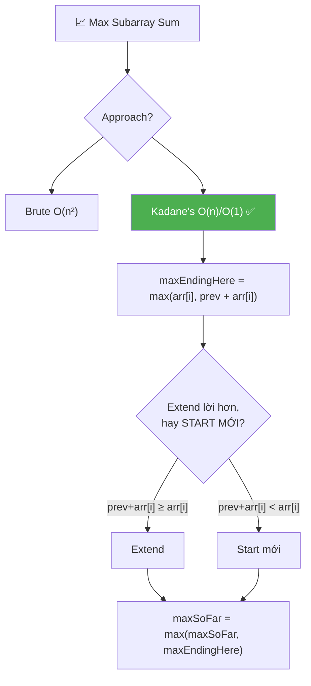

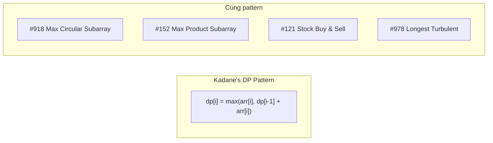

---

## R — Repeat & Clarify

🧠 _"maxEndingHere = max(arr[i], prev + arr[i]). 'Extend hay start mới?' Mỗi bước 1 quyết định. O(n)!"_

> 🎙️ _"Find the contiguous subarray with the largest sum."_

### Clarification Questions

```
Q: Subarray phải contiguous?
A: CÓ! subarray = phần tử LIÊN TIẾP. [1,_,3] KHÔNG hợp lệ!
   → Khác subsequence (CÓ THỂ skip phần tử)

Q: Mảng toàn số âm thì sao?
A: Vẫn phải chọn ÍT NHẤT 1 phần tử!
   → arr = [-5, -2, -8] → trả về -2 (phần tử âm LỚN NHẤT)
   → KHÔNG trả về 0 (subarray rỗng KHÔNG hợp lệ)

Q: arr có thể rỗng không?
A: Thường n ≥ 1. Nếu rỗng → handle đặc biệt (return 0 hoặc -Infinity)

Q: Giá trị phần tử có giới hạn?
A: Có thể âm, dương, hoặc 0. Không overflow nếu dùng Number JS.

Q: Cần trả về subarray hay chỉ sum?
A: GfG/LC #53: chỉ sum. Follow-up: trả về indices hoặc subarray thực.
```

### Tại sao bài này quan trọng?

```
  ┌──────────────────────────────────────────────────────────────┐
  │  Kadane's là THUẬT TOÁN KINH ĐIỂN NHẤT cho subarray!        │
  │                                                              │
  │  Áp dụng trực tiếp cho 10+ bài:                            │
  │    #53 Maximum Subarray (BÀI NÀY)                           │
  │    #918 Maximum Sum Circular Subarray                        │
  │    #152 Maximum Product Subarray (biến thể)                  │
  │    #978 Longest Turbulent Subarray                           │
  │    Buy & Sell Stock (#121) = Kadane trên price diffs!       │
  │                                                              │
  │  Dạy DP pattern: "optimal substructure tại mỗi vị trí"     │
  │                                                              │
  │  📌 3 INSIGHTS CỐT LÕI:                                     │
  │  1. "Extend hay start mới?" = quyết định GREEDY mỗi bước   │
  │  2. prefix sum ÂM → BỎ, start mới = LUÔN tối ưu           │
  │  3. dp[i] chỉ phụ thuộc dp[i-1] → O(1) space!             │
  └──────────────────────────────────────────────────────────────┘
```

---

## 🧠 Bản chất bài toán — Hiểu để NHỚ, không chỉ để GIẢI

### Kadane's = "Cắt lỗ" — Ẩn dụ chứng khoán

```
  🧠 Hình dung bạn đang ĐẦU TƯ CHỨNG KHOÁN:

  Mỗi ngày (index i), lãi/lỗ = arr[i]

  Bạn có 2 lựa chọn:
    ① GIỮ portfolio cũ + lãi/lỗ hôm nay (extend)
    ② BÁN TẤT CẢ, mua lại từ đầu (start mới)

  KHI NÀO nên bán?
    → Khi tổng portfolio ĐÃ ÂM!
    → Portfolio âm = "gánh nặng"
    → Giữ lại chỉ làm GIẢM lợi nhuận tương lai

  ┌──────────────────────────────────────────────────────────────┐
  │                                                              │
  │     Portfolio: +2, +3, -8         = -3 (ÂM!)               │
  │                                                              │
  │     Ngày tiếp: arr[i] = +7                                   │
  │                                                              │
  │     Giữ: -3 + 7 = +4                                        │
  │     Bán & mua lại: +7                                        │
  │                                                              │
  │     → +7 > +4 → BÁN! Start mới!                            │
  │     → Portfolio âm chỉ kéo bạn XUỐNG!                      │
  │                                                              │
  └──────────────────────────────────────────────────────────────┘

  📌 QUY TẮC: maxEndingHere < 0? → CẮT LỖ! Start mới!
```

### Core insight — "Extend hay start mới?"

```
  Tại mỗi index i, có 2 LỰA CHỌN:

  ① EXTEND subarray cũ: maxEndingHere + arr[i]
     → Giữ subarray trước, thêm arr[i]

  ② START MỚI: arr[i]
     → Bỏ tất cả trước, bắt đầu lại từ arr[i]

  CHỌN CÁI NÀO? → MAX của 2!
  maxEndingHere = max(arr[i], maxEndingHere + arr[i])

  🧠 KHI NÀO start mới?
     Khi maxEndingHere + arr[i] < arr[i]
     → maxEndingHere < 0!
     → "Subarray trước ĐANG ÂM → bỏ đi, bắt đầu lại!"

  📌 ĐÂY LÀ GREEDY/DP:
     "Nếu prefix sum ÂM → bỏ prefix, start mới!"
```

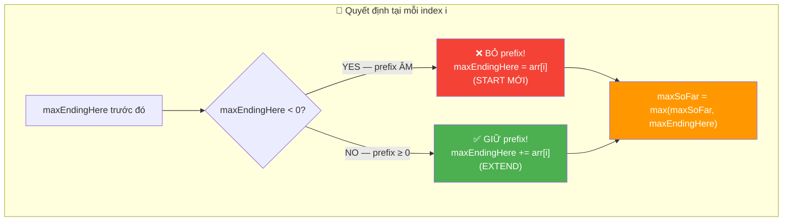

### Công thức cốt lõi — DP recurrence

```
  dp[i] = max subarray sum ENDING at index i

  dp[i] = max(arr[i], dp[i-1] + arr[i])

  Base: dp[0] = arr[0]
  Answer: max(dp[0], dp[1], ..., dp[n-1])

  Ý NGHĨA:
    dp[i] = "tổng lớn nhất của subarray KẾT THÚC ĐÚNG tại i"
    → Mỗi i PHẢI nằm trong subarray (ending at i!)
    → dp[i] phụ thuộc DUY NHẤT dp[i-1] → O(1) space!

  ┌────────────────────────────────────────────────────────────┐
  │  dp[i-1] = maxEndingHere  (trước khi update)              │
  │  max(dp) = maxSoFar       (track GLOBAL max)              │
  │                                                            │
  │  → Kadane = DP space-optimized!                           │
  │  → Thay mảng dp[] bằng 1 biến maxEndingHere!             │
  └────────────────────────────────────────────────────────────┘
```

### Chứng minh — Tại sao bỏ prefix âm LUÔN tối ưu?

```
  📐 CHỨNG MINH:

  Cho S = sum(arr[j..i-1]) = maxEndingHere (≤ 0)
  Xét subarray kết thúc tại index k ≥ i:

  TH1 (extend): sum(arr[j..k]) = S + sum(arr[i..k])
  TH2 (start mới): sum(arr[i..k])

  So sánh: TH1 - TH2 = S ≤ 0
  → TH1 ≤ TH2 → start mới LUÔN ≥ extend!

  KẾT LUẬN:
    Nếu S < 0 → start mới CHẮC CHẮN tốt hơn (strict)
    Nếu S = 0 → bằng nhau → start mới cũng OK
    Nếu S > 0 → extend tốt hơn → giữ lại!

  → maxEndingHere < 0 → BỎ prefix → LUÔN ĐÚNG! ∎
```

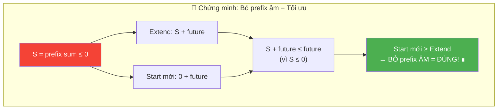

---

## 🧭 Luồng Suy Nghĩ — Từ đọc đề đến solution

### Bước 1: Đọc đề → Gạch chân KEYWORDS

```
  "Find the CONTIGUOUS SUBARRAY with the LARGEST SUM"

  Gạch chân:
    ✏️ CONTIGUOUS → liên tiếp, không skip
    ✏️ SUBARRAY → ≥ 1 phần tử (KHÔNG rỗng!)
    ✏️ LARGEST SUM → tìm MAX, không phải đếm

  🧠 "Subarray = window liên tiếp. Max sum = optimization."
  🧠 "Brute force = thử TẤT CẢ subarray. Có bao nhiêu?"
```

### Bước 2: Vẽ ví dụ NHỎ bằng tay

```
  arr = [2, 3, -8, 7, -1, 2, 3]

  🧠 "Subarray nào có sum lớn nhất?"
    [2] = 2
    [2,3] = 5
    [2,3,-8] = -3  ← giảm! -8 quá lớn
    [7,-1,2,3] = 11  ← CÓ VẺ LỚN NHẤT!

  🧠 "Nhận xét: khi tổng tích lũy ÂM (-3), bỏ đi và start mới
     từ 7 cho kết quả TỐT HƠN (11 > 4)!"
  🧠 "→ INSIGHT: prefix âm = gánh nặng → bỏ!"
```

### Bước 3: Brute Force → Bottleneck → Optimize

```
  Brute Force: thử TẤT CẢ cặp (i, j) → O(n²)
    for i: for j≥i: sum(arr[i..j]) → track max

  🧠 "Mỗi subarray ending at i: có cần tính lại từ đầu?"
  🧠 "KHÔNG! dp[i] = max(arr[i], dp[i-1] + arr[i])"
  🧠 "→ Chỉ cần giá trị TRƯỚC ĐÓ → 1 biến đủ!"

  ┌────────────────────────────────────────────────┐
  │  Brute O(n²): thử TẤT CẢ pair → TLE!        │
  │  Kadane O(n): mỗi i → 1 quyết định → FAST!  │
  └────────────────────────────────────────────────┘
```

### Bước 4: Tổng kết — Cây quyết định

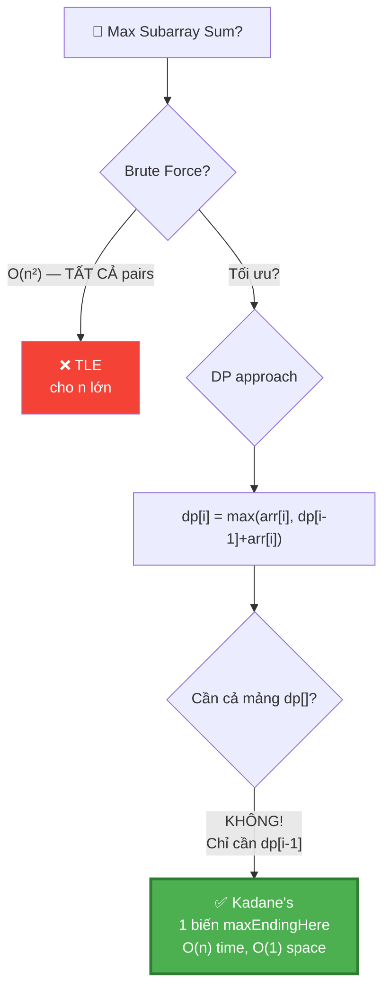

---

## E — Examples

```
  Ví dụ 1: Standard — arr = [2, 3, -8, 7, -1, 2, 3]
    → max subarray = [7, -1, 2, 3] = 11

  Ví dụ 2: All negative — arr = [-2, -4, -7, -1, -5]
    → max subarray = [-1] = -1 (phần tử lớn nhất!)

  Ví dụ 3: All positive — arr = [1, 2, 3, 4]
    → max subarray = [1, 2, 3, 4] = 10 (toàn bộ mảng!)

  Ví dụ 4: Single — arr = [5]
    → max subarray = [5] = 5

  Ví dụ 5: Negative in middle — arr = [5, -9, 6]
    → max subarray = [6] = 6 (bỏ 5 + (-9) = -4!)

  Ví dụ 6: Worth extending — arr = [5, -2, 7]
    → max subarray = [5, -2, 7] = 10 (giữ -2 vì prefix vẫn dương!)
```

### Minh họa trực quan — Quá trình duyệt

```
  arr = [2, 3, -8, 7, -1, 2, 3]

  ┌─────────────────────────────────────────────────────────────────┐
  │ i │ arr[i] │ maxEnd+arr[i] │ arr[i] │ Decision │ maxEnd│maxFar│
  ├───┼────────┼───────────────┼────────┼──────────┼───────┼──────┤
  │ 0 │    2   │  (init)       │   2    │ init     │  2    │  2   │
  │ 1 │    3   │  2+3 = 5      │   3    │ EXTEND   │  5    │  5   │
  │ 2 │   -8   │  5+(-8)= -3   │  -8    │ EXTEND*  │ -3    │  5   │
  │ 3 │    7   │  -3+7 = 4     │   7    │ START    │  7    │  7   │
  │ 4 │   -1   │  7+(-1)= 6    │  -1    │ EXTEND   │  6    │  7   │
  │ 5 │    2   │  6+2 = 8      │   2    │ EXTEND   │  8    │  8   │
  │ 6 │    3   │  8+3 = 11     │   3    │ EXTEND   │  11   │  11  │
  └─────────────────────────────────────────────────────────────────┘

  * i=2: max(-8, -3) = -3 → EXTEND (cả 2 âm, chọn ít âm hơn)
    Nhưng maxSoFar vẫn giữ 5!

  🧠 i=3: KEY MOMENT!
    maxEnd = -3 (ÂM!) → prefix là gánh nặng
    max(7, -3+7) = max(7, 4) = 7 → START MỚI!
    → Bỏ [2, 3, -8], bắt đầu lại từ [7]!

  → Answer: maxSoFar = 11, subarray = [7, -1, 2, 3] ✅
```

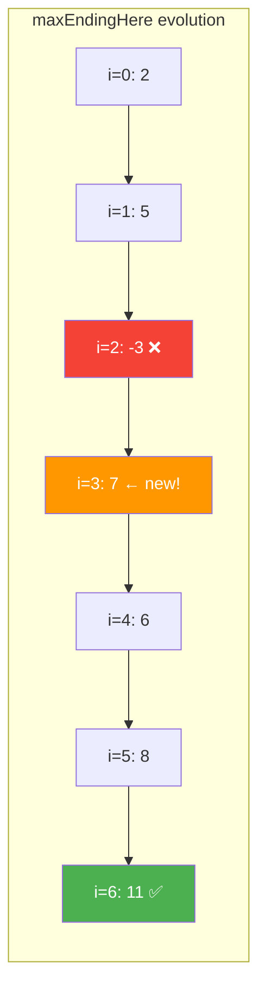

### Trace cho edge case: All Negative [-2, -4, -7, -1, -5]

```
  ┌───┬────────┬───────────────┬────────┬──────────┬───────┬──────┐
  │ i │ arr[i] │ maxEnd+arr[i] │ arr[i] │ Decision │ maxEnd│maxFar│
  ├───┼────────┼───────────────┼────────┼──────────┼───────┼──────┤
  │ 0 │   -2   │  (init)       │  -2    │ init     │  -2   │  -2  │
  │ 1 │   -4   │  -2+(-4)= -6  │  -4    │ START    │  -4   │  -2  │
  │ 2 │   -7   │  -4+(-7)=-11  │  -7    │ START    │  -7   │  -2  │
  │ 3 │   -1   │  -7+(-1)= -8  │  -1    │ START    │  -1   │  -1  │
  │ 4 │   -5   │  -1+(-5)= -6  │  -5    │ START    │  -5   │  -1  │
  └───┴────────┴───────────────┴────────┴──────────┴───────┴──────┘

  🧠 Mỗi bước đều START MỚI vì maxEnd luôn ÂM!
  → maxSoFar = -1 (phần tử ÂM LỚN NHẤT) ✅

  📌 Tại sao init arr[0] thay vì 0?
    Nếu init 0: maxSoFar = 0 → SAI! (0 > -1 nhưng không valid!)
    arr[0] đảm bảo giá trị BẮT ĐẦU từ MỘT phần tử thực!
```

### Trace cho edge case: "Worth extending" [5, -2, 7]

```
  ┌───┬────────┬───────────────┬────────┬──────────┬───────┬──────┐
  │ i │ arr[i] │ maxEnd+arr[i] │ arr[i] │ Decision │ maxEnd│maxFar│
  ├───┼────────┼───────────────┼────────┼──────────┼───────┼──────┤
  │ 0 │    5   │  (init)       │   5    │ init     │   5   │  5   │
  │ 1 │   -2   │  5+(-2) = 3   │  -2    │ EXTEND   │   3   │  5   │
  │ 2 │    7   │  3+7 = 10     │   7    │ EXTEND   │  10   │  10  │
  └───┴────────┴───────────────┴────────┴──────────┴───────┴──────┘

  🧠 i=1: maxEnd = 5 > 0 → prefix DƯƠNG → GIỮ!
    Dù arr[1] = -2 (âm), nhưng prefix 5 vẫn giúp ích!
    → extend: 5 + (-2) = 3 > -2 = start mới → EXTEND!

  i=2: maxEnd = 3 > 0 → prefix DƯƠNG → GIỮ!
    → extend: 3 + 7 = 10 > 7 → EXTEND!
    → Answer = 10 = [5, -2, 7] ✅

  📌 Key: số ÂM NHỎ giữa 2 số dương → GIỮ!
     Vì prefix vẫn > 0 → đóng góp DƯƠNG cho tương lai!
```

---

## A — Approach

### Approach 1: Brute Force — O(n²)

```
  💡 Ý tưởng: Thử TẤT CẢ subarray, tìm max

  ┌──────────────────────────────────────────────────────────────┐
  │  for i = 0 → n-1:           ← start index                  │
  │    sum = 0                                                   │
  │    for j = i → n-1:         ← end index                     │
  │      sum += arr[j]          ← running sum!                  │
  │      maxSum = max(maxSum, sum)                               │
  │                                                              │
  │  Time: O(n²)  Space: O(1)                                   │
  │  → TLE cho n lớn! Nhưng đơn giản, dùng để VERIFY           │
  └──────────────────────────────────────────────────────────────┘

  📌 Trick: sum chạy liên tục (chỉ += arr[j])
     KHÔNG tính lại sum từ đầu → O(n²) thay O(n³)!
```

### Approach 2: Kadane's Algorithm — O(n) time, O(1) space ✅

```
  💡 KEY INSIGHT: Tại mỗi i, chỉ 1 quyết định:
     "Extend subarray cũ hay start mới?"

  ┌──────────────────────────────────────────────────────────────┐
  │  maxEndingHere = best subarray sum ENDING AT current index  │
  │  maxSoFar = best subarray sum SEEN SO FAR (global max)     │
  │                                                              │
  │  Recurrence:                                                 │
  │    maxEndingHere = max(arr[i], maxEndingHere + arr[i])       │
  │    maxSoFar = max(maxSoFar, maxEndingHere)                  │
  │                                                              │
  │  Init: maxEndingHere = arr[0], maxSoFar = arr[0]            │
  │  Loop: i = 1 → n-1                                          │
  │                                                              │
  │  Time: O(n)    Space: O(1)                                   │
  │  → OPTIMAL! O(n) là lower bound (phải đọc mọi phần tử)    │
  └──────────────────────────────────────────────────────────────┘
```

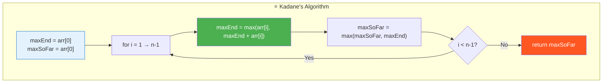

### Approach 3: Divide & Conquer — O(n log n)

```
  💡 Ý tưởng: Chia mảng thành 2 nửa, tìm max ở:
     ① Nửa trái
     ② Nửa phải
     ③ Cross boundary (subarray VƯỢT QUA giữa)

  Time: O(n log n)   Space: O(log n) — call stack
  → CHẬM HƠN Kadane! Nhưng interview hay hỏi!

  📌 Khi nào dùng?
    → Khi interviewer nói "không dùng DP"
    → Khi cần hiểu divide & conquer concept
    → KHÔNG dùng cho production (Kadane tốt hơn mọi mặt!)
```

---

## C — Code ✅

### Solution 1: Brute Force — O(n²)

```javascript
function maxSubarrayBrute(arr) {
  let maxSum = arr[0];

  for (let i = 0; i < arr.length; i++) {
    let sum = 0;
    for (let j = i; j < arr.length; j++) {
      sum += arr[j];
      maxSum = Math.max(maxSum, sum);
    }
  }

  return maxSum;
}
```

```
  📝 Line-by-line:

  Line 2: maxSum = arr[0] (KHÔNG PHẢI -Infinity!)
    → arr[0] đảm bảo khởi tạo từ phần tử thực
    → -Infinity cũng OK nhưng arr[0] rõ ràng hơn

  Line 5: sum = 0 → reset cho mỗi start index i mới
  Line 6-7: sum += arr[j] → running sum (KHÔNG tính lại!)
    → sum tại (i,j) = sum tại (i,j-1) + arr[j]
    → Tiết kiệm: O(n²) thay O(n³)

  ⚠️ CHỈ DÙNG ĐỂ: verify đáp án, KHÔNG dùng interview!
```

### Solution 2: Kadane's — O(n)/O(1) ✅

```javascript
function maxSubarrayKadane(arr) {
  let maxEndingHere = arr[0];
  let maxSoFar = arr[0];

  for (let i = 1; i < arr.length; i++) {
    maxEndingHere = Math.max(arr[i], maxEndingHere + arr[i]);
    maxSoFar = Math.max(maxSoFar, maxEndingHere);
  }

  return maxSoFar;
}
```

```
  📝 Line-by-line:

  Line 2-3: khởi tạo = arr[0] (KHÔNG PHẢI 0!)
    → ⚠️ Nếu tất cả phần tử ÂM: max = phần tử ÂM LỚN NHẤT!
    → Khởi tạo 0 → return 0 → SAI!

  Line 5: i = 1 (KHÔNG PHẢI i = 0!)
    → arr[0] đã xử lý ở init → bắt đầu từ 1!
    → Nếu bắt đầu từ 0: arr[0] bị "xử lý 2 lần"

  Line 6: maxEndingHere = Math.max(arr[i], maxEndingHere + arr[i])
    → "Extend (maxEnd + arr[i]) hay start mới (arr[i])?"
    → Tương đương: if (maxEndingHere < 0) maxEndingHere = 0;
       maxEndingHere += arr[i];
    → Nhưng Math.max version xử lý ALL-NEGATIVE đúng!

  Line 7: maxSoFar = Math.max(maxSoFar, maxEndingHere)
    → Track max TOÀN CỤC qua tất cả positions
    → maxEndingHere có thể GIẢM (khi gặp số âm)
    → maxSoFar CHỈ TĂNG → giữ kết quả tốt nhất!
```

### Solution 3: Kadane's with Indices — O(n)/O(1)

```javascript
function maxSubarrayWithIndices(arr) {
  let maxEnd = arr[0], maxSoFar = arr[0];
  let start = 0, end = 0, tempStart = 0;

  for (let i = 1; i < arr.length; i++) {
    if (arr[i] > maxEnd + arr[i]) {
      // START MỚI tại i
      maxEnd = arr[i];
      tempStart = i;
    } else {
      // EXTEND subarray cũ
      maxEnd += arr[i];
    }

    if (maxEnd > maxSoFar) {
      maxSoFar = maxEnd;
      start = tempStart;  // lock in start
      end = i;            // update end
    }
  }

  return { sum: maxSoFar, subarray: arr.slice(start, end + 1) };
}
```

```
  📝 TẠI SAO cần tempStart?

  tempStart = "start ĐANG THỬ" (có thể bị bỏ)
  start = "start ĐÃ CONFIRM" (khi maxEnd > maxSoFar)

  Ví dụ: [1, -5, 2, -1, 3]
    i=0: tempStart=0, start=0
    i=1: maxEnd=-4 < 1 → start vẫn=0, maxSoFar=1
    i=2: START MỚI → tempStart=2 (chưa confirm!)
    i=3: extend, maxEnd=1, 1 ≤ 1 → chưa confirm
    i=4: extend, maxEnd=4 > 1 → CONFIRM! start=2, end=4

  → subarray = [2, -1, 3] = 4
  → tempStart=2 chỉ CONFIRM khi maxEnd > maxSoFar!
```

### Solution 4: Alternative — Reset-to-zero style

```javascript
// ⚠️ KHÔNG handle all-negative! Chỉ dùng khi đề đảm bảo ≥ 1 dương
function maxSubarrayReset(arr) {
  let maxEnd = 0, maxSoFar = -Infinity;

  for (let i = 0; i < arr.length; i++) {
    maxEnd += arr[i];
    maxSoFar = Math.max(maxSoFar, maxEnd);
    if (maxEnd < 0) maxEnd = 0;  // reset!
  }

  return maxSoFar;
}
```

```
  📝 So sánh 2 styles:

  ┌─────────────────┬──────────────────────┬──────────────────────┐
  │  Tiêu chí        │ Math.max style       │ Reset-to-zero        │
  ├─────────────────┼──────────────────────┼──────────────────────┤
  │  Init            │ arr[0], arr[0]       │ 0, -Infinity         │
  │  All-negative    │ ✅ Handles!          │ ⚠️ Cần -Infinity     │
  │  Readability     │ ✅ Rõ "extend/start"│ ⚠️ Kém trực quan     │
  │  Interview       │ ✅ KHUYẾN KHÍCH     │ ⚠️ Dễ viết sai      │
  │  Loop start      │ i = 1               │ i = 0                │
  └─────────────────┴──────────────────────┴──────────────────────┘

  📌 Interview: LUÔN dùng Math.max style (Solution 2)!
```

---

## 🔬 Deep Dive — Giải thích CHI TIẾT từng dòng code

> 💡 Phần này phân tích **từng dòng code** để bạn hiểu **TẠI SAO** viết như vậy.

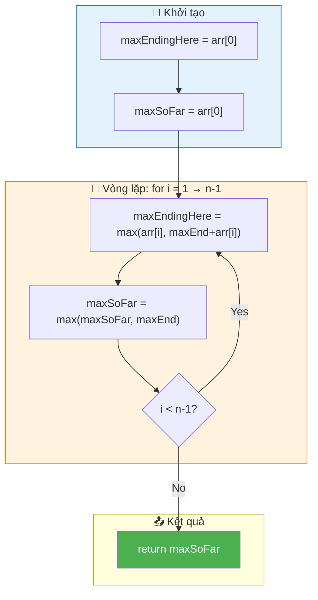

### Code đầy đủ với annotation

```javascript
function maxSubarrayKadane(arr) {
  // ═══════════════════════════════════════════════════════════════
  // DÒNG 1-2: Khởi tạo = arr[0]
  // ═══════════════════════════════════════════════════════════════
  //
  // TẠI SAO arr[0] chứ không phải 0?
  //   → arr = [-5, -2, -8] → nếu init 0 → return 0 → SAI!
  //   → arr[0] đảm bảo ÍT NHẤT 1 phần tử trong kết quả
  //
  // TẠI SAO cả 2 biến = arr[0]?
  //   → maxEndingHere: "best ending at index 0" = arr[0]
  //   → maxSoFar: "global best so far" = arr[0] (chỉ có 1 ứng viên)
  //
  let maxEndingHere = arr[0];
  let maxSoFar = arr[0];

  // ═══════════════════════════════════════════════════════════════
  // DÒNG 3-6: Vòng lặp — 1 quyết định mỗi bước
  // ═══════════════════════════════════════════════════════════════
  //
  // TẠI SAO i = 1?
  //   → i = 0 đã xử lý ở init (arr[0])
  //   → i = 0 lại: max(arr[0], arr[0]+arr[0]) → sai logic!
  //
  for (let i = 1; i < arr.length; i++) {

    // ─────────────────────────────────────────────────────────────
    // DÒNG 4: THE HEART OF KADANE'S
    // ─────────────────────────────────────────────────────────────
    //
    // 2 lựa chọn:
    //   arr[i]: bắt đầu subarray MỚI từ arr[i]
    //   maxEndingHere + arr[i]: EXTEND subarray cũ
    //
    // Chọn MAX! Tương đương:
    //   if (maxEndingHere < 0) maxEndingHere = arr[i];
    //   else maxEndingHere += arr[i];
    //
    // TẠI SAO Math.max thay if?
    //   → Gọn hơn, ít bug hơn, cùng logic
    //   → Interview: cả 2 đều OK
    //
    maxEndingHere = Math.max(arr[i], maxEndingHere + arr[i]);

    // ─────────────────────────────────────────────────────────────
    // DÒNG 5: Track global max
    // ─────────────────────────────────────────────────────────────
    //
    // TẠI SAO cần maxSoFar riêng?
    //   → maxEndingHere CÓ THỂ GIẢM (khi gặp số âm)!
    //   → maxSoFar CHỈ TĂNG → giữ đỉnh cao nhất!
    //
    // Ví dụ: [5, -10, 3]
    //   i=0: maxEnd=5, maxSoFar=5
    //   i=1: maxEnd=-5, maxSoFar=5 (VẪN 5! không giảm!)
    //   i=2: maxEnd=3, maxSoFar=5  (5 > 3 → giữ 5!)
    //
    maxSoFar = Math.max(maxSoFar, maxEndingHere);
  }

  return maxSoFar;
}
```

---

## 📐 Invariant — Chứng minh tính đúng đắn

```
  📐 INVARIANT (bất biến):

  Sau mỗi iteration i:
    maxEndingHere = max subarray sum ENDING AT index i
    maxSoFar = max subarray sum trong arr[0..i]

  Chứng minh bằng QUY NẠP:
  ┌──────────────────────────────────────────────────────────────────┐
  │  Base case: i = 0                                               │
  │    maxEndingHere = arr[0] = max subarray ending at 0            │
  │    maxSoFar = arr[0] = max in arr[0..0]                        │
  │    → Đúng! ✅                                                   │
  │                                                                 │
  │  Inductive step: giả sử đúng tại i-1, chứng minh tại i        │
  │                                                                 │
  │    Subarray ending at i có 2 dạng:                              │
  │      ① Chỉ gồm arr[i]: sum = arr[i]                            │
  │      ② arr[j..i] (j < i): sum = maxEndHere(i-1) + arr[i]      │
  │         (vì maxEndHere(i-1) = max ending at i-1, extend thêm  │
  │          arr[i] cho max subarray chứa i-1 rồi nối tới i)      │
  │                                                                 │
  │    Optimal = max(①, ②)                                          │
  │            = max(arr[i], maxEndHere(i-1) + arr[i]) ✅           │
  │                                                                 │
  │    maxSoFar = max(maxSoFar(i-1), maxEndHere(i))                │
  │            = max( max trong arr[0..i-1], max ending at i )      │
  │            = max trong arr[0..i] ✅                              │
  └──────────────────────────────────────────────────────────────────┘

  📐 Completeness:
    Answer = max subarray sum trong TOÀN MẢNG = maxSoFar(n-1) ✅
    → Duyệt TẤT CẢ vị trí ending → KHÔNG BỎ SÓT! ∎
```

---

## ❌ Common Mistakes — Lỗi thường gặp

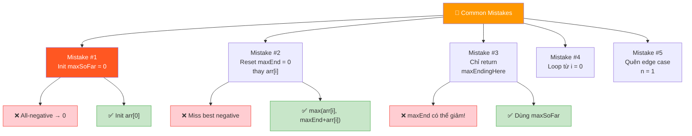

### Mistake 1: Khởi tạo maxSoFar = 0

```javascript
// ❌ SAI: all-negative → trả 0 (KHÔNG valid!)
let maxSoFar = 0;

// arr = [-2, -4] → maxSoFar vẫn 0 → SAI!
// Correct answer = -2

// ✅ ĐÚNG: khởi tạo arr[0]
let maxSoFar = arr[0];
// arr = [-2, -4] → maxSoFar = -2 ✅
```

```
  🧠 Tại sao quan trọng?
    → Subarray PHẢI có ≥ 1 phần tử
    → 0 = "subarray rỗng" → KHÔNG hợp lệ!
    → arr[0] = "ít nhất 1 phần tử" → luôn valid!
```

### Mistake 2: Reset maxEndingHere = 0 thay vì dùng max

```javascript
// ❌ SAI: logic reset-to-zero KHÔNG handle all-negative
function wrong(arr) {
  let maxEnd = 0, maxSoFar = 0;
  for (let i = 0; i < arr.length; i++) {
    maxEnd += arr[i];
    if (maxEnd < 0) maxEnd = 0;  // reset
    maxSoFar = Math.max(maxSoFar, maxEnd);
  }
  return maxSoFar;
}
// arr = [-3, -1, -2] → maxEnd luôn reset về 0 → return 0 ← SAI!

// ✅ ĐÚNG: Math.max style
maxEndingHere = Math.max(arr[i], maxEndingHere + arr[i]);
// arr = [-3, -1, -2] → maxEnd = -1, maxSoFar = -1 ✅
```

### Mistake 3: Chỉ return maxEndingHere (quên maxSoFar)

```javascript
// ❌ SAI: maxEndingHere CÓ THỂ GIẢM!
function wrong(arr) {
  let maxEnd = arr[0];
  for (let i = 1; i < arr.length; i++) {
    maxEnd = Math.max(arr[i], maxEnd + arr[i]);
  }
  return maxEnd;  // ← maxEnd có thể < max trước đó!
}

// arr = [5, -10, 3]
// i=0: maxEnd=5
// i=1: maxEnd=max(-10, -5)=-5
// i=2: maxEnd=max(3, -2)=3
// return 3 ← SAI! Answer = 5!

// ✅ ĐÚNG: track maxSoFar riêng
maxSoFar = Math.max(maxSoFar, maxEndingHere);
return maxSoFar;  // = 5 ✅
```

### Mistake 4: Nhầm "subarray" với "subsequence"

```
  ❌ Subarray ≠ Subsequence!

  arr = [2, -1, 3, -4, 5]

  Subarray: [2, -1, 3] → LIÊN TIẾP ✅
  Subsequence: [2, 3, 5] → SKIP -1 và -4 → KHÔNG liên tiếp

  Bài này: SUBARRAY → phải LIÊN TIẾP!
  → Kadane's CHỈ áp dụng cho subarray!
  → Subsequence = 0/1 knapsack → DP khác!

  📌 Nếu max subsequence sum (no constraint):
     Lấy TẤT CẢ số dương! O(n) trivial!
     → KHÔNG cần Kadane!
```

### Mistake 5: Quên edge case mảng 1 phần tử

```javascript
// ❌ SAI: loop không chạy, maxSoFar uninitialized?
function wrong(arr) {
  let maxEnd = 0, maxSoFar = -Infinity;
  for (let i = 0; i < arr.length; i++) { /* ... */ }
  return maxSoFar;
}
// arr = [7] → loop chạy 1 lần → OK nếu code đúng
// Nhưng init arr[0] style tự handle vì loop KHÔNG chạy (i=1 > 0)!

// ✅ ĐÚNG:
let maxEnd = arr[0], maxSoFar = arr[0];
for (let i = 1; i < arr.length; i++) { /* ... */ }
return maxSoFar;  // arr = [7] → loop skip → return 7 ✅
```

---

## O — Optimize

```
                Time     Space    Handle all-negative?
  Brute         O(n²)    O(1)     ✅
  Div&Conquer   O(nlogn) O(logn)  ✅
  Kadane ✅     O(n)     O(1)     ✅ (if init = arr[0])

  📌 Kadane = LOWER BOUND O(n)! Phải đọc mỗi phần tử!
```

### Có thể tối ưu hơn nữa không?

```
  Thời gian: KHÔNG! O(n) đã là optimal
    → Bắt buộc phải đọc MỌI phần tử ít nhất 1 lần
    → Chứng minh: Nếu skip arr[k] → arr[k] có thể là max element
      → Hoặc arr[k] có thể là số âm khiến ta start mới
      → KHÔNG THỂ quyết định đúng nếu không đọc!

  Space: KHÔNG! O(1) đã là optimal
    → Chỉ dùng 2 biến: maxEndingHere và maxSoFar

  📊 So sánh THỰC TẾ (n = 1,000,000):
    Kadane:        2n comparisons ≈ 2ms
    Brute Force:   n² additions ≈ 17 PHÚT! 😰
    Div&Conquer:   n log n ≈ 20n ≈ 20ms (log₂(10⁶) ≈ 20)
```

### So sánh 3 approaches

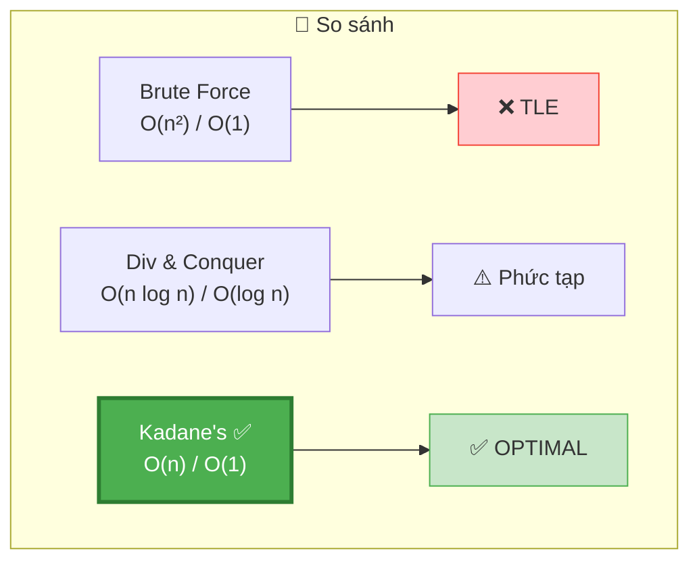

### ❓ "Tại sao không Sort?"

```
  ❌ KHÔNG ÁP DỤNG! Vì:
    Subarray = LIÊN TIẾP trong mảng NGUYÊN THỦY
    Sort thay đổi THỨ TỰ → phá vỡ tính contiguous!

  Ví dụ: arr = [2, -1, 3]
    Sort → [-1, 2, 3]
    Max subarray trong sorted: [2, 3] = 5
    Nhưng trong original: [2, -1, 3] = 4 ← KHÁC!
    Và [2, 3] KHÔNG liên tiếp trong original!
```

---

## T — Test

```
Test Cases:
  [2, 3, -8, 7, -1, 2, 3]     → 11     ✅ Standard (7-1+2+3)
  [-2, -4, -7, -1, -5]         → -1     ✅ All negative
  [1, 2, 3, 4]                 → 10     ✅ All positive (toàn bộ)
  [5]                           → 5      ✅ Single element
  [5, -9, 6]                   → 6      ✅ Start mới (bỏ 5-9=-4)
  [5, -2, 7]                   → 10     ✅ Worth extending
  [-1]                          → -1     ✅ Single negative
  [0, 0, 0]                    → 0      ✅ All zeros
  [1, -1, 1, -1, 1]            → 1      ✅ Alternating
  [-2, 1, -3, 4, -1, 2, 1, -5, 4] → 6  ✅ LC #53 example
```

### Edge Cases giải thích

```
  ┌──────────────────────────────────────────────────────────────────┐
  │  All negative:   Mỗi bước START MỚI (maxEnd luôn < 0)          │
  │                  → maxSoFar = phần tử ÂM LỚN NHẤT              │
  │                                                                  │
  │  All positive:   Không bao giờ start mới (maxEnd luôn > 0)     │
  │                  → maxSoFar = tổng TOÀN BỘ mảng                 │
  │                                                                  │
  │  Single:         Loop không chạy → return arr[0]                │
  │                                                                  │
  │  Worth extend:   [5, -2, 7]: -2 nhỏ, prefix vẫn dương          │
  │                  → keep -2, tổng = 10 > 7!                      │
  │                                                                  │
  │  Not worth:      [5, -9, 6]: -9 lớn, prefix thành ÂM           │
  │                  → bỏ prefix, start mới = 6 > -4+6=2!          │
  │                                                                  │
  │  📌 QUY TẮC: maxEnd > 0 → extend. maxEnd < 0 → start mới!    │
  └──────────────────────────────────────────────────────────────────┘
```

---

## 🗣️ Interview Script

### 🎙️ Think Out Loud — Mô phỏng phỏng vấn thực

```
  ──────────────── PHASE 1: Clarify ────────────────

  👤 Interviewer: "Find the contiguous subarray with the largest sum."

  🧑 You: "Let me clarify:
   1. Subarray must be contiguous — no skipping elements.
   2. Must contain at least one element — empty subarray not valid.
   3. Array can contain negative numbers.
   4. I just need to return the sum, not the subarray itself?"

  👤 Interviewer: "Correct."

  ──────────────── PHASE 2: Examples ────────────────

  🧑 You: "Let me trace an example: [2, 3, -8, 7, -1, 2, 3].
   Intuitively, [7, -1, 2, 3] = 11 seems optimal.
   The -8 makes the prefix [2, 3, -8] = -3, which is negative.
   So we should START FRESH from 7."

  ──────────────── PHASE 3: Approach ────────────────

  🧑 You: "Brute force: try all O(n²) subarrays. Too slow.

   Better: Kadane's algorithm. At each index, I decide:
   should I EXTEND the previous subarray or START FRESH?

   If the running sum (maxEndingHere) is negative, extending
   only hurts — any future sum would be LARGER without this
   negative prefix. So I start over.

   Formula: maxEndingHere = max(arr[i], maxEndingHere + arr[i])
   Track global max: maxSoFar = max(maxSoFar, maxEndingHere)

   O(n) time, O(1) space."

  ──────────────── PHASE 4: Code + Verify ────────────────

  🧑 You: [writes code, traces example, verifies all-negative case]

  "Key detail: I initialize with arr[0], not 0, so all-negative
   arrays return the least-negative element."

  ──────────────── PHASE 5: Follow-ups ────────────────

  👤 "What about circular subarrays? (#918)"
  🧑 "Two cases: normal Kadane OR totalSum - minSubarraySum.
      The min subarray is found with a 'min Kadane'."

  👤 "What about product instead of sum? (#152)"
  🧑 "Track both maxProduct AND minProduct at each step.
      Because negative × negative = positive — the min could
      become the max after multiplying by a negative number."

  👤 "Can you return the actual subarray?"
  🧑 "Yes — I track start/end indices. When I start fresh,
      I update tempStart. When maxEnd > maxSoFar, I confirm
      start = tempStart, end = i."
```

### Pattern & Liên kết

```
  KADANE'S = "Optimal Substructure at each position" pattern!

  Bài tương tự dùng CÙNG pattern:
  ┌──────────────────────────────────────────────────────────────┐
  │  #53  Max Subarray Sum (BÀI NÀY): Kadane's O(n)           │
  │  #918 Max Circular Subarray: Kadane + min Kadane            │
  │  #152 Max Product Subarray: track min AND max product       │
  │  #121 Stock I: Kadane on price diffs!                       │
  │  #560 Subarray Sum = K: Prefix Sum + HashMap                │
  │  #978 Longest Turbulent: reset on non-turbulent            │
  └──────────────────────────────────────────────────────────────┘
```

---

## 📚 Bài tập liên quan — Practice Problems

### Progression Path

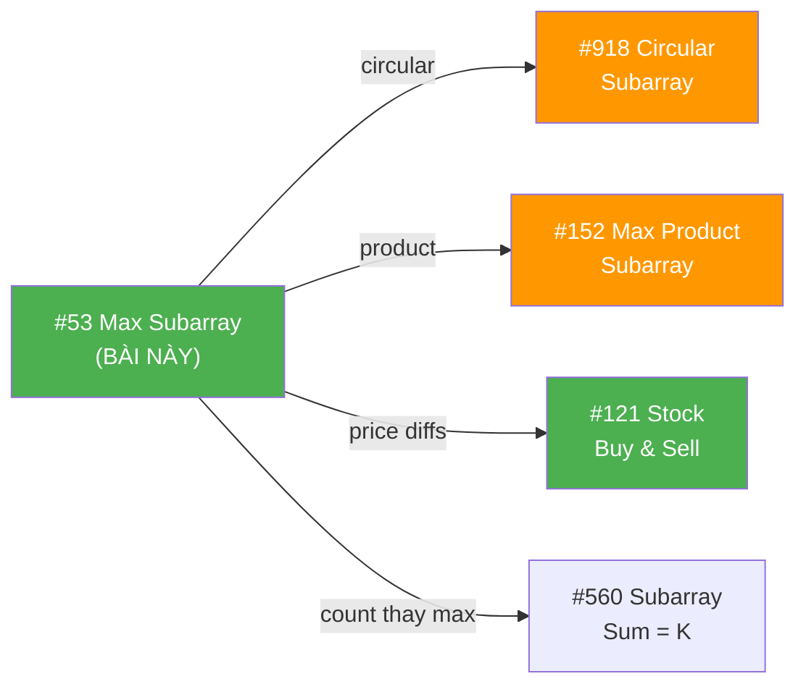

### 1. Max Circular Subarray (#918) — Medium

```
  Đề: Max subarray sum, nhưng mảng CIRCULAR (cuốn vòng)

  KEY INSIGHT — 2 trường hợp:
    ① Normal: max subarray KHÔNG cuốn vòng → Kadane's thường!
    ② Circular: max subarray CUỐN VÒNG
       = totalSum - minSubarraySum!
       (Bỏ min ở giữa = lấy 2 đầu!)

  function maxCircular(arr) {
    let maxKadane = kadane(arr);           // case ①
    let totalSum = arr.reduce((a,b) => a+b, 0);
    let minKadane = minKadaneHelper(arr);  // min subarray

    // ⚠️ Edge: nếu TẤT CẢ âm → totalSum-min = 0 → SAI!
    if (totalSum === minKadane) return maxKadane;

    return Math.max(maxKadane, totalSum - minKadane);  // case ②
  }

  📌 minKadane = Kadane nhưng dùng MIN thay MAX!
     minEndHere = min(arr[i], minEndHere + arr[i])
```

### 2. Max Product Subarray (#152) — Medium

```
  Đề: Max subarray PRODUCT (tích thay tổng)

  KEY INSIGHT: negative × negative = POSITIVE!
  → Tích ÂM nhỏ nhất có thể THÀNH LỚN NHẤT!
  → Track CẢ max VÀ min!

  function maxProduct(arr) {
    let maxProd = arr[0], minProd = arr[0], result = arr[0];

    for (let i = 1; i < arr.length; i++) {
      if (arr[i] < 0) [maxProd, minProd] = [minProd, maxProd]; // swap!

      maxProd = Math.max(arr[i], maxProd * arr[i]);
      minProd = Math.min(arr[i], minProd * arr[i]);
      result = Math.max(result, maxProd);
    }
    return result;
  }

  📌 So sánh với Kadane:
    Sum:     chỉ cần maxEndingHere (vì cộng số âm luôn giảm)
    Product: cần maxProd VÀ minProd (vì nhân số âm đổi dấu!)
```

### 3. Stock Buy & Sell I (#121) — Easy

```
  Đề: Buy once, sell once, maximize profit.

  KEY INSIGHT: profit[i] = price[i] - price[i-1]
  → Max profit = max subarray sum of PRICE DIFFS!

  function maxProfit(prices) {
    let maxEnd = 0, maxSoFar = 0;
    for (let i = 1; i < prices.length; i++) {
      maxEnd = Math.max(0, maxEnd + prices[i] - prices[i-1]);
      maxSoFar = Math.max(maxSoFar, maxEnd);
    }
    return maxSoFar;
  }

  📌 HOẶC cách đơn giản hơn (track minPrice):
    minPrice = prices[0]
    for i: maxProfit = max(maxProfit, prices[i] - minPrice)
           minPrice = min(minPrice, prices[i])

  📌 Cả 2 cách = O(n), O(1). Stock I là KADANE ẨN DANH!
```

### Tổng kết — Kadane biến thể

```
  ┌──────────────────────────────────────────────────────────────┐
  │  BÀI                     │  Kadane track GÌ?                │
  ├──────────────────────────────────────────────────────────────┤
  │  #53 Max Subarray Sum    │  maxEndHere, maxSoFar            │
  │  #918 Circular           │  + minEndHere, totalSum          │
  │  #152 Max Product        │  maxProd, minProd (cả 2!)        │
  │  #121 Stock I            │  maxEnd trên price diffs          │
  │  #978 Longest Turbulent  │  inc, dec (2 counters)           │
  └──────────────────────────────────────────────────────────────┘

  📌 Kadane CORE = "extend or restart at each position"
     Biến thể = thay ĐỔI CÁI GÌ TRACK (sum/product/count)
     → Hiểu Kadane = GIẢI ĐƯỢC 5+ BÀI!
```

### Skeleton code — Reusable template

```javascript
// TEMPLATE: "Tìm max/min subarray theo tiêu chí X"
function kadaneTemplate(arr) {
  let bestEndingHere = arr[0];
  let bestSoFar = arr[0];

  for (let i = 1; i < arr.length; i++) {
    // CORE DECISION: extend or restart
    bestEndingHere = Math.max(
      arr[i],                    // restart
      bestEndingHere + arr[i]    // extend (thay + bằng * cho product)
    );

    bestSoFar = Math.max(bestSoFar, bestEndingHere);
  }

  return bestSoFar;
}

// Sum:     + arr[i]     → standard Kadane
// Product: * arr[i]     → track min too!
// Count:   reset or ++  → longest subarray variant
```

---

## 📊 Tổng kết — Key Insights

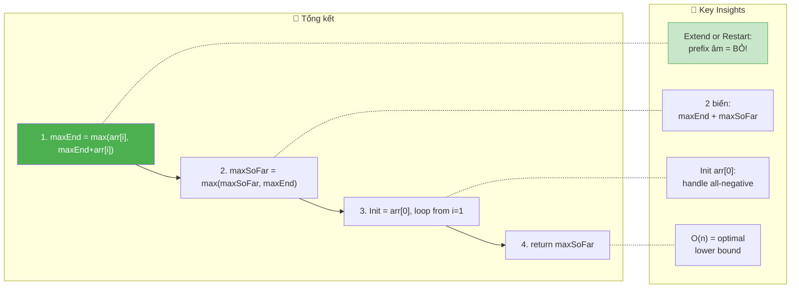

```
  ┌──────────────────────────────────────────────────────────────────────────┐
  │  📌 3 ĐIỀU PHẢI NHỚ                                                    │
  │                                                                          │
  │  1. QUYẾT ĐỊNH: max(arr[i], maxEndingHere + arr[i])                     │
  │     → "Extend hay start mới?" = THE HEART of Kadane's                  │
  │     → maxEndingHere < 0 → prefix ÂM → BỎ, start mới!                 │
  │                                                                          │
  │  2. KHỞI TẠO: maxEndingHere = maxSoFar = arr[0]                        │
  │     → KHÔNG PHẢI 0! (all-negative → trả 0 = SAI!)                     │
  │     → arr[0] đảm bảo ≥ 1 phần tử trong kết quả                       │
  │                                                                          │
  │  3. PATTERN: "Optimal substructure at each position"                    │
  │     → dp[i] = max(start_new, extend_old)                               │
  │     → dp[i] chỉ phụ thuộc dp[i-1] → O(1) space!                      │
  │     → Áp dụng cho #918, #152, #121, #978 → 1 PATTERN = 5+ BÀI!       │
  └──────────────────────────────────────────────────────────────────────────┘
```
