# 📈 Maximum Subarray Sum — Kadane's Algorithm — LeetCode #53 / GfG (Easy)

> 📖 Code: [Kadane's Algorithm.js](./Kadane%27s%20Algorithm.js)

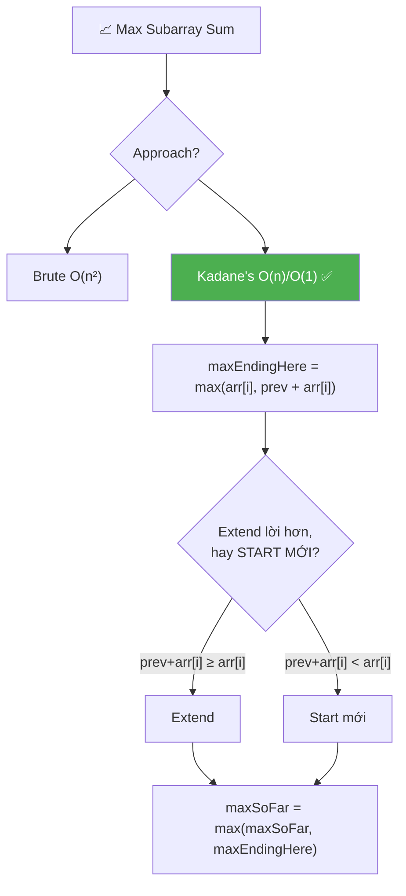

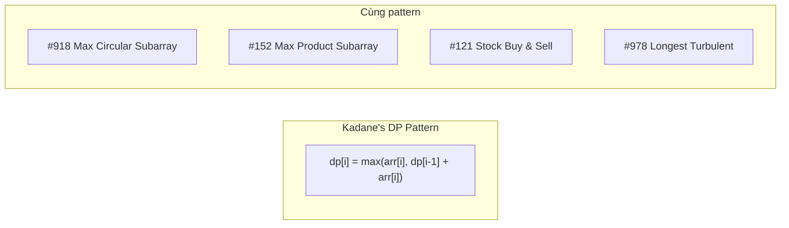

---

## R — Repeat & Clarify

🧠 _"maxEndingHere = max(arr[i], prev + arr[i]). 'Extend hay start mới?' Mỗi bước 1 quyết định. O(n)!"_

> 🎙️ _"Find the contiguous subarray with the largest sum."_

### Clarification Questions

```
Q: Subarray phải contiguous?
A: CÓ! subarray = phần tử LIÊN TIẾP. [1,_,3] KHÔNG hợp lệ!
   → Khác subsequence (CÓ THỂ skip phần tử)

Q: Mảng toàn số âm thì sao?
A: Vẫn phải chọn ÍT NHẤT 1 phần tử!
   → arr = [-5, -2, -8] → trả về -2 (phần tử âm LỚN NHẤT)
   → KHÔNG trả về 0 (subarray rỗng KHÔNG hợp lệ)

Q: arr có thể rỗng không?
A: Thường n ≥ 1. Nếu rỗng → handle đặc biệt (return 0 hoặc -Infinity)

Q: Giá trị phần tử có giới hạn?
A: Có thể âm, dương, hoặc 0. Không overflow nếu dùng Number JS.

Q: Cần trả về subarray hay chỉ sum?
A: GfG/LC #53: chỉ sum. Follow-up: trả về indices hoặc subarray thực.
```

### Tại sao bài này quan trọng?

```
  ┌──────────────────────────────────────────────────────────────┐
  │  Kadane's là THUẬT TOÁN KINH ĐIỂN NHẤT cho subarray!        │
  │                                                              │
  │  Áp dụng trực tiếp cho 10+ bài:                            │
  │    #53 Maximum Subarray (BÀI NÀY)                           │
  │    #918 Maximum Sum Circular Subarray                        │
  │    #152 Maximum Product Subarray (biến thể)                  │
  │    #978 Longest Turbulent Subarray                           │
  │    Buy & Sell Stock (#121) = Kadane trên price diffs!       │
  │                                                              │
  │  Dạy DP pattern: "optimal substructure tại mỗi vị trí"     │
  │                                                              │
  │  📌 3 INSIGHTS CỐT LÕI:                                     │
  │  1. "Extend hay start mới?" = quyết định GREEDY mỗi bước   │
  │  2. prefix sum ÂM → BỎ, start mới = LUÔN tối ưu           │
  │  3. dp[i] chỉ phụ thuộc dp[i-1] → O(1) space!             │
  └──────────────────────────────────────────────────────────────┘
```

---

## 🧠 Bản chất bài toán — Hiểu để NHỚ, không chỉ để GIẢI

### Kadane's = "Cắt lỗ" — Ẩn dụ chứng khoán

```
  🧠 Hình dung bạn đang ĐẦU TƯ CHỨNG KHOÁN:

  Mỗi ngày (index i), lãi/lỗ = arr[i]

  Bạn có 2 lựa chọn:
    ① GIỮ portfolio cũ + lãi/lỗ hôm nay (extend)
    ② BÁN TẤT CẢ, mua lại từ đầu (start mới)

  KHI NÀO nên bán?
    → Khi tổng portfolio ĐÃ ÂM!
    → Portfolio âm = "gánh nặng"
    → Giữ lại chỉ làm GIẢM lợi nhuận tương lai

  ┌──────────────────────────────────────────────────────────────┐
  │                                                              │
  │     Portfolio: +2, +3, -8         = -3 (ÂM!)               │
  │                                                              │
  │     Ngày tiếp: arr[i] = +7                                   │
  │                                                              │
  │     Giữ: -3 + 7 = +4                                        │
  │     Bán & mua lại: +7                                        │
  │                                                              │
  │     → +7 > +4 → BÁN! Start mới!                            │
  │     → Portfolio âm chỉ kéo bạn XUỐNG!                      │
  │                                                              │
  └──────────────────────────────────────────────────────────────┘

  📌 QUY TẮC: maxEndingHere < 0? → CẮT LỖ! Start mới!
```

### Core insight — "Extend hay start mới?"

```
  Tại mỗi index i, có 2 LỰA CHỌN:

  ① EXTEND subarray cũ: maxEndingHere + arr[i]
     → Giữ subarray trước, thêm arr[i]

  ② START MỚI: arr[i]
     → Bỏ tất cả trước, bắt đầu lại từ arr[i]

  CHỌN CÁI NÀO? → MAX của 2!
  maxEndingHere = max(arr[i], maxEndingHere + arr[i])

  🧠 KHI NÀO start mới?
     Khi maxEndingHere + arr[i] < arr[i]
     → maxEndingHere < 0!
     → "Subarray trước ĐANG ÂM → bỏ đi, bắt đầu lại!"

  📌 ĐÂY LÀ GREEDY/DP:
     "Nếu prefix sum ÂM → bỏ prefix, start mới!"
```

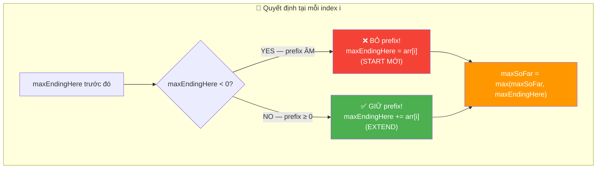

### Công thức cốt lõi — DP recurrence

```
  dp[i] = max subarray sum ENDING at index i

  dp[i] = max(arr[i], dp[i-1] + arr[i])

  Base: dp[0] = arr[0]
  Answer: max(dp[0], dp[1], ..., dp[n-1])

  Ý NGHĨA:
    dp[i] = "tổng lớn nhất của subarray KẾT THÚC ĐÚNG tại i"
    → Mỗi i PHẢI nằm trong subarray (ending at i!)
    → dp[i] phụ thuộc DUY NHẤT dp[i-1] → O(1) space!

  ┌────────────────────────────────────────────────────────────┐
  │  dp[i-1] = maxEndingHere  (trước khi update)              │
  │  max(dp) = maxSoFar       (track GLOBAL max)              │
  │                                                            │
  │  → Kadane = DP space-optimized!                           │
  │  → Thay mảng dp[] bằng 1 biến maxEndingHere!             │
  └────────────────────────────────────────────────────────────┘
```

### Chứng minh — Tại sao bỏ prefix âm LUÔN tối ưu?

```
  📐 CHỨNG MINH:

  Cho S = sum(arr[j..i-1]) = maxEndingHere (≤ 0)
  Xét subarray kết thúc tại index k ≥ i:

  TH1 (extend): sum(arr[j..k]) = S + sum(arr[i..k])
  TH2 (start mới): sum(arr[i..k])

  So sánh: TH1 - TH2 = S ≤ 0
  → TH1 ≤ TH2 → start mới LUÔN ≥ extend!

  KẾT LUẬN:
    Nếu S < 0 → start mới CHẮC CHẮN tốt hơn (strict)
    Nếu S = 0 → bằng nhau → start mới cũng OK
    Nếu S > 0 → extend tốt hơn → giữ lại!

  → maxEndingHere < 0 → BỎ prefix → LUÔN ĐÚNG! ∎
```

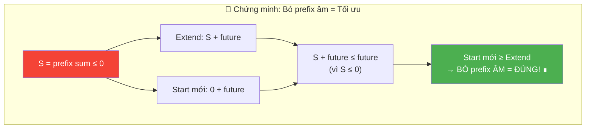

---

## 🧭 Luồng Suy Nghĩ — Từ đọc đề đến solution

### Bước 1: Đọc đề → Gạch chân KEYWORDS

```
  "Find the CONTIGUOUS SUBARRAY with the LARGEST SUM"

  Gạch chân:
    ✏️ CONTIGUOUS → liên tiếp, không skip
    ✏️ SUBARRAY → ≥ 1 phần tử (KHÔNG rỗng!)
    ✏️ LARGEST SUM → tìm MAX, không phải đếm

  🧠 "Subarray = window liên tiếp. Max sum = optimization."
  🧠 "Brute force = thử TẤT CẢ subarray. Có bao nhiêu?"
```

### Bước 2: Vẽ ví dụ NHỎ bằng tay

```
  arr = [2, 3, -8, 7, -1, 2, 3]

  🧠 "Subarray nào có sum lớn nhất?"
    [2] = 2
    [2,3] = 5
    [2,3,-8] = -3  ← giảm! -8 quá lớn
    [7,-1,2,3] = 11  ← CÓ VẺ LỚN NHẤT!

  🧠 "Nhận xét: khi tổng tích lũy ÂM (-3), bỏ đi và start mới
     từ 7 cho kết quả TỐT HƠN (11 > 4)!"
  🧠 "→ INSIGHT: prefix âm = gánh nặng → bỏ!"
```

### Bước 3: Brute Force → Bottleneck → Optimize

```
  Brute Force: thử TẤT CẢ cặp (i, j) → O(n²)
    for i: for j≥i: sum(arr[i..j]) → track max

  🧠 "Mỗi subarray ending at i: có cần tính lại từ đầu?"
  🧠 "KHÔNG! dp[i] = max(arr[i], dp[i-1] + arr[i])"
  🧠 "→ Chỉ cần giá trị TRƯỚC ĐÓ → 1 biến đủ!"

  ┌────────────────────────────────────────────────┐
  │  Brute O(n²): thử TẤT CẢ pair → TLE!        │
  │  Kadane O(n): mỗi i → 1 quyết định → FAST!  │
  └────────────────────────────────────────────────┘
```

### Bước 4: Tổng kết — Cây quyết định

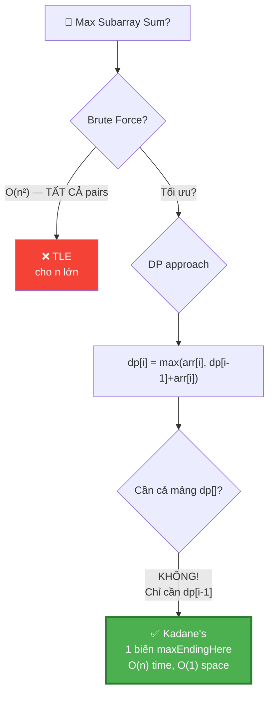

---

## E — Examples

```
  Ví dụ 1: Standard — arr = [2, 3, -8, 7, -1, 2, 3]
    → max subarray = [7, -1, 2, 3] = 11

  Ví dụ 2: All negative — arr = [-2, -4, -7, -1, -5]
    → max subarray = [-1] = -1 (phần tử lớn nhất!)

  Ví dụ 3: All positive — arr = [1, 2, 3, 4]
    → max subarray = [1, 2, 3, 4] = 10 (toàn bộ mảng!)

  Ví dụ 4: Single — arr = [5]
    → max subarray = [5] = 5

  Ví dụ 5: Negative in middle — arr = [5, -9, 6]
    → max subarray = [6] = 6 (bỏ 5 + (-9) = -4!)

  Ví dụ 6: Worth extending — arr = [5, -2, 7]
    → max subarray = [5, -2, 7] = 10 (giữ -2 vì prefix vẫn dương!)
```

### Minh họa trực quan — Quá trình duyệt

```
  arr = [2, 3, -8, 7, -1, 2, 3]

  ┌─────────────────────────────────────────────────────────────────┐
  │ i │ arr[i] │ maxEnd+arr[i] │ arr[i] │ Decision │ maxEnd│maxFar│
  ├───┼────────┼───────────────┼────────┼──────────┼───────┼──────┤
  │ 0 │    2   │  (init)       │   2    │ init     │  2    │  2   │
  │ 1 │    3   │  2+3 = 5      │   3    │ EXTEND   │  5    │  5   │
  │ 2 │   -8   │  5+(-8)= -3   │  -8    │ EXTEND*  │ -3    │  5   │
  │ 3 │    7   │  -3+7 = 4     │   7    │ START    │  7    │  7   │
  │ 4 │   -1   │  7+(-1)= 6    │  -1    │ EXTEND   │  6    │  7   │
  │ 5 │    2   │  6+2 = 8      │   2    │ EXTEND   │  8    │  8   │
  │ 6 │    3   │  8+3 = 11     │   3    │ EXTEND   │  11   │  11  │
  └─────────────────────────────────────────────────────────────────┘

  * i=2: max(-8, -3) = -3 → EXTEND (cả 2 âm, chọn ít âm hơn)
    Nhưng maxSoFar vẫn giữ 5!

  🧠 i=3: KEY MOMENT!
    maxEnd = -3 (ÂM!) → prefix là gánh nặng
    max(7, -3+7) = max(7, 4) = 7 → START MỚI!
    → Bỏ [2, 3, -8], bắt đầu lại từ [7]!

  → Answer: maxSoFar = 11, subarray = [7, -1, 2, 3] ✅
```

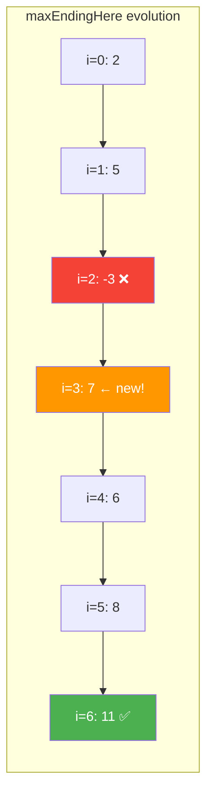

### Trace cho edge case: All Negative [-2, -4, -7, -1, -5]

```
  ┌───┬────────┬───────────────┬────────┬──────────┬───────┬──────┐
  │ i │ arr[i] │ maxEnd+arr[i] │ arr[i] │ Decision │ maxEnd│maxFar│
  ├───┼────────┼───────────────┼────────┼──────────┼───────┼──────┤
  │ 0 │   -2   │  (init)       │  -2    │ init     │  -2   │  -2  │
  │ 1 │   -4   │  -2+(-4)= -6  │  -4    │ START    │  -4   │  -2  │
  │ 2 │   -7   │  -4+(-7)=-11  │  -7    │ START    │  -7   │  -2  │
  │ 3 │   -1   │  -7+(-1)= -8  │  -1    │ START    │  -1   │  -1  │
  │ 4 │   -5   │  -1+(-5)= -6  │  -5    │ START    │  -5   │  -1  │
  └───┴────────┴───────────────┴────────┴──────────┴───────┴──────┘

  🧠 Mỗi bước đều START MỚI vì maxEnd luôn ÂM!
  → maxSoFar = -1 (phần tử ÂM LỚN NHẤT) ✅

  📌 Tại sao init arr[0] thay vì 0?
    Nếu init 0: maxSoFar = 0 → SAI! (0 > -1 nhưng không valid!)
    arr[0] đảm bảo giá trị BẮT ĐẦU từ MỘT phần tử thực!
```

### Trace cho edge case: "Worth extending" [5, -2, 7]

```
  ┌───┬────────┬───────────────┬────────┬──────────┬───────┬──────┐
  │ i │ arr[i] │ maxEnd+arr[i] │ arr[i] │ Decision │ maxEnd│maxFar│
  ├───┼────────┼───────────────┼────────┼──────────┼───────┼──────┤
  │ 0 │    5   │  (init)       │   5    │ init     │   5   │  5   │
  │ 1 │   -2   │  5+(-2) = 3   │  -2    │ EXTEND   │   3   │  5   │
  │ 2 │    7   │  3+7 = 10     │   7    │ EXTEND   │  10   │  10  │
  └───┴────────┴───────────────┴────────┴──────────┴───────┴──────┘

  🧠 i=1: maxEnd = 5 > 0 → prefix DƯƠNG → GIỮ!
    Dù arr[1] = -2 (âm), nhưng prefix 5 vẫn giúp ích!
    → extend: 5 + (-2) = 3 > -2 = start mới → EXTEND!

  i=2: maxEnd = 3 > 0 → prefix DƯƠNG → GIỮ!
    → extend: 3 + 7 = 10 > 7 → EXTEND!
    → Answer = 10 = [5, -2, 7] ✅

  📌 Key: số ÂM NHỎ giữa 2 số dương → GIỮ!
     Vì prefix vẫn > 0 → đóng góp DƯƠNG cho tương lai!
```

---

## A — Approach

### Approach 1: Brute Force — O(n²)

```
  💡 Ý tưởng: Thử TẤT CẢ subarray, tìm max

  ┌──────────────────────────────────────────────────────────────┐
  │  for i = 0 → n-1:           ← start index                  │
  │    sum = 0                                                   │
  │    for j = i → n-1:         ← end index                     │
  │      sum += arr[j]          ← running sum!                  │
  │      maxSum = max(maxSum, sum)                               │
  │                                                              │
  │  Time: O(n²)  Space: O(1)                                   │
  │  → TLE cho n lớn! Nhưng đơn giản, dùng để VERIFY           │
  └──────────────────────────────────────────────────────────────┘

  📌 Trick: sum chạy liên tục (chỉ += arr[j])
     KHÔNG tính lại sum từ đầu → O(n²) thay O(n³)!
```

### Approach 2: Kadane's Algorithm — O(n) time, O(1) space ✅

```
  💡 KEY INSIGHT: Tại mỗi i, chỉ 1 quyết định:
     "Extend subarray cũ hay start mới?"

  ┌──────────────────────────────────────────────────────────────┐
  │  maxEndingHere = best subarray sum ENDING AT current index  │
  │  maxSoFar = best subarray sum SEEN SO FAR (global max)     │
  │                                                              │
  │  Recurrence:                                                 │
  │    maxEndingHere = max(arr[i], maxEndingHere + arr[i])       │
  │    maxSoFar = max(maxSoFar, maxEndingHere)                  │
  │                                                              │
  │  Init: maxEndingHere = arr[0], maxSoFar = arr[0]            │
  │  Loop: i = 1 → n-1                                          │
  │                                                              │
  │  Time: O(n)    Space: O(1)                                   │
  │  → OPTIMAL! O(n) là lower bound (phải đọc mọi phần tử)    │
  └──────────────────────────────────────────────────────────────┘
```

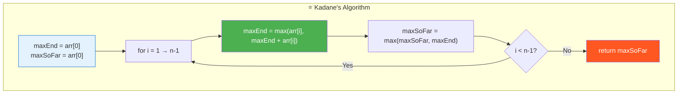

### Approach 3: Divide & Conquer — O(n log n)

```
  💡 Ý tưởng: Chia mảng thành 2 nửa, tìm max ở:
     ① Nửa trái
     ② Nửa phải
     ③ Cross boundary (subarray VƯỢT QUA giữa)

  Time: O(n log n)   Space: O(log n) — call stack
  → CHẬM HƠN Kadane! Nhưng interview hay hỏi!

  📌 Khi nào dùng?
    → Khi interviewer nói "không dùng DP"
    → Khi cần hiểu divide & conquer concept
    → KHÔNG dùng cho production (Kadane tốt hơn mọi mặt!)
```

---

## C — Code ✅

### Solution 1: Brute Force — O(n²)

```javascript
function maxSubarrayBrute(arr) {
  let maxSum = arr[0];

  for (let i = 0; i < arr.length; i++) {
    let sum = 0;
    for (let j = i; j < arr.length; j++) {
      sum += arr[j];
      maxSum = Math.max(maxSum, sum);
    }
  }

  return maxSum;
}
```

```
  📝 Line-by-line:

  Line 2: maxSum = arr[0] (KHÔNG PHẢI -Infinity!)
    → arr[0] đảm bảo khởi tạo từ phần tử thực
    → -Infinity cũng OK nhưng arr[0] rõ ràng hơn

  Line 5: sum = 0 → reset cho mỗi start index i mới
  Line 6-7: sum += arr[j] → running sum (KHÔNG tính lại!)
    → sum tại (i,j) = sum tại (i,j-1) + arr[j]
    → Tiết kiệm: O(n²) thay O(n³)

  ⚠️ CHỈ DÙNG ĐỂ: verify đáp án, KHÔNG dùng interview!
```

### Solution 2: Kadane's — O(n)/O(1) ✅

```javascript
function maxSubarrayKadane(arr) {
  let maxEndingHere = arr[0];
  let maxSoFar = arr[0];

  for (let i = 1; i < arr.length; i++) {
    maxEndingHere = Math.max(arr[i], maxEndingHere + arr[i]);
    maxSoFar = Math.max(maxSoFar, maxEndingHere);
  }

  return maxSoFar;
}
```

```
  📝 Line-by-line:

  Line 2-3: khởi tạo = arr[0] (KHÔNG PHẢI 0!)
    → ⚠️ Nếu tất cả phần tử ÂM: max = phần tử ÂM LỚN NHẤT!
    → Khởi tạo 0 → return 0 → SAI!

  Line 5: i = 1 (KHÔNG PHẢI i = 0!)
    → arr[0] đã xử lý ở init → bắt đầu từ 1!
    → Nếu bắt đầu từ 0: arr[0] bị "xử lý 2 lần"

  Line 6: maxEndingHere = Math.max(arr[i], maxEndingHere + arr[i])
    → "Extend (maxEnd + arr[i]) hay start mới (arr[i])?"
    → Tương đương: if (maxEndingHere < 0) maxEndingHere = 0;
       maxEndingHere += arr[i];
    → Nhưng Math.max version xử lý ALL-NEGATIVE đúng!

  Line 7: maxSoFar = Math.max(maxSoFar, maxEndingHere)
    → Track max TOÀN CỤC qua tất cả positions
    → maxEndingHere có thể GIẢM (khi gặp số âm)
    → maxSoFar CHỈ TĂNG → giữ kết quả tốt nhất!
```

### Solution 3: Kadane's with Indices — O(n)/O(1)

```javascript
function maxSubarrayWithIndices(arr) {
  let maxEnd = arr[0], maxSoFar = arr[0];
  let start = 0, end = 0, tempStart = 0;

  for (let i = 1; i < arr.length; i++) {
    if (arr[i] > maxEnd + arr[i]) {
      // START MỚI tại i
      maxEnd = arr[i];
      tempStart = i;
    } else {
      // EXTEND subarray cũ
      maxEnd += arr[i];
    }

    if (maxEnd > maxSoFar) {
      maxSoFar = maxEnd;
      start = tempStart;  // lock in start
      end = i;            // update end
    }
  }

  return { sum: maxSoFar, subarray: arr.slice(start, end + 1) };
}
```

```
  📝 TẠI SAO cần tempStart?

  tempStart = "start ĐANG THỬ" (có thể bị bỏ)
  start = "start ĐÃ CONFIRM" (khi maxEnd > maxSoFar)

  Ví dụ: [1, -5, 2, -1, 3]
    i=0: tempStart=0, start=0
    i=1: maxEnd=-4 < 1 → start vẫn=0, maxSoFar=1
    i=2: START MỚI → tempStart=2 (chưa confirm!)
    i=3: extend, maxEnd=1, 1 ≤ 1 → chưa confirm
    i=4: extend, maxEnd=4 > 1 → CONFIRM! start=2, end=4

  → subarray = [2, -1, 3] = 4
  → tempStart=2 chỉ CONFIRM khi maxEnd > maxSoFar!
```

### Solution 4: Alternative — Reset-to-zero style

```javascript
// ⚠️ KHÔNG handle all-negative! Chỉ dùng khi đề đảm bảo ≥ 1 dương
function maxSubarrayReset(arr) {
  let maxEnd = 0, maxSoFar = -Infinity;

  for (let i = 0; i < arr.length; i++) {
    maxEnd += arr[i];
    maxSoFar = Math.max(maxSoFar, maxEnd);
    if (maxEnd < 0) maxEnd = 0;  // reset!
  }

  return maxSoFar;
}
```

```
  📝 So sánh 2 styles:

  ┌─────────────────┬──────────────────────┬──────────────────────┐
  │  Tiêu chí        │ Math.max style       │ Reset-to-zero        │
  ├─────────────────┼──────────────────────┼──────────────────────┤
  │  Init            │ arr[0], arr[0]       │ 0, -Infinity         │
  │  All-negative    │ ✅ Handles!          │ ⚠️ Cần -Infinity     │
  │  Readability     │ ✅ Rõ "extend/start"│ ⚠️ Kém trực quan     │
  │  Interview       │ ✅ KHUYẾN KHÍCH     │ ⚠️ Dễ viết sai      │
  │  Loop start      │ i = 1               │ i = 0                │
  └─────────────────┴──────────────────────┴──────────────────────┘

  📌 Interview: LUÔN dùng Math.max style (Solution 2)!
```

---

## 🔬 Deep Dive — Giải thích CHI TIẾT từng dòng code

> 💡 Phần này phân tích **từng dòng code** để bạn hiểu **TẠI SAO** viết như vậy.

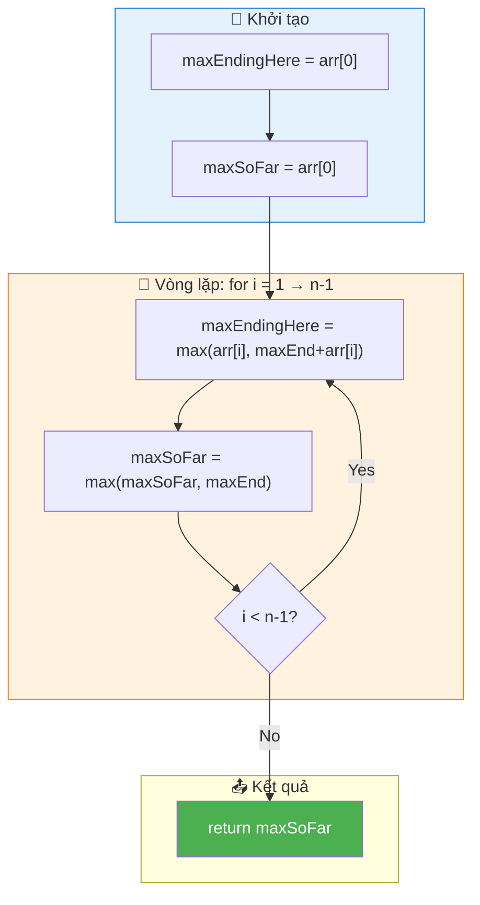

### Code đầy đủ với annotation

```javascript
function maxSubarrayKadane(arr) {
  // ═══════════════════════════════════════════════════════════════
  // DÒNG 1-2: Khởi tạo = arr[0]
  // ═══════════════════════════════════════════════════════════════
  //
  // TẠI SAO arr[0] chứ không phải 0?
  //   → arr = [-5, -2, -8] → nếu init 0 → return 0 → SAI!
  //   → arr[0] đảm bảo ÍT NHẤT 1 phần tử trong kết quả
  //
  // TẠI SAO cả 2 biến = arr[0]?
  //   → maxEndingHere: "best ending at index 0" = arr[0]
  //   → maxSoFar: "global best so far" = arr[0] (chỉ có 1 ứng viên)
  //
  let maxEndingHere = arr[0];
  let maxSoFar = arr[0];

  // ═══════════════════════════════════════════════════════════════
  // DÒNG 3-6: Vòng lặp — 1 quyết định mỗi bước
  // ═══════════════════════════════════════════════════════════════
  //
  // TẠI SAO i = 1?
  //   → i = 0 đã xử lý ở init (arr[0])
  //   → i = 0 lại: max(arr[0], arr[0]+arr[0]) → sai logic!
  //
  for (let i = 1; i < arr.length; i++) {

    // ─────────────────────────────────────────────────────────────
    // DÒNG 4: THE HEART OF KADANE'S
    // ─────────────────────────────────────────────────────────────
    //
    // 2 lựa chọn:
    //   arr[i]: bắt đầu subarray MỚI từ arr[i]
    //   maxEndingHere + arr[i]: EXTEND subarray cũ
    //
    // Chọn MAX! Tương đương:
    //   if (maxEndingHere < 0) maxEndingHere = arr[i];
    //   else maxEndingHere += arr[i];
    //
    // TẠI SAO Math.max thay if?
    //   → Gọn hơn, ít bug hơn, cùng logic
    //   → Interview: cả 2 đều OK
    //
    maxEndingHere = Math.max(arr[i], maxEndingHere + arr[i]);

    // ─────────────────────────────────────────────────────────────
    // DÒNG 5: Track global max
    // ─────────────────────────────────────────────────────────────
    //
    // TẠI SAO cần maxSoFar riêng?
    //   → maxEndingHere CÓ THỂ GIẢM (khi gặp số âm)!
    //   → maxSoFar CHỈ TĂNG → giữ đỉnh cao nhất!
    //
    // Ví dụ: [5, -10, 3]
    //   i=0: maxEnd=5, maxSoFar=5
    //   i=1: maxEnd=-5, maxSoFar=5 (VẪN 5! không giảm!)
    //   i=2: maxEnd=3, maxSoFar=5  (5 > 3 → giữ 5!)
    //
    maxSoFar = Math.max(maxSoFar, maxEndingHere);
  }

  return maxSoFar;
}
```

---

## 📐 Invariant — Chứng minh tính đúng đắn

```
  📐 INVARIANT (bất biến):

  Sau mỗi iteration i:
    maxEndingHere = max subarray sum ENDING AT index i
    maxSoFar = max subarray sum trong arr[0..i]

  Chứng minh bằng QUY NẠP:
  ┌──────────────────────────────────────────────────────────────────┐
  │  Base case: i = 0                                               │
  │    maxEndingHere = arr[0] = max subarray ending at 0            │
  │    maxSoFar = arr[0] = max in arr[0..0]                        │
  │    → Đúng! ✅                                                   │
  │                                                                 │
  │  Inductive step: giả sử đúng tại i-1, chứng minh tại i        │
  │                                                                 │
  │    Subarray ending at i có 2 dạng:                              │
  │      ① Chỉ gồm arr[i]: sum = arr[i]                            │
  │      ② arr[j..i] (j < i): sum = maxEndHere(i-1) + arr[i]      │
  │         (vì maxEndHere(i-1) = max ending at i-1, extend thêm  │
  │          arr[i] cho max subarray chứa i-1 rồi nối tới i)      │
  │                                                                 │
  │    Optimal = max(①, ②)                                          │
  │            = max(arr[i], maxEndHere(i-1) + arr[i]) ✅           │
  │                                                                 │
  │    maxSoFar = max(maxSoFar(i-1), maxEndHere(i))                │
  │            = max( max trong arr[0..i-1], max ending at i )      │
  │            = max trong arr[0..i] ✅                              │
  └──────────────────────────────────────────────────────────────────┘

  📐 Completeness:
    Answer = max subarray sum trong TOÀN MẢNG = maxSoFar(n-1) ✅
    → Duyệt TẤT CẢ vị trí ending → KHÔNG BỎ SÓT! ∎
```

---

## ❌ Common Mistakes — Lỗi thường gặp

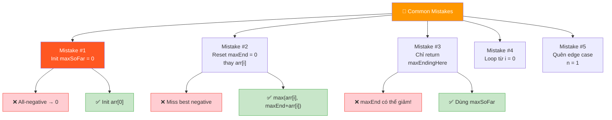

### Mistake 1: Khởi tạo maxSoFar = 0

```javascript
// ❌ SAI: all-negative → trả 0 (KHÔNG valid!)
let maxSoFar = 0;

// arr = [-2, -4] → maxSoFar vẫn 0 → SAI!
// Correct answer = -2

// ✅ ĐÚNG: khởi tạo arr[0]
let maxSoFar = arr[0];
// arr = [-2, -4] → maxSoFar = -2 ✅
```

```
  🧠 Tại sao quan trọng?
    → Subarray PHẢI có ≥ 1 phần tử
    → 0 = "subarray rỗng" → KHÔNG hợp lệ!
    → arr[0] = "ít nhất 1 phần tử" → luôn valid!
```

### Mistake 2: Reset maxEndingHere = 0 thay vì dùng max

```javascript
// ❌ SAI: logic reset-to-zero KHÔNG handle all-negative
function wrong(arr) {
  let maxEnd = 0, maxSoFar = 0;
  for (let i = 0; i < arr.length; i++) {
    maxEnd += arr[i];
    if (maxEnd < 0) maxEnd = 0;  // reset
    maxSoFar = Math.max(maxSoFar, maxEnd);
  }
  return maxSoFar;
}
// arr = [-3, -1, -2] → maxEnd luôn reset về 0 → return 0 ← SAI!

// ✅ ĐÚNG: Math.max style
maxEndingHere = Math.max(arr[i], maxEndingHere + arr[i]);
// arr = [-3, -1, -2] → maxEnd = -1, maxSoFar = -1 ✅
```

### Mistake 3: Chỉ return maxEndingHere (quên maxSoFar)

```javascript
// ❌ SAI: maxEndingHere CÓ THỂ GIẢM!
function wrong(arr) {
  let maxEnd = arr[0];
  for (let i = 1; i < arr.length; i++) {
    maxEnd = Math.max(arr[i], maxEnd + arr[i]);
  }
  return maxEnd;  // ← maxEnd có thể < max trước đó!
}

// arr = [5, -10, 3]
// i=0: maxEnd=5
// i=1: maxEnd=max(-10, -5)=-5
// i=2: maxEnd=max(3, -2)=3
// return 3 ← SAI! Answer = 5!

// ✅ ĐÚNG: track maxSoFar riêng
maxSoFar = Math.max(maxSoFar, maxEndingHere);
return maxSoFar;  // = 5 ✅
```

### Mistake 4: Nhầm "subarray" với "subsequence"

```
  ❌ Subarray ≠ Subsequence!

  arr = [2, -1, 3, -4, 5]

  Subarray: [2, -1, 3] → LIÊN TIẾP ✅
  Subsequence: [2, 3, 5] → SKIP -1 và -4 → KHÔNG liên tiếp

  Bài này: SUBARRAY → phải LIÊN TIẾP!
  → Kadane's CHỈ áp dụng cho subarray!
  → Subsequence = 0/1 knapsack → DP khác!

  📌 Nếu max subsequence sum (no constraint):
     Lấy TẤT CẢ số dương! O(n) trivial!
     → KHÔNG cần Kadane!
```

### Mistake 5: Quên edge case mảng 1 phần tử

```javascript
// ❌ SAI: loop không chạy, maxSoFar uninitialized?
function wrong(arr) {
  let maxEnd = 0, maxSoFar = -Infinity;
  for (let i = 0; i < arr.length; i++) { /* ... */ }
  return maxSoFar;
}
// arr = [7] → loop chạy 1 lần → OK nếu code đúng
// Nhưng init arr[0] style tự handle vì loop KHÔNG chạy (i=1 > 0)!

// ✅ ĐÚNG:
let maxEnd = arr[0], maxSoFar = arr[0];
for (let i = 1; i < arr.length; i++) { /* ... */ }
return maxSoFar;  // arr = [7] → loop skip → return 7 ✅
```

---

## O — Optimize

```
                Time     Space    Handle all-negative?
  Brute         O(n²)    O(1)     ✅
  Div&Conquer   O(nlogn) O(logn)  ✅
  Kadane ✅     O(n)     O(1)     ✅ (if init = arr[0])

  📌 Kadane = LOWER BOUND O(n)! Phải đọc mỗi phần tử!
```

### Có thể tối ưu hơn nữa không?

```
  Thời gian: KHÔNG! O(n) đã là optimal
    → Bắt buộc phải đọc MỌI phần tử ít nhất 1 lần
    → Chứng minh: Nếu skip arr[k] → arr[k] có thể là max element
      → Hoặc arr[k] có thể là số âm khiến ta start mới
      → KHÔNG THỂ quyết định đúng nếu không đọc!

  Space: KHÔNG! O(1) đã là optimal
    → Chỉ dùng 2 biến: maxEndingHere và maxSoFar

  📊 So sánh THỰC TẾ (n = 1,000,000):
    Kadane:        2n comparisons ≈ 2ms
    Brute Force:   n² additions ≈ 17 PHÚT! 😰
    Div&Conquer:   n log n ≈ 20n ≈ 20ms (log₂(10⁶) ≈ 20)
```

### So sánh 3 approaches

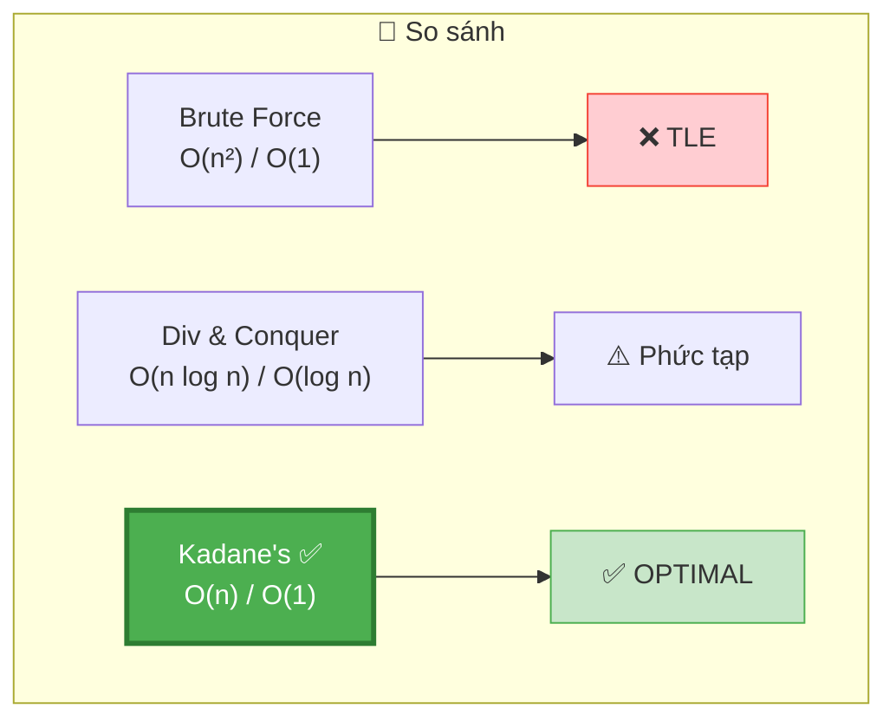

### ❓ "Tại sao không Sort?"

```
  ❌ KHÔNG ÁP DỤNG! Vì:
    Subarray = LIÊN TIẾP trong mảng NGUYÊN THỦY
    Sort thay đổi THỨ TỰ → phá vỡ tính contiguous!

  Ví dụ: arr = [2, -1, 3]
    Sort → [-1, 2, 3]
    Max subarray trong sorted: [2, 3] = 5
    Nhưng trong original: [2, -1, 3] = 4 ← KHÁC!
    Và [2, 3] KHÔNG liên tiếp trong original!
```

---

## T — Test

```
Test Cases:
  [2, 3, -8, 7, -1, 2, 3]     → 11     ✅ Standard (7-1+2+3)
  [-2, -4, -7, -1, -5]         → -1     ✅ All negative
  [1, 2, 3, 4]                 → 10     ✅ All positive (toàn bộ)
  [5]                           → 5      ✅ Single element
  [5, -9, 6]                   → 6      ✅ Start mới (bỏ 5-9=-4)
  [5, -2, 7]                   → 10     ✅ Worth extending
  [-1]                          → -1     ✅ Single negative
  [0, 0, 0]                    → 0      ✅ All zeros
  [1, -1, 1, -1, 1]            → 1      ✅ Alternating
  [-2, 1, -3, 4, -1, 2, 1, -5, 4] → 6  ✅ LC #53 example
```

### Edge Cases giải thích

```
  ┌──────────────────────────────────────────────────────────────────┐
  │  All negative:   Mỗi bước START MỚI (maxEnd luôn < 0)          │
  │                  → maxSoFar = phần tử ÂM LỚN NHẤT              │
  │                                                                  │
  │  All positive:   Không bao giờ start mới (maxEnd luôn > 0)     │
  │                  → maxSoFar = tổng TOÀN BỘ mảng                 │
  │                                                                  │
  │  Single:         Loop không chạy → return arr[0]                │
  │                                                                  │
  │  Worth extend:   [5, -2, 7]: -2 nhỏ, prefix vẫn dương          │
  │                  → keep -2, tổng = 10 > 7!                      │
  │                                                                  │
  │  Not worth:      [5, -9, 6]: -9 lớn, prefix thành ÂM           │
  │                  → bỏ prefix, start mới = 6 > -4+6=2!          │
  │                                                                  │
  │  📌 QUY TẮC: maxEnd > 0 → extend. maxEnd < 0 → start mới!    │
  └──────────────────────────────────────────────────────────────────┘
```

---

## 🗣️ Interview Script

### 🎙️ Think Out Loud — Mô phỏng phỏng vấn thực

> ⚠️ Script này dạy cách **NÓI**, không phải cách CODE.
> Mỗi đoạn = cách bạn **PHÁT BIỂU** trong phỏng vấn thực!

```
  ╔══════════════════════════════════════════════════════════════╗
  ║  🕐 FULL INTERVIEW SIMULATION — 1h30 (90 phút)             ║
  ║                                                              ║
  ║  00:00-05:00  Introduction + Icebreaker         (5 min)     ║
  ║  05:00-45:00  Problem Solving                   (40 min)    ║
  ║  45:00-60:00  Deep Technical Probing            (15 min)    ║
  ║  60:00-75:00  Variations + Extensions           (15 min)    ║
  ║  75:00-85:00  System Design at Scale            (10 min)    ║
  ║  85:00-90:00  Behavioral + Q&A                  (5 min)     ║
  ╚══════════════════════════════════════════════════════════════╝
```

```
  ╔══════════════════════════════════════════════════════════════╗
  ║  PART 1: INTRODUCTION (00:00 — 05:00)                       ║
  ╚══════════════════════════════════════════════════════════════╝

  👤 "Tell me about yourself and a project where
      you optimized something from scratch."

  🧑 "I'm a frontend engineer with [X] years of experience.
      One project that's relevant is a real-time analytics
      dashboard where I had to compute running aggregations
      over streaming data — things like 'what's the best
      performing 30-minute window in the last 24 hours.'

      The challenge was that we couldn't recompute everything
      from scratch each time a new data point arrived.
      We needed incremental updates — each new data point
      should update the answer in constant time.

      I ended up using a sliding-window accumulation pattern
      where at each step, I decided whether to extend
      the current window or start a new one based on
      whether adding the new point improved the metric.

      That 'extend or restart' decision is actually the core
      of Kadane's algorithm, which I suspect we're about
      to discuss."

  👤 "Perfect lead-in. Let's start."
```

```
  ╔══════════════════════════════════════════════════════════════╗
  ║  PART 2: PROBLEM SOLVING (05:00 — 45:00)                   ║
  ╚══════════════════════════════════════════════════════════════╝

  ──────────────── 05:00 — Clarify (3 phút) ────────────────

  👤 "Find the contiguous subarray with the largest sum."

  🧑 "Let me make sure I understand the constraints.

      First, CONTIGUOUS — meaning consecutive elements.
      I can't skip elements. This is a subarray,
      not a subsequence.

      Second, the subarray must contain at least one element.
      An empty subarray is not valid.

      Third, the array can contain negative numbers.
      This is what makes the problem interesting —
      if all numbers were positive, I'd just take
      the entire array.

      And I need to return just the SUM, not the actual
      subarray indices. Though I can track those too
      if needed."

  👤 "Correct on all points."

  ──────────────── 08:00 — Brute Force (3 phút) ────────────────

  🧑 "The brute force approach: try every possible subarray.

      For each starting index i, I iterate through all ending
      indices j from i to n-minus-1. I maintain a running sum
      and track the maximum.

      That's two nested loops — O of n-squared time.
      For n equal a million, that's a trillion operations.
      Way too slow.

      But this gives me the right intuition. I'm essentially
      asking: for each position, what's the best subarray
      that ENDS here? If I can answer that in O of 1
      per position, the whole problem becomes O of n."

  ──────────────── 11:00 — Key Insight bằng LỜI (5 phút) ────────────────

  🧑 "And that's exactly Kadane's insight!

      At each position i, I have exactly TWO choices:

      Choice 1: EXTEND the previous subarray by including
      the current element. The sum becomes whatever I had
      before, plus the current element.

      Choice 2: START FRESH — begin a new subarray consisting
      of just the current element.

      When should I start fresh? When the previous running sum
      is NEGATIVE. Because a negative prefix only HURTS
      any future sum. Adding a negative number to whatever
      comes next makes it worse. So I throw it away
      and start over.

      Think of it like this: imagine you're walking and
      collecting coins. Some coins are positive, some negative.
      If your bag total goes negative, it's better to DUMP
      the bag and start collecting fresh. The bag is only
      worth keeping if it has a positive balance.

      So at each step, I compute:
      maxEndingHere equal the maximum of the current element alone
      versus maxEndingHere plus the current element.

      And I separately track the GLOBAL best I've seen:
      maxSoFar equal the maximum of maxSoFar versus maxEndingHere."

  👤 "Why do you need two separate variables?"

  🧑 "Because maxEndingHere can DECREASE!

      After finding a great subarray, if I encounter a negative
      element, maxEndingHere goes down. But I don't want to
      lose the previous best. maxSoFar acts as a 'high-water
      mark' — it only ever increases.

      maxEndingHere is the CURRENT candidate.
      maxSoFar is the BEST candidate I've ever seen."

  ──────────────── 16:00 — Trace bằng LỜI (7 phút) ────────────────

  🧑 "Let me trace through an example to make this concrete.
      Array: two, three, negative-eight, seven, negative-one,
      two, three.

      I initialize both maxEndingHere and maxSoFar to
      the first element, which is 2.

      At index 1, element is 3.
      Extend: 2 plus 3 equal 5.
      Start fresh: just 3.
      Maximum of 5 and 3 is 5, so I extend.
      maxEndingHere equal 5. maxSoFar equal 5.

      At index 2, element is negative 8.
      Extend: 5 plus negative-8 equal negative-3.
      Start fresh: just negative-8.
      Maximum of negative-3 and negative-8 is negative-3.
      So I extend — the damage is less.
      maxEndingHere equal negative-3. maxSoFar stays at 5.

      At index 3, element is 7.
      Extend: negative-3 plus 7 equal 4.
      Start fresh: just 7.
      Maximum of 4 and 7 is 7. START FRESH!
      The negative prefix isn't worth keeping.
      maxEndingHere equal 7. maxSoFar equal 7.

      At index 4, element is negative 1.
      Extend: 7 plus negative-1 equal 6.
      Start fresh: just negative-1.
      Maximum is 6. Extend — the small negative is worth keeping.
      maxEndingHere equal 6. maxSoFar equal 7.

      At index 5, element is 2.
      Extend: 6 plus 2 equal 8.
      Start fresh: just 2.
      Maximum is 8. Extend!
      maxEndingHere equal 8. maxSoFar equal 8.

      At index 6, element is 3.
      Extend: 8 plus 3 equal 11.
      Start fresh: just 3.
      Maximum is 11. Extend!
      maxEndingHere equal 11. maxSoFar equal 11.

      Final answer: 11.
      The optimal subarray is seven, negative-one, two, three,
      starting at index 3. We correctly abandoned the prefix
      two, three, negative-eight because its sum was negative."

  ──────────────── 23:00 — All-negative case (4 phút) ────────────────

  🧑 "Now, there's a critical edge case: all negative numbers.

      Array: negative-2, negative-4, negative-7, negative-1,
      negative-5.

      If I initialize maxEndingHere and maxSoFar to ZERO,
      I'd always start fresh and never accumulate anything.
      The answer would be zero — which is WRONG because
      the subarray must contain at least one element.

      By initializing both to arr-at-0, which is negative-2,
      I'm guaranteeing that I start with a valid subarray.

      Let me trace: maxEndingHere and maxSoFar start at negative-2.

      Index 1: extend gives negative-6, fresh gives negative-4.
      Start fresh! maxEndingHere equal negative-4.
      maxSoFar equal max of negative-2 and negative-4 equal negative-2.

      Index 2: extend gives negative-11, fresh gives negative-7.
      Start fresh! maxEndingHere equal negative-7.
      maxSoFar stays negative-2.

      Index 3: extend gives negative-8, fresh gives negative-1.
      Start fresh! maxEndingHere equal negative-1.
      maxSoFar equal max of negative-2 and negative-1 equal negative-1.

      Index 4: extend gives negative-6, fresh gives negative-5.
      Start fresh! maxEndingHere equal negative-5.
      maxSoFar stays negative-1.

      Answer: negative-1 — the least negative element.
      In the all-negative case, Kadane's effectively finds
      the single largest element. Every step is a fresh start
      because the running sum is always negative."

  ──────────────── 27:00 — Viết code, NÓI từng block (4 phút) ────────────

  🧑 "Let me code this up. It's remarkably concise.

      [Vừa viết vừa nói:]

      I initialize two variables: maxEndingHere and maxSoFar,
      both set to arr-at-0. NOT zero — that's a common mistake.

      Then I loop from index 1 — not 0, since index 0 is
      already handled by initialization.

      Inside the loop, line one is THE HEART of Kadane's:
      maxEndingHere equal the max of arr-at-i versus
      maxEndingHere plus arr-at-i.

      Line two: maxSoFar equal the max of maxSoFar
      versus maxEndingHere.

      Return maxSoFar.

      That's it — two variables, one loop, two lines of logic.
      The elegance is that a single max operation captures
      the entire 'extend or restart' decision."

      📌 MẸO: Nói "THE HEART of Kadane's" khi viết dòng core.
      Cho interviewer thấy bạn biết ĐÂU LÀ TRỌNG TÂM.

  ──────────────── 31:00 — Edge Cases (4 phút) ────────────────

  👤 "What edge cases should we consider?"

  🧑 "Let me go through them.

      Single element: [5]. The loop doesn't run.
      I return arr-at-0 equal 5. Correct.

      Single negative: [negative-3]. Same — return negative-3.

      All positive: [1, 2, 3, 4].
      maxEndingHere never starts fresh because extending
      is always better. It accumulates to 10.
      Answer is the sum of the entire array.

      All negative: covered in my earlier trace.
      Answer is the least-negative element.

      Alternating: [5, negative-2, 7].
      Should I keep the negative-2?
      maxEndingHere at index 1: max of negative-2 versus
      5 plus negative-2 equal 3. I extend because 3
      is larger. At index 2: 3 plus 7 equal 10.
      Answer 10, which is greater than just 7 alone.
      The negative was worth keeping because the prefix
      was positive enough.

      Compare with [5, negative-9, 6].
      At index 1: max of negative-9 versus 5 plus negative-9
      equal negative-4. Start fresh! negative-9 is better
      than negative-4... wait, actually negative-4 is larger
      than negative-9, so I extend with negative-4.
      But then at index 2: negative-4 plus 6 equal 2
      versus 6 alone. I start fresh with 6.
      Answer equal max of 5, negative-4, 6 equal 6.
      Correct — the 5 prefix was 'contaminated' by negative-9."

  ──────────────── 35:00 — Complexity (2 phút) ────────────────

  🧑 "Time: O of n. One pass through the array.
      Each element is processed exactly once with two
      constant-time max operations.

      Space: O of 1. Just two variables.

      This is provably optimal. We MUST read every element
      at least once — if we skip any element, it could be
      the single-element answer, or it could be a large
      negative that determines a restart point.
      So O of n is the lower bound, and Kadane's achieves it."

  ──────────────── 37:00 — Tracking indices (4 phút) ────────────────

  👤 "Can you return the actual subarray, not just the sum?"

  🧑 "Yes! I need three extra variables:
      start, end, and tempStart.

      When I START FRESH — meaning arr-at-i alone is better
      than extending — I set tempStart to i.
      This is a 'candidate' start, not yet confirmed.

      When maxEndingHere exceeds maxSoFar — meaning I just
      found a new global best — I CONFIRM: start equal tempStart,
      end equal i.

      The distinction between tempStart and start is subtle
      but important. I might start fresh at some position
      but never beat the global max. In that case,
      the confirmed start and end shouldn't change.

      After the loop, the actual subarray is arr dot slice
      from start to end plus 1."

  ──────────────── 41:00 — Why init arr[0]? (4 phút) ────────────────

  👤 "You emphasized initializing with arr[0] instead of 0.
      Can you explain more?"

  🧑 "This is actually the NUMBER ONE mistake people make
      with Kadane's algorithm.

      If I initialize maxSoFar to 0 and the array is all negative,
      maxEndingHere resets to 0 every time it goes negative.
      maxSoFar stays at 0. But 0 represents an EMPTY subarray,
      which violates the constraint that the subarray must
      have at least one element.

      Initializing to arr-at-0 guarantees that my answer
      represents a real, non-empty subarray. Even if arr-at-0
      is negative, it's a valid answer — it's the subarray
      consisting of just that one element.

      There IS an alternative initialization: start both at
      negative infinity and loop from index 0. This also works
      because the first iteration would pick arr-at-0 as
      the fresh start. But I prefer arr-at-0 initialization
      because it's more explicit and less prone to errors."
```

```
  ╔══════════════════════════════════════════════════════════════╗
  ║  PART 3: DEEP TECHNICAL PROBING (45:00 — 60:00)            ║
  ╚══════════════════════════════════════════════════════════════╝

  ──────────────── 45:00 — Formal correctness (5 phút) ────────────────

  👤 "Can you prove Kadane's algorithm is correct?"

  🧑 "Sure! I'll use induction on the loop invariant.

      My invariant after processing index i:
      maxEndingHere equal the maximum subarray sum
      ENDING AT index i.
      maxSoFar equal the maximum subarray sum in the range
      from 0 to i.

      Base case: i equal 0.
      maxEndingHere equal arr-at-0, which is the only subarray
      ending at index 0. True.
      maxSoFar equal arr-at-0, which is the max in the range
      from 0 to 0. True.

      Inductive step: assume it holds at i-minus-1.
      Any subarray ending at i has two forms:
      Form 1: just arr-at-i alone. Sum is arr-at-i.
      Form 2: some subarray ending at i-minus-1, extended by arr-at-i.
      The best such extension has sum maxEndingHere-at-i-minus-1
      plus arr-at-i — by the inductive hypothesis.

      So the max ending at i equal max of form 1 and form 2
      equal max of arr-at-i and maxEndingHere plus arr-at-i.
      That's exactly what the algorithm computes!

      And maxSoFar equal max of the previous maxSoFar
      and the new maxEndingHere — which gives the global max
      across all positions 0 to i. QED."

  ──────────────── 50:00 — DP perspective (4 phút) ────────────────

  👤 "Is Kadane's algorithm a form of dynamic programming?"

  🧑 "Absolutely! It's a beautiful example of 1D DP
      with space optimization.

      The DP recurrence would be:
      dp-at-i equal max of arr-at-i and dp-at-i-minus-1 plus arr-at-i.
      The answer is max of all dp-at-i.

      Each dp-at-i represents the max subarray sum ending at i.
      And dp-at-i only depends on dp-at-i-minus-1 —
      just the PREVIOUS value, not the whole table.

      So I don't need an array — I just keep one variable,
      maxEndingHere, which represents dp-at-i.
      This collapses O of n space to O of 1.

      This pattern — 'DP where only the previous state matters' —
      appears everywhere: Fibonacci, house robber,
      climbing stairs, stock buy-sell. Kadane's is the
      canonical example of this optimization."

  ──────────────── 54:00 — Math.max vs if-else (3 phút) ────────────────

  👤 "You use Math.max for the core decision.
      Is there an equivalent formulation?"

  🧑 "Yes! The Math.max version:
      maxEndingHere equal max of arr-at-i and maxEndingHere
      plus arr-at-i.

      Is equivalent to:
      if maxEndingHere is less than 0, set maxEndingHere
      to arr-at-i. Otherwise, add arr-at-i to maxEndingHere.

      Why? When maxEndingHere is negative, arr-at-i alone
      is always larger than maxEndingHere plus arr-at-i.
      So the max picks arr-at-i — which is the 'restart.'

      When maxEndingHere is non-negative, extending by adding
      arr-at-i is at least as good as starting fresh.
      So the max picks maxEndingHere plus arr-at-i — the 'extend.'

      I prefer the Math.max version because it's one line
      and the INTENT is crystal clear: 'pick the better option.'
      The if-else version requires more reasoning to verify."

  ──────────────── 57:00 — Subarray vs subsequence (3 phút) ────────────────

  👤 "What if the problem asked for subsequence instead?"

  🧑 "Max subsequence sum is TRIVIALLY different!

      A subsequence can skip elements. So for a max sum,
      I just take all POSITIVE elements. Done.
      If all elements are negative, I take the largest one.

      That's O of n with no algorithm needed — just sum
      all positives.

      The reason Kadane's algorithm exists is precisely because
      of the CONTIGUITY constraint. The requirement that
      elements be adjacent creates a dependency between
      the 'extend' and 'restart' decisions.

      For subsequences, there's no dependency — each element
      is independently included or excluded."
```

```
  ╔══════════════════════════════════════════════════════════════╗
  ║  PART 4: VARIATIONS (60:00 — 75:00)                         ║
  ╚══════════════════════════════════════════════════════════════╝

  ──────────────── 60:00 — Circular subarray (5 phút) ────────────────

  👤 "What about circular subarrays? LeetCode 918."

  🧑 "In a circular array, the subarray can wrap around.
      For example, in three, negative-2, five, the circular
      subarray five, three gives sum 8.

      The insight is: a circular subarray that wraps around
      is the COMPLEMENT of a non-wrapping subarray in the middle.

      If the total sum is S, and the minimum subarray sum is minSum,
      then the maximum circular subarray equal S minus minSum.

      Why? Removing the minimum 'valley' from the total
      leaves the maximum 'mountain' that wraps around.

      So the answer is the max of:
      Case 1: standard Kadane — the max doesn't wrap.
      Case 2: totalSum minus minKadane — the max wraps.

      For the min Kadane, I just flip the comparison:
      minEndingHere equal min of arr-at-i and minEndingHere
      plus arr-at-i.

      One edge case: if ALL elements are negative,
      case 2 gives totalSum minus totalSum equal zero,
      which represents an empty subarray. So I must
      use case 1 when this happens."

  ──────────────── 65:00 — Max product subarray (5 phút) ────────────────

  👤 "What about max product instead of sum? LeetCode 152."

  🧑 "This is a fascinating twist. The key difference:
      negative times negative equal positive!

      With sums, a negative prefix is ALWAYS bad — drop it.
      With products, a negative prefix MIGHT become gold
      if we multiply by another negative.

      So I need to track TWO values at each position:
      maxProduct — the largest product ending here.
      minProduct — the smallest product ending here
      (which is the most negative).

      When I encounter a negative element, the max becomes
      the min and the min becomes the max — because multiplying
      by a negative flips signs.

      So before computing, if the current element is negative,
      I SWAP maxProduct and minProduct. Then I apply the
      standard Kadane logic to both.

      This is still O of n time, O of 1 space.
      The key insight is that products require tracking
      two candidates where sums need only one."

  ──────────────── 70:00 — Stock buy-sell connection (3 phút) ────────────────

  👤 "How does this connect to the stock buy-sell problem?"

  🧑 "LeetCode 121 — buy once, sell once — is actually
      Kadane's in disguise!

      If I compute the price DIFFERENCES — the change
      from each day to the next — then the maximum profit
      is the maximum subarray sum of those differences.

      Why? A profit of buying at day i and selling at day j
      equal price-at-j minus price-at-i. But that's the same as
      the SUM of all daily changes from day i to day j.

      So max profit equal max subarray sum of the daily changes.
      That's exactly Kadane's!

      The 'extend or restart' decision maps to:
      should I keep holding the stock — extend —
      or should I sell and buy fresh — restart?

      Most people solve Stock I with a minPrice tracker,
      which is correct but doesn't reveal this connection.
      Seeing it as Kadane's shows why it's O of n."

  ──────────────── 73:00 — 2D Kadane (2 phút) ────────────────

  👤 "Can you extend to 2D — max sum rectangle?"

  🧑 "Yes! For a matrix, I fix the top and bottom rows,
      collapse each column into a single sum, and run
      Kadane's on that 1D array.

      I iterate over all O of n-squared pairs of top/bottom rows,
      and for each pair, the column compression plus Kadane's
      is O of m, where m is the number of columns.

      Total: O of n-squared times m, or O of n-cubed
      for a square matrix. This is actually optimal for
      the 2D case — there's no known sub-cubic algorithm."
```

```
  ╔══════════════════════════════════════════════════════════════╗
  ║  PART 5: SYSTEM DESIGN AT SCALE (75:00 — 85:00)            ║
  ╚══════════════════════════════════════════════════════════════╝

  ──────────────── 75:00 — Streaming Kadane (5 phút) ────────────────

  👤 "What if the data is streaming — numbers arrive one at a time?"

  🧑 "Kadane's is naturally a STREAMING algorithm!
      Each new element requires just two max operations
      and updates two variables. O of 1 per element,
      O of 1 space.

      I don't need to store the entire array — I can process
      each element as it arrives and maintain the running
      maxEndingHere and maxSoFar.

      This is exactly what I did in that analytics dashboard
      I mentioned earlier. Each new metric update triggers
      one Kadane step, and I always have the current best
      window available.

      For distributed streams, each node can run Kadane
      locally. But merging results across nodes is tricky —
      I'd need to carry additional state: the max prefix sum,
      max suffix sum, total sum, and max subarray sum
      for each segment. With these four values,
      I can merge any two adjacent segments in O of 1.

      This is actually the same state used in the
      divide-and-conquer approach to max subarray."

  ──────────────── 80:00 — Parallel and batch (5 phút) ────────────────

  👤 "Could you parallelize this?"

  🧑 "Kadane's seems inherently sequential — each step
      depends on the previous maxEndingHere. But there's
      a clever parallel approach!

      I split the array into k chunks. For each chunk,
      I compute four values in parallel:
      the max prefix sum, max suffix sum, total sum,
      and max subarray sum.

      Then I merge adjacent chunks. The max subarray
      across a merge boundary equal left's max suffix
      plus right's max prefix. The overall max is the
      max of all chunks' internal max and all merge-boundary
      values.

      This gives O of n over k plus k work — optimal
      with k equal square root of n processors.

      In practice, for a billion-element array on 8 cores,
      each core processes 125 million elements with Kadane,
      then a single merge pass combines 8 partial results.
      The speedup is nearly linear."
```

```
  ╔══════════════════════════════════════════════════════════════╗
  ║  PART 6: BEHAVIORAL + Q&A (85:00 — 90:00)                  ║
  ╚══════════════════════════════════════════════════════════════╝

  ──────────────── 85:00 — Reflection (3 phút) ────────────────

  👤 "What would you take away from this problem?"

  🧑 "Three things.

      First, the EXTEND-OR-RESTART pattern. This is possibly
      the most important algorithmic pattern for interviews.
      At each step, I ask: 'is the accumulated history
      worth keeping, or am I better off starting fresh?'
      This same question applies to Kadane's, stock trading,
      longest increasing subsequence, and many DP problems.
      In frontend, it's the same decision when managing state:
      'should I derive from existing state, or reset?'

      Second, INITIALIZATION matters more than logic.
      The core algorithm is two lines. But initializing
      with arr-at-0 instead of 0 is the difference between
      correct and wrong. In production, I've seen more bugs
      from incorrect initial values than from wrong algorithms.

      Third, the power of SPACE OPTIMIZATION in DP.
      The full DP table is O of n, but since each state
      depends only on the previous one, I collapse it to
      O of 1. This 'rolling variable' technique applies
      to Fibonacci, house robber, climbing stairs —
      recognizing when to apply it is a senior-level skill."

  ──────────────── 88:00 — Questions (2 phút) ────────────────

  👤 "Any questions for me?"

  🧑 "A few!

      First — does your team work with real-time data processing?
      I'm curious if algorithms like Kadane's or sliding-window
      aggregations show up in your product.

      Second — how do you balance algorithmic elegance
      with code readability in reviews? Would you prefer
      the Math.max one-liner or the explicit if-else version?

      Third — what's the most interesting technical challenge
      your team solved recently?"

  👤 "Great questions! Your trace of the algorithm was
      very clear, and I liked how you connected it to
      the stock problem and circular variant.
      We'll be in touch!"
```

```
  ╔══════════════════════════════════════════════════════════════╗
  ║  ⭐ 8 MẸO NÓI CHUYỆN TRONG PHỎNG VẤN (Kadane's)          ║
  ╚══════════════════════════════════════════════════════════════╝

  📌 MẸO #1: Bắt đầu bằng BRUTE FORCE INSIGHT
     ✅ "Brute force checks all n-squared subarrays.
         But I only need to know, at each position,
         the best subarray ENDING HERE.
         If I can compute that in O of 1, the whole problem
         is O of n."
     → Derive Kadane's TỪ brute force.

  📌 MẸO #2: Explain "extend or restart" bằng ẩn dụ
     ❌ "maxEndingHere = max(arr[i], maxEndingHere + arr[i])"
     ✅ "Think of it as carrying a bag of coins.
         If the bag total is negative, DUMP it and start fresh.
         A negative bag only makes future collections worse."

  📌 MẸO #3: Trace with NARRATIVE, not just numbers
     ✅ "At index 3, element is 7. The running sum is negative-3.
         Extending gives 4, but starting fresh gives 7.
         The negative prefix isn't worth keeping — start fresh!
         This is the RESTART decision in action."

  📌 MẸO #4: ALL-NEGATIVE = highlight the INIT trap
     ✅ "If I initialize to 0, all-negative arrays return 0.
         But 0 means 'empty subarray' which isn't valid.
         Initializing to arr-at-0 guarantees a real answer —
         even if it's negative."

  📌 MẸO #5: TWO variables — explain WHY both are needed
     ✅ "maxEndingHere can DECREASE when it hits negatives.
         maxSoFar is the 'high-water mark' — it only increases.
         Without maxSoFar, I'd lose the best answer
         found earlier in the array."

  📌 MẸO #6: Connect to DP family
     ✅ "This is 1D DP with space optimization.
         dp-at-i only depends on dp-at-i-minus-1,
         so I collapse the array to a single variable.
         Same pattern as Fibonacci, house robber, stock I."

  📌 MẸO #7: Know the VARIANT FAMILY
     ✅ "Kadane's is a family of five-plus problems:
         Max subarray — standard Kadane.
         Circular — Kadane plus min-Kadane.
         Product — track max AND min (sign flips).
         Stock I — Kadane on price differences.
         Longest turbulent — reset counters."

  📌 MẸO #8: Prove OPTIMALITY
     ✅ "O of n is provably optimal. We must read every element —
         skipping any one could miss the answer.
         And O of 1 space is optimal — just two variables.
         Kadane's achieves both lower bounds."
```

### Pattern & Liên kết

```
  KADANE'S = "Optimal Substructure at each position" pattern!

  Bài tương tự dùng CÙNG pattern:
  ┌──────────────────────────────────────────────────────────────┐
  │  #53  Max Subarray Sum (BÀI NÀY): Kadane's O(n)           │
  │  #918 Max Circular Subarray: Kadane + min Kadane            │
  │  #152 Max Product Subarray: track min AND max product       │
  │  #121 Stock I: Kadane on price diffs!                       │
  │  #560 Subarray Sum = K: Prefix Sum + HashMap                │
  │  #978 Longest Turbulent: reset on non-turbulent            │
  └──────────────────────────────────────────────────────────────┘
```

---

## 📚 Bài tập liên quan — Practice Problems

### Progression Path

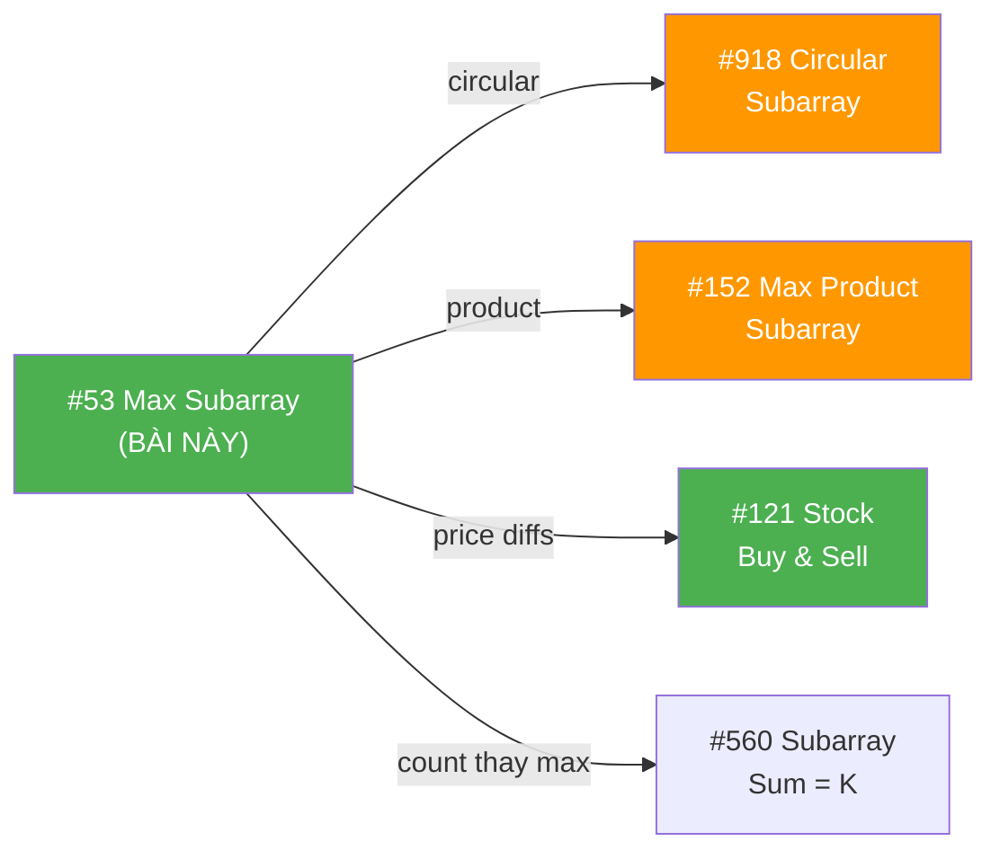

### 1. Max Circular Subarray (#918) — Medium

```
  Đề: Max subarray sum, nhưng mảng CIRCULAR (cuốn vòng)

  KEY INSIGHT — 2 trường hợp:
    ① Normal: max subarray KHÔNG cuốn vòng → Kadane's thường!
    ② Circular: max subarray CUỐN VÒNG
       = totalSum - minSubarraySum!
       (Bỏ min ở giữa = lấy 2 đầu!)

  function maxCircular(arr) {
    let maxKadane = kadane(arr);           // case ①
    let totalSum = arr.reduce((a,b) => a+b, 0);
    let minKadane = minKadaneHelper(arr);  // min subarray

    // ⚠️ Edge: nếu TẤT CẢ âm → totalSum-min = 0 → SAI!
    if (totalSum === minKadane) return maxKadane;

    return Math.max(maxKadane, totalSum - minKadane);  // case ②
  }

  📌 minKadane = Kadane nhưng dùng MIN thay MAX!
     minEndHere = min(arr[i], minEndHere + arr[i])
```

### 2. Max Product Subarray (#152) — Medium

```
  Đề: Max subarray PRODUCT (tích thay tổng)

  KEY INSIGHT: negative × negative = POSITIVE!
  → Tích ÂM nhỏ nhất có thể THÀNH LỚN NHẤT!
  → Track CẢ max VÀ min!

  function maxProduct(arr) {
    let maxProd = arr[0], minProd = arr[0], result = arr[0];

    for (let i = 1; i < arr.length; i++) {
      if (arr[i] < 0) [maxProd, minProd] = [minProd, maxProd]; // swap!

      maxProd = Math.max(arr[i], maxProd * arr[i]);
      minProd = Math.min(arr[i], minProd * arr[i]);
      result = Math.max(result, maxProd);
    }
    return result;
  }

  📌 So sánh với Kadane:
    Sum:     chỉ cần maxEndingHere (vì cộng số âm luôn giảm)
    Product: cần maxProd VÀ minProd (vì nhân số âm đổi dấu!)
```

### 3. Stock Buy & Sell I (#121) — Easy

```
  Đề: Buy once, sell once, maximize profit.

  KEY INSIGHT: profit[i] = price[i] - price[i-1]
  → Max profit = max subarray sum of PRICE DIFFS!

  function maxProfit(prices) {
    let maxEnd = 0, maxSoFar = 0;
    for (let i = 1; i < prices.length; i++) {
      maxEnd = Math.max(0, maxEnd + prices[i] - prices[i-1]);
      maxSoFar = Math.max(maxSoFar, maxEnd);
    }
    return maxSoFar;
  }

  📌 HOẶC cách đơn giản hơn (track minPrice):
    minPrice = prices[0]
    for i: maxProfit = max(maxProfit, prices[i] - minPrice)
           minPrice = min(minPrice, prices[i])

  📌 Cả 2 cách = O(n), O(1). Stock I là KADANE ẨN DANH!
```

### Tổng kết — Kadane biến thể

```
  ┌──────────────────────────────────────────────────────────────┐
  │  BÀI                     │  Kadane track GÌ?                │
  ├──────────────────────────────────────────────────────────────┤
  │  #53 Max Subarray Sum    │  maxEndHere, maxSoFar            │
  │  #918 Circular           │  + minEndHere, totalSum          │
  │  #152 Max Product        │  maxProd, minProd (cả 2!)        │
  │  #121 Stock I            │  maxEnd trên price diffs          │
  │  #978 Longest Turbulent  │  inc, dec (2 counters)           │
  └──────────────────────────────────────────────────────────────┘

  📌 Kadane CORE = "extend or restart at each position"
     Biến thể = thay ĐỔI CÁI GÌ TRACK (sum/product/count)
     → Hiểu Kadane = GIẢI ĐƯỢC 5+ BÀI!
```

### Skeleton code — Reusable template

```javascript
// TEMPLATE: "Tìm max/min subarray theo tiêu chí X"
function kadaneTemplate(arr) {
  let bestEndingHere = arr[0];
  let bestSoFar = arr[0];

  for (let i = 1; i < arr.length; i++) {
    // CORE DECISION: extend or restart
    bestEndingHere = Math.max(
      arr[i],                    // restart
      bestEndingHere + arr[i]    // extend (thay + bằng * cho product)
    );

    bestSoFar = Math.max(bestSoFar, bestEndingHere);
  }

  return bestSoFar;
}

// Sum:     + arr[i]     → standard Kadane
// Product: * arr[i]     → track min too!
// Count:   reset or ++  → longest subarray variant
```

---

## 📊 Tổng kết — Key Insights

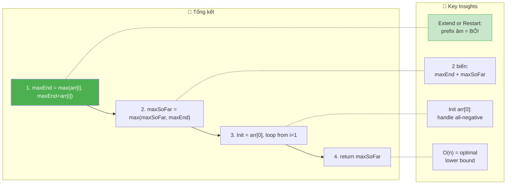

```
  ┌──────────────────────────────────────────────────────────────────────────┐
  │  📌 3 ĐIỀU PHẢI NHỚ                                                    │
  │                                                                          │
  │  1. QUYẾT ĐỊNH: max(arr[i], maxEndingHere + arr[i])                     │
  │     → "Extend hay start mới?" = THE HEART of Kadane's                  │
  │     → maxEndingHere < 0 → prefix ÂM → BỎ, start mới!                 │
  │                                                                          │
  │  2. KHỞI TẠO: maxEndingHere = maxSoFar = arr[0]                        │
  │     → KHÔNG PHẢI 0! (all-negative → trả 0 = SAI!)                     │
  │     → arr[0] đảm bảo ≥ 1 phần tử trong kết quả                       │
  │                                                                          │
  │  3. PATTERN: "Optimal substructure at each position"                    │
  │     → dp[i] = max(start_new, extend_old)                               │
  │     → dp[i] chỉ phụ thuộc dp[i-1] → O(1) space!                      │
  │     → Áp dụng cho #918, #152, #121, #978 → 1 PATTERN = 5+ BÀI!       │
  └──────────────────────────────────────────────────────────────────────────┘
```
