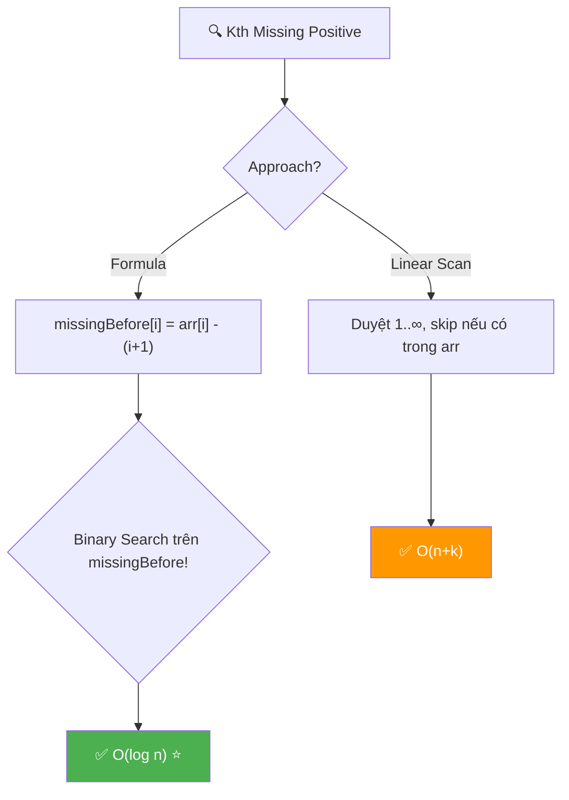
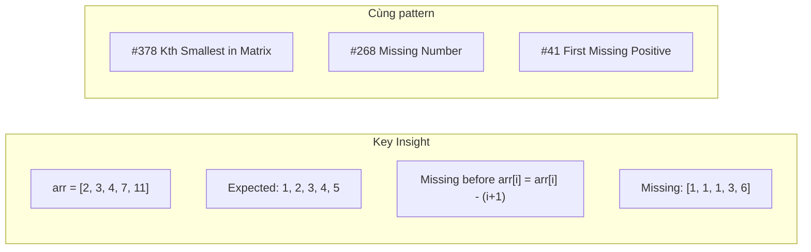
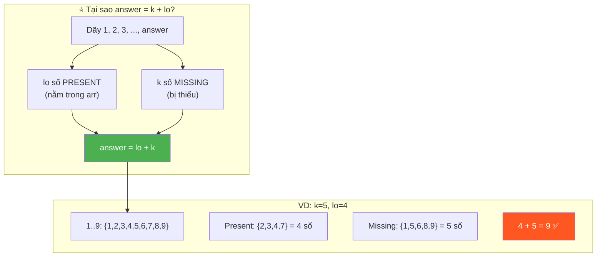
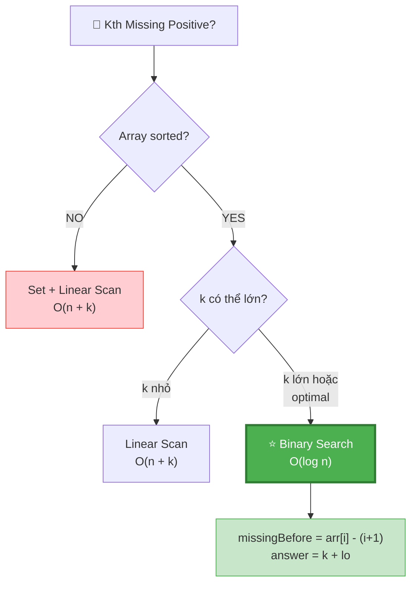
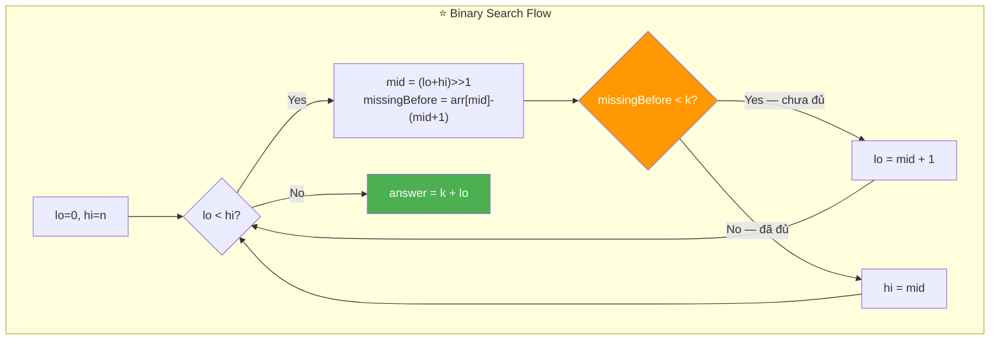
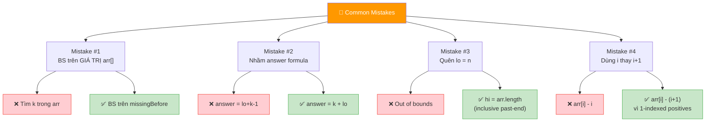
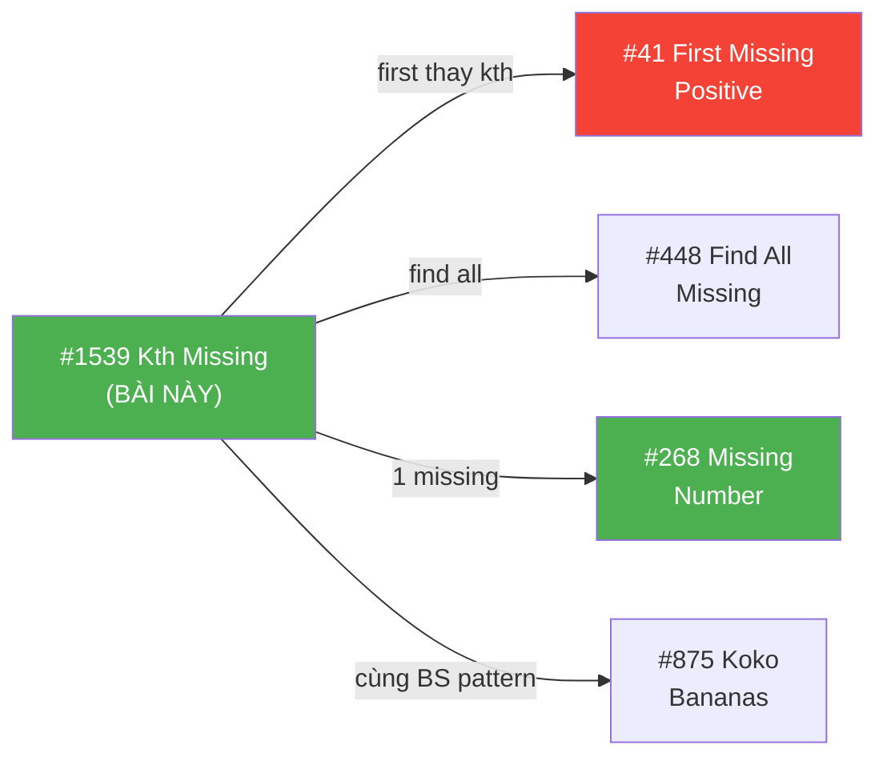
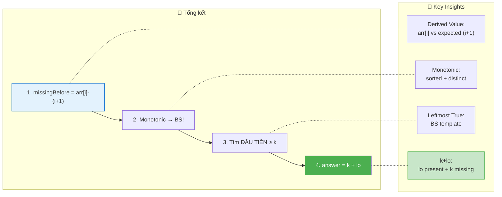

# 🔍 Kth Missing Positive Number — GfG / LeetCode #1539 (Easy)

> 📖 Code: [Kth Missing Positive Number.js](./Kth%20Missing%20Positive%20Number.js)





---

## R — Repeat & Clarify

🧠 *"Cho mảng sorted, distinct, positive. Tìm số DƯƠNG thứ K BỊ THIẾU."*

> 🎙️ *"Given a sorted array of distinct positive integers and k, find the kth positive integer missing from the array."*

### Clarification Questions

```
Q: "Missing" = không xuất hiện trong mảng?
A: ĐÚNG! Positive integers 1, 2, 3, ... mà KHÔNG CÓ trong arr!

Q: Mảng đã sorted?
A: CÓ! Sorted tăng dần + distinct! → Binary Search!

Q: k luôn hợp lệ?
A: CÓ! Luôn tồn tại số missing thứ k!

Q: Positive = bắt đầu từ 1?
A: ĐÚNG! 1, 2, 3, 4, ... (không có 0!)

Q: arr có thể rỗng?
A: CÓ THỂ! arr = [] → answer = k (thiếu 1, 2, ..., k)

Q: Có phần tử trùng không?
A: KHÔNG! Đề nói "distinct"! → arr[i] < arr[i+1] luôn!
```

### Tại sao bài này quan trọng?

```
  ⭐ Bài này dạy BINARY SEARCH trên "CÁI GÌ ĐÓ ẨN"!

  BẠN KHÔNG binary search trên arr[] trực tiếp!
  BẠN binary search trên SỐ LƯỢNG MISSING trước mỗi vị trí!

  ┌───────────────────────────────────────────────────┐
  │  Pattern: Binary Search on DERIVED VALUE!          │
  │  → Không search giá trị gốc                       │
  │  → Search trên function MONOTONIC của index!       │
  │                                                    │
  │  missingBefore(i) = arr[i] - (i + 1)              │
  │  → TĂNG DẦN! → Binary Search!                     │
  │                                                    │
  │  📌 CÒN GẶP LẠI Ở:                                │
  │  #378 Kth Smallest in Sorted Matrix               │
  │  #875 Koko Eating Bananas                          │
  │  #1011 Capacity to Ship Packages                   │
  │  → TẤT CẢ đều "BS on derived monotonic value"!   │
  └───────────────────────────────────────────────────┘
```

---

## 🧠 Bản chất bài toán — Hiểu để NHỚ, không chỉ để GIẢI

### INSIGHT CỐT LÕI: arr[i] - (i+1) = số missing TRƯỚC arr[i]!

```
  ⭐ ĐÂY LÀ TRICK QUAN TRỌNG NHẤT!

  Nếu KHÔNG có số nào bị thiếu:
    arr = [1, 2, 3, 4, 5]        ← lý tưởng!
    arr[i] = i + 1                ← ĐÚNG cho mọi i!

  Nếu CÓ số bị thiếu:
    arr[i] > i + 1                ← arr[i] "lệch" hơn expected!
    Số lượng missing TRƯỚC arr[i] = arr[i] - (i + 1)

  VÍ DỤ: arr = [2, 3, 4, 7, 11]

  ┌───────┬────────┬──────────┬────────────────────────────┐
  │  i    │ arr[i] │ i+1      │ missing = arr[i] - (i+1)   │
  ├───────┼────────┼──────────┼────────────────────────────┤
  │  0    │  2     │  1       │  2 - 1 = 1  (thiếu [1])    │
  │  1    │  3     │  2       │  3 - 2 = 1  (thiếu [1])    │
  │  2    │  4     │  3       │  4 - 3 = 1  (thiếu [1])    │
  │  3    │  7     │  4       │  7 - 4 = 3  (thiếu [1,5,6])│
  │  4    │  11    │  5       │  11 - 5 = 6 (thiếu 1,5,6,  │
  │       │        │          │              8,9,10)        │
  └───────┴────────┴──────────┴────────────────────────────┘

  missingBefore = [1, 1, 1, 3, 6]
  → TĂNG DẦN (monotonic!) → BINARY SEARCH!
```

### Chứng minh missingBefore tăng dần (monotonic)

```
  📐 CHỨNG MINH:

  Cho arr sorted tăng dần + distinct:
    arr[i+1] > arr[i] (strict)
    → arr[i+1] ≥ arr[i] + 1

  missingBefore(i) = arr[i] - (i + 1)
  missingBefore(i+1) = arr[i+1] - (i + 2)
                     ≥ (arr[i] + 1) - (i + 2)
                     = arr[i] - (i + 1)
                     = missingBefore(i)

  → missingBefore(i+1) ≥ missingBefore(i) ✅
  → Monotonic non-decreasing! → Binary Search hợp lệ! ∎

  📌 Tại sao "non-decreasing" chứ không "strictly increasing"?
    Khi arr[i+1] = arr[i] + 1 (liên tiếp, không thiếu):
    → missingBefore(i+1) = missingBefore(i) (bằng nhau!)
    VD: arr = [2, 3, 4] → missingBefore = [1, 1, 1]
```

### Binary Search: Tìm vị trí mà missingBefore ≥ k

```
  ⭐ Tìm vị trí ĐẦU TIÊN mà missingBefore[i] ≥ k!

  VÍ DỤ: k = 5, missingBefore = [1, 1, 1, 3, 6]

  Binary search: tìm i đầu tiên mà arr[i]-(i+1) ≥ 5
    → i = 4 (missingBefore[4] = 6 ≥ 5)

  Kết quả sau khi tìm:
    → lo = index ĐẦU TIÊN mà missingBefore ≥ k
    → Số missing thứ k nằm TRƯỚC arr[lo]!

  CÔNG THỨC: answer = k + lo

  ⭐ Tại sao k + lo?
    → Xét dãy 1, 2, 3, ..., answer
    → Trong dãy này:
      • lo số PRESENT (nằm trong arr, trước index lo)
      • k số MISSING
    → Tổng: answer = lo + k!

  VÍ DỤ: k=5, lo=4
    answer = 5 + 4 = 9
    Dãy 1..9: có 4 present {2,3,4,7} + 5 missing {1,5,6,8,9}
    → 4 + 5 = 9 ✅
```



### Tưởng tượng: ĐƯỜNG SỐ!

```
  Positive: 1  2  3  4  5  6  7  8  9  10  11  12  ...
  arr:         2  3  4        7        10  11
  Missing:  1           5  6     8  9          12  ...

  missingBefore[i] = bao nhiêu "lỗ" TRƯỚC arr[i]?

  arr[0]=2: trước 2 thiếu [1] → 1 lỗ
  arr[3]=7: trước 7 thiếu [1,5,6] → 3 lỗ
  arr[4]=11: trước 11 thiếu [1,5,6,8,9,10] → 6 lỗ

  Tìm "lỗ" thứ k = binary search trên số lỗ!

  ┌──────────────────────────────────────────────────────────┐
  │  Ẩn dụ: Đường số là HÀNG GHẾ trong rạp chiếu phim      │
  │  • arr[] = ghế ĐÃ CÓ NGƯỜI NGỒI                        │
  │  • missing = ghế TRỐNG                                    │
  │  • k = "tìm ghế trống thứ k"                            │
  │                                                          │
  │  missingBefore[i] = số ghế trống TRƯỚC ghế arr[i]!      │
  │  → Binary search vị trí mà số ghế trống ≥ k!           │
  └──────────────────────────────────────────────────────────┘
```

---

## 🧭 Luồng Suy Nghĩ — Từ đọc đề đến solution

### Bước 1: Đọc đề → Gạch chân KEYWORDS

```
  "SORTED array of DISTINCT POSITIVE integers, find Kth MISSING"

  Gạch chân:
    ✏️ SORTED → Binary Search!
    ✏️ DISTINCT → arr[i] < arr[i+1] (strict)
    ✏️ POSITIVE → 1, 2, 3, ... (bắt đầu từ 1!)
    ✏️ MISSING → "lỗ hổng" trong dãy

  🧠 "Sorted + tìm kiếm → nghĩ BINARY SEARCH ngay!"
  🧠 "Nhưng search CÁI GÌ? Không search giá trị trực tiếp..."
```

### Bước 2: Vẽ ví dụ → Phát hiện PATTERN

```
  arr = [2, 3, 4, 7, 11], k = 5

  🧠 "Nếu không thiếu: arr[0]=1, arr[1]=2, arr[2]=3, ..."
  🧠 "arr[i] EXPECTED = i + 1"
  🧠 "arr[i] - (i+1) = số bị lệch = SỐ MISSING!"

  ─── Quá trình suy luận (phỏng vấn thực) ───

  Bước 2a: Viết ra dãy lý tưởng vs thực tế

    index:    0    1    2    3    4
    expected: 1    2    3    4    5    ← nếu không thiếu
    actual:   2    3    4    7    11   ← thực tế
    diff:     1    1    1    3    6    ← SỐ MISSING!

  Bước 2b: Nhận ra diff = arr[i] - (i+1)

    arr[0]=2, i+1=1 → diff = 2-1 = 1 → thiếu [1]
    arr[1]=3, i+1=2 → diff = 3-2 = 1 → vẫn thiếu [1]
    arr[2]=4, i+1=3 → diff = 4-3 = 1 → vẫn thiếu [1]
    arr[3]=7, i+1=4 → diff = 7-4 = 3 → thiếu [1,5,6]
    arr[4]=11,i+1=5 → diff = 11-5= 6 → thiếu [1,5,6,8,9,10]

    🔑 EUREKA: diff TẤT CẢ TĂNG DẦN! [1,1,1,3,6]
      → Monotonic → Binary Search!

  Bước 2c: Nghĩ về answer

    "k=5, vị trí đầu tiên diff≥5 là i=4"
    "Có 4 phần tử arr TRƯỚC answer"
    "Dãy 1..answer: 4 present + 5 missing = 9"
    → answer = 5 + 4 = 9!

  📌 TẤT CẢ INSIGHT NÀY CÓ THỂ RÚT RA TỪ VÍ DỤ!
     Vẽ bảng expected vs actual → thấy NGAY!
```

### Bước 3: Linear → Binary Search → Optimize

```
  Linear O(n+k): Duyệt 1, 2, 3, ... → đếm missing → dừng khi đủ k
    → Đơn giản nhưng k có thể RẤT LỚN!

  Binary Search O(log n): Search trên missingBefore
    → Chỉ phụ thuộc n, KHÔNG k → cực nhanh!
    → answer = k + lo

  📌 So sánh khi n=10⁵, k=10⁹:
    Linear: 10⁵ + 10⁹ ≈ 10⁹ iterations 💀
    Binary: log₂(10⁵) ≈ 17 iterations ⚡
```

### Bước 4: Cây quyết định



---

## E — Examples

```
VÍ DỤ 1: arr = [2, 3, 4, 7, 11], k = 5

  missingBefore = [1, 1, 1, 3, 6]

  Binary search: tìm ĐẦU TIÊN ≥ 5
    lo=0, hi=5
    mid=2: missingBefore[2]=1 < 5 → lo=3
    mid=4: missingBefore[4]=6 ≥ 5 → hi=4
    mid=3: missingBefore[3]=3 < 5 → lo=4
    lo=hi=4

  answer = k + lo = 5 + 4 = 9 ✅
  Missing: [1, 5, 6, 8, 9] → thứ 5 = 9!
```

```
VÍ DỤ 2: arr = [1, 2, 3], k = 2

  missingBefore = [0, 0, 0]     ← không thiếu gì cả!

  Binary search: tìm ĐẦU TIÊN ≥ 2
    → Tất cả < 2 → lo = 3 (past end!)

  answer = k + lo = 2 + 3 = 5 ✅
  Missing: [4, 5, 6, ...] → thứ 2 = 5!

  📌 Edge case: lo = n → tất cả missing NẰM SAU arr!
```

```
VÍ DỤ 3: arr = [3, 5, 9, 10, 11, 12], k = 2

  missingBefore = [2, 3, 6, 6, 6, 6]

  Binary search: tìm ĐẦU TIÊN ≥ 2
    mid=3: 6 ≥ 2 → hi=3
    mid=1: 3 ≥ 2 → hi=1
    mid=0: 2 ≥ 2 → hi=0
    lo=hi=0

  answer = k + lo = 2 + 0 = 2 ✅
  Missing: [1, 2, 4, ...] → thứ 2 = 2!

  📌 Edge case: lo = 0 → tất cả missing NẰM TRƯỚC arr[0]!
```

```
VÍ DỤ 4: arr = [5, 6, 7, 8], k = 4

  missingBefore = [4, 4, 4, 4]

  Binary search: tìm ĐẦU TIÊN ≥ 4
    → lo = 0

  answer = 4 + 0 = 4 ✅
  Missing: [1, 2, 3, 4] → thứ 4 = 4!
```

### Minh họa Binary Search — Trace dạng bảng

```
  arr = [2, 3, 4, 7, 11], k = 5

  ┌─────────┬──────┬──────┬──────┬─────────────────┬──────────┬───────────┐
  │ Iter    │ lo   │ hi   │ mid  │ missingBefore   │ vs k=5   │ Action    │
  ├─────────┼──────┼──────┼──────┼─────────────────┼──────────┼───────────┤
  │  1      │  0   │  5   │  2   │ 4-3=1           │ 1 < 5    │ lo=3      │
  │  2      │  3   │  5   │  4   │ 11-5=6          │ 6 ≥ 5   │ hi=4      │
  │  3      │  3   │  4   │  3   │ 7-4=3           │ 3 < 5    │ lo=4      │
  │ STOP    │  4   │  4   │  -   │                 │          │           │
  └─────────┴──────┴──────┴──────┴─────────────────┴──────────┴───────────┘

  lo = 4 → answer = 5 + 4 = 9 ✅
```

### Trace cho edge case: arr = [100, 200, 300], k = 50

```
  missingBefore = [99, 198, 297]

  Binary search: tìm ĐẦU TIÊN ≥ 50
    mid=1: 198 ≥ 50 → hi=1
    mid=0: 99 ≥ 50 → hi=0
    lo=hi=0

  answer = 50 + 0 = 50 ✅

  🧠 Tất cả 50 missing NẰM TRƯỚC arr[0]=100!
    Missing: 1, 2, ..., 99 (99 số missing)
    Thứ 50 = 50 ✅

  📌 Khi arr[0] rất lớn → missingBefore[0] lớn → lo=0!
```

### Trace cho edge case: arr = [1, 2, 3, 4, 5], k = 1

```
  missingBefore = [0, 0, 0, 0, 0]    ← KHÔNG thiếu gì!

  Binary search: tìm ĐẦU TIÊN ≥ 1
    → Tất cả = 0 < 1 → lo = 5 (past end!)

  answer = 1 + 5 = 6 ✅

  🧠 Mảng "hoàn hảo" → tất cả missing NẰM SAU!
    Missing: 6, 7, 8, ... → thứ 1 = 6!
```

---

## A — Approach

### Approach 1: Linear Scan — O(n + k)

```
💡 Duyệt 1, 2, 3, ... → đếm missing → dừng khi đếm đủ k

  ┌──────────────────────────────────────────────────────────────┐
  │  current = 1 (bắt đầu từ 1)                                │
  │  idx = 0 (pointer vào arr)                                  │
  │  missing = 0 (đếm số missing)                               │
  │                                                              │
  │  while (true):                                               │
  │    if arr[idx] === current → skip! (số này CÓ) → idx++     │
  │    else → missing++ (số này THIẾU)                          │
  │    if missing === k → return current!                        │
  │    current++                                                 │
  │                                                              │
  │  Time: O(n + k)    Space: O(1)                               │
  │                                                              │
  │  ⚠️ Chậm khi k lớn! k=10⁹ → 10⁹ iterations!              │
  └──────────────────────────────────────────────────────────────┘
```

### Approach 2: Binary Search — O(log n) ⭐

```
💡 missingBefore(i) = arr[i] - (i+1) → monotonic → Binary Search!

  ┌──────────────────────────────────────────────────────────────┐
  │  Binary search: tìm lo = ĐẦU TIÊN mà missingBefore ≥ k    │
  │                                                              │
  │  lo = 0, hi = n                                              │
  │  while (lo < hi):                                            │
  │    mid = (lo + hi) >> 1                                      │
  │    if arr[mid] - (mid+1) < k → lo = mid + 1                │
  │    else → hi = mid                                           │
  │                                                              │
  │  answer = k + lo                                              │
  │                                                              │
  │  Time: O(log n)    Space: O(1)                               │
  │  → KHÔNG phụ thuộc k! k=10⁹ vẫn O(log n)!                 │
  └──────────────────────────────────────────────────────────────┘
```



### So sánh

```
  ┌──────────────────┬──────────┬──────────┬──────────────────────┐
  │                  │ Time     │ Space    │ Ghi chú               │
  ├──────────────────┼──────────┼──────────┼──────────────────────┤
  │ Linear Scan      │ O(n + k) │ O(1)     │ Đơn giản, chậm khi k │
  │                  │          │          │ lớn                   │
  │ Binary Search ⭐ │ O(log n) │ O(1)     │ Tối ưu! k-independent│
  └──────────────────┴──────────┴──────────┴──────────────────────┘

  📊 So sánh THỰC TẾ (n = 10⁵, k = 10⁹):
    Linear: 10⁵ + 10⁹ = ~10⁹ iterations ≈ 10 giây 💀
    Binary: log₂(10⁵) = ~17 iterations ≈ 0.001ms ⚡
    → Binary nhanh hơn ~60,000,000×!
```

---

## C — Code ✅

### Solution 1: Linear Scan — O(n + k)

```javascript
function findKthMissingLinear(arr, k) {
  let missing = 0;
  let current = 1;
  let idx = 0;

  while (true) {
    if (idx < arr.length && arr[idx] === current) {
      idx++;
    } else {
      missing++;
      if (missing === k) return current;
    }
    current++;
  }
}
```

```
  📝 Line-by-line:

  Line 2: missing = 0 → đếm số missing tìm được
    → Counter chỉ TĂNG khi gặp số THIẾU
    → Dừng khi missing === k

  Line 3: current = 1 → duyệt TẤT CẢ positive integers từ 1
    → KHÔNG duyệt arr! Duyệt 1, 2, 3, 4, ...
    → current tăng 1 MỖI iteration

  Line 4: idx = 0 → pointer vào arr (sorted!)
    → Chỉ tăng khi arr[idx] === current (match!)
    → Vì arr sorted → idx LUÔN tăng → mỗi phần tử xét 1 lần

  Line 7: if (idx < arr.length && arr[idx] === current)
    → 2 điều kiện AND (short-circuit!):
      ① idx < arr.length: chưa hết mảng
      ② arr[idx] === current: số này CÓ trong arr → skip!

    ⚠️ Tại sao arr[idx] chỉ cần so với current?
      → arr sorted → arr[idx] là số NHỎ NHẤT chưa xét!
      → Nếu arr[idx] === current → match → idx++
      → Nếu arr[idx] > current → current THIẾU!

  Line 10: missing++ → current là số MISSING!
  Line 11: if (missing === k) return current → đã đủ k!

  Line 13: current++ → xét số tiếp theo
```

### Solution 2: Binary Search — O(log n) ⭐

```javascript
function findKthMissing(arr, k) {
  let lo = 0,
    hi = arr.length;

  while (lo < hi) {
    const mid = (lo + hi) >> 1;
    const missingBefore = arr[mid] - (mid + 1);

    if (missingBefore < k) {
      lo = mid + 1;
    } else {
      hi = mid;
    }
  }

  return k + lo;
}
```

---

## 🔬 Deep Dive — Giải thích CHI TIẾT từng dòng code

> 💡 Phần này phân tích **từng dòng Binary Search** để bạn hiểu **TẠI SAO**.

```javascript
function findKthMissing(arr, k) {
  // ═══════════════════════════════════════════════════════════════
  // DÒNG 1: Khởi tạo lo = 0, hi = arr.length
  // ═══════════════════════════════════════════════════════════════
  //
  // TẠI SAO hi = arr.length (KHÔNG PHẢI arr.length - 1)?
  //   → Template "tìm vị trí ĐẦU TIÊN thỏa điều kiện"
  //   → lo có thể = arr.length (past end!)
  //   → Khi tất cả missingBefore < k → answer NẰM SAU mảng
  //   → VD: arr = [1, 2, 3], k = 2 → lo = 3  → answer = 5
  //
  // TẠI SAO lo = 0?
  //   → Vị trí đầu tiên khả dĩ
  //   → missingBefore[0] có thể đã ≥ k
  //   → VD: arr = [100], k = 1 → lo = 0 → answer = 1
  //
  let lo = 0,
    hi = arr.length;

  // ═══════════════════════════════════════════════════════════════
  // DÒNG 2-8: Binary Search — tìm ĐẦU TIÊN missingBefore ≥ k
  // ═══════════════════════════════════════════════════════════════
  //
  // Pattern: "leftmost true" binary search!
  //   → Tìm index NHỎ NHẤT mà condition = true
  //   → condition: arr[mid] - (mid+1) ≥ k
  //
  while (lo < hi) {

    // ─────────────────────────────────────────────────────────────
    // DÒNG 3: mid = (lo + hi) >> 1
    // ─────────────────────────────────────────────────────────────
    //
    // >> 1 = chia 2 bỏ dư (equivalent Math.floor((lo+hi)/2))
    // TẠI SAO >> 1 thay vì / 2?
    //   → Nhanh hơn (bitwise operation)
    //   → Tránh floating point
    //   → Convention phổ biến trong competitive programming
    //
    const mid = (lo + hi) >> 1;

    // ─────────────────────────────────────────────────────────────
    // DÒNG 4: Tính missingBefore — THE DERIVED VALUE
    // ─────────────────────────────────────────────────────────────
    //
    // arr[mid] - (mid + 1) = "bao nhiêu số THIẾU trước arr[mid]?"
    //
    // Giải thích:
    //   Nếu không thiếu gì: arr[mid] = mid + 1
    //   Thực tế: arr[mid] > mid + 1 (vì có "lỗ"!)
    //   Số lỗ = arr[mid] - (mid + 1)
    //
    const missingBefore = arr[mid] - (mid + 1);

    // ─────────────────────────────────────────────────────────────
    // DÒNG 5-8: So sánh và thu hẹp range
    // ─────────────────────────────────────────────────────────────
    //
    // missingBefore < k:
    //   → TRƯỚC arr[mid] có < k số missing
    //   → Số missing thứ k nằm SAU arr[mid]
    //   → lo = mid + 1 (bỏ nửa trái + mid!)
    //
    // missingBefore ≥ k:
    //   → TRƯỚC arr[mid] đã có ≥ k số missing
    //   → Có thể mid là vị trí ĐẦU TIÊN, hoặc trước đó
    //   → hi = mid (GIỮ mid! Không bỏ!)
    //
    // ⚠️ Tại sao KHÔNG dùng ===?
    //   → missingBefore có thể "nhảy" (VD: [1, 1, 3, 6])
    //   → Nếu k=2: missingBefore KHÔNG CÓ phần tử = 2!
    //   → Phải tìm ĐẦU TIÊN ≥ k (không phải = k!)
    //
    if (missingBefore < k) {
      lo = mid + 1;
    } else {
      hi = mid;
    }
  }

  // ═══════════════════════════════════════════════════════════════
  // DÒNG 9: answer = k + lo — THE MAGIC FORMULA
  // ═══════════════════════════════════════════════════════════════
  //
  // lo = số phần tử arr NẰM TRƯỚC answer
  // k = vị trí missing (thứ k)
  //
  // Trong dãy 1, 2, ..., answer:
  //   lo số PRESENT (thuộc arr)
  //   k số MISSING
  //   → answer = lo + k
  //
  // VD: k=5, lo=4 → answer=9
  //   Dãy 1..9: present={2,3,4,7}, missing={1,5,6,8,9}
  //   4 + 5 = 9 ✅
  //
  return k + lo;
}
```

---

## 📐 Invariant — Chứng minh tính đúng đắn

```
  📐 INVARIANT (bất biến) trong Binary Search:

  Tại mọi thời điểm:
    ∀ i < lo:  missingBefore(i) < k    (chưa đủ k missing)
    ∀ i ≥ hi:  missingBefore(i) ≥ k    (đã đủ k missing)

  Chứng minh:
  ┌──────────────────────────────────────────────────────────────────┐
  │  Base: lo=0, hi=n                                               │
  │    ∀ i < 0: tập rỗng → đúng trivially ✅                       │
  │    ∀ i ≥ n: tập rỗng → đúng trivially ✅                       │
  │                                                                 │
  │  Inductive: mỗi iteration:                                     │
  │                                                                 │
  │    Case 1: missingBefore(mid) < k                               │
  │      → lo = mid + 1                                              │
  │      → Thêm mid vào "chưa đủ k" → invariant giữ ✅             │
  │                                                                 │
  │    Case 2: missingBefore(mid) ≥ k                               │
  │      → hi = mid                                                  │
  │      → Thêm mid vào "đã đủ k" → invariant giữ ✅               │
  │                                                                 │
  │  Termination: lo = hi                                           │
  │    → lo = vị trí ĐẦU TIÊN mà missingBefore ≥ k                │
  │    → Có chính xác lo phần tử arr TRƯỚC answer                  │
  │    → answer = k + lo ∎                                          │
  └──────────────────────────────────────────────────────────────────┘
```

---

## ❌ Common Mistakes — Lỗi thường gặp



### Mistake 1: Binary search trên GIÁ TRỊ arr[] thay vì missingBefore!

```javascript
// ❌ SAI: tìm k trong arr
while (lo < hi) {
  if (arr[mid] < k) lo = mid + 1;  // ← HOÀN TOÀN SAI!
}

// ✅ ĐÚNG: search trên DERIVED VALUE
const missingBefore = arr[mid] - (mid + 1);
if (missingBefore < k) lo = mid + 1;
```

```
  🧠 Tại sao sai?
    → k là "thứ tự trong SỐ MISSING"
    → arr chứa SỐ PRESENT!
    → So sánh k với arr[mid] = SO SÁNH 2 THỨ KHÁC NHAU!
```

### Mistake 2: Nhầm công thức answer

```javascript
// ❌ SAI: answer = lo + k - 1
return lo + k - 1;  // off-by-one!

// ❌ SAI: answer = arr[lo] - (missingBefore - k)
// Quá phức tạp và dễ sai!

// ✅ ĐÚNG: answer = k + lo
return k + lo;
// Vì: dãy 1..answer có lo present + k missing!
```

### Mistake 3: Quên case lo = n (past end)

```javascript
// ❌ SAI: hi = arr.length - 1 → bỏ sót case past-end
let hi = arr.length - 1;
// arr = [1, 2, 3], k = 2 → lo KHÔNG THỂ = 3 → SAI!

// ✅ ĐÚNG: hi = arr.length
let hi = arr.length;
// arr = [1, 2, 3], k = 2 → lo = 3 → answer = 5 ✅
```

### Mistake 4: Dùng (i) thay vì (i+1)

```javascript
// ❌ SAI: arr[i] - i
const missingBefore = arr[mid] - mid;
// arr = [1, 2, 3]: arr[0]-0 = 1 → mà thực tế KHÔNG thiếu gì!

// ✅ ĐÚNG: arr[i] - (i + 1)
const missingBefore = arr[mid] - (mid + 1);
// arr = [1, 2, 3]: arr[0]-(0+1) = 0 → ĐÚNG! Không thiếu!

// 🧠 Vì index 0-based nhưng positive bắt đầu từ 1!
//    arr[0] "expected" = 1 = 0 + 1 (KHÔNG PHẢI 0!)
```

---

## O — Optimize

```
                    Time      Space     Ghi chú
  ─────────────────────────────────────────────────
  Linear Scan       O(n + k)  O(1)      Đơn giản
  Binary Search ⭐  O(log n)  O(1)      Tối ưu!

  ⚠️ Binary Search LUÔN O(log n):
    KHÔNG phụ thuộc k! (khác linear scan!)
    k = 10⁹ → linear chết, binary search vẫn nhanh!

  ⚠️ Tại sao O(log n) chứ không phải O(log(n+k))?
    Binary search CHỈ trên arr[] (n phần tử!)
    Sau khi tìm lo → tính answer = k + lo → O(1)!
```

### Complexity chính xác — Đếm operations

```
  Binary Search:
    Iterations: ⌈log₂(n)⌉ (tối đa)
    Mỗi iteration: 1 phép trừ + 1 so sánh + 1 gán = 3 ops
    Cuối: 1 phép cộng (k + lo)

    TỔNG: 3⌈log₂(n)⌉ + 1 operations

  Linear Scan:
    Check arr[idx] === current: n + k lần (tối đa)
    Increment: n + k lần

    TỔNG: 2(n + k) operations

  📊 So sánh THỰC TẾ:

  ┌──────────────┬──────────────────┬──────────────────┐
  │ Tình huống    │ Linear Scan      │ Binary Search    │
  ├──────────────┼──────────────────┼──────────────────┤
  │ n=10, k=5    │ 30 ops ≈ 0ms    │ 13 ops ≈ 0ms    │
  │ n=10⁵, k=10  │ 200,020 ops     │ 52 ops ⚡        │
  │ n=10⁵, k=10⁹ │ 2×10⁹ ops ≈10s 💀│ 52 ops ≈ 0ms ⚡ │
  │ n=10⁶, k=1   │ 2×10⁶ ops       │ 61 ops ⚡        │
  └──────────────┴──────────────────┴──────────────────┘

  📌 Binary Search "phá vỡ" sự phụ thuộc vào k!
     k từ 1 đến 10⁹ → số operations KHÔNG ĐỔI!
```

### Có thể tối ưu hơn nữa không?

```
  Time: KHÔNG! Ω(log n) là lower bound cho sorted array!
    → Cần ít nhất log n comparisons để xác định vị trí
    → Binary Search ĐÃ ĐẠT lower bound!

  Space: KHÔNG! O(1) đã là optimal!
    → Chỉ dùng 3 biến: lo, hi, mid

  📌 "Optimal = O(log n) time, O(1) space — KHÔNG CÓ GÌ TỐT HƠN!"
```

### ❓ "Tại sao không dùng Set/HashSet?"

```
  🧠 "Cho tất cả phần tử vào Set, rồi duyệt 1, 2, 3, ...?"

  function withSet(arr, k) {
    const set = new Set(arr);
    let count = 0;
    for (let i = 1; ; i++) {
      if (!set.has(i)) count++;
      if (count === k) return i;
    }
  }

  Time: O(n + answer) ≈ O(n + k)
  Space: O(n) — TỐN thêm!

  ❌ KHÔNG TỐI ƯU:
    → Tốn O(n) space cho Set
    → Tốn O(n + k) time (giống linear scan!)
    → KHÔNG tận dụng "sorted"!

  📌 Khi nào dùng Set?
    → Khi arr KHÔNG SORTED!
    → Khi n nhỏ và k nhỏ
    → KHÔNG dùng khi arr sorted (binary search tốt hơn!)
```

---

## T — Test

```
Test Cases:
  [2, 3, 4, 7, 11],     k=5   → 9    ✅ missing: 1,5,6,8,9
  [1, 2, 3],             k=2   → 5    ✅ missing: 4,5
  [3, 5, 9, 10, 11, 12], k=2   → 2    ✅ missing: 1,2
  [1],                   k=1   → 2    ✅ missing: 2
  [2],                   k=1   → 1    ✅ missing: 1
  [1, 2, 3, 4],          k=2   → 6    ✅ missing: 5,6
  [5, 6, 7, 8],          k=4   → 4    ✅ missing: 1,2,3,4
  [1, 3],                k=1   → 2    ✅ missing: 2
  [100],                 k=50  → 50   ✅ missing: 1..49,51→ thứ 50=50
```

### Edge Cases giải thích

```
  ┌──────────────────────────────────────────────────────────────────┐
  │  All missing trước:  arr=[5,6,7,8], k=4 → lo=0 → ans=4        │
  │    Tất cả k missing NẰM TRƯỚC arr[0]!                          │
  │                                                                  │
  │  All missing sau:    arr=[1,2,3], k=2 → lo=3 → ans=5            │
  │    Tất cả k missing NẰM SAU arr cuối!                           │
  │                                                                  │
  │  arr rất lớn:        arr[0]=100, k=50 → lo=0 → ans=50           │
  │    missingBefore[0]=99 ≥ 50 → tất cả trước arr[0]!             │
  │                                                                  │
  │  k rất lớn:          arr=[1,2,3], k=10⁹ → lo=3 → ans=10⁹+3    │
  │    Binary: O(log 3)=2 iterations! Linear: 10⁹ iterations 💀    │
  └──────────────────────────────────────────────────────────────────┘
```

---

## 🗣️ Interview Script

### 🎙️ Think Out Loud — Mô phỏng phỏng vấn thực

> ⚠️ Script này dạy cách **NÓI**, không phải cách CODE.
> Mỗi đoạn = cách bạn **PHÁT BIỂU** trong phỏng vấn thực!

```
  ╔══════════════════════════════════════════════════════════════╗
  ║  🕐 FULL INTERVIEW SIMULATION — 1h30 (90 phút)             ║
  ║                                                              ║
  ║  00:00-05:00  Introduction + Icebreaker         (5 min)     ║
  ║  05:00-45:00  Problem Solving                   (40 min)    ║
  ║  45:00-60:00  Deep Technical Probing            (15 min)    ║
  ║  60:00-75:00  Variations + Extensions           (15 min)    ║
  ║  75:00-85:00  System Design at Scale            (10 min)    ║
  ║  85:00-90:00  Behavioral + Q&A                  (5 min)     ║
  ╚══════════════════════════════════════════════════════════════╝
```

```
  ╔══════════════════════════════════════════════════════════════╗
  ║  PART 1: INTRODUCTION (00:00 — 05:00)                       ║
  ╚══════════════════════════════════════════════════════════════╝

  👤 "Tell me about yourself and a time you turned a linear
      search into a logarithmic one."

  🧑 "I'm a frontend engineer with [X] years of experience.
      A relevant example: I was working on an ID allocation
      system for a messaging platform. Users needed unique
      sequential IDs, but some ranges were reserved —
      essentially 'holes' in the number line.

      Given a sorted list of reserved IDs, I needed to find
      the kth AVAILABLE ID. My first version scanned from 1
      upwards, checking each number against the reserved list.
      This was O of n plus k — painfully slow when k was
      in the millions.

      Then I realized that for a sorted reserved list, I could
      compute how many IDs were available before any position
      using a simple formula: position minus the number of
      reserved IDs below it. This function was monotonic,
      which made it binary-searchable.

      I replaced the linear scan with a binary search on
      this derived monotonic function. The lookup went from
      seconds to microseconds.

      That's exactly the pattern in this problem: binary search
      on a DERIVED value, not on the array itself."

  👤 "Perfect. Let's formalize that."
```

```
  ╔══════════════════════════════════════════════════════════════╗
  ║  PART 2: PROBLEM SOLVING (05:00 — 45:00)                   ║
  ╚══════════════════════════════════════════════════════════════╝

  ──────────────── 05:00 — Clarify (4 phút) ────────────────

  👤 "Given a sorted array of distinct positive integers
      and k, find the kth positive integer missing from
      the array."

  🧑 "Let me nail down the definitions.

      'Positive integers' means 1, 2, 3, 4, dot dot dot.
      Starting from 1, not 0.

      'Missing' means positive integers that do NOT appear
      in the array. If the array is [2, 3, 4, 7, 11],
      the missing numbers start at 1, then 5, 6, 8, 9, 10,
      and so on.

      The array is sorted in strictly ascending order
      with no duplicates — sorted and distinct.

      k is guaranteed to be valid — there always exists
      a kth missing positive integer.

      I return the VALUE of the kth missing number,
      not its position.

      Edge case: an empty array means ALL positive integers
      are missing, so the answer is simply k."

  👤 "Correct."

  ──────────────── 09:00 — Linear approach (3 phút) ────────────────

  🧑 "The intuitive approach: I walk through the positive
      integers 1, 2, 3, using a pointer into the sorted array.

      For each positive integer: if it matches the current
      array element, it's PRESENT — I advance the array pointer.
      Otherwise, it's MISSING — I increment my missing counter.
      When the counter reaches k, I return the current number.

      Time: O of n plus k. It depends on BOTH array size
      and k. When k is large — say a billion — this is
      way too slow.

      But the array is sorted. Whenever I see 'sorted,'
      I think binary search."

  ──────────────── 12:00 — Key Insight bằng LỜI (6 phút) ────────────────

  🧑 "Here's the key question: what should I binary search ON?

      I can't binary search for k in the array directly —
      k is a rank among MISSING numbers, and the array
      contains PRESENT numbers. Apples and oranges.

      Instead, I need to derive a new quantity from the array
      that tells me about the missing numbers.

      Let me think about what a 'perfect' array would look like.
      If no numbers were missing, the array would be
      [1, 2, 3, 4, 5, dot dot dot]. Element at index i
      would be i plus 1.

      In the actual array, element at index i is arr at i,
      which is LARGER than i plus 1 if there are 'holes.'
      The difference: arr at i minus i plus 1 tells me
      exactly how many positive integers are MISSING
      before arr at i.

      I'll call this 'missingBefore of i.'

      For arr equal [2, 3, 4, 7, 11]:
      index 0: arr at 0 is 2, expected 1. Missing: 2 minus 1 equal 1.
      index 1: arr at 1 is 3, expected 2. Missing: 3 minus 2 equal 1.
      index 2: arr at 2 is 4, expected 3. Missing: 4 minus 3 equal 1.
      index 3: arr at 3 is 7, expected 4. Missing: 7 minus 4 equal 3.
      index 4: arr at 4 is 11, expected 5. Missing: 11 minus 5 equal 6.

      missingBefore: [1, 1, 1, 3, 6].

      And crucially: this sequence is MONOTONICALLY NON-DECREASING!
      Why? Because the array is sorted and distinct.
      Each step, arr at i increases by at least 1,
      and the expected value increases by exactly 1.
      So the gap either stays the same or grows — never shrinks."

  👤 "Why is monotonicity important?"

  🧑 "Because monotonicity is the PRECONDITION for binary search!

      I need to find the FIRST index where missingBefore
      is at least k. That's the classic 'leftmost true'
      binary search template.

      Once I find that index — call it lo — I know that
      there are exactly lo array elements positioned before
      the answer in the number line.

      So the answer is: the kth missing number in a sequence
      where lo numbers are 'occupied.' That means starting
      from 1, the first k plus lo positions include lo present
      numbers and k missing numbers. Therefore:
      answer equal k plus lo."

  ──────────────── 18:00 — Trace bằng LỜI (5 phút) ────────────────

  🧑 "Let me trace the binary search.
      arr equal [2, 3, 4, 7, 11], k equal 5.

      lo equal 0, hi equal 5.

      Iteration one: mid equal 2.
      missingBefore: arr at 2 minus 3 equal 4 minus 3 equal 1.
      1 is less than 5 — not enough missing before index 2.
      Set lo equal 3.

      Iteration two: mid equal 4.
      missingBefore: arr at 4 minus 5 equal 11 minus 5 equal 6.
      6 is at least 5 — enough missing before index 4.
      Set hi equal 4.

      Iteration three: mid equal 3.
      missingBefore: arr at 3 minus 4 equal 7 minus 4 equal 3.
      3 is less than 5 — not enough.
      Set lo equal 4.

      lo equal hi equal 4. Loop ends.

      answer equal k plus lo equal 5 plus 4 equal 9.

      Verification: missing numbers before arr at 4 equal 11
      are: 1, 5, 6, 8, 9, 10. That's 6 numbers.
      The 5th missing is 9. Correct!"

  🧑 "Now an edge case: arr equal [1, 2, 3], k equal 2.
      missingBefore: [0, 0, 0]. All zeros.

      Binary search: every missingBefore is less than 2.
      lo advances past every element. lo equal 3 equal n.

      answer equal 2 plus 3 equal 5.

      Verification: the array has 1, 2, 3 — no gaps.
      Missing: 4, 5, 6, dot dot dot.
      The 2nd missing is 5. Correct!

      This is the 'past-end' case — all missing numbers
      are after the last array element."

  ──────────────── 23:00 — Deriving the formula (4 phút) ────────────

  👤 "Walk me through WHY answer equals k plus lo."

  🧑 "Think about the number line from 1 to the answer.

      In this range, there are two types of numbers:
      PRESENT numbers that appear in the array,
      and MISSING numbers that don't.

      lo tells me exactly how many array elements are
      positioned before or at the boundary — these are
      the present numbers in the range 1 to answer.

      k is the number of missing numbers I need.

      So the total count of integers from 1 to answer
      is: lo present plus k missing equal lo plus k.

      But the count of integers from 1 to answer is also
      just 'answer' — since they're consecutive starting from 1.

      Therefore: answer equal lo plus k. QED.

      Let me verify with the example: k equal 5, lo equal 4.
      Range 1 to 9: present numbers from the array are
      {2, 3, 4, 7} — that's 4 equal lo.
      Missing numbers are {1, 5, 6, 8, 9} — that's 5 equal k.
      Total: 4 plus 5 equal 9 equal the answer."

  ──────────────── 27:00 — Viết code, NÓI từng block (3 phút) ────────────

  🧑 "Let me code the binary search solution.

      [Vừa viết vừa nói:]

      Initialize lo equal 0, hi equal arr dot length.
      hi is arr dot length — NOT arr dot length minus 1 —
      because lo might need to go PAST the end when all
      missing numbers are after the array.

      While lo is less than hi:
      mid equal lo plus hi right-shift 1.
      This is integer division by 2 using bitwise shift.

      Compute missingBefore: arr at mid minus mid plus 1
      in parentheses.

      If missingBefore is less than k: not enough missing
      before mid. Move lo to mid plus 1.
      Else: enough missing. Move hi to mid.
      Note: hi equal mid, NOT mid minus 1 — because mid
      might be the answer, and I don't want to exclude it.

      After the loop, return k plus lo.

      Six lines of logic. The key insight is in line 4:
      arr at mid minus open-paren mid plus 1 close-paren.
      That single expression transforms the problem from
      'search in values' to 'search in derived counts.'"

  ──────────────── 30:00 — Edge Cases (3 phút) ────────────────

  🧑 "Let me cover the edge cases.

      Empty array: lo starts at 0, hi is 0. Loop doesn't
      execute. lo equal 0. answer equal k plus 0 equal k.
      Correct — all positives are missing.

      All missing before array starts: [100, 200, 300], k equal 50.
      missingBefore at 0: 100 minus 1 equal 99, at least 50.
      Binary search sets lo equal 0 immediately.
      answer equal 50 plus 0 equal 50. Correct.

      Perfect array — no gaps: [1, 2, 3, 4, 5], k equal 1.
      All missingBefore are 0. lo goes past end: lo equal 5.
      answer equal 1 plus 5 equal 6. Correct.

      Single element: [1], k equal 1.
      missingBefore at 0: 1 minus 1 equal 0. Less than 1.
      lo equal 1 equal n. answer equal 1 plus 1 equal 2.
      Missing: 2, 3, 4, dot dot dot. First missing is 2."

  ──────────────── 33:00 — Complexity (2 phút) ────────────────

  🧑 "Time: O of log n. Binary search halves the search space
      each iteration. With n elements, that's at most
      log base 2 of n iterations.

      Crucially, the time does NOT depend on k.
      For k equal a billion and n equal 100,000:
      linear scan is a billion iterations,
      binary search is 17 iterations.
      That's a 60-million-times speedup.

      Space: O of 1. Just three variables: lo, hi, mid.

      This is optimal — I must examine at least one array
      element to determine the answer, and binary search
      examines exactly O of log n elements."

  ──────────────── 35:00 — Linear vs Binary (3 phút) ────────────────

  👤 "When would you prefer the linear approach?"

  🧑 "When the array is UNSORTED! Binary search requires
      monotonicity, and missingBefore is only monotonic
      when the array is sorted.

      For an unsorted array, I'd first put all elements
      into a HashSet for O of 1 lookups. Then I scan
      1, 2, 3, dot dot dot, skipping values in the set.
      Time: O of n plus k. Space: O of n.

      Alternatively, I could sort the array first in
      O of n log n, then binary search.

      The choice depends on whether n plus k is smaller
      than n log n plus log n. For very large k,
      sorting plus binary search wins.

      For the interview problem — sorted input guaranteed —
      binary search is the clear winner."

  ──────────────── 38:00 — Why 'leftmost true'? (4 phút) ────────────

  👤 "You mentioned 'leftmost true' template. Explain."

  🧑 "There are two main binary search templates:

      'Find exact match' — like searching for a value in a sorted
      array. Returns one index or not-found.

      'Leftmost true' — given a monotonic boolean predicate,
      find the FIRST index where the predicate becomes true.

      This problem uses 'leftmost true' because missingBefore
      might not have an entry EXACTLY equal to k.
      For example, missingBefore could be [1, 1, 1, 3, 6].
      If k equal 2, there's no index where missingBefore
      is exactly 2. But there IS a first index where
      it's AT LEAST 2 — that's index 3.

      The template: when the condition is FALSE, move lo right.
      When TRUE, move hi to mid — keeping mid as a candidate.
      At the end, lo is the first TRUE position.

      This template handles the '>= k' comparison naturally
      without needing exact equality."

  ──────────────── 42:00 — Common mistakes (3 phút) ────────────

  👤 "What mistakes do candidates commonly make?"

  🧑 "Four main ones.

      First: binary searching on the ARRAY VALUES directly.
      They compare k against arr at mid, which compares
      a rank among missing numbers to a present number.
      Completely wrong.

      Second: getting the formula wrong. Some write
      arr at i minus i instead of arr at i minus i plus 1
      in parentheses. The 'plus 1' accounts for 1-based
      positive integers. Without it, the count is off by one
      everywhere.

      Third: setting hi to arr dot length minus 1.
      This prevents lo from reaching n, which misses the case
      where all missing numbers are after the last element.

      Fourth: computing answer as lo plus k minus 1 or
      some other off-by-one variant. The clean formula is
      k plus lo — no minus 1."
```

```
  ╔══════════════════════════════════════════════════════════════╗
  ║  PART 3: DEEP TECHNICAL PROBING (45:00 — 60:00)            ║
  ╚══════════════════════════════════════════════════════════════╝

  ──────────────── 45:00 — Monotonicity proof (4 phút) ────────────────

  👤 "Prove that missingBefore is monotonically non-decreasing."

  🧑 "I need to show that missingBefore of i plus 1 is at least
      missingBefore of i.

      missingBefore of i equal arr at i minus i plus 1
      in parentheses.
      missingBefore of i plus 1 equal arr at i plus 1
      minus i plus 2 in parentheses.

      Since the array is sorted and distinct:
      arr at i plus 1 is strictly greater than arr at i.
      So arr at i plus 1 is at least arr at i plus 1.

      Therefore:
      missingBefore of i plus 1 equal arr at i plus 1
      minus i plus 2
      is at least arr at i plus 1 minus i plus 2
      equal arr at i minus i plus 1
      equal missingBefore of i.

      The inequality holds. missingBefore is non-decreasing. QED.

      The 'non-strictly' part: when arr at i plus 1 equals
      arr at i plus 1 — consecutive, no gap —
      missingBefore stays the same. Like [2, 3, 4] gives
      missingBefore [1, 1, 1]."

  ──────────────── 49:00 — Bitwise shift (3 phút) ────────────────

  👤 "You used right-shift for division. Is that always safe?"

  🧑 "Right-shift by 1 is equivalent to Math dot floor of
      dividing by 2, but only for NON-NEGATIVE integers.

      For negative numbers, right-shift rounds toward
      negative infinity, while integer division in some
      languages rounds toward zero. They differ for negatives.

      In this problem, lo and hi are always non-negative
      array indices, so right-shift is safe and slightly
      faster than division.

      There's also the overflow concern: lo plus hi could
      overflow a 32-bit integer for very large arrays.
      In JavaScript, all numbers are 64-bit floats, so
      overflow isn't an issue until around 2 to the 53.
      In Java or C++, I'd use lo plus hi minus lo over 2
      to avoid overflow."

  ──────────────── 52:00 — BS on derived value pattern (5 phút) ────────

  👤 "Where else does 'binary search on a derived value' appear?"

  🧑 "This is one of the most powerful patterns in algorithms!

      Koko Eating Bananas — LeetCode 875.
      I binary search on the EATING SPEED. For each candidate
      speed, I compute the total hours needed — a derived value.
      The predicate: 'can I finish in h hours?' is monotonic
      with speed. So I find the minimum speed that works.

      Capacity to Ship Packages — LeetCode 1011.
      Binary search on the SHIP CAPACITY. For each candidate,
      I compute the number of days needed — derived value.
      Find the minimum capacity that fits within d days.

      Kth Smallest in Sorted Matrix — LeetCode 378.
      Binary search on the VALUE. For each candidate, I count
      how many elements in the matrix are at most that value.
      Find the smallest value with count at least k.

      The GENERAL PATTERN: I'm not searching the array.
      I'm searching a DERIVED FUNCTION of the array that's
      monotonic. This is sometimes called 'binary search
      on answer' or 'parametric search.'

      The trick is recognizing WHAT to derive and proving
      it's monotonic."

  ──────────────── 57:00 — Why not HashSet? (3 phút) ────────────────

  👤 "Why not use a HashSet for O of 1 lookups?"

  🧑 "I could! Put all array elements in a HashSet,
      then scan 1, 2, 3, dot dot dot, checking each number.

      Time: O of n to build the set, plus O of k to scan.
      Total: O of n plus k.

      But this ignores the SORTED constraint! The array
      being sorted gives us the monotonic missingBefore
      function, unlocking binary search at O of log n.

      The HashSet approach is the right choice for
      UNSORTED arrays or when I need to handle duplicates.
      But for sorted distinct input, binary search is
      strictly better — especially for large k."
```

```
  ╔══════════════════════════════════════════════════════════════╗
  ║  PART 4: VARIATIONS (60:00 — 75:00)                         ║
  ╚══════════════════════════════════════════════════════════════╝

  ──────────────── 60:00 — First Missing Positive (5 phút) ────────────────

  👤 "How does this relate to First Missing Positive — LeetCode 41?"

  🧑 "First Missing Positive is the k equal 1 case,
      but with two twists: the array is UNSORTED and can
      contain negatives and duplicates.

      My binary search approach doesn't work because
      the array isn't sorted. Instead, I use CYCLIC SORT:
      place each number i at index i minus 1. So 1 goes to
      index 0, 2 goes to index 1, and so on.

      After placement, I scan for the first index where
      arr at i is not equal to i plus 1. That's the first
      missing positive.

      Time: O of n — each element is placed at most once.
      Space: O of 1 — in-place swaps.

      The connection: both problems ask about 'gaps'
      in the positive integer sequence. This problem finds
      the kth gap using binary search. First Missing Positive
      finds the 1st gap using index-as-hash."

  ──────────────── 65:00 — Missing Number #268 (3 phút) ────────────────

  👤 "What about Missing Number — LeetCode 268?"

  🧑 "That's a different flavor! The array contains numbers
      from 0 to n with exactly one missing.

      The elegant solution: sum or XOR.
      Expected sum: n times n plus 1 divided by 2.
      Actual sum: sum of array elements.
      Missing: expected minus actual.

      Or using XOR: XOR all indices 0 to n, then XOR all
      array elements. The result is the missing number
      because every present number cancels out.

      The key difference: Missing Number works with
      UNSORTED input and has exactly ONE missing number.
      Kth Missing has potentially MANY missing numbers
      and leverages sorted order for binary search."

  ──────────────── 68:00 — Kth missing in range (4 phút) ────────────────

  👤 "What if the positive integers don't start from 1
      but from some arbitrary start?"

  🧑 "I'd adjust the formula.

      If the positive integers start from 'start' instead of 1,
      the expected value at index i is start plus i.
      missingBefore becomes: arr at i minus start plus i
      in parentheses.

      The rest of the binary search is identical.
      And the answer formula becomes: k plus lo plus start minus 1.

      This generalization shows that the core insight —
      binary search on the derived 'expected minus actual' —
      is independent of where the sequence begins."

  ──────────────── 72:00 — Kth missing with duplicates (3 phút) ────────

  👤 "What if the array has duplicates?"

  🧑 "Duplicates break the formula!

      With duplicates, arr at i minus i plus 1 no longer
      accurately counts missing numbers. Duplicate values
      inflate the formula because the same number appears
      at multiple indices.

      My approach: DEDUPLICATE first. Use a Set to remove
      duplicates, then convert back to a sorted array.
      Then apply the binary search on the deduplicated array.

      Time: O of n for deduplication plus O of log n for search.
      Space: O of n for the deduplicated array.

      Alternatively, if I know duplicates exist, the linear
      scan approach naturally handles them — it checks
      each positive integer against the SET, ignoring
      how many times a value appears."
```

```
  ╔══════════════════════════════════════════════════════════════╗
  ║  PART 5: SYSTEM DESIGN AT SCALE (75:00 — 85:00)            ║
  ╚══════════════════════════════════════════════════════════════╝

  ──────────────── 75:00 — ID allocation (5 phút) ────────────────

  👤 "Where does 'finding the kth missing' appear in real systems?"

  🧑 "Several places!

      First — AUTO-INCREMENT ID ALLOCATION.
      When a database table has gaps in its auto-increment
      IDs — due to deletions or failed inserts — and I need
      to find the next k available IDs. The reserved IDs
      form a sorted array, and I'm finding missing numbers.

      Second — PORT or CHANNEL ASSIGNMENT.
      In a network system, each connection needs a unique
      port number. Some ports are reserved. Given the sorted
      list of reserved ports, 'find the kth available port'
      is exactly this problem.

      Third — SPARSE ARRAY INDEXING.
      In sparse data representations, I store only non-zero
      elements with their indices. To find the kth zero-valued
      position, I binary search on the stored indices.

      Fourth — TICKET or SEAT NUMBERING.
      In an event system, some seat numbers are already booked.
      'Assign the next k available seats' requires finding
      missing numbers in the booked sequence."

  ──────────────── 80:00 — Distributed missing (5 phút) ────────────────

  👤 "How would you handle this with a billion reserved IDs?"

  🧑 "At that scale, the sorted array might not fit in memory.

      Option 1: EXTERNAL BINARY SEARCH.
      Store the sorted reserved IDs in a B-tree or sorted file
      on disk. Binary search accesses O of log n disk pages.
      With n equal a billion, that's about 30 page reads.

      Option 2: RANGE COMPRESSION.
      Instead of storing individual IDs, store RANGES
      of reserved IDs: (1-5), (10-20), (30-31).
      Binary search on the ranges. This dramatically reduces
      storage and works well when IDs cluster together.

      Option 3: BITMAP.
      Use a bit vector where bit i is 1 if ID i is reserved.
      Finding the kth zero is a rank/select operation on
      the bitmap. With succinct data structures, this is
      O of 1 per query using precomputed rank tables.

      For a production system, I'd use range compression
      with a B-tree index. It handles both sparse and dense
      reservations efficiently."
```

```
  ╔══════════════════════════════════════════════════════════════╗
  ║  PART 6: BEHAVIORAL + Q&A (85:00 — 90:00)                  ║
  ╚══════════════════════════════════════════════════════════════╝

  ──────────────── 85:00 — Reflection (3 phút) ────────────────

  👤 "What would you take away from this problem?"

  🧑 "Three things.

      First, BINARY SEARCH ON DERIVED VALUES.
      The most powerful applications of binary search
      aren't searching the array itself — they're searching
      a FUNCTION of the array. If that function is monotonic,
      binary search applies. This pattern appears in Koko
      Eating Bananas, Ship Capacity, and Matrix Kth Smallest.
      Recognizing what to derive and proving monotonicity
      is the transferable skill.

      Second, the EXPECTED vs ACTUAL comparison.
      In a perfect world, arr at i equals i plus 1.
      The difference between reality and expectation gives me
      the count of anomalies. This 'what should it be
      versus what is it' mindset applies to error detection,
      data validation, and checksum verification.

      Third, the importance of PRECONDITIONS.
      The entire solution hinges on the array being sorted.
      Without that, monotonicity fails, and binary search
      is invalid. In interviews, stating preconditions
      explicitly — 'this works BECAUSE the input is sorted' —
      shows I understand the algorithm's requirements deeply."

  ──────────────── 88:00 — Questions (2 phút) ────────────────

  👤 "Any questions for me?"

  🧑 "A few!

      First — does your system have any ID allocation
      or sequence management needs? I'm curious if the
      'find the kth gap' pattern shows up in practice.

      Second — in your interview process, when candidates
      reach the binary search solution but can't explain
      WHY answer equals k plus lo, is that a significant
      concern? Or is getting the code right sufficient?

      Third — how do you handle the First Missing Positive
      variation in interviews? Do candidates typically
      reach the cyclic sort approach?"

  👤 "Great questions! I appreciated how you derived
      the missingBefore formula from first principles
      and proved monotonicity. The connection to parametric
      search was insightful. We'll be in touch!"
```

```
  ╔══════════════════════════════════════════════════════════════╗
  ║  ⭐ 8 MẸO NÓI CHUYỆN TRONG PHỎNG VẤN (Kth Missing)       ║
  ╚══════════════════════════════════════════════════════════════╝

  📌 MẸO #1: Start from the "perfect" array
     ✅ "If no numbers were missing, arr at i would equal i plus 1.
         The difference — arr at i minus i-plus-1 — tells me
         exactly how many are missing before position i.
         I DERIVE the search space from the array."

  📌 MẸO #2: Prove monotonicity before binary searching
     ✅ "Since the array is sorted and distinct,
         arr at i-plus-1 is at least arr at i plus 1.
         So the gap can only stay the same or grow.
         missingBefore is non-decreasing → binary search valid."

  📌 MẸO #3: Explain 'leftmost true' template
     ✅ "I'm finding the first index where missingBefore is at least k.
         When condition is false, lo moves right.
         When true, hi moves to mid — keeping mid as candidate.
         This handles cases where no exact equal exists."

  📌 MẸO #4: Derive answer = k + lo with a counting argument
     ✅ "In the range 1 to answer, there are lo present numbers
         and k missing numbers. Total: lo plus k equal answer.
         Let me verify: k equal 5, lo equal 4.
         Range 1..9: present {2,3,4,7}, missing {1,5,6,8,9}."

  📌 MẸO #5: Explain hi = arr.length (not length - 1)
     ✅ "lo might need to go PAST the end of the array.
         This happens when all missing numbers are after
         the last element — like arr equal [1,2,3], k equal 2.
         With hi equal arr.length minus 1, this case breaks."

  📌 MẸO #6: Address the unsorted follow-up
     ✅ "For unsorted input, I'd use a HashSet for O of 1 lookups
         and scan linearly. That's O of n plus k.
         The sorted constraint gives me monotonicity,
         which unlocks the O of log n binary search."

  📌 MẸO #7: Name the pattern family
     ✅ "This is 'binary search on derived value' —
         the same pattern behind Koko Eating Bananas,
         Ship Capacity, and Matrix Kth Smallest.
         All search a monotonic FUNCTION, not raw data."

  📌 MẸO #8: Quantify the speedup
     ✅ "For n equal 100,000 and k equal a billion:
         linear scan: a billion iterations, about 10 seconds.
         Binary search: 17 iterations, about 1 microsecond.
         That's a 60-million-times improvement."
```

## 📚 Bài tập liên quan — Practice Problems

### Progression Path



### 1. Missing Number (#268) — Easy

```
  Đề: Mảng chứa n distinct numbers từ [0, n]. Tìm số THIẾU.

  function missingNumber(nums) {
    const n = nums.length;
    const expectedSum = n * (n + 1) / 2;
    const actualSum = nums.reduce((a, b) => a + b, 0);
    return expectedSum - actualSum;
  }

  📌 So sánh: #268 tìm 1 số → Sum/XOR đủ!
     #1539 tìm kth → cần Binary Search!
```

### 2. First Missing Positive (#41) — Hard

```
  Đề: Tìm số DƯƠNG NHỎ NHẤT không có trong mảng (unsorted!)

  function firstMissingPositive(nums) {
    const n = nums.length;
    // Cyclic sort: đặt nums[i] vào vị trí nums[i]-1
    for (let i = 0; i < n; i++) {
      while (nums[i] > 0 && nums[i] <= n
              && nums[nums[i]-1] !== nums[i]) {
        [nums[nums[i]-1], nums[i]] = [nums[i], nums[nums[i]-1]];
      }
    }
    // Tìm vị trí đầu tiên bị sai
    for (let i = 0; i < n; i++) {
      if (nums[i] !== i + 1) return i + 1;
    }
    return n + 1;
  }

  📌 Khác #1539: unsorted → KHÔNG dùng binary search!
     Dùng CYCLIC SORT (in-place) → O(n), O(1)!
```

### 3. Koko Eating Bananas (#875) — Medium

```
  Đề: Tìm speed TỐI THIỂU để Koko ăn hết n pile trong h giờ.

  📌 CÙNG PATTERN: Binary Search on DERIVED VALUE!
    #1539: BS trên missingBefore (arr[i] - (i+1))
    #875:  BS trên hoursNeeded (Σ ceil(pile/speed))

  → Cả 2 đều "BS trên function MONOTONIC" thay vì array!
```

### Tổng kết — "BS trên CÁI GÌ?"

```
  ┌──────────────────────────────────────────────────────────────┐
  │  BÀI                    │  BS trên GÌ?                      │
  ├──────────────────────────────────────────────────────────────┤
  │  Standard BS            │  arr[mid] (giá trị trực tiếp)     │
  │  #1539 Kth Missing ⭐  │  arr[mid] - (mid+1) (derived!)    │
  │  #875 Koko Bananas      │  hoursNeeded(speed) (function!)   │
  │  #1011 Ship Packages    │  daysNeeded(capacity) (function!) │
  │  #378 Kth in Matrix     │  countLessOrEqual(val)            │
  └──────────────────────────────────────────────────────────────┘

  📌 "Binary Search on Answer" = BS trên DERIVED MONOTONIC VALUE!
     → Đây là PATTERN cao cấp, xuất hiện nhiều ở Medium/Hard!
     → Hiểu #1539 = MỞ CỬA cho cả họ bài này!
```

### Skeleton code — Reusable template

```javascript
// TEMPLATE: Binary search on derived monotonic value
function bsOnDerived(arr, target) {
  let lo = 0, hi = arr.length;  // hoặc hi = MAX_VALUE

  while (lo < hi) {
    const mid = (lo + hi) >> 1;
    const derived = computeDerived(arr, mid);  // MONOTONIC!

    if (derived < target) {
      lo = mid + 1;    // chưa đủ → tìm PHẢI
    } else {
      hi = mid;         // đã đủ → tìm TRÁI (leftmost!)
    }
  }

  return transformAnswer(lo, target);
}

// #1539: computeDerived = arr[mid] - (mid+1)
//        transformAnswer = k + lo
// #875:  computeDerived = totalHours(speed=mid)
//        transformAnswer = lo
```

---

## 📊 Tổng kết — Key Insights



```
  ┌──────────────────────────────────────────────────────────────────────────┐
  │  📌 3 ĐIỀU PHẢI NHỚ                                                    │
  │                                                                          │
  │  1. CÔNG THỨC: missingBefore(i) = arr[i] - (i + 1)                     │
  │     → "Số missing TRƯỚC arr[i] = arr[i] so với expected i+1"           │
  │     → Monotonic non-decreasing → Binary Search hợp lệ!                │
  │                                                                          │
  │  2. BINARY SEARCH: tìm ĐẦU TIÊN missingBefore ≥ k                     │
  │     → Leftmost true template: lo=0, hi=n                               │
  │     → Kết quả: lo = vị trí ĐẦU TIÊN (có thể = n = past-end!)        │
  │                                                                          │
  │  3. ANSWER = k + lo                                                      │
  │     → Dãy 1..answer có lo số PRESENT + k số MISSING                   │
  │     → Formula ĐƠN GIẢN nhưng cần HIỂU tại sao!                       │
  │     → HỌC PATTERN NÀY → GIẢI ĐƯỢC #875, #1011, #378!                 │
  └──────────────────────────────────────────────────────────────────────────┘
```

## 📝 Flashcard — Tự kiểm tra

| ❓ Câu hỏi | ✅ Đáp án |
|---|---|
| Công thức missing trước arr[i]? | **arr[i] - (i + 1)** |
| Tại sao binary search được? | missingBefore **tăng dần** (monotonic)! |
| Binary search tìm gì? | Index **đầu tiên** mà missingBefore ≥ k |
| Công thức answer? | **k + lo** |
| Tại sao k + lo? | Dãy 1..answer: lo present + k missing |
| lo = n (past end) thì sao? | Vẫn đúng! answer = k + n |
| Time / Space? | **O(log n)** / O(1) |
| BS trên cái gì? | **Derived value** (arr[i]-(i+1)), KHÔNG phải arr! |
| Pattern tương tự? | **#875 Koko, #1011 Ship, #378 Kth Matrix** |
