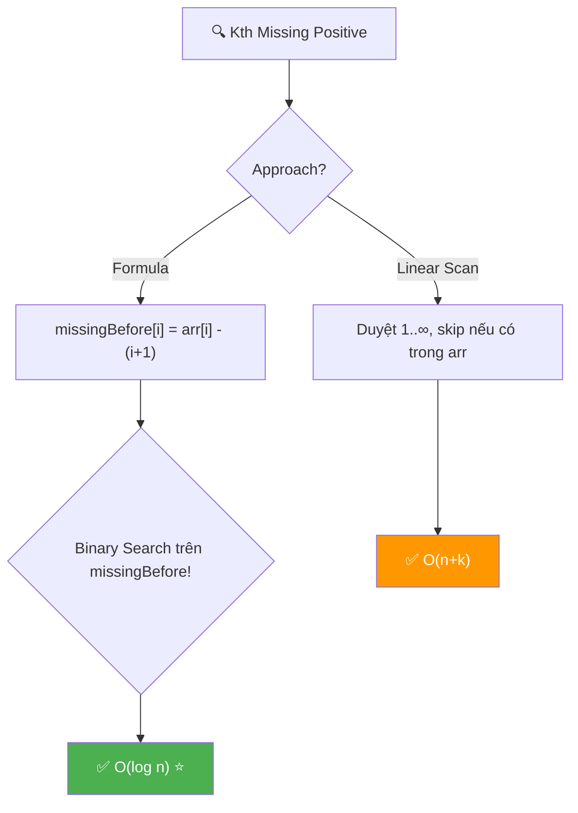
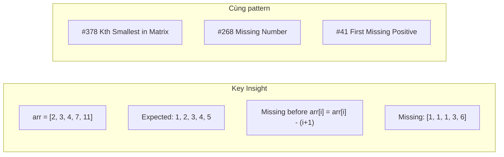
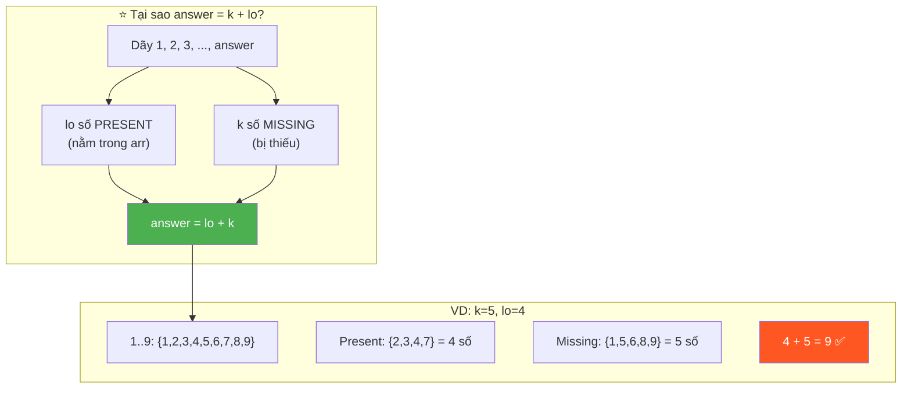
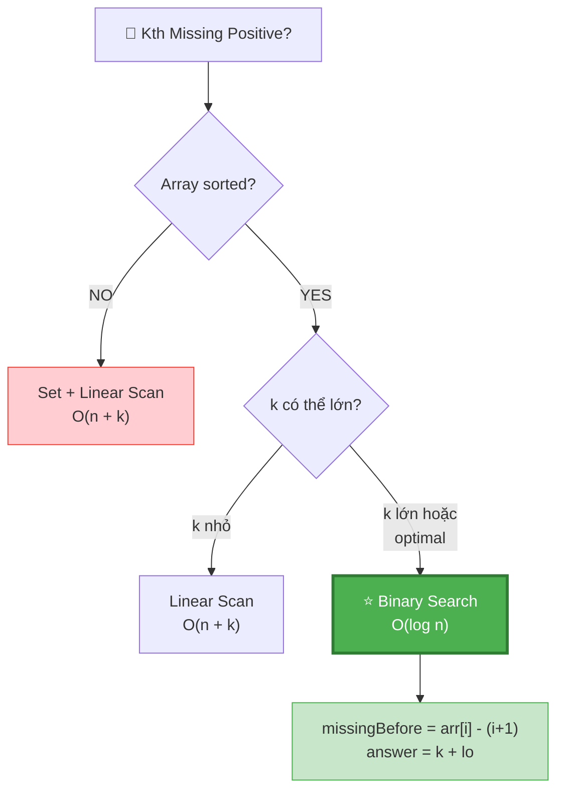
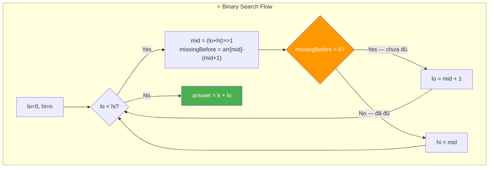
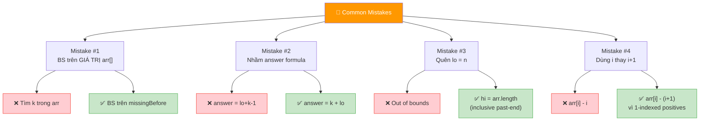
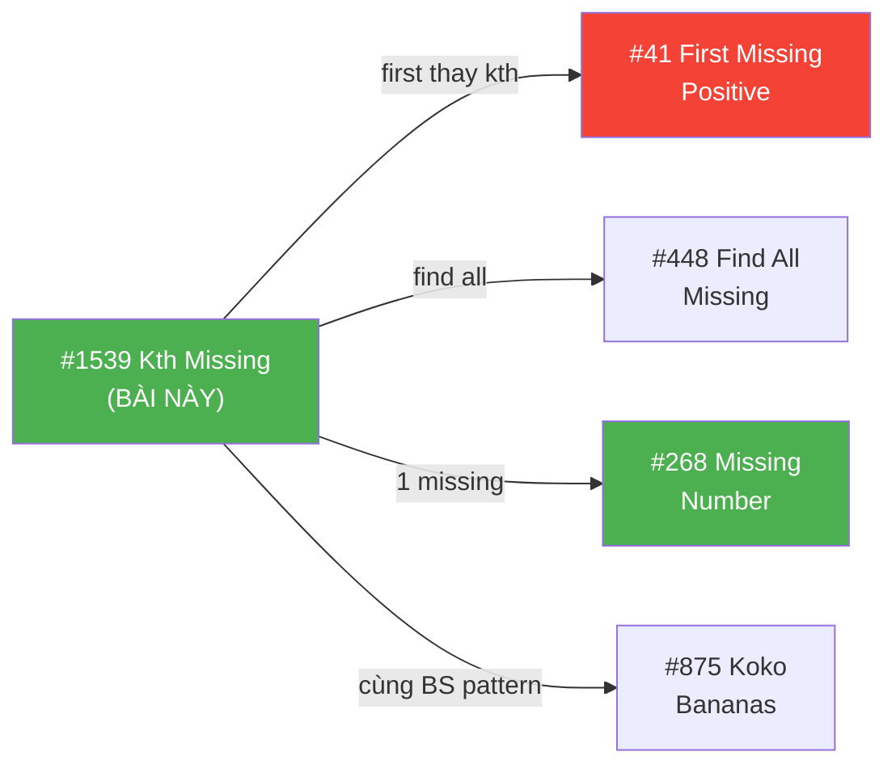
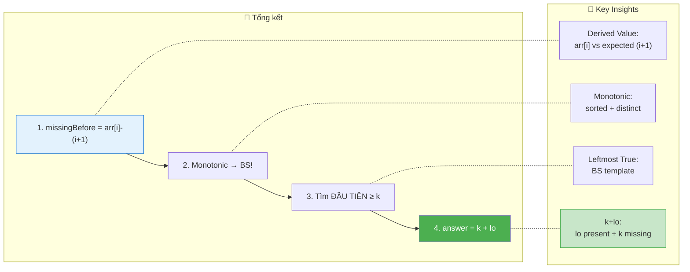

# 🔍 Kth Missing Positive Number — GfG / LeetCode #1539 (Easy)

> 📖 Code: [Kth Missing Positive Number.js](./Kth%20Missing%20Positive%20Number.js)





---

## R — Repeat & Clarify

🧠 *"Cho mảng sorted, distinct, positive. Tìm số DƯƠNG thứ K BỊ THIẾU."*

> 🎙️ *"Given a sorted array of distinct positive integers and k, find the kth positive integer missing from the array."*

### Clarification Questions

```
Q: "Missing" = không xuất hiện trong mảng?
A: ĐÚNG! Positive integers 1, 2, 3, ... mà KHÔNG CÓ trong arr!

Q: Mảng đã sorted?
A: CÓ! Sorted tăng dần + distinct! → Binary Search!

Q: k luôn hợp lệ?
A: CÓ! Luôn tồn tại số missing thứ k!

Q: Positive = bắt đầu từ 1?
A: ĐÚNG! 1, 2, 3, 4, ... (không có 0!)

Q: arr có thể rỗng?
A: CÓ THỂ! arr = [] → answer = k (thiếu 1, 2, ..., k)

Q: Có phần tử trùng không?
A: KHÔNG! Đề nói "distinct"! → arr[i] < arr[i+1] luôn!
```

### Tại sao bài này quan trọng?

```
  ⭐ Bài này dạy BINARY SEARCH trên "CÁI GÌ ĐÓ ẨN"!

  BẠN KHÔNG binary search trên arr[] trực tiếp!
  BẠN binary search trên SỐ LƯỢNG MISSING trước mỗi vị trí!

  ┌───────────────────────────────────────────────────┐
  │  Pattern: Binary Search on DERIVED VALUE!          │
  │  → Không search giá trị gốc                       │
  │  → Search trên function MONOTONIC của index!       │
  │                                                    │
  │  missingBefore(i) = arr[i] - (i + 1)              │
  │  → TĂNG DẦN! → Binary Search!                     │
  │                                                    │
  │  📌 CÒN GẶP LẠI Ở:                                │
  │  #378 Kth Smallest in Sorted Matrix               │
  │  #875 Koko Eating Bananas                          │
  │  #1011 Capacity to Ship Packages                   │
  │  → TẤT CẢ đều "BS on derived monotonic value"!   │
  └───────────────────────────────────────────────────┘
```

---

## 🧠 Bản chất bài toán — Hiểu để NHỚ, không chỉ để GIẢI

### INSIGHT CỐT LÕI: arr[i] - (i+1) = số missing TRƯỚC arr[i]!

```
  ⭐ ĐÂY LÀ TRICK QUAN TRỌNG NHẤT!

  Nếu KHÔNG có số nào bị thiếu:
    arr = [1, 2, 3, 4, 5]        ← lý tưởng!
    arr[i] = i + 1                ← ĐÚNG cho mọi i!

  Nếu CÓ số bị thiếu:
    arr[i] > i + 1                ← arr[i] "lệch" hơn expected!
    Số lượng missing TRƯỚC arr[i] = arr[i] - (i + 1)

  VÍ DỤ: arr = [2, 3, 4, 7, 11]

  ┌───────┬────────┬──────────┬────────────────────────────┐
  │  i    │ arr[i] │ i+1      │ missing = arr[i] - (i+1)   │
  ├───────┼────────┼──────────┼────────────────────────────┤
  │  0    │  2     │  1       │  2 - 1 = 1  (thiếu [1])    │
  │  1    │  3     │  2       │  3 - 2 = 1  (thiếu [1])    │
  │  2    │  4     │  3       │  4 - 3 = 1  (thiếu [1])    │
  │  3    │  7     │  4       │  7 - 4 = 3  (thiếu [1,5,6])│
  │  4    │  11    │  5       │  11 - 5 = 6 (thiếu 1,5,6,  │
  │       │        │          │              8,9,10)        │
  └───────┴────────┴──────────┴────────────────────────────┘

  missingBefore = [1, 1, 1, 3, 6]
  → TĂNG DẦN (monotonic!) → BINARY SEARCH!
```

### Chứng minh missingBefore tăng dần (monotonic)

```
  📐 CHỨNG MINH:

  Cho arr sorted tăng dần + distinct:
    arr[i+1] > arr[i] (strict)
    → arr[i+1] ≥ arr[i] + 1

  missingBefore(i) = arr[i] - (i + 1)
  missingBefore(i+1) = arr[i+1] - (i + 2)
                     ≥ (arr[i] + 1) - (i + 2)
                     = arr[i] - (i + 1)
                     = missingBefore(i)

  → missingBefore(i+1) ≥ missingBefore(i) ✅
  → Monotonic non-decreasing! → Binary Search hợp lệ! ∎

  📌 Tại sao "non-decreasing" chứ không "strictly increasing"?
    Khi arr[i+1] = arr[i] + 1 (liên tiếp, không thiếu):
    → missingBefore(i+1) = missingBefore(i) (bằng nhau!)
    VD: arr = [2, 3, 4] → missingBefore = [1, 1, 1]
```

### Binary Search: Tìm vị trí mà missingBefore ≥ k

```
  ⭐ Tìm vị trí ĐẦU TIÊN mà missingBefore[i] ≥ k!

  VÍ DỤ: k = 5, missingBefore = [1, 1, 1, 3, 6]

  Binary search: tìm i đầu tiên mà arr[i]-(i+1) ≥ 5
    → i = 4 (missingBefore[4] = 6 ≥ 5)

  Kết quả sau khi tìm:
    → lo = index ĐẦU TIÊN mà missingBefore ≥ k
    → Số missing thứ k nằm TRƯỚC arr[lo]!

  CÔNG THỨC: answer = k + lo

  ⭐ Tại sao k + lo?
    → Xét dãy 1, 2, 3, ..., answer
    → Trong dãy này:
      • lo số PRESENT (nằm trong arr, trước index lo)
      • k số MISSING
    → Tổng: answer = lo + k!

  VÍ DỤ: k=5, lo=4
    answer = 5 + 4 = 9
    Dãy 1..9: có 4 present {2,3,4,7} + 5 missing {1,5,6,8,9}
    → 4 + 5 = 9 ✅
```



### Tưởng tượng: ĐƯỜNG SỐ!

```
  Positive: 1  2  3  4  5  6  7  8  9  10  11  12  ...
  arr:         2  3  4        7        10  11
  Missing:  1           5  6     8  9          12  ...

  missingBefore[i] = bao nhiêu "lỗ" TRƯỚC arr[i]?

  arr[0]=2: trước 2 thiếu [1] → 1 lỗ
  arr[3]=7: trước 7 thiếu [1,5,6] → 3 lỗ
  arr[4]=11: trước 11 thiếu [1,5,6,8,9,10] → 6 lỗ

  Tìm "lỗ" thứ k = binary search trên số lỗ!

  ┌──────────────────────────────────────────────────────────┐
  │  Ẩn dụ: Đường số là HÀNG GHẾ trong rạp chiếu phim      │
  │  • arr[] = ghế ĐÃ CÓ NGƯỜI NGỒI                        │
  │  • missing = ghế TRỐNG                                    │
  │  • k = "tìm ghế trống thứ k"                            │
  │                                                          │
  │  missingBefore[i] = số ghế trống TRƯỚC ghế arr[i]!      │
  │  → Binary search vị trí mà số ghế trống ≥ k!           │
  └──────────────────────────────────────────────────────────┘
```

---

## 🧭 Luồng Suy Nghĩ — Từ đọc đề đến solution

### Bước 1: Đọc đề → Gạch chân KEYWORDS

```
  "SORTED array of DISTINCT POSITIVE integers, find Kth MISSING"

  Gạch chân:
    ✏️ SORTED → Binary Search!
    ✏️ DISTINCT → arr[i] < arr[i+1] (strict)
    ✏️ POSITIVE → 1, 2, 3, ... (bắt đầu từ 1!)
    ✏️ MISSING → "lỗ hổng" trong dãy

  🧠 "Sorted + tìm kiếm → nghĩ BINARY SEARCH ngay!"
  🧠 "Nhưng search CÁI GÌ? Không search giá trị trực tiếp..."
```

### Bước 2: Vẽ ví dụ → Phát hiện PATTERN

```
  arr = [2, 3, 4, 7, 11], k = 5

  🧠 "Nếu không thiếu: arr[0]=1, arr[1]=2, arr[2]=3, ..."
  🧠 "arr[i] EXPECTED = i + 1"
  🧠 "arr[i] - (i+1) = số bị lệch = SỐ MISSING!"

  ─── Quá trình suy luận (phỏng vấn thực) ───

  Bước 2a: Viết ra dãy lý tưởng vs thực tế

    index:    0    1    2    3    4
    expected: 1    2    3    4    5    ← nếu không thiếu
    actual:   2    3    4    7    11   ← thực tế
    diff:     1    1    1    3    6    ← SỐ MISSING!

  Bước 2b: Nhận ra diff = arr[i] - (i+1)

    arr[0]=2, i+1=1 → diff = 2-1 = 1 → thiếu [1]
    arr[1]=3, i+1=2 → diff = 3-2 = 1 → vẫn thiếu [1]
    arr[2]=4, i+1=3 → diff = 4-3 = 1 → vẫn thiếu [1]
    arr[3]=7, i+1=4 → diff = 7-4 = 3 → thiếu [1,5,6]
    arr[4]=11,i+1=5 → diff = 11-5= 6 → thiếu [1,5,6,8,9,10]

    🔑 EUREKA: diff TẤT CẢ TĂNG DẦN! [1,1,1,3,6]
      → Monotonic → Binary Search!

  Bước 2c: Nghĩ về answer

    "k=5, vị trí đầu tiên diff≥5 là i=4"
    "Có 4 phần tử arr TRƯỚC answer"
    "Dãy 1..answer: 4 present + 5 missing = 9"
    → answer = 5 + 4 = 9!

  📌 TẤT CẢ INSIGHT NÀY CÓ THỂ RÚT RA TỪ VÍ DỤ!
     Vẽ bảng expected vs actual → thấy NGAY!
```

### Bước 3: Linear → Binary Search → Optimize

```
  Linear O(n+k): Duyệt 1, 2, 3, ... → đếm missing → dừng khi đủ k
    → Đơn giản nhưng k có thể RẤT LỚN!

  Binary Search O(log n): Search trên missingBefore
    → Chỉ phụ thuộc n, KHÔNG k → cực nhanh!
    → answer = k + lo

  📌 So sánh khi n=10⁵, k=10⁹:
    Linear: 10⁵ + 10⁹ ≈ 10⁹ iterations 💀
    Binary: log₂(10⁵) ≈ 17 iterations ⚡
```

### Bước 4: Cây quyết định



---

## E — Examples

```
VÍ DỤ 1: arr = [2, 3, 4, 7, 11], k = 5

  missingBefore = [1, 1, 1, 3, 6]

  Binary search: tìm ĐẦU TIÊN ≥ 5
    lo=0, hi=5
    mid=2: missingBefore[2]=1 < 5 → lo=3
    mid=4: missingBefore[4]=6 ≥ 5 → hi=4
    mid=3: missingBefore[3]=3 < 5 → lo=4
    lo=hi=4

  answer = k + lo = 5 + 4 = 9 ✅
  Missing: [1, 5, 6, 8, 9] → thứ 5 = 9!
```

```
VÍ DỤ 2: arr = [1, 2, 3], k = 2

  missingBefore = [0, 0, 0]     ← không thiếu gì cả!

  Binary search: tìm ĐẦU TIÊN ≥ 2
    → Tất cả < 2 → lo = 3 (past end!)

  answer = k + lo = 2 + 3 = 5 ✅
  Missing: [4, 5, 6, ...] → thứ 2 = 5!

  📌 Edge case: lo = n → tất cả missing NẰM SAU arr!
```

```
VÍ DỤ 3: arr = [3, 5, 9, 10, 11, 12], k = 2

  missingBefore = [2, 3, 6, 6, 6, 6]

  Binary search: tìm ĐẦU TIÊN ≥ 2
    mid=3: 6 ≥ 2 → hi=3
    mid=1: 3 ≥ 2 → hi=1
    mid=0: 2 ≥ 2 → hi=0
    lo=hi=0

  answer = k + lo = 2 + 0 = 2 ✅
  Missing: [1, 2, 4, ...] → thứ 2 = 2!

  📌 Edge case: lo = 0 → tất cả missing NẰM TRƯỚC arr[0]!
```

```
VÍ DỤ 4: arr = [5, 6, 7, 8], k = 4

  missingBefore = [4, 4, 4, 4]

  Binary search: tìm ĐẦU TIÊN ≥ 4
    → lo = 0

  answer = 4 + 0 = 4 ✅
  Missing: [1, 2, 3, 4] → thứ 4 = 4!
```

### Minh họa Binary Search — Trace dạng bảng

```
  arr = [2, 3, 4, 7, 11], k = 5

  ┌─────────┬──────┬──────┬──────┬─────────────────┬──────────┬───────────┐
  │ Iter    │ lo   │ hi   │ mid  │ missingBefore   │ vs k=5   │ Action    │
  ├─────────┼──────┼──────┼──────┼─────────────────┼──────────┼───────────┤
  │  1      │  0   │  5   │  2   │ 4-3=1           │ 1 < 5    │ lo=3      │
  │  2      │  3   │  5   │  4   │ 11-5=6          │ 6 ≥ 5   │ hi=4      │
  │  3      │  3   │  4   │  3   │ 7-4=3           │ 3 < 5    │ lo=4      │
  │ STOP    │  4   │  4   │  -   │                 │          │           │
  └─────────┴──────┴──────┴──────┴─────────────────┴──────────┴───────────┘

  lo = 4 → answer = 5 + 4 = 9 ✅
```

### Trace cho edge case: arr = [100, 200, 300], k = 50

```
  missingBefore = [99, 198, 297]

  Binary search: tìm ĐẦU TIÊN ≥ 50
    mid=1: 198 ≥ 50 → hi=1
    mid=0: 99 ≥ 50 → hi=0
    lo=hi=0

  answer = 50 + 0 = 50 ✅

  🧠 Tất cả 50 missing NẰM TRƯỚC arr[0]=100!
    Missing: 1, 2, ..., 99 (99 số missing)
    Thứ 50 = 50 ✅

  📌 Khi arr[0] rất lớn → missingBefore[0] lớn → lo=0!
```

### Trace cho edge case: arr = [1, 2, 3, 4, 5], k = 1

```
  missingBefore = [0, 0, 0, 0, 0]    ← KHÔNG thiếu gì!

  Binary search: tìm ĐẦU TIÊN ≥ 1
    → Tất cả = 0 < 1 → lo = 5 (past end!)

  answer = 1 + 5 = 6 ✅

  🧠 Mảng "hoàn hảo" → tất cả missing NẰM SAU!
    Missing: 6, 7, 8, ... → thứ 1 = 6!
```

---

## A — Approach

### Approach 1: Linear Scan — O(n + k)

```
💡 Duyệt 1, 2, 3, ... → đếm missing → dừng khi đếm đủ k

  ┌──────────────────────────────────────────────────────────────┐
  │  current = 1 (bắt đầu từ 1)                                │
  │  idx = 0 (pointer vào arr)                                  │
  │  missing = 0 (đếm số missing)                               │
  │                                                              │
  │  while (true):                                               │
  │    if arr[idx] === current → skip! (số này CÓ) → idx++     │
  │    else → missing++ (số này THIẾU)                          │
  │    if missing === k → return current!                        │
  │    current++                                                 │
  │                                                              │
  │  Time: O(n + k)    Space: O(1)                               │
  │                                                              │
  │  ⚠️ Chậm khi k lớn! k=10⁹ → 10⁹ iterations!              │
  └──────────────────────────────────────────────────────────────┘
```

### Approach 2: Binary Search — O(log n) ⭐

```
💡 missingBefore(i) = arr[i] - (i+1) → monotonic → Binary Search!

  ┌──────────────────────────────────────────────────────────────┐
  │  Binary search: tìm lo = ĐẦU TIÊN mà missingBefore ≥ k    │
  │                                                              │
  │  lo = 0, hi = n                                              │
  │  while (lo < hi):                                            │
  │    mid = (lo + hi) >> 1                                      │
  │    if arr[mid] - (mid+1) < k → lo = mid + 1                │
  │    else → hi = mid                                           │
  │                                                              │
  │  answer = k + lo                                              │
  │                                                              │
  │  Time: O(log n)    Space: O(1)                               │
  │  → KHÔNG phụ thuộc k! k=10⁹ vẫn O(log n)!                 │
  └──────────────────────────────────────────────────────────────┘
```



### So sánh

```
  ┌──────────────────┬──────────┬──────────┬──────────────────────┐
  │                  │ Time     │ Space    │ Ghi chú               │
  ├──────────────────┼──────────┼──────────┼──────────────────────┤
  │ Linear Scan      │ O(n + k) │ O(1)     │ Đơn giản, chậm khi k │
  │                  │          │          │ lớn                   │
  │ Binary Search ⭐ │ O(log n) │ O(1)     │ Tối ưu! k-independent│
  └──────────────────┴──────────┴──────────┴──────────────────────┘

  📊 So sánh THỰC TẾ (n = 10⁵, k = 10⁹):
    Linear: 10⁵ + 10⁹ = ~10⁹ iterations ≈ 10 giây 💀
    Binary: log₂(10⁵) = ~17 iterations ≈ 0.001ms ⚡
    → Binary nhanh hơn ~60,000,000×!
```

---

## C — Code ✅

### Solution 1: Linear Scan — O(n + k)

```javascript
function findKthMissingLinear(arr, k) {
  let missing = 0;
  let current = 1;
  let idx = 0;

  while (true) {
    if (idx < arr.length && arr[idx] === current) {
      idx++;
    } else {
      missing++;
      if (missing === k) return current;
    }
    current++;
  }
}
```

```
  📝 Line-by-line:

  Line 2: missing = 0 → đếm số missing tìm được
    → Counter chỉ TĂNG khi gặp số THIẾU
    → Dừng khi missing === k

  Line 3: current = 1 → duyệt TẤT CẢ positive integers từ 1
    → KHÔNG duyệt arr! Duyệt 1, 2, 3, 4, ...
    → current tăng 1 MỖI iteration

  Line 4: idx = 0 → pointer vào arr (sorted!)
    → Chỉ tăng khi arr[idx] === current (match!)
    → Vì arr sorted → idx LUÔN tăng → mỗi phần tử xét 1 lần

  Line 7: if (idx < arr.length && arr[idx] === current)
    → 2 điều kiện AND (short-circuit!):
      ① idx < arr.length: chưa hết mảng
      ② arr[idx] === current: số này CÓ trong arr → skip!

    ⚠️ Tại sao arr[idx] chỉ cần so với current?
      → arr sorted → arr[idx] là số NHỎ NHẤT chưa xét!
      → Nếu arr[idx] === current → match → idx++
      → Nếu arr[idx] > current → current THIẾU!

  Line 10: missing++ → current là số MISSING!
  Line 11: if (missing === k) return current → đã đủ k!

  Line 13: current++ → xét số tiếp theo
```

### Solution 2: Binary Search — O(log n) ⭐

```javascript
function findKthMissing(arr, k) {
  let lo = 0,
    hi = arr.length;

  while (lo < hi) {
    const mid = (lo + hi) >> 1;
    const missingBefore = arr[mid] - (mid + 1);

    if (missingBefore < k) {
      lo = mid + 1;
    } else {
      hi = mid;
    }
  }

  return k + lo;
}
```

---

## 🔬 Deep Dive — Giải thích CHI TIẾT từng dòng code

> 💡 Phần này phân tích **từng dòng Binary Search** để bạn hiểu **TẠI SAO**.

```javascript
function findKthMissing(arr, k) {
  // ═══════════════════════════════════════════════════════════════
  // DÒNG 1: Khởi tạo lo = 0, hi = arr.length
  // ═══════════════════════════════════════════════════════════════
  //
  // TẠI SAO hi = arr.length (KHÔNG PHẢI arr.length - 1)?
  //   → Template "tìm vị trí ĐẦU TIÊN thỏa điều kiện"
  //   → lo có thể = arr.length (past end!)
  //   → Khi tất cả missingBefore < k → answer NẰM SAU mảng
  //   → VD: arr = [1, 2, 3], k = 2 → lo = 3  → answer = 5
  //
  // TẠI SAO lo = 0?
  //   → Vị trí đầu tiên khả dĩ
  //   → missingBefore[0] có thể đã ≥ k
  //   → VD: arr = [100], k = 1 → lo = 0 → answer = 1
  //
  let lo = 0,
    hi = arr.length;

  // ═══════════════════════════════════════════════════════════════
  // DÒNG 2-8: Binary Search — tìm ĐẦU TIÊN missingBefore ≥ k
  // ═══════════════════════════════════════════════════════════════
  //
  // Pattern: "leftmost true" binary search!
  //   → Tìm index NHỎ NHẤT mà condition = true
  //   → condition: arr[mid] - (mid+1) ≥ k
  //
  while (lo < hi) {

    // ─────────────────────────────────────────────────────────────
    // DÒNG 3: mid = (lo + hi) >> 1
    // ─────────────────────────────────────────────────────────────
    //
    // >> 1 = chia 2 bỏ dư (equivalent Math.floor((lo+hi)/2))
    // TẠI SAO >> 1 thay vì / 2?
    //   → Nhanh hơn (bitwise operation)
    //   → Tránh floating point
    //   → Convention phổ biến trong competitive programming
    //
    const mid = (lo + hi) >> 1;

    // ─────────────────────────────────────────────────────────────
    // DÒNG 4: Tính missingBefore — THE DERIVED VALUE
    // ─────────────────────────────────────────────────────────────
    //
    // arr[mid] - (mid + 1) = "bao nhiêu số THIẾU trước arr[mid]?"
    //
    // Giải thích:
    //   Nếu không thiếu gì: arr[mid] = mid + 1
    //   Thực tế: arr[mid] > mid + 1 (vì có "lỗ"!)
    //   Số lỗ = arr[mid] - (mid + 1)
    //
    const missingBefore = arr[mid] - (mid + 1);

    // ─────────────────────────────────────────────────────────────
    // DÒNG 5-8: So sánh và thu hẹp range
    // ─────────────────────────────────────────────────────────────
    //
    // missingBefore < k:
    //   → TRƯỚC arr[mid] có < k số missing
    //   → Số missing thứ k nằm SAU arr[mid]
    //   → lo = mid + 1 (bỏ nửa trái + mid!)
    //
    // missingBefore ≥ k:
    //   → TRƯỚC arr[mid] đã có ≥ k số missing
    //   → Có thể mid là vị trí ĐẦU TIÊN, hoặc trước đó
    //   → hi = mid (GIỮ mid! Không bỏ!)
    //
    // ⚠️ Tại sao KHÔNG dùng ===?
    //   → missingBefore có thể "nhảy" (VD: [1, 1, 3, 6])
    //   → Nếu k=2: missingBefore KHÔNG CÓ phần tử = 2!
    //   → Phải tìm ĐẦU TIÊN ≥ k (không phải = k!)
    //
    if (missingBefore < k) {
      lo = mid + 1;
    } else {
      hi = mid;
    }
  }

  // ═══════════════════════════════════════════════════════════════
  // DÒNG 9: answer = k + lo — THE MAGIC FORMULA
  // ═══════════════════════════════════════════════════════════════
  //
  // lo = số phần tử arr NẰM TRƯỚC answer
  // k = vị trí missing (thứ k)
  //
  // Trong dãy 1, 2, ..., answer:
  //   lo số PRESENT (thuộc arr)
  //   k số MISSING
  //   → answer = lo + k
  //
  // VD: k=5, lo=4 → answer=9
  //   Dãy 1..9: present={2,3,4,7}, missing={1,5,6,8,9}
  //   4 + 5 = 9 ✅
  //
  return k + lo;
}
```

---

## 📐 Invariant — Chứng minh tính đúng đắn

```
  📐 INVARIANT (bất biến) trong Binary Search:

  Tại mọi thời điểm:
    ∀ i < lo:  missingBefore(i) < k    (chưa đủ k missing)
    ∀ i ≥ hi:  missingBefore(i) ≥ k    (đã đủ k missing)

  Chứng minh:
  ┌──────────────────────────────────────────────────────────────────┐
  │  Base: lo=0, hi=n                                               │
  │    ∀ i < 0: tập rỗng → đúng trivially ✅                       │
  │    ∀ i ≥ n: tập rỗng → đúng trivially ✅                       │
  │                                                                 │
  │  Inductive: mỗi iteration:                                     │
  │                                                                 │
  │    Case 1: missingBefore(mid) < k                               │
  │      → lo = mid + 1                                              │
  │      → Thêm mid vào "chưa đủ k" → invariant giữ ✅             │
  │                                                                 │
  │    Case 2: missingBefore(mid) ≥ k                               │
  │      → hi = mid                                                  │
  │      → Thêm mid vào "đã đủ k" → invariant giữ ✅               │
  │                                                                 │
  │  Termination: lo = hi                                           │
  │    → lo = vị trí ĐẦU TIÊN mà missingBefore ≥ k                │
  │    → Có chính xác lo phần tử arr TRƯỚC answer                  │
  │    → answer = k + lo ∎                                          │
  └──────────────────────────────────────────────────────────────────┘
```

---

## ❌ Common Mistakes — Lỗi thường gặp



### Mistake 1: Binary search trên GIÁ TRỊ arr[] thay vì missingBefore!

```javascript
// ❌ SAI: tìm k trong arr
while (lo < hi) {
  if (arr[mid] < k) lo = mid + 1;  // ← HOÀN TOÀN SAI!
}

// ✅ ĐÚNG: search trên DERIVED VALUE
const missingBefore = arr[mid] - (mid + 1);
if (missingBefore < k) lo = mid + 1;
```

```
  🧠 Tại sao sai?
    → k là "thứ tự trong SỐ MISSING"
    → arr chứa SỐ PRESENT!
    → So sánh k với arr[mid] = SO SÁNH 2 THỨ KHÁC NHAU!
```

### Mistake 2: Nhầm công thức answer

```javascript
// ❌ SAI: answer = lo + k - 1
return lo + k - 1;  // off-by-one!

// ❌ SAI: answer = arr[lo] - (missingBefore - k)
// Quá phức tạp và dễ sai!

// ✅ ĐÚNG: answer = k + lo
return k + lo;
// Vì: dãy 1..answer có lo present + k missing!
```

### Mistake 3: Quên case lo = n (past end)

```javascript
// ❌ SAI: hi = arr.length - 1 → bỏ sót case past-end
let hi = arr.length - 1;
// arr = [1, 2, 3], k = 2 → lo KHÔNG THỂ = 3 → SAI!

// ✅ ĐÚNG: hi = arr.length
let hi = arr.length;
// arr = [1, 2, 3], k = 2 → lo = 3 → answer = 5 ✅
```

### Mistake 4: Dùng (i) thay vì (i+1)

```javascript
// ❌ SAI: arr[i] - i
const missingBefore = arr[mid] - mid;
// arr = [1, 2, 3]: arr[0]-0 = 1 → mà thực tế KHÔNG thiếu gì!

// ✅ ĐÚNG: arr[i] - (i + 1)
const missingBefore = arr[mid] - (mid + 1);
// arr = [1, 2, 3]: arr[0]-(0+1) = 0 → ĐÚNG! Không thiếu!

// 🧠 Vì index 0-based nhưng positive bắt đầu từ 1!
//    arr[0] "expected" = 1 = 0 + 1 (KHÔNG PHẢI 0!)
```

---

## O — Optimize

```
                    Time      Space     Ghi chú
  ─────────────────────────────────────────────────
  Linear Scan       O(n + k)  O(1)      Đơn giản
  Binary Search ⭐  O(log n)  O(1)      Tối ưu!

  ⚠️ Binary Search LUÔN O(log n):
    KHÔNG phụ thuộc k! (khác linear scan!)
    k = 10⁹ → linear chết, binary search vẫn nhanh!

  ⚠️ Tại sao O(log n) chứ không phải O(log(n+k))?
    Binary search CHỈ trên arr[] (n phần tử!)
    Sau khi tìm lo → tính answer = k + lo → O(1)!
```

### Complexity chính xác — Đếm operations

```
  Binary Search:
    Iterations: ⌈log₂(n)⌉ (tối đa)
    Mỗi iteration: 1 phép trừ + 1 so sánh + 1 gán = 3 ops
    Cuối: 1 phép cộng (k + lo)

    TỔNG: 3⌈log₂(n)⌉ + 1 operations

  Linear Scan:
    Check arr[idx] === current: n + k lần (tối đa)
    Increment: n + k lần

    TỔNG: 2(n + k) operations

  📊 So sánh THỰC TẾ:

  ┌──────────────┬──────────────────┬──────────────────┐
  │ Tình huống    │ Linear Scan      │ Binary Search    │
  ├──────────────┼──────────────────┼──────────────────┤
  │ n=10, k=5    │ 30 ops ≈ 0ms    │ 13 ops ≈ 0ms    │
  │ n=10⁵, k=10  │ 200,020 ops     │ 52 ops ⚡        │
  │ n=10⁵, k=10⁹ │ 2×10⁹ ops ≈10s 💀│ 52 ops ≈ 0ms ⚡ │
  │ n=10⁶, k=1   │ 2×10⁶ ops       │ 61 ops ⚡        │
  └──────────────┴──────────────────┴──────────────────┘

  📌 Binary Search "phá vỡ" sự phụ thuộc vào k!
     k từ 1 đến 10⁹ → số operations KHÔNG ĐỔI!
```

### Có thể tối ưu hơn nữa không?

```
  Time: KHÔNG! Ω(log n) là lower bound cho sorted array!
    → Cần ít nhất log n comparisons để xác định vị trí
    → Binary Search ĐÃ ĐẠT lower bound!

  Space: KHÔNG! O(1) đã là optimal!
    → Chỉ dùng 3 biến: lo, hi, mid

  📌 "Optimal = O(log n) time, O(1) space — KHÔNG CÓ GÌ TỐT HƠN!"
```

### ❓ "Tại sao không dùng Set/HashSet?"

```
  🧠 "Cho tất cả phần tử vào Set, rồi duyệt 1, 2, 3, ...?"

  function withSet(arr, k) {
    const set = new Set(arr);
    let count = 0;
    for (let i = 1; ; i++) {
      if (!set.has(i)) count++;
      if (count === k) return i;
    }
  }

  Time: O(n + answer) ≈ O(n + k)
  Space: O(n) — TỐN thêm!

  ❌ KHÔNG TỐI ƯU:
    → Tốn O(n) space cho Set
    → Tốn O(n + k) time (giống linear scan!)
    → KHÔNG tận dụng "sorted"!

  📌 Khi nào dùng Set?
    → Khi arr KHÔNG SORTED!
    → Khi n nhỏ và k nhỏ
    → KHÔNG dùng khi arr sorted (binary search tốt hơn!)
```

---

## T — Test

```
Test Cases:
  [2, 3, 4, 7, 11],     k=5   → 9    ✅ missing: 1,5,6,8,9
  [1, 2, 3],             k=2   → 5    ✅ missing: 4,5
  [3, 5, 9, 10, 11, 12], k=2   → 2    ✅ missing: 1,2
  [1],                   k=1   → 2    ✅ missing: 2
  [2],                   k=1   → 1    ✅ missing: 1
  [1, 2, 3, 4],          k=2   → 6    ✅ missing: 5,6
  [5, 6, 7, 8],          k=4   → 4    ✅ missing: 1,2,3,4
  [1, 3],                k=1   → 2    ✅ missing: 2
  [100],                 k=50  → 50   ✅ missing: 1..49,51→ thứ 50=50
```

### Edge Cases giải thích

```
  ┌──────────────────────────────────────────────────────────────────┐
  │  All missing trước:  arr=[5,6,7,8], k=4 → lo=0 → ans=4        │
  │    Tất cả k missing NẰM TRƯỚC arr[0]!                          │
  │                                                                  │
  │  All missing sau:    arr=[1,2,3], k=2 → lo=3 → ans=5            │
  │    Tất cả k missing NẰM SAU arr cuối!                           │
  │                                                                  │
  │  arr rất lớn:        arr[0]=100, k=50 → lo=0 → ans=50           │
  │    missingBefore[0]=99 ≥ 50 → tất cả trước arr[0]!             │
  │                                                                  │
  │  k rất lớn:          arr=[1,2,3], k=10⁹ → lo=3 → ans=10⁹+3    │
  │    Binary: O(log 3)=2 iterations! Linear: 10⁹ iterations 💀    │
  └──────────────────────────────────────────────────────────────────┘
```

---

## 🗣️ Interview Script

### 🎙️ Think Out Loud — Mô phỏng phỏng vấn thực

```
  ──────────────── PHASE 1: Clarify ────────────────

  👤 Interviewer: "Given a sorted array of distinct positive integers
                   and k, find the kth positive integer missing."

  🧑 You: "Let me clarify:
   1. The array is sorted in ascending order with no duplicates.
   2. 'Missing' means positive integers 1, 2, 3, ... not in the array.
   3. k is always valid — there will always be a kth missing number.
   4. I should return the value, not the index."

  ──────────────── PHASE 2: Examples ────────────────

  🧑 You: "Take arr = [2, 3, 4, 7, 11], k = 5.
   Missing numbers are: 1, 5, 6, 8, 9, 10, ...
   The 5th missing is 9."

  ──────────────── PHASE 3: Approach ────────────────

  🧑 You: "Linear scan: check 1, 2, 3, ... but that's O(n+k).
   If k is huge, that's too slow.

   Key insight: for a sorted array, I can compute how many
   positive integers are MISSING before arr[i]:
   missingBefore = arr[i] - (i + 1).

   In a perfect array [1,2,3,...], arr[i] would equal i+1.
   The difference tells me how many numbers were 'skipped'.

   This is monotonically non-decreasing, so I can binary search
   for the first index where missingBefore >= k.

   The answer is then k + lo. Why? In the sequence 1 to answer,
   there are exactly 'lo' array elements and k missing numbers.

   O(log n) time, O(1) space."

  ──────────────── PHASE 4: Code + Verify ────────────────

  🧑 You: [writes code, traces example]

  "Testing edge cases:
   - arr=[1,2,3], k=2: all missingBefore=0 < 2, lo=3, ans=5 ✅
   - arr=[5,6,7], k=3: missingBefore[0]=4≥3, lo=0, ans=3 ✅"

  ──────────────── PHASE 5: Follow-ups ────────────────

  👤 "What if the array is unsorted?"
  🧑 "Then I can't use binary search. I'd use a HashSet for O(1)
      lookup and linearly scan 1, 2, 3, ... That's O(n+k)."

  👤 "What about First Missing Positive (#41)?"
  🧑 "That's harder — finding the FIRST missing, not the kth.
      I'd use cyclic sort: place each num at index num-1.
      Then scan for the first mismatch. O(n) time, O(1) space."
```

---

## 📚 Bài tập liên quan — Practice Problems

### Progression Path



### 1. Missing Number (#268) — Easy

```
  Đề: Mảng chứa n distinct numbers từ [0, n]. Tìm số THIẾU.

  function missingNumber(nums) {
    const n = nums.length;
    const expectedSum = n * (n + 1) / 2;
    const actualSum = nums.reduce((a, b) => a + b, 0);
    return expectedSum - actualSum;
  }

  📌 So sánh: #268 tìm 1 số → Sum/XOR đủ!
     #1539 tìm kth → cần Binary Search!
```

### 2. First Missing Positive (#41) — Hard

```
  Đề: Tìm số DƯƠNG NHỎ NHẤT không có trong mảng (unsorted!)

  function firstMissingPositive(nums) {
    const n = nums.length;
    // Cyclic sort: đặt nums[i] vào vị trí nums[i]-1
    for (let i = 0; i < n; i++) {
      while (nums[i] > 0 && nums[i] <= n
              && nums[nums[i]-1] !== nums[i]) {
        [nums[nums[i]-1], nums[i]] = [nums[i], nums[nums[i]-1]];
      }
    }
    // Tìm vị trí đầu tiên bị sai
    for (let i = 0; i < n; i++) {
      if (nums[i] !== i + 1) return i + 1;
    }
    return n + 1;
  }

  📌 Khác #1539: unsorted → KHÔNG dùng binary search!
     Dùng CYCLIC SORT (in-place) → O(n), O(1)!
```

### 3. Koko Eating Bananas (#875) — Medium

```
  Đề: Tìm speed TỐI THIỂU để Koko ăn hết n pile trong h giờ.

  📌 CÙNG PATTERN: Binary Search on DERIVED VALUE!
    #1539: BS trên missingBefore (arr[i] - (i+1))
    #875:  BS trên hoursNeeded (Σ ceil(pile/speed))

  → Cả 2 đều "BS trên function MONOTONIC" thay vì array!
```

### Tổng kết — "BS trên CÁI GÌ?"

```
  ┌──────────────────────────────────────────────────────────────┐
  │  BÀI                    │  BS trên GÌ?                      │
  ├──────────────────────────────────────────────────────────────┤
  │  Standard BS            │  arr[mid] (giá trị trực tiếp)     │
  │  #1539 Kth Missing ⭐  │  arr[mid] - (mid+1) (derived!)    │
  │  #875 Koko Bananas      │  hoursNeeded(speed) (function!)   │
  │  #1011 Ship Packages    │  daysNeeded(capacity) (function!) │
  │  #378 Kth in Matrix     │  countLessOrEqual(val)            │
  └──────────────────────────────────────────────────────────────┘

  📌 "Binary Search on Answer" = BS trên DERIVED MONOTONIC VALUE!
     → Đây là PATTERN cao cấp, xuất hiện nhiều ở Medium/Hard!
     → Hiểu #1539 = MỞ CỬA cho cả họ bài này!
```

### Skeleton code — Reusable template

```javascript
// TEMPLATE: Binary search on derived monotonic value
function bsOnDerived(arr, target) {
  let lo = 0, hi = arr.length;  // hoặc hi = MAX_VALUE

  while (lo < hi) {
    const mid = (lo + hi) >> 1;
    const derived = computeDerived(arr, mid);  // MONOTONIC!

    if (derived < target) {
      lo = mid + 1;    // chưa đủ → tìm PHẢI
    } else {
      hi = mid;         // đã đủ → tìm TRÁI (leftmost!)
    }
  }

  return transformAnswer(lo, target);
}

// #1539: computeDerived = arr[mid] - (mid+1)
//        transformAnswer = k + lo
// #875:  computeDerived = totalHours(speed=mid)
//        transformAnswer = lo
```

---

## 📊 Tổng kết — Key Insights



```
  ┌──────────────────────────────────────────────────────────────────────────┐
  │  📌 3 ĐIỀU PHẢI NHỚ                                                    │
  │                                                                          │
  │  1. CÔNG THỨC: missingBefore(i) = arr[i] - (i + 1)                     │
  │     → "Số missing TRƯỚC arr[i] = arr[i] so với expected i+1"           │
  │     → Monotonic non-decreasing → Binary Search hợp lệ!                │
  │                                                                          │
  │  2. BINARY SEARCH: tìm ĐẦU TIÊN missingBefore ≥ k                     │
  │     → Leftmost true template: lo=0, hi=n                               │
  │     → Kết quả: lo = vị trí ĐẦU TIÊN (có thể = n = past-end!)        │
  │                                                                          │
  │  3. ANSWER = k + lo                                                      │
  │     → Dãy 1..answer có lo số PRESENT + k số MISSING                   │
  │     → Formula ĐƠN GIẢN nhưng cần HIỂU tại sao!                       │
  │     → HỌC PATTERN NÀY → GIẢI ĐƯỢC #875, #1011, #378!                 │
  └──────────────────────────────────────────────────────────────────────────┘
```

## 📝 Flashcard — Tự kiểm tra

| ❓ Câu hỏi | ✅ Đáp án |
|---|---|
| Công thức missing trước arr[i]? | **arr[i] - (i + 1)** |
| Tại sao binary search được? | missingBefore **tăng dần** (monotonic)! |
| Binary search tìm gì? | Index **đầu tiên** mà missingBefore ≥ k |
| Công thức answer? | **k + lo** |
| Tại sao k + lo? | Dãy 1..answer: lo present + k missing |
| lo = n (past end) thì sao? | Vẫn đúng! answer = k + n |
| Time / Space? | **O(log n)** / O(1) |
| BS trên cái gì? | **Derived value** (arr[i]-(i+1)), KHÔNG phải arr! |
| Pattern tương tự? | **#875 Koko, #1011 Ship, #378 Kth Matrix** |
