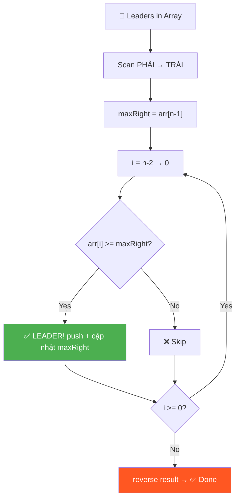
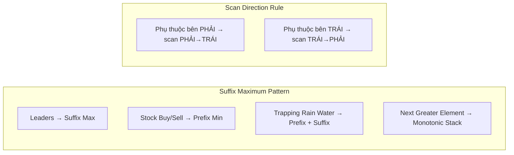

# 👑 Leaders in an Array — GfG (Easy)

> 📖 Code: [Leaders in an Array.js](./Leaders%20in%20an%20Array.js)





---

## R — Repeat & Clarify

🧠 *"Leader = lớn hơn hoặc bằng TẤT CẢ phần tử bên PHẢI. Scan từ phải → trái, track max!"*

> 🎙️ *"An element is a Leader if it is greater than or equal to ALL elements to its right. The rightmost element is always a leader since there's nothing to its right."*

### Clarification Questions

```
Q: "Greater than hoặc equal to"?
A: CẢ HAI! >= tất cả bên phải!
   arr = [5, 5, 5] → TẤT CẢ là leader (vì 5 >= 5)

Q: Phần tử cuối cùng luôn là leader?
A: Đúng! Không có phần tử nào bên phải → tự động leader!

Q: Trả về theo thứ tự nào?
A: Giữ thứ tự GỐC (trái → phải)

Q: Có phần tử trùng?
A: Có thể! Và = vẫn tính là leader

Q: Mảng rỗng hoặc 1 phần tử?
A: Rỗng → []. 1 phần tử → [chính nó] (luôn là leader)
```

### Tại sao bài này quan trọng?

```
  Bài này dạy PATTERN cực kỳ phổ biến:
  
  "So sánh 1 phần tử với TẤT CẢ phần tử bên phải"
  
  Brute force: O(n²) — duyệt từng phần tử bên phải
  Optimal:     O(n)  — CHỈ CẦN TRACK MAX!

  💡 KEY INSIGHT:
    KHÔNG CẦN biết TẤT CẢ phần tử bên phải!
    CHỈ CẦN biết phần tử LỚN NHẤT bên phải!
    → Nếu arr[i] >= max_right → arr[i] >= TẤT CẢ bên phải!

  Pattern này dùng lại trong:
    - Trapping Rain Water
    - Stock Buy/Sell
    - Next Greater Element
```

---

## 🧠 Bản chất bài toán — Hiểu để NHỚ, không chỉ để GIẢI

### 🚶 Bước 1: Đọc đề — Dịch sang ngôn ngữ "của mình"

```
  ĐỀ BÀI: "Tìm tất cả phần tử lớn hơn hoặc bằng TẤT CẢ phần tử
            bên phải nó"

  🧠 Tôi đọc xong, tôi DỊCH LẠI:
    → Mỗi phần tử, tôi cần NHÌN về bên PHẢI
    → Nếu KHÔNG AI bên phải lớn hơn nó → nó là leader

  Ví dụ cụ thể luôn: arr = [16, 17, 4, 3, 5, 2]
    16 nhìn phải: thấy 17 CAO HƠN → ❌ thua!
    17 nhìn phải: không ai CAO HƠN → ✅ LEADER!
     4 nhìn phải: thấy 5 CAO HƠN  → ❌ thua!
     5 nhìn phải: chỉ có 2         → ✅ LEADER!
     2 không có ai bên phải         → ✅ LEADER!

  💡 Tôi ghi nhận: Leader = "vua" của đoạn bên phải
     = KHÔNG CÓ AI lớn hơn ở phía bên phải nó
```

### 🚶 Bước 2: Brute Force trước — ĐỪNG CỐ SMART NGAY!

```
  🧠 Suy nghĩ tự nhiên nhất:
    "Muốn biết arr[i] có phải leader không?"
    → "Duyệt TẤT CẢ phần tử bên phải, check từng cái"
    → 2 vòng for lồng nhau → O(n²)

  Tôi VIẾT ra Brute Force trước, KHÔNG ngại:
    for i = 0 → n-1:
      for j = i+1 → n-1:
        if arr[j] > arr[i] → KHÔNG phải leader → break

  ⚠️ LƯU Ý: Bước này CỰC KỲ quan trọng!
     Nhiều người nhảy thẳng vào tối ưu → STUCK!
     LUÔN bắt đầu từ brute force → hiểu bài → rồi tối ưu!
```

### 🚶 Bước 3: Tìm điểm LÃNG PHÍ — Đâu là chỗ LÀM THỪA?

```
  🧠 Bây giờ tôi TỰ HỎI: "Brute force LÃNG PHÍ ở đâu?"

  Trace lại:
    Check arr[0]=16: duyệt [17, 4, 3, 5, 2] → tìm max = 17
    Check arr[1]=17: duyệt [4, 3, 5, 2]      → tìm max = 5
    Check arr[2]=4:  duyệt [3, 5, 2]          → tìm max = 5
    Check arr[3]=3:  duyệt [5, 2]             → tìm max = 5
    Check arr[4]=5:  duyệt [2]                → tìm max = 2

  🔴 PHÁT HIỆN: Tôi đang tìm MAX bên phải LẶP LẠI!
     Khi check arr[0], tôi duyệt [17, 4, 3, 5, 2] để tìm max
     Khi check arr[1], tôi lại duyệt [4, 3, 5, 2] để tìm max
     → HẦU NHƯ CÙNG MẢNG, chỉ bớt 1 phần tử!
     → LÃNG PHÍ!!!

  💡 Câu hỏi đặt ra:
     "Có cách nào BIẾT max bên phải MÀ KHÔNG duyệt lại?"
```

### 🚶 Bước 4: Key Insight — "Tôi cần gì THẬT SỰ?"

```
  🧠 Tôi tự hỏi: "Để biết arr[i] có phải leader không,
     tôi CẦN BIẾT GÌ?"

  ❌ Sai: "Tôi cần biết TẤT CẢ phần tử bên phải"
  ✅ Đúng: "Tôi CHỈ CẦN biết phần tử LỚN NHẤT bên phải!"

  Tại sao?
    Nếu arr[i] >= MAX bên phải
    → arr[i] >= TẤT CẢ bên phải (vì max >= mọi phần tử)
    → arr[i] là leader!

  💡 Ví dụ đời thực cho dễ nhớ:
    Q: "Bạn có cao hơn TẤT CẢ mọi người trong phòng không?"
    ❌ Cách ngu: đo chiều cao TỪNG NGƯỜI, so sánh TỪNG CÁI
    ✅ Cách thông minh: hỏi "Ai CAO NHẤT phòng?"
       → Nếu bạn >= người cao nhất → chắc chắn >= TẤT CẢ!

  → BẢN CHẤT: Thu gọn "so sánh với TẬP" → "so sánh với MAX"!
```

### 🚶 Bước 5: "OK biết cần max, nhưng LÀM SAO có max NHANH?"

```
  🧠 Đến đây tôi biết: cần MAX bên phải cho từng vị trí
     Nhưng tính max bên phải bằng cách nào?

  💭 Thử ý tưởng 1: Pre-compute mảng suffixMax
     suffixMax[i] = max(arr[i+1], arr[i+2], ..., arr[n-1])

     → 1 pass ngược tính suffixMax: O(n)
     → 1 pass xuôi check từng arr[i] >= suffixMax[i]: O(n)
     → Tổng: O(n)! ✅ Nhưng tốn O(n) space cho suffixMax

  💭 Thử ý tưởng 2: "Có cần cả mảng suffixMax không?"
     Khi tôi scan từ PHẢI → TRÁI:
       - Tại i=n-1: max bên phải = -∞ (không có) → leader
       - Tại i=n-2: max bên phải = arr[n-1]
       - Tại i=n-3: max bên phải = max(arr[n-2], old_max)

     🟢 EUREKA!!! Max bên phải chỉ cần CẬP NHẬT DẦN!
        Tôi chỉ cần 1 BIẾN maxRight, không cần cả mảng!
        → O(1) space!

  → Scan phải→trái + 1 biến maxRight = GIẢI PHÁP TỐI ƯU!
```

### 🚶 Bước 6: "Tại sao PHẢI scan PHẢI→TRÁI?"

```
  🧠 Câu hỏi hiển nhiên: "Tại sao không scan trái→phải?"

  Thử scan TRÁI → PHẢI:
    Tại arr[0]=16: cần max bên PHẢI = max(17,4,3,5,2) = 17
    → CHƯA BIẾT! Phải duyệt hết bên phải → O(n) → quay về brute force!

  Thử scan PHẢI → TRÁI:
    Tại arr[4]=5: cần max bên PHẢI = max(2) = 2 → ĐÃ BIẾT! (đi qua rồi)
    Tại arr[3]=3: cần max bên PHẢI = max(5,2) = 5 → ĐÃ BIẾT!
    → MỖI bước, max bên phải ĐÃ CÓ SẴN từ bước trước!

  📐 QUY TẮC TỔNG QUÁT (ghi nhớ cho MỌI bài):
    ┌────────────────────────────────────────────────┐
    │ Cần thông tin bên PHẢI → scan từ PHẢI → TRÁI  │
    │ Cần thông tin bên TRÁI → scan từ TRÁI → PHẢI  │
    │ Cần CẢ HAI             → 2 pass hoặc 2 ptrs   │
    └────────────────────────────────────────────────┘

  Áp dụng quy tắc này cho bài khác:
    Stock Buy/Sell: cần MIN bên trái (giá mua) → scan trái→phải
    Trapping Rain: cần max TRÁI + max PHẢI → 2 pass!
```

### 🚶 Bước 7: Ghép lại thành thuật toán hoàn chỉnh

```
  🧠 Bây giờ tôi có tất cả mảnh ghép:
    ✅ Chỉ cần so sánh với MAX bên phải (Bước 4)
    ✅ Scan phải→trái (Bước 6)
    ✅ Dùng 1 biến maxRight cập nhật dần (Bước 5)

  Thuật toán:
    1. maxRight = arr[n-1] (phần tử cuối luôn là leader)
    2. Từ i = n-2 → 0:
       - Nếu arr[i] >= maxRight → LEADER! Cập nhật maxRight
       - Nếu arr[i] < maxRight → bỏ qua
    3. Reverse result (vì thu thập ngược)

  ⚠️ Chi tiết nhỏ nhưng quan trọng:
    → Dấu >= chứ KHÔNG PHẢI > (equal cũng tính leader!)
    → Phải reverse cuối vì thu thập từ phải→trái
    → push + reverse() tốt hơn unshift() (unshift = O(k) mỗi lần)
```

### 📝 Tóm tắt luồng suy nghĩ

```
  ĐỌC ĐỀ
    ↓
  "Mỗi phần tử so sánh với TẤT CẢ bên phải"
    ↓
  Brute force: 2 vòng for → O(n²)
    ↓
  "Chỗ nào LÃNG PHÍ?" → Tính max bên phải LẶP LẠI!
    ↓
  "Thật ra chỉ cần MAX bên phải, không cần tất cả!"
    ↓
  "Tính max bên phải bằng cách nào nhanh?"
    ↓
  Scan phải→trái, CẬP NHẬT maxRight dần dần → O(n)!
    ↓
  ✅ DONE!

  🔑 Bí quyết: ĐỪNG CỐ NGHĨ RA NGAY!
     Brute force → Tìm lãng phí → Hỏi "cần gì thật sự?"
     → Tự nhiên sẽ ra solution!
```

---

## E — Examples

```
VÍ DỤ 1: arr = [16, 17, 4, 3, 5, 2]

  Kiểm tra TỪNG PHẦN TỬ:

  Index:  0    1    2    3    4    5
  Value: 16   17    4    3    5    2

  16: bên phải = [17, 4, 3, 5, 2]
      max bên phải = 17
      16 >= 17? → ❌ KHÔNG phải leader (17 lớn hơn!)

  17: bên phải = [4, 3, 5, 2]
      max bên phải = 5
      17 >= 5? → ✅ LEADER! (17 lớn hơn tất cả bên phải)

   4: bên phải = [3, 5, 2]
      max bên phải = 5
      4 >= 5? → ❌ KHÔNG (5 lớn hơn!)

   3: bên phải = [5, 2]
      max bên phải = 5
      3 >= 5? → ❌ KHÔNG (5 lớn hơn!)

   5: bên phải = [2]
      max bên phải = 2
      5 >= 2? → ✅ LEADER!

   2: bên phải = [] (không có)
      → ✅ LEADER! (luôn luôn)

  Output: [17, 5, 2]
```

### Minh họa trực quan

```
  arr = [16, 17, 4, 3, 5, 2]

  Nhìn từ PHẢI sang TRÁI:
                                    2  → LEADER (cuối cùng, luôn luôn)
                               5 > 2  → LEADER (5 > tất cả bên phải)
                          3 < 5        → ❌ (5 bên phải lớn hơn)
                     4 < 5             → ❌ (5 bên phải lớn hơn)
               17 > 5                  → LEADER (17 > tất cả bên phải)
          16 < 17                      → ❌ (17 bên phải lớn hơn)

  Leaders:     17         5    2
  Position:    ↑          ↑    ↑
              [16, 17, 4, 3, 5, 2]
```

### Edge Cases — PHẢI nhớ!

```
VÍ DỤ 2: Sorted tăng dần
  [1, 2, 3, 4, 5] → [5]
  → Chỉ phần tử CUỐI là leader!
  → Mọi phần tử khác đều có phần tử lớn hơn bên phải

VÍ DỤ 3: Sorted giảm dần
  [5, 4, 3, 2, 1] → [5, 4, 3, 2, 1]
  → TẤT CẢ là leader!
  → Mỗi phần tử >= tất cả bên phải (vì giảm dần)

VÍ DỤ 4: Tất cả bằng nhau
  [5, 5, 5] → [5, 5, 5]
  → TẤT CẢ là leader! (vì >= bao gồm =)

VÍ DỤ 5: 1 phần tử
  [7] → [7]
  → Luôn là leader (không có bên phải)

  📐 Số leaders:
    Best case:  1 (sorted tăng dần)
    Worst case: n (sorted giảm dần hoặc tất cả bằng nhau)
```

---

## A — Approach

### Approach 1: Brute Force — O(n²)

```
  Ý tưởng: Với mỗi phần tử, so sánh với TẤT CẢ bên phải

  for i = 0 → n-1:                     ← xét từng phần tử
    for j = i+1 → n-1:                 ← so sánh với tất cả bên phải
      if arr[j] > arr[i] → KHÔNG leader → break
    Nếu không break → leader!

  Tại sao O(n²)?
    Worst case: sorted giảm [5,4,3,2,1]
    → Mỗi phần tử phải duyệt TẤT CẢ bên phải mới biết là leader
    → n + (n-1) + (n-2) + ... + 1 = n(n+1)/2 ≈ O(n²)

  ⚠️ Nhược điểm: Lặp lại CÔNG VIỆC!
    Khi check arr[0], ta đã biết max bên phải
    Khi check arr[1], ta lại tính lại max bên phải TỪ ĐẦU!
    → LÃNG PHÍ!
```

### Approach 2: Suffix Maximum — O(n) ✅

```
💡 KEY INSIGHT: Scan từ PHẢI → TRÁI, track max hiện tại!

  Tại sao scan từ PHẢI?
    Vì leader phụ thuộc vào phần tử BÊN PHẢI!
    → Scan từ phải = đã biết max bên phải khi check từng phần tử!

  maxRight = giá trị LỚN NHẤT đã thấy (từ phải sang)

  Nếu arr[i] >= maxRight:
    → arr[i] >= TẤT CẢ bên phải (vì maxRight = max của chúng!)
    → arr[i] là LEADER!
    → Cập nhật maxRight = arr[i] (max mới!)

  Nếu arr[i] < maxRight:
    → Có ít nhất 1 phần tử bên phải lớn hơn arr[i]
    → KHÔNG phải leader!

  ⚠️ Vì scan từ phải → trái, result thu được sẽ NGƯỢC!
     → Cần reverse() cuối để giữ thứ tự gốc!

  CHỨNG MINH tính đúng:
    maxRight tại vị trí i = max(arr[i+1], arr[i+2], ..., arr[n-1])
    Nếu arr[i] >= maxRight → arr[i] >= max(tất cả bên phải)
    → arr[i] >= MỌI phần tử bên phải (vì max >= mọi phần tử)
    → arr[i] là leader ✅
```

---

## C — Code

### Solution 1: Brute Force — O(n²)

```javascript
function leadersBrute(arr) {
  const result = [];
  const n = arr.length;

  for (let i = 0; i < n; i++) {
    let isLeader = true;

    // So sánh với TẤT CẢ phần tử bên phải
    for (let j = i + 1; j < n; j++) {
      if (arr[j] > arr[i]) {
        isLeader = false;
        break; // Có phần tử lớn hơn → KHÔNG phải leader
      }
    }

    if (isLeader) result.push(arr[i]);
  }
  return result;
}
```

### Giải thích Brute Force

```
  for (let i = 0; i < n; i++)
    → Xét TỪNG phần tử arr[i]

  let isLeader = true
    → GIẢ SỬ arr[i] là leader, rồi TÌM PHẢN CHỨNG

  for (let j = i + 1; j < n; j++)
    → j = i+1: bắt đầu từ phần tử NGAY SAU i
    → j < n: duyệt đến cuối mảng

  if (arr[j] > arr[i])
    → Tìm thấy phần tử LỚN HƠN bên phải!
    → PHẢN CHỨNG! arr[i] KHÔNG phải leader!
    → ⚠️ Chú ý: > chứ không phải >=
      (vì leader cần >= tất cả, nên chỉ > mới loại)

  break
    → Tìm được 1 phần tử lớn hơn ĐỦ KẾT LUẬN!
    → Không cần check tiếp → THOÁT vòng for j

  if (isLeader) result.push(arr[i])
    → Nếu không bị break (không ai lớn hơn) → LÀ leader!
```

### Solution 2: Suffix Maximum — O(n) ✅

```javascript
function leaders(arr) {
  const result = [];
  const n = arr.length;

  // Bắt đầu từ phần tử cuối = luôn là leader
  let maxRight = arr[n - 1];
  result.push(maxRight);

  // Scan từ PHẢI → TRÁI
  for (let i = n - 2; i >= 0; i--) {
    if (arr[i] >= maxRight) {
      maxRight = arr[i];      // Cập nhật max mới!
      result.push(maxRight);
    }
  }

  // Đảo ngược để giữ thứ tự gốc
  result.reverse();
  return result;
}
```

### Giải thích từng dòng

```
  let maxRight = arr[n - 1]
    → Khởi tạo max = phần tử CUỐI
    → Phần tử cuối LUÔN là leader!
    → ⚠️ n-1 vì 0-indexed!

  result.push(maxRight)
    → Thêm phần tử cuối vào result TRƯỚC!

  for (let i = n - 2; i >= 0; i--)
    → i bắt đầu từ n-2 (phần tử ÁP CUỐI)
    → ⚠️ Tại sao n-2? Vì phần tử cuối (n-1) đã xử lý rồi!
    → i >= 0: duyệt đến đầu mảng
    → i--: đi từ PHẢI → TRÁI

  if (arr[i] >= maxRight)
    → ⚠️ Dấu >= (KHÔNG PHẢI >)
    → Vì leader = "greater than OR EQUAL TO"
    → Nếu dùng > thì bỏ sót trường hợp bằng!

  maxRight = arr[i]
    → Cập nhật max MỚI!
    → Vì arr[i] >= maxRight → arr[i] là max mới
    → Từ i trở về trái, maxRight = arr[i]

  result.reverse()
    → Vì ta thêm từ PHẢI → TRÁI (ngược)
    → Cần đảo để giữ thứ tự GỐC (trái → phải)
```

### Trace CHI TIẾT: [16, 17, 4, 3, 5, 2]

```
  n = 6, maxRight = arr[5] = 2, result = [2]

  ┌─ i=4 ─────────────────────────────────────────┐
  │  arr[4] = 5                                     │
  │  5 >= maxRight(2)? → YES ✅                     │
  │  maxRight = 5 (cập nhật!)                       │
  │  result.push(5) → result = [2, 5]              │
  │                                                 │
  │  [16, 17, 4, 3, [5], 2]                        │
  │                   ↑ LEADER! (5 > 2)            │
  └─────────────────────────────────────────────────┘

  ┌─ i=3 ─────────────────────────────────────────┐
  │  arr[3] = 3                                     │
  │  3 >= maxRight(5)? → NO ❌                      │
  │  skip! (5 bên phải lớn hơn 3)                  │
  │                                                 │
  │  [16, 17, 4, [3], 5, 2]                        │
  │               ↑ NOT leader (3 < 5)             │
  └─────────────────────────────────────────────────┘

  ┌─ i=2 ─────────────────────────────────────────┐
  │  arr[2] = 4                                     │
  │  4 >= maxRight(5)? → NO ❌                      │
  │  skip! (5 bên phải lớn hơn 4)                  │
  └─────────────────────────────────────────────────┘

  ┌─ i=1 ─────────────────────────────────────────┐
  │  arr[1] = 17                                    │
  │  17 >= maxRight(5)? → YES ✅                    │
  │  maxRight = 17 (cập nhật!)                      │
  │  result.push(17) → result = [2, 5, 17]         │
  │                                                 │
  │  [16, [17], 4, 3, 5, 2]                        │
  │        ↑ LEADER! (17 > everything right)        │
  └─────────────────────────────────────────────────┘

  ┌─ i=0 ─────────────────────────────────────────┐
  │  arr[0] = 16                                    │
  │  16 >= maxRight(17)? → NO ❌                    │
  │  skip! (17 bên phải lớn hơn 16)                │
  └─────────────────────────────────────────────────┘

  result = [2, 5, 17]
  result.reverse() → [17, 5, 2] ✅

  Tổng: chỉ 5 comparison + 1 reverse = O(n)!
```

### Trace Edge Case: [5, 4, 3, 2, 1] (giảm dần)

```
  maxRight = 1, result = [1]

  i=3: 2 >= 1 → ✅ maxRight=2, result=[1, 2]
  i=2: 3 >= 2 → ✅ maxRight=3, result=[1, 2, 3]
  i=1: 4 >= 3 → ✅ maxRight=4, result=[1, 2, 3, 4]
  i=0: 5 >= 4 → ✅ maxRight=5, result=[1, 2, 3, 4, 5]

  reverse → [5, 4, 3, 2, 1]

  TẤT CẢ là leader! Vì giảm dần → mỗi phần tử >= mọi phần tử sau ✅
```

> 🎙️ *"I scan right to left, maintaining the running maximum. Any element >= current max is a leader. I collect results in reverse, then flip at the end. O(n) time, O(1) space not counting output."*

---

## O — Optimize

```
                  Time      Space     Number of passes
  ─────────────────────────────────────────────────────
  Brute Force     O(n²)     O(1)*     Check mỗi phần tử vs tất cả bên phải
  Suffix Max      O(n)      O(1)*     1 pass phải→trái + 1 reverse ✅

  * không tính output array

  Tại sao Suffix Max nhanh hơn?
    Brute force: mỗi phần tử duyệt TẤT CẢ bên phải → lặp lại!
    Suffix max:  TRACK max → check 1 LẦN là đủ!

  📊 Cải thiện:
    n=10:    Brute=55 ops      Suffix=10 ops     → 5.5x nhanh hơn
    n=100:   Brute=5,050 ops   Suffix=100 ops    → 50x nhanh hơn
    n=10000: Brute=50M ops     Suffix=10K ops    → 5000x nhanh hơn!

  ⚠️ Tại sao reverse() không ảnh hưởng complexity?
    reverse() = O(k) với k = số leaders
    k <= n → tổng vẫn O(n) + O(k) = O(n)!

  ⚠️ Có thể KHÔNG reverse?
    CÓ! Dùng unshift() thay push():
      result.unshift(arr[i])  ← thêm vào ĐẦU
    Nhưng unshift() = O(k) mỗi lần → tổng O(k²) → CHẬM HƠN!
    → push + reverse cuối tốt hơn!
```

---

## T — Test

```
Test Cases:
  [16, 17, 4, 3, 5, 2]  → [17, 5, 2]           ✅ Normal
  [1, 2, 3, 4, 5, 2]    → [5, 2]                ✅ Tăng dần + cuối nhỏ
  [5, 4, 3, 2, 1]       → [5, 4, 3, 2, 1]       ✅ Giảm dần = tất cả leader
  [1, 2, 3, 4, 5]       → [5]                    ✅ Tăng dần = chỉ cuối
  [7]                    → [7]                    ✅ 1 phần tử
  [5, 5, 5]             → [5, 5, 5]              ✅ Tất cả bằng nhau (>=)
  [1]                    → [1]                    ✅ Single element

  ⚠️ Common mistakes:
  1. Quên phần tử cuối luôn là leader
  2. Dùng > thay vì >= → bỏ sót trường hợp bằng
  3. Quên reverse() cuối → output ngược thứ tự!
  4. Bắt đầu loop từ n-1 thay vì n-2 (xử lý cuối 2 lần)
```

---

## 🗣️ Think Out Loud — Kịch Bản Interview Chi Tiết

### 🎬 Phase 1: Nghe đề & Clarify (1-2 phút)

```
🎙️ INTERVIEWER: "Given an array, find all leaders. An element is
   a leader if it's greater than or equal to all elements to its right."

🧑 BẠN NÓI:
  "OK, let me make sure I understand the problem correctly."

  "So a leader is an element that is greater than or EQUAL TO every
   element to its right. Not just greater — equal counts too."

  "A few quick questions:"

  ❓ "Is the rightmost element always a leader? Since there's nothing
      to its right, I'd assume yes."
  → Yes.

  ❓ "Should the output maintain the original left-to-right order?"
  → Yes.

  ❓ "Can there be duplicates? For example [5, 5, 5] — are all leaders?"
  → Yes, since 5 >= 5.

  ❓ "What about edge cases — empty array, single element?"
  → Handle them appropriately.

  "Great, so for [16, 17, 4, 3, 5, 2]:
   - 17 >= all of [4,3,5,2] ✅
   - 5 >= [2] ✅
   - 2 is rightmost ✅
   → Output: [17, 5, 2]"
```

### 🎬 Phase 2: Brute Force đầu tiên (1-2 phút)

```
🧑 BẠN NÓI:
  "Let me start with the brute force approach."

  "For each element, I can compare it with ALL elements to its right.
   If no element to the right is strictly greater, it's a leader."

  "That would be two nested loops:
   - Outer loop: iterate each element i
   - Inner loop: check all j > i
   - If arr[j] > arr[i] for any j → NOT a leader"

  "Time: O(n²) — for each of n elements, potentially scanning
   all elements to the right."
  "Space: O(1) extra, not counting the output."

  "This works but we're doing redundant work — when checking arr[0],
   we scan the entire right side, and when checking arr[1],
   we scan ALMOST the entire right side again. We're not reusing
   any information between iterations."
```

### 🎬 Phase 3: Tối ưu — Key Insight (2-3 phút)

```
🧑 BẠN NÓI:
  "Here's the key insight: to determine if arr[i] is a leader,
   I DON'T need to know every element to the right.
   I only need to know the MAXIMUM to the right."

  "Because if arr[i] >= max_right, then arr[i] is automatically
   >= ALL elements to the right."

  "So the question becomes: how do I efficiently know the maximum
   of all elements to the right of position i?"

  "If I scan from RIGHT to LEFT, I can maintain a running maximum!
   Starting from the rightmost element, which is always a leader.
   As I move left, I keep track of the largest value I've seen."

  "At each step:
   - If arr[i] >= maxRight → it's a leader! Update maxRight.
   - If arr[i] < maxRight → not a leader. Skip."

  "Since I'm scanning right to left, the results are collected
   in reverse order. A final reverse() gives the correct order."

  "Time: O(n) — single pass + O(k) reverse where k ≤ n.
   Space: O(1) extra, not counting the output."
```

### 🎬 Phase 4: Code (3-4 phút)

```
🧑 BẠN NÓI:
  "Let me code this up."

  function leaders(arr) {
    const result = [];
    const n = arr.length;

    // Rightmost element is always a leader
    let maxRight = arr[n - 1];
    result.push(maxRight);

    // Scan right to left
    for (let i = n - 2; i >= 0; i--) {
      if (arr[i] >= maxRight) {
        maxRight = arr[i];
        result.push(maxRight);
      }
    }

    result.reverse();
    return result;
  }

  "Let me walk through my code:"

  "I initialize maxRight to the last element — it's always a leader.
   Then I iterate from n-2 down to 0 — n-2 because the last element
   is already handled."

  "The check is >= not just > — because the problem says 'greater
   than or EQUAL TO'. This is a detail I don't want to miss."

  "Finally, I reverse the result since I collected leaders
   right to left, but the output expects left to right order."
```

### 🎬 Phase 5: Walk Through Example (2-3 phút)

```
🧑 BẠN NÓI:
  "Let me trace through [16, 17, 4, 3, 5, 2]."

  "maxRight = 2, result = [2]    — rightmost always a leader"

  "i=4: arr[4]=5, 5 >= 2? YES   → maxRight=5, result=[2, 5]"
  "i=3: arr[3]=3, 3 >= 5? NO    → skip"
  "i=2: arr[2]=4, 4 >= 5? NO    → skip"
  "i=1: arr[1]=17, 17 >= 5? YES → maxRight=17, result=[2, 5, 17]"
  "i=0: arr[0]=16, 16 >= 17? NO → skip"

  "reverse → [17, 5, 2] ✅"

  "Quick edge cases:"
  "- [5, 4, 3, 2, 1] → all leaders (decreasing)"
  "- [1, 2, 3, 4, 5] → only [5] (increasing)"
  "- [5, 5, 5] → [5, 5, 5] — >= handles equals"
```

### 🎬 Phase 6: Complexity & Tổng kết (1 phút)

```
🧑 BẠN NÓI:
  "Final complexity analysis:"

  "Time:  O(n) — single pass through the array"
  "Space: O(1) extra — only maxRight variable, not counting output"

  "The pattern here is what I call 'Suffix Maximum':
   when you need to compare each element against everything
   to its right, scan right to left and track the running max.
   This same pattern appears in problems like:"

  "- Best Time to Buy and Sell Stock (prefix min instead)"
  "- Trapping Rain Water (both prefix max and suffix max)"
  "- Product of Array Except Self (prefix and suffix products)"
```

### ⚠️ Follow-up Questions & Câu trả lời

```
Q: "Can you do it without reverse?"
A: "Yes — I could use unshift() instead of push(), but that's O(k)
    per operation, making total O(k²). Or I could pre-calculate
    the number of leaders and fill from the end. But push + reverse
    is the cleanest approach — reverse is O(k) only once."

Q: "What if we need leaders from the LEFT side?"
A: "Then I'd scan LEFT to RIGHT, tracking the running max from
    the left. Same pattern, just reverse direction."

Q: "What if we need the INDEX of leaders, not values?"
A: "Trivial modification — push index i instead of arr[i].
    Same logic, same complexity."

Q: "How would this connect to Next Greater Element?"
A: "Leaders are elements with NO greater element to the right.
    Next Greater Element finds the FIRST greater element.
    Leaders can be solved with suffix max (simpler).
    NGE needs a Monotonic Stack (more powerful, handles each element).
    If there's no next greater element, that element is a leader!"
```

### 🔗 Pattern Recognition — Suffix Maximum

```
  SUFFIX MAXIMUM PATTERN:
  "So sánh với TẤT CẢ phần tử bên phải/trái"
  → Track running max, scan ngược chiều!

  Cấu trúc CODE:
    let maxRight = arr[n - 1];  // khởi tạo cuối
    for (i = n - 2; i >= 0; i--) {
      if (arr[i] >= maxRight) {
        maxRight = arr[i];      // cập nhật max
        // xử lý arr[i]
      }
    }

  Bài tương tự dùng CÙNG pattern:
  ┌─────────────────────────────────────────────────────────┐
  │  Leaders in Array     → Suffix Max                     │
  │  Stock Buy/Sell       → Prefix Min (track min trái→phải)│
  │  Trapping Rain Water  → Prefix Max + Suffix Max        │
  │  Next Greater Element → Monotonic Stack (advanced)     │
  │  Count Smaller After  → BIT/Merge Sort (hard)          │
  │  Product Except Self  → Prefix Product + Suffix Product│
  └─────────────────────────────────────────────────────────┘

  📐 QUY TẮC SCAN DIRECTION:
    │ Phụ thuộc bên PHẢI → scan từ PHẢI → TRÁI │
    │ Phụ thuộc bên TRÁI → scan từ TRÁI → PHẢI │
    └────────────────────────────────────────────┘

  PREFIX vs SUFFIX:
    PREFIX = track từ TRÁI → phải (tích lũy bên trái)
    SUFFIX = track từ PHẢI → trái (tích lũy bên phải)
    → Nhiều bài cần CẢ HAI! (Trapping Rain Water, Product Except Self)
```
