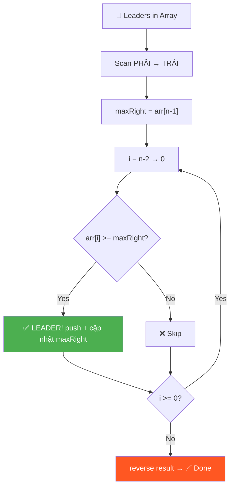
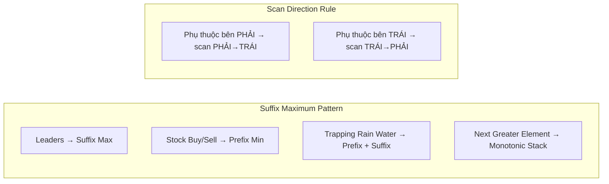

# 👑 Leaders in an Array — GfG (Easy)

> 📖 Code: [Leaders in an Array.js](./Leaders%20in%20an%20Array.js)





---

## R — Repeat & Clarify

🧠 *"Leader = lớn hơn hoặc bằng TẤT CẢ phần tử bên PHẢI. Scan từ phải → trái, track max!"*

> 🎙️ *"An element is a Leader if it is greater than or equal to ALL elements to its right. The rightmost element is always a leader since there's nothing to its right."*

### Clarification Questions

```
Q: "Greater than hoặc equal to"?
A: CẢ HAI! >= tất cả bên phải!
   arr = [5, 5, 5] → TẤT CẢ là leader (vì 5 >= 5)

Q: Phần tử cuối cùng luôn là leader?
A: Đúng! Không có phần tử nào bên phải → tự động leader!

Q: Trả về theo thứ tự nào?
A: Giữ thứ tự GỐC (trái → phải)

Q: Có phần tử trùng?
A: Có thể! Và = vẫn tính là leader

Q: Mảng rỗng hoặc 1 phần tử?
A: Rỗng → []. 1 phần tử → [chính nó] (luôn là leader)
```

### Tại sao bài này quan trọng?

```
  Bài này dạy PATTERN cực kỳ phổ biến:
  
  "So sánh 1 phần tử với TẤT CẢ phần tử bên phải"
  
  Brute force: O(n²) — duyệt từng phần tử bên phải
  Optimal:     O(n)  — CHỈ CẦN TRACK MAX!

  💡 KEY INSIGHT:
    KHÔNG CẦN biết TẤT CẢ phần tử bên phải!
    CHỈ CẦN biết phần tử LỚN NHẤT bên phải!
    → Nếu arr[i] >= max_right → arr[i] >= TẤT CẢ bên phải!

  Pattern này dùng lại trong:
    - Trapping Rain Water
    - Stock Buy/Sell
    - Next Greater Element
```

---

## 🧠 Bản chất bài toán — Hiểu để NHỚ, không chỉ để GIẢI

### 🚶 Bước 1: Đọc đề — Dịch sang ngôn ngữ "của mình"

```
  ĐỀ BÀI: "Tìm tất cả phần tử lớn hơn hoặc bằng TẤT CẢ phần tử
            bên phải nó"

  🧠 Tôi đọc xong, tôi DỊCH LẠI:
    → Mỗi phần tử, tôi cần NHÌN về bên PHẢI
    → Nếu KHÔNG AI bên phải lớn hơn nó → nó là leader

  Ví dụ cụ thể luôn: arr = [16, 17, 4, 3, 5, 2]
    16 nhìn phải: thấy 17 CAO HƠN → ❌ thua!
    17 nhìn phải: không ai CAO HƠN → ✅ LEADER!
     4 nhìn phải: thấy 5 CAO HƠN  → ❌ thua!
     5 nhìn phải: chỉ có 2         → ✅ LEADER!
     2 không có ai bên phải         → ✅ LEADER!

  💡 Tôi ghi nhận: Leader = "vua" của đoạn bên phải
     = KHÔNG CÓ AI lớn hơn ở phía bên phải nó
```

### 🚶 Bước 2: Brute Force trước — ĐỪNG CỐ SMART NGAY!

```
  🧠 Suy nghĩ tự nhiên nhất:
    "Muốn biết arr[i] có phải leader không?"
    → "Duyệt TẤT CẢ phần tử bên phải, check từng cái"
    → 2 vòng for lồng nhau → O(n²)

  Tôi VIẾT ra Brute Force trước, KHÔNG ngại:
    for i = 0 → n-1:
      for j = i+1 → n-1:
        if arr[j] > arr[i] → KHÔNG phải leader → break

  ⚠️ LƯU Ý: Bước này CỰC KỲ quan trọng!
     Nhiều người nhảy thẳng vào tối ưu → STUCK!
     LUÔN bắt đầu từ brute force → hiểu bài → rồi tối ưu!
```

### 🚶 Bước 3: Tìm điểm LÃNG PHÍ — Đâu là chỗ LÀM THỪA?

```
  🧠 Bây giờ tôi TỰ HỎI: "Brute force LÃNG PHÍ ở đâu?"

  Trace lại:
    Check arr[0]=16: duyệt [17, 4, 3, 5, 2] → tìm max = 17
    Check arr[1]=17: duyệt [4, 3, 5, 2]      → tìm max = 5
    Check arr[2]=4:  duyệt [3, 5, 2]          → tìm max = 5
    Check arr[3]=3:  duyệt [5, 2]             → tìm max = 5
    Check arr[4]=5:  duyệt [2]                → tìm max = 2

  🔴 PHÁT HIỆN: Tôi đang tìm MAX bên phải LẶP LẠI!
     Khi check arr[0], tôi duyệt [17, 4, 3, 5, 2] để tìm max
     Khi check arr[1], tôi lại duyệt [4, 3, 5, 2] để tìm max
     → HẦU NHƯ CÙNG MẢNG, chỉ bớt 1 phần tử!
     → LÃNG PHÍ!!!

  💡 Câu hỏi đặt ra:
     "Có cách nào BIẾT max bên phải MÀ KHÔNG duyệt lại?"
```

### 🚶 Bước 4: Key Insight — "Tôi cần gì THẬT SỰ?"

```
  🧠 Tôi tự hỏi: "Để biết arr[i] có phải leader không,
     tôi CẦN BIẾT GÌ?"

  ❌ Sai: "Tôi cần biết TẤT CẢ phần tử bên phải"
  ✅ Đúng: "Tôi CHỈ CẦN biết phần tử LỚN NHẤT bên phải!"

  Tại sao?
    Nếu arr[i] >= MAX bên phải
    → arr[i] >= TẤT CẢ bên phải (vì max >= mọi phần tử)
    → arr[i] là leader!

  💡 Ví dụ đời thực cho dễ nhớ:
    Q: "Bạn có cao hơn TẤT CẢ mọi người trong phòng không?"
    ❌ Cách ngu: đo chiều cao TỪNG NGƯỜI, so sánh TỪNG CÁI
    ✅ Cách thông minh: hỏi "Ai CAO NHẤT phòng?"
       → Nếu bạn >= người cao nhất → chắc chắn >= TẤT CẢ!

  → BẢN CHẤT: Thu gọn "so sánh với TẬP" → "so sánh với MAX"!
```

### 🚶 Bước 5: "OK biết cần max, nhưng LÀM SAO có max NHANH?"

```
  🧠 Đến đây tôi biết: cần MAX bên phải cho từng vị trí
     Nhưng tính max bên phải bằng cách nào?

  💭 Thử ý tưởng 1: Pre-compute mảng suffixMax
     suffixMax[i] = max(arr[i+1], arr[i+2], ..., arr[n-1])

     → 1 pass ngược tính suffixMax: O(n)
     → 1 pass xuôi check từng arr[i] >= suffixMax[i]: O(n)
     → Tổng: O(n)! ✅ Nhưng tốn O(n) space cho suffixMax

  💭 Thử ý tưởng 2: "Có cần cả mảng suffixMax không?"
     Khi tôi scan từ PHẢI → TRÁI:
       - Tại i=n-1: max bên phải = -∞ (không có) → leader
       - Tại i=n-2: max bên phải = arr[n-1]
       - Tại i=n-3: max bên phải = max(arr[n-2], old_max)

     🟢 EUREKA!!! Max bên phải chỉ cần CẬP NHẬT DẦN!
        Tôi chỉ cần 1 BIẾN maxRight, không cần cả mảng!
        → O(1) space!

  → Scan phải→trái + 1 biến maxRight = GIẢI PHÁP TỐI ƯU!
```

### 🚶 Bước 6: "Tại sao PHẢI scan PHẢI→TRÁI?"

```
  🧠 Câu hỏi hiển nhiên: "Tại sao không scan trái→phải?"

  Thử scan TRÁI → PHẢI:
    Tại arr[0]=16: cần max bên PHẢI = max(17,4,3,5,2) = 17
    → CHƯA BIẾT! Phải duyệt hết bên phải → O(n) → quay về brute force!

  Thử scan PHẢI → TRÁI:
    Tại arr[4]=5: cần max bên PHẢI = max(2) = 2 → ĐÃ BIẾT! (đi qua rồi)
    Tại arr[3]=3: cần max bên PHẢI = max(5,2) = 5 → ĐÃ BIẾT!
    → MỖI bước, max bên phải ĐÃ CÓ SẴN từ bước trước!

  📐 QUY TẮC TỔNG QUÁT (ghi nhớ cho MỌI bài):
    ┌────────────────────────────────────────────────┐
    │ Cần thông tin bên PHẢI → scan từ PHẢI → TRÁI  │
    │ Cần thông tin bên TRÁI → scan từ TRÁI → PHẢI  │
    │ Cần CẢ HAI             → 2 pass hoặc 2 ptrs   │
    └────────────────────────────────────────────────┘

  Áp dụng quy tắc này cho bài khác:
    Stock Buy/Sell: cần MIN bên trái (giá mua) → scan trái→phải
    Trapping Rain: cần max TRÁI + max PHẢI → 2 pass!
```

### 🚶 Bước 7: Ghép lại thành thuật toán hoàn chỉnh

```
  🧠 Bây giờ tôi có tất cả mảnh ghép:
    ✅ Chỉ cần so sánh với MAX bên phải (Bước 4)
    ✅ Scan phải→trái (Bước 6)
    ✅ Dùng 1 biến maxRight cập nhật dần (Bước 5)

  Thuật toán:
    1. maxRight = arr[n-1] (phần tử cuối luôn là leader)
    2. Từ i = n-2 → 0:
       - Nếu arr[i] >= maxRight → LEADER! Cập nhật maxRight
       - Nếu arr[i] < maxRight → bỏ qua
    3. Reverse result (vì thu thập ngược)

  ⚠️ Chi tiết nhỏ nhưng quan trọng:
    → Dấu >= chứ KHÔNG PHẢI > (equal cũng tính leader!)
    → Phải reverse cuối vì thu thập từ phải→trái
    → push + reverse() tốt hơn unshift() (unshift = O(k) mỗi lần)
```

### 📝 Tóm tắt luồng suy nghĩ

```
  ĐỌC ĐỀ
    ↓
  "Mỗi phần tử so sánh với TẤT CẢ bên phải"
    ↓
  Brute force: 2 vòng for → O(n²)
    ↓
  "Chỗ nào LÃNG PHÍ?" → Tính max bên phải LẶP LẠI!
    ↓
  "Thật ra chỉ cần MAX bên phải, không cần tất cả!"
    ↓
  "Tính max bên phải bằng cách nào nhanh?"
    ↓
  Scan phải→trái, CẬP NHẬT maxRight dần dần → O(n)!
    ↓
  ✅ DONE!

  🔑 Bí quyết: ĐỪNG CỐ NGHĨ RA NGAY!
     Brute force → Tìm lãng phí → Hỏi "cần gì thật sự?"
     → Tự nhiên sẽ ra solution!
```

---

## E — Examples

```
VÍ DỤ 1: arr = [16, 17, 4, 3, 5, 2]

  Kiểm tra TỪNG PHẦN TỬ:

  Index:  0    1    2    3    4    5
  Value: 16   17    4    3    5    2

  16: bên phải = [17, 4, 3, 5, 2]
      max bên phải = 17
      16 >= 17? → ❌ KHÔNG phải leader (17 lớn hơn!)

  17: bên phải = [4, 3, 5, 2]
      max bên phải = 5
      17 >= 5? → ✅ LEADER! (17 lớn hơn tất cả bên phải)

   4: bên phải = [3, 5, 2]
      max bên phải = 5
      4 >= 5? → ❌ KHÔNG (5 lớn hơn!)

   3: bên phải = [5, 2]
      max bên phải = 5
      3 >= 5? → ❌ KHÔNG (5 lớn hơn!)

   5: bên phải = [2]
      max bên phải = 2
      5 >= 2? → ✅ LEADER!

   2: bên phải = [] (không có)
      → ✅ LEADER! (luôn luôn)

  Output: [17, 5, 2]
```

### Minh họa trực quan

```
  arr = [16, 17, 4, 3, 5, 2]

  Nhìn từ PHẢI sang TRÁI:
                                    2  → LEADER (cuối cùng, luôn luôn)
                               5 > 2  → LEADER (5 > tất cả bên phải)
                          3 < 5        → ❌ (5 bên phải lớn hơn)
                     4 < 5             → ❌ (5 bên phải lớn hơn)
               17 > 5                  → LEADER (17 > tất cả bên phải)
          16 < 17                      → ❌ (17 bên phải lớn hơn)

  Leaders:     17         5    2
  Position:    ↑          ↑    ↑
              [16, 17, 4, 3, 5, 2]
```

### Edge Cases — PHẢI nhớ!

```
VÍ DỤ 2: Sorted tăng dần
  [1, 2, 3, 4, 5] → [5]
  → Chỉ phần tử CUỐI là leader!
  → Mọi phần tử khác đều có phần tử lớn hơn bên phải

VÍ DỤ 3: Sorted giảm dần
  [5, 4, 3, 2, 1] → [5, 4, 3, 2, 1]
  → TẤT CẢ là leader!
  → Mỗi phần tử >= tất cả bên phải (vì giảm dần)

VÍ DỤ 4: Tất cả bằng nhau
  [5, 5, 5] → [5, 5, 5]
  → TẤT CẢ là leader! (vì >= bao gồm =)

VÍ DỤ 5: 1 phần tử
  [7] → [7]
  → Luôn là leader (không có bên phải)

  📐 Số leaders:
    Best case:  1 (sorted tăng dần)
    Worst case: n (sorted giảm dần hoặc tất cả bằng nhau)
```

---

## A — Approach

### Approach 1: Brute Force — O(n²)

```
  Ý tưởng: Với mỗi phần tử, so sánh với TẤT CẢ bên phải

  for i = 0 → n-1:                     ← xét từng phần tử
    for j = i+1 → n-1:                 ← so sánh với tất cả bên phải
      if arr[j] > arr[i] → KHÔNG leader → break
    Nếu không break → leader!

  Tại sao O(n²)?
    Worst case: sorted giảm [5,4,3,2,1]
    → Mỗi phần tử phải duyệt TẤT CẢ bên phải mới biết là leader
    → n + (n-1) + (n-2) + ... + 1 = n(n+1)/2 ≈ O(n²)

  ⚠️ Nhược điểm: Lặp lại CÔNG VIỆC!
    Khi check arr[0], ta đã biết max bên phải
    Khi check arr[1], ta lại tính lại max bên phải TỪ ĐẦU!
    → LÃNG PHÍ!
```

### Approach 2: Suffix Maximum — O(n) ✅

```
💡 KEY INSIGHT: Scan từ PHẢI → TRÁI, track max hiện tại!

  Tại sao scan từ PHẢI?
    Vì leader phụ thuộc vào phần tử BÊN PHẢI!
    → Scan từ phải = đã biết max bên phải khi check từng phần tử!

  maxRight = giá trị LỚN NHẤT đã thấy (từ phải sang)

  Nếu arr[i] >= maxRight:
    → arr[i] >= TẤT CẢ bên phải (vì maxRight = max của chúng!)
    → arr[i] là LEADER!
    → Cập nhật maxRight = arr[i] (max mới!)

  Nếu arr[i] < maxRight:
    → Có ít nhất 1 phần tử bên phải lớn hơn arr[i]
    → KHÔNG phải leader!

  ⚠️ Vì scan từ phải → trái, result thu được sẽ NGƯỢC!
     → Cần reverse() cuối để giữ thứ tự gốc!

  CHỨNG MINH tính đúng:
    maxRight tại vị trí i = max(arr[i+1], arr[i+2], ..., arr[n-1])
    Nếu arr[i] >= maxRight → arr[i] >= max(tất cả bên phải)
    → arr[i] >= MỌI phần tử bên phải (vì max >= mọi phần tử)
    → arr[i] là leader ✅
```

---

## C — Code

### Solution 1: Brute Force — O(n²)

```javascript
function leadersBrute(arr) {
  const result = [];
  const n = arr.length;

  for (let i = 0; i < n; i++) {
    let isLeader = true;

    // So sánh với TẤT CẢ phần tử bên phải
    for (let j = i + 1; j < n; j++) {
      if (arr[j] > arr[i]) {
        isLeader = false;
        break; // Có phần tử lớn hơn → KHÔNG phải leader
      }
    }

    if (isLeader) result.push(arr[i]);
  }
  return result;
}
```

### Giải thích Brute Force

```
  for (let i = 0; i < n; i++)
    → Xét TỪNG phần tử arr[i]

  let isLeader = true
    → GIẢ SỬ arr[i] là leader, rồi TÌM PHẢN CHỨNG

  for (let j = i + 1; j < n; j++)
    → j = i+1: bắt đầu từ phần tử NGAY SAU i
    → j < n: duyệt đến cuối mảng

  if (arr[j] > arr[i])
    → Tìm thấy phần tử LỚN HƠN bên phải!
    → PHẢN CHỨNG! arr[i] KHÔNG phải leader!
    → ⚠️ Chú ý: > chứ không phải >=
      (vì leader cần >= tất cả, nên chỉ > mới loại)

  break
    → Tìm được 1 phần tử lớn hơn ĐỦ KẾT LUẬN!
    → Không cần check tiếp → THOÁT vòng for j

  if (isLeader) result.push(arr[i])
    → Nếu không bị break (không ai lớn hơn) → LÀ leader!
```

### Solution 2: Suffix Maximum — O(n) ✅

```javascript
function leaders(arr) {
  const result = [];
  const n = arr.length;

  // Bắt đầu từ phần tử cuối = luôn là leader
  let maxRight = arr[n - 1];
  result.push(maxRight);

  // Scan từ PHẢI → TRÁI
  for (let i = n - 2; i >= 0; i--) {
    if (arr[i] >= maxRight) {
      maxRight = arr[i];      // Cập nhật max mới!
      result.push(maxRight);
    }
  }

  // Đảo ngược để giữ thứ tự gốc
  result.reverse();
  return result;
}
```

### Giải thích từng dòng

```
  let maxRight = arr[n - 1]
    → Khởi tạo max = phần tử CUỐI
    → Phần tử cuối LUÔN là leader!
    → ⚠️ n-1 vì 0-indexed!

  result.push(maxRight)
    → Thêm phần tử cuối vào result TRƯỚC!

  for (let i = n - 2; i >= 0; i--)
    → i bắt đầu từ n-2 (phần tử ÁP CUỐI)
    → ⚠️ Tại sao n-2? Vì phần tử cuối (n-1) đã xử lý rồi!
    → i >= 0: duyệt đến đầu mảng
    → i--: đi từ PHẢI → TRÁI

  if (arr[i] >= maxRight)
    → ⚠️ Dấu >= (KHÔNG PHẢI >)
    → Vì leader = "greater than OR EQUAL TO"
    → Nếu dùng > thì bỏ sót trường hợp bằng!

  maxRight = arr[i]
    → Cập nhật max MỚI!
    → Vì arr[i] >= maxRight → arr[i] là max mới
    → Từ i trở về trái, maxRight = arr[i]

  result.reverse()
    → Vì ta thêm từ PHẢI → TRÁI (ngược)
    → Cần đảo để giữ thứ tự GỐC (trái → phải)
```

### Trace CHI TIẾT: [16, 17, 4, 3, 5, 2]

```
  n = 6, maxRight = arr[5] = 2, result = [2]

  ┌─ i=4 ─────────────────────────────────────────┐
  │  arr[4] = 5                                     │
  │  5 >= maxRight(2)? → YES ✅                     │
  │  maxRight = 5 (cập nhật!)                       │
  │  result.push(5) → result = [2, 5]              │
  │                                                 │
  │  [16, 17, 4, 3, [5], 2]                        │
  │                   ↑ LEADER! (5 > 2)            │
  └─────────────────────────────────────────────────┘

  ┌─ i=3 ─────────────────────────────────────────┐
  │  arr[3] = 3                                     │
  │  3 >= maxRight(5)? → NO ❌                      │
  │  skip! (5 bên phải lớn hơn 3)                  │
  │                                                 │
  │  [16, 17, 4, [3], 5, 2]                        │
  │               ↑ NOT leader (3 < 5)             │
  └─────────────────────────────────────────────────┘

  ┌─ i=2 ─────────────────────────────────────────┐
  │  arr[2] = 4                                     │
  │  4 >= maxRight(5)? → NO ❌                      │
  │  skip! (5 bên phải lớn hơn 4)                  │
  └─────────────────────────────────────────────────┘

  ┌─ i=1 ─────────────────────────────────────────┐
  │  arr[1] = 17                                    │
  │  17 >= maxRight(5)? → YES ✅                    │
  │  maxRight = 17 (cập nhật!)                      │
  │  result.push(17) → result = [2, 5, 17]         │
  │                                                 │
  │  [16, [17], 4, 3, 5, 2]                        │
  │        ↑ LEADER! (17 > everything right)        │
  └─────────────────────────────────────────────────┘

  ┌─ i=0 ─────────────────────────────────────────┐
  │  arr[0] = 16                                    │
  │  16 >= maxRight(17)? → NO ❌                    │
  │  skip! (17 bên phải lớn hơn 16)                │
  └─────────────────────────────────────────────────┘

  result = [2, 5, 17]
  result.reverse() → [17, 5, 2] ✅

  Tổng: chỉ 5 comparison + 1 reverse = O(n)!
```

### Trace Edge Case: [5, 4, 3, 2, 1] (giảm dần)

```
  maxRight = 1, result = [1]

  i=3: 2 >= 1 → ✅ maxRight=2, result=[1, 2]
  i=2: 3 >= 2 → ✅ maxRight=3, result=[1, 2, 3]
  i=1: 4 >= 3 → ✅ maxRight=4, result=[1, 2, 3, 4]
  i=0: 5 >= 4 → ✅ maxRight=5, result=[1, 2, 3, 4, 5]

  reverse → [5, 4, 3, 2, 1]

  TẤT CẢ là leader! Vì giảm dần → mỗi phần tử >= mọi phần tử sau ✅
```

> 🎙️ *"I scan right to left, maintaining the running maximum. Any element >= current max is a leader. I collect results in reverse, then flip at the end. O(n) time, O(1) space not counting output."*

---

## O — Optimize

```
                  Time      Space     Number of passes
  ─────────────────────────────────────────────────────
  Brute Force     O(n²)     O(1)*     Check mỗi phần tử vs tất cả bên phải
  Suffix Max      O(n)      O(1)*     1 pass phải→trái + 1 reverse ✅

  * không tính output array

  Tại sao Suffix Max nhanh hơn?
    Brute force: mỗi phần tử duyệt TẤT CẢ bên phải → lặp lại!
    Suffix max:  TRACK max → check 1 LẦN là đủ!

  📊 Cải thiện:
    n=10:    Brute=55 ops      Suffix=10 ops     → 5.5x nhanh hơn
    n=100:   Brute=5,050 ops   Suffix=100 ops    → 50x nhanh hơn
    n=10000: Brute=50M ops     Suffix=10K ops    → 5000x nhanh hơn!

  ⚠️ Tại sao reverse() không ảnh hưởng complexity?
    reverse() = O(k) với k = số leaders
    k <= n → tổng vẫn O(n) + O(k) = O(n)!

  ⚠️ Có thể KHÔNG reverse?
    CÓ! Dùng unshift() thay push():
      result.unshift(arr[i])  ← thêm vào ĐẦU
    Nhưng unshift() = O(k) mỗi lần → tổng O(k²) → CHẬM HƠN!
    → push + reverse cuối tốt hơn!
```

---

## T — Test

```
Test Cases:
  [16, 17, 4, 3, 5, 2]  → [17, 5, 2]           ✅ Normal
  [1, 2, 3, 4, 5, 2]    → [5, 2]                ✅ Tăng dần + cuối nhỏ
  [5, 4, 3, 2, 1]       → [5, 4, 3, 2, 1]       ✅ Giảm dần = tất cả leader
  [1, 2, 3, 4, 5]       → [5]                    ✅ Tăng dần = chỉ cuối
  [7]                    → [7]                    ✅ 1 phần tử
  [5, 5, 5]             → [5, 5, 5]              ✅ Tất cả bằng nhau (>=)
  [1]                    → [1]                    ✅ Single element

  ⚠️ Common mistakes:
  1. Quên phần tử cuối luôn là leader
  2. Dùng > thay vì >= → bỏ sót trường hợp bằng
  3. Quên reverse() cuối → output ngược thứ tự!
  4. Bắt đầu loop từ n-1 thay vì n-2 (xử lý cuối 2 lần)
```

---

## 🗣️ Interview Script

### 🎙️ Think Out Loud — Mô phỏng phỏng vấn thực

> ⚠️ Script này dạy cách **NÓI**, không phải cách CODE.
> Mỗi đoạn = cách bạn **PHÁT BIỂU** trong phỏng vấn thực!

```
  ╔══════════════════════════════════════════════════════════════╗
  ║  🕐 FULL INTERVIEW SIMULATION — 1h30 (90 phút)             ║
  ║                                                              ║
  ║  00:00-05:00  Introduction + Icebreaker         (5 min)     ║
  ║  05:00-45:00  Problem Solving                   (40 min)    ║
  ║  45:00-60:00  Deep Technical Probing            (15 min)    ║
  ║  60:00-75:00  Variations + Extensions           (15 min)    ║
  ║  75:00-85:00  System Design at Scale            (10 min)    ║
  ║  85:00-90:00  Behavioral + Q&A                  (5 min)     ║
  ╚══════════════════════════════════════════════════════════════╝
```

```
  ╔══════════════════════════════════════════════════════════════╗
  ║  PART 1: INTRODUCTION (00:00 — 05:00)                       ║
  ╚══════════════════════════════════════════════════════════════╝

  👤 "Tell me about yourself and a time you noticed
      redundant computation and optimized it."

  🧑 "I'm a frontend engineer with [X] years of experience.
      A relevant example: I was building a leaderboard system
      for a live gaming dashboard. Each player needed to know
      if they were 'dominating' — meaning no player to
      their right in the ranking had a higher score.

      My first implementation checked each player against
      every player ranked below them — two nested loops,
      O of n squared. With 10,000 players and real-time
      updates, it was way too slow.

      Then I realized: I don't need to compare against
      EVERY player below. I only need the MAXIMUM score
      below. If a player's score is at least the max below,
      they're dominating.

      By scanning from the bottom of the ranking upward
      and tracking a running maximum, I reduced the check
      to a single pass — O of n. The dashboard went from
      laggy to instant.

      That's exactly the 'suffix maximum' pattern — and
      it's the core of this problem."

  👤 "Great. Let's see how you formalize that."
```

```
  ╔══════════════════════════════════════════════════════════════╗
  ║  PART 2: PROBLEM SOLVING (05:00 — 45:00)                   ║
  ╚══════════════════════════════════════════════════════════════╝

  ──────────────── 05:00 — Clarify (4 phút) ────────────────

  👤 "Given an array, find all leaders. An element is a leader
      if it is greater than or equal to all elements
      to its right."

  🧑 "Let me make sure I understand precisely.

      A leader must be greater than or EQUAL TO every element
      to its right. Not strictly greater — equality counts.
      This means if I have [5, 5, 5], all three are leaders
      because each 5 is at least as large as every 5 to its right.

      The rightmost element has nothing to its right —
      by convention, it's always a leader.
      This is like the vacuous truth: the condition
      'greater than or equal to all elements to the right'
      is trivially satisfied when there are no elements.

      The output should preserve the original left-to-right order.

      Edge cases I'm noting:
      Empty array returns an empty result.
      Single element returns that element — always a leader.
      Sorted ascending like [1, 2, 3, 4, 5] — only the last
      element is a leader; every other has a larger neighbor.
      Sorted descending like [5, 4, 3, 2, 1] — every element
      is a leader because each is at least as large as all
      elements to its right."

  ──────────────── 09:00 — Brute Force (3 phút) ────────────────

  🧑 "The brute force is straightforward.

      For each element at index i, I scan every element
      to its right — indices i plus 1 through n minus 1.
      If I find ANY element strictly greater than arr at i,
      then arr at i is NOT a leader. If nobody is greater,
      arr at i IS a leader.

      Two nested loops. The outer iterates each candidate.
      The inner scans the right portion.

      Time: O of n squared. For each of n elements,
      I might scan up to n minus 1 elements to the right.
      Worst case — sorted descending — every element is
      a leader, and I must scan the full right portion
      for each one.

      Space: O of 1 extra, not counting the output.

      This works, but I'm doing redundant work. When I check
      arr at 0, I scan the entire right side to find the max.
      When I check arr at 1, I scan ALMOST the same right side.
      I'm recomputing the suffix maximum from scratch
      at every position."

  ──────────────── 12:00 — Key Insight bằng LỜI (5 phút) ────────────────

  🧑 "Here's the key insight.

      To determine if arr at i is a leader, I don't need
      to know EVERY element to the right. I only need to know
      the MAXIMUM element to the right.

      Because if arr at i is at least the maximum,
      then arr at i is at least every individual element
      to the right. The max dominates everything.

      Think of it like this: if I want to know if I'm
      the tallest person in a room, I don't need to measure
      everyone. I just need to know the height of the
      tallest person. If I'm at least that tall, I'm done.

      So the question becomes: how do I efficiently know
      the maximum to the right of each position?

      If I scan the array from LEFT to RIGHT, at position i
      I don't yet know what's to the right. I'd have to
      look ahead — which is the brute force scan.

      But if I scan from RIGHT to LEFT, every element I've
      already visited IS the right portion! I can maintain
      a RUNNING MAXIMUM as I go.

      This is the SCAN DIRECTION RULE:
      when you need information about the RIGHT side,
      scan from RIGHT to LEFT.
      When you need information about the LEFT side,
      scan from LEFT to RIGHT."

  ──────────────── 17:00 — Algorithm Design (4 phút) ────────────────

  🧑 "Here's my approach.

      I initialize maxRight to the last element — it's always
      a leader since there's nothing to its right.

      Then I iterate from index n minus 2 down to 0.
      At each index i:

      If arr at i is at least maxRight — arr at i is a leader.
      I update maxRight to arr at i, because this is now
      the largest value I've seen in the suffix.

      If arr at i is less than maxRight — not a leader. Skip.

      Since I'm collecting leaders from right to left,
      the result is in reverse order. A final reverse
      gives the correct left-to-right output.

      Time: O of n — one pass through the array plus
      O of k for the reverse, where k is the number of leaders.
      Since k is at most n, the total is O of n.

      Space: O of 1 extra — just the maxRight variable.
      The result array doesn't count as extra space since
      it's the required output."

  ──────────────── 21:00 — Trace bằng LỜI (5 phút) ────────────────

  🧑 "Let me trace with arr equal [16, 17, 4, 3, 5, 2].
      n equal 6.

      Initialize: maxRight equal arr at 5 equal 2.
      result equal [2]. The last element is always a leader.

      i equal 4: arr at 4 equal 5.
      5 is at least maxRight of 2? Yes.
      5 is a leader! Update maxRight to 5.
      result: [2, 5].

      i equal 3: arr at 3 equal 3.
      3 is at least maxRight of 5? No. 3 is less than 5.
      Not a leader. Skip.

      i equal 2: arr at 2 equal 4.
      4 is at least maxRight of 5? No. Skip.

      i equal 1: arr at 1 equal 17.
      17 is at least maxRight of 5? Yes.
      17 is a leader! Update maxRight to 17.
      result: [2, 5, 17].

      i equal 0: arr at 0 equal 16.
      16 is at least maxRight of 17? No. Skip.

      Reverse result: [17, 5, 2].

      Matches expected output! Three leaders total."

  🧑 "Now a quick edge case: [5, 4, 3, 2, 1].
      Sorted descending.

      maxRight starts at 1. Every element going left
      is larger than the current maxRight, so every element
      is a leader. maxRight updates at every step:
      1, 2, 3, 4, 5.

      result: [1, 2, 3, 4, 5]. Reverse: [5, 4, 3, 2, 1].
      All elements are leaders. Correct!

      And [1, 2, 3, 4, 5] — sorted ascending.
      maxRight starts at 5. Every element going left
      is less than 5. None qualify as leaders except the last.
      result: [5]. Already in correct order after reverse."

  ──────────────── 26:00 — Viết code, NÓI từng block (4 phút) ────────────

  🧑 "Let me code this up.

      [Vừa viết vừa nói:]

      I declare the result array and get n.

      Initialize maxRight to arr at n minus 1 — the last element.
      Push it to result — it's always a leader.

      Loop from i equal n minus 2 down to 0.
      n minus 2, not n minus 1 — because the last element
      is already handled.

      Inside: if arr at i is at least maxRight —
      the comparison is GREATER THAN OR EQUAL, not just
      greater than. This is a detail that matters for
      cases like [5, 5, 5].

      If yes: update maxRight to arr at i, push to result.

      After the loop: result dot reverse to flip the order.

      Return result.

      Five lines of core logic. The invariant is:
      at position i, maxRight holds the maximum of all elements
      from index i plus 1 through n minus 1."

  ──────────────── 30:00 — >= vs > detail (3 phút) ────────────────

  👤 "What happens if you use strictly greater than
      instead of greater than or equal?"

  🧑 "It changes the semantics!

      With strictly greater than: arr equal [5, 5, 5].
      At i equal 1: 5 is greater than maxRight of 5? No.
      Not a leader. Only the last 5 qualifies.
      Output: [5] — just one leader.

      With greater than or equal: same array.
      At i equal 1: 5 is at least maxRight of 5? Yes.
      All three are leaders. Output: [5, 5, 5].

      The problem statement says 'greater than or equal to.'
      Using strict inequality is the single most common bug
      in this problem. It's a one-character difference with
      completely different behavior on arrays with duplicates.

      In the interview, I'd explicitly state the comparator
      when writing code: 'I'm using >= because the problem
      includes equality.'"

  ──────────────── 33:00 — push+reverse vs unshift (3 phút) ────────

  👤 "Why push plus reverse instead of unshift?"

  🧑 "Performance!

      unshift inserts at the BEGINNING of an array.
      In most JavaScript engines, this requires shifting
      all existing elements one position to the right.
      That's O of k per call, where k is the current length.

      If I call unshift k times total, the cost is
      1 plus 2 plus 3 plus dot dot dot plus k
      equal k times k plus 1 over 2 — O of k squared.

      push appends at the END. This is amortized O of 1
      because arrays are backed by dynamic buffers.
      k pushes cost O of k total.

      Then one reverse at the end costs O of k.
      Total: O of k plus O of k equal O of k.

      For k equal n — worst case, sorted descending —
      push plus reverse is O of n,
      unshift is O of n squared.
      Significant difference!

      In interviews, mentioning this shows I understand
      the implementation details of array operations,
      not just their logical effect."

  ──────────────── 36:00 — Loop invariant (3 phút) ────────────────

  👤 "What's the loop invariant?"

  🧑 "At the start of iteration i:

      maxRight equals the maximum of arr at i plus 1
      through arr at n minus 1 — the suffix maximum
      of everything to the right of position i.

      Proof by induction:

      Base case: i equal n minus 2. maxRight was initialized
      to arr at n minus 1. The suffix to the right of n minus 2
      is just arr at n minus 1. Correct.

      Inductive step: suppose the invariant holds at position
      i plus 1. When I move to position i:
      if arr at i plus 1 was at least maxRight, I updated
      maxRight to arr at i plus 1. Now maxRight is the max
      of the old maxRight and arr at i plus 1 — which is
      the max of the suffix starting at i plus 1.
      If arr at i plus 1 was less, maxRight didn't change.
      Either way, maxRight is the suffix max from i plus 1 onward.

      This invariant guarantees correctness: comparing
      arr at i to maxRight is equivalent to comparing
      arr at i to every element to its right."

  ──────────────── 39:00 — Edge Cases (3 phút) ────────────────

  🧑 "Let me enumerate the edge cases.

      Empty array: no elements, return empty result.
      The code handles this — maxRight assignment would access
      arr at minus 1 which is undefined. I should guard against
      this with an early return if n is 0.

      Single element: [7]. maxRight equal 7. result equal [7].
      No loop iterations. Correct.

      All equal: [3, 3, 3, 3]. Every element is at least the max
      to its right. All are leaders. Output: [3, 3, 3, 3].

      Two elements: [1, 2]. maxRight equal 2. i equal 0:
      1 is at least 2? No. Output: [2]. Only the last.

      [2, 1]. maxRight equal 1. i equal 0: 2 is at least 1?
      Yes. Output: [2, 1]. Both are leaders."

  ──────────────── 42:00 — Complexity (3 phút) ────────────────

  🧑 "Time: O of n. One pass through the array,
      plus O of k for the reverse where k is the number
      of leaders. Since k is at most n, the total is O of n.

      Space: O of 1 extra — just the maxRight variable.
      The result array is O of k, but that's the output
      itself, not extra space.

      Compared to brute force O of n squared:
      for n equal 10,000, brute force does about 50 million
      comparisons. Suffix max does exactly 10,000.
      That's a 5000x improvement.

      Can I do better than O of n? No — I must examine
      every element at least once to determine if it's
      a leader. Linear time is optimal for this problem."
```

```
  ╔══════════════════════════════════════════════════════════════╗
  ║  PART 3: DEEP TECHNICAL PROBING (45:00 — 60:00)            ║
  ╚══════════════════════════════════════════════════════════════╝

  ──────────────── 45:00 — Suffix max array (4 phút) ────────────────

  👤 "What if you needed the suffix max for OTHER purposes,
      not just leaders?"

  🧑 "Then I'd pre-compute a full suffixMax array.

      suffixMax of i equals the maximum of arr at i through
      arr at n minus 1. Computed in one right-to-left pass:

      suffixMax at n minus 1 equals arr at n minus 1.
      For i from n minus 2 down to 0:
      suffixMax at i equals max of arr at i and suffixMax at i plus 1.

      This gives O of 1 lookups for the suffix max at any position.
      Time: O of n to build. Space: O of n.

      For Leaders specifically, I don't need the full array
      because I consume the suffix max in the same right-to-left
      order that I compute it. A single variable suffices.

      But Trapping Rain Water needs BOTH prefix max and suffix max
      at arbitrary positions, so the full arrays are necessary.
      That's the two-pass approach for that problem."

  ──────────────── 49:00 — Connection to Next Greater Element (4 phút) ──

  👤 "How does this relate to Next Greater Element?"

  🧑 "They're complementary perspectives on the same data.

      Leaders: elements with NO greater element to the right.
      Next Greater Element: for each element, find the FIRST
      greater element to the right.

      A leader is precisely an element whose Next Greater Element
      doesn't exist — it would be 'minus 1' or 'undefined.'

      But the solving techniques differ.
      Leaders can use a simple suffix max scan — O of n,
      because I only need a binary YES or NO per element.

      Next Greater Element needs a Monotonic Stack — O of n,
      because I need the specific IDENTITY of the first greater
      element, which requires tracking the unresolved elements
      in a stack as I scan right to left.

      The monotonic stack is strictly more powerful.
      If I solve NGE, I get Leaders for free — leaders are
      elements where the NGE answer is 'none.' But the simpler
      suffix max approach is preferred for Leaders because
      the stack overhead is unnecessary."

  ──────────────── 53:00 — Scan direction generalization (4 phút) ────

  👤 "You mentioned a 'scan direction rule.' Elaborate."

  🧑 "It's a fundamental principle I use for array problems.

      The rule: scan in the OPPOSITE direction of the dependency.

      If each element depends on information to its RIGHT,
      scan from RIGHT to LEFT. This way, by the time I reach
      position i, I've already processed everything to its right.

      If each element depends on information to its LEFT,
      scan from LEFT to RIGHT. Same logic.

      If an element depends on BOTH sides — like Trapping Rain Water
      where the water level depends on the max to the left AND
      the max to the right — I need TWO passes, one in each direction.
      Or I can use the two-pointer technique to collapse both
      into a single pass.

      Examples:
      Leaders in Array: depends on right → scan right to left.
      Stock Buy Sell: profit depends on a cheap price to the LEFT →
      scan left to right, tracking the prefix minimum.
      Product Except Self: depends on both prefix and suffix products →
      two passes, one left to right and one right to left.
      Trapping Rain Water: depends on prefix max and suffix max →
      two passes or two pointers.

      This rule gives me the scan direction BEFORE I even think
      about the specific algorithm. It constrains the solution space
      immediately."

  ──────────────── 57:00 — Count of leaders (3 phút) ────────────────

  👤 "What can you say about the NUMBER of leaders?"

  🧑 "Interesting question!

      The leaders form a DECREASING subsequence when read
      from right to left. Because each leader becomes the new
      maxRight, and subsequent leaders must be at least as large.

      So the number of leaders equals the length of the longest
      non-increasing suffix subsequence.

      Minimum: 1 — sorted ascending, only the last element.
      Maximum: n — sorted descending or all equal.

      Expected value for a random permutation of n elements:
      it's related to the number of records in the suffix.
      On average, it's approximately the n-th harmonic number —
      about ln of n. So for a random 1000-element array,
      I'd expect about 7 leaders.

      This means the output size k is typically O of log n
      for random inputs, making the reverse step essentially free."
```

```
  ╔══════════════════════════════════════════════════════════════╗
  ║  PART 4: VARIATIONS (60:00 — 75:00)                         ║
  ╚══════════════════════════════════════════════════════════════╝

  ──────────────── 60:00 — Leaders from the LEFT (3 phút) ────────────────

  👤 "What if leaders are defined by the LEFT side instead?"

  🧑 "Mirror the approach!

      A left-leader is an element greater than or equal to
      ALL elements to its LEFT. The leftmost element is always
      a left-leader.

      I scan LEFT to RIGHT, maintaining a running maximum
      from the left — call it maxLeft.

      If arr at i is at least maxLeft, it's a left-leader.
      Update maxLeft.

      No reverse needed because I'm already collecting
      in left-to-right order.

      Same complexity: O of n time, O of 1 extra space.

      Interesting observation: the left-leaders of a sorted
      ascending array are ALL elements. The left-leaders
      of a sorted descending array are only the first element.
      Exactly the opposite of right-leaders."

  ──────────────── 63:00 — Strict vs non-strict (3 phút) ────────────────

  👤 "What if the definition changes to STRICTLY greater?"

  🧑 "Change the comparator from >= to >.

      For [5, 5, 3, 5, 2]:
      With >=: elements 5 at index 0, 5 at index 3, and 2 are leaders.
      Wait — let me reconsider. index 0: 5, right side has [5,3,5,2].
      max right is 5. 5 >= 5? Yes with >=.
      index 3: 5, right side is [2]. 5 >= 2? Yes.
      With >: index 0: 5 > 5? No. Not a strict leader.
      index 3: 5 > 2? Yes. Strict leader.

      The algorithm is identical except the comparison operator.
      But I need to be careful about what maxRight tracks.
      With strict inequality, I still track the running max
      and compare with >, not >=.

      In interviews, I ALWAYS confirm which definition
      the interviewer means before coding."

  ──────────────── 66:00 — Return indices not values (3 phút) ────────

  👤 "What if you need INDICES instead of values?"

  🧑 "Trivial modification.

      Instead of pushing arr at i into the result,
      I push the index i itself.

      The rest of the algorithm is identical — the comparison
      is still arr at i versus maxRight.

      After reversing, I get indices in left-to-right order.

      This is useful when I need to do further processing
      on the leader positions — like finding the gaps between
      consecutive leaders or checking related data at those
      indices."

  ──────────────── 69:00 — Online / streaming variant (3 phút) ────────

  👤 "What if elements arrive as a stream?"

  🧑 "Tricky! The definition depends on elements to the RIGHT,
      but in a stream, 'right' means 'future' — which I don't know yet.

      Approach 1: process in batches. Accumulate n elements,
      then run the suffix max algorithm. O of n per batch.

      Approach 2: maintain a monotonic stack of CANDIDATES.
      When a new element arrives, pop everything from the stack
      that's SMALLER — those are no longer leaders.
      The remaining stack elements are potential leaders.
      Only when the stream closes can I finalize the answer.

      This is essentially the online version of finding leaders,
      and it connects directly to the Next Greater Element
      algorithm which uses a monotonic stack."

  ──────────────── 72:00 — Multi-dimensional leaders (3 phút) ────────

  👤 "What about leaders in 2D — like a matrix?"

  🧑 "Define a leader in a matrix as an element that's
      at least as large as ALL elements below and to the right.

      For an m by n matrix, I'd compute a 2D suffix max.
      Starting from the bottom-right corner and working
      toward the top-left, I maintain:

      suffixMax at i comma j equals the max of
      the element itself, suffixMax at i plus 1 comma j,
      and suffixMax at i comma j plus 1,
      minus the overlap at i plus 1 comma j plus 1
      (inclusion-exclusion).

      Actually, it's simpler: suffixMax at i comma j equals
      max of the element, suffixMax at i plus 1 comma j,
      suffixMax at i comma j plus 1.

      Time: O of m times n. Space: O of m times n for the suffix max,
      reducible to O of n with careful row-by-row processing."
```

```
  ╔══════════════════════════════════════════════════════════════╗
  ║  PART 5: SYSTEM DESIGN AT SCALE (75:00 — 85:00)            ║
  ╚══════════════════════════════════════════════════════════════╝

  ──────────────── 75:00 — Monitoring / alerting (5 phút) ────────────────

  👤 "Where does the 'leaders' concept appear in system design?"

  🧑 "Several places!

      First — PEAK DETECTION in time-series monitoring.
      A leader in a time series is a point that's never
      exceeded afterward — a 'high water mark.'
      In server monitoring, I want to know: 'when was the last
      time CPU usage reached a level that was never surpassed
      afterward?' Those are the suffix max breakpoints.

      Second — STOCK ANALYSIS.
      The leaders of a price array are the 'all-time highs'
      when reading from right to left. In reverse, they form
      the sequence of price levels that were never exceeded
      in the remaining trading period. This is used in
      'trailing stop' order logic.

      Third — LEADERBOARD SYSTEMS.
      In competitive gaming, a 'true leader' is someone whose
      rank is never surpassed by any player below them.
      Computing this in real-time uses the suffix max pattern.

      Fourth — LOG LEVEL FILTERING.
      In a log stream with severity levels, I might want
      to find all log entries whose severity was never exceeded
      by any subsequent entry — these mark 'peak severity'
      moments. The suffix max pattern identifies them."

  ──────────────── 80:00 — Distributed suffix max (5 phút) ────────────

  👤 "How would you compute leaders across distributed data?"

  🧑 "If the array is split across k partitions:

      Phase 1: Each partition computes its LOCAL suffix max
      independently. This gives k local results.

      Phase 2: I need to propagate global suffix information.
      The RIGHTMOST partition's suffix max is already global.
      For partition k minus 1, I combine its local suffix max
      with the global suffix max from partition k.
      Working right to left across partitions.

      Phase 3: Using the corrected suffix max, each partition
      re-evaluates its leaders against the GLOBAL suffix max.
      Some local leaders might no longer qualify because
      a later partition has a larger element.

      Communication cost: O of k messages, each carrying
      one number — the suffix max of the partition to the right.

      This is the distributed version of the scan direction rule:
      global information flows from right to left across
      partitions, just as it does across positions within
      a single array.

      The MapReduce equivalent: the Map phase computes
      local suffix maxes. A sequential Reduce phase propagates
      the global suffix max from right to left."
```

```
  ╔══════════════════════════════════════════════════════════════╗
  ║  PART 6: BEHAVIORAL + Q&A (85:00 — 90:00)                  ║
  ╚══════════════════════════════════════════════════════════════╝

  ──────────────── 85:00 — Reflection (3 phút) ────────────────

  👤 "What would you take away from this problem?"

  🧑 "Three things.

      First, the SUFFIX MAXIMUM pattern.
      When I need to compare each element to everything
      on one side, I scan in the opposite direction while
      tracking the running extreme. This collapses an
      O of n squared comparison into an O of n scan.
      The insight: I don't need ALL elements on that side —
      just the EXTREME value.

      Second, the SCAN DIRECTION RULE.
      It's such a simple principle but it immediately
      constrains the solution space. Depends on the right?
      Scan right to left. Depends on the left?
      Scan left to right. Depends on both? Two passes
      or two pointers. I apply this rule reflexively now.

      Third, the OPERATOR matters.
      Greater-than versus greater-than-or-equal-to is
      a one-character difference that changes the output
      for any input with duplicates. In interviews,
      I always state the comparator explicitly and test
      with an array of equal elements to verify."

  ──────────────── 88:00 — Questions (2 phút) ────────────────

  👤 "Any questions for me?"

  🧑 "A few!

      First — in your production systems, do you use
      the suffix max pattern for monitoring or alerting?
      I'm curious how 'peak detection' is implemented
      at scale.

      Second — when candidates present the brute force first,
      do you prefer to see the full progression from O of n squared
      to O of n, or is jumping straight to the optimal fine
      if they can explain WHY it works?

      Third — the scan direction rule generalizes to many problems.
      Do you find that candidates who articulate this principle
      tend to perform better on the follow-up problems?"

  👤 "Great questions! Your explanation of the scan direction
      rule and the progression from brute force to suffix max
      was very clear. We'll be in touch!"
```

```
  ╔══════════════════════════════════════════════════════════════╗
  ║  ⭐ 8 MẸO NÓI CHUYỆN TRONG PHỎNG VẤN (Leaders)           ║
  ╚══════════════════════════════════════════════════════════════╝

  📌 MẸO #1: Reduce set comparison to extreme comparison
     ✅ "I don't need to compare against every element
         to the right. I only need the maximum.
         If arr at i is at least the max, it dominates
         everything — because max dominates everything."

  📌 MẸO #2: State the scan direction rule
     ✅ "The element depends on information to the right,
         so I scan from right to left. This way, by the time
         I reach position i, I've already computed the suffix max."

  📌 MẹO #3: Explain >= before writing code
     ✅ "The problem says 'greater than or EQUAL TO.'
         I'm using >= in my comparison. If I used >,
         arrays like [5, 5, 5] would only return [5]
         instead of [5, 5, 5]."

  📌 MẸO #4: Justify push + reverse
     ✅ "I push to the end and reverse once — O of n total.
         Using unshift would be O of k per call,
         O of k squared total. That's worse for large k."

  📌 MẸO #5: State the loop invariant
     ✅ "At position i, maxRight holds the maximum
         of all elements from i plus 1 to n minus 1.
         This guarantees that comparing arr at i
         to maxRight is equivalent to comparing
         to the entire right suffix."

  📌 MẸO #6: Cover all edge cases in one sentence
     ✅ "Ascending: only last is leader.
         Descending: all are leaders.
         All equal: all are leaders because >= includes =.
         Single element: always a leader."

  📌 MẸO #7: Connect to the suffix max pattern family
     ✅ "This is the same suffix max pattern used in
         Stock Buy Sell with prefix min,
         Trapping Rain Water with prefix max plus suffix max,
         and Product Except Self with prefix and suffix products."

  📌 MẸO #8: Distinguish from Next Greater Element
     ✅ "Leaders have NO greater element to the right.
         NGE finds the FIRST greater element.
         Leaders use suffix max — simpler.
         NGE uses monotonic stack — more powerful.
         Leaders are the elements where NGE returns 'none.'"
```
