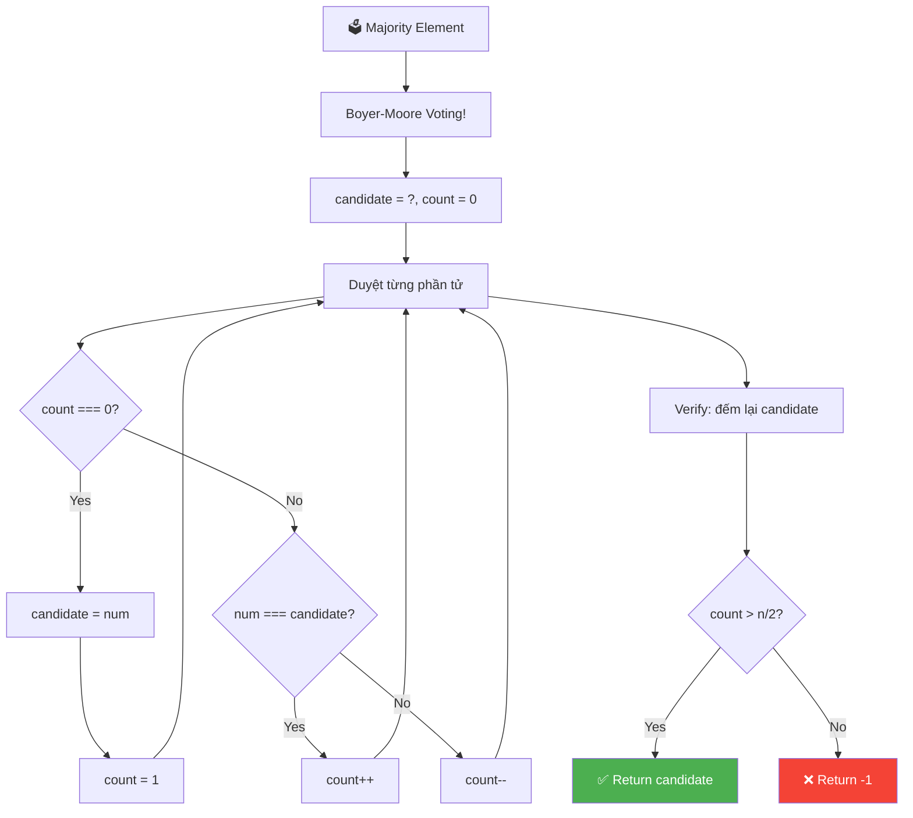
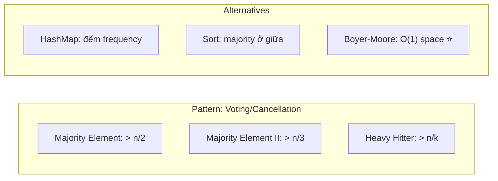
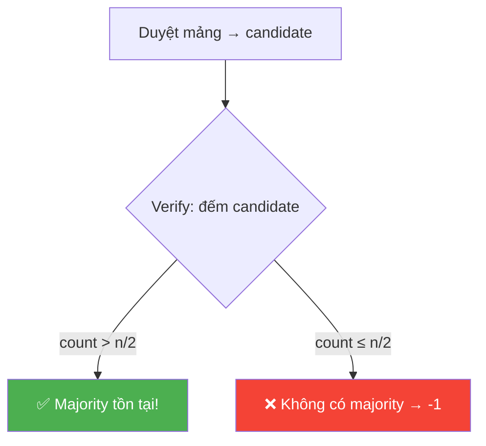
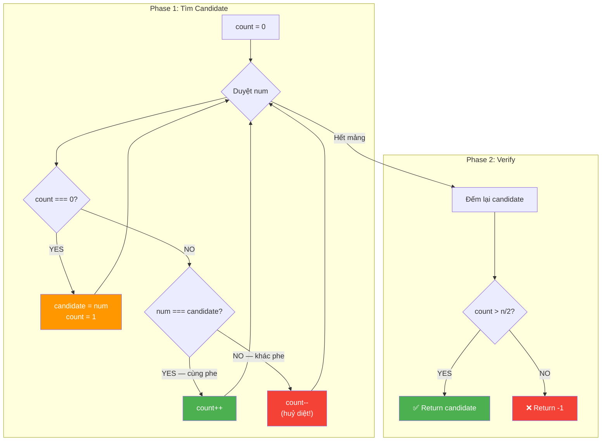
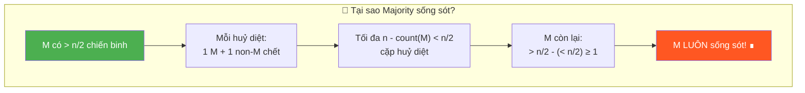
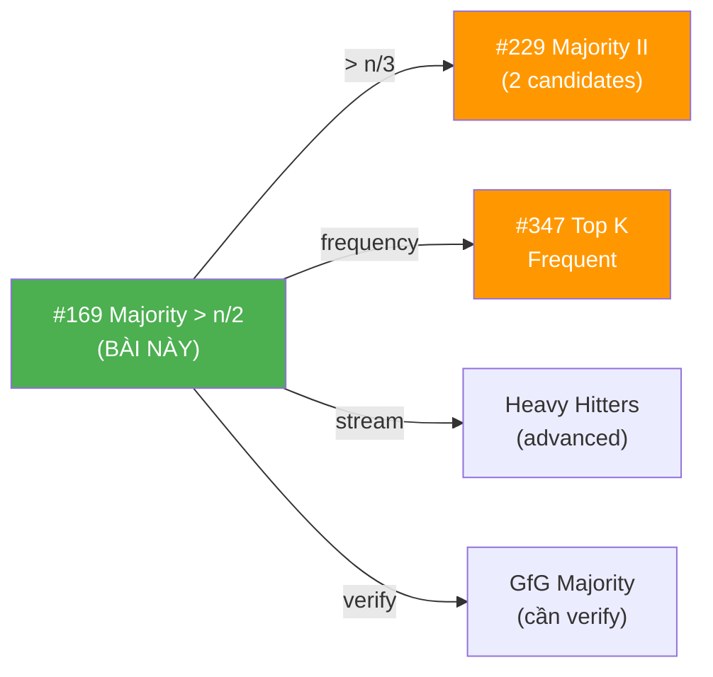
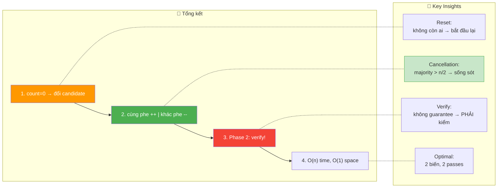

# 🗳️ Majority Element — GfG / LeetCode #169 (Easy)

> 📖 Code: [Majority Element.js](./Majority%20Element.js)





---

## R — Repeat & Clarify

🧠 *"Tìm phần tử xuất hiện HƠN n/2 lần. Nếu không có → return -1."*

> 🎙️ *"Given an array of size n, find the element that appears more than ⌊n/2⌋ times. If no such element exists, return -1."*

### Clarification Questions

```
Q: "More than n/2" hay "at least n/2"?
A: STRICTLY more than! count > ⌊n/2⌋
   n=7: cần > 3 → ít nhất 4 lần
   n=6: cần > 3 → ít nhất 4 lần
   n=5: cần > 2 → ít nhất 3 lần

Q: Có guarantee majority element TỒN TẠI không?
A: KHÔNG! Bài này cần kiểm tra → return -1 nếu không có!
   ⚠️ LeetCode #169 guarantee TỒN TẠI → không cần verify!
   ⚠️ GfG KHÔNG guarantee → PHẢI verify!

Q: Tối đa có bao nhiêu majority element?
A: TỐI ĐA 1! Vì > n/2 → chiếm hơn nửa mảng!
   Không thể có 2 phần tử cùng chiếm > n/2!

Q: Mảng rỗng?
A: n ≥ 1 (guarantee ít nhất 1 phần tử)
```

### Tại sao bài này quan trọng?

```
  ⭐ Boyer-Moore Voting Algorithm = THUẬT TOÁN KINH ĐIỂN!

  BẠN PHẢI hiểu:
  1. Brute force: O(n²) → duyệt + đếm
  2. HashMap: O(n) time, O(n) space → đếm frequency
  3. Sort: O(n log n) → majority ở index n/2
  4. Boyer-Moore: O(n) time, O(1) space → TỐI ƯU! ⭐

  Pattern "tìm phần tử phổ biến":
  ┌───────────────────────────────────────────────────┐
  │  Majority > n/2  → Boyer-Moore (1 candidate)     │
  │  Majority > n/3  → Boyer-Moore mở rộng (2 cand.) │
  │  Top K frequent  → HashMap + Heap                 │
  │  Most frequent   → HashMap + max                  │
  └───────────────────────────────────────────────────┘
```

---

## 🧠 Bản chất bài toán — Hiểu để NHỚ, không chỉ để GIẢI

### Tưởng tượng: BẦU CỬ / CHIẾN TRẬN!

```
  ⭐ ANALOGY: Cuộc bầu cử tổng thống!

  Mảng = danh sách PHIẾU BẦU:
  [1, 1, 2, 1, 3, 5, 1]

  "Majority" = ứng viên được HƠN NỬA số phiếu (> n/2)!
  → Chỉ có TỐI ĐA 1 ứng viên thắng!

  ─────────────────────────────────────────────

  ⭐ ANALOGY 2: Chiến trận HỦY DIỆT LẪN NHAU!

  Mỗi phần tử = 1 CHIẾN BINH.
  Chiến binh KHÁC phe → HỦY DIỆT LẪN NHAU (cả 2 chết!)
  Chiến binh CÙNG phe → ĐỒNG đội (count tăng!)

  Sau khi tất cả huỷ diệt xong:
  → Nếu có phe chiếm > n/2 → phe đó CÒN SỐNG SÓT!
  → Nếu không → không ai sống sót (hoặc sống sót duy nhất
    nhưng số lượng không đủ > n/2)!

  ĐÂY LÀ BẢN CHẤT CỦA BOYER-MOORE!
```

### Boyer-Moore = "Giữ ứng viên, đếm vote"

```
  ⭐ 2 biến: candidate + count

  Duyệt từng phần tử:
    count === 0? → ĐỔI ứng viên! (candidate = num, count = 1)
    num === candidate? → CÙNG PHE! (count++)
    num !== candidate? → KHÁC PHE! (count--)

  ────────────────────────────────────────

  VÍ DỤ: [1, 1, 2, 1, 3, 5, 1]

  num=1: count=0 → candidate=1, count=1
  num=1: 1===1  → count=2     (cùng phe!)
  num=2: 2!==1  → count=1     (khác phe → huỷ diệt 1 cặp)
  num=1: 1===1  → count=2     (cùng phe!)
  num=3: 3!==1  → count=1     (huỷ diệt)
  num=5: 5!==1  → count=0     (huỷ diệt)
  num=1: count=0 → candidate=1, count=1

  → candidate = 1
  → Verify: 1 xuất hiện 4 lần, 4 > ⌊7/2⌋ = 3 ✅
```

### Tại sao Boyer-Moore ĐÚNG?

```
  ⭐ CHỨNG MINH TRỰC GIÁC:

  Nếu majority element M tồn tại (count(M) > n/2):
    → M chiếm HƠN NỬA mảng!
    → Mỗi lần M bị "huỷ diệt" (count--), 1 phần tử KHÁC cũng bị huỷ
    → Tổng huỷ diệt tối đa = n - count(M) < n/2 cặp
    → Nhưng M có > n/2 chiến binh → LUÔN CÒN SỐNG SÓT!
    → candidate cuối cùng = M!

  ⚠️ Nếu KHÔNG có majority element:
    → candidate cuối cùng có thể là BẤT KỲ AI!
    → PHẢI verify bằng cách ĐẾM LẠI!

  ────────────────────────────────────────────

  VÍ DỤ KHÔNG CÓ majority: [1, 2, 3]
    num=1: count=0 → candidate=1, count=1
    num=2: 2!==1 → count=0     (huỷ diệt)
    num=3: count=0 → candidate=3, count=1

    → candidate = 3, nhưng 3 chỉ xuất hiện 1 lần!
    → 1 > ⌊3/2⌋ = 1? → 1 > 1 = false! → return -1!
    → PHẢI VERIFY!
```



### So sánh 4 approaches — MỘT CÁI NHÌN

```
  ┌────────────────────────────────────────────────────────┐
  │  1. BRUTE FORCE: O(n²) time, O(1) space               │
  │     Với mỗi phần tử → đếm nó trong mảng               │
  │                                                        │
  │  2. HASHMAP: O(n) time, O(n) space                     │
  │     Đếm frequency mỗi phần tử → tìm > n/2             │
  │                                                        │
  │  3. SORT: O(n log n) time, O(1) space                  │
  │     Sort → majority element CHẮC CHẮN ở index n/2     │
  │     (vì chiếm > nửa → bao phủ vị trí giữa!)           │
  │                                                        │
  │  4. BOYER-MOORE: O(n) time, O(1) space ⭐              │
  │     Voting algorithm → candidate + verify               │
  └────────────────────────────────────────────────────────┘
```

---

## 🧭 Luồng Suy Nghĩ — Từ đọc đề đến solution

> 💡 Phần này dạy bạn **CÁCH TƯ DUY** để tự giải bài, không chỉ biết đáp án.

### Bước 1: Đọc đề → Gạch chân KEYWORDS

```
  Đề: "Find element appearing more than ⌊n/2⌋ times"

  Gạch chân:
    "more than n/2" → MAJORITY! > half!
    "element"       → tìm 1 GIÁ TRỊ cụ thể
    "appears"       → FREQUENCY / counting!

  🧠 Tự hỏi: "Đếm frequency → dùng gì?"
    → HashMap! O(n) time, O(n) space
    → Nhưng phỏng vấn muốn O(1) space → Boyer-Moore!

  📌 Kỹ năng chuyển giao:
    "Majority element" → Boyer-Moore Voting!
    "Most frequent" → HashMap
    "Top K frequent" → HashMap + Heap
```

### Bước 2: Vẽ ví dụ NHỎ bằng tay

```
  arr = [1, 1, 2, 1, 3, 5, 1], n=7

  Đếm frequency:
    1 → 4 lần
    2 → 1 lần
    3 → 1 lần
    5 → 1 lần

  ⌊7/2⌋ = 3
  4 > 3? YES! → 1 là majority element ✅
```

### Bước 3: Brute Force → HashMap → Sort → Boyer-Moore

```
  🧠 "Cách đơn giản nhất?"
    Brute force: O(n²) → với mỗi arr[i], đếm nó → check > n/2
    HashMap: O(n) time → đếm tất cả frequency → tìm > n/2
    Sort: O(n log n) → majority nằm ở index n/2 (nếu tồn tại)

  🧠 "O(n) time + O(1) space?"
    → Boyer-Moore Voting Algorithm!
    → 2 biến: candidate + count
    → 1 pass tìm candidate + 1 pass verify!
```

---

## E — Examples

```
VÍ DỤ 1: arr = [1, 1, 2, 1, 3, 5, 1]
  n=7, ⌊7/2⌋=3
  Frequency: {1:4, 2:1, 3:1, 5:1}
  4 > 3 → majority = 1 ✅
```

```
VÍ DỤ 2: arr = [7]
  n=1, ⌊1/2⌋=0
  Frequency: {7:1}
  1 > 0 → majority = 7 ✅
```

```
VÍ DỤ 3: arr = [2, 13]
  n=2, ⌊2/2⌋=1
  Frequency: {2:1, 13:1}
  Không ai > 1 → return -1 ✅
```

```
VÍ DỤ 4: arr = [3, 3, 4, 2, 4, 4, 2, 4, 4]
  n=9, ⌊9/2⌋=4
  Frequency: {3:2, 4:5, 2:2}
  5 > 4 → majority = 4 ✅
```

---

## A — Approach

### Approach 1: Brute Force — O(n²)

```
💡 Ý tưởng: Với mỗi phần tử, đếm nó trong toàn mảng

  for i: pick arr[i]
    count = 0
    for j: if arr[j] === arr[i]: count++
    if (count > n/2): return arr[i]
  return -1

  ✅ Đúng, dễ hiểu
  ❌ O(n²) — quá chậm!
```

### Approach 2: HashMap — O(n) time, O(n) space

```
💡 Ý tưởng: Đếm frequency → tìm > n/2

  map = {}
  for num of arr: map[num]++
  for [key, count] of map:
    if (count > n/2): return key
  return -1

  ✅ O(n) time
  ❌ O(n) space — HashMap!
```

### Approach 3: Sort — O(n log n)

```
💡 Ý tưởng: Nếu majority tồn tại, nó CHẮC CHẮN ở index ⌊n/2⌋!

  Tại sao?
    Majority chiếm > n/2 vị trí
    → Dù shift trái hay phải, nó BAO PHỦ index n/2!

  arr = [1, 1, 1, 2, 3] → sorted → [1, 1, 1, 2, 3]
                                          ↑ n/2=2 → arr[2] = 1 ✅

  sort(arr)
  candidate = arr[n/2]
  count lại candidate → check > n/2

  ✅ Không cần HashMap
  ❌ O(n log n) — sort chậm hơn O(n)
```

### Approach 4: Boyer-Moore Voting — O(n) time, O(1) space ⭐

```
💡 Ý tưởng: "Huỷ diệt lẫn nhau" → majority sống sót!

  Phase 1: Tìm candidate
    candidate = ?, count = 0
    for num:
      count === 0? → candidate = num, count = 1
      num === candidate? → count++
      num !== candidate? → count--

  Phase 2: Verify candidate
    count = đếm candidate trong mảng
    count > n/2? → return candidate
    else → return -1

  ✅ O(n) time, O(1) space — TỐI ƯU!
```

### So sánh

```
  ┌──────────────────┬──────────────┬──────────┬──────────────────┐
  │                  │ Time         │ Space    │ Ghi chú           │
  ├──────────────────┼──────────────┼──────────┼──────────────────┤
  │ Brute Force      │ O(n²)        │ O(1)     │ Quá chậm          │
  │ HashMap          │ O(n)         │ O(n)     │ Dễ nhất           │
  │ Sort             │ O(n log n)   │ O(1)*    │ Majority ở n/2    │
  │ Boyer-Moore ⭐   │ O(n)         │ O(1)     │ Tối ưu!           │
  └──────────────────┴──────────────┴──────────┴──────────────────┘
  * in-place sort
```

---

## C — Code

### Solution 1: HashMap — O(n) time, O(n) space

```javascript
function majorityElementHash(arr) {
  const n = arr.length;
  const map = {};

  for (const num of arr) {
    map[num] = (map[num] || 0) + 1;
    if (map[num] > Math.floor(n / 2)) {
      return num; // ⭐ Return SỚM — không cần duyệt hết!
    }
  }

  return -1;
}
```

### Giải thích HashMap

```
  map[num] = (map[num] || 0) + 1;
    → Nếu chưa có: 0 + 1 = 1
    → Nếu đã có: count + 1

  if (map[num] > Math.floor(n / 2)): return num;
    → Return NGAY khi tìm thấy → tối ưu!
    → Không cần duyệt hết mảng!

  ⚠️ Có thể dùng Map() thay Object (cho key không phải string)
```

### Solution 2: Boyer-Moore Voting — O(n) time, O(1) space ⭐

```javascript
function majorityElement(arr) {
  const n = arr.length;

  // Phase 1: Tìm candidate
  let candidate = arr[0];
  let count = 0;

  for (const num of arr) {
    if (count === 0) {
      candidate = num; // ⭐ Đổi ứng viên!
      count = 1;
    } else if (num === candidate) {
      count++; // Cùng phe!
    } else {
      count--; // Khác phe → huỷ diệt!
    }
  }

  // Phase 2: Verify
  count = 0;
  for (const num of arr) {
    if (num === candidate) count++;
  }

  return count > Math.floor(n / 2) ? candidate : -1;
}
```

### Giải thích Boyer-Moore — CHI TIẾT

```
  PHASE 1: Tìm candidate

  if (count === 0):
    → Không còn ai "sống" → ĐỔI ứng viên!
    → candidate = num hiện tại, count = 1

  else if (num === candidate):
    → CÙNG PHE → count++ (thêm 1 đồng đội!)

  else:
    → KHÁC PHE → count-- (huỷ diệt 1 cặp!)

  ⚠️ count KHÔNG BAO GIỜ < 0!
     count-- chỉ xảy ra khi count > 0
     count === 0 → đổi ứng viên (reset!)

  PHASE 2: Verify

  ⚠️ PHẢI verify vì:
     Nếu không có majority → candidate có thể SAI!
     VD: [1, 2, 3] → candidate = 3, nhưng 3 chỉ xuất hiện 1!
     → Đếm lại candidate → check > n/2

  ⚠️ LeetCode #169 guarantee majority tồn tại → BỎ Phase 2!
     GfG KHÔNG guarantee → BẮT BUỘC Phase 2!
```

### Trace CHI TIẾT: arr = [1, 1, 2, 1, 3, 5, 1]

```
  n = 7, ⌊7/2⌋ = 3

  ═══ PHASE 1: Tìm candidate ═══════════════════════════

  num=1: count=0 → candidate=1, count=1
         ↑ Đổi ứng viên! (chưa có ai)

  num=1: 1===1  → count=2
         ↑ Cùng phe!

  num=2: 2!==1  → count=1
         ↑ Khác phe → huỷ diệt 1 cặp (1 đấu 2)

  num=1: 1===1  → count=2
         ↑ Cùng phe!

  num=3: 3!==1  → count=1
         ↑ Huỷ diệt (1 đấu 3)

  num=5: 5!==1  → count=0
         ↑ Huỷ diệt (1 đấu 5) → KHÔNG CÒN AI!

  num=1: count=0 → candidate=1, count=1
         ↑ Đổi ứng viên! (1 sống lại!)

  → candidate = 1

  ═══ PHASE 2: Verify ═══════════════════════════════════

  Đếm 1 trong mảng: [1, 1, 2, 1, 3, 5, 1]
  count = 4

  4 > 3? → YES! → return 1 ✅
```

```
  BẢNG TRACE:

  ┌──────┬──────────────┬───────────────────┐
  │ num  │ candidate    │ count             │
  ├──────┼──────────────┼───────────────────┤
  │ init │ -            │ 0                 │
  │ 1    │ 1 (NEW!)     │ 1                 │
  │ 1    │ 1            │ 2  (cùng phe)     │
  │ 2    │ 1            │ 1  (huỷ diệt)    │
  │ 1    │ 1            │ 2  (cùng phe)     │
  │ 3    │ 1            │ 1  (huỷ diệt)    │
  │ 5    │ 1            │ 0  (huỷ diệt)    │
  │ 1    │ 1 (NEW!)     │ 1                 │
  └──────┴──────────────┴───────────────────┘
  Verify: count(1) = 4 > 3 ✅
```

### Trace: arr = [3, 3, 4, 2, 4, 4, 2, 4, 4]

```
  n = 9, ⌊9/2⌋ = 4

  ┌──────┬──────────────┬───────┐
  │ num  │ candidate    │ count │
  ├──────┼──────────────┼───────┤
  │ 3    │ 3 (NEW!)     │ 1     │
  │ 3    │ 3            │ 2     │
  │ 4    │ 3            │ 1     │
  │ 2    │ 3            │ 0     │
  │ 4    │ 4 (NEW!)     │ 1     │
  │ 4    │ 4            │ 2     │
  │ 2    │ 4            │ 1     │
  │ 4    │ 4            │ 2     │
  │ 4    │ 4            │ 3     │
  └──────┴──────────────┴───────┘

  candidate = 4
  Verify: count(4) = 5, 5 > 4 → ✅ return 4
```

### Trace Edge: arr = [2, 13] (không có majority)

```
  n = 2, ⌊2/2⌋ = 1

  ┌──────┬──────────────┬───────┐
  │ num  │ candidate    │ count │
  ├──────┼──────────────┼───────┤
  │ 2    │ 2 (NEW!)     │ 1     │
  │ 13   │ 2            │ 0     │
  └──────┴──────────────┴───────┘

  candidate = 2 (nhưng count=0 → đáng nghi!)
  Verify: count(2) = 1, 1 > 1? → NO! → return -1 ✅

  ⚠️ Nếu BỎ Phase 2: return 2 → SAI!
```

> 🎙️ *"I use Boyer-Moore Voting: maintain a candidate and a count. When count reaches zero, I pick a new candidate. Equal elements increment count, different elements decrement. The key insight is that if a majority exists, it survives all cancellations because it has more than half the total votes. I then verify the candidate with a second pass."*

---

## 🔬 Deep Dive — Giải thích CHI TIẾT từng dòng code

> 💡 Phân tích **từng dòng** Boyer-Moore để hiểu **TẠI SAO**.

```javascript
function majorityElement(arr) {
  const n = arr.length;

  // ═══════════════════════════════════════════════════════════════
  // PHASE 1: Tìm candidate — "Chiến trận huỷ diệt"
  // ═══════════════════════════════════════════════════════════════
  //
  // TẠI SAO count = 0 (không phải 1)?
  //   → count = 0 nghĩa là "chưa có ứng viên"
  //   → Phần tử ĐẦU TIÊN tự động thành candidate (count=0 → đổi!)
  //   → Nếu count = 1 + loop từ 0: arr[0] bị đếm 2 lần!
  //
  let candidate = arr[0];
  let count = 0;

  // DÒNG QUAN TRỌNG NHẤT: 3 nhánh if/else
  for (const num of arr) {

    // ─── Nhánh 1: count === 0 → "KHÔNG CÒN AI SỐNG" ───
    //
    // Tất cả "chiến binh" trước đã huỷ diệt lẫn nhau
    // → Bắt đầu lại từ đầu với phần tử hiện tại!
    // → ĐÂY LÀ RESET — không nhớ gì trước đó!
    //
    if (count === 0) {
      candidate = num;
      count = 1;

    // ─── Nhánh 2: num === candidate → "CÙNG PHE" ───
    //
    // Thêm 1 đồng đội → lực lượng mạnh hơn!
    //
    } else if (num === candidate) {
      count++;

    // ─── Nhánh 3: num !== candidate → "KHÁC PHE" ───
    //
    // 1 của candidate + 1 của num → HUỶ DIỆT cả hai!
    // → count-- (mất 1 chiến binh)
    // → Phần tử num cũng "chết" (không track)
    //
    } else {
      count--;
    }
  }

  // ═══════════════════════════════════════════════════════════════
  // PHASE 2: Verify — "Đếm lại thật chính xác"
  // ═══════════════════════════════════════════════════════════════
  //
  // TẠI SAO cần verify?
  //   → Phase 1 tìm candidate NHƯNG KHÔNG chứng minh nó majority!
  //   → Nếu KHÔNG có majority: candidate = "người cuối cùng đứng"
  //     nhưng chưa chắc chiếm > n/2!
  //   → VD: [1,2,3] → candidate=3, nhưng count(3)=1 ≤ 1!
  //
  // ⚠️ LeetCode #169 guarantee majority → BỎ Phase 2!
  //    GfG KHÔNG guarantee → BẮT BUỘC Phase 2!
  //
  count = 0;
  for (const num of arr) {
    if (num === candidate) count++;
  }

  return count > Math.floor(n / 2) ? candidate : -1;
}
```



---

## 📐 Invariant — Chứng minh tính đúng đắn

```
  📐 INVARIANT (bất biến):

  Sau khi xử lý arr[0..i], nếu majority element M tồn tại
  trong TOÀN mảng:
    → M vẫn "sống sót" trong phần CHƯA XỬ LÝ arr[i+1..n-1]
       kết hợp với candidate/count hiện tại.

  Chứng minh:
  ┌──────────────────────────────────────────────────────────────────┐
  │  Cho M = majority, count(M) > n/2                              │
  │                                                                 │
  │  Mỗi lần M bị "huỷ diệt" (count--):                           │
  │    → 1 phần tử M bị ghép với 1 phần tử KHÁC → cả 2 "chết"    │
  │    → Số cặp huỷ diệt tối đa = n - count(M) < n/2              │
  │    → M có > n/2 chiến binh, mất < n/2 → CÒN ÍT NHẤT 1!       │
  │                                                                 │
  │  Khi kết thúc Phase 1:                                         │
  │    → candidate = phần tử cuối cùng "đứng vững"                │
  │    → Nếu M tồn tại → M phải là candidate!                     │
  │    → Vì M có DÂN SỐ lớn nhất → LUÔN sống sót! ∎               │
  └──────────────────────────────────────────────────────────────────┘

  📐 CHỨNG MINH CHẶT:

  Xét mảng như n "quân cờ".
  Boyer-Moore = quá trình "ghép cặp khác loại → loại bỏ cả 2".

  Số cặp loại bỏ tối đa = ⌊n/2⌋ (n quân → ⌊n/2⌋ cặp)
  Nhưng M có > n/2 quân → dù mất ⌊n/2⌋ → còn ≥ 1!
  → M LUÔN "sống sót" → candidate = M khi kết thúc! ∎

  📐 Completeness:
  Phase 2 verify → đảm bảo KHÔNG false positive
  → Nếu majority KHÔNG tồn tại → return -1 ✅
  → Nếu majority TỒN TẠI → return đúng ✅
```



---

## O — Optimize

```
                    Time          Space     Ghi chú
  ──────────────────────────────────────────────────
  Brute Force       O(n²)         O(1)      Quá chậm
  HashMap           O(n)          O(n)      Dễ nhất
  Sort              O(n log n)    O(1)*     Majority ở n/2
  Boyer-Moore ⭐    O(n)          O(1)      2 passes

  ⚠️ Boyer-Moore = TỐI ƯU:
    Time: O(n) — 2 passes (find + verify)
    Space: O(1) — chỉ 2 biến (candidate + count)!
    Không thể tốt hơn O(n) — phải đọc mọi phần tử!
```

### Complexity chính xác — Đếm operations

```
  Boyer-Moore:
    Phase 1: n comparisons (count===0) + n comparisons (num===cand)
           + n increments/decrements = 3n operations
    Phase 2: n comparisons + ≤n increments = 2n operations
    TỔNG: 5n operations → O(n) với constant ≈ 5

  HashMap:
    n hash operations (set/get) + n increments = 2n
    Nhưng hash = O(1) AMORTIZED → worst case O(n²)!

  📊 So sánh THỰC TẾ (n = 10⁶):
    Boyer-Moore: 5 × 10⁶ ops ≈ 5ms, 16 bytes RAM
    HashMap:     2 × 10⁶ ops ≈ 3ms, ~40MB RAM 😰
    → Boyer-Moore CHẬM hơn 1 chút nhưng tiết kiệm ~2,500,000× RAM!
```

---

## T — Test

```
Test Cases:
  [1, 1, 2, 1, 3, 5, 1]      → 1     ✅ majority = 1 (4/7 > 3)
  [7]                         → 7     ✅ 1 phần tử
  [2, 13]                     → -1    ✅ không có majority
  [3, 3, 4, 2, 4, 4, 2, 4, 4]→ 4     ✅ majority = 4 (5/9 > 4)
  [1, 2, 3]                  → -1    ✅ tất cả 1 lần
  [1, 1, 1, 1, 2, 3, 4]      → 1     ✅ 4/7 > 3
  [2, 2, 2, 2, 2]            → 2     ✅ toàn giống nhau
  [1, 2, 1]                  → 1     ✅ 2/3 > 1
```

---

## 🗣️ Interview Script

> 🎙️ *"I see three main approaches: HashMap for O(n) time with O(n) space, Sorting for O(n log n), and Boyer-Moore Voting for optimal O(n) time with O(1) space. Boyer-Moore works by maintaining a candidate and a vote count — when count hits zero I pick a new candidate. The majority element, having more than half the votes, always survives the cancellation process. I verify with a second pass since the problem doesn't guarantee a majority exists."*

### 🎙️ Think Out Loud — Mô phỏng phỏng vấn thực

```
  ──────────────── PHASE 1: Clarify ────────────────

  👤 Interviewer: "Find the element appearing more than n/2 times."

  🧑 You: "Let me clarify:
   1. 'More than n/2' means strictly greater, not ≥.
   2. Is the majority guaranteed to exist? If not, I should return -1.
   3. I need to return the element value, not its count.
   4. n ≥ 1?"

  👤 Interviewer: "No guarantee. Return -1 if not found."

  ──────────────── PHASE 2: Examples ────────────────

  🧑 You: "arr = [1, 1, 2, 1, 3, 5, 1], n=7.
   Element 1 appears 4 times. 4 > ⌊7/2⌋ = 3. So 1 is the majority.
   arr = [1, 2, 3]: no element appears more than once, return -1."

  ──────────────── PHASE 3: Approach ────────────────

  🧑 You: "I see four approaches escalating in optimization:

   1. Brute force: O(n²) — count each element
   2. HashMap: O(n) time, O(n) space — frequency count
   3. Sort: O(n log n) — majority is at index n/2
   4. Boyer-Moore Voting: O(n) time, O(1) space — optimal!

   I'll implement Boyer-Moore. The idea is a cancellation game:
   maintain a candidate and a vote count. Same element → count++,
   different → count--. When count hits 0, switch candidates.

   If a majority exists, it has more than half the votes,
   so it always survives the cancellation. Then I verify."

  ──────────────── PHASE 4: Code + Verify ────────────────

  🧑 You: [writes code, traces example, verifies edge cases]

  "Key: I MUST verify because the problem doesn't guarantee
   a majority exists. Without Phase 2, [1,2,3] returns 3 — wrong!"

  ──────────────── PHASE 5: Follow-ups ────────────────

  👤 "What if we need elements appearing more than n/3 times?"
  🧑 "At most 2 elements can exceed n/3. I use Boyer-Moore
      with 2 candidates and 2 counts. Same idea, extended."

  👤 "What if the majority IS guaranteed? (LC #169)"
  🧑 "Then I skip Phase 2 entirely — saves one pass."

  👤 "Can you do this with sorting?"
  🧑 "Yes — if majority exists, it must be at index n/2
      after sorting, since it covers more than half the array.
      But that's O(n log n) vs Boyer-Moore's O(n)."
```

---

## 📚 Bài tập liên quan — Practice Problems

### Progression Path



### 1. Majority Element II (#229) — Medium

```
  Đề: Tìm TẤT CẢ phần tử xuất hiện > ⌊n/3⌋ lần.

  KEY INSIGHT: Tối đa 2 phần tử > n/3!
  → Boyer-Moore mở rộng: 2 candidates + 2 counts!

  function majorityElementII(nums) {
    let cand1, cand2, count1 = 0, count2 = 0;

    // Phase 1: Tìm 2 candidates
    for (const num of nums) {
      if (num === cand1)       count1++;
      else if (num === cand2)  count2++;
      else if (count1 === 0) { cand1 = num; count1 = 1; }
      else if (count2 === 0) { cand2 = num; count2 = 1; }
      else { count1--; count2--; }  // huỷ cả 3!
    }

    // Phase 2: Verify cả 2
    count1 = count2 = 0;
    for (const num of nums) {
      if (num === cand1) count1++;
      else if (num === cand2) count2++;
    }

    const result = [];
    if (count1 > Math.floor(nums.length / 3)) result.push(cand1);
    if (count2 > Math.floor(nums.length / 3)) result.push(cand2);
    return result;
  }

  📌 So sánh:
    > n/2 → 1 candidate → Boyer-Moore cơ bản
    > n/3 → 2 candidates → Boyer-Moore mở rộng
    > n/k → k-1 candidates → tổng quát!
```

### 2. Top K Frequent Elements (#347) — Medium

```
  Đề: Tìm k phần tử xuất hiện NHIỀU NHẤT.

  KEY: KHÔNG dùng Boyer-Moore! (không yêu cầu > n/k)

  function topKFrequent(nums, k) {
    const map = new Map();
    for (const num of nums) map.set(num, (map.get(num)||0) + 1);

    // BUCKET SORT: O(n) thay Heap O(n log k)!
    const buckets = Array.from({length: nums.length + 1}, () => []);
    for (const [num, freq] of map) buckets[freq].push(num);

    const result = [];
    for (let i = buckets.length - 1; i >= 0 && result.length < k; i--) {
      result.push(...buckets[i]);
    }
    return result.slice(0, k);
  }

  📌 Bucket Sort: O(n) time — nhanh hơn Heap!
     Index = frequency, value = danh sách numbers!
```

### Tổng kết — "Khi nào dùng gì?"

```
  ┌──────────────────────────────────────────────────────────────┐
  │  BÀI                     │  Technique                       │
  ├──────────────────────────────────────────────────────────────┤
  │  Majority > n/2 ⭐       │  Boyer-Moore (1 cand)            │
  │  Majority > n/3          │  Boyer-Moore (2 cands)           │
  │  Top K Frequent          │  HashMap + Bucket Sort/Heap      │
  │  Most Frequent           │  HashMap + max                   │
  │  Frequency Count         │  HashMap                         │
  │  Heavy Hitter (stream)   │  Boyer-Moore generalized         │
  └──────────────────────────────────────────────────────────────┘

  📌 RULE: "Majority > n/k" → Boyer-Moore (k-1 candidates)!
           "Top K" → HashMap + Heap/Bucket Sort!
           "Count" → HashMap!
```

### Skeleton code — Reusable template

```javascript
// TEMPLATE: Boyer-Moore Voting cho majority > n/k
function boyerMooreTemplate(arr, k) {
  // Phase 1: Tìm tối đa k-1 candidates
  const candidates = new Map(); // candidate → count

  for (const num of arr) {
    if (candidates.has(num)) {
      candidates.set(num, candidates.get(num) + 1);
    } else if (candidates.size < k - 1) {
      candidates.set(num, 1);
    } else {
      // Huỷ diệt: giảm TẤT CẢ counts, xoá count = 0
      for (const [key, val] of candidates) {
        if (val === 1) candidates.delete(key);
        else candidates.set(key, val - 1);
      }
    }
  }

  // Phase 2: Verify
  const result = [];
  for (const cand of candidates.keys()) {
    const count = arr.filter(x => x === cand).length;
    if (count > Math.floor(arr.length / k)) result.push(cand);
  }
  return result;
}

// k=2: majority > n/2 → tối đa 1 candidate
// k=3: majority > n/3 → tối đa 2 candidates
// k=4: majority > n/4 → tối đa 3 candidates
```

---

## 📊 Tổng kết — Key Insights



```
  ┌──────────────────────────────────────────────────────────────────────────┐
  │  📌 3 ĐIỀU PHẢI NHỚ                                                    │
  │                                                                          │
  │  1. BOYER-MOORE = "Huỷ diệt lẫn nhau"                                 │
  │     → count=0 → đổi candidate → count=1                               │
  │     → cùng phe → count++ | khác phe → count--                         │
  │     → Majority (> n/2) LUÔN sống sót vì có DÂN SỐ lớn nhất!         │
  │                                                                          │
  │  2. PHASE 2 = VERIFY!                                                   │
  │     → Phase 1 tìm candidate NHƯNG KHÔNG chứng minh nó đúng!           │
  │     → NẾU đề không guarantee → BẮT BUỘC đếm lại!                     │
  │     → NẾU guarantee (#169) → bỏ Phase 2!                              │
  │                                                                          │
  │  3. MỞ RỘNG: > n/k → k-1 candidates!                                  │
  │     → > n/2 → 1 candidate (bài này!)                                  │
  │     → > n/3 → 2 candidates (#229)                                     │
  │     → > n/k → k-1 candidates (generalized)                            │
  │     → CÙNG 1 PATTERN → hiểu 1 bài = GIẢI ĐƯỢC CẢ HỌ!               │
  └──────────────────────────────────────────────────────────────────────────┘
```

---

## 📝 Flashcard — Tự kiểm tra

| ❓ Câu hỏi | ✅ Đáp án |
|---|---|
| Majority element = ? | Xuất hiện **> ⌊n/2⌋** lần |
| Tối đa có bao nhiêu majority? | **1** (chiếm > nửa mảng) |
| Boyer-Moore dùng mấy biến? | **2**: candidate + count |
| count = 0 thì sao? | Đổi candidate = phần tử hiện tại |
| Cùng phe? | count++ |
| Khác phe? | count-- (huỷ diệt!) |
| Có cần verify không? | CÓ nếu đề không guarantee majority! |
| Time / Space? | **O(n)** time, **O(1)** space |
| Majority > n/3 thì sao? | Boyer-Moore mở rộng: **2 candidates** |
| > n/k thì sao? | **k-1** candidates |
| LeetCode nào? | **#169** (guarantee) và GfG (cần verify) |

