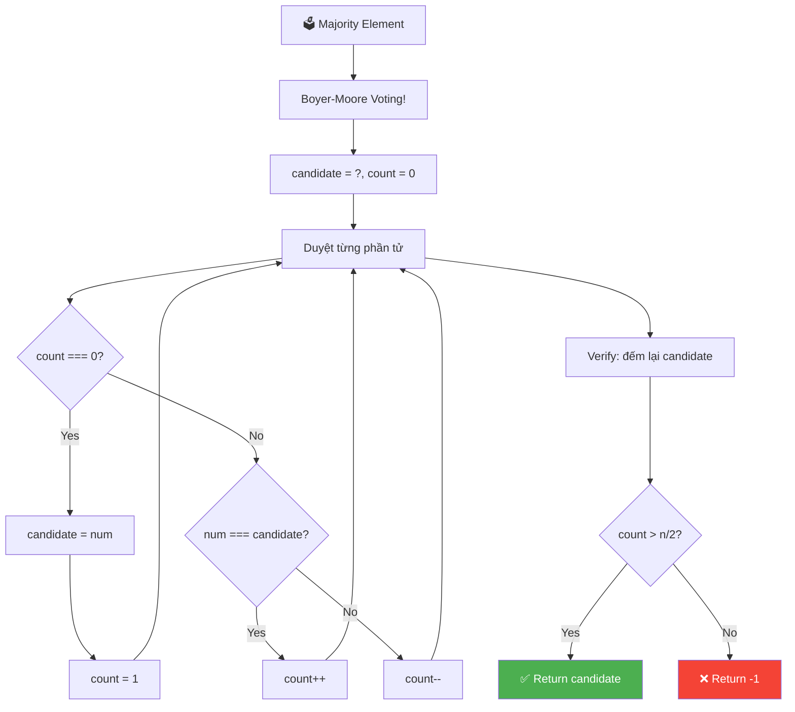
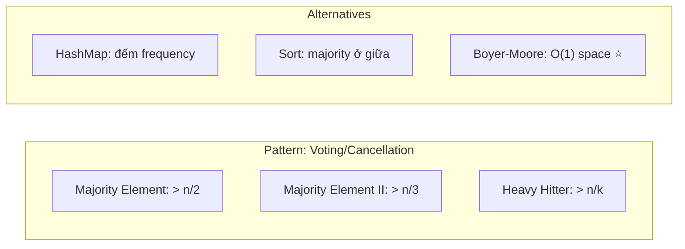
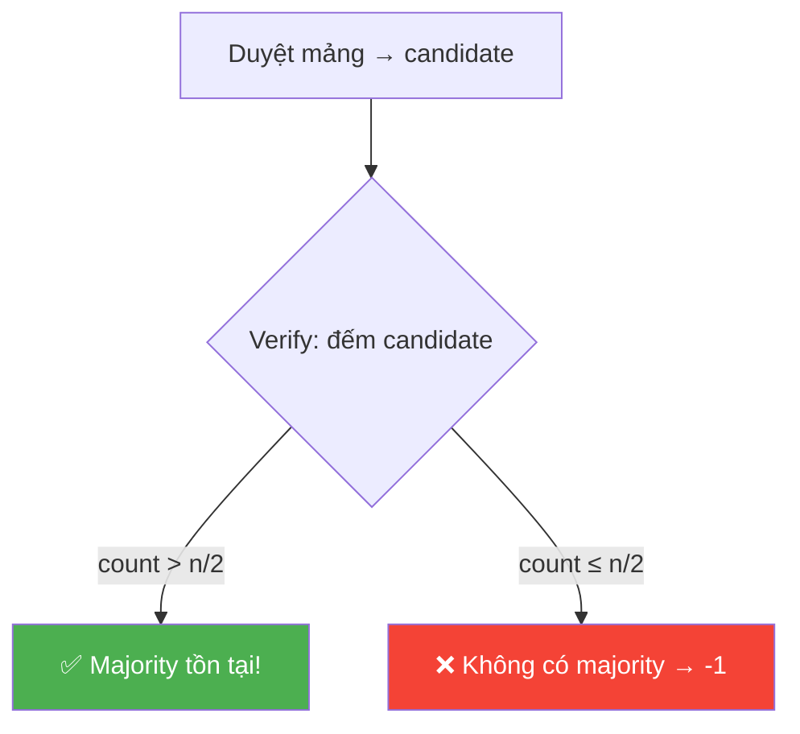
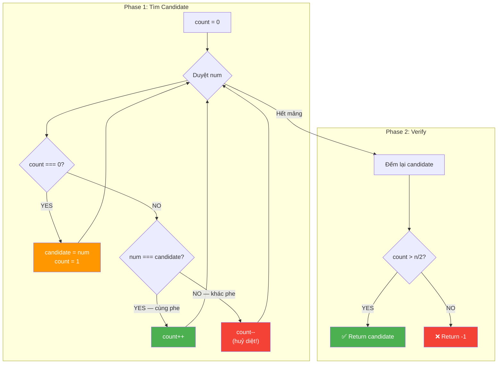
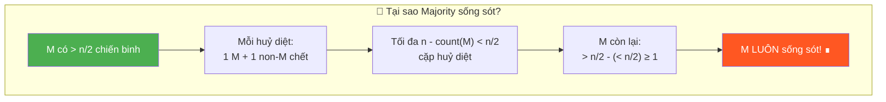
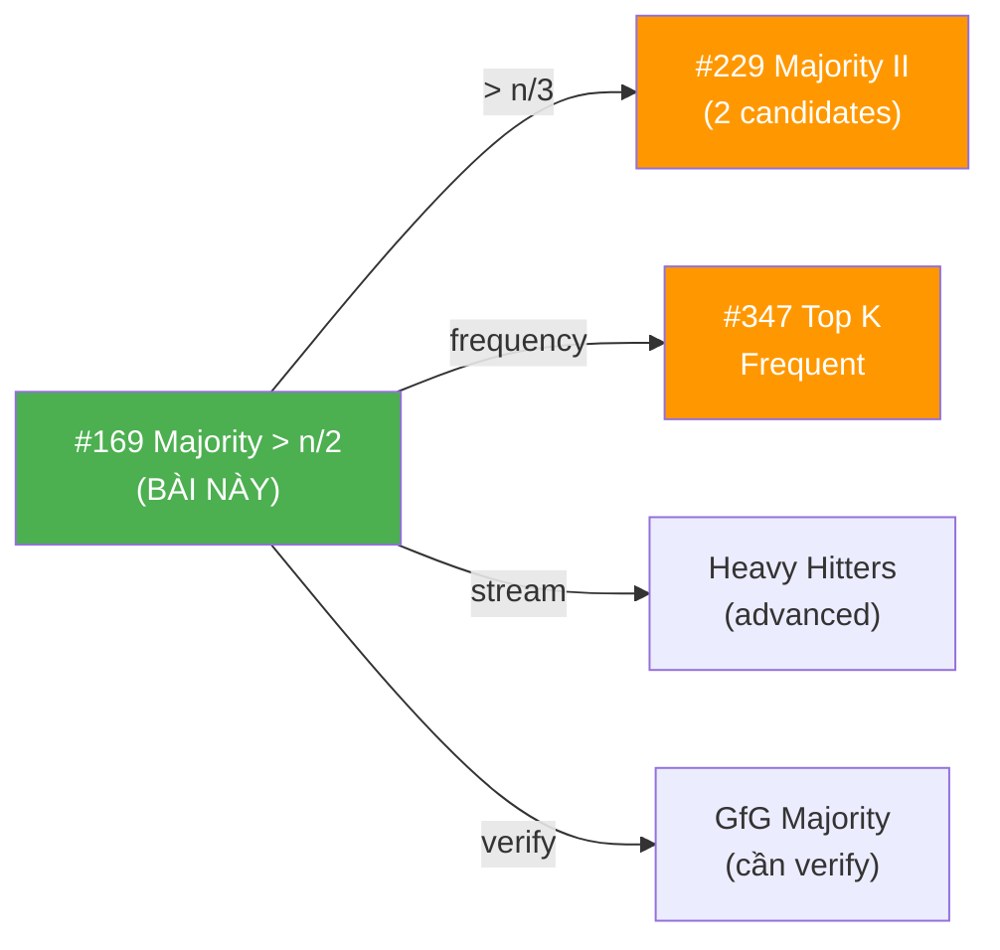
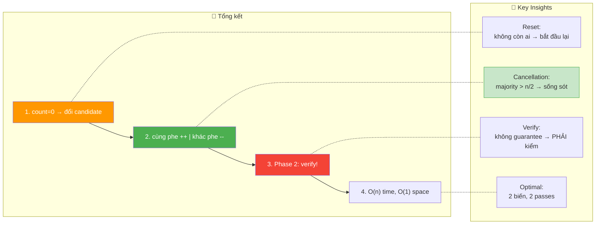

# 🗳️ Majority Element — GfG / LeetCode #169 (Easy)

> 📖 Code: [Majority Element.js](./Majority%20Element.js)





---

## R — Repeat & Clarify

🧠 *"Tìm phần tử xuất hiện HƠN n/2 lần. Nếu không có → return -1."*

> 🎙️ *"Given an array of size n, find the element that appears more than ⌊n/2⌋ times. If no such element exists, return -1."*

### Clarification Questions

```
Q: "More than n/2" hay "at least n/2"?
A: STRICTLY more than! count > ⌊n/2⌋
   n=7: cần > 3 → ít nhất 4 lần
   n=6: cần > 3 → ít nhất 4 lần
   n=5: cần > 2 → ít nhất 3 lần

Q: Có guarantee majority element TỒN TẠI không?
A: KHÔNG! Bài này cần kiểm tra → return -1 nếu không có!
   ⚠️ LeetCode #169 guarantee TỒN TẠI → không cần verify!
   ⚠️ GfG KHÔNG guarantee → PHẢI verify!

Q: Tối đa có bao nhiêu majority element?
A: TỐI ĐA 1! Vì > n/2 → chiếm hơn nửa mảng!
   Không thể có 2 phần tử cùng chiếm > n/2!

Q: Mảng rỗng?
A: n ≥ 1 (guarantee ít nhất 1 phần tử)
```

### Tại sao bài này quan trọng?

```
  ⭐ Boyer-Moore Voting Algorithm = THUẬT TOÁN KINH ĐIỂN!

  BẠN PHẢI hiểu:
  1. Brute force: O(n²) → duyệt + đếm
  2. HashMap: O(n) time, O(n) space → đếm frequency
  3. Sort: O(n log n) → majority ở index n/2
  4. Boyer-Moore: O(n) time, O(1) space → TỐI ƯU! ⭐

  Pattern "tìm phần tử phổ biến":
  ┌───────────────────────────────────────────────────┐
  │  Majority > n/2  → Boyer-Moore (1 candidate)     │
  │  Majority > n/3  → Boyer-Moore mở rộng (2 cand.) │
  │  Top K frequent  → HashMap + Heap                 │
  │  Most frequent   → HashMap + max                  │
  └───────────────────────────────────────────────────┘
```

---

## 🧠 Bản chất bài toán — Hiểu để NHỚ, không chỉ để GIẢI

### Tưởng tượng: BẦU CỬ / CHIẾN TRẬN!

```
  ⭐ ANALOGY: Cuộc bầu cử tổng thống!

  Mảng = danh sách PHIẾU BẦU:
  [1, 1, 2, 1, 3, 5, 1]

  "Majority" = ứng viên được HƠN NỬA số phiếu (> n/2)!
  → Chỉ có TỐI ĐA 1 ứng viên thắng!

  ─────────────────────────────────────────────

  ⭐ ANALOGY 2: Chiến trận HỦY DIỆT LẪN NHAU!

  Mỗi phần tử = 1 CHIẾN BINH.
  Chiến binh KHÁC phe → HỦY DIỆT LẪN NHAU (cả 2 chết!)
  Chiến binh CÙNG phe → ĐỒNG đội (count tăng!)

  Sau khi tất cả huỷ diệt xong:
  → Nếu có phe chiếm > n/2 → phe đó CÒN SỐNG SÓT!
  → Nếu không → không ai sống sót (hoặc sống sót duy nhất
    nhưng số lượng không đủ > n/2)!

  ĐÂY LÀ BẢN CHẤT CỦA BOYER-MOORE!
```

### Boyer-Moore = "Giữ ứng viên, đếm vote"

```
  ⭐ 2 biến: candidate + count

  Duyệt từng phần tử:
    count === 0? → ĐỔI ứng viên! (candidate = num, count = 1)
    num === candidate? → CÙNG PHE! (count++)
    num !== candidate? → KHÁC PHE! (count--)

  ────────────────────────────────────────

  VÍ DỤ: [1, 1, 2, 1, 3, 5, 1]

  num=1: count=0 → candidate=1, count=1
  num=1: 1===1  → count=2     (cùng phe!)
  num=2: 2!==1  → count=1     (khác phe → huỷ diệt 1 cặp)
  num=1: 1===1  → count=2     (cùng phe!)
  num=3: 3!==1  → count=1     (huỷ diệt)
  num=5: 5!==1  → count=0     (huỷ diệt)
  num=1: count=0 → candidate=1, count=1

  → candidate = 1
  → Verify: 1 xuất hiện 4 lần, 4 > ⌊7/2⌋ = 3 ✅
```

### Tại sao Boyer-Moore ĐÚNG?

```
  ⭐ CHỨNG MINH TRỰC GIÁC:

  Nếu majority element M tồn tại (count(M) > n/2):
    → M chiếm HƠN NỬA mảng!
    → Mỗi lần M bị "huỷ diệt" (count--), 1 phần tử KHÁC cũng bị huỷ
    → Tổng huỷ diệt tối đa = n - count(M) < n/2 cặp
    → Nhưng M có > n/2 chiến binh → LUÔN CÒN SỐNG SÓT!
    → candidate cuối cùng = M!

  ⚠️ Nếu KHÔNG có majority element:
    → candidate cuối cùng có thể là BẤT KỲ AI!
    → PHẢI verify bằng cách ĐẾM LẠI!

  ────────────────────────────────────────────

  VÍ DỤ KHÔNG CÓ majority: [1, 2, 3]
    num=1: count=0 → candidate=1, count=1
    num=2: 2!==1 → count=0     (huỷ diệt)
    num=3: count=0 → candidate=3, count=1

    → candidate = 3, nhưng 3 chỉ xuất hiện 1 lần!
    → 1 > ⌊3/2⌋ = 1? → 1 > 1 = false! → return -1!
    → PHẢI VERIFY!
```



### So sánh 4 approaches — MỘT CÁI NHÌN

```
  ┌────────────────────────────────────────────────────────┐
  │  1. BRUTE FORCE: O(n²) time, O(1) space               │
  │     Với mỗi phần tử → đếm nó trong mảng               │
  │                                                        │
  │  2. HASHMAP: O(n) time, O(n) space                     │
  │     Đếm frequency mỗi phần tử → tìm > n/2             │
  │                                                        │
  │  3. SORT: O(n log n) time, O(1) space                  │
  │     Sort → majority element CHẮC CHẮN ở index n/2     │
  │     (vì chiếm > nửa → bao phủ vị trí giữa!)           │
  │                                                        │
  │  4. BOYER-MOORE: O(n) time, O(1) space ⭐              │
  │     Voting algorithm → candidate + verify               │
  └────────────────────────────────────────────────────────┘
```

---

## 🧭 Luồng Suy Nghĩ — Từ đọc đề đến solution

> 💡 Phần này dạy bạn **CÁCH TƯ DUY** để tự giải bài, không chỉ biết đáp án.

### Bước 1: Đọc đề → Gạch chân KEYWORDS

```
  Đề: "Find element appearing more than ⌊n/2⌋ times"

  Gạch chân:
    "more than n/2" → MAJORITY! > half!
    "element"       → tìm 1 GIÁ TRỊ cụ thể
    "appears"       → FREQUENCY / counting!

  🧠 Tự hỏi: "Đếm frequency → dùng gì?"
    → HashMap! O(n) time, O(n) space
    → Nhưng phỏng vấn muốn O(1) space → Boyer-Moore!

  📌 Kỹ năng chuyển giao:
    "Majority element" → Boyer-Moore Voting!
    "Most frequent" → HashMap
    "Top K frequent" → HashMap + Heap
```

### Bước 2: Vẽ ví dụ NHỎ bằng tay

```
  arr = [1, 1, 2, 1, 3, 5, 1], n=7

  Đếm frequency:
    1 → 4 lần
    2 → 1 lần
    3 → 1 lần
    5 → 1 lần

  ⌊7/2⌋ = 3
  4 > 3? YES! → 1 là majority element ✅
```

### Bước 3: Brute Force → HashMap → Sort → Boyer-Moore

```
  🧠 "Cách đơn giản nhất?"
    Brute force: O(n²) → với mỗi arr[i], đếm nó → check > n/2
    HashMap: O(n) time → đếm tất cả frequency → tìm > n/2
    Sort: O(n log n) → majority nằm ở index n/2 (nếu tồn tại)

  🧠 "O(n) time + O(1) space?"
    → Boyer-Moore Voting Algorithm!
    → 2 biến: candidate + count
    → 1 pass tìm candidate + 1 pass verify!
```

---

## E — Examples

```
VÍ DỤ 1: arr = [1, 1, 2, 1, 3, 5, 1]
  n=7, ⌊7/2⌋=3
  Frequency: {1:4, 2:1, 3:1, 5:1}
  4 > 3 → majority = 1 ✅
```

```
VÍ DỤ 2: arr = [7]
  n=1, ⌊1/2⌋=0
  Frequency: {7:1}
  1 > 0 → majority = 7 ✅
```

```
VÍ DỤ 3: arr = [2, 13]
  n=2, ⌊2/2⌋=1
  Frequency: {2:1, 13:1}
  Không ai > 1 → return -1 ✅
```

```
VÍ DỤ 4: arr = [3, 3, 4, 2, 4, 4, 2, 4, 4]
  n=9, ⌊9/2⌋=4
  Frequency: {3:2, 4:5, 2:2}
  5 > 4 → majority = 4 ✅
```

---

## A — Approach

### Approach 1: Brute Force — O(n²)

```
💡 Ý tưởng: Với mỗi phần tử, đếm nó trong toàn mảng

  for i: pick arr[i]
    count = 0
    for j: if arr[j] === arr[i]: count++
    if (count > n/2): return arr[i]
  return -1

  ✅ Đúng, dễ hiểu
  ❌ O(n²) — quá chậm!
```

### Approach 2: HashMap — O(n) time, O(n) space

```
💡 Ý tưởng: Đếm frequency → tìm > n/2

  map = {}
  for num of arr: map[num]++
  for [key, count] of map:
    if (count > n/2): return key
  return -1

  ✅ O(n) time
  ❌ O(n) space — HashMap!
```

### Approach 3: Sort — O(n log n)

```
💡 Ý tưởng: Nếu majority tồn tại, nó CHẮC CHẮN ở index ⌊n/2⌋!

  Tại sao?
    Majority chiếm > n/2 vị trí
    → Dù shift trái hay phải, nó BAO PHỦ index n/2!

  arr = [1, 1, 1, 2, 3] → sorted → [1, 1, 1, 2, 3]
                                          ↑ n/2=2 → arr[2] = 1 ✅

  sort(arr)
  candidate = arr[n/2]
  count lại candidate → check > n/2

  ✅ Không cần HashMap
  ❌ O(n log n) — sort chậm hơn O(n)
```

### Approach 4: Boyer-Moore Voting — O(n) time, O(1) space ⭐

```
💡 Ý tưởng: "Huỷ diệt lẫn nhau" → majority sống sót!

  Phase 1: Tìm candidate
    candidate = ?, count = 0
    for num:
      count === 0? → candidate = num, count = 1
      num === candidate? → count++
      num !== candidate? → count--

  Phase 2: Verify candidate
    count = đếm candidate trong mảng
    count > n/2? → return candidate
    else → return -1

  ✅ O(n) time, O(1) space — TỐI ƯU!
```

### So sánh

```
  ┌──────────────────┬──────────────┬──────────┬──────────────────┐
  │                  │ Time         │ Space    │ Ghi chú           │
  ├──────────────────┼──────────────┼──────────┼──────────────────┤
  │ Brute Force      │ O(n²)        │ O(1)     │ Quá chậm          │
  │ HashMap          │ O(n)         │ O(n)     │ Dễ nhất           │
  │ Sort             │ O(n log n)   │ O(1)*    │ Majority ở n/2    │
  │ Boyer-Moore ⭐   │ O(n)         │ O(1)     │ Tối ưu!           │
  └──────────────────┴──────────────┴──────────┴──────────────────┘
  * in-place sort
```

---

## C — Code

### Solution 1: HashMap — O(n) time, O(n) space

```javascript
function majorityElementHash(arr) {
  const n = arr.length;
  const map = {};

  for (const num of arr) {
    map[num] = (map[num] || 0) + 1;
    if (map[num] > Math.floor(n / 2)) {
      return num; // ⭐ Return SỚM — không cần duyệt hết!
    }
  }

  return -1;
}
```

### Giải thích HashMap

```
  map[num] = (map[num] || 0) + 1;
    → Nếu chưa có: 0 + 1 = 1
    → Nếu đã có: count + 1

  if (map[num] > Math.floor(n / 2)): return num;
    → Return NGAY khi tìm thấy → tối ưu!
    → Không cần duyệt hết mảng!

  ⚠️ Có thể dùng Map() thay Object (cho key không phải string)
```

### Solution 2: Boyer-Moore Voting — O(n) time, O(1) space ⭐

```javascript
function majorityElement(arr) {
  const n = arr.length;

  // Phase 1: Tìm candidate
  let candidate = arr[0];
  let count = 0;

  for (const num of arr) {
    if (count === 0) {
      candidate = num; // ⭐ Đổi ứng viên!
      count = 1;
    } else if (num === candidate) {
      count++; // Cùng phe!
    } else {
      count--; // Khác phe → huỷ diệt!
    }
  }

  // Phase 2: Verify
  count = 0;
  for (const num of arr) {
    if (num === candidate) count++;
  }

  return count > Math.floor(n / 2) ? candidate : -1;
}
```

### Giải thích Boyer-Moore — CHI TIẾT

```
  PHASE 1: Tìm candidate

  if (count === 0):
    → Không còn ai "sống" → ĐỔI ứng viên!
    → candidate = num hiện tại, count = 1

  else if (num === candidate):
    → CÙNG PHE → count++ (thêm 1 đồng đội!)

  else:
    → KHÁC PHE → count-- (huỷ diệt 1 cặp!)

  ⚠️ count KHÔNG BAO GIỜ < 0!
     count-- chỉ xảy ra khi count > 0
     count === 0 → đổi ứng viên (reset!)

  PHASE 2: Verify

  ⚠️ PHẢI verify vì:
     Nếu không có majority → candidate có thể SAI!
     VD: [1, 2, 3] → candidate = 3, nhưng 3 chỉ xuất hiện 1!
     → Đếm lại candidate → check > n/2

  ⚠️ LeetCode #169 guarantee majority tồn tại → BỎ Phase 2!
     GfG KHÔNG guarantee → BẮT BUỘC Phase 2!
```

### Trace CHI TIẾT: arr = [1, 1, 2, 1, 3, 5, 1]

```
  n = 7, ⌊7/2⌋ = 3

  ═══ PHASE 1: Tìm candidate ═══════════════════════════

  num=1: count=0 → candidate=1, count=1
         ↑ Đổi ứng viên! (chưa có ai)

  num=1: 1===1  → count=2
         ↑ Cùng phe!

  num=2: 2!==1  → count=1
         ↑ Khác phe → huỷ diệt 1 cặp (1 đấu 2)

  num=1: 1===1  → count=2
         ↑ Cùng phe!

  num=3: 3!==1  → count=1
         ↑ Huỷ diệt (1 đấu 3)

  num=5: 5!==1  → count=0
         ↑ Huỷ diệt (1 đấu 5) → KHÔNG CÒN AI!

  num=1: count=0 → candidate=1, count=1
         ↑ Đổi ứng viên! (1 sống lại!)

  → candidate = 1

  ═══ PHASE 2: Verify ═══════════════════════════════════

  Đếm 1 trong mảng: [1, 1, 2, 1, 3, 5, 1]
  count = 4

  4 > 3? → YES! → return 1 ✅
```

```
  BẢNG TRACE:

  ┌──────┬──────────────┬───────────────────┐
  │ num  │ candidate    │ count             │
  ├──────┼──────────────┼───────────────────┤
  │ init │ -            │ 0                 │
  │ 1    │ 1 (NEW!)     │ 1                 │
  │ 1    │ 1            │ 2  (cùng phe)     │
  │ 2    │ 1            │ 1  (huỷ diệt)    │
  │ 1    │ 1            │ 2  (cùng phe)     │
  │ 3    │ 1            │ 1  (huỷ diệt)    │
  │ 5    │ 1            │ 0  (huỷ diệt)    │
  │ 1    │ 1 (NEW!)     │ 1                 │
  └──────┴──────────────┴───────────────────┘
  Verify: count(1) = 4 > 3 ✅
```

### Trace: arr = [3, 3, 4, 2, 4, 4, 2, 4, 4]

```
  n = 9, ⌊9/2⌋ = 4

  ┌──────┬──────────────┬───────┐
  │ num  │ candidate    │ count │
  ├──────┼──────────────┼───────┤
  │ 3    │ 3 (NEW!)     │ 1     │
  │ 3    │ 3            │ 2     │
  │ 4    │ 3            │ 1     │
  │ 2    │ 3            │ 0     │
  │ 4    │ 4 (NEW!)     │ 1     │
  │ 4    │ 4            │ 2     │
  │ 2    │ 4            │ 1     │
  │ 4    │ 4            │ 2     │
  │ 4    │ 4            │ 3     │
  └──────┴──────────────┴───────┘

  candidate = 4
  Verify: count(4) = 5, 5 > 4 → ✅ return 4
```

### Trace Edge: arr = [2, 13] (không có majority)

```
  n = 2, ⌊2/2⌋ = 1

  ┌──────┬──────────────┬───────┐
  │ num  │ candidate    │ count │
  ├──────┼──────────────┼───────┤
  │ 2    │ 2 (NEW!)     │ 1     │
  │ 13   │ 2            │ 0     │
  └──────┴──────────────┴───────┘

  candidate = 2 (nhưng count=0 → đáng nghi!)
  Verify: count(2) = 1, 1 > 1? → NO! → return -1 ✅

  ⚠️ Nếu BỎ Phase 2: return 2 → SAI!
```

> 🎙️ *"I use Boyer-Moore Voting: maintain a candidate and a count. When count reaches zero, I pick a new candidate. Equal elements increment count, different elements decrement. The key insight is that if a majority exists, it survives all cancellations because it has more than half the total votes. I then verify the candidate with a second pass."*

---

## 🔬 Deep Dive — Giải thích CHI TIẾT từng dòng code

> 💡 Phân tích **từng dòng** Boyer-Moore để hiểu **TẠI SAO**.

```javascript
function majorityElement(arr) {
  const n = arr.length;

  // ═══════════════════════════════════════════════════════════════
  // PHASE 1: Tìm candidate — "Chiến trận huỷ diệt"
  // ═══════════════════════════════════════════════════════════════
  //
  // TẠI SAO count = 0 (không phải 1)?
  //   → count = 0 nghĩa là "chưa có ứng viên"
  //   → Phần tử ĐẦU TIÊN tự động thành candidate (count=0 → đổi!)
  //   → Nếu count = 1 + loop từ 0: arr[0] bị đếm 2 lần!
  //
  let candidate = arr[0];
  let count = 0;

  // DÒNG QUAN TRỌNG NHẤT: 3 nhánh if/else
  for (const num of arr) {

    // ─── Nhánh 1: count === 0 → "KHÔNG CÒN AI SỐNG" ───
    //
    // Tất cả "chiến binh" trước đã huỷ diệt lẫn nhau
    // → Bắt đầu lại từ đầu với phần tử hiện tại!
    // → ĐÂY LÀ RESET — không nhớ gì trước đó!
    //
    if (count === 0) {
      candidate = num;
      count = 1;

    // ─── Nhánh 2: num === candidate → "CÙNG PHE" ───
    //
    // Thêm 1 đồng đội → lực lượng mạnh hơn!
    //
    } else if (num === candidate) {
      count++;

    // ─── Nhánh 3: num !== candidate → "KHÁC PHE" ───
    //
    // 1 của candidate + 1 của num → HUỶ DIỆT cả hai!
    // → count-- (mất 1 chiến binh)
    // → Phần tử num cũng "chết" (không track)
    //
    } else {
      count--;
    }
  }

  // ═══════════════════════════════════════════════════════════════
  // PHASE 2: Verify — "Đếm lại thật chính xác"
  // ═══════════════════════════════════════════════════════════════
  //
  // TẠI SAO cần verify?
  //   → Phase 1 tìm candidate NHƯNG KHÔNG chứng minh nó majority!
  //   → Nếu KHÔNG có majority: candidate = "người cuối cùng đứng"
  //     nhưng chưa chắc chiếm > n/2!
  //   → VD: [1,2,3] → candidate=3, nhưng count(3)=1 ≤ 1!
  //
  // ⚠️ LeetCode #169 guarantee majority → BỎ Phase 2!
  //    GfG KHÔNG guarantee → BẮT BUỘC Phase 2!
  //
  count = 0;
  for (const num of arr) {
    if (num === candidate) count++;
  }

  return count > Math.floor(n / 2) ? candidate : -1;
}
```



---

## 📐 Invariant — Chứng minh tính đúng đắn

```
  📐 INVARIANT (bất biến):

  Sau khi xử lý arr[0..i], nếu majority element M tồn tại
  trong TOÀN mảng:
    → M vẫn "sống sót" trong phần CHƯA XỬ LÝ arr[i+1..n-1]
       kết hợp với candidate/count hiện tại.

  Chứng minh:
  ┌──────────────────────────────────────────────────────────────────┐
  │  Cho M = majority, count(M) > n/2                              │
  │                                                                 │
  │  Mỗi lần M bị "huỷ diệt" (count--):                           │
  │    → 1 phần tử M bị ghép với 1 phần tử KHÁC → cả 2 "chết"    │
  │    → Số cặp huỷ diệt tối đa = n - count(M) < n/2              │
  │    → M có > n/2 chiến binh, mất < n/2 → CÒN ÍT NHẤT 1!       │
  │                                                                 │
  │  Khi kết thúc Phase 1:                                         │
  │    → candidate = phần tử cuối cùng "đứng vững"                │
  │    → Nếu M tồn tại → M phải là candidate!                     │
  │    → Vì M có DÂN SỐ lớn nhất → LUÔN sống sót! ∎               │
  └──────────────────────────────────────────────────────────────────┘

  📐 CHỨNG MINH CHẶT:

  Xét mảng như n "quân cờ".
  Boyer-Moore = quá trình "ghép cặp khác loại → loại bỏ cả 2".

  Số cặp loại bỏ tối đa = ⌊n/2⌋ (n quân → ⌊n/2⌋ cặp)
  Nhưng M có > n/2 quân → dù mất ⌊n/2⌋ → còn ≥ 1!
  → M LUÔN "sống sót" → candidate = M khi kết thúc! ∎

  📐 Completeness:
  Phase 2 verify → đảm bảo KHÔNG false positive
  → Nếu majority KHÔNG tồn tại → return -1 ✅
  → Nếu majority TỒN TẠI → return đúng ✅
```



---

## O — Optimize

```
                    Time          Space     Ghi chú
  ──────────────────────────────────────────────────
  Brute Force       O(n²)         O(1)      Quá chậm
  HashMap           O(n)          O(n)      Dễ nhất
  Sort              O(n log n)    O(1)*     Majority ở n/2
  Boyer-Moore ⭐    O(n)          O(1)      2 passes

  ⚠️ Boyer-Moore = TỐI ƯU:
    Time: O(n) — 2 passes (find + verify)
    Space: O(1) — chỉ 2 biến (candidate + count)!
    Không thể tốt hơn O(n) — phải đọc mọi phần tử!
```

### Complexity chính xác — Đếm operations

```
  Boyer-Moore:
    Phase 1: n comparisons (count===0) + n comparisons (num===cand)
           + n increments/decrements = 3n operations
    Phase 2: n comparisons + ≤n increments = 2n operations
    TỔNG: 5n operations → O(n) với constant ≈ 5

  HashMap:
    n hash operations (set/get) + n increments = 2n
    Nhưng hash = O(1) AMORTIZED → worst case O(n²)!

  📊 So sánh THỰC TẾ (n = 10⁶):
    Boyer-Moore: 5 × 10⁶ ops ≈ 5ms, 16 bytes RAM
    HashMap:     2 × 10⁶ ops ≈ 3ms, ~40MB RAM 😰
    → Boyer-Moore CHẬM hơn 1 chút nhưng tiết kiệm ~2,500,000× RAM!
```

---

## T — Test

```
Test Cases:
  [1, 1, 2, 1, 3, 5, 1]      → 1     ✅ majority = 1 (4/7 > 3)
  [7]                         → 7     ✅ 1 phần tử
  [2, 13]                     → -1    ✅ không có majority
  [3, 3, 4, 2, 4, 4, 2, 4, 4]→ 4     ✅ majority = 4 (5/9 > 4)
  [1, 2, 3]                  → -1    ✅ tất cả 1 lần
  [1, 1, 1, 1, 2, 3, 4]      → 1     ✅ 4/7 > 3
  [2, 2, 2, 2, 2]            → 2     ✅ toàn giống nhau
  [1, 2, 1]                  → 1     ✅ 2/3 > 1
```

---

## 🗣️ Interview Script

### 🎙️ Think Out Loud — Mô phỏng phỏng vấn thực

> ⚠️ Script này dạy cách **NÓI**, không phải cách CODE.
> Mỗi đoạn = cách bạn **PHÁT BIỂU** trong phỏng vấn thực!

```
  ╔══════════════════════════════════════════════════════════════╗
  ║  🕐 FULL INTERVIEW SIMULATION — 1h30 (90 phút)             ║
  ║                                                              ║
  ║  00:00-05:00  Introduction + Icebreaker         (5 min)     ║
  ║  05:00-45:00  Problem Solving                   (40 min)    ║
  ║  45:00-60:00  Deep Technical Probing            (15 min)    ║
  ║  60:00-75:00  Variations + Extensions           (15 min)    ║
  ║  75:00-85:00  System Design at Scale            (10 min)    ║
  ║  85:00-90:00  Behavioral + Q&A                  (5 min)     ║
  ╚══════════════════════════════════════════════════════════════╝
```

```
  ╔══════════════════════════════════════════════════════════════╗
  ║  PART 1: INTRODUCTION (00:00 — 05:00)                       ║
  ╚══════════════════════════════════════════════════════════════╝

  👤 "Tell me about yourself and a time you optimized
      for memory in a constrained environment."

  🧑 "I'm a frontend engineer with [X] years of experience.
      A relevant example: I was building a real-time poll
      aggregation system for a live events platform.
      Thousands of users were casting votes simultaneously,
      and I needed to determine the 'winning' option —
      the one with more than half the total votes.

      My first approach used a HashMap to count frequencies.
      It worked, but for events with millions of votes and
      hundreds of options, the HashMap grew enormous.
      On mobile clients aggregating local data, memory
      was a real concern.

      I switched to the Boyer-Moore Voting Algorithm.
      Instead of tracking every option's count, I maintained
      just TWO variables: a candidate and a counter.
      The idea is like a cancellation game: equal votes
      reinforce the candidate, different votes cancel one out.
      If a majority exists, it survives all cancellations.

      Memory dropped from megabytes to 16 bytes.
      Processing speed was the same — single pass.
      That 2500x memory reduction made it viable on
      low-end devices.

      That's the exact algorithm for this problem."

  👤 "Perfect. Let's formalize that."
```

```
  ╔══════════════════════════════════════════════════════════════╗
  ║  PART 2: PROBLEM SOLVING (05:00 — 45:00)                   ║
  ╚══════════════════════════════════════════════════════════════╝

  ──────────────── 05:00 — Clarify (4 phút) ────────────────

  👤 "Given an array of size n, find the element that appears
      more than floor of n over 2 times. If no such element
      exists, return minus 1."

  🧑 "Let me clarify the exact definition.

      'More than floor of n over 2' — that's STRICTLY
      more than, not greater or equal.
      For n equal 7: floor of 7 over 2 is 3.
      The element must appear at least 4 times.
      For n equal 6: floor of 6 over 2 is 3.
      Also at least 4 times.

      How many majority elements can exist?
      At most ONE. Because if element A appears more than
      n over 2 times, there aren't enough remaining positions
      for any other element to also exceed n over 2.

      Is the majority guaranteed to exist?
      No — the problem says return minus 1 if not found.
      This is different from LeetCode 169, which guarantees
      existence. This distinction is critical because it
      determines whether I need a verification step.

      Can the array contain negatives? Duplicates? Yes to both.
      The array has at least one element — n is at least 1.

      For n equal 1, the single element is always the majority
      since 1 is greater than floor of 1 over 2 equal 0."

  ──────────────── 09:00 — Approach 1: Brute Force (2 phút) ────────

  🧑 "The simplest approach: for each unique element,
      count its occurrences in the entire array.
      If any count exceeds floor of n over 2, return it.

      Two nested loops: pick an element, count it.
      Time: O of n squared. For each of n elements,
      I scan up to n elements to count.
      Space: O of 1.

      This works but is way too slow."

  ──────────────── 11:00 — Approach 2: HashMap (2 phút) ────────────

  🧑 "Better: use a HashMap to count frequencies.

      One pass to build the frequency map.
      Then scan the map for any count exceeding n over 2.

      I can even return EARLY: the moment any count
      exceeds the threshold, I return immediately.
      No need to finish the array.

      Time: O of n. Space: O of n — the HashMap.
      This is optimal in time but uses linear extra space."

  ──────────────── 13:00 — Approach 3: Sort (2 phút) ────────────────

  🧑 "A clever observation: if a majority element exists
      in a sorted array, it MUST appear at index
      floor of n over 2.

      Why? The majority occupies more than half the positions.
      No matter how it's distributed, the middle index
      is always covered. Think of it as the Pigeonhole
      Principle: n over 2 plus 1 elements must include
      the center position.

      Sort the array, take the element at index n over 2,
      then verify it appears more than n over 2 times.

      Time: O of n log n for sorting. Space: O of 1
      if I sort in place.

      Better than brute force, but I can do better."

  ──────────────── 15:00 — Approach 4: Boyer-Moore (6 phút) ────────

  🧑 "The optimal approach: Boyer-Moore Voting Algorithm.
      O of n time, O of 1 space. Two variables only.

      The analogy I like: imagine an ELECTION.

      Each array element is a VOTE. I maintain a candidate
      and a counter. I process votes one by one:

      If the counter is 0, I have no current candidate.
      I pick the current element as my new candidate
      and set the counter to 1.

      If the current element matches my candidate,
      it's a SUPPORTING vote — counter goes up by 1.

      If the current element is DIFFERENT from my candidate,
      it's an OPPOSING vote — counter goes down by 1.
      Think of it as one supporter and one opponent
      'cancelling each other out.'

      At the end, my candidate is the last one standing.

      The KEY INSIGHT: if a majority element exists —
      meaning it has MORE than half the votes — then
      no matter how many cancellations happen, it has
      too many votes to be fully eliminated.

      The maximum number of cancellation pairs is
      at most n minus count of majority, which is less than
      n over 2. But the majority has MORE than n over 2 votes.
      So at least one vote survives. The candidate at the end
      must be the majority element.

      BUT — and this is critical — if NO majority exists,
      the surviving candidate is just the 'last man standing'
      by luck. It might not actually have majority support.
      So I MUST do a second pass to VERIFY."

  ──────────────── 21:00 — Trace bằng LỜI (5 phút) ────────────────

  🧑 "Let me trace with arr equal [1, 1, 2, 1, 3, 5, 1].
      n equal 7. Threshold: floor of 7 over 2 equal 3.

      Phase 1 — Find candidate:

      num equal 1: count is 0 — pick 1 as candidate. count equal 1.
      num equal 1: matches candidate. count equal 2.
      num equal 2: different from 1. Cancel one pair. count equal 1.
      num equal 1: matches candidate. count equal 2.
      num equal 3: different. Cancel. count equal 1.
      num equal 5: different. Cancel. count equal 0.
      num equal 1: count is 0 — pick 1 as new candidate. count equal 1.

      candidate equal 1.

      Phase 2 — Verify:
      Count occurrences of 1 in the array: 4 times.
      4 is greater than 3? Yes. Return 1."

  🧑 "Now a case with NO majority: arr equal [1, 2, 3].
      n equal 3. Threshold: 1.

      num equal 1: count is 0 — candidate equal 1, count equal 1.
      num equal 2: different. count equal 0.
      num equal 3: count is 0 — candidate equal 3, count equal 1.

      candidate equal 3. But is 3 actually the majority?
      Phase 2: count of 3 is 1. 1 is greater than 1? No.
      Return minus 1.

      Without Phase 2, I'd incorrectly return 3.
      This is why verification is NON-NEGOTIABLE when
      majority existence is not guaranteed."

  ──────────────── 26:00 — Viết code, NÓI từng block (4 phút) ────────

  🧑 "Let me code Boyer-Moore.

      [Vừa viết vừa nói:]

      Phase 1: Initialize candidate to the first element
      and count to 0.

      Loop through each element:
      If count is 0 — reset: candidate becomes the current
      element, count becomes 1.
      Else if the element matches candidate — reinforcement:
      count plus plus.
      Else — cancellation: count minus minus.

      Note: count is NEVER negative. When it reaches 0,
      I reset before any decrement could make it negative.

      Phase 2: Reset count to 0. Loop through the array again.
      Count how many times candidate appears.
      If count is greater than floor of n over 2 — return candidate.
      Otherwise — return minus 1.

      Two passes, three variables: candidate, count, n.
      O of n time, O of 1 space."

  ──────────────── 30:00 — Edge Cases (3 phút) ────────────────

  🧑 "Edge cases.

      Single element: [7]. count starts at 0, immediately
      picks 7 as candidate with count 1. Verify: 1 is greater
      than 0. Return 7. Correct.

      All same: [2, 2, 2, 2, 2]. Candidate stays 2 throughout.
      count reaches 5. Verify: 5 is greater than 2. Return 2.

      Two elements, no majority: [2, 13]. Candidate starts as 2,
      count 1. Then 13 cancels, count 0. Then — wait, we're
      already past the array. Candidate is 2 but count is 0.
      Verify: count of 2 is 1. 1 is greater than 1? No. Return minus 1.

      Two elements, with majority: [2, 2]. Candidate 2, count 2.
      Verify: 2 is greater than 1. Return 2.

      Alternating: [1, 2, 1, 2, 1]. Candidate alternates
      but 1 has 3 out of 5 — more than 2. It survives.
      Verify confirms."

  ──────────────── 33:00 — Complexity (3 phút) ────────────────

  🧑 "Time: O of n. Two passes through the array.
      Phase 1: n comparisons. Phase 2: n comparisons.
      Total: 2n — linear.

      Space: O of 1. Just candidate and count.
      No HashMap, no sorting, no extra array.

      Compared to alternatives:
      HashMap: same time O of n, but O of n space.
      For n equal a million, that's megabytes of HashMap
      versus 16 bytes for two variables.

      Sort: O of n log n time. Slower AND may be destructive
      if I sort in place.

      Boyer-Moore is PARETO OPTIMAL: it dominates all other
      approaches on both axes — time and space."

  ──────────────── 36:00 — Why candidate at end is correct (4 phút) ──

  👤 "Prove that the candidate after Phase 1 must be
      the majority element, if one exists."

  🧑 "Here's the intuition and then the formal argument.

      INTUITION — the Battle Analogy:
      Think of each element as a soldier. Soldiers of the same
      type are allies; different types are enemies.
      Each cancellation removes one soldier from each side.

      If the majority type M has more than n over 2 soldiers,
      the total number of non-M soldiers is less than n over 2.
      Each cancellation of an M soldier requires a non-M soldier.
      Maximum cancellations of M: at most the count of non-M,
      which is less than n over 2. But M has MORE than n over 2.
      So M has at least 1 soldier remaining. The last soldier
      standing must be of type M.

      FORMAL — by loop invariant:
      At any point during Phase 1, define the 'remaining problem'
      as: the current candidate with count copies, plus all
      unprocessed elements. The majority element of the
      ORIGINAL array, if it exists, is still the majority
      of this remaining problem.

      Why? Because every cancellation removes one candidate
      and one non-candidate — perfectly balanced removal.
      The majority ratio is preserved or improved.

      At the end, the remaining problem is just the candidate
      with count copies. The majority must be that candidate."

  ──────────────── 40:00 — LeetCode 169 vs GfG (2 phút) ────────────

  👤 "LeetCode 169 guarantees the majority exists.
      How does that change your solution?"

  🧑 "I drop Phase 2 entirely!

      If the majority is GUARANTEED to exist, then by the
      proof above, the candidate after Phase 1 IS the majority.
      No verification needed.

      This saves one pass — from 2n to n operations.
      The constant factor halves.

      In practice, the LeetCode version is 3 lines shorter.
      But in interviews, I always mention both versions
      to show I understand the nuance."

  ──────────────── 42:00 — HashMap early return optimization (3 phút) ─

  👤 "You mentioned the HashMap can return early.
      When is that faster than Boyer-Moore?"

  🧑 "The HashMap approach can return the moment any
      element's count exceeds n over 2. If the majority
      element appears frequently at the BEGINNING of the array,
      the HashMap might return after processing only
      n over 2 plus 1 elements — roughly half the array.

      Boyer-Moore ALWAYS does a full pass for Phase 1,
      plus another full pass for Phase 2. So it always
      processes 2n elements.

      For arrays where the majority is concentrated at the start,
      HashMap with early return can be 4x faster than
      Boyer-Moore in wall-clock time.

      But HashMap uses O of n space. It's a classic
      time-space trade-off. In interviews, I mention both
      and ask: 'Is memory or speed the priority?'"
```

```
  ╔══════════════════════════════════════════════════════════════╗
  ║  PART 3: DEEP TECHNICAL PROBING (45:00 — 60:00)            ║
  ╚══════════════════════════════════════════════════════════════╝

  ──────────────── 45:00 — Why count never goes negative (3 phút) ──

  👤 "You said count is never negative. Prove it."

  🧑 "The three branches are mutually exclusive and exhaustive:

      Branch 1: count equals 0 → set count to 1. Now count is 1.
      Branch 2: num equals candidate → count plus plus.
      count was at least 1, now at least 2.
      Branch 3: num differs → count minus minus.
      This branch ONLY executes when count is greater than 0
      — because if count were 0, Branch 1 would have executed
      instead. So count decreases from at least 1 to at least 0.

      In all three cases, count ends up at 0 or higher.
      By induction, starting from count equal 0, count is
      always non-negative after every iteration."

  ──────────────── 48:00 — Sorted middle insight (4 phút) ────────────

  👤 "Explain WHY the majority must be at index n over 2
      when sorted."

  🧑 "Let me prove it by contradiction.

      Suppose the majority element M appears k times where
      k is greater than n over 2. In the sorted array,
      all k copies of M are CONTIGUOUS — they form a block.

      The block starts at some index s and ends at index
      s plus k minus 1. I need to show that the block
      covers index floor of n over 2.

      Case 1: the block starts as early as possible,
      at index 0. Then it covers indices 0 through k minus 1.
      Since k is greater than n over 2, k minus 1 is at least
      floor of n over 2. So the middle is covered.

      Case 2: the block starts as late as possible,
      at index n minus k. Then it covers indices n minus k
      through n minus 1. Since k is greater than n over 2,
      n minus k is less than n over 2, so n minus k is
      at most floor of n over 2. The middle is covered.

      For any starting position between these extremes,
      the block is even wider at the center. QED.

      This is the PIGEONHOLE insight: a block of more than
      n over 2 elements in a range of n positions MUST
      overlap the center."

  ──────────────── 52:00 — Randomized approach (4 phút) ────────────

  👤 "Any other approaches beyond these four?"

  🧑 "Yes — a RANDOMIZED approach!

      If a majority element exists, it occupies more than
      half the array. So if I pick a random element, there's
      at least a 50 percent chance it's the majority.

      Algorithm: repeatedly pick a random index, count that
      element's occurrences. If it exceeds n over 2, return it.

      Expected attempts: less than 2 — because each attempt
      has at least 50 percent success probability.
      Each attempt costs O of n for the count.
      Expected time: O of n. Space: O of 1.

      But the WORST CASE is unbounded — I could get unlucky
      forever. With a cap of, say, 20 attempts, the probability
      of failure is 2 to the minus 20 — about one in a million.

      This approach is interesting because it doesn't need
      Boyer-Moore's cleverness. It's embarrassingly simple.
      But it's probabilistic, not deterministic.
      Boyer-Moore is always exactly 2n operations."

  ──────────────── 56:00 — Order of branches (4 phút) ────────────────

  👤 "Does the order of the three if-else branches matter?"

  🧑 "Yes! The count-equals-0 check MUST come first.

      If I check num-equals-candidate first:
      when count is 0, the old candidate is stale.
      If the new element HAPPENS to match the stale candidate,
      I'd increment count from 0 to 1. The result is the same.

      But if it DOESN'T match, I'd decrement count from 0
      to minus 1. Count goes negative — violating the invariant!

      By checking count-equals-0 first, I ALWAYS reset
      before the comparison. This ensures count stays
      non-negative regardless of the element value.

      Equivalently, I could restructure as:
      if count equals 0, set candidate to num.
      Then: if num equals candidate, count plus plus.
      Else: count minus minus.

      This alternative avoids the three-way branch.
      After reset, candidate equals num, so the second
      condition is always true. Count goes from 0 to 1.
      Same effect, slightly different structure."
```

```
  ╔══════════════════════════════════════════════════════════════╗
  ║  PART 4: VARIATIONS (60:00 — 75:00)                         ║
  ╚══════════════════════════════════════════════════════════════╝

  ──────────────── 60:00 — Majority Element II — n/3 (5 phút) ────────

  👤 "What if the threshold is n over 3 instead of n over 2?"

  🧑 "This is LeetCode 229 — Majority Element II.

      Key observation: at most 2 elements can appear more than
      n over 3 times. Because 3 elements each exceeding
      n over 3 would require more than n total elements.

      I extend Boyer-Moore to track TWO candidates
      with TWO counters. The logic:

      If the current element matches candidate1 — count1 up.
      Else if it matches candidate2 — count2 up.
      Else if count1 is 0 — replace candidate1, count1 equal 1.
      Else if count2 is 0 — replace candidate2, count2 equal 1.
      Else — both counts minus minus. This is a THREE-WAY
      cancellation: one of each type eliminated.

      After Phase 1, I have at most 2 candidates.
      Phase 2: verify each by counting. Return those
      exceeding n over 3.

      Time: O of n. Space: O of 1. Same pattern, generalized.

      The GENERAL FORM: for threshold n over k,
      track k minus 1 candidates and k minus 1 counters.
      This is the HEAVY HITTERS problem in streaming."

  ──────────────── 65:00 — Streaming / online (3 phút) ────────────────

  👤 "Can Boyer-Moore work on a stream?"

  🧑 "Phase 1 is perfectly streaming — it processes
      one element at a time with O of 1 memory.
      It's the ideal streaming algorithm.

      But Phase 2 needs a SECOND pass over the data,
      which means I need to STORE the entire stream
      or re-read it. That's problematic for a true
      one-pass stream.

      If the majority is GUARANTEED — like LeetCode 169 —
      I skip Phase 2 and Boyer-Moore is a pure one-pass
      streaming algorithm.

      If verification is needed, I have options:
      For bounded streams, I buffer and re-scan.
      For unbounded streams, I use a probabilistic
      approach — Count-Min Sketch or Misra-Gries
      frequency summary."

  ──────────────── 68:00 — Majority with deletions (4 phút) ────────

  👤 "What if elements can be deleted from the array?"

  🧑 "Boyer-Moore doesn't support deletions!

      The algorithm is inherently one-directional.
      If I delete an element that was the candidate,
      I can't 'undo' the cancellations it caused.

      For dynamic data with insertions AND deletions,
      I'd use a HashMap. O of 1 per operation for update,
      and I maintain a 'max count' pointer for O of 1 query.

      Or I use a balanced BST ordered by frequency
      for O of log n operations with O of 1 max query.

      Boyer-Moore shines in the STATIC, READ-ONLY,
      MEMORY-CONSTRAINED scenario. It's not a general purpose
      frequency tracker."

  ──────────────── 72:00 — Bit manipulation approach (3 phút) ────────

  👤 "Any bit-level approaches?"

  🧑 "Yes! If the majority exists, each BIT POSITION
      of the result is determined by majority vote
      among the corresponding bits of all elements.

      For each bit position b from 0 to 31:
      count how many elements have bit b set.
      If count is greater than n over 2, set bit b
      in the result.

      The majority element, appearing more than n over 2 times,
      dominates each bit position independently.

      Time: O of 32n equal O of n. Space: O of 1.
      But the constant factor is 32x worse than Boyer-Moore.

      It's a cool approach because it's embarrassingly
      parallel — each bit position is independent.
      In a SIMD or GPU setting, all 32 bits can be
      processed simultaneously."
```

```
  ╔══════════════════════════════════════════════════════════════╗
  ║  PART 5: SYSTEM DESIGN AT SCALE (75:00 — 85:00)            ║
  ╚══════════════════════════════════════════════════════════════╝

  ──────────────── 75:00 — Election systems (5 phút) ────────────────

  👤 "Where does finding the majority appear in real systems?"

  🧑 "Several domains!

      First — ELECTION and POLLING SYSTEMS.
      In ranked-choice voting, the first round determines
      if any candidate has a majority. Efficiently finding
      the majority winner in millions of votes uses exactly
      this algorithm. The verification step maps to
      official vote certification.

      Second — FRAUD DETECTION.
      In network security, if a single IP address generates
      more than half the traffic, it's likely a DDoS source.
      Boyer-Moore on the IP stream identifies the suspect
      with O of 1 memory — critical for high-throughput
      network monitoring where HashMap is too expensive.

      Third — CONSENSUS PROTOCOLS.
      In distributed systems, Paxos and Raft require
      a majority of nodes to agree. Determining if a proposed
      value has majority support among vote messages uses
      the same counting logic.

      Fourth — A/B TESTING.
      If one variant receives more than half the conversions,
      it's the 'winner.' Early stopping rules in A/B tests
      are related to the early-return optimization of the
      HashMap approach."

  ──────────────── 80:00 — Distributed majority (5 phút) ────────────

  👤 "How would you find the majority across distributed data?"

  🧑 "The data is partitioned across k machines.

      Naive approach: each machine sends its full data
      to a central aggregator. O of n total communication.
      Not scalable.

      Better — Distributed Boyer-Moore:
      Each machine runs Boyer-Moore Phase 1 on its local data.
      Each sends its candidate and count to the aggregator.
      That's k messages of 2 numbers each.

      But the aggregator can't simply vote among the candidates!
      A local candidate might not be the global majority.

      Correct approach:
      Phase 1: Each machine sends its candidate.
      The aggregator collects at most k DISTINCT candidates.
      Phase 2: The aggregator broadcasts these candidates back.
      Each machine counts its local occurrences of each candidate.
      Phase 3: The aggregator sums the counts across machines.
      If any candidate's global count exceeds n over 2 — done.

      Communication: O of k squared in the worst case
      for k machines, but k is small — typically 10 to 1000.
      Each machine does O of n over k work locally.

      This is related to the HEAVY HITTERS problem
      in the streaming and sketching literature —
      Misra-Gries frequency estimation is the formal framework."
```

```
  ╔══════════════════════════════════════════════════════════════╗
  ║  PART 6: BEHAVIORAL + Q&A (85:00 — 90:00)                  ║
  ╚══════════════════════════════════════════════════════════════╝

  ──────────────── 85:00 — Reflection (3 phút) ────────────────

  👤 "What would you take away from this problem?"

  🧑 "Three things.

      First, the CANCELLATION PRINCIPLE.
      Boyer-Moore teaches that if one type dominates —
      more than half — it survives any pairwise cancellation
      process. This is a powerful counting argument that
      appears in combinatorics, voting theory, and
      distributed consensus.

      Second, VERIFICATION IS NOT OPTIONAL.
      Phase 1 finds a CANDIDATE, not a PROVEN majority.
      The candidate is correct only IF a majority exists.
      Skipping verification when it's not guaranteed is
      the most common bug. In system design, this maps to
      the difference between PROPOSING and COMMITTING
      in two-phase commit.

      Third, the APPROACH ESCALATION pattern.
      I presented four approaches in order of optimization:
      Brute Force O of n squared, HashMap O of n time and space,
      Sort O of n log n, Boyer-Moore O of n time O of 1 space.
      Each step eliminates one inefficiency.
      This escalation demonstrates that I don't just know
      the answer — I understand WHY simpler solutions fail
      and what insight enables each improvement."

  ──────────────── 88:00 — Questions (2 phút) ────────────────

  👤 "Any questions for me?"

  🧑 "A few!

      First — in your production systems, do you encounter
      the 'heavy hitter' problem? Finding elements that appear
      disproportionately often in a data stream?

      Second — when candidates present all four approaches,
      do you value the PROGRESSION more than jumping
      straight to Boyer-Moore? I've seen both styles.

      Third — the n over 3 extension with two candidates
      is a common follow-up. Do your interviews typically
      probe that far, or is the n over 2 solution sufficient?"

  👤 "Excellent questions! Your explanation of the cancellation
      principle and the importance of verification was very clear.
      The connection to distributed consensus was impressive.
      We'll be in touch!"
```

```
  ╔══════════════════════════════════════════════════════════════╗
  ║  ⭐ 8 MẸO NÓI CHUYỆN TRONG PHỎNG VẤN (Majority Element)  ║
  ╚══════════════════════════════════════════════════════════════╝

  📌 MẸO #1: Use the election / battle analogy
     ✅ "Think of each element as a vote. Same element reinforces
         the candidate. Different element cancels one supporter.
         The majority — with more than half the votes — always
         has supporters left after all cancellations."

  📌 MẸO #2: Present the 4-approach progression
     ✅ "Brute force O of n squared, HashMap O of n with O of n space,
         Sort O of n log n, Boyer-Moore O of n with O of 1 space.
         Each step trades a weakness for an insight."

  📌 MẸO #3: Emphasize the verification trap
     ✅ "Phase 1 finds a CANDIDATE, not a proven majority.
         For [1, 2, 3], the candidate is 3, but 3 appears once.
         Without Phase 2, I'd return 3 — completely wrong.
         Verification is mandatory when majority isn't guaranteed."

  📌 MẸO #4: Prove count never goes negative
     ✅ "The count-equals-0 branch executes BEFORE any decrement.
         So count goes from 0 to 1, never from 0 to minus 1.
         By induction, count is always non-negative."

  📌 MẸO #5: Explain WHY sorted majority is at n/2
     ✅ "The majority block spans more than n over 2 contiguous
         positions in the sorted array. Whether it starts at index 0
         or ends at n minus 1, it MUST cover the center. Pigeonhole."

  📌 MẸO #6: Know the n/3 extension
     ✅ "At most 2 elements can exceed n over 3.
         I extend to 2 candidates and 2 counters.
         THREE-WAY cancellation: one of each type removed.
         Same pattern, generalized."

  📌 MẸO #7: Quantify the memory savings
     ✅ "For n equal a million: HashMap uses roughly 40MB.
         Boyer-Moore uses 16 bytes. That's a 2,500,000x reduction.
         Same O of n time. This matters on embedded devices,
         network hardware, and mobile clients."

  📌 MẸO #8: Distinguish LeetCode 169 vs GfG
     ✅ "LeetCode 169 guarantees majority exists — skip Phase 2.
         GfG does NOT guarantee — Phase 2 is mandatory.
         One is a 1-pass algorithm, the other is 2-pass.
         Always ask the interviewer which variant they mean."
```

## 📚 Bài tập liên quan — Practice Problems

### Progression Path



### 1. Majority Element II (#229) — Medium

```
  Đề: Tìm TẤT CẢ phần tử xuất hiện > ⌊n/3⌋ lần.

  KEY INSIGHT: Tối đa 2 phần tử > n/3!
  → Boyer-Moore mở rộng: 2 candidates + 2 counts!

  function majorityElementII(nums) {
    let cand1, cand2, count1 = 0, count2 = 0;

    // Phase 1: Tìm 2 candidates
    for (const num of nums) {
      if (num === cand1)       count1++;
      else if (num === cand2)  count2++;
      else if (count1 === 0) { cand1 = num; count1 = 1; }
      else if (count2 === 0) { cand2 = num; count2 = 1; }
      else { count1--; count2--; }  // huỷ cả 3!
    }

    // Phase 2: Verify cả 2
    count1 = count2 = 0;
    for (const num of nums) {
      if (num === cand1) count1++;
      else if (num === cand2) count2++;
    }

    const result = [];
    if (count1 > Math.floor(nums.length / 3)) result.push(cand1);
    if (count2 > Math.floor(nums.length / 3)) result.push(cand2);
    return result;
  }

  📌 So sánh:
    > n/2 → 1 candidate → Boyer-Moore cơ bản
    > n/3 → 2 candidates → Boyer-Moore mở rộng
    > n/k → k-1 candidates → tổng quát!
```

### 2. Top K Frequent Elements (#347) — Medium

```
  Đề: Tìm k phần tử xuất hiện NHIỀU NHẤT.

  KEY: KHÔNG dùng Boyer-Moore! (không yêu cầu > n/k)

  function topKFrequent(nums, k) {
    const map = new Map();
    for (const num of nums) map.set(num, (map.get(num)||0) + 1);

    // BUCKET SORT: O(n) thay Heap O(n log k)!
    const buckets = Array.from({length: nums.length + 1}, () => []);
    for (const [num, freq] of map) buckets[freq].push(num);

    const result = [];
    for (let i = buckets.length - 1; i >= 0 && result.length < k; i--) {
      result.push(...buckets[i]);
    }
    return result.slice(0, k);
  }

  📌 Bucket Sort: O(n) time — nhanh hơn Heap!
     Index = frequency, value = danh sách numbers!
```

### Tổng kết — "Khi nào dùng gì?"

```
  ┌──────────────────────────────────────────────────────────────┐
  │  BÀI                     │  Technique                       │
  ├──────────────────────────────────────────────────────────────┤
  │  Majority > n/2 ⭐       │  Boyer-Moore (1 cand)            │
  │  Majority > n/3          │  Boyer-Moore (2 cands)           │
  │  Top K Frequent          │  HashMap + Bucket Sort/Heap      │
  │  Most Frequent           │  HashMap + max                   │
  │  Frequency Count         │  HashMap                         │
  │  Heavy Hitter (stream)   │  Boyer-Moore generalized         │
  └──────────────────────────────────────────────────────────────┘

  📌 RULE: "Majority > n/k" → Boyer-Moore (k-1 candidates)!
           "Top K" → HashMap + Heap/Bucket Sort!
           "Count" → HashMap!
```

### Skeleton code — Reusable template

```javascript
// TEMPLATE: Boyer-Moore Voting cho majority > n/k
function boyerMooreTemplate(arr, k) {
  // Phase 1: Tìm tối đa k-1 candidates
  const candidates = new Map(); // candidate → count

  for (const num of arr) {
    if (candidates.has(num)) {
      candidates.set(num, candidates.get(num) + 1);
    } else if (candidates.size < k - 1) {
      candidates.set(num, 1);
    } else {
      // Huỷ diệt: giảm TẤT CẢ counts, xoá count = 0
      for (const [key, val] of candidates) {
        if (val === 1) candidates.delete(key);
        else candidates.set(key, val - 1);
      }
    }
  }

  // Phase 2: Verify
  const result = [];
  for (const cand of candidates.keys()) {
    const count = arr.filter(x => x === cand).length;
    if (count > Math.floor(arr.length / k)) result.push(cand);
  }
  return result;
}

// k=2: majority > n/2 → tối đa 1 candidate
// k=3: majority > n/3 → tối đa 2 candidates
// k=4: majority > n/4 → tối đa 3 candidates
```

---

## 📊 Tổng kết — Key Insights



```
  ┌──────────────────────────────────────────────────────────────────────────┐
  │  📌 3 ĐIỀU PHẢI NHỚ                                                    │
  │                                                                          │
  │  1. BOYER-MOORE = "Huỷ diệt lẫn nhau"                                 │
  │     → count=0 → đổi candidate → count=1                               │
  │     → cùng phe → count++ | khác phe → count--                         │
  │     → Majority (> n/2) LUÔN sống sót vì có DÂN SỐ lớn nhất!         │
  │                                                                          │
  │  2. PHASE 2 = VERIFY!                                                   │
  │     → Phase 1 tìm candidate NHƯNG KHÔNG chứng minh nó đúng!           │
  │     → NẾU đề không guarantee → BẮT BUỘC đếm lại!                     │
  │     → NẾU guarantee (#169) → bỏ Phase 2!                              │
  │                                                                          │
  │  3. MỞ RỘNG: > n/k → k-1 candidates!                                  │
  │     → > n/2 → 1 candidate (bài này!)                                  │
  │     → > n/3 → 2 candidates (#229)                                     │
  │     → > n/k → k-1 candidates (generalized)                            │
  │     → CÙNG 1 PATTERN → hiểu 1 bài = GIẢI ĐƯỢC CẢ HỌ!               │
  └──────────────────────────────────────────────────────────────────────────┘
```

---

## 📝 Flashcard — Tự kiểm tra

| ❓ Câu hỏi | ✅ Đáp án |
|---|---|
| Majority element = ? | Xuất hiện **> ⌊n/2⌋** lần |
| Tối đa có bao nhiêu majority? | **1** (chiếm > nửa mảng) |
| Boyer-Moore dùng mấy biến? | **2**: candidate + count |
| count = 0 thì sao? | Đổi candidate = phần tử hiện tại |
| Cùng phe? | count++ |
| Khác phe? | count-- (huỷ diệt!) |
| Có cần verify không? | CÓ nếu đề không guarantee majority! |
| Time / Space? | **O(n)** time, **O(1)** space |
| Majority > n/3 thì sao? | Boyer-Moore mở rộng: **2 candidates** |
| > n/k thì sao? | **k-1** candidates |
| LeetCode nào? | **#169** (guarantee) và GfG (cần verify) |

