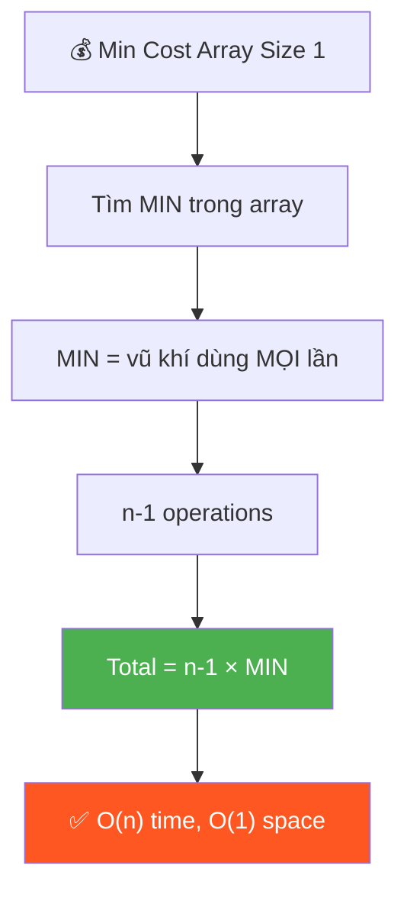
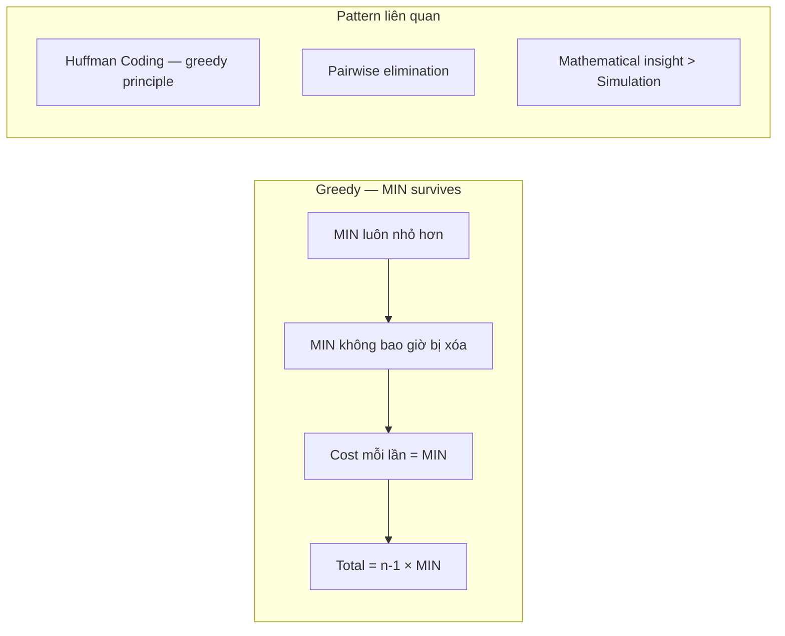

# 💰 Minimum Cost to Make Array Size 1 — GfG (Easy)

> 📖 Code: [Min Cost Array Size 1.js](./Min%20Cost%20Array%20Size%201.js)





---

## R — Repeat & Clarify

🧠 *"Luôn pair min với phần tử khác → xóa phần tử lớn hơn. Chi phí = min. Lặp n-1 lần!"*

> 🎙️ *"Given an array, repeatedly pick a pair and remove the larger one. Cost of each operation = the smaller value. Find minimum total cost to reduce array to size 1."*

### Clarification Questions

```
Q: Xóa phần tử nào?
A: Xóa phần tử LỚN HƠN trong pair

Q: Cost = gì?
A: Cost = phần tử NHỎ HƠN trong pair

Q: Tại sao greedy?
A: Luôn dùng MIN toàn cục làm "vũ khí" → cost mỗi lần bé nhất!
```

---

## E — Examples

```
VÍ DỤ 1: arr = [4, 3, 2]

  Greedy: luôn chọn min = 2!
    Pair (2, 4): xóa 4, cost = 2 → arr = [3, 2]
    Pair (2, 3): xóa 3, cost = 2 → arr = [2]
  Total = 2 + 2 = 4 ✅

  SAI nếu: Pair (3, 4): xóa 4, cost = 3 → arr = [3, 2]
           Pair (2, 3): xóa 3, cost = 2 → arr = [2]
           Total = 3 + 2 = 5 > 4 ❌

VÍ DỤ 2: arr = [3, 4]
  Pair (3, 4): xóa 4, cost = 3 → arr = [3]
  Total = 3 ✅
```

---

## A — Approach

```
💡 KEY INSIGHT:

  1. Phần tử MIN sẽ sống sót cuối cùng!
     (vì nó luôn NHỎ hơn → không bao giờ bị xóa)

  2. MIN được dùng trong MỌI operation!
     → n-1 operations, mỗi lần cost = min
     → Total = (n - 1) × min

  CHỨNG MINH:
    min luôn nhỏ hơn mọi phần tử khác
    → mỗi lần pair min với bất kỳ ai, min sống, ai đó chết
    → cost = min mỗi lần
    → cần n-1 lần xóa → (n-1) × min
```

---

## C — Code

```javascript
function minCost(arr) {
  const min = Math.min(...arr);
  return (arr.length - 1) * min;
}
```

### Trace: arr = [4, 3, 2]

```
  min = 2
  n = 3
  cost = (3 - 1) × 2 = 2 × 2 = 4 ✅
```

> 🎙️ *"The minimum element always survives since it's never the larger one. It's used in every removal, so total cost is simply (n-1) × min. O(n) to find min, O(1) space."*

---

## O — Optimize

```
  Time:  O(n) — chỉ cần tìm min
  Space: O(1)

  ⚠️ Đây là bài "trick" — nhìn phức tạp nhưng chỉ 1 dòng!
  Interview: giải thích CHỨNG MINH greedy quan trọng hơn code!
```

---

## T — Test

```
  [4, 3, 2]    → (3-1)×2 = 4     ✅
  [3, 4]       → (2-1)×3 = 3     ✅
  [1, 5, 7, 3] → (4-1)×1 = 3     ✅
  [10]         → (1-1)×10 = 0    ✅ Already size 1
  [1, 1, 1]    → (3-1)×1 = 2     ✅ All same
```

---

## 🗣️ Interview Script

> 🎙️ *"The key insight is that the minimum element never gets removed — it's always the smaller in any pair. So it's used as the cost in every single operation. We need n-1 operations to reduce to size 1, giving total cost = (n-1) × min. The proof is: any other strategy uses a larger value as cost at least once, which is strictly worse."*

### Pattern

```
  GREEDY — "MIN survives" pattern!

  Khi chỉ xóa phần tử LỚN HƠN:
    → Min LUÔN sống sót
    → Min LUÔN là cost
    → Total = (n-1) × min

  Liên kết: tương tự Huffman Coding greedy principle
```
