# 💰 Minimum Cost to Make Array Size 1 — GfG (Easy)

> 📖 Code: [Min Cost Array Size 1.js](./Min%20Cost%20Array%20Size%201.js)

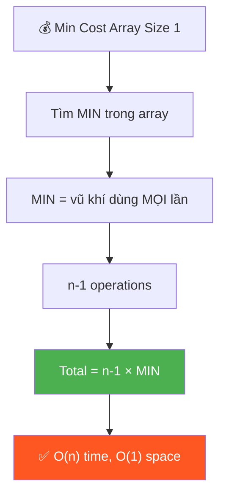

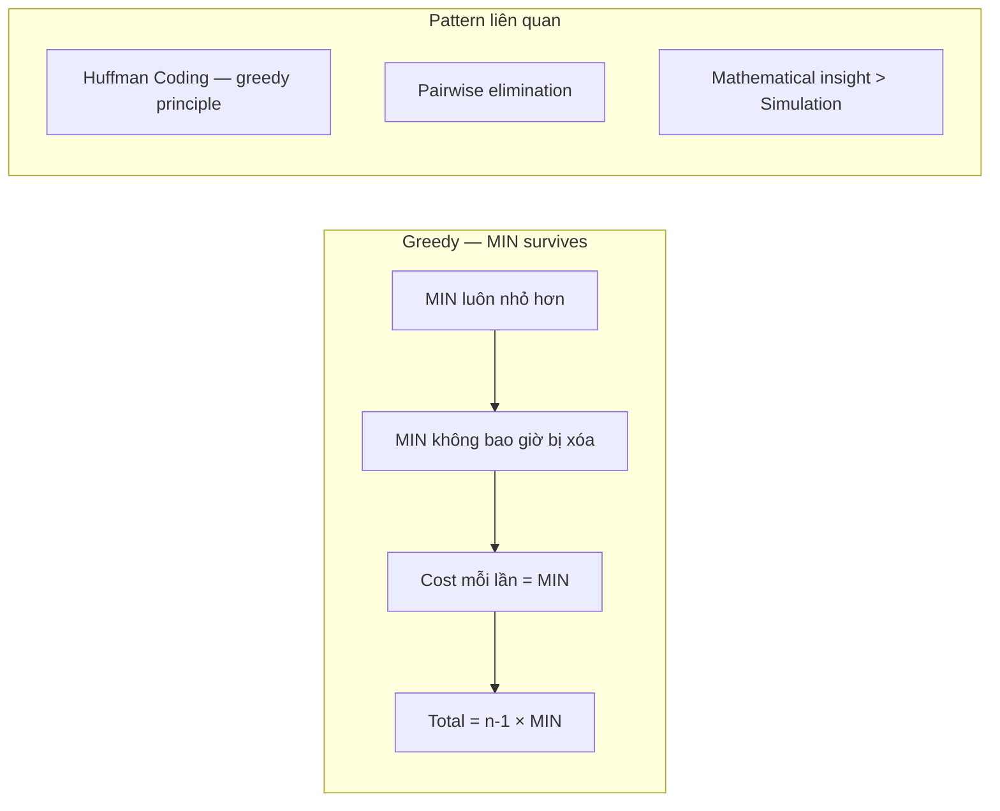

---

## R — Repeat & Clarify

🧠 *"Luôn pair min với phần tử khác → xóa phần tử lớn hơn. Chi phí = min. Lặp n-1 lần!"*

> 🎙️ *"Given an array, repeatedly pick a pair and remove the larger one. Cost of each operation = the smaller value. Find minimum total cost to reduce array to size 1."*

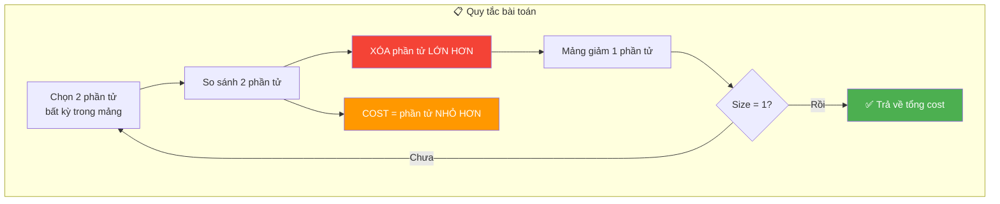

### Clarification Questions

```
Q: Xóa phần tử nào?
A: Xóa phần tử LỚN HƠN trong pair.
   Nếu 2 phần tử bằng nhau → xóa 1 cái bất kỳ.

Q: Cost = gì?
A: Cost = phần tử NHỎ HƠN trong pair (phần tử SỐNG SÓT).

Q: Chọn pair NHƯ THẾ NÀO?
A: Bất kỳ pair nào! Tùy ta chọn → tìm chiến thuật TỐI ƯU.

Q: Bao nhiêu operations?
A: ĐÚNG n-1 operations (mỗi lần xóa 1, từ n xuống 1).

Q: Input constraints?
A: n ≥ 1, arr[i] ≥ 1 (positive integers)

Q: Tại sao greedy?
A: Luôn dùng MIN toàn cục làm "vũ khí" → cost mỗi lần bé nhất!
   Greedy proof: cost mỗi lần ≥ min → lower bound = (n-1) × min.
```

### Phân tích Input/Output

```
  ┌──────────────────────────────────────────────────────────────┐
  │  INPUT                                                       │
  │  • arr: mảng các số nguyên dương, n ≥ 1                     │
  │  • Không cần sorted                                          │
  │  • Có thể có phần tử trùng lặp                              │
  │                                                              │
  │  OUTPUT                                                      │
  │  • Một số nguyên: tổng chi phí TỐI THIỂU                   │
  │  • Luôn ≥ 0 (không có case impossible)                      │
  │  • Khi n = 1 → output = 0                                   │
  │                                                              │
  │  CONSTRAINTS QUAN TRỌNG                                      │
  │  • Mỗi op: chọn 2 phần tử BẤT KỲ (tự do chọn)             │
  │  • Xóa LARGER, cost = SMALLER                               │
  │  • Phần tử bị xóa KHÔNG dùng lại được                      │
  │  • Phần tử sống sót VẪN ở trong mảng                       │
  └──────────────────────────────────────────────────────────────┘
```

---

## E — Examples

### VÍ DỤ 1: arr = [4, 3, 2] — Cơ bản

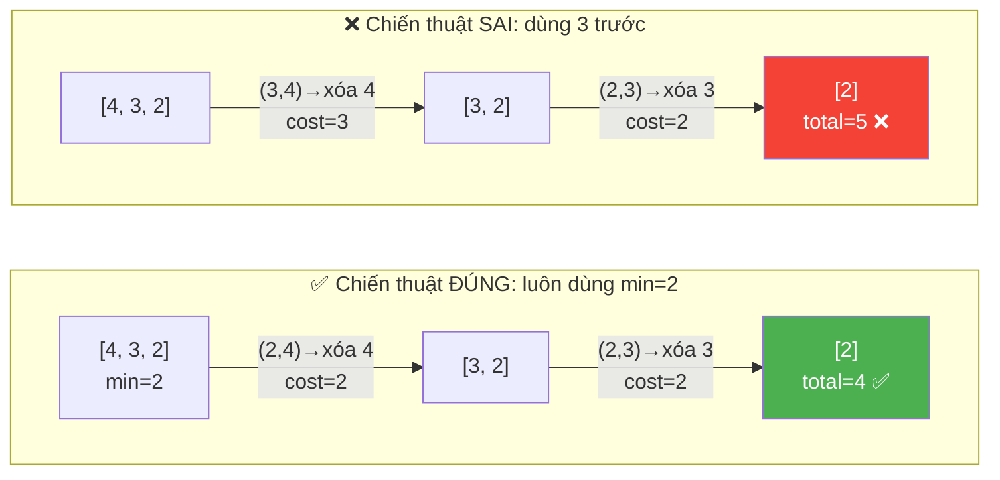

```
VÍ DỤ 1: arr = [4, 3, 2]

  ✅ Chiến thuật ĐÚNG — Luôn dùng min = 2:
    Trận 1: Pair (2, 4) → xóa 4, cost = 2 → arr = [3, 2]
    Trận 2: Pair (2, 3) → xóa 3, cost = 2 → arr = [2]
    Total = 2 + 2 = 4 ✅
    → Công thức: (3-1) × 2 = 4 ✅ KHỚP!

  ❌ Chiến thuật SAI — Dùng 3 trước:
    Trận 1: Pair (3, 4) → xóa 4, cost = 3 → arr = [3, 2]
    Trận 2: Pair (2, 3) → xóa 3, cost = 2 → arr = [2]
    Total = 3 + 2 = 5 > 4 ❌ ĐẮT HƠN 1!

  💡 Vì sao SAI đắt hơn?
    Trận 1 dùng cost=3 thay vì cost=2 → lãng phí thêm 1!
```

### VÍ DỤ 2: arr = [3, 4] — Mảng 2 phần tử

```
  min = 3, n = 2
  Chỉ có 1 cách: Pair (3, 4) → xóa 4, cost = 3
  Total = 3
  → Công thức: (2-1) × 3 = 3 ✅

  📌 Với n=2, không có lựa chọn chiến thuật!
     Chỉ có 1 pair → cost = min(pair) = min(arr)
```

### VÍ DỤ 3: arr = [1, 5, 7, 3] — Mảng 4 phần tử

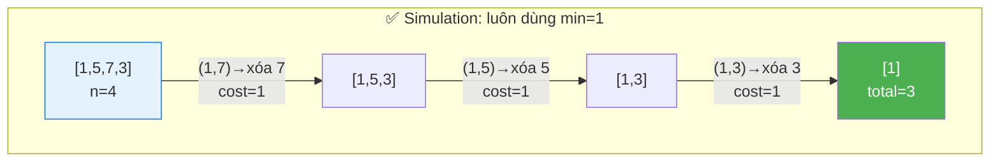

```
  min = 1, n = 4
  Trận 1: (1,7) → xóa 7, cost=1 → [1,5,3]
  Trận 2: (1,5) → xóa 5, cost=1 → [1,3]
  Trận 3: (1,3) → xóa 3, cost=1 → [1]
  Total = 1+1+1 = 3
  → Công thức: (4-1) × 1 = 3 ✅

  🧠 Khi min=1, total cost = n-1! (đẹp nhất có thể)
```

### VÍ DỤ 4: arr = [5, 5, 5, 5] — Tất cả bằng nhau

```
  min = 5, n = 4
  Trận 1: (5,5) → xóa 1 cái, cost=5 → [5,5,5]
  Trận 2: (5,5) → xóa 1 cái, cost=5 → [5,5]
  Trận 3: (5,5) → xóa 1 cái, cost=5 → [5]
  Total = 5+5+5 = 15
  → Công thức: (4-1) × 5 = 15 ✅

  📌 Khi tất cả bằng nhau: không có cách nào rẻ hơn!
     Mọi chiến thuật đều cho cùng kết quả.
```

### VÍ DỤ 5: arr = [10] — Edge case: mảng 1 phần tử

```
  min = 10, n = 1
  Đã là size 1! Không cần operation nào.
  → Công thức: (1-1) × 10 = 0 ✅
```

### So sánh TẤT CẢ chiến thuật cho arr = [4, 3, 2]

```
  ┌────────────────────────────────────────────────────────────────────┐
  │  Chiến thuật          │ Trận 1        │ Trận 2        │ Total    │
  ├────────────────────────────────────────────────────────────────────┤
  │  ✅ min trước (2→4,   │ (2,4) cost=2  │ (2,3) cost=2  │ 4 ✅    │
  │     2→3)              │ xóa 4         │ xóa 3         │ TỐI ƯU! │
  ├────────────────────────────────────────────────────────────────────┤
  │  ❌ 3 trước (3→4,     │ (3,4) cost=3  │ (2,3) cost=2  │ 5       │
  │     2→3)              │ xóa 4         │ xóa 3         │         │
  ├────────────────────────────────────────────────────────────────────┤
  │  ❌ 2→3 trước (2→3,   │ (2,3) cost=2  │ (2,4) cost=2  │ 4       │
  │     2→4)              │ xóa 3         │ xóa 4         │ = ✅    │
  ├────────────────────────────────────────────────────────────────────┤
  │                                                                    │
  │  📌 Bất kỳ thứ tự nào mà LUÔN dùng min đều cho kết quả TỐI ƯU! │
  │     Thứ tự loại KHÔNG quan trọng, miễn min luôn là 1 trong pair! │
  └────────────────────────────────────────────────────────────────────┘
```

---

## A — Approach

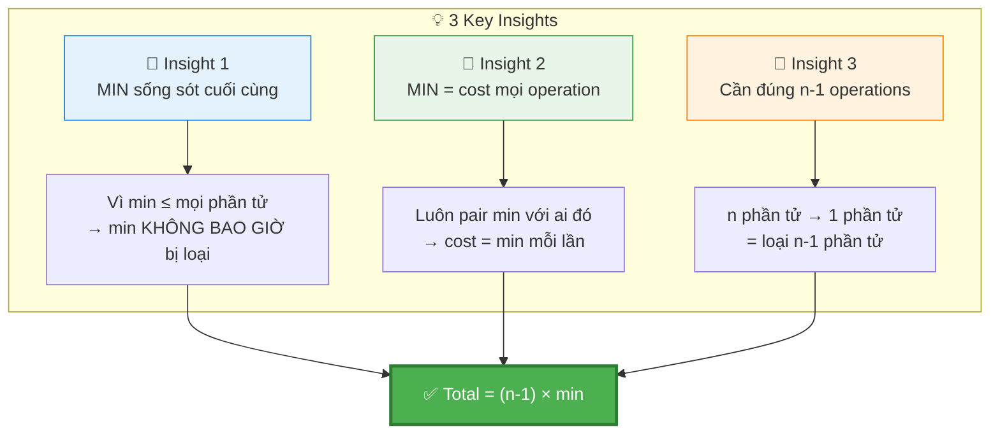

```
💡 KEY INSIGHT:

  1. Phần tử MIN sẽ sống sót cuối cùng!
     (vì nó luôn NHỎ hơn → không bao giờ bị xóa)

     Ví dụ: arr = [8, 3, 5, 1, 9]
       1 ≤ 3? ✅ → 1 sống khi pair với 3
       1 ≤ 5? ✅ → 1 sống khi pair với 5
       1 ≤ 8? ✅ → 1 sống khi pair với 8
       1 ≤ 9? ✅ → 1 sống khi pair với 9
       → 1 LUÔN sống! Không ai "giết" được 1!

  2. MIN được dùng trong MỌI operation!
     → n-1 operations, mỗi lần cost = min
     → Total = (n - 1) × min

  3. CHỨNG MINH TỐI ƯU (Exchange Argument):
     Giả sử có chiến thuật S* tốt hơn:
       → S* phải có ít nhất 1 trận KHÔNG dùng min
       → Trận đó cost = x > min (vì x ≥ min luôn đúng, = chỉ khi x = min)
       → Nếu thay x bằng min: cost giảm (hoặc bằng)
       → S* KHÔNG thể tốt hơn chiến thuật luôn dùng min!
       → Mâu thuẫn! → Greedy là TỐI ƯU!

  📌 Công thức cuối: Total = (n - 1) × min
     Chỉ cần tìm min và nhân — XONG!
```

### Tại sao bài này là "trick question"?

```
  Bề ngoài: Bài hỏi about pairwise elimination → tưởng cần DP hoặc simulation
  Thực tế:  Chỉ cần 1 PHÉP TÍNH → (n-1) × min

  ┌───────────────────────────────────────────────────────┐
  │  Cách TƯỞNG phải làm    │  Cách THỰC SỰ cần làm     │
  ├───────────────────────────────────────────────────────┤
  │  Simulate từng bước     │  Tìm min → nhân (n-1)     │
  │  DP tối ưu thứ tự       │  KHÔNG cần DP!             │
  │  Heap / Priority Queue  │  KHÔNG cần sorted!         │
  │  Thử mọi permutation    │  1 dòng code!              │
  └───────────────────────────────────────────────────────┘

  🧠 Interviewer muốn test: Bạn có NHÌN THẤY insight không?
     Hay bạn nhảy vào code ngay mà không phân tích?
```

---

## C — Code

### Version 1: Ngắn gọn nhất (phỏng vấn)

```javascript
function minCost(arr) {
  const min = Math.min(...arr);
  return (arr.length - 1) * min;
}
```

### Version 2: An toàn cho mảng lớn (production)

```javascript
function minCost(arr) {
  // Dùng for loop thay Math.min(...arr) để tránh stack overflow
  let min = arr[0];
  for (let i = 1; i < arr.length; i++) {
    if (arr[i] < min) min = arr[i];
  }
  return (arr.length - 1) * min;
}
```

### Version 3: Edge-case aware (defensive)

```javascript
function minCost(arr) {
  if (!arr || arr.length <= 1) return 0;

  let min = arr[0];
  for (let i = 1; i < arr.length; i++) {
    if (arr[i] < min) min = arr[i];
  }
  return (arr.length - 1) * min;
}
```

```
  📌 Khi nào dùng version nào?

  Version 1: Phỏng vấn (ngắn nhất, rõ ý nhất)
  Version 2: Production (an toàn với n > 100k)
  Version 3: Defensive (handle null, undefined, empty array)

  ⚠️ Mention cả 3 trong phỏng vấn để impress:
  "I'll write the concise version first, but in production
   I'd use a for loop to avoid stack overflow with large arrays."
```

### Trace nhiều test cases

```
  ┌──────────────────────────────────────────────────────────────────┐
  │  Input              │ min   │ n    │ (n-1)×min     │ Output     │
  ├──────────────────────────────────────────────────────────────────┤
  │  [4, 3, 2]          │ 2     │ 3    │ (3-1)×2 = 4   │ 4 ✅       │
  │  [3, 4]             │ 3     │ 2    │ (2-1)×3 = 3   │ 3 ✅       │
  │  [1, 5, 7, 3]       │ 1     │ 4    │ (4-1)×1 = 3   │ 3 ✅       │
  │  [10]               │ 10    │ 1    │ (1-1)×10 = 0  │ 0 ✅       │
  │  [5, 5, 5, 5]       │ 5     │ 4    │ (4-1)×5 = 15  │ 15 ✅      │
  │  [1, 1, 1]          │ 1     │ 3    │ (3-1)×1 = 2   │ 2 ✅       │
  │  [100, 1, 100, 100] │ 1     │ 4    │ (4-1)×1 = 3   │ 3 ✅       │
  └──────────────────────────────────────────────────────────────────┘
```

> 🎙️ *"The minimum element always survives since it's never the larger one. It's used in every removal, so total cost is simply (n-1) × min. O(n) to find min, O(1) space."*

---

## O — Optimize

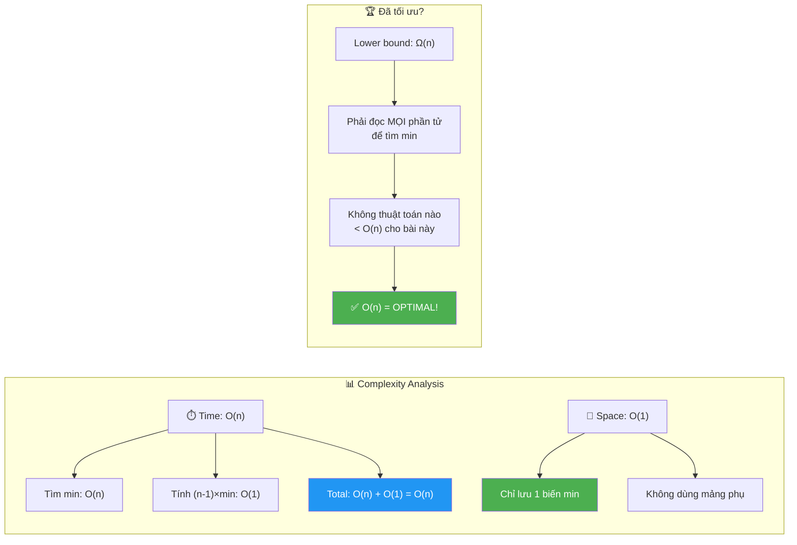

```
  Time:  O(n) — chỉ cần tìm min (1 pass)
  Space: O(1) — chỉ lưu biến min và kết quả

  ĐÃ TỐI ƯU NHẤT vì:
    → Phải đọc MỌI phần tử ít nhất 1 lần (để biết min)
    → Ω(n) là lower bound → O(n) đã đạt!
    → Không có thuật toán nào < O(n) cho bài này!

  ⚠️ Đây là bài "trick" — nhìn phức tạp nhưng chỉ 1-2 dòng!
  Interview: giải thích CHỨNG MINH greedy quan trọng hơn code!

  ┌──────────────────────────────────────────────────────────┐
  │  Comparison với các cách khác:                           │
  ├──────────────────────────────────────────────────────────┤
  │  Simulate while loop:  O(n²)  → thừa!                  │
  │  Sort + formula:       O(n log n)  → sort thừa!         │
  │  Formula trực tiếp:    O(n)   → TỐI ƯU! ✅              │
  │  Brute force all:      O(n!)  → cực chậm!               │
  └──────────────────────────────────────────────────────────┘
```

---

## T — Test

```
  [4, 3, 2]    → (3-1)×2 = 4     ✅  Basic
  [3, 4]       → (2-1)×3 = 3     ✅  Two elements
  [1, 5, 7, 3] → (4-1)×1 = 3     ✅  Min = 1
  [10]         → (1-1)×10 = 0    ✅  Already size 1
  [1, 1, 1]    → (3-1)×1 = 2     ✅  All same
  [5, 5, 5, 5] → (4-1)×5 = 15    ✅  All same (large)
  [2, 2, 7, 2] → (4-1)×2 = 6     ✅  Duplicate mins
  [9, 8, 7, 1] → (4-1)×1 = 3     ✅  Min ở cuối
  [1, 100000]  → (2-1)×1 = 1     ✅  Extreme diff
```

### Edge Cases Chi Tiết

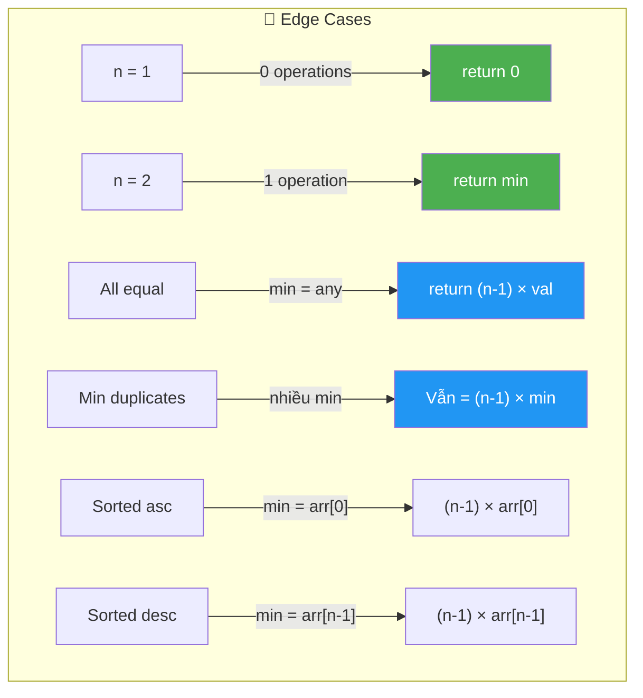

```
  ┌───────────────────────────────────────────────────────────────────────┐
  │  Edge Case            │ Input           │ Output │ Tại sao?          │
  ├───────────────────────────────────────────────────────────────────────┤
  │  Mảng 1 phần tử       │ [10]            │ 0      │ 0 operations!     │
  │  Mảng 2 phần tử       │ [3, 7]          │ 3      │ 1 op, cost=min    │
  │  Tất cả bằng nhau     │ [5, 5, 5, 5]    │ 15     │ min=5, (4-1)×5    │
  │  Min trùng lặp        │ [2, 2, 7, 2]    │ 6      │ min=2, (4-1)×2    │
  │  Min ở cuối           │ [9, 8, 7, 1]    │ 3      │ Vị trí ko ảnh     │
  │                       │                 │        │ hưởng!            │
  │  Chênh lệch cực lớn   │ [1, 10⁶]       │ 1      │ (2-1)×1           │
  │  Mảng rất lớn         │ n=10⁶, min=1    │ 999999 │ O(n) vẫn ok       │
  └───────────────────────────────────────────────────────────────────────┘

  ⚠️ CHÚ Ý QUAN TRỌNG:
     • Bài này KHÔNG có case return -1 (impossible)
     • Luôn có lời giải miễn n ≥ 1
     • Kết quả = 0 khi và chỉ khi n = 1
     • Thứ tự phần tử KHÔNG ảnh hưởng kết quả
     • Vị trí của min KHÔNG ảnh hưởng kết quả
```

---

## 🗣️ Interview Script

### 🎙️ Think Out Loud — Mô phỏng phỏng vấn thực

> ⚠️ Script này dạy cách **NÓI**, không phải cách CODE.
> Mỗi đoạn = cách bạn **PHÁT BIỂU** trong phỏng vấn thực!

```
  ╔══════════════════════════════════════════════════════════════╗
  ║  🕐 FULL INTERVIEW SIMULATION — 1h30 (90 phút)             ║
  ║                                                              ║
  ║  00:00-05:00  Introduction + Icebreaker         (5 min)     ║
  ║  05:00-45:00  Problem Solving                   (40 min)    ║
  ║  45:00-60:00  Deep Technical Probing            (15 min)    ║
  ║  60:00-75:00  Variations + Extensions           (15 min)    ║
  ║  75:00-85:00  System Design at Scale            (10 min)    ║
  ║  85:00-90:00  Behavioral + Q&A                  (5 min)     ║
  ╚══════════════════════════════════════════════════════════════╝
```

```
  ╔══════════════════════════════════════════════════════════════╗
  ║  PART 1: INTRODUCTION (00:00 — 05:00)                       ║
  ╚══════════════════════════════════════════════════════════════╝

  👤 "Tell me about yourself and a time you found
      a dramatically simpler solution than expected."

  🧑 "I'm a frontend engineer with [X] years of experience.
      A relevant example: I was working on a cloud resource
      decommissioning pipeline. We had n virtual machines
      that needed to be consolidated down to 1, and each
      merge operation had a cost — the smaller of the
      two resource allocations being combined.

      My team initially built a simulation engine that
      tried different merge orderings using a priority queue.
      It was O of n log n with significant bookkeeping.

      Then I realized something: the VM with the SMALLEST
      allocation never gets removed — it's always the
      smaller in any pair. So it participates in EVERY merge.
      That means every single operation costs exactly
      the minimum allocation, and there are exactly n minus 1
      operations.

      Total cost: n minus 1 times the minimum.
      The entire simulation was replaced by ONE line:
      find the min and multiply.

      That's the same insight needed for this problem."

  👤 "That's a great example of resisting complexity.
      Let's see it in action."
```

```
  ╔══════════════════════════════════════════════════════════════╗
  ║  PART 2: PROBLEM SOLVING (05:00 — 45:00)                   ║
  ╚══════════════════════════════════════════════════════════════╝

  ──────────────── 05:00 — Clarify (5 phút) ────────────────

  👤 "Given an array, repeatedly pick any pair, remove the
      larger element. The cost of each operation is the
      smaller element. Find the minimum total cost to
      reduce the array to size 1."

  🧑 "Let me make sure I understand the mechanics precisely.

      I pick ANY two elements from the array.
      I compare them: the LARGER one gets removed.
      The cost I pay for this operation is the SMALLER one
      — which is also the one that SURVIVES.

      If two elements are equal, I remove either one,
      and the cost is that shared value.

      I repeat until only one element remains.

      Key observations right away:

      Starting with n elements and removing one per operation,
      I need EXACTLY n minus 1 operations. This is like a
      single-elimination tournament: n teams, n minus 1 games,
      one champion.

      The output is the TOTAL cost across all n minus 1 operations.
      I need to MINIMIZE this total.

      Edge case: if n is 1, the array is already size 1.
      Zero operations needed, total cost is 0.

      The array has positive integers, n is at least 1."

  ──────────────── 10:00 — First Instinct Trap (3 phút) ────────────

  🧑 "Before I jump to a solution, let me note what this
      problem LOOKS like versus what it IS.

      It LOOKS like it needs:
      Simulation — model each step, track the array.
      Dynamic Programming — optimize the pairing order.
      Priority Queue — always pick the optimal pair.
      Permutation search — try all possible orderings.

      But I want to pause and think about what element
      survives at the end, and what that implies for the cost."

  ──────────────── 13:00 — The Key Insight (5 phút) ────────────────

  🧑 "Here's the critical observation.

      Which element survives all n minus 1 operations?
      The MINIMUM element.

      Why? In any pair involving the minimum, the minimum
      is ALWAYS the smaller value — by definition.
      So the minimum is never removed. It always survives.

      Now, CAN I always pair the minimum with someone else?
      Yes! At every step, the minimum is still in the array.
      I'm free to choose any pair, so I can ALWAYS pick
      the minimum as one of the two elements.

      What's the cost when I pair the minimum with any
      other element x? The cost is min of the pair, which
      is the minimum of the array — since the array minimum
      is at most x for any x.

      So every single operation costs exactly the minimum
      of the original array.

      How many operations? n minus 1.

      Total cost: n minus 1 times the minimum.

      That's it. No simulation. No DP. No heap.
      Just find the min and multiply.

      Think of it like a CHAMPION gladiator in an arena.
      The weakest fighter — with the lowest cost to hire —
      CAN'T lose any fight because the loser is always
      the one with HIGHER value. So this champion fights
      in EVERY round, and I pay the champion's fee
      each time. n minus 1 rounds, same fee each round."

  ──────────────── 18:00 — Greedy Proof (5 phút) ────────────────

  👤 "Can you prove this is optimal?"

  🧑 "Yes — two arguments, one intuitive and one formal.

      INTUITIVE — Lower Bound:
      In ANY operation, I pick two elements and pay
      the SMALLER of the two. The smallest possible cost
      per operation is the global minimum — because every
      element is at least the minimum.
      So each operation costs at least min.
      I need n minus 1 operations.
      Total cost is AT LEAST n minus 1 times min.

      My strategy achieves EXACTLY n minus 1 times min.
      My strategy matches the lower bound.
      Therefore, it's OPTIMAL.

      FORMAL — Exchange Argument:
      Suppose there exists a strategy S star that's
      strictly better — total cost less than n minus 1 times min.
      S star performs n minus 1 operations.
      In at least one operation, S star must NOT use the minimum
      as one of the pair — otherwise, all operations cost min,
      giving total n minus 1 times min, contradicting
      S star being strictly better.

      But if S star doesn't use min in some operation,
      the cost of that operation is min of some pair
      that doesn't include the global min. That cost is
      at least min — because every element is at least min.
      It's possibly HIGHER.

      Replacing that operation with one that uses the global min
      gives cost equal to min — EQUAL to or LESS than the
      original cost. So S star can't beat our strategy.

      Contradiction. Our greedy is optimal."

  ──────────────── 23:00 — Trace bằng LỜI (4 phút) ────────────────

  🧑 "Let me trace with arr equal [4, 3, 2].
      n equal 3. min equal 2.

      Strategy: always pair min equal 2 with another element.

      Operation 1: pair (2, 4). 4 is larger, remove it.
      Cost equal 2. Array becomes [3, 2].

      Operation 2: pair (2, 3). 3 is larger, remove it.
      Cost equal 2. Array becomes [2].

      Total: 2 plus 2 equal 4.
      Formula: n minus 1 times min equal 2 times 2 equal 4. Matches!

      Let me verify with a WRONG strategy to show it's worse.
      What if I pair 3 and 4 first?

      Operation 1: pair (3, 4). Remove 4. Cost equal 3.
      Array becomes [3, 2].
      Operation 2: pair (2, 3). Remove 3. Cost equal 2.
      Array becomes [2].
      Total: 3 plus 2 equal 5. That's WORSE — 5 vs 4.

      The wrong strategy paid 3 in the first round instead
      of 2. That extra 1 is wasted because I COULD have
      used the min for the same effect."

  🧑 "Another trace: arr equal [1, 5, 7, 3]. n equal 4. min equal 1.

      Operations 1-3: pair 1 with 7, then 5, then 3.
      Each costs 1 because 1 is always the smaller.
      Total: 1 plus 1 plus 1 equal 3.
      Formula: 3 times 1 equal 3. Correct!

      When min is 1, the total cost is always n minus 1.
      Beautiful."

  ──────────────── 27:00 — Write Code (3 phút) ────────────────

  🧑 "The code is almost embarrassingly simple.

      [Vừa viết vừa nói:]

      Find the minimum of the array.
      Return n minus 1 times the minimum.

      That's two lines of actual logic.

      For the interview version, I'd write:
      const min equal Math dot min spread arr.
      return arr dot length minus 1 times min.

      But I should mention: Math dot min with the spread
      operator converts the array into function arguments.
      JavaScript engines have a limit on argument count —
      typically around 100,000. For very large arrays,
      this causes a stack overflow.

      For production, I'd use a simple for loop:
      start with min equal arr at 0, then iterate from index 1,
      updating min whenever I find a smaller element.

      Same O of n time, but the for loop version is safe
      for arrays of any size."

  ──────────────── 30:00 — Edge Cases (3 phút) ────────────────

  🧑 "Edge cases.

      Single element: [10]. n minus 1 equal 0 operations.
      Total cost: 0. Correct — nothing to do.

      Two elements: [3, 7]. One operation: pair (3, 7),
      remove 7, cost 3. Formula: 1 times 3 equal 3.

      All equal: [5, 5, 5, 5]. min equal 5.
      Every pair costs 5 regardless of choices.
      Total: 3 times 5 equal 15. No strategy can do better
      because every operation costs exactly 5.

      Duplicate minimums: [2, 2, 7, 2]. min equal 2.
      Total: 3 times 2 equal 6. The duplicates don't matter —
      we still use 2 as the cost every round.

      Large spread: [1, 1000000]. Total: 1 times 1 equal 1.
      The huge gap doesn't affect the cost — only the min matters."

  ──────────────── 33:00 — Does order matter? (3 phút) ────────────

  👤 "Does the ORDER in which you pair elements matter?"

  🧑 "No! As long as I always include the minimum in every pair,
      the order of WHICH other element I pair with doesn't matter.

      In arr equal [4, 3, 2]:
      Order A: remove 4 first, then 3. Cost: 2 plus 2 equal 4.
      Order B: remove 3 first, then 4. Cost: 2 plus 2 equal 4.
      Same total!

      This is because each operation has the same cost —
      the minimum. n minus 1 operations at cost min each
      gives the same total regardless of sequence.

      This is different from problems like Huffman Coding
      where the merge order DOES matter because the cost
      of each merge changes based on what you've already merged."

  ──────────────── 36:00 — Why this is a 'trick question' (3 phút) ──

  👤 "This seems too simple. What's the interviewer
      really testing?"

  🧑 "Great question. This is a TRICK QUESTION in disguise.

      The interviewer tests whether I RESIST the urge
      to immediately simulate or code a complex solution.

      Many candidates see 'pairwise elimination' and jump to:
      Priority Queue with O of n log n.
      DP over subsets with exponential time.
      While loop simulation with O of n squared.

      But the CORRECT response is to PAUSE, analyze the
      problem structure, and recognize that one line suffices.

      What the interviewer values:
      1. Can you identify when a problem collapses to a formula?
      2. Can you PROVE the formula is correct — not just guess?
      3. Can you articulate WHY simpler is better?

      I always say: 'Before coding, let me think about what
      element survives and what that implies for the cost.'
      That statement alone shows problem-solving maturity."

  ──────────────── 39:00 — Complexity (3 phút) ────────────────

  🧑 "Time: O of n. I need one pass to find the minimum.
      The multiplication is O of 1. Total: O of n.

      Space: O of 1. One variable for the minimum.
      No extra arrays, no heap, no recursion stack.

      Is this optimal? Yes — I must read every element
      at least once to find the minimum. There's no way
      to determine the answer without looking at all values.
      Omega of n is the lower bound. My algorithm meets it.

      Compare this to alternatives:
      Simulation while loop: O of n squared — finds the pair,
      removes, repeats. Completely unnecessary.
      Sort then formula: O of n log n — sorting just to find
      the min is overkill.
      All permutations: O of n factorial — absurd.
      Direct formula: O of n — optimal."

  ──────────────── 42:00 — Math.min pitfall (3 phút) ────────────────

  👤 "Tell me more about the Math.min stack overflow."

  🧑 "Math dot min accepts individual ARGUMENTS, not an array.
      When I write Math dot min spread arr, the spread operator
      expands the array into function arguments:
      Math dot min of arr at 0 comma arr at 1 comma dot dot dot.

      JavaScript engines allocate stack frames for arguments.
      The maximum varies by engine, but V8 and SpiderMonkey
      typically cap around 65,536 to 125,000 arguments.

      For an array of 200,000 elements, spread causes
      a RangeError: Maximum call stack size exceeded.

      The fix is trivial — a manual for loop:
      let min equal arr at 0.
      for i from 1 to n minus 1:
      if arr at i is less than min, update min.

      Same result, same time complexity, but no stack risk.

      In an interview, mentioning this unprompted shows
      production awareness. I'd say: 'I'll use the concise
      version for clarity, but in production I'd use a for loop
      to handle arrays of any size.'"
```

```
  ╔══════════════════════════════════════════════════════════════╗
  ║  PART 3: DEEP TECHNICAL PROBING (45:00 — 60:00)            ║
  ╚══════════════════════════════════════════════════════════════╝

  ──────────────── 45:00 — Tournament analogy (4 phút) ────────────────

  👤 "You mentioned a tournament. Elaborate."

  🧑 "This problem is a SINGLE-ELIMINATION TOURNAMENT.

      n players enter. Each round, two players compete.
      The loser — the larger value — is eliminated.
      The winner — the smaller value — continues.
      After n minus 1 matches, one champion remains.

      My strategy is: always have the CHAMPION — the minimum —
      fight in every match. The champion never loses
      because they're the smallest.

      The cost of each match is the winner's value —
      always the minimum. So total tournament cost
      equals n minus 1 times the minimum.

      This maps to: in a single-elimination bracket with
      n teams, exactly n minus 1 games are played.
      This is a fundamental combinatorial fact —
      each game eliminates exactly one team,
      and n minus 1 teams must be eliminated."

  ──────────────── 49:00 — What if min appears multiple times? (3 phút)

  👤 "What if the minimum appears more than once?"

  🧑 "Doesn't change the answer!

      If arr equal [2, 5, 2, 8], min equal 2.
      n equal 4, so total equal 3 times 2 equal 6.

      I can use EITHER copy of 2 as the champion.
      Or I can alternate — use the first 2 for one match,
      the second 2 for another. The cost is still 2 per match.

      Actually, something interesting happens when two copies
      of min are paired with EACH OTHER.
      Pair (2, 2): both are 'min value.' One gets removed.
      Cost equal 2. The surviving 2 continues as champion.

      The formula still holds because the cost per operation
      is still min equal 2, and we still need n minus 1 operations."

  ──────────────── 52:00 — Formal lower bound argument (4 phút) ────

  👤 "Walk me through the lower bound proof more carefully."

  🧑 "I want to show that ANY strategy — not just ours —
      must pay at least n minus 1 times min.

      Claim: every operation costs at least min.
      Proof: in each operation, I pick two elements a and b.
      The cost is min of a and b. Since both a and b are
      elements of the array, both are at least the global
      minimum. So min of a and b is at least the global minimum.

      Since I need exactly n minus 1 operations, and each
      costs at least min, the total is at least n minus 1 times min.

      Our strategy achieves EXACTLY n minus 1 times min.

      Lower bound equal upper bound implies our strategy is optimal.

      This is the DUAL BOUND technique: establish a lower bound
      on any solution, then exhibit a strategy that matches it.
      When they meet, optimality is proven.

      This technique appears everywhere in algorithm design:
      information-theoretic lower bounds for sorting,
      adversarial arguments for comparison-based algorithms,
      and LP relaxation bounds for combinatorial optimization."

  ──────────────── 56:00 — What if I can't choose freely? (4 phút) ──

  👤 "What if you can only pair ADJACENT elements?"

  🧑 "That changes the problem completely!

      If I can only pair adjacent elements, the minimum
      might not be able to reach every other element directly.
      It can only fight its immediate neighbors.

      For example, arr equal [3, 1, 5]. With free choice,
      I pair 1 with 3, then 1 with 5. Total: 2.

      With adjacency constraint:
      Option A: pair (3, 1), remove 3, cost 1. arr equal [1, 5].
      Then pair (1, 5), remove 5, cost 1. Total: 2.
      Same! Because 1 is adjacent to 3, and after removing 3,
      1 becomes adjacent to 5.

      But consider arr equal [3, 5, 1].
      Option A: pair (3, 5), remove 5, cost 3. arr equal [3, 1].
      Then pair (3, 1), remove 3, cost 1. Total: 4.
      Option B: pair (5, 1), remove 5, cost 1. arr equal [3, 1].
      Then pair (3, 1), remove 3, cost 1. Total: 2.

      So with adjacency, the ORDER matters! I should work
      toward bringing the minimum adjacent to the elements
      I want to remove. This becomes a DP or greedy problem
      on intervals — much harder."
```

```
  ╔══════════════════════════════════════════════════════════════╗
  ║  PART 4: VARIATIONS (60:00 — 75:00)                         ║
  ╚══════════════════════════════════════════════════════════════╝

  ──────────────── 60:00 — Remove SMALLER instead (4 phút) ────────────

  👤 "What if the rule is reversed — remove the SMALLER
      element, cost is the LARGER?"

  🧑 "Completely different problem!

      Now the MAXIMUM survives — because the larger always wins.
      And the cost of each operation is the LARGER of the pair.

      But here's the twist: the cost CHANGES between operations.
      When the maximum pairs with someone and eliminates them,
      the maximum's value stays the same, but the element it
      fights NEXT might be different.

      Actually, wait — by the same logic, I can always pair
      the maximum with any element. The cost is always max.
      n minus 1 operations at cost max each.
      Total: n minus 1 times max.

      Hmm — but that seems too high. Can I do better?
      No! Because every operation costs at least the smaller
      of the pair... wait, the cost is the LARGER.

      Let me reconsider. The cost is the LARGER of the pair.
      If I pair the two smallest elements, the cost is their max —
      which is small. By removing small elements first
      and keeping them away from the maximum, I might get
      a lower total.

      Actually, regardless of strategy, each of the n minus 1
      operations has cost equal to the larger of its pair.
      To minimize the sum, I should pair the max with
      all others — cost is always max. Total: n minus 1 times max.

      Wait — or I should pair SMALL elements together to get
      smaller costs? Let me think with an example.

      arr equal [1, 2, 3]. Pair max with others:
      pair (3, 1), remove 1, cost 3. pair (3, 2), remove 2, cost 3.
      Total: 6.

      Pair small together first:
      pair (1, 2), remove 1, cost 2. pair (2, 3), remove 2, cost 3.
      Total: 5. That's BETTER!

      So the reversed version is NOT n minus 1 times max.
      It's more complex — the order DOES matter.
      This would need a greedy or DP approach.

      This contrast highlights why the original problem is
      special: the 'remove larger, cost is smaller' rule
      makes one element a permanent champion, collapsing
      the problem to a formula."

  ──────────────── 64:00 — Cost equals sum / Huffman (4 phút) ────────

  👤 "What if we MERGE two elements — replacing both with
      their sum — and the cost is their sum?"

  🧑 "That's HUFFMAN CODING!

      The problem becomes: repeatedly merge two elements,
      cost equals their sum, minimize total cost.

      Here the order matters tremendously.
      The greedy strategy is: always merge the two SMALLEST
      elements first. This is because merged elements
      participate in FUTURE merges, accumulating cost.
      Merging small elements first means they accumulate
      at lower rates.

      Implementation: Min-Heap. Extract two minima,
      merge them, push the sum back. Repeat until one
      element remains.

      Time: O of n log n. The heap operations dominate.

      Our problem — cost equals the smaller — is a DEGENERATE
      case of pairwise merging. Because the smaller element
      SURVIVES unchanged — it doesn't grow. So future costs
      aren't affected by past choices. That's why the order
      doesn't matter and we can compute the answer directly."

  ──────────────── 68:00 — Cost equals absolute difference (3 phút) ──

  👤 "What if the cost is the absolute difference?"

  🧑 "Cost equals absolute difference of the pair,
      and we remove either element.

      This is related to the MINIMUM COST TO MAKE EQUAL
      family of problems.

      The strategy depends on what we're removing.
      If we remove the larger: cost equals larger minus smaller,
      which means we pay MORE for more distant pairs.
      To minimize total cost, pair elements that are CLOSE
      in value. This suggests SORTING first, then pairing
      adjacent elements.

      The structure changes significantly — it's no longer
      a one-line formula. It needs sorting and careful analysis.

      This shows how a small change in the cost function
      completely alters the problem's difficulty."

  ──────────────── 71:00 — Multiple concurrent operations (4 phút) ──

  👤 "What if you can do operations in PARALLEL?"

  🧑 "Interesting! If I can pair and remove multiple elements
      simultaneously — like a tournament bracket with
      parallel rounds.

      In the original problem, since min participates
      in every operation, operations must be SEQUENTIAL.
      I can't use min in two pairs at once.

      But if I relax the constraint — say multiple copies
      of min or multiple 'fighters' — the problem becomes:
      how many round of parallel operations to reach size 1?

      With fully parallel rounds: each round halves the
      remaining elements. So ceil of log base 2 of n rounds.

      But the COST doesn't change — each operation still
      costs min. The number of operations is still n minus 1.
      Parallelism affects LATENCY — how many rounds —
      but not TOTAL COST.

      Total cost: still n minus 1 times min.
      Rounds: ceil of log 2 of n.
      This distinction between work and span is important
      in parallel algorithm design."
```

```
  ╔══════════════════════════════════════════════════════════════╗
  ║  PART 5: SYSTEM DESIGN AT SCALE (75:00 — 85:00)            ║
  ╚══════════════════════════════════════════════════════════════╝

  ──────────────── 75:00 — Resource consolidation (5 phút) ────────────

  👤 "Where does this pattern appear in system design?"

  🧑 "Several places!

      First — CLOUD RESOURCE DECOMMISSIONING.
      When shutting down a cluster of n VMs, each VM
      takes time to migrate its workload. If the migration
      cost is proportional to the destination VM's capacity,
      and I migrate TO the smallest VM repeatedly,
      the total migration cost is minimized.
      That's n minus 1 times the minimum capacity.

      Second — DATABASE SHARD CONSOLIDATION.
      When reducing n shards to 1, I merge data between pairs.
      If the merge cost is the size of the smaller shard —
      because the smaller shard's data moves to the larger —
      then always merging the smallest shard is optimal.

      Third — TOURNAMENT SCHEDULING.
      In single-elimination brackets, the number of games
      is always n minus 1. This is used in sports scheduling
      and elimination-based voting systems.

      Fourth — COST ESTIMATION for pairwise operations.
      In any system where you repeatedly reduce a collection
      by one element with a cost function, the minimum-based
      formula gives an instant lower bound for planning."

  ──────────────── 80:00 — Recognition skill (5 phút) ────────────────

  👤 "How do you RECOGNIZE when a complex-looking problem
      reduces to a simple formula?"

  🧑 "I use a mental checklist.

      Step 1: IDENTIFY THE INVARIANT.
      What stays constant across all operations?
      In this problem, the min never gets removed.
      That's a powerful invariant.

      Step 2: CHECK IF THE COST IS FIXED.
      If the invariant means the cost per operation
      is constant, the total is just count times cost.
      Here: n minus 1 times min.

      Step 3: VERIFY WITH LOWER BOUND.
      Can any strategy beat this? If the per-operation
      lower bound matches my strategy's per-operation cost,
      the strategy is optimal.

      Step 4: ENUMERATE COUNTEREXAMPLES.
      Try a small input — say 3 or 4 elements — with
      different strategies. If they all give the same or
      worse result, the formula is likely correct.

      This checklist works for many 'trick questions':
      problems that look like simulation or DP but reduce
      to O of 1 formulas. Examples include:
      Josephus problem with k equal 2,
      Nim game with binary XOR,
      Minimum number of moves to sort a specific pattern."
```

```
  ╔══════════════════════════════════════════════════════════════╗
  ║  PART 6: BEHAVIORAL + Q&A (85:00 — 90:00)                  ║
  ╚══════════════════════════════════════════════════════════════╝

  ──────────────── 85:00 — Reflection (3 phút) ────────────────

  👤 "What would you take away from this problem?"

  🧑 "Three things.

      First, RESIST PREMATURE COMPLEXITY.
      This problem tempts you with simulation, DP, heaps.
      But 30 seconds of analysis reveals a one-line formula.
      In interviews, I always spend the first few minutes
      understanding the STRUCTURE before touching code.
      'What survives? What's fixed? What's free?'

      Second, the EXCHANGE ARGUMENT for greedy proofs.
      'Assume a better strategy exists. Show it can't beat
      the greedy.' This proof technique is universal —
      I use it for Huffman Coding, Activity Selection,
      Fractional Knapsack. For this problem, the lower bound
      argument is even simpler: cost per operation is at least min,
      and our strategy matches the bound.

      Third, PRODUCTION AWARENESS in simple problems.
      Even a two-line solution has a potential bug:
      Math dot min with spread can overflow the call stack.
      Mentioning this in an interview says: 'I write code
      that works in production, not just on LeetCode.'
      Small details like these differentiate senior candidates."

  ──────────────── 88:00 — Questions (2 phút) ────────────────

  👤 "Any questions for me?"

  🧑 "A few!

      First — when you encounter 'trick questions' in interviews,
      do you find that candidates who recognize the formula
      immediately tend to rush and miss the proof?
      I'm curious whether you value the insight or the
      justification more.

      Second — the pairwise elimination pattern appears
      in problems from tournaments to Huffman Coding.
      In your codebase, do you have any systems that
      do pairwise reduction — like shard consolidation
      or resource merging?

      Third — this problem is technically 'easy,' but
      the ability to prove greedy optimality is a 'medium'
      to 'hard' skill. Do you calibrate difficulty based on
      the algorithm or the proof requirement?"

  👤 "Those are insightful questions! Your progression
      from the trap of simulation to the formula, backed
      by the exchange argument, was textbook perfect.
      We'll be in touch!"
```

```
  ╔══════════════════════════════════════════════════════════════╗
  ║  ⭐ 8 MẸO NÓI CHUYỆN TRONG PHỎNG VẤN (Min Cost)          ║
  ╚══════════════════════════════════════════════════════════════╝

  📌 MẸO #1: Name the trap before solving
     ✅ "This LOOKS like it needs simulation or DP,
         but let me first analyze what element survives
         and what that implies for the cost structure."

  📌 MẸO #2: State the three observations explicitly
     ✅ "Observation 1: min never gets removed.
         Observation 2: min is used in every operation.
         Observation 3: there are exactly n minus 1 operations.
         Therefore: total cost is n minus 1 times min."

  📌 MẸO #3: Prove with lower bound equals upper bound
     ✅ "Every operation costs at least min. That's the lower bound.
         My strategy costs exactly min per operation. That matches.
         Lower bound equals upper bound implies optimality."

  📌 MẸO #4: Use the tournament analogy
     ✅ "Like a single-elimination tournament: n teams,
         n minus 1 games, one champion. The champion
         — the minimum — fights every game and never loses."

  📌 MẸO #5: Show why the wrong strategy is worse
     ✅ "With [4, 3, 2]: using 3 first costs 3 plus 2 equal 5.
         Using 2 first costs 2 plus 2 equal 4. The wrong strategy
         wastes 1 unit by not using the cheapest fighter."

  📌 MẸO #6: Mention Math.min stack overflow
     ✅ "Math dot min with spread works for interviews,
         but in production with arrays over 100k elements,
         I'd use a for loop to avoid stack overflow."

  📌 MẸO #7: Connect to pairwise elimination family
     ✅ "Cost equal smaller, remove larger: formula — this problem.
         Cost equal larger, remove smaller: order matters, harder.
         Cost equal sum, merge both: Huffman Coding, needs heap.
         The cost function determines whether order matters."

  📌 MẸO #8: Emphasize problem-solving maturity
     ✅ "The interviewer doesn't test coding here — it's two lines.
         They test INSIGHT: can I see through the complexity
         to find the formula? And PROOF: can I explain WHY?"
```

## 🧠 Bản chất bài toán — Hiểu để NHỚ, không chỉ để GIẢI

### Hình dung bằng TRẬN ĐẤU

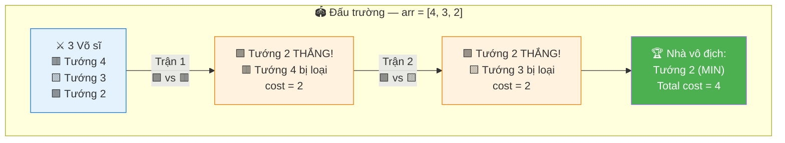

```
  Tưởng tượng mỗi phần tử là 1 VÕ SĨ trên đấu trường.
  Mỗi trận đấu: 2 võ sĩ đấu nhau → NHỎ HƠN thắng, LỚN HƠN bị loại.
  Chi phí tổ chức trận = giá trị võ sĩ THẮNG (nhỏ hơn).
  Mục tiêu: chỉ còn 1 võ sĩ, chi phí tổ chức TỐI THIỂU.

  arr = [4, 3, 2]  →  3 võ sĩ: "Tướng 4", "Tướng 3", "Tướng 2"

  CHIẾN THUẬT TỐI ƯU: Cho "Tướng 2" (MIN) đánh MỌI trận!
    Trận 1: Tướng 2 vs Tướng 4 → Tướng 4 thua, cost = 2
    Trận 2: Tướng 2 vs Tướng 3 → Tướng 3 thua, cost = 2
    Total cost = 2 + 2 = 4

  TẠI SAO "Tướng 2" LUÔN THẮNG?
    → Vì 2 là giá trị NHỎ NHẤT!
    → Trong MỌI trận đấu, 2 < đối thủ → 2 luôn sống sót!
    → 2 không bao giờ bị loại → dùng 2 cho MỌI trận!
```

### Tại sao LUÔN dùng MIN? — Chứng minh bằng PHẢN CHỨNG

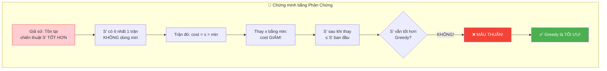

```
  📐 CHỨNG MINH GREEDY là TỐI ƯU:

  Giả sử có chiến thuật S' khác KHÔNG luôn dùng min:
    → Tồn tại ít nhất 1 trận mà S' dùng phần tử x > min làm cost
    → Cost trận đó = x > min

  So sánh với chiến thuật S (luôn dùng min):
    → Cost trận đó = min < x

  → S' có ít nhất 1 trận đắt hơn S
  → Tổng cost S' ≥ Tổng cost S
  → S (luôn dùng min) là TỐI ƯU NHẤT! ✅

  ⚠️ QUAN TRỌNG: min KHÔNG BAO GIỜ bị loại vì:
    → Khi pair min với bất kỳ phần tử x:
      - min ≤ x (luôn đúng, vì min là nhỏ nhất)
      - x bị loại, min sống
    → min có thể tham gia TẤT CẢ n-1 trận!
```

### Tại sao cần đúng n-1 operations?

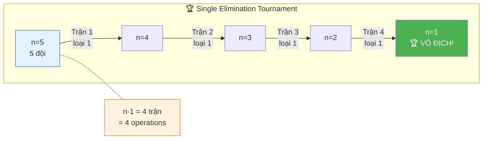

```
  Ban đầu: n phần tử
  Mỗi operation: xóa 1 phần tử → giảm 1
  Mục tiêu: còn 1 phần tử

  Số operations = n - 1

  Giống GIẢI ĐẤU LOẠI TRỰC TIẾP (Single Elimination Tournament):
    n đội → cần n-1 trận → còn 1 nhà vô địch
    (mỗi trận loại 1 đội)

  📌 Kỹ năng chuyển giao:
    Khi bài nói "reduce to 1 by removing 1 at a time"
    → Luôn cần n-1 operations!
    → Đây là fact cơ bản, dùng được cho NHIỀU bài!
```

### Mối liên hệ với các bài khác

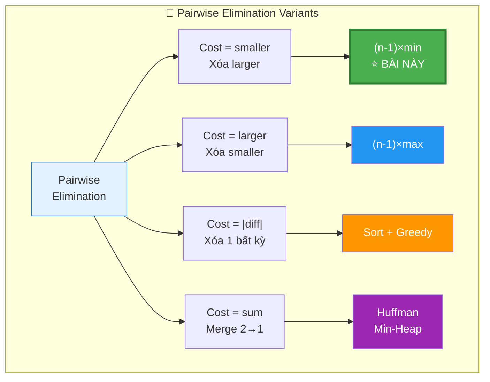

```
  ┌───────────────────────────────────────────────────────────────┐
  │  "Pairwise elimination" problems — Cùng PATTERN              │
  ├───────────────────────────────────────────────────────────────┤
  │  Cost = smaller, xóa larger     → Bài NÀY: (n-1)×min        │
  │  Cost = larger, xóa smaller     → (n-1)×max                 │
  │  Cost = |diff|, xóa 1 bất kỳ   → Cần sort/greedy phức tạp  │
  │  Cost = sum, merge 2 thành 1    → Huffman coding (heap)     │
  │  Cost = product, xóa 1          → Logarithm trick           │
  └───────────────────────────────────────────────────────────────┘

  → Bài này là VERSION ĐƠN GIẢN NHẤT vì:
     1. Cost = min (cố định sau khi tìm min)
     2. Chiến thuật rõ ràng: luôn dùng min
     3. Không cần simulation, chỉ cần 1 phép tính!
```

---

## 🧭 Luồng Suy Nghĩ — Từ đọc đề đến solution

> 💡 Phần này dạy bạn **CÁCH TƯ DUY** để tự giải bài, không chỉ biết đáp án.

### Bước 1: Đọc đề → Gạch chân KEYWORDS

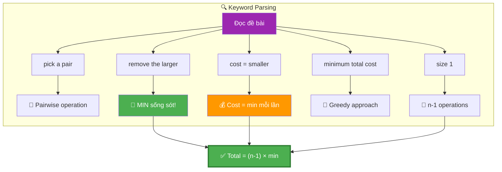

```
  Đề bài: "Pick a pair, remove the larger. Cost = the smaller.
           Find minimum total cost to reduce to size 1."

  Gạch chân:
    "pick a pair"        → PAIRWISE operation
    "remove the larger"  → PHẦN TỬ LỚN bị loại
    "cost = smaller"     → CHI PHÍ = phần tử nhỏ
    "minimum total cost" → TỐI ƯU HÓA (Greedy?)
    "size 1"             → CẦN n-1 operations

  🧠 Tự hỏi ngay:
    1. "Phần tử nào sống sót cuối?" → MIN! (không bao giờ bị loại)
    2. "Cost mỗi lần là gì?"       → Luôn dùng MIN → cost = MIN
    3. "Bao nhiêu lần?"            → n-1 lần (loại n-1 phần tử)

  📌 Kỹ năng chuyển giao:
    Khi đề nói "remove the larger" → NGHĨ NGAY: min sống sót!
    Khi đề nói "minimum cost"      → NGHĨ NGAY: Greedy!
    Khi đề nói "reduce to 1"       → NGHĨ NGAY: n-1 operations!
```

### Bước 2: Vẽ ví dụ NHỎ bằng tay → Tìm PATTERN

```
  Lấy ví dụ: arr = [5, 1, 3], n = 3

  🧠 "Thử TẤT CẢ chiến thuật và so sánh:"

  Chiến thuật A: Luôn dùng min=1
    Trận 1: (1,5) → xóa 5, cost=1 → arr=[1,3]
    Trận 2: (1,3) → xóa 3, cost=1 → arr=[1]
    Total = 1+1 = 2 ✅

  Chiến thuật B: Dùng 3 trước
    Trận 1: (3,5) → xóa 5, cost=3 → arr=[1,3]
    Trận 2: (1,3) → xóa 3, cost=1 → arr=[1]
    Total = 3+1 = 4 ❌ Đắt hơn!

  Chiến thuật C: Dùng 5 trước (SAI! 5 sẽ bị loại)
    Trận 1: (1,5) → xóa 5, cost=1 → arr=[1,3]
    (5 đã chết, không dùng lại được!)

  💡 PATTERN: Luôn dùng MIN cho cost THẤP NHẤT mỗi trận!
     Total = (n-1) × min = 2 × 1 = 2
```

### Bước 3: Cây quyết định

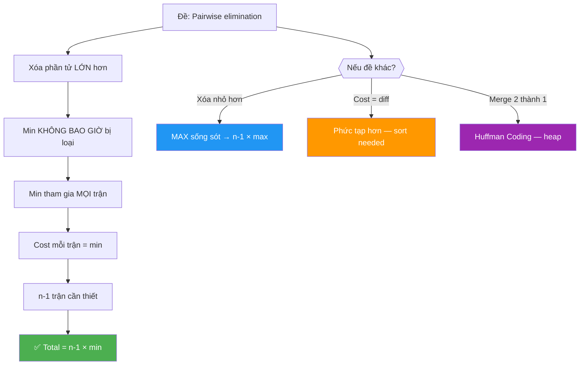

---

## 🔬 Deep Dive — Giải thích CHI TIẾT từng dòng code

> 💡 Phần này phân tích **từng dòng code** để bạn hiểu **TẠI SAO** viết như vậy.

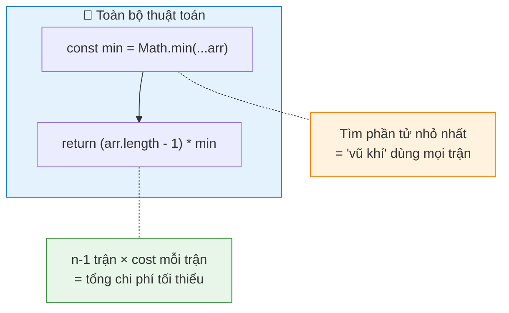

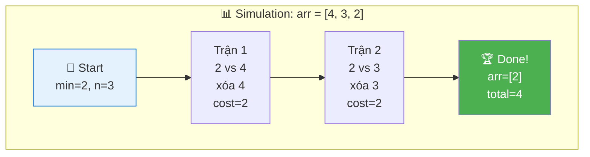

### Code đầy đủ với annotation

```javascript
function minCost(arr) {
  // ═══════════════════════════════════════════════════════════════
  // DÒNG 1: Tìm MIN — Xác định "vũ khí"
  // ═══════════════════════════════════════════════════════════════
  //
  // TẠI SAO Math.min(...arr)?
  //   → Spread operator (...) "xoè" mảng thành danh sách tham số
  //   → Math.min(4, 3, 2) → 2
  //
  // TẠI SAO tìm MIN?
  //   → MIN là phần tử sống sót cuối cùng (không bao giờ bị loại)
  //   → MIN được dùng làm cost cho MỌI operation
  //   → Dùng MIN = chi phí THẤP NHẤT có thể mỗi lần
  //
  // TRADE-OFF:
  //   ✅ Ngắn gọn, dễ đọc
  //   ❌ Với mảng > 100,000 phần tử → Stack Overflow
  //      → Giải pháp: dùng vòng for tìm min thủ công
  //
  const min = Math.min(...arr);

  // ═══════════════════════════════════════════════════════════════
  // DÒNG 2: Tính kết quả — Công thức 1 dòng!
  // ═══════════════════════════════════════════════════════════════
  //
  // TẠI SAO arr.length - 1?
  //   → Bắt đầu: n phần tử
  //   → Mỗi operation: xóa 1 phần tử
  //   → Kết thúc: 1 phần tử
  //   → Số operations = n - 1
  //
  // TẠI SAO × min?
  //   → Mỗi operation cost = min (chiến thuật greedy)
  //   → n-1 operations × min mỗi lần = (n-1) × min
  //
  // INSIGHT TOÁN HỌC:
  //   Total cost = Σ(cost mỗi trận) = Σ min (n-1 lần) = (n-1) × min
  //   → Đây là TỔNG CỦA HẰNG SỐ — đơn giản nhất!
  //
  // EDGE CASE:
  //   n = 1 → arr.length - 1 = 0 → return 0 (không cần xóa gì!)
  //   n = 0 → Tùy đề (có thể return 0 hoặc handle riêng)
  //
  return (arr.length - 1) * min;
}
```

### Trace CHI TIẾT — Nhiều ví dụ

```
  ┌─────────────────────────────────────────────────────────────────────────┐
  │  VÍ DỤ 1: arr = [4, 3, 2]                                              │
  │                                                                         │
  │  min = Math.min(4, 3, 2) = 2                                            │
  │  n = 3                                                                  │
  │  cost = (3 - 1) × 2 = 2 × 2 = 4                                        │
  │                                                                         │
  │  Simulation xác nhận:                                                   │
  │  ┌─────────┬─────────────────┬────────┬──────────┬──────────────────────┐│
  │  │ Trận    │ Pair            │ Xóa    │ Cost     │ Remaining            ││
  │  ├─────────┼─────────────────┼────────┼──────────┼──────────────────────┤│
  │  │  1      │ (2, 4)          │ 4      │ 2        │ [3, 2]               ││
  │  │  2      │ (2, 3)          │ 3      │ 2        │ [2]                  ││
  │  └─────────┴─────────────────┴────────┴──────────┴──────────────────────┘│
  │  Total = 2 + 2 = 4 ✅ Matches formula!                                  │
  └─────────────────────────────────────────────────────────────────────────┘

  ┌─────────────────────────────────────────────────────────────────────────┐
  │  VÍ DỤ 2: arr = [1, 5, 7, 3]                                           │
  │                                                                         │
  │  min = 1, n = 4                                                         │
  │  cost = (4 - 1) × 1 = 3 × 1 = 3                                        │
  │                                                                         │
  │  Simulation:                                                            │
  │  ┌─────────┬─────────────────┬────────┬──────────┬──────────────────────┐│
  │  │ Trận    │ Pair            │ Xóa    │ Cost     │ Remaining            ││
  │  ├─────────┼─────────────────┼────────┼──────────┼──────────────────────┤│
  │  │  1      │ (1, 7)          │ 7      │ 1        │ [1, 5, 3]            ││
  │  │  2      │ (1, 5)          │ 5      │ 1        │ [1, 3]               ││
  │  │  3      │ (1, 3)          │ 3      │ 1        │ [1]                  ││
  │  └─────────┴─────────────────┴────────┴──────────┴──────────────────────┘│
  │  Total = 1 + 1 + 1 = 3 ✅ Matches formula!                              │
  └─────────────────────────────────────────────────────────────────────────┘

  ┌─────────────────────────────────────────────────────────────────────────┐
  │  VÍ DỤ 3 — SAI nếu KHÔNG dùng min: arr = [1, 5, 7, 3]                  │
  │                                                                         │
  │  Chiến thuật SAI: dùng 3 trước                                          │
  │  ┌─────────┬─────────────────┬────────┬──────────┬──────────────────────┐│
  │  │ Trận    │ Pair            │ Xóa    │ Cost     │ Remaining            ││
  │  ├─────────┼─────────────────┼────────┼──────────┼──────────────────────┤│
  │  │  1      │ (3, 7)          │ 7      │ 3        │ [1, 5, 3]            ││
  │  │  2      │ (3, 5)          │ 5      │ 3        │ [1, 3]               ││
  │  │  3      │ (1, 3)          │ 3      │ 1        │ [1]                  ││
  │  └─────────┴─────────────────┴────────┴──────────┴──────────────────────┘│
  │  Total = 3 + 3 + 1 = 7 > 3 ❌ Đắt hơn!                                 │
  │                                                                         │
  │  📌 Bất kỳ chiến thuật nào KHÔNG luôn dùng min đều ĐẮT HƠN!           │
  └─────────────────────────────────────────────────────────────────────────┘
```

---

## 🧮 Chứng minh Toán học — Greedy Optimality

> 💡 Chứng minh CHẶT CHẼ rằng (n-1) × min là đáp án tối ưu nhất.

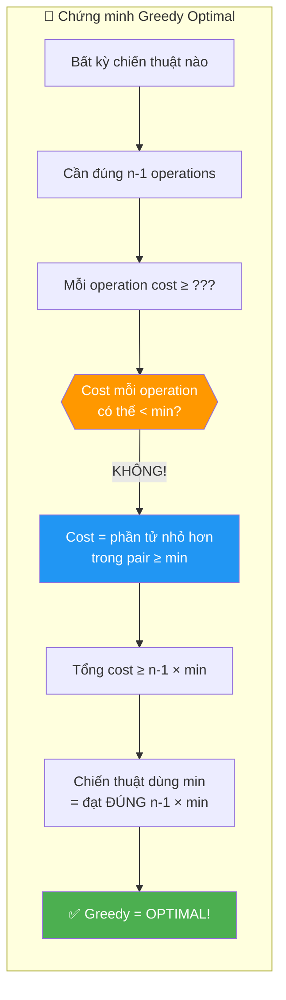

### Chứng minh chặt chẽ

```
  📐 CHỨNG MINH:

  ── Lower Bound ──

  Cho arr = [a₁, a₂, ..., aₙ], min = min(arr)

  Bất kỳ chiến thuật nào cũng cần đúng n-1 operations.
  Mỗi operation chọn pair (aᵢ, aⱼ):
    - Cost = min(aᵢ, aⱼ) ≥ min(arr) = min

  → Tổng cost = Σ cost_per_op ≥ Σ min (n-1 lần) = (n-1) × min

  ── Upper Bound (Greedy đạt được) ──

  Chiến thuật: Luôn pair min với 1 phần tử khác:
    - min ≤ mọi phần tử → min luôn là nhỏ hơn → min sống
    - Cost mỗi lần = min
    - Sau n-1 lần: chỉ còn min

  → Tổng cost = (n-1) × min = Lower Bound

  ═══════════════════════════════════════════════
   KẾT LUẬN:
   Lower Bound = Upper Bound = (n-1) × min
   → Greedy là TỐI ƯU! Không có chiến thuật nào tốt hơn!
  ═══════════════════════════════════════════════
```

### Khi nào min BẰNG phần tử kia trong pair?

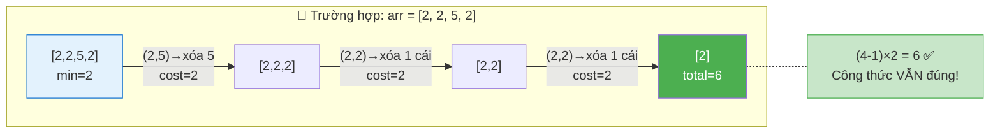

```
  Trường hợp đặc biệt: mảng có NHIỀU min!
    arr = [2, 2, 5, 2]  →  min = 2

  Pair (2, 2): cả hai bằng nhau! Xóa ai?
    → Xóa phần tử nào cũng được (đề nói "remove the larger"
      nhưng khi bằng nhau → xóa 1 cái bất kỳ)
    → Cost vẫn = 2

  Kết quả: (4-1) × 2 = 6 ✅

  📌 Không ảnh hưởng gì! Công thức vẫn đúng!
     Đây là edge case interviewer có thể hỏi.
```

---

## ⚠️ Common Mistakes — Lỗi hay gặp khi giải

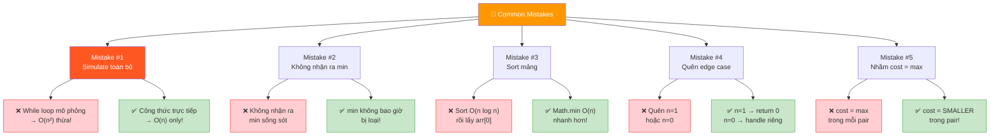

```
  ┌────────────────────────────────────────────────────────────────────────┐
  │  ❌ SAI                          │  ✅ ĐÚNG             │ TẠI SAO?   │
  ├────────────────────────────────────────────────────────────────────────┤
  │                                                                        │
  │  Mistake #1: Simulate từng bước                                        │
  │  while (arr.length > 1) {       │ return (n-1) * min   │ Simulation │
  │    // pick pair, remove...      │                       │ = O(n²)    │
  │  }                              │                       │ Thừa!      │
  │                                                                        │
  │  Mistake #2: Không nhận ra "min sống sót"                              │
  │  Thử mọi combination           │ Greedy: luôn dùng min│ Bài trick! │
  │  → O(2^n) exponential!         │ → O(n)               │ Chỉ 1 dòng │
  │                                                                        │
  │  Mistake #3: Sort mảng                                                 │
  │  arr.sort(); min = arr[0]      │ min = Math.min(...)   │ Sort O(n   │
  │                                 │ hoặc loop             │ log n)     │
  │                                 │                       │ thừa!      │
  │                                                                        │
  │  Mistake #4: Quên edge case n=1                                        │
  │  Không check arr.length         │ n=1 → return 0       │ Đã là      │
  │                                 │ (0 operations)        │ size 1!    │
  │                                                                        │
  │  Mistake #5: Nhầm cost                                                 │
  │  cost = max(pair) mỗi lần      │ cost = min(pair)      │ Đọc đề     │
  │  → (n-1) × max ← SAI!         │ → (n-1) × min ✅     │ cho kỹ!    │
  └────────────────────────────────────────────────────────────────────────┘

  ⚠️ Mistake #1 là PHỨC TẠP NHẤT:
    Nhiều người bắt đầu SIMULATE từng bước:
      while (arr.length > 1) {
        let minIdx = findMinIndex(arr);
        let otherIdx = findOther(arr);
        cost += arr[minIdx];
        arr.splice(otherIdx, 1);
      }
    → Đúng nhưng O(n²)! splice = O(n) × n lần!
    → Đáp án 1 dòng: (n-1) × min → O(n)!
```

---

## 🔄 Alternative Approaches — So sánh các cách tiếp cận

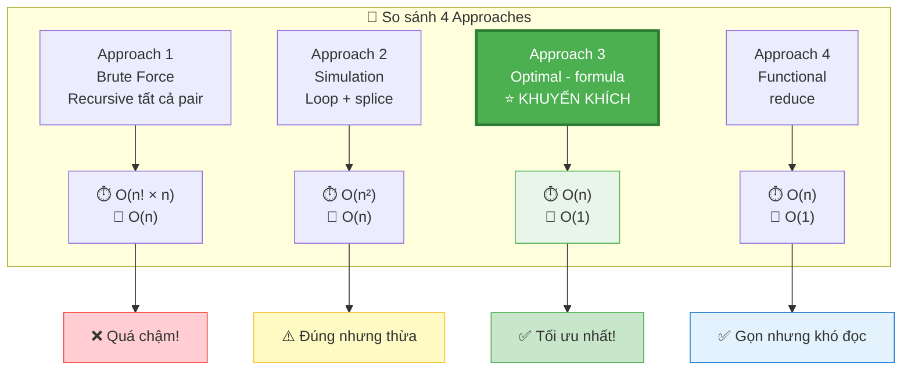

### Approach 1: Brute Force — Thử TẤT CẢ combinations

```mermaid
graph TD
    subgraph BRUTE["❌ Brute Force: arr = [4, 3, 2]"]
        START["[4, 3, 2]"] --> P1["Pair (4,3)\ncost=3, xóa 4"]
        START --> P2["Pair (4,2)\ncost=2, xóa 4"]
        START --> P3["Pair (3,2)\ncost=2, xóa 3"]

        P1 --> P1a["[3,2]\n→ (2,3) cost=2\nTotal=5"]
        P2 --> P2a["[3,2]\n→ (2,3) cost=2\nTotal=4"]
        P3 --> P3a["[4,2]\n→ (2,4) cost=2\nTotal=4"]

        P1a --> RESULT["min(5,4,4) = 4 ✅"]
        P2a --> RESULT
        P3a --> RESULT
    end

    subgraph OPTIMAL["✅ Optimal"]
        O1["min=2, n=3"] --> O2["(3-1)×2 = 4 ✅"]
    end

    BRUTE -->|"Cùng kết quả\nnhưng O(n!) vs O(n)!"| OPTIMAL

    style RESULT fill:#FF9800,color:white
    style O2 fill:#4CAF50,color:white
    style START fill:#FFCDD2,stroke:#F44336
```

```javascript
// ❌ RẤT CHẬM — O(n! × n) — chỉ để hiểu bài
function minCost_brute(arr) {
  if (arr.length <= 1) return 0;
  let minCost = Infinity;

  for (let i = 0; i < arr.length; i++) {
    for (let j = i + 1; j < arr.length; j++) {
      const cost = Math.min(arr[i], arr[j]);
      // Xóa phần tử lớn hơn
      const remaining = arr.filter((_, idx) =>
        idx !== (arr[i] >= arr[j] ? i : j)
      );
      minCost = Math.min(minCost, cost + minCost_brute(remaining));
    }
  }
  return minCost;
}
```

```
  Phân tích:
    Time:  O(n! × n) — THỬ MỌI cách chọn pair!
    Space: O(n) — recursion depth

  ⚠️ CHỈ DÙNG ĐỂ: verify đáp án cho mảng NHỎ (n ≤ 8)
```

### Approach 2: Simulation — Mô phỏng greedy

```javascript
// ⚠️ ĐÚNG nhưng THỪA — O(n²)
function minCost_simulate(arr) {
  arr = [...arr]; // copy để không mutate
  let totalCost = 0;

  while (arr.length > 1) {
    const minVal = Math.min(...arr);
    const minIdx = arr.indexOf(minVal);

    // Tìm phần tử bất kỳ KHÁC min để pair
    const otherIdx = minIdx === 0 ? 1 : 0;

    totalCost += minVal;
    // Xóa phần tử lớn hơn
    arr.splice(otherIdx, 1);
  }
  return totalCost;
}
```

```
  Phân tích:
    Time:  O(n²) — n iterations × splice O(n) mỗi lần
    Space: O(n) — copy mảng

  ⚠️ Đúng nhưng HOÀN TOÀN thừa!
    → Kết quả luôn = (n-1) × min
    → Tại sao simulate khi biết công thức?
```

### Approach 3: Optimal — Công thức trực tiếp (CODE CHÍNH)

```javascript
// ✅ TỐI ƯU — O(n) time, O(1) space — CHỈ 2 DÒNG!
function minCost(arr) {
  const min = Math.min(...arr);
  return (arr.length - 1) * min;
}
```

### Approach 4: Functional — reduce tìm min

```javascript
// ✅ An toàn cho mảng lớn (không dùng spread)
function minCost_safe(arr) {
  const min = arr.reduce((m, val) => Math.min(m, val), Infinity);
  return (arr.length - 1) * min;
}
```

```
  So sánh:

  ┌─────────────┬──────────────────────┬──────────────────────┐
  │  Tiêu chí    │ Approach 3 (spread)  │ Approach 4 (reduce)  │
  ├─────────────┼──────────────────────┼──────────────────────┤
  │  Readability │ ✅ Siêu rõ ràng      │ ⚠️ Hơi dài            │
  │  Safety      │ ❌ Stack overflow     │ ✅ An toàn với n lớn  │
  │              │ nếu n > 100k         │                      │
  │  Interview   │ ✅ Dùng trước        │ ✅ Mention như bonus  │
  └─────────────┴──────────────────────┴──────────────────────┘

  📌 Strategy phỏng vấn:
    1. Viết Approach 3 trước (ngắn nhất, rõ nhất)
    2. Mention: "Với mảng rất lớn, Math.min(...arr) có thể
       stack overflow, nên dùng reduce thay thế"
    → Thể hiện bạn hiểu sâu hơn đáp án cơ bản!
```

---

## 🧠 Think Out Loud — Quá trình tư duy từ ZERO đến SOLUTION

> 🎙️ Phần này mô phỏng ĐÚNG cách suy nghĩ khi phỏng vấn.

```mermaid
flowchart LR
    P1["📖 Phase 1\nĐọc đề\n~15s"] --> P2["✏️ Phase 2\nVẽ ví dụ\n~1m"]
    P2 --> P3["💡 Phase 3\nInsight!\n~30s"]
    P3 --> P4["💻 Phase 4\nCode\n~30s"]
    P4 --> P5["🎤 Phase 5\nProof\n~1m"]

    P1 -.- I1["🔑 pair → remove larger\ncost = smaller"]
    P2 -.- I2["🔑 min luôn thắng\nmin = cost mỗi lần"]
    P3 -.- I3["🔑 Total = n-1 × min"]
    P4 -.- I4["🔑 Chỉ 2 dòng code!"]
    P5 -.- I5["🔑 Greedy proof\nlower bound = upper bound"]

    style P1 fill:#E3F2FD,stroke:#1976D2
    style P2 fill:#E8F5E9,stroke:#388E3C
    style P3 fill:#FFF3E0,stroke:#F57C00
    style P4 fill:#F3E5F5,stroke:#7B1FA2
    style P5 fill:#FCE4EC,stroke:#C2185B
    style I1 fill:#BBDEFB,stroke:#1976D2
    style I2 fill:#C8E6C9,stroke:#388E3C
    style I3 fill:#FFE0B2,stroke:#F57C00
    style I4 fill:#E1BEE7,stroke:#7B1FA2
    style I5 fill:#F8BBD0,stroke:#C2185B
```

### Phase 1: Đọc đề — 15 giây

```
  🧠 "Hmm... pick a pair, remove larger, cost = smaller..."

  Ghi ra giấy ngay:
    ✏️ Each op: pair(a, b) → remove max(a,b), cost = min(a,b)
    ✏️ Goal: arr size → 1
    ✏️ Find: minimum total cost

  🧠 "Thú vị... cost = phần tử NHỎ hơn."
  🧠 "Nếu luôn dùng phần tử nhỏ nhất → cost NHỎ nhất mỗi lần?"
  🧠 "→ Greedy sense! Kiểm tra giả thuyết..."
```

### Phase 2: Vẽ ví dụ — 1 phút

```mermaid
flowchart LR
    subgraph COMPARE["✏️ So sánh 2 chiến thuật — arr = [5, 1, 3]"]
        direction TB
        subgraph A["✅ Chiến thuật A: dùng min=1"]
            A1["(1,5)→xóa 5\ncost=1"] --> A2["(1,3)→xóa 3\ncost=1"]
            A2 --> AT["Total = 2"]
        end
        subgraph B["❌ Chiến thuật B: dùng 3 trước"]
            B1["(3,5)→xóa 5\ncost=3"] --> B2["(1,3)→xóa 3\ncost=1"]
            B2 --> BT["Total = 4"]
        end
    end

    AT -.- WIN["✅ A thắng!\n2 < 4"]

    style AT fill:#4CAF50,color:white
    style BT fill:#F44336,color:white
    style WIN fill:#C8E6C9,stroke:#4CAF50
```

```
  Tự tạo ví dụ: arr = [5, 1, 3]

  🧠 "min = 1. Thử dùng 1 cho tất cả trận:"

  Trận 1: (1, 5) → xóa 5, cost=1 → [1, 3]
  Trận 2: (1, 3) → xóa 3, cost=1 → [1]
  Total = 2

  🧠 "Thử KHÔNG dùng min trước:"
  Trận 1: (3, 5) → xóa 5, cost=3 → [1, 3]
  Trận 2: (1, 3) → xóa 3, cost=1 → [1]
  Total = 4 > 2 ← ĐẮT HƠN!

  🧠 "Confirmed! Luôn dùng min = tối ưu!"
  🧠 "Công thức: (n-1) × min = (3-1) × 1 = 2 ✅"
```

### Phase 3: Insight — 30 giây

```
  🧠 "Tại sao min luôn tối ưu?"

  1. min KHÔNG BAO GIỜ bị loại (luôn là nhỏ hơn trong pair)
  2. min có thể tham gia MỌI n-1 trận
  3. Cost mỗi trận = min = THẤP NHẤT có thể
  4. Tổng = (n-1) × min = LOWER BOUND!

  🧠 "Vậy chỉ cần tìm min và nhân (n-1). Done!"
```

### Phase 4: Code — 30 giây

```
  🧠 "Code 2 dòng:"
    const min = Math.min(...arr);
    return (arr.length - 1) * min;

  🧠 "O(n) time, O(1) space. Optimal."
  🧠 "Edge case: n=1 → return 0 ✅ (auto-handled!)"
```

### Phase 5: Nếu interviewer hỏi tiếp

```
  Q: "Chứng minh greedy là optimal?"
  A: "Mỗi operation cost ≥ min (vì cost = smaller ≥ min).
      Cần n-1 operations → total ≥ (n-1) × min.
      Chiến thuật dùng min đạt đúng (n-1) × min.
      Lower bound = upper bound → optimal."

  Q: "Nếu cost = max(pair) thì sao?"
  A: "MAX sẽ bị loại mỗi lần (nó là larger).
      Hmm... không, MAX sẽ sống vì cost = max(pair) chỉ
      là chi phí, không phải quyết định xóa ai.
      Cần suy nghĩ lại..."
      
  Q: "Nếu remove SMALLER thay vì larger?"
  A: "Thì MAX sống sót! Cost mỗi lần = min(pair).
      Nhưng min bị loại dần → cost tăng dần.
      Trở thành bài khó hơn, cần greedy/DP."

  Q: "Math.min(...arr) có vấn đề gì?"
  A: "Stack overflow với mảng lớn! Dùng reduce hoặc for loop."
```

---

## 📊 Tổng kết — Approach Selection Guide

```mermaid
flowchart TD
    Q["❓ Chọn approach nào?"] --> Q1{{"Bạn đang ở đâu?"}}

    Q1 -->|"Phỏng vấn"| A3["⭐ Approach 3\nFormula: n-1 × min\n2 dòng code!"]
    Q1 -->|"Verify đáp án"| A1["Approach 1\nBrute Force recursive"]
    Q1 -->|"Code production\nmảng rất lớn"| A4["Approach 4\nreduce (an toàn)"]
    Q1 -->|"Hiểu bài"| A2["Approach 2\nSimulation"]

    A3 --> BEST["✅ BEST CHOICE\nO(n) time, O(1) space\nChỉ 2 dòng!"]

    style A3 fill:#4CAF50,color:white,stroke:#2E7D32,stroke-width:3px
    style BEST fill:#C8E6C9,stroke:#4CAF50,stroke-width:2px
    style Q fill:#9C27B0,color:white
    style A1 fill:#FFCDD2,stroke:#F44336
    style A2 fill:#FFF9C4,stroke:#FBC02D
    style A4 fill:#E3F2FD,stroke:#1976D2
```

```mermaid
graph LR
    subgraph SUMMARY["📌 Tổng kết bài toán"]
        direction TB
        S1["1. Tìm MIN"] --> S2["2. n-1 operations"]
        S2 --> S3["3. Cost mỗi lần = MIN"]
        S3 --> S4["4. Total = n-1 × MIN"]
    end

    subgraph KEY["🔑 Key Insights"]
        K1["Greedy:\nMIN sống sót"]
        K2["Tournament:\nn-1 trận loại"]
        K3["Lower bound:\ncost ≥ min mỗi lần"]
        K4["2 dòng code =\nO(n) optimal"]
    end

    S1 -.- K1
    S2 -.- K2
    S3 -.- K3
    S4 -.- K4

    style S1 fill:#E3F2FD,stroke:#1976D2
    style S2 fill:#FFF3E0,stroke:#F57C00
    style S3 fill:#E8F5E9,stroke:#388E3C
    style S4 fill:#F3E5F5,stroke:#7B1FA2
    style K1 fill:#BBDEFB,stroke:#1976D2
    style K2 fill:#FFE0B2,stroke:#F57C00
    style K3 fill:#C8E6C9,stroke:#388E3C
    style K4 fill:#E1BEE7,stroke:#7B1FA2
```

```
  ┌──────────────────────────────────────────────────────────────────────────┐
  │  Approach         │ Time        │ Space │ Pros           │ Cons          │
  ├──────────────────────────────────────────────────────────────────────────┤
  │  Brute Force      │ O(n! × n)  │ O(n)  │ Verify đáp án  │ Cực chậm      │
  │  (all combos)     │            │       │                │               │
  ├──────────────────────────────────────────────────────────────────────────┤
  │  Simulation       │ O(n²)      │ O(n)  │ Trực quan      │ Thừa!         │
  │  (while loop)     │            │       │ Dễ hiểu        │               │
  ├──────────────────────────────────────────────────────────────────────────┤
  │  Formula          │ O(n)       │ O(1)  │ 2 dòng code!   │ Stack overflow│
  │  ⭐ KHUYẾN KHÍCH  │            │       │ Tối ưu nhất    │ nếu n > 100k  │
  ├──────────────────────────────────────────────────────────────────────────┤
  │  reduce           │ O(n)       │ O(1)  │ An toàn        │ Dài hơn       │
  │  (safe)           │            │       │ Không overflow │               │
  └──────────────────────────────────────────────────────────────────────────┘

  📌 Kết luận: Formula approach là BEST CHOICE cho phỏng vấn!
     → Bài "trick" — nhìn phức tạp nhưng code 2 dòng!
     → Key: CHỨNG MINH greedy quan trọng hơn code!
     → Interviewer muốn nghe WHY, không chỉ HOW!
```

---

## Edge Cases Chi Tiết

```
  ┌───────────────────────────────────────────────────────────────────┐
  │  Case                │ Input           │ Output │ Tại sao?        │
  ├───────────────────────────────────────────────────────────────────┤
  │  Mảng 1 phần tử      │ [10]            │ 0      │ Đã size 1!      │
  │                      │                 │        │ 0 operations     │
  ├───────────────────────────────────────────────────────────────────┤
  │  Mảng 2 phần tử      │ [3, 7]          │ 3      │ 1 op, cost=3    │
  ├───────────────────────────────────────────────────────────────────┤
  │  Tất cả bằng nhau    │ [5, 5, 5, 5]    │ 15     │ (4-1)×5=15      │
  │                      │                 │        │ min=5           │
  ├───────────────────────────────────────────────────────────────────┤
  │  Có min trùng lặp    │ [2, 2, 7, 2]    │ 6      │ (4-1)×2=6       │
  │                      │                 │        │ min=2 vẫn đúng  │
  ├───────────────────────────────────────────────────────────────────┤
  │  Min ở cuối mảng     │ [9, 8, 7, 1]    │ 3      │ (4-1)×1=3       │
  │                      │                 │        │ Vị trí min      │
  │                      │                 │        │ không ảnh hưởng │
  ├───────────────────────────────────────────────────────────────────┤
  │  Mảng rất lớn        │ n=10⁶, min=1    │ 999999 │ (10⁶-1)×1       │
  │                      │                 │        │ O(n) vẫn nhanh  │
  └───────────────────────────────────────────────────────────────────┘

  ⚠️ CHÚ Ý: Bài này KHÔNG có case impossible!
     → Luôn có lời giải (miễn n ≥ 1)
     → Khác với Minimum Increment by K (có return -1)
```

---

## 📚 Bài tập liên quan

```
  ┌──────────────────────────────────────────────────────────────────┐
  │  Bài                              │ Difficulty │ Pattern tương tự │
  ├──────────────────────────────────────────────────────────────────┤
  │  GfG: Min Cost Array Size 1      │ Easy       │ Greedy, (n-1)×min│
  │  LC 1000: Min Cost Merge Stones  │ Hard       │ Merge cost, DP   │
  │  LC 1167: Min Cost Connect Sticks│ Medium     │ Huffman, Heap    │
  │  LC 2208: Min Ops Halve Sum     │ Medium     │ Greedy, MaxHeap  │
  │  GfG: Huffman Coding             │ Medium     │ Greedy, Priority │
  └──────────────────────────────────────────────────────────────────┘

  📌 Thứ tự học khuyến nghị:
     1. GfG: Min Cost Array Size 1   ← BÀI NÀY (easiest, trick)
     2. LC 1167: Connect Sticks      ← Merge cost = sum → Heap
     3. LC 2208: Halve Sum           ← Greedy + MaxHeap
     4. LC 1000: Merge Stones        ← Interval DP (hard)
```
