# 💰 Minimum Cost to Make Array Size 1 — GfG (Easy)

> 📖 Code: [Min Cost Array Size 1.js](./Min%20Cost%20Array%20Size%201.js)

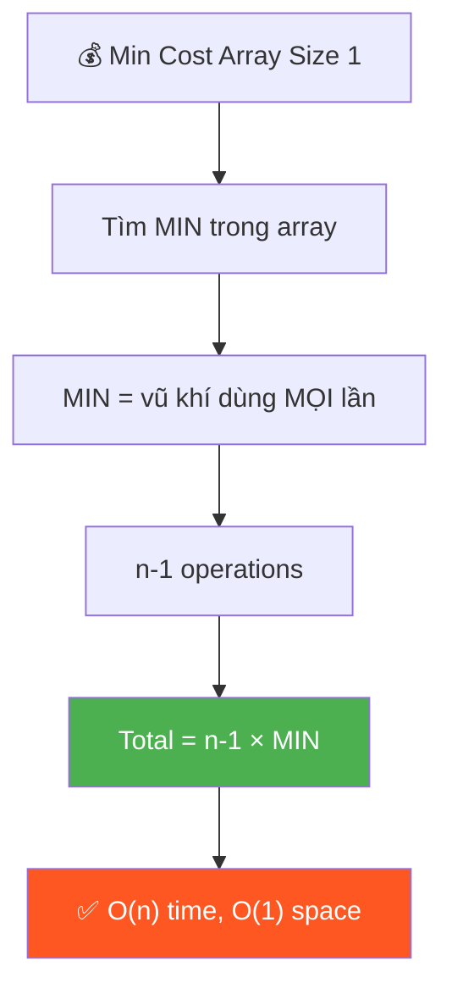

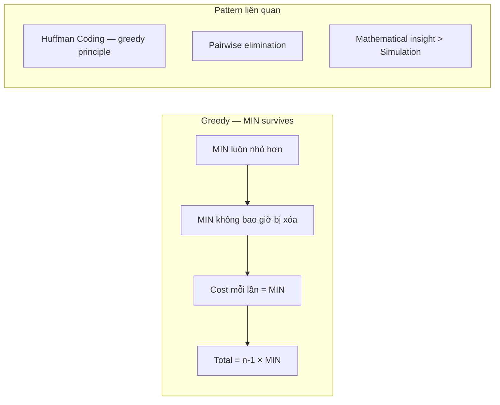

---

## R — Repeat & Clarify

🧠 *"Luôn pair min với phần tử khác → xóa phần tử lớn hơn. Chi phí = min. Lặp n-1 lần!"*

> 🎙️ *"Given an array, repeatedly pick a pair and remove the larger one. Cost of each operation = the smaller value. Find minimum total cost to reduce array to size 1."*

### Clarification Questions

```
Q: Xóa phần tử nào?
A: Xóa phần tử LỚN HƠN trong pair

Q: Cost = gì?
A: Cost = phần tử NHỎ HƠN trong pair

Q: Tại sao greedy?
A: Luôn dùng MIN toàn cục làm "vũ khí" → cost mỗi lần bé nhất!
```

---

## E — Examples

```
VÍ DỤ 1: arr = [4, 3, 2]

  Greedy: luôn chọn min = 2!
    Pair (2, 4): xóa 4, cost = 2 → arr = [3, 2]
    Pair (2, 3): xóa 3, cost = 2 → arr = [2]
  Total = 2 + 2 = 4 ✅

  SAI nếu: Pair (3, 4): xóa 4, cost = 3 → arr = [3, 2]
           Pair (2, 3): xóa 3, cost = 2 → arr = [2]
           Total = 3 + 2 = 5 > 4 ❌

VÍ DỤ 2: arr = [3, 4]
  Pair (3, 4): xóa 4, cost = 3 → arr = [3]
  Total = 3 ✅
```

---

## A — Approach

```
💡 KEY INSIGHT:

  1. Phần tử MIN sẽ sống sót cuối cùng!
     (vì nó luôn NHỎ hơn → không bao giờ bị xóa)

  2. MIN được dùng trong MỌI operation!
     → n-1 operations, mỗi lần cost = min
     → Total = (n - 1) × min

  CHỨNG MINH:
    min luôn nhỏ hơn mọi phần tử khác
    → mỗi lần pair min với bất kỳ ai, min sống, ai đó chết
    → cost = min mỗi lần
    → cần n-1 lần xóa → (n-1) × min
```

---

## C — Code

```javascript
function minCost(arr) {
  const min = Math.min(...arr);
  return (arr.length - 1) * min;
}
```

### Trace: arr = [4, 3, 2]

```
  min = 2
  n = 3
  cost = (3 - 1) × 2 = 2 × 2 = 4 ✅
```

> 🎙️ *"The minimum element always survives since it's never the larger one. It's used in every removal, so total cost is simply (n-1) × min. O(n) to find min, O(1) space."*

---

## O — Optimize

```
  Time:  O(n) — chỉ cần tìm min
  Space: O(1)

  ⚠️ Đây là bài "trick" — nhìn phức tạp nhưng chỉ 1 dòng!
  Interview: giải thích CHỨNG MINH greedy quan trọng hơn code!
```

---

## T — Test

```
  [4, 3, 2]    → (3-1)×2 = 4     ✅
  [3, 4]       → (2-1)×3 = 3     ✅
  [1, 5, 7, 3] → (4-1)×1 = 3     ✅
  [10]         → (1-1)×10 = 0    ✅ Already size 1
  [1, 1, 1]    → (3-1)×1 = 2     ✅ All same
```

---

## 🗣️ Interview Script

> 🎙️ *"The key insight is that the minimum element never gets removed — it's always the smaller in any pair. So it's used as the cost in every single operation. We need n-1 operations to reduce to size 1, giving total cost = (n-1) × min. The proof is: any other strategy uses a larger value as cost at least once, which is strictly worse."*

### Pattern

```
  GREEDY — "MIN survives" pattern!

  Khi chỉ xóa phần tử LỚN HƠN:
    → Min LUÔN sống sót
    → Min LUÔN là cost
    → Total = (n-1) × min

  Liên kết: tương tự Huffman Coding greedy principle
```

---

## 🧠 Bản chất bài toán — Hiểu để NHỚ, không chỉ để GIẢI

### Hình dung bằng TRẬN ĐẤU

```
  Tưởng tượng mỗi phần tử là 1 VÕ SĨ trên đấu trường.
  Mỗi trận đấu: 2 võ sĩ đấu nhau → NHỎ HƠN thắng, LỚN HƠN bị loại.
  Chi phí tổ chức trận = giá trị võ sĩ THẮNG (nhỏ hơn).
  Mục tiêu: chỉ còn 1 võ sĩ, chi phí tổ chức TỐI THIỂU.

  arr = [4, 3, 2]  →  3 võ sĩ: "Tướng 4", "Tướng 3", "Tướng 2"

  CHIẾN THUẬT TỐI ƯU: Cho "Tướng 2" (MIN) đánh MỌI trận!
    Trận 1: Tướng 2 vs Tướng 4 → Tướng 4 thua, cost = 2
    Trận 2: Tướng 2 vs Tướng 3 → Tướng 3 thua, cost = 2
    Total cost = 2 + 2 = 4

  TẠI SAO "Tướng 2" LUÔN THẮNG?
    → Vì 2 là giá trị NHỎ NHẤT!
    → Trong MỌI trận đấu, 2 < đối thủ → 2 luôn sống sót!
    → 2 không bao giờ bị loại → dùng 2 cho MỌI trận!
```

### Tại sao LUÔN dùng MIN? — Chứng minh bằng PHẢN CHỨNG

```
  📐 CHỨNG MINH GREEDY là TỐI ƯU:

  Giả sử có chiến thuật S' khác KHÔNG luôn dùng min:
    → Tồn tại ít nhất 1 trận mà S' dùng phần tử x > min làm cost
    → Cost trận đó = x > min

  So sánh với chiến thuật S (luôn dùng min):
    → Cost trận đó = min < x

  → S' có ít nhất 1 trận đắt hơn S
  → Tổng cost S' ≥ Tổng cost S
  → S (luôn dùng min) là TỐI ƯU NHẤT! ✅

  ⚠️ QUAN TRỌNG: min KHÔNG BAO GIỜ bị loại vì:
    → Khi pair min với bất kỳ phần tử x:
      - min ≤ x (luôn đúng, vì min là nhỏ nhất)
      - x bị loại, min sống
    → min có thể tham gia TẤT CẢ n-1 trận!
```

### Tại sao cần đúng n-1 operations?

```
  Ban đầu: n phần tử
  Mỗi operation: xóa 1 phần tử → giảm 1
  Mục tiêu: còn 1 phần tử

  Số operations = n - 1

  Giống GIẢI ĐẤU LOẠI TRỰC TIẾP (Single Elimination Tournament):
    n đội → cần n-1 trận → còn 1 nhà vô địch
    (mỗi trận loại 1 đội)

  📌 Kỹ năng chuyển giao:
    Khi bài nói "reduce to 1 by removing 1 at a time"
    → Luôn cần n-1 operations!
    → Đây là fact cơ bản, dùng được cho NHIỀU bài!
```

### Mối liên hệ với các bài khác

```
  ┌───────────────────────────────────────────────────────────────┐
  │  "Pairwise elimination" problems — Cùng PATTERN              │
  ├───────────────────────────────────────────────────────────────┤
  │  Cost = smaller, xóa larger     → Bài NÀY: (n-1)×min        │
  │  Cost = larger, xóa smaller     → (n-1)×max                 │
  │  Cost = |diff|, xóa 1 bất kỳ   → Cần sort/greedy phức tạp  │
  │  Cost = sum, merge 2 thành 1    → Huffman coding (heap)     │
  │  Cost = product, xóa 1          → Logarithm trick           │
  └───────────────────────────────────────────────────────────────┘

  → Bài này là VERSION ĐƠN GIẢN NHẤT vì:
     1. Cost = min (cố định sau khi tìm min)
     2. Chiến thuật rõ ràng: luôn dùng min
     3. Không cần simulation, chỉ cần 1 phép tính!
```

---

## 🧭 Luồng Suy Nghĩ — Từ đọc đề đến solution

> 💡 Phần này dạy bạn **CÁCH TƯ DUY** để tự giải bài, không chỉ biết đáp án.

### Bước 1: Đọc đề → Gạch chân KEYWORDS

```
  Đề bài: "Pick a pair, remove the larger. Cost = the smaller.
           Find minimum total cost to reduce to size 1."

  Gạch chân:
    "pick a pair"        → PAIRWISE operation
    "remove the larger"  → PHẦN TỬ LỚN bị loại
    "cost = smaller"     → CHI PHÍ = phần tử nhỏ
    "minimum total cost" → TỐI ƯU HÓA (Greedy?)
    "size 1"             → CẦN n-1 operations

  🧠 Tự hỏi ngay:
    1. "Phần tử nào sống sót cuối?" → MIN! (không bao giờ bị loại)
    2. "Cost mỗi lần là gì?"       → Luôn dùng MIN → cost = MIN
    3. "Bao nhiêu lần?"            → n-1 lần (loại n-1 phần tử)

  📌 Kỹ năng chuyển giao:
    Khi đề nói "remove the larger" → NGHĨ NGAY: min sống sót!
    Khi đề nói "minimum cost"      → NGHĨ NGAY: Greedy!
    Khi đề nói "reduce to 1"       → NGHĨ NGAY: n-1 operations!
```

### Bước 2: Vẽ ví dụ NHỎ bằng tay → Tìm PATTERN

```
  Lấy ví dụ: arr = [5, 1, 3], n = 3

  🧠 "Thử TẤT CẢ chiến thuật và so sánh:"

  Chiến thuật A: Luôn dùng min=1
    Trận 1: (1,5) → xóa 5, cost=1 → arr=[1,3]
    Trận 2: (1,3) → xóa 3, cost=1 → arr=[1]
    Total = 1+1 = 2 ✅

  Chiến thuật B: Dùng 3 trước
    Trận 1: (3,5) → xóa 5, cost=3 → arr=[1,3]
    Trận 2: (1,3) → xóa 3, cost=1 → arr=[1]
    Total = 3+1 = 4 ❌ Đắt hơn!

  Chiến thuật C: Dùng 5 trước (SAI! 5 sẽ bị loại)
    Trận 1: (1,5) → xóa 5, cost=1 → arr=[1,3]
    (5 đã chết, không dùng lại được!)

  💡 PATTERN: Luôn dùng MIN cho cost THẤP NHẤT mỗi trận!
     Total = (n-1) × min = 2 × 1 = 2
```

### Bước 3: Cây quyết định

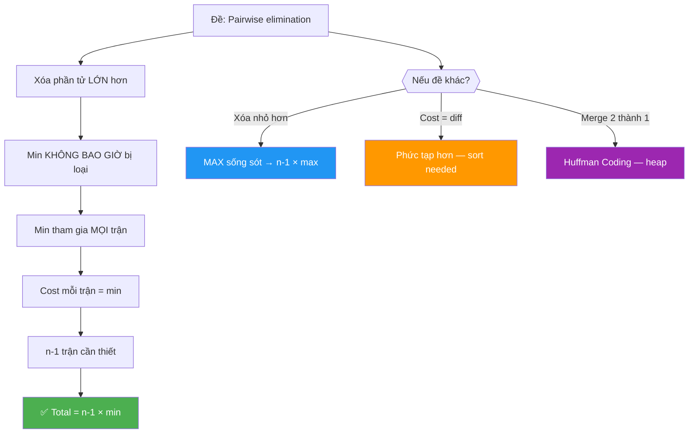

---

## 🔬 Deep Dive — Giải thích CHI TIẾT từng dòng code

> 💡 Phần này phân tích **từng dòng code** để bạn hiểu **TẠI SAO** viết như vậy.

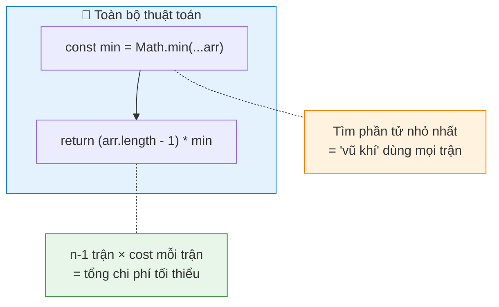

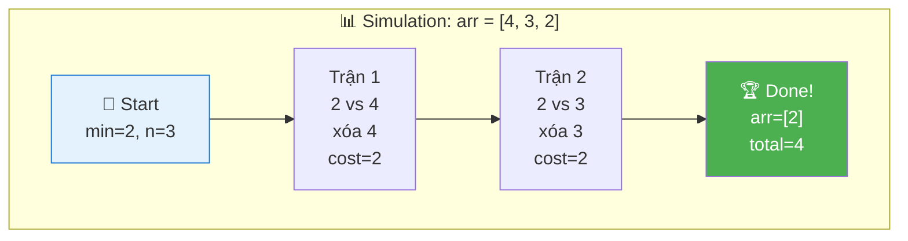

### Code đầy đủ với annotation

```javascript
function minCost(arr) {
  // ═══════════════════════════════════════════════════════════════
  // DÒNG 1: Tìm MIN — Xác định "vũ khí"
  // ═══════════════════════════════════════════════════════════════
  //
  // TẠI SAO Math.min(...arr)?
  //   → Spread operator (...) "xoè" mảng thành danh sách tham số
  //   → Math.min(4, 3, 2) → 2
  //
  // TẠI SAO tìm MIN?
  //   → MIN là phần tử sống sót cuối cùng (không bao giờ bị loại)
  //   → MIN được dùng làm cost cho MỌI operation
  //   → Dùng MIN = chi phí THẤP NHẤT có thể mỗi lần
  //
  // TRADE-OFF:
  //   ✅ Ngắn gọn, dễ đọc
  //   ❌ Với mảng > 100,000 phần tử → Stack Overflow
  //      → Giải pháp: dùng vòng for tìm min thủ công
  //
  const min = Math.min(...arr);

  // ═══════════════════════════════════════════════════════════════
  // DÒNG 2: Tính kết quả — Công thức 1 dòng!
  // ═══════════════════════════════════════════════════════════════
  //
  // TẠI SAO arr.length - 1?
  //   → Bắt đầu: n phần tử
  //   → Mỗi operation: xóa 1 phần tử
  //   → Kết thúc: 1 phần tử
  //   → Số operations = n - 1
  //
  // TẠI SAO × min?
  //   → Mỗi operation cost = min (chiến thuật greedy)
  //   → n-1 operations × min mỗi lần = (n-1) × min
  //
  // INSIGHT TOÁN HỌC:
  //   Total cost = Σ(cost mỗi trận) = Σ min (n-1 lần) = (n-1) × min
  //   → Đây là TỔNG CỦA HẰNG SỐ — đơn giản nhất!
  //
  // EDGE CASE:
  //   n = 1 → arr.length - 1 = 0 → return 0 (không cần xóa gì!)
  //   n = 0 → Tùy đề (có thể return 0 hoặc handle riêng)
  //
  return (arr.length - 1) * min;
}
```

### Trace CHI TIẾT — Nhiều ví dụ

```
  ┌─────────────────────────────────────────────────────────────────────────┐
  │  VÍ DỤ 1: arr = [4, 3, 2]                                              │
  │                                                                         │
  │  min = Math.min(4, 3, 2) = 2                                            │
  │  n = 3                                                                  │
  │  cost = (3 - 1) × 2 = 2 × 2 = 4                                        │
  │                                                                         │
  │  Simulation xác nhận:                                                   │
  │  ┌─────────┬─────────────────┬────────┬──────────┬──────────────────────┐│
  │  │ Trận    │ Pair            │ Xóa    │ Cost     │ Remaining            ││
  │  ├─────────┼─────────────────┼────────┼──────────┼──────────────────────┤│
  │  │  1      │ (2, 4)          │ 4      │ 2        │ [3, 2]               ││
  │  │  2      │ (2, 3)          │ 3      │ 2        │ [2]                  ││
  │  └─────────┴─────────────────┴────────┴──────────┴──────────────────────┘│
  │  Total = 2 + 2 = 4 ✅ Matches formula!                                  │
  └─────────────────────────────────────────────────────────────────────────┘

  ┌─────────────────────────────────────────────────────────────────────────┐
  │  VÍ DỤ 2: arr = [1, 5, 7, 3]                                           │
  │                                                                         │
  │  min = 1, n = 4                                                         │
  │  cost = (4 - 1) × 1 = 3 × 1 = 3                                        │
  │                                                                         │
  │  Simulation:                                                            │
  │  ┌─────────┬─────────────────┬────────┬──────────┬──────────────────────┐│
  │  │ Trận    │ Pair            │ Xóa    │ Cost     │ Remaining            ││
  │  ├─────────┼─────────────────┼────────┼──────────┼──────────────────────┤│
  │  │  1      │ (1, 7)          │ 7      │ 1        │ [1, 5, 3]            ││
  │  │  2      │ (1, 5)          │ 5      │ 1        │ [1, 3]               ││
  │  │  3      │ (1, 3)          │ 3      │ 1        │ [1]                  ││
  │  └─────────┴─────────────────┴────────┴──────────┴──────────────────────┘│
  │  Total = 1 + 1 + 1 = 3 ✅ Matches formula!                              │
  └─────────────────────────────────────────────────────────────────────────┘

  ┌─────────────────────────────────────────────────────────────────────────┐
  │  VÍ DỤ 3 — SAI nếu KHÔNG dùng min: arr = [1, 5, 7, 3]                  │
  │                                                                         │
  │  Chiến thuật SAI: dùng 3 trước                                          │
  │  ┌─────────┬─────────────────┬────────┬──────────┬──────────────────────┐│
  │  │ Trận    │ Pair            │ Xóa    │ Cost     │ Remaining            ││
  │  ├─────────┼─────────────────┼────────┼──────────┼──────────────────────┤│
  │  │  1      │ (3, 7)          │ 7      │ 3        │ [1, 5, 3]            ││
  │  │  2      │ (3, 5)          │ 5      │ 3        │ [1, 3]               ││
  │  │  3      │ (1, 3)          │ 3      │ 1        │ [1]                  ││
  │  └─────────┴─────────────────┴────────┴──────────┴──────────────────────┘│
  │  Total = 3 + 3 + 1 = 7 > 3 ❌ Đắt hơn!                                 │
  │                                                                         │
  │  📌 Bất kỳ chiến thuật nào KHÔNG luôn dùng min đều ĐẮT HƠN!           │
  └─────────────────────────────────────────────────────────────────────────┘
```

---

## 🧮 Chứng minh Toán học — Greedy Optimality

> 💡 Chứng minh CHẶT CHẼ rằng (n-1) × min là đáp án tối ưu nhất.

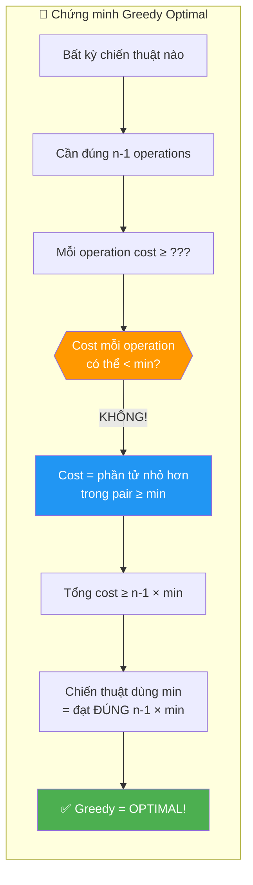

### Chứng minh chặt chẽ

```
  📐 CHỨNG MINH:

  ── Lower Bound ──

  Cho arr = [a₁, a₂, ..., aₙ], min = min(arr)

  Bất kỳ chiến thuật nào cũng cần đúng n-1 operations.
  Mỗi operation chọn pair (aᵢ, aⱼ):
    - Cost = min(aᵢ, aⱼ) ≥ min(arr) = min

  → Tổng cost = Σ cost_per_op ≥ Σ min (n-1 lần) = (n-1) × min

  ── Upper Bound (Greedy đạt được) ──

  Chiến thuật: Luôn pair min với 1 phần tử khác:
    - min ≤ mọi phần tử → min luôn là nhỏ hơn → min sống
    - Cost mỗi lần = min
    - Sau n-1 lần: chỉ còn min

  → Tổng cost = (n-1) × min = Lower Bound

  ═══════════════════════════════════════════════
   KẾT LUẬN:
   Lower Bound = Upper Bound = (n-1) × min
   → Greedy là TỐI ƯU! Không có chiến thuật nào tốt hơn!
  ═══════════════════════════════════════════════
```

### Khi nào min BẰNG phần tử kia trong pair?

```
  Trường hợp đặc biệt: mảng có NHIỀU min!
    arr = [2, 2, 5, 2]  →  min = 2

  Pair (2, 2): cả hai bằng nhau! Xóa ai?
    → Xóa phần tử nào cũng được (đề nói "remove the larger"
      nhưng khi bằng nhau → xóa 1 cái bất kỳ)
    → Cost vẫn = 2

  Kết quả: (4-1) × 2 = 6 ✅

  📌 Không ảnh hưởng gì! Công thức vẫn đúng!
     Đây là edge case interviewer có thể hỏi.
```

---

## ⚠️ Common Mistakes — Lỗi hay gặp khi giải

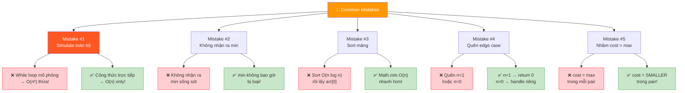

```
  ┌────────────────────────────────────────────────────────────────────────┐
  │  ❌ SAI                          │  ✅ ĐÚNG             │ TẠI SAO?   │
  ├────────────────────────────────────────────────────────────────────────┤
  │                                                                        │
  │  Mistake #1: Simulate từng bước                                        │
  │  while (arr.length > 1) {       │ return (n-1) * min   │ Simulation │
  │    // pick pair, remove...      │                       │ = O(n²)    │
  │  }                              │                       │ Thừa!      │
  │                                                                        │
  │  Mistake #2: Không nhận ra "min sống sót"                              │
  │  Thử mọi combination           │ Greedy: luôn dùng min│ Bài trick! │
  │  → O(2^n) exponential!         │ → O(n)               │ Chỉ 1 dòng │
  │                                                                        │
  │  Mistake #3: Sort mảng                                                 │
  │  arr.sort(); min = arr[0]      │ min = Math.min(...)   │ Sort O(n   │
  │                                 │ hoặc loop             │ log n)     │
  │                                 │                       │ thừa!      │
  │                                                                        │
  │  Mistake #4: Quên edge case n=1                                        │
  │  Không check arr.length         │ n=1 → return 0       │ Đã là      │
  │                                 │ (0 operations)        │ size 1!    │
  │                                                                        │
  │  Mistake #5: Nhầm cost                                                 │
  │  cost = max(pair) mỗi lần      │ cost = min(pair)      │ Đọc đề     │
  │  → (n-1) × max ← SAI!         │ → (n-1) × min ✅     │ cho kỹ!    │
  └────────────────────────────────────────────────────────────────────────┘

  ⚠️ Mistake #1 là PHỨC TẠP NHẤT:
    Nhiều người bắt đầu SIMULATE từng bước:
      while (arr.length > 1) {
        let minIdx = findMinIndex(arr);
        let otherIdx = findOther(arr);
        cost += arr[minIdx];
        arr.splice(otherIdx, 1);
      }
    → Đúng nhưng O(n²)! splice = O(n) × n lần!
    → Đáp án 1 dòng: (n-1) × min → O(n)!
```

---

## 🔄 Alternative Approaches — So sánh các cách tiếp cận

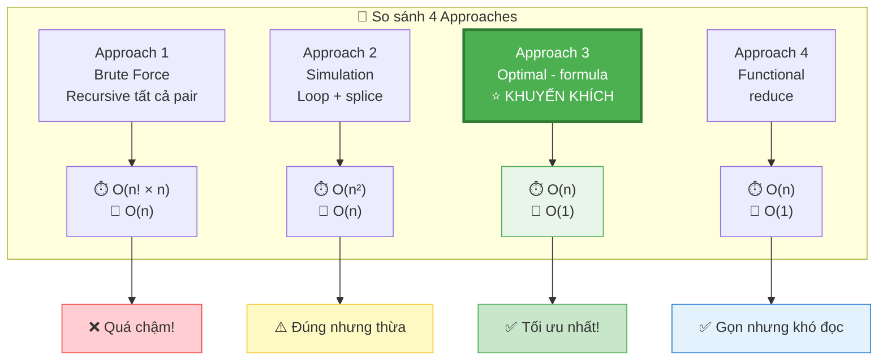

### Approach 1: Brute Force — Thử TẤT CẢ combinations

```javascript
// ❌ RẤT CHẬM — O(n! × n) — chỉ để hiểu bài
function minCost_brute(arr) {
  if (arr.length <= 1) return 0;
  let minCost = Infinity;

  for (let i = 0; i < arr.length; i++) {
    for (let j = i + 1; j < arr.length; j++) {
      const cost = Math.min(arr[i], arr[j]);
      // Xóa phần tử lớn hơn
      const remaining = arr.filter((_, idx) =>
        idx !== (arr[i] >= arr[j] ? i : j)
      );
      minCost = Math.min(minCost, cost + minCost_brute(remaining));
    }
  }
  return minCost;
}
```

```
  Phân tích:
    Time:  O(n! × n) — THỬ MỌI cách chọn pair!
    Space: O(n) — recursion depth

  ⚠️ CHỈ DÙNG ĐỂ: verify đáp án cho mảng NHỎ (n ≤ 8)
```

### Approach 2: Simulation — Mô phỏng greedy

```javascript
// ⚠️ ĐÚNG nhưng THỪA — O(n²)
function minCost_simulate(arr) {
  arr = [...arr]; // copy để không mutate
  let totalCost = 0;

  while (arr.length > 1) {
    const minVal = Math.min(...arr);
    const minIdx = arr.indexOf(minVal);

    // Tìm phần tử bất kỳ KHÁC min để pair
    const otherIdx = minIdx === 0 ? 1 : 0;

    totalCost += minVal;
    // Xóa phần tử lớn hơn
    arr.splice(otherIdx, 1);
  }
  return totalCost;
}
```

```
  Phân tích:
    Time:  O(n²) — n iterations × splice O(n) mỗi lần
    Space: O(n) — copy mảng

  ⚠️ Đúng nhưng HOÀN TOÀN thừa!
    → Kết quả luôn = (n-1) × min
    → Tại sao simulate khi biết công thức?
```

### Approach 3: Optimal — Công thức trực tiếp (CODE CHÍNH)

```javascript
// ✅ TỐI ƯU — O(n) time, O(1) space — CHỈ 2 DÒNG!
function minCost(arr) {
  const min = Math.min(...arr);
  return (arr.length - 1) * min;
}
```

### Approach 4: Functional — reduce tìm min

```javascript
// ✅ An toàn cho mảng lớn (không dùng spread)
function minCost_safe(arr) {
  const min = arr.reduce((m, val) => Math.min(m, val), Infinity);
  return (arr.length - 1) * min;
}
```

```
  So sánh:

  ┌─────────────┬──────────────────────┬──────────────────────┐
  │  Tiêu chí    │ Approach 3 (spread)  │ Approach 4 (reduce)  │
  ├─────────────┼──────────────────────┼──────────────────────┤
  │  Readability │ ✅ Siêu rõ ràng      │ ⚠️ Hơi dài            │
  │  Safety      │ ❌ Stack overflow     │ ✅ An toàn với n lớn  │
  │              │ nếu n > 100k         │                      │
  │  Interview   │ ✅ Dùng trước        │ ✅ Mention như bonus  │
  └─────────────┴──────────────────────┴──────────────────────┘

  📌 Strategy phỏng vấn:
    1. Viết Approach 3 trước (ngắn nhất, rõ nhất)
    2. Mention: "Với mảng rất lớn, Math.min(...arr) có thể
       stack overflow, nên dùng reduce thay thế"
    → Thể hiện bạn hiểu sâu hơn đáp án cơ bản!
```

---

## 🧠 Think Out Loud — Quá trình tư duy từ ZERO đến SOLUTION

> 🎙️ Phần này mô phỏng ĐÚNG cách suy nghĩ khi phỏng vấn.

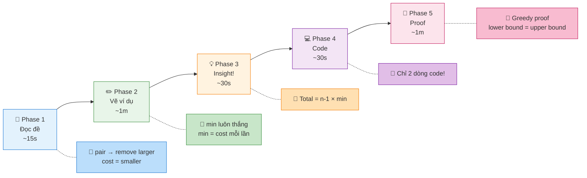

### Phase 1: Đọc đề — 15 giây

```
  🧠 "Hmm... pick a pair, remove larger, cost = smaller..."

  Ghi ra giấy ngay:
    ✏️ Each op: pair(a, b) → remove max(a,b), cost = min(a,b)
    ✏️ Goal: arr size → 1
    ✏️ Find: minimum total cost

  🧠 "Thú vị... cost = phần tử NHỎ hơn."
  🧠 "Nếu luôn dùng phần tử nhỏ nhất → cost NHỎ nhất mỗi lần?"
  🧠 "→ Greedy sense! Kiểm tra giả thuyết..."
```

### Phase 2: Vẽ ví dụ — 1 phút

```
  Tự tạo ví dụ: arr = [5, 1, 3]

  🧠 "min = 1. Thử dùng 1 cho tất cả trận:"

  Trận 1: (1, 5) → xóa 5, cost=1 → [1, 3]
  Trận 2: (1, 3) → xóa 3, cost=1 → [1]
  Total = 2

  🧠 "Thử KHÔNG dùng min trước:"
  Trận 1: (3, 5) → xóa 5, cost=3 → [1, 3]
  Trận 2: (1, 3) → xóa 3, cost=1 → [1]
  Total = 4 > 2 ← ĐẮT HƠN!

  🧠 "Confirmed! Luôn dùng min = tối ưu!"
  🧠 "Công thức: (n-1) × min = (3-1) × 1 = 2 ✅"
```

### Phase 3: Insight — 30 giây

```
  🧠 "Tại sao min luôn tối ưu?"

  1. min KHÔNG BAO GIỜ bị loại (luôn là nhỏ hơn trong pair)
  2. min có thể tham gia MỌI n-1 trận
  3. Cost mỗi trận = min = THẤP NHẤT có thể
  4. Tổng = (n-1) × min = LOWER BOUND!

  🧠 "Vậy chỉ cần tìm min và nhân (n-1). Done!"
```

### Phase 4: Code — 30 giây

```
  🧠 "Code 2 dòng:"
    const min = Math.min(...arr);
    return (arr.length - 1) * min;

  🧠 "O(n) time, O(1) space. Optimal."
  🧠 "Edge case: n=1 → return 0 ✅ (auto-handled!)"
```

### Phase 5: Nếu interviewer hỏi tiếp

```
  Q: "Chứng minh greedy là optimal?"
  A: "Mỗi operation cost ≥ min (vì cost = smaller ≥ min).
      Cần n-1 operations → total ≥ (n-1) × min.
      Chiến thuật dùng min đạt đúng (n-1) × min.
      Lower bound = upper bound → optimal."

  Q: "Nếu cost = max(pair) thì sao?"
  A: "MAX sẽ bị loại mỗi lần (nó là larger).
      Hmm... không, MAX sẽ sống vì cost = max(pair) chỉ
      là chi phí, không phải quyết định xóa ai.
      Cần suy nghĩ lại..."
      
  Q: "Nếu remove SMALLER thay vì larger?"
  A: "Thì MAX sống sót! Cost mỗi lần = min(pair).
      Nhưng min bị loại dần → cost tăng dần.
      Trở thành bài khó hơn, cần greedy/DP."

  Q: "Math.min(...arr) có vấn đề gì?"
  A: "Stack overflow với mảng lớn! Dùng reduce hoặc for loop."
```

---

## 📊 Tổng kết — Approach Selection Guide

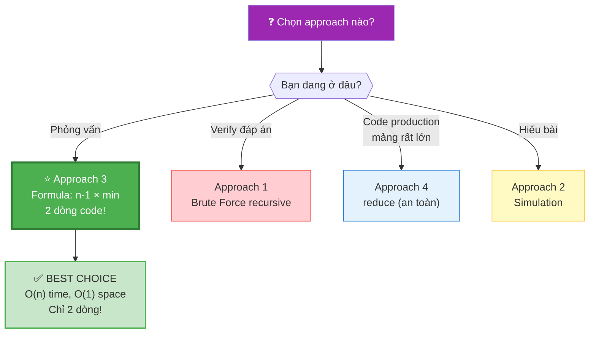

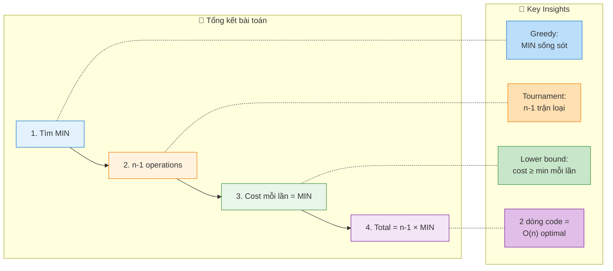

```
  ┌──────────────────────────────────────────────────────────────────────────┐
  │  Approach         │ Time        │ Space │ Pros           │ Cons          │
  ├──────────────────────────────────────────────────────────────────────────┤
  │  Brute Force      │ O(n! × n)  │ O(n)  │ Verify đáp án  │ Cực chậm      │
  │  (all combos)     │            │       │                │               │
  ├──────────────────────────────────────────────────────────────────────────┤
  │  Simulation       │ O(n²)      │ O(n)  │ Trực quan      │ Thừa!         │
  │  (while loop)     │            │       │ Dễ hiểu        │               │
  ├──────────────────────────────────────────────────────────────────────────┤
  │  Formula          │ O(n)       │ O(1)  │ 2 dòng code!   │ Stack overflow│
  │  ⭐ KHUYẾN KHÍCH  │            │       │ Tối ưu nhất    │ nếu n > 100k  │
  ├──────────────────────────────────────────────────────────────────────────┤
  │  reduce           │ O(n)       │ O(1)  │ An toàn        │ Dài hơn       │
  │  (safe)           │            │       │ Không overflow │               │
  └──────────────────────────────────────────────────────────────────────────┘

  📌 Kết luận: Formula approach là BEST CHOICE cho phỏng vấn!
     → Bài "trick" — nhìn phức tạp nhưng code 2 dòng!
     → Key: CHỨNG MINH greedy quan trọng hơn code!
     → Interviewer muốn nghe WHY, không chỉ HOW!
```

---

## Edge Cases Chi Tiết

```
  ┌───────────────────────────────────────────────────────────────────┐
  │  Case                │ Input           │ Output │ Tại sao?        │
  ├───────────────────────────────────────────────────────────────────┤
  │  Mảng 1 phần tử      │ [10]            │ 0      │ Đã size 1!      │
  │                      │                 │        │ 0 operations     │
  ├───────────────────────────────────────────────────────────────────┤
  │  Mảng 2 phần tử      │ [3, 7]          │ 3      │ 1 op, cost=3    │
  ├───────────────────────────────────────────────────────────────────┤
  │  Tất cả bằng nhau    │ [5, 5, 5, 5]    │ 15     │ (4-1)×5=15      │
  │                      │                 │        │ min=5           │
  ├───────────────────────────────────────────────────────────────────┤
  │  Có min trùng lặp    │ [2, 2, 7, 2]    │ 6      │ (4-1)×2=6       │
  │                      │                 │        │ min=2 vẫn đúng  │
  ├───────────────────────────────────────────────────────────────────┤
  │  Min ở cuối mảng     │ [9, 8, 7, 1]    │ 3      │ (4-1)×1=3       │
  │                      │                 │        │ Vị trí min      │
  │                      │                 │        │ không ảnh hưởng │
  ├───────────────────────────────────────────────────────────────────┤
  │  Mảng rất lớn        │ n=10⁶, min=1    │ 999999 │ (10⁶-1)×1       │
  │                      │                 │        │ O(n) vẫn nhanh  │
  └───────────────────────────────────────────────────────────────────┘

  ⚠️ CHÚ Ý: Bài này KHÔNG có case impossible!
     → Luôn có lời giải (miễn n ≥ 1)
     → Khác với Minimum Increment by K (có return -1)
```

---

## 📚 Bài tập liên quan

```
  ┌──────────────────────────────────────────────────────────────────┐
  │  Bài                              │ Difficulty │ Pattern tương tự │
  ├──────────────────────────────────────────────────────────────────┤
  │  GfG: Min Cost Array Size 1      │ Easy       │ Greedy, (n-1)×min│
  │  LC 1000: Min Cost Merge Stones  │ Hard       │ Merge cost, DP   │
  │  LC 1167: Min Cost Connect Sticks│ Medium     │ Huffman, Heap    │
  │  LC 2208: Min Ops Halve Sum     │ Medium     │ Greedy, MaxHeap  │
  │  GfG: Huffman Coding             │ Medium     │ Greedy, Priority │
  └──────────────────────────────────────────────────────────────────┘

  📌 Thứ tự học khuyến nghị:
     1. GfG: Min Cost Array Size 1   ← BÀI NÀY (easiest, trick)
     2. LC 1167: Connect Sticks      ← Merge cost = sum → Heap
     3. LC 2208: Halve Sum           ← Greedy + MaxHeap
     4. LC 1000: Merge Stones        ← Interval DP (hard)
```
