# ➕ Minimum Increment by K Operations to Make All Equal — GfG (Easy)

> 📖 Code: [Minimum Increment by K.js](./Minimum%20Increment%20by%20K.js)

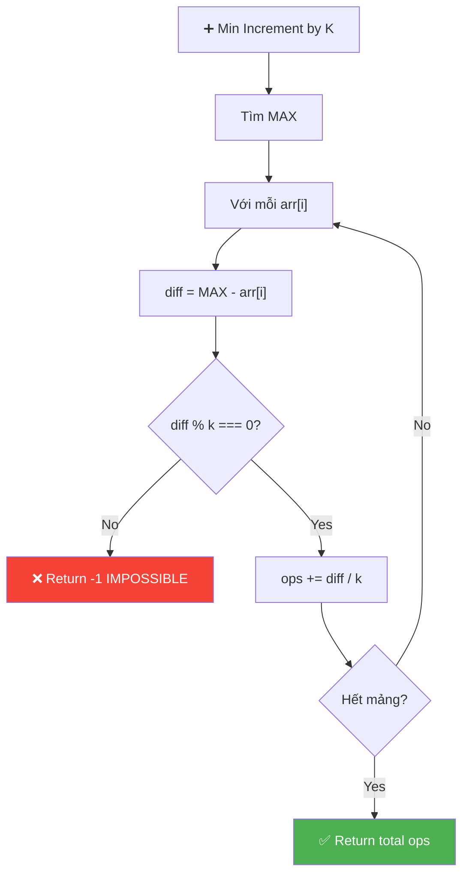

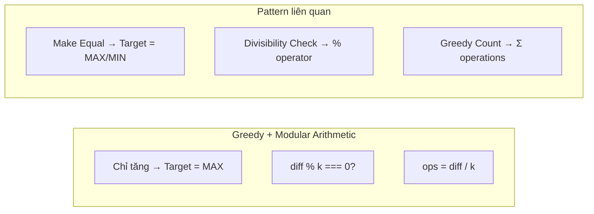

---

## R — Repeat & Clarify

🧠 *"Chỉ được TĂNG k. Tất cả phải bằng MAX! Nếu (max - arr[i]) % k ≠ 0 → KHÔNG THỂ!"*

> 🎙️ *"Given array and integer k, find minimum number of operations (each increments one element by k) to make all elements equal. Return -1 if impossible."*

### Clarification Questions

```
Q: Chỉ được INCREMENT (tăng), không được DECREMENT?
A: Đúng! Chỉ +k, không -k

Q: Target value là gì?
A: Phải là MAX! Vì chỉ tăng được → tất cả phải ≥ max → phải = max!

Q: Khi nào impossible?
A: Khi (max - arr[i]) KHÔNG chia hết cho k → không thể đúng k bước!
```

---

## 🧠 Bản chất bài toán — Hiểu để NHỚ, không chỉ để GIẢI

### Hình dung bằng TRỤC SỐ

```
  Tưởng tượng mỗi phần tử là 1 ĐIỂM trên trục số.
  Mỗi thao tác +k = NHẢY sang phải đúng k bước!

  arr = [4, 7, 19, 16], k = 3

  Trục số:
   0  1  2  3  4  5  6  7  8  9 10 11 12 13 14 15 16 17 18 19 20
               ↑        ↑                       ↑            ↑
              arr[0]   arr[1]                  arr[3]       arr[2]=MAX

  Câu hỏi: Mỗi điểm nhảy +3 liên tục, tất cả có HẠ CÁNH ở 19 không?

  arr[0]=4:  4 → 7 → 10 → 13 → 16 → 19 ✅ (5 bước)
  arr[1]=7:  7 → 10 → 13 → 16 → 19      ✅ (4 bước)
  arr[3]=16: 16 → 19                     ✅ (1 bước)
  arr[2]=19: Đã ở 19!                    ✅ (0 bước)
```

### Tại sao target PHẢI là MAX? — Chứng minh bằng PHẢN CHỨNG

```
  Vì chỉ được TĂNG (cộng k), KHÔNG ĐƯỢC GIẢM!

  Giả sử target ≠ max:

  Case 1: target < max
    → Phần tử max KHÔNG THỂ giảm xuống target!
    → BẤT KHẢ THI! ❌

  Case 2: target > max
    → TẤT CẢ phần tử đều phải tăng thêm (kể cả max!)
    → Tốn THÊM thao tác → KHÔNG TỐI ƯU! ❌

  Case 3: target = max
    → Max không cần làm gì (0 thao tác)
    → Các phần tử khác chỉ cần tăng vừa đủ
    → TỐI ƯU NHẤT! ✅

  ⚠️ LƯU Ý: Nếu đề cho phép CẢ TĂNG VÀ GIẢM:
    → Target không nhất thiết là MAX!
    → Target có thể là bất kỳ giá trị nào mà mọi phần tử đều đạt được
    → Bài toán sẽ KHÓ hơn nhiều!
```

### Tại sao `diff % k === 0`? — Bài toán SỐ HỌC đơn giản

```
  Từ arr[i], mỗi lần +k, ta đi qua các điểm:
    arr[i], arr[i]+k, arr[i]+2k, arr[i]+3k, ...

  → Tất cả các điểm ĐẠT ĐƯỢC = arr[i] + n×k  (n = 0, 1, 2, ...)

  Muốn đạt max: arr[i] + n×k = max
    → n×k = max - arr[i] = diff
    → n = diff / k

  n phải là SỐ NGUYÊN KHÔNG ÂM (không thể nhảy nửa bước!)
    → diff phải CHIA HẾT cho k: diff % k === 0

  Ví dụ IMPOSSIBLE:
    arr[i] = 4, max = 8, k = 3
    diff = 4 → 4 % 3 = 1 ≠ 0
    Các điểm đạt được: 4 → 7 → 10 → 13 → ...
                                ↑
                              NHẢY QUA 8! Không bao giờ chạm!

  📌 Kỹ năng chuyển giao:
    "Có thể đi từ A đến B bằng bước k?"
    → Tương đương: (B - A) % k === 0
    → Đây là bài toán ĐỒNG DƯ (Modular Arithmetic)!
```

### Mối liên hệ với các bài khác

```
  ┌─────────────────────────────────────────────────────────────────┐
  │  "Make all equal" problems — Cùng PATTERN, khác CONSTRAINT     │
  ├─────────────────────────────────────────────────────────────────┤
  │  Chỉ TĂNG k            → Target = MAX,  check diff%k          │
  │  Chỉ GIẢM k            → Target = MIN,  check diff%k          │
  │  Tăng HOẶC Giảm k      → Check (a-b)%k với mọi cặp!          │
  │  Tăng/Giảm bất kỳ      → Target = Median (tối ưu nhất)       │
  │  Cost = |diff|          → Target = Median, tổng |arr[i]-med|  │
  │  Cost = diff²           → Target = Mean, tổng (arr[i]-mean)²  │
  └─────────────────────────────────────────────────────────────────┘

  → Bài này là VERSION ĐƠN GIẢN NHẤT vì:
     1. Chỉ 1 hướng (tăng) → target xác định ngay (MAX)
     2. Bước cố định k → chỉ cần check modular
     3. Không có cost phức tạp → chỉ đếm số lần
```

---

## 🧭 Luồng Suy Nghĩ — Từ đọc đề đến solution

> 💡 Phần này dạy bạn **CÁCH TƯ DUY** để tự giải bài, không chỉ biết đáp án.
> Mỗi bước đều có **lý do tại sao**, để bạn áp dụng cho bài khó hơn.

### Bước 1: Đọc đề → Gạch chân KEYWORDS

```
  Đề bài: "Find minimum operations to make all elements equal.
           Each operation increments one element by k. Return -1 if impossible."

  Gạch chân:
    "minimum operations"  → COUNTING / GREEDY
    "all elements equal"  → TÌM TARGET VALUE
    "increments by k"     → CHỈ TĂNG, bước cố định k
    "return -1"           → CÓ THỂ IMPOSSIBLE

  🧠 Tự hỏi ngay:
    1. "Target value là gì?" → Chỉ tăng → phải là MAX!
    2. "Khi nào impossible?" → Khi không thể nhảy đúng k bước tới target
    3. "Bước cố định k?"     → Modular arithmetic! diff % k check!

  📌 Kỹ năng chuyển giao:
    Khi đề nói "make all equal" → HỎI NGAY: "Target là gì?"
    Khi đề nói "increment by k" → NGHĨ NGAY: Modular arithmetic
    Khi đề nói "return -1"      → CẦN xác định: Điều kiện impossible
```

### Bước 2: Vẽ ví dụ NHỎ bằng tay → Tìm PATTERN

```
  Lấy ví dụ: arr = [2, 5, 8], k = 3

  max = 8

  arr[0]=2: 2 → 5 → 8           (2 bước) diff=6, 6/3=2 ✅
  arr[1]=5: 5 → 8               (1 bước) diff=3, 3/3=1 ✅
  arr[2]=8: đã bằng max!        (0 bước) diff=0, 0/3=0 ✅
  Total = 2 + 1 + 0 = 3

  🧠 Quan sát:
    1. diff LUÔN chia hết cho k! (6%3=0, 3%3=0, 0%3=0)
       → Vì 2, 5, 8 cách nhau đúng 3 → cùng "nhóm modulo 3"!

    2. Nếu thay arr = [2, 5, 9]:
       arr[0]=2: diff = 9-2 = 7, 7%3 = 1 ≠ 0 → IMPOSSIBLE!
       → 2 mod 3 = 2, nhưng 9 mod 3 = 0 → KHÁC nhóm!

  💡 INSIGHT SÂU: Tất cả phần tử phải cùng "nhóm modulo k"!
     arr[i] % k phải BẰNG NHAU cho mọi i!

     Chứng minh: diff = max - arr[i]
     diff % k = 0 ↔ max % k = arr[i] % k
     → Tất cả arr[i] % k phải bằng max % k!

  📌 Kỹ năng chuyển giao:
    Khi bài liên quan đến "bước k", hãy nghĩ đến MODULO:
    Hai số A, B "đạt được lẫn nhau" bằng bước k
    ↔ A % k === B % k (cùng nhóm dư)
```

### Bước 3: Viết Brute Force → tìm cách tối ưu

```
  🧠 Brute Force (mô phỏng):
    Với mỗi phần tử, thực sự +k liên tục cho tới khi = max
    → Chậm vì phải loop từng bước!

    while (arr[i] < max) { arr[i] += k; ops++; }
    → Worst case: O(max_diff / k) cho MỖI phần tử

  💡 Tối ưu: Tính TRỰC TIẾP bằng phép chia!
    Số bước = diff / k  (nếu diff % k === 0)
    → O(1) cho mỗi phần tử! Không cần loop!

  📌 Kỹ năng chuyển giao:
    Khi bài "đếm số bước để đạt X" với bước CỐ ĐỊNH:
    → ĐỪNG mô phỏng từng bước! Dùng PHÉP CHIA!
    → steps = distance / step_size  (nếu chia hết)
    → Giảm từ O(distance) xuống O(1)!
```

### Bước 4: Tổng kết — Cây quyết định

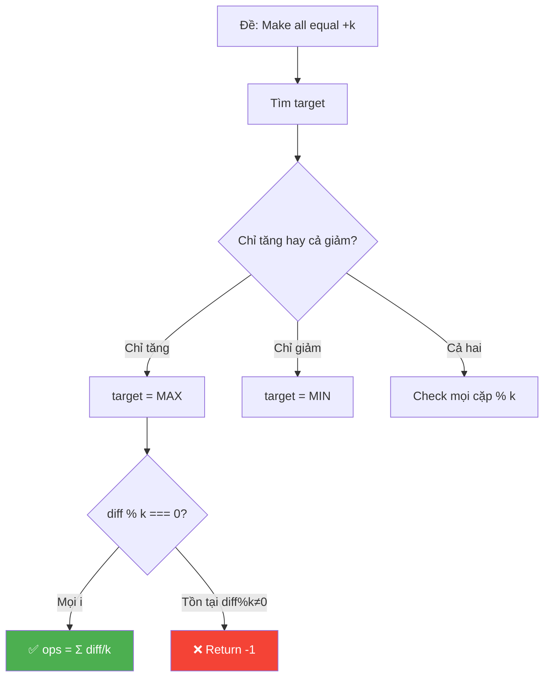

```
  📌 QUY TRÌNH TƯ DUY TỔNG QUÁT:

  ┌──────────────────────────────────────────────────────────────┐
  │  1. ĐỌC ĐỀ → gạch chân "make equal", "increment by k"     │
  │     → Xác định: chỉ tăng? cả giảm? bước cố định k?        │
  │                                                              │
  │  2. XÁC ĐỊNH TARGET                                         │
  │     → Chỉ tăng → MAX | Chỉ giảm → MIN                     │
  │     → Cả hai → phức tạp hơn (cần check GCD/modular)        │
  │                                                              │
  │  3. CHECK KHẢ THI                                           │
  │     → diff % k === 0 cho MỌI phần tử                       │
  │     → Tương đương: mọi arr[i] % k phải BẰNG NHAU           │
  │                                                              │
  │  4. ĐẾM THAO TÁC                                           │
  │     → Dùng phép chia (diff/k), KHÔNG mô phỏng từng bước   │
  │     → Tổng = Σ (max - arr[i]) / k                          │
  └──────────────────────────────────────────────────────────────┘
```

---

## E — Examples

```
VÍ DỤ 1: arr = [4, 7, 19, 16], k = 3

  max = 19
  Element 4:  (19 - 4) / 3  = 15 / 3 = 5 ops
  Element 7:  (19 - 7) / 3  = 12 / 3 = 4 ops
  Element 19: (19 - 19) / 3 = 0 / 3  = 0 ops
  Element 16: (19 - 16) / 3 = 3 / 3  = 1 op
  Total = 5 + 4 + 0 + 1 = 10 ✅

VÍ DỤ 2: arr = [4, 4, 4, 4], k = 3
  Đã bằng nhau → 0 ops ✅

VÍ DỤ 3: arr = [4, 2, 6, 8], k = 3
  max = 8
  (8 - 4) = 4 → 4 % 3 = 1 ≠ 0 → IMPOSSIBLE! → -1 ✅
```

### Minh họa trực quan từng bước nhảy

```
  VÍ DỤ 1 — Visualize trên trục số:

  k = 3 (mỗi bước nhảy 3 đơn vị)

  arr[0]=4:   4 ──→ 7 ──→ 10 ──→ 13 ──→ 16 ──→ [19]   5 nhảy
  arr[1]=7:        7 ──→ 10 ──→ 13 ──→ 16 ──→ [19]     4 nhảy
  arr[2]=19:                                     [19]     0 nhảy
  arr[3]=16:                              16 ──→ [19]     1 nhảy
                                                          ────
                                                Total:    10 ✅

  VÍ DỤ 3 — Tại sao IMPOSSIBLE:

  k = 3, max = 8

  arr[0]=4:   4 ──→ 7 ──→ 10 ──→ 13 ...
                         ↑
                     NHẢY QUA 8!
                  7 + 3 = 10 ≠ 8 → Không thể dừng ở 8!

  Bằng số học: 4 % 3 = 1, nhưng 8 % 3 = 2
               → KHÁC NHÓM DƯ → Bất khả thi!
```

---

## A — Approach

```
💡 KEY INSIGHTS:
  1. Chỉ tăng → target PHẢI là MAX (vì không thể giảm max!)
  2. Mỗi element cần (max - arr[i]) / k operations
  3. Nếu (max - arr[i]) % k ≠ 0 → KHÔNG THỂ → return -1

  Thuật toán:
    1. Tìm max
    2. Với mỗi phần tử: check chia hết k, cộng dồn ops
    3. Return tổng ops (hoặc -1)
```

---

## C — Code

```javascript
function minOps(arr, k) {
  // Tìm max — target phải là max!
  const max = Math.max(...arr);
  let ops = 0;

  for (let i = 0; i < arr.length; i++) {
    const diff = max - arr[i];

    // Không chia hết → impossible!
    if (diff % k !== 0) return -1;

    ops += diff / k;
  }
  return ops;
}
```

### Trace: arr = [4, 7, 19, 16], k = 3

```
  max = 19

  i=0: diff = 19-4 = 15, 15%3=0 ✅ ops += 15/3 = 5
  i=1: diff = 19-7 = 12, 12%3=0 ✅ ops += 12/3 = 4
  i=2: diff = 19-19 = 0, 0%3=0  ✅ ops += 0/3 = 0
  i=3: diff = 19-16 = 3, 3%3=0  ✅ ops += 3/3 = 1

  Total ops = 5 + 4 + 0 + 1 = 10 ✅
```

---

## O — Optimize

```
  Time:  O(n) — duyệt 1 lần tìm max + 1 lần tính ops
  Space: O(1) — chỉ dùng biến max, ops
```

### Có thể tối ưu hơn không?

```
  🧠 Câu hỏi: "2 vòng duyệt (tìm max + tính ops) → gộp 1 vòng được không?"

  ✅ CÓ! Nhưng KHÔNG NÊN trong phỏng vấn:

  Cách gộp 1 vòng:
    let max = -Infinity, ops = 0;
    for (let i = 0; i < arr.length; i++) {
      if (arr[i] > max) max = arr[i];
    }
    // Vẫn CẦN vòng riêng vì max chưa biết ở vòng đầu!
    // → KHÔNG THỂ gộp thực sự! Max phải biết TRƯỚC khi tính diff!

  ⚠️ Kết luận: PHẢI 2 pass (hoặc dùng Math.max(...arr) rồi 1 for)
     Không thể 1 pass vì cần biết max TRƯỚC khi tính diff!

  ⚠️ Caveat về Math.max(...arr):
     Math.max(...arr) dùng spread → push tất cả lên call stack
     Nếu arr rất lớn (n > 100,000) → có thể Stack Overflow!
     → Giải pháp: dùng vòng for tìm max thủ công:
        let max = arr[0];
        for (let i = 1; i < arr.length; i++) {
          if (arr[i] > max) max = arr[i];
        }
```

### Đã tối ưu NHẤT chưa?

```
  ✅ ĐÃ TỐI ƯU NHẤT!

  Chứng minh Lower Bound:
    → Phải xem MỌI phần tử ít nhất 1 lần (để biết max, để check diff%k)
    → Ω(n) là lower bound → O(n) đã optimal!
    → Không có thuật toán nào < O(n) cho bài này.
```

---

## T — Test

```
  [4, 7, 19, 16] k=3     → 10     ✅
  [4, 4, 4, 4]   k=3     → 0      ✅ Already equal
  [4, 2, 6, 8]   k=3     → -1     ✅ Impossible
  [21, 33, 9, 45, 63] k=6 → 24    ✅
  [5]            k=2      → 0      ✅ Single element
```

### Edge Cases Chi Tiết

```
  ┌───────────────────────────────────────────────────────────────────┐
  │  Case                │ Input          │ Output │ Tại sao?        │
  ├───────────────────────────────────────────────────────────────────┤
  │  Mảng 1 phần tử      │ [5], k=2       │ 0      │ Chỉ có 1 → đã  │
  │                      │                │        │ bằng nhau!       │
  ├───────────────────────────────────────────────────────────────────┤
  │  Tất cả bằng nhau    │ [4,4,4,4], k=3 │ 0      │ diff=0 cho mọi  │
  │                      │                │        │ phần tử          │
  ├───────────────────────────────────────────────────────────────────┤
  │  k = 1               │ [3,7,5], k=1   │ 8      │ LUÔN khả thi!   │
  │                      │                │        │ diff%1=0 luôn    │
  │                      │                │        │ (7-3)+(7-5)=4+2  │
  ├───────────────────────────────────────────────────────────────────┤
  │  Có phần tử = max    │ [5,5,5,2], k=3 │ 1      │ 3 cái đã = max  │
  │  (nhiều max)         │                │        │ chỉ 2 cần +3    │
  ├───────────────────────────────────────────────────────────────────┤
  │  diff%k≠0 ở GIỮA    │ [1,4,7], k=3   │ -1     │ max=7            │
  │                      │                │        │ 7-4=3 ✅         │
  │                      │                │        │ 7-1=6 ✅         │
  │                      │                │        │ Hmm, 6%3=0 → 2! │
  │                      │                │        │ Total = 2+1 = 3  │
  ├───────────────────────────────────────────────────────────────────┤
  │  Mảng 2 phần tử      │ [3,8], k=3     │ -1     │ 8-3=5, 5%3=2≠0  │
  │  impossible          │                │        │ 3%3=0 ≠ 8%3=2   │
  └───────────────────────────────────────────────────────────────────┘

  ⚠️ CHÚ Ý: k=1 là "cheat code"! Bước 1 luôn chia hết → LUÔN khả thi!
     → Edge case interviewer hay hỏi: "Khi nào luôn có lời giải?"
     → Trả lời: "Khi k = 1, vì mọi số nguyên đều chia hết cho 1"
```

---

## 🗣️ Interview Script

### 🎙️ Think Out Loud — Mô phỏng phỏng vấn thực

> ⚠️ Script này dạy cách **NÓI**, không phải cách CODE.
> Mỗi đoạn = cách bạn **PHÁT BIỂU** trong phỏng vấn thực!

```
  ╔══════════════════════════════════════════════════════════════╗
  ║  🕐 FULL INTERVIEW SIMULATION — 1h30 (90 phút)             ║
  ║                                                              ║
  ║  00:00-05:00  Introduction + Icebreaker         (5 min)     ║
  ║  05:00-45:00  Problem Solving                   (40 min)    ║
  ║  45:00-60:00  Deep Technical Probing            (15 min)    ║
  ║  60:00-75:00  Variations + Extensions           (15 min)    ║
  ║  75:00-85:00  System Design at Scale            (10 min)    ║
  ║  85:00-90:00  Behavioral + Q&A                  (5 min)     ║
  ╚══════════════════════════════════════════════════════════════╝
```

```
  ╔══════════════════════════════════════════════════════════════╗
  ║  PART 1: INTRODUCTION (00:00 — 05:00)                       ║
  ╚══════════════════════════════════════════════════════════════╝

  👤 "Tell me about yourself and a time you dealt with
      a feasibility check before optimization."

  🧑 "I'm a frontend engineer with [X] years of experience.
      A relevant example: I was building a data normalization
      pipeline. We had sensor readings from multiple devices,
      and we needed all readings to reach the same calibration
      level by adjusting them in fixed increments.

      The first question was: IS this even possible?
      Not all readings can reach the same target if the
      difference isn't divisible by the step size.

      I realized this is a modular arithmetic problem.
      Two numbers are reachable by a fixed step k if and
      only if they belong to the same CONGRUENCE CLASS
      modulo k. If any reading was in a different class,
      calibration was impossible.

      Once feasibility was confirmed, the count was trivial:
      sum of all differences divided by k.

      That's the exact pattern for this problem."

  👤 "Great. Let's formalize that."
```

```
  ╔══════════════════════════════════════════════════════════════╗
  ║  PART 2: PROBLEM SOLVING (05:00 — 45:00)                   ║
  ╚══════════════════════════════════════════════════════════════╝

  ──────────────── 05:00 — Clarify (5 phút) ────────────────

  👤 "Given an array and an integer k, find the minimum number
      of operations to make all elements equal. Each operation
      increments one element by k. Return minus 1 if impossible."

  🧑 "Let me clarify the constraints carefully.

      I can only INCREMENT — add k. No subtraction.
      Each operation affects exactly ONE element.
      I need ALL elements to become the SAME value.

      First key realization: what is the target value?
      Since I can only INCREASE elements, no element can
      decrease. The maximum element can't go down.
      So every element must reach AT LEAST the maximum.

      Can the target be HIGHER than the maximum?
      Yes technically, but that would waste operations —
      I'd need to increment even the max element.
      So the OPTIMAL target is exactly the maximum.

      Second key realization: when is this IMPOSSIBLE?
      Starting from arr at i, adding k repeatedly gives:
      arr at i, arr at i plus k, arr at i plus 2k, and so on.
      I can only land on values that are arr at i plus
      some multiple of k. If the max is NOT in this sequence,
      it's impossible.

      Mathematically: max minus arr at i must be
      divisible by k. If not — impossible for that element,
      and therefore impossible for the entire problem.

      Array has positive integers, n at least 1."

  ──────────────── 10:00 — The Number Line Analogy (4 phút) ────────

  🧑 "I like to visualize this on a NUMBER LINE.

      Each element is a point on the number line.
      Each operation is a JUMP of exactly k units to the right.
      The question is: can every point REACH the max
      by jumping k steps?

      For arr equal [4, 7, 19, 16] with k equal 3:

      Element 4: 4, 7, 10, 13, 16, 19. Five jumps. Reaches 19!
      Element 7: 7, 10, 13, 16, 19. Four jumps. Reaches 19!
      Element 16: 16, 19. One jump. Reaches 19!
      Element 19: already at 19. Zero jumps.

      All elements can reach 19. Total: 5 plus 4 plus 1 plus 0
      equal 10 operations.

      Now for arr equal [4, 2, 6, 8] with k equal 3:

      Element 4: 4, 7, 10, 13... JUMPS OVER 8!
      4 mod 3 equal 1, but 8 mod 3 equal 2.
      Different congruence classes. Impossible!

      The physical analogy: imagine a frog on a number line
      that can only jump exactly k units forward.
      If the landing pad is at a distance that's NOT
      a multiple of k, the frog can never land on it."

  ──────────────── 14:00 — Modular Arithmetic Insight (4 phút) ────

  🧑 "The deeper insight: this is about CONGRUENCE CLASSES.

      For step size k, the number line is partitioned into
      k groups: numbers with remainder 0, 1, 2, up to k minus 1
      when divided by k.

      Two numbers are reachable from each other by adding k
      if and only if they're in the SAME congruence class.

      For k equal 3: three classes.
      Class 0: 0, 3, 6, 9, 12, 15, 18...
      Class 1: 1, 4, 7, 10, 13, 16, 19...
      Class 2: 2, 5, 8, 11, 14, 17, 20...

      In arr equal [4, 7, 19, 16]:
      4 mod 3 equal 1, 7 mod 3 equal 1, 19 mod 3 equal 1,
      16 mod 3 equal 1. ALL in class 1. Possible!

      In arr equal [4, 2, 6, 8]:
      4 mod 3 equal 1, 2 mod 3 equal 2.
      Different classes. Impossible!

      So the feasibility check is: all arr at i mod k
      must be EQUAL. One different value and we return minus 1.

      This is equivalent to checking diff mod k equal 0
      for each element, where diff equal max minus arr at i."

  ──────────────── 18:00 — Algorithm (3 phút) ────────────────

  🧑 "The algorithm is straightforward:

      Step 1: Find the maximum element.
      Step 2: For each element, compute diff equal max minus arr at i.
      Step 3: If diff mod k is not 0, return minus 1 immediately.
      Step 4: Otherwise, add diff divided by k to the total.
      Step 5: Return the total.

      The diff divided by k gives the exact number of
      jumps needed for that element. No simulation needed —
      it's direct division."

  ──────────────── 21:00 — Trace bằng LỜI (4 phút) ────────────────

  🧑 "Let me trace with arr equal [4, 7, 19, 16], k equal 3.
      max equal 19.

      Element 4: diff equal 19 minus 4 equal 15.
      15 mod 3 equal 0 — feasible.
      Operations: 15 divided by 3 equal 5.

      Element 7: diff equal 19 minus 7 equal 12.
      12 mod 3 equal 0 — feasible.
      Operations: 12 divided by 3 equal 4.

      Element 19: diff equal 0.
      0 mod 3 equal 0 — trivially feasible.
      Operations: 0.

      Element 16: diff equal 19 minus 16 equal 3.
      3 mod 3 equal 0 — feasible.
      Operations: 3 divided by 3 equal 1.

      Total: 5 plus 4 plus 0 plus 1 equal 10."

  🧑 "Now the impossible case: arr equal [4, 2, 6, 8], k equal 3.
      max equal 8.

      Element 4: diff equal 8 minus 4 equal 4.
      4 mod 3 equal 1 — NOT zero!
      Return minus 1 IMMEDIATELY.

      I don't even need to check the remaining elements.
      This is the FAIL-FAST pattern: the moment one element
      fails the divisibility check, the entire problem
      is impossible."

  ──────────────── 25:00 — Write Code (3 phút) ────────────────

  🧑 "Let me code this.

      [Vừa viết vừa nói:]

      First, find the max of the array.
      I'll use Math dot max with spread for interview clarity.

      Initialize ops equal 0.

      Loop through each element:
      Compute diff equal max minus arr at i.
      If diff mod k is not 0, return minus 1.
      Otherwise, ops plus equals diff divided by k.

      Return ops.

      That's about 8 lines of actual logic.

      Production note: Math dot max with spread can overflow
      the call stack for very large arrays — same caveat
      as Math dot min. A for loop is safer."

  ──────────────── 28:00 — Edge Cases (3 phút) ────────────────

  🧑 "Edge cases.

      Single element: [5], k equal 2.
      Already equal to itself! Zero operations.

      All equal: [4, 4, 4, 4], k equal 3.
      diff equal 0 for every element. Total: 0.

      k equal 1: this is the 'CHEAT CODE.'
      Every integer difference is divisible by 1.
      So it's ALWAYS feasible when k equal 1.
      Total: sum of all max minus arr at i.

      Multiple elements equal to max: [5, 5, 5, 2], k equal 3.
      Only element 2 needs incrementing: diff equal 3,
      3 divided by 3 equal 1. Total: 1.

      Large and small: [1, 1000000], k equal 3.
      diff equal 999999. 999999 mod 3 equal 0.
      Operations: 333333. Feasible!"

  ──────────────── 31:00 — Why target must be MAX (3 phút) ────────

  👤 "Prove that the target must be the maximum."

  🧑 "Three cases cover ALL possibilities.

      Case 1: target less than max.
      The max element needs to DECREASE to reach the target.
      But I can only increment. Decreasing is impossible.
      So target less than max is infeasible.

      Case 2: target greater than max.
      Now EVERY element needs to increase, including max.
      Compared to target equal max, every element needs
      at least as many operations, and max needs ADDITIONAL
      operations it didn't need before.
      Total strictly increases. Not optimal.

      Case 3: target equal max.
      Max needs zero operations.
      All other elements use the minimum number of jumps.
      This is optimal.

      By exhaustion of cases, target must be max."

  ──────────────── 34:00 — Two-pass necessity (3 phút) ────────────

  👤 "Can you do this in a single pass?"

  🧑 "Good question. I need to think carefully.

      To compute diff for each element, I need to know max.
      But I don't know max until I've seen ALL elements.
      So I can't compute diff during the same pass
      that finds max.

      Therefore, I need TWO passes:
      Pass 1: find max.
      Pass 2: compute diffs, check divisibility, sum operations.

      Or equivalently: one Math dot max call plus one for loop.

      Can I combine into one pass with deferred computation?
      I could accumulate the sum of all elements and n times max
      separately... but I still don't know max until the end.

      The answer is: two passes are NECESSARY.
      But both are O of n, so total is still O of n.
      The constant factor of 2n versus n doesn't change
      the asymptotic complexity."

  ──────────────── 37:00 — Complexity (3 phút) ────────────────

  🧑 "Time: O of n. Two passes through the array.
      Pass 1: find max in O of n.
      Pass 2: compute operations in O of n.
      Total: 2n — linear.

      Space: O of 1. Just variables for max, diff, and ops.

      Is this optimal? Yes — I must read every element
      at least once to check divisibility and compute operations.
      Omega of n is the lower bound. My algorithm meets it.

      There's no way to avoid reading all elements because
      a single 'bad' element could make the answer minus 1.
      I can't know until I check all of them."

  ──────────────── 40:00 — Alternative: modular pre-check (3 phút) ──

  👤 "Is there a faster way to check feasibility?"

  🧑 "Yes — a one-liner pre-check!

      Instead of checking diff mod k for each element,
      I can check: do all elements have the same remainder
      when divided by k?

      If arr at 0 mod k differs from arr at i mod k for any i,
      return minus 1 immediately.

      This is equivalent but sometimes conceptually cleaner.
      It separates the FEASIBILITY check from the COST
      computation.

      In code: take r equal arr at 0 mod k.
      Loop: if arr at i mod k is not equal to r, return minus 1.

      Then in a second pass, compute the operations.
      Or combine: check and compute in the same loop.

      The total complexity doesn't change — still O of n."
```

```
  ╔══════════════════════════════════════════════════════════════╗
  ║  PART 3: DEEP TECHNICAL PROBING (45:00 — 60:00)            ║
  ╚══════════════════════════════════════════════════════════════╝

  ──────────────── 45:00 — k equal 0 (3 phút) ────────────────

  👤 "What if k is 0?"

  🧑 "If k equal 0, each operation adds 0 — no change!

      If all elements are already equal, the answer is 0.
      If any element differs, it's impossible — return minus 1.

      But there's a mathematical trap: diff divided by k
      would be division by zero!

      I'd add a special case at the start:
      if k equal 0, check if all elements are equal.
      If yes, return 0. If no, return minus 1.

      In practice, most problem statements guarantee k
      is at least 1, but mentioning this edge case shows
      thoroughness."

  ──────────────── 48:00 — Mathematical formula (4 phút) ────────────

  👤 "Can you express the total operations as a single formula?"

  🧑 "Yes! The total is:

      ops equal sum of max minus arr at i divided by k
      for all i from 0 to n minus 1.

      Factor out the constant:
      ops equal 1 divided by k times the sum of max minus arr at i
      for all i.

      The sum of max minus arr at i is:
      n times max minus sum of all arr at i.

      So: ops equal n times max minus totalSum, all divided by k.

      This is a CLOSED-FORM formula! I can compute it
      in one pass: find max and totalSum simultaneously,
      then apply the formula.

      Wait — but I still need to CHECK feasibility.
      The formula gives a valid integer only if the total
      difference is divisible by k AND each individual
      difference is divisible by k.

      Actually, if all elements are in the same congruence class
      mod k, then n times max minus totalSum is automatically
      divisible by k. So the closed-form works IF I first
      verify the congruence class condition."

  ──────────────── 52:00 — Why not sort? (3 phút) ────────────────

  👤 "Would sorting help?"

  🧑 "Sorting is overkill here.

      After sorting, the max is at the last position.
      I'd still need to sum all differences.
      Sorting gives O of n log n — worse than O of n.

      Sorting WOULD help if the problem asked me to find
      the OPTIMAL target for a different cost function —
      like minimizing the sum of absolute differences
      when I can both increment and decrement.
      In that case, the median is optimal, and sorting helps.

      But for this problem — increment only, target equals max —
      no sorting needed."

  ──────────────── 55:00 — Overflow concerns (5 phút) ────────────

  👤 "Any overflow concerns?"

  🧑 "In JavaScript, numbers are 64-bit floats.
      Safe integer range is up to 2 to the 53.

      The sum of differences could be large.
      If n is 100,000 and max is 1,000,000 with k equal 1,
      the total operations could be around 10 to the 11 —
      still within safe range.

      But the closed-form n times max minus totalSum:
      n times max could be 10 to the 11, and totalSum
      similar. Both are within safe range individually,
      and their difference is also safe.

      For this problem, overflow is unlikely in JavaScript.
      In languages with 32-bit integers — C++, Java —
      I'd use long or 64-bit integers.

      The Math dot max spread issue is separate:
      not numeric overflow, but STACK overflow from
      too many function arguments."
```

```
  ╔══════════════════════════════════════════════════════════════╗
  ║  PART 4: VARIATIONS (60:00 — 75:00)                         ║
  ╚══════════════════════════════════════════════════════════════╝

  ──────────────── 60:00 — Increment AND Decrement (5 phút) ────────

  👤 "What if you can both increment AND decrement by k?"

  🧑 "This changes the problem fundamentally!

      Now target doesn't have to be max. Any element can
      go UP or DOWN by k. The target can be ANY value,
      as long as all elements can reach it.

      Feasibility: all elements must be in the same
      congruence class mod k. Same check as before.

      But the OPTIMAL target is the one that minimizes
      the TOTAL number of operations.

      Each element contributes absolute value of
      target minus arr at i divided by k operations.
      This is the sum of absolute deviations divided by k.

      The sum of absolute deviations is minimized at
      the MEDIAN of the array — not the mean!

      So: sort the array, take the median, and if all elements
      are in the same congruence class, compute the total.

      Time: O of n log n for sorting.

      This is LeetCode 462 — Minimum Moves to Equal
      Elements II, but with step k instead of step 1."

  ──────────────── 65:00 — Increment by 1 only (3 phút) ────────────

  👤 "What if k equals 1?"

  🧑 "When k equals 1, the divisibility check ALWAYS passes.
      Every integer difference is divisible by 1.
      So it's ALWAYS feasible.

      Total operations: sum of max minus arr at i for all i.
      Equivalently: n times max minus totalSum.

      This is LeetCode 453 — Minimum Moves to Make Array
      Elements Equal. The insight there is that incrementing
      n minus 1 elements by 1 is EQUIVALENT to decrementing
      1 element by 1. So the target becomes the MINIMUM.
      Total: sum of arr at i minus min for all i.

      Wait — that's a different problem formulation!
      LeetCode 453 says 'increment n minus 1 elements by 1'
      while our problem says 'increment 1 element by k.'
      They look similar but have different greedy strategies."

  ──────────────── 68:00 — Minimize COST not COUNT (4 phút) ────────

  👤 "What if each increment costs arr at i — the current value?"

  🧑 "Now the cost isn't just the count of operations.
      Each increment has a COST that depends on the element.

      Incrementing a large element is more expensive than
      incrementing a small one. This changes the optimization.

      The total cost for element i is:
      the number of increments times arr at i...
      wait, the cost of each increment is arr at i at the
      TIME of the increment. But arr at i changes!

      After the first increment: arr at i plus k.
      After the second: arr at i plus 2k.
      The costs are arr at i, arr at i plus k, arr at i plus 2k...
      This is an arithmetic series!

      Total cost for element i:
      sum from j equal 0 to ops minus 1 of arr at i plus j times k.
      equals ops times arr at i plus k times ops times ops minus 1
      divided by 2.

      The target is still max, but the optimization changes.
      Elements with SMALLER values need MORE operations AND
      have lower per-operation cost. The trade-offs become
      interesting."

  ──────────────── 72:00 — Multiple possible targets (3 phút) ────────

  👤 "What if both increment by k AND decrement by k are allowed,
      and I want to minimize operations?"

  🧑 "As I mentioned, the target must be in the same congruence
      class as all elements. Among valid targets, the one
      minimizing total absolute distance divided by k
      is the MEDIAN of the reachable values.

      But there's a subtlety: the target must be an actual
      value reachable from the congruence class, not just
      the statistical median.

      The optimal target is the reachable value closest
      to the median. In practice, I sort the array and
      pick arr at the middle index — since all elements
      share the same congruence class, that's valid.

      Time: O of n log n for sorting.
      Space: O of 1 if sorting in place."
```

```
  ╔══════════════════════════════════════════════════════════════╗
  ║  PART 5: SYSTEM DESIGN AT SCALE (75:00 — 85:00)            ║
  ╚══════════════════════════════════════════════════════════════╝

  ──────────────── 75:00 — Real-world applications (5 phút) ────────

  👤 "Where does this pattern appear in real systems?"

  🧑 "Several domains!

      First — SIGNAL QUANTIZATION.
      In digital signal processing, analog values are
      mapped to discrete levels separated by a fixed step.
      Checking if a value CAN be represented at a given
      quantization level is exactly the modular arithmetic
      check: value mod step must equal the level's offset.

      Second — DATA NORMALIZATION in ETL pipelines.
      When aligning datasets from different sources,
      values may need to be adjusted by fixed increments
      to reach a common scale. The feasibility check ensures
      alignment is possible before committing resources.

      Third — RESOURCE PROVISIONING.
      Cloud VMs come in fixed-size tiers. Scaling up
      from a current size to a target means adding
      fixed increments. If the target isn't reachable
      from the current size, provisioning fails.

      Fourth — BATCH PROCESSING ALIGNMENT.
      In distributed systems, batch sizes must align
      to a common multiple. Making all nodes process
      the same batch size by adding fixed increments
      is exactly this problem."

  ──────────────── 80:00 — Congruence classes at scale (5 phút) ────

  👤 "How would you handle this for a billion elements?"

  🧑 "The algorithm is already O of n, so a billion elements
      takes about 4-8 seconds with careful implementation.

      Key optimizations for scale:

      First — PARALLEL FEASIBILITY CHECK.
      The modular check is embarrassingly parallel.
      Split the array across threads; each thread checks
      its partition's congruence class. If any thread
      finds a mismatch, short-circuit and return minus 1.

      Second — STREAMING SUM.
      I can compute the total operations in a single
      streaming pass using the closed-form:
      n times max minus totalSum divided by k.
      I need to know max in advance, so I either
      do two passes or use a MapReduce pattern:
      pass 1 reduces to max, pass 2 sums differences.

      Third — APPROXIMATE ANSWER.
      For very large n, if I only need an approximate
      operation count, I can sample the array,
      estimate the mean, and compute n times max minus
      estimated mean times n divided by k.
      This gives an O of 1 estimate."
```

```
  ╔══════════════════════════════════════════════════════════════╗
  ║  PART 6: BEHAVIORAL + Q&A (85:00 — 90:00)                  ║
  ╚══════════════════════════════════════════════════════════════╝

  ──────────────── 85:00 — Reflection (3 phút) ────────────────

  👤 "What would you take away from this problem?"

  🧑 "Three things.

      First, FEASIBILITY BEFORE OPTIMIZATION.
      Before counting operations, I check: is this even
      possible? The modular arithmetic check is a single
      comparison per element. This 'fail-fast' pattern
      saves time and catches impossible cases early.

      Second, MODULAR ARITHMETIC as a problem-solving tool.
      The insight that reachability by step k is equivalent
      to same congruence class mod k is powerful.
      It appears in problems about divisibility, periodicity,
      and cyclic structures. Whenever a problem involves
      fixed-size jumps, I think MODULO.

      Third, DIVISION REPLACES SIMULATION.
      Instead of simulating each jump — arr at i plus k,
      plus k, plus k... — I compute diff divided by k directly.
      This reduces O of diff divided by k per element to O of 1.
      The lesson: when step size is fixed, count the steps
      with division, don't walk them."

  ──────────────── 88:00 — Questions (2 phút) ────────────────

  👤 "Any questions for me?"

  🧑 "A few!

      First — in your systems, do you encounter alignment
      problems where values need to be adjusted by fixed
      increments? I'm thinking of things like memory page
      alignment or batch size normalization.

      Second — the 'increment only' constraint makes this
      problem easy. If you allowed decrement too, the target
      becomes the median — a harder optimization.
      Do your interviews probe that far?

      Third — the k equal 1 special case trivializes the
      divisibility check. Do you use that as a warm-up
      before introducing the general k?"

  👤 "Excellent questions! Your explanation of congruence
      classes and the fail-fast pattern was very clear.
      The connection to signal quantization was impressive.
      We'll be in touch!"
```

```
  ╔══════════════════════════════════════════════════════════════╗
  ║  ⭐ 8 MẸO NÓI CHUYỆN TRONG PHỎNG VẤN (Min Increment K)   ║
  ╚══════════════════════════════════════════════════════════════╝

  📌 MẸO #1: Use the number line jumping analogy
     ✅ "Each element is a point on a number line.
         Each operation is a jump of exactly k units forward.
         The question: can every point reach the target
         by jumping k steps?"

  📌 MẸO #2: State the target proof by cases
     ✅ "Target less than max: infeasible — can't decrease.
         Target greater than max: suboptimal — wastes operations.
         Target equals max: optimal — minimum total operations."

  📌 MẸO #3: Explain feasibility with congruence classes
     ✅ "Two numbers are reachable by step k if and only if
         they have the same remainder mod k. All elements must
         be in the same congruence class."

  📌 MẸO #4: Show the fail-fast pattern
     ✅ "The moment ONE element fails the divisibility check,
         the entire problem is impossible. I return minus 1
         immediately without checking the rest."

  📌 MẸO #5: Know the k equal 1 special case
     ✅ "When k equals 1, it's ALWAYS feasible because
         every integer divides by 1. Total operations
         equals n times max minus totalSum."

  📌 MẹO #6: Mention two-pass necessity
     ✅ "I need max BEFORE computing diffs. Can't combine
         into one pass. Two O of n passes is still O of n."

  📌 MẸO #7: Connect to the 'Make Equal' family
     ✅ "Increment only: target equals max. This problem.
         Decrement only: target equals min. Symmetric.
         Both: target equals median. LeetCode 462.
         Increment n minus 1 by 1: target equals min. LeetCode 453."

  📌 MẸO #8: Emphasize division over simulation
     ✅ "Don't simulate jumps: 4 plus 3 plus 3 plus 3...
         Just compute: 19 minus 4 equal 15, 15 divided by 3
         equal 5. Division gives the answer in O of 1."
```

---

## 📚 Bài tập liên quan

```
  ┌──────────────────────────────────────────────────────────────────┐
  │  Bài                              │ Difficulty │ Pattern tương tự │
  ├──────────────────────────────────────────────────────────────────┤
  │  LC 453: Min Moves Equal Elements │ Medium     │ Chỉ tăng +1      │
  │  LC 462: Min Moves Equal II       │ Medium     │ Tăng/giảm 1, Med │
  │  LC 2541: Min Ops Make All Equal  │ Medium     │ Tăng/giảm, sort  │
  │  LC 1551: Min Ops Make Equal      │ Medium     │ Tăng/giảm k=1    │
  │  GfG: Make all equal (this)       │ Easy       │ Chỉ tăng +k      │
  └──────────────────────────────────────────────────────────────────┘

  📌 Thứ tự học khuyến nghị:
     1. GfG: Minimum Increment by K    ← BÀI NÀY (easiest)
     2. LC 453: Min Moves (chỉ +1)    ← target = min, count = Σ(arr[i]-min)
     3. LC 462: Min Moves II (+1/-1)  ← target = MEDIAN (không phải mean!)
     4. LC 2541: Min Ops Make Equal   ← sorting + prefix sum
```

---

## 🔬 Deep Dive — Giải thích CHI TIẾT từng dòng code

> 💡 Phần này phân tích **từng dòng code** để bạn hiểu **TẠI SAO** viết như vậy,
> không chỉ **viết gì**. Mỗi dòng đều có lý do thiết kế.

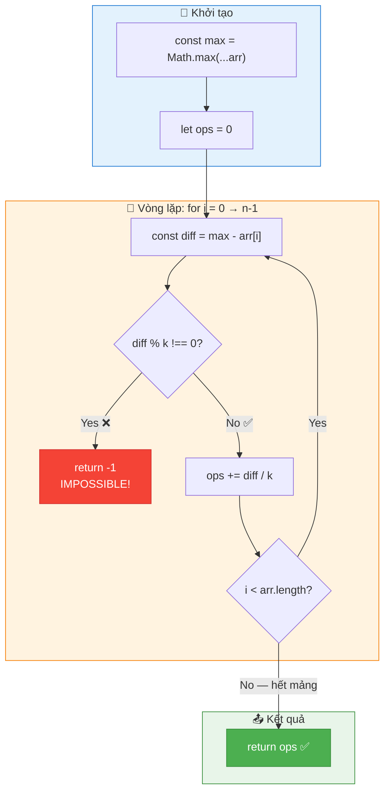

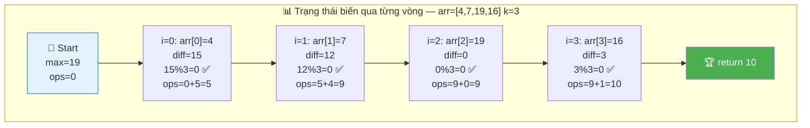

### Code đầy đủ với annotation

```javascript
function minOps(arr, k) {
  // ═══════════════════════════════════════════════════════════════
  // DÒNG 1: Tìm MAX — Xác định TARGET
  // ═══════════════════════════════════════════════════════════════
  //
  // TẠI SAO Math.max(...arr)?
  //   → Spread operator (...) "xoè" mảng thành danh sách tham số
  //   → Math.max(4, 7, 19, 16) → 19
  //
  // TRADE-OFF:
  //   ✅ Ngắn gọn, dễ đọc
  //   ❌ Với mảng > 100,000 phần tử → Stack Overflow
  //      (vì spread đẩy TẤT CẢ tham số lên call stack)
  //
  // ALTERNATIVE an toàn hơn:
  //   let max = arr[0];
  //   for (let i = 1; i < arr.length; i++) {
  //     if (arr[i] > max) max = arr[i];
  //   }
  //
  const max = Math.max(...arr);

  // ═══════════════════════════════════════════════════════════════
  // DÒNG 2: Khởi tạo bộ đếm operations
  // ═══════════════════════════════════════════════════════════════
  //
  // TẠI SAO let mà không phải const?
  //   → Vì ops sẽ THAY ĐỔI (cộng dồn) trong vòng lặp
  //   → const cho giá trị KHÔNG ĐỔI, let cho giá trị THAY ĐỔI
  //
  // TẠI SAO = 0?
  //   → Bắt đầu từ 0 vì chưa có thao tác nào
  //   → Đây là "accumulator pattern" rất phổ biến
  //
  let ops = 0;

  // ═══════════════════════════════════════════════════════════════
  // DÒNG 3-8: Vòng lặp chính — Xử lý từng phần tử
  // ═══════════════════════════════════════════════════════════════
  //
  // TẠI SAO duyệt TẤT CẢ phần tử?
  //   → Vì mỗi phần tử cần được kiểm tra:
  //     1. Có thể đạt tới max không? (check impossible)
  //     2. Nếu được, cần bao nhiêu thao tác? (tính ops)
  //
  for (let i = 0; i < arr.length; i++) {

    // ─────────────────────────────────────────────────────────────
    // DÒNG 4: Tính khoảng cách từ arr[i] tới target (max)
    // ─────────────────────────────────────────────────────────────
    //
    // TẠI SAO max - arr[i] mà không phải arr[i] - max?
    //   → Vì arr[i] ≤ max LUÔN LUÔN (max là giá trị lớn nhất!)
    //   → max - arr[i] ≥ 0 → diff luôn KHÔNG ÂM
    //   → Nếu arr[i] = max thì diff = 0 (không cần thao tác)
    //
    // INSIGHT: diff chính là "quãng đường" arr[i] cần đi
    //   → Giống bạn đứng ở km 4, cần đi tới km 19
    //   → Khoảng cách = 19 - 4 = 15 km
    //
    const diff = max - arr[i];

    // ─────────────────────────────────────────────────────────────
    // DÒNG 5-6: CHECK IMPOSSIBLE — Phép chia dư (modulo)
    // ─────────────────────────────────────────────────────────────
    //
    // TẠI SAO diff % k !== 0 thì return -1?
    //   → Mỗi thao tác +k giống "nhảy k bước"
    //   → Nếu khoảng cách KHÔNG chia hết cho bước nhảy
    //     → KHÔNG BAO GIỜ đáp trúng đích!
    //
    // VÍ DỤ TRỰC QUAN:
    //   diff = 7, k = 3
    //   Nhảy: 0 → 3 → 6 → 9 → ... (NHẢY QUA 7!)
    //   7 % 3 = 1 ≠ 0 → Không thể!
    //
    // TẠI SAO return -1 NGAY LẬP TỨC (early return)?
    //   → Chỉ cần 1 phần tử bất khả thi → TOÀN BỘ bất khả thi!
    //   → Không cần check phần tử còn lại → tiết kiệm thời gian
    //   → Đây là "fail-fast" pattern — phát hiện lỗi sớm nhất!
    //
    if (diff % k !== 0) return -1;

    // ─────────────────────────────────────────────────────────────
    // DÒNG 7: CỘNG DỒN số thao tác
    // ─────────────────────────────────────────────────────────────
    //
    // TẠI SAO diff / k?
    //   → Khoảng cách = diff, mỗi bước = k
    //   → Số bước cần = diff / k
    //
    // VÍ DỤ: diff = 15, k = 3
    //   → 15 / 3 = 5 bước (4→7→10→13→16→19)
    //
    // TẠI SAO += mà không phải =?
    //   → Cộng DỒN! Mỗi phần tử đóng góp thêm ops
    //   → ops cuối = tổng ops của TẤT CẢ phần tử
    //
    // INSIGHT TOÁN HỌC:
    //   ops = Σ (max - arr[i]) / k
    //       = (1/k) × Σ (max - arr[i])
    //       = (1/k) × (n × max - Σ arr[i])
    //   → Tổng ops tỉ lệ với "tổng khoảng cách" / bước k
    //
    ops += diff / k;
  }

  // ═══════════════════════════════════════════════════════════════
  // DÒNG 9: Return kết quả
  // ═══════════════════════════════════════════════════════════════
  //
  // Nếu đến được đây, nghĩa là:
  //   → TẤT CẢ phần tử đều qua được check diff % k === 0
  //   → ops chứa TỔNG số thao tác cần thiết
  //   → Đây là kết quả TỐI ƯU (minimum) vì:
  //     1. Target = max là target TỐI ƯU (chứng minh ở trên)
  //     2. Mỗi phần tử dùng ĐÚNG số bước tối thiểu (diff/k)
  //     3. Không có bước thừa nào!
  //
  return ops;
}
```

### Trace CHI TIẾT — Theo dõi TỪNG biến qua từng vòng lặp

```
  arr = [4, 7, 19, 16], k = 3

  ┌─────────────────────────────────────────────────────────────────────────────┐
  │  Khởi tạo:                                                                 │
  │    max = Math.max(4, 7, 19, 16) = 19                                       │
  │    ops = 0                                                                  │
  │                                                                             │
  │  ┌───────┬─────────┬──────────────┬─────────────┬───────────┬─────────────┐ │
  │  │ Vòng  │ arr[i]  │  diff        │ diff%k==0?  │ diff/k    │  ops (tích  │ │
  │  │  i    │         │  =max-arr[i] │             │           │   lũy)      │ │
  │  ├───────┼─────────┼──────────────┼─────────────┼───────────┼─────────────┤ │
  │  │  0    │   4     │  19-4  = 15  │ 15%3=0 ✅   │ 15/3 = 5  │  0+5  = 5   │ │
  │  │  1    │   7     │  19-7  = 12  │ 12%3=0 ✅   │ 12/3 = 4  │  5+4  = 9   │ │
  │  │  2    │   19    │  19-19 = 0   │ 0%3=0  ✅   │ 0/3  = 0  │  9+0  = 9   │ │
  │  │  3    │   16    │  19-16 = 3   │ 3%3=0  ✅   │ 3/3  = 1  │  9+1  = 10  │ │
  │  └───────┴─────────┴──────────────┴─────────────┴───────────┴─────────────┘ │
  │                                                                             │
  │  Tất cả phần tử đã xử lý → return ops = 10 ✅                              │
  └─────────────────────────────────────────────────────────────────────────────┘

  Trace cho case IMPOSSIBLE: arr = [4, 2, 6, 8], k = 3

  ┌─────────────────────────────────────────────────────────────────────────────┐
  │  max = 8, ops = 0                                                           │
  │                                                                             │
  │  ┌───────┬─────────┬──────────────┬─────────────┬───────────────────────────┐│
  │  │  i    │ arr[i]  │  diff        │ diff%k==0?  │ Kết quả                   ││
  │  ├───────┼─────────┼──────────────┼─────────────┼───────────────────────────┤│
  │  │  0    │   4     │  8-4 = 4     │ 4%3=1 ❌    │ return -1 NGAY LẬP TỨC!  ││
  │  │  1    │   2     │  ─ không     │ ─ không     │ KHÔNG BAO GIỜ chạy tới!   ││
  │  │  2    │   6     │    chạy      │   chạy      │ (fail-fast pattern)       ││
  │  │  3    │   8     │    tới ─     │   tới ─     │                           ││
  │  └───────┴─────────┴──────────────┴─────────────┴───────────────────────────┘│
  │                                                                             │
  │  ⚡ Early return! Phát hiện impossible ở phần tử ĐẦU TIÊN → dừng ngay!     │
  └─────────────────────────────────────────────────────────────────────────────┘
```

---

## 🧮 Chứng minh Toán học — Tại sao "cùng nhóm modulo k"

> 💡 Phần này giải thích BẢN CHẤT SỐ HỌC sâu hơn, giúp bạn hiểu thay vì chỉ nhớ.

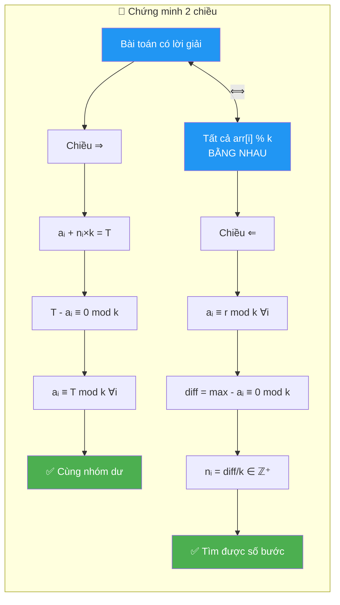

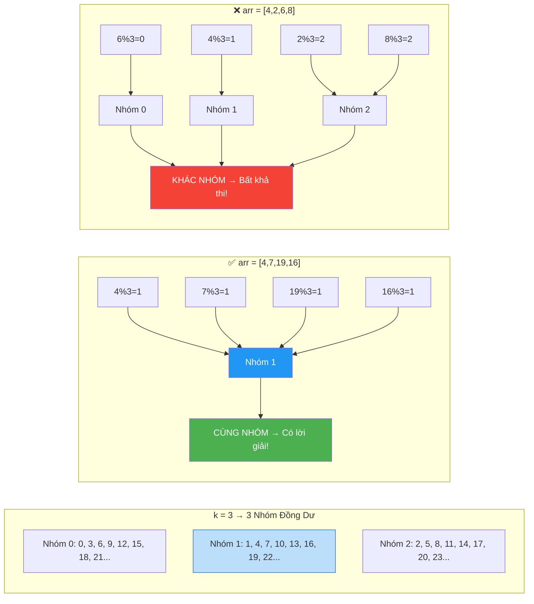

### Định lý: Tất cả phần tử phải có cùng `arr[i] % k`

```
  📐 CHỨNG MINH CHẶT CHẼ:

  Cho arr = [a₁, a₂, ..., aₙ], bước nhảy = k

  ── Điều kiện cần và đủ để có lời giải ──

  (⇒) Chiều thuận: Nếu có lời giải → tất cả cùng nhóm mod k

    Giả sử target = T (mà ta đã chứng minh T = max)
    Với mỗi aᵢ, cần nᵢ bước: aᵢ + nᵢ × k = T
      → nᵢ × k = T - aᵢ
      → (T - aᵢ) ≡ 0 (mod k)          ... (1)
      → T ≡ aᵢ (mod k)                 ... (2)

    Từ (2): aᵢ ≡ T (mod k) cho MỌI i
      → a₁ ≡ a₂ ≡ ... ≡ aₙ (mod k)    ... (3)

    ✅ Tất cả phần tử CÙNG NHÓM DƯ khi chia cho k!

  (⇐) Chiều ngược: Nếu tất cả cùng nhóm mod k → có lời giải

    Cho a₁ ≡ a₂ ≡ ... ≡ aₙ ≡ r (mod k)  (cùng dư r)
    Chọn T = max(arr), ta có: max ≡ r (mod k)

    Với mỗi aᵢ:
      diff = max - aᵢ
      aᵢ ≡ r (mod k) và max ≡ r (mod k)
      → diff = max - aᵢ ≡ r - r ≡ 0 (mod k)
      → diff chia hết cho k
      → nᵢ = diff / k là SỐ NGUYÊN KHÔNG ÂM (vì aᵢ ≤ max)

    ✅ Luôn tìm được số bước nguyên cho mọi phần tử!

  ═══════════════════════════════════════════════
   KẾT LUẬN: Bài toán có lời giải
   ⟺ Tất cả arr[i] % k BẰNG NHAU
   ⟺ Tất cả phần tử thuộc CÙNG 1 nhóm đồng dư mod k
  ═══════════════════════════════════════════════
```

### Ví dụ minh họa nhóm đồng dư

```
  k = 3 → Có 3 nhóm đồng dư: {0, 1, 2}

  Nhóm 0 (dư 0): ..., 0, 3, 6, 9, 12, 15, 18, 21, ...
  Nhóm 1 (dư 1): ..., 1, 4, 7, 10, 13, 16, 19, 22, ...
  Nhóm 2 (dư 2): ..., 2, 5, 8, 11, 14, 17, 20, 23, ...

  ┌─────────────────────────────────────────────────────────────────────┐
  │  arr = [4, 7, 19, 16], k = 3                                       │
  │                                                                     │
  │  4  % 3 = 1  → Nhóm 1 ✅                                           │
  │  7  % 3 = 1  → Nhóm 1 ✅                                           │
  │  19 % 3 = 1  → Nhóm 1 ✅                                           │
  │  16 % 3 = 1  → Nhóm 1 ✅                                           │
  │                                                                     │
  │  TẤT CẢ cùng Nhóm 1 → CÓ LỜI GIẢI!                               │
  │                                                                     │
  │  Hình dung trên trục số (chỉ hiện Nhóm 1):                         │
  │  1  4  7  10  13  16  19  22  25  ...                               │
  │     ↑  ↑             ↑   ↑                                         │
  │    [4] [7]          [16] [19]=MAX                                   │
  │                                                                     │
  │  Mọi phần tử đều nằm trên CÙNG "đường ray" → đi tới nhau được!    │
  └─────────────────────────────────────────────────────────────────────┘

  ┌─────────────────────────────────────────────────────────────────────┐
  │  arr = [4, 2, 6, 8], k = 3                                         │
  │                                                                     │
  │  4  % 3 = 1  → Nhóm 1 ❌ KHÁC!                                     │
  │  2  % 3 = 2  → Nhóm 2 ❌ KHÁC!                                     │
  │  6  % 3 = 0  → Nhóm 0 ❌ KHÁC!                                     │
  │  8  % 3 = 2  → Nhóm 2 ❌ KHÁC!                                     │
  │                                                                     │
  │  3 nhóm khác nhau → KHÔNG CÓ LỜI GIẢI!                            │
  │                                                                     │
  │  Hình dung:                                                         │
  │  Nhóm 0: 0  3  6  9  12 ...     ← 6 ở đây                         │
  │  Nhóm 1: 1  4  7  10  13 ...    ← 4 ở đây                         │
  │  Nhóm 2: 2  5  8  11  14 ...    ← 2, 8 ở đây                      │
  │                                                                     │
  │  Nằm KHÁC "đường ray" → không thể gặp nhau dù nhảy bao nhiêu!     │
  └─────────────────────────────────────────────────────────────────────┘
```

### Cách check nhanh — Shortcut cho phỏng vấn

```
  Thay vì check diff % k cho từng phần tử,
  có thể check TOÀN BỘ chỉ bằng 1 điều kiện:

    "Tất cả arr[i] % k có bằng nhau không?"

  Code tương đương (nhưng KHÔNG tối ưu hơn):
    const remainder = arr[0] % k;
    for (let i = 1; i < arr.length; i++) {
      if (arr[i] % k !== remainder) return -1;
    }

  ⚠️ Cách này TƯƠNG ĐƯƠNG logic, nhưng:
    - Cần 2 pass: 1 check + 1 tính ops
    - Hoặc gộp: check + tính ops cùng lúc (vẫn cần biết max trước)
    - Code gốc (check diff%k) ĐÃ LÀ cách gọn nhất rồi!

  📌 Khi phỏng vấn: NÊN mention insight này để thể hiện độ sâu:
    "Actually, diff % k === 0 is equivalent to saying all elements
     belong to the same residue class modulo k."
```

---

## ⚠️ Common Mistakes — Lỗi hay gặp khi giải

```mermaid
graph TD
    START["🚨 Common Mistakes"] --> M1["Mistake #1\nChọn sai target"]
    START --> M2["Mistake #2\nQuên check impossible"]
    START --> M3["Mistake #3\nDùng Math.floor"]
    START --> M4["Mistake #4\nSort không cần thiết"]
    START --> M5["Mistake #5\nQuên k=0"]
    START --> M6["Mistake #6\nLo số âm"]

    M1 --> M1a["❌ target = MIN/MEAN"]
    M1 --> M1b["✅ target = MAX\nvì chỉ tăng được!"]

    M2 --> M2a["❌ Luôn tính diff/k"]
    M2 --> M2b["✅ Check diff%k===0\ntrước khi tính!"]

    M3 --> M3a["❌ Math.floor nuốt\nphần dư → sai kết quả!"]
    M3 --> M3b["✅ Check mod trước\nrồi mới chia!"]

    M4 --> M4a["❌ Sort O(n log n)"]
    M4 --> M4b["✅ Chỉ cần O(n)\nkhông cần sort!"]

    M5 --> M5a["❌ Division by zero!"]
    M5 --> M5b["✅ Handle k=0\nđặc biệt"]

    M6 --> M6a["❌ Lo lắng thừa"]
    M6 --> M6b["✅ max-arr[i] ≥ 0\nluôn đúng!"]

    style M1a fill:#FFCDD2,stroke:#F44336
    style M2a fill:#FFCDD2,stroke:#F44336
    style M3a fill:#FFCDD2,stroke:#F44336
    style M4a fill:#FFCDD2,stroke:#F44336
    style M5a fill:#FFCDD2,stroke:#F44336
    style M6a fill:#FFCDD2,stroke:#F44336
    style M1b fill:#C8E6C9,stroke:#4CAF50
    style M2b fill:#C8E6C9,stroke:#4CAF50
    style M3b fill:#C8E6C9,stroke:#4CAF50
    style M4b fill:#C8E6C9,stroke:#4CAF50
    style M5b fill:#C8E6C9,stroke:#4CAF50
    style M6b fill:#C8E6C9,stroke:#4CAF50
    style START fill:#FF9800,color:white
    style M3 fill:#FF5722,color:white
```

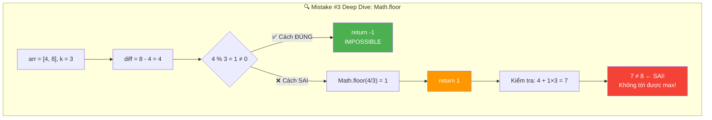

```
  ┌────────────────────────────────────────────────────────────────────────┐
  │  ❌ SAI                          │  ✅ ĐÚNG             │ TẠI SAO?   │
  ├────────────────────────────────────────────────────────────────────────┤
  │                                                                        │
  │  Mistake #1: Chọn sai target                                          │
  │  target = MIN                   │ target = MAX          │ Chỉ TĂNG   │
  │  target = MEAN                  │                       │ được, không│
  │  target = bất kỳ               │                       │ GIẢM được! │
  │                                                                        │
  │  Mistake #2: Quên check impossible                                     │
  │  ops = diff / k (luôn luôn)    │ if (diff%k !== 0)     │ diff có thể│
  │                                 │   return -1           │ KHÔNG chia │
  │                                 │                       │ hết cho k! │
  │                                                                        │
  │  Mistake #3: Dùng Math.floor sai                                       │
  │  ops += Math.floor(diff / k)   │ ops += diff / k       │ Nếu diff%k │
  │  (bỏ qua phần dư)             │ (sau khi check mod)   │ ≠ 0 thì là │
  │                                 │                       │ IMPOSSIBLE,│
  │                                 │                       │ ko phải bỏ │
  │                                 │                       │ phần dư!   │
  │                                                                        │
  │  Mistake #4: Dùng mảng đã sort                                         │
  │  arr.sort() rồi xử lý         │ Không cần sort!       │ Sort = O(n │
  │                                 │ Duyệt tuần tự đủ rồi│ log n) thừa│
  │                                 │                       │ O(n) đủ!   │
  │                                                                        │
  │  Mistake #5: Quên edge case k=0                                        │
  │  Không handle k=0              │ Nếu k=0:             │ Chia cho 0! │
  │  → Division by zero!           │ - Nếu tất cả bằng    │ Runtime     │
  │                                 │   nhau → return 0    │ error!      │
  │                                 │ - Ngược lại → -1     │             │
  │                                                                        │
  │  Mistake #6: Số âm trong mảng                                          │
  │  Không xử lý arr[i] < 0       │ Thuật toán vẫn đúng! │ diff=max-   │
  │                                 │ max-arr[i] vẫn ≥ 0  │ arr[i] luôn │
  │                                 │ vì max ≥ arr[i]      │ ≥ 0 ✅      │
  └────────────────────────────────────────────────────────────────────────┘
```

### Phân tích Mistake #3 chi tiết — SAI LẦM NGUY HIỂM NHẤT

```
  Rất nhiều người viết: ops += Math.floor(diff / k)

  TẠI SAO SAI? Vì Math.floor "nuốt" phần dư → cho kết quả SAI!

  Ví dụ: arr = [4, 8], k = 3
    max = 8
    diff = 8 - 4 = 4
    4 % 3 = 1 ≠ 0 → ĐÁP ÁN PHẢI LÀ -1 (IMPOSSIBLE!)

  Nhưng nếu dùng Math.floor:
    ops += Math.floor(4 / 3) = Math.floor(1.33) = 1
    → Return 1!!! ← ĐÁP ÁN SAI!

  Kiểm tra: 4 + 1×3 = 7 ≠ 8 → KHÔNG bằng max!
  → Math.floor cho kết quả "đi gần nhất" nhưng KHÔNG tới được!

  📌 Bài học: Khi bài nói "impossible" → PHẢI check trước, KHÔNG ĐƯỢC
     dùng Math.floor để "ép" kết quả!
```

---

## 🔄 Alternative Approaches — So sánh các cách tiếp cận

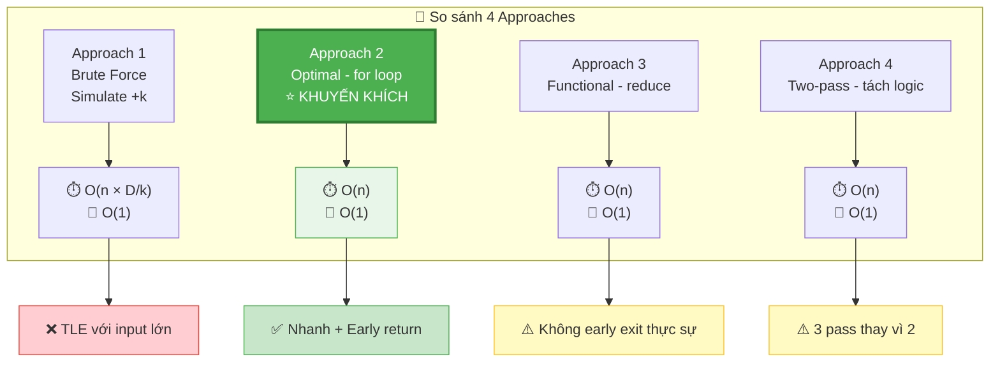

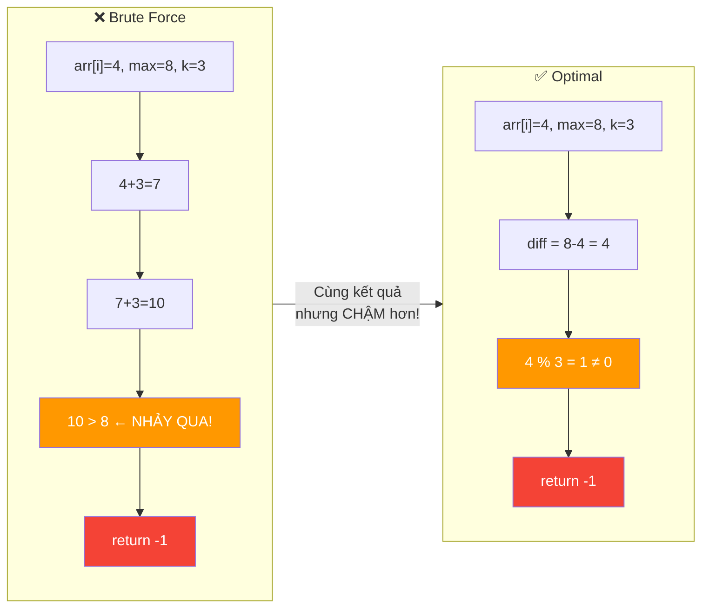

### Approach 1: Brute Force — Mô phỏng từng bước

```javascript
// ❌ CHẬM nhưng trực quan — dùng để VERIFY đáp án
function minOps_bruteForce(arr, k) {
  const max = Math.max(...arr);
  let ops = 0;

  for (let i = 0; i < arr.length; i++) {
    // Mô phỏng: cộng k liên tục cho tới khi = max
    while (arr[i] < max) {
      arr[i] += k;
      ops++;
    }
    // Nếu vượt quá max? → impossible!
    if (arr[i] > max) return -1;
  }
  return ops;
}
```

```
  Tại sao SAI khi arr[i] > max?
    → arr[i] nhảy k bước liên tục
    → Nếu nhảy QUA max mà không dừng ĐÚNG max → bất khả thi!
    → Ví dụ: arr[i]=4, max=8, k=3: 4→7→10 (10>8, nhảy qua!)

  Phân tích:
    Time:  O(n × max_diff/k) — CHẬM! Với max_diff lớn → TLE!
    Space: O(1)

  ⚠️ CHỈ DÙNG ĐỂ:
    - Kiểm chứng đáp án (verify)
    - Giải thích cho người mới bắt đầu
    - KHÔNG dùng trong phỏng vấn (trừ khi hỏi brute force)
```

### Approach 2: Optimal — Phép chia trực tiếp (CODE CHÍNH)

```javascript
// ✅ TỐI ƯU — O(n) time, O(1) space
function minOps(arr, k) {
  const max = Math.max(...arr);
  let ops = 0;
  for (let i = 0; i < arr.length; i++) {
    const diff = max - arr[i];
    if (diff % k !== 0) return -1;
    ops += diff / k;
  }
  return ops;
}
```

### Approach 3: Functional Style — reduce

```javascript
// ✅ CÙNG LOGIC, phong cách functional
function minOps_functional(arr, k) {
  const max = Math.max(...arr);

  // reduce: gộp toàn bộ logic vào 1 biểu thức
  // acc = -1 nếu đã phát hiện impossible, ngược lại = tổng ops
  return arr.reduce((acc, val) => {
    if (acc === -1) return -1;           // Đã impossible → giữ -1
    const diff = max - val;
    if (diff % k !== 0) return -1;       // Phát hiện impossible
    return acc + diff / k;               // Cộng dồn ops
  }, 0);
}
```

```
  So sánh Approach 2 vs 3:

  ┌─────────────┬─────────────────────┬──────────────────────┐
  │  Tiêu chí    │ Approach 2 (for)    │ Approach 3 (reduce)  │
  ├─────────────┼─────────────────────┼──────────────────────┤
  │  Readability │ ✅ Rõ ràng          │ ⚠️ Khó đọc hơn       │
  │  Performance │ ✅ Fast (early exit)│ ❌ Chậm hơn chút     │
  │              │                     │ (vẫn duyệt hết dù   │
  │              │                     │  đã return -1)       │
  │  Style       │ Imperative          │ Functional           │
  │  Interview   │ ✅ Khuyến khích     │ ⚠️ Tùy vị trí        │
  └─────────────┴─────────────────────┴──────────────────────┘

  📌 Trong phỏng vấn: NÊN dùng Approach 2 (for loop)
    → Rõ ràng hơn
    → Dễ giải thích hơn
    → Early return thực sự (reduce vẫn chạy hết mảng dù return -1)
```

### Approach 4: Check modulo trước, tính ops sau (2 pass rõ ràng)

```javascript
// ✅ DÙNG INSIGHT "cùng nhóm mod k" — tách biệt logic
function minOps_twoPass(arr, k) {
  const max = Math.max(...arr);

  // Pass 1: Check tất cả có cùng nhóm mod k không
  const targetMod = max % k;
  for (let i = 0; i < arr.length; i++) {
    if (arr[i] % k !== targetMod) return -1;
  }

  // Pass 2: Tính tổng ops (guarantee không có impossible)
  let ops = 0;
  for (let i = 0; i < arr.length; i++) {
    ops += (max - arr[i]) / k;
  }
  return ops;
}
```

```
  Ưu điểm:
    ✅ Logic TÁCH BIỆT rõ ràng: validation vs computation
    ✅ Dễ maintain và debug
    ✅ Thể hiện insight "cùng nhóm mod k"

  Nhược điểm:
    ❌ 3 pass (1 tìm max + 1 check + 1 tính) thay vì 2 pass
    ❌ Hơi dài dòng cho bài easy

  📌 Khi nào dùng?
    → Khi muốn code RÕ RÀNG nhất có thể
    → Khi giải thích cho người khác
    → KHÔNG khuyến khích trong phỏng vấn (thừa 1 pass)
```

---

## 🧠 Think Out Loud — Quá trình tư duy từ ZERO đến SOLUTION

> 🎙️ Phần này mô phỏng ĐÚNG cách một Senior Engineer suy nghĩ khi gặp bài này,
> bao gồm cả những "ngõ cụt" và cách quay lại đúng hướng.

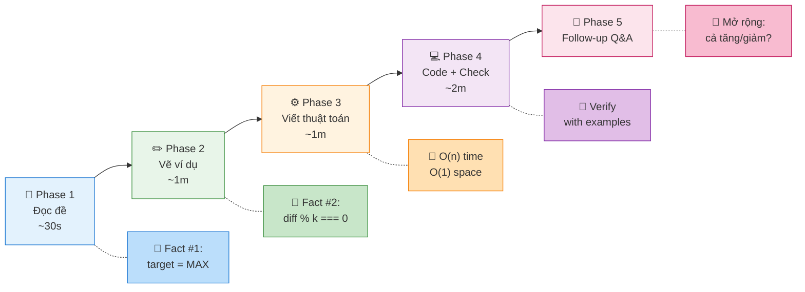

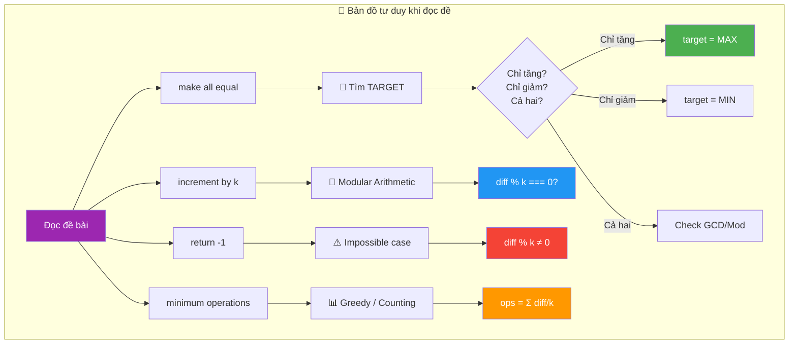

### Phase 1: Đọc đề — 30 giây đầu

```
  🧠 "Hmm... make all elements equal by incrementing by k..."

  Ghi ra giấy ngay:
    ✏️ Operations: increment ONE element by k (mỗi lần chỉ 1 phần tử, +k)
    ✏️ Goal: all elements equal
    ✏️ Return: minimum ops, hoặc -1 if impossible

  🧠 "Ok, chỉ INCREMENT, không DECREMENT. Quan trọng!"
  🧠 "Chỉ tăng → giá trị lớn nhất (max) KHÔNG THỂ thay đổi xuống"
  🧠 "→ Target phải là MAX! Brilliant. Fact #1 locked in."
```

### Phase 2: Vẽ ví dụ — 1 phút

```
  Tự tạo ví dụ NHỎ:
    arr = [2, 5, 8], k = 3

  🧠 "Max = 8. Mỗi phần tử cần tăng bao nhiêu?"
    2 → 8: cần 6 đơn vị → 6/3 = 2 ops ✅
    5 → 8: cần 3 đơn vị → 3/3 = 1 op ✅
    8 → 8: cần 0 đơn vị → 0 ops ✅
    Total = 3

  🧠 "Dễ quá. Thử case impossible."
    arr = [2, 5, 9], k = 3
    Max = 9
    2 → 9: cần 7 → 7/3 = 2.33... 🤔 KHÔNG NGUYÊN!
    → 2, 5, 8, 11, 14, ... (chuỗi +3 từ 2)
    → 9 KHÔNG nằm trong chuỗi! → Impossible!

  🧠 "Aha! Key insight: khoảng cách PHẢI chia hết cho k!"
  🧠 "→ diff % k === 0 là ĐIỀU KIỆN CẦN VÀ ĐỦ. Fact #2 locked in."
```

### Phase 3: Viết thuật toán — 1 phút

```
  🧠 "Algorithm rất đơn giản:"
    1. Tìm max
    2. Với mỗi phần tử:
       - diff = max - arr[i]
       - if diff % k ≠ 0: return -1
       - ops += diff / k
    3. return ops

  🧠 "Time: O(n), Space: O(1). Có tối ưu hơn được không?"
  🧠 "Phải đọc MỌI phần tử → Ω(n) là lower bound → ĐÃ tối ưu!"

  🧠 "Edge cases cần handle?"
    - Mảng 1 phần tử → 0 (đã bằng nhau)
    - Tất cả bằng nhau → 0
    - k = 1 → luôn possible
    - k = 0? → đề có nói k > 0 không? (hỏi interviewer)
```

### Phase 4: Code + Check — 2 phút

```
  🧠 "Code xong. Tự chạy test case trong đầu..."

  arr = [4, 7, 19, 16], k = 3
    max = 19
    i=0: 15%3=0 ✅, ops=5
    i=1: 12%3=0 ✅, ops=9
    i=2: 0%3=0 ✅, ops=9
    i=3: 3%3=0 ✅, ops=10
    → 10 ✅ Matches expected!

  🧠 "Done. Tổng thời gian: ~5 phút. Easy problem."
```

### Phase 5: Nếu interviewer hỏi tiếp — Sẵn sàng

```
  🧠 "Interviewer có thể hỏi gì thêm?"

  Q: "Nếu cho phép cả giảm?"
  A: "Thì target không nhất thiết là max. Cần check tất cả phần tử
      cùng mod k. Target tối ưu phụ thuộc vào cost function."

  Q: "Nếu mỗi operation có cost khác nhau?"
  A: "Thì trở thành optimization problem phức tạp hơn.
      Cần xem cost tăng, giảm có bằng nhau không."

  Q: "Có thể song song hóa (parallelize) không?"
  A: "Có! Tìm max có thể parallel reduce.
      Tính ops cho mỗi phần tử hoàn toàn độc lập → embarrassingly parallel.
      Nhưng optimization này không cần thiết cho bài này."

  Q: "Nếu mảng rất lớn (10⁹ phần tử)?"
  A: "Vẫn O(n), nhưng cần streaming: đọc từng chunk,
      track max riêng, rồi pass 2 tính ops.
      Hoặc 1 pass nếu lưu mảng, 2 pass nếu streaming."
```

---

## 📊 Tổng kết — Bảng so sánh TẤT CẢ approaches

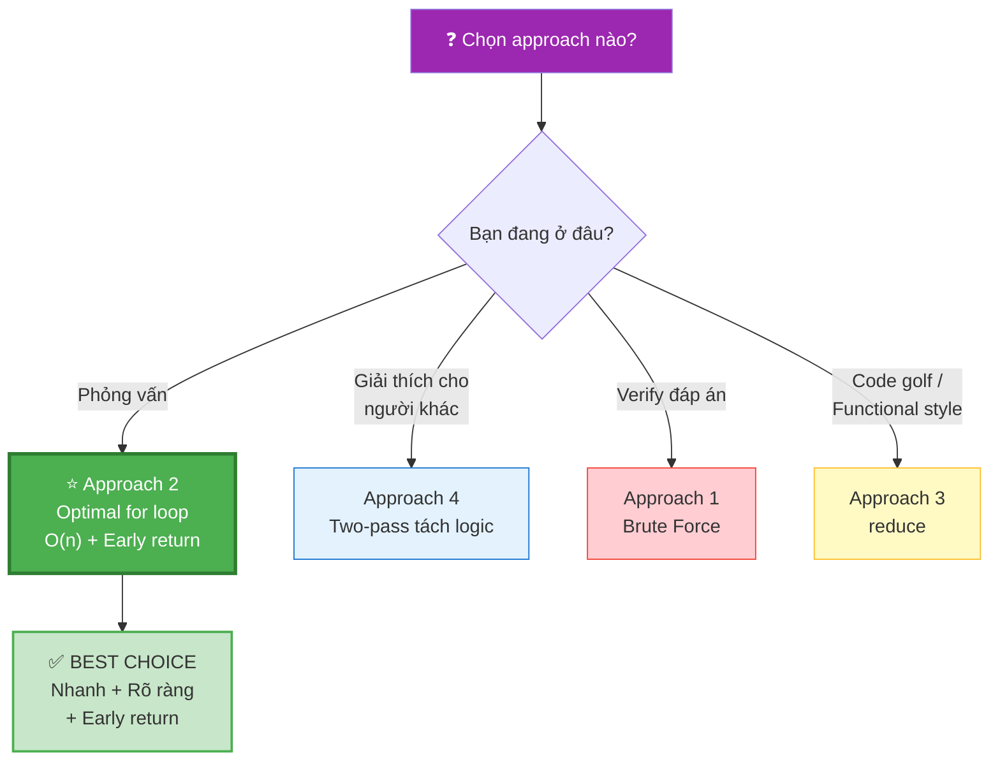

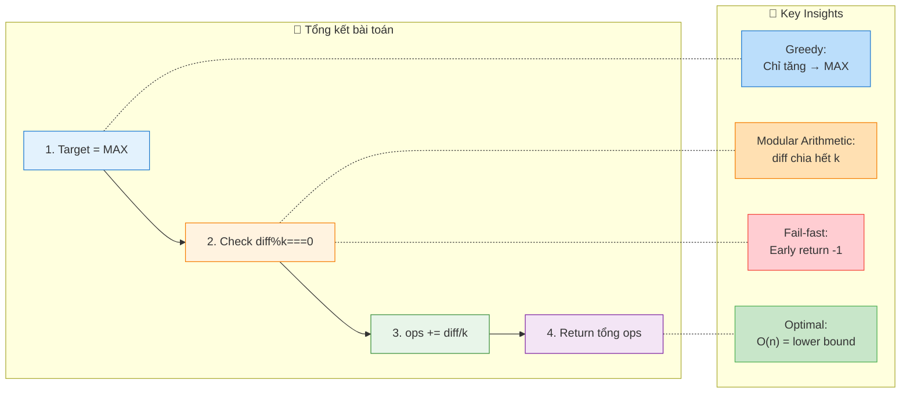

```
  ┌──────────────────────────────────────────────────────────────────────────┐
  │  Approach         │ Time        │ Space │ Pros           │ Cons          │
  ├──────────────────────────────────────────────────────────────────────────┤
  │  Brute Force      │ O(n×D/k)   │ O(1)  │ Trực quan      │ Rất chậm      │
  │  (simulate +k)    │ D=max_diff │       │                │ TLE!          │
  ├──────────────────────────────────────────────────────────────────────────┤
  │  Optimal (for)    │ O(n)       │ O(1)  │ Nhanh, rõ ràng │ Không có      │
  │  ← KHUYẾN KHÍCH  │            │       │ Early return   │               │
  ├──────────────────────────────────────────────────────────────────────────┤
  │  Functional       │ O(n)       │ O(1)  │ Gọn            │ Khó đọc       │
  │  (reduce)         │            │       │                │ No early exit │
  ├──────────────────────────────────────────────────────────────────────────┤
  │  Two-pass         │ O(n)       │ O(1)  │ Logic rõ       │ 3 pass thay   │
  │  (check + calc)   │            │       │ Tách biệt      │ vì 2 pass     │
  └──────────────────────────────────────────────────────────────────────────┘

  📌 Kết luận: Approach "Optimal (for)" là BEST CHOICE cho phỏng vấn!
     → O(n) time, O(1) space
     → Rõ ràng, dễ giải thích
     → có early return khi impossible
     → Đã tối ưu nhất có thể (O(n) = lower bound)
```
