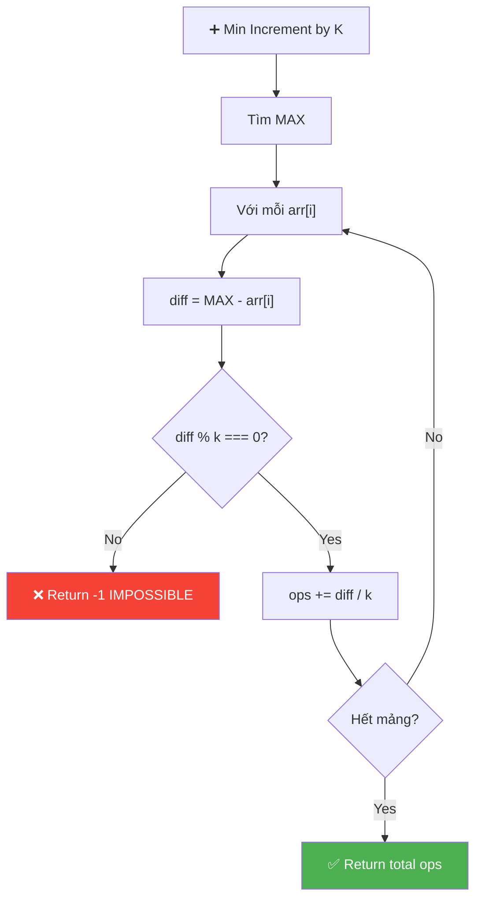
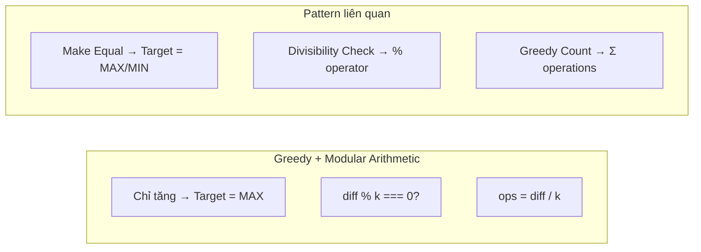

# ➕ Minimum Increment by K Operations to Make All Equal — GfG (Easy)

> 📖 Code: [Minimum Increment by K.js](./Minimum%20Increment%20by%20K.js)





---

## R — Repeat & Clarify

🧠 *"Chỉ được TĂNG k. Tất cả phải bằng MAX! Nếu (max - arr[i]) % k ≠ 0 → KHÔNG THỂ!"*

> 🎙️ *"Given array and integer k, find minimum number of operations (each increments one element by k) to make all elements equal. Return -1 if impossible."*

### Clarification Questions

```
Q: Chỉ được INCREMENT (tăng), không được DECREMENT?
A: Đúng! Chỉ +k, không -k

Q: Target value là gì?
A: Phải là MAX! Vì chỉ tăng được → tất cả phải ≥ max → phải = max!

Q: Khi nào impossible?
A: Khi (max - arr[i]) KHÔNG chia hết cho k → không thể đúng k bước!
```

---

## E — Examples

```
VÍ DỤ 1: arr = [4, 7, 19, 16], k = 3

  max = 19
  Element 4:  (19 - 4) / 3  = 15 / 3 = 5 ops
  Element 7:  (19 - 7) / 3  = 12 / 3 = 4 ops
  Element 19: (19 - 19) / 3 = 0 / 3  = 0 ops
  Element 16: (19 - 16) / 3 = 3 / 3  = 1 op
  Total = 5 + 4 + 0 + 1 = 10 ✅

VÍ DỤ 2: arr = [4, 4, 4, 4], k = 3
  Đã bằng nhau → 0 ops ✅

VÍ DỤ 3: arr = [4, 2, 6, 8], k = 3
  max = 8
  (8 - 4) = 4 → 4 % 3 = 1 ≠ 0 → IMPOSSIBLE! → -1 ✅
```

---

## A — Approach

```
💡 KEY INSIGHTS:
  1. Chỉ tăng → target PHẢI là MAX (vì không thể giảm max!)
  2. Mỗi element cần (max - arr[i]) / k operations
  3. Nếu (max - arr[i]) % k ≠ 0 → KHÔNG THỂ → return -1

  Thuật toán:
    1. Tìm max
    2. Với mỗi phần tử: check chia hết k, cộng dồn ops
    3. Return tổng ops (hoặc -1)
```

---

## C — Code

```javascript
function minOps(arr, k) {
  // Tìm max — target phải là max!
  const max = Math.max(...arr);
  let ops = 0;

  for (let i = 0; i < arr.length; i++) {
    const diff = max - arr[i];

    // Không chia hết → impossible!
    if (diff % k !== 0) return -1;

    ops += diff / k;
  }
  return ops;
}
```

### Trace: arr = [4, 7, 19, 16], k = 3

```
  max = 19

  i=0: diff = 19-4 = 15, 15%3=0 ✅ ops += 15/3 = 5
  i=1: diff = 19-7 = 12, 12%3=0 ✅ ops += 12/3 = 4
  i=2: diff = 19-19 = 0, 0%3=0  ✅ ops += 0/3 = 0
  i=3: diff = 19-16 = 3, 3%3=0  ✅ ops += 3/3 = 1

  Total ops = 5 + 4 + 0 + 1 = 10 ✅
```

---

## O — Optimize

```
  Time:  O(n) — duyệt 1 lần tìm max + 1 lần tính ops
  Space: O(1) — chỉ dùng biến max, ops
```

---

## T — Test

```
  [4, 7, 19, 16] k=3     → 10     ✅
  [4, 4, 4, 4]   k=3     → 0      ✅ Already equal
  [4, 2, 6, 8]   k=3     → -1     ✅ Impossible
  [21, 33, 9, 45, 63] k=6 → 24    ✅
  [5]            k=2      → 0      ✅ Single element
```

---

## 🗣️ Interview Script

> 🎙️ *"Since we can only increment, the target must be the maximum. For each element, the difference to max must be divisible by k. If not, return -1. Otherwise, sum up all (max - arr[i]) / k. O(n) time, O(1) space — a simple greedy modular arithmetic problem."*

### Pattern

```
  GREEDY + MODULAR ARITHMETIC pattern

  Key insight: chỉ tăng → target = MAX!
  Check: diff % k === 0 (modular divisibility)
  Count: diff / k (operations needed)
```
