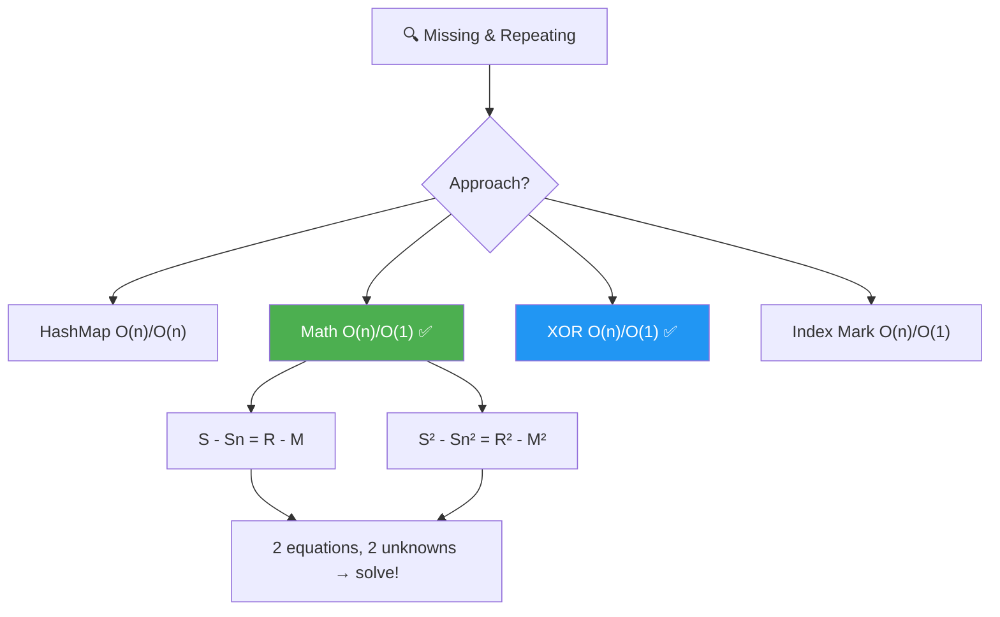
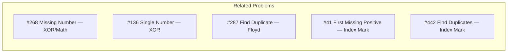
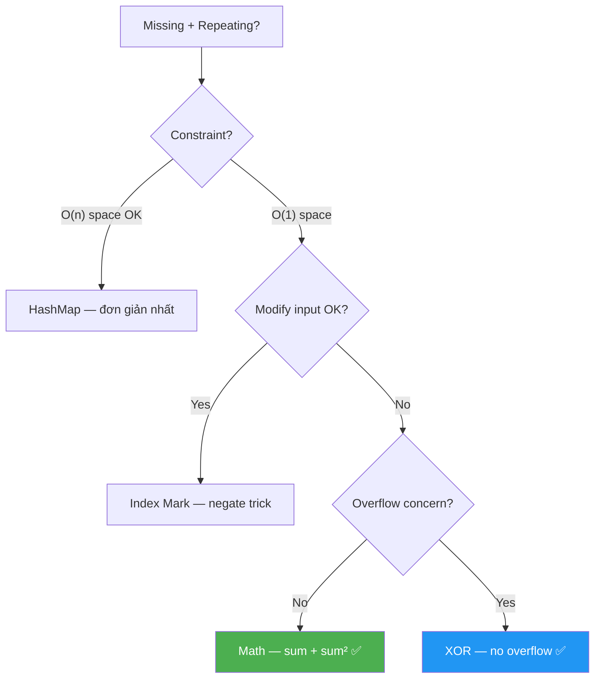
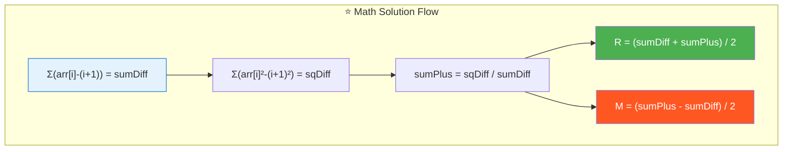
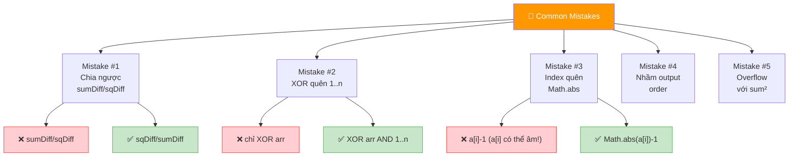
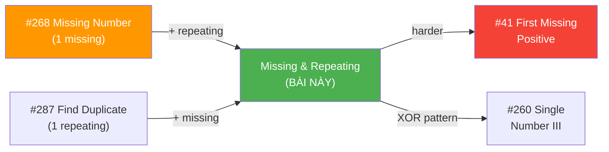
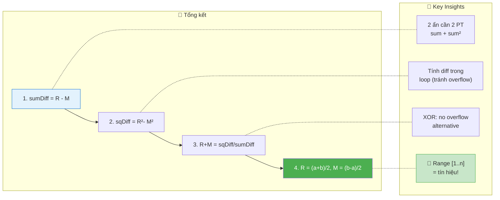

# 🔍 Missing and Repeating in an Array — GfG (Easy)

> 📖 Code: [Missing and Repeating.js](./Missing%20and%20Repeating.js)





---

## R — Repeat & Clarify

🧠 _"Range [1..n], 1 missing, 1 repeated. Dùng SUM + SUM² giải hệ 2 PT → O(n)/O(1)!"_

> 🎙️ _"Given unsorted array of size n with elements 1 to n, one number is missing and one appears twice. Find both."_

### Clarification Questions

```
Q: Mảng chứa đúng n phần tử, giá trị từ 1 đến n?
A: Đúng! Ngoại trừ: 1 số bị THIẾU, 1 số xuất hiện 2 LẦN.

Q: Chỉ có ĐÚNG 1 missing và ĐÚNG 1 repeating?
A: Đúng! Chính xác 1 cặp.

Q: Output format?
A: [repeating, missing] — repeating TRƯỚC!

Q: n có thể = 1?
A: KHÔNG! Cần ít nhất n=2 cho 1 missing + 1 repeating.

Q: Giá trị luôn dương (1..n)?
A: Đúng! Không có 0 hay số âm.
```

### Tại sao bài này quan trọng?

```
  Bài này dạy NHIỀU kỹ thuật quan trọng cùng lúc:

  ┌──────────────────────────────────────────────────────────────┐
  │  4 APPROACH, mỗi cái dạy 1 TECHNIQUE:                       │
  │                                                              │
  │  1. HashMap:     Frequency counting (cơ bản)                │
  │  2. Math:        Sum formula + Sum² → hệ 2 PT (toán học)   │
  │  3. XOR:         Bit manipulation + partitioning (nâng cao) │
  │  4. Index Mark:  In-place marking bằng negate (trick)        │
  │                                                              │
  │  📌 Bài này = "ngã tư" của nhiều patterns:                  │
  │    → Missing Number (#268) + Find Duplicate (#287)          │
  │    → Kết hợp 2 bài kinh điển thành 1!                       │
  └──────────────────────────────────────────────────────────────┘
```

---

## 🧠 Bản chất bài toán — Hiểu để NHỚ, không chỉ để GIẢI

### Bài toán = Giải hệ 2 phương trình!

```
  Mảng ĐÚNG: [1, 2, 3, ..., n]
  Mảng THỰC: 1 số BỊ THAY bởi duplicate

  Gọi R = repeating, M = missing

  arr thực = arr đúng - M + R
  → S(arr) - S(1..n) = R - M         ... (1)
  → S²(arr) - S²(1..n) = R² - M²     ... (2)

  Từ (2): R² - M² = (R-M)(R+M)
  Chia (2) cho (1): R + M = (R²-M²)/(R-M)

  Hệ:
    R - M = a   (từ sum)
    R + M = b   (từ sum²)

  → R = (a + b) / 2
  → M = (b - a) / 2

  📌 ĐÂY LÀ TOÁN LỚP 9! Hệ 2 phương trình, 2 ẩn!
```

### Hình dung trực quan

```
  arr = [4, 3, 6, 2, 1, 1]    n = 6

  Mảng đúng:  1  2  3  4  5  6    sum = 21
  Mảng thực:  4  3  6  2  1  1    sum = 17

  So sánh:
    Đúng: [1, 2, 3, 4, 5, 6]
    Thực: [4, 3, 6, 2, 1, 1]
                         ↑  ↑
                    5 missing  1 repeated

  sumDiff = 17 - 21 = -4 = R - M = 1 - 5

  ┌──────────────────────────────────────────────────────────────┐
  │  R - M = -4                                                  │
  │  R² - M² = (1² - 5²) = 1 - 25 = -24                       │
  │  R + M = -24 / -4 = 6                                       │
  │                                                              │
  │  R = (-4 + 6) / 2 = 1    ← Repeating!                      │
  │  M = (6 - (-4)) / 2 = 5  ← Missing!                        │
  └──────────────────────────────────────────────────────────────┘
```

### 4 cách nhìn — So sánh nhanh

```
  ┌──────────────┬────────────┬────────────┬──────────────────────┐
  │  Approach    │  Time      │  Space     │  Core Idea            │
  ├──────────────┼────────────┼────────────┼──────────────────────┤
  │  HashMap     │  O(n)      │  O(n)      │  Đếm frequency       │
  │  Math ✅    │  O(n)      │  O(1)      │  Hệ 2 PT (sum, sum²) │
  │  XOR ✅     │  O(n)      │  O(1)      │  Bit partition        │
  │  Index Mark  │  O(n)      │  O(1)*     │  Negate-as-visited    │
  └──────────────┴────────────┴────────────┴──────────────────────┘
  * Index Mark: O(1) extra nhưng MODIFY mảng input!

  📌 Interview: Math → dễ explain, elegant, O(1) space
     📌 Follow-up "không modify input?": XOR hoặc Math
     📌 Follow-up "overflow concern?": XOR (không overflow!)
```

---

## 🧭 Luồng Suy Nghĩ — Từ đọc đề đến solution

> 💡 Phần này dạy bạn **CÁCH TƯ DUY** để tự giải bài, không chỉ biết đáp án.

### Bước 1: Đọc đề → Gạch chân KEYWORDS

```
  Đề: "Array size n, elements 1 to n, one missing, one repeated"

  Gạch chân:
    "1 to n"           → RANGE CỐ ĐỊNH! → có thể dùng index!
    "one missing"      → giống #268 Missing Number
    "one repeated"     → giống #287 Find Duplicate
    "find both"        → cần TÌM 2 SỐ

  🧠 Tự hỏi: "Range [1..n] = biết EXPECTED sum!"
    → Sum mảng đúng = n(n+1)/2
    → So sánh với sum thực → suy ra!

  📌 Kỹ năng chuyển giao:
    "Range [1..n]" → SO SÁNH với expected!
    → Sum, Sum², XOR, Index marking đều dùng được!
```

### Bước 2: Brute Force → HashMap đếm

```
  Cách đơn giản nhất: đếm frequency mỗi số!

  Map: { value → count }
  count = 2 → repeating!
  count = 0 → missing!

  O(n) time, O(n) space
  → Tốt nhưng TỐN SPACE!

  🧠 Tự hỏi: "Có cách O(1) space không?"
```

### Bước 3: "Range [1..n] = có EXPECTED" → Toán học!

```
  💡 INSIGHT: So sánh THỰC vs EXPECTED!

  Sum thực - Sum expected = R - M     (phương trình 1)
  Sum² thực - Sum² expected = R²- M²  (phương trình 2)

  Từ (2)/(1): R + M = (R²-M²)/(R-M)  (phương trình 3)

  Giải hệ (1) và (3):
    R = [(R-M) + (R+M)] / 2
    M = [(R+M) - (R-M)] / 2

  ✅ O(n) time, O(1) space!

  📌 Kỹ năng chuyển giao:
    ┌──────────────────────────────────────────────────────────────┐
    │  "Tìm 2 ẩn" → cần 2 PHƯƠNG TRÌNH!                        │
    │    PT 1: Sum         → linear equation                     │
    │    PT 2: Sum squares → quadratic equation                  │
    │    → Giải hệ = tìm 2 ẩn!                                  │
    │                                                              │
    │  ⚠️ Chỉ Sum: R - M = a → VÔ SỐ nghiệm!                  │
    │  + Sum²: R + M = b → DUY NHẤT nghiệm!                    │
    │                                                              │
    │  Pattern: "n ẩn cần n phương trình!"                       │
    └──────────────────────────────────────────────────────────────┘
```

### Bước 4: "XOR có dùng được không?" → Partition trick!

```
  🧠 Từ bài Unique Number (#136): XOR triệt tiêu cặp!

  XOR(arr) ⊕ XOR(1..n) = R ⊕ M
  → Vì R xuất hiện 3 lần (2 trong arr + 1 trong 1..n)
    = R (vì XOR 3 lần = XOR 1 lần cho duplicate)
  → M xuất hiện 1 lần (chỉ trong 1..n)
  → Kết quả = R ⊕ M

  Tương tự #260 Single Number III:
    1. XOR all → R ⊕ M
    2. Tìm rightmost set bit → bit KHÁC nhau giữa R và M
    3. Partition tất cả số thành 2 nhóm theo bit đó
    4. XOR mỗi nhóm → tách R và M!

  ✅ O(n) time, O(1) space, KHÔNG overflow!
```

### Bước 5: "Index marking?" → Negate trick!

```
  🧠 Vì giá trị ∈ [1..n] = index range!
    → Dùng giá trị LÀM INDEX, mark visited!

  Duyệt arr: với mỗi val, negate arr[val-1]
    → Nếu arr[val-1] ĐÃ ÂM → val là REPEATING!
    → Sau khi duyệt: index j mà arr[j] > 0 → (j+1) là MISSING!

  ✅ O(n) time, O(1) space
  ⚠️ MODIFY mảng input!
```

### Bước 6: Tổng kết — Cây quyết định



---

## E — Examples

### Ví dụ minh họa trực quan

```
VÍ DỤ 1: arr = [3, 1, 3]    n = 3

  Expected: [1, 2, 3]    sum = 6     sum² = 14
  Actual:   [3, 1, 3]    sum = 7     sum² = 19

  sumDiff = 7 - 6 = 1 = R - M
  sqDiff = 19 - 14 = 5 = R² - M²
  sumPlus = 5 / 1 = 5 = R + M

  R = (1 + 5) / 2 = 3    ← Repeating!
  M = (5 - 1) / 2 = 2    ← Missing!

  → [3, 2] ✅
```

```
VÍ DỤ 2: arr = [4, 3, 6, 2, 1, 1]    n = 6

  Expected sum = 21    sum² = 91
  Actual sum   = 17    sum² = 67

  sumDiff = 17 - 21 = -4 = R - M
  sqDiff = 67 - 91 = -24 = R² - M²
  sumPlus = -24 / -4 = 6 = R + M

  R = (-4 + 6) / 2 = 1    ← Repeating!
  M = (6 - (-4)) / 2 = 5  ← Missing!

  → [1, 5] ✅
```

### Trace — Index Mark: arr = [3, 1, 3]

```
  ┌──────────────────────────────────────────────────────────────────┐
  │ i=0: val = |3| = 3  → idx = 2                                   │
  │   arr[2] = 3 > 0 → negate: arr[2] = -3                         │
  │   arr = [3, 1, -3]                                               │
  │                ↑ marked!                                         │
  ├──────────────────────────────────────────────────────────────────┤
  │ i=1: val = |1| = 1  → idx = 0                                   │
  │   arr[0] = 3 > 0 → negate: arr[0] = -3                         │
  │   arr = [-3, 1, -3]                                              │
  │         ↑ marked!                                                │
  ├──────────────────────────────────────────────────────────────────┤
  │ i=2: val = |-3| = 3 → idx = 2                                   │
  │   arr[2] = -3 < 0 → ALREADY MARKED! → repeating = 3 ✅         │
  │   arr = [-3, 1, -3]                                              │
  └──────────────────────────────────────────────────────────────────┘

  Pass 2: find positive → arr[1] = 1 > 0 → missing = 1+1 = 2 ✅
  → [3, 2] ✅
```

### Trace — XOR: arr = [3, 1, 3]

```
  Step 1: XOR all
    xorAll = 0
    i=0: xorAll ^= 3 ^= 1 → 3^1 = 2       (arr XOR 1..n)
    i=1: xorAll ^= 1 ^= 2 → 2^1^2 = 1
    i=2: xorAll ^= 3 ^= 3 → 1^3^3 = 1

    xorAll = 1 = 01₂ = R ⊕ M = 3 ⊕ 2 = 01₂ ✅

  Step 2: rightmost set bit = 1 & -1 = 1 (bit 0)

  Step 3: Partition by bit 0
    Bit 0 = 1: 3(11), 1(01), 3(11) from arr; 1(01), 3(11) from 1..n
    Bit 0 = 0: nothing from arr; 2(10) from 1..n

    group1 = 3⊕1⊕3 ⊕ 1⊕3 = 3   (bit 0 set)
    group0 = 0 ⊕ 2 = 2           (bit 0 unset)

  Step 4: 3 ∈ arr? YES → repeating = 3, missing = 2
  → [3, 2] ✅
```

---

## A — Approach

### Approach 1: HashMap — O(n)/O(n)

```
  ┌──────────────────────────────────────────────────────────────┐
  │  Pass 1: đếm frequency mỗi phần tử                          │
  │  Pass 2: duyệt 1..n, tìm count=2 và count=0                │
  │                                                              │
  │  Time: O(n)    Space: O(n)                                   │
  │  → Đơn giản nhất, nhưng tốn space!                          │
  └──────────────────────────────────────────────────────────────┘
```

### Approach 2: Math — O(n)/O(1) ✅

```
  💡 Hệ 2 phương trình, 2 ẩn:

  ┌──────────────────────────────────────────────────────────────┐
  │  Gọi a = S_arr - S_expected = R - M                         │
  │  Gọi c = S²_arr - S²_expected = R² - M² = (R-M)(R+M)      │
  │  → b = c / a = R + M                                        │
  │                                                              │
  │  R = (a + b) / 2                                             │
  │  M = (b - a) / 2                                             │
  │                                                              │
  │  Time: O(n)    Space: O(1)                                   │
  │  ⚠️ Overflow risk: sum² có thể rất lớn!                    │
  └──────────────────────────────────────────────────────────────┘
```

### Approach 3: XOR — O(n)/O(1) ✅

```
  💡 XOR + Bit Partition (giống #260):

  ┌──────────────────────────────────────────────────────────────┐
  │  Step 1: xor = XOR(arr) ⊕ XOR(1..n) = R ⊕ M               │
  │  Step 2: setBit = xor & (-xor) → rightmost differing bit   │
  │  Step 3: Partition all nums by setBit → XOR each group      │
  │  Step 4: Check which is in arr → repeating vs missing       │
  │                                                              │
  │  Time: O(n)    Space: O(1)                                   │
  │  ✅ NO OVERFLOW! XOR luôn trong 32-bit range!               │
  └──────────────────────────────────────────────────────────────┘
```

### Approach 4: Index Mark — O(n)/O(1)*

```
  💡 Dùng giá trị làm index, negate để đánh dấu:

  ┌──────────────────────────────────────────────────────────────┐
  │  Pass 1: Với mỗi val, negate arr[|val|-1]                   │
  │    Nếu ĐÃ ÂM → val là REPEATING!                           │
  │  Pass 2: Tìm index j mà arr[j] > 0 → j+1 là MISSING!      │
  │                                                              │
  │  Time: O(n)    Space: O(1)                                   │
  │  ⚠️ MODIFY input array!                                    │
  └──────────────────────────────────────────────────────────────┘
```

---

## C — Code

### Solution 1: HashMap — O(n)/O(n)

```javascript
function findMissingRepeatingMap(arr) {
  const n = arr.length;
  const freq = new Map();
  let repeating = -1, missing = -1;

  for (const val of arr) {
    freq.set(val, (freq.get(val) || 0) + 1);
  }

  for (let i = 1; i <= n; i++) {
    const count = freq.get(i) || 0;
    if (count === 2) repeating = i;
    if (count === 0) missing = i;
  }

  return [repeating, missing];
}
```

### Solution 2: Math — O(n)/O(1) ✅

```javascript
function findMissingRepeatingMath(arr) {
  const n = arr.length;
  let sumDiff = 0, sqDiff = 0;

  for (let i = 0; i < n; i++) {
    sumDiff += arr[i] - (i + 1);
    sqDiff += arr[i] * arr[i] - (i + 1) * (i + 1);
  }

  const sumPlus = sqDiff / sumDiff;
  const repeating = (sumDiff + sumPlus) / 2;
  const missing = (sumPlus - sumDiff) / 2;

  return [repeating, missing];
}
```

```
  📝 Line-by-line:

  Line 4-5: sumDiff += arr[i] - (i + 1)
    → Tính S_arr - S_expected CÙNG LÚC (tránh overflow tốt hơn!)
    → (i+1) = expected value tại index i

  Line 6: sqDiff += arr[i]² - (i+1)²
    → Tương tự cho sum of squares

    ⚠️ Tại sao tính CÙNG LÚC thay vì tính riêng rồi trừ?
       S_arr = Σarr[i], S_exp = n(n+1)/2
       Tính riêng: 2 biến lớn → trừ → overflow!
       Tính diff: Σ(arr[i] - (i+1)) → nhỏ hơn → ít overflow hơn!

  Line 9: sumPlus = sqDiff / sumDiff
    → R + M = (R²-M²) / (R-M)

    ⚠️ sqDiff / sumDiff phải CHIA HẾT!
       Vì (R²-M²) = (R-M)(R+M) → chia cho (R-M) = R+M (integer!)

  Line 10-11: R = (a+b)/2, M = (b-a)/2
    → Giải hệ: R-M=a, R+M=b
    → Cả hai LUÔN chẵn (vì R, M integer)
```

### Solution 3: XOR — O(n)/O(1) ✅

```javascript
function findMissingRepeatingXOR(arr) {
  const n = arr.length;

  // Step 1: XOR all → R ⊕ M
  let xorAll = 0;
  for (let i = 0; i < n; i++) {
    xorAll ^= arr[i] ^ (i + 1);
  }

  // Step 2: Rightmost set bit
  const setBit = xorAll & (-xorAll);

  // Step 3: Partition & XOR
  let group0 = 0, group1 = 0;
  for (let i = 0; i < n; i++) {
    if (arr[i] & setBit) group1 ^= arr[i];
    else group0 ^= arr[i];
    if ((i + 1) & setBit) group1 ^= (i + 1);
    else group0 ^= (i + 1);
  }

  // Step 4: Identify
  for (const val of arr) {
    if (val === group0) return [group0, group1];
  }
  return [group1, group0];
}
```

```
  📝 Line-by-line:

  Line 6: xorAll ^= arr[i] ^ (i + 1)
    → XOR cả arr elements VÀ expected elements (1..n)
    → Duplicates triệt tiêu: mỗi số xuất hiện 2 lần ĐỀU = 0
    → Chỉ còn R (xuất hiện 2+1=3 lần → XOR = R) 
      và M (xuất hiện 0+1=1 lần → XOR = M)
    → xorAll = R ⊕ M

  Line 9: setBit = xorAll & (-xorAll)
    → Tìm rightmost set bit (bit 1 thấp nhất)
    → -xorAll = two's complement → flip + 1
    → & cho bit thấp nhất khác 0
    → Bit này KHÁC NHAU giữa R và M!

  Line 12-17: Partition
    → Chia TẤT CẢ số (arr + 1..n) thành 2 nhóm theo setBit
    → Nhóm có bit set: XOR → ra 1 trong R hoặc M
    → Nhóm có bit unset: XOR → ra cái còn lại

  Line 20-22: Identify
    → Check xem group0 có trong arr không
    → CÓ → group0 = repeating, group1 = missing
    → KHÔNG → ngược lại
```

### Solution 4: Index Mark — O(n)/O(1)*

```javascript
function findMissingRepeatingMark(arr) {
  const a = [...arr];
  const n = a.length;
  let repeating = -1, missing = -1;

  for (let i = 0; i < n; i++) {
    const idx = Math.abs(a[i]) - 1;
    if (a[idx] < 0) repeating = Math.abs(a[i]);
    else a[idx] = -a[idx];
  }

  for (let i = 0; i < n; i++) {
    if (a[i] > 0) { missing = i + 1; break; }
  }

  return [repeating, missing];
}
```

```
  📝 Line-by-line:

  Line 7: idx = Math.abs(a[i]) - 1
    → Dùng GIÁ TRỊ phần tử làm INDEX!
    → Math.abs vì phần tử có thể ĐÃ BỊ NEGATE!
    → -1 vì values 1-based, index 0-based

  Line 8: if (a[idx] < 0) → ĐÃ VISIT!
    → a[idx] âm = index idx ĐÃ ĐƯỢC MARK trước đó
    → Ai mark? Phần tử có cùng giá trị!
    → → REPEATING!

  Line 9: else a[idx] = -a[idx]
    → Chưa visit → MARK bằng negate!

  Line 13: if (a[i] > 0) → CHƯA VISIT!
    → Không có phần tử nào có giá trị (i+1)
    → → MISSING!
```

---

## 🔬 Deep Dive — Giải thích CHI TIẾT Math Solution

> 💡 Phân tích **từng dòng** Math approach để hiểu **TẠI SAO**.

```javascript
function findMissingRepeatingMath(arr) {
  const n = arr.length;

  // ═══════════════════════════════════════════════════════════
  // DÒNG 1-2: Tính diff TRONG VÒNG LẶP (tránh overflow!)
  // ═══════════════════════════════════════════════════════════
  //
  // TẠI SAO tính diff (arr[i]-(i+1)) thay vì sum riêng?
  //   Cách 1: S_arr = Σarr[i], S_exp = n(n+1)/2 → 2 số LỚN!
  //   Cách 2: Σ(arr[i]-(i+1)) = S_arr - S_exp → 1 số NHỎ!
  //   → Giảm overflow risk!
  //
  let sumDiff = 0, sqDiff = 0;

  for (let i = 0; i < n; i++) {
    // sumDiff = Σ(arr[i] - expected[i]) = R - M
    sumDiff += arr[i] - (i + 1);

    // sqDiff = Σ(arr[i]² - expected[i]²) = R² - M²
    sqDiff += arr[i] * arr[i] - (i + 1) * (i + 1);
  }

  // ═══════════════════════════════════════════════════════════
  // DÒNG 3-5: Giải hệ 2 PT, 2 ẩn
  // ═══════════════════════════════════════════════════════════
  //
  // Phương trình:
  //   R - M  = sumDiff  ... (1)
  //   R²-M² = sqDiff   ... (2)
  //
  // (2) = (R-M)(R+M) = sumDiff × (R+M)
  // → R + M = sqDiff / sumDiff  ... (3)
  //
  // Từ (1) và (3):
  //   R = [(R-M) + (R+M)] / 2
  //   M = [(R+M) - (R-M)] / 2
  //
  const sumPlus = sqDiff / sumDiff;  // R + M
  const repeating = (sumDiff + sumPlus) / 2;  // R
  const missing = (sumPlus - sumDiff) / 2;    // M

  return [repeating, missing];
}
```



---

## 📐 Invariant — Chứng minh tính đúng đắn

```
  📐 CHỨNG MINH MATH APPROACH:

  Cho arr chứa số 1..n, với M bị thay bởi R.

  Σarr = Σ(1..n) - M + R
  → Σarr - Σ(1..n) = R - M = a                 ...(1)

  Σ(arr²) = Σ(1²..n²) - M² + R²
  → Σ(arr²) - Σ(1²..n²) = R² - M² = c           ...(2)

  (2) = (R-M)(R+M) = a×b  với b = R+M
  → b = c/a                                     ...(3)

  Từ (1) và (3): { R-M=a, R+M=b }
    R = (a+b)/2  ✅
    M = (b-a)/2  ✅

  Tính hợp lệ: a+b và b-a LUÔN chẵn
    Vì R,M ∈ integers → R+M và R-M cùng chẵn/lẻ
    Nếu R chẵn, M chẵn: a chẵn, b chẵn ✅
    Nếu R lẻ, M lẻ: a chẵn, b chẵn ✅
    Nếu R chẵn, M lẻ: a lẻ, b lẻ → (a+b) chẵn ✅
    Nếu R lẻ, M chẵn: a lẻ, b lẻ → (a+b) chẵn ✅
    → (a+b)/2 và (b-a)/2 LUÔN nguyên! ∎
```

```
  📐 CHỨNG MINH XOR APPROACH:

  XOR(arr) ⊕ XOR(1..n):
    Mỗi số từ 1..n trừ M và R xuất hiện 2 lần (1 arr + 1 expected)
    → XOR 2 lần = 0 (triệt tiêu!)

    R xuất hiện 3 lần (2 arr + 1 expected) → XOR = R
    M xuất hiện 1 lần (0 arr + 1 expected) → XOR = M

    → Kết quả = R ⊕ M ✅

  Partition: R ⊕ M ≠ 0 (vì R ≠ M)
    → Tồn tại ít nhất 1 bit khác nhau
    → Chia theo bit đó → R và M ở 2 nhóm khác
    → XOR mỗi nhóm → tách R và M! ∎
```

---

## ❌ Common Mistakes — Lỗi thường gặp



### Mistake 1: Math — chia ngược thứ tự

```javascript
// ❌ SAI: chia ngược!
const sumPlus = sumDiff / sqDiff;
// (R-M) / (R²-M²) = 1/(R+M) → SAI HẲN!

// ✅ ĐÚNG: sqDiff / sumDiff!
const sumPlus = sqDiff / sumDiff;
// (R²-M²) / (R-M) = (R-M)(R+M)/(R-M) = R+M ✅
```

### Mistake 2: XOR — quên XOR cả 1..n

```javascript
// ❌ SAI: chỉ XOR arr!
for (const val of arr) xorAll ^= val;
// → Kết quả = XOR(arr) ≠ R⊕M!

// ✅ ĐÚNG: XOR cả arr VÀ 1..n
for (let i = 0; i < n; i++) xorAll ^= arr[i] ^ (i + 1);
// → Triệt tiêu cặp, chỉ còn R⊕M!
```

### Mistake 3: Index Mark — quên Math.abs

```javascript
// ❌ SAI: a[i] có thể đã bị negate!
const idx = a[i] - 1;  // a[i] = -3 → idx = -4 → CRASH!

// ✅ ĐÚNG: luôn dùng Math.abs!
const idx = Math.abs(a[i]) - 1;
// a[i] = -3 → |a[i]| = 3 → idx = 2 ✅
```

### Mistake 4: Nhầm output order

```javascript
// ❌ SAI: tùy đề bài! Đọc KỸ output format!
return [missing, repeating];  // nhiều đề yêu cầu [repeating, missing]!

// ✅ ĐÚNG: return [repeating, missing]
// GfG: repeating TRƯỚC!
```

### Mistake 5: Overflow với sum²

```
  n = 10⁵: sum² ≈ 10¹⁵ → vượt Number.MAX_SAFE_INTEGER (2⁵³)!
  → Kết quả SAI do mất precision!

  🧠 Giải pháp:
    1. Tính diff trong vòng lặp (giảm magnitude)
    2. Dùng BigInt nếu cần chính xác
    3. Dùng XOR approach (KHÔNG overflow!)

  📌 Interview: nêu Math trước, nhắc overflow → chuyển XOR!
```

---

## O — Optimize

```
                      Time       Space     Modify?   Overflow?
  ─────────────────────────────────────────────────────────────────
  HashMap             O(n)       O(n)      No        No
  Math ✅             O(n)       O(1)      No        ⚠️ sum²!
  XOR ✅              O(n)       O(1)      No        No ✅
  Index Mark          O(n)       O(1)*     Yes!      No

  📌 Interview recommendation:
    → Nêu Math TRƯỚC (elegant, dễ explain)
    → Nêu XOR nếu hỏi follow-up "no overflow?"
    → Nêu Index Mark nếu hỏi "modify input OK?"
```

### Complexity chính xác — Đếm operations

```
  Math: 1 pass × 4 ops (2 trừ + 2 nhân) + 3 ops (chia + cộng)
    TỔNG: 4n + 3 operations

  XOR:  Pass 1: 2n XOR = 2n
        setBit: 2 ops
        Pass 2: 4n XOR (2 groups × arr + expected) = 4n
        Pass 3: n comparisons (identify)
    TỔNG: 7n + 2 operations

  HashMap: 2n hash ops + n scan = 3n ops
    Nhưng O(n) space = ~8n bytes RAM!

  📊 So sánh THỰC TẾ (n = 10⁶):
    Math:    4×10⁶ ops, 16 bytes RAM
    XOR:     7×10⁶ ops, 16 bytes RAM
    HashMap: 3×10⁶ ops, ~8MB RAM 😰
    → Math nhanh nhất, XOR an toàn nhất!
```

---

## T — Test

```
Test Cases:
  [3,1,3]             → [3,2]   ✅ n=3 basic
  [4,3,6,2,1,1]       → [1,5]   ✅ n=6, repeating ở cuối
  [1,1]               → [1,2]   ✅ Minimum n=2
  [2,2]               → [2,1]   ✅ Min n=2, missing=1
  [2,3,1,5,1]         → [1,4]   ✅ n=5
  [1,3,2,5,4,6,7,5]   → [5,8]   ✅ n=8, missing ở cuối
```

---

## 🗣️ Interview Script

### 🎙️ Think Out Loud — Mô phỏng phỏng vấn thực

```
  ──────────────── PHASE 1: Clarify ────────────────

  👤 Interviewer: "Array of size n, elements 1 to n, one missing,
                   one duplicate. Find both."

  🧑 You: "So the array should contain exactly {1, 2, ..., n},
   but one number is replaced by a duplicate of another.
   I need to find both the duplicate and the missing number.
   Let me think of a few approaches."

  ──────────────── PHASE 2: HashMap ────────────────

  🧑 You: "The straightforward approach is frequency counting
   with a HashMap. Count occurrences, find count=2 and count=0.
   O(n) time but O(n) space. Can I do O(1) space?"

  ──────────────── PHASE 3: Math ────────────────

  🧑 You: "Since elements are in range [1,n], I know the expected
   sum and sum of squares. Let R be repeating, M be missing:
   - Sum_actual - Sum_expected = R - M
   - SumSq_actual - SumSq_expected = R² - M² = (R-M)(R+M)
   
   Two equations, two unknowns → I can solve for both.
   O(n) time, O(1) space. But there's a potential overflow
   with sum of squares for large n."

  ──────────────── PHASE 4: XOR (if asked) ────────────────

  🧑 You: "To avoid overflow, I can use XOR. XOR all array elements
   with 1..n gives R⊕M. Then I use the rightmost set bit to
   partition all numbers into two groups — similar to Single
   Number III (#260). XOR each group gives R and M separately.
   O(n) time, O(1) space, no overflow."
```

---

## 📚 Bài tập liên quan — Practice Problems

### Progression Path



### 1. Missing Number (#268) — Easy

```
  Đề: Mảng chứa n số distinct từ [0, n]. Tìm số THIẾU.

  function missingNumber(nums) {
    // Cách 1: Sum formula
    const n = nums.length;
    const expected = n * (n + 1) / 2;
    const actual = nums.reduce((a, b) => a + b, 0);
    return expected - actual;

    // Cách 2: XOR
    let xor = n;
    for (let i = 0; i < n; i++) xor ^= i ^ nums[i];
    return xor;
  }

  📌 So sánh: #268 tìm 1 ẩn → 1 PT (sum) đủ!
     Bài này tìm 2 ẩn → cần 2 PT (sum + sum²)!
```

### 2. Find the Duplicate (#287) — Medium

```
  Đề: Mảng n+1 phần tử, giá trị [1,n]. Tìm số lặp.

  // Floyd's Cycle Detection — O(n)/O(1)
  function findDuplicate(nums) {
    let slow = nums[0], fast = nums[0];

    do {
      slow = nums[slow];
      fast = nums[nums[fast]];
    } while (slow !== fast);

    slow = nums[0];
    while (slow !== fast) {
      slow = nums[slow];
      fast = nums[fast];
    }
    return slow;
  }

  📌 #287 dùng Floyd (linked list cycle)
     Bài này KOMBÔNG dùng Floyd vì cần tìm CẢ missing nữa!
```

### Tổng kết — "Range [1..n]" pattern

```
  ┌──────────────────────────────────────────────────────────────┐
  │  BÀI                     │  Technique            │  Ẩn  │
  ├──────────────────────────────────────────────────────────────┤
  │  #268 Missing Number    │  Sum / XOR            │  1   │
  │  #287 Find Duplicate    │  Floyd / Index Mark   │  1   │
  │  Missing+Repeating ⭐  │  Math / XOR / Mark    │  2   │
  │  #41 First Missing Pos  │  Cyclic Sort          │  1   │
  │  #260 Single Number III │  XOR + Partition      │  2   │
  └──────────────────────────────────────────────────────────────┘

  📌 "Range [1..n]" = TÍN HIỆU cho Math/XOR/Index!
     Số ẩn cần tìm = số PT cần thiết!
```

### Skeleton code — Reusable template cho "n ẩn, n PT"

```javascript
// TEMPLATE: Tìm k ẩn từ range [1..n] bằng Math equations
function findKUnknowns(arr, k) {
  const n = arr.length;
  // Tính k power sums: Σval^p - Σ(i+1)^p cho p = 1, 2, ..., k
  const diffs = Array(k).fill(0);

  for (let i = 0; i < n; i++) {
    for (let p = 1; p <= k; p++) {
      diffs[p-1] += Math.pow(arr[i], p) - Math.pow(i+1, p);
    }
  }

  // Giải hệ k PT, k ẩn từ diffs
  // VD k=2: { R-M = diffs[0], R²-M² = diffs[1] }
  //   → R+M = diffs[1]/diffs[0]
  //   → R = (sum + plus) / 2
}

// k=1: Missing Number → 1 PT (sum)
// k=2: Missing+Repeating → 2 PT (sum + sum²) ← BÀI NÀY!
```

---

## 📊 Tổng kết — Key Insights



```
  ┌──────────────────────────────────────────────────────────────────────────┐
  │  📌 3 ĐIỀU PHẢI NHỚ                                                    │
  │                                                                          │
  │  1. HỆ 2 PT: sum + sum² → giải 2 ẩn R, M                              │
  │     → R - M = Σ(arr[i] - (i+1))                                        │
  │     → R + M = Σ(arr[i]² - (i+1)²) / (R - M)                          │
  │     → R = (a+b)/2,  M = (b-a)/2                                        │
  │                                                                          │
  │  2. XOR ALTERNATIVE: không overflow!                                    │
  │     → XOR(arr) ⊕ XOR(1..n) = R ⊕ M                                    │
  │     → Partition by rightmost set bit → tách R, M                      │
  │     → Cùng pattern với #260 Single Number III!                         │
  │                                                                          │
  │  3. "Range [1..n]" = TÍN HIỆU ĐẶC BIỆT!                               │
  │     → Có EXPECTED sum/XOR/index → so sánh với actual!               │
  │     → Xuất hiện ở #268, #287, #41, #442, #260                         │
  │     → Hiểu pattern này = GIẢI ĐƯỢC CẢ HỌ BÀI!                       │
  └──────────────────────────────────────────────────────────────────────────┘
```

## 📝 Flashcard — Tự kiểm tra

| ❓ Câu hỏi | ✅ Đáp án |
|---|---|
| 2 ẩn cần mấy PT? | **2**: sum + sum² |
| R - M = ? | **Σarr - Σ(1..n)** = sumDiff |
| R + M = ? | **sqDiff / sumDiff** |
| Công thức R? | **(sumDiff + sumPlus) / 2** |
| Công thức M? | **(sumPlus - sumDiff) / 2** |
| XOR(arr) ⊕ XOR(1..n) = ? | **R ⊕ M** |
| Overflow concern? | Math: **có** (sum²), XOR: **không** |
| Index Mark có hạn chế gì? | **Modify** input array! |
| Pattern tín hiệu? | **"Range [1..n]"** → Math/XOR/Index |
| Bài liên quan? | **#268, #287, #41, #260** |
