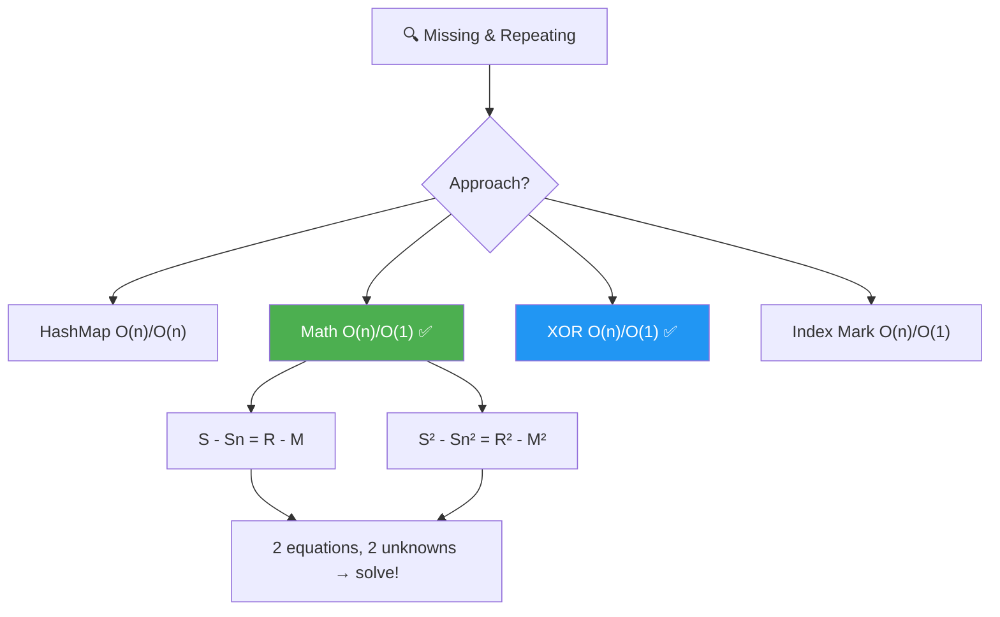
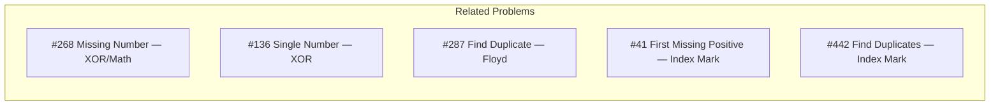
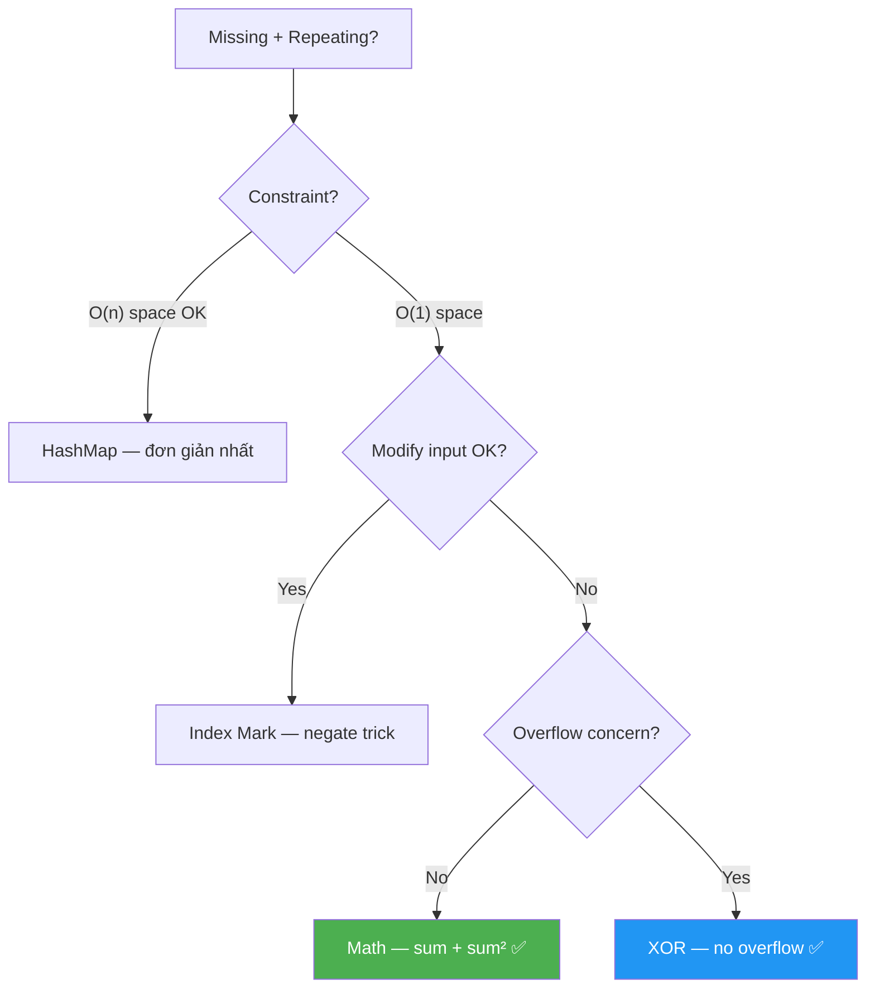
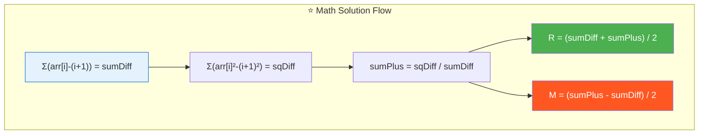
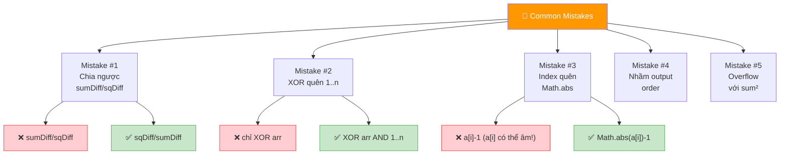
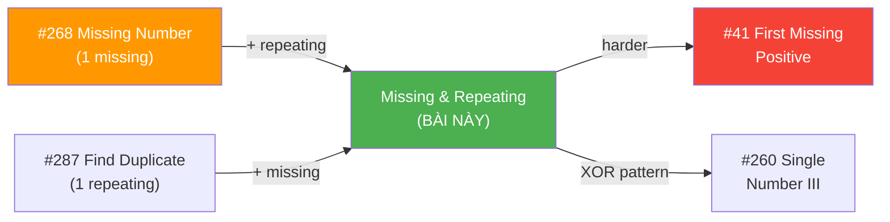
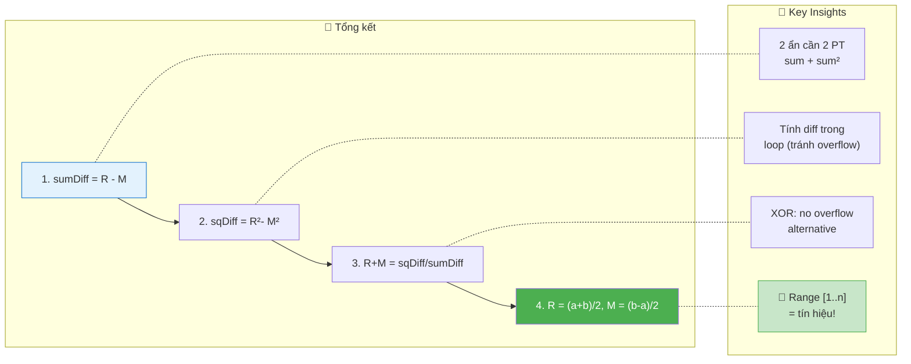

# 🔍 Missing and Repeating in an Array — GfG (Easy)

> 📖 Code: [Missing and Repeating.js](./Missing%20and%20Repeating.js)





---

## R — Repeat & Clarify

🧠 _"Range [1..n], 1 missing, 1 repeated. Dùng SUM + SUM² giải hệ 2 PT → O(n)/O(1)!"_

> 🎙️ _"Given unsorted array of size n with elements 1 to n, one number is missing and one appears twice. Find both."_

### Clarification Questions

```
Q: Mảng chứa đúng n phần tử, giá trị từ 1 đến n?
A: Đúng! Ngoại trừ: 1 số bị THIẾU, 1 số xuất hiện 2 LẦN.

Q: Chỉ có ĐÚNG 1 missing và ĐÚNG 1 repeating?
A: Đúng! Chính xác 1 cặp.

Q: Output format?
A: [repeating, missing] — repeating TRƯỚC!

Q: n có thể = 1?
A: KHÔNG! Cần ít nhất n=2 cho 1 missing + 1 repeating.

Q: Giá trị luôn dương (1..n)?
A: Đúng! Không có 0 hay số âm.
```

### Tại sao bài này quan trọng?

```
  Bài này dạy NHIỀU kỹ thuật quan trọng cùng lúc:

  ┌──────────────────────────────────────────────────────────────┐
  │  4 APPROACH, mỗi cái dạy 1 TECHNIQUE:                       │
  │                                                              │
  │  1. HashMap:     Frequency counting (cơ bản)                │
  │  2. Math:        Sum formula + Sum² → hệ 2 PT (toán học)   │
  │  3. XOR:         Bit manipulation + partitioning (nâng cao) │
  │  4. Index Mark:  In-place marking bằng negate (trick)        │
  │                                                              │
  │  📌 Bài này = "ngã tư" của nhiều patterns:                  │
  │    → Missing Number (#268) + Find Duplicate (#287)          │
  │    → Kết hợp 2 bài kinh điển thành 1!                       │
  └──────────────────────────────────────────────────────────────┘
```

---

## 🧠 Bản chất bài toán — Hiểu để NHỚ, không chỉ để GIẢI

### Bài toán = Giải hệ 2 phương trình!

```
  Mảng ĐÚNG: [1, 2, 3, ..., n]
  Mảng THỰC: 1 số BỊ THAY bởi duplicate

  Gọi R = repeating, M = missing

  arr thực = arr đúng - M + R
  → S(arr) - S(1..n) = R - M         ... (1)
  → S²(arr) - S²(1..n) = R² - M²     ... (2)

  Từ (2): R² - M² = (R-M)(R+M)
  Chia (2) cho (1): R + M = (R²-M²)/(R-M)

  Hệ:
    R - M = a   (từ sum)
    R + M = b   (từ sum²)

  → R = (a + b) / 2
  → M = (b - a) / 2

  📌 ĐÂY LÀ TOÁN LỚP 9! Hệ 2 phương trình, 2 ẩn!
```

### Hình dung trực quan

```
  arr = [4, 3, 6, 2, 1, 1]    n = 6

  Mảng đúng:  1  2  3  4  5  6    sum = 21
  Mảng thực:  4  3  6  2  1  1    sum = 17

  So sánh:
    Đúng: [1, 2, 3, 4, 5, 6]
    Thực: [4, 3, 6, 2, 1, 1]
                         ↑  ↑
                    5 missing  1 repeated

  sumDiff = 17 - 21 = -4 = R - M = 1 - 5

  ┌──────────────────────────────────────────────────────────────┐
  │  R - M = -4                                                  │
  │  R² - M² = (1² - 5²) = 1 - 25 = -24                       │
  │  R + M = -24 / -4 = 6                                       │
  │                                                              │
  │  R = (-4 + 6) / 2 = 1    ← Repeating!                      │
  │  M = (6 - (-4)) / 2 = 5  ← Missing!                        │
  └──────────────────────────────────────────────────────────────┘
```

### 4 cách nhìn — So sánh nhanh

```
  ┌──────────────┬────────────┬────────────┬──────────────────────┐
  │  Approach    │  Time      │  Space     │  Core Idea            │
  ├──────────────┼────────────┼────────────┼──────────────────────┤
  │  HashMap     │  O(n)      │  O(n)      │  Đếm frequency       │
  │  Math ✅    │  O(n)      │  O(1)      │  Hệ 2 PT (sum, sum²) │
  │  XOR ✅     │  O(n)      │  O(1)      │  Bit partition        │
  │  Index Mark  │  O(n)      │  O(1)*     │  Negate-as-visited    │
  └──────────────┴────────────┴────────────┴──────────────────────┘
  * Index Mark: O(1) extra nhưng MODIFY mảng input!

  📌 Interview: Math → dễ explain, elegant, O(1) space
     📌 Follow-up "không modify input?": XOR hoặc Math
     📌 Follow-up "overflow concern?": XOR (không overflow!)
```

---

## 🧭 Luồng Suy Nghĩ — Từ đọc đề đến solution

> 💡 Phần này dạy bạn **CÁCH TƯ DUY** để tự giải bài, không chỉ biết đáp án.

### Bước 1: Đọc đề → Gạch chân KEYWORDS

```
  Đề: "Array size n, elements 1 to n, one missing, one repeated"

  Gạch chân:
    "1 to n"           → RANGE CỐ ĐỊNH! → có thể dùng index!
    "one missing"      → giống #268 Missing Number
    "one repeated"     → giống #287 Find Duplicate
    "find both"        → cần TÌM 2 SỐ

  🧠 Tự hỏi: "Range [1..n] = biết EXPECTED sum!"
    → Sum mảng đúng = n(n+1)/2
    → So sánh với sum thực → suy ra!

  📌 Kỹ năng chuyển giao:
    "Range [1..n]" → SO SÁNH với expected!
    → Sum, Sum², XOR, Index marking đều dùng được!
```

### Bước 2: Brute Force → HashMap đếm

```
  Cách đơn giản nhất: đếm frequency mỗi số!

  Map: { value → count }
  count = 2 → repeating!
  count = 0 → missing!

  O(n) time, O(n) space
  → Tốt nhưng TỐN SPACE!

  🧠 Tự hỏi: "Có cách O(1) space không?"
```

### Bước 3: "Range [1..n] = có EXPECTED" → Toán học!

```
  💡 INSIGHT: So sánh THỰC vs EXPECTED!

  Sum thực - Sum expected = R - M     (phương trình 1)
  Sum² thực - Sum² expected = R²- M²  (phương trình 2)

  Từ (2)/(1): R + M = (R²-M²)/(R-M)  (phương trình 3)

  Giải hệ (1) và (3):
    R = [(R-M) + (R+M)] / 2
    M = [(R+M) - (R-M)] / 2

  ✅ O(n) time, O(1) space!

  📌 Kỹ năng chuyển giao:
    ┌──────────────────────────────────────────────────────────────┐
    │  "Tìm 2 ẩn" → cần 2 PHƯƠNG TRÌNH!                        │
    │    PT 1: Sum         → linear equation                     │
    │    PT 2: Sum squares → quadratic equation                  │
    │    → Giải hệ = tìm 2 ẩn!                                  │
    │                                                              │
    │  ⚠️ Chỉ Sum: R - M = a → VÔ SỐ nghiệm!                  │
    │  + Sum²: R + M = b → DUY NHẤT nghiệm!                    │
    │                                                              │
    │  Pattern: "n ẩn cần n phương trình!"                       │
    └──────────────────────────────────────────────────────────────┘
```

### Bước 4: "XOR có dùng được không?" → Partition trick!

```
  🧠 Từ bài Unique Number (#136): XOR triệt tiêu cặp!

  XOR(arr) ⊕ XOR(1..n) = R ⊕ M
  → Vì R xuất hiện 3 lần (2 trong arr + 1 trong 1..n)
    = R (vì XOR 3 lần = XOR 1 lần cho duplicate)
  → M xuất hiện 1 lần (chỉ trong 1..n)
  → Kết quả = R ⊕ M

  Tương tự #260 Single Number III:
    1. XOR all → R ⊕ M
    2. Tìm rightmost set bit → bit KHÁC nhau giữa R và M
    3. Partition tất cả số thành 2 nhóm theo bit đó
    4. XOR mỗi nhóm → tách R và M!

  ✅ O(n) time, O(1) space, KHÔNG overflow!
```

### Bước 5: "Index marking?" → Negate trick!

```
  🧠 Vì giá trị ∈ [1..n] = index range!
    → Dùng giá trị LÀM INDEX, mark visited!

  Duyệt arr: với mỗi val, negate arr[val-1]
    → Nếu arr[val-1] ĐÃ ÂM → val là REPEATING!
    → Sau khi duyệt: index j mà arr[j] > 0 → (j+1) là MISSING!

  ✅ O(n) time, O(1) space
  ⚠️ MODIFY mảng input!
```

### Bước 6: Tổng kết — Cây quyết định



---

## E — Examples

### Ví dụ minh họa trực quan

```
VÍ DỤ 1: arr = [3, 1, 3]    n = 3

  Expected: [1, 2, 3]    sum = 6     sum² = 14
  Actual:   [3, 1, 3]    sum = 7     sum² = 19

  sumDiff = 7 - 6 = 1 = R - M
  sqDiff = 19 - 14 = 5 = R² - M²
  sumPlus = 5 / 1 = 5 = R + M

  R = (1 + 5) / 2 = 3    ← Repeating!
  M = (5 - 1) / 2 = 2    ← Missing!

  → [3, 2] ✅
```

```
VÍ DỤ 2: arr = [4, 3, 6, 2, 1, 1]    n = 6

  Expected sum = 21    sum² = 91
  Actual sum   = 17    sum² = 67

  sumDiff = 17 - 21 = -4 = R - M
  sqDiff = 67 - 91 = -24 = R² - M²
  sumPlus = -24 / -4 = 6 = R + M

  R = (-4 + 6) / 2 = 1    ← Repeating!
  M = (6 - (-4)) / 2 = 5  ← Missing!

  → [1, 5] ✅
```

### Trace — Index Mark: arr = [3, 1, 3]

```
  ┌──────────────────────────────────────────────────────────────────┐
  │ i=0: val = |3| = 3  → idx = 2                                   │
  │   arr[2] = 3 > 0 → negate: arr[2] = -3                         │
  │   arr = [3, 1, -3]                                               │
  │                ↑ marked!                                         │
  ├──────────────────────────────────────────────────────────────────┤
  │ i=1: val = |1| = 1  → idx = 0                                   │
  │   arr[0] = 3 > 0 → negate: arr[0] = -3                         │
  │   arr = [-3, 1, -3]                                              │
  │         ↑ marked!                                                │
  ├──────────────────────────────────────────────────────────────────┤
  │ i=2: val = |-3| = 3 → idx = 2                                   │
  │   arr[2] = -3 < 0 → ALREADY MARKED! → repeating = 3 ✅         │
  │   arr = [-3, 1, -3]                                              │
  └──────────────────────────────────────────────────────────────────┘

  Pass 2: find positive → arr[1] = 1 > 0 → missing = 1+1 = 2 ✅
  → [3, 2] ✅
```

### Trace — XOR: arr = [3, 1, 3]

```
  Step 1: XOR all
    xorAll = 0
    i=0: xorAll ^= 3 ^= 1 → 3^1 = 2       (arr XOR 1..n)
    i=1: xorAll ^= 1 ^= 2 → 2^1^2 = 1
    i=2: xorAll ^= 3 ^= 3 → 1^3^3 = 1

    xorAll = 1 = 01₂ = R ⊕ M = 3 ⊕ 2 = 01₂ ✅

  Step 2: rightmost set bit = 1 & -1 = 1 (bit 0)

  Step 3: Partition by bit 0
    Bit 0 = 1: 3(11), 1(01), 3(11) from arr; 1(01), 3(11) from 1..n
    Bit 0 = 0: nothing from arr; 2(10) from 1..n

    group1 = 3⊕1⊕3 ⊕ 1⊕3 = 3   (bit 0 set)
    group0 = 0 ⊕ 2 = 2           (bit 0 unset)

  Step 4: 3 ∈ arr? YES → repeating = 3, missing = 2
  → [3, 2] ✅
```

---

## A — Approach

### Approach 1: HashMap — O(n)/O(n)

```
  ┌──────────────────────────────────────────────────────────────┐
  │  Pass 1: đếm frequency mỗi phần tử                          │
  │  Pass 2: duyệt 1..n, tìm count=2 và count=0                │
  │                                                              │
  │  Time: O(n)    Space: O(n)                                   │
  │  → Đơn giản nhất, nhưng tốn space!                          │
  └──────────────────────────────────────────────────────────────┘
```

### Approach 2: Math — O(n)/O(1) ✅

```
  💡 Hệ 2 phương trình, 2 ẩn:

  ┌──────────────────────────────────────────────────────────────┐
  │  Gọi a = S_arr - S_expected = R - M                         │
  │  Gọi c = S²_arr - S²_expected = R² - M² = (R-M)(R+M)      │
  │  → b = c / a = R + M                                        │
  │                                                              │
  │  R = (a + b) / 2                                             │
  │  M = (b - a) / 2                                             │
  │                                                              │
  │  Time: O(n)    Space: O(1)                                   │
  │  ⚠️ Overflow risk: sum² có thể rất lớn!                    │
  └──────────────────────────────────────────────────────────────┘
```

### Approach 3: XOR — O(n)/O(1) ✅

```
  💡 XOR + Bit Partition (giống #260):

  ┌──────────────────────────────────────────────────────────────┐
  │  Step 1: xor = XOR(arr) ⊕ XOR(1..n) = R ⊕ M               │
  │  Step 2: setBit = xor & (-xor) → rightmost differing bit   │
  │  Step 3: Partition all nums by setBit → XOR each group      │
  │  Step 4: Check which is in arr → repeating vs missing       │
  │                                                              │
  │  Time: O(n)    Space: O(1)                                   │
  │  ✅ NO OVERFLOW! XOR luôn trong 32-bit range!               │
  └──────────────────────────────────────────────────────────────┘
```

### Approach 4: Index Mark — O(n)/O(1)*

```
  💡 Dùng giá trị làm index, negate để đánh dấu:

  ┌──────────────────────────────────────────────────────────────┐
  │  Pass 1: Với mỗi val, negate arr[|val|-1]                   │
  │    Nếu ĐÃ ÂM → val là REPEATING!                           │
  │  Pass 2: Tìm index j mà arr[j] > 0 → j+1 là MISSING!      │
  │                                                              │
  │  Time: O(n)    Space: O(1)                                   │
  │  ⚠️ MODIFY input array!                                    │
  └──────────────────────────────────────────────────────────────┘
```

---

## C — Code

### Solution 1: HashMap — O(n)/O(n)

```javascript
function findMissingRepeatingMap(arr) {
  const n = arr.length;
  const freq = new Map();
  let repeating = -1, missing = -1;

  for (const val of arr) {
    freq.set(val, (freq.get(val) || 0) + 1);
  }

  for (let i = 1; i <= n; i++) {
    const count = freq.get(i) || 0;
    if (count === 2) repeating = i;
    if (count === 0) missing = i;
  }

  return [repeating, missing];
}
```

### Solution 2: Math — O(n)/O(1) ✅

```javascript
function findMissingRepeatingMath(arr) {
  const n = arr.length;
  let sumDiff = 0, sqDiff = 0;

  for (let i = 0; i < n; i++) {
    sumDiff += arr[i] - (i + 1);
    sqDiff += arr[i] * arr[i] - (i + 1) * (i + 1);
  }

  const sumPlus = sqDiff / sumDiff;
  const repeating = (sumDiff + sumPlus) / 2;
  const missing = (sumPlus - sumDiff) / 2;

  return [repeating, missing];
}
```

```
  📝 Line-by-line:

  Line 4-5: sumDiff += arr[i] - (i + 1)
    → Tính S_arr - S_expected CÙNG LÚC (tránh overflow tốt hơn!)
    → (i+1) = expected value tại index i

  Line 6: sqDiff += arr[i]² - (i+1)²
    → Tương tự cho sum of squares

    ⚠️ Tại sao tính CÙNG LÚC thay vì tính riêng rồi trừ?
       S_arr = Σarr[i], S_exp = n(n+1)/2
       Tính riêng: 2 biến lớn → trừ → overflow!
       Tính diff: Σ(arr[i] - (i+1)) → nhỏ hơn → ít overflow hơn!

  Line 9: sumPlus = sqDiff / sumDiff
    → R + M = (R²-M²) / (R-M)

    ⚠️ sqDiff / sumDiff phải CHIA HẾT!
       Vì (R²-M²) = (R-M)(R+M) → chia cho (R-M) = R+M (integer!)

  Line 10-11: R = (a+b)/2, M = (b-a)/2
    → Giải hệ: R-M=a, R+M=b
    → Cả hai LUÔN chẵn (vì R, M integer)
```

### Solution 3: XOR — O(n)/O(1) ✅

```javascript
function findMissingRepeatingXOR(arr) {
  const n = arr.length;

  // Step 1: XOR all → R ⊕ M
  let xorAll = 0;
  for (let i = 0; i < n; i++) {
    xorAll ^= arr[i] ^ (i + 1);
  }

  // Step 2: Rightmost set bit
  const setBit = xorAll & (-xorAll);

  // Step 3: Partition & XOR
  let group0 = 0, group1 = 0;
  for (let i = 0; i < n; i++) {
    if (arr[i] & setBit) group1 ^= arr[i];
    else group0 ^= arr[i];
    if ((i + 1) & setBit) group1 ^= (i + 1);
    else group0 ^= (i + 1);
  }

  // Step 4: Identify
  for (const val of arr) {
    if (val === group0) return [group0, group1];
  }
  return [group1, group0];
}
```

```
  📝 Line-by-line:

  Line 6: xorAll ^= arr[i] ^ (i + 1)
    → XOR cả arr elements VÀ expected elements (1..n)
    → Duplicates triệt tiêu: mỗi số xuất hiện 2 lần ĐỀU = 0
    → Chỉ còn R (xuất hiện 2+1=3 lần → XOR = R) 
      và M (xuất hiện 0+1=1 lần → XOR = M)
    → xorAll = R ⊕ M

  Line 9: setBit = xorAll & (-xorAll)
    → Tìm rightmost set bit (bit 1 thấp nhất)
    → -xorAll = two's complement → flip + 1
    → & cho bit thấp nhất khác 0
    → Bit này KHÁC NHAU giữa R và M!

  Line 12-17: Partition
    → Chia TẤT CẢ số (arr + 1..n) thành 2 nhóm theo setBit
    → Nhóm có bit set: XOR → ra 1 trong R hoặc M
    → Nhóm có bit unset: XOR → ra cái còn lại

  Line 20-22: Identify
    → Check xem group0 có trong arr không
    → CÓ → group0 = repeating, group1 = missing
    → KHÔNG → ngược lại
```

### Solution 4: Index Mark — O(n)/O(1)*

```javascript
function findMissingRepeatingMark(arr) {
  const a = [...arr];
  const n = a.length;
  let repeating = -1, missing = -1;

  for (let i = 0; i < n; i++) {
    const idx = Math.abs(a[i]) - 1;
    if (a[idx] < 0) repeating = Math.abs(a[i]);
    else a[idx] = -a[idx];
  }

  for (let i = 0; i < n; i++) {
    if (a[i] > 0) { missing = i + 1; break; }
  }

  return [repeating, missing];
}
```

```
  📝 Line-by-line:

  Line 7: idx = Math.abs(a[i]) - 1
    → Dùng GIÁ TRỊ phần tử làm INDEX!
    → Math.abs vì phần tử có thể ĐÃ BỊ NEGATE!
    → -1 vì values 1-based, index 0-based

  Line 8: if (a[idx] < 0) → ĐÃ VISIT!
    → a[idx] âm = index idx ĐÃ ĐƯỢC MARK trước đó
    → Ai mark? Phần tử có cùng giá trị!
    → → REPEATING!

  Line 9: else a[idx] = -a[idx]
    → Chưa visit → MARK bằng negate!

  Line 13: if (a[i] > 0) → CHƯA VISIT!
    → Không có phần tử nào có giá trị (i+1)
    → → MISSING!
```

---

## 🔬 Deep Dive — Giải thích CHI TIẾT Math Solution

> 💡 Phân tích **từng dòng** Math approach để hiểu **TẠI SAO**.

```javascript
function findMissingRepeatingMath(arr) {
  const n = arr.length;

  // ═══════════════════════════════════════════════════════════
  // DÒNG 1-2: Tính diff TRONG VÒNG LẶP (tránh overflow!)
  // ═══════════════════════════════════════════════════════════
  //
  // TẠI SAO tính diff (arr[i]-(i+1)) thay vì sum riêng?
  //   Cách 1: S_arr = Σarr[i], S_exp = n(n+1)/2 → 2 số LỚN!
  //   Cách 2: Σ(arr[i]-(i+1)) = S_arr - S_exp → 1 số NHỎ!
  //   → Giảm overflow risk!
  //
  let sumDiff = 0, sqDiff = 0;

  for (let i = 0; i < n; i++) {
    // sumDiff = Σ(arr[i] - expected[i]) = R - M
    sumDiff += arr[i] - (i + 1);

    // sqDiff = Σ(arr[i]² - expected[i]²) = R² - M²
    sqDiff += arr[i] * arr[i] - (i + 1) * (i + 1);
  }

  // ═══════════════════════════════════════════════════════════
  // DÒNG 3-5: Giải hệ 2 PT, 2 ẩn
  // ═══════════════════════════════════════════════════════════
  //
  // Phương trình:
  //   R - M  = sumDiff  ... (1)
  //   R²-M² = sqDiff   ... (2)
  //
  // (2) = (R-M)(R+M) = sumDiff × (R+M)
  // → R + M = sqDiff / sumDiff  ... (3)
  //
  // Từ (1) và (3):
  //   R = [(R-M) + (R+M)] / 2
  //   M = [(R+M) - (R-M)] / 2
  //
  const sumPlus = sqDiff / sumDiff;  // R + M
  const repeating = (sumDiff + sumPlus) / 2;  // R
  const missing = (sumPlus - sumDiff) / 2;    // M

  return [repeating, missing];
}
```



---

## 📐 Invariant — Chứng minh tính đúng đắn

```
  📐 CHỨNG MINH MATH APPROACH:

  Cho arr chứa số 1..n, với M bị thay bởi R.

  Σarr = Σ(1..n) - M + R
  → Σarr - Σ(1..n) = R - M = a                 ...(1)

  Σ(arr²) = Σ(1²..n²) - M² + R²
  → Σ(arr²) - Σ(1²..n²) = R² - M² = c           ...(2)

  (2) = (R-M)(R+M) = a×b  với b = R+M
  → b = c/a                                     ...(3)

  Từ (1) và (3): { R-M=a, R+M=b }
    R = (a+b)/2  ✅
    M = (b-a)/2  ✅

  Tính hợp lệ: a+b và b-a LUÔN chẵn
    Vì R,M ∈ integers → R+M và R-M cùng chẵn/lẻ
    Nếu R chẵn, M chẵn: a chẵn, b chẵn ✅
    Nếu R lẻ, M lẻ: a chẵn, b chẵn ✅
    Nếu R chẵn, M lẻ: a lẻ, b lẻ → (a+b) chẵn ✅
    Nếu R lẻ, M chẵn: a lẻ, b lẻ → (a+b) chẵn ✅
    → (a+b)/2 và (b-a)/2 LUÔN nguyên! ∎
```

```
  📐 CHỨNG MINH XOR APPROACH:

  XOR(arr) ⊕ XOR(1..n):
    Mỗi số từ 1..n trừ M và R xuất hiện 2 lần (1 arr + 1 expected)
    → XOR 2 lần = 0 (triệt tiêu!)

    R xuất hiện 3 lần (2 arr + 1 expected) → XOR = R
    M xuất hiện 1 lần (0 arr + 1 expected) → XOR = M

    → Kết quả = R ⊕ M ✅

  Partition: R ⊕ M ≠ 0 (vì R ≠ M)
    → Tồn tại ít nhất 1 bit khác nhau
    → Chia theo bit đó → R và M ở 2 nhóm khác
    → XOR mỗi nhóm → tách R và M! ∎
```

---

## ❌ Common Mistakes — Lỗi thường gặp



### Mistake 1: Math — chia ngược thứ tự

```javascript
// ❌ SAI: chia ngược!
const sumPlus = sumDiff / sqDiff;
// (R-M) / (R²-M²) = 1/(R+M) → SAI HẲN!

// ✅ ĐÚNG: sqDiff / sumDiff!
const sumPlus = sqDiff / sumDiff;
// (R²-M²) / (R-M) = (R-M)(R+M)/(R-M) = R+M ✅
```

### Mistake 2: XOR — quên XOR cả 1..n

```javascript
// ❌ SAI: chỉ XOR arr!
for (const val of arr) xorAll ^= val;
// → Kết quả = XOR(arr) ≠ R⊕M!

// ✅ ĐÚNG: XOR cả arr VÀ 1..n
for (let i = 0; i < n; i++) xorAll ^= arr[i] ^ (i + 1);
// → Triệt tiêu cặp, chỉ còn R⊕M!
```

### Mistake 3: Index Mark — quên Math.abs

```javascript
// ❌ SAI: a[i] có thể đã bị negate!
const idx = a[i] - 1;  // a[i] = -3 → idx = -4 → CRASH!

// ✅ ĐÚNG: luôn dùng Math.abs!
const idx = Math.abs(a[i]) - 1;
// a[i] = -3 → |a[i]| = 3 → idx = 2 ✅
```

### Mistake 4: Nhầm output order

```javascript
// ❌ SAI: tùy đề bài! Đọc KỸ output format!
return [missing, repeating];  // nhiều đề yêu cầu [repeating, missing]!

// ✅ ĐÚNG: return [repeating, missing]
// GfG: repeating TRƯỚC!
```

### Mistake 5: Overflow với sum²

```
  n = 10⁵: sum² ≈ 10¹⁵ → vượt Number.MAX_SAFE_INTEGER (2⁵³)!
  → Kết quả SAI do mất precision!

  🧠 Giải pháp:
    1. Tính diff trong vòng lặp (giảm magnitude)
    2. Dùng BigInt nếu cần chính xác
    3. Dùng XOR approach (KHÔNG overflow!)

  📌 Interview: nêu Math trước, nhắc overflow → chuyển XOR!
```

---

## O — Optimize

```
                      Time       Space     Modify?   Overflow?
  ─────────────────────────────────────────────────────────────────
  HashMap             O(n)       O(n)      No        No
  Math ✅             O(n)       O(1)      No        ⚠️ sum²!
  XOR ✅              O(n)       O(1)      No        No ✅
  Index Mark          O(n)       O(1)*     Yes!      No

  📌 Interview recommendation:
    → Nêu Math TRƯỚC (elegant, dễ explain)
    → Nêu XOR nếu hỏi follow-up "no overflow?"
    → Nêu Index Mark nếu hỏi "modify input OK?"
```

### Complexity chính xác — Đếm operations

```
  Math: 1 pass × 4 ops (2 trừ + 2 nhân) + 3 ops (chia + cộng)
    TỔNG: 4n + 3 operations

  XOR:  Pass 1: 2n XOR = 2n
        setBit: 2 ops
        Pass 2: 4n XOR (2 groups × arr + expected) = 4n
        Pass 3: n comparisons (identify)
    TỔNG: 7n + 2 operations

  HashMap: 2n hash ops + n scan = 3n ops
    Nhưng O(n) space = ~8n bytes RAM!

  📊 So sánh THỰC TẾ (n = 10⁶):
    Math:    4×10⁶ ops, 16 bytes RAM
    XOR:     7×10⁶ ops, 16 bytes RAM
    HashMap: 3×10⁶ ops, ~8MB RAM 😰
    → Math nhanh nhất, XOR an toàn nhất!
```

---

## T — Test

```
Test Cases:
  [3,1,3]             → [3,2]   ✅ n=3 basic
  [4,3,6,2,1,1]       → [1,5]   ✅ n=6, repeating ở cuối
  [1,1]               → [1,2]   ✅ Minimum n=2
  [2,2]               → [2,1]   ✅ Min n=2, missing=1
  [2,3,1,5,1]         → [1,4]   ✅ n=5
  [1,3,2,5,4,6,7,5]   → [5,8]   ✅ n=8, missing ở cuối
```

## 🗣️ Interview Script

### 🎙️ Think Out Loud — Mô phỏng phỏng vấn thực

> ⚠️ Script này dạy cách **NÓI**, không phải cách CODE.
> Mỗi đoạn = cách bạn **PHÁT BIỂU** trong phỏng vấn thực!

```
  ╔══════════════════════════════════════════════════════════════╗
  ║  🕐 FULL INTERVIEW SIMULATION — 1h30 (90 phút)             ║
  ║                                                              ║
  ║  00:00-05:00  Introduction + Icebreaker         (5 min)     ║
  ║  05:00-45:00  Problem Solving                   (40 min)    ║
  ║  45:00-60:00  Deep Technical Probing            (15 min)    ║
  ║  60:00-75:00  Variations + Extensions           (15 min)    ║
  ║  75:00-85:00  System Design at Scale            (10 min)    ║
  ║  85:00-90:00  Behavioral + Q&A                  (5 min)     ║
  ╚══════════════════════════════════════════════════════════════╝
```

```
  ╔══════════════════════════════════════════════════════════════╗
  ║  PART 1: INTRODUCTION (00:00 — 05:00)                       ║
  ╚══════════════════════════════════════════════════════════════╝

  👤 "Tell me about yourself and a time you debugged
      data integrity issues."

  🧑 "I'm a frontend engineer with [X] years of experience.
      A relevant example: I was building a user ID assignment
      system. Each new user was supposed to get a unique ID
      from 1 to n. But a bug caused one ID to be assigned
      TWICE and one ID to be skipped entirely.

      We needed to find BOTH: which ID was duplicated
      and which was missing. We had millions of users,
      so scanning the database had to be efficient.

      My first approach used a frequency counter —
      HashMap. O of n time but O of n space for the map.
      For millions of IDs, that was expensive.

      Then I realized: since IDs are from 1 to n,
      I KNOW the expected sum and sum of squares.
      Comparing actual versus expected gives me two
      equations with two unknowns — the duplicate and
      the missing ID. I solved the system algebraically.

      Memory dropped from megabytes to a few variables.
      That's the math approach for this exact problem."

  👤 "Perfect. Let's explore all the approaches."
```

```
  ╔══════════════════════════════════════════════════════════════╗
  ║  PART 2: PROBLEM SOLVING (05:00 — 45:00)                   ║
  ╚══════════════════════════════════════════════════════════════╝

  ──────────────── 05:00 — Clarify (4 phút) ────────────────

  👤 "Given an unsorted array of size n with elements from
      1 to n. One number is missing and one appears twice.
      Find both."

  🧑 "Let me clarify the exact structure.

      The array has EXACTLY n elements.
      Values SHOULD be {1, 2, 3, ..., n} — a permutation.
      But ONE value is missing and replaced by a DUPLICATE
      of another value.

      So exactly one number appears TWICE — the repeating.
      Exactly one number appears ZERO times — the missing.
      All other numbers appear exactly ONCE.

      Output format: return repeating THEN missing.

      n is at least 2 — because I need room for at least
      one normal, one duplicate, and one missing.

      Values are positive: 1 to n. No zeros, no negatives.

      This problem is the INTERSECTION of two classics:
      Missing Number — LeetCode 268 — find the one missing.
      Find the Duplicate — LeetCode 287 — find the one duplicate.
      Here I need to find BOTH simultaneously."

  ──────────────── 09:00 — Approach 1: HashMap (3 phút) ────────────

  🧑 "The simplest approach: frequency counting.

      Build a HashMap of value to count.
      Scan from 1 to n: count equal 2 is repeating,
      count equal 0 is missing.

      Time: O of n. Space: O of n for the HashMap.

      This works but uses linear extra space.
      Can I do O of 1 space?"

  ──────────────── 12:00 — Approach 2: Math — Sum + Sum² (8 phút) ──

  🧑 "Here's the elegant mathematical approach.

      I KNOW what the array SHOULD contain:
      the numbers 1 through n.

      I know the EXPECTED sum: n times n plus 1 divided by 2.
      I know the EXPECTED sum of squares:
      n times n plus 1 times 2n plus 1 divided by 6.

      The ACTUAL array differs from the expected by:
      the missing number M is removed, the repeating number R
      is added. So:

      Actual sum minus Expected sum
      equals R minus M — call this 'a'.

      Actual sum of squares minus Expected sum of squares
      equals R squared minus M squared — call this 'c'.

      Now I have TWO equations with TWO unknowns:

      Equation 1: R minus M equals a.
      Equation 2: R squared minus M squared equals c.

      From equation 2: R squared minus M squared factors as
      R minus M times R plus M. So c equals a times R plus M.
      Therefore R plus M equals c divided by a.
      Call this 'b'.

      Now I have:
      R minus M equals a.
      R plus M equals b.

      Solving: R equals a plus b divided by 2.
      M equals b minus a divided by 2.

      This is HIGH SCHOOL algebra — a system of two linear
      equations in two unknowns.

      Time: O of n — one pass to compute both sums.
      Space: O of 1 — just a few variables.

      One caveat: sum of squares can be very large.
      For n equal 100,000: sum of squares is about 10 to the 14.
      That's within JavaScript's Number dot MAX_SAFE_INTEGER
      of 2 to the 53, but it's worth mentioning."

  ──────────────── 20:00 — Trace bằng LỜI (4 phút) ────────────────

  🧑 "Let me trace with arr equal [3, 1, 3]. n equal 3.

      Expected: {1, 2, 3}. Sum equal 6. Sum² equal 14.
      Actual: {3, 1, 3}. Sum equal 7. Sum² equal 19.

      a equal sumDiff equal 7 minus 6 equal 1.
      So R minus M equal 1.

      c equal sqDiff equal 19 minus 14 equal 5.
      So R squared minus M squared equal 5.

      b equal c divided by a equal 5 divided by 1 equal 5.
      So R plus M equal 5.

      R equal 1 plus 5 divided by 2 equal 3. Repeating!
      M equal 5 minus 1 divided by 2 equal 2. Missing!

      Result: [3, 2]. Correct!"

  🧑 "Another trace: arr equal [4, 3, 6, 2, 1, 1]. n equal 6.

      Expected sum equal 21. Expected sum² equal 91.
      Actual sum equal 17. Actual sum² equal 67.

      a equal 17 minus 21 equal minus 4. R minus M equal minus 4.
      c equal 67 minus 91 equal minus 24. R² minus M² equal minus 24.
      b equal minus 24 divided by minus 4 equal 6. R plus M equal 6.

      R equal minus 4 plus 6 divided by 2 equal 1.
      M equal 6 minus minus 4 divided by 2 equal 5.

      Result: [1, 5]. Correct!

      Note: R minus M is NEGATIVE here because R equal 1
      is less than M equal 5. The math still works!"

  ──────────────── 24:00 — Code walkthrough (4 phút) ────────────────

  🧑 "Let me code the math approach.

      [Vừa viết vừa nói:]

      Initialize sumDiff and sqDiff to 0.
      Loop from 0 to n minus 1:
      sumDiff plus equals arr at i minus i plus 1.
      sqDiff plus equals arr at i squared minus i plus 1 squared.

      Important: I compute the DIFFERENCE in the loop
      rather than computing actual and expected sums separately.
      This reduces intermediate values and helps avoid overflow.

      After the loop:
      sumPlus equal sqDiff divided by sumDiff.
      repeating equal sumDiff plus sumPlus divided by 2.
      missing equal sumPlus minus sumDiff divided by 2.

      Return [repeating, missing].

      The division sqDiff divided by sumDiff is EXACT —
      it always yields an integer because
      R² minus M² equals R minus M times R plus M."

  ──────────────── 28:00 — Approach 3: XOR (6 phút) ────────────────

  🧑 "If the interviewer is concerned about overflow,
      I switch to XOR. No overflow risk with XOR!

      Step 1: XOR all array elements WITH all values
      from 1 to n. Every number that appears exactly twice
      cancels out. What remains is R XOR M.

      Why? The repeating number R appears 2 times in the array
      plus 1 time in the expected range — 3 times total.
      XOR of a number 3 times equals the number itself.
      The missing M appears 0 times in the array
      plus 1 time in the expected range — 1 time total.
      All other numbers appear 2 times — they cancel to 0.
      Result: R XOR M.

      Step 2: R XOR M is nonzero because R is not equal to M.
      Find the rightmost set bit — a bit where R and M differ.

      Step 3: Partition ALL numbers — both array elements
      AND values 1 to n — into two groups based on that bit.
      R and M land in DIFFERENT groups.
      XOR each group separately. Each group's XOR gives
      one of the two values.

      Step 4: Check which result appears in the array.
      If it's in the array, it's the repeating number.
      Otherwise, it's the missing number.

      This is the EXACT same technique as LeetCode 260 —
      Single Number III — where two distinct numbers each
      appear once amid pairs.

      Time: O of n. Space: O of 1. NO overflow."

  ──────────────── 34:00 — Approach 4: Index Mark (4 phút) ────────

  🧑 "A fourth approach: use the array ITSELF as a hash map.

      Since values are in range 1 to n, each value maps
      to an array index. I use NEGATION as a 'visited' marker.

      Pass 1: for each element, take its absolute value minus 1
      as an index. If the element at that index is already
      negative, the value is the REPEATING number — it's been
      visited before. Otherwise, negate the element at that index.

      Why Math dot abs? Because as I negate elements,
      some values become negative. I need the original value,
      so I take the absolute value.

      Pass 2: any index whose element is still POSITIVE
      was never visited — its corresponding value is
      the MISSING number.

      Time: O of n. Space: O of 1.
      Caveat: this MODIFIES the input array. If the interviewer
      says 'don't modify the input,' I use the math or XOR approach."

  ──────────────── 38:00 — Edge Cases (3 phút) ────────────────

  🧑 "Edge cases.

      n equal 2: [1, 1]. Repeating is 1, missing is 2.
      n equal 2: [2, 2]. Repeating is 2, missing is 1.

      Repeating is at the beginning: [3, 2, 3].
      Repeating is at the end: [1, 3, 3].

      Maximum and minimum values: repeating is 1 or n.
      Missing is 1 or n.

      These all work with the math approach because
      the algebra doesn't depend on positions or values,
      only on sums."

  ──────────────── 41:00 — Complexity comparison (4 phút) ────────

  🧑 "Let me summarize the four approaches:

      HashMap: O of n time, O of n space.
      Simplest to implement. Good for a first answer.

      Math — sum plus sum²:
      O of n time, O of 1 space.
      Elegant, compact code. Potential overflow for large n.

      XOR — bit partition:
      O of n time, O of 1 space.
      No overflow. More complex to explain and implement.

      Index Mark — negate trick:
      O of n time, O of 1 space.
      Modifies the input array.

      For interviews, I present HashMap first to show
      the baseline, then escalate to math for the O of 1 space
      optimization. If overflow is raised, I pivot to XOR."
```

```
  ╔══════════════════════════════════════════════════════════════╗
  ║  PART 3: DEEP TECHNICAL PROBING (45:00 — 60:00)            ║
  ╚══════════════════════════════════════════════════════════════╝

  ──────────────── 45:00 — Why sum + sum² work together (4 phút) ──

  👤 "Why do you need BOTH sum and sum of squares?
      Why not just sum?"

  🧑 "Sum alone gives ONE equation: R minus M equals a.
      But that has infinitely many solutions!
      R equal 5 and M equal 3 gives a equal 2.
      R equal 10 and M equal 8 also gives a equal 2.
      One equation, two unknowns — underdetermined.

      I need a SECOND equation that's INDEPENDENT.
      Sum of squares gives: R squared minus M squared equals c.
      This is a different relationship because squaring
      spreads values nonlinearly.

      Two independent equations, two unknowns —
      unique solution. This is fundamental linear algebra:
      n unknowns need n independent equations.

      Could I use sum of CUBES instead of squares?
      Yes! Sum of cubes would also give a valid second equation.
       But squares are simpler to compute and less prone
      to overflow than cubes."

  ──────────────── 49:00 — The sqDiff / sumDiff division (4 phút) ──

  👤 "Prove that sqDiff divided by sumDiff is always an integer."

  🧑 "sqDiff equals R squared minus M squared.
      Factor: R squared minus M squared equals
      R minus M times R plus M.

      sumDiff equals R minus M.

      So sqDiff divided by sumDiff equals
      R minus M times R plus M divided by R minus M
      equals R plus M.

      R and M are both integers in range 1 to n.
      So R plus M is an integer.
      The division is exact — no remainder.

      One technical concern: can sumDiff be zero?
      sumDiff equals R minus M. If R equals M, it would be zero.
      But the problem guarantees R is not equal to M —
      they're distinct numbers. So sumDiff is never zero.
      Division by zero is impossible."

  ──────────────── 53:00 — XOR partition deep-dive (4 phút) ────────

  👤 "Walk me through the XOR partition more carefully."

  🧑 "After step 1, I have xorAll equal R XOR M.
      Since R is not equal to M, xorAll is nonzero.
      It has at least one bit set to 1.

      I find the RIGHTMOST set bit using the classic trick:
      setBit equals xorAll AND negative xorAll.
      Negative xorAll is the two's complement — flip all bits
      and add 1. The AND isolates the lowest set bit.

      This bit is where R and M DIFFER.
      One of them has this bit as 1, the other as 0.

      I partition ALL numbers — both array elements AND
      expected values 1 to n — into two groups:
      Group A: bit is set. Group B: bit is unset.

      R goes to one group, M to the other.
      All other numbers appear twice in total —
      once from the array, once from the expected range.
      They cancel within their group.

      So group A's XOR gives R or M.
      Group B's XOR gives the other.

      To determine which is which, I check: does group A's
      result appear in the original array?
      If yes — it's the repeating. If no — it's the missing."

  ──────────────── 57:00 — Overflow analysis (3 phút) ────────────

  👤 "At what n does the math approach overflow?"

  🧑 "In JavaScript, Number dot MAX_SAFE_INTEGER is
      2 to the 53, approximately 9 times 10 to the 15.

      Sum of squares for 1 to n is approximately
      n cubed divided by 3.

      For n equal 100,000: sum² is about 3.3 times 10 to the 14.
      Safe.

      For n equal 1,000,000: sum² is about 3.3 times 10 to the 17.
      EXCEEDS Number dot MAX_SAFE_INTEGER!

      So for n above roughly 200,000, the math approach
      loses precision in JavaScript.

      Solutions: use BigInt, or switch to XOR which has
      NO overflow — XOR of 32-bit values stays 32-bit.

      In C++ with 64-bit long long, the limit is higher:
      about n equal 2 million. But eventually, sum of squares
      always grows cubically and eventually overflows."
```

```
  ╔══════════════════════════════════════════════════════════════╗
  ║  PART 4: VARIATIONS (60:00 — 75:00)                         ║
  ╚══════════════════════════════════════════════════════════════╝

  ──────────────── 60:00 — Multiple duplicates (4 phút) ────────────

  👤 "What if there are MULTIPLE missing and multiple repeating?"

  🧑 "The math approach breaks down!

      With k missing and k repeating values, I have 2k unknowns.
      Sum gives 1 equation. Sum of squares gives 1 more.
      I need 2k equations total — far more than 2.

      For k duplicates, I'd need sum, sum², sum³, ... up to
      sum to the 2k power. The algebra becomes intractable.

      For the general case, I'd use different approaches:
      HashMap — always works, O of n space.
      Index Mark — works for 'values in range 1 to n.'
      Sort — O of n log n, then one pass to find anomalies.

      The XOR approach also fails for multiple duplicates
      because the cancellation pattern breaks."

  ──────────────── 64:00 — Only missing, no repeating (3 phút) ────

  👤 "What if there's only a missing number, no duplicate?"

  🧑 "That's LeetCode 268 — Missing Number!

      Array has n minus 1 elements from range 0 to n
      or 1 to n. Find the missing one.

      Three approaches:
      Sum: expected sum minus actual sum equals missing.
      XOR: XOR all elements with 0 to n. Pairs cancel.
      Result is the missing number.
      Index: use the Gauss formula.

      Only ONE unknown, ONE equation. Much simpler.
      Our problem is the '2 unknowns' extension."

  ──────────────── 67:00 — Only repeating, no missing (3 phút) ────

  👤 "What about only the duplicate, no missing?"

  🧑 "That's LeetCode 287 — Find the Duplicate Number!

      Array has n plus 1 elements from range 1 to n.
      One number appears at least twice. Find it.

      Classic approaches:
      Floyd's cycle detection — treat array as linked list.
      O of n time, O of 1 space.
      XOR — XOR all with 1 to n.
      Sort — O of n log n.

      Our problem COMBINES 268 and 287:
      find BOTH the missing AND the repeating.
      The mathematical system of equations handles both
      simultaneously."

  ──────────────── 70:00 — Range is 0 to n instead of 1 to n (2 phút)

  👤 "What if the range is 0 to n instead of 1 to n?"

  🧑 "Minor adjustment! The expected values change.

      Expected sum becomes 0 plus 1 plus ... plus n
      equal n times n plus 1 divided by 2.
      Same formula.

      The index-mark approach needs modification
      because index 0 maps to value 0 — we need to handle
      the zero-indexing carefully.

      The XOR approach works identically — XOR of 0
      doesn't change anything.

      The core logic is unchanged."

  ──────────────── 72:00 — Index mark without modifying input (3 phút)

  👤 "The index mark modifies the array. What if I can't?"

  🧑 "Three options:

      1. COPY the array first, work on the copy.
      O of n space — but then I might as well use HashMap.

      2. RESTORE the array after. After finding the answer,
      reverse all negations. This preserves the input.
      But it requires careful bookkeeping.

      3. Use the MATH or XOR approach instead.
      Both are O of 1 space and don't modify the input.

      In interviews, I'd mention: 'Index mark is elegant
      but destructive. For a non-destructive O of 1 solution,
      I use the math approach or XOR.'"
```

```
  ╔══════════════════════════════════════════════════════════════╗
  ║  PART 5: SYSTEM DESIGN AT SCALE (75:00 — 85:00)            ║
  ╚══════════════════════════════════════════════════════════════╝

  ──────────────── 75:00 — Data integrity systems (5 phút) ────────

  👤 "Where does finding missing or duplicate values
      appear in real systems?"

  🧑 "Several critical domains!

      First — DATABASE INTEGRITY CHECKS.
      Primary keys should be unique and contiguous.
      If an auto-increment sequence has gaps or duplicates
      due to race conditions or rollbacks, finding the
      missing and repeating IDs is exactly this problem.

      Second — PACKET SEQUENCE VERIFICATION.
      TCP packet sequence numbers should arrive in order
      without gaps or duplicates. Finding a missing sequence
      number indicates a dropped packet. Finding a duplicate
      means retransmission occurred.

      Third — CHECKSUM AND RECONCILIATION.
      In financial systems, transaction IDs from 1 to n
      are expected. A missing ID means a lost transaction.
      A duplicate means a double-charge. The sum-based
      approach is used as a quick integrity check.

      Fourth — DISTRIBUTED ID GENERATION.
      In systems like Twitter's Snowflake ID generator,
      ensuring no duplicate and no missing IDs across
      distributed nodes is critical. Local checksums using
      sum and XOR detect anomalies."

  ──────────────── 80:00 — Streaming detection (5 phút) ────────────

  👤 "Can you detect the missing and repeating in a STREAM?"

  🧑 "The math approach is NATURAL for streaming!

      I maintain running sumDiff and sqDiff as elements arrive.
      After processing all n elements, I solve the system.
      I don't need the entire array in memory — just
      the two running totals.

      Space: O of 1. Time: O of n.
      Perfect for a data pipeline.

      The XOR approach also works in streaming mode —
      maintain a running XOR. But the partition step
      requires a SECOND pass, so it's not pure streaming.
      Unless I maintain two running XOR groups from the start,
      but I don't know the partition bit until all elements
      are processed.

      The HashMap approach is NOT streaming-friendly
      because it accumulates O of n state.

      For truly single-pass streaming with the XOR method,
      I need a two-phase approach: first pass determines
      the partition bit, second pass does the grouping."
```

```
  ╔══════════════════════════════════════════════════════════════╗
  ║  PART 6: BEHAVIORAL + Q&A (85:00 — 90:00)                  ║
  ╚══════════════════════════════════════════════════════════════╝

  ──────────────── 85:00 — Reflection (3 phút) ────────────────

  👤 "What would you take away from this problem?"

  🧑 "Three things.

      First, the SYSTEM OF EQUATIONS technique.
      When I have MULTIPLE unknowns, I need MULTIPLE
      independent equations. Sum gives one equation.
      Sum of squares gives another. Two unknowns, two equations —
      unique solution. This generalizes: n unknowns need
      n independent equations using n different aggregates.

      Second, APPROACH ESCALATION based on constraints.
      I start with HashMap — simplest, O of n space.
      If space is a concern, I escalate to math — O of 1 space.
      If overflow is a concern, I pivot to XOR — no overflow.
      If input modification is acceptable, I offer index mark.
      Each constraint elimination opens a new approach.

      Third, this problem is a CROSSROADS of patterns.
      It combines Missing Number and Find Duplicate.
      The XOR approach connects to Single Number III.
      The index mark connects to Find Duplicates in Array.
      Recognizing these connections accelerates problem-solving."

  ──────────────── 88:00 — Questions (2 phút) ────────────────

  👤 "Any questions for me?"

  🧑 "A few!

      First — in your systems, do you use checksum-based
      integrity checks like sum or XOR to detect data anomalies?
      I'm curious how you handle the case where MULTIPLE
      values are missing or duplicated.

      Second — the math approach has an elegant '2 equations,
      2 unknowns' structure. Do you find that candidates
      who jump straight to XOR sometimes can't explain
      WHY it works? I've seen the partition step confuse people.

      Third — the index mark approach modifies the input,
      which is often forbidden in production code.
      Do your interviews explicitly state that constraint,
      or do you let candidates discover it?"

  👤 "Those are great questions! Your progression from HashMap
      to math to XOR, with the overflow analysis pivot,
      demonstrated real-world engineering judgment.
      We'll be in touch!"
```

```
  ╔══════════════════════════════════════════════════════════════╗
  ║  ⭐ 8 MẸO NÓI CHUYỆN TRONG PHỎNG VẤN (Missing+Repeating) ║
  ╚══════════════════════════════════════════════════════════════╝

  📌 MẸO #1: Frame it as 2 equations, 2 unknowns
     ✅ "Sum gives R minus M. Sum of squares gives R squared
         minus M squared. Factor, divide, solve. High school algebra."

  📌 MẸO #2: Present the 4-approach escalation
     ✅ "HashMap O of n space. Math O of 1 space. XOR no overflow.
         Index mark O of 1 space but modifies input.
         Each constraint opens a new approach."

  📌 MẸO #3: Explain why sum alone isn't enough
     ✅ "R minus M equals a has infinitely many solutions.
         I need a second equation — sum of squares gives R plus M.
         Two equations, unique solution."

  📌 MẸO #4: Connect XOR to Single Number III
     ✅ "XOR all gives R XOR M. Use rightmost set bit to partition.
         Same technique as LeetCode 260 — two unique numbers
         amid pairs."

  📌 MẸO #5: Mention the overflow pivot
     ✅ "Sum of squares grows cubically — overflows at n around
         200,000 in JavaScript. If the interviewer raises this,
         I pivot to XOR which stays within 32 bits."

  📌 MẸO #6: Explain index mark with Math.abs
     ✅ "I negate arr at val minus 1 to mark 'visited.'
         Already negative means val is repeating.
         Must use Math dot abs because elements get negated
         during traversal."

  📌 MẸO #7: Name the combined pattern
     ✅ "This problem is Missing Number plus Find Duplicate.
         LeetCode 268 plus 287 in one problem.
         Recognizing the components accelerates the solution."

  📌 MẸO #8: Emphasize the streaming advantage
     ✅ "The math approach works in STREAMING mode:
         maintain running sumDiff and sqDiff. No need to store
         the array. Perfect for data pipelines."
```

---

## 📚 Bài tập liên quan — Practice Problems

### Progression Path



### 1. Missing Number (#268) — Easy

```
  Đề: Mảng chứa n số distinct từ [0, n]. Tìm số THIẾU.

  function missingNumber(nums) {
    // Cách 1: Sum formula
    const n = nums.length;
    const expected = n * (n + 1) / 2;
    const actual = nums.reduce((a, b) => a + b, 0);
    return expected - actual;

    // Cách 2: XOR
    let xor = n;
    for (let i = 0; i < n; i++) xor ^= i ^ nums[i];
    return xor;
  }

  📌 So sánh: #268 tìm 1 ẩn → 1 PT (sum) đủ!
     Bài này tìm 2 ẩn → cần 2 PT (sum + sum²)!
```

### 2. Find the Duplicate (#287) — Medium

```
  Đề: Mảng n+1 phần tử, giá trị [1,n]. Tìm số lặp.

  // Floyd's Cycle Detection — O(n)/O(1)
  function findDuplicate(nums) {
    let slow = nums[0], fast = nums[0];

    do {
      slow = nums[slow];
      fast = nums[nums[fast]];
    } while (slow !== fast);

    slow = nums[0];
    while (slow !== fast) {
      slow = nums[slow];
      fast = nums[fast];
    }
    return slow;
  }

  📌 #287 dùng Floyd (linked list cycle)
     Bài này KOMBÔNG dùng Floyd vì cần tìm CẢ missing nữa!
```

### Tổng kết — "Range [1..n]" pattern

```
  ┌──────────────────────────────────────────────────────────────┐
  │  BÀI                     │  Technique            │  Ẩn  │
  ├──────────────────────────────────────────────────────────────┤
  │  #268 Missing Number    │  Sum / XOR            │  1   │
  │  #287 Find Duplicate    │  Floyd / Index Mark   │  1   │
  │  Missing+Repeating ⭐  │  Math / XOR / Mark    │  2   │
  │  #41 First Missing Pos  │  Cyclic Sort          │  1   │
  │  #260 Single Number III │  XOR + Partition      │  2   │
  └──────────────────────────────────────────────────────────────┘

  📌 "Range [1..n]" = TÍN HIỆU cho Math/XOR/Index!
     Số ẩn cần tìm = số PT cần thiết!
```

### Skeleton code — Reusable template cho "n ẩn, n PT"

```javascript
// TEMPLATE: Tìm k ẩn từ range [1..n] bằng Math equations
function findKUnknowns(arr, k) {
  const n = arr.length;
  // Tính k power sums: Σval^p - Σ(i+1)^p cho p = 1, 2, ..., k
  const diffs = Array(k).fill(0);

  for (let i = 0; i < n; i++) {
    for (let p = 1; p <= k; p++) {
      diffs[p-1] += Math.pow(arr[i], p) - Math.pow(i+1, p);
    }
  }

  // Giải hệ k PT, k ẩn từ diffs
  // VD k=2: { R-M = diffs[0], R²-M² = diffs[1] }
  //   → R+M = diffs[1]/diffs[0]
  //   → R = (sum + plus) / 2
}

// k=1: Missing Number → 1 PT (sum)
// k=2: Missing+Repeating → 2 PT (sum + sum²) ← BÀI NÀY!
```

---

## 📊 Tổng kết — Key Insights



```
  ┌──────────────────────────────────────────────────────────────────────────┐
  │  📌 3 ĐIỀU PHẢI NHỚ                                                    │
  │                                                                          │
  │  1. HỆ 2 PT: sum + sum² → giải 2 ẩn R, M                              │
  │     → R - M = Σ(arr[i] - (i+1))                                        │
  │     → R + M = Σ(arr[i]² - (i+1)²) / (R - M)                          │
  │     → R = (a+b)/2,  M = (b-a)/2                                        │
  │                                                                          │
  │  2. XOR ALTERNATIVE: không overflow!                                    │
  │     → XOR(arr) ⊕ XOR(1..n) = R ⊕ M                                    │
  │     → Partition by rightmost set bit → tách R, M                      │
  │     → Cùng pattern với #260 Single Number III!                         │
  │                                                                          │
  │  3. "Range [1..n]" = TÍN HIỆU ĐẶC BIỆT!                               │
  │     → Có EXPECTED sum/XOR/index → so sánh với actual!               │
  │     → Xuất hiện ở #268, #287, #41, #442, #260                         │
  │     → Hiểu pattern này = GIẢI ĐƯỢC CẢ HỌ BÀI!                       │
  └──────────────────────────────────────────────────────────────────────────┘
```

## 📝 Flashcard — Tự kiểm tra

| ❓ Câu hỏi | ✅ Đáp án |
|---|---|
| 2 ẩn cần mấy PT? | **2**: sum + sum² |
| R - M = ? | **Σarr - Σ(1..n)** = sumDiff |
| R + M = ? | **sqDiff / sumDiff** |
| Công thức R? | **(sumDiff + sumPlus) / 2** |
| Công thức M? | **(sumPlus - sumDiff) / 2** |
| XOR(arr) ⊕ XOR(1..n) = ? | **R ⊕ M** |
| Overflow concern? | Math: **có** (sum²), XOR: **không** |
| Index Mark có hạn chế gì? | **Modify** input array! |
| Pattern tín hiệu? | **"Range [1..n]"** → Math/XOR/Index |
| Bài liên quan? | **#268, #287, #41, #260** |
