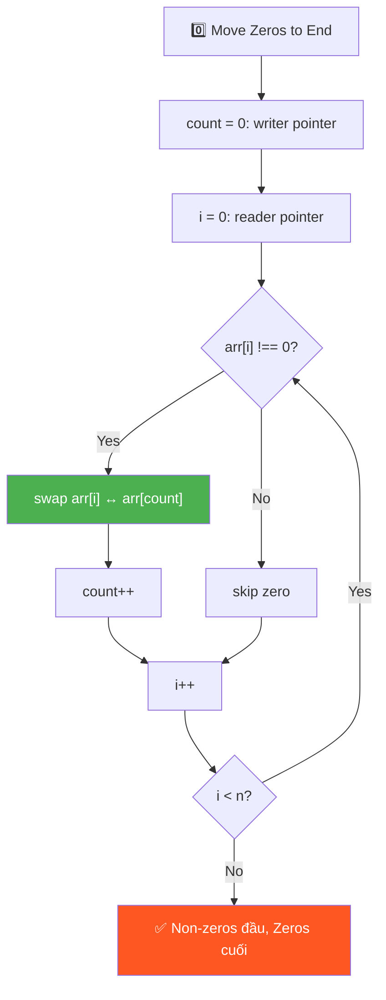
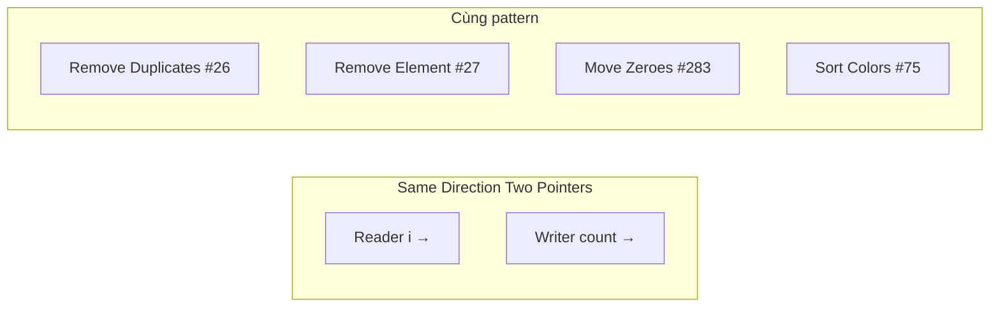

# 0️⃣ Move all Zeros to End of Array — GfG (Easy)

> 📖 Code: [Move Zeros to End.js](./Move%20Zeros%20to%20End.js)





---

## R — Repeat & Clarify

🧠 *"Two Pointers same direction: `count` chỉ vị trí non-zero tiếp theo. Gặp non-zero → SWAP với count. O(n), O(1)!"*

> 🎙️ *"Move all zeros to the end while maintaining relative order of non-zero elements. Must be in-place."*

### Clarification Questions

```
Q: Giữ thứ tự non-zero elements?
A: PHẢI giữ thứ tự! → KHÔNG THỂ sort!

Q: In-place?
A: Có! O(1) space

Q: Tất cả zeros hoặc không có zeros?
A: Trả về nguyên mảng
```

---

## E — Examples

```
VÍ DỤ 1:
  Input:  [1, 2, 0, 4, 3, 0, 5, 0]
  Output: [1, 2, 4, 3, 5, 0, 0, 0]

  Non-zero GIỮ THỨ TỰ: 1, 2, 4, 3, 5 ✅
  Zeros DỒN CUỐI: 0, 0, 0 ✅

VÍ DỤ 2: Không có zeros
  Input:  [10, 20, 30]
  Output: [10, 20, 30]    ← không thay đổi

VÍ DỤ 3: Toàn zeros
  Input:  [0, 0]
  Output: [0, 0]          ← không thay đổi
```

---

## A — Approach

### Approach 1: Temp Array — O(n) space

```
Copy non-zero → temp, fill 0 cuối, copy lại
→ O(n) space → không tối ưu!
```

### Approach 2: Two Traversals — O(1) space

```
Traversal 1: dồn non-zero lên đầu (ghi đè)
Traversal 2: fill 0 từ count → cuối

  ⚠️ GHI ĐÈ, không swap! Cần 2 pass
```

### Approach 3: One Traversal — SWAP ✅

```
💡 KEY INSIGHT: Same Direction Two Pointers!

  count = vị trí "slot trống" tiếp theo cho non-zero
  i = con trỏ duyệt

  Gặp non-zero? → SWAP arr[i] ↔ arr[count], count++!
  Gặp zero?     → skip! (i tiếp tục, count đứng yên)

  → Non-zero dồn lên đầu, zeros tự động DỒN CUỐI!
  → 1 pass, O(n), O(1) ✅
```

---

## C — Code

### Solution 1: Temp Array — O(n) space

```javascript
function moveZerosTemp(arr) {
  const n = arr.length;
  const temp = new Array(n).fill(0);

  let j = 0;
  for (let i = 0; i < n; i++) {
    if (arr[i] !== 0) temp[j++] = arr[i];
  }

  for (let i = 0; i < n; i++) arr[i] = temp[i];
}
```

### Solution 2: Two Traversals — O(1) space

```javascript
function moveZerosTwoPass(arr) {
  let count = 0;

  // Pass 1: dồn non-zero lên đầu
  for (let i = 0; i < arr.length; i++) {
    if (arr[i] !== 0) {
      arr[count++] = arr[i];
    }
  }

  // Pass 2: fill 0 phần còn lại
  while (count < arr.length) {
    arr[count++] = 0;
  }
}
```

### Solution 3: One Traversal — SWAP ✅

```javascript
function moveZeros(arr) {
  let count = 0; // vị trí non-zero tiếp theo

  for (let i = 0; i < arr.length; i++) {
    if (arr[i] !== 0) {
      // Swap non-zero element với vị trí count
      [arr[i], arr[count]] = [arr[count], arr[i]];
      count++;
    }
  }
}
```

### Trace: [1, 2, 0, 4, 3, 0, 5, 0]

```
  count=0

  i=0 (1): 1≠0 → swap(arr[0], arr[0]) → count=1
    [1, 2, 0, 4, 3, 0, 5, 0]  (no change, i=count)

  i=1 (2): 2≠0 → swap(arr[1], arr[1]) → count=2
    [1, 2, 0, 4, 3, 0, 5, 0]  (no change)

  i=2 (0): skip!  count stays 2

  i=3 (4): 4≠0 → swap(arr[3], arr[2]) → count=3
    [1, 2, 4, 0, 3, 0, 5, 0]
            ↑swap↑

  i=4 (3): 3≠0 → swap(arr[4], arr[3]) → count=4
    [1, 2, 4, 3, 0, 0, 5, 0]
               ↑swap↑

  i=5 (0): skip!  count stays 4

  i=6 (5): 5≠0 → swap(arr[6], arr[4]) → count=5
    [1, 2, 4, 3, 5, 0, 0, 0]
                  ↑─swap─↑

  i=7 (0): skip!

  Result: [1, 2, 4, 3, 5, 0, 0, 0] ✅
```

> 🎙️ *"I use a write pointer 'count' to track the next position for non-zero elements. When I encounter a non-zero, I swap it with arr[count]. This pushes zeros toward the end naturally, maintaining order of non-zero elements. One pass, O(n) time, O(1) space."*

---

## O — Optimize

```
                     Time    Space    Passes
  ──────────────────────────────────────────
  Temp Array         O(n)    O(n)     2
  Two Traversals     O(n)    O(1)     2        Ghi đè, không swap
  One Traversal ✅   O(n)    O(1)     1        Swap!

  Tại sao SWAP tốt hơn ghi đè?
    → Ghi đè: mất giá trị gốc → cần pass 2 fill zeros
    → Swap: zeros tự "đẩy" về cuối → chỉ cần 1 pass!
```

---

## T — Test

```
Test Cases:
  [1, 2, 0, 4, 3, 0, 5, 0]  → [1, 2, 4, 3, 5, 0, 0, 0]     ✅
  [10, 20, 30]               → [10, 20, 30]                   ✅ No zeros
  [0, 0]                     → [0, 0]                          ✅ All zeros
  [0, 1, 0, 3, 12]           → [1, 3, 12, 0, 0]               ✅ LeetCode #283
  [0]                        → [0]                              ✅ Single zero
  [1]                        → [1]                              ✅ Single non-zero
```

---

## 🗣️ Interview Script

> 🎙️ *"This is a classic two-pointer same-direction pattern. The 'count' pointer marks where the next non-zero should go. By swapping instead of overwriting, zeros naturally migrate to the end in a single pass. This is LeetCode #283 Move Zeroes."*

### Pattern & Liên kết

```
  TWO POINTERS — SAME DIRECTION (Reader-Writer) pattern!

  count = "writer" (vị trí ghi tiếp theo)
  i     = "reader" (duyệt toàn bộ mảng)

  Bài tương tự dùng CÙNG pattern:
    Remove Duplicates (#26)  → count chỉ vị trí unique tiếp
    Remove Element (#27)     → count chỉ vị trí valid tiếp
    Move Zeroes (#283)       → count chỉ vị trí non-zero tiếp
    Sort Colors (#75)        → 3 pointers (Dutch National Flag)

  → TẤT CẢ dùng "reader" duyệt + "writer" ghi = IN-PLACE partitioning!
```
