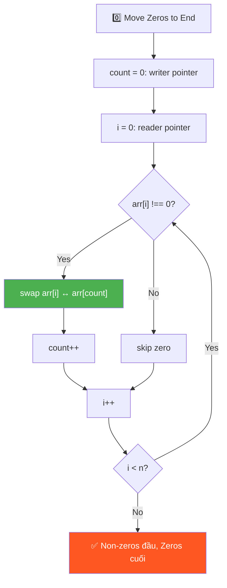
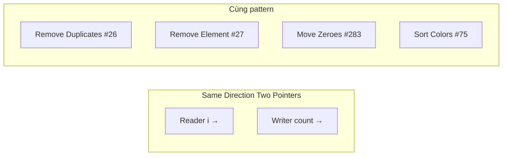
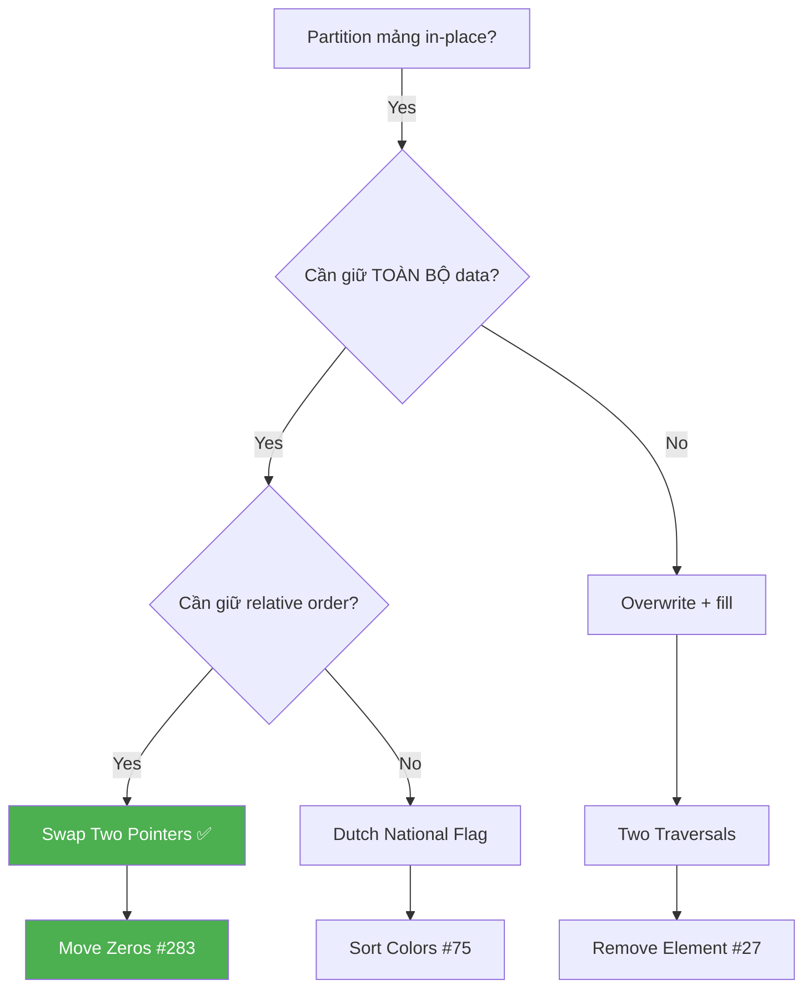
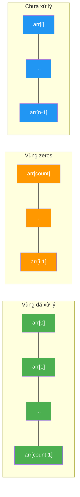

# 0️⃣ Move all Zeros to End of Array — GfG (Easy)

> 📖 Code: [Move Zeros to End.js](./Move%20Zeros%20to%20End.js)





---

## R — Repeat & Clarify

🧠 *"Two Pointers same direction: `count` chỉ vị trí non-zero tiếp theo. Gặp non-zero → SWAP với count. O(n), O(1)!"*

> 🎙️ *"Move all zeros to the end while maintaining relative order of non-zero elements. Must be in-place."*

### Clarification Questions

```
Q: Giữ thứ tự non-zero elements?
A: PHẢI giữ thứ tự! → KHÔNG THỂ sort!

Q: In-place?
A: Có! O(1) space

Q: Tất cả zeros hoặc không có zeros?
A: Trả về nguyên mảng

Q: Có phân biệt +0 và -0 không?
A: Không, coi như giống nhau

Q: Mảng rỗng hoặc 1 phần tử?
A: Trả về nguyên mảng (edge case)
```

### Tại sao bài này quan trọng?

```
  Bài này là BÀI NỀN TẢNG cho pattern "Two Pointers Same Direction"!

  BẠN PHẢI hiểu:
  1. Swap vs Overwrite: 2 chiến lược khác nhau, khi nào dùng cái nào
  2. Reader-Writer pointer: 1 con trỏ ĐỌC (duyệt), 1 con trỏ GHI (đặt)
  3. Invariant (bất biến): arr[0..count-1] luôn chứa non-zero đúng thứ tự

  Phân biệt rõ 3 biến thể của pattern này:
  ┌───────────────────────────────────────────────────────────────────┐
  │  Move Zeros #283:     writer = vị trí non-zero tiếp theo         │
  │  Remove Element #27:  writer = vị trí valid tiếp theo            │
  │  Remove Dups #26:     writer = vị trí unique tiếp theo           │
  │                                                                   │
  │  → TẤT CẢ dùng CÙNG 1 skeleton code!                           │
  │  → Chỉ KHÁC nhau ở ĐIỀU KIỆN if!                                │
  └───────────────────────────────────────────────────────────────────┘
```

---

## 🧠 Bản chất bài toán — Hiểu để NHỚ, không chỉ để GIẢI

### Partitioning: Chia mảng thành 2 VÙNG

```
  Tưởng tượng mảng như 1 CÁI HỘP có 2 NGĂN:

  ┌────────────────────┬────────────────────┐
  │   NON-ZERO ZONE    │    ZERO ZONE       │
  │   (giữ thứ tự!)    │   (tất cả zeros)   │
  └────────────────────┴────────────────────┘
         ↑ count chia ranh giới 2 vùng

  Ban đầu:  [1, 2, 0, 4, 3, 0, 5, 0]  ← lẫn lộn!
  Sau:      [1, 2, 4, 3, 5, | 0, 0, 0]  ← phân vùng xong!
                             ↑
                         count = 5

  💡 KEY INSIGHT: Bài toán = PARTITIONING!
     → Chia mảng thành 2 phần: non-zero (trước) và zero (sau)
     → Giống "Dutch National Flag" nhưng chỉ có 2 màu!
```

### Tại sao cần 2 con trỏ?

```
  ❌ Tại sao KHÔNG THỂ dùng 1 con trỏ?

  Nếu chỉ dùng 1 con trỏ i duyệt:
    Gặp 0 → muốn đẩy về cuối → phải SHIFT tất cả phần tử sau → O(n)!
    → Mỗi lần shift = O(n), có tối đa n zeros → O(n²)!

    Ví dụ: [0, 1, 2, 3]
      Gặp arr[0]=0:
        Shift [1,2,3] sang trái → [1, 2, 3, 0]  ← O(n) cho 1 lần!

  ✅ Dùng 2 con trỏ → O(n)!

  ┌─────────────────────────────────────────────────────────┐
  │  i (reader):  duyệt TOÀN BỘ mảng, từ 0 → n-1         │
  │  count (writer): đánh dấu vị trí ĐẶT non-zero tiếp    │
  │                                                         │
  │  i LUÔN chạy trước hoặc bằng count                     │
  │  → count ≤ i LUÔN ĐÚNG!                                │
  │                                                         │
  │  Khi gặp non-zero:                                      │
  │    → "Ném" nó về vị trí count (qua swap)                │
  │    → count tiến lên 1 (slot tiếp theo)                  │
  │                                                         │
  │  Khi gặp zero:                                          │
  │    → Skip! count ĐỨNG YÊN                               │
  │    → Khoảng cách i - count TĂNG (= số zeros đã gặp!)   │
  └─────────────────────────────────────────────────────────┘
```

### Invariant — Bất biến qua mỗi bước

```
  📌 INVARIANT (luôn đúng tại MỌI thời điểm):

  ┌──────────────────────────────────────────────────────────┐
  │  arr[0 .. count-1]  = tất cả non-zero ĐÃ GẶP,          │
  │                       ĐÚNG THỨ TỰ ban đầu               │
  │                                                          │
  │  arr[count .. i-1]  = tất cả ZEROS (vùng "rác")         │
  │                                                          │
  │  arr[i .. n-1]      = chưa xử lý                        │
  └──────────────────────────────────────────────────────────┘

  Ví dụ: arr = [1, 2, 0, 4, 3, 0, 5, 0], sau i=4:

    [1, 2, 4, 3, | 0, 0, | 5, 0]
     ↑──────────↑  ↑────↑  ↑───↑
     non-zero OK   zeros   chưa xử lý
     (count=4)     (i=5)

  🧠 Tại sao invariant QUAN TRỌNG?
  → Nó CHỨNG MINH thuật toán đúng!
  → Khi i = n (duyệt xong): arr[count..n-1] = toàn zeros ✅
  → arr[0..count-1] = non-zero đúng thứ tự ✅
```

### Swap vs Overwrite — 2 chiến lược, khi nào dùng cái nào?

```
  ┌─────────────────────────────────────────────────────────────┐
  │                    OVERWRITE (ghi đè)                       │
  │  ─────────────────────────────────────────                  │
  │  arr[count] = arr[i]    ← GHI ĐÈ giá trị cũ!             │
  │                                                             │
  │  Ưu:  Đơn giản, 1 phép gán                                 │
  │  Nhược: MẤT giá trị cũ tại arr[count]!                     │
  │        → Cần pass 2 để fill zeros                           │
  │        → 2 passes thay vì 1                                 │
  │                                                             │
  │  Khi nào dùng:                                              │
  │    → Remove Element #27 (không cần giữ phần cuối)          │
  │    → Remove Duplicates #26 (chỉ cần trả count)            │
  ├─────────────────────────────────────────────────────────────┤
  │                    SWAP (hoán đổi)                          │
  │  ─────────────────────────────────────────                  │
  │  [arr[i], arr[count]] = [arr[count], arr[i]]               │
  │                                                             │
  │  Ưu:  KHÔNG MẤT giá trị! Zeros tự "đẩy" về cuối          │
  │        → Chỉ cần 1 pass!                                   │
  │  Nhược: Phức tạp hơn 1 chút (3 phép gán)                   │
  │                                                             │
  │  Khi nào dùng:                                              │
  │    → Move Zeros #283 (cần giữ zeros ở cuối)               │
  │    → Bất kỳ bài nào cần PARTITION mà không mất data        │
  └─────────────────────────────────────────────────────────────┘

  💡 QUY TẮC: Cần giữ TOÀN BỘ dữ liệu → SWAP
              Chỉ cần phần "tốt" → OVERWRITE (nhanh hơn)
```

---

## 🧭 Luồng Suy Nghĩ — Từ đọc đề đến solution

> 💡 Phần này dạy bạn **CÁCH TƯ DUY** để tự giải bài, không chỉ biết đáp án.
> Mỗi bước đều có **lý do tại sao**, để bạn áp dụng cho bài khó hơn.

### Bước 1: Đọc đề → Gạch chân KEYWORDS

```
  Đề bài: "Move all zeros to the end of array while maintaining
           relative order of non-zero elements. In-place."

  Gạch chân:
    "all zeros"        → TẤT CẢ zeros, không phải 1 cái
    "to the end"       → Partitioning: non-zero trước, zero sau
    "relative order"   → PHẢI GIỮ THỨ TỰ! → KHÔNG sort!
    "in-place"         → O(1) space, modify mảng gốc

  🧠 Tự hỏi: "Relative order nghĩa là gì?"
    Input:  [1, 0, 4, 0, 3]
    Output: [1, 4, 3, 0, 0]   ← 1, 4, 3 giữ nguyên thứ tự ban đầu
            [4, 1, 3, 0, 0]   ← ❌ SAI! 4 xuất hiện trước 1 rồi!

  📌 Kỹ năng chuyển giao:
    Bất cứ khi nào đề nói "maintain order" hoặc "relative order"
    → KHÔNG ĐƯỢC sort! → Phải dùng sequential processing
    → Nghĩ ngay: Two Pointers, Stable Partition
```

### Bước 2: Vẽ ví dụ NHỎ bằng tay → Tìm PATTERN

```
  Lấy ví dụ NHỎ: arr = [0, 1, 0, 3]

  Thử bằng tay — cách "tự nhiên" nhất:
    Nhìn arr → tách ra 2 nhóm:
      Non-zero: 1, 3    (giữ thứ tự!)
      Zero:     0, 0

    Ghép lại: [1, 3, 0, 0] ✅

  🧠 Quan sát PATTERN:
    1. Non-zero elements giữ nguyên THỨ TỰ TƯƠNG ĐỐI
    2. Zeros dồn CUỐI, KHÔNG cần giữ thứ tự (vì tất cả đều = 0)
    3. Giống như "lọc" non-zero ra trước, fill 0 phía sau

  📌 Kỹ năng chuyển giao:
    LUÔN vẽ ví dụ trước khi code!
    Ví dụ nhỏ (n=4) giúp thấy pattern mà đọc đề không thấy.
    → Pattern ở đây: "non-zero đi trước, giữ thứ tự" = STABLE PARTITION
```

### Bước 3: Nghĩ ra Brute Force (Solution đầu tiên)

```
  Từ quan sát: "tách non-zero, ghép lại"
  → Ý tưởng đầu tiên: DÙNG MẢNG PHỤ!

  Bước 1: Tạo temp[] = mảng mới full zeros
  Bước 2: Duyệt arr, gặp non-zero → copy vào temp
  Bước 3: Copy temp ngược lại arr

  💡 Đây là Solution 1: Temp Array — O(n) space

  📌 Kỹ năng chuyển giao:
    Brute force = CÁCH TỰ NHIÊN NHẤT bạn nghĩ ra
    → Đừng cố optimize ngay! Viết brute force trước!
    → Rồi hỏi: "Có bỏ được mảng phụ không?"
```

### Bước 4: Tự hỏi "Bỏ mảng phụ được không?"

```
  🧠 Nhìn lại brute force:
    temp[] chỉ dùng để "giữ chỗ" cho non-zero elements
    → Nếu ta GHI ĐÈ trực tiếp lên arr thì sao?

    arr = [0, 1, 0, 3]
    count = 0 (vị trí ghi tiếp theo)

    i=0 (0): skip!
    i=1 (1): arr[0] = 1, count=1     → arr = [1, 1, 0, 3]
    i=2 (0): skip!
    i=3 (3): arr[1] = 3, count=2     → arr = [1, 3, 0, 3]

    Bây giờ: arr[0..1] = [1, 3] ✅ non-zero đúng thứ tự
    Nhưng arr[2..3] = [0, 3] ← CHƯA ĐÚNG! (3 thừa!)
    → Cần pass 2: fill 0 từ count → end
    → arr = [1, 3, 0, 0] ✅

  💡 Đây là Solution 2: Two Traversals — O(1) space, 2 passes

  📌 Kỹ năng chuyển giao:
    Khi có brute force O(n) space, tự hỏi:
    "Có thể ghi đè trực tiếp lên input không?"
    → Nếu ĐƯỢC → bỏ mảng phụ → O(1) space!
    → Nhưng có thể cần thêm pass để "dọn dẹp"
```

### Bước 5: "Có thể làm 1 pass thay vì 2?"

```
  🧠 Vấn đề của Solution 2:
    Overwrite MẤT giá trị cũ → cần pass 2 fill zeros

  💡 Insight: Nếu SWAP thay vì overwrite?
    → Giá trị cũ KHÔNG MẤT! Nó "nhảy" sang vị trí i
    → Zeros tự động "đẩy" về cuối!

    arr = [0, 1, 0, 3], count=0

    i=0 (0): skip!
    i=1 (1): swap(arr[1], arr[0]) → [1, 0, 0, 3], count=1
    i=2 (0): skip!
    i=3 (3): swap(arr[3], arr[2]) → [1, 0, 3, 3]??? ← SAI!

  ⚠️ Khoan! Sai ở đâu?
    i=3: swap arr[3] với arr[count] = arr[1]! (count=1, KHÔNG PHẢI 2!)
    → swap(arr[3], arr[1]) → [1, 3, 0, 0] ✅

    Lỗi thường gặp: QUÊN rằng count KHÁC i!
    count CHỈ TĂNG khi gặp non-zero!

  💡 Đây là Solution 3: One Traversal SWAP — O(1) space, 1 pass ✅

  📌 Kỹ năng chuyển giao:
    Khi "overwrite + fill" cần 2 passes:
    → Tự hỏi: "SWAP thay vì overwrite được không?"
    → Swap = BẢO TOÀN dữ liệu = thường bỏ được 1 pass!
```

### Bước 6: Tổng kết — Cây quyết định



```
  📌 QUY TRÌNH TƯ DUY TỔNG QUÁT:

  ┌──────────────────────────────────────────────────────────────┐
  │  1. ĐỌC ĐỀ → gạch chân keywords                            │
  │     → "in-place", "relative order", "all zeros"              │
  │                                                              │
  │  2. VẼ VÍ DỤ NHỎ → tìm pattern                             │
  │     → Thấy: "tách non-zero ra trước, giữ thứ tự"           │
  │                                                              │
  │  3. BRUTE FORCE → temp array                                 │
  │     → O(n) space — chưa tốt                                 │
  │                                                              │
  │  4. OPTIMIZE: bỏ mảng phụ                                   │
  │     → Overwrite trực tiếp → 2 passes                        │
  │     → Swap thay overwrite → 1 pass! ✅                      │
  │                                                              │
  │  5. VERIFY → chạy lại ví dụ bằng tay                        │
  │     → Kiểm tra invariant: arr[0..count-1] đúng thứ tự       │
  └──────────────────────────────────────────────────────────────┘
```

---

## E — Examples

```
VÍ DỤ 1:
  Input:  [1, 2, 0, 4, 3, 0, 5, 0]
  Output: [1, 2, 4, 3, 5, 0, 0, 0]

  Non-zero GIỮ THỨ TỰ: 1, 2, 4, 3, 5 ✅
  Zeros DỒN CUỐI: 0, 0, 0 ✅

VÍ DỤ 2: Không có zeros
  Input:  [10, 20, 30]
  Output: [10, 20, 30]    ← không thay đổi

VÍ DỤ 3: Toàn zeros
  Input:  [0, 0]
  Output: [0, 0]          ← không thay đổi

VÍ DỤ 4: Zeros ở đầu (worst case cho naive approach)
  Input:  [0, 0, 0, 1, 2]
  Output: [1, 2, 0, 0, 0]
```

### Minh họa trực quan — Quá trình SWAP

```
  arr = [1, 2, 0, 4, 3, 0, 5, 0]
         0  1  2  3  4  5  6  7    ← index

  Trạng thái ban đầu:
  ┌───┬───┬───┬───┬───┬───┬───┬───┐
  │ 1 │ 2 │ 0 │ 4 │ 3 │ 0 │ 5 │ 0 │   count=0, i=0
  └───┴───┴───┴───┴───┴───┴───┴───┘
    ↑
  count=i (cùng vị trí)

  Sau i=3 (swap đầu tiên thực sự thay đổi mảng):
  ┌───┬───┬───┬───┬───┬───┬───┬───┐
  │ 1 │ 2 │ 4 │ 0 │ 3 │ 0 │ 5 │ 0 │   count=3
  └───┴───┴───┴───┴───┴───┴───┴───┘
    ✅  ✅  ✅  ↑           ↑
              count         i=4

  Kết quả cuối:
  ┌───┬───┬───┬───┬───┬───┬───┬───┐
  │ 1 │ 2 │ 4 │ 3 │ 5 │ 0 │ 0 │ 0 │   count=5
  └───┴───┴───┴───┴───┴───┴───┴───┘
    ✅  ✅  ✅  ✅  ✅  ─────────────
    NON-ZERO ZONE      ZERO ZONE
```

---

## A — Approach

### Approach 1: Temp Array — O(n) space

```
  Ý tưởng: Tạo mảng phụ full zeros → copy non-zero vào → copy lại

  ┌─────────────────────────────────────────────────────────────┐
  │  Bước 1: temp = [0, 0, 0, 0, 0, 0, 0, 0]  (n zeros)      │
  │                                                             │
  │  Bước 2: Duyệt arr, copy non-zero vào temp:               │
  │    arr = [1, 2, 0, 4, 3, 0, 5, 0]                         │
  │    j=0: temp[0] = 1                                         │
  │    j=1: temp[1] = 2                                         │
  │    skip 0!                                                  │
  │    j=2: temp[2] = 4                                         │
  │    j=3: temp[3] = 3                                         │
  │    skip 0!                                                  │
  │    j=4: temp[4] = 5                                         │
  │    skip 0!                                                  │
  │    → temp = [1, 2, 4, 3, 5, 0, 0, 0] ✅                   │
  │                                                             │
  │  Bước 3: Copy temp → arr                                   │
  │                                                             │
  │  Time: O(n)    Space: O(n)    Passes: 2                    │
  │  → Đơn giản nhất, nhưng tốn space!                         │
  └─────────────────────────────────────────────────────────────┘
```

### Approach 2: Two Traversals — O(1) space

```
  💡 Bỏ mảng phụ! Ghi đè trực tiếp lên arr!

  Pass 1: Dồn non-zero lên đầu (GHI ĐÈ!)
  Pass 2: Fill 0 từ count → cuối

  ⚠️ GHI ĐÈ, không swap! Cần 2 pass vì mất giá trị gốc

  Trace: arr = [0, 1, 0, 3, 12]  (LeetCode #283)

  Pass 1 — copy non-zero lên đầu:
    count = 0
    i=0 (0): skip!                                    count=0
    i=1 (1): arr[0] = 1, count++                      count=1
      arr = [1, 1, 0, 3, 12]
             ↑ ghi đè!
    i=2 (0): skip!                                    count=1
    i=3 (3): arr[1] = 3, count++                      count=2
      arr = [1, 3, 0, 3, 12]
                ↑ ghi đè!
    i=4 (12): arr[2] = 12, count++                    count=3
      arr = [1, 3, 12, 3, 12]
                   ↑ ghi đè!

    ⚠️ arr = [1, 3, 12, 3, 12] ← arr[3..4] CHƯA ĐÚNG!

  Pass 2 — fill zeros:
    arr[3] = 0, arr[4] = 0
    → arr = [1, 3, 12, 0, 0] ✅

  Time: O(n)    Space: O(1)    Passes: 2
```

### Approach 3: One Traversal — SWAP ✅

```
  💡 KEY INSIGHT: SWAP thay vì overwrite → không mất data → 1 pass!

  count = vị trí "slot trống" tiếp theo cho non-zero
  i = con trỏ duyệt

  Gặp non-zero? → SWAP arr[i] ↔ arr[count], count++!
  Gặp zero?     → skip! (i tiếp tục, count đứng yên)

  → Non-zero dồn lên đầu, zeros tự động DỒN CUỐI!
  → 1 pass, O(n), O(1) ✅

  🧠 Tại sao swap ĐÚNG?
    Khi count < i:   arr[count] CHẮC CHẮN = 0 (vì đã bị skip!)
                     → swap non-zero với 0 = đúng!
    Khi count == i:  swap với chính nó = no-op (vô hại!)
    count > i:       KHÔNG BAO GIỜ xảy ra! (count chỉ tăng khi i tăng)
```



```
  🟩 Xanh lá  = Non-zero ĐÃ đặt đúng vị trí (arr[0..count-1])
  🟧 Cam      = ZEROS đang chờ (arr[count..i-1])
  🟦 Xanh dương = Chưa xử lý (arr[i..n-1])
```

---

## C — Code

### Solution 1: Temp Array — O(n) space

```javascript
function moveZerosTemp(arr) {
  const n = arr.length;
  const temp = new Array(n).fill(0);  // ← fill 0 sẵn!

  let j = 0;
  for (let i = 0; i < n; i++) {
    if (arr[i] !== 0) temp[j++] = arr[i];  // copy non-zero
  }

  for (let i = 0; i < n; i++) arr[i] = temp[i];  // copy lại
}
```

```
  📝 Line-by-line:

  Line 3: new Array(n).fill(0)
    → Tạo mảng n phần tử, FILL SẴN 0
    → Nên chỉ cần copy non-zero, phần còn lại tự = 0!

  Line 6: if (arr[i] !== 0) temp[j++] = arr[i]
    → j++ là POST-increment: gán trước, tăng sau
    → temp[0] = arr[i], rồi j lên 1
    → j cuối cùng = số lượng non-zero elements

  Line 9: arr[i] = temp[i]
    → Copy ngược lại mảng gốc (vì yêu cầu in-place modify)

  ⚠️ Nếu bài cho phép return mảng MỚI → bỏ dòng này!
```

### Solution 2: Two Traversals — O(1) space

```javascript
function moveZerosTwoPass(arr) {
  let count = 0;

  // Pass 1: dồn non-zero lên đầu
  for (let i = 0; i < arr.length; i++) {
    if (arr[i] !== 0) {
      arr[count++] = arr[i];  // ← GHI ĐÈ! Mất giá trị cũ
    }
  }

  // Pass 2: fill 0 phần còn lại
  while (count < arr.length) {
    arr[count++] = 0;
  }
}
```

```
  📝 Line-by-line:

  Line 6: arr[count++] = arr[i]
    → GHI ĐÈ arr[count] bằng arr[i]
    → Giá trị cũ tại arr[count] BỊ MẤT!

    ⚠️ TRAP: Khi count == i → arr[i] = arr[i] → vô hại ✅
             Khi count < i  → arr[count] = arr[i]
               → arr[count] cũ (đã xử lý hoặc = 0) → mất OK!

    🧠 Tại sao KHÔNG mất non-zero?
       count ≤ i LUÔN ĐÚNG!
       → arr[count] hoặc = 0 (đã skip) hoặc = giá trị ĐÃ copy lên trước
       → KHÔNG BAO GIỜ ghi đè non-zero chưa xử lý!

  Line 12: while (count < arr.length) arr[count++] = 0
    → Fill zeros từ vị trí count → cuối mảng
    → Dùng while thay for vì không biết trước cần fill bao nhiêu
```

### Solution 3: One Traversal — SWAP ✅

```javascript
function moveZeros(arr) {
  let count = 0; // vị trí non-zero tiếp theo

  for (let i = 0; i < arr.length; i++) {
    if (arr[i] !== 0) {
      // Swap non-zero element với vị trí count
      [arr[i], arr[count]] = [arr[count], arr[i]];
      count++;
    }
  }
}
```

```
  📝 Line-by-line:

  Line 2: let count = 0
    → "Writer pointer" — vị trí SLOT TRỐNG tiếp theo
    → Ý nghĩa: "arr[0..count-1] đã chứa non-zero đúng thứ tự"

  Line 4: for (let i = 0; i < arr.length; i++)
    → "Reader pointer" — duyệt TOÀN BỘ mảng, không skip
    → i LUÔN tăng 1, BẤT KỂ gặp zero hay non-zero

  Line 5: if (arr[i] !== 0)
    → Chỉ XỬ LÝ non-zero! Zeros bị BỎQUA
    → Khi bỏ qua: count ĐỨNG YÊN → tạo khoảng cách i - count

  Line 7: [arr[i], arr[count]] = [arr[count], arr[i]]
    → Destructuring swap (ES6)
    → Tương đương:
        let temp = arr[i];
        arr[i] = arr[count];
        arr[count] = temp;

    🧠 3 trường hợp khi swap:
    ┌──────────────────────────────────────────────────────┐
    │  count == i:  swap với chính mình → NO-OP           │
    │               (xảy ra khi chưa gặp zero nào)        │
    │                                                      │
    │  count < i:   arr[count] = 0 (chắc chắn!)           │
    │               → swap non-zero với 0 → ĐÚNG!         │
    │                                                      │
    │  count > i:   KHÔNG BAO GIỜ xảy ra!                 │
    │               (count chỉ tăng đồng thời với i)      │
    └──────────────────────────────────────────────────────┘

  Line 8: count++
    → Sau swap: arr[count] = non-zero ✅
    → Tiến count lên 1 → "slot trống" tiếp theo
```

### Trace CHI TIẾT: [1, 2, 0, 4, 3, 0, 5, 0]

```
  count=0

  i=0 (1): 1≠0 → swap(arr[0], arr[0]) → count=1
    [1, 2, 0, 4, 3, 0, 5, 0]  (no change, i=count)
     ✅

  i=1 (2): 2≠0 → swap(arr[1], arr[1]) → count=2
    [1, 2, 0, 4, 3, 0, 5, 0]  (no change)
     ✅ ✅

  i=2 (0): skip!  count stays 2
    [1, 2, 0, 4, 3, 0, 5, 0]
     ✅ ✅  ← count=2 đứng yên, i=2 tiến

  i=3 (4): 4≠0 → swap(arr[3], arr[2]) → count=3
    [1, 2, 4, 0, 3, 0, 5, 0]
     ✅ ✅ ✅↑swap↑
    arr[2] = 4 (non-zero vào slot), arr[3] = 0 (zero bị đẩy ra)

  i=4 (3): 3≠0 → swap(arr[4], arr[3]) → count=4
    [1, 2, 4, 3, 0, 0, 5, 0]
     ✅ ✅ ✅ ✅↑swap↑
    arr[3] = 3, arr[4] = 0

  i=5 (0): skip!  count stays 4
    [1, 2, 4, 3, 0, 0, 5, 0]
     ✅ ✅ ✅ ✅       ← count=4 đứng yên

  i=6 (5): 5≠0 → swap(arr[6], arr[4]) → count=5
    [1, 2, 4, 3, 5, 0, 0, 0]
     ✅ ✅ ✅ ✅ ✅↑─swap─↑
    arr[4] = 5, arr[6] = 0

  i=7 (0): skip!

  Result: [1, 2, 4, 3, 5, 0, 0, 0] ✅
```

### Trace cho edge case: [0, 0, 0, 1, 2]

```
  count=0

  i=0 (0): skip!                       count=0
  i=1 (0): skip!                       count=0
  i=2 (0): skip!                       count=0
    → 3 zeros liên tiếp → count ĐỨNG YÊN!

  i=3 (1): swap(arr[3], arr[0]) → count=1
    [1, 0, 0, 0, 2]
     ↑───────swap───↑
    Khoảng cách i - count = 3 - 0 = 3 (= số zeros đã gặp!)

  i=4 (2): swap(arr[4], arr[1]) → count=2
    [1, 2, 0, 0, 0]
        ↑───────swap───↑

  Result: [1, 2, 0, 0, 0] ✅

  🧠 Nhận xét:
    → Khoảng cách (i - count) = SỐ ZEROS ĐÃ GẶP!
    → Mỗi zero gặp: count đứng yên, i tăng → gap tăng 1
    → Mỗi non-zero: swap với vị trí cách count ← "nhảy" qua gap zeros
```

> 🎙️ *"I use a write pointer 'count' to track the next position for non-zero elements. When I encounter a non-zero, I swap it with arr[count]. This pushes zeros toward the end naturally, maintaining order of non-zero elements. One pass, O(n) time, O(1) space."*

---

## ❌ Common Mistakes — Lỗi thường gặp

### Mistake 1: Dùng `=== 0` thay vì `!== 0`

```javascript
// ❌ SAI: xử lý ZERO thay vì NON-ZERO
if (arr[i] === 0) {
  [arr[i], arr[count]] = [arr[count], arr[i]];
  count++;
}

// ✅ ĐÚNG: xử lý NON-ZERO
if (arr[i] !== 0) {
  [arr[i], arr[count]] = [arr[count], arr[i]];
  count++;
}
```

```
  🧠 Tại sao sai?
    → Ta muốn COLLECT non-zero, không phải collect zero!
    → count = vị trí cho non-zero TIẾP THEO
    → Dùng === 0: đẩy zero lên đầu, non-zero ra cuối → NGƯỢC!
```

### Mistake 2: Quên swap, chỉ ghi đè

```javascript
// ❌ SAI: mất giá trị cũ tại arr[count]!
if (arr[i] !== 0) {
  arr[count] = arr[i];  // ← overwrite, KHÔNG swap!
  count++;
}
// → THIẾU pass 2 fill zeros!

// ✅ ĐÚNG cho 1-pass: dùng SWAP
if (arr[i] !== 0) {
  [arr[i], arr[count]] = [arr[count], arr[i]];
  count++;
}
```

```
  🧠 Nếu chỉ overwrite:
    arr = [0, 1, 0, 3]
    i=1: arr[0] = 1 → [1, 1, 0, 3]  ← arr[1] vẫn = 1 (không bị xóa!)
    i=3: arr[1] = 3 → [1, 3, 0, 3]  ← arr[3] vẫn = 3!
    Result: [1, 3, 0, 3] ← SAI! cần fill zeros!
```

### Mistake 3: count++ ngoài if

```javascript
// ❌ SAI: count tăng cả khi gặp zero!
for (let i = 0; i < arr.length; i++) {
  if (arr[i] !== 0) {
    [arr[i], arr[count]] = [arr[count], arr[i]];
  }
  count++; // ← NGOÀI if → count tăng luôn!
}

// ✅ ĐÚNG: count++ TRONG if
for (let i = 0; i < arr.length; i++) {
  if (arr[i] !== 0) {
    [arr[i], arr[count]] = [arr[count], arr[i]];
    count++; // ← CHỈ tăng khi gặp non-zero!
  }
}
```

```
  🧠 Nếu count++ ngoài if:
    count LUÔN = i → swap với chính mình → KHÔNG thay đổi gì!
    → Mảng giữ nguyên → hoàn toàn SAI!
```

### Mistake 4: Dùng sort — Phá vỡ thứ tự!

```javascript
// ❌ SAI: sort KHÔNG giữ relative order!
arr.sort((a, b) => {
  if (a === 0) return 1;
  if (b === 0) return -1;
  return 0;
});

// Input:  [1, 0, 4, 0, 3]
// Sort:   [1, 4, 3, 0, 0] → MAY MẮN đúng? KHÔNG!
// Sort:   [4, 1, 3, 0, 0] → SAI! (sort không stable ở mọi engine)
```

```
  🧠 Tại sao sort SAI?
  1. JavaScript sort KHÔNG đảm bảo stable trong tất cả engines
     → Thứ tự non-zero có thể bị ĐẢO!
  2. Ngay cả stable sort: O(n log n) > O(n) → chậm hơn!
  3. Interviewer sẽ hỏi: "Có cách O(n) không?" → phải biết!
```

---

## O — Optimize

```
                     Time    Space    Passes    Technique
  ──────────────────────────────────────────────────────────
  Temp Array         O(n)    O(n)     2        Copy + copy back
  Two Traversals     O(n)    O(1)     2        Overwrite + fill 0
  One Traversal ✅   O(n)    O(1)     1        Swap!

  Tại sao SWAP tốt hơn ghi đè?
    → Ghi đè: mất giá trị gốc → cần pass 2 fill zeros
    → Swap: zeros tự "đẩy" về cuối → chỉ cần 1 pass!

  Có thể optimize hơn nữa không?
    → Thời gian: KHÔNG! O(n) đã là optimal (phải đọc mọi phần tử)
    → Space: KHÔNG! O(1) đã là optimal
    → Passes: KHÔNG! 1 pass đã là optimal

  ⭐ MICRO-OPTIMIZATION: tránh swap khi count == i
    if (arr[i] !== 0) {
      if (i !== count) {  // ← chỉ swap khi thực sự cần!
        [arr[i], arr[count]] = [arr[count], arr[i]];
      }
      count++;
    }
    → Bỏ qua swap vô nghĩa khi i == count (nhiều ở đầu mảng)
    → Cải thiện constant factor, KHÔNG thay đổi Big-O
```

### So sánh chi tiết: 2 Passes vs 1 Pass

```
  arr = [0, 0, 0, 1, 2, 3, 4, 5]  (nhiều zeros ở đầu)

  ┌─── TWO PASSES ──────────────────────────────────────────┐
  │  Pass 1: 8 iterations (đọc + ghi 5 non-zero)           │
  │    → arr = [1, 2, 3, 4, 5, 3, 4, 5]  ← "rác" cuối     │
  │  Pass 2: 3 iterations (fill zeros)                       │
  │    → arr = [1, 2, 3, 4, 5, 0, 0, 0]                    │
  │  Total: 11 operations                                    │
  └─────────────────────────────────────────────────────────┘

  ┌─── ONE PASS (SWAP) ─────────────────────────────────────┐
  │  i=0,1,2: skip (3 comparisons)                          │
  │  i=3,4,5,6,7: swap (5 swaps = 15 assignments)          │
  │  Total: 8 iterations + 5 swaps                          │
  │  → arr = [1, 2, 3, 4, 5, 0, 0, 0]                     │
  └─────────────────────────────────────────────────────────┘

  📌 THỰC TẾ: 1-pass swap IRL nhanh hơn vì:
    → Cache friendly (đọc sequential, không quay lại)
    → Ít loop overhead (1 for thay vì for + while)
```

---

## T — Test

```
Test Cases:
  [1, 2, 0, 4, 3, 0, 5, 0]  → [1, 2, 4, 3, 5, 0, 0, 0]     ✅ Standard
  [10, 20, 30]               → [10, 20, 30]                   ✅ No zeros
  [0, 0]                     → [0, 0]                          ✅ All zeros
  [0, 1, 0, 3, 12]           → [1, 3, 12, 0, 0]               ✅ LeetCode #283
  [0]                        → [0]                              ✅ Single zero
  [1]                        → [1]                              ✅ Single non-zero
  []                         → []                               ✅ Empty array
  [0, 0, 0, 1, 2]            → [1, 2, 0, 0, 0]                ✅ Zeros at start
  [1, 2, 3, 0, 0, 0]         → [1, 2, 3, 0, 0, 0]            ✅ Already correct
  [5]                        → [5]                              ✅ Single element
```

### Edge Cases giải thích

```
  ┌────────────────────────────────────────────────────────────────┐
  │  No zeros:       count luôn = i → swap chính mình → no-op    │
  │                  → Mảng KHÔNG thay đổi ✅                     │
  │                                                                │
  │  All zeros:      if KHÔNG BAO GIỜ true → count = 0 mãi       │
  │                  → Mảng KHÔNG thay đổi ✅                     │
  │                                                                │
  │  Already sorted: Giống "No zeros" + zeros cuối                │
  │                  → count bám sát i đến khi gặp 0              │
  │                  → Sau đó skip → mảng không đổi ✅            │
  │                                                                │
  │  Empty:          Loop không chạy → return ngay ✅              │
  │                                                                │
  │  Single element: Loop chạy 1 lần → swap chính mình ✅         │
  └────────────────────────────────────────────────────────────────┘
```

---

## 🗣️ Interview Script

### 🎙️ Think Out Loud — Mô phỏng phỏng vấn thực

```
  👤 Interviewer: "Move all zeros to the end of array while maintaining
                   relative order of non-zero elements. In-place."

  🧑 You: "Let me clarify — I need to move ALL zeros to the end,
   and non-zero elements must keep their relative order. In-place means
   O(1) extra space. Correct?"

  👤 Interviewer: "Yes."

  🧑 You: "My first thought is using a temp array — copy non-zero
   elements to a new array pre-filled with zeros, then copy back.
   That's O(n) time but O(n) space.

   To get O(1) space, I can use TWO POINTERS same direction —
   a 'reader' pointer i that scans every element, and a 'writer'
   pointer count that marks where the next non-zero should go.

   When i finds a non-zero, I SWAP it with arr[count]. This works
   because arr[count] is guaranteed to be 0 (or count == i, which
   is a no-op swap).

   After the swap, count advances. Zeros naturally accumulate
   between count and i, and get pushed to the end.

   This gives me O(n) time, O(1) space, single pass."

  👤 Interviewer: "Why swap instead of just overwriting?"

  🧑 You: "If I overwrite arr[count] = arr[i], I lose the value
   at arr[count]. Then I'd need a second pass to fill zeros.
   Swap preserves the zero — it moves to position i, effectively
   'bubbling' toward the end. This eliminates the second pass."

  👤 Interviewer: "What if count equals i?"

  🧑 You: "Then swap(arr[i], arr[i]) is a no-op — harmless.
   This happens at the beginning before we encounter any zeros.
   I could add an if (i !== count) check to skip unnecessary
   swaps, but it doesn't change the O(n) complexity."
```

### Pattern & Liên kết

```
  TWO POINTERS — SAME DIRECTION (Reader-Writer) pattern!

  count = "writer" (vị trí ghi tiếp theo)
  i     = "reader" (duyệt toàn bộ mảng)

  Bài tương tự dùng CÙNG pattern:
    Remove Duplicates (#26)  → count chỉ vị trí unique tiếp
    Remove Element (#27)     → count chỉ vị trí valid tiếp
    Move Zeroes (#283)       → count chỉ vị trí non-zero tiếp
    Sort Colors (#75)        → 3 pointers (Dutch National Flag)

  → TẤT CẢ dùng "reader" duyệt + "writer" ghi = IN-PLACE partitioning!
```

### Skeleton code chung cho pattern này

```javascript
// TEMPLATE: Same Direction Two Pointers (Reader-Writer)
function partition(arr, condition) {
  let writer = 0;

  for (let reader = 0; reader < arr.length; reader++) {
    if (condition(arr[reader])) {
      // SWAP version (giữ toàn bộ data):
      [arr[reader], arr[writer]] = [arr[writer], arr[reader]];

      // OVERWRITE version (chỉ cần phần "tốt"):
      // arr[writer] = arr[reader];

      writer++;
    }
  }

  return writer; // = số phần tử thỏa condition
}

// Move Zeros:        condition = (x) => x !== 0
// Remove Element:    condition = (x) => x !== val
// Remove Duplicates: condition = (x) => x !== arr[writer - 1]
```

```
  🧠 HỌC 1 PATTERN → GIẢI ĐƯỢC 4+ BÀI!

  Chỉ cần thay ĐỔI ĐIỀU KIỆN trong if:
  ┌──────────────────────────────────────────────────────────┐
  │  Move Zeros:   arr[i] !== 0          → giữ non-zero     │
  │  Remove #27:   arr[i] !== val        → giữ khác val     │
  │  Dedup #26:    arr[i] !== arr[w-1]   → giữ unique       │
  │  Sort Colors:  arr[i] === target     → nhóm theo giá trị │
  └──────────────────────────────────────────────────────────┘
```
