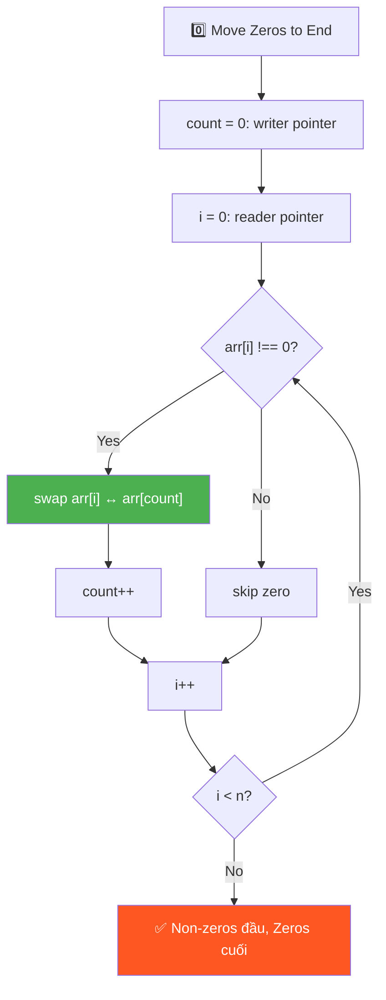
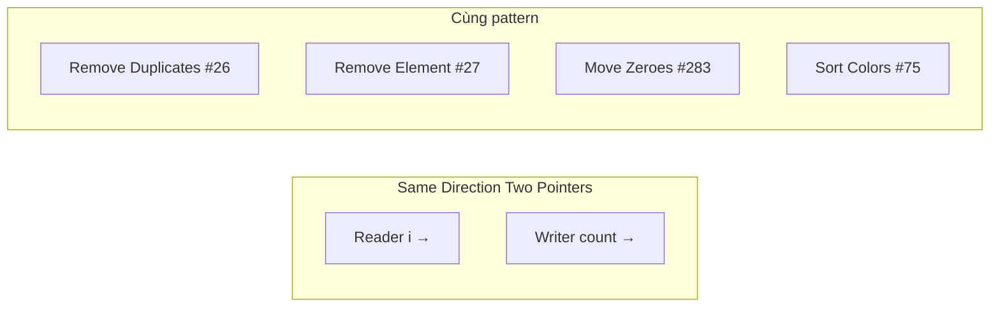
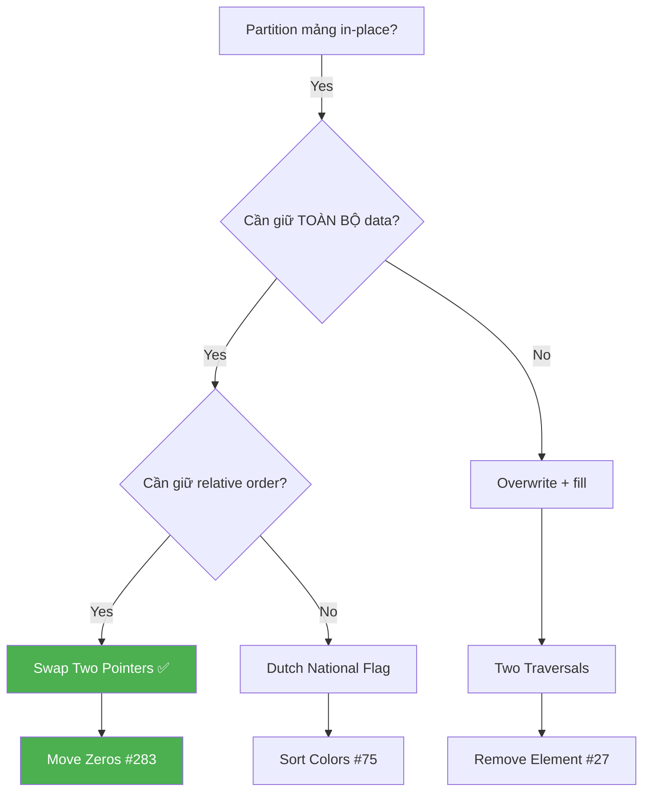
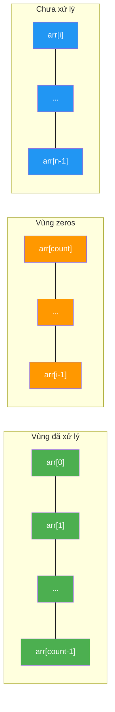

# 0️⃣ Move all Zeros to End of Array — GfG (Easy)

> 📖 Code: [Move Zeros to End.js](./Move%20Zeros%20to%20End.js)





---

## R — Repeat & Clarify

🧠 *"Two Pointers same direction: `count` chỉ vị trí non-zero tiếp theo. Gặp non-zero → SWAP với count. O(n), O(1)!"*

> 🎙️ *"Move all zeros to the end while maintaining relative order of non-zero elements. Must be in-place."*

### Clarification Questions

```
Q: Giữ thứ tự non-zero elements?
A: PHẢI giữ thứ tự! → KHÔNG THỂ sort!

Q: In-place?
A: Có! O(1) space

Q: Tất cả zeros hoặc không có zeros?
A: Trả về nguyên mảng

Q: Có phân biệt +0 và -0 không?
A: Không, coi như giống nhau

Q: Mảng rỗng hoặc 1 phần tử?
A: Trả về nguyên mảng (edge case)
```

### Tại sao bài này quan trọng?

```
  Bài này là BÀI NỀN TẢNG cho pattern "Two Pointers Same Direction"!

  BẠN PHẢI hiểu:
  1. Swap vs Overwrite: 2 chiến lược khác nhau, khi nào dùng cái nào
  2. Reader-Writer pointer: 1 con trỏ ĐỌC (duyệt), 1 con trỏ GHI (đặt)
  3. Invariant (bất biến): arr[0..count-1] luôn chứa non-zero đúng thứ tự

  Phân biệt rõ 3 biến thể của pattern này:
  ┌───────────────────────────────────────────────────────────────────┐
  │  Move Zeros #283:     writer = vị trí non-zero tiếp theo         │
  │  Remove Element #27:  writer = vị trí valid tiếp theo            │
  │  Remove Dups #26:     writer = vị trí unique tiếp theo           │
  │                                                                   │
  │  → TẤT CẢ dùng CÙNG 1 skeleton code!                           │
  │  → Chỉ KHÁC nhau ở ĐIỀU KIỆN if!                                │
  └───────────────────────────────────────────────────────────────────┘
```

---

## 🧠 Bản chất bài toán — Hiểu để NHỚ, không chỉ để GIẢI

### Partitioning: Chia mảng thành 2 VÙNG

```
  Tưởng tượng mảng như 1 CÁI HỘP có 2 NGĂN:

  ┌────────────────────┬────────────────────┐
  │   NON-ZERO ZONE    │    ZERO ZONE       │
  │   (giữ thứ tự!)    │   (tất cả zeros)   │
  └────────────────────┴────────────────────┘
         ↑ count chia ranh giới 2 vùng

  Ban đầu:  [1, 2, 0, 4, 3, 0, 5, 0]  ← lẫn lộn!
  Sau:      [1, 2, 4, 3, 5, | 0, 0, 0]  ← phân vùng xong!
                             ↑
                         count = 5

  💡 KEY INSIGHT: Bài toán = PARTITIONING!
     → Chia mảng thành 2 phần: non-zero (trước) và zero (sau)
     → Giống "Dutch National Flag" nhưng chỉ có 2 màu!
```

### Tại sao cần 2 con trỏ?

```
  ❌ Tại sao KHÔNG THỂ dùng 1 con trỏ?

  Nếu chỉ dùng 1 con trỏ i duyệt:
    Gặp 0 → muốn đẩy về cuối → phải SHIFT tất cả phần tử sau → O(n)!
    → Mỗi lần shift = O(n), có tối đa n zeros → O(n²)!

    Ví dụ: [0, 1, 2, 3]
      Gặp arr[0]=0:
        Shift [1,2,3] sang trái → [1, 2, 3, 0]  ← O(n) cho 1 lần!

  ✅ Dùng 2 con trỏ → O(n)!

  ┌─────────────────────────────────────────────────────────┐
  │  i (reader):  duyệt TOÀN BỘ mảng, từ 0 → n-1         │
  │  count (writer): đánh dấu vị trí ĐẶT non-zero tiếp    │
  │                                                         │
  │  i LUÔN chạy trước hoặc bằng count                     │
  │  → count ≤ i LUÔN ĐÚNG!                                │
  │                                                         │
  │  Khi gặp non-zero:                                      │
  │    → "Ném" nó về vị trí count (qua swap)                │
  │    → count tiến lên 1 (slot tiếp theo)                  │
  │                                                         │
  │  Khi gặp zero:                                          │
  │    → Skip! count ĐỨNG YÊN                               │
  │    → Khoảng cách i - count TĂNG (= số zeros đã gặp!)   │
  └─────────────────────────────────────────────────────────┘
```

### Invariant — Bất biến qua mỗi bước

```
  📌 INVARIANT (luôn đúng tại MỌI thời điểm):

  ┌──────────────────────────────────────────────────────────┐
  │  arr[0 .. count-1]  = tất cả non-zero ĐÃ GẶP,          │
  │                       ĐÚNG THỨ TỰ ban đầu               │
  │                                                          │
  │  arr[count .. i-1]  = tất cả ZEROS (vùng "rác")         │
  │                                                          │
  │  arr[i .. n-1]      = chưa xử lý                        │
  └──────────────────────────────────────────────────────────┘

  Ví dụ: arr = [1, 2, 0, 4, 3, 0, 5, 0], sau i=4:

    [1, 2, 4, 3, | 0, 0, | 5, 0]
     ↑──────────↑  ↑────↑  ↑───↑
     non-zero OK   zeros   chưa xử lý
     (count=4)     (i=5)

  🧠 Tại sao invariant QUAN TRỌNG?
  → Nó CHỨNG MINH thuật toán đúng!
  → Khi i = n (duyệt xong): arr[count..n-1] = toàn zeros ✅
  → arr[0..count-1] = non-zero đúng thứ tự ✅
```

### Swap vs Overwrite — 2 chiến lược, khi nào dùng cái nào?

```
  ┌─────────────────────────────────────────────────────────────┐
  │                    OVERWRITE (ghi đè)                       │
  │  ─────────────────────────────────────────                  │
  │  arr[count] = arr[i]    ← GHI ĐÈ giá trị cũ!             │
  │                                                             │
  │  Ưu:  Đơn giản, 1 phép gán                                 │
  │  Nhược: MẤT giá trị cũ tại arr[count]!                     │
  │        → Cần pass 2 để fill zeros                           │
  │        → 2 passes thay vì 1                                 │
  │                                                             │
  │  Khi nào dùng:                                              │
  │    → Remove Element #27 (không cần giữ phần cuối)          │
  │    → Remove Duplicates #26 (chỉ cần trả count)            │
  ├─────────────────────────────────────────────────────────────┤
  │                    SWAP (hoán đổi)                          │
  │  ─────────────────────────────────────────                  │
  │  [arr[i], arr[count]] = [arr[count], arr[i]]               │
  │                                                             │
  │  Ưu:  KHÔNG MẤT giá trị! Zeros tự "đẩy" về cuối          │
  │        → Chỉ cần 1 pass!                                   │
  │  Nhược: Phức tạp hơn 1 chút (3 phép gán)                   │
  │                                                             │
  │  Khi nào dùng:                                              │
  │    → Move Zeros #283 (cần giữ zeros ở cuối)               │
  │    → Bất kỳ bài nào cần PARTITION mà không mất data        │
  └─────────────────────────────────────────────────────────────┘

  💡 QUY TẮC: Cần giữ TOÀN BỘ dữ liệu → SWAP
              Chỉ cần phần "tốt" → OVERWRITE (nhanh hơn)
```

---

## 🧭 Luồng Suy Nghĩ — Từ đọc đề đến solution

> 💡 Phần này dạy bạn **CÁCH TƯ DUY** để tự giải bài, không chỉ biết đáp án.
> Mỗi bước đều có **lý do tại sao**, để bạn áp dụng cho bài khó hơn.

### Bước 1: Đọc đề → Gạch chân KEYWORDS

```
  Đề bài: "Move all zeros to the end of array while maintaining
           relative order of non-zero elements. In-place."

  Gạch chân:
    "all zeros"        → TẤT CẢ zeros, không phải 1 cái
    "to the end"       → Partitioning: non-zero trước, zero sau
    "relative order"   → PHẢI GIỮ THỨ TỰ! → KHÔNG sort!
    "in-place"         → O(1) space, modify mảng gốc

  🧠 Tự hỏi: "Relative order nghĩa là gì?"
    Input:  [1, 0, 4, 0, 3]
    Output: [1, 4, 3, 0, 0]   ← 1, 4, 3 giữ nguyên thứ tự ban đầu
            [4, 1, 3, 0, 0]   ← ❌ SAI! 4 xuất hiện trước 1 rồi!

  📌 Kỹ năng chuyển giao:
    Bất cứ khi nào đề nói "maintain order" hoặc "relative order"
    → KHÔNG ĐƯỢC sort! → Phải dùng sequential processing
    → Nghĩ ngay: Two Pointers, Stable Partition
```

### Bước 2: Vẽ ví dụ NHỎ bằng tay → Tìm PATTERN

```
  Lấy ví dụ NHỎ: arr = [0, 1, 0, 3]

  Thử bằng tay — cách "tự nhiên" nhất:
    Nhìn arr → tách ra 2 nhóm:
      Non-zero: 1, 3    (giữ thứ tự!)
      Zero:     0, 0

    Ghép lại: [1, 3, 0, 0] ✅

  🧠 Quan sát PATTERN:
    1. Non-zero elements giữ nguyên THỨ TỰ TƯƠNG ĐỐI
    2. Zeros dồn CUỐI, KHÔNG cần giữ thứ tự (vì tất cả đều = 0)
    3. Giống như "lọc" non-zero ra trước, fill 0 phía sau

  📌 Kỹ năng chuyển giao:
    LUÔN vẽ ví dụ trước khi code!
    Ví dụ nhỏ (n=4) giúp thấy pattern mà đọc đề không thấy.
    → Pattern ở đây: "non-zero đi trước, giữ thứ tự" = STABLE PARTITION
```

### Bước 3: Nghĩ ra Brute Force (Solution đầu tiên)

```
  Từ quan sát: "tách non-zero, ghép lại"
  → Ý tưởng đầu tiên: DÙNG MẢNG PHỤ!

  Bước 1: Tạo temp[] = mảng mới full zeros
  Bước 2: Duyệt arr, gặp non-zero → copy vào temp
  Bước 3: Copy temp ngược lại arr

  💡 Đây là Solution 1: Temp Array — O(n) space

  📌 Kỹ năng chuyển giao:
    Brute force = CÁCH TỰ NHIÊN NHẤT bạn nghĩ ra
    → Đừng cố optimize ngay! Viết brute force trước!
    → Rồi hỏi: "Có bỏ được mảng phụ không?"
```

### Bước 4: Tự hỏi "Bỏ mảng phụ được không?"

```
  🧠 Nhìn lại brute force:
    temp[] chỉ dùng để "giữ chỗ" cho non-zero elements
    → Nếu ta GHI ĐÈ trực tiếp lên arr thì sao?

    arr = [0, 1, 0, 3]
    count = 0 (vị trí ghi tiếp theo)

    i=0 (0): skip!
    i=1 (1): arr[0] = 1, count=1     → arr = [1, 1, 0, 3]
    i=2 (0): skip!
    i=3 (3): arr[1] = 3, count=2     → arr = [1, 3, 0, 3]

    Bây giờ: arr[0..1] = [1, 3] ✅ non-zero đúng thứ tự
    Nhưng arr[2..3] = [0, 3] ← CHƯA ĐÚNG! (3 thừa!)
    → Cần pass 2: fill 0 từ count → end
    → arr = [1, 3, 0, 0] ✅

  💡 Đây là Solution 2: Two Traversals — O(1) space, 2 passes

  📌 Kỹ năng chuyển giao:
    Khi có brute force O(n) space, tự hỏi:
    "Có thể ghi đè trực tiếp lên input không?"
    → Nếu ĐƯỢC → bỏ mảng phụ → O(1) space!
    → Nhưng có thể cần thêm pass để "dọn dẹp"
```

### Bước 5: "Có thể làm 1 pass thay vì 2?"

```
  🧠 Vấn đề của Solution 2:
    Overwrite MẤT giá trị cũ → cần pass 2 fill zeros

  💡 Insight: Nếu SWAP thay vì overwrite?
    → Giá trị cũ KHÔNG MẤT! Nó "nhảy" sang vị trí i
    → Zeros tự động "đẩy" về cuối!

    arr = [0, 1, 0, 3], count=0

    i=0 (0): skip!
    i=1 (1): swap(arr[1], arr[0]) → [1, 0, 0, 3], count=1
    i=2 (0): skip!
    i=3 (3): swap(arr[3], arr[2]) → [1, 0, 3, 3]??? ← SAI!

  ⚠️ Khoan! Sai ở đâu?
    i=3: swap arr[3] với arr[count] = arr[1]! (count=1, KHÔNG PHẢI 2!)
    → swap(arr[3], arr[1]) → [1, 3, 0, 0] ✅

    Lỗi thường gặp: QUÊN rằng count KHÁC i!
    count CHỈ TĂNG khi gặp non-zero!

  💡 Đây là Solution 3: One Traversal SWAP — O(1) space, 1 pass ✅

  📌 Kỹ năng chuyển giao:
    Khi "overwrite + fill" cần 2 passes:
    → Tự hỏi: "SWAP thay vì overwrite được không?"
    → Swap = BẢO TOÀN dữ liệu = thường bỏ được 1 pass!
```

### Bước 6: Tổng kết — Cây quyết định



```
  📌 QUY TRÌNH TƯ DUY TỔNG QUÁT:

  ┌──────────────────────────────────────────────────────────────┐
  │  1. ĐỌC ĐỀ → gạch chân keywords                            │
  │     → "in-place", "relative order", "all zeros"              │
  │                                                              │
  │  2. VẼ VÍ DỤ NHỎ → tìm pattern                             │
  │     → Thấy: "tách non-zero ra trước, giữ thứ tự"           │
  │                                                              │
  │  3. BRUTE FORCE → temp array                                 │
  │     → O(n) space — chưa tốt                                 │
  │                                                              │
  │  4. OPTIMIZE: bỏ mảng phụ                                   │
  │     → Overwrite trực tiếp → 2 passes                        │
  │     → Swap thay overwrite → 1 pass! ✅                      │
  │                                                              │
  │  5. VERIFY → chạy lại ví dụ bằng tay                        │
  │     → Kiểm tra invariant: arr[0..count-1] đúng thứ tự       │
  └──────────────────────────────────────────────────────────────┘
```

---

## E — Examples

```
VÍ DỤ 1:
  Input:  [1, 2, 0, 4, 3, 0, 5, 0]
  Output: [1, 2, 4, 3, 5, 0, 0, 0]

  Non-zero GIỮ THỨ TỰ: 1, 2, 4, 3, 5 ✅
  Zeros DỒN CUỐI: 0, 0, 0 ✅

VÍ DỤ 2: Không có zeros
  Input:  [10, 20, 30]
  Output: [10, 20, 30]    ← không thay đổi

VÍ DỤ 3: Toàn zeros
  Input:  [0, 0]
  Output: [0, 0]          ← không thay đổi

VÍ DỤ 4: Zeros ở đầu (worst case cho naive approach)
  Input:  [0, 0, 0, 1, 2]
  Output: [1, 2, 0, 0, 0]
```

### Minh họa trực quan — Quá trình SWAP

```
  arr = [1, 2, 0, 4, 3, 0, 5, 0]
         0  1  2  3  4  5  6  7    ← index

  Trạng thái ban đầu:
  ┌───┬───┬───┬───┬───┬───┬───┬───┐
  │ 1 │ 2 │ 0 │ 4 │ 3 │ 0 │ 5 │ 0 │   count=0, i=0
  └───┴───┴───┴───┴───┴───┴───┴───┘
    ↑
  count=i (cùng vị trí)

  Sau i=3 (swap đầu tiên thực sự thay đổi mảng):
  ┌───┬───┬───┬───┬───┬───┬───┬───┐
  │ 1 │ 2 │ 4 │ 0 │ 3 │ 0 │ 5 │ 0 │   count=3
  └───┴───┴───┴───┴───┴───┴───┴───┘
    ✅  ✅  ✅  ↑           ↑
              count         i=4

  Kết quả cuối:
  ┌───┬───┬───┬───┬───┬───┬───┬───┐
  │ 1 │ 2 │ 4 │ 3 │ 5 │ 0 │ 0 │ 0 │   count=5
  └───┴───┴───┴───┴───┴───┴───┴───┘
    ✅  ✅  ✅  ✅  ✅  ─────────────
    NON-ZERO ZONE      ZERO ZONE
```

---

## A — Approach

### Approach 1: Temp Array — O(n) space

```
  Ý tưởng: Tạo mảng phụ full zeros → copy non-zero vào → copy lại

  ┌─────────────────────────────────────────────────────────────┐
  │  Bước 1: temp = [0, 0, 0, 0, 0, 0, 0, 0]  (n zeros)      │
  │                                                             │
  │  Bước 2: Duyệt arr, copy non-zero vào temp:               │
  │    arr = [1, 2, 0, 4, 3, 0, 5, 0]                         │
  │    j=0: temp[0] = 1                                         │
  │    j=1: temp[1] = 2                                         │
  │    skip 0!                                                  │
  │    j=2: temp[2] = 4                                         │
  │    j=3: temp[3] = 3                                         │
  │    skip 0!                                                  │
  │    j=4: temp[4] = 5                                         │
  │    skip 0!                                                  │
  │    → temp = [1, 2, 4, 3, 5, 0, 0, 0] ✅                   │
  │                                                             │
  │  Bước 3: Copy temp → arr                                   │
  │                                                             │
  │  Time: O(n)    Space: O(n)    Passes: 2                    │
  │  → Đơn giản nhất, nhưng tốn space!                         │
  └─────────────────────────────────────────────────────────────┘
```

### Approach 2: Two Traversals — O(1) space

```
  💡 Bỏ mảng phụ! Ghi đè trực tiếp lên arr!

  Pass 1: Dồn non-zero lên đầu (GHI ĐÈ!)
  Pass 2: Fill 0 từ count → cuối

  ⚠️ GHI ĐÈ, không swap! Cần 2 pass vì mất giá trị gốc

  Trace: arr = [0, 1, 0, 3, 12]  (LeetCode #283)

  Pass 1 — copy non-zero lên đầu:
    count = 0
    i=0 (0): skip!                                    count=0
    i=1 (1): arr[0] = 1, count++                      count=1
      arr = [1, 1, 0, 3, 12]
             ↑ ghi đè!
    i=2 (0): skip!                                    count=1
    i=3 (3): arr[1] = 3, count++                      count=2
      arr = [1, 3, 0, 3, 12]
                ↑ ghi đè!
    i=4 (12): arr[2] = 12, count++                    count=3
      arr = [1, 3, 12, 3, 12]
                   ↑ ghi đè!

    ⚠️ arr = [1, 3, 12, 3, 12] ← arr[3..4] CHƯA ĐÚNG!

  Pass 2 — fill zeros:
    arr[3] = 0, arr[4] = 0
    → arr = [1, 3, 12, 0, 0] ✅

  Time: O(n)    Space: O(1)    Passes: 2
```

### Approach 3: One Traversal — SWAP ✅

```
  💡 KEY INSIGHT: SWAP thay vì overwrite → không mất data → 1 pass!

  count = vị trí "slot trống" tiếp theo cho non-zero
  i = con trỏ duyệt

  Gặp non-zero? → SWAP arr[i] ↔ arr[count], count++!
  Gặp zero?     → skip! (i tiếp tục, count đứng yên)

  → Non-zero dồn lên đầu, zeros tự động DỒN CUỐI!
  → 1 pass, O(n), O(1) ✅

  🧠 Tại sao swap ĐÚNG?
    Khi count < i:   arr[count] CHẮC CHẮN = 0 (vì đã bị skip!)
                     → swap non-zero với 0 = đúng!
    Khi count == i:  swap với chính nó = no-op (vô hại!)
    count > i:       KHÔNG BAO GIỜ xảy ra! (count chỉ tăng khi i tăng)
```



```
  🟩 Xanh lá  = Non-zero ĐÃ đặt đúng vị trí (arr[0..count-1])
  🟧 Cam      = ZEROS đang chờ (arr[count..i-1])
  🟦 Xanh dương = Chưa xử lý (arr[i..n-1])
```

---

## C — Code

### Solution 1: Temp Array — O(n) space

```javascript
function moveZerosTemp(arr) {
  const n = arr.length;
  const temp = new Array(n).fill(0);  // ← fill 0 sẵn!

  let j = 0;
  for (let i = 0; i < n; i++) {
    if (arr[i] !== 0) temp[j++] = arr[i];  // copy non-zero
  }

  for (let i = 0; i < n; i++) arr[i] = temp[i];  // copy lại
}
```

```
  📝 Line-by-line:

  Line 3: new Array(n).fill(0)
    → Tạo mảng n phần tử, FILL SẴN 0
    → Nên chỉ cần copy non-zero, phần còn lại tự = 0!

  Line 6: if (arr[i] !== 0) temp[j++] = arr[i]
    → j++ là POST-increment: gán trước, tăng sau
    → temp[0] = arr[i], rồi j lên 1
    → j cuối cùng = số lượng non-zero elements

  Line 9: arr[i] = temp[i]
    → Copy ngược lại mảng gốc (vì yêu cầu in-place modify)

  ⚠️ Nếu bài cho phép return mảng MỚI → bỏ dòng này!
```

### Solution 2: Two Traversals — O(1) space

```javascript
function moveZerosTwoPass(arr) {
  let count = 0;

  // Pass 1: dồn non-zero lên đầu
  for (let i = 0; i < arr.length; i++) {
    if (arr[i] !== 0) {
      arr[count++] = arr[i];  // ← GHI ĐÈ! Mất giá trị cũ
    }
  }

  // Pass 2: fill 0 phần còn lại
  while (count < arr.length) {
    arr[count++] = 0;
  }
}
```

```
  📝 Line-by-line:

  Line 6: arr[count++] = arr[i]
    → GHI ĐÈ arr[count] bằng arr[i]
    → Giá trị cũ tại arr[count] BỊ MẤT!

    ⚠️ TRAP: Khi count == i → arr[i] = arr[i] → vô hại ✅
             Khi count < i  → arr[count] = arr[i]
               → arr[count] cũ (đã xử lý hoặc = 0) → mất OK!

    🧠 Tại sao KHÔNG mất non-zero?
       count ≤ i LUÔN ĐÚNG!
       → arr[count] hoặc = 0 (đã skip) hoặc = giá trị ĐÃ copy lên trước
       → KHÔNG BAO GIỜ ghi đè non-zero chưa xử lý!

  Line 12: while (count < arr.length) arr[count++] = 0
    → Fill zeros từ vị trí count → cuối mảng
    → Dùng while thay for vì không biết trước cần fill bao nhiêu
```

### Solution 3: One Traversal — SWAP ✅

```javascript
function moveZeros(arr) {
  let count = 0; // vị trí non-zero tiếp theo

  for (let i = 0; i < arr.length; i++) {
    if (arr[i] !== 0) {
      // Swap non-zero element với vị trí count
      [arr[i], arr[count]] = [arr[count], arr[i]];
      count++;
    }
  }
}
```

```
  📝 Line-by-line:

  Line 2: let count = 0
    → "Writer pointer" — vị trí SLOT TRỐNG tiếp theo
    → Ý nghĩa: "arr[0..count-1] đã chứa non-zero đúng thứ tự"

  Line 4: for (let i = 0; i < arr.length; i++)
    → "Reader pointer" — duyệt TOÀN BỘ mảng, không skip
    → i LUÔN tăng 1, BẤT KỂ gặp zero hay non-zero

  Line 5: if (arr[i] !== 0)
    → Chỉ XỬ LÝ non-zero! Zeros bị BỎQUA
    → Khi bỏ qua: count ĐỨNG YÊN → tạo khoảng cách i - count

  Line 7: [arr[i], arr[count]] = [arr[count], arr[i]]
    → Destructuring swap (ES6)
    → Tương đương:
        let temp = arr[i];
        arr[i] = arr[count];
        arr[count] = temp;

    🧠 3 trường hợp khi swap:
    ┌──────────────────────────────────────────────────────┐
    │  count == i:  swap với chính mình → NO-OP           │
    │               (xảy ra khi chưa gặp zero nào)        │
    │                                                      │
    │  count < i:   arr[count] = 0 (chắc chắn!)           │
    │               → swap non-zero với 0 → ĐÚNG!         │
    │                                                      │
    │  count > i:   KHÔNG BAO GIỜ xảy ra!                 │
    │               (count chỉ tăng đồng thời với i)      │
    └──────────────────────────────────────────────────────┘

  Line 8: count++
    → Sau swap: arr[count] = non-zero ✅
    → Tiến count lên 1 → "slot trống" tiếp theo
```

### Trace CHI TIẾT: [1, 2, 0, 4, 3, 0, 5, 0]

```
  count=0

  i=0 (1): 1≠0 → swap(arr[0], arr[0]) → count=1
    [1, 2, 0, 4, 3, 0, 5, 0]  (no change, i=count)
     ✅

  i=1 (2): 2≠0 → swap(arr[1], arr[1]) → count=2
    [1, 2, 0, 4, 3, 0, 5, 0]  (no change)
     ✅ ✅

  i=2 (0): skip!  count stays 2
    [1, 2, 0, 4, 3, 0, 5, 0]
     ✅ ✅  ← count=2 đứng yên, i=2 tiến

  i=3 (4): 4≠0 → swap(arr[3], arr[2]) → count=3
    [1, 2, 4, 0, 3, 0, 5, 0]
     ✅ ✅ ✅↑swap↑
    arr[2] = 4 (non-zero vào slot), arr[3] = 0 (zero bị đẩy ra)

  i=4 (3): 3≠0 → swap(arr[4], arr[3]) → count=4
    [1, 2, 4, 3, 0, 0, 5, 0]
     ✅ ✅ ✅ ✅↑swap↑
    arr[3] = 3, arr[4] = 0

  i=5 (0): skip!  count stays 4
    [1, 2, 4, 3, 0, 0, 5, 0]
     ✅ ✅ ✅ ✅       ← count=4 đứng yên

  i=6 (5): 5≠0 → swap(arr[6], arr[4]) → count=5
    [1, 2, 4, 3, 5, 0, 0, 0]
     ✅ ✅ ✅ ✅ ✅↑─swap─↑
    arr[4] = 5, arr[6] = 0

  i=7 (0): skip!

  Result: [1, 2, 4, 3, 5, 0, 0, 0] ✅
```

### Trace cho edge case: [0, 0, 0, 1, 2]

```
  count=0

  i=0 (0): skip!                       count=0
  i=1 (0): skip!                       count=0
  i=2 (0): skip!                       count=0
    → 3 zeros liên tiếp → count ĐỨNG YÊN!

  i=3 (1): swap(arr[3], arr[0]) → count=1
    [1, 0, 0, 0, 2]
     ↑───────swap───↑
    Khoảng cách i - count = 3 - 0 = 3 (= số zeros đã gặp!)

  i=4 (2): swap(arr[4], arr[1]) → count=2
    [1, 2, 0, 0, 0]
        ↑───────swap───↑

  Result: [1, 2, 0, 0, 0] ✅

  🧠 Nhận xét:
    → Khoảng cách (i - count) = SỐ ZEROS ĐÃ GẶP!
    → Mỗi zero gặp: count đứng yên, i tăng → gap tăng 1
    → Mỗi non-zero: swap với vị trí cách count ← "nhảy" qua gap zeros
```

> 🎙️ *"I use a write pointer 'count' to track the next position for non-zero elements. When I encounter a non-zero, I swap it with arr[count]. This pushes zeros toward the end naturally, maintaining order of non-zero elements. One pass, O(n) time, O(1) space."*

---

## ❌ Common Mistakes — Lỗi thường gặp

### Mistake 1: Dùng `=== 0` thay vì `!== 0`

```javascript
// ❌ SAI: xử lý ZERO thay vì NON-ZERO
if (arr[i] === 0) {
  [arr[i], arr[count]] = [arr[count], arr[i]];
  count++;
}

// ✅ ĐÚNG: xử lý NON-ZERO
if (arr[i] !== 0) {
  [arr[i], arr[count]] = [arr[count], arr[i]];
  count++;
}
```

```
  🧠 Tại sao sai?
    → Ta muốn COLLECT non-zero, không phải collect zero!
    → count = vị trí cho non-zero TIẾP THEO
    → Dùng === 0: đẩy zero lên đầu, non-zero ra cuối → NGƯỢC!
```

### Mistake 2: Quên swap, chỉ ghi đè

```javascript
// ❌ SAI: mất giá trị cũ tại arr[count]!
if (arr[i] !== 0) {
  arr[count] = arr[i];  // ← overwrite, KHÔNG swap!
  count++;
}
// → THIẾU pass 2 fill zeros!

// ✅ ĐÚNG cho 1-pass: dùng SWAP
if (arr[i] !== 0) {
  [arr[i], arr[count]] = [arr[count], arr[i]];
  count++;
}
```

```
  🧠 Nếu chỉ overwrite:
    arr = [0, 1, 0, 3]
    i=1: arr[0] = 1 → [1, 1, 0, 3]  ← arr[1] vẫn = 1 (không bị xóa!)
    i=3: arr[1] = 3 → [1, 3, 0, 3]  ← arr[3] vẫn = 3!
    Result: [1, 3, 0, 3] ← SAI! cần fill zeros!
```

### Mistake 3: count++ ngoài if

```javascript
// ❌ SAI: count tăng cả khi gặp zero!
for (let i = 0; i < arr.length; i++) {
  if (arr[i] !== 0) {
    [arr[i], arr[count]] = [arr[count], arr[i]];
  }
  count++; // ← NGOÀI if → count tăng luôn!
}

// ✅ ĐÚNG: count++ TRONG if
for (let i = 0; i < arr.length; i++) {
  if (arr[i] !== 0) {
    [arr[i], arr[count]] = [arr[count], arr[i]];
    count++; // ← CHỈ tăng khi gặp non-zero!
  }
}
```

```
  🧠 Nếu count++ ngoài if:
    count LUÔN = i → swap với chính mình → KHÔNG thay đổi gì!
    → Mảng giữ nguyên → hoàn toàn SAI!
```

### Mistake 4: Dùng sort — Phá vỡ thứ tự!

```javascript
// ❌ SAI: sort KHÔNG giữ relative order!
arr.sort((a, b) => {
  if (a === 0) return 1;
  if (b === 0) return -1;
  return 0;
});

// Input:  [1, 0, 4, 0, 3]
// Sort:   [1, 4, 3, 0, 0] → MAY MẮN đúng? KHÔNG!
// Sort:   [4, 1, 3, 0, 0] → SAI! (sort không stable ở mọi engine)
```

```
  🧠 Tại sao sort SAI?
  1. JavaScript sort KHÔNG đảm bảo stable trong tất cả engines
     → Thứ tự non-zero có thể bị ĐẢO!
  2. Ngay cả stable sort: O(n log n) > O(n) → chậm hơn!
  3. Interviewer sẽ hỏi: "Có cách O(n) không?" → phải biết!
```

---

## O — Optimize

```
                     Time    Space    Passes    Technique
  ──────────────────────────────────────────────────────────
  Temp Array         O(n)    O(n)     2        Copy + copy back
  Two Traversals     O(n)    O(1)     2        Overwrite + fill 0
  One Traversal ✅   O(n)    O(1)     1        Swap!

  Tại sao SWAP tốt hơn ghi đè?
    → Ghi đè: mất giá trị gốc → cần pass 2 fill zeros
    → Swap: zeros tự "đẩy" về cuối → chỉ cần 1 pass!

  Có thể optimize hơn nữa không?
    → Thời gian: KHÔNG! O(n) đã là optimal (phải đọc mọi phần tử)
    → Space: KHÔNG! O(1) đã là optimal
    → Passes: KHÔNG! 1 pass đã là optimal

  ⭐ MICRO-OPTIMIZATION: tránh swap khi count == i
    if (arr[i] !== 0) {
      if (i !== count) {  // ← chỉ swap khi thực sự cần!
        [arr[i], arr[count]] = [arr[count], arr[i]];
      }
      count++;
    }
    → Bỏ qua swap vô nghĩa khi i == count (nhiều ở đầu mảng)
    → Cải thiện constant factor, KHÔNG thay đổi Big-O
```

### So sánh chi tiết: 2 Passes vs 1 Pass

```
  arr = [0, 0, 0, 1, 2, 3, 4, 5]  (nhiều zeros ở đầu)

  ┌─── TWO PASSES ──────────────────────────────────────────┐
  │  Pass 1: 8 iterations (đọc + ghi 5 non-zero)           │
  │    → arr = [1, 2, 3, 4, 5, 3, 4, 5]  ← "rác" cuối     │
  │  Pass 2: 3 iterations (fill zeros)                       │
  │    → arr = [1, 2, 3, 4, 5, 0, 0, 0]                    │
  │  Total: 11 operations                                    │
  └─────────────────────────────────────────────────────────┘

  ┌─── ONE PASS (SWAP) ─────────────────────────────────────┐
  │  i=0,1,2: skip (3 comparisons)                          │
  │  i=3,4,5,6,7: swap (5 swaps = 15 assignments)          │
  │  Total: 8 iterations + 5 swaps                          │
  │  → arr = [1, 2, 3, 4, 5, 0, 0, 0]                     │
  └─────────────────────────────────────────────────────────┘

  📌 THỰC TẾ: 1-pass swap IRL nhanh hơn vì:
    → Cache friendly (đọc sequential, không quay lại)
    → Ít loop overhead (1 for thay vì for + while)
```

---

## T — Test

```
Test Cases:
  [1, 2, 0, 4, 3, 0, 5, 0]  → [1, 2, 4, 3, 5, 0, 0, 0]     ✅ Standard
  [10, 20, 30]               → [10, 20, 30]                   ✅ No zeros
  [0, 0]                     → [0, 0]                          ✅ All zeros
  [0, 1, 0, 3, 12]           → [1, 3, 12, 0, 0]               ✅ LeetCode #283
  [0]                        → [0]                              ✅ Single zero
  [1]                        → [1]                              ✅ Single non-zero
  []                         → []                               ✅ Empty array
  [0, 0, 0, 1, 2]            → [1, 2, 0, 0, 0]                ✅ Zeros at start
  [1, 2, 3, 0, 0, 0]         → [1, 2, 3, 0, 0, 0]            ✅ Already correct
  [5]                        → [5]                              ✅ Single element
```

### Edge Cases giải thích

```
  ┌────────────────────────────────────────────────────────────────┐
  │  No zeros:       count luôn = i → swap chính mình → no-op    │
  │                  → Mảng KHÔNG thay đổi ✅                     │
  │                                                                │
  │  All zeros:      if KHÔNG BAO GIỜ true → count = 0 mãi       │
  │                  → Mảng KHÔNG thay đổi ✅                     │
  │                                                                │
  │  Already sorted: Giống "No zeros" + zeros cuối                │
  │                  → count bám sát i đến khi gặp 0              │
  │                  → Sau đó skip → mảng không đổi ✅            │
  │                                                                │
  │  Empty:          Loop không chạy → return ngay ✅              │
  │                                                                │
  │  Single element: Loop chạy 1 lần → swap chính mình ✅         │
  └────────────────────────────────────────────────────────────────┘
```

---

## 🗣️ Interview Script

### 🎙️ Think Out Loud — Mô phỏng phỏng vấn thực

> ⚠️ Script này dạy cách **NÓI**, không phải cách CODE.
> Mỗi đoạn = cách bạn **PHÁT BIỂU** trong phỏng vấn thực!

```
  ╔══════════════════════════════════════════════════════════════╗
  ║  🕐 FULL INTERVIEW SIMULATION — 1h30 (90 phút)             ║
  ║                                                              ║
  ║  00:00-05:00  Introduction + Icebreaker         (5 min)     ║
  ║  05:00-45:00  Problem Solving                   (40 min)    ║
  ║  45:00-60:00  Deep Technical Probing            (15 min)    ║
  ║  60:00-75:00  Variations + Extensions           (15 min)    ║
  ║  75:00-85:00  System Design at Scale            (10 min)    ║
  ║  85:00-90:00  Behavioral + Q&A                  (5 min)     ║
  ╚══════════════════════════════════════════════════════════════╝
```

```
  ╔══════════════════════════════════════════════════════════════╗
  ║  PART 1: INTRODUCTION (00:00 — 05:00)                       ║
  ╚══════════════════════════════════════════════════════════════╝

  👤 "Tell me about yourself and a time you optimized
      an in-place data transformation."

  🧑 "I'm a frontend engineer with [X] years of experience.
      A relevant example: I was working on a log processing
      pipeline where we needed to compact log entries in-place.
      'Empty' entries — marked as null — were scattered
      throughout the buffer and needed to be pushed to the end
      while keeping valid entries in their original order.

      My first approach created a new buffer, copied valid
      entries, then filled the rest with nulls. That doubled
      memory usage.

      Then I realized: I only need two pointers — a 'reader'
      that scans every entry, and a 'writer' that tracks
      where the next valid entry should go. When the reader
      finds a valid entry, I swap it with the writer position.
      Nulls naturally accumulate at the end.

      One pass, constant extra space, order preserved.
      That's the exact pattern for Move Zeros."

  👤 "Perfect. Let's formalize that."
```

```
  ╔══════════════════════════════════════════════════════════════╗
  ║  PART 2: PROBLEM SOLVING (05:00 — 45:00)                   ║
  ╚══════════════════════════════════════════════════════════════╝

  ──────────────── 05:00 — Clarify (4 phút) ────────────────

  👤 "Move all zeros to the end of the array while maintaining
      the relative order of non-zero elements. In-place."

  🧑 "Let me clarify the requirements.

      I need to move ALL zeros to the end.
      Non-zero elements must keep their RELATIVE ORDER —
      this means I can't sort the array.
      In-place means O of 1 extra space.

      Key questions:
      Can there be negative numbers? Yes — only zeros
      are special, everything else stays.
      What about an array with no zeros? Return unchanged.
      All zeros? Return unchanged.
      Empty array or single element? Return unchanged.

      This is fundamentally a PARTITIONING problem.
      I need to partition the array into two zones:
      non-zeros first, then zeros.
      And the partition must be STABLE — relative order
      of non-zeros is preserved."

  ──────────────── 09:00 — Approach 1: Temp Array (3 phút) ────────

  🧑 "My first approach — the simplest — uses extra space.

      Create a temporary array pre-filled with zeros.
      Scan the original array. Every time I find
      a non-zero element, copy it to the next position
      in the temp array.
      Then copy temp back to the original.

      Time: O of n. Space: O of n.

      This works but doesn't satisfy the in-place constraint.
      Can I eliminate the temp array?"

  ──────────────── 12:00 — Approach 2: Overwrite + Fill (4 phút) ──

  🧑 "Yes! Instead of copying to a temp array,
      I can overwrite the original array directly.

      I use a 'writer' pointer called count, starting at 0.
      I scan with a 'reader' pointer i.
      When i finds a non-zero, I write arr at count equals
      arr at i, then increment count.

      After scanning all elements, arr at 0 through count minus 1
      contains all non-zeros in order. But the rest of the array
      still has old values — not zeros.

      So I need a SECOND pass: fill arr at count through n minus 1
      with zeros.

      Time: O of n. Space: O of 1. But TWO passes.

      Can I do it in one pass?"

  ──────────────── 16:00 — Approach 3: SWAP — One Pass (6 phút) ──

  🧑 "The key insight: if I SWAP instead of overwrite,
      I don't lose any data. No second pass needed!

      I still use count as the writer and i as the reader.
      When i finds a non-zero, I SWAP arr at i with arr at count,
      then increment count.

      Why does this work? Let me think about what arr at count
      contains when count is less than i.

      Between count and i, there are only ZEROS.
      Why? Because count only advances when we find a non-zero.
      Every time we skip a zero, i moves ahead but count stays.
      The gap between them fills with zeros.

      So when I swap arr at i with arr at count,
      I'm swapping a non-zero with a zero.
      The non-zero lands at position count — correct!
      The zero lands at position i — it'll be processed later
      or naturally end up at the end.

      When count equals i — which happens before we encounter
      any zeros — the swap is a no-op. Harmless.

      One pass. O of n time. O of 1 space."

  ──────────────── 22:00 — The 3-Zone Invariant (4 phút) ────────

  🧑 "Let me formalize the INVARIANT that makes this correct.

      At any point during the algorithm, the array has
      THREE zones:

      Zone 1: arr at 0 through count minus 1.
      All non-zeros encountered so far, in original order.

      Zone 2: arr at count through i minus 1.
      All zeros — the 'gap' between writer and reader.

      Zone 3: arr at i through n minus 1.
      Unprocessed elements.

      This invariant holds at every step because:
      When we skip a zero, i advances, Zone 2 grows.
      When we swap a non-zero, Zone 1 grows,
      Zone 2 stays the same size — the zero moves to i's old
      spot, but i also advances.

      When i reaches n, Zone 3 is empty.
      Zone 1 has all non-zeros. Zone 2 has all zeros.
      Exactly the desired output."

  ──────────────── 26:00 — Trace bằng LỜI (4 phút) ────────────────

  🧑 "Let me trace with arr equal [1, 2, 0, 4, 3, 0, 5, 0].
      count equal 0.

      i equal 0: arr at 0 is 1, non-zero.
      Swap arr at 0 with arr at 0 — no-op. count becomes 1.

      i equal 1: arr at 1 is 2, non-zero.
      Swap arr at 1 with arr at 1 — no-op. count becomes 2.

      i equal 2: arr at 2 is 0. Skip. count stays 2.

      i equal 3: arr at 3 is 4, non-zero.
      Swap arr at 3 with arr at 2.
      Array becomes [1, 2, 4, 0, 3, 0, 5, 0]. count becomes 3.

      i equal 4: arr at 4 is 3, non-zero.
      Swap arr at 4 with arr at 3.
      Array becomes [1, 2, 4, 3, 0, 0, 5, 0]. count becomes 4.

      i equal 5: arr at 5 is 0. Skip. count stays 4.

      i equal 6: arr at 6 is 5, non-zero.
      Swap arr at 6 with arr at 4.
      Array becomes [1, 2, 4, 3, 5, 0, 0, 0]. count becomes 5.

      i equal 7: arr at 7 is 0. Skip.

      Final: [1, 2, 4, 3, 5, 0, 0, 0]. Correct!
      Non-zeros in original order: 1, 2, 4, 3, 5.
      All zeros at the end."

  ──────────────── 30:00 — Write Code (3 phút) ────────────────

  🧑 "The code is very concise.

      [Vừa viết vừa nói:]

      function moveZeros of arr.
      let count equal 0.
      for let i equal 0, i less than arr dot length, i plus plus.
      if arr at i is not equal to 0:
      destructuring swap arr at i, arr at count.
      count plus plus.

      That's 6 lines. The entire algorithm is in the
      if block: check non-zero, swap, advance count.

      The destructuring swap is ES6 syntax:
      bracket arr at i, arr at count bracket equals
      bracket arr at count, arr at i bracket.

      Equivalent to classic 3-variable swap but cleaner."

  ──────────────── 33:00 — Edge Cases (3 phút) ────────────────

  🧑 "Edge cases.

      No zeros: [1, 2, 3]. count stays equal to i
      throughout. Every swap is a no-op. Array unchanged.

      All zeros: [0, 0, 0]. No non-zeros found.
      count stays 0. Array unchanged. Correct — all zeros
      are already 'at the end.'

      Zeros at beginning: [0, 0, 0, 1, 2].
      count stays 0 for three iterations.
      Then swaps 1 to position 0, 2 to position 1.
      Result: [1, 2, 0, 0, 0].

      Single element: [0] or [5]. Trivially correct.

      Already correct: [1, 2, 3, 0, 0].
      count equals i for first three elements — no-ops.
      Zeros at end already. No swaps change anything."

  ──────────────── 36:00 — Complexity (3 phút) ────────────────

  🧑 "Time: O of n. Single pass through the array.
      Each element is visited exactly once by the reader.
      Each swap is O of 1. Total: n iterations.

      Space: O of 1. Only the count variable and loop counter.
      No extra arrays, no recursion.

      Number of swaps: at most n. Actually, exactly equal
      to the number of non-zero elements.
      If there are z zeros, n minus z swaps occur —
      but z of those are no-ops when count equals i.

      Can I reduce swaps? Yes — add if i not equal count
      before swapping. This avoids no-op swaps when no zeros
      have been encountered yet. But asymptotic complexity
      doesn't change."

  ──────────────── 39:00 — Swap vs Overwrite decision (3 phút) ──

  👤 "When would you use overwrite instead of swap?"

  🧑 "Great question. Two strategies, different use cases.

      SWAP: preserves all data. Use when I need the ENTIRE
      array intact — like this problem, where zeros
      must appear at the end.

      OVERWRITE: only keeps the 'good' elements.
      Useful when I DON'T care about what's at the end.
      LeetCode 27 — Remove Element: return the count of
      elements not equal to val. The values after count
      can be anything.
      LeetCode 26 — Remove Duplicates from Sorted Array:
      same idea — only the first count elements matter.

      Rule of thumb: need ALL data preserved? SWAP.
      Only need the 'valid' prefix? OVERWRITE.

      Overwrite is slightly faster — one assignment
      instead of three — but the asymptotic complexity
      is the same."

  ──────────────── 42:00 — The skeleton code family (3 phút) ──

  🧑 "This problem is part of a FAMILY that shares
      the same skeleton code.

      The template:
      let writer equal 0.
      for reader from 0 to n minus 1:
      if condition of arr at reader:
      swap or overwrite arr at writer with arr at reader.
      writer plus plus.

      Move Zeros: condition is arr at reader not equal 0.
      Remove Element: condition is arr at reader not equal val.
      Remove Duplicates: condition is arr at reader
      not equal arr at writer minus 1.

      Learn ONE pattern, solve FOUR problems.
      The only thing that changes is the condition in the if."
```

```
  ╔══════════════════════════════════════════════════════════════╗
  ║  PART 3: DEEP TECHNICAL PROBING (45:00 — 60:00)            ║
  ╚══════════════════════════════════════════════════════════════╝

  ──────────────── 45:00 — Stability of the partition (4 phút) ──

  👤 "Is this partition STABLE?"

  🧑 "Yes! The relative order of non-zero elements is preserved.

      Why? The reader scans LEFT to RIGHT.
      It encounters non-zeros in their ORIGINAL order.
      Each non-zero is placed at the writer position,
      which also advances left to right.
      So non-zeros appear in the result in the same
      order they appeared in the input.

      For zeros, stability doesn't matter — all zeros
      are identical.

      This is important because an UNSTABLE partition
      would violate the problem's requirement.
      For example, using two pointers from opposite ends
      — one from the left and one from the right —
      would be faster for some cases but could
      scramble the order of non-zeros."

  ──────────────── 49:00 — Why not two pointers from ends? (4 phút)

  👤 "What about using left and right pointers converging?"

  🧑 "That's the approach for Dutch National Flag or
      partition in QuickSort. But it's UNSTABLE.

      Example: arr equal [3, 0, 1].
      With converging pointers:
      left at 0 finds 3 — non-zero, advance.
      left at 1 finds 0 — zero.
      right at 2 finds 1 — non-zero, swap with left.
      Result: [3, 1, 0].

      Same-direction approach:
      i equal 0: swap arr at 0 with arr at 0 — [3, 0, 1].
      i equal 1: zero, skip.
      i equal 2: swap arr at 2 with arr at 1 — [3, 1, 0].

      Both give [3, 1, 0] — correct!
      But consider [0, 3, 0, 1]:
      Converging could give [1, 3, 0, 0] — 1 before 3!
      Same-direction gives [3, 1, 0, 0] — correct order.

      The converging approach scrambles order because
      swaps cross the array. Same-direction preserves
      order because swaps only move elements forward."

  ──────────────── 53:00 — Count as the gap tracker (3 phút) ────

  👤 "What does i minus count represent?"

  🧑 "At any point, i minus count equals the number of zeros
      encountered so far!

      Every time I skip a zero, i advances but count doesn't.
      The gap grows by 1.
      Every time I swap a non-zero, BOTH i and count advance.
      The gap stays the same.

      So the gap equals the total zeros seen.

      At the end, count equals the number of non-zeros.
      n minus count equals the number of zeros.
      i minus count throughout the algorithm equals
      the running zero count.

      This is a useful observation for related problems.
      For example, if I wanted to COUNT zeros without
      extra space, I just return n minus count."

  ──────────────── 56:00 — Can I avoid the swap entirely? (4 phút)

  👤 "Is there a way without ANY swaps?"

  🧑 "The overwrite approach avoids swaps but needs a second pass.

      An alternative: use FILTER and FILL.
      In JavaScript: arr dot filter of x not equal 0,
      then concat with new Array of z dot fill of 0,
      where z is the zero count.

      But this creates a NEW array — it's NOT in-place.

      For truly in-place with no swaps and no second pass...
      I don't think it's possible. Swaps are the mechanism
      that simultaneously places non-zeros correctly AND
      relocates zeros. Without swaps, information is lost
      and must be recovered in a second pass.

      The swap approach is optimal for single-pass in-place."
```

```
  ╔══════════════════════════════════════════════════════════════╗
  ║  PART 4: VARIATIONS (60:00 — 75:00)                         ║
  ╚══════════════════════════════════════════════════════════════╝

  ──────────────── 60:00 — Move zeros to BEGINNING (3 phút) ────────

  👤 "What if zeros should go to the BEGINNING?"

  🧑 "Reverse the scan direction!

      Scan from RIGHT to LEFT. Writer starts at n minus 1.
      When I find a non-zero, swap it to the writer position,
      then decrement the writer.

      Non-zeros accumulate at the END in reverse order...
      wait, that would reverse the non-zero order.

      Actually, I should think differently. To move zeros
      to the beginning while keeping non-zero order:
      I can scan LEFT to RIGHT, and the writer tracks
      the next non-zero position FROM THE END.

      Or simpler: reverse the array, apply move-zeros-to-end,
      reverse again. Three passes but conceptually clean.

      Or: scan RIGHT to LEFT with writer at n minus 1.
      When I find a non-zero, place it at writer, decrement.
      Then fill positions 0 to writer with zeros.
      This mirrors the overwrite approach."

  ──────────────── 63:00 — Sort Colors / Dutch National Flag (4 phút)

  👤 "What about partitioning into THREE groups?"

  🧑 "That's LeetCode 75 — Sort Colors!

      Given an array of 0s, 1s, and 2s, sort them
      in-place in one pass.

      This requires THREE pointers:
      low — boundary for 0s.
      mid — current scanner.
      high — boundary for 2s.

      When mid finds 0: swap with low, advance both.
      When mid finds 1: just advance mid.
      When mid finds 2: swap with high, decrement high.
      Don't advance mid — the swapped element needs checking.

      This is the Dutch National Flag algorithm by Dijkstra.
      Our move-zeros problem is a SIMPLER version with
      only two groups: non-zero and zero.

      The key difference: with two groups, same-direction
      pointers work. With three groups, we need pointers
      from both ends."

  ──────────────── 67:00 — Move specific value (3 phút) ────────────

  👤 "What if I need to move a SPECIFIC value to the end,
      not just zeros?"

  🧑 "That's LeetCode 27 — Remove Element!

      Change the condition from arr at i not equal 0
      to arr at i not equal val.

      Everything else is identical. Same skeleton code.
      The writer pointer tracks the next position
      for elements that AREN'T val.

      The only difference: LeetCode 27 uses OVERWRITE
      instead of SWAP because the problem only asks
      for the count and the valid prefix.
      The values after the valid prefix can be anything.

      If the problem asked to KEEP the target values
      at the end — which it doesn't — I'd use SWAP."

  ──────────────── 70:00 — Minimize writes (5 phút) ────────────────

  👤 "What if swaps are expensive? Can you minimize them?"

  🧑 "Yes! I can add a guard: only swap when i not equal count.

      When count equals i, the swap is a no-op — wasted work.
      This happens when no zeros have been encountered yet.

      With the guard, I only swap when there's an actual
      zero between count and i.

      Number of swaps drops from 'number of non-zeros'
      to 'number of non-zeros AFTER the first zero.'

      For an array with no zeros: ZERO swaps.
      For an array with one zero at the end: ZERO swaps.
      For an array starting with zeros: all swaps are real.

      In the worst case — all zeros at the beginning —
      it's still O of n swaps. But in practice, the guard
      reduces unnecessary writes significantly.

      Some interviewers value this optimization because
      it demonstrates awareness of WRITE costs —
      relevant for flash memory or SSDs where writes
      are more expensive than reads."
```

```
  ╔══════════════════════════════════════════════════════════════╗
  ║  PART 5: SYSTEM DESIGN AT SCALE (75:00 — 85:00)            ║
  ╚══════════════════════════════════════════════════════════════╝

  ──────────────── 75:00 — Real-world applications (5 phút) ────────

  👤 "Where does this partition pattern appear in practice?"

  🧑 "Several important domains!

      First — LOG COMPACTION.
      In databases like Kafka, log segments contain
      'tombstone' records marking deletions.
      Compaction moves valid records forward and
      reclaims space from tombstones — exactly the
      move-zeros pattern applied to log segments.

      Second — MEMORY DEFRAGMENTATION.
      Operating systems compact memory by moving
      allocated blocks to one end and free blocks
      to the other. This is the same reader-writer
      pattern, applied to memory pages.

      Third — GARBAGE COLLECTION — Copying Collector.
      The copying GC scans the heap. Live objects
      are compacted to the front, dead objects
      are implicitly collected. The 'writer' pointer
      tracks the next available slot for live objects.

      Fourth — DATABASE VACUUMING.
      PostgreSQL's VACUUM process compacts table pages
      by moving live tuples forward and reclaiming
      dead tuple space. Same partition pattern."

  ──────────────── 80:00 — Parallel partition (5 phút) ────────────

  👤 "Can this be parallelized?"

  🧑 "The STABLE partition is inherently sequential
      because the output order depends on scan order.
      Parallelizing naively could scramble the order.

      However, there are parallel approaches:

      First — PARALLEL PREFIX SUM.
      Compute a prefix sum of 'is non-zero' flags.
      This gives each non-zero element its destination
      index in the result. Then all elements can be
      placed in parallel.
      Time: O of n divided by p plus log n.
      Space: O of n for the prefix sum array.

      Second — BLOCK PARTITION.
      Divide the array into blocks. Each thread
      partitions its block independently. Then merge
      the blocks — interleave non-zero segments
      from each block.

      Both lose the in-place property. For production
      systems processing billions of records, the
      parallel prefix sum approach is common."
```

```
  ╔══════════════════════════════════════════════════════════════╗
  ║  PART 6: BEHAVIORAL + Q&A (85:00 — 90:00)                  ║
  ╚══════════════════════════════════════════════════════════════╝

  ──────────────── 85:00 — Reflection (3 phút) ────────────────

  👤 "What would you take away from this problem?"

  🧑 "Three things.

      First, the READER-WRITER pointer pattern.
      One pointer scans, one pointer writes.
      The gap between them accumulates the 'unwanted'
      elements. This pattern solves Move Zeros,
      Remove Element, Remove Duplicates — any problem
      where I partition an array in-place.

      Second, SWAP vs OVERWRITE as a design decision.
      Need all data? Swap — one pass.
      Only need the valid prefix? Overwrite — simpler,
      but may need a cleanup pass.
      This decision affects both correctness and performance.

      Third, the 3-ZONE INVARIANT as a proof technique.
      At every step: processed non-zeros, accumulated zeros,
      unprocessed. The invariant proves the algorithm correct
      and makes it easy to reason about edge cases."

  ──────────────── 88:00 — Questions (2 phút) ────────────────

  👤 "Any questions for me?"

  🧑 "A few!

      First — this problem tests the same-direction
      two-pointer pattern. In your interviews, do you
      use it as a warm-up before harder problems like
      Sort Colors or Dutch National Flag?

      Second — the swap optimization — skipping no-op swaps
      when count equals i — is a micro-optimization.
      Do your engineers care about minimizing writes
      in practice, or is it purely an interview signal?

      Third — the reader-writer pattern maps directly
      to log compaction and GC. Do your systems use
      this pattern in any critical paths?"

  👤 "Those are excellent questions! Your progression from
      temp array to overwrite to swap was textbook,
      and the invariant explanation was very clear.
      We'll be in touch!"
```

```
  ╔══════════════════════════════════════════════════════════════╗
  ║  ⭐ 8 MẸO NÓI CHUYỆN TRONG PHỎNG VẤN (Move Zeros)        ║
  ╚══════════════════════════════════════════════════════════════╝

  📌 MẸO #1: Name the pattern immediately
     ✅ "This is an in-place STABLE PARTITION problem.
         I use a reader-writer two-pointer approach.
         The reader scans, the writer places non-zeros."

  📌 MẸO #2: Present 3 approaches as escalation
     ✅ "Temp array: O of n space. Overwrite+fill: O of 1 space,
         2 passes. Swap: O of 1 space, 1 pass. Each step
         eliminates one inefficiency."

  📌 MẸO #3: State the 3-zone invariant
     ✅ "At any point: arr at 0 to count minus 1 is non-zeros
         in order. arr at count to i minus 1 is all zeros.
         arr at i to n minus 1 is unprocessed."

  📌 MẸO #4: Explain why swap works
     ✅ "When count is less than i, arr at count is guaranteed
         to be zero — because count only advances for non-zeros.
         Swapping non-zero with zero is always correct."

  📌 MẸO #5: Show swap vs overwrite trade-off
     ✅ "Swap preserves all data — one pass.
         Overwrite loses data — needs fill pass.
         Rule: need all data? Swap. Only prefix? Overwrite."

  📌 MẸO #6: Connect to the skeleton code family
     ✅ "Move Zeros, Remove Element, Remove Duplicates —
         all use the same template. Only the condition
         in the if statement changes."

  📌 MẸO #7: Mention the no-op swap optimization
     ✅ "When count equals i, the swap is a no-op.
         Adding if i not equal count skips unnecessary swaps
         and reduces writes — relevant for flash storage."

  📌 MẸO #8: Emphasize stability
     ✅ "Same-direction scanning preserves relative order.
         Converging pointers would scramble order.
         Stability is a REQUIREMENT, not an optimization."
```

