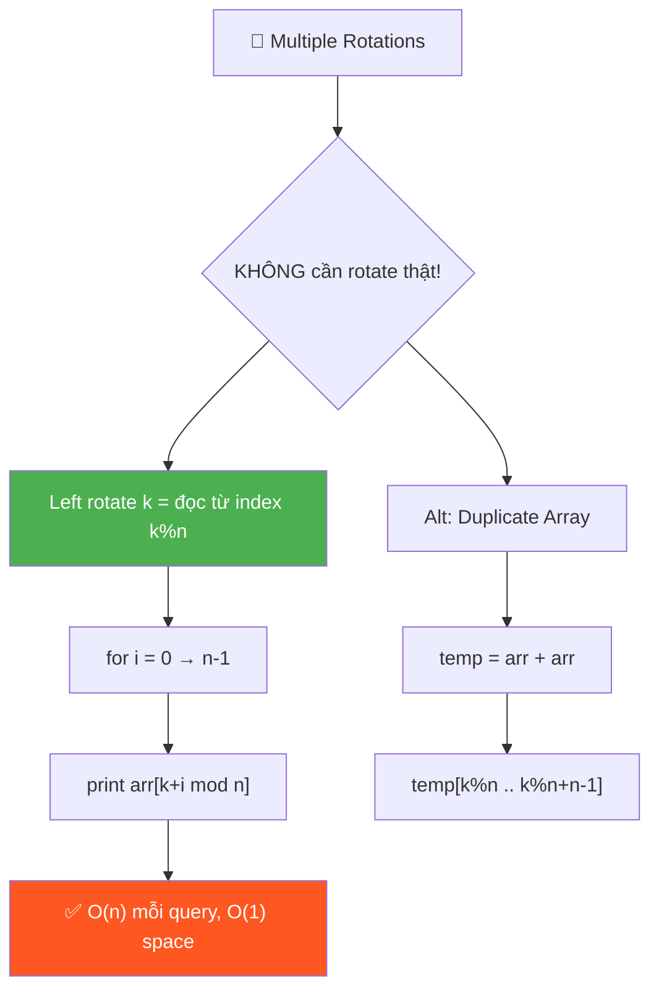
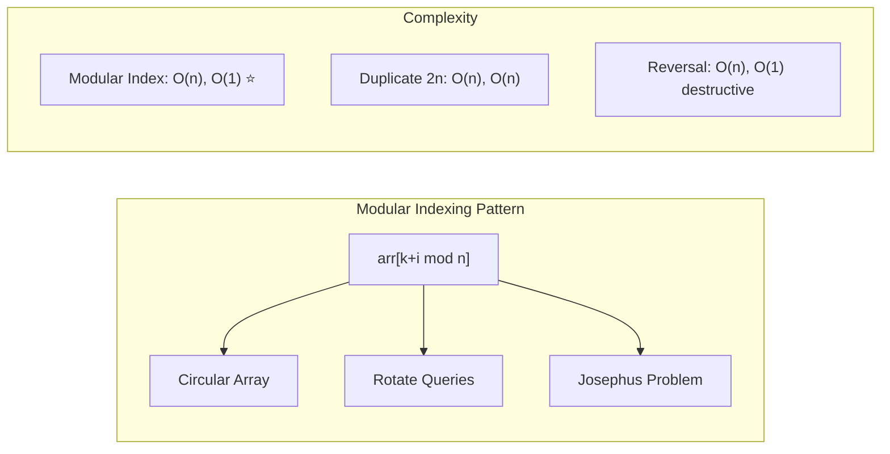

# 🔄 Multiple Left Rotations of Array — GfG (Easy)

> 📖 Code: [Multiple Left Rotations.js](./Multiple%20Left%20Rotations.js)





---

## R — Repeat & Clarify

🧠 *"Không cần thật sự rotate! Chỉ cần in từ index (k % n) → modular indexing!"*

> 🎙️ *"Given multiple rotation queries, print the rotated array for each query WITHOUT actually rotating."*

---

## E — Examples

```
arr = [1, 3, 5, 7, 9]

  k=1: [3, 5, 7, 9, 1]    ← bắt đầu từ index 1
  k=3: [7, 9, 1, 3, 5]    ← bắt đầu từ index 3
  k=4: [9, 1, 3, 5, 7]    ← bắt đầu từ index 4
  k=6: [3, 5, 7, 9, 1]    ← 6%5=1, bắt đầu từ index 1

  💡 Left rotate k = bắt đầu đọc từ index (k % n)!
```

---

## A — Approach

```
💡 KEY INSIGHT: KHÔNG CẦN ROTATE thật!

  Left rotate k = đọc arr bắt đầu từ index (k % n)
  
  Dùng MODULAR INDEXING:
    for i = 0 → n-1:
      print arr[(k + i) % n]

  → O(n) mỗi query, O(1) space, KHÔNG modify mảng gốc!
```

### Optional: Preprocess — 2n Array

```
Nếu nhiều queries: duplicate mảng → temp[2n]
  temp = [1, 3, 5, 7, 9, 1, 3, 5, 7, 9]

  k=3: print temp[3..7] = [7, 9, 1, 3, 5] ✅
  → Không cần modulo! Nhưng O(n) space
```

---

## C — Code

### Solution 1: Modular Index — O(1) space ✅

```javascript
function leftRotate(arr, k) {
  const n = arr.length;
  const result = [];

  for (let i = 0; i < n; i++) {
    result.push(arr[(k + i) % n]);
  }
  return result;
}

// Handle multiple queries
function multipleRotations(arr, queries) {
  for (const k of queries) {
    console.log(leftRotate(arr, k).join(' '));
  }
}
```

### Solution 2: Duplicate Array — O(n) space

```javascript
function multipleRotationsPreprocess(arr, queries) {
  const n = arr.length;
  const temp = [...arr, ...arr]; // duplicate!

  for (const k of queries) {
    const start = k % n;
    console.log(temp.slice(start, start + n).join(' '));
  }
}
```

### Trace: arr = [1, 3, 5, 7, 9], k = 3

```
  n = 5, k % n = 3

  Modular: i=0 → arr[3]=7, i=1 → arr[4]=9,
           i=2 → arr[0]=1, i=3 → arr[1]=3, i=4 → arr[2]=5
  → [7, 9, 1, 3, 5] ✅
```

---

## O — Optimize

```
                     Time/query  Space    Modify arr?
  ────────────────────────────────────────────────────
  Reversal Algo      O(n)        O(1)     ✅ YES (destructive!)
  Modular Index ✅   O(n)        O(1)     ❌ NO (read-only!)
  Duplicate Array    O(n)        O(n)     ❌ NO

  Modular tốt nhất cho MULTIPLE queries:
    → Không modify gốc → queries độc lập!
    → O(1) preprocessing, O(n) per query
```

---

## 🗣️ Interview Script

> 🎙️ *"Instead of actually rotating, I use modular indexing. Left rotate by k means reading from index k%n. For each position i, the element is arr[(k+i) % n]. This handles multiple queries efficiently without modifying the original array."*

### Pattern

```
  MODULAR INDEXING pattern:
  Bất kỳ bài "circular" → dùng % n!

    Circular Array/Buffer → index % size
    Rotate queries → (k + i) % n
    Josephus Problem → modular elimination
```
